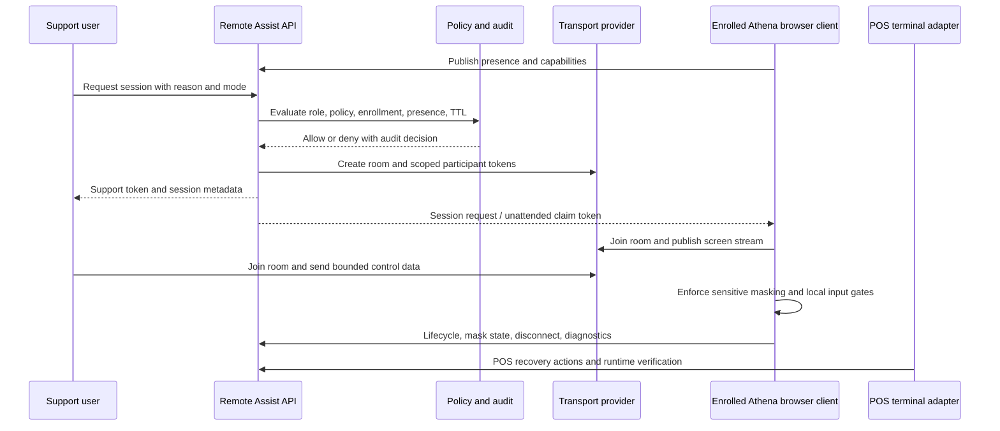
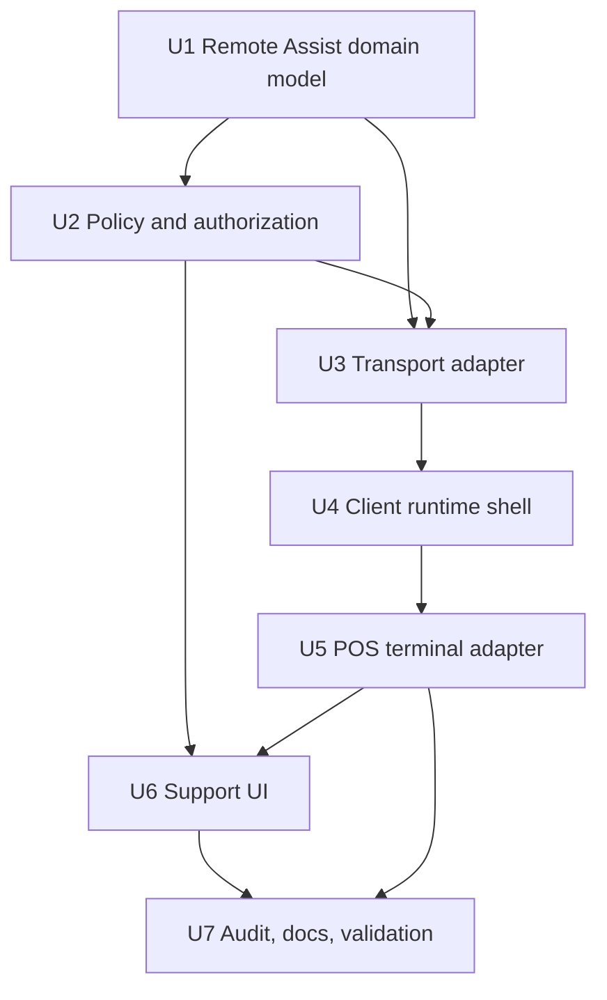

# feat: Add Athena Remote Assist Foundation

## Summary

Add a generic Remote Assist foundation for remotely viewing and controlling enrolled Athena browser clients, then connect POS terminals as the first adapter. The foundation owns enrollment, policy, session lifecycle, transport token issuance, bounded control permissions, audit, and safety controls; POS terminal health consumes it for M Supplies recovery without making the platform terminal-specific.

---

## Problem Frame

Athena can already diagnose and remotely recover some POS terminal-health conditions, but support still cannot operate the affected browser session when a field terminal needs hands-on guidance. The first case is the M Supplies terminal, but the durable primitive is broader: an authenticated Athena browser client should be able to enroll as remote-assistable, accept an attended or unattended support session under policy, and provide bounded view/control without bypassing the business authority gates of the surface it is running.

---

## Requirements

- R1. Athena can model a remote-assistable browser client independently of POS terminals, including organization, store, runtime type, runtime identity, display name, enrollment state, capabilities, and last presence.
- R2. Store/platform policy can allow unattended-by-default access for enrolled clients, require attended approval, or disable Remote Assist, with role gates and a short session time limit.
- R3. Authorized support users can start a Remote Assist session from a supported surface and receive a short-lived transport token only when policy, role, enrollment, and runtime presence allow it.
- R4. Enrolled browser clients can claim session requests, show a visible connected state, publish lifecycle/presence events, and accept bounded control input without exposing unrestricted browser/device administration.
- R5. The transport layer supports an unattended-safe in-app co-browsing stream for the Athena browser DOM plus low-latency control messages, with attended browser screen-share available only when the browser grants capture permission.
- R6. Remote Assist masks or blocks sensitive inputs and secrets, including staff PINs, recovery codes, payment credentials, sync secrets, staff proof material, raw customer/payment payloads, local storage editing, and devtools-style access.
- R7. Every session and privileged session event is auditable: actor, target client, mode, reason, start/end, policy decision, transport room, sensitive-mode state, and runtime-specific recovery actions.
- R8. POS terminals are the first adapter: Terminal Health can launch Remote Assist for an enrolled terminal, show POS-specific readiness/recovery context beside the session, and preserve terminal recovery verification through runtime check-ins.
- R9. Remote Assist must not bypass POS drawer authority, staff authority, terminal integrity, local command gates, Cash Controls review, Operations review, or any sale/payment/inventory/closeout authority.
- R10. Tests cover foundation policy/session lifecycle, transport adapter contracts, client runtime masking/control behavior, POS terminal integration, audit redaction, and M Supplies-shaped recovery handoff.

---

## Scope Boundaries

- This plan does not implement arbitrary desktop or operating-system remote administration.
- This plan does not directly mutate browser IndexedDB, local storage, staff proof, sync secrets, or payment/customer payloads from support controls.
- This plan does not replace the existing POS terminal recovery command queue; it wraps terminal recovery in a richer assisted-session workflow.
- This plan does not introduce a cashier-facing override for POS authority gates.
- This plan does not make every Athena route remote-assistable in v1. Only explicitly enrolled runtime adapters can participate.
- This plan does not rely on browser screen capture for unattended sessions, because browser capture APIs require local permission. Unattended v1 should use in-app co-browsing/session-replay style streaming of the Athena DOM and state.
- This plan does not require a custom WebRTC stack for media. A provider-backed or adapter-backed realtime transport is preferred over hand-rolled signaling/media infrastructure.
- This plan does not add fleet-wide automatic remediation or unattended browser launch on offline devices.

### Deferred to Follow-Up Work

- Remote Assist adapters for non-POS browser clients such as inventory/counting workstations or operations displays.
- Session recording retention and playback, if operations needs forensic review beyond structured audit events.
- Fleet-wide Remote Assist policy reporting and scheduled health remediation.
- Cross-store support-console workflow outside existing Athena admin/terminal surfaces.

---

## Context & Research

### Relevant Code and Patterns

- `packages/athena-webapp/convex/schema.ts` already defines POS terminal runtime and recovery tables; new Remote Assist tables should follow the same explicit schema/index style.
- `packages/athena-webapp/convex/pos/public/terminals.ts` exposes terminal health, runtime status, and terminal recovery command functions with store-scoped role checks and terminal sync-secret validation.
- `packages/athena-webapp/convex/pos/application/terminalRecovery/terminalCommandService.ts` models expiring, auditable, redacted terminal recovery commands; Remote Assist should reuse the same command-result and redaction posture rather than inventing a parallel unsafe command lane.
- `packages/athena-webapp/src/components/pos/terminals/POSTerminalDetailView.tsx` is the current Terminal Health detail launch point for support diagnosis and recovery.
- `packages/athena-webapp/src/components/pos/terminals/terminalHealthPresentation.ts` normalizes terminal-health and recovery copy, including secret-safe summaries.
- `packages/athena-webapp/src/lib/pos/infrastructure/local/usePosLocalSyncRuntime.ts` and `packages/athena-webapp/src/lib/pos/infrastructure/local/terminalRuntimeStatus.ts` are the terminal-side runtime reporting patterns that the POS adapter should extend.
- `packages/athena-webapp/convex/lib/athenaUserAuth.ts` currently distinguishes `full_admin` and `pos_only` organization roles; Remote Assist needs an explicit permission check rather than broadly treating all admin actions as remote-control permission.
- `packages/athena-webapp/convex/schemas/operations/operationalEvent.ts` is the existing operator-visible audit/event schema that can be used for support milestones when appropriate.
- `packages/athena-webapp/docs/agent/testing.md` requires targeted package tests, Convex audit/lint, TypeScript, build, harness review, and graph/harness updates for new Convex/UI surfaces.

### Institutional Learnings

- `docs/solutions/architecture/athena-pos-remote-terminal-health-recovery-2026-06-11.md` draws the critical boundary: browser-local repair must happen in the matching terminal runtime, and fresh runtime check-in is the verification source.
- `docs/solutions/architecture/athena-remote-assist-foundation-2026-06-11.md` captures the generic browser-client foundation, provider-neutral transport, unattended co-browsing boundary, sensitive-control restrictions, and POS authority invariants.
- `docs/solutions/architecture/athena-pos-terminal-health-visibility-2026-05-20.md` keeps terminal telemetry out of manager-review work and redacts terminal secrets/staff proof data from support evidence.
- `docs/solutions/architecture/athena-pos-terminal-runtime-review-actions-2026-05-28.md` routes terminal attention to existing POS Settings, POS Register, Cash Controls, or Open Work surfaces instead of creating an all-powerful terminal-management lane.
- `docs/solutions/architecture/athena-pos-hub-app-session-continuity-2026-06-02.md` warns not to collapse app-session recovery, terminal integrity, drawer authority, local command gates, and staff proof into one recovery shortcut.
- `docs/product-copy-tone.md` requires calm, restrained, operational copy and normalization of raw backend wording before it reaches operators.

### External References

- [MDN `getDisplayMedia`](https://developer.mozilla.org/en-US/docs/Web/API/MediaDevices/getDisplayMedia): browser screen capture requires browser-mediated user permission and produces a stream that can be transmitted over WebRTC.
- [MDN Screen Capture API guide](https://developer.mozilla.org/en-US/docs/Web/API/Screen_Capture_API/Using_Screen_Capture): screen capture is not universally baseline across all major browsers, so implementation needs capability detection and fallback states.
- [LiveKit screen sharing docs](https://docs.livekit.io/transport/media/screenshare/): LiveKit publishes screen share as a video track and supports browser SDK flows suitable for a remote-assist transport adapter.
- [LiveKit data packets docs](https://docs.livekit.io/transport/data/packets/): LiveKit supports participant-targeted realtime data messages, useful for bounded control-input events.
- [Twilio Video technical overview](https://www.twilio.com/docs/video/overview): Twilio-style video products split backend token/room management from frontend room participation, a useful architecture boundary even if Athena chooses another provider.
- [Twilio DataTrack API](https://www.twilio.com/docs/video/using-datatrack-api): data channels are suitable for low-latency messages and have payload/reliability limits that argue for compact control events rather than arbitrary remote commands.
- [rrweb](https://github.com/rrweb-io/rrweb): rrweb records DOM snapshots and mutations into a replayable event stream, which is closer to unattended browser co-browsing than permission-gated screen capture.
- [OWASP Access Control](https://owasp.org/www-community/Access_Control): least privilege should shape role checks, scoped permissions, and support-session capabilities.

---

## Key Technical Decisions

- Build Remote Assist as a generic browser-client foundation, not a POS terminal feature. POS terminals are the first adapter because they already have identity, runtime check-ins, terminal health, and an immediate M Supplies recovery need.
- Use an adapter boundary for transport. Athena should own authorization, session policy, audit, enrollment, and tokens; transport adapters should own realtime event delivery, optional attended media, and provider-specific token/room details.
- Split unattended co-browsing from attended screen sharing. Browser screen capture is permission-gated, so unattended default should stream a sanitized app-DOM/session-replay representation and bounded control events. Attended sessions may upgrade to browser screen share when a local user grants capture permission.
- Prefer a provider-backed realtime transport such as LiveKit data packets, Twilio DataTrack, or an rrweb-style event stream over hand-rolled signaling. The implementation should choose the provider with the smallest operational burden, but the app contract should be provider-agnostic.
- Model unattended-by-default as policy for enrolled clients, not as global support power. Store/platform policy, runtime enrollment, role permission, session reason, TTL, visible banner, and local disconnect remain mandatory.
- Treat support control input as bounded application input. Remote Assist can send pointer/keyboard/navigation gestures to an enrolled Athena runtime, but it cannot expose devtools, arbitrary storage editing, unrestricted file/device access, or direct local database mutation.
- Keep sensitive-entry masking in the runtime adapter. The foundation provides mask/block events and policy; each adapter marks sensitive UI regions and knows which actions must pause remote input or hide content.
- Audit structured events over raw recordings in v1. A later recording layer can be added, but v1 must at minimum persist policy decisions, lifecycle, control-mode changes, and privileged recovery triggers.
- Preserve POS authority invariants. A support user can drive the UI and trigger explicit recovery actions, but POS terminal integrity, drawer authority, staff authority, Cash Controls, and Operations remain the source of truth.

---

## Open Questions

### Resolved During Planning

- Should the foundation be coupled to POS terminals? No. It should model remote-assistable Athena browser clients, with POS terminals as the first adapter.
- Should unattended access be allowed? Yes, for enrolled clients by default, with store/platform policy overrides, visible session state, local disconnect, TTL, and audit.
- Should support be able to bypass POS sale blockers? No. Remote control operates the UI and support actions; it does not bypass POS authority gates.
- Should Athena build its own media/control transport? No. Plan for a provider-backed or adapter-backed transport and keep Athena's contract provider-neutral.

### Deferred to Implementation

- Final transport provider selection, after evaluating cost, self-hosting preference, cloud availability in Ghana/store networks, operational setup, and whether the provider fits unattended DOM co-browsing plus attended screen-share upgrade.
- Exact permission primitive for Remote Assist: whether it is a new organization role, an organization-member capability, or a support-only platform permission.
- Exact sensitive-region API shape for React components and whether it should be implemented as attributes, context, a wrapper component, or a small registry.
- Whether v1 includes screen recording or only structured audit events.
- Whether remote input should support all keyboard events in v1 or start with pointer/tap plus safe text input outside masked regions.

---

## Output Structure

    packages/athena-webapp/convex/remoteAssist/
      application/
      infrastructure/
      public.ts
    packages/athena-webapp/convex/schemas/remoteAssist/
      index.ts
      remoteAssistClient.ts
      remoteAssistSession.ts
    packages/athena-webapp/src/lib/remote-assist/
      client/
      transport/
      policy/
    packages/athena-webapp/src/components/remote-assist/

The tree is directional. The implementer may adjust exact filenames to match local seams, but the foundation should live outside `convex/pos` and `src/lib/pos` so POS remains an adapter rather than the owning abstraction.

---

## High-Level Technical Design

> *This illustrates the intended approach and is directional guidance for review, not implementation specification. The implementing agent should treat it as context, not code to reproduce.*

Remote Assist is a platform lifecycle wrapped around a provider transport. Unattended sessions should use sanitized in-app co-browsing rather than permission-gated browser screen capture; attended sessions can optionally upgrade to screen share. The POS terminal adapter contributes terminal identity, health context, sensitive-region rules, and recovery actions, but the session contract stays generic enough for future browser-client adapters.

---

## Implementation Units

- U1. **Define Remote Assist domain model**

**Goal:** Add generic Convex schemas and application types for enrolled remote-assistable Athena browser clients, sessions, policy decisions, lifecycle events, and capability metadata.

**Requirements:** R1, R2, R3, R4, R7.

**Dependencies:** None.

**Files:**
- Create: `packages/athena-webapp/convex/schemas/remoteAssist/index.ts`
- Create: `packages/athena-webapp/convex/schemas/remoteAssist/remoteAssistClient.ts`
- Create: `packages/athena-webapp/convex/schemas/remoteAssist/remoteAssistSession.ts`
- Modify: `packages/athena-webapp/convex/schema.ts`
- Create: `packages/athena-webapp/convex/remoteAssist/application/types.ts`
- Create: `packages/athena-webapp/convex/remoteAssist/infrastructure/remoteAssistRepository.ts`
- Test: `packages/athena-webapp/convex/remoteAssist/application/types.test.ts`
- Test: `packages/athena-webapp/convex/remoteAssist/infrastructure/remoteAssistRepository.test.ts`

**Approach:**
- Model `remoteAssistClient` separately from `posTerminal`: organization, optional store, runtime type, runtime identity, display name, enrollment state, unattended policy override, capabilities, last presence, and redacted browser info.
- Model `remoteAssistSession`: support actor, target client, requested mode, effective mode, reason, status, start/end timestamps, expiresAt, transport room id, provider, active sensitive-mode state, and denial/termination reason.
- Model `remoteAssistSessionEvent` or an equivalent lifecycle/audit stream for policy decisions, participant joins/leaves, control mode changes, sensitive-region state, local disconnect, and adapter-reported milestones.
- Store no provider secrets, screen media, staff proof material, sync secrets, PINs, raw local payloads, customer/payment bodies, or arbitrary keystroke logs.
- Keep POS-specific fields out of foundation schemas except as opaque adapter references.

**Execution note:** Implement the schema and redaction policy test-first because this feature creates a privileged access surface.

**Patterns to follow:**
- `packages/athena-webapp/convex/schemas/pos/posTerminalRecovery.ts` for expiring command lifecycle and redacted audit fields.
- `packages/athena-webapp/convex/schema.ts` table/index style for POS runtime and recovery tables.
- `packages/athena-webapp/shared/commandResult.ts` for browser-safe command results.

**Test scenarios:**
- Happy path: an enrolled POS terminal adapter client can be represented as a generic remote-assist client with POS metadata only in adapter fields.
- Happy path: a session stores actor, target, mode, TTL, policy decision, and transport room id without provider credentials.
- Edge case: a client without store scope can be represented only when runtime type explicitly supports organization-level scope.
- Error path: secret-like fields in client metadata, session context, or lifecycle events are rejected or redacted.
- Error path: expired sessions cannot transition back to active.

**Verification:**
- The foundation schema can represent Remote Assist enrollment and lifecycle without importing POS terminal domain types.

---

- U2. **Implement policy, permission, and session lifecycle**

**Goal:** Add Remote Assist public functions that evaluate role/policy/enrollment, start attended or unattended sessions, end sessions, and expose safe session state to support users and enrolled runtimes.

**Requirements:** R2, R3, R4, R6, R7.

**Dependencies:** U1.

**Files:**
- Create: `packages/athena-webapp/convex/remoteAssist/application/policy.ts`
- Create: `packages/athena-webapp/convex/remoteAssist/application/sessionService.ts`
- Create: `packages/athena-webapp/convex/remoteAssist/public.ts`
- Modify: `packages/athena-webapp/convex/_generated/api.d.ts` *(generated through Convex dev when available)*
- Test: `packages/athena-webapp/convex/remoteAssist/application/policy.test.ts`
- Test: `packages/athena-webapp/convex/remoteAssist/application/sessionService.test.ts`
- Test: `packages/athena-webapp/convex/remoteAssist/public.test.ts`

**Approach:**
- Add policy states: unattended allowed, attended required, disabled, and platform kill switch.
- Require a Remote Assist permission distinct from generic POS use. Until a full permission system exists, map it conservatively to `full_admin` plus an explicit support/admin policy check.
- Require a reason, active enrollment, fresh enough presence, allowed runtime type, and short TTL before issuing a session.
- For unattended mode, allow the runtime to claim only if it is enrolled, online, and scoped to the requested client identity. For attended mode, require an explicit local approval event.
- End sessions on support end, local disconnect, TTL expiry, policy revocation, runtime identity mismatch, or transport failure.
- Return command-result errors with normalized copy and no internal policy details.

**Execution note:** Characterize current `requireOrganizationMemberRoleWithCtx` use before adding new Remote Assist permission helpers.

**Patterns to follow:**
- `packages/athena-webapp/convex/lib/athenaUserAuth.ts` for current Athena user and organization-member checks.
- `packages/athena-webapp/convex/pos/public/terminals.ts` for store-scoped full-admin support mutations and POS terminal runtime claims.
- `packages/athena-webapp/convex/pos/application/terminalRecovery/terminalCommandService.ts` for TTL, status transition, and scoped claim patterns.

**Test scenarios:**
- Happy path: a full-admin support user starts an unattended session for an enrolled online POS terminal client under store policy.
- Happy path: attended-required policy creates a pending attended session and does not issue support control capability until local approval arrives.
- Edge case: unattended default is overridden by store policy requiring attended approval.
- Edge case: stale presence denies session start with safe operator copy.
- Error path: `pos_only` user cannot start a support-control session unless future policy explicitly grants that permission.
- Error path: policy disabled or platform kill switch denies token issuance and writes an audit decision.
- Integration: ending a session marks the session ended and causes runtime claim/control queries to return no active session.

**Verification:**
- Session lifecycle and policy decisions are deterministic, audited, and independent of POS terminal recovery implementation.

---

- U3. **Add provider-neutral co-browsing and transport adapter**

**Goal:** Create a server/client transport boundary for short-lived participant tokens, unattended-safe app-DOM co-browsing events, optional attended screen-share participation, and low-latency bounded control events.

**Requirements:** R3, R4, R5, R6, R7.

**Dependencies:** U1, U2.

**Files:**
- Create: `packages/athena-webapp/convex/remoteAssist/infrastructure/transportAdapter.ts`
- Create: `packages/athena-webapp/convex/remoteAssist/infrastructure/liveKitTransportAdapter.ts` *(or provider-specific equivalent selected during implementation)*
- Create: `packages/athena-webapp/src/lib/remote-assist/transport/types.ts`
- Create: `packages/athena-webapp/src/lib/remote-assist/transport/RemoteAssistTransportClient.ts`
- Create: `packages/athena-webapp/src/lib/remote-assist/transport/controlEvents.ts`
- Create: `packages/athena-webapp/src/lib/remote-assist/transport/cobrowsingEvents.ts`
- Test: `packages/athena-webapp/convex/remoteAssist/infrastructure/transportAdapter.test.ts`
- Test: `packages/athena-webapp/src/lib/remote-assist/transport/controlEvents.test.ts`
- Test: `packages/athena-webapp/src/lib/remote-assist/transport/cobrowsingEvents.test.ts`
- Test: `packages/athena-webapp/src/lib/remote-assist/transport/RemoteAssistTransportClient.test.ts`

**Approach:**
- Define a provider-neutral server contract: create room, issue support token, issue runtime token, revoke/end room, and map provider failures into safe session errors.
- Define a provider-neutral browser contract: join, leave, publish sanitized co-browsing snapshots/mutations, optionally publish attended screen/tab stream after local capture grant, subscribe to support control messages, send runtime lifecycle messages, and report transport health.
- Treat control events as compact, allow-listed messages: pointer move/down/up, click/tap, wheel, safe key, safe text, focus request, heartbeat, and pause/resume control. Do not transmit arbitrary script, storage mutation, or raw command execution.
- Capability-detect co-browsing and screen-capture support separately. If `getDisplayMedia` is unavailable or not granted, unattended co-browsing can continue; if co-browsing transport fails, move the session to a recoverable failed state with audit.
- Keep provider credentials in server environment only; browser receives scoped short-lived tokens.

**Execution note:** Start with contract tests that pass against a fake transport adapter before wiring a real provider SDK.

**Patterns to follow:**
- `packages/athena-webapp/convex/services/paystackService.ts` and other service adapters for server-owned external credentials and safe error mapping.
- `packages/athena-webapp/src/lib/errors/runCommand.ts` for client-side expected/unexpected failure normalization.
- rrweb-style DOM snapshot/mutation streams for unattended browser co-browsing, with Athena-specific redaction and sensitive-region filtering before events leave the runtime.

**Test scenarios:**
- Happy path: server adapter creates a room and returns distinct support/runtime participant tokens scoped to one session.
- Happy path: client transport emits sanitized co-browsing snapshots/mutations plus bounded pointer and key events in the expected normalized shape.
- Happy path: attended session upgrades to screen share only after local browser capture permission is granted.
- Edge case: unsupported screen capture does not block unattended co-browsing mode.
- Edge case: sensitive DOM regions are omitted or masked before co-browsing events leave the runtime.
- Edge case: transport reconnect preserves session identity but does not extend TTL without server approval.
- Error path: provider room creation failure records an audited failure and returns safe copy.
- Error path: oversized or unsupported control payloads are rejected before they reach the runtime adapter.

**Verification:**
- The transport layer can be swapped without changing Remote Assist policy/session code or POS terminal code.

---

- U4. **Build browser runtime shell and sensitive-control guardrails**

**Goal:** Add React/runtime infrastructure that lets an enrolled Athena browser client publish presence, join a Remote Assist session, display visible support state, enforce sensitive masks, and apply bounded control events.

**Requirements:** R1, R4, R5, R6, R7.

**Dependencies:** U2, U3.

**Files:**
- Create: `packages/athena-webapp/src/lib/remote-assist/client/RemoteAssistRuntimeProvider.tsx`
- Create: `packages/athena-webapp/src/lib/remote-assist/client/useRemoteAssistRuntime.ts`
- Create: `packages/athena-webapp/src/lib/remote-assist/client/sensitiveRegions.ts`
- Create: `packages/athena-webapp/src/components/remote-assist/RemoteAssistStatusBanner.tsx`
- Create: `packages/athena-webapp/src/components/remote-assist/RemoteAssistLocalApprovalDialog.tsx`
- Modify: `packages/athena-webapp/src/routes/_authed.tsx`
- Test: `packages/athena-webapp/src/lib/remote-assist/client/RemoteAssistRuntimeProvider.test.tsx`
- Test: `packages/athena-webapp/src/lib/remote-assist/client/sensitiveRegions.test.ts`
- Test: `packages/athena-webapp/src/components/remote-assist/RemoteAssistStatusBanner.test.tsx`
- Test: `packages/athena-webapp/src/components/remote-assist/RemoteAssistLocalApprovalDialog.test.tsx`
- Test: `packages/athena-webapp/src/routes/_authed.test.tsx`

**Approach:**
- Mount a Remote Assist runtime provider in the authenticated shell, but keep it inert unless an adapter registers a runtime identity and capabilities.
- Publish presence at a conservative interval and on lifecycle changes, following the existing best-effort runtime telemetry posture.
- Render a persistent visible banner while a support session is active; include local disconnect.
- Provide a local approval dialog for attended mode.
- Implement sensitive regions as an adapter-usable API that can hide/mask display and block remote input while sensitive UI is focused or active.
- Apply control events through DOM-safe input dispatch only when the target is not masked and the active adapter allows the event type.

**Execution note:** Add characterization coverage around `_authed` fullscreen/POS shell behavior before mounting the provider, because POS register routes already use special shell/fullscreen behavior.

**Patterns to follow:**
- `packages/athena-webapp/src/routes/_authed.tsx` for authenticated shell/fullscreen wiring and POS route behavior.
- `packages/athena-webapp/src/contexts/ManagerElevationContext.tsx` for app-wide privileged-session context behavior.
- `packages/athena-webapp/src/lib/errors/presentUnexpectedErrorToast.ts` for safe unexpected failure handling.

**Test scenarios:**
- Happy path: a registered runtime publishes presence and shows no banner when no session is active.
- Happy path: unattended session claim shows a connected banner with local disconnect.
- Happy path: attended session request shows the approval dialog before control starts.
- Edge case: POS fullscreen route still renders without app header overlap when Remote Assist banner is active.
- Edge case: focusing a sensitive input pauses remote control and marks the session sensitive in lifecycle events.
- Error path: transport failure ends or pauses the session with safe copy and audit event.
- Error path: unsupported control event is ignored and reported without executing arbitrary code.

**Verification:**
- Remote Assist runtime support is available to adapters without changing route behavior for non-enrolled clients.

---

- U5. **Adapt POS terminals as the first Remote Assist runtime**

**Goal:** Connect POS terminal identity, presence, sensitive-region rules, Terminal Health launch, and existing terminal recovery actions to the generic Remote Assist foundation.

**Requirements:** R1, R4, R6, R8, R9, R10.

**Dependencies:** U1, U2, U4.

**Files:**
- Create: `packages/athena-webapp/src/lib/remote-assist/adapters/posTerminalRemoteAssist.ts`
- Modify: `packages/athena-webapp/src/lib/pos/infrastructure/local/usePosLocalSyncRuntime.ts`
- Modify: `packages/athena-webapp/src/lib/pos/infrastructure/local/terminalRuntimeStatus.ts`
- Modify: `packages/athena-webapp/convex/pos/public/terminals.ts`
- Modify: `packages/athena-webapp/src/components/pos/CashierAuthDialog.tsx`
- Modify: `packages/athena-webapp/src/components/pos/terminal-setup/POSTerminalSetupView.tsx`
- Test: `packages/athena-webapp/src/lib/remote-assist/adapters/posTerminalRemoteAssist.test.ts`
- Test: `packages/athena-webapp/src/lib/pos/infrastructure/local/usePosLocalSyncRuntime.test.ts`
- Test: `packages/athena-webapp/src/lib/pos/infrastructure/local/terminalRuntimeStatus.test.ts`
- Test: `packages/athena-webapp/convex/pos/public/terminals.test.ts`
- Test: `packages/athena-webapp/src/components/pos/CashierAuthDialog.test.tsx`
- Test: `packages/athena-webapp/src/components/pos/terminal-setup/POSTerminalSetupView.test.tsx`

**Approach:**
- Enroll active POS terminals as `runtimeType: "pos_terminal"` Remote Assist clients using terminal id, store id, register number, display name, transaction capability, and current runtime freshness.
- Let terminal runtime presence feed both existing terminal health and generic Remote Assist presence without duplicating health semantics.
- Mark PIN/recovery-code/staff-proof entry and any payment/provider credential surfaces as sensitive regions that mask screen/control.
- Keep existing `posTerminalRecoveryCommand` flows for retry sync, refresh snapshots, staff authority refresh, and drawer-authority recovery. Remote Assist can launch or observe those flows, but completion still depends on terminal recovery command acknowledgement plus fresh runtime verification.
- Ensure support control cannot directly clear terminal integrity, drawer authority, local event history, or staff authority outside explicit terminal recovery commands.

**Execution note:** Use the M Supplies-shaped terminal case from the existing terminal recovery tests as the adapter integration scenario.

**Patterns to follow:**
- Existing terminal recovery command functions in `packages/athena-webapp/convex/pos/public/terminals.ts`.
- Runtime check-in and verification logic in `packages/athena-webapp/src/lib/pos/infrastructure/local/usePosLocalSyncRuntime.ts`.
- POS terminal recovery presentation in `packages/athena-webapp/src/components/pos/terminals/terminalHealthPresentation.ts`.

**Test scenarios:**
- Happy path: active POS terminal runtime registers as a Remote Assist client with unattended capability.
- Happy path: Terminal Health can resolve a POS terminal to its Remote Assist client enrollment.
- Happy path: a connected Remote Assist session can trigger an existing `retry_sync` terminal recovery command and waits for runtime verification.
- Edge case: terminal is online but not enrolled; Terminal Health shows enrollment/setup action rather than a connect button.
- Edge case: terminal runtime is stale; support cannot start unattended control until fresh presence returns.
- Error path: staff PIN dialog masks screen/control and does not leak entered digits or proof material.
- Error path: support attempts a POS authority-bypassing action and the POS command gate still blocks it.
- Integration: M Supplies-shaped terminal state can connect remotely, inspect blockers, trigger safe recovery actions, and remains not `able_to_transact_now` until POS runtime reports the required authority state.

**Verification:**
- POS is a consumer of Remote Assist, not the owner of the Remote Assist foundation, and existing POS recovery authority boundaries still hold.

---

- U6. **Add support UI for sessions and Terminal Health launch**

**Goal:** Add operator-facing Remote Assist controls in Terminal Health and generic session UI components that can later be reused by other runtime adapters.

**Requirements:** R3, R4, R6, R7, R8, R9.

**Dependencies:** U2, U3, U4, U5.

**Files:**
- Create: `packages/athena-webapp/src/components/remote-assist/RemoteAssistSessionPanel.tsx`
- Create: `packages/athena-webapp/src/components/remote-assist/RemoteAssistConnectionControls.tsx`
- Create: `packages/athena-webapp/src/components/remote-assist/RemoteAssistAuditTimeline.tsx`
- Modify: `packages/athena-webapp/src/components/pos/terminals/POSTerminalDetailView.tsx`
- Modify: `packages/athena-webapp/src/components/pos/terminals/terminalHealthPresentation.ts`
- Test: `packages/athena-webapp/src/components/remote-assist/RemoteAssistSessionPanel.test.tsx`
- Test: `packages/athena-webapp/src/components/remote-assist/RemoteAssistConnectionControls.test.tsx`
- Test: `packages/athena-webapp/src/components/remote-assist/RemoteAssistAuditTimeline.test.tsx`
- Test: `packages/athena-webapp/src/components/pos/terminals/POSTerminalDetailView.test.tsx`

**Approach:**
- Add a Remote Assist panel to Terminal Health detail when a POS terminal has enrollment or can be enrolled.
- Show clear status: unavailable, enrollable, online, stale, unattended allowed, attended required, connected, paused for sensitive input, ended, or failed.
- Require a reason before starting support control.
- Keep POS recovery controls adjacent to, but separate from, generic session controls.
- Use calm operational copy and avoid raw backend/provider errors.
- Include audit timeline snippets so support can see who connected, when, why, and what privileged recovery action was triggered.

**Execution note:** Treat this as an operational UI, not a marketing surface; reuse existing Terminal Health rail/panel density.

**Patterns to follow:**
- `packages/athena-webapp/src/components/pos/terminals/POSTerminalDetailView.tsx` for existing terminal support panels.
- `packages/athena-webapp/src/components/pos/terminals/terminalHealthPresentation.ts` for normalized support-safe copy.
- `docs/product-copy-tone.md` for operational wording.

**Test scenarios:**
- Happy path: support sees "Start Remote Assist" for an enrolled online terminal and must enter a reason before connection starts.
- Happy path: connected session shows visible status, end control, sensitive-mode state, and audit timeline.
- Edge case: policy requires attended approval, so the support UI shows pending local approval instead of claiming control.
- Edge case: stale terminal presence disables unattended connection and points to terminal-side reconnection.
- Error path: transport/provider failure renders safe inline copy and leaves POS recovery controls available when appropriate.
- Integration: Terminal Health still renders existing identity, check-in, sync, conflict, and recovery panels with Remote Assist added.

**Verification:**
- Support can launch and monitor Remote Assist from Terminal Health without confusing remote control with POS authority override.

---

- U7. **Wire audit, validation, docs, and operational controls**

**Goal:** Make Remote Assist reviewable, testable, and operable before enabling unattended default for POS terminals.

**Requirements:** R2, R6, R7, R9, R10.

**Dependencies:** U1, U2, U3, U4, U5, U6.

**Files:**
- Create: `docs/solutions/architecture/athena-remote-assist-foundation-2026-06-11.md`
- Modify: `packages/athena-webapp/docs/agent/testing.md`
- Modify: `packages/athena-webapp/docs/agent/validation-map.json` *(generated through harness registry)*
- Modify: `packages/athena-webapp/docs/agent/validation-guide.md` *(generated through harness registry)*
- Modify: `scripts/harness-app-registry.ts`
- Test: `packages/athena-webapp/convex/remoteAssist/remoteAssistAudit.test.ts`
- Test: `packages/athena-webapp/src/components/remote-assist/remoteAssistEndToEnd.test.tsx`

**Approach:**
- Add structured audit assertions covering session start/end, denial, attended approval, unattended claim, sensitive-mode changes, local disconnect, TTL expiry, and POS recovery action launch.
- Add validation-map coverage for Remote Assist backend, runtime shell, transport boundary, and POS Terminal Health integration.
- Document the security boundary: support controls the Athena app session, not the unrestricted device; Remote Assist does not bypass local business authority gates.
- Add operational notes for provider credentials, kill switch, default unattended policy, session TTL, and rollout starting with the M Supplies terminal.
- Record a solution note because this introduces a privileged support-control capability and a reusable browser-client foundation.

**Execution note:** Treat `bun run harness:inferential-review` findings as blocking; privileged support surfaces need the inferential review pass before PR handoff.

**Patterns to follow:**
- `docs/solutions/architecture/athena-pos-remote-terminal-health-recovery-2026-06-11.md` for boundary-focused solution documentation.
- `packages/athena-webapp/docs/agent/testing.md` for validation-map and generated harness guidance.
- `scripts/harness-app-registry.ts` for route/surface coverage updates.

**Test scenarios:**
- Happy path: audit rows/events exist for a successful unattended POS terminal assist session.
- Happy path: local disconnect ends session and records actor/source.
- Edge case: sensitive mode starts and ends around PIN entry without recording the PIN or raw field value.
- Error path: denied policy decision records only safe denial reason.
- Integration: validation-map includes Remote Assist backend, runtime, transport, and Terminal Health surfaces.

**Verification:**
- The plan's implementation has durable validation coverage, a solution note, and operational controls suitable for a privileged remote-support feature.

---

## System-Wide Impact

- **Interaction graph:** Remote Assist adds a new cross-cutting path from authenticated shell to Convex session state, provider transport, runtime presence, and POS Terminal Health. It must stay provider-neutral and adapter-based to avoid POS ownership of the foundation.
- **Error propagation:** Provider, policy, runtime, and adapter failures should return safe `CommandResult` or inline UI states. Raw provider/backend errors should not reach support or terminal operators.
- **State lifecycle risks:** Sessions need strict TTL, ending semantics, transport revocation, stale presence handling, local disconnect, and policy revocation. Expired sessions must not be restartable without a new policy decision.
- **API surface parity:** Support-facing functions and runtime-facing functions are distinct. Support starts/ends sessions; runtime claims/joins/reports lifecycle. They must not share a broad mutation that can be called with the wrong authority.
- **Integration coverage:** Unit tests alone will not prove the full loop. The implementation needs at least one browser-level or harness scenario proving Terminal Health launch, runtime banner, sensitive masking, and session end behavior.
- **Unchanged invariants:** POS terminal recovery command verification remains runtime-check-in based; Cash Controls and Operations remain owners for reconciliation/review; local POS command gates remain authoritative.

---

## Risks & Dependencies

| Risk | Mitigation |
|------|------------|
| Remote control becomes an unsafe admin bypass | Use least-privilege Remote Assist permission, bounded input events, sensitive masking, explicit recovery commands, and no direct storage mutation. |
| POS terminal recovery is duplicated in the foundation | Keep POS recovery in the POS adapter and let Remote Assist provide session/control lifecycle only. |
| Provider lock-in leaks through app code | Define provider-neutral transport interfaces and isolate provider SDK/API usage in transport adapter files. |
| Browser capture support varies by device/browser | Do not make unattended mode depend on screen capture; use sanitized co-browsing by default and capability-detect attended screen-share upgrade. |
| Unattended default creates trust concerns | Require enrollment, visible banner, local disconnect, reason, TTL, store/platform policy override, and audit. |
| Sensitive values leak through stream or audit | Mark sensitive UI regions, pause/mask stream/control during sensitive entry, reject secret-like audit payloads, and test PIN/proof/payment redaction. |
| Session tokens outlive policy | Keep tokens short-lived, tie them to session id/client id, revoke on end/expiry where provider supports it, and require server-side active-session checks for privileged actions. |

---

## Documentation / Operational Notes

- Add provider credential setup to Athena deployment docs once the transport provider is selected.
- Add a Remote Assist kill switch and default POS rollout note before enabling unattended support in production.
- Start rollout with the M Supplies POS terminal and verify: connect, inspect, trigger safe POS recovery, observe fresh runtime verification, end session, and confirm audit.
- Keep support copy operational: "Remote support connected," "Control paused while sensitive information is entered," and "Session ended."
- Run `bun run graphify:rebuild` after implementation changes code files, per repo instruction.

---

## Alternative Approaches Considered

- **Terminal-only remote control:** Rejected because it couples the foundation to the POS terminal domain and would have to be unwound for other Athena browser clients.
- **Remote recovery actions only:** Rejected for this request because it does not let support actually inspect and guide the terminal browser session.
- **Full device remote desktop:** Rejected for v1 because Athena runs in the browser and should not own unrestricted OS/device administration.
- **Screen-share-only transport:** Rejected for unattended default because browser screen capture requires local permission and is not baseline everywhere. Use sanitized in-app co-browsing for unattended sessions, with attended screen-share as an optional upgrade.
- **Hand-rolled WebRTC signaling/media stack:** Rejected for v1 because established providers already solve room/token/media/data transport; Athena's harder problem is policy, audit, masking, co-browsing redaction, and adapter safety.

---

## Success Metrics

- Support can start an unattended Remote Assist session for an enrolled POS terminal from Terminal Health using in-app co-browsing without requiring a local browser capture prompt.
- The terminal shows a visible active-session state and can disconnect locally.
- Sensitive POS inputs are masked or block remote control.
- A M Supplies-shaped recovery flow can be inspected remotely without bypassing POS authority gates.
- Session lifecycle and privileged actions are visible in structured audit.
- Non-POS Athena routes remain unaffected unless they explicitly register a Remote Assist adapter.

---

## Sources & References

- Related plan: [docs/plans/2026-06-11-001-feat-pos-remote-terminal-health-plan.md](2026-06-11-001-feat-pos-remote-terminal-health-plan.md)
- Related solution: [docs/solutions/architecture/athena-remote-assist-foundation-2026-06-11.md](../solutions/architecture/athena-remote-assist-foundation-2026-06-11.md)
- Related solution: [docs/solutions/architecture/athena-pos-remote-terminal-health-recovery-2026-06-11.md](../solutions/architecture/athena-pos-remote-terminal-health-recovery-2026-06-11.md)
- Related solution: [docs/solutions/architecture/athena-pos-terminal-health-visibility-2026-05-20.md](../solutions/architecture/athena-pos-terminal-health-visibility-2026-05-20.md)
- Product copy: [docs/product-copy-tone.md](../product-copy-tone.md)
- MDN: [MediaDevices.getDisplayMedia](https://developer.mozilla.org/en-US/docs/Web/API/MediaDevices/getDisplayMedia)
- MDN: [Using the Screen Capture API](https://developer.mozilla.org/en-US/docs/Web/API/Screen_Capture_API/Using_Screen_Capture)
- LiveKit: [Screen sharing](https://docs.livekit.io/transport/media/screenshare/)
- LiveKit: [Data packets](https://docs.livekit.io/transport/data/packets/)
- Twilio: [Video technical overview](https://www.twilio.com/docs/video/overview)
- Twilio: [DataTrack API](https://www.twilio.com/docs/video/using-datatrack-api)
- rrweb: [Record and replay the web](https://github.com/rrweb-io/rrweb)
- OWASP: [Access Control](https://owasp.org/www-community/Access_Control)
