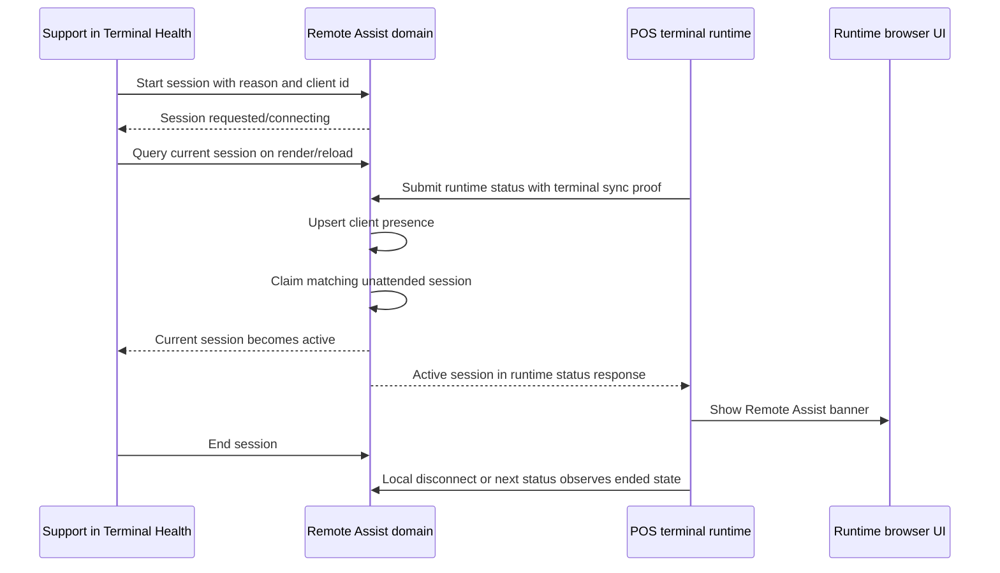
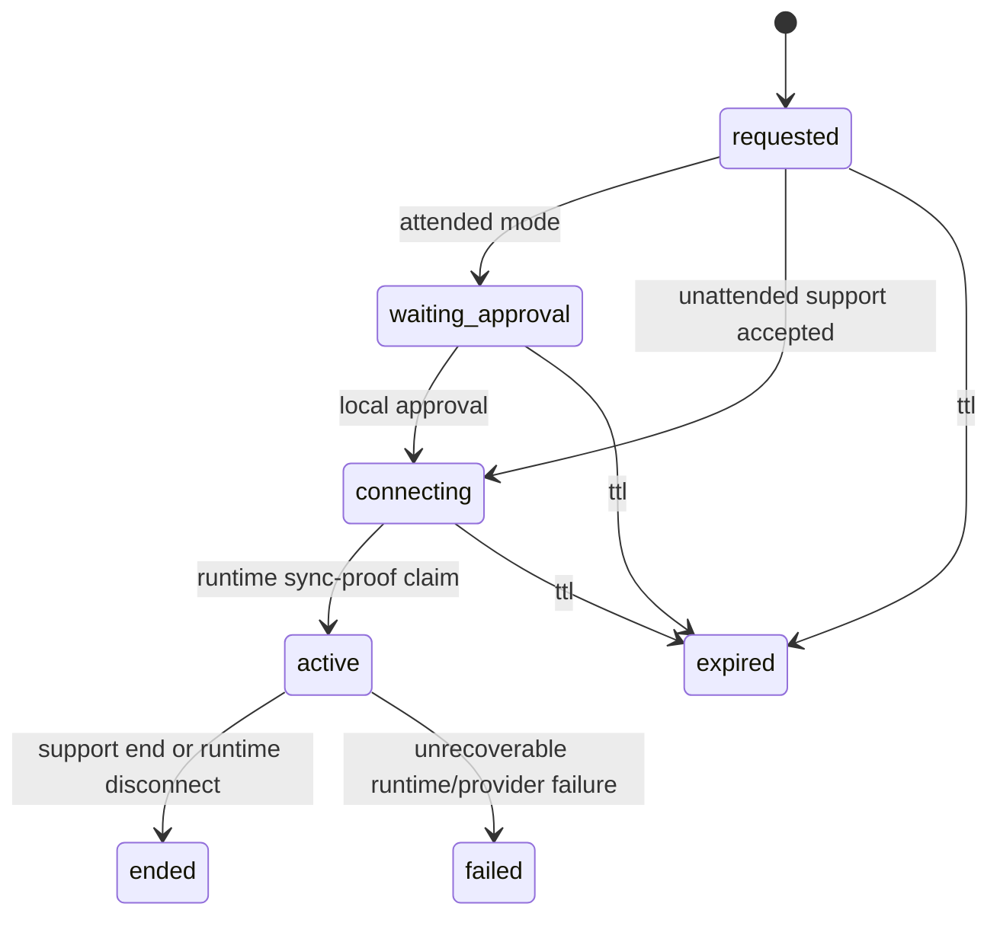

# feat: Complete Remote Assist Live Session Flow

## Summary

Close the gap after a support user clicks **Start session** from POS Terminal Health. The existing foundation can enroll a browser client, create a Remote Assist session, and mark the support request accepted, but the visible flow still stops at `connecting`. This delivery adds the missing runtime claim path, reload-safe session hydration, visible live assist state, runtime-side presence/disconnect controls, and the first provider-neutral co-browse/control contract.

POS terminals remain the first adapter. Remote Assist stays a generic browser-client foundation.

## Goals

- A support reload keeps the accepted/active Remote Assist session visible instead of resetting the screen.
- A POS terminal runtime claims a pending unattended session only through the existing terminal sync-proof check-in path.
- The support surface moves from `connecting` to an active live assist state when the runtime joins.
- The runtime browser shows a visible Remote Assist banner and can disconnect locally.
- The implementation creates the bounded co-browse/control contract needed for the next richer live controls without adding desktop administration, raw screen capture, or POS authority shortcuts.

## Non-Goals

- No arbitrary desktop, shell, browser devtools, file system, extension API, clipboard scraping, localStorage mutation, IndexedDB mutation, or raw network replay.
- No unattended `getDisplayMedia` screen capture. Unattended mode uses sanitized in-app events and bounded app-level control intents.
- No support-side bypass of terminal integrity, drawer authority, staff authority, manager proof, Cash Controls, Operations review, payment authority, inventory authority, closeout authority, or reconciliation ownership.
- No new Remote Assist dashboard. POS Terminal Health remains the first launch and support surface.
- No non-POS adapters in this batch.

## Current State

- `convex/remoteAssist/application/sessionService.ts` has the domain services for start, runtime claim, attended approval, and end.
- `convex/remoteAssist/public.ts` exposes support start/end and client lookup, but no reload-safe current-session query.
- `convex/pos/public/terminals.ts` already validates POS terminal runtime status with store, terminal, and sync-secret proof, then upserts Remote Assist client presence.
- `POSTerminalDetailView.tsx` can start a support request, but the UI only shows a transient requested state.
- `RemoteAssistRuntimeShell.tsx` exists, but it is not connected to hydrated backend session state.
- `guardrails.ts` has bounded key/pointer validation and sensitive-region primitives, but no transport-facing live assist DTO.

## Requirements

### R1. Reload-Safe Support Hydration

Terminal Health must query the current non-terminal Remote Assist session for the selected client and render it after reload. If a support user starts a session, reloads, or another authorized support user opens the same terminal, the UI must show the actual backend state: `requested`, `connecting`, `active`, `waiting_approval`, `ended`, `expired`, or `failed`.

### R2. Runtime Claim Through Existing POS Proof

For POS terminals, runtime claim must happen only after successful terminal status submission using the existing terminal sync-secret proof path. A support-side mutation must not be able to impersonate runtime claim. Wrong store, wrong terminal, wrong client, expired session, unsupported attended approval, or stale runtime presence must fail closed.

### R3. Visible Support Live Assist Surface

After runtime claim, Terminal Health must replace the dead-end `connecting` state with an active support panel showing runtime joined state, mode, client, freshness, local disconnect availability, and an explicit end-session action. The panel must be useful even before richer co-browse frames arrive.

### R4. Visible Runtime State

The POS browser must show a Remote Assist runtime banner while a session is active or waiting for attended approval. It must state that support is connected/requesting access and expose a local disconnect action. Disconnect must be idempotent and audited.

### R5. Provider-Neutral Live Assist Contract

Add the first typed contract for browser-client live assist transport:

- sanitized co-browse frame metadata,
- runtime route and viewport state,
- sensitive-region state,
- bounded support control intent,
- control acceptance/rejection result,
- participant heartbeat/disconnect state.

The contract can be backed by Convex polling/events in this batch, but must not bind domain policy to a specific vendor. LiveKit-style rooms/data packets can be added behind the adapter later.

### R6. Sensitive Data and Control Guardrails

All live assist data must be deny-by-default for inputs and sensitive regions. PINs, staff proof, recovery codes, sync secrets, auth tokens, local payload bodies, payment fields, customer payment payloads, and raw browser storage must never be streamed, logged, or persisted.

Remote control means high-level Athena app intents only: click a safe visible control, focus a safe field, navigate an allowed Athena route, or trigger an approved recovery action through the existing command rails.

### R7. Audit and Lifecycle

Audit events must cover support request, policy allow/deny, runtime claim, support join/hydration, sensitive-mode transitions when available, local disconnect, support end, TTL expiry, and control rejection. Audit metadata must remain non-secret.

### R8. POS Recovery Boundaries

Remote Assist can help support operate the visible Athena app, but terminal recovery still depends on the existing recovery and runtime check-in rails. A command acknowledgement is not enough to mark health repaired; fresh runtime evidence remains required.

## User Flow



## State Model



## Implementation Units

### U1. Remote Assist Session Hydration

Add repository and public query support for the current session by client. Reuse existing session indexes and return only support-safe fields.

- Modify: `packages/athena-webapp/convex/remoteAssist/infrastructure/remoteAssistRepository.ts`
- Modify: `packages/athena-webapp/convex/remoteAssist/public.ts`
- Test: `packages/athena-webapp/convex/remoteAssist/infrastructure/remoteAssistRepository.test.ts`
- Test: `packages/athena-webapp/convex/remoteAssist/public.test.ts`

Acceptance:

- Current pending/connecting/active sessions hydrate after reload.
- Expired and ended sessions do not appear as current support work.
- Unauthorized org/store access still fails.

### U2. POS Runtime Claim Integration

Wire runtime claim into successful POS terminal runtime status submission after Remote Assist client presence upsert. Use the existing sync-secret proof path; do not expose a broad support-callable runtime-claim mutation.

- Modify: `packages/athena-webapp/convex/pos/public/terminals.ts`
- Test: `packages/athena-webapp/convex/pos/public/terminals.test.ts`

Acceptance:

- A successful runtime status check-in claims the matching unattended session.
- A failed status submission does not claim or hydrate Remote Assist.
- Wrong terminal/store/client cannot claim the session.
- Claim is idempotent when the runtime checks in repeatedly.

### U3. Runtime Session Response and Banner Wiring

Return support-safe Remote Assist runtime state from the terminal status response and connect it to the existing runtime shell. The runtime browser must show active/waiting state and allow local disconnect.

- Modify: `packages/athena-webapp/src/lib/pos/infrastructure/local/usePosLocalSyncRuntime.ts`
- Modify: `packages/athena-webapp/src/components/remote-assist/RemoteAssistRuntimeShell.tsx`
- Modify the POS shell/register component where runtime status is already composed.
- Test: `packages/athena-webapp/src/lib/pos/infrastructure/local/usePosLocalSyncRuntime.test.ts`
- Test: `packages/athena-webapp/src/components/remote-assist/RemoteAssistRuntimeShell.test.tsx`

Acceptance:

- Active Remote Assist renders a visible banner in POS.
- Local disconnect calls the runtime-safe disconnect path and updates state without requiring support refresh.
- POS sale/payment/staff authority flows remain unchanged.

### U4. Terminal Health Live Assist Panel

Replace the dead-end requested toast with a durable session card and active live assist panel. The reason field must be empty by default with an operational placeholder, not an incident-specific seed.

- Modify: `packages/athena-webapp/src/components/pos/terminals/POSTerminalDetailView.tsx`
- Test: `packages/athena-webapp/src/components/pos/terminals/POSTerminalDetailView.test.tsx`

Acceptance:

- Starting a session shows `connecting` immediately from backend state.
- Reload preserves the session state.
- Runtime claim changes the panel to active.
- Support can end the active session.
- Operator-facing copy stays calm, clear, and restrained.

### U5. Live Assist Contract and Guardrails

Add typed DTOs and helpers for the first provider-neutral live assist transport boundary. Use existing guardrail helpers for bounded pointer/key validation and sensitive-region masking.

- Modify or add under `packages/athena-webapp/src/lib/remote-assist/`
- Test: `packages/athena-webapp/src/lib/remote-assist/guardrails.test.ts`
- Test any new contract helper tests beside the implementation.

Acceptance:

- Control intents are allow-listed and reject unsafe targets.
- Sensitive regions produce metadata without raw values.
- The contract is independent of LiveKit, Twilio, Convex transport, or any other provider.

### U6. Audit, Documentation, and Generated Artifacts

Add missing audit assertions, refresh Remote Assist solution notes, rebuild generated artifacts, and run targeted validation.

- Modify: `docs/solutions/architecture/athena-remote-assist-foundation-2026-06-11.md`
- Run: Convex generation if schema/API changes require it.
- Run: `bun run graphify:rebuild`

Acceptance:

- Audit event coverage includes runtime claim, support hydration/join, end, local disconnect, and rejected control.
- Graph and generated artifacts are current.

## Test Plan

Run targeted tests during implementation:

```bash
bun run --filter '@athena/webapp' test -- convex/remoteAssist/application/sessionService.test.ts convex/remoteAssist/infrastructure/remoteAssistRepository.test.ts convex/remoteAssist/public.test.ts convex/pos/public/terminals.test.ts src/lib/remote-assist/guardrails.test.ts src/components/remote-assist/RemoteAssistRuntimeShell.test.tsx src/components/pos/terminals/POSTerminalDetailView.test.tsx
```

Run targeted type/lint checks for changed files where the package scripts support it.

After reviewer approval, before delivery:

```bash
bun run graphify:rebuild
bun run pr:athena
```

## Rollout

1. Ship backend hydration and POS runtime-claim behind existing Remote Assist policy and enrollment gates.
2. Ship support and runtime visible states with no hidden control authority.
3. Keep rich co-browse/control use limited to the typed contract and safe placeholder states until provider-backed frames are enabled.
4. Merge through the repository PR flow.
5. Fast-forward root `main`.
6. Deploy the local build to production with the Athena webapp local-build deployment path.

## Risks

- Runtime claim without terminal sync proof would create a support impersonation path. This plan avoids that by making POS claim ride successful terminal status submission.
- Co-browse streams can leak secrets if redaction is not enforced before transport. This plan treats live stream data as deny-by-default.
- Ending backend state without runtime disconnect can leave stale runtime UI. This plan makes end/disconnect idempotent and visible on both sides.
- Support reloads can appear as duplicate sessions if current-session lookup is scoped incorrectly. This plan hydrates by client and non-terminal status instead of creating a new session on each render.
