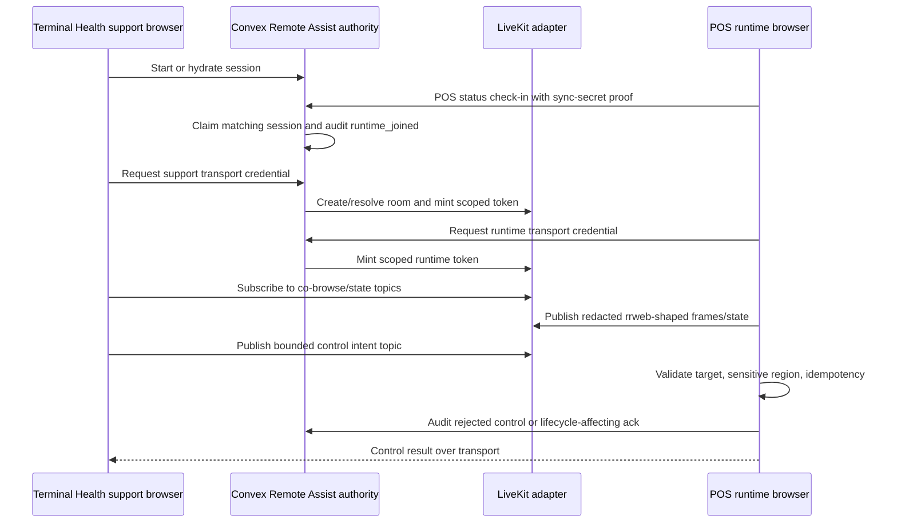
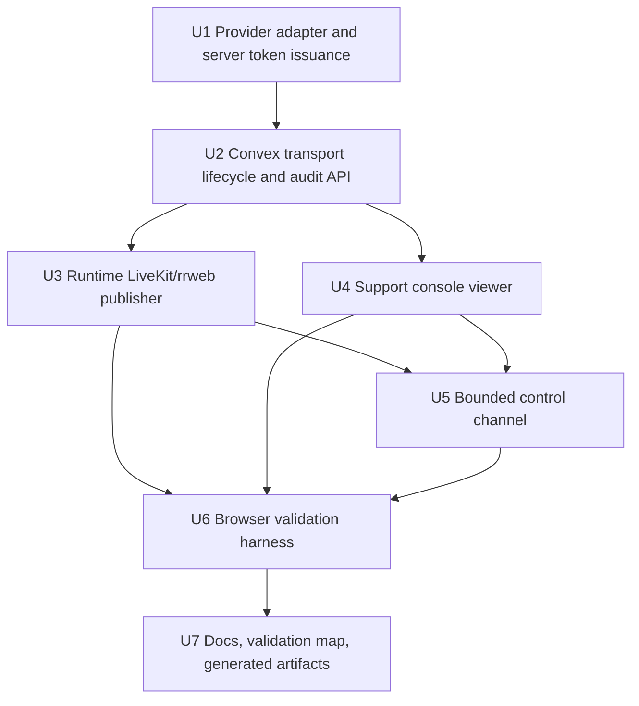

# feat: Add Remote Assist Live Transport

## Summary

Complete Remote Assist by wiring a real provider-backed live transport into the provider-neutral Remote Assist contract. LiveKit is the production provider of record, but Athena remains authoritative for lifecycle, policy, audit, runtime proof, redaction, and bounded control.

This plan turns the current session orchestration into a usable support experience: Terminal Health can open a live viewer/control console, the POS runtime can publish sanitized co-browse frames over transport, support can send bounded Athena-surface control intents, and either side can end or disconnect without bypassing POS authority gates.

---

## Problem Frame

Athena now has Remote Assist session orchestration: support can start a session, the POS runtime can claim it through normal check-in proof, state survives reloads, duplicate starts are blocked, and lifecycle events are audited. What is still missing is the actual remote co-browse/control path and support-side live console.

The implementation must not collapse the provider-adapter boundary. The provider is LiveKit, but POS, Terminal Health, Convex session lifecycle, and runtime guardrails should depend on Athena Remote Assist transport operations rather than LiveKit SDK objects.

---

## Requirements

- R1. LiveKit is the only production Remote Assist transport provider for this delivery, reached through an Athena provider adapter.
- R2. Convex remains the authority for Remote Assist session lifecycle, role/policy checks, runtime proof, token issuance decisions, and audit events.
- R3. Server-side code mints short-lived, role-scoped support/runtime transport credentials without exposing provider API secrets, raw grants, or provider admin tokens to browsers.
- R4. The POS runtime publishes unattended co-browse data as sanitized rrweb-shaped app events/frames before data leaves the browser.
- R5. The support console subscribes to the live app representation and renders a usable viewer/control surface inside Terminal Health.
- R6. Support control is bounded to Athena app-surface intents and must be validated at both send and runtime-apply time.
- R7. Sensitive data, including PINs, staff proof, recovery codes, sync secrets, auth tokens, local storage, IndexedDB payloads, payment/customer fields, and raw keystroke streams, is never transported, logged, or persisted.
- R8. Runtime join, disconnect, support join, support end, token issuance, transport failure, and rejected control intents are auditable with non-secret metadata.
- R9. Remote Assist must not grant terminal integrity, drawer authority, staff authority, manager proof, sale/payment/inventory/closeout authority, Cash Controls review, or Operations review.
- R10. The implementation includes browser-verifiable dev flow and repo sensors so a support browser can assist a POS runtime browser before production deploy.

---

## Scope Boundaries

- No arbitrary desktop control, shell access, browser devtools, extension APIs, clipboard scraping, local storage editing, IndexedDB mutation, file system access, or raw network replay.
- No unattended browser screen sharing. Unattended mode uses sanitized in-app co-browse events; browser screen share is an attended upgrade only after local permission.
- No new fleet-wide Remote Assist dashboard. POS Terminal Health remains the launch and support surface for this delivery.
- No non-POS runtime adapters in this batch.
- No durable business-state mutation over LiveKit data packets. Durable lifecycle and audit remain Convex-owned.

### Deferred to Follow-Up Work

- Broader Remote Assist policy administration for non-POS Athena browser clients.
- Fleet-level reporting and analytics for Remote Assist usage.
- Provider migration support beyond the `RemoteAssistTransportProvider` boundary.

---

## Context & Research

### Relevant Code and Patterns

- `packages/athena-webapp/convex/remoteAssist/application/sessionService.ts` owns session start, runtime claim, end, disconnect, TTL, and audit lifecycle.
- `packages/athena-webapp/convex/pos/public/terminals.ts` proves POS runtime identity through terminal sync-secret status submission before claiming a session.
- `packages/athena-webapp/convex/remoteAssist/public.ts` is the current support-facing Remote Assist API boundary.
- `packages/athena-webapp/convex/schemas/remoteAssist/remoteAssistSession.ts` already persists `transportProvider`, `transportRoomId`, and lifecycle events including token/join/control-rejection types.
- `packages/athena-webapp/src/lib/remote-assist/contract.ts` and `guardrails.ts` define the provider-neutral co-browse/control shape and safe control validation primitives.
- `packages/athena-webapp/src/components/pos/terminals/POSTerminalDetailView.tsx` is the Terminal Health support surface.
- `packages/athena-webapp/src/components/remote-assist/RemoteAssistRuntimeShell.tsx` is the runtime-side visible shell.

### Institutional Learnings

- `docs/solutions/architecture/athena-remote-assist-foundation-2026-06-11.md` establishes Remote Assist as a generic browser-client foundation with POS terminals as the first adapter.
- `docs/plans/2026-06-12-001-feat-remote-assist-live-session-flow-plan.md` establishes that runtime claim must ride POS runtime check-in proof, not a support-callable claim mutation.
- POS authority learnings require Remote Assist to preserve terminal integrity, drawer/staff authority, local command gates, Cash Controls, Operations review, and runtime check-in verification.
- Terminal Health recovery is orchestration. Remote Assist may help support operate visible UI and trigger existing recovery rails, but fresh runtime evidence remains the repair proof.

### External References

- LiveKit rooms and server APIs: https://docs.livekit.io/home/server/managing-rooms/
- LiveKit token grants: https://docs.livekit.io/frontends/reference/tokens-grants/
- LiveKit data packets: https://docs.livekit.io/home/client/data/packets/
- LiveKit screen share tracks: https://docs.livekit.io/home/client/tracks/screenshare/
- LiveKit client reconnect behavior: https://docs.livekit.io/home/client/connect/
- rrweb guide: https://github.com/rrweb-io/rrweb/blob/master/guide.md
- Convex runtimes and environment variables: https://docs.convex.dev/functions/runtimes and https://docs.convex.dev/production/environment-variables

---

## Key Technical Decisions

- Use LiveKit through a provider adapter, not direct UI/domain coupling: `livekit` is persisted as operational provider identity, while code outside the adapter consumes Athena transport operations.
- Keep Convex authoritative: LiveKit room membership and data packets are live transport signals, not source-of-truth lifecycle, permission, or durable command state.
- Use one LiveKit room per Remote Assist session: room identity maps to the persisted session and can be audited without exposing provider credentials.
- Mint short-lived role-scoped credentials server-side: runtime can publish sanitized co-browse/state data; support can subscribe and publish bounded control data; attended screen share gets a separate locally approved capability.
- Treat LiveKit data packets as non-durable: every control intent has an Athena command id, runtime validation, runtime acknowledgement/rejection, timeout handling, and Convex audit for rejection or lifecycle impact.
- Use rrweb-shaped capture for unattended co-browse: runtime redaction occurs before transport, with password/PIN/payment/customer/staff-proof/sync-secret surfaces blocked or masked by default.
- Keep POS recovery separate: Remote Assist may invoke existing recovery UI/commands, but it never marks terminal health repaired without the existing runtime evidence path.

---

## Open Questions

### Resolved During Planning

- Provider choice: LiveKit Cloud is the provider of record for this slice.
- Provider boundary: LiveKit must sit behind a Remote Assist provider adapter; POS, Terminal Health, runtime components, and Convex session services must not depend on provider SDK objects.
- Unattended transport shape: use sanitized in-app co-browse events, not browser screen capture.
- Runtime authority: runtime join and claim continue to ride POS sync-secret check-in proof.

### Deferred to Implementation

- Exact package versions: install current `livekit-client`, `livekit-server-sdk`, and rrweb production packages compatible with Athena's Vite/React/Convex stack during implementation.
- Exact token TTL: choose a short operational TTL during implementation and cover expiration behavior in tests.
- Final rendering primitive: use rrweb replay when it fits the sanitized live stream; otherwise render a conservative structured app-view fallback while keeping the contract rrweb-shaped.
- Local verification credentials: use configured dev/prod LiveKit credentials if present; if missing, surface the exact environment blocker before claiming provider-backed browser validation.

---

## High-Level Technical Design

> *This illustrates the intended approach and is directional guidance for review, not implementation specification. The implementing agent should treat it as context, not code to reproduce.*

---

## Implementation Units

- U1. **Provider adapter and credential issuance**

**Goal:** Add a Remote Assist transport provider boundary and LiveKit adapter for room resolution and scoped credential issuance.

**Requirements:** R1, R2, R3, R8

**Dependencies:** None

**Files:**
- Create: `packages/athena-webapp/convex/remoteAssist/infrastructure/transport/RemoteAssistTransportProvider.ts`
- Create: `packages/athena-webapp/convex/remoteAssist/infrastructure/transport/LiveKitRemoteAssistTransportProvider.ts`
- Modify: `packages/athena-webapp/convex/remoteAssist/application/sessionService.ts`
- Modify: `packages/athena-webapp/convex/remoteAssist/public.ts`
- Modify: `packages/athena-webapp/convex/schemas/remoteAssist/remoteAssistSession.ts`
- Modify: `packages/athena-webapp/package.json`
- Modify: `bun.lockb`
- Test: `packages/athena-webapp/convex/remoteAssist/infrastructure/transport/RemoteAssistTransportProvider.test.ts`
- Test: `packages/athena-webapp/convex/remoteAssist/public.test.ts`
- Test: `packages/athena-webapp/convex/remoteAssist/application/sessionService.test.ts`

**Approach:**
- Define an Athena-owned provider interface for room identity, support credential issuance, runtime credential issuance, and optional participant removal.
- Implement the LiveKit adapter in Convex Node runtime code so provider API secrets never enter client bundles or ordinary browser-returned payloads.
- Add public Convex functions that authorize support/runtime callers, call the provider adapter, persist non-secret transport metadata, and audit token issuance.
- Keep returned credentials scoped to session id, participant role, room, and short TTL. Do not return API key/secret or provider admin grants.

**Execution note:** Implement new provider issuance behavior test-first with a fake provider adapter, then wire LiveKit as the production adapter.

**Patterns to follow:**
- `packages/athena-webapp/convex/remoteAssist/application/sessionService.ts` lifecycle and audit service style.
- `packages/athena-webapp/convex/remoteAssist/infrastructure/remoteAssistRepository.ts` repository isolation.
- Existing Convex Node-runtime patterns for SDK-dependent server code.

**Test scenarios:**
- Happy path: authorized support user requests a credential for an active/connecting session and receives only client-usable transport fields plus expiry.
- Happy path: POS runtime with terminal sync proof requests a runtime credential for its active claimed session.
- Edge case: ended, expired, failed, or wrong-client sessions do not issue credentials.
- Error path: missing LiveKit env config returns a normalized provider-unavailable error without leaking env names or secrets to UI copy.
- Error path: unauthorized support member or wrong organization cannot mint a support credential.
- Integration: token issuance records `transport_token_issued` with provider, role, session id, room id, and non-secret expiry metadata.

**Verification:**
- Provider adapter tests prove LiveKit-specific code is behind the Athena interface.
- Convex public tests prove only authorized support/runtime paths receive credentials.

- U2. **Transport lifecycle state and audit API**

**Goal:** Extend Remote Assist lifecycle APIs so support/runtime joins, disconnects, provider failures, and control rejections are represented consistently in Convex state and audit.

**Requirements:** R2, R6, R8, R9

**Dependencies:** U1

**Files:**
- Modify: `packages/athena-webapp/convex/remoteAssist/application/sessionService.ts`
- Modify: `packages/athena-webapp/convex/remoteAssist/infrastructure/remoteAssistRepository.ts`
- Modify: `packages/athena-webapp/convex/remoteAssist/public.ts`
- Modify: `packages/athena-webapp/convex/pos/public/terminals.ts`
- Test: `packages/athena-webapp/convex/remoteAssist/application/sessionService.test.ts`
- Test: `packages/athena-webapp/convex/remoteAssist/infrastructure/remoteAssistRepository.test.ts`
- Test: `packages/athena-webapp/convex/remoteAssist/public.test.ts`
- Test: `packages/athena-webapp/convex/pos/public/terminals.test.ts`

**Approach:**
- Add explicit support/runtime join notifications that are authorized by existing session role and runtime proof paths.
- Record provider room identity and participant role changes as audit facts, not authority grants.
- Add a server mutation for runtime-reported rejected controls and transport failures with idempotency keys.
- Preserve the current POS runtime claim path: support cannot mark runtime joined without the terminal status proof flow.

**Execution note:** Characterize existing session lifecycle tests before adding transport states.

**Patterns to follow:**
- Existing `runtime_disconnected`, `session_ended`, and TTL audit handling in session service tests.
- POS terminal status submission checks in `packages/athena-webapp/convex/pos/public/terminals.ts`.

**Test scenarios:**
- Happy path: support join after credential issuance records `support_joined` without changing POS authority.
- Happy path: runtime join after POS check-in records `runtime_joined` and keeps active state visible to support.
- Edge case: repeated join/disconnect notifications with the same idempotency key do not duplicate audit events.
- Error path: support cannot report runtime join for an unclaimed session.
- Error path: runtime cannot report transport failure or control rejection for another terminal/client.
- Integration: ending a session prevents later token issuance and marks subsequent transport notifications as ignored or rejected.

**Verification:**
- Session lifecycle tests cover join/disconnect/failure/control-rejection audit without granting POS authority.

- U3. **Runtime co-browse publisher**

**Goal:** Add POS runtime client code that connects to the transport, captures sanitized app representation, publishes live state/co-browse frames, and disconnects cleanly.

**Requirements:** R4, R7, R8, R9, R10

**Dependencies:** U1, U2

**Files:**
- Create: `packages/athena-webapp/src/lib/remote-assist/transport/RemoteAssistLiveTransportClient.ts`
- Create: `packages/athena-webapp/src/lib/remote-assist/transport/livekitRemoteAssistClient.ts`
- Create: `packages/athena-webapp/src/lib/remote-assist/runtime/remoteAssistCobrowseRecorder.ts`
- Create: `packages/athena-webapp/src/lib/remote-assist/runtime/useRemoteAssistRuntimeTransport.ts`
- Modify: `packages/athena-webapp/src/lib/remote-assist/contract.ts`
- Modify: `packages/athena-webapp/src/lib/remote-assist/guardrails.ts`
- Modify: `packages/athena-webapp/src/components/remote-assist/RemoteAssistRuntimeShell.tsx`
- Modify: `packages/athena-webapp/src/components/pos/PointOfSaleView.tsx`
- Modify: `packages/athena-webapp/package.json`
- Modify: `bun.lockb`
- Test: `packages/athena-webapp/src/lib/remote-assist/transport/RemoteAssistLiveTransportClient.test.ts`
- Test: `packages/athena-webapp/src/lib/remote-assist/runtime/remoteAssistCobrowseRecorder.test.ts`
- Test: `packages/athena-webapp/src/lib/remote-assist/runtime/useRemoteAssistRuntimeTransport.test.tsx`
- Test: `packages/athena-webapp/src/components/remote-assist/RemoteAssistRuntimeShell.test.tsx`
- Test: `packages/athena-webapp/src/components/pos/PointOfSaleView.test.tsx`

**Approach:**
- Add a browser-side transport client interface with a LiveKit implementation for connect, publish frame/state, subscribe to controls, publish result, and disconnect.
- Use rrweb production recording packages or an equivalent rrweb-shaped recorder to emit sanitized snapshots/incremental events.
- Mark sensitive Athena regions with deny-by-default selectors/classes before capture; set rrweb masking/blocking options explicitly rather than relying on password-only defaults.
- Publish high-frequency cursor/viewport pings as lossy data where appropriate and coordination/control results as reliable data.
- Keep runtime UI mounted only for active/waiting Remote Assist sessions and ensure disconnect calls both LiveKit disconnect and Convex runtime disconnect.

**Execution note:** Add redaction tests before enabling any recorder publishing path.

**Patterns to follow:**
- Existing `contract.ts` DTO construction and `guardrails.ts` validation style.
- POS runtime state wiring in `PointOfSaleView.tsx`.
- Runtime shell visible-state patterns in `RemoteAssistRuntimeShell.tsx`.

**Test scenarios:**
- Happy path: active runtime receives a credential, connects to transport, publishes sanitized route/viewport/frame state, and shows connected banner state.
- Happy path: runtime disconnect stops recorder, leaves the transport, updates Convex state, and keeps the UI idempotent.
- Edge case: session ending while connected stops publishing and clears live transport state.
- Edge case: recorder emits a full snapshot checkpoint so support can recover after missed incremental packets.
- Error path: transport connect failure shows runtime-safe degraded state and reports failure without leaking provider details.
- Error path: sensitive inputs and blocked regions emit masked placeholders or metadata only, never raw values.
- Integration: POS sale/payment/staff authority tests remain unchanged when runtime transport is active.

**Verification:**
- Runtime tests prove no raw sensitive values cross the recorder or transport helpers.
- POS component tests prove live banner/control state does not block ordinary POS authority flows.

- U4. **Terminal Health live support console**

**Goal:** Replace the session-state-only Remote Assist panel with a support-side live viewer/control console in Terminal Health.

**Requirements:** R5, R6, R7, R8, R10

**Dependencies:** U1, U2

**Files:**
- Create: `packages/athena-webapp/src/components/remote-assist/RemoteAssistSupportConsole.tsx`
- Create: `packages/athena-webapp/src/components/remote-assist/RemoteAssistLiveViewer.tsx`
- Create: `packages/athena-webapp/src/components/remote-assist/RemoteAssistControlToolbar.tsx`
- Create: `packages/athena-webapp/src/lib/remote-assist/support/useRemoteAssistSupportTransport.ts`
- Modify: `packages/athena-webapp/src/components/pos/terminals/POSTerminalDetailView.tsx`
- Test: `packages/athena-webapp/src/components/remote-assist/RemoteAssistSupportConsole.test.tsx`
- Test: `packages/athena-webapp/src/components/remote-assist/RemoteAssistLiveViewer.test.tsx`
- Test: `packages/athena-webapp/src/lib/remote-assist/support/useRemoteAssistSupportTransport.test.tsx`
- Test: `packages/athena-webapp/src/components/pos/terminals/POSTerminalDetailView.test.tsx`

**Approach:**
- Keep the support console in Terminal Health, adjacent to existing diagnostics and recovery context.
- Subscribe to live co-browse/state frames through the transport helper and render the latest sanitized app view with connection freshness.
- Show provider/runtime states as operational status, not as provider implementation jargon.
- Include explicit end-session and reconnect controls; keep start duplicate prevention tied to backend state.
- Add bounded control affordances only when a live active runtime is connected and the target is safe.

**Execution note:** Build the console against a fake transport first so UI behavior is testable without LiveKit.

**Patterns to follow:**
- Existing Terminal Health detail panel density and operational copy in `POSTerminalDetailView.tsx`.
- Product copy tone in `docs/product-copy-tone.md`.
- Existing `RemoteAssistRuntimeShell.tsx` state label helpers.

**Test scenarios:**
- Happy path: support starts or hydrates a session, receives a support credential, connects, and sees live sanitized runtime state.
- Happy path: viewer updates when a new runtime frame arrives and shows freshness/connection state.
- Happy path: support can end the session from the console and the viewer/control affordances disable.
- Edge case: reload reconnects to the same backend session instead of starting a duplicate.
- Error path: provider unavailable, token expired, or transport disconnected shows restrained operational copy and a retry path.
- Error path: inactive/ended sessions do not render live controls.
- Integration: Terminal Health diagnostics and recovery panels remain visible and Remote Assist does not imply recovery completion.

**Verification:**
- Support console tests cover session hydration, viewer state, reconnect, end, and provider-error copy.

- U5. **Bounded control channel**

**Goal:** Implement support-to-runtime control intents over transport with runtime-side guardrails, idempotent results, and audit of rejected controls.

**Requirements:** R6, R7, R8, R9

**Dependencies:** U3, U4

**Files:**
- Create: `packages/athena-webapp/src/lib/remote-assist/control/remoteAssistControlChannel.ts`
- Create: `packages/athena-webapp/src/lib/remote-assist/control/applyRemoteAssistControlIntent.ts`
- Modify: `packages/athena-webapp/src/lib/remote-assist/contract.ts`
- Modify: `packages/athena-webapp/src/lib/remote-assist/guardrails.ts`
- Modify: `packages/athena-webapp/src/components/remote-assist/RemoteAssistControlToolbar.tsx`
- Test: `packages/athena-webapp/src/lib/remote-assist/control/remoteAssistControlChannel.test.ts`
- Test: `packages/athena-webapp/src/lib/remote-assist/control/applyRemoteAssistControlIntent.test.ts`
- Test: `packages/athena-webapp/src/lib/remote-assist/contract.test.ts`
- Test: `packages/athena-webapp/src/lib/remote-assist/guardrails.test.ts`
- Test: `packages/athena-webapp/src/components/remote-assist/RemoteAssistControlToolbar.test.tsx`

**Approach:**
- Send support control intents with session id, target descriptor, operation, reason, actor identity, and idempotency key.
- Runtime validates target visibility, sensitive-region exclusion, allowed key/pointer operation, current session id, and idempotency before applying.
- Runtime applies only high-level browser/app actions that normal user input could perform on the visible Athena surface.
- Runtime publishes control results over reliable transport and reports rejected controls to Convex for audit.
- Do not implement raw text injection into sensitive inputs, direct storage edits, direct network calls, or privileged POS command execution outside existing UI/command rails.

**Execution note:** Implement negative guardrail tests before enabling UI control affordances.

**Patterns to follow:**
- Existing allow-list validation in `packages/athena-webapp/src/lib/remote-assist/guardrails.ts`.
- Existing Remote Assist control intent validation in `contract.ts`.

**Test scenarios:**
- Happy path: support click intent on a safe visible button is accepted, applied once, and returns an accepted result.
- Happy path: allowed navigation or keyboard intent is applied only for approved Athena app targets.
- Edge case: duplicate idempotency key returns the prior result without reapplying.
- Error path: target inside sensitive region is rejected and audited without raw target text.
- Error path: unsupported key, pointer outside viewport, wrong session id, stale intent, or missing reason is rejected.
- Error path: POS authority-protected action still requires existing cashier/manager/drawer proof after control application.
- Integration: rejected control mutation records `control_rejected` with non-secret metadata.

**Verification:**
- Guardrail tests prove the runtime is the final enforcement point and POS authority is unchanged.

- U6. **Browser validation harness and dev proof**

**Goal:** Add a repeatable validation path proving Remote Assist works between a support browser and a POS runtime browser in dev, including the Arc terminal candidate when available.

**Requirements:** R10

**Dependencies:** U3, U4, U5

**Files:**
- Create or modify: `packages/athena-webapp/e2e/remote-assist-live.spec.ts`
- Modify: `packages/athena-webapp/docs/agent/validation-map.json`
- Modify: `scripts/harness-app-registry.ts`
- Test: `packages/athena-webapp/e2e/remote-assist-live.spec.ts`

**Approach:**
- Add a browser scenario that opens support Terminal Health and a POS runtime, starts Remote Assist, waits for runtime claim, connects both transport clients, verifies a sanitized frame appears, sends a safe bounded control intent, verifies runtime ack, then ends/disconnects.
- Prefer real dev LiveKit credentials for the browser proof. If credentials are missing, the implementation must report that specific environment blocker and still pass fake-transport unit/integration tests.
- Register Remote Assist as an explicit validation surface so future provider, runtime, and support-console changes are visible to harness review.

**Execution note:** Use fake transport in deterministic automated tests and real provider/browser validation for final delivery proof.

**Patterns to follow:**
- Existing Athena Playwright/Vitest setup under `packages/athena-webapp`.
- Existing harness registry and validation-map conventions.

**Test scenarios:**
- Happy path: two browser contexts complete start, runtime claim, live frame receipt, safe control ack, support end, and runtime disconnect.
- Edge case: support reload during active session reconnects to the same session and resumes viewer state.
- Error path: missing provider config blocks provider-backed validation with a clear diagnostic before production deploy.
- Integration: validation map names Remote Assist backend, runtime transport, support console, and browser proof sensors.

**Verification:**
- Browser proof demonstrates Remote Assist between support and POS runtime in dev before claiming delivery.

- U7. **Docs, operational notes, and generated artifacts**

**Goal:** Keep Athena's durable documentation, generated Convex/API artifacts, graph, and deployment notes aligned with full Remote Assist behavior.

**Requirements:** R1, R8, R9, R10

**Dependencies:** U1, U2, U3, U4, U5, U6

**Files:**
- Modify: `docs/solutions/architecture/athena-remote-assist-foundation-2026-06-11.md`
- Modify if codegen changes require it: `packages/athena-webapp/convex/_generated/api.d.ts`
- Modify if harness generation requires it: `packages/athena-webapp/docs/agent/validation-map.json`
- Modify if harness generation requires it: generated harness docs referenced by `scripts/harness-app-registry.ts`

**Approach:**
- Update the solution note from "foundation and handoff are present" to "LiveKit-backed transport is wired through the adapter boundary" after implementation lands.
- Document required provider environment variables and safe operational failure modes without committing secrets.
- Regenerate Convex API artifacts, harness docs, and graphify outputs as required by code changes.

**Execution note:** Sensor-only for documentation/generated-artifact refresh, after behavior-bearing units pass targeted tests.

**Patterns to follow:**
- Existing solution-doc style in `docs/solutions/architecture/`.
- Existing generated-artifact workflow in `bun run pre-commit:generated-artifacts`.

**Test scenarios:**
- Test expectation: none -- this unit refreshes documentation and generated artifacts; behavior is covered by U1-U6 sensors.

**Verification:**
- Documentation and generated artifacts reflect the final code and `bun run graphify:rebuild` plus PR-level gates pass.

---

## System-Wide Impact

- **Interaction graph:** Remote Assist now spans support UI, POS runtime UI, Convex session authority, Convex Node provider adapter, LiveKit rooms/data packets, rrweb-shaped capture, harness docs, and deployment env configuration.
- **Error propagation:** Provider errors should normalize into Remote Assist transport state and restrained support/runtime copy; secrets and raw provider grants must never appear in UI or audit.
- **State lifecycle risks:** Convex session state and transport membership can drift. Runtime/support reconnect and end/disconnect paths must be idempotent and make Convex the final authority.
- **API surface parity:** Support and runtime credential issuance require separate authorization paths. Browser clients should consume Athena transport helpers, not raw provider SDK operations outside those helpers.
- **Integration coverage:** Unit tests must be backed by browser proof because frame transport, reconnect, and control acknowledgement cross support/runtime/browser contexts.
- **Unchanged invariants:** POS terminal sync proof, drawer authority, staff authority, manager proof, local command gates, Cash Controls, Operations review, and runtime check-in verification remain independent of Remote Assist transport state.

---

## Risks & Mitigation

| Risk | Likelihood | Impact | Mitigation |
|------|------------|--------|------------|
| LiveKit SDK leaks into POS or Terminal Health code | Medium | High | Keep provider calls in adapter modules and test import boundaries where feasible. |
| Provider token grants are too broad | Medium | High | Role-scope grants, short TTL, no room admin for browser clients, and tests for support/runtime credential shape. |
| Co-browse stream leaks sensitive data | High | High | Redact before transport, block sensitive selectors, test with representative PIN/payment/customer/sync-secret fixtures. |
| Data packets are treated as durable commands | Medium | High | Use app-level idempotency, runtime ack/reject, timeout, and Convex audit for lifecycle-impacting outcomes. |
| Support control bypasses POS authority | Medium | High | Runtime applies only bounded visible-surface inputs; existing POS authority tests remain in the target suite. |
| Dev/prod LiveKit config is missing at validation time | Medium | Medium | Fail provider-backed browser proof with a specific environment diagnostic and do not claim full provider validation until config exists. |
| Browser proof is flaky because of multi-context transport timing | Medium | Medium | Use deterministic fake transport tests for logic and reserve real-provider proof for final end-to-end confidence. |

---

## Documentation / Operational Notes

- Required environment values should be documented for Convex/production deployment without writing secrets to repo files.
- Remote Assist deploy touches Convex and Athena webapp; final deploy should use the established local-build production path for those surfaces unless the final diff proves a narrower scope.
- The support console should use operational copy: connected, reconnecting, ended, provider unavailable, runtime disconnected. Avoid raw provider error text.
- Audit metadata must be useful for support review while excluding tokens, secrets, screen media, raw input, and raw payload bodies.

---

## Validation Strategy

- Focused backend tests for session service, repository, public API, POS runtime claim, transport credential issuance, and control-rejection audit.
- Focused frontend tests for runtime transport, recorder redaction, support console, viewer, control toolbar, runtime shell, Terminal Health integration, and POS authority invariants.
- Browser proof with support Terminal Health and POS runtime contexts showing start, claim, live frame, bounded control result, end, and runtime disconnect.
- Generated artifact refresh for Convex API, harness validation docs, and graphify after code changes.
- Final repository gate: `bun run pr:athena`.
- Final delivery proof: in-app browser/computer-use validation in dev, then local-build production deploy.

---

## Sources & References

- Origin plan: `docs/plans/2026-06-12-001-feat-remote-assist-live-session-flow-plan.md`
- Foundation plan: `docs/plans/2026-06-11-002-feat-remote-assist-foundation-plan.md`
- Solution note: `docs/solutions/architecture/athena-remote-assist-foundation-2026-06-11.md`
- LiveKit rooms: https://docs.livekit.io/home/server/managing-rooms/
- LiveKit token grants: https://docs.livekit.io/frontends/reference/tokens-grants/
- LiveKit data packets: https://docs.livekit.io/home/client/data/packets/
- LiveKit screen share: https://docs.livekit.io/home/client/tracks/screenshare/
- LiveKit reconnect behavior: https://docs.livekit.io/home/client/connect/
- rrweb guide: https://github.com/rrweb-io/rrweb/blob/master/guide.md
- Convex runtimes: https://docs.convex.dev/functions/runtimes
- Convex environment variables: https://docs.convex.dev/production/environment-variables
