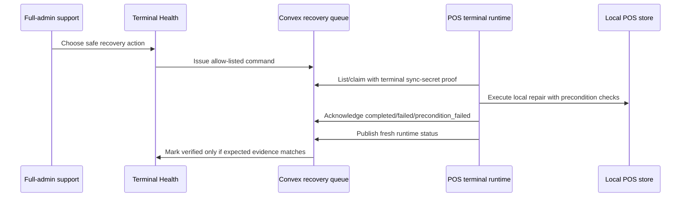
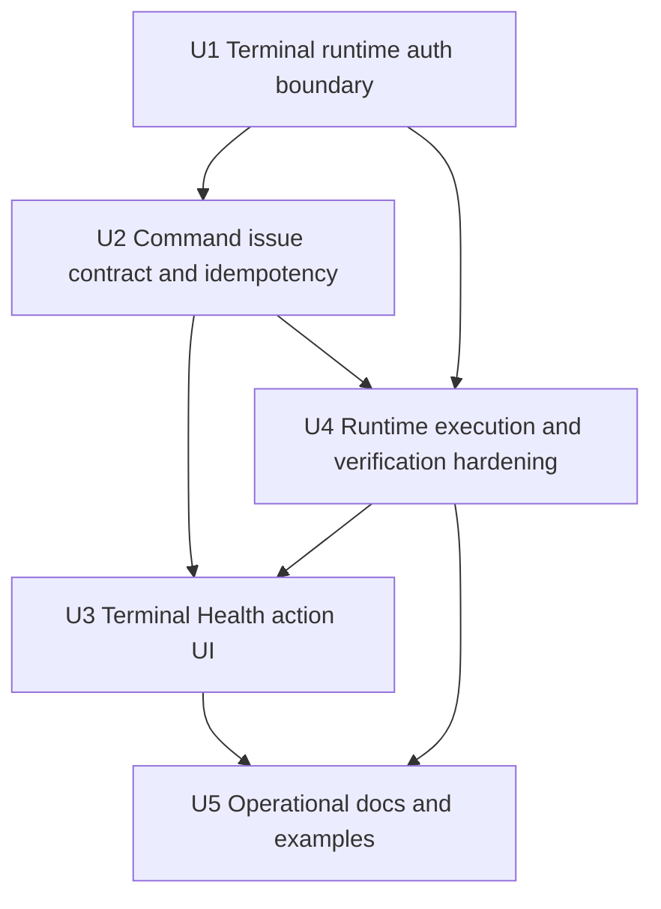

# feat: Enable Remote Terminal Recovery Commands

## Summary

Extend the existing POS terminal recovery rails so support can issue audited remote commands from Terminal Health and the matching production terminal can run the local repair commands without depending on an interactive signed-in Athena user session or an active POS app session. The implementation should keep the current command queue, browser-local executors, and runtime verification model, but harden terminal authentication, enable support actions, and make terminal-local repair repeatable for any eligible active terminal.

---

## Problem Frame

The M Supplies production terminal evidence showed the shape this feature needs to handle: an active online terminal with fresh runtime check-ins, terminal integrity requiring repair, drawer authority blocked by a stale cloud-closed session, local sync review backlog, and no queued recovery commands. Athena already has most of the recovery rails, but support still cannot reliably trigger the terminal-local repair actions from Terminal Health because the terminal command path is partially hidden behind disabled UI controls and terminal polling/acknowledgement still requires authenticated Athena-user access in addition to terminal identity.

The missing work is not a new remote shell. It is a narrow support-to-terminal command lane where full admins issue allow-listed recovery commands, the active terminal authenticates by terminal identity and sync secret, executes only local preconditioned repair helpers, acknowledges with redacted diagnostics, and proves completion through a fresh runtime status check-in.

---

## Assumptions

*This plan was authored without synchronous scope confirmation. The items below are agent inferences that should be reviewed before implementation proceeds.*

- Terminal command polling, claiming, acknowledgement, and runtime status reporting should be allowed for an active terminal based on terminal identity plus sync-secret proof, even if no Athena user session or active POS app session is currently present on that browser.
- Support command issuance should remain full-admin only; `pos_only` users and terminal runtimes should not be able to create recovery commands.
- The first production-grade workflow should cover the reusable blocker pair observed in production: `repair_terminal_seed` for terminal integrity and `clear_stale_drawer_authority` for stale drawer authority.
- The command lane should stay allow-listed and auditable rather than becoming arbitrary remote command execution.
- Runtime verification, not command acknowledgement alone, remains the source of truth for whether a repair actually made the terminal healthy.

---

## Requirements

- R1. A full-admin support user can issue allow-listed terminal recovery commands from Terminal Health to any eligible active store terminal, with each command scoped to exactly one target terminal.
- R2. The matching terminal can list, claim, acknowledge, and report runtime verification for queued commands using terminal identity and sync-secret proof without requiring a signed-in Athena user session, active cashier session, open register session, or active POS app session.
- R3. Terminal command payloads and acknowledgement diagnostics remain non-secret and cannot expose sync secrets, secret hashes, staff proof material, PIN/verifier material, raw local payloads, customer data, or payment data.
- R4. The browser runtime executes only supported local commands and keeps existing local precondition checks for terminal seed repair, stale drawer authority clearing, sync retry, snapshot refresh, staff authority refresh, and diagnostics.
- R5. Terminal Health exposes safe action controls for cloud repair and terminal-local commands, disables duplicate or unsafe action attempts, and shows command lifecycle plus runtime verification status.
- R6. A terminal with terminal-integrity and stale drawer-authority blockers can be repaired through reusable command payloads with expected evidence: terminal integrity becomes healthy, and drawer authority becomes healthy for the targeted stale local/cloud register-session pair.
- R7. The flow must not force-clear sale, payment, inventory, closeout, manager-review, cash variance, or unresolved business-fact evidence.
- R8. Tests cover auth boundaries, terminal command lifecycle, UI action enablement, runtime execution/acknowledgement, runtime verification, and redaction.

---

## Scope Boundaries

- This plan does not add arbitrary remote shell, script execution, or free-form command text.
- This plan does not bypass POS sale authority, terminal integrity, drawer authority, staff authority, or local sync review gates.
- This plan does not auto-resolve manual review work for completed sales, payments, inventory movement, closeouts, variances, or manager-rejected facts.
- This plan does not replace Remote Assist live co-browse/control; Remote Assist may launch or observe these commands later, but the recovery command queue remains the repair boundary.
- This plan does not require changing cashier-facing POS register copy except where runtime debug/status feedback already surfaces safe recovery state.

### Deferred to Follow-Up Work

- Fleet-wide scheduled remediation across multiple terminals.
- Remote Assist session integration that issues these commands from an attended support session.
- New local repair command types beyond the existing allow-list.
- A separate operations runbook UI outside Terminal Health.

---

## Context & Research

### Relevant Code and Patterns

- `packages/athena-webapp/convex/schemas/pos/posTerminalRecovery.ts` already defines allow-listed command types, lifecycle statuses, expected evidence, command context, acknowledgement shape, and per-command terminal scoping.
- `packages/athena-webapp/convex/pos/application/terminalRecovery/terminalCommandService.ts` already implements issue, list, claim, acknowledge, expiry, secret-like field rejection, acknowledgement redaction, and runtime verification matching.
- `packages/athena-webapp/convex/pos/infrastructure/repositories/terminalRecoveryRepository.ts` already persists terminal recovery commands through the `by_store_terminal_status` index.
- `packages/athena-webapp/convex/pos/public/terminals.ts` already exposes `issueTerminalRecoveryCommand`, `listTerminalRecoveryCommands`, `claimTerminalRecoveryCommand`, `acknowledgeTerminalRecoveryCommand`, and `reportTerminalRuntimeStatus`.
- `packages/athena-webapp/src/lib/pos/infrastructure/local/usePosLocalSyncRuntime.ts` already polls commands, claims one unseen command, executes it, acknowledges it, and forces a fresh runtime status observation.
- `packages/athena-webapp/src/lib/pos/infrastructure/local/terminalRecoveryCommands.ts` already contains terminal-local executors for `retry_sync`, `repair_terminal_seed`, `clear_stale_drawer_authority`, `refresh_staff_authority`, `refresh_snapshots`, and `report_diagnostics`.
- `packages/athena-webapp/src/components/pos/terminals/POSTerminalDetailView.tsx` already renders a Support recovery panel, but the cloud-repair and terminal-command buttons are disabled.
- `packages/athena-webapp/src/components/pos/terminals/terminalHealthPresentation.ts` already normalizes recovery blockers, safe actions, readiness, command status, and verification copy.
- `packages/athena-webapp/convex/pos/public/terminals.test.ts`, `packages/athena-webapp/convex/pos/application/terminalRecovery/terminalCommandService.test.ts`, `packages/athena-webapp/src/lib/pos/infrastructure/local/usePosLocalSyncRuntime.test.ts`, and `packages/athena-webapp/src/lib/pos/infrastructure/local/terminalRecoveryCommands.test.ts` are the main focused test surfaces.

### Institutional Learnings

- `docs/solutions/architecture/athena-pos-remote-terminal-health-recovery-2026-06-11.md` establishes that terminal recovery is orchestration, not a server-side force-clear; terminal-local repair must be executed by the matching active terminal and verified through fresh runtime status.
- `docs/solutions/logic-errors/athena-pos-stale-terminal-sale-block-2026-05-29.md` establishes that terminal integrity and drawer authority are distinct sale-affecting blocks and should not be cleared by deleting local events.
- `docs/solutions/architecture/athena-pos-local-staff-authority-2026-05-14.md` keeps staff proof material scoped and redacted.
- `docs/product-copy-tone.md` requires calm, clear, operational copy and normalization of raw backend messages before they reach operators.

### External References

- External research skipped. The relevant patterns are repo-local Convex mutations/queries, Athena auth, POS terminal sync-secret proof, IndexedDB local-store repair, and existing terminal recovery services.

---

## Key Technical Decisions

- Extend the existing command queue instead of introducing a second remote-control channel: the current queue already models command status, audit, expected evidence, local execution, and runtime verification.
- Split support auth from terminal auth: command issuance remains full-admin Athena user access, while terminal list/claim/ack/runtime-status paths should be authorized by active terminal identity and sync-secret proof.
- Treat terminal command authentication as a narrow machine-to-machine boundary: the terminal may only list/claim/ack commands scoped to its own active terminal row and may never issue commands.
- Keep command completion two-stage: acknowledgement records local execution result, then runtime verification marks the command verified only when fresh runtime evidence matches expected evidence.
- Enable Terminal Health buttons by binding them to existing Convex mutations with precondition-aware disabled states rather than creating a new support workspace.
- Encode production repair cases as ordinary command payloads, not store- or terminal-specific code: `repair_terminal_seed` clears terminal integrity after local seed repair, and `clear_stale_drawer_authority` clears only the stale targeted drawer authority when local preconditions match.

---

## Open Questions

### Resolved During Planning

- Should the terminal command path require an Athena user session, active cashier session, open register session, or active POS app session on the terminal? No. The production repair use case is about the terminal runtime acting as the terminal, so terminal identity plus sync-secret proof should be sufficient for list, claim, ack, and runtime status report.
- Should support be able to send arbitrary local commands? No. Commands stay allow-listed and typed.
- Should command acknowledgement mark a terminal healthy? No. It can advance verification status to ready, but a fresh runtime check-in must match expected evidence before the command is verified.
- Should manual review arrears be cleared through this lane? No. They remain manual review and operations-owned evidence.

### Deferred to Implementation

- Exact naming of any shared helper that authorizes an active terminal runtime without user auth.
- Whether `ingestLocalEvents` should join the same terminal-runtime auth cleanup now or stay as a separate follow-up. This plan only requires recovery command and runtime-status paths.
- Final precondition-hash or idempotency token shape for UI issue actions if existing command status is not enough to suppress duplicate clicks.

---

## High-Level Technical Design

> *This illustrates the intended approach and is directional guidance for review, not implementation specification. The implementing agent should treat it as context, not code to reproduce.*

The critical boundary is that Convex records intent and verifies evidence, while the browser runtime performs browser-local repair. No server mutation directly rewrites terminal IndexedDB authority state.

---

## Implementation Units

- U1. **Separate terminal-runtime auth from user auth**

**Goal:** Let an active terminal list, claim, acknowledge, and report runtime status using terminal sync-secret proof without a signed-in Athena user session, active cashier session, open register session, or active POS app session, while preserving full-admin access for issuing commands.

**Requirements:** R1, R2, R3, R8.

**Dependencies:** None.

**Files:**
- Modify: `packages/athena-webapp/convex/pos/public/terminals.ts`
- Test: `packages/athena-webapp/convex/pos/public/terminals.test.ts`

**Approach:**
- Extract or introduce a small terminal-runtime authorization path around the existing active terminal sync-secret check.
- Apply it to `listTerminalRecoveryCommands`, `claimTerminalRecoveryCommand`, `acknowledgeTerminalRecoveryCommand`, and `reportTerminalRuntimeStatus`.
- Keep `issueTerminalRecoveryCommand`, `resolveTerminalCloudRepair`, terminal health queries, and support previews under Athena user role checks.
- Return the same safe authorization-failure shape with terminal authorization metadata when terminal proof is wrong, inactive, revoked, or scoped to another store.
- Preserve store/terminal active checks and sync-secret hashing behavior.

**Execution note:** Start with characterization tests around current user-auth requirements, then change only the terminal-runtime endpoints.

**Patterns to follow:**
- `requireActiveTerminalSyncSecret` in `packages/athena-webapp/convex/pos/public/terminals.ts`.
- Runtime-only Remote Assist session lookup in `packages/athena-webapp/convex/pos/public/terminals.ts`.
- Terminal sync-secret validation in `packages/athena-webapp/convex/pos/public/sync.ts`.

**Test scenarios:**
- Happy path: active terminal with correct sync-secret proof lists claimable recovery commands without an Athena user session, cashier session, open register session, or active POS app session.
- Happy path: active terminal with correct sync-secret proof claims and acknowledges its own command without an Athena user session, cashier session, open register session, or active POS app session.
- Happy path: active terminal with correct sync-secret proof reports runtime status and triggers command verification without an Athena user session, cashier session, open register session, or active POS app session.
- Error path: wrong sync secret returns `authorization_failed` and does not call command services.
- Error path: revoked or inactive terminal cannot list, claim, acknowledge, or report status.
- Error path: terminal proof for another store or terminal cannot access the command.
- Integration: full-admin support can still issue a command, while `pos_only` users and terminal runtime calls cannot issue one.

**Verification:**
- Terminal-local recovery no longer depends on a live Athena user session or active POS app session, and support command issuance remains role-gated.

---

- U2. **Harden command issuance, dedupe, and expected evidence**

**Goal:** Make support-issued terminal commands safe to click from UI by enforcing scoped payloads, expected evidence, duplicate suppression, and redaction.

**Requirements:** R1, R3, R5, R6, R7, R8.

**Dependencies:** U1.

**Files:**
- Modify: `packages/athena-webapp/convex/pos/application/terminalRecovery/terminalCommandService.ts`
- Modify: `packages/athena-webapp/convex/pos/application/terminalRecovery/types.ts`
- Modify: `packages/athena-webapp/convex/schemas/pos/posTerminalRecovery.ts`
- Modify: `packages/athena-webapp/convex/pos/public/terminals.ts`
- Test: `packages/athena-webapp/convex/pos/application/terminalRecovery/terminalCommandService.test.ts`
- Test: `packages/athena-webapp/convex/pos/public/terminals.test.ts`

**Approach:**
- Reuse the current allow-list and secret-like field rejection.
- Add command de-dupe or supersede behavior so a support user cannot create repeated pending commands for the same terminal, command type, and target preconditions.
- Ensure command issue payloads for `repair_terminal_seed` and `clear_stale_drawer_authority` can carry targeted expected evidence without shipping seed material or local secrets.
- Preserve the current short TTL and expiry behavior, but make UI-visible status deterministic when a command is already pending, claimed, completed, failed, expired, or verified.
- Keep acknowledgement messages bounded and redacted.

**Patterns to follow:**
- Existing lifecycle functions in `packages/athena-webapp/convex/pos/application/terminalRecovery/terminalCommandService.ts`.
- Recovery preview command status fields in `packages/athena-webapp/src/components/pos/terminals/terminalHealthTypes.ts`.
- Command-result validators in `packages/athena-webapp/convex/lib/commandResultValidators.ts`.

**Test scenarios:**
- Happy path: issue `repair_terminal_seed` with expected terminal-integrity evidence and no seed payload.
- Happy path: issue `clear_stale_drawer_authority` with expected local/cloud register-session identifiers and expected drawer-authority evidence.
- Edge case: repeated issue for the same active command returns or supersedes consistently without creating duplicate pending work.
- Edge case: expired command can be replaced by a fresh command.
- Error path: command context containing secret-like fields is rejected before persistence.
- Error path: unsupported command type or mismatched terminal/store preconditions are rejected.
- Integration: command acknowledgement moves completed commands to runtime-verification-ready, but not verified.

**Verification:**
- Terminal Health can safely issue exactly the repair commands it displays, and the queue remains clean under repeated clicks or retries.

---

- U3. **Enable Terminal Health safe action controls**

**Goal:** Turn the existing disabled recovery buttons into operational controls that issue cloud repair or terminal-local commands, show lifecycle state, and avoid unsafe actions.

**Requirements:** R1, R5, R6, R7, R8.

**Dependencies:** U2.

**Files:**
- Modify: `packages/athena-webapp/src/components/pos/terminals/POSTerminalDetailView.tsx`
- Modify: `packages/athena-webapp/src/components/pos/terminals/terminalHealthPresentation.ts`
- Modify: `packages/athena-webapp/src/components/pos/terminals/terminalHealthTypes.ts`
- Test: `packages/athena-webapp/src/components/pos/terminals/POSTerminalDetailView.test.tsx`
- Test: `packages/athena-webapp/src/components/pos/terminals/terminalHealthPresentation.test.ts`

**Approach:**
- Bind `cloud_repair` actions to the existing cloud repair mutation and `terminal_command` actions to `issueTerminalRecoveryCommand`.
- Build command issue args from normalized recovery action metadata rather than from display copy.
- Disable buttons when the action is blocked, already pending/claimed, completed, verified, expired with no refresh, or when required preconditions are absent.
- Render command status, acknowledgement, verification status, and next check-in copy so support can tell whether the terminal has merely acknowledged local execution or has actually verified healthy evidence.
- Keep manual-review blockers as links or labels only; do not render repair buttons for them.
- Normalize all raw backend messages through the existing presentation helpers before display.

**Execution note:** Add UI tests before enabling buttons so the rendered safe/unsafe states are characterized.

**Patterns to follow:**
- Existing `RecoveryBlockerAction` and `RecoveryPanel` in `packages/athena-webapp/src/components/pos/terminals/POSTerminalDetailView.tsx`.
- Action classification in `packages/athena-webapp/src/components/pos/terminals/terminalHealthPresentation.ts`.
- Calm operator copy from `docs/product-copy-tone.md`.

**Test scenarios:**
- Happy path: a terminal with terminal-integrity and stale drawer-authority blockers renders enabled terminal-command buttons for the reusable repair commands.
- Happy path: clicking a terminal-command action calls the issue mutation with command type, command context, expected evidence, store id, and terminal id.
- Happy path: safe duplicate cloud repair action calls the cloud repair mutation and refreshes detail state after success.
- Edge case: pending or claimed command disables duplicate issue and shows in-progress status.
- Edge case: completed but not verified command still shows waiting-for-runtime-check-in copy.
- Error path: manual review, payment, inventory, closeout, or manager-rejected blockers render no repair button.
- Error path: mutation failure shows normalized support copy and does not imply the terminal was repaired.

**Verification:**
- Support can issue the safe actions from Terminal Health and see the command lifecycle without reading raw backend rows.

---

- U4. **Harden runtime execution, acknowledgement, and verification loop**

**Goal:** Ensure the terminal runtime executes commands reliably under the new terminal-auth path and always publishes fresh evidence after local command attempts.

**Requirements:** R2, R3, R4, R6, R7, R8.

**Dependencies:** U1, U2.

**Files:**
- Modify: `packages/athena-webapp/src/lib/pos/infrastructure/local/usePosLocalSyncRuntime.ts`
- Modify: `packages/athena-webapp/src/lib/pos/infrastructure/local/terminalRecoveryCommands.ts`
- Modify: `packages/athena-webapp/src/lib/pos/infrastructure/local/terminalRuntimeStatus.ts`
- Test: `packages/athena-webapp/src/lib/pos/infrastructure/local/usePosLocalSyncRuntime.test.ts`
- Test: `packages/athena-webapp/src/lib/pos/infrastructure/local/terminalRecoveryCommands.test.ts`
- Test: `packages/athena-webapp/src/lib/pos/infrastructure/local/terminalRuntimeStatus.test.ts`

**Approach:**
- Preserve the current polling model: process one unseen command at a time, claim before executing, acknowledge after execution, then force a runtime status publish.
- Confirm command payload compatibility between backend `commandContext` and local executor precondition parsing.
- Add or tighten tests for the two reusable local repair commands:
  - `repair_terminal_seed` should clear `authorization_failed` terminal integrity after durable seed repair without reporting secret material.
  - `clear_stale_drawer_authority` should clear only the matching `cloud_closed` drawer authority when local lifecycle events are settled.
- Ensure failures are acknowledged as failed or precondition failed with redacted messages, then retried only when it is safe to retry.
- Make runtime status publication work through the terminal-runtime auth path from U1 so verification can complete unattended.

**Patterns to follow:**
- Existing command executor helpers in `packages/athena-webapp/src/lib/pos/infrastructure/local/terminalRecoveryCommands.ts`.
- Current recovery-command effect in `packages/athena-webapp/src/lib/pos/infrastructure/local/usePosLocalSyncRuntime.ts`.
- Runtime verification matcher in `packages/athena-webapp/convex/pos/application/terminalRecovery/terminalCommandService.ts`.

**Test scenarios:**
- Happy path: runtime claims, executes, acknowledges, and triggers status observation for `repair_terminal_seed`.
- Happy path: runtime claims, executes, acknowledges, and triggers status observation for `clear_stale_drawer_authority`.
- Edge case: command for another terminal is ignored and not acknowledged as success.
- Edge case: precondition drift leaves local authority unchanged and acknowledges precondition failure.
- Error path: local store failure leaves the blocker intact and reports a redacted failure message.
- Error path: unsupported command is failed safely and does not mutate local state.
- Integration: fresh runtime status matching expected evidence marks the command verified; stale runtime status does not.

**Verification:**
- A queued command can move from pending to claimed to completed to verified without user-session dependency, and failed local repairs do not clear blockers.

---

- U5. **Document operational use and command examples**

**Goal:** Leave a durable support/developer reference for issuing terminal-local repair commands safely, including generic command examples, the M Supplies production case as an acceptance fixture, and non-goals.

**Requirements:** R3, R6, R7, R8.

**Dependencies:** U3, U4.

**Files:**
- Modify: `docs/solutions/architecture/athena-pos-remote-terminal-health-recovery-2026-06-11.md`
- Modify: `docs/product-copy-tone.md` if new operator-facing recovery copy patterns are introduced
- Test: `packages/athena-webapp/src/components/pos/terminals/terminalHealthPresentation.test.ts`

**Approach:**
- Add a short operational section that explains support-issued commands, terminal-authenticated execution, acknowledgement versus verification, and manual-review boundaries.
- Include generic command examples at the evidence level, with M Supplies documented only as a production acceptance fixture:
  - `repair_terminal_seed` for `authorization_failed` / terminal integrity expected healthy.
  - `clear_stale_drawer_authority` for `cloud_closed` with the target cloud and local register-session ids, expected drawer authority healthy, and no force-clearing of local review backlog.
- Document that unresolved sale/payment/inventory/closeout/manager-review evidence remains outside remote terminal command repair.
- Keep examples free of secrets and avoid raw production customer/payment details.

**Patterns to follow:**
- Existing concise architecture solution format in `docs/solutions/architecture/athena-pos-remote-terminal-health-recovery-2026-06-11.md`.
- Product copy tone rules in `docs/product-copy-tone.md`.

**Test scenarios:**
- Test expectation: none for docs-only changes, except presentation copy tests when new UI copy is introduced.

**Verification:**
- A future support/debugging pass can identify which commands to issue and what evidence must verify them without rediscovering the safety boundary.

---

## System-Wide Impact

- **Interaction graph:** Terminal Health actions call Convex recovery mutations; terminal runtime polls Convex; local IndexedDB executors mutate only local authority/snapshot state; runtime status reports back to Convex; Terminal Health reflects verified evidence.
- **Error propagation:** Support issue failures should surface as normalized support copy; terminal authorization failures should carry terminal authorization metadata; local execution failures should be acknowledged with redacted diagnostics and should not mark commands verified.
- **State lifecycle risks:** Duplicate command issuance, expired commands, precondition drift, stale runtime status, and partial local-store failures must preserve blockers rather than clearing them optimistically.
- **API surface parity:** `reportTerminalRuntimeStatus`, `listTerminalRecoveryCommands`, `claimTerminalRecoveryCommand`, and `acknowledgeTerminalRecoveryCommand` should share the terminal-runtime auth boundary. Support-only issue and preview paths should remain user-authenticated.
- **Integration coverage:** Unit tests alone are not enough; at least one cross-layer test shape should prove issued command -> runtime claim/ack -> fresh runtime verification.
- **Unchanged invariants:** POS sync review, Cash Controls, terminal integrity, drawer authority, staff authority, and sale authority gates remain authoritative. Remote commands can repair safe terminal-local state but cannot override business-fact review.

---

## Risks & Dependencies

| Risk | Mitigation |
|------|------------|
| Terminal command path becomes an auth bypass | Split support issue auth from terminal runtime auth, allow only list/claim/ack/status for active terminal sync-secret proof, and keep issue full-admin only. |
| Remote command lane becomes arbitrary execution | Keep typed allow-list, schema validation, no free-form command text, and local executor switch over supported commands only. |
| Command acknowledgement is mistaken for recovery | Preserve runtime verification as a separate status and UI state; do not show repaired/healthy until expected evidence matches fresh runtime. |
| Duplicate support clicks create conflicting local repair attempts | Add duplicate suppression or supersede semantics keyed by active terminal, command type, and target preconditions. |
| Sensitive local material leaks into audit or UI | Maintain secret-like field rejection, acknowledgement redaction, diagnostic bounding, and presentation copy normalization. |
| Manual review evidence is accidentally cleared | Keep sale/payment/inventory/closeout/manager-review items outside terminal command execution and document the non-goal. |

---

## Documentation / Operational Notes

- This should be treated as an operational recovery feature for production POS blockers. The main acceptance test is whether a live, online, active terminal can run `repair_terminal_seed` and `clear_stale_drawer_authority` from support-issued commands and then prove healthy through runtime check-in.
- M Supplies should not be marked fully healthy from these commands alone if local review backlog or manager-rejected sale/register evidence remains unresolved. The expected improvement is clearing terminal-integrity and drawer-authority blockers while preserving manual review.
- Run the focused Convex public terminal tests, terminal command service tests, local runtime tests, local recovery command tests, terminal detail/presentation tests, changed typecheck/lint, graphify rebuild if code is changed, and `pr:athena` before production deploy.

---

## Sources & References

- Related plan: `docs/plans/2026-06-11-001-feat-pos-remote-terminal-health-plan.md`
- Related solution: `docs/solutions/architecture/athena-pos-remote-terminal-health-recovery-2026-06-11.md`
- Related code: `packages/athena-webapp/convex/pos/public/terminals.ts`
- Related code: `packages/athena-webapp/convex/pos/application/terminalRecovery/terminalCommandService.ts`
- Related code: `packages/athena-webapp/src/lib/pos/infrastructure/local/usePosLocalSyncRuntime.ts`
- Related code: `packages/athena-webapp/src/lib/pos/infrastructure/local/terminalRecoveryCommands.ts`
- Related UI: `packages/athena-webapp/src/components/pos/terminals/POSTerminalDetailView.tsx`
