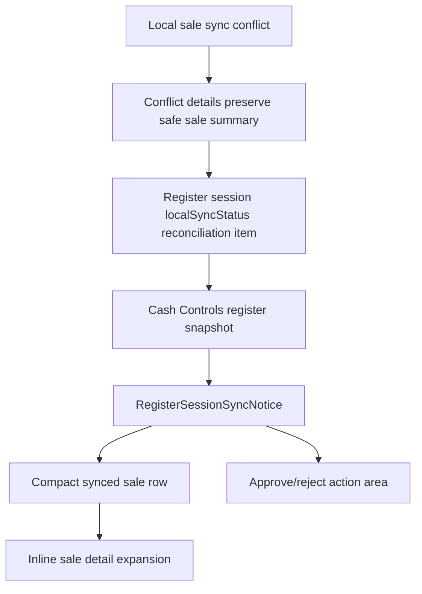

# feat: Add Sale-Level Register Sync Review Details

## Summary

Add an in-flow sale-level detail panel to Cash Controls register-session sync review so a manager can understand the synced sale being rejected or reviewed without leaving the drawer workspace. The implementation should extend the existing reconciliation item contract, enrich it with sale-level context when available, and render compact expandable decision packets inside the current register review banner.

---

## Problem Frame

The register session correctly owns sync review decisions, but the current review banner explains the action more than the sale. A manager can see that synced activity needs correction and can reject it, yet still has to infer which sale, amount, payment, cashier, and time are involved from nearby transaction tables, support traces, or terminal evidence.

---

## Requirements

- R1. Managers stay on the Cash Controls register session while inspecting synced sale review context.
- R2. The review banner exposes sale-level context when available: sale reference, amount, item count, payment method, cashier, completed/offline time, local queue number, sync status, and reported time.
- R3. Unsupported or reject-only review states explain why the sale cannot be applied and what rejecting does, using calm operator-facing copy.
- R4. Multiple review items render as compact sale-level rows with independent detail expansion, while the primary reject action remains scoped to the reviewed synced activity set.
- R5. Closeout review behavior remains value-first and is not regressed by sale-level review details.
- R6. Raw sync internals remain secondary support evidence; no sync secrets, staff proof material, PIN material, raw payloads, customer private data, or payment-sensitive data are exposed.
- R7. Older reconciliation items without sale-level fields continue to render a useful fallback using the existing reason, type, queue, and reported-time evidence.

---

## Scope Boundaries

- This plan does not add item-line detail, payment allocation detail, or sale editing inside Cash Controls.
- This plan does not create a new route, modal-only workspace, or transaction reconstruction UI.
- This plan does not change manager approval/rejection semantics for synced activity.
- This plan does not automatically correct inventory, payment, service customer attribution, or permission conflicts.
- This plan does not change POS terminal support routing or terminal recovery behavior.

### Deferred to Follow-Up Work

- Item-line and payment-line drilldown for reviewed synced sales.
- A dedicated correction workflow for rejected sale facts after this review is cleared.
- Cross-linking a review item to reconstructed transaction detail when a future projection can safely create a draft or audit-only transaction shell.

---

## Context & Research

### Relevant Code and Patterns

- `packages/athena-webapp/src/components/cash-controls/RegisterSessionView.tsx` owns the register detail workspace, sync review banner, linked transaction preview, manager sign-in flow, and reject/approve action placement.
- `packages/athena-webapp/src/lib/pos/presentation/syncStatusPresentation.ts` defines `PosReconciliationItem`, normalizes sync review state, and maps backend types into operator-facing review labels.
- `packages/athena-webapp/convex/pos/application/sync/registerSessionSyncReview.ts` builds `localSyncStatus.reconciliationItems` from `posLocalSyncConflict` rows and already copies closeout-specific review evidence from conflict details.
- `packages/athena-webapp/convex/cashControls/deposits.ts` returns register session snapshots and linked transaction summaries, using staff/customer/payment maps to create operator-facing transaction context.
- `packages/athena-webapp/convex/pos/application/sync/projectLocalEvents.ts` creates sync conflicts from sale projection failures and already has access to sale payload totals, receipt numbers, payments, staff, line count, and local event metadata at conflict time.
- `packages/athena-webapp/src/components/cash-controls/RegisterSessionView.test.tsx` already covers register review banner behavior for combined review items, reject-only service attribution, rejected server activity, closeout review, and linked transactions.
- `packages/athena-webapp/convex/cashControls/deposits.test.ts` already covers register session snapshot shape, linked transaction summaries, and sync review resolution behavior.

### Institutional Learnings

- `docs/solutions/logic-errors/athena-pos-register-review-and-adjusted-sale-projection-2026-05-21.md` says register sync events that need manager review should expose unresolved event count, readable event context, and manager action.
- `docs/solutions/logic-errors/athena-cash-controls-closeout-review-ia-2026-06-08.md` says review items should be compact decision packets and that action placement should come after evidence.
- `docs/solutions/logic-errors/athena-pos-local-sync-review-and-service-lines-2026-05-29.md` says server-rejected synced activity affecting a register session needs enough evidence for operators to recover it from Cash Controls.
- `docs/product-copy-tone.md` requires calm, clear, restrained, operational copy and says correction surfaces should preserve trust without implying original sale facts disappeared.

### External References

- External research skipped. This is a repo-local Cash Controls/POS sync review interaction with established local patterns and no new third-party API or framework behavior.

---

## Key Technical Decisions

- Extend the existing reconciliation item contract instead of introducing a separate review-detail query. The register snapshot already carries the review item list, and the UI needs this context in the review banner before action.
- Enrich sale-level context at projection/query boundaries from already-known sync conflict details and linked transaction-style formatting, not from raw local payloads in the browser.
- Render detail inline inside the existing review banner. The register session remains the workspace, and the manager can expand sale-level evidence without route changes.
- Keep closeout review presentation separate. Closeout remains value-first with expected/count/variance/note, while sale review gets sale summary rows and sale-specific detail.
- Treat missing sale-level fields as normal. Older or non-sale review records should fall back to the current evidence lines instead of showing empty labels.

---

## Open Questions

### Resolved During Planning

- Should the first version show item/payment line detail? No. The signed-off scope is sale-level detail only.
- Should the UI take the manager out of the register session? No. The detail must stay within the register-session flow.
- Should this become a dedicated detail route? No. The first version should use inline expansion inside the existing review banner.

### Deferred to Implementation

- Exact sale-reference priority when both local receipt number and cloud transaction number are present. Implementation should choose the most operator-recognizable value using existing transaction display conventions.
- Exact treatment for multi-payment sale summaries. Implementation should mirror linked transaction summary behavior: show a compact "Multiple" style label when no single primary method is safe to name.
- Exact source for completed/offline time when existing conflict rows only carry conflict creation time. Implementation should copy it into safe conflict details at projection time or deliberately join the source `posLocalSyncEvent` when building register-session review status.
- Whether any existing conflict rows in local development need fixture refresh to demonstrate sale-level values. The UI must still pass with fallback-only records.

---

## High-Level Technical Design

> *This illustrates the intended approach and is directional guidance for review, not implementation specification. The implementing agent should treat it as context, not code to reproduce.*

The important boundary is that sale summary values are safe operator evidence. They should be normalized before reaching the browser and rendered as sale facts, while raw event payloads and secret-bearing proof material stay out of the presentation contract.

---

## Implementation Units

- U1. **Extend Sale-Level Review Evidence Contract**

**Goal:** Add portable sale-level fields to the POS sync review/reconciliation item shape so register review UI can present sale context consistently.

**Requirements:** R2, R6, R7

**Dependencies:** None

**Files:**
- Modify: `packages/athena-webapp/src/lib/pos/presentation/syncStatusPresentation.ts`
- Modify: `packages/athena-webapp/convex/pos/application/sync/registerSessionSyncReview.ts`
- Modify: `packages/athena-webapp/convex/pos/domain/types.ts`
- Modify: `packages/athena-webapp/src/components/cash-controls/RegisterSessionView.tsx`
- Test: `packages/athena-webapp/src/components/cash-controls/RegisterSessionView.test.tsx`
- Test: `packages/athena-webapp/convex/pos/infrastructure/repositories/registerSessionRepository.test.ts`

**Approach:**
- Extend `PosReconciliationItem` and the corresponding Convex/domain return types with optional sale-summary fields.
- Keep the contract optional and additive so existing conflict rows continue to render.
- Include only display-safe values: sale reference, local transaction/receipt reference, total, item count, primary or multiple payment summary, cashier display name when available, completed/offline timestamp, reported timestamp, local queue sequence, and status.
- Preserve closeout-specific fields as-is; do not overload sale fields for closeout review.

**Execution note:** Implement the contract test-first where practical: start with failing presentation and repository tests that show a sale review item can carry sale-level fields and that missing fields still render fallback evidence.

**Patterns to follow:**
- `PosReconciliationItem` optional-field normalization in `packages/athena-webapp/src/lib/pos/presentation/syncStatusPresentation.ts`
- Closeout review evidence copied by `buildRegisterSessionLocalSyncStatus` in `packages/athena-webapp/convex/pos/application/sync/registerSessionSyncReview.ts`
- Linked transaction display model in `RegisterSessionView.tsx`

**Test scenarios:**
- Happy path: a reconciliation item with sale reference, total, item count, payment summary, cashier, completed timestamp, queue sequence, and status is accepted by the presentation contract and available to the register view.
- Edge case: a reconciliation item with no sale-level fields still renders existing reason/type/queue/reported fallback evidence.
- Error path: secret-like or raw proof fields are not part of the reconciliation item contract and do not appear in UI fixtures.
- Integration: register session repository/snapshot output carries the new optional fields without breaking current closeout or rejected-review fixtures.

**Verification:**
- Register sync review items can represent sale-level context without requiring a separate query.
- Existing review item tests continue to pass with fallback-only records.

---

- U2. **Populate Safe Sale Context From Sync Projection Evidence**

**Goal:** Preserve safe sale-level context when a sale sync conflict is created or summarized, so Cash Controls can show the manager what sale is under review.

**Requirements:** R2, R6, R7

**Dependencies:** U1

**Files:**
- Modify: `packages/athena-webapp/convex/pos/application/sync/projectLocalEvents.ts`
- Modify: `packages/athena-webapp/convex/pos/application/sync/registerSessionSyncReview.ts`
- Modify: `packages/athena-webapp/convex/cashControls/deposits.ts`
- Test: `packages/athena-webapp/convex/pos/application/sync/projectLocalEvents.test.ts`
- Test: `packages/athena-webapp/convex/cashControls/deposits.test.ts`

**Approach:**
- When sale projection creates a conflict, include a safe sale summary in conflict details from the parsed local sale event: receipt/reference, total, item count, payment labels, completed timestamp, local transaction reference, and staff profile where already known.
- When building register-session local sync status, map safe conflict details into the optional sale fields from U1.
- Where a conflict can be matched to already-projected or linked transaction context, prefer the existing register-session snapshot display conventions for cashier and payment labels.
- Do not store or expose raw local sale payloads, staff proof tokens, payment-sensitive payloads, or customer private details in the review item.

**Execution note:** Add tests at the projection boundary before changing UI. The UI should not need to infer sale facts from local event IDs.

**Patterns to follow:**
- Conflict detail creation in `packages/athena-webapp/convex/pos/application/sync/projectLocalEvents.ts`
- Register snapshot transaction mapping in `packages/athena-webapp/convex/cashControls/deposits.ts`
- Closeout context preservation in `buildRegisterSessionLocalSyncStatus`

**Test scenarios:**
- Happy path: a sale completion conflict includes sale total, item count, payment summary, receipt/reference, completed timestamp, and staff/cashier context where safe.
- Edge case: multi-payment sale conflict stores a compact payment summary instead of exposing individual payment payload details.
- Edge case: service sale missing customer attribution still includes sale-level context while preserving the reject-only state.
- Error path: permission, inventory, and payment conflicts do not expose staff proof tokens, sync secrets, raw payment payloads, customer private data, or raw local payloads.
- Integration: `getRegisterSessionSnapshot` returns sale-level review context alongside linked transactions and current register session data.

**Verification:**
- Backend tests prove sale-level evidence is generated from sync conflict context and survives through the register snapshot.
- Rejection and approval command behavior remains unchanged.

---

- U3. **Render Inline Sale-Level Review Details In Register Session**

**Goal:** Replace the summary-only non-closeout review block with compact sale rows and inline detail expansion inside the existing register-session review banner.

**Requirements:** R1, R2, R3, R4, R5, R7

**Dependencies:** U1, U2

**Files:**
- Modify: `packages/athena-webapp/src/components/cash-controls/RegisterSessionView.tsx`
- Modify: `packages/athena-webapp/src/lib/pos/presentation/syncStatusPresentation.ts`
- Test: `packages/athena-webapp/src/components/cash-controls/RegisterSessionView.test.tsx`

**Approach:**
- Keep `RegisterSessionSyncNotice` as the owner of the review banner and action placement.
- Add a sale-level row component for non-closeout review items. The row should show a concise summary such as sale reference, total, item count, payment label, cashier, completed time, and queue sequence when available.
- Add inline expansion for each row. Expanded detail should group content around manager questions: "Synced sale", "Why this needs review", "What rejecting does", and "Support evidence".
- For multiple review items, render multiple compact rows with independent expansion. Keep the combined next-step copy and action buttons scoped to the whole reviewed set.
- Preserve closeout review rendering and its expected/count/variance/note layout.
- Put the reject or approve action after the evidence so the manager reads the decision packet before acting.

**Execution note:** Use characterization-first coverage around existing closeout and combined-review banner behavior, then add sale-detail expectations.

**Patterns to follow:**
- Existing closeout review card structure in `RegisterSessionSyncNotice`
- Linked transaction row/card display conventions in `RegisterSessionView.tsx`
- Operator copy guidance in `docs/product-copy-tone.md`

**Test scenarios:**
- Happy path: a single unsupported sale review item renders a compact synced-sale row with reference, total, item count, payment, cashier, completed time, queue number, and a `View sale details` control.
- Happy path: expanding the row shows grouped sale facts, plain-language reason, rejecting consequence, and support evidence without navigating away.
- Edge case: multiple review items render multiple sale rows and keep the reject action scoped to the reviewed synced activity set.
- Edge case: fallback-only records render reason/type/queue/reported evidence and do not show empty labels or raw null values.
- Edge case: closeout review still renders expected/count/variance/note and does not show sale-detail UI.
- Error path: service customer attribution review remains reject-only and explains that the sale must be recreated or corrected from the appropriate workflow.
- Integration: manager sign-in and `Reject synced activity` flows still open the existing authentication path and call the same sync review resolution callback.

**Verification:**
- The register session page presents enough sale-level context to identify which sale is under review without leaving the drawer workspace.
- Existing closeout, rejected override, and approval tests remain green.

---

- U4. **Validate Browser Flow, Copy, And Guardrails**

**Goal:** Prove the finished feature works in the actual register-session surface and document any durable learning if the implementation reveals a reusable pattern.

**Requirements:** R1, R3, R4, R5, R6, R7

**Dependencies:** U1, U2, U3

**Files:**
- Modify: `docs/solutions/logic-errors/athena-cash-controls-closeout-review-ia-2026-06-08.md` or create a new `docs/solutions/logic-errors/*` note if implementation reveals a distinct reusable pattern
- Test: `packages/athena-webapp/src/components/cash-controls/RegisterSessionView.test.tsx`
- Test: `packages/athena-webapp/convex/cashControls/deposits.test.ts`

**Approach:**
- Validate the page in a browser against a register session with sale-level review context and confirm no route change is needed for inspection.
- Check desktop and mobile widths for the review banner so row expansion does not crowd the action area or linked transactions.
- Review copy against `docs/product-copy-tone.md`: lead with sale state, explain next action, avoid raw backend language as the primary label, and keep rejection consequences factual.
- Rebuild Graphify after code changes per repo instructions.
- Add or refresh a solution note only if implementation changes the reusable sync-review evidence pattern beyond this one feature.

**Execution note:** Browser verification should follow code/tests; it is not a substitute for component and Convex coverage.

**Patterns to follow:**
- Existing register-session browser verification paths from prior Cash Controls UI work.
- Graphify maintenance rule in project instructions.

**Test scenarios:**
- Happy path: browser-visible register session shows review banner, sale summary row, expanded details, and unchanged linked transaction context.
- Edge case: narrow viewport keeps the detail expansion readable and keeps reject action reachable after evidence.
- Error path: no secret-like strings, raw local payloads, or staff proof fields appear in the browser-visible review banner.
- Integration: focused frontend and Convex tests cover the same sale-review fixture used for browser validation.

**Verification:**
- Focused frontend and Convex tests pass.
- Browser inspection confirms the manager can identify the sale and reject consequence in-flow.
- `bun run graphify:rebuild` has updated `graphify-out/` after code changes.

---

## System-Wide Impact

- **Interaction graph:** Local sync projection creates conflict evidence, register session snapshot exposes reconciliation items, Cash Controls register session renders the review packet, and manager sign-in resolves or rejects the same sync review through the existing mutation.
- **Error propagation:** Unsupported review states remain reject-only; backend command errors continue to flow through existing sync review error handling.
- **State lifecycle risks:** Older conflict records may lack sale-level evidence. The UI must degrade to existing reason/type/queue evidence without blocking review.
- **API surface parity:** The new optional sale fields must be reflected in Convex/domain types and frontend presentation types together.
- **Integration coverage:** Unit tests alone are not enough; at least one browser check should verify the expanded review detail inside the actual register session layout.
- **Unchanged invariants:** This plan does not change projection settlement, manager authorization, linked transaction navigation, closeout variance review, or terminal recovery routing.

---

## Risks & Dependencies

| Risk | Mitigation |
|------|------------|
| Review item shape expands but projection does not populate enough data | Add projection and snapshot tests before UI-only assertions |
| UI exposes raw sync internals or sensitive proof data | Keep the contract display-safe and add negative tests for secret-like fields |
| Closeout review regresses while changing shared banner code | Preserve closeout-specific tests and keep sale detail out of closeout branch |
| Multiple review items make the banner too dense | Use compact rows and independent expansion; keep the action area after evidence |
| Old review rows lack sale fields | Treat fields as optional and preserve existing fallback evidence |

---

## Documentation / Operational Notes

- Product copy should stay calm and operational: "Synced sale", "Why this needs review", "What rejecting does", and "Support evidence" are preferred framing.
- The implementation may need a new or updated solution note if it establishes a reusable rule for safe sale-level sync review evidence.
- No rollout flag is required unless implementation discovers that existing production conflict rows need a gradual presentation fallback.

---

## Sources & References

- Related code: `packages/athena-webapp/src/components/cash-controls/RegisterSessionView.tsx`
- Related code: `packages/athena-webapp/src/lib/pos/presentation/syncStatusPresentation.ts`
- Related code: `packages/athena-webapp/convex/pos/application/sync/registerSessionSyncReview.ts`
- Related code: `packages/athena-webapp/convex/pos/application/sync/projectLocalEvents.ts`
- Related code: `packages/athena-webapp/convex/cashControls/deposits.ts`
- Related tests: `packages/athena-webapp/src/components/cash-controls/RegisterSessionView.test.tsx`
- Related tests: `packages/athena-webapp/convex/cashControls/deposits.test.ts`
- Related learning: `docs/solutions/logic-errors/athena-pos-register-review-and-adjusted-sale-projection-2026-05-21.md`
- Related learning: `docs/solutions/logic-errors/athena-cash-controls-closeout-review-ia-2026-06-08.md`
- Related learning: `docs/solutions/logic-errors/athena-pos-local-sync-review-and-service-lines-2026-05-29.md`
- Copy guidance: `docs/product-copy-tone.md`
