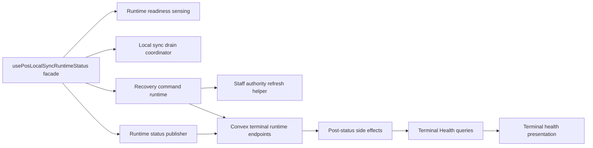
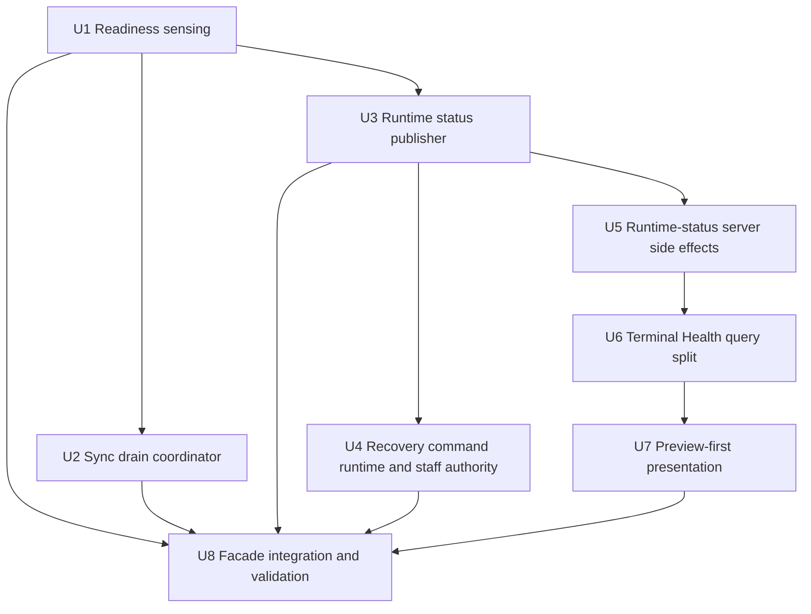

# refactor: Decouple the POS Runtime

## Summary

Decouple the current POS browser runtime into focused, testable runtime modules while preserving the existing `usePosLocalSyncRuntimeStatus` contract for consumers. The work should keep cashier continuity, local-first sales, runtime status publication, terminal recovery commands, Terminal Health, and Remote Assist presence behavior intact, but reduce the amount of responsibility concentrated in `usePosLocalSyncRuntime.ts` and the terminal health query path.

The end state is a smaller runtime facade backed by explicit units for readiness sensing, local sync draining, runtime status publication, terminal recovery command execution, staff authority refresh, runtime-status side effects, and Terminal Health presentation/listing behavior.

---

## Problem Frame

Recent POS runtime work landed the right capabilities, but the runtime now has too many cross-cutting responsibilities in one browser hook and too much health/recovery assembly concentrated in shared query paths. That increases the risk of regressions when changing one responsibility: a sync-drain tweak can affect runtime check-ins, a recovery command tweak can affect cashier authority refresh, a Terminal Health list optimization can drift from detail behavior, and a presentation fallback can accidentally override the server's recovery preview.

The audit found the same theme across code, prior sessions, and solution docs: Athena should keep sales readiness, support recovery, and diagnostic evidence separate. Runtime status is evidence, not command authority. Recovery command acknowledgement is execution evidence, not proof that a terminal is healthy. Staff and sale authority should stay distinct from local event-log state. Terminal Health should use `TerminalRecoveryPreview` as the recovery source of truth.

This plan makes those boundaries explicit and moves the implementation toward smaller modules without changing the product behavior operators rely on.

---

## Requirements

### Runtime Contract and Continuity

- R1. Preserve the public browser runtime contract used by POS register and Remote Assist consumers while moving implementation details out of `usePosLocalSyncRuntime.ts`.
- R2. Keep POS local-first continuity intact: runtime check-in failures, recovery command failures, Terminal Health diagnostics, and support presence must not block local sale creation or local upload unless an existing sale/drawer/staff authority gate already does.
- R3. Preserve serialized latest-wins runtime status publication so overlapping `reportTerminalRuntimeStatus` calls do not reintroduce Convex document conflicts.
- R4. Preserve status-only behavior: route entry can publish runtime presence/evidence, but must not start upload drains or retry loops until upload is enabled or a local append creates work.

### Recovery and Authority Boundaries

- R5. Preserve terminal recovery command lifecycle: the browser runtime claims and executes allow-listed local commands, acknowledges execution, and command verification remains tied to a fresh runtime status check-in rather than acknowledgement alone.
- R6. Keep sales readiness, support recovery, and diagnostic evidence separate. `TerminalRecoveryPreview` should be the primary support-recovery source of truth, with raw-fact fallback only for legacy or absent preview data.
- R8. Unify terminal staff-authority refresh/write behavior across the opening guard, cashier auth dialog, and recovery command runtime without leaking PIN/proof material or treating generic failures as authority revocation.

### Support Surfaces and Diagnostics

- R7. Reduce Terminal Health roster cost by removing detail-only command/action work from list rows while keeping list/detail recovery semantics and visible roster fields consistent.
- R9. Keep Remote Assist modeled as browser-client presence and session orchestration. POS terminal runtime is the first adapter, but support presence must not grant POS sale, drawer, staff, or manager authority.
- R10. Preserve existing diagnostic and support visibility signals, including runtime payload redaction, safe check-in failure handling, command status visibility, and local sync evidence.

---

## Scope Boundaries

- This plan does not add arbitrary remote control, remote shell, free-form command execution, or a new Remote Assist transport.
- This plan does not change cashier-facing sale authority rules, drawer authority rules, manager review ownership, payment handling, or inventory movement semantics.
- This plan does not change staff authorization business rules, but it does tighten local staff-authority persistence semantics so generic refresh failures are not treated as revocation.
- This plan does not clear review evidence as an optimization. Blockers that represent business facts remain review evidence.
- This plan does not change production deployment posture or require a live terminal audit.
- This plan does not modify unrelated root checkout changes. The implementation should stay inside the delivery worktree.

### Deferred to Follow-Up Work

- Fleet-level Terminal Health pagination or virtualization if the list/detail split shows more scaling work is needed.
- Broader non-POS Remote Assist runtime adapters after the POS browser-client adapter is stable.
- Runtime telemetry dashboards or alerting beyond existing status and support views.
- A separate product runbook for support operators after implementation proves the final surface.

---

## Context & Research

### Relevant Code and Patterns

- `packages/athena-webapp/src/lib/pos/infrastructure/local/usePosLocalSyncRuntime.ts` currently owns local runtime sensing, sync drain scheduling, status-only triggers, runtime payload construction, serialized check-in publication, recovery command polling/claim/execution/acknowledgement, staff authority refresh, and several local integrity/authority repair helpers.
- `packages/athena-webapp/src/lib/pos/infrastructure/local/terminalRuntimeStatus.ts` already contains runtime payload typing and runtime status helpers that should stay near publication concerns.
- `packages/athena-webapp/src/lib/pos/infrastructure/local/syncScheduler.ts` and `packages/athena-webapp/src/lib/pos/infrastructure/local/syncContract.ts` already isolate lower-level sync mechanics that a drain coordinator can call instead of duplicating.
- `packages/athena-webapp/src/lib/pos/infrastructure/local/terminalRecoveryCommands.ts` already contains local command executors and should remain the command implementation boundary.
- `packages/athena-webapp/src/lib/pos/presentation/register/useRegisterViewModel.ts` and `packages/athena-webapp/src/components/remote-assist/PosRemoteAssistRuntimeHost.tsx` consume the runtime hook and should not need to learn about the extracted modules.
- `packages/athena-webapp/convex/pos/public/terminals.ts` reports terminal runtime status and currently performs several post-check-in side effects, including command verification and Remote Assist presence/session updates.
- `packages/athena-webapp/convex/pos/application/queries/terminals.ts` builds terminal list and detail health summaries, including runtime evidence, sync evidence, active register links, command status, and recovery preview.
- `packages/athena-webapp/src/components/pos/terminals/terminalHealthPresentation.ts` presents server health/recovery data but still has raw fallback classification paths that can outrank or duplicate preview semantics.
- `packages/athena-webapp/src/components/pos/register/POSRegisterOpeningGuard.tsx` and `packages/athena-webapp/src/components/pos/CashierAuthDialog.tsx` both refresh/write terminal staff authority locally with related but not identical behavior.

### Institutional Learnings

- `docs/solutions/architecture/athena-pos-terminal-recovery-readiness-boundary-2026-06-14.md` establishes the most important boundary: sales readiness, support recovery, and diagnostic evidence are separate, and `TerminalRecoveryPreview` is the server source of truth for support recovery.
- `docs/solutions/architecture/athena-pos-remote-terminal-health-recovery-2026-06-11.md` establishes that terminal recovery is orchestration, not server-side force-clear. The matching terminal performs local repair and fresh runtime check-in verifies completion.
- `docs/solutions/architecture/athena-remote-assist-foundation-2026-06-11.md` and `docs/solutions/architecture/athena-remote-assist-runtime-surface-transport-2026-06-13.md` keep Remote Assist as browser-client presence/session orchestration rather than POS authority.
- `docs/solutions/architecture/athena-pos-local-first-entry-readiness-2026-05-14.md` and `docs/solutions/architecture/athena-pos-local-first-sync-2026-05-13.md` keep POS entry and sync local-first so browser-local sales survive cloud and status-reporting failures.
- `docs/solutions/logic-errors/athena-pos-stale-terminal-sale-block-2026-05-29.md` keeps sale authority separate from event-log state.
- `docs/solutions/logic-errors/athena-pos-terminal-review-reason-reconciliation-2026-05-26.md` keeps Terminal Health grounded in both browser runtime and cloud sync evidence, without deriving detail solely from cloud conflict counts.
- `docs/solutions/architecture/athena-terminal-scoped-cashier-presence-2026-06-04.md` treats cashier presence as continuity evidence, not drawer, sale, manager, or staff authority.

### Prior Session Signals

Recent session history reinforced three constraints that should shape implementation:

- `usePosLocalSyncRuntime.ts` is the primary decoupling target because it became the integration point for readiness reads, sync draining, runtime check-ins, recovery command execution, staff/authority refresh, and Remote Assist presence.
- Runtime check-ins previously produced Convex document conflicts when overlapping publishes raced. The preserved invariant is client-side serialization with a queued latest changed payload, not a server rewrite.
- Terminal command verification should stay command queue -> terminal poll/claim -> browser-local execution -> acknowledgement -> fresh runtime proof. Runtime status is evidence; command acknowledgement is not terminal health.

### External References

External research was not needed. This plan depends on repo-local Convex patterns, Athena POS local store behavior, browser runtime effects, and existing solution docs.

---

## Key Technical Decisions

- Keep `usePosLocalSyncRuntimeStatus` as the public facade first, then extract responsibilities behind it. This avoids widening the change to register, Remote Assist, and shell consumers while still shrinking the high-risk implementation file.
- Extract behavior by responsibility, not by call stack. Readiness sensing, local sync draining, runtime status publication, recovery command runtime, staff-authority refresh, and presentation should each own one reason to change.
- Preserve the latest-wins publisher as a named module with focused tests. That queue is a production-safety invariant, and moving it without tests would risk reintroducing runtime-status write conflicts.
- Treat status-only runtime as a distinct mode in the drain coordinator. A terminal can publish presence/readiness while avoiding upload drains until the POS app explicitly enables them or local writes create upload work.
- Keep command verification server-owned and evidence-based. Browser acknowledgement records execution result; server verification still waits for a runtime check-in whose evidence matches the expected command outcome.
- Make the recovery preview primary in frontend presentation while keeping raw fallback compatibility. This preserves older or partial responses without allowing fallback heuristics to override explicit server readiness.
- Split Terminal Health roster cost without forking recovery semantics. List and detail can differ in payload depth, but they should share readiness classification and preview construction rules so operators do not see contradictory states.
- Extract server post-runtime-status side effects into named helpers without changing authority boundaries. Remote Assist presence/session updates and command verification should still happen only after a successful authorized runtime status report.
- Centralize staff-authority refresh/write behavior with context-aware inputs. Cashier auth can handle proof-scoped material, while background and recovery paths must stay redacted and should not clear local authority on generic network or authorization failures.

---

## Planning Decisions and Open Questions

### Planning Decisions

- Should this be a new Remote Assist control feature? No. The plan is a runtime decoupling and optimization pass. Existing Remote Assist presence/session behavior is preserved but not expanded into control transport.
- Should implementation start by rewriting all consumers to new modules? No. The safer path is a stable facade with internal extraction and characterization tests.
- Should Terminal Health optimize list behavior by removing recovery preview semantics from roster rows? No. The list can reduce expensive detail payloads, but visible recovery semantics must stay consistent with detail.
- Should check-in failure block local POS sale or local upload? No. Check-in failure remains diagnostic/support evidence unless an existing local authority gate independently blocks sale.
- Should command acknowledgement mark the blocker resolved? No. Fresh runtime proof remains the verification boundary.

### Deferred to Implementation

- Exact module names can adapt to local conventions, but the intended boundaries are explicit in the implementation units.
- The exact internal shape of a lightweight Terminal Health roster DTO can be refined once tests pin the fields the roster and detail views need. The optimization scope is limited to avoiding detail-only command/action work in roster rows; new public queries/validators should be added only if existing tests or measured query cost prove the internal builder split is insufficient. Pagination, virtualization, and fleet-level query redesign stay deferred.
- Staff-authority refresh clearing depends on the current response taxonomy from the authority query. Defining the response taxonomy or helper-level classifier is a prerequisite for U4: explicit `authoritative_empty`/`revoked` states clear local authority; caller/session/transport/precondition failures never clear and become diagnostics.

---

## High-Level Technical Design

> This is directional guidance for review. It describes the intended boundaries and data flow, not implementation code.

The browser facade remains the integration point for current consumers, but the responsibilities behind it become explicit modules with focused tests. Server runtime endpoints keep the current authority model and side effects, but move orchestration into named helpers. Terminal Health keeps shared recovery semantics across roster and detail while allowing list payloads to avoid unnecessary detail work.

---

## Terminal Health Operator Contract

The refactor should keep Terminal Health useful for support operators without adding new product surface area.

### List and Detail Field Contract

| Field | List row | Detail view | Fallback behavior | Parity expectation |
| --- | --- | --- | --- | --- |
| Terminal identity and store scope | Visible | Visible | Do not render cross-store data | Same terminal/store identity |
| Runtime freshness and online/offline signal | Visible summary | Full runtime evidence | Show stale/unknown if missing | Same freshness classification |
| Recovery readiness | Visible label | Full preview | Use raw fallback only when preview absent | Same readiness value |
| Current safe action | Visible action category and disabled reason | Full action controls | Hide/disable when preconditions missing | Same action category |
| Command status | Visible duplicate-disable state and verification state | Full lifecycle detail | Show none/pending safely | Same latest command state |
| Local sync evidence | Visible summary/count | Full evidence detail | Show unavailable safely | Same counts/classification |
| Detail-only payloads | Not required | Visible where already supported | Do not invent row copy | Detail only |

The lightweight roster recovery shape must keep these list-visible fields if a new shape is introduced: readiness, action category, duplicate-disable command state, verification state, and sync classification. Expected evidence, raw command context, raw action targets, and full command lifecycle detail are detail-only.

### Recovery Action Matrix

| Preview readiness | Operator meaning | Primary action state | Copy guidance |
| --- | --- | --- | --- |
| `healthy_idle` | Terminal is healthy but not currently transacting | No repair action | "Healthy" / no blocker copy |
| `drawer_open` | Drawer is open and not a support repair by itself | No support repair action | "Drawer open" without repair language |
| `able_to_transact_now` | Current evidence says POS can transact | No repair action | "Ready to transact" without overstating sync completion |
| `needs_cloud_repair` | Cloud-side repair is available | Cloud repair action enabled only when preconditions match | "Cloud repair available" |
| `needs_terminal_action` | Matching terminal must run local recovery | Terminal command action enabled or pending based on command lifecycle | "Terminal action needed" |
| `needs_manual_review` | Business/review evidence needs human review | No automatic repair action | "Manual review needed" |
| Missing preview | Legacy/partial response | Fallback display only | Normalized safe copy; do not outrank preview when present |

### Command Lifecycle Presentation

| Command state | Operator-visible state | Action behavior |
| --- | --- | --- |
| Not issued | Action available when preview preconditions match | Enable safe action |
| Pending/queued | Waiting for terminal | Disable duplicate issue |
| Claimed/running | Terminal is working | Disable duplicate issue |
| Acknowledged | Waiting for fresh runtime proof | Do not call healthy yet |
| Verified | Repair verified by runtime evidence | Show resolved/recovered state |
| Failed or precondition failed | Action failed or no longer applies | Show safe failure and next eligible action |
| Expired/stale | Terminal did not complete in time | Allow retry only when preview still requires it |

### Support Flow Acceptance Check

For a known terminal fixture before and after extraction, Terminal Health list and detail must show the same recovery readiness, current safe action category, latest command state, and local sync evidence classification. The support flow remains: list row triage, open detail, trigger or observe safe action, wait for fresh proof, then show verified, retry, or manual-review escalation.

---

## Implementation Units

- U1. **Extract runtime readiness sensing**

**Goal:** Move local runtime/readiness observation out of `usePosLocalSyncRuntime.ts` into a small module that reads local store state, terminal scope, register readiness, seed/integrity state, drawer authority, and local sync summary without triggering uploads or check-ins by itself.

**Requirements:** R1, R2, R6, R10.

**Dependencies:** None.

**Files:**
- Create: `packages/athena-webapp/src/lib/pos/infrastructure/local/runtimeReadiness.ts`
- Test: `packages/athena-webapp/src/lib/pos/infrastructure/local/runtimeReadiness.test.ts`
- Modify: `packages/athena-webapp/src/lib/pos/infrastructure/local/usePosLocalSyncRuntime.ts`
- Update tests: `packages/athena-webapp/src/lib/pos/infrastructure/local/usePosLocalSyncRuntime.test.ts`

**Approach:**
- Extract pure or mostly pure readiness assembly first, using existing local reader helpers where possible.
- Keep persistence side effects, upload scheduling, and runtime publishing out of this module.
- Preserve the current distinction between sale readiness, support recovery readiness, and diagnostic data returned to the runtime publisher.
- Make failures explicit as readiness evidence rather than throwing through the facade.

**Test scenarios:**
- Healthy local terminal with active register session produces ready sale/runtime evidence without support recovery blockers.
- Stale drawer authority and terminal-integrity failure are reported as distinct evidence and do not get merged into generic unhealthy state.
- Missing or invalid terminal seed produces terminal-integrity evidence without forcing upload scheduling.
- Store-day or opening-readiness evidence is reported separately from local sync diagnostics.
- Local read failures return safe diagnostic evidence and do not throw through runtime facade callers.

**Verification:**
- The runtime facade can refresh local readiness through the extracted module and existing `usePosLocalSyncRuntime.test.ts` behavior remains intact.

---

- U2. **Extract local sync drain coordination**

**Goal:** Move upload drain scheduling, retry timing, status-only behavior, immediate-append uploads, sync summary refresh, and drawer-authority reconciliation out of the facade into focused local runtime helpers.

**Requirements:** R1, R2, R4, R10.

**Dependencies:** U1.

**Files:**
- Create: `packages/athena-webapp/src/lib/pos/infrastructure/local/localSyncDrainCoordinator.ts`
- Test: `packages/athena-webapp/src/lib/pos/infrastructure/local/localSyncDrainCoordinator.test.ts`
- Modify: `packages/athena-webapp/src/lib/pos/infrastructure/local/usePosLocalSyncRuntime.ts`
- Update tests: `packages/athena-webapp/src/lib/pos/infrastructure/local/usePosLocalSyncRuntime.test.ts`

**Approach:**
- Wrap existing `syncScheduler.ts` and `syncContract.ts` behavior instead of replacing them.
- Extract drawer-authority reconciliation as a small helper owned by this unit, or explicitly leave it in the facade with a test proving why it cannot be safely moved yet.
- Preserve status-only semantics as an explicit coordinator mode.
- Keep upload failure handling and retry state local to the coordinator, while exposing summary/status snapshots to the facade.
- Preserve local-first behavior: upload/check-in failures are surfaced as diagnostics and do not delete or mutate completed local sales.

**Test scenarios:**
- Status-only route entry publishes runtime evidence but does not call the upload drain.
- Upload-enabled runtime starts one drain and does not create duplicate schedulers across rerenders.
- A local event append while status-only is active schedules the allowed immediate upload behavior that exists today.
- Upload failure updates diagnostic summary and schedules retry without blocking local sale creation.
- Stale drawer-authority reconciliation updates only the targeted authority state and does not delete local events or clear unrelated review evidence.
- Register or terminal scope changes dispose the prior coordinator before starting a new one.

**Verification:**
- Existing sync scheduler tests still pass, and facade tests show status-only/no-upload behavior is unchanged.

---

- U3. **Extract runtime status publication**

**Goal:** Move runtime payload signature, publication serialization, latest-changed queueing, best-effort failure handling, and terminal integrity authorization persistence into a publisher module.

**Requirements:** R1, R2, R3, R10.

**Dependencies:** U1.

**Files:**
- Create: `packages/athena-webapp/src/lib/pos/infrastructure/local/runtimeStatusPublisher.ts`
- Test: `packages/athena-webapp/src/lib/pos/infrastructure/local/runtimeStatusPublisher.test.ts`
- Modify: `packages/athena-webapp/src/lib/pos/infrastructure/local/terminalRuntimeStatus.ts`
- Modify: `packages/athena-webapp/src/lib/pos/infrastructure/local/usePosLocalSyncRuntime.ts`
- Update tests: `packages/athena-webapp/src/lib/pos/infrastructure/local/usePosLocalSyncRuntime.test.ts`

**Approach:**
- Lift the in-flight publish guard and queued signature behavior as-is before simplifying.
- Keep runtime status failures best-effort and observable, not sale-blocking.
- Keep terminal authorization failure persistence/clearing coupled to explicit runtime status responses rather than generic network failures.
- Keep Remote Assist presence as a server-side effect of successful runtime status, not a client-side authority decision.

**Test scenarios:**
- Identical runtime payloads do not republish solely because debug-only state changes.
- A changed payload arriving during an in-flight publish is queued and published after the current call completes.
- Multiple changed payloads during one in-flight publish collapse to the latest changed payload.
- Runtime check-in failure records diagnostic state without blocking local sync drain or local sale readiness.
- Terminal authorization failure persists only for explicit authorization failure responses and clears on accepted runtime status.

**Verification:**
- The existing Convex conflict regression is covered by focused publisher tests and preserved facade tests.

---

- U4. **Extract recovery command runtime and staff authority refresh**

**Goal:** Move recovery command polling/claim/execution/acknowledgement and post-command runtime refresh into its own hook/module, and centralize terminal staff-authority local refresh/write behavior for background, cashier-auth, and recovery-command contexts.

**Requirements:** R1, R2, R5, R8, R9, R10.

**Dependencies:** U1, U3.

**Files:**
- Create: `packages/athena-webapp/src/lib/pos/infrastructure/local/useTerminalRecoveryCommandRuntime.ts`
- Create: `packages/athena-webapp/src/lib/pos/infrastructure/local/terminalStaffAuthorityRefresh.ts`
- Test: `packages/athena-webapp/src/lib/pos/infrastructure/local/useTerminalRecoveryCommandRuntime.test.ts`
- Test: `packages/athena-webapp/src/lib/pos/infrastructure/local/terminalStaffAuthorityRefresh.test.ts`
- Modify: `packages/athena-webapp/src/lib/pos/infrastructure/local/usePosLocalSyncRuntime.ts`
- Modify: `packages/athena-webapp/src/components/pos/register/POSRegisterOpeningGuard.tsx`
- Modify: `packages/athena-webapp/src/components/pos/CashierAuthDialog.tsx`
- Update tests: `packages/athena-webapp/src/lib/pos/infrastructure/local/usePosLocalSyncRuntime.test.ts`, `packages/athena-webapp/src/components/pos/register/POSRegisterOpeningGuard.test.tsx`, `packages/athena-webapp/src/components/pos/CashierAuthDialog.test.tsx`, `packages/athena-webapp/src/lib/pos/infrastructure/local/terminalRecoveryCommands.test.ts`

**Approach:**
- Keep `terminalRecoveryCommands.ts` as the local executor boundary; the new runtime module should orchestrate query, claim, execute, acknowledge, and request a fresh publisher observation.
- Preserve command idempotency and one-command-at-a-time behavior.
- Preserve acknowledgement redaction and size limits: never persist or display PINs, proof/verifier material, sync secrets, raw local event bodies, customer/payment payloads, or oversized executor diagnostics.
- Create a staff-authority helper with explicit context inputs so cashier proof material remains cashier-auth scoped and recovery/background refresh stays redacted.
- Define the refresh result classifier before changing clearing behavior. The helper should distinguish accepted records, explicit `authoritative_empty`/`revoked` states, caller/session authorization failures, precondition failures, and generic transport/runtime failures.
- Tighten clearing behavior so caller/session/transport/precondition failures do not automatically erase local authority; only explicit authoritative empty/revoked states should clear.

**Test scenarios:**
- Runtime claims one eligible command, executes the allow-listed local command, acknowledges completion, and requests a fresh runtime status publication.
- Failed or precondition-failed command execution acknowledges the safe status and does not mark the command verified locally.
- Command acknowledgement redacts forbidden fields, caps diagnostic size, and never persists raw local payloads or proof material.
- `refresh_staff_authority` command refreshes local authority through the shared helper without carrying PIN/proof material.
- Cashier auth dialog still writes proof-scoped authority only in the cashier-auth path.
- Opening guard background refresh uses the shared helper and does not clear local authority on generic network failure.
- Authorization/precondition/transport failures are classified distinctly and covered by tests before callers switch to the shared helper.
- Explicit `authoritative_empty`/`revoked` responses clear local authority; caller/session/transport/precondition failures preserve the local snapshot and surface diagnostics.
- Recovery command runtime remains inert when terminal identity or sync secret is absent.

**Verification:**
- Recovery command behavior remains command queue -> terminal claim -> local execution -> acknowledgement -> fresh runtime proof.

---

- U5. **Extract runtime-status server side effects**

**Goal:** Make `reportTerminalRuntimeStatus` easier to reason about by extracting command verification, Remote Assist presence/session updates, and runtime-session side effects into named helpers without changing authorization or ordering.

**Requirements:** R5, R9, R10.

**Dependencies:** U3.

**Files:**
- Modify: `packages/athena-webapp/convex/pos/public/terminals.ts`
- Modify or create helper under: `packages/athena-webapp/convex/pos/application/terminalRuntime/`
- Update tests: `packages/athena-webapp/convex/pos/public/terminals.test.ts`, `packages/athena-webapp/convex/pos/application/terminals.test.ts`, `packages/athena-webapp/convex/remoteAssist/application/posRuntimeAdapter.test.ts`, `packages/athena-webapp/convex/remoteAssist/application/sessionService.test.ts`

**Approach:**
- Extract named helpers after tests pin the current side-effect sequence.
- Keep side effects gated by successful terminal runtime status authorization and accepted status persistence.
- Keep failed runtime status reports from enrolling Remote Assist presence or claiming sessions.
- Keep command verification tied to accepted runtime status evidence.
- Pass Remote Assist only a minimized presence projection from accepted runtime status. Do not forward staff proof, PIN/verifier material, sync secrets, raw local events, customer/payment payloads, or raw browser fingerprints.
- Isolate post-status side effects so accepted runtime status remains accepted if Remote Assist presence/session work fails. Command verification must still run when status evidence was accepted; Remote Assist failures are diagnostic and idempotent, not a reason to make the browser retry the status write.

**Test scenarios:**
- Successful runtime status report persists status, verifies eligible command evidence, upserts Remote Assist presence, and claims matching connecting sessions.
- Failed authorization does not verify commands, enroll presence, or claim Remote Assist sessions.
- Runtime check-in without matching expected command evidence leaves command unverified.
- Remote Assist presence/session helpers receive only minimized runtime presence fields and exclude sensitive terminal diagnostics.
- A Remote Assist upsert/session failure after accepted status does not fail the status response, does not skip command verification, and records only safe diagnostics.
- Remote Assist presence remains browser-client evidence and does not grant POS authority.

**Verification:**
- Server endpoint behavior is unchanged, but side-effect boundaries are named and independently testable.

---

- U6. **Split Terminal Health roster/detail cost without splitting truth**

**Goal:** Reduce the amount of work done for Terminal Health roster rows while preserving shared recovery/readiness semantics with detail views.

**Requirements:** R6, R7, R10.

**Dependencies:** U5.

**Files:**
- Modify: `packages/athena-webapp/convex/pos/application/queries/terminals.ts`
- Modify if frontend type alignment is needed: `packages/athena-webapp/src/components/pos/terminals/terminalHealthTypes.ts`
- Modify: `packages/athena-webapp/convex/pos/public/terminals.ts`
- Update tests: `packages/athena-webapp/convex/pos/application/queries/terminals.test.ts`, `packages/athena-webapp/convex/pos/application/terminals.test.ts`, `packages/athena-webapp/convex/pos/public/terminals.test.ts`, `packages/athena-webapp/convex/pos/infrastructure/repositories/terminalRepository.test.ts`, `packages/athena-webapp/convex/pos/infrastructure/repositories/terminalRecoveryRepository.test.ts`

**Approach:**
- Identify fields `POSTerminalHealthView` actually renders and keep those stable.
- Choose an explicit API shape before implementation: either a new lightweight list validator/query, an optional summary mode with a distinct validator, or an internal builder split that preserves the current public validator.
- Prefer the internal builder split unless measured query cost or existing tests show a new public list DTO/query is needed.
- Preserve existing Terminal Health authorization and store scoping for any new or changed roster/detail query. Terminal sync-secret-only callers must not gain access to support roster/detail data.
- If a lightweight roster DTO is introduced, define it before extraction with these required fields: readiness, action category, duplicate-disable command state, verification state, and sync classification.
- Introduce shared recovery/readiness builders that can produce a lightweight roster shape and a full detail shape from the same classification rules.
- Avoid recomputing full command/action detail for every row if the roster only needs readiness/status counts and safe summary flags.
- Add parity tests so a terminal with the same underlying facts classifies the same way in roster and detail.

**Test scenarios:**
- Roster and detail classify current readiness values consistently: `healthy_idle`, `drawer_open`, `able_to_transact_now`, `needs_cloud_repair`, `needs_terminal_action`, and `needs_manual_review`.
- Roster includes all fields `POSTerminalHealthView` needs and omits detail-only command/action payload where safe.
- Roster retains readiness, action category, duplicate-disable command state, verification state, and sync classification while omitting expected evidence, raw command context, raw action targets, and full command lifecycle detail.
- Detail still includes command lifecycle, safe actions, expected evidence, and action target resolution.
- Stale drawer authority with closed cloud session follows the recovered/non-blocking semantics established in solution docs.
- Staff authority expired alone does not create support recovery work.
- Non-members, wrong-store users, and terminal sync-secret-only callers cannot read roster/detail health summaries.

**Verification:**
- Terminal Health list avoids detail-only command/action work without producing states that contradict detail view recovery readiness.

---

- U7. **Make Terminal Health presentation preview-first**

**Goal:** Ensure frontend presentation uses `TerminalRecoveryPreview` as the primary support-recovery source and keeps raw fallback paths only for absent or legacy preview responses.

**Requirements:** R6, R7, R10.

**Dependencies:** U6.

**Files:**
- Modify: `packages/athena-webapp/src/components/pos/terminals/terminalHealthPresentation.ts`
- Modify as needed: `packages/athena-webapp/src/components/pos/terminals/POSTerminalHealthView.tsx`
- Modify as needed: `packages/athena-webapp/src/components/pos/terminals/POSTerminalDetailView.tsx`
- Update tests: `packages/athena-webapp/src/components/pos/terminals/terminalHealthPresentation.test.ts`, `packages/athena-webapp/src/components/pos/terminals/POSTerminalHealthView.test.tsx`, `packages/athena-webapp/src/components/pos/terminals/POSTerminalDetailView.test.tsx`

**Approach:**
- Route recovery display through the preview/presentation builder first.
- Keep raw attention/status fallbacks behind an explicit missing-preview branch.
- Add tests where raw attention reasons are scary but preview says no current support blocker; preview should win.
- Add tests where preview is absent and legacy fallback still produces safe operator copy.

**Test scenarios:**
- Preview state `able_to_transact_now` is not downgraded by stale raw attention reasons.
- Preview states `needs_cloud_repair`, `needs_terminal_action`, and `needs_manual_review` surface safe support recovery copy and actions.
- `drawer_open` and `healthy_idle` do not render as support repair states.
- Missing preview still falls back to safe, normalized legacy presentation.
- List and detail views render consistent recovery state labels for the same preview.

**Verification:**
- Frontend recovery state aligns with server preview semantics and avoids stale fallback-driven blocker copy.

---

- U8. **Integrate the facade, validate, and update graph knowledge**

**Goal:** Wire the extracted runtime modules back into the existing facade and verify the POS runtime, Terminal Health, and Remote Assist seams together.

**Requirements:** R1, R2, R3, R4, R5, R6, R7, R8, R9, R10.

**Dependencies:** U1, U2, U3, U4, U5, U6, U7.

**Files:**
- Modify: `packages/athena-webapp/src/lib/pos/infrastructure/local/usePosLocalSyncRuntime.ts`
- Update consumers only if necessary: `packages/athena-webapp/src/lib/pos/presentation/register/useRegisterViewModel.ts`, `packages/athena-webapp/src/components/remote-assist/PosRemoteAssistRuntimeHost.tsx`
- Update generated graph output after code changes: `graphify-out/`

**Approach:**
- Keep facade return shape and consumer expectations stable.
- Remove duplicated helper logic from the old monolithic hook only after extracted modules have focused tests.
- Run focused tests after each extraction unit when practical, then run wider POS/runtime gates once the facade is reassembled.
- Rebuild graph knowledge after code changes per repo instructions.

**Test scenarios:**
- `useRegisterViewModel` still receives runtime status without learning about extracted modules.
- `PosRemoteAssistRuntimeHost` still observes runtime/presence behavior without POS authority changes.
- `PosRemoteAssistRuntimeHost` keeps its intended `drain-enabled` runtime mode unless implementation proves and tests a safer owner handoff. POS hub/register/Remote Assist mounts must have exactly one upload-drain owner per terminal scope.
- Runtime publisher, drain coordinator, and recovery runtime do not create duplicate intervals or duplicate in-flight calls when the facade rerenders.
- Local-first sale continuity is preserved when runtime check-in fails.
- Full runtime command path still executes and verifies through fresh status evidence.

**Verification:**
- Focused runtime and Terminal Health tests pass, the graph is rebuilt, and `bun run pr:athena` remains the final integration gate before merge/PR.

---

## System-Wide Impact

- **Browser POS runtime:** The public hook remains stable, but its internal effects become smaller and easier to test. The main risk is effect dependency drift causing duplicate schedulers, duplicate command claims, or extra runtime publishes; U2, U3, U4, and U8 tests target that directly.
- **Local POS store:** Completed sales and local event evidence must remain durable. Extraction must not delete or rewrite local events as a way to resolve health states.
- **Terminal Health:** Roster and detail can diverge in payload depth, but not in recovery classification. Parity tests protect operator trust.
- **Remote Assist:** Runtime status can continue to enroll browser-client presence after successful check-in. The refactor must not turn support presence into POS authority.
- **Convex runtime endpoints:** Helper extraction should make side effects easier to reason about without changing terminal authorization, persistence, or verification ordering.
- **Staff authority:** Shared refresh/write behavior reduces duplication, but proof/PIN material must remain scoped to cashier-auth flows only.
- **Graphify:** Code changes require `bun run graphify:rebuild` so graph knowledge remains current.

---

## Risks & Mitigations

- **Risk: Runtime status publish conflicts return.** Mitigation: extract latest-wins serialization as its own unit with focused queue tests before simplifying caller code.
- **Risk: Status-only pages accidentally start upload drains.** Mitigation: make status-only an explicit coordinator mode and preserve existing no-upload route-entry tests.
- **Risk: Command acknowledgement is mistaken for health.** Mitigation: keep verification server-owned and require fresh runtime evidence in U4/U5 tests.
- **Risk: Terminal Health list optimization changes operator truth.** Mitigation: share readiness builders and add roster/detail parity tests.
- **Risk: Raw presentation fallback overrides fresh preview state.** Mitigation: make preview-first behavior explicit and test preview-wins cases.
- **Risk: Staff authority helper clears too aggressively.** Mitigation: clear only on explicit authoritative revoked/not-found states; generic failures remain diagnostics.
- **Risk: Remote Assist side effects drift into authority.** Mitigation: keep presence/session updates behind successful runtime check-in and test that presence does not grant POS authority.
- **Risk: Extraction creates effect dependency churn.** Mitigation: preserve facade behavior with characterization tests and avoid consumer rewrites unless tests prove they are necessary.

---

## Validation Plan

Run focused tests as units land, then run the wider Athena gate before handoff.

Focused tests to prioritize:
- `packages/athena-webapp/src/lib/pos/infrastructure/local/usePosLocalSyncRuntime.test.ts`
- `packages/athena-webapp/src/lib/pos/infrastructure/local/runtimeReadiness.test.ts`
- `packages/athena-webapp/src/lib/pos/infrastructure/local/localSyncDrainCoordinator.test.ts`
- `packages/athena-webapp/src/lib/pos/infrastructure/local/runtimeStatusPublisher.test.ts`
- `packages/athena-webapp/src/lib/pos/infrastructure/local/useTerminalRecoveryCommandRuntime.test.ts`
- `packages/athena-webapp/src/lib/pos/infrastructure/local/terminalStaffAuthorityRefresh.test.ts`
- `packages/athena-webapp/src/lib/pos/infrastructure/local/terminalRecoveryCommands.test.ts`
- `packages/athena-webapp/src/lib/pos/presentation/register/useRegisterViewModel.test.ts`
- `packages/athena-webapp/src/components/remote-assist/PosRemoteAssistRuntimeHost.test.tsx`
- `packages/athena-webapp/src/components/pos/register/POSRegisterOpeningGuard.test.tsx`
- `packages/athena-webapp/src/components/pos/CashierAuthDialog.test.tsx`
- `packages/athena-webapp/convex/pos/public/terminals.test.ts`
- `packages/athena-webapp/convex/pos/application/queries/terminals.test.ts`
- `packages/athena-webapp/convex/pos/application/terminals.test.ts`
- `packages/athena-webapp/convex/pos/application/terminalRecovery/terminalCommandService.test.ts`
- `packages/athena-webapp/convex/remoteAssist/application/posRuntimeAdapter.test.ts`
- `packages/athena-webapp/convex/remoteAssist/application/sessionService.test.ts`
- `packages/athena-webapp/src/components/pos/terminals/terminalHealthPresentation.test.ts`
- `packages/athena-webapp/src/components/pos/terminals/POSTerminalHealthView.test.tsx`
- `packages/athena-webapp/src/components/pos/terminals/POSTerminalDetailView.test.tsx`

Final validation:
- Run changed-file lint/type checks according to repo scripts.
- Run `bun run graphify:rebuild` after code modifications.
- Run `bun run pr:athena` before merge/PR handoff.

---

## Implementation Notes

- Preserve the implementation worktree: `codex/pos-runtime-decoupling`.
- Keep changes narrow to POS runtime, terminal health, Remote Assist runtime side effects, and directly related tests.
- Prefer characterization tests before extraction so behavior changes are intentional and visible.
- Avoid rewriting consumer UI unless the facade contract cannot carry the extracted state safely.
- Keep operator copy calm and normalized if any Terminal Health copy changes are required.
