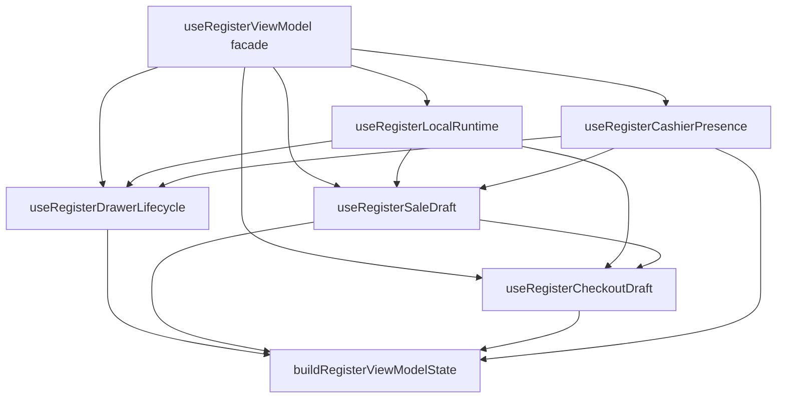
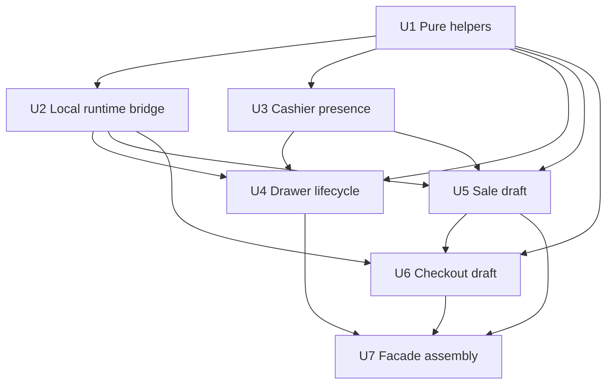
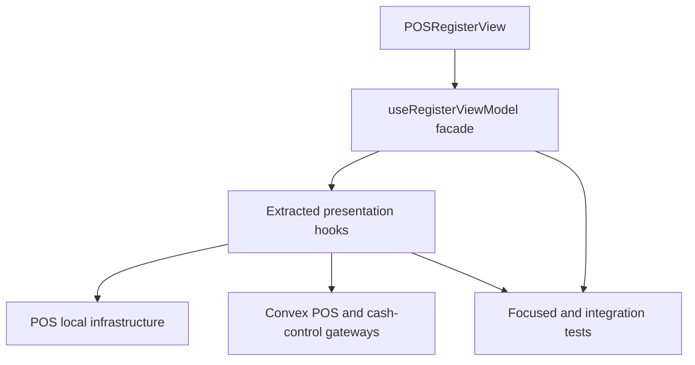

# refactor: Modularize POS register view model boundaries

## Summary

Split the POS register view-model internals into focused presentation and runtime hooks while preserving the existing `RegisterViewModel` facade consumed by `POSRegisterView`. The implementation should reduce `useRegisterViewModel.ts` from a monolithic orchestration hotspot into composable cashier-presence, local-runtime, drawer-lifecycle, sale-draft, checkout, and view-model assembly boundaries, with focused tests guarding each extracted behavior.

---

## Problem Frame

`packages/athena-webapp/src/lib/pos/presentation/register/useRegisterViewModel.ts` is a Graphify hotspot and currently concentrates local POS runtime state, cashier restore, drawer lifecycle, service lines, optimistic cart updates, payment queues, checkout completion, sync presentation, and final UI assembly in one hook. That shape makes local-first POS changes risky because unrelated flows share refs, queue locks, local-store reads, and inline presentation logic.

The refactor must preserve Athena POS continuity: local sales should keep working first, sync/recovery state should remain visible, and the UI contract should stay stable while internals are extracted.

## Requirements

- R1. Preserve the public `RegisterViewModel` contract in `registerUiState.ts` and keep `POSRegisterView` behavior compatible throughout the refactor.
- R2. Extract pure mapping and presentation helpers from `useRegisterViewModel.ts` into testable modules without changing user-facing behavior.
- R3. Move local runtime/store ownership into one boundary that owns store creation, projected read-model refresh, event-append tokens, seed readiness checks, and sync-status wiring.
- R4. Move cashier presence restore/sign-in/sign-out handling into a dedicated boundary that preserves local staff proof, stale-presence, and validation-pending behavior.
- R5. Move drawer lifecycle and gate presentation into a dedicated boundary that preserves opening, closeout, reopen, opening-float correction, terminal repair, and drawer-authority repair flows.
- R6. Improve drawer-open failure presentation by mapping local command `user_error` results to durable operator messages instead of collapsing every failure to generic retry copy.
- R7. Move sale-draft, product/service cart, optimistic quantity, and local availability projection behavior into focused boundaries without weakening local-first durability.
- R8. Move payment queueing and checkout completion behavior into a focused boundary that preserves ordered writes and checkout locks.
- R9. Keep existing integration coverage passing while adding focused unit tests for extracted modules so future changes do not require editing the 12k-line integration test for every helper-level behavior.
- R10. Rebuild Graphify after code changes so `graphify-out/` stays current.

---

## Scope Boundaries

- Do not redesign POS product behavior, payment semantics, local sync ingestion, or the local event contract.
- Do not change `RegisterViewModel` field names or remove existing optional states without a separate UI migration plan.
- Do not move Convex command/query implementations as part of this refactor.
- Do not convert the full register view to a new state-management library.
- Do not rewrite `POSRegisterView.tsx`; only adjust call sites if an extracted boundary changes the import location of type-safe helpers.
- Do not add new support-evidence storage, query, or timeline surfaces as part of this refactor.

### Deferred to Follow-Up Work

- Full test-file decomposition: keep `useRegisterViewModel.test.ts` as the integration guard in this pass; split it into domain-specific integration files only after extracted modules stabilize.
- Larger `POSRegisterView.tsx` component decomposition: this plan focuses on the hook and adjacent presentation helpers, not the 1.9k-line view component.
- Reusable operations support-evidence foundation: plan this as standalone work with sanitized operational events, redaction, timeline/query adapters, and POS drawer/register lifecycle as the first producer.
- Broad support-dashboard redesign: defer until the reusable support-evidence foundation exists.

---

## Context & Research

### Relevant Code and Patterns

- `graphify-out/wiki/index.md` identifies `useRegisterViewModel.ts` as a 72-edge hotspot and a top Athena webapp graph hotspot.
- `packages/athena-webapp/src/lib/pos/presentation/register/useRegisterViewModel.ts` is about 6.8k lines and currently defines many pure helpers before the hook plus many runtime handlers inside the hook.
- `packages/athena-webapp/src/lib/pos/presentation/register/registerUiState.ts` is about 420 lines and already expresses the stable UI-facing contract.
- `packages/athena-webapp/src/components/pos/register/POSRegisterView.tsx` imports `useRegisterViewModel` and consumes the facade; the view should remain a caller, not become the new orchestration home.
- `packages/athena-webapp/src/lib/pos/infrastructure/local/usePosLocalSyncRuntime.ts`, `localCommandGateway.ts`, `localRegisterReader.ts`, `registerReadModel.ts`, `posLocalStore.ts`, `syncStatus.ts`, and `terminalRuntimeStatus.ts` are existing local runtime seams to reuse.
- `packages/athena-webapp/src/lib/pos/presentation/register/catalogSearch.ts`, `catalogSearchPresentation.ts`, `selectors.ts`, and `useRegisterCatalogIndex.ts` show the existing pattern for extracting register presentation logic beside focused tests.
- `packages/athena-webapp/src/lib/pos/presentation/expense/useExpenseRegisterViewModel.ts` provides a smaller parallel register view-model implementation that can inform facade shape, but POS behavior is broader and should not be forced into expense abstractions.

### Institutional Learnings

- `docs/solutions/logic-errors/athena-pos-register-local-catalog-search-2026-05-04.md` says the active POS register is a hot path; local catalog lookup should stay deterministic, with durable command boundaries remaining the authority for inventory/session invariants.
- `docs/solutions/logic-errors/athena-pos-local-sync-review-and-service-lines-2026-05-29.md` says service lines and sync review are first-class POS read-model inputs; do not copy product quantity semantics into service behavior, and keep register-session visibility for synced activity that affects the drawer.
- `docs/brainstorms/2026-05-13-pos-local-first-register-requirements.md` anchors the local-first POS invariant: POS actions should be durably recorded locally before the cashier sees them as complete, with sync/reconciliation separated from ordinary selling.

### External References

- External research was skipped. The work is an internal refactor against established local patterns, with no new framework, API, payment provider, or security primitive.

---

## Key Technical Decisions

- Preserve the facade first: `useRegisterViewModel()` remains the only hook imported by `POSRegisterView` during this pass, so extracted hooks can be introduced without a UI migration.
- Extract by behavior boundary, not by line count: split cashier presence, local runtime, drawer lifecycle, sale draft, checkout/payment, and final assembly because those are independently testable state machines.
- Keep infrastructure under `infrastructure/local`: presentation hooks should compose existing local runtime primitives instead of moving IndexedDB, sync scheduler, or command gateway code into presentation.
- Add pure-helper tests before moving large chunks: helper extraction should be behavior-preserving and covered with fast tests where possible before the integration facade changes.
- Improve drawer error presentation inside the drawer boundary: local command results already carry `CommandResult` shape; mapping known `user_error` messages gives operators better recovery guidance without changing command semantics.
- Treat the current integration test as the compatibility suite: focused tests should grow around extracted modules, but the existing `useRegisterViewModel.test.ts` remains the end-to-end view-model regression guard.
- Rebuild generated graph output after code changes: repo instructions require `bun run graphify:rebuild` after modifying code files.

---

## Open Questions

### Resolved During Planning

- Primary extraction boundary: preserve the `RegisterViewModel` facade and extract internal modules behind it rather than changing `POSRegisterView`.
- Origin document usage: the local-first POS requirements are relevant constraints, but there is no direct upstream requirements document for this refactor.
- External research: skip; current repo patterns are sufficient.

### Deferred to Implementation

- Exact extracted module names: use the names in this plan as directional names; adjust if implementation reveals clearer local naming.
- Exact helper grouping: pure helpers may split into several files if a single helper module becomes too broad.
- Exact drawer error mapping table: derive it from current `localCommandGateway` `CommandResult` outputs and existing operator-copy tone during implementation.
- Whether to move all helper tests out of `useRegisterViewModel.test.ts`: defer broad test reorganization until extracted modules are stable.

---

## High-Level Technical Design

> *This illustrates the intended approach and is directional guidance for review, not implementation specification. The implementing agent should treat it as context, not code to reproduce.*

The facade should mostly gather store, terminal, staff, route, and Convex gateway inputs, then compose extracted hooks and return the existing `RegisterViewModel`. Each extracted hook should expose stable state/actions to the facade, not directly to `POSRegisterView`.

---

## Implementation Units

- U1. **Extract pure register mapping helpers**

**Goal:** Move behavior-free helper functions out of `useRegisterViewModel.ts` so later hook extraction can depend on small tested modules.

**Requirements:** R1, R2, R9

**Dependencies:** None

**Files:**
- Create: `packages/athena-webapp/src/lib/pos/presentation/register/registerCashierPresence.ts`
- Create: `packages/athena-webapp/src/lib/pos/presentation/register/registerCartProjection.ts`
- Create: `packages/athena-webapp/src/lib/pos/presentation/register/registerCheckoutProjection.ts`
- Create: `packages/athena-webapp/src/lib/pos/presentation/register/registerDrawerPresentation.ts`
- Test: `packages/athena-webapp/src/lib/pos/presentation/register/registerCashierPresence.test.ts`
- Test: `packages/athena-webapp/src/lib/pos/presentation/register/registerCartProjection.test.ts`
- Test: `packages/athena-webapp/src/lib/pos/presentation/register/registerCheckoutProjection.test.ts`
- Test: `packages/athena-webapp/src/lib/pos/presentation/register/registerDrawerPresentation.test.ts`
- Modify: `packages/athena-webapp/src/lib/pos/presentation/register/useRegisterViewModel.ts`

**Approach:**
- Start with pure functions that already accept complete inputs and return values: cashier presence validation, service checkout block messages, local cart item mapping, payment combining, local availability consumption, completed-sale payload construction, closeout id selection, and drawer gate mode derivation.
- Keep imports one-directional: extracted helpers may import shared types and existing presentation/domain helpers, but must not import `useRegisterViewModel.ts`.
- Avoid broad "utils" files. Group helpers by behavior so future hook modules have obvious homes.

**Execution note:** Add characterization tests for extracted helpers before deleting their inline copies from the hook.

**Patterns to follow:**
- `packages/athena-webapp/src/lib/pos/presentation/register/catalogSearch.ts`
- `packages/athena-webapp/src/lib/pos/presentation/register/catalogSearchPresentation.ts`
- `packages/athena-webapp/src/lib/pos/presentation/register/selectors.ts`

**Test scenarios:**
- Happy path: valid restored cashier presence for the current store/terminal returns restored state with display metadata intact.
- Edge case: mismatched restored cashier presence scope returns the existing failed or missing state without setting staff proof.
- Happy path: local cart read-model items map to `CartItem` shape with pending checkout and provisional import identifiers preserved.
- Edge case: service checkout block returns no message when service lines have profile-backed customer attribution.
- Error path: service checkout block returns an actionable customer-attribution message when service lines exist without usable customer details.
- Happy path: payment combining merges same-method payments while preserving total amount and current payment method semantics.
- Edge case: closeout id resolution prefers the active local register session where current behavior expects it.
- Integration: extracted drawer gate mode helper returns the same modes currently asserted by `useRegisterViewModel.test.ts` for terminal repair, drawer-authority repair, closeout blocked, and opening-float correction.

**Verification:**
- Pure helper tests pass.
- `useRegisterViewModel.test.ts` remains behaviorally unchanged after helper extraction.

---

- U2. **Extract local runtime and store bridge**

**Goal:** Move IndexedDB store ownership, local command gateway creation, projected read-model refresh, seed readiness checks, event-append tokens, and sync-status runtime wiring out of the main hook.

**Requirements:** R1, R3, R7, R9, R10

**Dependencies:** U1

**Files:**
- Create: `packages/athena-webapp/src/lib/pos/presentation/register/useRegisterLocalRuntime.ts`
- Test: `packages/athena-webapp/src/lib/pos/presentation/register/useRegisterLocalRuntime.test.ts`
- Modify: `packages/athena-webapp/src/lib/pos/presentation/register/useRegisterViewModel.ts`
- Modify: `packages/athena-webapp/src/lib/pos/infrastructure/local/usePosLocalSyncRuntime.test.ts` *(only if extracted wiring reveals missing coverage in the existing runtime hook)*

**Approach:**
- Keep `createPosLocalStore`, `createLocalCommandGateway`, `readProjectedLocalRegisterModel`, and `usePosLocalSyncRuntimeStatus` composition inside one register-local runtime hook.
- Expose a narrow result to the facade: `localStore`, `localCommandGateway`, `localRegisterReadModel`, `refreshLocalRegisterReadModel`, `noteLocalRegisterEventChanged`, `hasProvisionedLocalSyncSeed`, sync source/presentation inputs, local staff authority readiness, and stable refs needed for staff proof lookup.
- Ensure there is one store factory path for register presentation instead of creating fresh stores in unrelated callbacks.
- Keep `usePosLocalSyncRuntimeStatus` in infrastructure; this unit only centralizes how the register facade consumes it.

**Execution note:** Characterize current event-token and read-model refresh behavior before moving callbacks.

**Patterns to follow:**
- `packages/athena-webapp/src/lib/pos/infrastructure/local/usePosLocalSyncRuntime.ts`
- `packages/athena-webapp/src/lib/pos/infrastructure/local/localRegisterReader.ts`
- `packages/athena-webapp/src/lib/pos/infrastructure/local/localCommandGateway.ts`

**Test scenarios:**
- Happy path: the hook creates a stable local store and command gateway across rerenders when terminal identity is unchanged.
- Happy path: appending a local event increments the event token and causes the projected read model to refresh.
- Edge case: missing `activeStoreId`, missing terminal id, or unavailable IndexedDB returns seed readiness false without throwing.
- Edge case: staff proof lookup returns a token only for the currently authenticated staff profile.
- Integration: local sync retry invokes the runtime retry callback and the register bootstrap retry callback.
- Integration: projected local read-model sync status still feeds `buildPosSyncStatusPresentation` through the same status source precedence.

**Verification:**
- `useRegisterLocalRuntime.test.ts` covers local store and sync wiring.
- Existing local runtime tests continue to pass.
- `useRegisterViewModel.ts` no longer directly creates ad hoc local stores for seed/read-model checks.

---

- U3. **Extract cashier presence and staff authority flow**

**Goal:** Move cashier restore, validation-pending state, staff proof attachment, local staff authority readiness, authenticated-staff display, and sign-out presence cleanup into a focused boundary.

**Requirements:** R1, R4, R7, R9

**Dependencies:** U1, U2

**Files:**
- Create: `packages/athena-webapp/src/lib/pos/presentation/register/useRegisterCashierPresence.ts`
- Test: `packages/athena-webapp/src/lib/pos/presentation/register/useRegisterCashierPresence.test.ts`
- Modify: `packages/athena-webapp/src/lib/pos/presentation/register/useRegisterViewModel.ts`
- Modify: `packages/athena-webapp/src/lib/pos/presentation/register/useRegisterViewModel.test.ts`

**Approach:**
- Encapsulate `staffProfileId`, `staffProofToken`, `localAuthenticatedStaff`, `cashierPresenceRestore`, and local staff authority status.
- Keep the restoration sequence intact: wait for store day readiness, read organization-scoped cashier presence where available, validate offline freshness, clear mismatched/expired presence, and expose validation-pending restored cashier metadata to the auth dialog.
- Keep sign-out local presence cleanup inside this boundary, but let the facade provide sale-hold/void callbacks so sign-out still respects active sale continuity.
- Keep staff proof attachment to pending local events tied to successful proof-bearing authentication.

**Execution note:** Preserve existing cashier-presence integration tests before extracting; add focused hook tests for stale/mismatched presence cases.

**Patterns to follow:**
- `packages/athena-webapp/src/components/pos/CashierAuthDialog.test.tsx`
- `packages/athena-webapp/src/lib/pos/infrastructure/local/terminalStaffAuthorityRefresh.ts`
- `packages/athena-webapp/src/lib/pos/presentation/register/registerCashierPresence.ts`

**Test scenarios:**
- Happy path: proof-bearing authentication sets staff id, staff proof token, local authenticated staff display, and writes cashier presence.
- Happy path: valid restored presence restores the cashier and exposes no auth dialog.
- Edge case: restored presence with expired offline freshness enters validation-pending or failed state according to current behavior.
- Edge case: mismatched organization/store/terminal presence is cleared and does not authenticate the cashier.
- Error path: local presence clear failure keeps the cashier signed in and surfaces the existing sign-out failure copy.
- Integration: attaching a new staff proof to pending events nudges local sync.
- Integration: auth dialog props from the facade remain unchanged for validation-pending restored cashier unlock.

**Verification:**
- Cashier-presence focused tests cover restore/sign-in/sign-out branches.
- Existing `useRegisterViewModel.test.ts` cashier presence cases remain green.

---

- U4. **Extract drawer lifecycle and gate presentation**

**Goal:** Move drawer gate mode derivation, drawer opening, closeout, reopen, opening-float correction, terminal setup repair, drawer-authority retry, and closeout control assembly out of the main hook.

**Requirements:** R1, R5, R6, R9

**Dependencies:** U1, U2, U3

**Files:**
- Create: `packages/athena-webapp/src/lib/pos/presentation/register/useRegisterDrawerLifecycle.ts`
- Test: `packages/athena-webapp/src/lib/pos/presentation/register/useRegisterDrawerLifecycle.test.ts`
- Modify: `packages/athena-webapp/src/lib/pos/presentation/register/registerDrawerPresentation.ts`
- Modify: `packages/athena-webapp/src/lib/pos/presentation/register/useRegisterViewModel.ts`
- Modify: `packages/athena-webapp/src/lib/pos/presentation/register/useRegisterViewModel.test.ts`
- Test: `packages/athena-webapp/src/lib/pos/infrastructure/local/localCommandGateway.test.ts`

**Approach:**
- Encapsulate drawer draft state (`openingFloat`, notes, correction fields, closeout counted cash/notes), submitting flags, drawer error message, and drawer gate mode.
- Keep lifecycle commands local-first: open drawer, start closeout, reopen register, and terminal repair must record local evidence or preserve existing failure behavior before the UI proceeds.
- Map `LocalOpenDrawerResult` `user_error` messages to durable operator-facing drawer messages. The first pass should normalize known local command causes, such as missing cashier identity, drawer authority blocks, lifecycle review blocks, another active drawer, missing terminal seed, and local persistence failure.
- Keep closeout approval and opening-float correction command approval behavior unchanged.
- Expose `drawerGate` and `closeoutControl` objects that still satisfy `RegisterViewModel`.

**Execution note:** Implement drawer error mapping test-first because it is the only intentional behavior improvement in this refactor.

**Patterns to follow:**
- `packages/athena-webapp/src/lib/pos/infrastructure/local/localCommandGateway.ts`
- `packages/athena-webapp/src/components/pos/register/RegisterDrawerGate.tsx`
- `packages/athena-webapp/src/lib/errors/operatorMessages.ts`
- `docs/product-copy-tone.md`

**Test scenarios:**
- Happy path: opening a drawer locally sets a local operable register session and clears drawer error state.
- Error path: local open-drawer `user_error` for missing cashier identity maps to sign-in recovery copy, not generic retry copy.
- Error path: drawer-authority and lifecycle review failures map to drawer repair or review-oriented copy without claiming the sale is lost.
- Error path: local append/store failure maps to retryable local persistence copy and keeps the drawer gate open.
- Edge case: online drawer opening still requires fresh staff proof; offline drawer opening preserves current proof behavior.
- Happy path: zero-variance cloud-backed closeout still records locally and marks the local event synced when the server closeout succeeds.
- Happy path: manager reopening of a local closing register restores local operable register state.
- Integration: terminal repair mode still auto-attempts repair once per store/terminal key.
- Integration: `drawerGate` and `closeoutControl` props consumed by `RegisterDrawerGate` remain shape-compatible.

**Verification:**
- Drawer lifecycle focused tests pass.
- Existing drawer/open/closeout/reopen cases in `useRegisterViewModel.test.ts` pass.
- Operator-facing drawer failure copy follows `docs/product-copy-tone.md`.

---

- U5. **Extract sale draft, catalog, service, and optimistic cart behavior**

**Goal:** Move active-session projection, local active sale reconciliation, product search overlay, service search/drafts, local availability overlay, optimistic cart quantities/products, and cart mutation queue behavior into focused boundaries.

**Requirements:** R1, R2, R7, R9

**Dependencies:** U1, U2, U3

**Files:**
- Create: `packages/athena-webapp/src/lib/pos/presentation/register/useRegisterSaleDraft.ts`
- Create: `packages/athena-webapp/src/lib/pos/presentation/register/useRegisterProductAndServiceSearch.ts`
- Test: `packages/athena-webapp/src/lib/pos/presentation/register/useRegisterSaleDraft.test.ts`
- Test: `packages/athena-webapp/src/lib/pos/presentation/register/useRegisterProductAndServiceSearch.test.ts`
- Modify: `packages/athena-webapp/src/lib/pos/presentation/register/registerCartProjection.ts`
- Modify: `packages/athena-webapp/src/lib/pos/presentation/register/useRegisterViewModel.ts`
- Modify: `packages/athena-webapp/src/lib/pos/presentation/register/useRegisterViewModel.test.ts`
- Test: `packages/athena-webapp/src/lib/pos/presentation/register/catalogSearch.test.ts`
- Test: `packages/athena-webapp/src/lib/pos/presentation/register/catalogSearchPresentation.test.ts`

**Approach:**
- Keep product catalog indexing in existing `catalogSearch` modules; this unit only extracts the register-specific composition of catalog rows, bounded availability queries, pending checkout overlays, exact auto-add, and service search.
- Encapsulate optimistic cart refs/state and the cart mutation queue so product add/update/remove/clear logic no longer shares low-level refs across the entire view-model hook.
- Keep service lines first-class and distinct from product quantity semantics: duplicate services stay disabled/no-op, amount-required service drafts persist locally, and checkout blocking remains customer-attribution based.
- Preserve the local-first invariant: cart/service UI state should advance only after durable local event writes, except for existing optimistic UI states that already roll back on local write failure.

**Execution note:** Add characterization coverage around optimistic cart rollback and service duplicate behavior before extracting handlers.

**Patterns to follow:**
- `packages/athena-webapp/src/lib/pos/presentation/register/catalogSearch.ts`
- `packages/athena-webapp/src/lib/pos/presentation/register/catalogSearchPresentation.ts`
- `packages/athena-webapp/src/lib/pos/infrastructure/local/registerAvailabilitySnapshot.ts`
- `docs/solutions/logic-errors/athena-pos-register-local-catalog-search-2026-05-04.md`
- `docs/solutions/logic-errors/athena-pos-local-sync-review-and-service-lines-2026-05-29.md`

**Test scenarios:**
- Happy path: exact barcode product auto-add still happens once and clears the search query after durable local write.
- Edge case: exact out-of-stock and availability-unknown products remain visible without auto-adding.
- Edge case: trusted availability subtracts unsynced local cart consumption but does not subtract provisional import or pending checkout rows incorrectly.
- Error path: local cart append failure rolls back optimistic product additions and existing quantity updates.
- Error path: local clear-cart failure restores visible cart items.
- Happy path: service search results add one local service line and clear product/search entry state.
- Edge case: adding the same service twice does not append a second local service event or visible duplicate.
- Error path: service edit/remove failure keeps previous service draft state and surfaces safe retry copy.
- Integration: pending checkout item definitions are recorded before the cart line that references them.
- Integration: product and service result composition does not show product no-results copy when service results match.

**Verification:**
- New sale draft/search tests cover extracted behavior.
- Existing catalog and register view-model search/cart/service tests remain green.

---

- U6. **Extract checkout, payment, and session action queues**

**Goal:** Move payment state, payment mutation queueing, checkout completion lock, local checkout persistence, completed transaction projection, hold/void/resume/start session orchestration, customer commit queue, and start-new-transaction behavior into focused boundaries.

**Requirements:** R1, R7, R8, R9

**Dependencies:** U1, U2, U5

**Files:**
- Create: `packages/athena-webapp/src/lib/pos/presentation/register/useRegisterCheckoutDraft.ts`
- Create: `packages/athena-webapp/src/lib/pos/presentation/register/useRegisterSessionActions.ts`
- Test: `packages/athena-webapp/src/lib/pos/presentation/register/useRegisterCheckoutDraft.test.ts`
- Test: `packages/athena-webapp/src/lib/pos/presentation/register/useRegisterSessionActions.test.ts`
- Modify: `packages/athena-webapp/src/lib/pos/presentation/register/registerCheckoutProjection.ts`
- Modify: `packages/athena-webapp/src/lib/pos/presentation/register/useRegisterViewModel.ts`
- Modify: `packages/athena-webapp/src/lib/pos/presentation/register/useRegisterViewModel.test.ts`

**Approach:**
- Centralize the three checkout queues (`cart`, `payment`, `service`) behind a narrow queue/lock interface shared by sale draft and checkout draft modules.
- Keep local payment persistence ordered: add/update/remove/clear writes local payment state before updating UI payment state.
- Preserve checkout completion behavior: wait for queued sale/payment/service mutations, refresh local cart projection, require cart/service content, enforce service customer attribution, require sufficient payment, write a local completed transaction, then set completion UI state.
- Keep session actions focused on sale lifecycle: hold current cloud session, clear/void local or cloud sale, resume held session, start a new local sale, and navigate/sign-out guards.
- Keep customer attribution commits serialized and session-scoped so delayed writes cannot apply to previous sessions.

**Execution note:** Characterize queue ordering and completion-lock behavior before extraction.

**Patterns to follow:**
- `packages/athena-webapp/src/lib/pos/application/useCases/holdSession.ts`
- `packages/athena-webapp/src/lib/pos/infrastructure/convex/sessionGateway.ts`
- `packages/athena-webapp/src/lib/pos/infrastructure/local/localCommandGateway.ts`
- `packages/athena-webapp/src/lib/pos/presentation/register/registerCheckoutProjection.ts`

**Test scenarios:**
- Happy path: adding same-method payments combines totals and persists the local payment state before UI update.
- Edge case: rapid payment additions use the latest queued payment state instead of dropping an update.
- Error path: local payment persistence failure keeps previous payment UI state.
- Error path: payment edits starting during checkout completion are rejected with the existing lock message.
- Happy path: checkout completion waits for pending service and payment writes before building the local completed sale.
- Edge case: checkout completion uses refreshed local cart items when local projection has newer state than the visible cart.
- Error path: local transaction write failure does not show a completed transaction.
- Integration: completing a cloud-backed local sale does not resurrect the cloud active session after reload.
- Integration: customer attribution commits are serialized and ignored after unmount or active session change.
- Integration: starting a new transaction resets draft state while preserving cashier identity and bootstrap behavior.

**Verification:**
- Checkout/session focused tests pass.
- Existing payment, completion, hold/void/resume/customer attribution tests in `useRegisterViewModel.test.ts` pass.

---

- U7. **Recompose the facade and update validation ownership**

**Goal:** Make `useRegisterViewModel.ts` a thin composition facade, assemble the final `RegisterViewModel` through focused builders, update tests to cover extracted module ownership, and rebuild generated graph artifacts.

**Requirements:** R1, R9, R10

**Dependencies:** U2, U3, U4, U5, U6

**Files:**
- Create: `packages/athena-webapp/src/lib/pos/presentation/register/buildRegisterViewModelState.ts`
- Test: `packages/athena-webapp/src/lib/pos/presentation/register/buildRegisterViewModelState.test.ts`
- Modify: `packages/athena-webapp/src/lib/pos/presentation/register/useRegisterViewModel.ts`
- Modify: `packages/athena-webapp/src/lib/pos/presentation/register/useRegisterViewModel.test.ts`
- Modify: `packages/athena-webapp/src/components/pos/register/POSRegisterView.test.tsx`
- Modify: `scripts/harness-app-registry.ts` *(only if new test files should be added to a focused validation slice)*
- Modify: `graphify-out/`

**Approach:**
- Keep the facade responsible for cross-boundary composition only: active store/terminal/route inputs, Convex gateway hooks, extracted hook calls, and the final `RegisterViewModel` object.
- Move return-object assembly into a pure builder where practical, especially for disabled states, auth dialog props, sync status props, product/service entry props, cart props, checkout props, drawer gate props, and debug shape.
- Keep `debug` output semantically compatible because it is used for support/runtime diagnosis.
- Update validation-map or harness registry only if new files need explicit focused validation routing.
- Run Graphify rebuild after code edits and stage generated outputs with the plan implementation.

**Execution note:** Treat `useRegisterViewModel.test.ts` as the compatibility gate for the facade. Do not delete integration cases just because focused tests exist.

**Patterns to follow:**
- `packages/athena-webapp/src/lib/pos/presentation/register/registerUiState.ts`
- `packages/athena-webapp/src/components/pos/register/POSRegisterView.test.tsx`
- `packages/athena-webapp/docs/agent/testing.md`
- `scripts/harness-app-registry.ts`

**Test scenarios:**
- Happy path: facade returns a complete `RegisterViewModel` for active store, terminal, cashier, open drawer, active sale, and mixed product/service checkout.
- Edge case: no active store or no terminal still returns the existing onboarding/auth/dialog behavior.
- Edge case: product and service entry disabled states stay aligned when cashier presence blocks sale, drawer gate is visible, or drawer binding is blocked.
- Integration: `POSRegisterView` still renders with a mocked `RegisterViewModel` and does not import extracted internal hooks.
- Integration: debug sync flow keeps runtime/read-model/register-state source precedence.
- Integration: focused validation slice includes new module tests when harness ownership requires it.

**Verification:**
- `useRegisterViewModel.ts` is substantially smaller and mostly composition-oriented.
- All new focused tests pass.
- Existing register view-model and POS register view tests pass.
- `bun run graphify:rebuild` is reflected in generated graph artifacts.

---

## System-Wide Impact

- **Interaction graph:** The register view remains connected to one facade, while behavior-specific hooks own cashier presence, drawer lifecycle, sale draft, and checkout state.
- **Error propagation:** Local command failures should remain browser-safe `CommandResult` values; drawer-open errors should render durable operator copy instead of generic fallback where known.
- **State lifecycle risks:** Queue locks and refs must remain coherent across extracted hooks, especially cart/payment/service queues, checkout completion, local read-model refresh, and unmount cleanup.
- **API surface parity:** `RegisterViewModel` and `POSRegisterView` props remain unchanged; extracted modules are internal implementation details.
- **Integration coverage:** Existing `useRegisterViewModel.test.ts` and `POSRegisterView.test.tsx` remain required because focused hook tests will not prove the complete register workflow.
- **Unchanged invariants:** POS actions that appear complete to the cashier must still be durably recorded locally first where current local-first behavior requires it.

---

## Risks & Dependencies

| Risk | Mitigation |
|------|------------|
| Extracted hooks accidentally change checkout/cart ordering | Characterize queue behavior before extraction and keep integration tests for rapid payment edits, pending service writes, and checkout locks. |
| Facade contract drift breaks `POSRegisterView` | Preserve `registerUiState.ts`, add builder tests, and keep `POSRegisterView.test.tsx` mocked against the same facade shape. |
| Drawer error improvement overstates backend/local state | Map only known `CommandResult` causes and fall back to existing generic retry copy for unknown failures. |
| Test suite becomes fragmented without integration confidence | Add focused tests but keep the current view-model integration test as the high-level compatibility suite. |
| Local runtime store creation gets duplicated again | Centralize local store/gateway/read-model/sync wiring in `useRegisterLocalRuntime` and make ad hoc store creation a review smell. |
| Graphify generated files drift after code movement | Run `bun run graphify:rebuild` after implementation changes. |

---

## Documentation / Operational Notes

- No operator documentation change is required for a behavior-preserving refactor.
- If drawer-open failure copy changes materially, keep language aligned with `docs/product-copy-tone.md`: calm, operational, and recovery-oriented.
- Update `docs/solutions/` only if implementation uncovers a reusable bug pattern or `pr:athena` requires a solution note.
- Use the Athena webapp testing guide to choose focused validation; this surface falls under POS local sync/register infrastructure and POS register bootstrap/drawer-gate validation.

---

## Sources & References

- Related requirements: `docs/brainstorms/2026-05-13-pos-local-first-register-requirements.md`
- Related prior plan: `docs/plans/2026-05-13-001-feat-pos-local-first-register-plan.md`
- Graph navigation: `graphify-out/wiki/index.md`
- Package guide: `packages/athena-webapp/AGENTS.md`
- Testing guide: `packages/athena-webapp/docs/agent/testing.md`
- Code map: `packages/athena-webapp/docs/agent/code-map.md`
- Related code: `packages/athena-webapp/src/lib/pos/presentation/register/useRegisterViewModel.ts`
- Related code: `packages/athena-webapp/src/lib/pos/presentation/register/registerUiState.ts`
- Related code: `packages/athena-webapp/src/components/pos/register/POSRegisterView.tsx`
- Related code: `packages/athena-webapp/src/lib/pos/infrastructure/local/localCommandGateway.ts`
- Related code: `packages/athena-webapp/src/lib/pos/infrastructure/local/usePosLocalSyncRuntime.ts`
- Institutional learning: `docs/solutions/logic-errors/athena-pos-register-local-catalog-search-2026-05-04.md`
- Institutional learning: `docs/solutions/logic-errors/athena-pos-local-sync-review-and-service-lines-2026-05-29.md`
