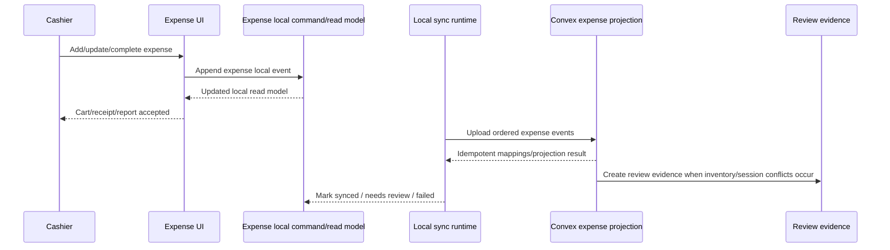

# feat: Align expense flow to local-first POS

## Summary

This plan moves expense session, cart, and completion actions onto a durable local-first command boundary that mirrors POS continuity without reusing POS sale/drawer commands. Expense will append expense-specific local events first, project those events into existing Convex expense records in the background, and preserve the current SKU availability exception work as part of sync/reconciliation.

---

## Problem Frame

Expense product search now shares the POS local catalog index, but the expense transaction path still waits on Convex mutations for session creation, cart edits, inventory holds, and completion. That makes trusted inventory items slower than provisional rows and leaves expense less resilient than POS when the cashier is physically holding the item or the network is unreliable.

---

## Assumptions

*This plan was authored without synchronous scope confirmation after research. The items below are agent inferences that should be reviewed during implementation and issue execution.*

- Trusted zero-available expense items should proceed locally with trusted product/SKU identity and become inventory review evidence during projection when cloud inventory cannot satisfy the expense.
- Expense local events should be first-class event types, not POS sale events with an expense discriminator.
- Expense sync should define a drawerless terminal-scoped sync scope instead of requiring or faking `localRegisterSessionId`.
- Local cart edits should not patch cloud `quantityAvailable` holds; trusted inventory effects should apply idempotently during projected completion.
- Pre-cloud receipt/report display should use a stable terminal-scoped local expense number that later maps to the cloud expense transaction/report.
- Expense sessions should not expire out from under the cashier; stale age can be sync/review metadata, not a local-session blocker.

---

## Requirements

- R1. Expense cart and session actions must be durable locally before the cashier sees them as accepted, even when the browser is online.
- R2. Expense local state must survive reloads and offline/online transitions for active, held, voided, and completed local expense sessions.
- R3. Expense sync must upload local expense events in deterministic order and accept retries idempotently without duplicating sessions, items, transactions, receipts, inventory effects, or review evidence.
- R4. Trusted, active provisional import, and pending checkout SKU sources must remain distinct through local events, read models, sync projection, and completed transaction items.
- R5. Trusted zero-available physical-item expenses must preserve cashier continuity and route stock mismatch to review instead of blocking or rewriting completed local expense history.
- R6. Expense completion must produce local receipt/report evidence immediately, then map to cloud expense reports after sync.
- R7. Expense must remain drawerless and must not adopt POS register-session gates or POS sale command semantics.
- R8. Existing operator-facing command failures and recovery copy must stay calm, browser-safe, and routed through current command-result/toast patterns when cloud projection reports failures.
- R9. Expense sessions must not expire automatically in the cashier path; active, held, and completed-pending-sync local sessions remain recoverable without age-based expiry. Reconciliation may mark a local session synced, failed, or needs-review, but it must not delete local receipt/report evidence or make a held session unrecoverable.

---

## Scope Boundaries

- POS sale flow, drawer opening, payment collection, and register closeout behavior are unchanged.
- General offline support for inventory, procurement, analytics, staff management, and expense report administration is out of scope.
- Cross-terminal real-time inventory coordination while offline is out of scope; conflicts become review evidence.
- Payment-provider behavior is out of scope because expense completion does not collect customer tender.
- Automatic inventory conflict resolution is out of scope.
- Synthetic POS register-session ids for expense sync are out of scope; expense must not satisfy sync by pretending to be a POS sale/register timeline.

### Deferred to Follow-Up Work

- Completed expense transaction reversals while offline: keep pre-completion local void in scope, but treat post-completion reversal/void as a separate audited workflow if it is not already fully covered by existing cloud transaction void semantics.
- Broader manager review UI enhancements: projection should create/status review evidence, but major new review workspace design can be split if existing operational/review rails are sufficient for first delivery.

---

## Context & Research

### Relevant Code and Patterns

- `packages/athena-webapp/src/lib/pos/infrastructure/local/posLocalStore.ts`, `syncContract.ts`, `localCommandGateway.ts`, `registerReadModel.ts`, and `usePosLocalSyncRuntime.ts` show the POS local event/log/read-model pattern to mirror.
- `packages/athena-webapp/convex/pos/application/sync/ingestLocalEvents.ts` and `projectLocalEvents.ts` show idempotent cloud acceptance, local-to-cloud mapping, and projection.
- `packages/athena-webapp/src/hooks/useExpenseOperations.ts` and `src/hooks/useSessionManagementExpense.ts` are the current mutation-backed expense cart/session boundaries to replace or wrap.
- `packages/athena-webapp/convex/inventory/expenseSessionItems.ts`, `expenseSessions.ts`, and `expenseTransactions.ts` are the current cloud command/projection targets.
- Current branch work already threads `pendingCheckoutItemId`, `inventoryImportProvisionalSkuId`, and `inventoryHoldApplied` through expense items and transactions; preserve that source metadata.

### Institutional Learnings

- `docs/solutions/architecture/athena-pos-local-first-sync-2026-05-13.md`: local event logs are the first durable POS record; cloud projection is background acceptance and reconciliation.
- `docs/solutions/architecture/athena-pos-always-local-first-register-2026-05-14.md`: online status must not switch commands back to cloud-first behavior.
- `docs/solutions/architecture/athena-pos-local-first-runtime-feedback-2026-05-15.md`: local event append is the runtime wake-up boundary for sync feedback.
- `docs/solutions/performance/athena-expense-register-local-index-parity-2026-05-08.md`: expense may share POS catalog/search mechanics while preserving an expense-specific workflow boundary.
- `docs/solutions/architecture/athena-pos-pending-checkout-item-recovery-2026-06-06.md`: pending/provisional item quantities are evidence, not trusted inventory.

### External References

- None. The local POS implementation is the authoritative pattern for this repo.

---

## Key Technical Decisions

- First-class expense local events: keeps expense audit/projection clear and avoids overloading POS sale semantics.
- Local append before success: matches POS continuity and prevents Convex latency or availability from determining cashier acceptance.
- Background projection into existing Convex expense tables: preserves current reports and admin surfaces while changing the write boundary.
- No cloud cart holds for local edits: avoids double-decrement/rollback hazards; trusted inventory is applied once during completion projection.
- Source-aware line identity: trusted, provisional import, and pending checkout lines with the same SKU remain separate unless their source key matches.
- Local receipt/report number before cloud mapping: gives the cashier stable evidence immediately and supports later cloud lookup/mapping.
- Drawerless terminal-scoped expense sync: avoids smuggling expense events through POS register-session cursors, validators, mappings, and review semantics.
- No automatic expense-session expiry: local sessions age, sync, and review like POS local state instead of blocking cashier recovery.

---

## Open Questions

### Resolved During Planning

- Should trusted zero-available physical items be allowed? Yes, locally proceed and create inventory review evidence if projection cannot satisfy trusted stock.
- Should expense reuse POS sale events? No, define expense-specific local events and projection.
- Should local cart edits patch cloud holds? No, not in the local-first path; projection owns cloud inventory effects.
- Should expense sessions expire like current cloud expense sessions? No. Match POS continuity: stale local sessions remain recoverable and age becomes sync/review metadata.

### Deferred to Implementation

- Exact local event names and payload helper names: decide while extending the local sync contract, but keep them expense-specific and versionable.
- Exact review record destination for stock/session conflicts: prefer existing operational/review rails; create a minimal new rail only if no existing one can represent the conflict.
- Final local number format: use existing POS local numbering conventions where possible, but implementation can tune the exact prefix/sequence.

---

## High-Level Technical Design

> *This illustrates the intended approach and is directional guidance for review, not implementation specification. The implementing agent should treat it as context, not code to reproduce.*

---

## Implementation Units

- U1. **Define expense local event contract and storage projection**

**Goal:** Add first-class local expense event types, ids, ordering, and read-model projection so expense sessions and carts can be rebuilt locally.

**Requirements:** R1, R2, R3, R4, R9

**Dependencies:** None

**Files:**
- Modify: `packages/athena-webapp/src/lib/pos/infrastructure/local/posLocalStore.ts`
- Create: `packages/athena-webapp/src/lib/pos/infrastructure/local/expenseReadModel.ts`
- Create: `packages/athena-webapp/src/lib/pos/infrastructure/local/expenseLocalCommandGateway.ts`
- Test: `packages/athena-webapp/src/lib/pos/infrastructure/local/expenseReadModel.test.ts`
- Test: `packages/athena-webapp/src/lib/pos/infrastructure/local/expenseLocalCommandGateway.test.ts`
- Test: `packages/athena-webapp/src/lib/pos/infrastructure/local/syncContract.test.ts`

**Approach:**
- Extend local event typing to include expense session lifecycle, cart line, completion, hold/resume, and pre-completion void events.
- Preserve local ids for expense session, item, transaction/report, and source metadata.
- Project local events into an expense read model that exposes active, held, completed-pending-sync, and needs-review states.
- Project local events into an expense read model that exposes active, held, pre-completion voided/canceled, completed-pending-sync, synced, and needs-review states.
- Keep append ordering terminal-local and immutable, following POS local event ordering.
- Do not introduce session expiration as a local recovery gate; retain age metadata for sync/review surfaces.

**Execution note:** Add characterization tests for existing POS local event behavior before extending shared contract code.

**Patterns to follow:**
- `packages/athena-webapp/src/lib/pos/infrastructure/local/localCommandGateway.ts`
- `packages/athena-webapp/src/lib/pos/infrastructure/local/registerReadModel.ts`
- `packages/athena-webapp/src/lib/pos/presentation/register/registerCartProjection.ts`

**Test scenarios:**
- Happy path: appending session-started and item-added events rebuilds an active local expense cart after reload.
- Happy path: provisional and pending source ids survive add, quantity update, hold, resume, and completion events.
- Happy path: an old held local expense session remains resumable after reload instead of expiring.
- Edge case: trusted and provisional rows with the same SKU remain distinct local lines.
- Edge case: rapid add/update/remove/clear events replay deterministically into the final cart.
- Edge case: pre-completion voided/canceled local expense sessions replay as non-active and do not create transactions.
- Error path: local append failure returns failure and does not present the cart mutation as accepted.
- Integration: local event sequence numbers are stable and included in sync payloads.

**Verification:**
- Expense local events can rebuild the current local session without Convex ids or Convex availability.

---

- U2. **Move expense UI/session operations to local-first commands**

**Goal:** Replace Convex mutation-backed cashier-path cart/session operations with local command appends and read-model rendering.

**Requirements:** R1, R2, R4, R6, R7, R8, R9

**Dependencies:** U1

**Files:**
- Modify: `packages/athena-webapp/src/hooks/useExpenseOperations.ts`
- Modify: `packages/athena-webapp/src/hooks/useSessionManagementExpense.ts`
- Modify: `packages/athena-webapp/src/hooks/useExpenseSessions.ts`
- Modify: `packages/athena-webapp/src/stores/expenseStore.ts`
- Modify: `packages/athena-webapp/src/lib/pos/presentation/expense/useExpenseRegisterViewModel.ts`
- Test: `packages/athena-webapp/src/lib/pos/presentation/expense/useExpenseRegisterViewModel.test.ts`
- Test: `packages/athena-webapp/src/hooks/useExpenseSessions.test.ts`
- Test: `packages/athena-webapp/src/hooks/useExpenseOperations.test.ts`

**Approach:**
- Make add/update/remove/clear, create/hold/resume/pre-completion void, and complete use the local expense command gateway as the success boundary.
- Render expense cart/session state from the local read model first, with cloud sessions as mapped/synced context rather than required live state.
- Use source-aware cart item matching instead of SKU-only matching.
- Preserve the current exact-match availability behavior from this branch, including trusted zero-available auto-add and exception rows.
- Remove or bypass cashier-path expiry checks; local active and held expense sessions remain recoverable unless explicitly voided/canceled or completed.

**Execution note:** Implement behavior test-first for mutation-backed rollback cases that should no longer roll back when local append succeeds.

**Patterns to follow:**
- `packages/athena-webapp/src/lib/pos/presentation/register/useRegisterViewModel.ts`
- `packages/athena-webapp/src/lib/pos/presentation/register/registerCartProjection.test.ts`

**Test scenarios:**
- Happy path: offline add of a trusted item updates the cart and survives hook rerender/reload without calling `addOrUpdateExpenseItem`.
- Happy path: exact trusted zero-available match auto-adds locally and clears the query.
- Happy path: held local expense resumes with the same cart and source metadata.
- Happy path: an old active or held local expense session remains visible/resumable in the cashier path instead of being removed by expiry logic.
- Edge case: add/update/remove while a sync attempt is pending still appends local events in order.
- Error path: local append failure restores the prior visible cart and shows safe operator copy.
- Integration: `POSRegisterView` expense mode receives cart/session props from local expense state, not cloud-only session queries.

**Verification:**
- Expense cart operations no longer wait on Convex mutations and remain drawerless.

---

- U3. **Project local expense events into Convex idempotently**

**Goal:** Add cloud ingestion/projection for expense local events that creates or updates existing expense sessions, items, transactions, reports, and local-to-cloud mappings once.

**Requirements:** R3, R4, R6, R7, R9

**Dependencies:** U1, U6

**Files:**
- Modify: `packages/athena-webapp/convex/pos/application/sync/ingestLocalEvents.ts`
- Modify: `packages/athena-webapp/convex/pos/application/sync/projectLocalEvents.ts`
- Modify: `packages/athena-webapp/convex/pos/public/sync.ts`
- Modify: `packages/athena-webapp/convex/inventory/expenseSessionItems.ts`
- Modify: `packages/athena-webapp/convex/inventory/expenseSessions.ts`
- Modify: `packages/athena-webapp/convex/inventory/expenseTransactions.ts`
- Modify: `packages/athena-webapp/convex/schemas/pos/expenseSessionItem.ts`
- Modify: `packages/athena-webapp/convex/schemas/pos/expenseTransactionItem.ts`
- Test: `packages/athena-webapp/convex/pos/application/sync/ingestLocalEvents.expense.test.ts`
- Test: `packages/athena-webapp/convex/pos/application/sync/projectLocalEvents.expense.test.ts`
- Test: `packages/athena-webapp/convex/inventory/expenseTransactions.test.ts`
- Test: `packages/athena-webapp/convex/inventory/expenseSessions.test.ts`

**Approach:**
- Accept expense local events through the drawerless terminal-scoped sync scope from U6 with explicit event type validation.
- Store local-to-cloud mappings for local expense session/item/transaction/report ids.
- Project local cart/session events to existing expense records where cloud rows are still useful for reports/admin.
- Make retries stable: duplicate event upload returns the same mapping/status and never duplicates side effects.
- Update legacy release/void paths to release only trusted inventory holds that actually exist, preserving current branch `inventoryHoldApplied` semantics.

**Execution note:** Start with sync replay tests before implementation because idempotency is the high-risk behavior.

**Patterns to follow:**
- `packages/athena-webapp/convex/pos/application/sync/ingestLocalEvents.test.ts`
- `packages/athena-webapp/convex/pos/application/sync/projectLocalEvents.test.ts`
- `packages/athena-webapp/convex/pos/application/commands/sessionCommands.ts`

**Test scenarios:**
- Happy path: uploading a local expense session with cart and completion creates one cloud expense transaction and transaction items.
- Edge case: uploading the same events twice returns existing mappings and does not duplicate rows.
- Edge case: local events uploaded after browser reconnect preserve original local completion time/operating date.
- Edge case: stale-age local sessions project without being expired or deleted by the cloud command layer.
- Error path: malformed event payload is rejected without projecting partial expense records.
- Integration: projected transaction items retain pending checkout/provisional ids and `inventoryHoldApplied` values.

**Verification:**
- Cloud records catch up from local expense events with deterministic mappings and no duplicates.

---

- U4. **Handle trusted inventory conflicts and exception sources during projection**

**Goal:** Preserve cashier-completed local expenses while applying trusted inventory effects idempotently and routing stock/source conflicts to review evidence.

**Requirements:** R4, R5, R8

**Dependencies:** U3

**Files:**
- Modify: `packages/athena-webapp/convex/inventory/expenseTransactions.ts`
- Modify: `packages/athena-webapp/convex/pos/application/commands/expenseSessionCommands.ts`
- Modify: `packages/athena-webapp/convex/pos/infrastructure/repositories/expenseSessionCommandRepository.ts`
- Modify: `packages/athena-webapp/convex/operations/operationalEvents.ts`
- Test: `packages/athena-webapp/convex/inventory/expenseTransactions.test.ts`
- Test: `packages/athena-webapp/convex/pos/application/expenseSessionCommands.test.ts`
- Test: `packages/athena-webapp/convex/operations/operationalEvents.test.ts`

**Approach:**
- Treat pending checkout and active provisional import expense lines as evidence-only sources that do not consume trusted stock.
- For trusted lines, decrement `inventoryCount` during projected completion only when cloud stock can satisfy the line.
- When trusted stock cannot satisfy the line, keep the local completed expense and create review/operational evidence instead of deleting or blocking it.
- Preserve `inventoryHoldApplied: false` for trusted no-hold local lines and avoid adding phantom availability on removal/void.

**Execution note:** Add tests for zero-available and insufficient-count physical item cases before changing projection logic.

**Patterns to follow:**
- `docs/solutions/architecture/athena-pos-pending-checkout-item-recovery-2026-06-06.md`
- `packages/athena-webapp/convex/pos/application/commands/expenseSessionCommands.ts`

**Test scenarios:**
- Happy path: trusted line with sufficient stock decrements inventory once on projection.
- Happy path: provisional/pending line projects transaction item evidence and does not decrement trusted inventory.
- Edge case: trusted zero-available but physically held item completes locally and creates needs-review evidence when cloud stock is insufficient.
- Error path: stale provisional import id projects a review conflict instead of silently converting to trusted inventory.
- Integration: void/release paths do not restore `quantityAvailable` for no-hold or exception-source lines.

**Verification:**
- Inventory projection is idempotent, source-aware, and continuity-preserving.

---

- U5. **Expose synced expense status, cloud report mapping, and docs**

**Goal:** Make synced cloud expense reports, local-to-cloud mapping status, and docs align with the local-first expense flow after sync/projection exists.

**Requirements:** R2, R3, R6, R8

**Dependencies:** U3, U4, U7

**Files:**
- Modify: `packages/athena-webapp/src/components/expense/ExpenseCompletion.tsx`
- Modify: `packages/athena-webapp/src/components/pos/expense-reports/ExpenseReportView.tsx`
- Modify: `packages/athena-webapp/docs/agent/code-map.md`
- Modify: `packages/athena-webapp/docs/agent/testing.md`
- Create: `docs/solutions/architecture/athena-expense-local-first-flow-2026-06-17.md`
- Test: `packages/athena-webapp/src/components/expense/ExpenseCompletion.test.tsx`
- Test: `packages/athena-webapp/src/components/pos/expense-reports/ExpenseReportView.test.tsx`

**Approach:**
- Link cloud expense report detail back to local identifiers after sync mapping exists.
- Render synced, needs-review, and failed-sync status from local-to-cloud projection results without taking over U7's pre-cloud receipt/report route.
- Add or update docs/sensors so future expense local-first work is validated like POS local sync work.
- Keep product copy restrained and operational.

**Execution note:** Sensor-only for generated docs updates; test-first for receipt/report behavior.

**Patterns to follow:**
- `docs/solutions/architecture/athena-pos-local-first-runtime-feedback-2026-05-15.md`
- `docs/solutions/architecture/athena-pos-field-evidence-surfaces-2026-05-20.md`
- `docs/product-copy-tone.md`

**Test scenarios:**
- Happy path: once cloud mapping exists, report detail links local and cloud identifiers without changing receipt facts.
- Edge case: needs-review sync status is visible without raw backend wording.
- Error path: failed sync marks retry/review state while U7's local receipt/report remains accessible.
- Integration: docs validation includes new local expense files in the harness map or generated docs.

**Verification:**
- Operators can identify synced, failed-sync, and needs-review expense reports after cloud projection catches up.

---

- U6. **Create a drawerless expense sync scope**

**Goal:** Make the shared local sync boundary capable of uploading expense events without requiring POS register-session identity or semantics.

**Requirements:** R3, R7, R9

**Dependencies:** None

**Files:**
- Modify: `packages/athena-webapp/src/lib/pos/infrastructure/local/syncContract.ts`
- Modify: `packages/athena-webapp/src/lib/pos/infrastructure/local/posLocalStore.ts`
- Modify: `packages/athena-webapp/convex/pos/public/sync.ts`
- Modify: `packages/athena-webapp/convex/pos/application/sync/ingestLocalEvents.ts`
- Modify: `packages/athena-webapp/convex/schemas/pos/posLocalSyncEvent.ts`
- Modify: `packages/athena-webapp/convex/schemas/pos/posLocalSyncMapping.ts`
- Test: `packages/athena-webapp/src/lib/pos/infrastructure/local/syncContract.test.ts`
- Test: `packages/athena-webapp/src/lib/pos/infrastructure/local/posLocalStore.test.ts`
- Test: `packages/athena-webapp/convex/pos/public/sync.expense.test.ts`
- Test: `packages/athena-webapp/convex/pos/application/sync/ingestLocalEvents.expense.test.ts`

**Approach:**
- Add an explicit local sync scope dimension that supports POS register-session timelines and expense terminal/session timelines.
- Keep POS events keyed by existing `localRegisterSessionId` behavior.
- Key expense upload cursors, mappings, and conflict lookups by terminal/store plus local expense session/event identity.
- Reject mixed-scope upload batches rather than silently coercing expense events into POS register sessions.

**Execution note:** Characterize current register-session-only sync behavior first, then add expense scope tests.

**Patterns to follow:**
- `packages/athena-webapp/src/lib/pos/infrastructure/local/syncContract.ts`
- `packages/athena-webapp/convex/pos/application/sync/ingestLocalEvents.ts`

**Test scenarios:**
- Happy path: drawerless expense event receives upload ordering and sync payload without `localRegisterSessionId`.
- Happy path: existing POS register-session event payloads remain unchanged.
- Edge case: mixed POS and expense events in one upload batch fail with safe validation.
- Error path: expense events missing terminal/store/local expense session identity are rejected before projection.
- Integration: expense mappings/conflicts are looked up by expense scope and do not collide with POS mappings.

**Verification:**
- Expense sync can proceed without synthetic POS register-session ids, and existing POS sync tests still pass.

---

- U7. **Provide local receipt/report handoff before cloud mapping**

**Goal:** Let locally completed expenses display, print, reload, and open report detail before a cloud `expenseTransaction` id exists.

**Requirements:** R2, R6, R8

**Dependencies:** U1, U2

**Files:**
- Modify: `packages/athena-webapp/src/components/expense/ExpenseCompletion.tsx`
- Modify: `packages/athena-webapp/src/lib/pos/expenseReceipt.tsx`
- Modify: `packages/athena-webapp/src/components/pos/expense-reports/ExpenseReportView.tsx`
- Modify: `packages/athena-webapp/src/routes/_authed/$orgUrlSlug/store/$storeUrlSlug/pos/expense-reports/$reportId.tsx`
- Test: `packages/athena-webapp/src/components/expense/ExpenseCompletion.test.tsx`
- Test: `packages/athena-webapp/src/lib/pos/expenseReceipt.test.ts`
- Test: `packages/athena-webapp/src/components/pos/expense-reports/ExpenseReportView.test.tsx`

**Approach:**
- Resolve report detail by local expense report id first when no cloud transaction id mapping exists.
- Render pending-sync local completion state from the local expense read model before cloud mapping exists.
- Preserve stable local receipt/report numbers and reprint facts; leave synced/needs-review/cloud cross-link polish to U5 after projection mapping exists.

**Execution note:** Implement report route/read-source behavior test-first because current report detail assumes a cloud `expenseTransaction` id.

**Patterns to follow:**
- `docs/solutions/architecture/athena-pos-field-evidence-surfaces-2026-05-20.md`
- `packages/athena-webapp/src/components/pos/expense-reports/ExpenseReportView.tsx`

**Test scenarios:**
- Happy path: local completion displays and prints a stable local expense number before cloud sync.
- Happy path: report detail loads from local state when the route param is a local report id.
- Edge case: reload before cloud projection preserves local report detail and receipt facts.
- Error path: failed sync still leaves report detail and reprint available.
- Integration: pending-sync and needs-review copy is operational and does not expose raw backend wording.

**Verification:**
- A cashier can complete, print, reload, and open the expense report before cloud projection exists.

---

## Delivery Sequence

- Implement as a coordinated Linear batch with dependencies: U6 -> U1 -> U2 and U3 in parallel where safe -> U4, with U7 after U2 and U5 after U4 plus U7.
- Use one integration PR for the batch because local sync contracts, generated Convex artifacts, graphify output, and harness docs will overlap across units.
- Run relevant reviewer agents until unanimous approval before merge; at minimum include correctness, testing, architecture, data/inventory integrity, reliability, and project-standards review.
- Finish line includes squash merge to remote `main`, local root fast-forward to `origin/main`, and production deploy of Convex plus Athena webapp surfaces from clean local `main`.

---

## System-Wide Impact

- **Interaction graph:** Expense UI shifts from direct Convex mutations to local command gateway/read model plus background sync projection.
- **Error propagation:** Local append failures remain immediate operator errors; cloud projection failures become pending/needs-review sync state rather than cashier rollback.
- **State lifecycle risks:** Local-to-cloud mapping and idempotency are load-bearing for sessions, items, transactions, receipts, reports, and inventory effects.
- **API surface parity:** POS sync contract gains expense event variants; expense cloud tables remain reporting/admin targets.
- **Integration coverage:** Unit tests alone are insufficient; sync replay/projection and receipt/report handoff need cross-layer tests.
- **Unchanged invariants:** Expense remains drawerless, POS sale flow remains unchanged, and pending/provisional quantities remain evidence rather than trusted stock.

---

## Risks & Dependencies

| Risk | Mitigation |
|------|------------|
| Local expense events accidentally reuse POS sale semantics | Define expense-specific event types and tests proving drawer/payment fields are not required |
| Duplicate projection on sync retry | Add mapping/idempotency tests before implementation |
| Inventory is double-decremented or availability restored incorrectly | Remove cloud cart holds from local path and centralize trusted stock effects during completion projection |
| Cloud report surfaces cannot show local pending reports | Add local receipt/report handoff first, then map to cloud ids when sync succeeds |
| Work touches generated artifacts and graphify repeatedly | Treat tickets as a coordinated batch and land through one integration PR with one final generated-artifact refresh |

---

## Documentation / Operational Notes

- Update Athena webapp agent docs and validation map/guide if new local expense sync files are added.
- Add a solution note documenting the expense local-first boundary so future agents do not reintroduce Convex-first cart operations.
- Production deploy impact is both Convex and Athena webapp runtime if implemented as planned.

---

## Sources & References

- Related requirements: `docs/brainstorms/2026-05-13-pos-local-first-register-requirements.md`
- Related solution: `docs/solutions/architecture/athena-pos-local-first-sync-2026-05-13.md`
- Related solution: `docs/solutions/architecture/athena-pos-always-local-first-register-2026-05-14.md`
- Related solution: `docs/solutions/architecture/athena-pos-local-first-runtime-feedback-2026-05-15.md`
- Related solution: `docs/solutions/performance/athena-expense-register-local-index-parity-2026-05-08.md`
- Related solution: `docs/solutions/architecture/athena-pos-pending-checkout-item-recovery-2026-06-06.md`
- Related code: `packages/athena-webapp/src/hooks/useExpenseOperations.ts`
- Related code: `packages/athena-webapp/src/hooks/useSessionManagementExpense.ts`
- Related code: `packages/athena-webapp/src/lib/pos/infrastructure/local/localCommandGateway.ts`
- Related code: `packages/athena-webapp/convex/pos/application/sync/projectLocalEvents.ts`
