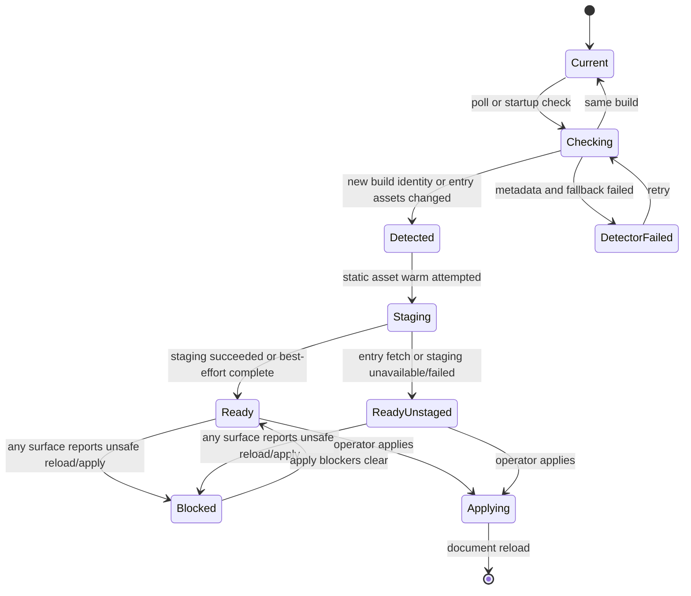
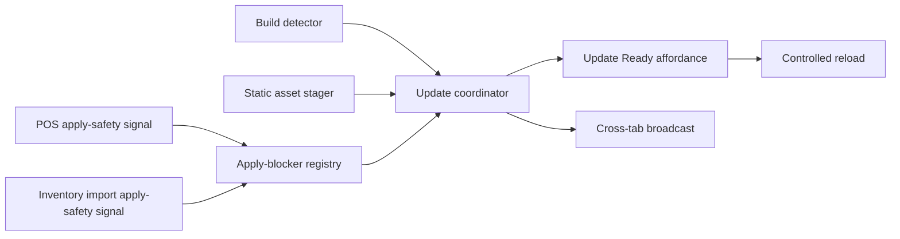

# feat: Add Update Ready coordinator

## Summary

Build a shared Athena webapp update coordinator that separates new-build detection, background asset staging, surface-owned reload/apply safety, and controlled reload. The first implementation should replace direct auto-reload behavior with an Update Ready affordance everywhere: detected updates never call `window.location.reload()` directly, and update application happens through the coordinator only after local and same-origin tab apply blockers are clear. POS is the first apply-safety adopter, Inventory Import proves the contract outside POS, and future long-running workflows opt in without encoding POS-specific rules into the platform layer.

---

## Problem Frame

Athena currently detects changed static assets and calls `window.location.reload()` from app bootstrap. A route-specific POS exception prevents some live-register interruptions, but it also drops the update into a hidden skip state and keeps the safety model tied to one path. The product needs a foundational update boundary: the app can silently prepare a new build, but applying that build still requires a controlled reload at a safe moment.

---

## Requirements

- R1. Detect that a newer Athena webapp build is available without immediately reloading the current tab.
- R2. Stage static app shell assets in the background when the browser/runtime can do so, while keeping business data, API responses, staff authority, payments, customer data, and workflow state out of Cache Storage.
- R3. Expose a shared update state that can render a persistent, calm Update Ready affordance until the update is applied or the app confirms it is current.
- R4. Let feature surfaces opt into reload/apply safety by registering their current unsafe-to-reload reason, without the update coordinator knowing domain concepts like sale, drawer, import row, or closeout.
- R5. Keep update application as an explicit restart boundary: the running React app is not hot-swapped in production.
- R6. Make the first-release apply policy manual-through-affordance by default: surfaces that do not opt into apply safety still show Update Ready instead of auto-reloading, and any future auto-apply policy must be introduced as an explicit coordinator policy with its own safety conditions.
- R7. Prove the apply-safety contract with POS register and at least one non-POS long-running workflow so the abstraction is not POS-coupled.
- R8. Coordinate update state across same-origin tabs so one safe tab does not unexpectedly force a reload while another tab reports an active apply blocker.
- R9. Use Athena's product-copy tone: state the condition plainly, name the next action, and avoid implementation terms such as asset manifests or script hashes in operator-facing copy.

---

## Scope Boundaries

- No production hot-module replacement or attempt to swap React route modules in place.
- No forced mid-workflow reload while any opted-in surface reports an active apply blocker. In the first implementation, every active blocker prevents apply; advisory-only signals are out of scope until a real need appears.
- No broad PWA rewrite, Workbox adoption, or app-wide offline product expansion.
- No caching of Convex/API responses or POS/import/business payloads in Cache Storage.
- No POS-only naming in the coordinator, provider, or registry contract.
- No support dashboard or terminal fleet stale-build reporting in the first implementation.

### Follow-Up Work

- Daily Close adopter: register command-in-flight and close-summary persistence apply blockers after the foundation is proven.
- Cycle count adopter: register pending draft saves and submit transitions as apply blockers after the foundation is proven.
- Support visibility: surface stale build/update-ready state in terminal health or support diagnostics after the client contract stabilizes.
- Emergency update policy: define a separate security-critical override if the product ever needs forced updates.
- Automatic apply policy: define route/tab idleness rules only after the manual Update Ready foundation and cross-tab lease protocol are proven.

---

## Context & Research

### Relevant Code and Patterns

- `packages/athena-webapp/src/main.tsx` starts `createVersionChecker()` and currently reloads directly when a new version is detected.
- `packages/athena-webapp/src/utils/versionChecker.ts` stores startup script URLs, fetches the root HTML entry point, compares asset script paths, and uses a POS route regex to decide whether to call the reload callback.
- `packages/athena-webapp/src/utils/versionChecker.test.ts` already characterizes POS skip behavior and non-POS reload behavior. These tests should evolve from route skip/reload assertions to coordinator event assertions.
- `packages/athena-webapp/src/lib/runtimeBuildMetadata.ts` already reads `/deploy.json` with `cache: "no-store"` and normalizes deploy metadata into runtime build identity for terminal status.
- `packages/athena-webapp/src/offline/registerPosAppShellServiceWorker.ts`, `packages/athena-webapp/src/offline/posAppShellReadiness.ts`, and `packages/athena-webapp/public/pos-app-shell-sw.js` own the existing handwritten POS app-shell cache and warm path.
- `packages/athena-webapp/src/routes/__root.tsx` already hosts the global toaster and is the likely mount point for a global update affordance.
- `packages/athena-webapp/src/routes/_authed.tsx` owns the authenticated shell and POS terminal shell boundaries; it should remain a composition point, not a domain-specific update coordinator.
- `packages/athena-webapp/src/lib/pos/presentation/register/useRegisterViewModel.ts` computes sale/draft/payment/mutation state that can feed a POS-owned apply-safety signal.
- `packages/athena-webapp/src/components/operations/InventoryImportView.tsx` already has draft autosave state and server review-version state that can feed a non-POS apply-safety signal.
- `packages/athena-webapp/src/components/ui/button.tsx`, `packages/athena-webapp/src/components/ui/badge.tsx`, and `packages/athena-webapp/src/components/ui/sonner.tsx` provide the restrained UI primitives for a compact persistent affordance.

### Institutional Learnings

- `docs/plans/2026-06-02-001-feat-pos-register-terminal-app-session-plan.md` identified static deploy reload as a trigger for auth rehydration and POS route recovery risk.
- `docs/solutions/architecture/athena-pos-offline-route-access-2026-06-03.md` establishes the app-shell boundary: Cache Storage is for static HTML, JS, CSS, fonts, images, generated client modules, and route chunks only.
- `docs/solutions/architecture/athena-pos-offline-sales-continuity-2026-06-04.md` reinforces that uncertainty in POS runtime state should stay calm and behind the scenes rather than becoming a cashier-facing blocker.
- `docs/solutions/architecture/athena-inventory-import-review-version-2026-06-07.md` shows why long-running import review state must be durable before a reload is safe.
- `docs/product-copy-tone.md` requires calm, clear, restrained, operational copy that leads with state and names the next action.

### External References

- MDN Service Worker API: service workers install in the background; a new worker usually waits until old clients are gone, while `skipWaiting()` and `clients.claim()` can accelerate control transfer.
- web.dev Service Worker lifecycle: updated workers waiting by default prevents incompatible new service-worker code from taking over old clients too early.
- web.dev PWA update guidance: `skipWaiting()` can make a new service worker control pages loaded by older code, so it should not be used blindly when long-lived clients may be incompatible.

---

## Key Technical Decisions

- Use a shared app-update coordinator instead of route-specific reload predicates: this makes the update behavior foundational and lets surfaces opt in by state rather than path.
- Keep build detection separate from update application: detecting a new build should emit coordinator state, not call `window.location.reload()` directly.
- Make v1 apply policy explicit and manual: all detected updates render the global Update Ready affordance, and the apply action reloads only from the local tab after local plus unexpired remote apply blockers are clear.
- Treat staging as best-effort static asset preparation: staging success improves the next reload but does not prove workflow safety and does not authorize business actions.
- Keep production reload as the apply boundary: the new bundle should run only after a controlled document reload, because the existing React tree and loaded module graph belong to the old build.
- Make apply safety surface-owned: the coordinator records blocker ids, labels, priority, and operator copy, while POS, inventory import, or future workflows own the domain logic that decides whether reload/apply is safe.
- Use leases for cross-tab coordination: same-origin tabs share update-ready and blocker snapshots, but remote messages cannot clear local blockers or trigger a local reload while the local coordinator has an active blocker.
- Treat service-worker activation as an early implementation gate: current immediate `skipWaiting()` plus `clients.claim()` is useful for offline shell availability, but the implementation must prove old and pending caches can coexist, or define a controlled activation/apply boundary before adopter work relies on staging semantics.

---

## Open Questions

### Resolved During Planning

- Does applying the new build require a reload? Yes. Background staging can fetch/cache the next build, but actually running it needs a reload/restart boundary.
- Should POS be the core rule? No. POS is a first apply-safety adopter; the platform contract is shared and opt-in.
- Should the Update Ready affordance be invisible? No. The user selected a visible Update Ready affordance rather than entirely silent auto-apply.

### Implementation Decisions

- Exact coordinator helper and component names: choose names that fit the local module organization during implementation.
- Exact non-POS adopter placement inside Inventory Import: derive from current autosave/review-version state while preserving existing draft behavior.
- Exact service-worker activation mechanism: decide in U4 whether immediate activation can remain with old/pending cache coexistence or whether activation/claim must move behind controlled apply.

---

## High-Level Technical Design

> *This illustrates the intended approach and is directional guidance for review, not implementation specification. The implementing agent should treat it as context, not code to reproduce.*

---

## Implementation Units

- U1. **Create the update coordinator state model**

**Goal:** Introduce a shared browser-side app-update model that tracks current build identity, detected update identity, staging state, reload/apply blockers, cross-tab state, and apply status without owning route-specific behavior.

**Requirements:** R1, R3, R4, R5, R6, R8

**Dependencies:** None

**Files:**
- Create: `packages/athena-webapp/src/lib/app-update/updateCoordinator.ts`
- Create: `packages/athena-webapp/src/lib/app-update/updateCoordinator.test.ts`
- Create: `packages/athena-webapp/src/lib/app-update/UpdateCoordinatorProvider.tsx`
- Create: `packages/athena-webapp/src/lib/app-update/UpdateCoordinatorProvider.test.tsx`

**Approach:**
- Model update status as explicit states such as current, checking, detected, staging, ready, ready-unstaged, blocked, applying, and detector-failed. Detector failure is retryable and does not expose Update Ready; staging failure keeps the update available as ready-unstaged.
- Provide a provider/hook boundary for React callers and pure state helpers for unit testing.
- Include an apply-blocker registry keyed by stable surface ids. In v1, every active blocker prevents apply; no advisory tier exists.
- Add a cross-tab protocol using `BroadcastChannel`, with a storage-event fallback if needed. Messages must be versioned, strictly validated, scoped to the pending build identity, and include a tab/client id, blocker generation, snapshot timestamp, lease expiry, and removal tombstone.
- Merge remote blockers by tab id plus surface id. Remote messages may add or expire remote blockers, but they may not clear local blockers or trigger local reload while the local coordinator reports an active blocker.
- Recompute local plus unexpired remote blockers immediately before apply. Apply is allowed only when both sets are clear.
- Add an apply latch so duplicate clicks or cross-tab messages cannot trigger reload loops; the reload callback runs only in the tab where the operator invoked apply.

**Patterns to follow:**
- Existing pure presentation/state helpers in `packages/athena-webapp/src/lib/pos/presentation/register`.
- Existing runtime metadata normalization in `packages/athena-webapp/src/lib/runtimeBuildMetadata.ts`.

**Test scenarios:**
- Happy path: same build identity check leaves state current and does not expose Update Ready.
- Happy path: newer build transitions from checking to detected to ready without calling reload.
- Happy path: a registered blocker turns a ready update into blocked and clearing it returns the update to ready.
- Edge case: multiple blockers are tracked independently and clearing one blocker does not clear another.
- Edge case: provider unmount removes only its local surface blocker so stale route state does not block future updates.
- Edge case: stale remote blockers expire by lease without clearing live local blockers.
- Edge case: malformed, unknown-version, stale-build, or over-authoritative cross-tab messages are ignored.
- Edge case: duplicate apply requests while applying only invoke the reload callback once.
- Error path: detector failure records retryable state without blocking app use or exposing Update Ready.
- Error path: stager failure records ready-unstaged state and still allows manual apply when blockers are clear.
- Integration: same-origin tab messages merge remote blockers and update-ready state without overriding local blockers.

**Verification:**
- Coordinator tests prove update state, blocker lifecycle, dedupe, and cross-tab merge rules independent of React routes.

---

- U2. **Convert version detection into coordinator events**

**Goal:** Refactor the existing version checker from "reload or skip" into "detect update and report it" while preserving polling and the current HTML/script fallback.

**Requirements:** R1, R5, R6

**Dependencies:** U1

**Files:**
- Modify: `packages/athena-webapp/src/utils/versionChecker.ts`
- Modify: `packages/athena-webapp/src/utils/versionChecker.test.ts`
- Modify: `packages/athena-webapp/src/lib/runtimeBuildMetadata.ts`
- Modify: `packages/athena-webapp/src/lib/runtimeBuildMetadata.test.ts`
- Modify: `packages/athena-webapp/src/main.tsx`

**Approach:**
- Prefer `/deploy.json` or runtime build identity where available, because it is already used by terminal runtime reporting. Treat deploy metadata and cross-tab build identity as public: they should contain only non-secret opaque identifiers needed for comparison, not credentials, customer/store data, or detailed environment/source-control metadata beyond the approved public build id.
- Keep the HTML entry-script comparison as a fallback for deployments without useful deploy metadata.
- Replace route-based `shouldReload` semantics with event callbacks such as no update, update detected, detector failed, and optional initial/current identity.
- Define the detector-to-stager event contract. Update-detected events carry current identity, pending identity, detection source, and either entry HTML/entry URL or an instruction for the stager to fetch the entry HTML with `cache: "no-store"` plus cache-busting. Nil, empty, or failed entry HTML means update available but unstaged, not "no update."
- Wire app bootstrap to the coordinator provider instead of a direct reload callback.
- Keep polling while an update is blocked so the coordinator can observe if the pending update changes again.

**Patterns to follow:**
- `packages/athena-webapp/src/lib/runtimeBuildMetadata.ts` for deploy metadata fetch behavior.
- Existing `versionChecker.test.ts` setup with fake timers and stubbed `fetch`.

**Test scenarios:**
- Happy path: changed deploy metadata emits a new-build event and does not call reload.
- Happy path: same deploy metadata emits no update event.
- Happy path: missing deploy metadata falls back to HTML/script detection.
- Edge case: current `/pos/register` path no longer suppresses detection; it emits update-ready state through the coordinator.
- Error path: failed metadata and failed HTML fetch log/report a detector failure without changing to ready.
- Error path: changed deploy metadata plus failed entry HTML emits update detected with ready-unstaged detail.
- Integration: `main.tsx` starts detection through the provider and no longer passes `window.location.reload()` directly into the detector.

**Verification:**
- Existing version checker tests are updated from reload/skip assertions to event emission and dedupe assertions.

---

- U3. **Add a static asset staging adapter**

**Goal:** Add best-effort staging for the next static build assets while keeping staging separate from both workflow safety and update application.

**Requirements:** R2, R3, R5

**Dependencies:** U1, U2

**Files:**
- Create: `packages/athena-webapp/src/lib/app-update/updateAssetStaging.ts`
- Create: `packages/athena-webapp/src/lib/app-update/updateAssetStaging.test.ts`
- Modify: `packages/athena-webapp/src/offline/posAppShellReadiness.ts`
- Modify: `packages/athena-webapp/src/offline/posAppShellReadiness.test.ts`
- Modify: `packages/athena-webapp/public/pos-app-shell-sw.js`
- Modify: `packages/athena-webapp/src/offline/posAppShellRoutes.ts`
- Modify: `packages/athena-webapp/src/offline/posAppShellRoutes.test.ts`

**Approach:**
- Parse the detected HTML entry point and warm directly linked scripts, stylesheets, modulepreload/preload assets, and other same-origin static shell assets that the existing app-shell boundary already permits. Treat broader lazy route-chunk discovery as follow-up unless implementation can use an existing generated asset graph without expanding the route/cache boundary.
- Treat staging as best effort. If service workers, Cache Storage, or network are unavailable, the coordinator should still report update available with an unstaged or staging-failed detail.
- Preserve explicit exclusions for API, Convex, auth, JSON, maps, business payloads, and sensitive local state.
- Extend the service-worker message protocol only as needed for static shell warming, and keep route-specific POS navigation fallback separate from generic asset staging.

**Execution note:** Start with characterization tests for the current POS app-shell cache exclusions before changing service-worker behavior.

**Patterns to follow:**
- `packages/athena-webapp/public/pos-app-shell-sw.js` for static asset inclusion/exclusion policy.
- `packages/athena-webapp/src/offline/posAppShellReadiness.ts` for service-worker message/timeout handling.
- `docs/solutions/architecture/athena-pos-offline-route-access-2026-06-03.md` for Cache Storage boundaries.

**Test scenarios:**
- Happy path: staging warms HTML-linked JS/CSS/modulepreload assets and reports staged.
- Edge case: lazy route chunks not discoverable from the entry HTML are reported as not staged unless a manifest-backed graph is added.
- Edge case: Cache Storage unavailable reports update available but unstaged.
- Edge case: service worker unavailable reports update available but unstaged.
- Error path: staging rejects API, Convex, auth, JSON, source map, payment, customer, and business payload URLs.
- Integration: POS app-shell route fallback remains limited to POS navigations after generic static asset staging is added.
- Integration: staging failure does not block coordinator ready/blocked state.

**Verification:**
- App-shell and staging tests prove static assets can be staged without widening the service-worker business-data boundary.

---

- U4. **Separate service-worker staging from apply/control**

**Goal:** Make the service-worker lifecycle compatible with blocked update application so a newly staged app shell does not silently become the effective running app before the coordinator says applying is allowed.

**Requirements:** R2, R5, R8

**Dependencies:** U1, U3

**Files:**
- Modify: `packages/athena-webapp/public/pos-app-shell-sw.js`
- Modify: `packages/athena-webapp/src/offline/registerPosAppShellServiceWorker.ts`
- Modify: `packages/athena-webapp/src/offline/registerPosAppShellServiceWorker.test.ts`
- Modify: `packages/athena-webapp/src/tests/pos/offlineRouteAccess.spec.ts`
- Modify: `packages/athena-webapp/src/tests/pos/offlineSalesContinuity.spec.ts`

**Approach:**
- Review current `skipWaiting()` and `clients.claim()` behavior against the coordinator state model.
- Make the service-worker activation/cache policy an early U4 gate before U5/U7 rely on staging semantics. The implementation must choose and document one policy: immediate activation with old/pending cache coexistence, or controlled activation/claim during coordinator apply.
- Preserve offline route access while ensuring "assets warmed" and "new worker/app applied" are not treated as the same event.
- If pending update assets are warmed into a separate cache, the active/old cache must not be deleted while any same-origin client has an unexpired apply blocker. Superseded cache cleanup happens only after controlled apply or after a documented safe lease expiry.
- If immediate worker activation must remain for offline resiliency, document and test the invariant that activation alone does not reload the page or run new React code until the document reloads.
- If activation changes are needed, add an explicit message or apply boundary that activates/claims only during controlled apply.

**Patterns to follow:**
- Existing dev cleanup and duplicate-registration tests in `registerPosAppShellServiceWorker.test.ts`.
- Existing production-build offline route access tests.

**Test scenarios:**
- Happy path: a warmed update can be ready while the current page continues running without reload.
- Edge case: an updated service worker does not cause an opted-in blocked surface to lose state.
- Edge case: an old blocked client can still request old lazy/static assets and hard-reload POS offline while a pending update is staged.
- Edge case: controlled apply activates/claims as needed and reloads once.
- Error path: failed service-worker update preserves the current active worker and keeps app update state retryable.
- Browser: production-built POS can still hard reload offline after the app-shell changes.

**Verification:**
- Browser tests continue to prove offline POS route access while unit/integration tests prove apply blockers are not bypassed by service-worker lifecycle.

---

- U5. **Render the global Update Ready affordance**

**Goal:** Add a durable, accessible, restrained Update Ready UI that appears when the coordinator reports a ready or blocked update and applies the update through the coordinator.

**Requirements:** R3, R5, R6, R9

**Dependencies:** U1, U2

**Files:**
- Create: `packages/athena-webapp/src/components/app-update/UpdateReadyBanner.tsx`
- Create: `packages/athena-webapp/src/components/app-update/UpdateReadyBanner.test.tsx`
- Modify: `packages/athena-webapp/src/routes/__root.tsx`
- Modify: `packages/athena-webapp/src/routes/__root.test.tsx`

**Approach:**
- Mount the affordance near the root document so it is available across authenticated and unauthenticated routes without tying it to POS shell composition.
- Use a fixed root-level slot in `__root.tsx`, adjacent to but not inside the toaster. The banner should sit above route content without covering navigation or POS controls, wrap cleanly on mobile, and preserve stable spacing while visible.
- Use compact inline UI, not a blocking modal. A toast may announce readiness once, but a persistent affordance should remain discoverable.
- Show a primary apply action only when no active blocker exists. When blocked, do not render the apply action; show state and next action guidance from the selected blocker until blockers clear.
- Use calm copy shaped like "Update ready. Save this work before refreshing." or "Update ready. Finish this sale before refreshing." Final copy can be adjusted during implementation to match surface context.
- Include accessible labeling and avoid text overflow on narrow screens. Announce new Update Ready state and blocker guidance changes through a polite status region, do not move focus when the banner appears, keep the apply control keyboard reachable with visible focus, expose applying as busy/disabled until reload, and preserve minimum touch target sizing.

**Patterns to follow:**
- `packages/athena-webapp/src/components/ui/button.tsx` variants.
- `packages/athena-webapp/src/components/ui/badge.tsx`.
- `docs/product-copy-tone.md`.

**Test scenarios:**
- Happy path: ready update renders an Update Ready affordance with an enabled apply action.
- Happy path: clicking apply calls the coordinator apply action once.
- Edge case: blocked update renders blocker guidance and no apply action until blockers clear.
- Edge case: no update state renders no banner.
- Error path: unstaged update still renders as ready to refresh when no blocker exists.
- Accessibility: the affordance is reachable by role/name and communicates the current state to screen readers.

**Verification:**
- Component and root tests prove global rendering, apply action, blocked copy, and no-update silence.

---

- U6. **Add surface opt-in apply-blocker hooks**

**Goal:** Provide the simple API that feature surfaces use to opt into reload/apply safety without reaching into coordinator internals.

**Requirements:** R4, R6, R8, R9

**Dependencies:** U1, U5

**Files:**
- Create: `packages/athena-webapp/src/lib/app-update/useUpdateApplyBlocker.ts`
- Create: `packages/athena-webapp/src/lib/app-update/useUpdateApplyBlocker.test.tsx`
- Create: `packages/athena-webapp/src/lib/app-update/updateApplyBlockerPresentation.ts`
- Create: `packages/athena-webapp/src/lib/app-update/updateApplyBlockerPresentation.test.ts`

**Approach:**
- Expose a hook that accepts a stable surface id, active/inactive state, priority, human-readable surface label, and short operator guidance.
- Keep the registry generic: no POS/import-specific types in the shared API.
- Define priority as a small explicit enum, not arbitrary numbers: `critical-workflow` for work that could lose or corrupt operator progress, `active-command` for in-flight save/checkout/submit operations, and `resume-required` for states that are recoverable but should be saved or acknowledged before refresh. Ties sort by priority, then stable surface label, then surface id.
- Make lifecycle cleanup valid only for purely in-memory surface state. For POS and Inventory Import, derive blockers from the durable/local workflow source of truth or register them through a stable owner that remains mounted while unsafe state exists.
- Add presentation helpers for selecting the highest-priority active blocker for the global banner.

**Patterns to follow:**
- Existing hook/provider testing patterns in `packages/athena-webapp/src/contexts` and POS presentation tests.
- Product copy tone guide for plain next-action guidance.

**Test scenarios:**
- Happy path: active hook registration adds an apply blocker and inactive registration removes it.
- Edge case: changing a surface id unregisters the old blocker before registering the new one.
- Edge case: multiple blockers sort by priority and stable ordering for banner presentation.
- Edge case: component unmount clears only a purely in-memory UI blocker.
- Edge case: route change/remount does not clear POS or import blocker while the underlying workflow state remains unsafe.
- Integration: blockers propagate through cross-tab coordination without leaking domain-specific payloads.

**Verification:**
- Hook tests prove surfaces can opt in and out without manual cleanup bugs.

---

- U7. **Adopt apply safety in POS register**

**Goal:** Make POS register use the shared apply-blocker contract when live register state is unsafe for a manual refresh, while keeping POS-specific safety logic inside POS-owned code.

**Requirements:** R4, R5, R7, R9

**Dependencies:** U1, U5, U6

**Files:**
- Modify: `packages/athena-webapp/src/lib/pos/presentation/register/useRegisterViewModel.ts`
- Modify: `packages/athena-webapp/src/lib/pos/presentation/register/registerUiState.ts`
- Modify: `packages/athena-webapp/src/components/pos/register/POSRegisterView.tsx`
- Modify: `packages/athena-webapp/src/lib/pos/presentation/register/useRegisterViewModel.test.ts`
- Modify: `packages/athena-webapp/src/components/pos/register/POSRegisterView.test.tsx`
- Modify: `packages/athena-webapp/src/components/pos/register/POSRegisterOpeningGuard.test.tsx`

**Approach:**
- Derive a POS-owned apply blocker from active sale/cart/service/customer/payment state, checkout mutation locks, draft queues, drawer/opening transitions, and local runtime states where manual refresh would be unsafe.
- Register only generic blocker information with the coordinator: stable id, priority, label, and short guidance.
- Ensure POS no longer depends on `versionChecker` route suppression; detection should still happen and Update Ready should be visible during active register work, but the apply action should be unavailable until POS reports a safe reload boundary.
- Keep POS business state in existing local stores and server records; update apply safety should not move state or change command authority.

**Patterns to follow:**
- Existing in-progress sale calculations in `useRegisterViewModel.ts`.
- Existing local-first runtime and sync status behavior under `packages/athena-webapp/src/lib/pos/infrastructure/local`.
- Existing POS copy patterns in `docs/product-copy-tone.md`.

**Test scenarios:**
- Happy path: empty idle register does not register a blocker and can apply an update.
- Happy path: active cart items register a POS blocker and Update Ready shows apply as unavailable.
- Happy path: payments or service line drafts register a POS blocker.
- Edge case: checkout mutation in flight registers a blocker even if cart state is about to clear.
- Edge case: sale completion/clear/hold clears the blocker when the view model becomes safe.
- Error path: local runtime uncertainty does not block selling, but can keep update apply unavailable if reload would risk losing the workflow.
- Edge case: route change or remount does not clear POS blocker while active sale/import-equivalent POS workflow state remains unsafe.
- Integration: POS register displays Update Ready without reloading during an active sale.

**Verification:**
- POS tests prove active selling state blocks update apply and safe boundaries clear the blocker.

---

- U8. **Adopt apply safety in Inventory Import as non-POS proof**

**Goal:** Prove the foundational opt-in API works outside POS by blocking manual update apply during unsafe inventory import review/autosave states.

**Requirements:** R4, R7, R9

**Dependencies:** U1, U5, U6

**Files:**
- Modify: `packages/athena-webapp/src/components/operations/InventoryImportView.tsx`
- Modify: `packages/athena-webapp/src/components/operations/InventoryImportView.test.tsx`

**Approach:**
- Register an apply blocker while row decisions are unsaved, autosave is pending/saving/error, a save/stage command is in flight, or the current review cannot yet be resumed safely from durable server state.
- Clear the blocker after the latest row decisions are saved and the route is in a durable/resumable state.
- Keep current draft autosave and route draft behavior intact.
- Use generic update guidance so the banner says to save current import work before refreshing rather than mentioning POS.

**Patterns to follow:**
- Existing draft autosave status in `InventoryImportView.tsx`.
- Existing tests around row decisions, saved review versions, and autosave state.
- `docs/solutions/architecture/athena-inventory-import-review-version-2026-06-07.md`.

**Test scenarios:**
- Happy path: saved review state with no pending decisions does not block update apply.
- Happy path: autosave pending or saving registers a blocker.
- Happy path: unsaved row decisions register a blocker.
- Edge case: autosave error keeps the blocker active and prompts the operator to save before refresh.
- Edge case: loading a latest saved review version clears stale blocker state.
- Edge case: route change or remount keeps the blocker active while unsaved decisions, autosave work, or save errors remain in the workflow source of truth.
- Integration: Update Ready shows import-specific guidance without changing import save behavior.

**Verification:**
- Inventory Import tests prove one non-POS workflow can opt in using the same coordinator API.

---

- U9. **Add browser and validation coverage**

**Goal:** Prove the integrated update flow works in production-like browser conditions and document the validation slice future implementers should run.

**Requirements:** R1, R2, R3, R4, R5, R7, R8

**Dependencies:** U2, U3, U4, U5, U7, U8

**Files:**
- Create: `packages/athena-webapp/src/tests/app-update/updateReadyFlow.spec.ts`
- Modify: `packages/athena-webapp/src/tests/pos/offlineRouteAccess.spec.ts`
- Modify: `packages/athena-webapp/src/tests/pos/offlineSalesContinuity.spec.ts`
- Modify: `packages/athena-webapp/docs/agent/validation-guide.md`
- Modify: `packages/athena-webapp/docs/agent/validation-map.json`
- Modify: `scripts/harness-app-registry.ts`
- Test: `scripts/harness-app-registry.test.ts`

**Approach:**
- Add browser-level coverage for update-ready detection, blocked apply, and controlled apply in production-build conditions.
- Use a production-like two-build fixture: serve a v1 production build, expose a test-only switch that changes same-origin `/deploy.json`, `/`, and `/assets/*` responses to v2 fixtures, then assert Update Ready appears without reload, blockers prevent apply, clearing blockers reloads once, and Cache Storage contains only allowed static shell assets.
- Include a multi-tab scenario if the harness can support it without brittle setup; otherwise cover cross-tab coordination at unit/integration level and leave full browser multi-tab coverage for a later slice.
- Update validation routing so future changes to the app-update coordinator, service worker, POS adopter, or long-running workflow adopters map to the correct test slice.
- Keep browser tests focused on observable behavior rather than exact internal state names.

**Patterns to follow:**
- Existing `packages/athena-webapp/src/tests/pos/offlineRouteAccess.spec.ts`.
- Existing harness registry entries for POS offline route access and app-shell edits.

**Test scenarios:**
- Browser: new build fixture makes Update Ready appear without immediate reload.
- Browser: active POS blocker keeps the current page running and keeps apply unavailable.
- Browser: clearing the POS blocker allows a controlled apply and reloads once.
- Browser: inventory import pending save shows Update Ready with blocker guidance and does not reload.
- Browser: staged static assets do not widen cached business/API data.
- Browser or integration: cross-tab lease expiry prevents crashed tabs from blocking forever and prevents active remote blockers from being bypassed.
- Integration: changed-file validation points app-update and service-worker edits to the focused unit, browser, typecheck, and build coverage.

**Verification:**
- Browser tests and validation-map updates make future update-flow changes reviewable through the harness.

---

## System-Wide Impact

- **Interaction graph:** App startup changes from detector-to-reload to detector-to-coordinator-to-affordance/apply. POS and Inventory Import register apply blockers through a shared provider. Service-worker staging interacts with the coordinator but remains separate from business data.
- **Error propagation:** Detector/staging failures should be retryable diagnostics, not blocking operator errors. Operator-facing copy appears only as Update Ready or save/finish guidance.
- **State lifecycle risks:** Pure UI blockers can clear on unmount, but POS/import blockers must follow durable or local workflow truth until the workflow is safe. Apply must be latched to avoid duplicate reloads. Cross-tab leases must avoid both stale blockers persisting forever and active remote blockers being bypassed.
- **API surface parity:** The apply-blocker hook is the shared extension point for future surfaces such as Daily Close, cycle counts, receiving, and stock adjustments.
- **Integration coverage:** Unit tests prove state transitions; component tests prove UI and adopter contracts; browser tests prove production-build staging/reload boundaries.
- **Unchanged invariants:** Static app-shell caching remains separate from POS/import business state. Command authority, local sync, draft persistence, and server-owned validation remain in their existing domains.

---

## Risks & Dependencies

| Risk | Mitigation |
|------|------------|
| Service-worker `skipWaiting()` or `clients.claim()` undermines blocked apply semantics | Add U4 before relying on background staging as safe, choose the activation/cache policy early, and verify old/pending cache coexistence plus distinct staging/apply behavior. |
| Update Ready becomes noisy or blocks routine work | Use a compact persistent affordance with surface-specific guidance, not a modal, and keep failed staging quiet/retryable. |
| Blockers remain stuck after route changes or clear too early | Use lifecycle cleanup only for pure UI state, derive adopter blockers from workflow truth, and test stale cross-tab expiry plus route-change/remount behavior. |
| Inventory Import adopter expands the first slice too far | Use only existing autosave/review-version state and leave Daily Close/cycle count adopters for follow-up work. |
| Browser tests for new-build simulation become brittle | Use a two-build fixture that switches same-origin deploy metadata, HTML, and asset responses while keeping detailed state-machine coverage in unit tests. |
| Cache staging accidentally includes sensitive data | Reuse and test the existing app-shell exclusion policy and explicitly exclude API/Convex/business payloads. |
| Public build metadata leaks sensitive implementation detail | Treat `/deploy.json` and cross-tab build identity as public, opaque comparison data only. |

---

## Documentation / Operational Notes

- Update `packages/athena-webapp/docs/agent/validation-guide.md`, `packages/athena-webapp/docs/agent/validation-map.json`, and `scripts/harness-app-registry.ts` if new app-update files or service-worker surfaces need changed-file validation routing.
- Add or update a `docs/solutions/architecture/` note after implementation because this creates a new shared boundary: update detection/staging/apply versus workflow safety.
- Run `bun run graphify:rebuild` after modifying code files during implementation so the repo graph stays current.

---

## Sources & References

- Related code: `packages/athena-webapp/src/main.tsx`
- Related code: `packages/athena-webapp/src/utils/versionChecker.ts`
- Related code: `packages/athena-webapp/src/lib/runtimeBuildMetadata.ts`
- Related code: `packages/athena-webapp/src/offline/posAppShellReadiness.ts`
- Related code: `packages/athena-webapp/public/pos-app-shell-sw.js`
- Related code: `packages/athena-webapp/src/lib/pos/presentation/register/useRegisterViewModel.ts`
- Related code: `packages/athena-webapp/src/components/operations/InventoryImportView.tsx`
- Institutional learning: `docs/solutions/architecture/athena-pos-offline-route-access-2026-06-03.md`
- Institutional learning: `docs/solutions/architecture/athena-pos-offline-sales-continuity-2026-06-04.md`
- Institutional learning: `docs/solutions/architecture/athena-inventory-import-review-version-2026-06-07.md`
- Product copy: `docs/product-copy-tone.md`
- External docs: [MDN Service Worker API](https://developer.mozilla.org/en-US/docs/Web/API/Service_Worker_API)
- External docs: [MDN Using Service Workers](https://developer.mozilla.org/en-US/docs/Web/API/Service_Worker_API/Using_Service_Workers)
- External docs: [web.dev Service Worker lifecycle](https://web.dev/articles/service-worker-lifecycle)
- External docs: [web.dev PWA update](https://web.dev/learn/pwa/update)
