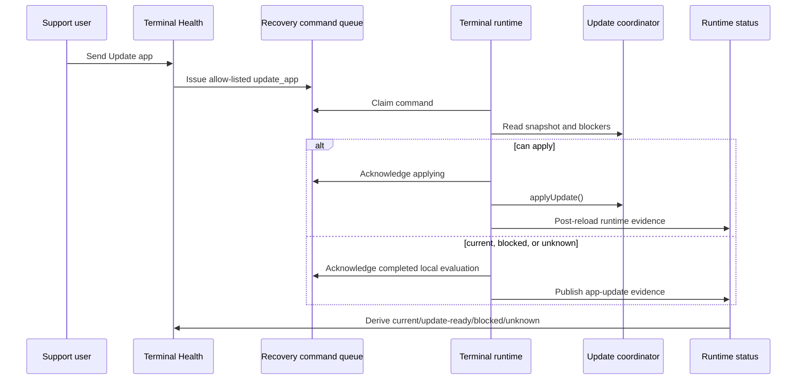
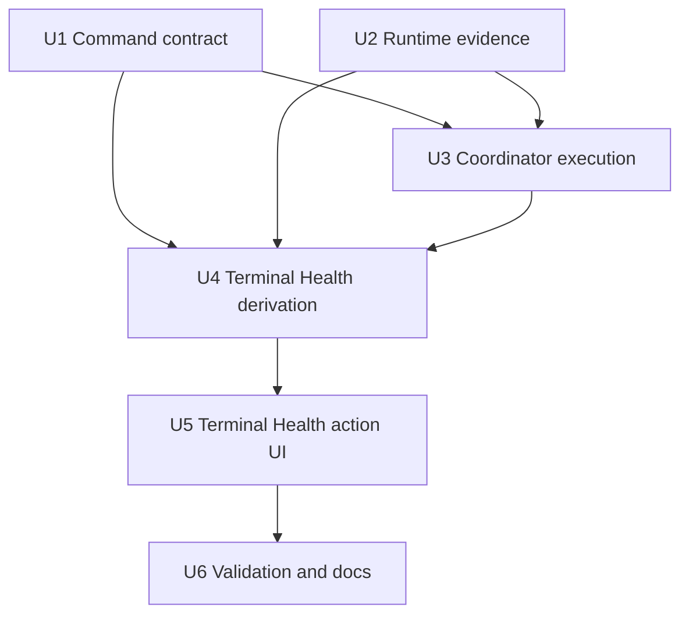

# feat: Add Remote Terminal App Update Command

## Summary

Extend Athena's existing terminal recovery command lane so support can send an Update app command to an active POS terminal at any time. The terminal decides locally through the existing update coordinator whether to apply the update, report a safe no-op, or report that active work is blocking refresh, while Terminal Health derives current/outdated state from fresh runtime evidence instead of command history.

---

## Problem Frame

Remote terminal commands and app update readiness now exist as separate foundations. Terminal Health can already queue allow-listed terminal-local commands, and the app update coordinator can already detect a pending build, stage assets, block unsafe refreshes, and apply through a single reload latch. The gap is operational: support needs a safe way to ask a terminal to update, and Terminal Health needs a current view of whether the terminal is actually running an outdated app build.

The implementation must not collapse that into remote control or a forced reload. A support command records intent; the matching terminal uses its own coordinator state and local blockers to decide what can happen.

---

## Assumptions

*This plan was authored from the user's confirmed product direction plus repo/subagent research. These are the plan-time bets that should be reviewed before implementation proceeds.*

- `Update app` should be sendable any time for active terminals, even when Terminal Health does not currently know whether an update is pending.
- The command should apply the latest pending build known by the terminal at execution time, not a build id frozen by the support user's browser.
- No-op and blocked update checks should acknowledge as completed local evaluations, not scary repair failures. Terminal Health truth still comes from fresh runtime evidence.
- Cross-tab safety should use both the update coordinator's blocker merge and an `update_app` single-flight guard so two tabs do not race the same reload.
- The command queue must enforce single-consumer execution for `update_app` with a claim token or execution id. Browser-local locking is a defense-in-depth guard, not the authoritative exactly-once mechanism.

---

## Requirements

- R1. A full-admin support user can send an allow-listed Update app command to any eligible active store terminal from Terminal Health.
- R2. The command remains terminal-scoped, audited, deduped while active, single-consumer while claimed, and impossible to turn into arbitrary remote execution.
- R3. The matching terminal evaluates the command locally through the app update coordinator and maps every result to the canonical status model in this plan.
- R4. The terminal never bypasses update coordinator blockers or calls a blind reload path. Active POS work, in-flight commands, resumability risk, and cross-tab blockers can prevent apply.
- R5. Command acknowledgement happens before any reload attempt, and verification waits for a fresh post-command runtime check-in that reports command-correlated app-update evidence.
- R6. Terminal runtime status publishes structured app-update evidence so Terminal Health can compute canonical current, update-ready, blocked, applying, detector-failed, stale, or unknown states from fresh evidence.
- R7. Terminal Health shows Update app as an anytime support action for active terminals, while using runtime evidence to explain whether the terminal is current, outdated, blocked, or unknown.
- R8. No command context, acknowledgement, runtime status, or UI copy leaks sync secrets, staff proof/PIN material, raw local payloads, customer/payment data, or raw backend errors.
- R9. Tests cover command contract changes, runtime evidence publishing, command-correlated verification, coordinator execution, ack-before-reload, duplicate/cross-tab safety, Terminal Health presentation, accessibility, and validation routing.

---

## Scope Boundaries

- This plan does not add remote shell, remote code execution, free-form command text, or support-authored scripts.
- This plan does not let support force-refresh a terminal that has active local work or cross-tab blockers.
- This plan does not expand service-worker caching beyond existing static app-shell assets.
- This plan does not change POS sale, payment, inventory, closeout, staff proof, customer data, or sync review authority.
- This plan does not require a fleet-wide update scheduler or mass terminal rollout UI.
- This plan does not make command acknowledgement the source of truth for whether a terminal is updated.

### Deferred to Follow-Up Work

- Fleet-wide "update all terminals" orchestration and progress tracking.
- Emergency/security update override policy, if the product later needs one.
- Remote Assist live-session controls that issue Update app from an attended support console.
- Fully automated browser-level multi-tab coverage beyond one required pre-production manual or Playwright gate, if the current harness cannot support it without brittle setup.

---

## Context & Research

### Relevant Code and Patterns

- `packages/athena-webapp/convex/pos/application/terminalRecovery/types.ts` defines allow-listed command types and expected evidence.
- `packages/athena-webapp/convex/pos/application/terminalRecovery/terminalCommandService.ts` handles issue, duplicate suppression, claim, acknowledgement, redaction, expiry, and runtime verification.
- `packages/athena-webapp/convex/pos/public/terminals.ts` exposes support issue and terminal list/claim/ack/runtime-status functions.
- `packages/athena-webapp/src/lib/pos/infrastructure/local/usePosLocalSyncRuntime.ts` polls, claims, executes, acknowledges, and then forces a fresh runtime status publish.
- `packages/athena-webapp/src/lib/pos/infrastructure/local/terminalRecoveryCommands.ts` keeps browser-local command execution allow-listed.
- `packages/athena-webapp/src/lib/app-update/updateCoordinator.ts` owns update states, blockers, cross-tab blocker leases, and `applyUpdate()`.
- `packages/athena-webapp/src/lib/app-update/UpdateCoordinatorProvider.tsx` is the current reload boundary.
- `packages/athena-webapp/src/lib/app-update/useUpdateApplyBlocker.ts` is the generic surface-owned blocker API.
- `packages/athena-webapp/src/lib/pos/infrastructure/local/terminalRuntimeStatus.ts`, `packages/athena-webapp/convex/schemas/pos/posTerminalRuntimeStatus.ts`, and `packages/athena-webapp/convex/pos/application/commands/terminals.ts` shape runtime evidence.
- `packages/athena-webapp/convex/pos/application/queries/terminals.ts`, `packages/athena-webapp/src/components/pos/terminals/terminalHealthPresentation.ts`, `packages/athena-webapp/src/components/pos/terminals/POSTerminalDetailView.tsx`, and `packages/athena-webapp/src/components/pos/terminals/POSTerminalHealthView.tsx` shape Terminal Health evidence and actions.

### Institutional Learnings

- `docs/solutions/architecture/athena-app-update-apply-safety-2026-06-17.md` separates update detection from applying the update; detection must not reload the page.
- `docs/solutions/architecture/athena-pos-terminal-recovery-readiness-boundary-2026-06-14.md` keeps support recovery, sales readiness, diagnostic evidence, and command history separate.
- `docs/solutions/architecture/athena-pos-remote-terminal-health-recovery-2026-06-11.md` establishes that terminal recovery is support orchestration with runtime verification, not server-side force-clear behavior.
- `docs/plans/2026-06-13-001-feat-remote-terminal-commands-plan.md` defines the remote command lane as typed, allow-listed, audited, terminal-scoped, and locally executed.
- `docs/plans/2026-06-17-002-feat-update-ready-coordinator-plan.md` defines the update coordinator, manual apply boundary, cross-tab blockers, and static-asset cache boundary.
- `docs/product-copy-tone.md` requires calm, clear, operational copy that names the state and the next action without raw backend wording.

### External References

- External research skipped. The relevant implementation contract is repo-local: Convex terminal commands, POS runtime status, and the existing app-update coordinator.

---

## Key Technical Decisions

- Add `update_app` to the existing terminal recovery command allow-list instead of introducing a new support channel. The existing queue already provides audit, terminal scoping, duplicate suppression, claim/ack, and runtime verification.
- Treat Update app as an anytime intent command. Terminal Health may send it without proving update readiness first; the terminal's coordinator state decides what happens.
- Publish structured app-update runtime evidence instead of relying only on build string comparison in Terminal Health. Build metadata comparison remains useful, but runtime coordinator state is needed for blocked, applying, detector-failed, and unknown cases.
- Keep the app-update coordinator generic. POS terminal command execution should call into a narrow adapter/callback, not import terminal recovery concepts into `src/lib/app-update`.
- Acknowledge before reload. `applyUpdate()` can reload synchronously, so command execution must persist its local decision before invoking the reload latch.
- Verify by fresh runtime evidence. A command that acknowledged "applying" is not verified until a new runtime check-in reports the expected app-update/build state within the existing freshness window.
- Model blocked/no-op as completed local evaluations with runtime evidence, not as support-recovery failures. That keeps an idle current terminal from looking broken after support clicks Update app.
- Server-side claim semantics are authoritative for `update_app` exactly-once execution. Browser-local locks reduce duplicate work but cannot be the only race guard.
- Runtime verification is command-correlated: the terminal reports a safe execution id, nonce, or issued-at observation so replayed pre-command runtime evidence cannot verify a command.
- Persisted runtime evidence should use code/enums and sanitized summaries, not raw blocker labels, local payloads, or copied browser strings.

---

## Open Questions

### Resolved During Planning

- Should support be able to send Update app any time? Yes. The terminal gates behavior locally.
- Should Update app target the build support saw or the latest pending build at the terminal? The latest pending build at execution time. This keeps the command useful when support evidence is stale.
- Should blocked/no-op command outcomes be failures? No. They are completed local evaluations. Terminal Health should still show the blocking/current state from runtime evidence.
- Should Terminal Health compute outdated state from command history? No. It should derive it from fresh runtime app-update evidence, using command state only as action lifecycle context.

### Deferred to Implementation

- Exact app-update runtime evidence field names and enum labels.

## Canonical App-Update Status Model

Terminal Health and command acknowledgement should use the same normalized status vocabulary even if the underlying coordinator names differ.

| Status | Meaning | Command behavior | Terminal Health behavior |
|--------|---------|------------------|--------------------------|
| `current` | The terminal reports no pending app update or already runs the latest known build. | Acknowledge as completed no-op. | Show current evidence and keep Update app available for a future retry. |
| `update_ready` | The terminal reports a pending update and coordinator says apply is safe. | Acknowledge applying, then invoke the coordinator reload latch. | Show outdated/update-ready evidence until post-reload check-in verifies current. |
| `update_ready_unstaged` | The terminal knows an update exists but assets are not fully staged or `canApply` is false for staging reasons. | Acknowledge completed evaluation unless coordinator `canApply` is true at execution time. | Show update available but not ready to refresh yet. |
| `blocked` | Local work, sync review, payment/sale risk, or a cross-tab blocker prevents refresh. | Acknowledge completed blocked evaluation and do not reload. | Show operational blocker guidance without marking the terminal failed. |
| `applying` | The terminal accepted apply and acknowledged before reload. | Wait for fresh post-command runtime evidence. | Show waiting for check-in/update in progress, not verified. |
| `detector_failed` | The update detector errored or cannot produce a trustworthy snapshot. | Acknowledge completed unable-to-determine evaluation. | Show unable to determine, with retry available. |
| `stale` | Runtime evidence is older than the freshness window. | Do not use stale evidence to verify a command. | Show stale/unknown state, not current or outdated certainty. |
| `unknown` | Older client, missing coordinator adapter, or missing app-update evidence. | Acknowledge unsupported/unable-to-determine when the command is claimed by such a client. | Show not reported/unknown and keep active-terminal action availability scoped by role and command lifecycle. |

---

## High-Level Technical Design

> *This illustrates the intended approach and is directional guidance for review, not implementation specification. The implementing agent should treat it as context, not code to reproduce.*

---

## Implementation Units

- U1. **Extend the terminal command contract with Update app**

**Goal:** Add `update_app` as a first-class, allow-listed terminal recovery command with safe context, duplicate handling, labels, and expected evidence support.

**Requirements:** R1, R2, R5, R8, R9.

**Dependencies:** None.

**Files:**
- Modify: `packages/athena-webapp/convex/pos/application/terminalRecovery/types.ts`
- Modify: `packages/athena-webapp/convex/schemas/pos/posTerminalRecovery.ts`
- Modify: `packages/athena-webapp/convex/pos/application/terminalRecovery/terminalCommandService.ts`
- Modify: `packages/athena-webapp/convex/pos/public/terminals.ts`
- Modify: `packages/athena-webapp/src/components/pos/terminals/terminalHealthTypes.ts`
- Test: `packages/athena-webapp/convex/pos/application/terminalRecovery/terminalCommandService.test.ts`
- Test: `packages/athena-webapp/convex/pos/public/terminals.test.ts`

**Approach:**
- Add `update_app` to the backend and frontend command type unions and validators.
- Keep support issuance full-admin only and terminal execution terminal-sync-secret scoped.
- Extend expected evidence to cover app-update verification without storing secrets or raw browser payloads.
- Adjust duplicate suppression so an active update command for a terminal prevents duplicate pending work, while completed/verified/no-op commands do not block future update attempts for later builds.
- Tighten `update_app` claim semantics so only one runtime can execute a claimed command. Persist a claim token or execution id, require that token on acknowledgement and verification evidence, and reject acknowledgements from stale or competing claims.
- Use an "apply latest" dedupe context. Expected evidence should identify the command execution and observation window, not freeze the build id support saw in Terminal Health.

**Execution note:** Implement new command contract behavior test-first before touching browser execution.

**Patterns to follow:**
- Existing `repair_terminal_seed` and `retry_sync` lifecycle tests in `packages/athena-webapp/convex/pos/application/terminalRecovery/terminalCommandService.test.ts`.
- Secret-like field rejection and acknowledgement message redaction in `packages/athena-webapp/convex/pos/application/terminalRecovery/terminalCommandService.ts`.

**Test scenarios:**
- Happy path: full-admin support can issue `update_app` to an active terminal.
- Happy path: equivalent active `update_app` commands dedupe instead of creating duplicate pending work.
- Happy path: one terminal runtime receives a valid claim token or execution id and can acknowledge the command.
- Edge case: completed or verified no-op update command does not prevent a later update command.
- Edge case: expired active update command can be replaced.
- Edge case: concurrent claim attempts for the same `update_app` do not both become executable.
- Error path: `pos_only` users and terminal runtime calls cannot issue `update_app`.
- Error path: inactive/revoked/wrong-store terminal cannot receive `update_app`.
- Error path: acknowledgement with a missing, stale, or mismatched claim token is rejected.
- Error path: secret-like fields in command context or expected evidence are rejected before persistence.

**Verification:**
- The command queue accepts `update_app` as a typed terminal command and preserves existing auth, scoping, dedupe, and redaction guarantees.

---

- U2. **Publish structured app-update runtime evidence**

**Goal:** Thread app-update state through terminal runtime status so Terminal Health can derive current/outdated/blocked/unknown from fresh terminal evidence.

**Requirements:** R3, R4, R6, R8, R9.

**Dependencies:** None.

**Files:**
- Modify: `packages/athena-webapp/convex/schemas/pos/posTerminalRuntimeStatus.ts`
- Modify: `packages/athena-webapp/convex/pos/public/terminals.ts`
- Modify: `packages/athena-webapp/convex/pos/application/commands/terminals.ts`
- Modify: `packages/athena-webapp/src/lib/pos/infrastructure/local/terminalRuntimeStatus.ts`
- Modify: `packages/athena-webapp/src/lib/pos/infrastructure/local/usePosLocalSyncRuntime.ts`
- Test: `packages/athena-webapp/src/lib/pos/infrastructure/local/terminalRuntimeStatus.test.ts`
- Test: `packages/athena-webapp/src/lib/pos/infrastructure/local/usePosLocalSyncRuntime.test.ts`
- Test: `packages/athena-webapp/convex/pos/public/terminals.test.ts`
- Test: `packages/athena-webapp/convex/pos/application/terminals.test.ts`

**Approach:**
- Add a structured runtime evidence object for app-update state: current build, pending build when known, canonical coordinator status code, can-apply flag, staging status, selected blocker code, detector failure/unknown state, observed timestamp, and optional command execution id/nonce for command-triggered checks.
- Keep evidence sanitized. Publish blocker codes and product-copy-safe summaries only, not raw payloads, copied blocker labels, local diagnostic payloads, or internal errors.
- Preserve runtime publish-loop stability by excluding volatile fields from the publish signature or normalizing them the same way existing runtime status avoids `reportedAt` churn.
- Keep older clients compatible: missing app-update evidence means unknown, not unhealthy.

**Execution note:** Add characterization coverage for current `appVersion`/`buildSha` status before extending the runtime payload.

**Patterns to follow:**
- Existing `appShell` and `appSessionRecovery` runtime evidence in `packages/athena-webapp/src/lib/pos/infrastructure/local/terminalRuntimeStatus.ts`.
- Existing `stripRuntimeStatusInput` sanitization in `packages/athena-webapp/convex/pos/public/terminals.ts`.

**Test scenarios:**
- Happy path: ready coordinator snapshot publishes pending build and update-ready evidence.
- Happy path: current/no pending update publishes current app-update evidence.
- Happy path: blocked coordinator snapshot publishes a sanitized selected blocker and no sensitive payload.
- Happy path: command-triggered runtime evidence includes a safe execution id/nonce that can be matched to the command being verified.
- Edge case: detector-failed or missing coordinator state publishes unknown/detector-failed evidence without blocking sales.
- Edge case: old clients with only `appVersion`/`buildSha` still render as unknown or comparable by existing metadata.
- Error path: volatile app-update timestamps do not create repeated runtime-status publish loops.
- Error path: raw blocker strings, backend errors, and local payload fields are not persisted in runtime evidence.

**Verification:**
- Runtime status contains enough sanitized evidence for Terminal Health to compute update state without reading command history.

---

- U3. **Execute Update app through the coordinator**

**Goal:** Teach the terminal runtime to execute `update_app` by consulting the app-update coordinator and calling `applyUpdate()` only after safe acknowledgement.

**Requirements:** R3, R4, R5, R8, R9.

**Dependencies:** U1, U2.

**Files:**
- Modify: `packages/athena-webapp/src/lib/pos/infrastructure/local/terminalRecoveryCommands.ts`
- Modify: `packages/athena-webapp/src/lib/pos/infrastructure/local/usePosLocalSyncRuntime.ts`
- Modify: `packages/athena-webapp/src/lib/app-update/updateCoordinator.ts`
- Modify: `packages/athena-webapp/src/lib/app-update/UpdateCoordinatorProvider.tsx`
- Test: `packages/athena-webapp/src/lib/pos/infrastructure/local/terminalRecoveryCommands.test.ts`
- Test: `packages/athena-webapp/src/lib/pos/infrastructure/local/usePosLocalSyncRuntime.test.ts`
- Test: `packages/athena-webapp/src/lib/app-update/updateCoordinator.test.ts`

**Approach:**
- Add an optional `appUpdateCoordinator` adapter input to the POS local runtime host. The adapter exposes snapshot/evaluate/apply behavior to command execution without importing terminal recovery concepts into `src/lib/app-update`.
- Define local decision outcomes by mapping coordinator data to the canonical status model: already current/no update, update ready and applying, blocked by active work, detector failed/unknown, ready-unstaged, stale, and unsupported coordinator.
- Make command execution two-phase: first evaluate and prepare the acknowledgement payload, then persist acknowledgement, then run the post-ack effect such as `applyUpdate()`. This is required because `applyUpdate()` can reload synchronously.
- If `applyUpdate()` returns false because blockers appeared after acknowledgement, publish fresh runtime evidence that records the blocked/current state for the same command execution id.
- Use the server claim token/execution id as the authoritative single-flight guard; add browser-local locking only as defense in depth for duplicate tabs.
- Force a runtime status observation for all non-reload outcomes and rely on post-reload startup check-in for successful apply.

**Execution note:** Start with an immediate reload mock to prove acknowledgement is persisted before `applyUpdate()`.

**Patterns to follow:**
- Existing command callback pattern for `refresh_staff_authority`, `refresh_snapshots`, and `report_diagnostics`.
- Existing update coordinator `snapshot.canApply` and reload latch tests.

**Test scenarios:**
- Happy path: update ready with no blockers acknowledges applying before invoking `applyUpdate()` exactly once.
- Happy path: no update ready acknowledges completed no-op and publishes current evidence without reload.
- Happy path: blocked update acknowledges completed blocked evaluation and publishes blocker evidence without reload.
- Edge case: ready-unstaged follows coordinator `canApply` semantics and reports staging state.
- Edge case: detector failed/unknown reports unable-to-determine evidence without failing support recovery.
- Edge case: duplicate tabs cannot both acknowledge or apply the same `update_app` command.
- Error path: `applyUpdate()` returning false after the snapshot was ready does not reload and reports blocked/current evidence.
- Error path: coordinator unavailable fails safely without mutating unrelated local POS state.
- Error path: command evaluation cannot call reload before acknowledgement succeeds.

**Verification:**
- The terminal can evaluate and apply an update command without bypassing coordinator blockers or losing the command acknowledgement to reload timing.

---

- U4. **Derive Terminal Health update state from runtime evidence**

**Goal:** Normalize runtime app-update evidence into Terminal Health preview and presentation state, keeping update readiness separate from support recovery blockers and command history.

**Requirements:** R6, R7, R8, R9.

**Dependencies:** U1, U2, U3.

**Files:**
- Modify: `packages/athena-webapp/convex/pos/application/queries/terminals.ts`
- Modify: `packages/athena-webapp/src/components/pos/terminals/terminalHealthTypes.ts`
- Modify: `packages/athena-webapp/src/components/pos/terminals/terminalHealthPresentation.ts`
- Modify: `packages/athena-webapp/src/components/pos/terminals/POSTerminalDetailView.tsx`
- Modify: `packages/athena-webapp/src/components/pos/terminals/POSTerminalHealthView.tsx`
- Test: `packages/athena-webapp/convex/pos/application/queries/terminals.test.ts`
- Test: `packages/athena-webapp/src/components/pos/terminals/terminalHealthPresentation.test.ts`
- Test: `packages/athena-webapp/src/components/pos/terminals/POSTerminalDetailView.test.tsx`
- Test: `packages/athena-webapp/src/components/pos/terminals/POSTerminalHealthView.test.tsx`

**Approach:**
- Add a normalized app-update status to terminal preview/detail: current, update ready/outdated, apply blocked, applying, detector failed, stale evidence, or unknown.
- Treat stale runtime evidence as stale/unknown, not as live update readiness.
- Continue showing current build and latest build metadata, but prefer structured runtime app-update evidence when present.
- Do not add support recovery blockers merely because an update is available. Update app is an available support action, not evidence that the terminal cannot transact.
- Keep command status as action lifecycle context: queued/running/waiting for check-in/verified. Do not let an old blocked/no-op/precondition state overrule fresh runtime evidence.
- Keep command lifecycle and runtime truth visually distinct. For example, "Update command queued" belongs to the action lane, while "Update blocked by active sale" belongs to runtime app-update state.
- Verify command success only when runtime evidence is fresh and command-correlated. A stale or pre-command runtime payload cannot mark the command verified.

**Patterns to follow:**
- `buildTerminalRecoveryPreview` and `buildTerminalRecoveryPresentation` readiness boundaries.
- Existing version comparison helper in `POSTerminalDetailView.tsx`, which can be retained or moved behind shared presentation logic.

**Test scenarios:**
- Happy path: fresh runtime evidence with pending build renders update ready/outdated state.
- Happy path: fresh current evidence renders current state and still allows the anytime Update app action.
- Happy path: blocked evidence renders blocker guidance without making terminal health look failed.
- Happy path: applying command lifecycle renders as waiting for check-in until fresh command-correlated runtime evidence arrives.
- Edge case: missing app-update evidence on an otherwise healthy terminal renders unknown/not reported, not unhealthy.
- Edge case: stale runtime evidence renders stale/unknown and does not offer live certainty.
- Edge case: replayed pre-command runtime evidence does not verify a newly issued command.
- Edge case: latest command says blocked/no-op but newer runtime evidence says current; current evidence wins.
- Error path: raw blocker labels or backend messages are normalized before display.

**Verification:**
- Terminal Health can answer "is this terminal outdated?" from runtime evidence and can distinguish support action availability from health blockers.

---

- U5. **Wire Terminal Health Update app action**

**Goal:** Expose an anytime Update app action on active terminal detail/roster surfaces with safe disabled states, duplicate protection, and calm operational copy.

**Requirements:** R1, R2, R7, R8, R9.

**Dependencies:** U4.

**Files:**
- Modify: `packages/athena-webapp/src/components/pos/terminals/POSTerminalDetailView.tsx`
- Modify: `packages/athena-webapp/src/components/pos/terminals/POSTerminalHealthView.tsx`
- Modify: `packages/athena-webapp/src/components/pos/terminals/terminalHealthPresentation.ts`
- Test: `packages/athena-webapp/src/components/pos/terminals/POSTerminalDetailView.test.tsx`
- Test: `packages/athena-webapp/src/components/pos/terminals/POSTerminalHealthView.test.tsx`
- Test: `packages/athena-webapp/src/components/pos/terminals/terminalHealthPresentation.test.ts`

**Approach:**
- Add Update app to the terminal command actions for active terminals, regardless of current app-update evidence.
- Disable duplicate sends while an equivalent `update_app` command is pending, claimed, or waiting for runtime verification.
- Keep inactive/revoked terminals, missing terminal identity, and unauthorized support roles unable to issue the command.
- Use copy shaped around state and action, for example "Update app" and "The checkout station will refresh only when local work is safe."
- Show local outcomes plainly: current/no update, blocked by active work, applying, waiting for check-in, verified current, or unable to determine.
- Make disabled states explicit: disabled for inactive/revoked terminals, missing terminal identity, unauthorized roles, and an active equivalent command; enabled for active current, update-ready, blocked, stale, or unknown terminals when no equivalent command is active.
- Preserve accessible names and status announcements for the action button, command progress, and runtime update state.

**Execution note:** Add UI tests for active/current/blocked/unknown states before wiring the mutation.

**Patterns to follow:**
- Existing terminal command action rendering in `POSTerminalDetailView.tsx`.
- Product copy rules in `docs/product-copy-tone.md`.

**Test scenarios:**
- Happy path: active terminal renders enabled Update app action even when update readiness is unknown.
- Happy path: clicking Update app issues `update_app` with store id, terminal id, safe context, and expected evidence.
- Happy path: active update command disables duplicate send and shows queued/running copy.
- Happy path: action and status text have accessible names and announcements that distinguish queued command state from runtime update state.
- Edge case: current terminal still offers Update app and later shows no update needed after runtime evidence.
- Edge case: blocked terminal shows blocker guidance and keeps the action available for a later retry after the current command resolves.
- Edge case: stale/unknown evidence still allows the action for active terminals while avoiding false current/outdated certainty.
- Error path: inactive/revoked terminal does not render an enabled action.
- Error path: mutation failure shows normalized support copy and does not imply the terminal updated.

**Verification:**
- Support can send Update app from Terminal Health safely without needing to know whether the terminal is already outdated.

---

- U6. **Update validation routing and durable docs**

**Goal:** Make the combined app-update and terminal-command boundary discoverable for future implementers and harness review.

**Requirements:** R8, R9.

**Dependencies:** U5.

**Files:**
- Modify: `docs/solutions/architecture/athena-app-update-apply-safety-2026-06-17.md`
- Modify: `docs/solutions/architecture/athena-pos-terminal-recovery-readiness-boundary-2026-06-14.md`
- Conditional modify: `packages/athena-webapp/docs/agent/validation-guide.md`
- Conditional modify: `packages/athena-webapp/docs/agent/validation-map.json`
- Conditional modify: `scripts/harness-app-registry.ts`
- Conditional test: `scripts/harness-app-registry.test.ts`

**Approach:**
- Document that remote Update app is an allow-listed command adapter into the update coordinator, not a forced reload.
- Add the app-update runtime evidence fields and `update_app` command surfaces to validation routing only if generated harness docs do not already cover both affected slices.
- Keep solution notes explicit about command acknowledgement versus runtime verification.
- Update product-copy guidance only if implementation introduces reusable update-command wording that belongs outside Terminal Health.

**Test scenarios:**
- Conditional happy path: harness registry maps app-update runtime evidence and terminal command changes to both app-update and terminal-health validation slices if routing is missing.
- Conditional edge case: generated validation-map output includes new files without manual-only edits if routing changes.
- Test expectation: docs-only solution note updates need no behavior tests beyond presentation copy tests when user-facing copy changes.

**Verification:**
- Future changes to this boundary trigger the right focused tests, and the durable docs explain why support cannot bypass local blockers.

---

## System-Wide Impact

- **Interaction graph:** Terminal Health issues a typed Convex command; the terminal runtime claims it; the app-update coordinator decides whether apply is safe; runtime status publishes app-update evidence; Terminal Health derives current/outdated/blocked from that evidence.
- **Error propagation:** Support issue failures return safe command-result copy. Terminal-local no-op/blocked states are completed local evaluations. Unexpected local failures are redacted before acknowledgement and presentation.
- **State lifecycle risks:** Ack-before-reload, duplicate tab execution, stale or replayed runtime evidence, pending-build churn, ready-unstaged updates, service-worker cache behavior, and volatile publish signatures all need explicit tests.
- **API surface parity:** Backend command types, Convex validators, frontend command types, runtime status schema, Terminal Health preview, and UI presentation must all carry the same `update_app` and app-update evidence semantics.
- **Integration coverage:** Unit tests prove state transforms; component tests prove Terminal Health behavior; focused runtime tests prove command execution; app-update tests prove `applyUpdate()` remains blocker-gated.
- **Unchanged invariants:** POS continuity remains local-sale-first. Support cannot override active sale work, local sync review, staff proof, drawer authority, payment, inventory, customer, or closeout state.

---

## Risks & Dependencies

| Risk | Mitigation |
|------|------------|
| Reload occurs before command acknowledgement persists | Use a two-phase executor that prepares the result, persists acknowledgement, then runs `applyUpdate()`, and test with a synchronous reload mock. |
| Support command bypasses local blockers | Execute only through coordinator snapshot/apply APIs and assert blocked snapshots do not reload. |
| Terminal Health treats command ack as updated truth | Derive app-update status from fresh runtime evidence and keep command state as lifecycle context. |
| Duplicate tabs run the same update command | Enforce server-side single-consumer claim/ack tokens for `update_app`, with browser-local locking as defense in depth. |
| Replayed runtime evidence verifies a new command | Require command-correlated runtime evidence with a safe execution id, nonce, or issued-at observation after command issue. |
| Applying latest conflicts with build evidence support saw | Use command-correlated evidence and fresh runtime status as truth; support-side build metadata is context, not a frozen target. |
| Runtime app-update evidence causes publish loops | Normalize or exclude volatile fields from runtime publish signatures. |
| Sensitive details leak through runtime evidence or ack copy | Reuse secret-like field rejection, acknowledgement redaction, code-based evidence, safe blocker summaries, and copy normalization. |
| Old clients lack app-update evidence | Treat missing evidence as unknown/not reported, not as a blocker or current proof. |

---

## Documentation / Operational Notes

- Implementation should run both validation slices from `packages/athena-webapp/docs/agent/validation-guide.md`: App update readiness/apply-safety and POS terminal health visibility/diagnostics.
- If code files change, run `bun run graphify:rebuild` before handoff.
- If Convex public types or validators change, refresh generated Convex artifacts using the repo-documented `bunx convex dev --once` workflow when deployment credentials are available.
- Verification should be deterministic in local/staging first: one current/no-op path, one blocked path, one ready/applying path with ack-before-reload, one stale/replayed evidence rejection, and one duplicate-tab or concurrent-claim gate.
- Before production rollout, run at least one manual or Playwright multi-tab gate to prove only one tab can execute a claimed `update_app` command.
- Production smoke is best effort because real terminal update states are operationally timing-dependent. When available, verify one active terminal reporting update-ready evidence, one blocked terminal that refuses refresh, and one successful post-reload check-in that verifies the updated build.

---

## Sources & References

- Related plan: `docs/plans/2026-06-13-001-feat-remote-terminal-commands-plan.md`
- Related plan: `docs/plans/2026-06-17-002-feat-update-ready-coordinator-plan.md`
- Related solution: `docs/solutions/architecture/athena-app-update-apply-safety-2026-06-17.md`
- Related solution: `docs/solutions/architecture/athena-pos-terminal-recovery-readiness-boundary-2026-06-14.md`
- Related solution: `docs/solutions/architecture/athena-pos-remote-terminal-health-recovery-2026-06-11.md`
- Related code: `packages/athena-webapp/convex/pos/application/terminalRecovery/terminalCommandService.ts`
- Related code: `packages/athena-webapp/convex/pos/public/terminals.ts`
- Related code: `packages/athena-webapp/src/lib/pos/infrastructure/local/usePosLocalSyncRuntime.ts`
- Related code: `packages/athena-webapp/src/lib/pos/infrastructure/local/terminalRecoveryCommands.ts`
- Related code: `packages/athena-webapp/src/lib/app-update/updateCoordinator.ts`
- Related UI: `packages/athena-webapp/src/components/pos/terminals/POSTerminalDetailView.tsx`
- Product copy: `docs/product-copy-tone.md`
