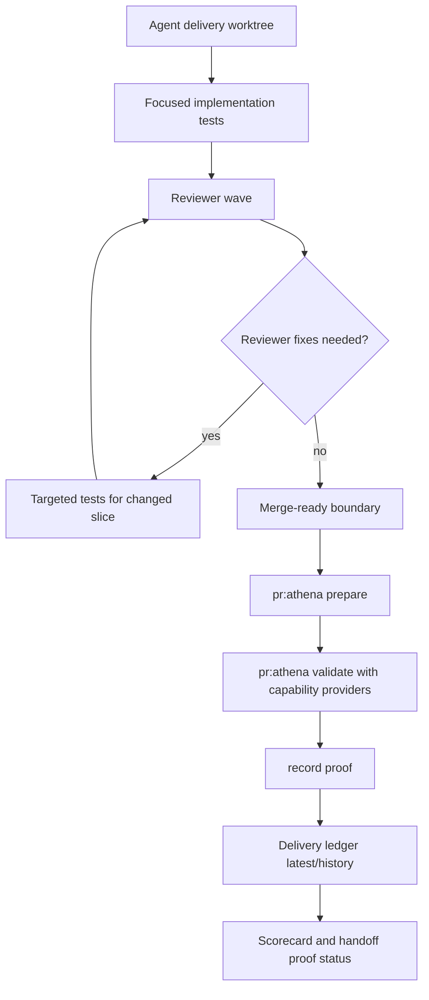

# refactor: Make Athena delivery loops proof-aware and measurable

## Summary

Make Athena delivery work cheaper and easier to reason about by combining three fixes into one delivery package:

- prune duplicate validation work in the local `pr:athena` gate without weakening coverage;
- make `$execute` and reviewer loops proof-aware so full `pr:athena` runs happen at merge-readiness boundaries instead of after every small reviewer fix;
- add a baseline capture plus durable delivery-run metrics so future optimization work has historical data about gate duration, duplicate repo tests, duplicate package tests, proof reuse, rerun reasons, and reviewer waves.

The metrics are not the whole feature. They are the measurement layer for the audit findings: expensive repeated gates, duplicated suite execution inside the gate, unclear proof status in handoffs, and completed subagents staying open across reviewer waves.

---

## Problem Frame

Recent and past delivery sessions show the same friction pattern. Agents often run the full `bun run pr:athena` gate multiple times during reviewer loops. The gate itself can run overlapping checks in one pass: `pr:athena:validate` calls `harness:check` directly and then calls `harness:review`, which runs `harness:check` internally; it also runs both `test:coverage` and `harness:test`, even though both currently target the root `scripts/*.test.ts` suite shape. There is also a package-level duplicate risk: root `test:coverage` runs `bun run --filter '@athena/webapp' test:coverage`, while `harness:review` can still select `bun run --filter '@athena/webapp' test` or focused `@athena/webapp` Vitest commands because `pr:athena` only provides repo validation today, not package validation.

Athena already has proof reuse machinery for pre-push and history artifacts for harness behavior, inferential review, and scorecards. The missing layer is a delivery-run ledger that connects those signals to agent workflow outcomes: which command ran, what it covered, why it reran, whether a proof was reusable, how many reviewer waves happened, and which duplicate validations were skipped because same-gate evidence had already covered the same capability.

The improvement should reduce unnecessary local cycles while preserving the project posture that validation reuse is explicit, proof-based, and fail-closed.

---

## Requirements

- R1. Capture a pre-pruning baseline for the current local gate, then add durable delivery-run metrics with `latest.json` plus optional `history/<timestamp>.json`, covering command spans, duplicate command counts, duplicate package-suite counts, proof state, rerun reasons, and reviewer waves.
- R2. Prune known duplicate local gate work in `pr:athena` only after tests prove equivalent coverage and no validation sensor is lost.
- R3. Replace command-name provider assumptions for the local duplicate targets with capability-based provider evidence, so skipped work is recorded with `status: "covered_by_provider"` rather than silently treated as passed.
- R4. Update `$execute`, compound delivery, and shipping guidance so reviewer loops use focused tests after small fixes and reserve full `pr:athena` for merge-ready, base-synced, validation-wiring, or proof-stale boundaries.
- R5. Add subagent lifecycle guidance: collect outputs, persist the summary, close completed subagents, then dispatch the next reviewer wave; never close running subagents just to free capacity.
- R6. Require final delivery handoffs and machine-readable ledger output to distinguish validation success from reusable proof success, including the reason when proof recording is degraded.
- R7. Surface metrics in existing harness scorecard and docs so historical comparison is easy without making per-run telemetry tracked or proof-invalidating.
- R8. Preserve fail-closed behavior: stale proof, missing proof, dirty tree, base drift, generated repair, or validation wiring changes must still force the relevant validation path.

---

## Scope Boundaries

- Active scope is local delivery loops: `pr:athena`, pre-push proof reuse, `harness:review`, `$execute`, reviewer waves, and local delivery handoffs.
- CI duplicate pruning and CI provider-semantics changes are deferred. Existing CI provider flags must be frozen unless this package adds dedicated workflow-provider tests.
- `harness:test` remains a standalone focused command. The local full gate may stop running it separately only after parity tests prove `test:coverage:scripts` covers the same root script test targets.
- `@athena/webapp` package test pruning is in scope only for local `pr:athena` duplication. It may skip a redundant full or focused Vitest command selected by `harness:review` only after `@athena/webapp test:coverage` has same-tree evidence and characterization tests prove coverage-mode execution covers the selected Vitest target class.
- Metrics storage must be ignored or git-private. Per-run writes must not dirty tracked files or invalidate proof reuse.
- Proof reuse is not mandatory for read-only or report-only review modes. It is a final delivery and pre-push readiness concern.
- The plan does not replace `pr:athena`; it makes the gate less duplicative and makes reruns intentional.

### Deferred Follow-Up Work

- Workflow-level CI duplicate pruning after a separate provider contract for CI step coverage.
- Deeper dashboards beyond the existing artifact/history and scorecard surfaces.
- Platform-level subagent lifecycle telemetry. This repo can record agent-emitted summaries, but repo scripts cannot observe platform close events directly.
- Cross-repo delivery metrics, if other repos adopt the same proof/run-ledger contract.

---

## Context & Research

### Current Gate and Metrics Surfaces

- `package.json` defines `pr:athena` as `pr:athena:prepare && pr:athena:validate && pr:athena:record-proof`.
- `pr:athena:validate` currently runs `compound:check`, `workflow:check`, `audit:convex`, changed linters, `architecture:check`, `test:coverage`, `harness:test`, `harness:check`, `harness:review --base origin/main --repo-validation-provided-by pr:athena`, `harness:inferential-review`, `harness:audit`, `harness:scorecard`, and `graphify:check`.
- `scripts/harness-review.ts` runs `harness:check` internally before selecting repo/package validations.
- `scripts/harness-repo-validation.ts` selects repo validation commands including `workflow:check`, `harness:test`, `compound:check`, `test:coverage`, and `harness:inferential-review`.
- `scripts/root-scripts-coverage.ts` runs `scripts/*.test.ts` with coverage.
- `scripts/harness-test.ts` runs the root script tests without coverage and supports dry-run/passthrough usage.
- `scripts/pre-push-validation-proof.ts` fingerprints base ref, Bun version, `pr:athena` script text, and validation wiring before proof reuse.
- `scripts/pre-push-review.ts` reuses valid proof and otherwise fails closed by running the needed suite.
- `scripts/harness-runtime-trends.ts` and `scripts/harness-scorecard.ts` already establish the artifact pattern: `artifacts/<domain>/latest.json` plus optional `history/`.
- `.github/workflows/athena-pr-tests.yml` already uploads harness, inferential, runtime-trend, and scorecard artifacts.

### Prior Learnings That Shape This Plan

- `docs/solutions/harness/pr-athena-prepare-validate-proof-2026-06-13.md` established the prepare/validate/record-proof ladder and the rule that proof reuse should fail closed rather than trust unstaged or untracked state.
- `docs/solutions/harness/repo-validation-rerun-policy-2026-05-07.md` established that validation reuse must be either explicit proof or explicit parent ownership.
- `docs/solutions/harness/ci-duplicate-test-pruning-2026-05-10.md` established the principle of one authoritative sensor per behavior class and warned that provider flags need careful ownership.
- Current `docs/harness.md` and `README.md` document runtime telemetry and scorecard history, but not a delivery-run ledger that ties proof reuse and agent-loop outcomes together.

### Subagent Findings Incorporated

- The learnings researcher recommended modeling reruns as explicit outcomes such as `proof_reused`, `proof_missing`, `dirty_tree`, `base_changed`, `validation_wiring_changed`, and `generated_repair`, rather than hiding them behind a green or failed gate.
- The repo researcher recommended a durable delivery-run ledger, local gate pruning, capability-based providers, proof-aware skill updates, subagent cleanup guidance, and a post-implementation solution note.
- The flow analyzer identified two critical safeguards: provider contracts must be capability-based rather than command-string-based, and removing the direct `harness:check` from `pr:athena:validate` is safe only if a regression proves `harness:review` still runs `harness:check` even when no target validations are selected.

---

## Assumptions

*This plan uses the audit findings and current repo state as of 2026-06-18. The defaults below should be validated during implementation and code review.*

- `test:coverage:scripts` can provide the `root-script-tests` capability only after a parity test proves it selects the same `scripts/*.test.ts` targets as `harness:test`.
- `harness:review` remains mandatory in the local full gate if the direct `harness:check` command is removed from `pr:athena:validate`.
- Delivery metrics should be consumed by local agents and scorecard/docs, but not committed as per-run history.
- Reviewer loops should prefer targeted validation after narrow fixes, then run full `pr:athena` once at the next merge-ready boundary.
- If proof recording fails after validation passes, delivery does not need to fail automatically, but the handoff must report degraded proof status and expected pre-push behavior.

---

## Key Technical Decisions

- Capture the current gate baseline before pruning, so before/after comparisons do not rely only on anecdotes.
- Use a narrow capability provider contract instead of command-name trust for the local duplicate targets: `harness-doc-freshness`, `root-script-tests`, and `athena-webapp-vitest`.
- Record skipped validations as an event with `type: "provider_skipped"` and `status: "covered_by_provider"`, including `providedBy` and `coveredCapabilities`; never record them as `passed`.
- Keep fail-closed proof semantics. Missing or stale proof still causes pre-push to validate normally.
- Store run metrics under ignored artifact storage such as `artifacts/harness-delivery-runs/latest.json` and `artifacts/harness-delivery-runs/history/<timestamp>.json`.
- Make the ledger schema-versioned and run-id scoped so partially interrupted delivery attempts can still explain what happened.
- Instrument the local gate through a concrete wrapper, `scripts/pr-athena-delivery-run.ts`, which calls the existing prepare, validate, and record-proof commands while recording command spans and proof states.
- Update agent guidance after provider evidence, local pruning, and proof-status instrumentation are settled, so `$execute` and reviewer instructions reflect real states and commands.
- Keep CI pruning and CI provider-semantics changes out of the first implementation package unless workflow provider tests are added in the same change.

---

## Validation Provider Contract

Provider contracts answer one question: which validation capability has already been exercised by which command in the same local gate?

For this package, the contract is intentionally narrow. It covers only the local duplicate-work findings from the audit: duplicate harness freshness checks, duplicate root script tests, and duplicate Athena webapp Vitest execution inside the same local `pr:athena` run. Existing CI provider flags remain legacy-compatible and frozen unless a separate workflow-provider test suite is added.

| Capability | Candidate provider | Required proof before skip | Failure posture |
|------------|--------------------|----------------------------|-----------------|
| `harness-doc-freshness` | `harness:review` internal `harness:check` | Regression proves `harness:review --base origin/main --repo-validation-provided-by pr:athena` always runs `harness:check` before selection | Run `harness:check`; do not skip |
| `root-script-tests` | `test:coverage:scripts` via `test:coverage` | Parity test proves same `scripts/*.test.ts` target set as `harness:test` | Run `harness:test` |
| `athena-webapp-vitest` | `bun run --filter '@athena/webapp' test:coverage` via root `test:coverage` | Characterization proves coverage-mode `@athena/webapp` Vitest execution covers the package validation command selected by `harness:review`, including full-suite `test` and focused file-list commands when applicable | Run the selected `@athena/webapp` test command |

The implementation should create a provider evidence artifact with `schemaVersion`, `provider`, `baseSha`, `headSha`, `treeSha`, `validatedAt`, `capabilities`, and command evidence for each capability. `harness:review` should accept an evidence path for the local `pr:athena` provider and keep existing provider flags backward-compatible. If evidence is missing, stale, incomplete, or from a different tree, the gate runs the validation rather than guessing.

---

## Run Ledger State Model

The delivery-run ledger records work as state transitions, not just elapsed time. That prevents skipped duplicate work from being confused with passing work and prevents proof-recording failures from being hidden behind a green validation run.

| State | Meaning | Required fields |
|-------|---------|-----------------|
| `started` | A delivery run or gate phase began | `runId`, `phase`, `startedAt`, `baseSha`, `headSha`, `treeSha` |
| `validated` | A validation command or capability completed | `command`, `capability`, `status`, `durationMs` |
| `provider_skipped` | A validation was skipped because another provider covered it | `capability`, `status: "covered_by_provider"`, `providedBy`, `coveredCapabilities`, `evidence` |
| `proof_recorded` | `pr:athena:record-proof` recorded reusable proof | `proofPath`, `baseSha`, `headSha`, `treeSha`, `proofReusable` |
| `proof_not_recorded` | Validation passed but reusable proof was not recorded | `reason`, `expectedPrePushBehavior` |
| `prepush_reused` | Pre-push reused proof and skipped the expensive suite | `proofPath`, `reason` |
| `blocked` | A run stopped before a valid delivery state | `reason`, `command`, `stderrExcerpt` |
| `interrupted` | A run was cancelled or ended before completion | `lastCompletedState`, `reason` |

The `latest.json` artifact should summarize the newest run and include duplicate counts by command and capability. History files should be optional and ignored so local comparisons are available without dirtying the tree.

---

## Technical Design

The implementation should preserve the existing proof ladder while routing the local `pr:athena` command through `scripts/pr-athena-delivery-run.ts`. The wrapper records spans while invoking the existing phase commands, so existing validation behavior stays recognizable and the ledger has one concrete place to observe the full gate. Leaf scripts can emit structured events later, but the first implementation should not leave instrumentation architecture as an open question.

The wrapper records the phases that matter:

- `prepare`: detect whether the tree is proof-ready before heavy validation.
- `validate`: record command spans, capability coverage, duplicate command counts, and provider skips.
- `record-proof`: record whether reusable proof was created or why it was not.
- `pre-push`: record proof reuse versus fail-closed validation.
- `reviewer loop`: record agent-emitted reviewer wave count and whether full gate reruns happened before merge readiness.
- `subagents`: record agent-emitted summaries only. Platform close/running events are guidance-level behavior in this repo unless the platform exposes machine-readable handles.

---

## Implementation Units

## Linear Traceability

This batch is tracked as a coordinated integration PR across the Athena Linear
project:

| Issue | Implementation Units | Expected Sensors | Delivery Notes |
|---|---|---|---|
| V26-782 Capture delivery-run baseline and ledger wrapper for `pr:athena` | U0, U1 | `scripts/harness-delivery-run-ledger.test.ts`, `scripts/pr-athena-delivery-run.test.ts`, `scripts/harness-scorecard.test.ts` | Establish ignored local run artifacts, wrapper phases, baseline handling, and scorecard visibility before pruning. |
| V26-783 Add capability provider evidence for local validation dedupe | U2 | `scripts/harness-review.test.ts`, `scripts/harness-repo-validation.test.ts` | Provider evidence is same-tree and fail-closed; missing, stale, dirty, or incomplete evidence runs validation. |
| V26-784 Prune duplicate local `pr:athena` validation suites | U3 | `scripts/pre-push-review.test.ts`, `scripts/harness-inferential-review.test.ts`, `scripts/harness-test.test.ts`, `scripts/root-scripts-coverage.test.ts` | Remove direct duplicate local work only after parity and ownership regressions prove the covered path. |
| V26-785 Emit proof-status and pre-push reuse telemetry for delivery runs | U4 | `scripts/pre-push-validation-proof.test.ts`, `scripts/pre-push-review.test.ts` | Keep proof status local-only and separate validation success from proof reuse. |
| V26-786 Update execute guidance for proof-aware reviewer loops | U5 | Skill/documentation diff review plus targeted package-script tests | Teach agents to run focused post-review tests before spending the full local merge gate. |
| V26-787 Document proof-aware delivery optimization and refresh generated artifacts | U6 | `bun scripts/validate-plan-html.ts`, `bun run graphify:rebuild`, `bun run graphify:check` | Keep the plan, solution note, harness docs, README, and generated Graphify artifacts aligned. |

The coordinated integration strategy is one branch/PR with all six issues listed
in the PR description and Linear comments. Review loops should rerun only the
focused tests for fixed slices until reviewers approve, then run the full
`bun run pr:athena` gate once at merge-ready state.

### U0. Baseline Capture Before Pruning

**Goal:** Preserve the "before" side of the optimization so historical comparison starts before the gate is changed.

**Requirements:** R1

**Dependencies:** None

**Files:**
- Create or update via U1 tooling: `artifacts/harness-delivery-runs/baseline/latest.json` (ignored)
- Document in: `docs/harness.md`

**Approach:**
- Before changing `pr:athena:validate`, capture the current expanded command chain and either run one baseline local gate with the new wrapper in observe-only mode or import the audit's command-duplication findings into a baseline artifact.
- Baseline data must include direct `harness:check` plus internal `harness:review` check, `test:coverage` plus `harness:test`, phase durations when available, proof outcome, and reviewer-loop rerun observations from the audit.
- Baseline data must also count `@athena/webapp` package test duplication, including root `test:coverage` running `@athena/webapp test:coverage` followed by `harness:review` selecting `@athena/webapp test` or focused `@athena/webapp` Vitest commands.
- If a full baseline gate is too expensive or blocked, mark the baseline as `source: "audit"` or `source: "partial_run"` rather than inventing timings.

**Test scenarios:**
- Baseline artifact distinguishes observed timings from audit-only findings.
- Scorecard can read baseline data without requiring committed per-run history.
- Missing baseline emits a warning before pruning work proceeds.

**Verification:**
- `bun test scripts/harness-delivery-run-ledger.test.ts`
- Manual check that the baseline artifact exists or has an explicit blocked reason before U3 starts.

### U1. Delivery-Run Ledger, Wrapper, and Scorecard Visibility

**Goal:** Add the durable measurement layer for delivery runs and make it visible through existing scorecard/docs surfaces.

**Requirements:** R1, R6, R7, R8

**Dependencies:** None

**Files:**
- Create: `scripts/pr-athena-delivery-run.ts`
- Create: `scripts/pr-athena-delivery-run.test.ts`
- Create: `scripts/harness-delivery-run-ledger.ts`
- Create: `scripts/harness-delivery-run-ledger.test.ts`
- Modify: `scripts/harness-scorecard.ts`
- Modify: `scripts/harness-scorecard.test.ts`
- Modify: `package.json`
- Modify: `.gitignore`
- Modify: `README.md`
- Modify: `docs/harness.md`

**Approach:**
- Add `scripts/pr-athena-delivery-run.ts` as the concrete local gate instrumentation point. It should call the existing prepare, validate, and record-proof commands and preserve current exit semantics.
- Implement a schema-versioned ledger writer/reader that writes `artifacts/harness-delivery-runs/latest.json` and optional `history/<timestamp>.json`.
- Support command-span input, provider skip input, proof status input, reviewer-wave summaries, and optional agent-emitted subagent cleanup summaries.
- Summarize duplicate command counts by command and by capability.
- Extend the scorecard to surface latest delivery-run metrics and historical comparisons when history exists.
- Ensure ledger writes are ignored and do not dirty tracked files.

**Test scenarios:**
- Wrapper records prepare, validate, and record-proof spans while preserving failure exit codes.
- Writes `latest.json` and optional history with stable schema.
- Handles malformed or partial input without corrupting the previous latest artifact.
- Records duplicate `pr:athena` phase execution and duplicate command execution.
- Records duplicate package-suite execution, including `@athena/webapp test:coverage` followed by `@athena/webapp test` or focused package Vitest commands in the same local gate.
- Records `proof_recorded` and `proof_not_recorded` distinctly.
- Records provider skips as `status: "covered_by_provider"`, not `passed`.
- Proves ledger writes do not create tracked git dirt.

**Verification:**
- `bun test scripts/pr-athena-delivery-run.test.ts`
- `bun test scripts/harness-delivery-run-ledger.test.ts`
- `bun test scripts/harness-scorecard.test.ts`

### U2. Capability Provider Contract and Harness Review Dedupe

**Goal:** Make validation reuse explicit enough to prune duplicate gate work without weakening validation.

**Requirements:** R2, R3, R8

**Dependencies:** U1 can be parallel, but provider events should eventually feed the ledger.

**Files:**
- Modify: `scripts/harness-review.ts`
- Modify: `scripts/harness-review.test.ts`
- Modify: `scripts/harness-repo-validation.ts`
- Modify: `scripts/harness-repo-validation.test.ts`

**Approach:**
- Introduce named validation capabilities and provider evidence.
- Teach `harness:review` and repo validation selection to reason about the local duplicate capabilities in this package instead of exact command strings.
- Add a CLI/artifact contract for provider evidence. The local `pr:athena` gate should write the evidence artifact only after the provider commands pass; `harness:review` should accept the evidence path and fail closed when evidence is missing or stale.
- Keep legacy CI provider flags behavior unchanged unless workflow-provider tests are added.
- Preserve fail-closed behavior when provider evidence is absent, stale, or incomplete.
- Emit machine-readable provider skip events that the ledger can consume.

**Test scenarios:**
- `harness:review --base origin/main --repo-validation-provided-by pr:athena` still runs `harness:check` before validation selection.
- Provider-covered validations are reported as `status: "covered_by_provider"` with event `type: "provider_skipped"`.
- Incomplete provider evidence causes the validation to run.
- `test:coverage` does not cover `root-script-tests` until parity is proven.
- `test:coverage` does not cover selected `@athena/webapp` package Vitest commands until coverage-mode characterization proves the selected command class is covered.
- No new skip behavior is introduced for `workflow:check`, `repo-coverage`, or `harness:inferential-review` in this package.
- Existing CI `--validation-provided-by athena-pr-tests` behavior is unchanged unless explicit workflow-provider tests are present.

**Verification:**
- `bun test scripts/harness-review.test.ts`
- `bun test scripts/harness-repo-validation.test.ts`

### U3. Prune Local `pr:athena` Duplicate Work

**Goal:** Remove the duplicate local gate work identified in the audit while keeping standalone focused commands available.

**Requirements:** R2, R3, R8

**Dependencies:** U2

**Files:**
- Modify: `package.json`
- Modify: `scripts/harness-inferential-review.ts`
- Modify: `scripts/pre-push-review.test.ts`
- Modify: `scripts/harness-inferential-review.test.ts`
- Modify: `scripts/harness-test.ts` or related test helpers only if needed for target-parity inspection
- Modify: `scripts/root-scripts-coverage.ts` or related test helpers only if needed for target-parity inspection
- Modify: `scripts/harness-test.test.ts`
- Modify: `scripts/root-scripts-coverage.test.ts`

**Approach:**
- Remove the direct `harness:check` call from `pr:athena:validate` only after a regression proves `harness:review` still runs it and the inferential-review policy accepts `harness:review` as the owning check path.
- Add cross-helper parity coverage proving `test:coverage:scripts` and `harness:test` select the same root script test targets before treating coverage as the local gate provider for `root-script-tests`.
- Add `@athena/webapp` Vitest characterization proving when `test:coverage` can provide selected package test coverage for `harness:review` without hiding a distinct behavior class.
- Preserve standalone `harness:test` behavior, including dry-run and passthrough behavior.
- Keep `harness:test` as a standalone command for focused local use and debugging.
- Update pre-push tests so proof reuse and fail-closed reruns still behave correctly when the local gate script changes.

**Test scenarios:**
- `pr:athena:validate` no longer invokes direct `harness:check`, but `harness:review` invokes it exactly once.
- Full local gate does not run the same root script tests twice after parity is proven.
- Full local gate does not rerun the `@athena/webapp` full Vitest suite after `@athena/webapp test:coverage` has already covered it in the same gate.
- Provider evidence is written between the provider-validation half and the review-validation half of `pr:athena:validate`, never before the provider commands have passed.
- Focused `@athena/webapp test -- <files>` commands are skipped only when coverage evidence proves those files were included in the same-tree coverage run; otherwise they still run.
- Standalone `bun run harness:test` still works.
- `harness:test` dry-run and passthrough behavior remain covered.
- `scripts/harness-inferential-review.ts` no longer requires a literal direct `bun run harness:check` when `harness:review` owns that check.
- Stale proof from a changed `pr:athena` script forces pre-push validation.
- Validation wiring changes still invalidate proof reuse.

**Verification:**
- `bun test scripts/pre-push-review.test.ts`
- `bun test scripts/harness-review.test.ts`
- `bun test scripts/harness-repo-validation.test.ts`
- `bun test scripts/harness-inferential-review.test.ts`
- `bun test scripts/harness-test.test.ts`
- `bun test scripts/root-scripts-coverage.test.ts`

### U4. Pre-Push and Proof-Status Instrumentation

**Goal:** Connect proof status and pre-push reuse to the delivery-run ledger and make degraded proof states visible.

**Requirements:** R1, R6, R8

**Dependencies:** U1

**Files:**
- Modify: `scripts/pre-push-validation-proof.ts`
- Modify: `scripts/pre-push-review.ts`
- Modify: `scripts/pre-push-validation-proof.test.ts`
- Modify: `scripts/pre-push-review.test.ts`

**Approach:**
- Emit structured proof-status events when proof is reusable, stale, missing, dirty, base-changed, validation-wiring-changed, generated-repaired, or not recorded.
- Preserve current behavior where proof-recording failure after validation does not automatically fail the delivery gate, but require the wrapper/ledger to emit `proof_not_recorded`.
- Add a machine-readable handoff summary so missing proof status itself is visible to agents, not only to humans reading terminal output.
- Feed pre-push proof reuse into the ledger so future runs can compare expensive reruns avoided versus validation forced.

**Test scenarios:**
- Valid proof records `prepush_reused`.
- Missing, stale, dirty, or wiring-changed proof records a fail-closed rerun reason.
- Proof recording failure after validation records `proof_not_recorded` with expected pre-push behavior.
- Generated repair and source registry drift reasons remain visible.
- A final delivery summary without proof status fails the wrapper's handoff-summary check.

**Verification:**
- `bun test scripts/pre-push-validation-proof.test.ts`
- `bun test scripts/pre-push-review.test.ts`
- `bun test scripts/pr-athena-delivery-run.test.ts`

### U5. Proof-Aware `$execute` and Reviewer Guidance

**Goal:** Align agent delivery behavior with the optimized gate: target fixes during reviewer loops, full proof-backed validation at the right boundary, and explicit proof status in handoffs.

**Requirements:** R4, R5, R6

**Dependencies:** U1 through U4 should define the concrete states and commands first.

**Files:**
- Modify: `.agents/skills/execute/SKILL.md`
- Modify only if directly referenced by `$execute`: `.agents/skills/compound-delivery-kernel/SKILL.md`
- Modify only if directly referenced by `$execute`: `.agents/skills/ce-work/references/shipping-workflow.md`

**Approach:**
- Add a delivery-loop rule: after reviewer fixes, run focused tests that cover the touched behavior; rerun full `pr:athena` at merge-ready boundaries, after base sync, after validation wiring changes, or when proof is stale/missing.
- Add final handoff requirements: validation result, proof recorded or degraded, degraded reason, expected pre-push behavior, and latest delivery-run artifact path.
- Add subagent cleanup sequence to `$execute`: collect outputs, persist summary, close completed agents where the platform exposes closeable handles, then dispatch reviewers. Running agents are not closed for capacity.
- Keep report-only reviews from failing solely because proof was not recorded yet.

**Test scenarios:**
- Existing skill/document checks pass if the repo validates skill references.
- A manual review of the updated guidance confirms the main skill for this workflow is `$execute` and that metrics are framed as support for delivery-loop optimization, not the entire task.

**Verification:**
- `bun run compound:check`
- `git diff --check`

### U6. Docs, Workflow Artifacts, and Post-Implementation Learning

**Goal:** Make the optimized workflow discoverable and compound the final behavior after implementation proves it.

**Requirements:** R7

**Dependencies:** U1 through U5

**Files:**
- Modify: `README.md`
- Modify: `docs/harness.md`
- Create after implementation: `docs/solutions/harness/proof-aware-delivery-run-metrics-2026-06-18.md`
- Generated after code edits: `graphify-out/*`
- Existing companion artifact: `docs/plans/2026-06-18-004-refactor-proof-aware-delivery-optimization-plan.html`

**Approach:**
- Document the delivery-run ledger, provider contract, and proof-status handoff.
- Do not modify CI workflow provider behavior in this package unless workflow-provider tests are added first.
- Add the solution note only after tests prove the final contract.
- Rebuild Graphify after code changes, per repo guidance.

**Test scenarios:**
- Plan/docs mention local-only duplicate pruning and deferred CI pruning clearly.
- Existing CI provider semantics are documented as frozen for this first package.
- Solution note describes the final tested contract, not the intended plan.
- The HTML plan artifact is maintained alongside this markdown artifact and passes the plan HTML validator.

**Verification:**
- `bun scripts/validate-plan-html.ts docs/plans/2026-06-18-004-refactor-proof-aware-delivery-optimization-plan.html`
- `bun run graphify:rebuild` after implementation code changes
- `bun run pr:athena`

---

## System-Wide Impact

- **Local developer and agent loops:** fewer full-gate reruns during reviewer cycles, with targeted tests used between reviewer waves.
- **Validation semantics:** duplicate work is removed only when equivalent capability coverage is proven.
- **Proof reuse:** handoffs become explicit about whether validation passed and whether reusable proof was recorded.
- **Observability:** historical delivery-run artifacts make future optimization concrete instead of anecdotal.
- **Subagent operations:** `$execute` guidance requires completed agents to be closed after outputs are persisted, reducing stale handles and reviewer-loop confusion where platform handles are available.
- **CI:** first-package behavior freezes existing CI provider semantics and does not prune CI validation.

---

## Risks & Mitigations

| Risk | Mitigation |
|------|------------|
| Provider contracts become too broad and hide missing validation | Limit this package to the two audited local duplicate targets and require provider evidence with fail-closed defaults. |
| Removing direct `harness:check` loses doc freshness coverage | Add a regression proving `harness:review` always runs `harness:check` before selection. |
| Treating `test:coverage` as a root-test provider misses files | Add parity tests before skipping separate `harness:test` in the full local gate. |
| Ledger writes dirty the tree and invalidate proof | Store per-run telemetry in ignored artifact storage and test git-dirt behavior. |
| Metrics become the project instead of supporting workflow improvements | Keep implementation units for gate pruning, proof-aware `$execute`, proof reporting, and subagent cleanup guidance alongside the ledger. |
| Reviewer loops skip too much validation | Guidance requires focused tests after fixes and full `pr:athena` at merge-ready/proof boundaries. |
| CI drift from local behavior | Freeze existing CI provider semantics and defer CI pruning unless workflow provider tests are added. |
| Baseline data is missing or too expensive to collect | Require either an observed baseline artifact or a blocked/partial baseline with source labels before pruning begins. |

---

## Success Metrics

- A local full `pr:athena` pass runs `harness:check` once, not both directly and through `harness:review`.
- A local full `pr:athena` pass no longer runs the root `scripts/*.test.ts` target set twice after parity is proven.
- A local full `pr:athena` pass no longer reruns the `@athena/webapp` Vitest suite through `harness:review` after same-tree package coverage has already run, when characterization proves equivalence.
- Delivery handoffs report validation status and proof status separately.
- Pre-push proof reuse remains fail-closed and has structured reasons for reuse or rerun.
- `artifacts/harness-delivery-runs/latest.json` records gate durations, duplicate counts, duplicate package-suite counts, provider skips, proof states, and reviewer-loop summaries.
- A baseline artifact exists before local duplicate pruning, or the ledger records why baseline collection was blocked or partial.
- Scorecard/docs expose enough history to compare optimization impact before and after the change.
- `$execute` guidance tells agents to use targeted tests during reviewer loops and full `pr:athena` at boundary points.

---

## Validation Plan

Run focused tests as implementation units land:

- `bun test scripts/harness-delivery-run-ledger.test.ts`
- `bun test scripts/pr-athena-delivery-run.test.ts`
- `bun test scripts/harness-scorecard.test.ts`
- `bun test scripts/harness-review.test.ts`
- `bun test scripts/harness-repo-validation.test.ts`
- `bun test scripts/harness-inferential-review.test.ts`
- `bun test scripts/harness-test.test.ts`
- `bun test scripts/root-scripts-coverage.test.ts`
- `bun test scripts/pre-push-validation-proof.test.ts`
- `bun test scripts/pre-push-review.test.ts`
- `bun run compound:check`
- `bun scripts/validate-plan-html.ts docs/plans/2026-06-18-004-refactor-proof-aware-delivery-optimization-plan.html`
- `bun run graphify:rebuild` after code changes
- `bun run pr:athena`

For the planning artifact itself, run the HTML validator and document-review pass before implementation.

---

## Open Questions

- Should CI duplicate pruning be planned as a second package after local proof-aware pruning lands and metrics show impact? Default: yes.
- Should delivery-run history be retained indefinitely or capped locally? Default: keep history optional and let future cleanup policy decide retention.

---

## Handoff Notes

- This plan intentionally includes the audit results, not just the historical metrics request.
- The main skill path to update is `$execute`; metrics support that delivery behavior by making reruns and proof states visible.
- The first implementation should settle provider contracts before editing skill guidance, so the guidance can refer to real states and commands.
- The implementation should create the solution doc after behavior is tested, not before.
