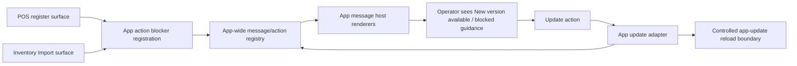

# refactor: Add app-wide message action foundation

## Summary

Create an app-wide messaging/action foundation that owns message placement, priority, and action-scoped blockers, then rebuild app update as the first implementation on top of that foundation. App update keeps version detection, asset staging, runtime evidence, and reload safety as domain-specific adapter behavior; POS and Inventory Import continue to own their own safety truth while registering blockers against the app update action through the shared messaging contract.

---

## Problem Frame

Athena's update-ready mechanism already solved the immediate risk of refreshing while POS or Inventory Import work is unsafe, but its reusable pieces are still packaged as `app-update` concepts. That makes app update look like the platform instead of the first adopter of a broader app-wide message/action capability.

---

## Requirements

- R1. Introduce a neutral app-wide messaging/action foundation that can represent persistent messages, action affordances, action-scoped blockers, and surface communication preferences without app-update naming.
- R2. Keep app update as the first adapter that publishes an update-ready message and an `app-update.apply` action through the foundation.
- R3. Preserve existing reload safety: version detection never reloads directly, and app update apply still runs through the app-update coordinator/reload latch only when blockers allow it.
- R4. Preserve surface-owned opt-in behavior: POS and Inventory Import decide when they block `app-update.apply`; the messaging foundation does not compute sale, drawer, payment, autosave, or import durability state.
- R5. Preserve cross-tab safety for update apply blockers so a safe tab cannot refresh while another same-origin tab reports an active blocker for the same pending update.
- R6. Preserve remote terminal update behavior: `update_app` remains an intent routed through the app-update adapter and verified by fresh runtime evidence, not a generic remote reload.
- R7. Keep operator-facing copy calm, clear, and action-oriented, with app-update staging details treated as secondary diagnostics rather than primary operator copy.
- R8. Add tests that prove blockers are action-scoped and do not suppress unrelated app-wide actions.

---

## Scope Boundaries

- No broad notification redesign beyond the message/action foundation needed for app update.
- No app-wide replacement for domain truth. POS readiness, drawer authority, payment state, import review versions, terminal command verification, and server validation stay in their owning modules.
- No production hot swap or reload-free app update. Applying a new browser bundle still requires a controlled document reload.
- No generalized remote command platform in this delivery. Remote terminal `update_app` remains a POS terminal command consumer of app-update state.
- No PWA/offline cache rewrite. Static asset staging remains app-update/app-shell adapter work.
- No change to the existing `ready-unstaged` product policy. The foundation work must preserve current app-update behavior unless an existing characterization test proves the current implementation already violates the app-update invariant.

### Deferred to Follow-Up Work

- Generic runtime command/evidence tables modeled after Remote Assist `runtimeType` and `runtimeIdentity`.
- Broader migration of command toasts and durable route statuses into the app-wide message foundation.
- Daily Close, cycle count, manager elevation, or Remote Assist as additional message/action adapters after app update proves the foundation.
- Static app-shell naming cleanup that decouples asset staging from POS app-shell terminology.

---

## Context & Research

### Relevant Code and Patterns

- `packages/athena-webapp/src/lib/app-update/updateCoordinator.ts` owns update status, update blockers, cross-tab blocker leasing, selected blocker sorting, `canApply`, and reload latch behavior.
- `packages/athena-webapp/src/lib/app-update/useUpdateApplyBlocker.ts` is the current surface opt-in hook for POS and Inventory Import.
- `packages/athena-webapp/src/lib/app-update/updateCommunicationPreference.tsx`, `packages/athena-webapp/src/lib/app-update/useUpdateCommunicationPreference.ts`, and `packages/athena-webapp/src/lib/app-update/updateCommunicationPreferenceContext.ts` own the current banner/toast preference contract.
- `packages/athena-webapp/src/components/app-update/UpdateReadyBanner.tsx` mixes app-update presentation, Sonner toast rendering, action invocation, and blocker guidance.
- `packages/athena-webapp/src/App.tsx` wires version detection and staging into `UpdateCoordinatorProvider`.
- `packages/athena-webapp/src/routes/__root.tsx` mounts the global toaster and current update-ready surface.
- `packages/athena-webapp/src/components/pos/register/POSRegisterView.tsx` and `packages/athena-webapp/src/components/operations/InventoryImportView.tsx` are the first surface-owned blocker adopters.
- `packages/athena-webapp/src/lib/pos/infrastructure/local/terminalRecoveryCommands.ts` and `packages/athena-webapp/src/lib/pos/infrastructure/local/usePosLocalSyncRuntime.ts` depend on the app-update snapshot for remote update execution and evidence.

### Institutional Learnings

- `docs/solutions/architecture/athena-app-update-apply-safety-2026-06-17.md` separates update detection, staging, explicit apply, surface blockers, and operator copy.
- `docs/plans/2026-06-17-002-feat-update-ready-coordinator-plan.md` establishes POS and Inventory Import as adopters, not the core rule.
- `docs/plans/2026-06-18-001-feat-remote-terminal-app-update-command-plan.md` requires remote update apply to acknowledge before reload and verify through fresh runtime evidence.
- `docs/solutions/architecture/athena-pos-terminal-recovery-readiness-boundary-2026-06-14.md` keeps app-update state separate from POS sales/support readiness.
- `docs/product-copy-tone.md` requires calm, state-first, next-action copy.

### External References

- External research skipped. The relevant implementation contracts are repo-local: app-update coordinator state, app shell staging, POS/Inventory blockers, and terminal runtime evidence.

---

## Key Technical Decisions

- **Foundation-first shape:** Create a neutral app-wide message/action layer, then have app update publish through it as the first adapter. This matches the product frame and avoids treating app update as the platform.
- **Action-scoped blockers:** Blockers attach to an action id such as `app-update.apply`, not to a global blocker pool. This prevents POS sale work from suppressing unrelated future actions.
- **Provider ownership:** Mount `AppMessagesProvider` above `UpdateCoordinatorProvider` in `packages/athena-webapp/src/App.tsx`. The app-message layer is the foundation; the app-update adapter consumes `app-update.apply` blocker/action state from it and preserves update-specific pending-build scoping inside the app-update coordinator.
- **Adapter-owned execution:** The messaging foundation can disable or describe actions, but it does not execute reloads. App update remains the only layer that can call the reload boundary.
- **Surface-owned truth:** POS and Inventory Import still derive blocker activity from their existing view models and draft/autosave state. The foundation receives a snapshot; it does not compute domain safety.
- **Compatibility during migration:** Keep app-update exports or wrappers long enough to avoid breaking remote update evidence and existing tests while the new foundation lands.
- **Volatile copy stays client-side:** Same-origin browser messages may carry operator guidance; persisted runtime/server evidence should continue to use sanitized codes rather than raw local copy.

---

## Open Questions

### Resolved During Planning

- **Should this be a messaging foundation rather than an app-update refactor?** Yes. The foundation is the work; app update is the first implementation.
- **Where does opt-in behavior lie?** Surfaces/adapters opt in. The foundation defines action/blocker mechanics but does not decide POS or Inventory safety.
- **Should app update keep reload enforcement?** Yes. The foundation gates action availability; app update still owns reload/apply safety and runtime evidence.

### Deferred to Implementation

- **Exact naming:** Choose final names such as `app-messages`, `app-actions`, `useAppActionBlocker`, and `AppMessageHost` during implementation based on local import ergonomics.
- **`ready-unstaged` applyability:** Preserve current behavior. Do not revisit update product policy as part of the foundation migration unless existing characterization coverage proves the current implementation already violates its own invariant.
- **Cross-tab generic extraction depth:** Keep the first slice as small as possible; if extracting all BroadcastChannel behavior would destabilize app-update runtime evidence, leave a compatibility bridge and document the remaining adapter-owned logic.

---

## High-Level Technical Design

> *This illustrates the intended approach and is directional guidance for review, not implementation specification. The implementing agent should treat it as context, not code to reproduce.*

---

## Implementation Units

- U1. **Create app-wide message/action foundation**

**Goal:** Add the neutral browser-side action/blocker mechanics that app update needs now: action-scoped blocker registration, priority, selected blocker resolution, and a provider/hook boundary without app-update terminology.

**Requirements:** R1, R4, R7, R8

**Dependencies:** None

**Files:**
- Create: `packages/athena-webapp/src/lib/app-messages/appActionBlockers.ts`
- Create: `packages/athena-webapp/src/lib/app-messages/appActionBlockers.test.ts`
- Create: `packages/athena-webapp/src/lib/app-messages/AppMessagesProvider.tsx`
- Create: `packages/athena-webapp/src/lib/app-messages/AppMessagesContext.ts`
- Create: `packages/athena-webapp/src/lib/app-messages/useAppActionBlocker.ts`
- Create: `packages/athena-webapp/src/lib/app-messages/index.ts`

**Approach:**
- Model blocker inputs with `actionId`, `surfaceId`, `active`, `priority`, `label`, and `guidance`.
- Sort blockers with the existing priority semantics: critical workflow, active command, resume required.
- Keep the contract action-scoped so blockers for one action do not affect unrelated actions.
- Provide a provider/hook API that can be consumed by app update and future adapters.
- Keep domain state out of the foundation; it only stores/action-gates caller-provided snapshots.
- Do not build a generic notification queue, adapter registry, scheduler, persistence layer, or execution framework in this unit.
- Define missing-provider behavior deliberately: public hooks should fail clearly in tests, while optional adapter reads must degrade to no message/action rather than a blind action execution path.

**Execution note:** Implement new foundation behavior test-first.

**Patterns to follow:**
- `packages/athena-webapp/src/lib/app-update/updateCoordinator.ts`
- `packages/athena-webapp/src/lib/app-update/useUpdateApplyBlocker.ts`

**Test scenarios:**
- Happy path: registering an active blocker for `app-update.apply` selects it for that action.
- Happy path: clearing a blocker removes only that surface's blocker for the action.
- Edge case: two blockers on the same action sort by priority, then label/surface id.
- Edge case: a blocker for `app-update.apply` does not block a separate action id.
- Edge case: unmount cleanup clears only the caller's blocker registration.
- Edge case: optional consumers see no action/blocker state when the provider is missing.
- Error path: missing action id, surface id, label, or guidance is ignored or rejected according to the chosen contract.

**Verification:**
- The app-message foundation can represent action blockers independently of app-update imports.

---

- U2. **Move update communication preference into messaging**

**Goal:** Convert banner/toast communication preference from an app-update-specific provider into app-wide message placement policy while preserving current app-update behavior.

**Requirements:** R1, R2, R7

**Dependencies:** U1

**Files:**
- Create: `packages/athena-webapp/src/lib/app-messages/appMessagePlacement.ts`
- Create: `packages/athena-webapp/src/lib/app-messages/appMessagePlacement.test.ts`
- Modify: `packages/athena-webapp/src/lib/app-update/updateCommunicationPreference.tsx`
- Modify: `packages/athena-webapp/src/lib/app-update/updateCommunicationPreferenceContext.ts`
- Modify: `packages/athena-webapp/src/lib/app-update/useUpdateCommunicationPreference.ts`
- Modify: `packages/athena-webapp/src/routes/__root.tsx`

**Approach:**
- Introduce app-message placement terminology that can express current `banner` and `toast` behavior.
- Keep app-update compatibility exports during the migration so route code can move deliberately.
- Replace "last registered preference wins" with deterministic placement precedence or explicitly document the current behavior as a compatibility shim.
- Mount the app-message provider at the root next to the toaster so later adapters do not need app-update imports.

**Execution note:** Start with tests that characterize current POS toast preference and default banner behavior before changing the provider boundary.

**Patterns to follow:**
- `packages/athena-webapp/src/lib/app-update/updateCommunicationPreference.tsx`
- `packages/athena-webapp/src/routes/_authed/$orgUrlSlug/store/$storeUrlSlug/pos/register.index.tsx`

**Test scenarios:**
- Happy path: default update-ready message uses the existing default placement.
- Happy path: POS route preference still moves update-ready communication to toast.
- Edge case: multiple registered preferences resolve deterministically.
- Edge case: unmounting a surface preference restores the previous/default placement.

**Verification:**
- App-wide placement policy exists outside app-update while current update UI behavior remains stable.

---

- U3. **Adapt app update to publish through app messages**

**Goal:** Rebuild the update-ready UI path as an app-update adapter that publishes an app-wide message and `app-update.apply` action while preserving app-update detection, staging, and reload enforcement.

**Requirements:** R2, R3, R5, R7

**Dependencies:** U1, U2

**Files:**
- Create: `packages/athena-webapp/src/components/app-messages/AppMessageHost.tsx`
- Create: `packages/athena-webapp/src/components/app-messages/AppMessageHost.test.tsx`
- Modify: `packages/athena-webapp/src/components/app-update/UpdateReadyBanner.tsx`
- Modify: `packages/athena-webapp/src/components/app-update/UpdateReadyBanner.test.tsx`
- Modify: `packages/athena-webapp/src/lib/app-update/UpdateCoordinatorProvider.tsx`
- Modify: `packages/athena-webapp/src/lib/app-update/UpdateCoordinatorContext.ts`
- Modify: `packages/athena-webapp/src/lib/app-update/updateCoordinator.ts`
- Modify: `packages/athena-webapp/src/lib/app-update/updateCoordinator.test.ts`
- Modify: `packages/athena-webapp/src/App.tsx`
- Modify: `packages/athena-webapp/src/routes/__root.tsx`

**Approach:**
- Let the app-update adapter publish a stable update-ready message with an `Update` action.
- Use the app-message action blocker state for `app-update.apply` when computing whether the action is available.
- Keep `applyUpdate()` as the only reload entry point.
- Preserve current cross-tab update blocker leasing inside app update so remote blockers stay scoped to the current `pendingBuildId`. The app-message foundation supplies local action blockers; the app-update adapter is responsible for projecting those blockers into its pending-build-scoped cross-tab protocol.
- Keep staging copy and diagnostics app-update-specific.
- Cover nil/empty/error paths explicitly: no app-message provider, no blockers, active blockers, BroadcastChannel unavailable, detector failure, and staging failure.

**Execution note:** Characterize current update-ready behavior first, then move rendering through the app-message host.

**Patterns to follow:**
- `packages/athena-webapp/src/components/app-update/UpdateReadyBanner.tsx`
- `packages/athena-webapp/src/lib/app-update/updateCoordinator.test.ts`

**Test scenarios:**
- Happy path: detected staged update publishes an app-wide update-ready message with an enabled `Update` action.
- Happy path: clicking the app-message action calls app-update `applyUpdate()` once.
- Edge case: blocked update shows selected blocker guidance and suppresses/disables the action.
- Edge case: unrelated app-wide action remains available while `app-update.apply` is blocked.
- Edge case: cross-tab blocker still prevents apply for the pending update.
- Edge case: BroadcastChannel unavailable keeps local blocker enforcement intact.
- Edge case: missing app-message provider does not create an enabled reload path.
- Error path: detector failure does not create an update-ready message.
- Error path: staging failure preserves current visible diagnostic behavior.

**Verification:**
- App update is visibly the first adapter on the app-message foundation, and reload safety remains app-update-owned.

---

- U4. **Migrate POS and Inventory blockers to the foundation**

**Goal:** Move first adopter opt-ins from app-update hook imports to the app-wide action-blocker contract while keeping their domain-owned safety logic unchanged.

**Requirements:** R2, R4, R8

**Dependencies:** U1, U3

**Files:**
- Modify: `packages/athena-webapp/src/components/pos/register/POSRegisterView.tsx`
- Modify: `packages/athena-webapp/src/components/pos/register/POSRegisterView.test.tsx`
- Modify: `packages/athena-webapp/src/components/operations/InventoryImportView.tsx`
- Modify: `packages/athena-webapp/src/components/operations/InventoryImportView.test.tsx`
- Modify: `packages/athena-webapp/src/lib/pos/presentation/register/registerUiState.ts`
- Modify: `packages/athena-webapp/src/lib/pos/presentation/register/registerUiState.test.ts`
- Modify: `packages/athena-webapp/src/lib/app-update/index.ts`

**Approach:**
- Replace direct use of `useUpdateApplyBlocker` with the new action-scoped foundation hook for `app-update.apply`.
- Keep a compatibility export only if needed for staged migration, but new first-party surfaces should import from `app-messages`.
- Preserve existing POS blocker active conditions and Inventory Import blocker active conditions.
- Improve implementation-facing copy only where tests already cover it and the change is not a product expansion.

**Execution note:** Use existing component tests as characterization before changing imports and hook payloads.

**Patterns to follow:**
- `packages/athena-webapp/src/components/pos/register/POSRegisterView.tsx`
- `packages/athena-webapp/src/components/operations/InventoryImportView.tsx`

**Test scenarios:**
- Happy path: POS active sale work registers a blocker against `app-update.apply`.
- Happy path: idle POS route does not block `app-update.apply`.
- Happy path: Inventory Import unsaved work registers a blocker against `app-update.apply`.
- Edge case: Inventory Import saved durable review state clears the blocker.
- Edge case: POS/import blockers do not affect a synthetic unrelated action in app-message foundation tests.

**Verification:**
- First adopter surfaces opt into the foundation, not app-update, while their safety behavior stays unchanged.

---

- U5. **Verify terminal update adapter compatibility**

**Goal:** Treat remote terminal update command execution and runtime evidence as a compatibility gate for the app-update adapter migration. Modify terminal/runtime files only if the app-update adapter API changes; otherwise prove compatibility through existing tests.

**Requirements:** R3, R5, R6

**Dependencies:** U3, U4

**Files:**
- Test: `packages/athena-webapp/src/lib/pos/presentation/register/useRegisterLocalRuntime.test.ts`
- Test: `packages/athena-webapp/src/components/remote-assist/PosRemoteAssistRuntimeHost.test.tsx`
- Test: `packages/athena-webapp/src/lib/pos/infrastructure/local/terminalRecoveryCommands.test.ts`
- Test: `packages/athena-webapp/src/lib/pos/infrastructure/local/usePosLocalSyncRuntime.test.ts`
- Test: `packages/athena-webapp/src/lib/pos/infrastructure/local/terminalRuntimeStatus.test.ts`
- Modify if adapter API changes: `packages/athena-webapp/src/lib/pos/presentation/register/useRegisterLocalRuntime.ts`
- Modify if adapter API changes: `packages/athena-webapp/src/components/remote-assist/PosRemoteAssistRuntimeHost.tsx`
- Modify if adapter API changes: `packages/athena-webapp/src/lib/pos/infrastructure/local/terminalRecoveryCommands.ts`
- Modify if adapter API changes: `packages/athena-webapp/src/lib/pos/infrastructure/local/usePosLocalSyncRuntime.ts`
- Modify if adapter API changes: `packages/athena-webapp/src/lib/pos/infrastructure/local/terminalRuntimeStatus.ts`

**Approach:**
- Keep remote `update_app` routed to app-update adapter APIs, not to a generic app-message action executor.
- Preserve acknowledgement-before-apply behavior.
- Preserve command-correlated runtime evidence and sanitized blocker codes.
- Confirm app-wide message copy does not leak into terminal runtime evidence.
- Avoid terminal/runtime implementation changes unless the app-update adapter compatibility surface actually moves.
- Verify both POS local runtime and Remote Assist runtime host continue to pass `getSnapshot` and `applyUpdate` adapter methods when the coordinator is present.
- Verify missing coordinator remains an explicit unsupported/unknown path, never a reload path.

**Execution note:** Run terminal runtime tests after app-update snapshot changes; this is a regression-sensitive compatibility unit.

**Patterns to follow:**
- `packages/athena-webapp/src/lib/pos/infrastructure/local/terminalRecoveryCommands.ts`
- `packages/athena-webapp/src/lib/pos/infrastructure/local/usePosLocalSyncRuntime.ts`

**Test scenarios:**
- Happy path: remote update command still calls app-update apply only after acknowledgement.
- Edge case: blocked update command reports blocked evidence without reload.
- Edge case: selected blocker code remains sanitized and does not include local guidance copy.
- Edge case: POS local runtime and Remote Assist runtime host still pass app-update adapter methods into local runtime status.
- Edge case: missing coordinator remains unsupported/unknown and does not expose update apply.
- Error path: missing app-message provider does not create a blind reload path.
- Integration: post-command runtime evidence still verifies command-correlated app-update state.

**Verification:**
- Terminal Health and runtime status continue to derive update truth from app-update evidence, not from message rendering state.

---

- U6. **Document the new boundary and validation routing**

**Goal:** Update durable docs and generated graph/harness artifacts so future agents understand app-wide messaging as the foundation and app update as the first adapter.

**Requirements:** R1, R2, R7

**Dependencies:** U1, U2, U3, U4, U5

**Files:**
- Modify: `docs/solutions/architecture/athena-app-update-apply-safety-2026-06-17.md`
- Create or modify: `docs/solutions/architecture/athena-app-wide-message-action-foundation-2026-06-20.md`
- Modify if needed: `scripts/harness-app-registry.ts`
- Regenerate if needed: `packages/athena-webapp/docs/agent/validation-map.json`
- Regenerate if needed: `packages/athena-webapp/docs/agent/validation-guide.md`
- Regenerate: `graphify-out/GRAPH_REPORT.md`
- Regenerate: `graphify-out/graph.json`
- Regenerate: `graphify-out/wiki/index.md`
- Regenerate: `graphify-out/wiki/packages/athena-webapp.md`

**Approach:**
- Document that the foundation owns message/action/blocker mechanics, while app update owns update detection, staging, reload, and runtime evidence.
- Document that surfaces opt in by registering blockers for action ids and keep domain truth locally.
- Update validation routing only if new app-message files are not covered by existing harness mappings.
- Rebuild graphify after code changes.

**Execution note:** Sensor-only for generated docs after behavior-bearing units pass.

**Patterns to follow:**
- `docs/solutions/architecture/athena-app-update-apply-safety-2026-06-17.md`
- `packages/athena-webapp/docs/agent/testing.md`

**Test scenarios:**
- Test expectation: none for prose/generated docs; validation comes from harness checks and graphify rebuild.

**Verification:**
- Docs reflect the current architecture, validation routing covers the new foundation, and graphify is current.

---

## System-Wide Impact

- **Interaction graph:** Root app mounts app-message provider/host; app update publishes message/action state; POS and Inventory Import register blockers; terminal runtime reads app-update adapter evidence.
- **Error propagation:** App-message rendering should use normalized operator copy and avoid raw backend/internal wording.
- **State lifecycle risks:** Component unmount cleanup must not leave stale blockers; cross-tab leases must not clear local blockers; route remount should re-register from domain state.
- **API surface parity:** App-update compatibility exports, POS runtime evidence, terminal command execution, and app-message action contracts must agree on blocker semantics.
- **Integration coverage:** Unit tests prove blocker/action rules; component tests prove update UI behavior; runtime tests prove remote update evidence remains intact.
- **Unchanged invariants:** Version detection does not reload; app update apply reloads at most once; POS route presence alone does not block refresh; remote command acknowledgement is not update proof.

---

## Risks & Dependencies

| Risk | Mitigation |
|------|------------|
| Foundation becomes too broad and delays delivery | Limit active implementation to message/action mechanics needed by app update; defer other adapters. |
| App-wide blockers accidentally become domain truth | Require action-scoped blocker snapshots and keep POS/import state calculations in existing files. |
| Remote update command regresses | Preserve app-update snapshot/adapter APIs and run terminal recovery/runtime tests. |
| Cross-tab blocker behavior changes | Keep or wrap the existing coordinator lease behavior first; extract only after tests prove parity. |
| Existing root dirty work diverges from worktree | Deliver from the clean worktree and do not transplant unrelated root changes. |

---

## Documentation / Operational Notes

- This work should be tracked as a coordinated batch because multiple tickets are likely to touch app-update tests, generated graph artifacts, and shared docs.
- Run graphify rebuild after code changes.
- Relevant production deploy surface after merge is `athena-local`; Convex deploy is only needed if execution expands into Convex runtime/schema changes, which this plan intentionally avoids.

---

## Sources & References

- Related plan: `docs/plans/2026-06-17-002-feat-update-ready-coordinator-plan.md`
- Related plan: `docs/plans/2026-06-18-001-feat-remote-terminal-app-update-command-plan.md`
- Related solution: `docs/solutions/architecture/athena-app-update-apply-safety-2026-06-17.md`
- Related solution: `docs/solutions/architecture/athena-pos-terminal-recovery-readiness-boundary-2026-06-14.md`
- Product copy guide: `docs/product-copy-tone.md`
