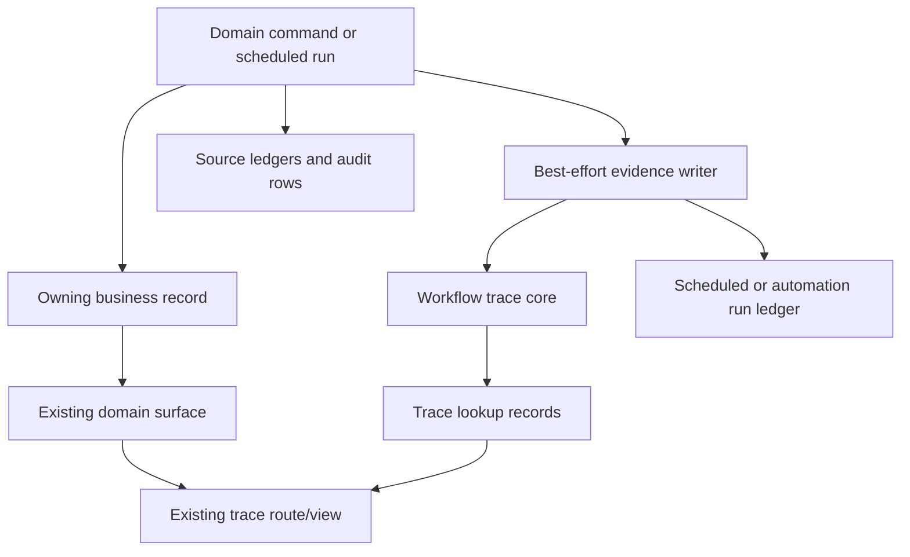
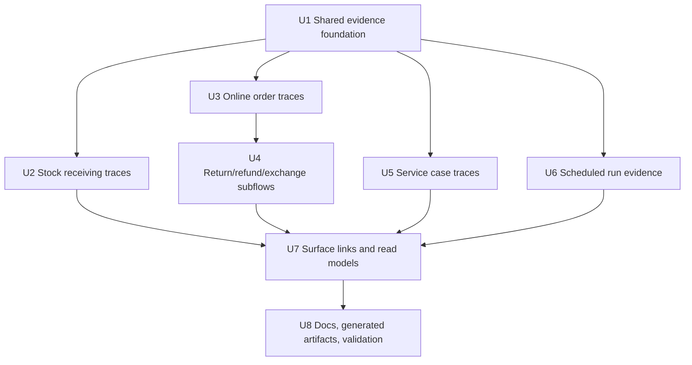
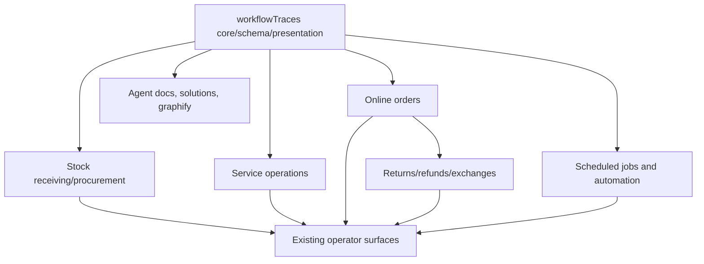

# feat: Extend Workflow Investigation Evidence

## Summary

Extend Athena's POS workflow-trace foundation into the durable lifecycle surfaces operators already investigate: stock receiving, service cases, online orders, online returns/refunds/exchanges, and scheduled jobs. The implementation should reuse the existing workflow trace viewer and adapter style, keep operational events and domain ledgers as their source-specific evidence rails, and add only investigation evidence without changing frontline workflow outcomes.

---

## Problem Frame

POS now has a useful investigation pattern: workflow traces provide a readable lifecycle, operational events capture discrete audit rows, and source ledgers such as inventory movement and payment allocation remain the facts of record. Other high-volume operational surfaces still require operators or support to reconstruct state from domain records, operational events, and cron return values.

This gap matters most when a workflow spans multiple records or retries. A receiving batch can update a purchase order, inventory movements, SKU pressure, and an operations work item. A service case can begin from intake or appointment conversion, consume inventory, require approval, receive payment, and close later. An online order can progress through payment, readiness, delivery/pickup, cancellation, and return/exchange branches. Scheduled jobs may apply, skip, or partially fail with little operator-readable run evidence.

The goal is not to make a new command center. The goal is to make each owning surface answer "what happened, who or what did it, which source records changed, and what evidence should I inspect next?" using the same investigation muscle Athena built for POS.

---

## Assumptions

*This plan is authored from the user's approved direction and repo/subagent research, without a separate brainstorm document. These are explicit planning assumptions for reviewer scrutiny.*

- Replay-prone events need persisted domain event keys so retries do not create noisy duplicate timeline entries.
- Evidence writes are best-effort. A trace or run-ledger write failure must not fail receiving, service, online order, refund, or scheduled-job business mutations.
- Policy-backed scheduled jobs continue to use `automationRun`; generic cleanup cron jobs should gain a scheduled-run evidence boundary that does not imply policy control.
- Purchase orders, service cases, online orders, and return/exchange subflows are durable lifecycle owners. One-off stock adjustments or approval-only mutations should stay on operational events unless they are part of one of those lifecycles.
- Online returns/exchanges should be represented as subflows linked to the base order trace, so their approval, inventory, replacement, and refund branches do not obscure the base order lifecycle.
- Actor references should capture both user and staff identity when available; automation should be explicit when no human actor exists.

---

## Requirements

- R1. Operators can open investigation evidence for stock receiving/procurement, service cases, online orders, online returns/refunds/exchanges, and scheduled jobs from the relevant Athena surfaces.
- R2. The implementation reuses the existing workflow trace core, lookup model, presentation query, route, and `WorkflowTraceRouteLink` where a durable lifecycle trace is appropriate.
- R3. Workflow traces remain lifecycle evidence, not replacements for `operationalEvent`, `inventoryMovement`, SKU activity, payment allocation, `automationRun`, or source business records.
- R4. Evidence writes are non-blocking: primary business mutations continue to return their existing success or user-error result even when trace or run-ledger recording fails.
- R5. Replay-prone workflows use stable event keys or equivalent dedupe strategy so command retries, sync replay, receiving `submissionKey` reuse, and scheduled-job reruns do not duplicate milestones.
- R6. Investigation evidence includes stable lookups, source subject refs, actor refs, readable messages, and compact normalized details for source records and partial failures.
- R7. Scheduled-job evidence records both applied and meaningful skipped/failed outcomes without turning cron internals into operator noise.
- R8. Operator-facing links appear only where natural in existing detail/list surfaces; no new dashboard, recommendation engine, or blocking review flow is added in this pass.
- R9. Focused Convex and React tests prove trace creation, lookup, dedupe, source linking, non-blocking failure behavior, and surface visibility for each delivered workflow family.
- R10. The implementation captures a `docs/solutions` note documenting the cross-domain evidence pattern and updates generated agent/graph artifacts required by repo guidance.
- R11. Trace and scheduled-run reads enforce the same domain/source-record permission boundary as the originating surface, and trace details/lookups minimize sensitive customer, payment, provider, and service-note data.
- R12. Trace links and scheduled-run summaries have explicit placement and empty/loading/permission/failure states on each touched operator surface, avoiding inconsistent local UI decisions.

---

## Scope Boundaries

- This plan does not build a unified Daily Operations exception queue, recommendations, alerts, or a proactive command center.
- This plan does not make new operator actions blocking. Recoverable friction becomes evidence, not a cashier/store-operations blocker.
- This plan does not trace every minor mutation, keystroke, search, or validation check.
- This plan does not rewrite workflow trace schemas broadly unless a minimal field/index is required for event-key dedupe.
- This plan does not replace `operationalEvent`; it composes traces with existing audit events and ledgers.
- This plan does not backfill historical traces for old purchase orders, service cases, orders, returns, or cron runs.
- This plan does not introduce a generic scheduler or command bus.

### Deferred to Follow-Up Work

- A unified operator investigation hub after these source-specific evidence rails prove useful.
- Historical backfills for legacy workflows.
- Cross-workflow correlation/search beyond existing trace lookups and source links.
- Proactive recommendations or automated remediation based on trace contents.

---

## Context & Research

### Relevant Code and Patterns

- `packages/athena-webapp/shared/workflowTrace.ts` owns workflow trace constants, id creation, and lookup normalization.
- `packages/athena-webapp/convex/schemas/observability/workflowTrace.ts`, `workflowTraceEvent.ts`, and `workflowTraceLookup.ts` define the persisted trace, ordered event, and lookup records.
- `packages/athena-webapp/convex/workflowTraces/core.ts` provides trace creation/upsert, lookup registration, event append, and read helpers.
- `packages/athena-webapp/convex/workflowTraces/presentation.ts` and `public.ts` feed the reusable trace route.
- `packages/athena-webapp/convex/workflowTraces/adapters/posSession.ts`, `registerSession.ts`, and `expenseSession.ts` show the adapter pattern to extend.
- `packages/athena-webapp/convex/pos/application/commands/posSessionTracing.ts` and `packages/athena-webapp/convex/operations/registerSessionTracing.ts` show best-effort domain trace writers.
- `packages/athena-webapp/src/components/traces/WorkflowTraceView.tsx`, `WorkflowTraceRouteLink.tsx`, and `src/routes/_authed/$orgUrlSlug/store/$storeUrlSlug/traces/$traceId.tsx` are the existing viewer/linking surface.
- `packages/athena-webapp/convex/stockOps/purchaseOrders.ts` and `receiving.ts` own purchase-order lifecycle, receiving batches, PO status updates, inventory movements, and operations work-item status.
- `packages/athena-webapp/convex/operations/serviceIntake.ts`, `packages/athena-webapp/convex/serviceOps/appointments.ts`, and `serviceCases.ts` own service intake, appointment conversion, case lifecycle, approvals, payment, and inventory usage.
- `packages/athena-webapp/convex/storeFront/onlineOrder.ts`, `storeFront/helpers/orderOperations.ts`, `storeFront/helpers/returnExchangeOperations.ts`, and `storeFront/payment.ts` own online order status, payment verification/refunds, return/exchange planning, restock, and order operational events.
- `packages/athena-webapp/convex/crons.ts`, `packages/athena-webapp/convex/automation/runLedger.ts`, `automationFoundation.ts`, and `operations/dailyOperationsAutomation.ts` show the split between raw cron triggers and policy-backed automation run evidence.
- Generic scheduled cleanup handlers live behind `crons.ts` in `packages/athena-webapp/convex/storeFront/checkoutSession.ts`, `packages/athena-webapp/convex/inventory/posSessions.ts`, `packages/athena-webapp/convex/inventory/expenseSessions.ts`, and `packages/athena-webapp/convex/storeFront/payment.ts`; these handlers own applied/skipped/failed counts and source subject refs.
- Current investigation UI targets include `src/components/procurement/ProcurementView.tsx`, `src/components/procurement/ReceivingView.tsx`, `src/components/services/ServiceCasesView.tsx`, `src/components/orders/ActivityView.tsx`, `RefundsView.tsx`, `ReturnExchangeView.tsx`, and Daily Operations/automation rows.

### Institutional Learnings

- `docs/solutions/architecture/athena-pos-quick-add-operational-event-tracing-2026-05-30.md` keeps workflow traces reserved for domains with real lifecycles and uses operational events for command-boundary audit rows.
- `docs/solutions/logic-errors/athena-pos-remote-monitoring-trace-parity-2026-06-05.md` shows the POS pattern for combining lifecycle traces with operational events and source links.
- `docs/solutions/architecture/athena-automation-foundation-2026-06-08.md` and `docs/solutions/architecture/athena-store-day-auto-start-review-2026-06-11.md` establish automation policy plus `automationRun` as the evidence boundary for Daily Operations automation.
- `docs/solutions/logic-errors/athena-procurement-stock-continuity-2026-05-05.md` and `docs/solutions/logic-errors/athena-sku-activity-traceability-2026-05-13.md` keep committed stock facts in inventory movement/SKU activity evidence.
- `docs/solutions/architecture/athena-pos-service-mixed-checkout-2026-05-28.md` and ledger correction notes preserve financial and inventory ledger boundaries through companion evidence, not direct edits to historical facts.
- `docs/solutions/architecture/athena-pos-cashier-continuity-review-deferral-2026-06-20.md` reinforces that recoverable operational friction should become review evidence rather than new frontline blockers.

### Validation Map

- Workflow trace foundation edits should use the validation guide's workflow-trace sensor set: `convex/workflowTraces/presentation.test.ts`, `queryUsage.test.ts`, `schemaIndexes.test.ts`, adapter tests, trace route/view tests, and affected domain tests.
- Stock/procurement edits should include focused `convex/stockOps/purchaseOrders.test.ts`, `receiving.test.ts`, and affected procurement/operations component tests.
- Service edits should include `convex/operations/serviceIntake.test.ts`, `convex/serviceOps/serviceCases.test.ts`, `catalogAppointments.test.ts`, and affected service-case component tests.
- Online order/refund edits should include `convex/storeFront/orderOperations.test.ts`, `returnExchangeOperations.test.ts`, `payment.test.ts`, `onlineOrder.test.ts`, and affected orders component tests.
- Cron/automation edits should include `convex/crons.test.ts`, `convex/automation/automationFoundation.test.ts`, and `convex/operations/dailyOperationsAutomation.test.ts` where changed.

---

## Key Technical Decisions

| Decision | Direction | Rationale |
|---|---|---|
| Trace ownership | Add traces only for durable lifecycle owners | This preserves the POS rule: operational events cover discrete command audit, workflow traces tell a lifecycle story. |
| Event dedupe | Add optional persisted `eventKey` on trace events plus a store/trace/event-key lookup path | Receiving retries, order status replay, refund retries, and cron reruns otherwise append duplicate evidence. |
| Failure boundary | Best-effort evidence writes | Investigation evidence must not become a new operational blocker. |
| Cron evidence | Use `automationRun` for policy automation and separate scheduled-run evidence for generic cleanup | Reusing `automationRun` for all crons would imply policy semantics where none exist. |
| Return/exchange shape | Link return/exchange subflows to the base order trace | Keeps the order lifecycle readable while preserving return/refund inventory and payment branches. |
| Surface strategy | Reuse existing trace route/link components | Operators get a consistent investigation view without a new product surface. |
| Evidence minimization | Store ids/refs and normalized summaries, not raw payment/provider/customer/contact/service-note payloads | Trace and run evidence should help investigation without widening sensitive data exposure. |
| Trace access contract | Persist an access descriptor or use adapter-provided authorizers for every sensitive workflow trace | Store access alone is not enough once a reusable trace route can reveal order, payment, customer, service, and scheduled-run evidence. |

---

## Open Questions

### Resolved During Planning

- Should every audited mutation get a workflow trace? No. Only durable lifecycle owners get traces; command-only evidence remains on `operationalEvent` and source ledgers.
- Should trace recording be allowed to fail the business action? No. Trace/run-ledger evidence is best-effort and non-blocking.
- Should duplicate event protection be left to implementation discretion? No. The shared evidence foundation must define the dedupe convention before domain workflows extend it.
- Should generic cleanup cron jobs use `automationRun`? No. `automationRun` remains for policy-backed automation; generic scheduled jobs need a scheduled-run evidence shape if they produce operator investigation value.
- Should returns/exchanges share only the online order trace? Partially. The order trace should link to return/exchange subflows so the order lifecycle remains readable.

### Deferred to Implementation

- Exact trace workflow type names and event key strings: choose during implementation to match existing adapter naming.
- Exact scheduled-run table shape: keep it minimal unless an existing schema can safely host generic cron evidence without overloading semantics.

---

## High-Level Technical Design

> *This illustrates the intended approach and is directional guidance for review, not implementation specification. The implementing agent should treat it as context, not code to reproduce.*

The primary mutation remains the source of truth. Evidence writers gather source ids, actor refs, lookup values, event keys, and readable summaries after or beside the domain change. They write traces or run ledgers best-effort and expose links through existing surfaces when a trace id or run id exists.

---

## Implementation Units

- U1. **Harden Shared Workflow Evidence Foundation**

**Goal:** Extend the existing workflow trace foundation so new domains can create readable, idempotent, non-blocking evidence without duplicating POS-specific writer logic.

**Requirements:** R2, R3, R4, R5, R6, R9, R11

**Dependencies:** None

**Files:**
- Modify: `packages/athena-webapp/shared/workflowTrace.ts`
- Modify: `packages/athena-webapp/convex/workflowTraces/core.ts`
- Modify: `packages/athena-webapp/convex/workflowTraces/presentation.ts`
- Modify: `packages/athena-webapp/convex/workflowTraces/public.ts`
- Modify: `packages/athena-webapp/convex/workflowTraces/adapters/*`
- Modify if needed: `packages/athena-webapp/convex/schemas/observability/workflowTraceEvent.ts`
- Modify if needed: `packages/athena-webapp/convex/schema.ts`
- Test: `packages/athena-webapp/convex/workflowTraces/queryUsage.test.ts`
- Test: `packages/athena-webapp/convex/workflowTraces/schemaIndexes.test.ts`
- Test: `packages/athena-webapp/convex/workflowTraces/presentation.test.ts`
- Test: `packages/athena-webapp/convex/workflowTraces/adapters/*.test.ts`

**Approach:**
- Add an optional persisted `eventKey` to `workflowTraceEvent` and a store/trace/event-key query path so `appendWorkflowTraceEventWithCtx` can upsert-or-skip replay-prone milestones before assigning a new sequence. Events without `eventKey` preserve current append-only behavior.
- Extract or document a best-effort writer pattern so domain writers can catch/log evidence failures while preserving primary mutation behavior.
- Add adapter tests for any existing adapter gaps, including the expense adapter if it lacks coverage.
- Keep the public trace presentation contract backward-compatible for existing POS/register traces.
- Require public trace reads by id and lookup to assert the reader has access to the trace's store and the same domain/source-record permission needed to see the originating surface. Lookup reads must not bypass the domain permission check.
- Add a concrete trace access contract before domain rollout: either persist a required access descriptor on `workflowTrace` or register adapter-provided authorizers by workflow type. The public query flow must resolve lookup to trace, load the access descriptor/source subject, run the workflow-specific authorizer, and only then return trace events.
- Cover every sensitive workflow family with a negative authorization test where the reader has valid store access but lacks source-record/domain permission: online order, return/refund/exchange, service case, and scheduled-run/payment cleanup evidence.
- Define trace evidence minimization rules: use source ids/refs and normalized summaries where possible; prohibit raw payment provider payloads, full external transaction tokens, customer contact data, service notes, and raw backend/provider errors in trace details, lookups, logs, or operator copy.

**Test scenarios:**
- Happy path: creating a trace and registering multiple lookups still returns a view-compatible trace.
- Retry path: appending the same domain event key twice does not duplicate the milestone.
- Error path: a forced trace append failure is caught by a best-effort writer and does not throw through the business command.
- Authorization path: a user without access to the requested store or source domain cannot read a trace by id or lookup even with a valid `storeId` and trace/lookup value.
- Privacy path: trace lookups/details and evidence logs store ids/refs and normalized copy, not raw payment/provider/customer/contact/service-note content.
- Regression: POS/register trace presentation remains unchanged for existing fixtures.

**Verification:**
- New domains have a shared, tested convention for trace ids, lookups, event keys, source refs, actor refs, and failure handling.

- U2. **Add Stock Receiving and Procurement Trace Evidence**

**Goal:** Make purchase order and receiving investigation evidence visible as a PO-centered lifecycle with receiving-batch and SKU/source links.

**Requirements:** R1, R2, R3, R4, R5, R6, R8, R9, R11

**Dependencies:** U1

**Files:**
- Create: `packages/athena-webapp/convex/workflowTraces/adapters/purchaseOrder.ts`
- Create: `packages/athena-webapp/convex/stockOps/purchaseOrderTracing.ts`
- Modify: `packages/athena-webapp/convex/stockOps/purchaseOrders.ts`
- Modify: `packages/athena-webapp/convex/stockOps/receiving.ts`
- Modify if needed: `packages/athena-webapp/convex/schemas/stockOps/purchaseOrder.ts`
- Modify if needed: `packages/athena-webapp/convex/schemas/stockOps/receivingBatch.ts`
- Test: `packages/athena-webapp/convex/workflowTraces/adapters/purchaseOrder.test.ts`
- Test: `packages/athena-webapp/convex/stockOps/purchaseOrders.test.ts`
- Test: `packages/athena-webapp/convex/stockOps/receiving.test.ts`

**Approach:**
- Use one purchase-order trace as the primary lifecycle and register lookups by PO id, PO number, vendor, and receiving submission key where available.
- Record PO creation/status milestones and receiving-batch milestones with `receivingBatchId`, `submissionKey`, SKU/line refs, inventory movement refs, and work-item refs.
- Preserve committed stock truth in `inventoryMovement`; traces summarize and link, not recalculate stock.
- Treat duplicate `submissionKey` receipt returns as existing evidence, not new trace milestones.

**Test scenarios:**
- Happy path: PO created, ordered, partially received, and fully received shows ordered and receipt milestones with PO, vendor, SKU, line, batch, and movement refs.
- Retry path: a duplicate receiving `submissionKey` returns the existing batch and does not append duplicate trace milestones.
- Error path: invalid PO transition returns the existing user error without writing a misleading success milestone.
- Failure path: trace append failure does not fail a successful receiving mutation.

**Verification:**
- A support operator can start from a PO, receiving batch, or SKU-linked movement and reach the same lifecycle evidence.

- U3. **Add Online Order Lifecycle Trace Evidence**

**Goal:** Make online order creation, payment, fulfillment readiness, delivery/pickup, cancellation, and external references readable through a linked lifecycle trace.

**Requirements:** R1, R2, R3, R4, R5, R6, R8, R9

**Dependencies:** U1

**Files:**
- Create: `packages/athena-webapp/convex/workflowTraces/adapters/onlineOrder.ts`
- Create: `packages/athena-webapp/convex/storeFront/onlineOrderTracing.ts`
- Modify: `packages/athena-webapp/convex/storeFront/onlineOrder.ts`
- Modify: `packages/athena-webapp/convex/storeFront/helpers/orderOperations.ts`
- Modify: `packages/athena-webapp/convex/storeFront/payment.ts`
- Modify if needed: `packages/athena-webapp/convex/schemas/storeFront/onlineOrder/onlineOrder.ts`
- Test: `packages/athena-webapp/convex/workflowTraces/adapters/onlineOrder.test.ts`
- Test: `packages/athena-webapp/convex/storeFront/orderOperations.test.ts`
- Test: `packages/athena-webapp/convex/storeFront/payment.test.ts`
- Test: `packages/athena-webapp/convex/storeFront/onlineOrder.test.ts`

**Approach:**
- Use the online order as the primary trace subject and register lookups by order id, order number, checkout session, and safe external reference where available. Avoid raw external transaction identifiers in lookup values unless they are already a normalized Athena reference safe for the same operators who can view the order.
- Record payment verification/collection, readiness changes, status transitions, and cancellation milestones with customer profile, order item, SKU, payment allocation, and inventory movement refs.
- Keep operational events as the timeline feed for domain activity while workflow traces provide lifecycle reconstruction.
- Normalize external/provider error details before operator-facing trace copy.

**Test scenarios:**
- Happy path: order created, payment verified, items marked ready, and delivered/picked up produces a single order trace with customer and external reference lookups.
- Edge path: ready/unready item transitions link order item and SKU refs without duplicating inventory facts.
- Error path: invalid status transition returns existing user error and does not record a success milestone.
- Failure path: trace write failure does not fail payment verification or order update.

**Verification:**
- An order detail or activity row can link to a trace that explains the order's current lifecycle state and source records.

- U4. **Add Return, Refund, and Exchange Subflow Evidence**

**Goal:** Represent online return/refund/exchange work as trace-linked subflows that preserve payment and inventory ledger boundaries.

**Requirements:** R1, R2, R3, R4, R5, R6, R8, R9, R11

**Dependencies:** U1, U3

**Files:**
- Create: `packages/athena-webapp/convex/workflowTraces/adapters/orderReturnExchange.ts`
- Create or extend: `packages/athena-webapp/convex/storeFront/onlineOrderTracing.ts`
- Modify: `packages/athena-webapp/convex/storeFront/helpers/returnExchangeOperations.ts`
- Modify: `packages/athena-webapp/convex/storeFront/onlineOrder.ts`
- Modify: `packages/athena-webapp/convex/storeFront/payment.ts`
- Test: `packages/athena-webapp/convex/workflowTraces/adapters/orderReturnExchange.test.ts`
- Test: `packages/athena-webapp/convex/storeFront/returnExchangeOperations.test.ts`
- Test: `packages/athena-webapp/convex/storeFront/payment.test.ts`
- Test: `packages/athena-webapp/convex/storeFront/onlineOrder.test.ts`

**Approach:**
- Create return/exchange subtrace ids linked to the parent online order trace and register lookups by order id, return/exchange id or plan source, and safe refund/reservation refs where available. Avoid storing provider payloads, full external payment identifiers, customer contact data, or raw service/order notes in lookups or details.
- Record approval-required, refund reserved, refund finalized/released, restock, replacement issue, and balance collection milestones.
- Keep original order/payment/inventory facts historical; use payment allocation, refund reservation, inventory movement, and operational event refs for corrections and companion evidence.
- Distinguish approval-required paths that should not create inventory/payment side effects.

**Test scenarios:**
- Happy path: successful return with restock and refund links movement ids, payment allocation/refund ids, and parent order trace.
- Happy path: exchange creates replacement evidence and links the parent order and affected SKU/order item refs.
- Approval path: approval-required return records an approval milestone without restock/refund side effects.
- Retry path: refund reservation finalized or released twice remains distinguishable and idempotent.
- Failure path: trace write failure does not fail the refund/return command.

**Verification:**
- Operators can inspect a return/exchange timeline without losing the base online order lifecycle or rewriting historical ledger facts.

- U5. **Add Service Case Trace Evidence**

**Goal:** Make service intake, appointments, case lifecycle, approvals, payments, inventory usage, and completion/cancel states visible through one service-case trace.

**Requirements:** R1, R2, R3, R4, R5, R6, R8, R9, R11

**Dependencies:** U1

**Files:**
- Create: `packages/athena-webapp/convex/workflowTraces/adapters/serviceCase.ts`
- Create: `packages/athena-webapp/convex/serviceOps/serviceCaseTracing.ts`
- Modify: `packages/athena-webapp/convex/operations/serviceIntake.ts`
- Modify: `packages/athena-webapp/convex/serviceOps/appointments.ts`
- Modify: `packages/athena-webapp/convex/serviceOps/serviceCases.ts`
- Modify if needed: `packages/athena-webapp/convex/schemas/serviceOps/serviceCase.ts`
- Modify if needed: `packages/athena-webapp/convex/schemas/serviceOps/serviceAppointment.ts`
- Test: `packages/athena-webapp/convex/workflowTraces/adapters/serviceCase.test.ts`
- Test: `packages/athena-webapp/convex/operations/serviceIntake.test.ts`
- Test: `packages/athena-webapp/convex/serviceOps/catalogAppointments.test.ts`
- Test: `packages/athena-webapp/convex/serviceOps/serviceCases.test.ts`

**Approach:**
- Use the service case as the primary trace and register lookups by case id, case number, work item id, appointment id, and customer profile id.
- Record intake/appointment conversion, status changes, approval requests, payments, inventory/material usage, awaiting pickup, completion, cancellation, and refund-related milestones.
- Capture both actor user and staff refs when available, with an explicit fallback when only one identity is present.
- Keep service ledgers, payment allocations, inventory movements, and operational events as facts; traces summarize and link.
- Minimize sensitive service evidence: link case, customer profile, appointment, approval, payment, and movement refs without copying raw customer contact data or service notes into trace details.

**Test scenarios:**
- Happy path: service intake creates one case trace linked to customer, work item, deposit/payment, appointment, and case records.
- Happy path: inventory/material usage and payment allocation append case milestones with movement/payment refs.
- Error path: case completion blocked by balance or pending approval returns existing error behavior without a success milestone.
- Failure path: trace append failure does not fail service intake, payment, or status update.

**Verification:**
- A service case detail can show a trace link that reconstructs the case lifecycle across intake, scheduling, work, payment, and pickup.

- U6. **Add Scheduled Job Run Evidence**

**Goal:** Give scheduled jobs operator-readable run evidence for applied, skipped, rerun, and partially failed outcomes while preserving Daily Operations automation semantics.

**Requirements:** R1, R3, R4, R5, R6, R7, R8, R9, R11

**Dependencies:** U1

**Files:**
- Create or extend: `packages/athena-webapp/convex/automation/scheduledRunLedger.ts`
- Modify: `packages/athena-webapp/convex/crons.ts`
- Modify: `packages/athena-webapp/convex/storeFront/checkoutSession.ts`
- Modify: `packages/athena-webapp/convex/inventory/posSessions.ts`
- Modify: `packages/athena-webapp/convex/inventory/expenseSessions.ts`
- Modify: `packages/athena-webapp/convex/storeFront/payment.ts`
- Modify: `packages/athena-webapp/convex/operations/dailyOperationsAutomation.ts`
- Modify as needed: `packages/athena-webapp/convex/operations/dailyOperations.ts`
- Modify if needed: `packages/athena-webapp/convex/schemas/automation/*`
- Test: `packages/athena-webapp/convex/crons.test.ts`
- Test: `packages/athena-webapp/convex/storeFront/checkoutSession.test.ts`
- Test: `packages/athena-webapp/convex/inventory/posSessions.trace.test.ts`
- Test: `packages/athena-webapp/convex/storeFront/payment.test.ts`
- Test: `packages/athena-webapp/convex/automation/automationFoundation.test.ts`
- Test: `packages/athena-webapp/convex/operations/dailyOperationsAutomation.test.ts`

**Approach:**
- Keep policy-backed Daily Operations jobs on `automationRun` with existing domain/action/policy semantics.
- Add a minimal scheduled-run ledger for generic cleanup/payment verification jobs where current evidence is only return values or logs.
- Record cron name, run key, candidate count, applied/skipped/failed counts, compact failure codes, and source subject refs for meaningful state changes.
- Treat `releaseCheckoutItems`, `completeCheckoutSessions`, `clearAbandonedSessions`, `releasePosSessionItems`, and `autoVerifyUnverifiedPayments` as in scope. Keep `releaseExpiredExpenseSessions` documented as no-op/suppressed unless implementation finds a real state-changing handler.
- Record applied runs when at least one subject changes state, partial failures when at least one subject fails after candidates are selected, and meaningful zero-candidate runs only for operator-facing cleanup/payment jobs where absence of action answers an investigation question. Suppress scheduler bootstrap/early guard no-ops and cadence checks that have no source subject or operator-facing workflow.
- Use a stable run key per cron family and scheduled window so reruns update or dedupe evidence instead of creating duplicate run rows.
- Partition scheduled-run evidence by store when subjects are store-owned, keep cross-store/system summaries support-only, and enforce explicit read authorization before exposing payment cleanup subject refs or failure details.

**Test scenarios:**
- Happy path: a cron run with candidates records applied count and affected subject refs.
- No-candidate path: a meaningful zero-candidate run records skipped/zero counts only when useful for investigation.
- Partial failure path: one failed subject records failed count/error code while other subjects continue.
- Retry path: rerunning the same cron family for the same scheduled window updates or dedupes the run evidence instead of creating duplicate evidence rows.
- Authorization path: store operators can only read scheduled-run details for their authorized store/domain, while cross-store/system-level run details remain support-only.
- Policy path: Daily Operations automation continues to record `automationRun` semantics and is not downgraded to generic cron evidence.
- Failure path: run-ledger write failure does not fail subject processing.

**Verification:**
- Operators can distinguish "nothing to do," "applied," and "partially failed" scheduled-job outcomes without reading raw logs.

- U7. **Surface Investigation Links in Existing Operator Views**

**Goal:** Make the new evidence discoverable from natural source surfaces without creating a separate investigation product.

**Requirements:** R1, R2, R6, R8, R9, R12

**Dependencies:** U2, U4, U5, U6

**Files:**
- Modify: `packages/athena-webapp/src/components/procurement/ProcurementView.tsx`
- Modify: `packages/athena-webapp/src/components/procurement/ReceivingView.tsx`
- Modify: `packages/athena-webapp/src/components/services/ServiceCasesView.tsx`
- Modify: `packages/athena-webapp/src/components/orders/ActivityView.tsx`
- Modify: `packages/athena-webapp/src/components/orders/RefundsView.tsx`
- Modify: `packages/athena-webapp/src/components/orders/ReturnExchangeView.tsx`
- Modify: `packages/athena-webapp/convex/operations/dailyOperations.ts`
- Modify: `packages/athena-webapp/src/components/operations/DailyOperationsView.tsx`
- Modify as needed: existing Convex presentation queries that feed those surfaces
- Test: affected component tests beside each changed surface
- Test: `packages/athena-webapp/convex/operations/dailyOperations.test.ts`
- Test: `packages/athena-webapp/src/components/operations/DailyOperationsView.test.tsx`

**Approach:**
- Reuse `WorkflowTraceRouteLink` and existing route params instead of building new trace UI.
- Add trace links only where a source record has a trace id or lookup-backed trace relation, using the placement matrix below instead of local per-component invention.
- Keep copy calm and operational per `docs/product-copy-tone.md`; do not expose raw backend/provider wording.
- For scheduled runs, expose run summaries in the Daily Operations read model/view when the run belongs to store operations evidence; otherwise keep discoverability in the run ledger/API used by support rather than adding unrelated UI.

**Surface placement and states:**

| Surface | Placement | Empty/loading/permission/failure states |
|---|---|---|
| `ProcurementView.tsx` | PO row secondary metadata/action area for trace-enabled POs; no new table column unless the view already has an actions cluster. | No trace id: omit link. Loading: preserve row skeleton. Permission denied: omit link and keep existing row access behavior. |
| `ReceivingView.tsx` | Receiving batch detail/header action near PO/vendor identity and row metadata for recent batches. | No trace id: omit link. Partial trace failure: show existing receiving status plus no trace link, not an error banner. |
| `ServiceCasesView.tsx` | Case detail/header secondary action; compact row action only where the row already exposes case actions. | No trace id: omit link. Unauthorized trace: show normal case row/detail without trace link. Loading: existing case loading state. |
| `ActivityView.tsx` | Online order activity-row metadata next to order/status identity. | No trace id: omit link. Permission denied: omit link. Partial failure copy: normalized short status, no raw provider/backend text. |
| `RefundsView.tsx` | Refund row/action cluster when linked return/refund trace exists. | No trace id: omit link. Unavailable trace: row remains readable with refund status only. |
| `ReturnExchangeView.tsx` | Return/exchange detail/header action and affected item metadata where already shown. | Approval-required or pending: link to subflow trace if present; otherwise show existing approval state only. |
| `DailyOperationsView.tsx` | Store-owned scheduled-run summaries appear as compact timeline/automation evidence rows only for applied, partial-failure, or meaningful zero-candidate runs. | Zero-candidate: calm "No eligible work found" style summary only when the run answers an operator question. Partial failure: compact failed/applied counts. Support-only/system runs: no operator row. |

**Test scenarios:**
- Happy path: PO/receiving, service case, online order, and return/exchange rows render trace links when trace ids exist.
- Empty path: rows without trace ids remain readable and do not render broken links.
- Authorization/path path: links include correct org/store route params and preserve existing permission behavior.
- State path: loading, unavailable trace, permission-denied trace, scheduled-run partial failure, and zero-candidate states render compact operational copy without banners or layout shifts.
- Copy path: partial failures render normalized operational text, not raw backend error strings.

**Verification:**
- Existing operator surfaces lead to the reusable trace view with no new dashboard or navigation model.

- U8. **Document, Generate, and Validate the Evidence Pattern**

**Goal:** Capture the reusable pattern, refresh generated artifacts, and run a validation ladder proportionate to the cross-domain blast radius.

**Requirements:** R9, R10

**Dependencies:** U7

**Files:**
- Create: `docs/solutions/architecture/athena-workflow-investigation-evidence-2026-06-21.md`
- Modify if needed: `packages/athena-webapp/docs/agent/validation-guide.md`
- Modify if needed: `scripts/harness-app-registry.ts`
- Generated: harness docs if registry changes
- Generated: `graphify-out/*`

**Approach:**
- Document when to use workflow traces, operational events, source ledgers, `automationRun`, and scheduled-run evidence.
- Include the idempotency/event-key convention, source-subject model, non-blocking failure boundary, and explicit non-goals.
- Regenerate only owned generated artifacts through repo scripts.
- Run focused domain tests first, then the repo's `pr:athena` proof ladder before merge.

**Test scenarios:**
- Documentation references real implemented files and does not claim traces replace source ledgers.
- Generated docs, if touched, are produced by the appropriate generator rather than hand-edited.
- Final validation includes focused workflow/domain tests, `bun run graphify:rebuild`, and `bun run pr:athena`.

**Verification:**
- The evidence expansion is documented as a reusable Athena pattern and the worktree is merge-ready.

---

## System-Wide Impact

- **Data integrity:** Trace/run evidence must link to source records without recalculating ledger facts or rewriting historical payment/inventory data.
- **Idempotency:** Replay-prone events need dedupe at the evidence boundary, especially receiving `submissionKey`, refund reservations, status transitions, and scheduled-run keys.
- **Authorization:** Trace and scheduled-run queries must keep existing org/store scoping, enforce source-domain permission parity, and prevent lookup reads from bypassing the originating surface's access rules.
- **Trace access contract:** U1 must provide an executable authorizer path through access descriptors or workflow-type authorizers before sensitive domain traces ship; source-surface links may not rely on store id alone.
- **Operational copy and minimization:** Operator-facing text must normalize provider/backend errors and trace/run details must avoid raw payment/provider payloads, full external transaction tokens, customer contact data, and service notes.
- **Performance:** Trace writes should stay compact and avoid scanning broad ledgers during command execution.
- **Generated artifacts:** Schema/client changes may require Convex codegen, harness docs, validation guide updates, and Graphify rebuild.

---

## Risks & Mitigations

| Risk | Mitigation |
|---|---|
| Evidence writes become new operational blockers | Use best-effort domain writers with tests that force trace/run-ledger failures. |
| Duplicate trace events make investigations noisy | Introduce event-key dedupe in U1 and require domain keys in replay-prone units. |
| Workflow traces overreach into every audit mutation | Keep durable lifecycle ownership as the admission rule; use operational events for command-only evidence. |
| Cron evidence misrepresents policy semantics | Keep `automationRun` for policy-backed automation and separate generic scheduled-run evidence. |
| Operator surfaces become cluttered | Add links only where source records naturally own traces or run evidence. |
| Source ledgers and traces disagree | Treat ledgers as truth and traces as summaries/links; test source refs rather than recomputed totals. |
| Cross-domain change is hard to validate | Land via dependency-ordered units and use focused domain tests before `pr:athena`. |

---

## Operational / Rollout Notes

- Ship behind the existing code path shape: no feature flag is required if links render only when trace/run ids exist and evidence writes are best-effort.
- Do not backfill old records during deployment.
- If schema changes add optional `workflowTraceId` or event-key fields, keep them optional and backward-compatible.
- For Convex plus webapp changes, production rollout should deploy Convex first, then the Athena webapp surface.
- After code edits, run `bun run graphify:rebuild` before final validation per repo guidance.

---

## Validation Strategy

- Focused workflow trace foundation tests for adapter contracts, event-key dedupe, lookups, presentation, and non-blocking failure behavior.
- Domain mutation tests for stock receiving/procurement, service cases, online orders, online returns/refunds/exchanges, and scheduled jobs.
- Component tests for trace-link rendering in procurement, service, order, return/refund, and automation surfaces touched by the implementation.
- Convex validator/export checks where public return contracts change, using the repo's existing return-validator harness expectations.
- Generated-artifact checks for Convex codegen/harness docs if schemas or registry files change.
- `bun run graphify:rebuild` after code changes.
- `bun run pr:athena` as the final local merge gate before PR merge and production deploy.

---

## Delivery Shape

- Track as a single coordinated Linear batch because the units share workflow trace foundation, schema, generated artifacts, and final validation.
- Parallelize implementation after U1: stock, service, online order/return, and scheduled-run slices can proceed independently once the shared event-key/best-effort convention exists.
- Use reviewer loops for architecture/data integrity, domain behavior, security/authorization, and validation before merge.
- Merge through PR, fast-forward local `main`, then deploy the relevant Convex and Athena webapp surfaces.
