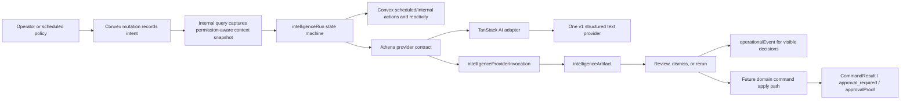
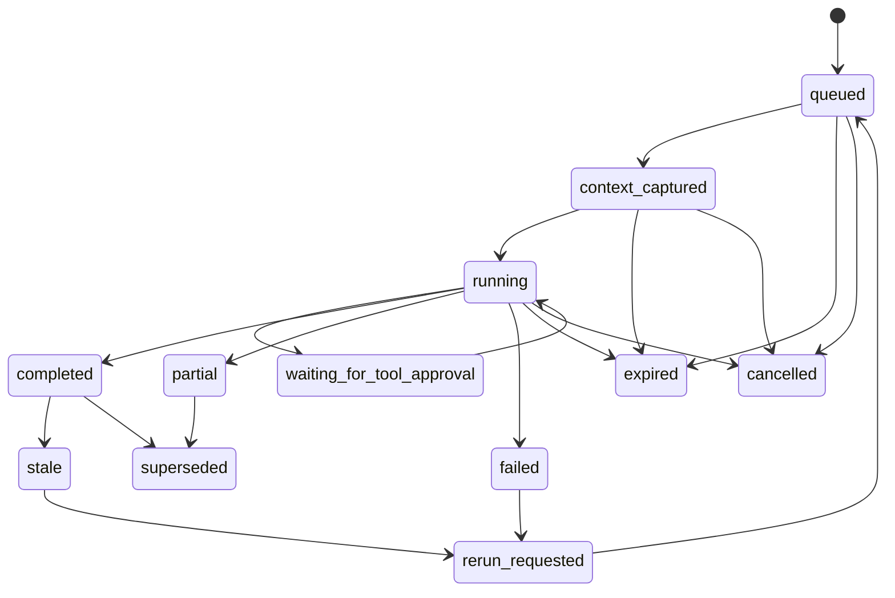

# feat: Build Athena intelligence layer

## Summary

Build Athena's intelligence layer as a Convex-owned, capability-gated platform that uses Convex's AI strengths for durable state, reactivity, scheduling, retrieval, and workflow orchestration, with one TanStack-backed text adapter as the first model SDK path below Athena's own contracts. The first delivery creates durable run/artifact state, a typed provider adapter, permission-aware context snapshots, and a narrow migration of existing store/user insights into evidence-backed artifacts; image generation remains deferred as a later media adapter.

---

## Problem Frame

Athena already has the business workflows, approvals, operational events, workflow traces, analytics, and a thin LLM seam, but the current LLM usage is ephemeral and brittle. The product gap named in `README.md` is that Athena does not yet consistently turn operational data into proactive recommendations, next actions, or owner-facing decision support.

---

## Requirements

- R1. Model intelligence as durable Athena-owned state in Convex, not as provider-owned chat history, raw SDK responses, or UI component state.
- R2. Use capability-gated provider selection: v1 ships one TanStack-backed structured text adapter; OpenAI, Anthropic, Gemini, OpenRouter, Ollama, and later media providers are documented extension points behind the Athena provider contract.
- R3. Use permission-aware context snapshots: the model only receives the same class of store data the initiating actor or scheduled policy is allowed to read.
- R4. Persist structured outputs, source references, normalized errors, provider metadata, and cost/usage evidence for audit and retry.
- R5. Reuse existing Athena rails for command results, approval policy, operational events, operational work items, automation policy, automation runs, and workflow traces instead of creating parallel workflow systems.
- R6. First release is read/propose only. Model output may create persisted artifacts and human-reviewable recommendation fields, but domain mutations and work-item promotion are deferred follow-up work through existing command boundaries.
- R7. Migrate existing store/user insights away from ad hoc prompt JSON parsing into structured, persisted intelligence artifacts.
- R8. Defer image generation as a later adapter while reserving enough artifact shape for future media provenance and review-first publishing.
- R9. Normalize operator-facing copy and failure states; raw provider errors, raw backend exceptions, and unverified model claims must not reach the UI.
- R10. Evaluate and intentionally use Convex AI-native strengths where they fit: reactive subscriptions, scheduled/internal actions, Workpool/Workflow scale-up paths, Agent component threads, RAG/vector search, and file support.
- R11. Enforce read-time authorization for every run/artifact query using store/org role, recorded `visibilityMode`, and source refs, so lower-privilege viewers cannot read artifacts generated from higher-privilege snapshots.
- R12. Treat all retrieved, customer-authored, store-authored, and operational text as untrusted model context; model output cannot override capability policy, tool allowlists, approval rules, or server-side validation.
- R13. Every operator-visible recommendation must show generated time, data window or source context, stale state, and evidence refs or a clearly marked limited-evidence state.

---

## Scope Boundaries

- This plan does not implement the full Ask Athena chat UI as the first delivery.
- This plan does not allow autonomous mutations to catalog, stock, POS, cash controls, orders, messaging, or service records.
- This plan does not make TanStack AI the source of truth for approvals, persistence, run state, or audit history.
- This plan does not make Convex Agent component message threads the source of truth for Athena business artifacts, proposals, approvals, or domain state.
- This plan does not replace existing domain command authorization, manager proof, approval request, or operational event behavior.
- This plan does not add image generation, video generation, or media storage workflows in the first implementation.
- This plan does not install Convex Agent, RAG, or Durable Agents components in v1.

### Deferred to Follow-Up Work

- Product image generation adapter: add media candidate artifacts, R2 persistence, consent/provenance, and review-before-publish behavior after the core text/proposal layer is stable.
- Conversational Ask Athena shell: add streaming chat, thread UX, and richer client transports after the provider adapter and durable run records are proven.
- Apply domain tools: add narrow action tools only after read/propose artifacts, context staleness, approvals, and precondition refresh are stable.
- Proposal-to-work-item promotion: add human-explicit promotion through existing operational work-item rails after the initial insight artifact review flow is proven.
- Cross-domain command center surface: consolidate recommendations across operations, POS, catalog, stock, services, and orders after the artifact lifecycle exists.

---

## Context & Research

### Relevant Code and Patterns

- `packages/athena-webapp/convex/llm/callLlmProvider.ts` is the existing provider seam, but it only switches an untyped provider string and returns provider text.
- `packages/athena-webapp/convex/llm/storeInsights.ts` and `packages/athena-webapp/convex/llm/userInsights.ts` currently prompt for JSON and regex-clean provider output before parsing.
- `packages/athena-webapp/shared/commandResult.ts` and `packages/athena-webapp/shared/approvalPolicy.ts` define the browser/server command and approval contract to reuse for future apply paths.
- `packages/athena-webapp/convex/schemas/automation.ts` separates `automationPolicy`, `automationRun`, and `scheduledRunLedger`; intelligence should mirror the separation between configuration, run evidence, and scheduled policy.
- `packages/athena-webapp/convex/automation/automationFoundation.ts` separates action registry, adapter decision, policy mode, idempotency, run ledger, optional apply step, and event ids.
- `packages/athena-webapp/convex/schemas/operations/operationalEvent.ts` and `packages/athena-webapp/convex/operations/operationalEvents.ts` are the right audit rail for discrete user-visible intelligence decisions and promotions.
- `packages/athena-webapp/convex/workflowTraces/core.ts` is the right pattern for best-effort lifecycle investigation evidence, not a source-of-truth ledger.
- `packages/athena-webapp/convex/cloudflare/r2.ts` has the config-validation pattern future media adapters should mirror.
- `packages/athena-webapp/docs/agent/architecture.md` names the Convex public/internal boundary, command result contract, approval proof boundary, and browser-safe shared-module rules.
- Convex is already Athena's durable data and reactivity layer. Its AI-specific strengths should be considered as infrastructure options: Agent component for persistent threads and agent workflows, RAG component for Convex-native semantic retrieval, Workpool/Workflow for long-running or retryable execution, scheduled/internal actions for intent capture and provider side effects, and file storage for future media inputs.
- Current v1 should use scheduled/internal Convex actions and reactive queries only. Convex Agent/RAG/Durable Agents are future components requiring package install, `convex/convex.config.ts` registration, codegen, component-owned table isolation, and tests proving Athena intelligence tables remain the business source of truth.

### Institutional Learnings

- `docs/solutions/architecture/athena-automation-foundation-2026-06-08.md`: policy-driven automation must record action and inaction with idempotency, normalized outcomes, actor metadata, and operator-safe copy.
- `docs/solutions/architecture/athena-workflow-investigation-evidence-2026-06-21.md`: workflow traces are investigation evidence; source ledgers and business records remain authoritative.
- `docs/solutions/logic-errors/athena-command-approval-policy-boundary-2026-05-01.md`: approval policy must be owned and enforced by the server command boundary.
- `docs/solutions/logic-errors/athena-command-approval-manager-fast-path-2026-05-02.md`: inline manager approval must mint and consume one-use, role-bound, subject-bound proof.
- `docs/solutions/architecture/athena-app-wide-message-action-foundation-2026-06-20.md`: shared foundations own generic mechanics; domain adapters own domain truth, execution, telemetry, and copy.
- `docs/solutions/logic-errors/athena-r2-env-validation-2026-04-29.md`: provider and storage clients should validate configuration before side effects and report missing config safely.

### External References

- TanStack AI overview: `https://tanstack.com/ai/latest/docs/getting-started/overview`
- TanStack AI structured outputs with tools: `https://tanstack.com/ai/latest/docs/structured-outputs/with-tools`
- TanStack AI `toolDefinition`: `https://tanstack.com/ai/latest/docs/reference/functions/toolDefinition`
- TanStack AI tool approval flow: `https://tanstack.com/ai/latest/docs/tools/tool-approval`
- TanStack AI connection adapters: `https://tanstack.com/ai/latest/docs/chat/connection-adapters`
- TanStack AI media generations: `https://tanstack.com/ai/latest/docs/media/generations`
- TanStack AI beta announcement: `https://tanstack.com/blog/tanstack-ai-beta`
- Convex actions: `https://docs.convex.dev/functions/actions`
- Convex scheduled functions: `https://docs.convex.dev/scheduling/scheduled-functions`
- Convex internal functions: `https://docs.convex.dev/functions/internal-functions`
- Convex AI Agents overview: `https://docs.convex.dev/agents/overview`
- Convex Agent component: `https://www.convex.dev/components/agent`
- Convex RAG component: `https://www.convex.dev/components/rag`
- Convex Durable Agents component: `https://www.convex.dev/components/durable-agents`

---

## Key Technical Decisions

- Athena owns the intelligence state machine; TanStack AI is an adapter/orchestration dependency. This keeps provider APIs, beta churn, and SDK-specific payloads below a stable business contract.
- Convex is the primary intelligence runtime substrate. Use Convex mutations, internal actions, scheduled functions, reactive subscriptions, and durable tables first; graduate to Convex Workpool/Workflow or Agent/RAG components when a capability needs persistent threads, semantic retrieval, controlled parallelism, or long-running orchestration.
- Convex Agent component is a future optional conversation/workflow helper, not the business ledger. Its persistent threads and vector search are useful for Ask Athena-style chat or memory, but Athena still owns artifacts, approval state, operational events, and domain records.
- Convex RAG is the preferred future retrieval path for document-like knowledge. Operational snapshots remain deterministic internal queries; semantic retrieval should augment prompts only when source refs, namespace scoping, and permission filters are explicit.
- Omit raw provider payloads by default. If an implementation must retain native provider evidence, it must be redacted, server-internal, TTL-bound, excluded from logs/UI/errors, and documented with provider retention/data-use settings.
- First delivery is text/JSON artifacts and recommendation fields only. This avoids letting media consent, storage, publishing, and apply-tool concerns shape the core platform before the run and provider boundaries are proven.
- Use `artifact.kind` as `text`/`json` in v1 with a reserved future-media note, but do not implement media capability detection, image-generation persistence, or R2 draft candidate flows yet.
- Client-facing generation starts through a Convex mutation that records intent and schedules/internalizes work. This follows Convex guidance that direct client actions are usually an anti-pattern when intent, idempotency, and invariants matter.
- Use internal queries to capture context snapshots in one consistent read bundle per capability. Avoid many unrelated `ctx.runQuery` calls from model actions when one internal query can create a coherent snapshot.
- Treat TanStack AI tool approval as a runtime pause signal only. Athena approvals remain `approval_required`, `approvalRequest`, `approvalProof`, and domain-command precondition checks.
- Use `operationalEvent` only for user-visible intelligence lifecycle decisions such as artifact generated, artifact dismissed, rerun requested, stale state marked, or future follow-up promotion. Use intelligence run/step tables for low-level model/tool events.
- Use workflow traces selectively for multi-step investigation, support, or operational replay; do not trace every model call by default.
- Separate prompt instructions from untrusted snapshot/RAG/customer/store text. Tool calls and recommendation fields must be capability-allowlisted, schema-validated, and policy-checked server-side before they are stored or shown.

---

## V1 Operator Outcome

The first operator-visible outcome is not "AI platform exists." It is: an owner can open existing store/user insight panels and review one evidence-backed storefront/customer recommendation, understand why Athena thinks it matters, dismiss it, or rerun it against fresh context. If the recommendation lacks evidence, has stale context, or was generated from data the current viewer cannot read, the UI must suppress it or mark it as limited/stale instead of presenting it as trusted guidance.

---

## Data Classification, Retention, and Provider Payloads

- Context snapshots and artifacts must record `principalKind`, `actorRef`, optional `policyRef`, `visibilityMode`, source subject refs, data window, and snapshot hash.
- Run/artifact list and read queries must enforce the current viewer's store/org role and the artifact's recorded visibility/source refs; an artifact generated from admin-only context must not be readable by POS-only staff.
- Raw provider request/response payloads are omitted by default. Normalized invocation records keep provider id, model id, status, usage/cost metadata, safe error codes, and hashes/source refs.
- If raw provider evidence is retained for debugging, it must be redacted for PII/secrets, server-internal, TTL-bound, excluded from logs and UI, and protected by explicit admin/support authorization.
- Provider adapters must document provider retention and data-use settings before production use.
- Customer-authored, store-authored, imported, and retrieved text is untrusted prompt data. It may inform recommendations but cannot supply instructions, policy, approval, or tool authority.

---

## Open Questions

### Resolved During Planning

- Should TanStack AI be allowed despite beta maturity? Yes, because this is treated as greenfield and it remains below Athena-owned contracts; adapter tests and a narrow first capability absorb churn risk.
- Can a model create work items in v1? No. The first release is read/propose only; promoting a proposal to an operational work item is an explicit human action.
- Should snapshots use privileged backend reads or actor-visible reads? Use the actor or policy visibility boundary. A POS-only operator's intelligence context must not include hidden full-admin financial details.
- Should image/media artifacts be modeled now? Reserve `artifact.kind`, provider capability metadata, and provenance fields, but defer media-specific storage and UX.

### Deferred to Implementation

- Exact patch versions after the spike: implementation should pin the v1 package set after checking current TanStack package compatibility with Convex and Bun.
- Exact model defaults per provider: implementation should start with configured defaults and expose capability metadata without making model ids part of schema semantics.
- Whether streaming should be included in v1: implementation should prove non-streaming structured output first; streaming can follow if the Convex HTTP action spike is stable.
- Exact index set for intelligence tables: implementation should tune indexes while writing queries, preserving the access patterns named in this plan.

---

## Output Structure

    packages/athena-webapp/
      convex/
        intelligence/
          capabilityRegistry.ts
          contextSnapshots.ts
          runLifecycle.ts
          artifacts.ts
          providerInvocations.ts
          providers/
            index.ts
            tanstack.ts
          capabilities/
            storeInsights.ts
            userInsights.ts
        schemas/
          intelligence.ts
      shared/
        intelligence/
          capabilityTypes.ts
          artifactTypes.ts
          providerTypes.ts
      src/
        components/
          intelligence/
            IntelligenceArtifactCard.tsx
            IntelligenceRunStatus.tsx
        hooks/
          useIntelligenceArtifact.ts

The structure is a scope declaration, not a constraint. Implementation may adjust file grouping if it keeps the same ownership boundaries.

---

## High-Level Technical Design

> *This illustrates the intended approach and is directional guidance for review, not implementation specification. The implementing agent should treat it as context, not code to reproduce.*

---

## Implementation Units

### Prerequisite Gate: TanStack Runtime Spike

Before U2 begins, implementation must pin the v1 package set and prove the adapter is viable inside Athena's Convex runtime. The expected v1 package set is `@tanstack/ai` plus one text provider adapter, likely `@tanstack/ai-openai`, unless current docs/runtime checks show a better first provider. This gate must prove non-streaming structured output from a server-only Convex action behind Athena's provider interface, with no browser-only imports, and prove the adapter can be fake-tested without real provider calls. Anthropic, Gemini, OpenRouter, Ollama, streaming, and media adapters are extension points, not v1 dependencies.

- U1. **Add intelligence domain schemas and shared types**

**Goal:** Create the durable data model and shared browser/server type vocabulary for intelligence runs, snapshots, artifacts, provider invocations, and capability definitions.

**Requirements:** R1, R2, R4, R5, R8, R11

**Dependencies:** None

**Files:**
- Create: `packages/athena-webapp/convex/schemas/intelligence.ts`
- Modify: `packages/athena-webapp/convex/schema.ts`
- Create: `packages/athena-webapp/shared/intelligence/capabilityTypes.ts`
- Create: `packages/athena-webapp/shared/intelligence/artifactTypes.ts`
- Create: `packages/athena-webapp/shared/intelligence/providerTypes.ts`
- Test: `packages/athena-webapp/shared/intelligence/intelligenceTypes.test.ts`
- Test: `packages/athena-webapp/convex/schemas/intelligence.test.ts`

**Approach:**
- Define explicit run states: `queued`, `context_captured`, `running`, `waiting_for_tool_approval`, `partial`, `completed`, `failed`, `cancelled`, `expired`, `stale`, `superseded`, and `rerun_requested`.
- Define artifact states: `draft`, `ready`, `dismissed`, `invalid`, `stale`, `superseded`, and `failed`.
- Separate run evidence from artifacts so model calls, outputs, and human review can evolve independently.
- Include `principalKind`, `actorRef`, optional `policyRef`, `visibilityMode`, source subject refs, snapshot hashes, normalized provider metadata, usage/cost fields, safe error codes, and v1 `artifact.kind` values of `text`/`json`.
- U1 validates field shape and indexes only. Legal lifecycle transitions are enforced by U3's transition helper.

**Patterns to follow:**
- `packages/athena-webapp/convex/schemas/automation.ts`
- `packages/athena-webapp/shared/commandResult.ts`
- `packages/athena-webapp/shared/approvalPolicy.ts`

**Test scenarios:**
- Happy path: constructing a text/JSON artifact with provider metadata and source refs validates against shared types and Convex validators.
- Happy path: a provider invocation can store normalized provider/model/status/usage without requiring raw provider payloads in the artifact.
- Edge case: future media artifact kinds are reserved in docs without adding media URL/provider runtime fields in v1.
- Error path: unsupported artifact states are rejected by type/validator coverage.
- Integration: `schema.ts` exposes table indexes for store, capability, status, source subject, and snapshot hash access patterns.
- Integration: schema supports read-time authorization checks by storing principal, actor/policy, visibility, and source refs.

**Verification:**
- Intelligence schema and shared types are importable from Convex and browser-safe shared modules without crossing server-only boundaries.

---

- U2. **Create capability registry and provider contract**

**Goal:** Replace ad hoc provider string branching with an Athena-owned capability/provider registry that uses one TanStack-backed v1 text adapter without leaking SDK shapes into domain code.

**Requirements:** R2, R4, R8, R9, R10

**Dependencies:** U1

**Files:**
- Create: `packages/athena-webapp/convex/intelligence/capabilityRegistry.ts`
- Create: `packages/athena-webapp/convex/intelligence/providers/index.ts`
- Create: `packages/athena-webapp/convex/intelligence/providers/tanstack.ts`
- Modify: `packages/athena-webapp/package.json`
- Test: `packages/athena-webapp/convex/intelligence/capabilityRegistry.test.ts`
- Test: `packages/athena-webapp/convex/intelligence/providers/tanstack.test.ts`

**Approach:**
- Define capability metadata separately from provider metadata: capability id, domain, input snapshot type, output artifact schema, supported artifact kinds, risk level, allowed read tools, and whether it can generate recommendation fields.
- Define v1 provider metadata only for structured text output: provider id, adapter family, model id, structured output support, normalized errors, usage/cost metadata, and config status.
- Implement TanStack AI as the first provider adapter behind the contract using one pinned text provider from the prerequisite spike. OpenAI, Anthropic, Gemini, OpenRouter, Ollama, streaming, and media adapters remain documented extension points unless the spike selects one as the v1 text provider.
- Keep Convex Agent/RAG/Workflow components uninstalled in v1. Selection criteria and component install requirements belong in U7 documentation, not executable v1 runtime metadata.
- Validate provider configuration using an R2-style resolver pattern before side effects.
- Label snapshot data passed to prompts as untrusted data and keep prompts/tool schemas separated from data content.

**Provider capability/degradation matrix:**

| Capability | V1 requirement | Missing/degraded behavior |
|------------|----------------|---------------------------|
| Structured text output | Required for the single v1 adapter | Capability unavailable; do not fall back to unstructured text parsing |
| Tool calls | Not required in v1 | Capability runs without model tools; deterministic context comes from Convex snapshots |
| Streaming | Not required in v1 | UI observes run state through Convex queries/subscriptions |
| Usage/cost metadata | Best effort normalized fields | Store `unknown`/omitted normalized fields without blocking artifact creation |
| Error normalization | Required | Raw provider errors stay internal; artifact/run receives safe error code |
| Media generation | Explicitly unsupported in v1 | Capability unavailable until future media adapter plan |
| Provider-native approval pause | Not authoritative in v1 | Future runtime pause must map to Athena approvals before any side effect |

**Patterns to follow:**
- `packages/athena-webapp/convex/cloudflare/r2.ts`
- `packages/athena-webapp/convex/automation/actionRegistry.ts`
- `packages/athena-webapp/convex/llm/callLlmProvider.ts`

**Test scenarios:**
- Happy path: a capability resolves to a provider/model with structured output support.
- Happy path: the registry reports image/media support as unavailable in v1.
- Happy path: a capability can declare it uses deterministic Convex snapshots only, without Agent/RAG thread state.
- Edge case: missing provider environment config returns a safe config status without throwing raw secret-related errors to callers.
- Error path: requesting unsupported capability/provider combinations returns a normalized unavailable result.
- Error path: malicious snapshot text that asks for hidden data or approval bypass is treated as untrusted data and does not alter tool/capability policy.
- Integration: provider adapter output is normalized into provider invocation data without SDK-specific objects in domain artifacts.
- Integration: the v1 provider can be fake-tested without real provider calls.

**Verification:**
- Existing OpenAI/Anthropic direct wrappers can be kept temporarily, but new intelligence capabilities go through the registry.

---

- U3. **Implement run lifecycle, idempotency, and snapshot capture**

**Goal:** Create the Convex-owned execution lifecycle that records intent, captures actor-visible context, schedules provider work, and stores normalized completion or failure.

**Requirements:** R1, R3, R4, R5, R9, R10

**Dependencies:** U1, U2

**Files:**
- Create: `packages/athena-webapp/convex/intelligence/runLifecycle.ts`
- Create: `packages/athena-webapp/convex/intelligence/contextSnapshots.ts`
- Create: `packages/athena-webapp/convex/intelligence/providerInvocations.ts`
- Test: `packages/athena-webapp/convex/intelligence/runLifecycle.test.ts`
- Test: `packages/athena-webapp/convex/intelligence/contextSnapshots.test.ts`
- Test: `packages/athena-webapp/convex/intelligence/providerInvocations.test.ts`

**Approach:**
- Client-visible mutations record intent and schedule internal work; internal actions call providers; internal mutations persist state transitions and artifacts. Use Convex's reactive subscriptions to let UI observe run progress instead of storing local polling state.
- Start with scheduled/internal actions for v1. Escalate to Workpool/Workflow only when the capability needs controlled parallelism, retries, or long-running multi-step work beyond normal action limits.
- Define a legal transition helper/matrix in `runLifecycle.ts` and require all run writes to move through that helper. Convex validators define shape; the lifecycle helper enforces transition legality.
- Snapshot capture is capability-owned and permission-aware. It records `principalKind`, `actorRef`, optional `policyRef`, source subject refs, `visibilityMode`, hash, created time, data window, and compact evidence rather than raw broad database dumps.
- Each capability owns an authorizer for source domains and source records. Store/user insight snapshots must explicitly reject admin-only financial/procurement/customer details when the principal is POS-only or otherwise lower privilege.
- Deterministic business snapshots should come from internal queries. Convex RAG should be used later for document-like retrieval or historical conversation memory when namespace filters and source refs are explicit.
- Retry behavior appends attempts to the same run when the idempotency key and snapshot hash match; explicit rerun creates a new run against fresh context.
- Context drift marks artifacts stale or superseded instead of silently leaving stale recommendations actionable.

**Patterns to follow:**
- `packages/athena-webapp/convex/automation/runLedger.ts`
- `packages/athena-webapp/convex/automation/automationFoundation.ts`
- `packages/athena-webapp/convex/workflowTraces/core.ts`
- Convex action guidance in `https://docs.convex.dev/functions/actions`
- Convex Agent/RAG guidance in `https://docs.convex.dev/agents/overview`

**Test scenarios:**
- Happy path: recording intent creates a queued run with idempotency key, actor refs, capability id, and store/org scope.
- Happy path: provider completion moves a run through context capture and running into completed with one ready artifact.
- Happy path: legal transition helper allows expected queued-to-context-to-running-to-completed path.
- Edge case: duplicate request with same idempotency key and same snapshot hash reuses or appends to the same run instead of creating duplicate artifacts.
- Edge case: rerun after source context changes creates a new run and marks the older artifact stale or superseded.
- Error path: illegal transition from completed back to running is rejected by `runLifecycle.ts`.
- Error path: missing run, duplicate idempotency conflict, provider failure, and snapshot failure all store safe run states without partial artifacts.
- Error path: provider timeout/rate-limit/invalid-output stores normalized failure and safe operator copy.
- Error path: actor without required visibility cannot capture a privileged snapshot.
- Error path: POS-only/staff-scoped principal cannot capture admin financial, procurement, or privileged customer details.
- Integration: scheduled/internal work can persist run state without direct client action calls.
- Integration: run status updates are observable through normal Convex queries/subscriptions without adopting client-owned chat persistence.

**Verification:**
- Run lifecycle behavior is testable without real provider calls by using a fake provider adapter.

---

- U4. **Add read-only capability tools and structured artifact generation**

**Goal:** Prove TanStack AI structured outputs and read tools through two initial capabilities: store insights and user/customer insights.

**Requirements:** R2, R3, R4, R7, R9

**Dependencies:** U1, U2, U3

**Files:**
- Create: `packages/athena-webapp/convex/intelligence/capabilities/storeInsights.ts`
- Create: `packages/athena-webapp/convex/intelligence/capabilities/userInsights.ts`
- Modify: `packages/athena-webapp/convex/llm/storeInsights.ts`
- Modify: `packages/athena-webapp/convex/llm/userInsights.ts`
- Test: `packages/athena-webapp/convex/intelligence/capabilities/storeInsights.test.ts`
- Test: `packages/athena-webapp/convex/intelligence/capabilities/userInsights.test.ts`

**Approach:**
- Move the existing insight output shapes into explicit schemas used by the provider adapter.
- Build capability-owned snapshot readers around existing analytics queries instead of sending raw broad analytics arrays directly.
- Treat recommendation evidence as structured fields with source refs, confidence/rationale, generated time, data window, and snapshot hash. Recommendation fields must be actionable enough for an owner to understand a storefront/customer next step, not just a summary.
- Keep prompt instructions separate from analytics/customer text and label snapshot content as untrusted. Model output must pass schema validation before artifact persistence.
- Keep existing `convex/llm/*` exports as compatibility shims or deprecation wrappers while the UI migrates.

**Patterns to follow:**
- `packages/athena-webapp/convex/storeFront/analytics.ts`
- `packages/athena-webapp/convex/llm/storeInsights.ts`
- `packages/athena-webapp/convex/llm/userInsights.ts`

**Test scenarios:**
- Happy path: store analytics snapshot produces a persisted artifact with summary, trend, recommendations, and evidence refs.
- Happy path: user activity snapshot produces a persisted artifact with engagement, likely intent, recommendations, and evidence refs.
- Edge case: empty analytics data produces a valid low-confidence artifact rather than a parse failure.
- Edge case: recommendation without evidence refs is marked limited-evidence and cannot render as normal trusted guidance.
- Error path: malformed provider output is rejected and stored as normalized invalid-output failure.
- Error path: malicious customer/store text asking to reveal hidden data or bypass approvals does not affect capability policy or output validation.
- Error path: unsupported provider capability returns unavailable state without attempting provider execution.
- Integration: existing insight callers can read the latest artifact during migration without receiving raw provider JSON.

**Verification:**
- Existing brittle JSON cleanup is no longer on the primary intelligence path.

---

- U5. **Build artifact review operations and audit events**

**Goal:** Let operators review, dismiss, rerun, and stale/supersede intelligence artifacts without allowing model-autonomous domain mutations or ambiguous review queues.

**Requirements:** R5, R6, R9

**Dependencies:** U1, U3, U4

**Files:**
- Create: `packages/athena-webapp/convex/intelligence/artifacts.ts`
- Modify: `packages/athena-webapp/convex/operations/operationalEvents.ts`
- Test: `packages/athena-webapp/convex/intelligence/artifacts.test.ts`

**Approach:**
- Add operations for listing current artifacts, reading artifacts with viewer authorization, marking artifacts dismissed/stale/superseded, and requesting reruns.
- Define review semantics narrowly: `dismissed` means hide/no action, `rerun` means refresh against fresh context, `stale`/`superseded` means context is no longer current. There is no v1 `accept` state unless a later workflow gives it a concrete operator consequence.
- Write `operationalEvent` rows for visible review decisions, not every provider step.
- Use `CommandResult` style outcomes for review actions so UI failures remain browser-safe.
- Preserve future apply/promotion ideas as non-executable recommendation fields, not proposal tables or domain mutations in v1.

**Patterns to follow:**
- `packages/athena-webapp/shared/commandResult.ts`
- `packages/athena-webapp/convex/operations/operationalEvents.ts`

**Test scenarios:**
- Happy path: operator dismisses a ready artifact and an operational event records the decision.
- Happy path: operator requests rerun and a new run is created against fresh context.
- Happy path: latest artifact list excludes dismissed artifacts by default but can include them for audit/support.
- Edge case: stale artifact renders as stale and cannot be presented as current guidance.
- Error path: actor without store access receives a user error and no audit row is written.
- Error path: POS-only viewer cannot read an admin-visibility artifact even if it is the latest artifact for the store.
- Integration: review operations return command-result compatible payloads and link visible decisions to operational events.

**Verification:**
- No model output can mutate a domain record, create an operational work item, or promote a follow-up record in v1.

---

- U6. **Add operator-facing artifact UI and migrate existing insight panels**

**Goal:** Render persisted intelligence artifacts in existing store/user insight surfaces while preserving current operator workflows and safe copy.

**Requirements:** R7, R9, R11, R13

**Dependencies:** U3, U4, U5

**Files:**
- Create: `packages/athena-webapp/src/components/intelligence/IntelligenceArtifactCard.tsx`
- Create: `packages/athena-webapp/src/components/intelligence/IntelligenceRunStatus.tsx`
- Create: `packages/athena-webapp/src/hooks/useIntelligenceArtifact.ts`
- Modify: `packages/athena-webapp/src/components/analytics/StoreInsights.tsx`
- Modify: `packages/athena-webapp/src/components/users/UserInsightsSection.tsx`
- Test: `packages/athena-webapp/src/components/intelligence/IntelligenceArtifactCard.test.tsx`
- Test: `packages/athena-webapp/src/components/analytics/StoreInsights.test.tsx`
- Test: `packages/athena-webapp/src/components/users/UserInsightsSection.test.tsx`

**Approach:**
- Replace component-local LLM action state with persisted artifact queries and explicit generate/rerun mutations.
- Show generated time, data window/source context, stale/failed/running state, and evidence links in restrained operational copy. If evidence is limited or missing, render that state clearly and do not present the recommendation as fully trusted guidance.
- Keep UI compact and task-focused; do not build a generic AI landing page or oversized assistant shell.
- Normalize unavailable, rate-limited, timeout, invalid-output, and stale-context states through shared copy.

**Patterns to follow:**
- `docs/product-copy-tone.md`
- `packages/athena-webapp/src/lib/errors/runCommand.ts`
- `packages/athena-webapp/src/lib/errors/presentCommandToast.ts`
- `packages/athena-webapp/src/components/operations/OperationsQueueView.tsx`

**Test scenarios:**
- Happy path: existing Store Insights renders the latest ready persisted artifact without calling the old direct LLM action on mount.
- Happy path: existing User Insights renders a run status while generation is queued/running, then shows the ready artifact.
- Edge case: no artifact exists and the panel shows an action to generate rather than an empty failure.
- Edge case: stale artifact shows refresh affordance and clear generated-at/source context.
- Edge case: low-evidence recommendation is suppressed or visibly marked as limited-evidence.
- Error path: current viewer cannot see an artifact generated from a higher-visibility snapshot.
- Error path: provider unavailable or invalid output shows normalized operator copy.
- Integration: dismiss/rerun interactions call command-result aware helpers and update the displayed artifact state.

**Verification:**
- Existing analytics and user insight panels remain usable while using persisted intelligence artifacts.

---

- U7. **Document platform contract, validation ladder, and deferred adapters**

**Goal:** Make the intelligence layer understandable for future capabilities, especially Convex Agent/RAG use, apply tools, work-item promotion, and image generation, without relying on oral context.

**Requirements:** R2, R5, R6, R8, R9, R10

**Dependencies:** U1, U2, U3, U4, U5, U6

**Files:**
- Create: `packages/athena-webapp/docs/agent/intelligence.md`
- Modify: `packages/athena-webapp/docs/agent/architecture.md`
- Create: `docs/solutions/architecture/athena-intelligence-layer-foundation-2026-06-21.md`
- Test: `packages/athena-webapp/docs/agent/intelligence.md`

**Approach:**
- Document what Athena owns versus what TanStack AI/providers own.
- Document what Athena owns versus Convex AI components: business artifacts, proposals, approvals, and operational events remain Athena domain state; Agent/RAG/Workflow components are runtime/retrieval helpers selected by capability.
- Document v1 installs no Convex Agent/RAG/Durable Agents components. Future adoption must include package install, `convex/convex.config.ts` `app.use(...)`, generated API/codegen, component-owned table isolation, and tests proving Athena artifacts remain source of truth. Durable Agents are experimental/non-v1.
- Include this documentation-only Convex AI component fit matrix:

| Runtime/retrieval option | Use in v1? | Use when |
|--------------------------|------------|----------|
| Scheduled/internal Convex actions | Yes | Recording intent, running one provider call, persisting artifacts |
| Reactive Convex queries | Yes | Showing run/artifact progress without client-owned chat persistence |
| Workpool/Workflow | No | Controlled parallelism, retries, or long-running multi-step workflows exceed simple scheduled actions |
| Convex Agent component | No | Ask Athena needs persistent threads, live-updating messages, usage/rate helpers, or agent workflow memory |
| Convex RAG component | No | Document-like semantic retrieval needs namespaces, filters, source refs, and migration controls |
| Durable Agents component | No | Explicitly non-v1; treat as experimental until production maturity is proven |

- Document run and artifact states, provider adapter expectations, context snapshot visibility, and approval/apply boundaries.
- Document that image generation is a later media adapter with review-first storage and provenance requirements.
- Update agent architecture docs so future work starts from the intelligence layer instead of reusing the old `convex/llm` seam.

**Patterns to follow:**
- `packages/athena-webapp/docs/agent/architecture.md`
- `docs/solutions/architecture/athena-automation-foundation-2026-06-08.md`
- `docs/solutions/architecture/athena-workflow-investigation-evidence-2026-06-21.md`

**Test scenarios:**
- Test expectation: none for docs-only behavior, but doc references should be checked by the repo's normal markdown/link and generated-doc validation where applicable.

**Verification:**
- Future implementers can identify the correct extension point for a new capability, provider, apply tool, or media adapter.

---

## System-Wide Impact

- **Interaction graph:** New intelligence Convex modules will read analytics/user activity and write intelligence tables, with visible review decisions flowing to `operationalEvent`. Existing insight components will shift from direct provider actions to persisted artifact queries. Convex Agent/RAG/Workflow components may be added later as selected runtime helpers, but they do not replace domain tables.
- **Error propagation:** Provider, schema, config, timeout, rate-limit, and visibility failures must normalize into run/artifact status and command-result UI copy. Raw provider messages are omitted by default and never reach UI/logs.
- **State lifecycle risks:** Duplicate generation, stale recommendations, partial provider output, and context drift are handled by idempotency keys, snapshot hashes, artifact state, and explicit rerun behavior.
- **API surface parity:** Any future UI action exposed from an intelligence proposal must have an equivalent command/apply boundary and approval behavior. The first release intentionally avoids apply tools.
- **Integration coverage:** Unit tests should cover fake-provider run lifecycle and component rendering; integration tests should prove existing insights now use persisted artifacts and do not trigger direct provider parsing on mount.
- **Unchanged invariants:** Domain records remain owned by their existing modules. `automationRun` remains policy-backed automation evidence, not a generic LLM run table. Workflow traces remain investigation evidence, not source-of-truth state.

---

## Risks & Dependencies

| Risk | Mitigation |
|------|------------|
| TanStack AI beta API churn | Keep TanStack behind `convex/intelligence/providers/tanstack.ts`; pin package versions and test the Athena adapter contract. |
| Provider-specific shapes leak into domain tables | Store normalized invocation fields and isolate raw/sensitive provider payloads behind bounded evidence or omit them. |
| Convex AI components become a second source of truth | Treat Agent/RAG/Workflow as runtime/retrieval helpers; persist Athena business state in intelligence tables and existing operational rails. |
| Model sees data the actor cannot see | Capability snapshot readers must enforce the initiating actor or policy visibility boundary before provider calls. |
| Persisted artifacts leak higher-privilege data | Read/list queries enforce viewer role, recorded visibility mode, and source refs before returning artifacts. |
| Provider evidence retains PII indefinitely | Omit raw provider payloads by default; any retained evidence is redacted, TTL-bound, server-internal, and provider-retention documented. |
| Prompt injection shapes recommendations or tools | Treat all snapshot/RAG/customer/store text as untrusted data; server-side schemas, allowlists, and policy checks own authority. |
| Stale advice appears current | Use snapshot hashes, generated-at timestamps, stale/superseded states, and refresh-before-apply rules. |
| Future apply tools bypass approvals | Keep v1 read/propose only; require domain command, precondition refresh, `CommandResult`, and approval proof for later apply paths. |
| Provider failures produce confusing UI | Normalize errors through run/artifact status and product-copy rules. |
| Media scope creeps into foundation | Reserve artifact kind but defer R2 media candidates, consent, image provenance, and publish UX to a follow-up plan. |

---

## Alternative Approaches Considered

- Use Vercel AI SDK as the core abstraction: rejected for now because the user selected TanStack AI for greenfield work and TanStack's composable/provider-agnostic shape fits Athena's existing TanStack-heavy stack.
- Use provider-native OpenAI/Anthropic SDKs directly: rejected because it would repeat the current thin seam and make provider portability, typed tools, and structured outputs harder to keep consistent.
- Use TanStack AI as the durable runtime: rejected because Athena needs Convex-owned audit, retries, approvals, idempotency, and business lifecycle state.
- Use Convex Agent component as the whole intelligence layer: rejected because it is useful for persistent threads and agent workflows, but Athena needs first-class business artifacts, proposals, approvals, operational events, and domain-specific lifecycle state.
- Start with image generation: rejected because media storage, consent, provenance, and product publish boundaries would distort the foundational intelligence contract.

---

## Phased Delivery

### Phase 1: Platform Foundation

- Prerequisite gate plus U1, U2, U3 establish schema, shared types, capability/provider registry, scheduled/internal Convex actions, reactive queries, run lifecycle, idempotency, and context snapshots.

### Phase 2: First Capabilities

- U4 migrates store/user insights into structured persisted artifacts through the new provider boundary.

### Phase 3: Review UX and Audit

- U5 and U6 add artifact review operations, operational events, and existing panel migration.

### Phase 4: Institutionalize

- U7 documents the platform contract and deferred adapter path so future image generation and apply tools extend the layer instead of bypassing it.

---

## Documentation / Operational Notes

- Add TanStack AI package versions intentionally and verify Convex runtime compatibility during implementation.
- Prefer Convex-native durability and reactivity before adding heavier orchestration. Do not install Convex Agent/RAG/Durable Agents in v1; future component adoption needs install/config/codegen and source-of-truth tests.
- Keep all operator-facing copy aligned with `docs/product-copy-tone.md`.
- After code changes, run `bun run graphify:rebuild` per repo instruction.
- Validation should include focused Convex tests for run lifecycle/provider adapters, UI tests for migrated insight panels, `bun run audit:convex` or the repo-equivalent Convex audit, TypeScript/build validation, and the normal Athena PR gate when implementation is complete.

---

## Sources & References

- Repo mission: `README.md`
- Repo navigation: `graphify-out/GRAPH_REPORT.md`
- Repo wiki: `graphify-out/wiki/index.md`
- Architecture guide: `packages/athena-webapp/docs/agent/architecture.md`
- Current LLM seam: `packages/athena-webapp/convex/llm/callLlmProvider.ts`
- Current store insights: `packages/athena-webapp/convex/llm/storeInsights.ts`
- Current user insights: `packages/athena-webapp/convex/llm/userInsights.ts`
- Command result contract: `packages/athena-webapp/shared/commandResult.ts`
- Approval policy contract: `packages/athena-webapp/shared/approvalPolicy.ts`
- Automation schema: `packages/athena-webapp/convex/schemas/automation.ts`
- Operational event schema: `packages/athena-webapp/convex/schemas/operations/operationalEvent.ts`
- Workflow traces: `packages/athena-webapp/convex/workflowTraces/core.ts`
- TanStack AI overview: `https://tanstack.com/ai/latest/docs/getting-started/overview`
- TanStack AI structured outputs: `https://tanstack.com/ai/latest/docs/structured-outputs/with-tools`
- TanStack AI tool definition: `https://tanstack.com/ai/latest/docs/reference/functions/toolDefinition`
- Convex actions: `https://docs.convex.dev/functions/actions`
- Convex scheduled functions: `https://docs.convex.dev/scheduling/scheduled-functions`
- Convex AI Agents overview: `https://docs.convex.dev/agents/overview`
- Convex Agent component: `https://www.convex.dev/components/agent`
- Convex RAG component: `https://www.convex.dev/components/rag`
