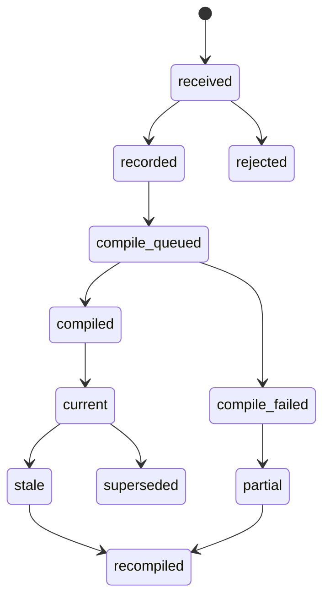

# feat: Build context tracking primitives

## Summary

Build a new Athena-owned context tracking foundation that turns surface-defined events into bounded, permission-aware context bundles for downstream consumers such as the intelligence layer. The shared contract lives in the existing intelligence shared-code directory, `packages/athena-webapp/shared/intelligence/`; Convex storage and compilation live outside `convex/intelligence`; Athena webapp and storefront each define surface adapters on top.

This plan intentionally does not normalize legacy storefront analytics, does not create a heavy tracking-session read model, and does not add a full Ask Athena UI. The first pass creates the common envelope, validation, storage, compiler, visibility, freshness, and testing contracts that both current webapps and later surfaces can reuse.

---

## Problem Frame

Athena's intelligence layer already has durable runs, context snapshots, provider invocations, artifacts, visibility modes, and source refs. The weaker boundary is upstream: Athena webapp and storefront can both collect useful raw signals, but there is no shared way for those signals to become durable product context without coupling downstream consumers directly to one app's raw tracking shape.

The user direction is narrower and lower-level than a storefront analytics redesign:

- Build everything new; do not carry legacy tracking events forward as the contract.
- Define base primitives once, then let surfaces define what they track using those primitives.
- Keep storefront as the first production adapter built on top, while proving the contract with an Athena webapp operator-surface fixture too.
- Avoid a meta "tracking sessions" abstraction. Raw events already have enough structure; compilers can group them for specific context needs.

---

## Requirements

- R1. Define a shared context event envelope with surface id, event id, schema version, store/org scope, occurred-at time, actor/session refs, subject refs, source refs, visibility, origin, synthetic marker, and idempotency key.
- R2. Keep surface event definitions surface-owned. The foundation validates the envelope and adapter registration; each surface validates its own payload shape and compiler behavior.
- R3. Persist new context events in a separate append-only Convex table. Do not write through legacy `analytics`, and do not migrate or backfill legacy events in this slice.
- R4. Make Convex/server validation authoritative. Client validation is developer feedback only; stale or malformed clients cannot poison context.
- R5. Store minimized, typed payloads and compact evidence. Do not persist raw provider payloads, broad database dumps, browser fingerprints, secrets, PIN/proof material, payment details, or unbounded customer/store text.
- R6. Compile context through internal Convex functions into bounded context bundles with source refs, data windows, snapshot hashes, freshness state, omitted-evidence markers, and redaction metadata.
- R7. Require intelligence capabilities to consume storefront-derived context through compiled bundles, not raw storefront event rows. Raw domain reads are allowed inside compilers only when the compiler owns the permission and evidence boundary.
- R8. Enforce visibility and redaction at the server query/compile boundary, including hidden source counts and source labels that are safe for the current viewer.
- R9. Distinguish event recorded, event rejected, event recorded but not compiled, compiled partial, compiled stale, adapter unavailable, and source hidden by permission.
- R10. Treat synthetic monitor traffic as excluded from business/customer intelligence by default while available to health/diagnostic compilers.
- R11. Use Convex mutation-first patterns: public mutations record durable intent/events, internal mutations project/compile, internal actions handle external/provider work only when needed, and public queries expose bounded read models.
- R12. Keep operational events, workflow traces, automation runs, and domain ledgers in their existing roles. Context primitives reference them; they do not replace them.
- R13. Treat client-supplied actor, session, customer, cart, checkout, order, and subject refs as claims until the server derives or corroborates them from trusted request, session, cart, checkout, order, or domain records.
- R14. Define v1 retention/deletion semantics before production writes: retention class, `expiresAt` or archive marker, deletion/anonymization behavior for customer/session subjects, and metadata allowed to survive source deletion.
- R15. Ship focused tests for envelope validation, idempotency collision semantics, adapter registration, subject spoofing, compiler freshness, permission/redaction, storefront adapter fixtures, non-storefront contract fixtures, and intelligence snapshot consumption.

---

## Scope Boundaries

- No legacy storefront analytics normalization, migration, backfill, or compatibility taxonomy.
- No generic tracking-session table or read model in v1.
- No POS, inventory, operations, service, or automation adapter implementation beyond contract examples and test fixtures.
- No autonomous domain mutations from intelligence output.
- No full Ask Athena chat surface.
- No new provider SDK or model capability work beyond using the compiled bundle from existing intelligence flows.
- No production deploy or data migration as part of this planning slice.

### Deferred to Follow-Up Work

- Storefront event rollout beyond the first adapter fixture set.
- Adapter implementations for POS, operations, inventory, services, stock, automation, and support.
- Retention purge automation and archive jobs after real volume is measured. Schema-level retention class, expiration/archive fields, and deletion/anonymization semantics are in scope for v1.
- Context health dashboards and support diagnostics.
- Context-aware apply tools through command boundaries and approval policy.

---

## Context & Research

### Relevant Code and Patterns

- `packages/athena-webapp/convex/schemas/intelligence.ts` already defines `intelligenceRun`, `intelligenceContextSnapshot`, `intelligenceArtifact`, `intelligenceProviderInvocation`, source refs, visibility modes, and principal fields.
- `packages/athena-webapp/convex/intelligence/runs.ts` owns run/snapshot/artifact persistence.
- `packages/athena-webapp/convex/intelligence/lifecycle.ts` keeps state transitions as pure helpers with focused tests.
- `packages/athena-webapp/convex/intelligence/capabilities/insights.ts` currently compacts analytics rows for prompts; this is the first consumer to move behind compiled context bundles for storefront-derived context.
- `packages/storefront-webapp/src/lib/storefrontObservability.ts` and `packages/storefront-webapp/src/lib/storefrontJourneyEvents.ts` show the current storefront event-builder precedent, but they are adapter inputs, not the new foundation.
- `packages/athena-webapp/convex/storeFront/storefrontObservabilityReport.ts` and `packages/athena-webapp/convex/storeFront/customerObservabilityTimelineData.ts` show backend grouping/reporting patterns that should inform the storefront adapter without becoming the cross-surface contract.
- `packages/athena-webapp/convex/schemas/operations/operationalEvent.ts` is the operator-visible audit rail for command decisions and review actions.
- `packages/athena-webapp/convex/schemas/observability/workflowTrace.ts` and `workflowTraceEvent.ts` are lifecycle investigation evidence, not source-of-truth tracking storage.
- `packages/athena-webapp/convex/schemas/automation.ts` separates policy, run, ledger, idempotency, source subjects, and skipped/failed/partial states.

### Institutional Learnings

- `docs/solutions/architecture/athena-intelligence-layer-foundation-2026-06-21.md`: Athena owns intelligence state, context snapshots, provider invocations, artifacts, source refs, visibility, stale/superseded state, and usage evidence.
- `docs/solutions/architecture/athena-workflow-investigation-evidence-2026-06-21.md`: traces are investigation evidence; source ledgers and business records stay authoritative.
- `docs/solutions/architecture/athena-automation-foundation-2026-06-08.md`: policy-backed system work must record action, inaction, idempotency, source subjects, normalized outcome, and errors.
- `docs/solutions/architecture/athena-app-wide-message-action-foundation-2026-06-20.md`: generic foundations own mechanics; adapters own domain truth and execution.
- `docs/solutions/logic-errors/athena-pos-operations-metric-redaction-and-cash-allocation-2026-06-21.md`: redaction belongs at the server boundary; raw sensitive data must not reach browser surfaces.
- `docs/solutions/logic-errors/athena-pos-sync-review-workspace-boundaries-2026-06-19.md`: evidence surfaces need workspace/role boundaries, not only broad store access.
- `docs/solutions/architecture/athena-pos-terminal-health-visibility-2026-05-20.md`: visibility and readiness states must be explicit instead of inferred from missing data.
- `docs/solutions/architecture/athena-pos-field-evidence-surfaces-2026-05-20.md`: counts alone are not enough when a decision needs item-level evidence.
- `docs/solutions/logic-errors/athena-cash-controls-sale-sync-review-evidence-2026-06-18.md`: completed facts need attached evidence; hidden backend conflict summaries must not leak.
- `docs/solutions/logic-errors/athena-command-approval-policy-boundary-2026-05-01.md`: future apply paths must go through server command boundaries and approval policy.

### External References

- Convex schemas: `https://docs.convex.dev/database/schemas`
- Convex indexes and query performance: `https://docs.convex.dev/database/reading-data/indexes/indexes-and-query-perf`
- Convex best practices: `https://docs.convex.dev/understanding/best-practices/`
- Convex internal functions: `https://docs.convex.dev/functions/internal-functions`
- Convex scheduled functions: `https://docs.convex.dev/scheduling/scheduled-functions`
- Convex scheduler guarantees: `https://docs.convex.dev/api/interfaces/server.Scheduler`
- Convex React guidance on direct client actions: `https://docs.convex.dev/api/modules/react`

---

## Key Technical Decisions

- Place the shared tracking contract in the existing shared intelligence directory, `packages/athena-webapp/shared/intelligence/`. Athena webapp owns Convex persistence/compilation under `packages/athena-webapp/convex/contextTracking/`; `convex/intelligence/` only consumes compiled bundles.
- Create a separate append-only `contextEvent` table for new events. Legacy analytics remains untouched and outside v1.
- Do not create `trackingSession` in v1. Compilers group event streams by subject/session/window only for a specific context bundle.
- Use surface-owned event definitions: the common primitive envelope is stable, while adapters own event payload validators, allowed event ids, compiler mapping, version acceptance, and deprecation.
- For storefront v1, keep the existing storefront transport shape: a thin storefront HTTP API wrapper posts to an Athena HTTP route that derives trusted store/org/actor/session scope from server-visible request context, then calls the context append helper.
- Make `appendContextEvent` the durable server helper. It validates derived scope, envelope fields, idempotency, schema version, subject corroboration, and payload through the registered adapter before inserting or recording a safe rejection.
- Use internal mutations/queries for projection and compilation. Client-callable functions stay thin and bounded.
- Keep indexes tied to proven reads: tenant/scope first, then surface, primary subject/session, status, occurred time, retention expiration, and idempotency. Avoid broad store scans and avoid parallel indexes that a compound prefix already covers.
- Store source refs with enough context for explanation: table/id/label, surface/event version, subject refs, data window, synthetic marker, and redaction/omission metadata.
- Exclude synthetic monitor events from business/customer intelligence by default; include them only in health or diagnostics bundles.
- Treat all customer/store/imported/event text as untrusted data. It can inform context, but it cannot grant tool authority, alter visibility, bypass approvals, or change compiler policy.
- Use `operationalEvent` only for visible review or lifecycle decisions, not every low-level event insert.
- Use `workflowTrace` only when compiling or investigating a durable lifecycle workflow, not as the default context ledger.
- In v1, `ContextBundle` is an ephemeral compiler output copied into `intelligenceContextSnapshot`. Do not add a durable `contextBundle` table until reuse or async volume proves it. Run-bound snapshots are immutable captures; later bundle recompilation must not rewrite prior snapshot facts.

---

## Output Structure

    packages/athena-webapp/
      convex/
        contextTracking/
          contextEvents.ts
          contextEventDefinitions.ts
          contextCompilers.ts
          contextBundles.ts
          adapters/
            athenaWebapp.ts
            storefront.ts
        schemas/
          intelligence.ts
      src/
        contextTracking/
          athenaWebappContextEvents.ts

    packages/storefront-webapp/
      src/
        api/
          trackingEvents.ts
        lib/
          storefrontContextEvents.ts

    packages/athena-webapp/
      shared/
        intelligence/
          contextTracking.ts
          contextTypes.ts
          contextEventTypes.ts
          contextBundleTypes.ts
          eventBuilder.ts
          surfaceDefinition.ts

The exact file grouping can shift during implementation, but ownership should not: `packages/athena-webapp/shared/intelligence/` owns browser-safe context primitives and event-building helpers; Athena webapp Convex owns storage, compiler, visibility, and consumer integration; each app owns its surface event definitions and emission glue.

---

## High-Level Technical Design

### Primitive Vocabulary

| Primitive | Purpose |
| --- | --- |
| `ContextEventEnvelope` | Stable cross-surface metadata required for every tracked event. |
| `SurfaceContextDefinition` | Adapter-owned registry entry for event ids, versions, payload validators, subject extraction, visibility rules, and compiler hooks. |
| `ContextSourceRef` | Explainable source pointer with table/id/label, surface/event version, time window, redaction, omitted evidence, and synthetic marker. |
| `ContextSubjectRef` | Typed subject pointer such as customer, product, order, checkout, cart, terminal, staff profile, policy, or workflow. |
| `ContextBundle` | Bounded compiled context for one capability/surface/window/subject with freshness, source refs, hidden counts, quality flags, and snapshot hash. |
| `ContextCompileRun` | Optional run/ledger row for compiler attempts, idempotency, partial states, and errors if event volume or async processing requires it. |

---

## Implementation Units

- U1. **Add shared context primitive types and schema validators**

**Goal:** Define the common envelope, refs, visibility, status, and bundle vocabulary without adding surface-specific semantics.

**Requirements:** R1, R2, R5, R8, R10

**Dependencies:** None

**Files:**
- Create: `packages/athena-webapp/shared/intelligence/contextTypes.ts`
- Create: `packages/athena-webapp/shared/intelligence/contextEventTypes.ts`
- Create: `packages/athena-webapp/shared/intelligence/contextBundleTypes.ts`
- Create: `packages/athena-webapp/shared/intelligence/contextTracking.ts`
- Create: `packages/athena-webapp/shared/intelligence/eventBuilder.ts`
- Create: `packages/athena-webapp/shared/intelligence/surfaceDefinition.ts`
- Modify: `packages/athena-webapp/convex/schemas/intelligence.ts`
- Modify: `packages/athena-webapp/convex/schema.ts`
- Test: `packages/athena-webapp/shared/intelligence/contextTypes.test.ts`
- Test: `packages/athena-webapp/shared/intelligence/contextTracking.test.ts`
- Test: `packages/athena-webapp/shared/intelligence/eventBuilder.test.ts`
- Test: `packages/athena-webapp/convex/schemas/intelligenceContext.test.ts`

**Approach:**
- Define envelope validators for `surface`, `eventId`, `schemaVersion`, store/org scope, actor refs, session refs, occurred-at time, origin, synthetic marker, idempotency key, subject refs, source refs, and visibility.
- Add append-only `contextEvent` schema with minimal typed payload storage, `retentionClass`, `expiresAt`, optional `archivedAt`, `payloadHash`, `envelopeHash`, denormalized compiler keys, and non-compilable rejection fields.
- Add explicit v1 indexes for idempotent append, compiler reads, stale detection, and retention scans: `by_storeId_surface_idempotencyKey`, `by_storeId_surface_primarySubject_occurredAt`, `by_storeId_surface_sessionRef_occurredAt`, `by_storeId_surface_status_occurredAt`, and `by_retentionClass_expiresAt`.
- Widen `intelligenceContextSnapshot` for copied bundle metadata: bundle kind/version, freshness, hidden source count, omitted evidence count, redaction mode, quality flags, source refs, data window, payload summary, and snapshot hash.
- Do not add a durable `contextBundle` table in v1. `ContextBundle` is an ephemeral compiler output copied into the run-bound snapshot.
- Keep `packages/athena-webapp/shared/intelligence/` browser-safe and free of Convex server imports so both Athena webapp and storefront can consume it.

**Test scenarios:**
- A valid event envelope and bundle validate with required scope, source refs, and visibility.
- Missing idempotency key, unsupported surface, invalid event id, or unsupported schema version is rejected.
- Synthetic events carry explicit classification and cannot silently enter business bundles.
- Sensitive raw fields are not part of the primitive schema.
- Retention fields and denormalized primary subject/session fields validate and are indexable.

**Verification:**
- `bun test packages/athena-webapp/shared/intelligence/contextTypes.test.ts packages/athena-webapp/shared/intelligence/contextTracking.test.ts packages/athena-webapp/shared/intelligence/eventBuilder.test.ts packages/athena-webapp/convex/schemas/intelligenceContext.test.ts`

---

- U2. **Implement surface definition registry and authoritative event append boundary**

**Goal:** Create the server-owned write path that validates and stores new context events through registered surface definitions.

**Requirements:** R2, R3, R4, R9, R11, R13, R14

**Dependencies:** U1

**Files:**
- Create: `packages/athena-webapp/convex/contextTracking/contextEvents.ts`
- Create: `packages/athena-webapp/convex/contextTracking/contextEventDefinitions.ts`
- Test: `packages/athena-webapp/convex/contextTracking/contextEvents.test.ts`
- Test: `packages/athena-webapp/convex/contextTracking/contextEventDefinitions.test.ts`

**Approach:**
- For storefront v1, add a narrow Athena HTTP route that matches the current storefront API-wrapper pattern. The route derives `storeId`, `organizationId`, actor/customer/session scope, and trusted request metadata from server-visible request context, then calls an internal append helper with derived scope values.
- Keep `appendContextEvent` as the durable internal helper plus any authenticated public mutation needed later for Athena-owned surfaces. It records durable intent and never trusts client-only validation.
- Registry entries provide allowed event ids, supported schema versions, payload validator, subject extractor, default visibility, redaction policy, and compiler hook metadata.
- Enforce idempotency with a stable key such as `storeId + surface + eventKey`, plus `envelopeHash` and `payloadHash`. Same key and same hashes returns the existing row; same key with different hash is an idempotency conflict and must never compile.
- Treat client-supplied refs as claims. The append boundary must derive or corroborate privileged customer/session/cart/checkout/order refs from trusted storefront session, cart, checkout, order, or domain records before those refs become authoritative subject/source refs.
- Unknown surfaces, unknown event ids, stale schema versions, invalid payloads, subject-spoofing attempts, and permission failures return normalized safe errors.
- Rejected attempts that are persisted must use a hard non-compilable status. Unauthorized attempts must not persist sensitive payloads; store only safe diagnostics needed for support or rate-limit investigation.
- Public reads remain bounded; internal functions perform projection/compilation.

**Test scenarios:**
- Valid event inserts once and duplicate idempotency returns the existing row or a safe duplicate outcome.
- Same idempotency key with different envelope or payload hash returns an idempotency conflict and does not compile.
- Invalid payload is rejected before storage or quarantined in an explicit rejected state without being compiled.
- Public client cannot write events for another store or unsupported surface.
- Storefront caller cannot spoof another customer, session, cart, checkout, or order subject.
- Unauthorized or rejected payloads cannot enter compiler reads.
- Registry accepts a newer storefront event version only when declared by the adapter.

**Verification:**
- `bun test packages/athena-webapp/convex/contextTracking/contextEvents.test.ts packages/athena-webapp/convex/contextTracking/contextEventDefinitions.test.ts`

---

- U3. **Add context compiler and bundle contract**

**Goal:** Convert append-only events into bounded, permission-aware bundles that intelligence capabilities and future surfaces can consume.

**Requirements:** R5, R6, R7, R8, R9, R10, R12

**Dependencies:** U1, U2

**Files:**
- Create: `packages/athena-webapp/convex/contextTracking/contextCompilers.ts`
- Create: `packages/athena-webapp/convex/contextTracking/contextBundles.ts`
- Modify: `packages/athena-webapp/convex/intelligence/runs.ts`
- Modify: `packages/athena-webapp/convex/intelligence/capabilities/insights.ts`
- Test: `packages/athena-webapp/convex/contextTracking/contextCompilers.test.ts`
- Test: `packages/athena-webapp/convex/contextTracking/contextBundles.test.ts`

**Approach:**
- Define compiler inputs: capability id, surface id, store/org scope, actor or policy visibility, subject refs, data window, and synthetic inclusion mode.
- Produce compact bundle payloads with data window, source refs, hidden source count, omitted evidence count, redaction mode, freshness state, quality flags, snapshot hash, and limited-evidence marker.
- Read compiler-critical subjects through denormalized fields such as `primarySubjectType`, `primarySubjectId`, `sessionRefKind`, `sessionRefId`, `status`, `surface`, and `occurredAt`. Do not scan broad stores and filter arrays of generic refs.
- Mark bundles stale when newer relevant source events exist, product/customer/order identity changes, visibility rules change, or a freshness TTL expires.
- Allow raw domain reads only inside compilers that own permission checks and source-ref construction.
- Feed storefront-derived intelligence through compiled bundles rather than direct analytics-row compaction.
- Treat `ContextBundle` as an ephemeral projection in v1. Once an intelligence run captures it, `intelligenceContextSnapshot` owns the immutable run capture.

**Test scenarios:**
- Compiler groups storefront events for a customer/window without creating a session table.
- Viewer with lower visibility receives redacted bundle metadata and hidden counts, not hidden details.
- Synthetic monitor events are excluded from customer/business bundle and included for health bundle.
- Newer source event or identity change marks prior bundle/snapshot stale.
- Empty or partial event history returns a valid limited-evidence bundle.

**Verification:**
- `bun test packages/athena-webapp/convex/contextTracking/contextCompilers.test.ts packages/athena-webapp/convex/contextTracking/contextBundles.test.ts packages/athena-webapp/convex/intelligence/capabilities/insights.test.ts`

---

- U4. **Build storefront as the first surface adapter**

**Goal:** Prove the primitive layer with a storefront adapter while keeping storefront taxonomy out of the base contract.

**Requirements:** R2, R3, R4, R9, R10, R13

**Dependencies:** U1, U2, U3

**Files:**
- Create: `packages/athena-webapp/convex/contextTracking/adapters/storefront.ts`
- Create: `packages/storefront-webapp/src/api/trackingEvents.ts`
- Create: `packages/storefront-webapp/src/lib/storefrontContextEvents.ts`
- Test: `packages/athena-webapp/convex/contextTracking/adapters/storefront.test.ts`
- Test: `packages/storefront-webapp/src/api/trackingEvents.test.ts`
- Test: `packages/storefront-webapp/src/lib/storefrontContextEvents.test.ts`
- Test: `packages/athena-webapp/shared/intelligence/contextTracking.test.ts`

**Approach:**
- Define a small v1 storefront event set: view/browse event, product intent event, cart/bag mutation event, checkout milestone event, adapter failure event, and synthetic health event.
- Keep event ids and payload validators in the storefront adapter definition.
- Import the generic tracker factory from `@athena/webapp/shared/intelligence/contextTracking`; provide a storefront transport in `src/api/trackingEvents.ts` that posts to the Athena HTTP route deriving trusted scope and calling the context append helper. Do not write new events into legacy analytics.
- Keep rollout to builder/API-wrapper integration and fixtures unless a specific storefront instrumentation point is intentionally included in the first implementation.
- Customer shopping flow must continue if emit fails. Server-reached failures become diagnostic evidence where useful; client-only network failures do not block storefront UX.
- Use existing storefront observability naming lessons, but do not require backward compatibility with legacy event rows.

**Test scenarios:**
- Storefront event builders produce valid envelope/payload pairs for browse, cart, checkout, failure, and synthetic events.
- Adapter rejects unknown fields or stale schema versions according to its declared policy.
- Emit failure does not throw through the shopping flow.
- Storefront compiler fixture turns the event set into a bounded bundle with source refs and freshness metadata.

**Verification:**
- `bun test packages/athena-webapp/shared/intelligence/contextTracking.test.ts packages/storefront-webapp/src/api/trackingEvents.test.ts packages/storefront-webapp/src/lib/storefrontContextEvents.test.ts packages/athena-webapp/convex/contextTracking/adapters/storefront.test.ts`

---

- U5. **Integrate compiled bundles with intelligence snapshots and artifact reads**

**Goal:** Make the intelligence layer consume the new context primitive output without expanding model/provider scope.

**Requirements:** R6, R7, R8, R9, R12, R13

**Dependencies:** U3, U4

**Files:**
- Modify: `packages/athena-webapp/convex/intelligence/runs.ts`
- Modify: `packages/athena-webapp/convex/intelligence/capabilities/actions.ts`
- Modify: `packages/athena-webapp/convex/intelligence/capabilities/insights.ts`
- Modify: `packages/athena-webapp/convex/intelligence/access.ts`
- Test: `packages/athena-webapp/convex/intelligence/runs.test.ts`
- Test: `packages/athena-webapp/convex/intelligence/capabilities/insights.test.ts`
- Test: `packages/athena-webapp/convex/intelligence/access.test.ts`

**Approach:**
- Allow `intelligenceContextSnapshot` creation to copy the ephemeral compiled context bundle with bundle kind/version, hash, source refs, data window, freshness, hidden source count, omitted evidence count, redaction metadata, quality flags, and limited-evidence state.
- Update storefront-derived insight capability actions to request a bundle from the internal compiler rather than calling `internal.storeFront.analytics.getAllInternal` or `internal.storeFront.user.getStoreUserActivityInternal` directly.
- Update `capabilities/insights.ts` helpers to compact compiled bundles, not raw analytics rows.
- Enforce artifact reads against recorded visibility and source refs, including hidden source counts and safe labels.
- Preserve current provider invocation/artifact lifecycle; this unit is about context input, not provider architecture.

**Test scenarios:**
- Storefront insight run records a context snapshot from a compiled bundle.
- Lower-privilege viewer cannot read artifact evidence generated from hidden context.
- Limited-evidence bundle causes artifact to render or persist as limited, not fully trusted.
- Stale bundle marks related artifact stale. Rerun remains an explicit existing intelligence action, not a new automatic provider behavior from this foundation slice.

**Verification:**
- `bun test packages/athena-webapp/convex/intelligence/runs.test.ts packages/athena-webapp/convex/intelligence/capabilities/insights.test.ts packages/athena-webapp/convex/intelligence/access.test.ts`

---

- U6. **Document adapter authoring and validation gates**

**Goal:** Make later surfaces able to build on the foundation without copying storefront-specific decisions.

**Requirements:** R2, R4, R8, R11, R13

**Dependencies:** U1, U2, U3, U4, U5

**Files:**
- Create: `packages/athena-webapp/convex/intelligence/CONTEXT_PRIMITIVES.md`
- Modify: `packages/athena-webapp/docs/agent/architecture.md`
- Create: `docs/solutions/architecture/athena-intelligence-context-primitives-2026-06-21.md`

**Approach:**
- Document the envelope, adapter registry responsibilities, compiler responsibilities, visibility rules, synthetic handling, event versioning, and testing checklist.
- Include a minimal adapter template and a checklist for future POS/operations/inventory adapters.
- Document what not to do: no legacy analytics backfill as a prerequisite, no raw provider payloads, no browser-side redaction, no session read model by default.

**Test scenarios:**
- Documentation examples compile or are covered by adjacent tests where possible.
- Plan-to-implementation validation includes `bun run graphify:rebuild` after code changes.

**Verification:**
- `bun run graphify:rebuild`
- `bun run graphify:check`

---

## System-Wide Impact

| Area | Impact |
| --- | --- |
| Intelligence | Capabilities get a stable context input boundary instead of directly compacting raw surface data. |
| Storefront | Becomes the first adapter and event-definition owner, but does not own the primitive contract. |
| Convex schema | Adds new context-event storage, snapshot bundle metadata fields, retention fields, and bounded indexes. |
| Security/privacy | Moves redaction and visibility to server compile/read boundaries. |
| Operations/evidence | Keeps operational events and workflow traces in their existing lanes. |
| Future surfaces | POS, operations, inventory, services, and automation can add adapters without changing the base envelope. |

---

## Validation Plan

- Unit: shared primitive type and validator coverage.
- Unit: surface registry accepts supported versions and rejects unknown/stale event definitions.
- Unit: idempotent append path prevents duplicate inserts and rejects same-key/different-hash collisions.
- Unit: server-derived or corroborated subject refs reject cross-customer/session/cart/checkout/order spoofing.
- Unit: rejected or unauthorized rows are non-compilable and unauthorized payloads are not retained.
- Unit: retention class, expiration/archive fields, and deletion/anonymization behavior.
- Unit: compiler freshness and stale-state logic.
- Unit: permission/redaction and hidden-source behavior.
- Unit: storefront event-builder fixtures for browse, cart, checkout, failure, and synthetic events.
- Unit: non-storefront contract fixture proves the envelope is not storefront-shaped.
- Integration: storefront event append through adapter into compiled bundle.
- Integration: compiled bundle becomes an `intelligenceContextSnapshot`.
- Integration: artifact read enforces context visibility and limited-evidence state.
- Guardrail: public Convex exports with explicit `returns` get executable return-validator proof when changed.
- Docs/tooling: `bun run graphify:rebuild` after code changes and `bun run graphify:check`.

---

## Risks and Mitigations

| Risk | Mitigation |
| --- | --- |
| The primitive layer becomes a second business ledger. | Store minimized event/evidence data only; source ledgers remain authoritative and are referenced by source refs. |
| Storefront adapter leaks into the base contract. | Put event taxonomy and payload validators in adapter files; keep envelope fields generic. |
| Event volume creates expensive reads. | Use append indexes around proven access paths and compile bounded windows; avoid unbounded `.filter`/`.collect()`. |
| Context exposes hidden customer, payment, staff, or support data. | Enforce server-side visibility in append, compile, and read paths; return hidden counts and safe labels. |
| Client-supplied subjects poison another customer or order's context. | Treat refs as claims until the server derives or corroborates them; test spoofing across customer/session/cart/checkout/order boundaries. |
| Append-only customer/session behavior becomes an indefinite ledger. | Add retention class, expiration/archive fields, deletion/anonymization semantics, and a retention index before production writes. |
| Bad client versions poison context. | Server registry is authoritative and rejects unsupported versions/payloads. |
| Stale context looks current in intelligence artifacts. | Record data windows, snapshot hashes, stale triggers, and freshness TTLs; mark artifacts stale/superseded when source context changes. |
| Synthetic monitor data pollutes business intelligence. | Default exclusion from business/customer bundles; explicit inclusion for health bundles only. |
| Implementation drifts into full intelligence/provider work. | Keep provider/model scope unchanged; this plan only changes the context input boundary. |

---

## Phased Delivery

1. **Foundation contract:** U1 and U2. Land the envelope, validators, registry, append table, and idempotent write path.
2. **Compiler contract:** U3. Compile bounded bundles with visibility, freshness, source refs, and synthetic handling.
3. **Storefront proof:** U4. Add the first surface adapter and fixture event set.
4. **Intelligence consumption:** U5. Make storefront-derived insights consume compiled bundles through existing run/snapshot/artifact rails.
5. **Authoring docs:** U6. Document adapter authoring and validation gates for later surfaces.

---

## Open Questions

### Resolved During Planning

- Should primitives be tied to storefront? No. Storefront is only the first adapter.
- Should legacy tracking events be modeled? No. Build new events and leave legacy analytics out of scope.
- Should v1 create tracking sessions? No. Use append-only events and bundle compilers instead.
- Should validation rely on the storefront client? No. Server/Convex validation is authoritative.
- Should operational events or workflow traces become the context ledger? No. Context events reference those rails when useful, but do not replace them.
- Should v1 persist durable context bundles? No. Bundles are ephemeral compiler outputs copied into immutable `intelligenceContextSnapshot` rows.
- Should storefront call Convex directly from `src/lib`? No. Storefront keeps a thin HTTP API wrapper, and the Athena HTTP route derives trusted scope.

### Deferred to Implementation

- Exact event id naming convention and semantic version format after the storefront adapter fixture is written.
- Which rejected-event classes are persisted as safe non-compilable diagnostics versus returned without storage; unauthorized payloads are never retained.
- Exact retention duration values after v1 volume and policy are confirmed; the schema-level retention/deletion contract is not deferred.
- Whether future high-volume compilers need a durable `contextBundle` table; v1 uses ephemeral bundles copied into `intelligenceContextSnapshot`.
- Exact first storefront event set beyond the required fixture categories.
