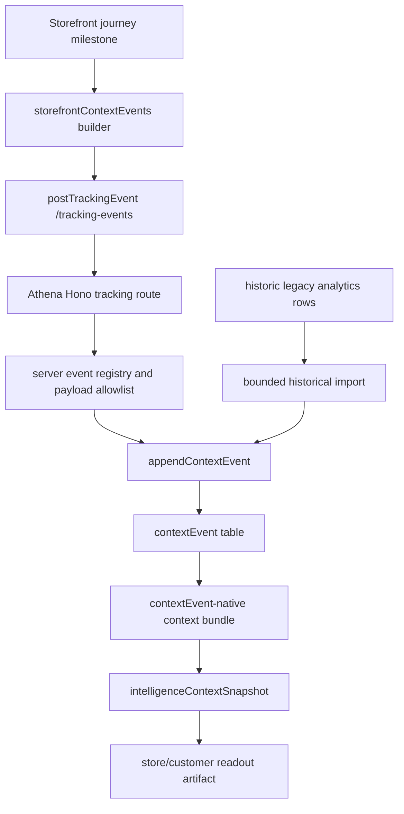
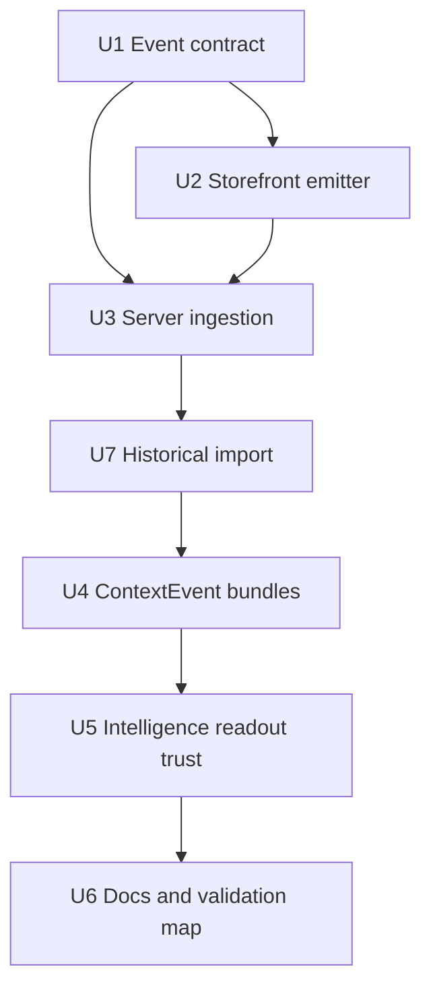
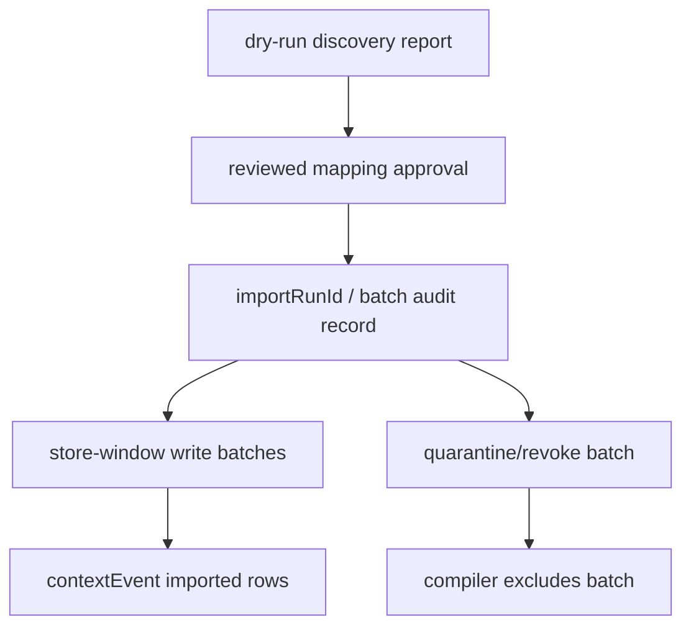
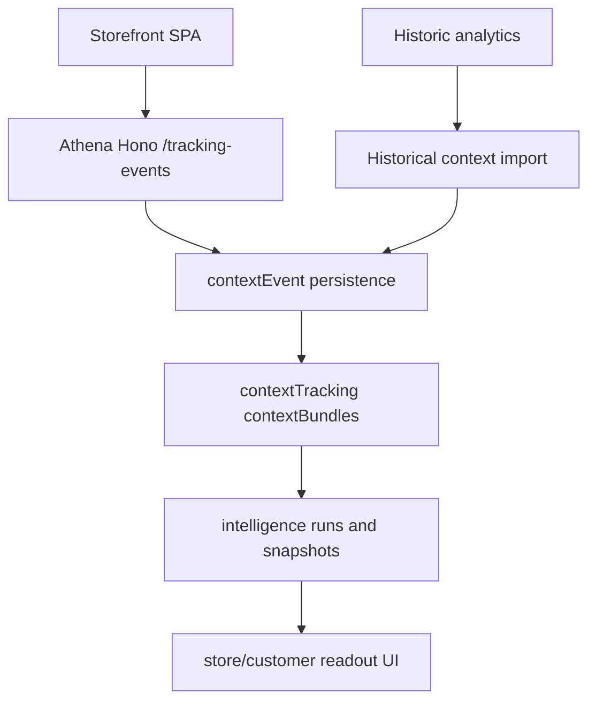

# feat: Roll out storefront context events

## Summary

Roll out the new storefront context-event direction end to end: the storefront emits registered `contextEvent` envelopes for customer journey milestones, Athena validates and persists those events server-side, valuable historic storefront analytics are converted into bounded context-event evidence, and intelligence readouts compile store/customer context from `contextEvent` rows only.

---

## Problem Frame

The context primitives foundation exists, but the storefront surface still has most customer journey behavior wired through legacy analytics and the intelligence bundle compiler still reads legacy analytics rows. That keeps the intelligence layer coupled to an older storefront telemetry shape instead of the new surface-owned context primitive contract.

---

## Requirements

- R1. Storefront must emit registered context events for route, product, cart, and checkout milestones through the existing `/tracking-events` boundary.
- R2. Athena must derive trusted store, organization, actor, synthetic, and primary-subject metadata server-side; browser-provided session refs remain claims unless the route can corroborate them against server-issued storefront context.
- R3. Context payloads must stay bounded to allowlisted scalar fields; contact, payment, auth token, raw URL, raw user-agent, proof/PIN, and free-form customer text must not enter context events or intelligence snapshots.
- R4. Store and customer intelligence context bundles must read durable `contextEvent` rows as the sole durable evidence source for storefront intelligence, with no legacy analytics fallback or mixed-source dedupe path.
- R5. Storefront shopping flows must not block when context-event emission fails; failures are diagnostic, not customer-facing blockers.
- R6. Synthetic monitor events may be accepted as context diagnostics, but business/customer intelligence compilers must exclude them by default.
- R7. Evidence source refs, data windows, freshness, omitted/hidden counts, and limited-evidence state must continue to flow into `intelligenceContextSnapshot` and `intelligenceArtifact`.
- R8. The plan must update package docs so future storefront telemetry uses context primitives for intelligence-bearing events rather than adding new ad hoc analytics calls.
- R9. Historical legacy analytics data that is safe and intelligence-bearing must be leveraged by converting it into `contextEvent`-shaped historical evidence, without preserving legacy analytics as a live compiler source or runtime compatibility path.

---

## Scope Boundaries

- Do not support legacy analytics compatibility, live fallback, dual-write, ongoing projection, or runtime parity writes in this work.
- Do not read legacy analytics directly from active intelligence bundle compilers. Historical value is captured only through a bounded one-time or resumable import into `contextEvent` rows.
- Do not remove unrelated `/analytics` endpoints, dashboard readers, product-view-count readers, promo analytics, or old observability reports as part of this rollout.
- Do not add or preserve analytics writes for parity with the new context-event evidence path. Existing analytics producers may remain only when they serve an explicitly out-of-scope non-intelligence surface and are isolated from context bundles.
- Do not expand the storefront event catalog beyond the four registered v1 event families unless implementation proves a required milestone cannot be represented safely.
- Do not add a durable `contextBundle` table; compiled bundles remain ephemeral projections copied into intelligence snapshots.
- Do not add provider/model changes, Ask Athena chat, or automated apply actions.
- Do not block storefront browsing, bag, checkout, or auth flows on telemetry success.

### Deferred to Follow-Up Work

- Legacy analytics endpoint removal or dashboard migration: separate analytics/reporting project after context coverage is proven.
- Ongoing analytics-to-context projection after the import window: separate operational decision only if future reporting needs it, and it must not become the readout compiler's fallback path.
- Full offline/batched context-event queueing for all event types: follow-up if real loss rates justify the extra runtime complexity.
- Context diagnostics dashboard for support: follow-up after context events are the primary source.

---

## Context & Research

### Relevant Code and Patterns

- `docs/plans/2026-06-21-003-feat-intelligence-context-primitives-plan.md` established the shared primitive layer and explicitly deferred real storefront rollout.
- `packages/storefront-webapp/src/lib/storefrontContextEvents.ts` already defines the v1 storefront surface event set and browser-safe builder.
- `packages/storefront-webapp/src/api/trackingEvents.ts` already posts `ContextTrackingEnvelope` payloads to `/tracking-events`.
- `packages/athena-webapp/convex/http/domains/core/routes/trackingEvents.ts` is the public Hono boundary for storefront context ingestion and already derives primary subjects for product/cart/checkout events.
- `packages/athena-webapp/convex/contextTracking/eventDefinitions.ts` is the authoritative server-side event registry and payload allowlist.
- `packages/athena-webapp/convex/contextTracking/contextEvents.ts` owns idempotent append semantics for the `contextEvent` table.
- `packages/athena-webapp/convex/contextTracking/contextBundles.ts` currently compiles store/user insight bundles from legacy analytics; this is the main intelligence path to replace.
- `packages/athena-webapp/convex/intelligence/capabilities/actions.ts`, `packages/athena-webapp/convex/intelligence/capabilities/insights.ts`, and `packages/athena-webapp/convex/intelligence/runs.ts` already persist snapshots, provider invocations, artifacts, evidence refs, limited-evidence state, and debug metadata.
- Storefront package docs identify `packages/storefront-webapp/src/contexts/StorefrontObservabilityProvider.tsx`, `src/api`, checkout routes, product page logic, and shopping bag components as the browser-to-backend/request layer to keep thin and convention-following.

### Institutional Learnings

- `docs/solutions/architecture/athena-intelligence-context-primitives-2026-06-21.md`: surfaces own event catalogs; Convex append helpers are authoritative; public routes derive trusted scope server-side; intelligence consumes compiled bundles rather than raw surface rows.
- `docs/solutions/architecture/athena-storefront-analytics-context-migration-2026-06-22.md`: browser-controlled URLs, checkout errors, payment/contact text, and generic passthrough fields are prompt-snapshot risks. This plan applies that privacy lesson to a bounded historical import while intentionally not keeping legacy analytics as the live bridge.
- `docs/solutions/architecture/athena-intelligence-layer-foundation-2026-06-21.md`: intelligence state remains Athena-owned through runs, snapshots, provider invocations, artifacts, source refs, visibility, stale/superseded state, and evidence quality.
- `docs/solutions/architecture/athena-intelligence-readout-run-debug-boundary-2026-06-22.md`: readout debugging should expose run status, data windows, sanitized snapshot summaries, provider status, and evidence/source counts, not raw prompts or raw payload rows.
- `docs/solutions/performance/athena-analytics-workspace-snapshot-2026-05-08.md`: raw analytics rows should not become the view model for intelligence-adjacent surfaces; use bounded server-shaped projections.

### External References

- None used. The implementation shape is governed by existing repo primitives and package conventions.

---

## Key Technical Decisions

- Use `contextEvent` as the only storefront intelligence source going forward. This follows the new direction and avoids dual-write, mixed-source dedupe, or legacy fallback semantics in active readout compilers.
- Preserve the value of historical analytics through a one-time or resumable conversion into `contextEvent` rows. The import should treat analytics rows as untrusted legacy source material, map only safe/allowlisted fields into registered storefront context events, tag imported evidence with historical source refs, and then let readouts consume it through the same `contextEvent` compiler path as new storefront events.
- Keep the v1 event catalog narrow: `storefront.route_viewed`, `storefront.product_viewed`, `storefront.cart_changed`, and `storefront.checkout_state_changed`. Existing journey milestones map into those families through bounded payload fields such as route, product id, cart id, quantity/change, checkout session id, order id, state, and blocker.
- Treat checkout state and blocker values as server-allowlisted enum codes. Live storefront events and historical imports must reject raw checkout error text, backend error messages, free-form blocker strings, and payment/provider reason text.
- Preserve storefront continuity by making emission best-effort at the UI boundary. Context tracking can retry selected checkout-critical events, but customer actions must continue when the telemetry route is unavailable.
- Derive authority at the Hono/Convex boundary. The browser can send payload values and session claims, but the backend owns store/org scope, actor kind/id, accepted origin, synthetic classification, subject derivation, visibility, retention, source refs, and append status. Session refs are trusted only if derived from or corroborated with server-issued storefront context; otherwise they remain non-authoritative evidence labels.
- Compile store/customer readout bundles from `contextEvent` rows directly. Legacy compiler modules may remain in the repo for unrelated historical work, but the readout path planned here should not call them.
- Treat synthetic context events as diagnostics. The ingestion path should mark them explicitly; business/customer compilers exclude them unless a future diagnostics compiler opts in.

---

## Open Questions

### Resolved During Planning

- Should the plan include legacy analytics compatibility or fallback? No. The active runtime and readout compiler bias toward the new direction. Historical legacy data is still valuable, so the plan includes bounded conversion into `contextEvent` rows rather than live compatibility.
- Should historical analytics rows be ignored? No. Safe, intelligence-bearing historic rows should be imported into `contextEvent` evidence with source refs, data-window metadata, and quality flags that distinguish imported historical context from freshly emitted storefront context.
- Should storefront event failures block shopping flows? No. Context events are evidence collection and must not become a customer blocker.
- Should the event catalog expand for every existing observability journey helper? No. v1 maps intelligence-bearing milestones into the four registered context event families.
- Should raw client actor/session/source refs be persisted as trusted? No. The backend derives trusted actor/source refs and either corroborates session refs or stores them as non-authoritative claims.

### Deferred to Implementation

- Exact idempotency key construction per event family: finalize while wiring event emitters, but it must be stable enough to prevent duplicate route/product/checkout evidence under rerenders and retries.
- Exact checkout state vocabulary: keep it within the existing server allowlist or update both client and server registries together if a required state is missing.
- Whether checkout-critical context events need a small retry queue in v1: implementer should start from best-effort emission and add narrowly scoped retry only where checkout completion evidence would otherwise be too fragile.
- Exact historical import batch storage shape: use a durable `importRunId`/batch record or equivalent audit artifact, but finalize the table/function split while implementing against existing Convex conventions.

---

## High-Level Technical Design

> *This illustrates the intended approach and is directional guidance for review, not implementation specification. The implementing agent should treat it as context, not code to reproduce.*

The plan intentionally removes live legacy analytics from active compiler reads. Historical analytics contributes only after conversion into `contextEvent` evidence.

---

## Implementation Units

- U1. **Tighten the storefront context event contract**

**Goal:** Make the storefront v1 context event vocabulary explicit enough for implementation without expanding beyond the registered primitive families.

**Requirements:** R1, R3, R6

**Dependencies:** None

**Files:**
- Modify: `packages/storefront-webapp/src/lib/storefrontContextEvents.ts`
- Modify: `packages/athena-webapp/convex/contextTracking/eventDefinitions.ts`
- Test: `packages/storefront-webapp/src/lib/storefrontContextEvents.test.ts`
- Test: `packages/athena-webapp/convex/contextTracking/eventDefinitions.test.ts`
- Test: `packages/athena-webapp/shared/intelligence/contextTracking.test.ts`

**Approach:**
- Align storefront surface definitions and server registrations around the same allowed payload keys for route, product, cart, and checkout events.
- Add directional helper coverage for existing intelligence-bearing journey milestones: product detail viewed, bag viewed, bag add/remove/move, checkout start/details/review, checkout payment-state and verification-state milestones, checkout blocked/canceled/completed, and route viewed. These are checkout state markers only; payment references, payment text, and external transaction details are not payload fields.
- Keep UI-only or marketing affordance events out of the context primitive catalog unless they materially affect store/customer intelligence.
- Ensure context builders compact undefined values and reject missing required keys before transport, while server validation remains authoritative.

**Patterns to follow:**
- `packages/athena-webapp/shared/intelligence/eventBuilder.ts`
- `packages/athena-webapp/shared/intelligence/surfaceDefinition.ts`
- `packages/storefront-webapp/src/lib/storefrontJourneyEvents.test.ts`

**Test scenarios:**
- Happy path: building a product-viewed event with a product id produces `storefront.product_viewed`, schema version 1, and a compact payload accepted by the shared builder.
- Happy path: cart add/remove and checkout state milestones map into registered event families with only allowed scalar payload keys.
- Edge case: optional product SKU/category/quantity fields are omitted when undefined rather than serialized as nullish noise.
- Error path: missing `route` for route events or missing `productId` for product events fails client-side builder validation.
- Error path: server registry rejects unexpected keys, nested objects, raw URLs, contact fields, payment references, raw checkout error text, backend error messages, free-form blocker strings, and unsupported event ids.
- Integration: client surface definitions and backend event definitions stay in parity for every registered storefront event id.

**Verification:**
- The storefront and backend registries accept the same v1 event shapes and reject unsafe or unknown payloads.

---

- U2. **Wire storefront journey emitters to context events**

**Goal:** Route intelligence-bearing storefront milestones to best-effort context-event emission through the existing thin API wrapper.

**Requirements:** R1, R3, R5

**Dependencies:** U1

**Files:**
- Modify: `packages/storefront-webapp/src/api/trackingEvents.ts`
- Modify: `packages/storefront-webapp/src/contexts/StorefrontObservabilityProvider.tsx`
- Modify: `packages/storefront-webapp/src/components/HomePage.tsx`
- Modify: `packages/storefront-webapp/src/hooks/useProductPageLogic.ts`
- Modify: `packages/storefront-webapp/src/components/shopping-bag/ShoppingBag.tsx`
- Modify: `packages/storefront-webapp/src/components/checkout/Checkout.tsx`
- Modify: `packages/storefront-webapp/src/components/checkout/PaymentSection.tsx`
- Modify: `packages/storefront-webapp/src/routes/shop/checkout/$sessionIdSlug/index.tsx`
- Modify: `packages/storefront-webapp/src/routes/shop/checkout/$sessionIdSlug/incomplete.tsx`
- Modify: `packages/storefront-webapp/src/routes/shop/checkout/$sessionIdSlug/canceled.tsx`
- Modify: `packages/storefront-webapp/src/routes/shop/checkout/complete.index.tsx`
- Modify: `packages/storefront-webapp/src/routes/shop/checkout/verify.index.tsx`
- Test: `packages/storefront-webapp/src/api/trackingEvents.test.ts`
- Test: `packages/storefront-webapp/src/lib/storefrontContextEvents.test.ts`
- Test: `packages/storefront-webapp/src/components/product-page/ProductPage.test.tsx`
- Test: `packages/storefront-webapp/src/components/shopping-bag/ShoppingBag.test.tsx`
- Test: `packages/storefront-webapp/src/components/checkout/Checkout.test.tsx`
- Test: `packages/storefront-webapp/src/components/checkout/PaymentSection.test.tsx`
- Test: `packages/storefront-webapp/src/routes/shop/checkout/$sessionIdSlug/index.test.tsx`
- Test: `packages/storefront-webapp/src/routes/shop/checkout/$sessionIdSlug/incomplete.test.tsx`
- Test: `packages/storefront-webapp/src/routes/shop/checkout/$sessionIdSlug/canceled.test.tsx`
- Test: `packages/storefront-webapp/src/routes/shop/checkout/complete.index.test.tsx`
- Test: `packages/storefront-webapp/src/routes/shop/checkout/verify.index.test.tsx`

**Approach:**
- Introduce or extend a storefront context-tracking helper that wraps `buildStorefrontContextEvent` and `postTrackingEvent`, includes the storefront session id as a claim, and keeps actor refs out of the trusted client contract.
- Use route/product/cart/checkout emitters at the existing journey milestones rather than adding parallel ad hoc calls in components.
- Make emission failures non-blocking. Components should catch/report diagnostics locally only where useful and continue the customer action.
- Add stable idempotency inputs for render-prone events such as route viewed and product viewed so rerenders do not multiply evidence.
- For touched storefront milestones, remove or bypass legacy analytics emission only when its purpose is intelligence context continuity. Do not add analytics writes for compatibility, fallback, parity, or dedupe. If an existing analytics call powers an explicitly out-of-scope non-intelligence surface such as product-view counts or promo reporting, list that call site as an exception and keep it isolated from intelligence bundles.
- Any checkout retry added in this unit should be narrow and in-memory for checkout-critical context evidence only; it is not the full offline/batched context-event queue deferred from this plan.

**Execution note:** Start with failing tests around the API wrapper and one high-value journey emitter before replacing broader call sites.

**Patterns to follow:**
- `packages/storefront-webapp/src/api/storefront.ts`
- `packages/storefront-webapp/src/api/analytics.test.ts`
- `packages/storefront-webapp/src/contexts/StorefrontObservabilityProvider.tsx`

**Test scenarios:**
- Happy path: route/product/cart/checkout emitters call `/tracking-events` with a `ContextTrackingEnvelope` and include the storefront session claim.
- Happy path: checkout completion emits a checkout-state context event with checkout/order identifiers and does not depend on any legacy analytics write.
- Edge case: repeated route renders with the same session/path do not produce unstable idempotency keys.
- Error path: failed `postTrackingEvent` does not reject the product add-to-bag or checkout flow back to the customer.
- Error path: network failure during a checkout-critical event is contained and leaves the checkout UI state unchanged.
- Integration: product page and bag component tests prove the user action still completes while context emission is attempted.
- Integration: checkout details, payment-state, verification, incomplete, canceled, and complete route tests prove context emission is attempted and telemetry failure does not block the route state.

**Verification:**
- Context-bearing storefront milestones use the context-event transport, and shopping behavior is unchanged when telemetry fails.

---

- U3. **Harden public context-event ingestion**

**Goal:** Ensure `/tracking-events` persists only server-authorized, context-safe storefront events.

**Requirements:** R2, R3, R5, R6

**Dependencies:** U1, U2

**Files:**
- Modify: `packages/athena-webapp/convex/http/domains/core/routes/trackingEvents.ts`
- Modify: `packages/athena-webapp/convex/contextTracking/contextEvents.ts`
- Modify: `packages/athena-webapp/convex/contextTracking/eventDefinitions.ts`
- Test: `packages/athena-webapp/convex/http/domains/core/routes/trackingEvents.test.ts`
- Test: `packages/athena-webapp/convex/contextTracking/contextEvents.test.ts`
- Test: `packages/athena-webapp/convex/contextTracking/eventDefinitions.test.ts`

**Approach:**
- Keep exact owned-origin allowlisting and reject unsupported surfaces on the public route, while treating Origin as a browser guard rather than authentication.
- Persist only when the route can verify a server-issued storefront context or mutually consistent trusted cookies/session records for store, organization, actor, and any authoritative session ref. Browser session refs that cannot be corroborated remain claims and must not be used as trust authority.
- Derive `actorRef`, `primarySubject`, `subjectRefs`, `visibilityMode`, `retentionClass`, and `synthetic` at the server boundary rather than trusting the envelope.
- Preserve reserved synthetic-origin semantics: only accepted automation-origin traffic can be marked synthetic, and compilers can then exclude it by default.
- Extend subject derivation to cover product, cart, checkout session, and order subjects consistently for registered event families, and verify those subjects belong to the derived store/session boundary before they become compilable evidence.
- Keep rejected or conflicted events out of compiler reads. Idempotency conflicts must remain explicit and non-compilable.
- Add basic write-abuse controls, such as per-store/session/IP rate limits or quota-style rejection, so a public tracking path cannot spam durable evidence into intelligence snapshots.

**Patterns to follow:**
- `packages/athena-webapp/convex/http/domains/core/routes/trackingEvents.test.ts`
- `packages/athena-webapp/convex/contextTracking/contextEvents.ts`
- `docs/solutions/architecture/athena-intelligence-context-primitives-2026-06-21.md`

**Test scenarios:**
- Happy path: an allowed storefront origin with a valid product event records a `contextEvent` with server-derived actor, subject, visibility, and retention.
- Happy path: accepted synthetic monitor context is stored with `synthetic: true` when request context proves it is browser automation traffic.
- Edge case: route-view events without a primary subject still record with safe session claims or server-corroborated session refs.
- Error path: unowned origins, malformed origins, unsupported surfaces, unknown event ids, and stale schema versions are rejected.
- Error path: forged Origin headers, mismatched store cookies, forged session refs, forged synthetic flags, wrong-store product/order ids, and unsupported subjects are rejected or kept non-compilable.
- Error path: client-supplied store/org ids, actor refs, visibility, retention, source refs, synthetic flags, or primary subjects cannot override server-derived values.
- Error path: checkout state and blocker fields accept only server-allowlisted enum codes; raw checkout error text, backend error messages, free-form blocker strings, and payment/provider reason text are rejected.
- Error path: same idempotency key with different payload/envelope hash returns conflict and does not create compilable evidence.
- Error path: high-volume duplicate or non-idempotent writes are rate-limited or quota-rejected before they can pollute bundles.
- Integration: event definition validation and append validation agree on allowed payload keys and public scalar values.

**Verification:**
- Public context ingestion is authoritative, idempotent, and safe against spoofed actor/subject/source metadata.

---

- U7. **Import safe historical analytics into contextEvent evidence**

**Goal:** Preserve valuable historic storefront analytics by converting safe, intelligence-bearing rows into context-event evidence without making legacy analytics a live readout source.

**Requirements:** R3, R4, R7, R9

**Dependencies:** U1, U3

**Files:**
- Modify: `packages/athena-webapp/convex/contextTracking/legacyStorefrontAnalytics.ts`
- Modify: `packages/athena-webapp/convex/contextTracking/contextEvents.ts`
- Modify: `packages/athena-webapp/convex/schema.ts`
- Create: `packages/athena-webapp/convex/contextTracking/historicalStorefrontContextImport.ts`
- Create: `packages/athena-webapp/convex/contextTracking/historicalStorefrontContextImportReport.ts`
- Test: `packages/athena-webapp/convex/contextTracking/legacyStorefrontAnalytics.test.ts`
- Test: `packages/athena-webapp/convex/contextTracking/historicalStorefrontContextImport.test.ts`
- Test: `packages/athena-webapp/convex/contextTracking/contextBundles.test.ts`

**Approach:**
- Expose the import only as an internal/admin operational write path, such as an internal action plus internal mutation or an admin-only mutation following existing Convex conventions. It must be store-scoped, audited, dry-run-first, and unavailable from public storefront routes or ordinary client paths. Intelligence compilers must never invoke it on demand.
- Require a pre-write discovery report before any durable writes. The report inventories legacy analytics by store, time window, action/event name, payload key set, synthetic status, and candidate target `contextEvent` family; it includes row counts, mapping counts, privacy omission buckets, synthetic counts, unsupported-action counts, and omission/rejection reasons. Writes require reviewed mapping approval against that report.
- Treat legacy analytics rows as untrusted import source material, not as context evidence. The importer maps only allowlisted historical product/cart/checkout/storefront-route facts into registered storefront context event ids and drops rows that require unsafe payload fields.
- Preserve lineage with source refs and import metadata that point to the legacy analytics row id, source table, original event time when trustworthy, `importRunId`, import batch/window, imported-at time, and quality flags such as `historical_context_imported`, `historical_context_partial`, `historical_context_stale`, `historical_context_omitted_fields`, or `historical_context_rejected`. Source refs must not serialize legacy row payloads.
- Maintain a durable import run/batch audit artifact that ties together dry-run output, write execution, cursors, conflicts, duplicates, omitted/rejected rows, resulting `contextEvent` ids, and totals for scanned/imported/duplicate/conflict/rejected/omitted rows.
- Write imported rows into `contextEvent` through the same append/validation semantics as live events, including deterministic idempotency keys derived from source table/id/event family/schema version so imports can resume safely.
- Keep historical import execution bounded and reviewable: dry-run only by default, explicit write enablement, per-store/time-window batching, max batch size/throttle, resumable cursors, omitted-row counts, and stop conditions for conflict/omission/rejection thresholds rather than a silent all-table mutation.
- Add rollback/quarantine handling for bad historical imports. Imported rows must be identifiable by import batch and source lineage; compilers must be able to exclude a bad import batch or treat it as non-compilable without touching live context events; the runbook must state how to quarantine/revoke an import batch and verify exclusion.
- Do not backfill contact fields, payment values, raw URLs, raw user-agent strings, auth/proof/PIN values, checkout error text, backend error messages, payment/provider reason text, free-form blocker strings, or free-form customer text. When a legacy row contains valuable but unsafe context, import the safe subject/time/state fragment and count omitted fields separately.
- Imported historical rows should be excluded from synthetic/business compilers only if they were originally synthetic or cannot be trusted for business evidence. Otherwise they are compilable as historical evidence with freshness metadata.

**Execution note:** Start with dry-run and idempotency tests before enabling writes, because this unit changes durable evidence.

**Technical design:** *(directional guidance, not implementation specification)*

Sample report fields should include: `importRunId`, mode, store id, time window, scanned row count, target event family counts, unsupported action counts, synthetic counts, imported row count, duplicate count, conflict count, rejected row count, omitted field buckets, cursor, and resulting context-event ids when writes are enabled.

**Patterns to follow:**
- `packages/athena-webapp/convex/contextTracking/legacyStorefrontAnalytics.ts`
- `packages/athena-webapp/convex/contextTracking/contextEvents.ts`
- `docs/solutions/architecture/athena-storefront-analytics-context-migration-2026-06-22.md`

**Test scenarios:**
- Happy path: a safe historic product analytics row imports into a `storefront.product_viewed` `contextEvent` with historical source refs, original occurred time, and server-derived store/subject metadata.
- Happy path: safe historic cart or checkout state rows import into registered cart/checkout context events without preserving legacy analytics as a compiler source.
- Happy path: a dry-run discovery report inventories production-shaped legacy analytics by store/window/action/payload keys/synthetic status and produces reviewed mapping counts before write mode is allowed.
- Edge case: rerunning the same import window is idempotent and reports existing rows rather than creating duplicates.
- Edge case: rerunning a partially completed import from a stored cursor reports duplicates, conflicts, cursor progress, and completed rows instead of hiding partial state.
- Edge case: partial rows with missing optional product/category/session fields import only safe available fields and record omitted-evidence metadata.
- Edge case: report buckets distinguish "safe fragment imported, unsafe fields omitted" from "entire row rejected" so operators can understand evidence loss.
- Edge case: synthetic legacy analytics rows either import as synthetic diagnostics or are omitted from business evidence according to existing synthetic-origin rules.
- Error path: rows containing contact/payment/auth/proof/PIN/free-form text, raw URLs, raw user-agent, nested payloads, raw checkout error text, backend error messages, free-form blocker strings, wrong-store subjects, or unsupported event names are rejected or sanitized before append.
- Error path: conflicting source idempotency keys with materially different mapped payloads are reported and excluded from compiler reads.
- Error path: import write mode is rejected unless the caller is authorized for the internal/admin operational path, the run is store-scoped, the dry-run report exists, and reviewed mapping approval is recorded.
- Error path: conflict/omission/rejection thresholds stop a staged write before it can overrun the approved batch scope.
- Integration: after import, store/customer context bundles read the historical evidence only through `contextEvent` source refs and include data-window/freshness metadata that shows the evidence is historical.
- Integration: a full fixture covers legacy analytics row -> dry run -> resumed import -> `contextEvent` row -> bundle -> snapshot/artifact source refs.
- Integration: a seeded leak fixture with contact/payment/auth/PIN/raw URL/user-agent/free-form fields proves `contextEvent`, `intelligenceContextSnapshot`, artifacts, and debug payloads stay clean.
- Integration: a quarantined import batch is excluded or marked non-compilable in store/customer bundles while live context events continue compiling.

**Verification:**
- Valuable legacy storefront history is available to readouts after conversion, but active readout compilers still have a single `contextEvent` evidence path.

---

- U4. **Compile store and customer bundles from contextEvent rows only**

**Goal:** Move intelligence context compilation to durable storefront context events without legacy analytics fallback.

**Requirements:** R4, R6, R7, R9

**Dependencies:** U3, U7

**Files:**
- Modify: `packages/athena-webapp/convex/contextTracking/contextBundles.ts`
- Modify: `packages/athena-webapp/convex/schema.ts`
- Modify: `packages/athena-webapp/convex/intelligence/capabilities/insights.ts`
- Modify: `packages/athena-webapp/convex/intelligence/capabilities/actions.ts`
- Test: `packages/athena-webapp/convex/contextTracking/contextBundles.test.ts`
- Test: `packages/athena-webapp/convex/intelligence/capabilities/insights.test.ts`
- Test: `packages/athena-webapp/convex/intelligence/capabilities/actions.test.ts`

**Approach:**
- Replace legacy analytics reads in store/customer bundle compilers with indexed `contextEvent` reads. Store bundles should use store/surface/status/occurred-time indexes; customer bundles should use actor, session, or subject scoped indexes where available and should verify query shapes against `contextEvent` indexes in `packages/athena-webapp/convex/schema.ts` before falling back to bounded secondary filtering over `contextEvent` rows only.
- Include imported historical context events naturally because they live in `contextEvent`; distinguish them through source refs, import metadata, data windows, freshness, and quality flags rather than through a separate analytics code path.
- Support excluding a quarantined or revoked historical import batch from compiler reads without excluding live storefront context events.
- Produce compact prompt rows from `contextEvent` fields: event id, schema version, occurred/received times, primary subject, safe payload summary, source refs, synthetic marker, and event source ids.
- Exclude synthetic events from business/customer bundles by default.
- For customer bundles, query by server-derived actor refs and corroborated session/subject boundaries. If guest-to-registered continuity is not yet modeled, return the available actor's context and mark limited evidence rather than pulling legacy rows.
- Keep bundle metadata compatible with existing snapshot/artifact persistence: snapshot hash, data window, source refs, hidden source count, omitted evidence count, quality flags, redaction mode, and limited-evidence marker.
- Remove `legacy_analytics_compiled` as the normal quality flag for these readouts; use context-event-specific flags such as no context, limited context, omitted context, or stale context.
- Rename or replace analytics-named helpers such as `buildStoreInsightsContextBundleFromAnalytics` on the active readout path so future code/tests do not preserve analytics terminology by accident.

**Execution note:** Add characterization tests for the current snapshot/artifact metadata contract first, then switch the source rows from analytics to context events while preserving snapshot/artifact contracts.

**Patterns to follow:**
- `packages/athena-webapp/convex/contextTracking/contextBundles.test.ts`
- `packages/athena-webapp/convex/intelligence/capabilities/insights.ts`
- `docs/solutions/architecture/athena-intelligence-layer-foundation-2026-06-21.md`

**Test scenarios:**
- Happy path: store bundle compiles recent recorded storefront context events into compact prompt rows and source refs that point to `contextEvent`.
- Happy path: customer bundle includes only context events associated with the requested actor/session/subject boundary.
- Edge case: no context events returns a valid partial/limited-evidence bundle without reading analytics.
- Edge case: legacy analytics rows alone produce no storefront intelligence context until they are imported as context events; after import, only the imported `contextEvent` rows become compilable.
- Edge case: mixed analytics and `contextEvent` rows produce only `contextEvent` source refs and evidence refs.
- Edge case: imported historical context and fresh storefront context both compile through the same `contextEvent` path while freshness/quality metadata distinguishes historical evidence from current behavior.
- Edge case: synthetic events are omitted from store/customer bundles and reflected in omitted/quality metadata when relevant.
- Error path: rejected, conflicted, non-compilable, or wrong-store events are not included.
- Error path: raw URL/query strings, user-agent, contact/payment/auth/proof/PIN/free-form text do not appear in bundle prompt snapshots.
- Error path: imported rows from a quarantined import batch are excluded or marked non-compilable without affecting live context-event rows.
- Integration: intelligence actions capture snapshots whose source refs and evidence refs are `contextEvent` based and whose prompt text still treats context as untrusted.
- Integration: active store/user readout paths contain no `legacy_analytics_compiled`, analytics table refs, or analytics-row-compacted prompt markers.
- Integration: active readout paths have a named guard that fails if they call `legacyStorefrontAnalytics` helpers or query the `analytics` table after the switch.

**Verification:**
- Store and customer readouts can be generated from `contextEvent` evidence only, with no legacy analytics compiler calls on the active path.

---

- U5. **Preserve readout trust and debug metadata on the new source**

**Goal:** Keep operator trust signals intact when readouts switch from analytics-source evidence to context-event-source evidence.

**Requirements:** R7

**Dependencies:** U4

**Files:**
- Modify: `packages/athena-webapp/convex/intelligence/runs.ts`
- Modify: `packages/athena-webapp/src/components/intelligence/ReadoutSupport.tsx`
- Modify: `packages/athena-webapp/src/components/analytics/StoreInsights.tsx`
- Modify: `packages/athena-webapp/src/components/users/UserInsightsSection.tsx`
- Test: `packages/athena-webapp/convex/intelligence/runs.test.ts`
- Test: `packages/athena-webapp/src/components/analytics/StoreInsights.test.tsx`
- Test: `packages/athena-webapp/src/components/users/UserInsightsSection.test.tsx`

**Approach:**
- Ensure latest-run debug payloads summarize context snapshots in terms of source counts, data windows, freshness, limited evidence, and sanitized quality flags, not raw event payloads.
- Keep readout UI copy calm and operational: context quality can be limited or stale, but raw backend/provider/event wording should not surface.
- Confirm artifact dismiss/rerun behavior remains unchanged; this unit changes evidence source explanation, not intelligence lifecycle.

**Patterns to follow:**
- `docs/product-copy-tone.md`
- `packages/athena-webapp/src/components/intelligence/ReadoutSupport.tsx`
- `docs/solutions/architecture/athena-intelligence-readout-run-debug-boundary-2026-06-22.md`

**Test scenarios:**
- Happy path: debug view for a context-event-backed readout shows source count, data window, snapshot hash, provider status, and limited-evidence state.
- Edge case: limited context renders as limited evidence rather than a fully trusted recommendation.
- Error path: failed context capture or provider failure shows sanitized diagnostics only.
- Error path: raw event payload text, URL query strings, user-agent, contact/payment/auth/proof/PIN/free-form fields do not appear in `intelligenceContextSnapshot`, artifacts, or latest-run debug payloads.
- Integration: store and user readout tests still generate, dismiss, and rerun artifacts after source refs move to `contextEvent`.

**Verification:**
- Operators can understand whether a readout is backed by current storefront context without seeing raw event payloads.

---

- U6. **Update docs and validation ownership**

**Goal:** Make the new storefront context direction discoverable for future work and remove stale guidance from the implementation path.

**Requirements:** R8, R9

**Dependencies:** U1, U2, U3, U4, U5, U7

**Files:**
- Modify: `packages/storefront-webapp/docs/agent/architecture.md`
- Modify: `packages/storefront-webapp/docs/agent/code-map.md`
- Modify: `packages/storefront-webapp/docs/agent/testing.md`
- Modify: `packages/storefront-webapp/src/lib/STOREFRONT_OBSERVABILITY.md`
- Modify: `packages/storefront-webapp/src/hooks/TRACKING_SCALABILITY.md`
- Modify: `packages/athena-webapp/docs/agent/architecture.md`
- Modify: `packages/athena-webapp/docs/agent/intelligence.md`
- Create: `docs/solutions/architecture/athena-storefront-context-event-rollout-2026-06-22.md`

**Approach:**
- Document that intelligence-bearing storefront telemetry uses context primitives and `/tracking-events`.
- Mark legacy analytics guidance as historical and non-directional for live intelligence context while documenting the bounded import path for valuable historic evidence.
- Add validation guidance for storefront context emitters, Hono ingestion, historical import, context bundle compilation, intelligence readouts, and graphify rebuild after code edits.
- If generated harness docs are normally regenerated, implementer should use the repo generator rather than hand-editing generated indexes.

**Patterns to follow:**
- `packages/storefront-webapp/docs/agent/index.md`
- `packages/athena-webapp/docs/agent/intelligence.md`
- Existing `docs/solutions/architecture/*.md` frontmatter shape

**Test scenarios:**
- Test expectation: none -- documentation-only unit. Adjacent behavior is covered by U1-U5 and U7 tests.

**Verification:**
- Package docs direct future implementers to context-event primitives for storefront intelligence context, describe historical analytics as import source material only, and identify the focused validation set.

---

## Validation Matrix

| Area | Required validation |
|------|---------------------|
| U1 contract parity | `packages/storefront-webapp/src/lib/storefrontContextEvents.test.ts`, `packages/athena-webapp/convex/contextTracking/eventDefinitions.test.ts`, and `packages/athena-webapp/shared/intelligence/contextTracking.test.ts` prove client builders are ergonomic only and server definitions remain authoritative. |
| U2 storefront emitters | Storefront API, product, bag, checkout, payment, verification, incomplete, canceled, and complete route tests prove context emission is attempted and non-blocking. |
| U3 ingestion boundary | Hono route, event-definition, and append tests prove owned-origin checks, server-issued context correlation, subject ownership, synthetic derivation, idempotency conflicts, and write-abuse controls. |
| U7 historical import | Historical import tests prove internal/admin authorization, pre-write discovery reports, reviewed mapping approval, dry-run/reporting, resumable idempotency, import run/batch lineage, omitted unsafe fields, synthetic handling, staged stop conditions, quarantine/revoke behavior, and no direct compiler dependency on analytics rows. |
| U4 bundle compiler | `contextBundles` and intelligence capability tests prove `contextEvent`-only source refs, no legacy fallback, imported historical context support, synthetic exclusion, no unsafe payload leakage, and limited/no-context behavior. |
| U5 readout trust | Store/user readout and `runs` tests prove debug payloads expose source counts/data windows/quality flags without raw payloads. |
| Cross-package integration | Add an integration checkpoint that exercises storefront emitter -> `/tracking-events` -> `appendContextEvent` -> `contextBundles` -> intelligence snapshot with `contextEvent` source refs only. |
| Historical evidence integration | Add a full historical fixture that exercises legacy analytics row -> dry-run report -> resumed import -> `contextEvent` imported row -> bundle -> snapshot/artifact source refs, plus a leak fixture that proves unsafe legacy payload fields do not reach context rows, snapshots, artifacts, or debug payloads. |
| Harness scenarios | Cover checkout behavior with storefront checkout bootstrap, validation-blocker, verification-recovery, and telemetry-failure/non-blocking scenarios where the harness supports them. |
| Final gate | Include focused Vitest suites for both packages, storefront and Athena typechecks, storefront build, Convex audit, changed Convex lint, architecture/import-boundary checks for touched checkout/auth routes, a named guard that active readout paths do not call `legacyStorefrontAnalytics` or query `analytics`, `harness:review`, `harness:inferential-review`, `bun run graphify:rebuild`, and the repo PR validation gate. |

---

## System-Wide Impact

- **Interaction graph:** Storefront route/product/bag/checkout components, the thin tracking API wrapper, Hono route ingestion, historical analytics import, context-event persistence, context-bundle compilers, and intelligence readout UI are affected.
- **Error propagation:** Storefront emission errors stay non-blocking. Server validation errors return safe API failures. Intelligence context gaps become limited-evidence or partial bundle metadata.
- **State lifecycle risks:** Idempotency must prevent rerender/retry duplicates. Rejected/conflicted events must not compile. Synthetic classification must survive from ingestion into compiler exclusion.
- **API surface parity:** Client surface definitions and backend event definitions must remain in lockstep for event ids, required keys, and allowed payload keys.
- **Integration coverage:** Unit tests alone are not enough; the implementation needs at least one route/product/cart/checkout browser-to-Hono-to-bundle path covered across package boundaries.
- **Unchanged invariants:** Provider invocation, artifact lifecycle, dismiss/rerun behavior, and approval/apply boundaries remain unchanged. Legacy analytics endpoints are not part of the new intelligence context path.

---

## Risks & Dependencies

| Risk | Mitigation |
|------|------------|
| Switching bundles to `contextEvent` creates limited evidence until emitters are live. | Surface limited-evidence state honestly; do not fallback to analytics. |
| Historical legacy analytics contains valuable context that would be lost if ignored. | Convert safe historic rows into `contextEvent` evidence with lineage, idempotency, and freshness metadata. |
| Historical import pollutes the new model with unsafe or stale legacy semantics. | Treat rows as untrusted source material, import only registered event shapes, tag historical quality/freshness, and keep compilers on `contextEvent` only. |
| Historical import writes too broadly or maps production actions incorrectly. | Require a dry-run discovery report, reviewed mapping approval, explicit write enablement, per-store/time-window batches, max batch sizes/throttling, and conflict/omission/rejection stop thresholds. |
| Imported rows need rollback after a bad mapping. | Track `importRunId`/batch lineage on imported evidence and support quarantining or revoking an import batch from compilers without touching live context events. |
| Client payloads smuggle sensitive browser-controlled text into snapshots. | Keep strict server allowlists and scalar-only payload validation; reject unexpected keys and nested values. |
| Route/product events duplicate under rerenders. | Use stable idempotency inputs and focused tests for repeated renders. |
| Checkout evidence is lost during transient network failure. | Keep customer flow non-blocking, but consider narrowly scoped retry/idempotency for checkout-critical events. |
| Synthetic monitor events pollute readouts. | Derive `synthetic` server-side and exclude synthetic rows from store/customer compilers by default. |
| Storefront and backend registries drift. | Test parity between client surface definitions and server event definitions for every v1 event family. |
| Removing legacy fallback surprises old analytics-dependent surfaces. | Do not remove unrelated analytics endpoints/readers in this plan; only the intelligence context path changes. |

---

## Documentation / Operational Notes

- After code changes, run `bun run graphify:rebuild` so the repo graph reflects new storefront/context paths.
- Use product-copy tone guidance for any operator-facing readout/debug wording.
- The rollout should be observable through context snapshot/debug metadata before any provider or UX expansion.
- Historical import rollout should be dry-run first, store/window scoped, explicitly write-enabled, throttled by batch size, stopped on configured conflict/omission/rejection thresholds, and verified by reports grouped by source table, idempotency key, event id, status, import batch, and resulting context-event ids.
- Historical import runbooks must document how to quarantine or revoke an import batch from compiler reads and how to verify that live context events remain unaffected.
- Existing legacy analytics solution notes remain useful as historical risk evidence and import-source mapping guidance, but not as a live runtime target for this plan.

---

## Sources & References

- Related plan: `docs/plans/2026-06-21-003-feat-intelligence-context-primitives-plan.md`
- Institutional learning: `docs/solutions/architecture/athena-intelligence-context-primitives-2026-06-21.md`
- Institutional learning: `docs/solutions/architecture/athena-storefront-analytics-context-migration-2026-06-22.md`
- Institutional learning: `docs/solutions/architecture/athena-intelligence-layer-foundation-2026-06-21.md`
- Institutional learning: `docs/solutions/architecture/athena-intelligence-readout-run-debug-boundary-2026-06-22.md`
- Related code: `packages/storefront-webapp/src/lib/storefrontContextEvents.ts`
- Related code: `packages/storefront-webapp/src/api/trackingEvents.ts`
- Related code: `packages/athena-webapp/convex/http/domains/core/routes/trackingEvents.ts`
- Related code: `packages/athena-webapp/convex/contextTracking/contextBundles.ts`
- Related code: `packages/athena-webapp/convex/intelligence/capabilities/actions.ts`
