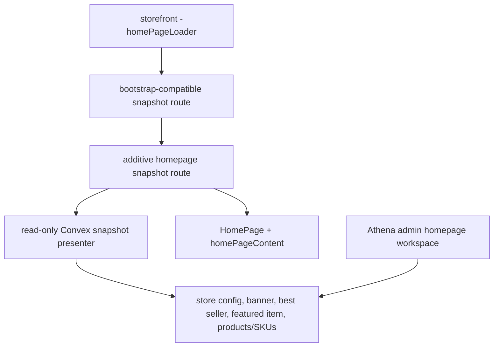
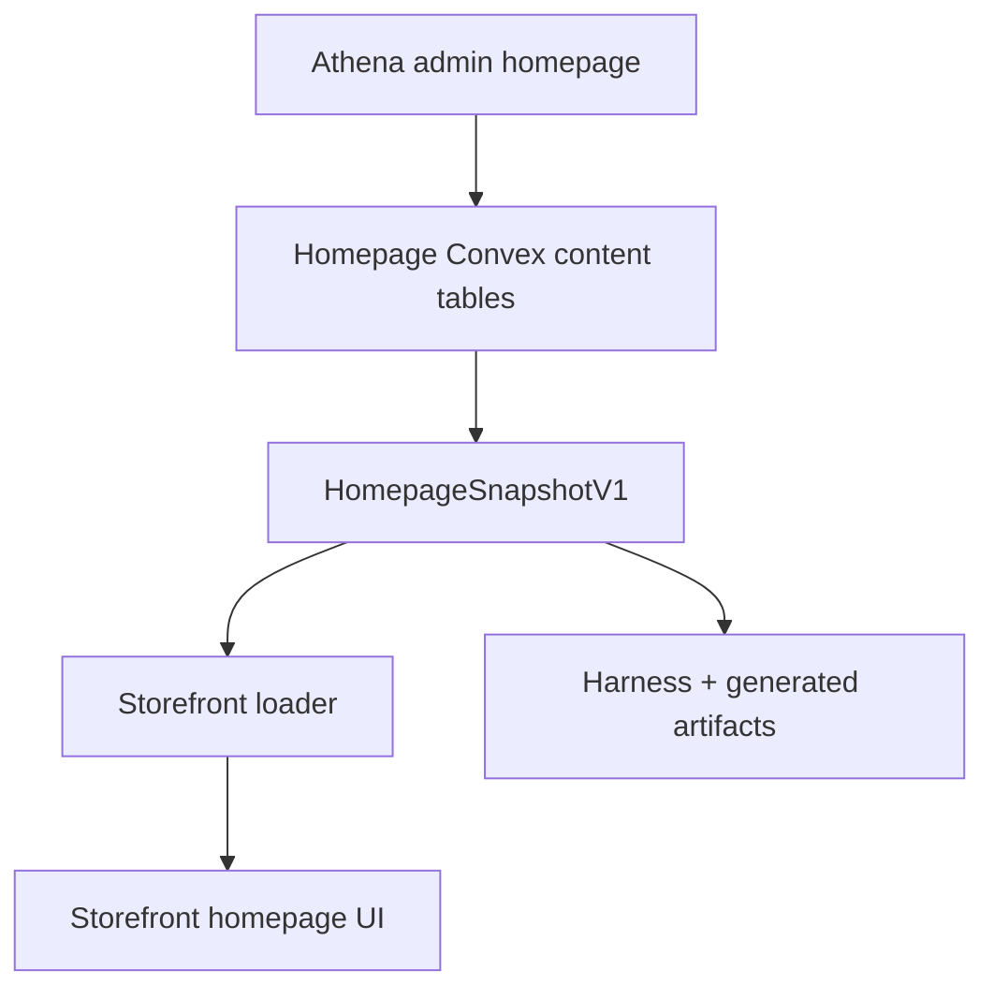

# feat: Add Typed Homepage Snapshot API

## Summary

Add an additive typed homepage snapshot contract for the storefront entry point, then migrate the homepage loader and content rendering onto that contract while preserving existing public endpoints. The plan keeps durable homepage data in the existing store config, banner, best seller, and featured item tables, and treats the work as a projection/API migration rather than a storage migration.

---

## Problem Frame

The homepage is the storefront entry point, but its current first-render data path is split across `/storefront`, `/products/bestSellers`, `/products/featured`, and `/banner-message`, while the admin workspace edits the same concepts through separate Convex queries. Recent homepage UI work also exposed reliability gaps around inactive banner drafts, highlighted/shop-look placement behavior, and minor-unit price display.

---

## Assumptions

*This plan was authored without synchronous user confirmation. The items below are agent inferences that fill gaps in the input -- un-validated bets that should be reviewed before implementation proceeds.*

- The first snapshot is the homepage entry-point snapshot, not just a merchandising snapshot. Its route must own the storefront bootstrap contract, including store context cookies, so the loader has one authoritative first-render contract.
- The first snapshot should include stable first-render homepage content only: store/hero-ready data, active banner, best sellers, highlighted featured content, and the single shop-the-look slot.
- Engagement prompts, upsell reminder state, guest/review modal state, analytics writes, and deferred footer category hydration should stay runtime-owned rather than joining the first snapshot.
- Existing public routes remain stable during this migration; the new snapshot is additive and becomes the homepage's preferred first-render read path without deleting old endpoints.
- No data backfill is required because this is a typed projection over existing tables and store config.

---

## Requirements

- R1. Provide one typed public homepage snapshot API for storefront first-render content without changing the response shape of existing public routes.
- R2. Make the homepage snapshot own the storefront bootstrap contract so downstream bag, checkout, banner, promo, and catalog calls keep store context without requiring a separate first-render store call.
- R3. Keep admin banner editing draft-aware while ensuring public storefront reads expose only active customer-safe banner content.
- R4. Normalize homepage product placement data into a stable customer-facing DTO that does not leak raw Convex document shapes, hidden/internal omission details, or ambiguous money fields.
- R5. Enforce storefront visibility, same-store ownership, archived-product, hidden-SKU, positive-price, and reserved-taxonomy rules across snapshot content.
- R6. Migrate the storefront homepage loader/rendering path onto the snapshot while preserving stable homepage readiness and empty-state behavior.
- R7. Keep the moved admin UI improvements for the Athena homepage workspace, including reusable SKU/product search and highlighted/shop-look placement fixes.
- R8. Prove the contract with focused tests, generated Convex artifacts, Graphify refresh, browser validation of admin and storefront, and the Athena PR gate only after review approval.
- R9. Bound the unauthenticated snapshot response with stable section limits, deterministic ordering, and existing public-route abuse protections.

---

## Scope Boundaries

- This plan does not create a new homepage storage table or move homepage configuration out of `store.config`.
- This plan does not remove `/products/bestSellers`, `/products/featured`, `/banner-message`, or `/storefront`.
- This plan does not move engagement prompts, upsells, review prompts, analytics/context-event writes, or footer category hydration into the snapshot.
- This plan does not deploy to production.

### Deferred to Follow-Up Work

- Snapshot performance indexes such as store/type/rank indexes for placement tables can be added later if production telemetry shows scan pressure; v1 still requires bounded response sizes and deterministic truncation.
- Formal deprecation of old homepage-related public endpoints should be a separate compatibility effort after the storefront no longer depends on them.
- Broader storefront nav/banner hydration can be revisited after the homepage snapshot contract is proven.

---

## Context & Research

### Relevant Code and Patterns

- `packages/athena-webapp/convex/http.ts` wires Hono public routes and should receive the additive snapshot route without mutating existing routes.
- `packages/athena-webapp/convex/http/domains/customerChannel/routes/storefront.ts` owns storefront bootstrap data and cookie side effects.
- `packages/athena-webapp/convex/http/domains/core/routes/products.ts` currently exposes separate best seller and featured reads.
- `packages/athena-webapp/convex/inventory/bannerMessage.ts`, `bestSeller.ts`, `featuredItem.ts`, and `storeConfigV2.ts` are the durable homepage content sources.
- `packages/storefront-webapp/src/routes/-homePageLoader.ts` is the storefront entry point for first-render homepage data.
- `packages/storefront-webapp/src/components/HomePage.tsx` and `packages/storefront-webapp/src/components/home/homePageContent.ts` currently sort and split raw best seller/featured rows into display sections.
- `packages/storefront-webapp/src/api/storefront.ts`, `product.ts`, and `bannerMessage.ts` show existing public wrapper conventions and `{ error: string }` failure handling.
- The moved dirty diff already includes the admin workspace layout, reusable homepage product picker, minor-unit admin price formatting, banner draft editing, and storefront hero/shop-look fallback improvements.

### Institutional Learnings

- `docs/solutions/harness/convex-query-write-boundary-proof-2026-06-18.md`: query-facing paths must stay read-only and must not call write-capable repository code indirectly.
- `docs/solutions/harness/convex-return-validator-contract-proof-2026-06-18.md`: public Convex return validators need executable proof against representative returned values.
- `docs/solutions/logic-errors/athena-pos-quick-add-storefront-visibility-2026-04-25.md`: storefront boundaries must exclude reserved operational taxonomy and preserve cache/key separation.
- `docs/solutions/architecture/athena-storefront-context-event-rollout-2026-06-22.md`: browser-controlled storefront data should be bounded and sanitized before it becomes durable or prompt-facing evidence.

### External References

- None. The repo has established Convex/Hono/storefront patterns for this contract; external research would add little practical value.

---

## Key Technical Decisions

- Add the snapshot as an additive customer-channel route: This protects existing consumers of `/storefront`, `/products/bestSellers`, `/products/featured`, and `/banner-message` while giving the homepage a single preferred contract.
- Own a dedicated `HomepageSnapshotV1` DTO: The public route should expose stable customer-facing fields and explicit minor-unit money names instead of raw Convex documents, enriched `any` rows, or ambiguous `price` fields.
- Make the snapshot the entry-point contract: The route should reuse the storefront bootstrap behavior and set the same required store context cookies that `getStore(false)` provides today. Guest creation behavior should match the explicit route parameters and tests, not happen implicitly as an accidental side effect.
- Split admin draft reads from public active banner reads: Admin needs inactive/draft banner editing; public storefront data should expose only active banner content or `null`.
- Treat this as projection migration, not storage migration: Existing tables and `StoreConfigV2` remain the source of truth; no backfill or data migration is needed for v1.
- Keep homepage readiness independent of merchandising richness: Empty best seller or featured sections should not blank the storefront homepage shell.
- Keep public omissions customer-safe: The response can return empty arrays or `null` singletons, but detailed omission reasons, hidden row IDs, wrong-store references, and reserved taxonomy details must stay server-side or admin-only.
- Bound public sections: The snapshot should cap best seller, featured, and shop-look response sizes with stable ordering before truncation, and rely on existing route/CORS/platform protections for the public endpoint unless implementation discovers a missing guardrail that needs a follow-up.

| Decision Area | Chosen Direction | Rejected Direction | Rationale |
|---|---|---|---|
| API rollout | Additive snapshot route | Replacing old routes in place | Avoids breaking current wrappers and unknown deployed consumers |
| Data ownership | Public DTO presenter | Raw Convex document export | Keeps internal schema drift out of the public contract |
| Banner semantics | Admin draft read + public active read | One shared inactive-capable public query | Prevents inactive drafts from leaking to storefront |
| Store bootstrap | Preserve cookie behavior | Snapshot-only data fetch without cookies | Downstream requests still rely on store cookies |

---

## Open Questions

### Resolved During Planning

- Is a schema migration required? No. The relevant content already exists in store config and homepage placement tables, so the work is an API/projection migration.
- Should old public endpoints be removed now? No. Keep them stable and migrate the homepage onto the additive snapshot first.
- Should engagement prompts and upsells move into the snapshot? No. They are interaction/runtime concerns and should stay out of the first-render content contract.

### Deferred to Implementation

- The exact DTO file location can follow the strongest local import pattern discovered while implementing, as long as the DTO is not tied to Convex `Doc` types.
- The exact numeric section caps can follow existing storefront product-list conventions where present; if no convention exists, choose conservative caps in implementation and document them in tests.

---

## High-Level Technical Design

> *This illustrates the intended approach and is directional guidance for review, not implementation specification. The implementing agent should treat it as context, not code to reproduce.*

---

## Implementation Units

- U1. **Typed snapshot presenter and contract**

**Goal:** Define the read-only homepage snapshot projection over existing homepage content sources.

**Requirements:** R1, R3, R4, R5

**Dependencies:** None

**Files:**
- Create: `packages/athena-webapp/convex/storeFront/homepageSnapshot.ts`
- Modify: `packages/athena-webapp/convex/inventory/bannerMessage.ts`
- Modify: `packages/athena-webapp/convex/inventory/bestSeller.ts`
- Modify: `packages/athena-webapp/convex/inventory/featuredItem.ts`
- Test: `packages/athena-webapp/convex/storeFront/homepageSnapshot.test.ts`
- Test: `packages/athena-webapp/convex/inventory/bannerMessage.test.ts`
- Test: `packages/athena-webapp/convex/inventory/featuredItem.test.ts`

**Approach:**
- Compose a customer-facing snapshot from store config, active banner data, sorted best sellers, sorted regular featured content, and the single shop-look slot.
- Keep the presenter query-safe and read-only; do not persist cleanup or expiry side effects during snapshot reads.
- Split admin draft banner semantics from public active-banner semantics so the moved `BannerMessageEditor` behavior remains available without public leakage.
- Define public banner eligibility at read time: active, displayable nonblank content, and not expired by countdown. Expired active rows should project as `null` without patching during the read.
- Filter archived, hidden, wrong-store, zero-price, missing-SKU, and reserved-taxonomy content before it enters the public snapshot. Public responses should expose only customer-safe empty arrays or `null` values when content is filtered.
- Require placement write-boundary validation for new or changed mutations: referenced product, SKU, category, and subcategory rows must belong to `args.storeId`; best seller product/SKU pairs must match each other; featured placements must have exactly one target kind unless a current documented model rule allows a combination.
- Cap section sizes with deterministic ordering before truncation so the unauthenticated aggregate route remains bounded.
- Use explicit minor-unit money naming in the public DTO.

**Execution note:** Start test-first with active-vs-draft banner, hidden product/SKU, and reserved-taxonomy snapshot scenarios.

**Patterns to follow:**
- `packages/athena-webapp/convex/http/domains/core/routes/products.ts`
- `packages/athena-webapp/convex/http/domains/core/routes/storefrontHidden.test.ts`
- `packages/athena-webapp/convex/inventory/bestSeller.test.ts`
- `docs/solutions/harness/convex-query-write-boundary-proof-2026-06-18.md`

**Test scenarios:**
- Happy path: a store with active hero media, active banner, visible best sellers, regular highlighted content, and one shop-look placement returns populated public sections.
- Edge case: inactive banner draft exists for admin editing but public snapshot exposes no active banner.
- Edge case: active banner with only blank content, or an expired countdown, projects as public `null` without mutating the row.
- Edge case: empty best seller and featured placements return stable empty collections rather than omitted top-level sections.
- Error path: cross-store SKU or product placement is rejected by the changed mutation boundary and never needs public omission metadata to explain it.
- Integration: reserved operational taxonomy such as POS-only or uncategorized categories does not appear in featured category/subcategory snapshot data.
- Integration: section caps truncate deterministically and do not expose hidden/filtered omission details.
- Integration: representative returned values conform to the exported public return validator when the function has explicit returns.

**Verification:**
- The snapshot presenter has focused tests proving visibility, banner, and money-unit behavior.
- Public snapshot reads do not call write-capable database methods.

---

- U2. **Additive public route and bootstrap-safe API boundary**

**Goal:** Expose the typed snapshot through an additive public HTTP route that owns homepage bootstrap semantics without breaking existing endpoints.

**Requirements:** R1, R2, R4, R8, R9

**Dependencies:** U1

**Files:**
- Create: `packages/athena-webapp/convex/http/domains/customerChannel/routes/homepageSnapshot.ts`
- Modify: `packages/athena-webapp/convex/http/domains/customerChannel/routes/index.ts`
- Modify: `packages/athena-webapp/convex/http.ts`
- Test: `packages/athena-webapp/convex/http/domains/customerChannel/routes/homepageSnapshot.test.ts`

**Approach:**
- Add a new customer-channel route for the homepage snapshot while leaving existing product, banner, and storefront routes stable.
- Preserve existing public failure convention with JSON error responses.
- Share the existing storefront bootstrap behavior needed for `organization_id` and `store_id` cookies so the snapshot is the authoritative homepage first-render contract.
- Treat guest creation as explicit behavior tied to the route's accepted query parameters, mirroring current storefront bootstrap semantics rather than creating or rewriting guest cookies accidentally.
- Include a contract version signal in the public response so future snapshot changes can be explicit.
- Keep customer-safe filtering silent in the public DTO; detailed omission diagnostics belong in server tests/logging or admin-only surfaces.

**Execution note:** Add a failing route/contract test before wiring the frontend wrapper.

**Patterns to follow:**
- `packages/athena-webapp/convex/http/domains/customerChannel/routes/storefront.ts`
- `packages/athena-webapp/convex/http/domains/core/routes/bannerMessage.ts`
- `packages/athena-webapp/convex/http/domains/core/routes/products.ts`

**Test scenarios:**
- Happy path: a valid store request receives the snapshot and preserves expected store context behavior.
- Error path: a request without resolvable store context returns the existing public error shape.
- Error path: unsupported or tampered bootstrap parameters do not create guest/store cookies unexpectedly.
- Compatibility: existing `/products/bestSellers`, `/products/featured`, `/banner-message`, and `/storefront` route shapes remain unchanged.
- Integration: the route result matches the snapshot presenter's public DTO and does not expose raw internal documents.

**Verification:**
- The new route is additive, typed, and covered by route-level tests.
- Existing public wrappers continue to parse old endpoints.

---

- U3. **Storefront loader and homepage rendering migration**

**Goal:** Move the storefront homepage first-render content path from piecemeal merchandising calls to the typed snapshot.

**Requirements:** R1, R2, R4, R6

**Dependencies:** U1, U2

**Files:**
- Create: `packages/storefront-webapp/src/api/homepageSnapshot.ts`
- Create: `packages/storefront-webapp/src/lib/queries/homepageSnapshot.ts`
- Modify: `packages/storefront-webapp/src/routes/-homePageLoader.ts`
- Modify: `packages/storefront-webapp/src/routes/-homePageLoader.test.ts`
- Modify: `packages/storefront-webapp/src/components/HomePage.tsx`
- Modify: `packages/storefront-webapp/src/components/home/homePageContent.ts`
- Modify: `packages/storefront-webapp/src/components/home/homePageContent.test.ts`
- Modify: `packages/storefront-webapp/src/components/home/HomeHeroSection.tsx`
- Modify: `packages/storefront-webapp/src/components/home/FeaturedProductsSection.tsx`

**Approach:**
- Add a storefront API wrapper and query key for `HomepageSnapshotV1`.
- Replace the loader's separate `getStore(false)` plus merchandising fan-out with the bootstrap-compatible snapshot request.
- Seed homepage rendering from the snapshot rather than separate best seller and featured React Query calls.
- Preserve the existing readiness shell and hero fallback so merchandising failures or empty content do not blank the homepage.
- Keep engagement prompts, upsells, product reminder, and footer category loading on their current runtime paths.

**Execution note:** Characterize the current loader behavior first, then update tests to prove the new snapshot semantics.

**Patterns to follow:**
- `packages/storefront-webapp/src/api/storefront.ts`
- `packages/storefront-webapp/src/api/product.ts`
- `packages/storefront-webapp/src/lib/queries/product.ts`
- `packages/storefront-webapp/src/routes/-homePageLoader.test.ts`

**Test scenarios:**
- Happy path: loader returns typed snapshot content after store bootstrap and HomePage renders hero, best sellers, highlighted content, and shop-look from snapshot data.
- Edge case: empty snapshot sections still render `storefront-homepage-ready` and omit empty merchandising sections cleanly.
- Error path: partial section omissions inside a successful snapshot keep the homepage shell stable with empty/null section data; non-2xx or network-level snapshot failure follows the existing public error path instead of inventing stale store context.
- Integration: money minor-unit fields from snapshot are displayed through existing storefront currency formatting without double conversion.
- Integration: HomePage no longer requires separate best seller and featured first-render requests.

**Verification:**
- Storefront route and content tests prove snapshot hydration and empty-state behavior.
- Storefront typecheck catches drift between API wrapper, loader, and components.

---

- U4. **Admin homepage integrity and carried workspace UX**

**Goal:** Preserve the moved admin homepage UI/UX improvements already in the worktree, while making banner and placement integrity the required admin scope that protects the public snapshot.

**Requirements:** R3, R5, R7

**Dependencies:** U1

**Files:**
- Modify: `packages/athena-webapp/src/components/homepage/Home.tsx`
- Modify: `packages/athena-webapp/src/components/homepage/HeroSectionTabs.tsx`
- Modify: `packages/athena-webapp/src/components/homepage/BannerMessageEditor.tsx`
- Modify: `packages/athena-webapp/src/components/homepage/BestSellers.tsx`
- Modify: `packages/athena-webapp/src/components/homepage/BestSellersDialog.tsx`
- Modify: `packages/athena-webapp/src/components/homepage/FeaturedSection.tsx`
- Modify: `packages/athena-webapp/src/components/homepage/FeaturedSectionDialog.tsx`
- Modify: `packages/athena-webapp/src/components/homepage/ShopLook.tsx`
- Modify: `packages/athena-webapp/src/components/homepage/ShopLookDialog.tsx`
- Create: `packages/athena-webapp/src/components/homepage/HomepageProductPickerDialog.tsx`
- Test: focused component or Convex tests nearest the changed placement behavior

**Approach:**
- Treat the existing POS-settings-style layout and reusable product/SKU search work as carried diff that should remain consistent, not as new expansion beyond this delivery.
- Required admin UX contract: section order remains Hero, Site banner, Best sellers, Highlighted content, and Shop the Look; each section uses operations-style rows with explicit save/progress/disabled states rather than nested decorative cards.
- Required picker contract: product search supports product-level selection for highlighted/shop-look and SKU-level selection for best sellers; empty, filter-empty, and unavailable product states are visible without allowing invalid saves.
- Keep highlighted content able to add product, category, and subcategory placements; keep shop-look as a single highlighted slot for the v1 DTO and admin flow.
- Ensure admin banner saves can draft inactive content while activation requires displayable content.
- Strengthen placement mutation validation mandatorily for changed create/update paths so admin cannot persist cross-store or invalid target placements that the public snapshot must later filter out.
- Continue using the repo currency formatter for minor-unit product cards.
- Accessibility and responsive requirements: picker dialogs trap focus and restore focus on close; icon-only controls keep accessible labels/tooltips; reorder/remove controls remain keyboard reachable; desktop and mobile widths keep section rows and dialog content from overlapping.

**Execution note:** Use targeted tests around banner and placement integrity before broader UI validation.

**Patterns to follow:**
- Existing operations/POS settings workspace section layout already applied in the moved diff.
- Existing reusable SKU search behavior used by other admin workspaces.
- `packages/athena-webapp/convex/inventory/bestSeller.test.ts`

**Test scenarios:**
- Happy path: admin can add best seller SKU, highlighted product/category/subcategory, and shop-look content through the reusable picker.
- Edge case: inactive banner draft is visible and editable in admin but not public snapshot content.
- Edge case: activating an empty banner is blocked or results in inactive public content.
- Edge case: picker search with no results, invalid filters, or unavailable products leaves the save action disabled with restrained operational copy.
- Error path: remove/reorder failures restore local UI ordering and surface a controlled error state.
- Integration: cross-store product/SKU/category/subcategory placement attempts are rejected at the changed mutation boundary.
- Accessibility: dialog focus behavior and keyboard access for add/remove/reorder controls remain usable on desktop and mobile.

**Verification:**
- Admin homepage TypeScript and focused tests pass.
- Admin UI remains consistent with Athena operations workspace layout conventions.

---

- U5. **Harness, generated artifacts, review, and browser validation**

**Goal:** Refresh generated artifacts and prove the migrated behavior through focused tests, reviewer loops, browser checks, and the final Athena gate.

**Requirements:** R8

**Dependencies:** U1, U2, U3, U4

**Files:**
- Modify: `packages/athena-webapp/convex/_generated/api.d.ts`
- Modify: `scripts/harness-behavior-fixtures/storefront-runtime-api.ts`
- Modify: `scripts/harness-behavior-scenarios.ts` if the first-load fixture needs the new endpoint
- Modify: `graphify-out/GRAPH_REPORT.md`
- Modify: `graphify-out/graph.json`
- Modify: `graphify-out/wiki/index.md`

**Approach:**
- Run the repo's generated-artifact repair path after adding Convex modules/routes.
- Update storefront first-load behavior fixtures so harness coverage exercises the new snapshot endpoint rather than stale product route assumptions.
- Run targeted admin/storefront tests first, then relevant typechecks and lint.
- Use reviewer agents for API contract, correctness, security/reliability, TypeScript, and testing until they report no blocking findings.
- Validate both the admin app and storefront app in browser after local review approval.
- Run `bun run pr:athena` only after reviewer approval and merge readiness.

**Execution note:** Treat this as sensor-only except where harness fixture behavior changes require characterization of the old first-load path.

**Patterns to follow:**
- `docs/solutions/harness/convex-return-validator-contract-proof-2026-06-18.md`
- `docs/solutions/harness/convex-query-write-boundary-proof-2026-06-18.md`
- `scripts/harness-behavior-scenarios.ts`

**Test scenarios:**
- Integration: generated Convex API includes the new snapshot module/route.
- Integration: harness first-load fixture serves the endpoint the storefront now calls.
- Browser: authenticated admin homepage loads, banner draft/editor state is usable, and add-product flows show the reusable picker.
- Browser: storefront homepage loads via the snapshot, renders the hero, and displays visible best seller/highlighted content when available.

**Verification:**
- Focused tests, typechecks, generated-artifact refresh, Graphify rebuild, browser validation, reviewer approval, and `bun run pr:athena` complete before merge.

---

## System-Wide Impact

- **Interaction graph:** Admin edits existing homepage tables and store config; storefront reads the public snapshot; existing legacy public routes stay available.
- **Error propagation:** Snapshot route errors should follow existing public `{ error: string }` behavior. Storefront rendering should preserve a stable homepage shell when merchandising content is empty or unavailable.
- **State lifecycle risks:** Banner activation/draft state must be consumer-specific. Store bootstrap cookies must be owned by the snapshot route for homepage first render.
- **API surface parity:** Old endpoints remain stable. The new route becomes the preferred homepage read contract but not the only available public API.
- **Integration coverage:** Route tests, loader tests, home content tests, harness first-load fixture, and browser validation are all needed because this crosses Convex, Hono, Storefront API wrappers, React Query, and UI rendering.
- **Unchanged invariants:** Store config remains the source of hero and shop-look media; placement tables remain the source of best seller/highlighted ordering; money values remain stored in minor units; public filtering does not disclose hidden/internal rows.

---

## Risks & Dependencies

| Risk | Mitigation |
|------|------------|
| Inactive banner draft leaks to storefront | Split admin draft read from public active-banner snapshot and add tests for both consumers |
| Storefront bootstrap cookies are lost | Make the snapshot route bootstrap-compatible and prove store context cookies in route/browser validation |
| Public DTO leaks internal Convex document details | Define a dedicated snapshot DTO and add route/contract tests |
| Hidden POS-only taxonomy appears in homepage content | Apply storefront-hidden filters and add reserved-taxonomy regression tests |
| Query path accidentally writes during read | Keep presenter query-safe and run focused Convex/query-boundary tests |
| Public omission metadata leaks hidden content | Return customer-safe empty/null sections and keep detailed omission reasons server-side or admin-only |
| Public aggregate route is too expensive | Cap section sizes with deterministic ordering and rely on existing route/platform protections unless implementation identifies a missing guardrail |
| Generated Convex/Graphify drift | Run generated-artifact repair and `bun run graphify:rebuild` after implementation |

---

## Documentation / Operational Notes

- Linear tickets should be tracked as a coordinated integration batch because generated Convex and Graphify artifacts are shared surfaces.
- No production deploy is part of this delivery.
- Browser validation must cover both the authenticated admin app and storefront app before merge readiness.
- The heavy `bun run pr:athena` gate should wait until reviewer agents unanimously approve the diff and the branch is ready for merge.

---

## Sources & References

- Related code: `packages/athena-webapp/convex/http.ts`
- Related code: `packages/athena-webapp/convex/http/domains/customerChannel/routes/storefront.ts`
- Related code: `packages/athena-webapp/convex/inventory/bannerMessage.ts`
- Related code: `packages/athena-webapp/convex/inventory/bestSeller.ts`
- Related code: `packages/athena-webapp/convex/inventory/featuredItem.ts`
- Related code: `packages/storefront-webapp/src/routes/-homePageLoader.ts`
- Related code: `packages/storefront-webapp/src/components/HomePage.tsx`
- Related solution: `docs/solutions/harness/convex-query-write-boundary-proof-2026-06-18.md`
- Related solution: `docs/solutions/harness/convex-return-validator-contract-proof-2026-06-18.md`
- Related solution: `docs/solutions/logic-errors/athena-pos-quick-add-storefront-visibility-2026-04-25.md`
