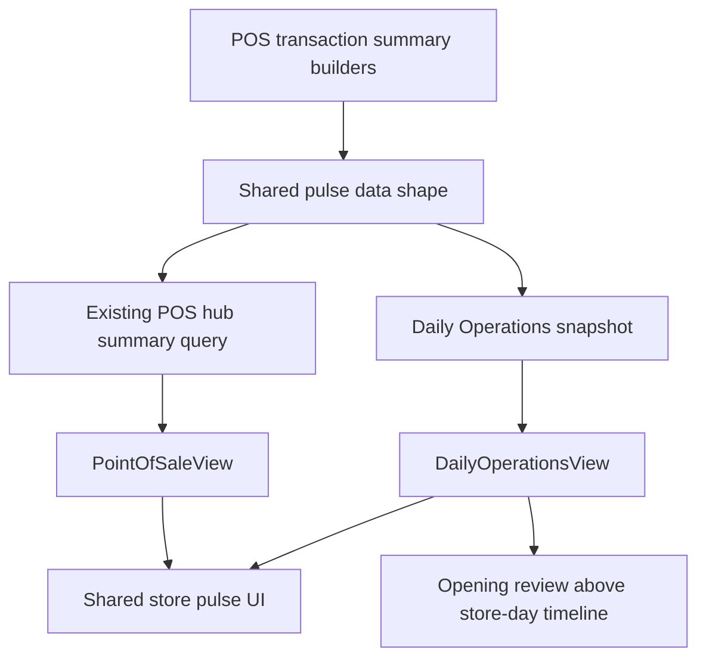

# feat: Bring POS pulse visualizations into Daily Operations

## Summary

This plan brings the POS hub's sales trend chart, top-items list, and payment-mix visualization into Daily Operations by extracting the POS pulse presentation into a shared store-operations component and feeding it from the Daily Operations read model. The opening review panel moves into the desktop right rail above the store-day timeline, with a compact rail layout that preserves Opening Handoff as the owning workflow.

---

## Problem Frame

The POS hub already gives managers a compact operator view of sales trend, items sold, and payment mix, but Daily Operations is the store-day overview where managers reconcile the same facts against opening, closing, and operational timeline evidence. Today those visualizations are isolated to POS, and the Daily Operations opening review occupies the main work area even though the user wants it in the right rail above the timeline on desktop.

---

## Requirements

- R1. Reuse the POS hub visualizations for the Daily Operations surface: same chart, items sold/top-items panel, and payment mix visual language.
- R2. Keep Daily Operations as an aggregate read model over source workflows; do not make it own POS aggregation, Opening Handoff resolution, or EOD Review commands.
- R3. Feed Daily Operations visualizations from server-owned snapshot fields that respect the selected operating date, week/window context, and existing financial redaction boundary.
- R4. Move the opening review section into the right rail on desktop, above the store-day timeline, while preserving mobile/tablet stacking and links into Opening Handoff for full review.
- R5. Preserve existing permissions behavior: non-financial users must not receive hidden sales trend, top-items, payment mix, or comparison data from the query boundary.
- R6. Keep the implementation visually consistent with Athena's operational workspace system: `PageWorkspace*`, `OperationsSummaryMetric`, `FinancialValue`, semantic tokens, restrained copy, and focused browser/visual verification.

---

## Scope Boundaries

- No new analytics route or detached reporting dashboard.
- No new charting library; continue using the existing Recharts plus `ChartContainer` pattern.
- No client-only recomputation of sales, item, payment, or comparison facts from raw transactions.
- No change to manual Opening Handoff strictness or automation manager-review policy.
- No broad redesign of Daily Operations, POS hub navigation, EOD Review, or transaction history.
- No change to the existing POS hub feature-card grid beyond import path adjustments needed for shared visualization extraction.

### Deferred to Follow-Up Work

- Broader store-operations analytics beyond POS pulse: separate feature after the shared component proves useful.
- Making Daily Operations available to POS-only users: separate access-model decision; this plan preserves current protected admin surface behavior and server redaction.
- Replacing the existing POS pulse payment aggregation with the Daily Operations cash-allocation helper everywhere: consider after this work if tests reveal semantic drift.

---

## Context & Research

### Relevant Code and Patterns

- `packages/athena-webapp/src/components/pos/sales-pulse/POSSalesPulseView.tsx`: current POS pulse presentation with `POSStorePulseSection`, chart, top items, payment mix, skeletons, empty states, and role-gated rendering.
- `packages/athena-webapp/src/components/pos/PointOfSaleView.tsx`: current POS hub integration, `storePulseWindow` state, query call to `api.inventory.pos.getTodaySummary`, and non-admin window forcing.
- `packages/athena-webapp/convex/pos/application/queries/getTransactions.ts`: POS pulse summary builder for windows, trend buckets, top items, payment mix, comparison deltas, and busiest hour.
- `packages/athena-webapp/convex/pos/public/transactions.ts`: public POS query boundary with membership checks and POS-only redaction.
- `packages/athena-webapp/src/components/operations/DailyOperationsView.tsx`: target Daily Operations surface, existing `AutomationReviewEvidencePanel`, `PageWorkspaceGrid`, metrics, payment totals, week strip, and store-day timeline rail.
- `packages/athena-webapp/convex/operations/dailyOperations.ts`: authoritative Daily Operations aggregate snapshot and financial redaction boundary.
- `packages/athena-webapp/src/components/common/PageLevelHeader.tsx`: `PageWorkspaceGrid` desktop rail pattern, `PageWorkspaceMain`, and `PageWorkspaceRail`.
- `packages/athena-webapp/docs/agent/design.md`: Athena design thesis and page rhythm; operational surfaces should be calm, dense, source-owned, and token-driven.

### Institutional Learnings

- `docs/solutions/architecture/athena-workspace-metric-card-alignment-2026-06-21.md`: shared KPI contract is `OperationsSummaryMetric`; do not recreate local metric tiles.
- `docs/solutions/logic-errors/athena-pos-operations-metric-redaction-and-cash-allocation-2026-06-21.md`: financial analytics must be redacted at the server query boundary, not only hidden in React.
- `docs/solutions/logic-errors/athena-daily-operations-aggregate-read-model-2026-05-08.md`: Daily Operations aggregates source workflows and links back to owning surfaces.
- `docs/solutions/logic-errors/athena-daily-operations-state-and-eod-review-2026-05-11.md`: Daily Operations state and metrics must come from store-day snapshots and local operating-date boundaries.
- `docs/solutions/architecture/athena-store-day-auto-start-review-2026-06-11.md`: auto-started opening review evidence must remain visible while POS stays unblocked; manual Opening remains strict.

### External References

- None. The repo already has direct Recharts, workspace, permission, and store-day snapshot patterns for this feature.

---

## Key Technical Decisions

- Extract shared store-operations pulse presentation instead of importing POS-owned UI into Daily Operations: this maximizes reuse while avoiding a long-term dependency from operations to POS component internals.
- Extend the Daily Operations snapshot with POS pulse data for the selected store-day/window instead of calling the POS hub query directly: Daily Operations needs historical operating-date semantics and server-owned redaction in the same aggregate response.
- Keep the POS hub using the same shared presentation through a thin adapter: the existing POS behavior should remain visually and behaviorally unchanged.
- Centralize payment-mix allocation before sharing the pulse: POS pulse payment mix should use the same net sale allocation semantics as Daily Operations payment totals, including legacy `paymentMethod` fallback and cash-with-change capping.
- Make the Daily Operations pulse window explicit in route/query state: default to the selected operating date's day window, allow the same exposed user-facing values as the POS pulse where they make sense, and send the selected window to the server so the snapshot is scoped before rendering.
- Move opening review into the rail as a compact evidence panel, not a resolver: the panel should show counts, first few evidence rows, and links into Opening Handoff; it should not resolve or mutate Opening state.
- Preserve right-rail ordering as opening review first, store-day timeline second on desktop; below the `xl` grid breakpoint, the rail stacks after the main work area using existing `PageWorkspaceGrid` behavior.

---

## Open Questions

### Resolved During Planning

- Should Daily Operations call the existing POS hub query directly? No. It would drift from selected historical operating dates and split redaction across two query boundaries.
- Should the full opening review list move into the rail? No. The user explicitly requested the opening review section in the right rail, but the plan keeps it compact because Athena's design docs reserve the main canvas for large review queues and the owning workflow remains Opening Handoff.
- Should this introduce a new visualization library? No. Existing `recharts` and `ChartContainer` already support the POS pulse chart.

### Deferred to Implementation

- Exact shared component file naming: implementation can choose the clearest local name while keeping ownership under a shared store-operations/operations presentation module rather than POS-only naming.
- Exact chart copy for selected historical dates: implementation should keep operator copy calm and use existing current/historical date helpers once the final prop shape is known.

---

## Visual Design Plan

- **Visual thesis:** Extend Athena's calm operational workspace language: quiet raised panels, dense scan-ready metrics, token-driven chart color, and restrained review evidence in the right rail.
- **Content plan:** Daily Operations keeps the existing header and summary metrics, then shows a shared sales pulse section in the main column, workflow status below it, and a right rail ordered as opening review, store-day timeline, then any existing rail-only context.
- **Interaction plan:** Reuse the POS pulse segmented time-window control, top-items pagination, chart tooltip behavior, timeline overflow sheet, and link affordances into Transactions and Opening Handoff; no new decorative motion.
- **Opening review rail variant:** In the 320px desktop rail, the panel should be single-column: title row with warning icon, one short status sentence, two compact count chips in a two-column row, up to three preview evidence rows with source context truncated to one line, an overflow line when more evidence exists, and a full-width `Review all` action at the bottom. The row action for individual evidence items should remain compact and secondary; the full workflow CTA should be the stable primary rail action.

---

## High-Level Technical Design

> *This illustrates the intended approach and is directional guidance for review, not implementation specification. The implementing agent should treat it as context, not code to reproduce.*

The main design is one shared presentation contract with two route-level adapters: POS keeps its existing current-window behavior, while Daily Operations supplies selected store-day/window data from its aggregate snapshot.

---

## Implementation Units

- U1. **Extract shared store pulse presentation**

**Goal:** Move the POS pulse visualizations into a shared component/module that both POS hub and Daily Operations can consume without duplicating chart, top-items, payment-mix, skeleton, empty-state, or metric rendering logic.

**Requirements:** R1, R6

**Dependencies:** None

**Files:**
- Modify: `packages/athena-webapp/src/components/pos/sales-pulse/POSSalesPulseView.tsx`
- Create or modify: `packages/athena-webapp/src/components/operations/store-pulse/StorePulseView.tsx`
- Modify: `packages/athena-webapp/src/components/pos/PointOfSaleView.tsx`
- Test: `packages/athena-webapp/src/components/pos/sales-pulse/POSSalesPulseView.test.tsx`
- Test: `packages/athena-webapp/src/components/pos/PointOfSaleView.test.tsx`

**Approach:**
- Extract the reusable presentation and exported data types into an operations/store-pulse module or similarly shared location.
- Leave a POS-facing wrapper or export in the old path if that keeps current imports and tests stable.
- Keep `OperationsSummaryMetric`, `FinancialValue`, `PageWorkspaceGrid`, `PageWorkspaceMain`, `PageWorkspaceRail`, `ChartContainer`, `ChartTooltip`, and existing POS pulse pagination behavior.
- Avoid introducing a new design system or changing POS hub behavior as part of extraction.

**Patterns to follow:**
- `packages/athena-webapp/src/components/pos/sales-pulse/POSSalesPulseView.tsx`
- `packages/athena-webapp/src/components/operations/OperationsSummaryMetric.tsx`
- `packages/athena-webapp/src/components/common/PageLevelHeader.tsx`

**Test scenarios:**
- Happy path: rendering the POS hub still shows Store pulse, Sales trend, Top items, How customers paid, and the mocked chart.
- Happy path: changing the segmented time window still calls the existing POS hub callback with the selected window.
- Edge case: top-items pagination still shows five rows per page and preserves rank ordering.
- Edge case: loading state keeps stable skeleton layout.
- Error path: non-full-admin POS users still do not see financial chart/detail panels.
- Integration: `PointOfSaleView` still calls the POS summary query with `pulseWindow: "today"` for non-full-admin users.

**Verification:**
- POS hub behavior and tests remain unchanged except for import/module names.
- Shared presentation module has no dependency on POS route state or Daily Operations route state.

---

- U2. **Add Daily Operations POS pulse data to the snapshot**

**Goal:** Extend the Daily Operations server snapshot with the POS pulse data needed for the shared visualizations, scoped to the selected operating date/window, using centralized net payment allocation, and redacted at the query boundary.

**Requirements:** R2, R3, R5

**Dependencies:** U1 for the target data shape, but backend work can be characterized in parallel.

**Files:**
- Modify: `packages/athena-webapp/convex/operations/dailyOperations.ts`
- Modify: `packages/athena-webapp/convex/pos/application/queries/getTransactions.ts`
- Modify: `packages/athena-webapp/convex/operations/paymentTotals.ts` if shared allocation helpers are needed
- Test: `packages/athena-webapp/convex/operations/dailyOperations.test.ts`
- Test: `packages/athena-webapp/convex/pos/application/getTransactions.test.ts`
- Test: `packages/athena-webapp/convex/pos/public/transactions.test.ts`

**Approach:**
- Reuse or expose the existing POS pulse aggregation logic behind a store-day/window-friendly helper instead of duplicating transaction scanning in `dailyOperations.ts`.
- Move POS pulse payment mix onto the centralized net allocation semantics used by Daily Operations payment totals before sharing the pulse data. Cash payments with change should contribute only net sale allocation, and legacy rows with `payments: []` plus `paymentMethod` should still be counted.
- Have `buildDailyOperationsSnapshotWithCtx` include a pulse summary only when `includeFinancialDetails` is true.
- Align Daily Operations ranges with `operatingDate`, `startAt`, `endAt`, `operatingTimezoneOffsetMinutes`, and `weekEndOperatingDate` rather than the POS hub's implicit current-day window.
- Preserve existing `closeSummary.salesTotal`, `closeSummary.paymentTotals`, and `weekMetrics` meanings; the new pulse data is additive.
- Keep legacy `paymentMethod` fallback rows covered and avoid cash/change allocation regressions in both POS hub and Daily Operations consumers.

**Execution note:** Add characterization coverage around current POS pulse payment mix and Daily Operations redaction before changing shared aggregation helpers.

**Patterns to follow:**
- `packages/athena-webapp/convex/operations/dailyOperations.ts`
- `packages/athena-webapp/convex/pos/application/queries/getTransactions.ts`
- `docs/solutions/logic-errors/athena-pos-operations-metric-redaction-and-cash-allocation-2026-06-21.md`

**Test scenarios:**
- Happy path: a full-admin Daily Operations snapshot for a selected operating date includes sales trend, top items, and payment mix for that store-day/window.
- Happy path: payment mix uses net sale allocation for split/cash-with-change transactions and matches Daily Operations payment-total semantics.
- Happy path: historical operating date data buckets into the selected local operating date, not UTC today.
- Edge case: a day with no completed POS sales returns empty pulse panels without breaking existing summary metrics.
- Edge case: legacy completed transactions with `payments: []` and `paymentMethod` still contribute to payment mix and comparisons.
- Error path: a POS-only/member-without-financial-details snapshot omits pulse financial details, top items, payment mix, trend, and comparison data while preserving allowed operational counts.
- Integration: existing POS public summary redaction tests continue to pass after any helper extraction.

**Verification:**
- Daily Operations snapshot remains the single source for Daily Operations page data.
- No browser component receives hidden financial pulse data for roles that should not see it.

---

- U3. **Render shared pulse visualizations on Daily Operations**

**Goal:** Add the shared chart, items sold/top-items, and payment mix visualizations to the Daily Operations main workspace using the new snapshot data and explicit date/window controls.

**Requirements:** R1, R3, R5, R6

**Dependencies:** U1, U2

**Files:**
- Modify: `packages/athena-webapp/src/components/operations/DailyOperationsView.tsx`
- Modify: `packages/athena-webapp/src/routes/_authed/$orgUrlSlug/store/$storeUrlSlug/operations/index.tsx`
- Test: `packages/athena-webapp/src/components/operations/DailyOperationsView.test.tsx`
- Test: `packages/athena-webapp/src/routes/_authed/$orgUrlSlug/store/$storeUrlSlug/operations/sku-activity.test.tsx` only if shared route-search parsing patterns require route-level coverage

**Approach:**
- Add a Daily Operations adapter around the shared pulse presentation that receives `snapshot.storePulse` or equivalent from the aggregate snapshot.
- Add `storePulseWindow` route/search or component state explicitly, with allowed values aligned to the shared presentation's user-facing windows: `today`, `this_week`, `this_month`, and `all_time`.
- Default Daily Operations to `today` as "selected operating date" rather than wall-clock today. For historical operating dates, `today` means that selected store day; broader windows should be resolved relative to the selected operating date by the server.
- Pass the selected pulse window through the Daily Operations query args so Convex scopes trend, top items, payment mix, and comparisons before data reaches React.
- Keep the visualization in the main column so the right rail can remain supporting context.
- Reuse existing Daily Operations date/search helpers and transaction link builders where the visualization links to transaction history.
- Hide or skeletonize the pulse section consistently with the current Daily Operations loading and financial-access states.
- Keep copy operational and restrained: use "Store pulse", "Sales trend", "Top items", and "How customers paid" unless implementation discovers better existing local labels.

**Patterns to follow:**
- `packages/athena-webapp/src/components/operations/DailyOperationsView.tsx`
- `packages/athena-webapp/src/components/pos/sales-pulse/POSSalesPulseView.test.tsx`
- `packages/athena-webapp/docs/agent/design.md`

**Test scenarios:**
- Happy path: Daily Operations renders Store pulse with Sales trend, Top items, How customers paid, and summary metric cards for a full-admin snapshot.
- Happy path: selecting `this_week`, `this_month`, or `all_time` updates Daily Operations query args and renders server-scoped snapshot data for that window.
- Happy path: selected historical operating date pulse data renders without changing existing historical workflow messaging.
- Edge case: historical `today` window scopes to the selected operating date, not wall-clock today.
- Edge case: empty pulse data shows empty states rather than blank space.
- Edge case: loading snapshot keeps the page skeleton stable and does not hide existing primary actions.
- Error path: users without financial details do not see the financial pulse section and do not receive financial pulse data in fixtures.
- Integration: transaction links generated from the pulse section preserve origin and selected operating date search parameters.

**Verification:**
- Daily Operations remains understandable by scanning headings, metrics, and right-rail panels.
- POS pulse visuals match the POS hub component rather than a bespoke Daily Operations clone.

---

- U4. **Move opening review into the desktop right rail above timeline**

**Goal:** Reposition the Daily Operations opening review panel into the rail above the store-day timeline on desktop, using a compact evidence summary that still links to Opening Handoff for full review.

**Requirements:** R2, R4, R6

**Dependencies:** U3 can land before or after this unit, but final layout should reconcile both.

**Files:**
- Modify: `packages/athena-webapp/src/components/operations/DailyOperationsView.tsx`
- Test: `packages/athena-webapp/src/components/operations/DailyOperationsView.test.tsx`

**Approach:**
- Move `AutomationReviewEvidencePanel` invocation from `PageWorkspaceMain` into `PageWorkspaceRail` above the store-day timeline.
- Adjust the panel internals for rail density without redesigning the workflow: single-column content, two compact count chips, at most three preview rows in the rail, one-line truncation for evidence/source text, an overflow message when evidence exceeds the preview, and a full-width "Review all" link into `/operations/opening`.
- Keep the section absent when there is no opening review evidence.
- Preserve `PageWorkspaceGrid` responsive behavior: at `xl`, the panel is in the right rail; below `xl`, it stacks after main content with the rest of the rail.
- Do not move generic attention items into the rail or make the panel resolve review evidence.

**Patterns to follow:**
- `packages/athena-webapp/src/components/common/PageLevelHeader.tsx`
- `packages/athena-webapp/src/components/operations/DailyOpeningView.tsx`
- `docs/solutions/architecture/athena-store-day-auto-start-review-2026-06-11.md`

**Test scenarios:**
- Happy path: when opening review evidence exists, the right rail renders Opening review before Store-day timeline.
- Happy path: Review all links to Opening Handoff with origin/search context and any existing review-tab deep link if supported.
- Happy path: the rail variant renders no more than three preview evidence rows, shows count chips, keeps CTA visible, and reports hidden evidence through overflow copy.
- Edge case: without review evidence, the rail starts with Store-day timeline as it does today.
- Edge case: hidden overflow evidence still reports the hidden count and directs users to Opening Handoff.
- Error path: attention items and close blockers do not move into the rail.
- Integration: timeline preview and overflow sheet still render five events and open the full timeline dialog.

**Verification:**
- Desktop rail ordering satisfies the requested placement.
- Mobile/tablet layout remains coherent because the rail stacks as an existing workspace rail.

---

- U5. **Validate, document, and visually verify the delivered UI**

**Goal:** Run the focused validation ladder and one visual verification pass for the Daily Operations and POS hub surfaces after implementation.

**Requirements:** R1, R4, R5, R6

**Dependencies:** U1, U2, U3, U4

**Files:**
- Modify: `packages/athena-webapp/docs/agent/validation-map.json` only if harness review reports a coverage gap
- Modify: `packages/athena-webapp/docs/agent/validation-guide.md` only if generated harness docs require refresh
- Generated: `graphify-out/GRAPH_REPORT.md` and `graphify-out/graph.json` after code changes via `bun run graphify:rebuild`

**Approach:**
- Run focused component and Convex tests for POS pulse, POS hub integration, Daily Operations UI, Daily Operations snapshot, POS transaction pulse aggregation, and POS public transaction redaction.
- Run changed frontend/Convex lint, TypeScript, build, and the relevant harness review path called out by Athena's testing guide.
- Use existing browser tooling or Playwright to capture: a Daily Operations desktop `xl` screenshot with opening review evidence present above the timeline, a Daily Operations mobile/narrow screenshot showing stacked order, and a POS hub screenshot after extraction proving the reused pulse did not visually regress.
- Explicitly inspect chart labels, rail overflow behavior, and `Review all` CTA visibility during the visual pass.
- Regenerate Graphify after code changes per repo instructions.

**Patterns to follow:**
- `packages/athena-webapp/docs/agent/testing.md`
- `docs/solutions/harness/pr-athena-prepare-validate-proof-2026-06-13.md`

**Test scenarios:**
- Test expectation: none -- this unit is validation and documentation orchestration, with test scenarios owned by U1-U4.

**Verification:**
- Focused tests and required harness gates pass or have clearly documented unrelated failures.
- Visual pass confirms no overlapping text, unreadable chart labels, broken rail ordering, or mobile stacking issues.
- POS hub visual pass confirms the shared extraction did not regress the existing Store pulse section.
- Graphify is rebuilt after code edits.

---

## System-Wide Impact

- **Interaction graph:** Daily Operations will depend on shared POS pulse aggregation and presentation, while POS hub continues to use the same presentation through its current query path.
- **Error propagation:** Missing or empty pulse data should degrade to skeleton/empty panels, not block Daily Operations workflow actions or timeline viewing.
- **State lifecycle risks:** Selected operating date, week window, and local timezone must stay authoritative for Daily Operations; current POS hub windows must remain authoritative for POS.
- **API surface parity:** Public POS summary redaction and Daily Operations snapshot redaction must remain consistent for non-full-admin roles.
- **Integration coverage:** Server tests must prove backend redaction; UI tests alone are insufficient because hidden React panels do not protect query responses.
- **Unchanged invariants:** Daily Operations does not complete Opening Handoff, resolve review evidence, complete EOD Review, or own POS transactions; it remains a source-owned overview and navigation surface.

---

## Risks & Dependencies

| Risk | Mitigation |
|------|------------|
| Shared extraction changes POS hub behavior accidentally | Keep POS tests as characterization before and after extraction; maintain wrapper exports if helpful. |
| Daily Operations leaks financial pulse data to unauthorized users | Add backend redaction tests in `dailyOperations.test.ts`; do not rely on UI hiding. |
| Selected historical date uses today's POS pulse window | Derive Daily Operations pulse from `operatingDate` and snapshot ranges, not the POS hub query's implicit current day. |
| Opening review becomes too dense in the 320px rail | Use compact counts plus short preview rows and preserve "Review all" into Opening Handoff. |
| Payment mix semantics drift from Daily Operations cash allocation | Require the shared pulse payment mix to use centralized net payment allocation semantics and cover legacy fallback plus cash/change cases. |
| Plan creates broad analytics scope creep | Keep active work to POS pulse reuse and rail placement; defer broader analytics. |

---

## Documentation / Operational Notes

- Follow `docs/product-copy-tone.md` for any operator-facing copy changes.
- After code modifications, run `bun run graphify:rebuild` to refresh repo graph artifacts.
- If Convex generated client refs change, refresh through `bunx convex dev --once` from `packages/athena-webapp` when credentials are available; do not hand-edit generated files.
- Include visual verification evidence in the implementation/PR handoff because this changes Daily Operations layout.
- Visual evidence should cover Daily Operations desktop with opening review evidence, Daily Operations mobile stacking, and POS hub after shared pulse extraction.

---

## Sources & References

- Related code: `packages/athena-webapp/src/components/pos/sales-pulse/POSSalesPulseView.tsx`
- Related code: `packages/athena-webapp/src/components/pos/PointOfSaleView.tsx`
- Related code: `packages/athena-webapp/src/components/operations/DailyOperationsView.tsx`
- Related code: `packages/athena-webapp/convex/operations/dailyOperations.ts`
- Related code: `packages/athena-webapp/convex/pos/application/queries/getTransactions.ts`
- Related docs: `packages/athena-webapp/docs/agent/design.md`
- Related docs: `packages/athena-webapp/docs/agent/testing.md`
- Related solution: `docs/solutions/logic-errors/athena-pos-operations-metric-redaction-and-cash-allocation-2026-06-21.md`
- Related solution: `docs/solutions/logic-errors/athena-daily-operations-aggregate-read-model-2026-05-08.md`
- Related solution: `docs/solutions/logic-errors/athena-daily-operations-state-and-eod-review-2026-05-11.md`
- Related solution: `docs/solutions/architecture/athena-store-day-auto-start-review-2026-06-11.md`
