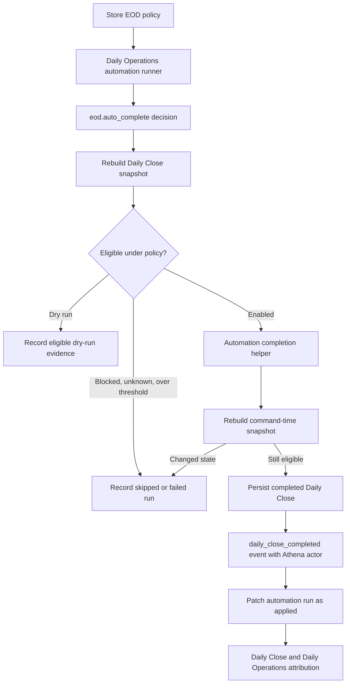
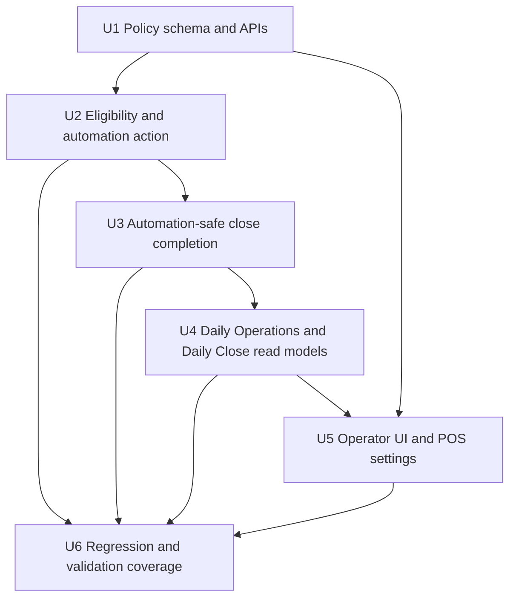

# feat: Add EOD Review Automation Completion

## Summary

Add a policy-gated EOD Review completion path that lets Athena complete clean store days and narrowly-approved low-risk review days as an explicit automation actor. The implementation extends the existing Daily Operations automation ledger, preserves manual manager approval semantics, and surfaces completion attribution in Daily Close, Daily Operations, and POS settings.

---

## Problem Frame

Daily Operations already prepares EOD Review through `eod.prepare`, but completion still requires a human manager proof even when the store day is clean or the only review items fall inside a configured low-risk policy. Athena needs to close those low-risk days without pretending a manager approved them, while keeping the close record, report snapshot, automation run, and operational event audit trail trustworthy.

---

## Requirements

- R1. Add a distinct Daily Operations automation action for EOD completion; do not overload `eod.prepare`.
- R2. Athena may complete clean EOD Reviews when the store policy is enabled, the EOD completion window is open, and the command-time close snapshot has no blockers, no review items, and no carry-forward items.
- R3. Athena may complete low-risk EOD Reviews only when every review item is in an explicitly allowed policy category and within configured thresholds.
- R4. Hard blockers remain hard stops: open or closing register sessions, pending approvals, unresolved POS sessions, invalid operating dates/ranges, superseded/reopened lifecycle conflicts, existing carry-forward items, and unknown review categories prevent automation completion.
- R5. Manual EOD completion keeps the existing manager approval proof contract; automation completion uses automation policy evidence instead of a fake approval proof or fake staff profile.
- R6. Automated completion must persist durable attribution on the completed close/report evidence and record a linked `automationRun` plus `daily_close_completed` operational event.
- R7. Daily Close, Daily Operations, and Daily Close History must show calm operator-facing Athena attribution without raw backend codes, manager-approval language, or financial/review detail leaks to users who lack the existing manager or financial-detail permissions.
- R8. Full admins can configure EOD automation policy and thresholds from POS settings; non-admins cannot view or save this policy.
- R9. Dry-run and skipped automation decisions persist structured decision evidence that explains why Athena did or did not complete the review, with read-side redaction preserving existing EOD financial-detail access boundaries.
- R10. Reopening an Athena-completed close preserves the historical automation attribution while returning the active close to the existing human review/completion flow.
- R11. Athena may only complete EOD Reviews after the configured local EOD completion window opens; outside-window runs record skipped or dry-run evidence and do not mutate Daily Close.

---

## Scope Boundaries

- This plan does not add LLM judgement or probabilistic review. Eligibility is deterministic and policy-based.
- This plan does not auto-create carry-forward work items or auto-complete days that already have carry-forward items.
- This plan does not soften blockers, pending approvals, open sessions, or unknown review categories.
- This plan does not remove manager approval from manual EOD completion or reopen.
- This plan does not rebuild Daily Close, Cash Controls, POS sessions, or the Operations queue.
- This plan does not add external notifications or Slack/email alerts.

### Deferred to Follow-Up Work

- Broader review categories beyond initial `cash_variance` and `voided_sale` policy checks.
- Per-store advanced approval routing, such as "notify manager after Athena closes."
- A dedicated automation history drill-down surface outside the existing Daily Operations/Daily Close panels.
- Intelligence-layer recommendations for adjusting low-risk thresholds from historical outcomes.

---

## Context & Research

### Relevant Code and Patterns

- `packages/athena-webapp/convex/operations/dailyOperationsAutomation.ts` owns the existing `daily_operations` automation actions. `opening.auto_start` can apply a mutation, while `eod.prepare` is intentionally preparation-only.
- `packages/athena-webapp/convex/automation/actionRegistry.ts`, `packages/athena-webapp/convex/automation/automationFoundation.ts`, and `packages/athena-webapp/convex/automation/runLedger.ts` provide the action definition, policy evaluation, idempotency, run recording, and outcome patching patterns.
- `packages/athena-webapp/convex/schemas/automation.ts` already models generic `automationPolicy` and `automationRun` rows, with Opening-specific optional policy fields that should not be reused for EOD completion.
- `packages/athena-webapp/convex/operations/dailyClose.ts` is the authoritative EOD snapshot and completion boundary. It re-reads readiness, rejects blockers, requires all review keys to be acknowledged, validates carry-forward work, and consumes manager proof for manual completion.
- `packages/athena-webapp/convex/schemas/operations/dailyClose.ts` stores durable completed close data through `reportSnapshot`, `reviewedItemKeys`, `carryForwardWorkItemIds`, and human completion fields. It currently lacks automation completion attribution.
- `packages/athena-webapp/convex/schemas/operations/operationalEvent.ts` already supports `actorType: "automation"`, `automationRunId`, `automationPolicyVersion`, and `automationDecisionReason`.
- `packages/athena-webapp/src/components/operations/DailyOpeningView.tsx` has the closest UI precedent: automation attribution renders as Athena and manager review evidence remains visible after automation acts.
- `packages/athena-webapp/src/components/operations/DailyCloseView.tsx` and `packages/athena-webapp/src/components/operations/DailyOperationsView.tsx` already normalize automation status copy and suppress stale skipped/dry-run rows when lifecycle state is primary.
- `packages/athena-webapp/src/components/pos/settings/POSSettingsView.tsx` exposes Opening automation to full admins and should be extended with a distinct EOD completion policy section.

### Institutional Learnings

- `docs/solutions/architecture/athena-automation-foundation-2026-06-08.md`: automation must be policy-driven, auditable through `automationRun`, and represented as Athena rather than a staff profile.
- `docs/solutions/architecture/athena-store-day-auto-start-review-2026-06-11.md`: automation may move lifecycle state forward only when policy allows it, while preserving unresolved/review evidence instead of claiming it was resolved by a human.
- `docs/solutions/logic-errors/athena-daily-operations-state-and-eod-review-2026-05-11.md`: Daily Operations and EOD UI state must come from store-day snapshots, not route context, stale labels, or local inference.
- `docs/solutions/logic-errors/athena-daily-close-store-day-boundary-2026-05-07.md`: EOD completion is store-day scoped and must revalidate readiness at command time.
- `docs/solutions/logic-errors/athena-cash-controls-closeout-review-ia-2026-06-08.md`: cash review evidence must be decision-grade and value-first.
- `docs/product-copy-tone.md`: operator-facing copy should be calm, clear, restrained, operational, and normalized before it reaches the UI.

### External References

- None. Local Athena patterns are the source of truth for Convex automation, Daily Operations, approval boundaries, and operator copy.

---

## Key Technical Decisions

- **Use a distinct action, `eod.auto_complete`:** Completion has a different mutation boundary and risk profile from `eod.prepare`. Keeping them separate preserves the existing audit meaning of preparation-only runs.
- **Model automation authorization separately from manager approval:** Manual completion still requires `approvalProofId`; automation completion records policy evidence, not a fake approval proof or fake manager.
- **Persist completion attribution on the close/report record:** Operational events are audit evidence, but completed-close views need attribution without reconstructing it from event history. Add automation completion metadata to the durable close/report shape.
- **Make timing an explicit policy boundary:** EOD completion only runs after a configured local completion window, such as "after 8:00 PM store local time" or a configured offset from expected close. Outside-window decisions are auditable skips, not eligible completions.
- **Add structured run decision evidence:** Extend `automationRun`/`runLedger` with durable EOD decision evidence instead of squeezing item-level eligibility into `decisionReason`, `sourceSubjects`, or `snapshotCounts`.
- **Keep low-risk policy explicit and narrow:** Initial policy can allow clean days, cash variance within an absolute threshold, and voided sale count/total within configured thresholds. Unknown categories remain in human review.
- **Revalidate at apply time:** The automation decision and the completion helper must rebuild the Daily Close snapshot immediately before mutation so races cannot close a now-blocked day.
- **Skip any carry-forward in v1:** Carry-forward creation and existing carry-forward completion both introduce judgement and follow-up assignment. Any `snapshot.carryForwardItems.length > 0` or non-zero carry-forward count makes the day ineligible for Athena completion in this iteration.
- **Expose EOD policy beside, not inside, Opening auto-start controls:** POS settings should make the higher-risk EOD completion boundary visually and semantically distinct.
- **Keep lifecycle state primary in UI:** Completed EOD remains primary over stale skipped/dry-run automation rows, while applied automation attribution remains visible.

---

## Open Questions

### Resolved During Planning

- **Should EOD completion reuse `eod.prepare`?** No. Add a distinct completion action so preparation and lifecycle mutation remain auditable.
- **Should automation satisfy manager approval?** No. Automation uses policy evidence and Athena actor metadata; manager proof remains human-only.
- **Which review categories are low-risk in v1?** Start with `cash_variance` and `voided_sale` only, each gated by explicit thresholds. Unknown categories always require human review.
- **Should automation complete days with carry-forward items?** No. Carry-forward creation and existing carry-forward items stay human for this iteration.
- **When may Athena complete an EOD Review?** Only after the configured local EOD completion window opens. The scheduler may check earlier, but early checks must record outside-window skip/dry-run evidence and cannot close.
- **Should UI say "manager approved"?** No. It should say Athena completed the EOD Review under store policy and keep review evidence attached.

### Deferred to Implementation

- Exact default numeric thresholds should be conservative and may be tuned during implementation after inspecting existing sample data and tests.
- The final persisted metadata field names should follow generated Convex type conventions after schema changes are made.
- The default EOD completion window should be conservative and store-local; implementation should choose the exact default after inspecting existing store-hours/settings data.

---

## High-Level Technical Design

> *This illustrates the intended approach and is directional guidance for review, not implementation specification. The implementing agent should treat it as context, not code to reproduce.*

### Policy Mode Matrix

| Policy mode | Clean day | Low-risk review day | Blocked/high-risk day |
| --- | --- | --- | --- |
| Disabled | Record disabled/no mutation | Record disabled/no mutation | Record disabled/no mutation |
| Dry run | Record eligible evidence/no mutation after window opens; record outside-window evidence before then | Record eligible evidence/no mutation after window opens; record outside-window evidence before then | Record skipped reason/no mutation |
| Enabled | Complete with Athena attribution only after window opens | Complete with policy-reviewed evidence only after window opens | Record skipped/failure reason/no mutation |

---

## Implementation Units

- U1. **Add EOD Completion Policy Shape**

**Goal:** Add typed store-scoped configuration for EOD completion without reusing Opening-specific policy fields.

**Requirements:** R1, R3, R4, R8, R9, R11

**Dependencies:** None

**Files:**
- Modify: `packages/athena-webapp/convex/schemas/automation.ts`
- Modify: `packages/athena-webapp/convex/automation/runLedger.ts`
- Modify: `packages/athena-webapp/convex/operations/dailyOperationsAutomation.ts`
- Test: `packages/athena-webapp/convex/operations/dailyOperationsAutomation.test.ts`

**Approach:**
- Add EOD-specific policy fields for completion mode, clean-day enablement, cash variance threshold, voided-sale count threshold, voided-sale total threshold, timezone offset, pause state, and rollout notes.
- Add EOD completion timing fields for the store-local completion window and validation rules for local time evaluation.
- Add a structured `automationRun` decision-evidence shape for EOD completion, including eligible item keys, rejected item keys, category counts, threshold summaries, timing-window status, carry-forward status, and source snapshot fingerprint or equivalent stable evidence.
- Add normalizers/defaults that keep EOD completion disabled until a policy row explicitly enables it.
- Add query/mutation helpers for loading and saving EOD completion policy with full-admin access, mirroring the Opening policy access pattern while keeping the field names and semantics separate.
- Preserve duplicate-policy failure behavior; ambiguous policy rows should fail closed rather than choose a row silently.

**Execution note:** Add policy normalization tests before exposing settings UI.

**Patterns to follow:**
- `packages/athena-webapp/convex/automation/runLedger.ts`
- `packages/athena-webapp/convex/operations/dailyOperationsAutomation.ts`
- `packages/athena-webapp/src/components/pos/settings/POSSettingsView.tsx`

**Test scenarios:**
- Happy path: full-admin policy save persists disabled, dry-run, and enabled modes with EOD threshold fields.
- Happy path: absent policy returns conservative disabled defaults.
- Happy path: run ledger accepts structured EOD decision evidence without relying on raw decision strings.
- Edge case: threshold values below zero, non-integer counts, or invalid timezone offsets fail validation.
- Edge case: invalid or missing completion-window configuration fails closed.
- Edge case: duplicate EOD policy rows for a store/action are reported as ambiguous and do not enable automation.
- Error path: non-full-admin access cannot read or update EOD completion policy.

**Verification:**
- EOD policy can be configured independently from Opening auto-start, and an absent or invalid policy cannot complete an EOD Review.

---

- U2. **Add EOD Auto-Complete Eligibility Decision**

**Goal:** Define the deterministic decision boundary for clean and low-risk EOD Reviews.

**Requirements:** R1, R2, R3, R4, R9, R11

**Dependencies:** U1

**Files:**
- Modify: `packages/athena-webapp/convex/operations/dailyOperationsAutomation.ts`
- Modify: `packages/athena-webapp/convex/automation/actionRegistry.ts`
- Test: `packages/athena-webapp/convex/operations/dailyOperationsAutomation.test.ts`

**Approach:**
- Register `eod.auto_complete` as a distinct Daily Operations automation action with an EOD completion mutation boundary.
- Build eligibility from the server Daily Close snapshot and policy config.
- Check the store-local EOD completion window before clean-day or low-risk eligibility can become actionable.
- Treat any blocker as a hard skip.
- Treat any existing carry-forward item or non-zero carry-forward count as a hard skip for v1.
- Treat clean days as eligible when clean-day completion is enabled.
- Treat review days as eligible only when all review items are allowlisted and each item's evidence is inside configured thresholds.
- Persist eligible item keys, rejected item keys, category counts, threshold summaries, timing status, carry-forward status, source subjects, and snapshot counts in structured run decision evidence.
- Keep `eod.prepare` behavior unchanged.

**Execution note:** Implement eligibility as a focused helper with table-driven tests before wiring it to mutation apply.

**Patterns to follow:**
- `packages/athena-webapp/convex/operations/dailyOperationsAutomation.ts`
- `packages/athena-webapp/convex/operations/dailyClose.ts`

**Test scenarios:**
- Happy path: clean day with enabled policy returns eligible evidence for `eod.auto_complete`.
- Happy path: cash variance under absolute threshold returns eligible with the variance item key.
- Happy path: voided sale count and total within thresholds returns eligible with voided sale item keys.
- Edge case: otherwise clean day before the EOD completion window records outside-window evidence and does not apply.
- Edge case: at-window and after-window local times both permit eligibility when all other gates pass.
- Edge case: store timezone offset and local operating date are used instead of server wall-clock date.
- Edge case: open register session records a hard-blocked skipped decision.
- Edge case: closing register session records a hard-blocked skipped decision.
- Edge case: pending approval records a hard-blocked skipped decision.
- Edge case: unresolved POS session records a hard-blocked skipped decision.
- Edge case: invalid operating date or date range records a failed/skipped decision.
- Edge case: reopened or superseded lifecycle conflict records a hard-blocked skipped decision.
- Edge case: existing carry-forward items record a skipped decision and do not complete.
- Edge case: unknown review category records a hard-blocked skipped decision.
- Edge case: zero thresholds allow clean days but reject all review items.
- Edge case: negative cash variance and positive cash variance both compare by absolute value.
- Edge case: a mixed review set is rejected when any item is unknown or over threshold.
- Error path: invalid operating date records a failed/skipped decision and does not apply.
- Integration: `eod.prepare` still records preparation and is not converted into completion.

**Verification:**
- Eligibility decisions are deterministic, explainable, and narrow enough for reviewers to validate from the run evidence.

---

- U3. **Add Automation-Safe Daily Close Completion**

**Goal:** Let Athena complete eligible EOD Reviews without weakening the manual approval-proof contract.

**Requirements:** R2, R3, R4, R5, R6, R9, R10

**Dependencies:** U2

**Files:**
- Modify: `packages/athena-webapp/convex/operations/dailyClose.ts`
- Modify: `packages/athena-webapp/convex/schemas/operations/dailyClose.ts`
- Modify: `packages/athena-webapp/convex/operations/dailyOperationsAutomation.ts`
- Test: `packages/athena-webapp/convex/operations/dailyClose.test.ts`
- Test: `packages/athena-webapp/convex/operations/dailyOperationsAutomation.test.ts`

**Approach:**
- Extract the common persistence portion of completion so human and automation paths share report snapshot creation, current-close marking, and operational event recording.
- Keep `completeDailyCloseWithCtx` requiring manager proof for human callers.
- Add an internal automation completion path that accepts an `automationRunId`, policy version, decision reason, and policy-reviewed item keys.
- Rebuild the Daily Close snapshot immediately before mutation and reject completion if eligibility changed after the initial automation decision.
- Reject completion if the command-time snapshot has any carry-forward items or the local completion window is no longer satisfied.
- Persist automation attribution on `dailyClose` and `reportSnapshot.closeMetadata`, including actor type, automation run id, policy version, decision reason, and policy-reviewed item keys.
- Record `daily_close_completed` with `actorType: "automation"` and no approval proof metadata.
- Patch the `automationRun` to `applied` only after the completed close and operational event are available.
- If the close is already completed by a human, record a no-op/skipped outcome and preserve human attribution.
- Preserve reopen/supersede behavior so historical Athena-completed snapshots stay immutable after reopen.

**Execution note:** Characterize the existing human completion tests before refactoring shared persistence.

**Patterns to follow:**
- `packages/athena-webapp/convex/operations/dailyClose.ts`
- `packages/athena-webapp/convex/operations/operationalEvents.ts`
- `packages/athena-webapp/convex/operations/dailyOpening.ts`

**Test scenarios:**
- Happy path: clean enabled policy completes EOD, creates one completed close, records one operational event, and patches the run as applied.
- Happy path: low-risk review completion persists policy-reviewed item keys and reviewed item snapshots.
- Edge case: a blocker appears between decision and apply; automation does not complete and records the changed-state outcome.
- Edge case: carry-forward appears between decision and apply; automation does not complete and records the changed-state outcome.
- Edge case: command-time completion window is not satisfied; automation does not complete.
- Edge case: human already completed the close; automation records no-op/skipped and does not overwrite attribution.
- Edge case: duplicate scheduler replay with the same idempotency key does not create a second completed close or duplicate event.
- Edge case: already-applied automation run is treated as terminal and does not reapply.
- Edge case: retry after close/event persistence but before run patching reconciles to one close, one event, and an applied or equivalent terminal run outcome.
- Edge case: a reopened/superseded close is not auto-completed.
- Error path: automation cannot pass an approval proof and be treated as manager approval.
- Error path: human completion without proof still returns `approval_required`.
- Integration: reopening an Athena-completed close preserves historical automation metadata and requires human completion for the active reopened close.

**Verification:**
- Automated completion has its own auditable authorization path, while manual completion behavior remains unchanged.

---

- U4. **Extend Daily Operations And Daily Close Read Models**

**Goal:** Surface EOD auto-completion status and attribution from backend snapshots instead of UI inference.

**Requirements:** R6, R7, R9, R10

**Dependencies:** U3

**Files:**
- Modify: `packages/athena-webapp/convex/operations/dailyClose.ts`
- Modify: `packages/athena-webapp/convex/operations/dailyOperations.ts`
- Modify: `packages/athena-webapp/convex/operations/dailyOperationsAutomation.ts`
- Test: `packages/athena-webapp/convex/operations/dailyClose.test.ts`
- Test: `packages/athena-webapp/convex/operations/dailyOperations.test.ts`

**Approach:**
- Include automation completion metadata in `getDailyCloseSnapshot`, completed history list/detail, and Daily Operations automation status output.
- Prefer applied `eod.auto_complete` status for completed-by-Athena views while keeping stale skipped/dry-run rows out of first-glance completed state.
- Preserve existing manager/financial-detail redaction when returning policy-reviewed evidence, threshold summaries, cash variance amounts, voided-sale totals, item snapshots, and source evidence. Users without access can see that Athena acted under policy, but not restricted financial details.
- Keep completed lifecycle state primary; automation evidence is attribution, not a separate lifecycle.
- Preserve source links back to Daily Close and source review evidence.
- Ensure read-model queries do not mutate run ledger or close state.

**Patterns to follow:**
- `packages/athena-webapp/convex/operations/dailyOperations.ts`
- `packages/athena-webapp/convex/operations/dailyClose.ts`
- `docs/solutions/logic-errors/athena-daily-operations-state-and-eod-review-2026-05-11.md`

**Test scenarios:**
- Happy path: completed Athena close snapshot includes automation attribution and policy-reviewed evidence.
- Happy path: Daily Operations automation panel receives applied EOD auto-complete status with source link.
- Happy path: manager/financial-detail users can see permitted policy-reviewed evidence and threshold summaries.
- Edge case: users without financial-detail access see Athena attribution and safe summary copy, but restricted cash variance amounts, voided-sale totals, item snapshots, and source evidence are redacted.
- Edge case: stale skipped/dry-run runs do not hide or downgrade a completed close.
- Edge case: completed human close remains human-attributed even if later automation skipped.
- Error path: missing automation event/run data degrades to completed close state without raw backend errors.
- Integration: historical detail returns immutable policy-reviewed item evidence even after source transactions change.

**Verification:**
- Backend snapshots provide every UI fact needed for attribution, status, links, and evidence without route-origin inference.

---

- U5. **Add Operator UI And Settings For EOD Automation**

**Goal:** Make automated completion visible, configurable, and understandable to operators and managers.

**Requirements:** R7, R8, R9, R10

**Dependencies:** U1, U4

**Files:**
- Modify: `packages/athena-webapp/src/components/pos/settings/POSSettingsView.tsx`
- Modify: `packages/athena-webapp/src/components/operations/DailyCloseView.tsx`
- Modify: `packages/athena-webapp/src/components/operations/DailyOperationsView.tsx`
- Modify: `packages/athena-webapp/src/components/operations/DailyCloseHistoryView.tsx`
- Test: `packages/athena-webapp/src/components/pos/settings/POSSettingsView.test.tsx`
- Test: `packages/athena-webapp/src/components/operations/DailyCloseView.test.tsx`
- Test: `packages/athena-webapp/src/components/operations/DailyOperationsView.test.tsx`
- Test: `packages/athena-webapp/src/components/operations/DailyCloseHistoryView.test.tsx`

**Approach:**
- Add a distinct EOD completion automation section under full-admin POS settings, separate from Opening auto-start.
- Provide controls for disabled/dry-run/enabled mode and conservative low-risk thresholds.
- Use copy that distinguishes "completed by Athena under store policy" from manager approval.
- Show completed-by-Athena attribution in Daily Close and Daily Close History.
- Show policy-reviewed evidence without saying Athena resolved or manager-approved those items, and only render restricted financial/review details when the read model says the current user may see them.
- Extend Daily Operations automation messages to handle applied EOD auto-completion and source links.
- Keep existing completed-state, reopen, and history affordances primary.

**Patterns to follow:**
- `packages/athena-webapp/src/components/operations/DailyOpeningView.tsx`
- `packages/athena-webapp/src/components/operations/DailyCloseView.tsx`
- `packages/athena-webapp/src/components/operations/DailyOperationsView.tsx`
- `docs/product-copy-tone.md`

**Test scenarios:**
- Happy path: full admin sees and saves EOD automation policy independently from Opening auto-start.
- Happy path: Daily Close completed view shows Athena attribution and policy-reviewed evidence.
- Happy path: Daily Operations automation panel says Athena completed EOD Review under store policy.
- Edge case: non-admin users do not see EOD automation controls.
- Edge case: non-manager or non-financial-detail users see safe Athena attribution but not restricted threshold amounts or review item snapshots.
- Edge case: completed human close does not display Athena attribution.
- Error path: failed settings save shows normalized copy and does not expose raw backend text.
- Integration: source links from automation evidence navigate back to Daily Close or source workflow with existing origin handling.

**Verification:**
- Operators can understand what Athena did, why it did or did not complete the review, and where to inspect the evidence.

---

- U6. **Round Out Validation, Generated Artifacts, And Solution Note**

**Goal:** Keep the broad automation change reviewable, graph-current, and reusable for future Athena automation work.

**Requirements:** R1, R4, R5, R6, R9

**Dependencies:** U2, U3, U4, U5

**Files:**
- Create: `docs/solutions/architecture/athena-eod-review-automation-completion-2026-06-22.md`
- Modify: `graphify-out/`
- Modify: `packages/athena-webapp/convex/_generated/`
- Test: `packages/athena-webapp/convex/operations/dailyOperationsAutomation.test.ts`
- Test: `packages/athena-webapp/convex/operations/dailyClose.test.ts`
- Test: `packages/athena-webapp/convex/operations/dailyOperations.test.ts`
- Test: `packages/athena-webapp/src/components/operations/DailyCloseView.test.tsx`
- Test: `packages/athena-webapp/src/components/operations/DailyOperationsView.test.tsx`
- Test: `packages/athena-webapp/src/components/pos/settings/POSSettingsView.test.tsx`

**Approach:**
- Add or update generated Convex API artifacts after schema/API changes.
- Rebuild Graphify after code changes per repo instruction.
- Add a solution note capturing the final automation boundary, low-risk policy shape, and "no fake approval proof" rule.
- Validate focused Convex and UI tests before the repo-wide PR validation ladder.
- Include the changed public Convex return validators in proof coverage where return shapes expand.

**Patterns to follow:**
- `docs/solutions/architecture/athena-automation-foundation-2026-06-08.md`
- `docs/solutions/architecture/athena-store-day-auto-start-review-2026-06-11.md`
- `packages/athena-webapp/docs/agent/testing.md`

**Test scenarios:**
- Integration: generated Convex API exposes the new policy functions and any widened snapshot fields.
- Integration: generated Convex API exposes the structured automation-run evidence field used by dry-run/skipped/applied decisions.
- Integration: inferential review proof covers changed public Convex return validators.
- Integration: Graphify artifacts match the changed code graph.
- Test expectation: no separate UI browser validation is required unless implementation changes layout beyond the planned settings and attribution states.

**Verification:**
- The implementation is ready for PR review with focused tests, generated artifacts, Graphify, and a reusable solution note updated together.

---

## System-Wide Impact

- **Interaction graph:** Scheduled Daily Operations automation, `automationPolicy`, `automationRun`, Daily Close completion, operational events, Daily Operations snapshots, POS settings, Daily Close, and Daily Close History all participate in the new flow.
- **Error propagation:** Eligibility failures should record safe automation outcomes and show normalized operator copy. Raw exception text belongs in server error metadata, not UI.
- **State lifecycle risks:** The riskiest states are command-time races, already-completed days, reopened/superseded closes, and partial application before run patching. The plan mitigates these with snapshot revalidation, idempotency, and immutable report snapshots.
- **API surface parity:** Public Convex return shapes for Daily Close, Daily Operations, and policy settings may widen and need matching validators/tests.
- **Read-side data access:** Widened automation evidence must preserve existing financial-detail redaction for Daily Close, Daily Close History, and Daily Operations. Attribution can be broadly visible; restricted amounts, thresholds, item snapshots, and source evidence cannot.
- **Integration coverage:** Unit tests alone are not enough; cross-layer tests must prove automation policy, completion persistence, run ledger patching, and UI attribution agree.
- **Unchanged invariants:** Manual EOD completion still requires manager proof; blockers still prevent close; completed report snapshots remain immutable; Daily Operations state still comes from server snapshots.

---

## Risks & Dependencies

| Risk | Mitigation |
| --- | --- |
| Automation is mistaken for manager approval | Use explicit Athena actor metadata and avoid approval wording or fake approval proof fields. |
| Low-risk thresholds are too permissive | Start with narrow categories, conservative defaults, dry-run support, and policy evidence visible to managers. |
| Athena closes before operators expect EOD to happen | Require the configured local EOD completion window before any enabled completion can apply. |
| Race closes a now-blocked day | Rebuild the Daily Close snapshot inside the automation apply path before mutation. |
| Dry-run/skipped evidence is too lossy to audit | Add structured run decision evidence instead of relying on free-text reasons. |
| Carry-forward work is silently treated as resolved | Skip any day with existing carry-forward items in v1. |
| Policy-reviewed evidence leaks restricted financial detail | Apply existing read-side redaction to cash amounts, thresholds, item snapshots, and source evidence before UI rendering. |
| Partial writes leave close completed but run/event stale | Patch the automation run only after close and event persistence; add idempotency tests for retries. |
| UI hides review evidence after Athena completes | Persist policy-reviewed item evidence in the report snapshot and render it in completed views. |
| Return validator drift blocks deployment | Include sibling contract tests for widened Convex public returns. |

---

## Documentation / Operational Notes

- Roll out with EOD completion disabled by default and use dry-run mode before enabling completion at a store.
- Treat the policy row as the activation boundary. Cron/scheduler presence alone must not complete any EOD Review.
- Treat the store-local completion window as part of the activation boundary. Early scheduler checks should record outside-window evidence only.
- Treat carry-forward as human-only for this iteration, whether the carry-forward item already exists or would need to be created.
- After implementation changes code, refresh generated Convex artifacts and Graphify before PR validation.
- Add a solution note so future automation consumers preserve the same Athena actor, policy evidence, and no-fake-approval boundary.

---

## Sources & References

- Related requirements: `docs/brainstorms/2026-05-07-daily-operations-lifecycle-requirements.md`
- Prior plan: `docs/plans/2026-06-08-001-feat-daily-ops-automation-plan.md`
- Related code: `packages/athena-webapp/convex/operations/dailyOperationsAutomation.ts`
- Related code: `packages/athena-webapp/convex/operations/dailyClose.ts`
- Related code: `packages/athena-webapp/convex/operations/dailyOperations.ts`
- Related code: `packages/athena-webapp/src/components/operations/DailyCloseView.tsx`
- Related code: `packages/athena-webapp/src/components/operations/DailyOperationsView.tsx`
- Related code: `packages/athena-webapp/src/components/pos/settings/POSSettingsView.tsx`
- Related learning: `docs/solutions/architecture/athena-automation-foundation-2026-06-08.md`
- Related learning: `docs/solutions/architecture/athena-store-day-auto-start-review-2026-06-11.md`
- Related learning: `docs/solutions/logic-errors/athena-daily-operations-state-and-eod-review-2026-05-11.md`
- Copy guide: `docs/product-copy-tone.md`
