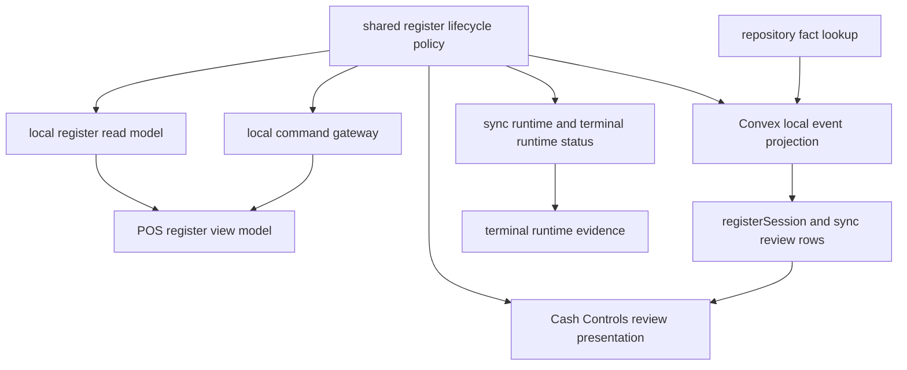

# refactor: Share POS Register Lifecycle Policy

## Summary

Extract the POS register and drawer lifecycle invariants into a shared policy layer consumed by browser-local POS and Convex projection. The work preserves the current multi-session drawer behavior while removing duplicated rules around closeout review, drawer authority, runtime evidence, and sale usability.

---

## Problem Frame

The current POS register patch encodes the same drawer lifecycle invariants in multiple places: local read-model projection, local command gating, runtime status, Convex sync projection, repository conflict lookup, and register review presentation. That shape can drift and reintroduce the class of cashier blockers this work just fixed: a cashier opens a drawer, closes it, opens a later drawer, and POS/server disagree about whether the old or new drawer is authoritative.

---

## Requirements

- R1. Define register lifecycle policy once for shared browser and Convex consumers.
- R2. Preserve POS sale usability semantics: `open` and `active` are sale-usable; `closing` is lifecycle/review-visible but not sale-usable; `closed` is not sale-usable.
- R3. Preserve cashier continuity by allowing a replacement drawer after settled closeout, submitted closeout review, or `cloud_closed` drawer authority when local evidence makes that safe.
- R4. Keep unresolved closeouts and `cloud_closed` drawer authority blocks as sale blockers for their scoped session.
- R5. Ensure Convex projection and browser-local POS agree on reviewed closeout drawers: a reviewed cloud drawer is not reusable for sale authority, but may be superseded by a new local drawer open.
- R6. Fix the direct-cloud-id projection bypass so sale projection cannot attach to a reviewed closeout merely because the local register id already looks like a cloud id.
- R7. Replace duplicated non-blocking lifecycle-review predicates for runtime status and sync runtime event selection.
- R8. Keep Cash Controls and Daily Operations review surfaces truthful when closeout review coexists with later drawer activity.
- R9. Preserve existing UI contracts unless a contract change is explicitly required by the invariant.
- R10. Refresh generated Graphify artifacts after code changes.
- Terminology: “scoped session” means the same store, terminal, and register-session scope used by the local drawer/read-model policy inputs.

---

## Scope Boundaries

- This plan does not redesign POS drawer opening, closeout submission, manager review, or Cash Controls workflows.
- This plan does not introduce new drawer lifecycle states beyond the existing register-session status vocabulary.
- This plan does not turn runtime status into an authority source; runtime status remains evidence for reconciliation and support.
- This plan does not add new production observability rails unless a current mutation boundary already emits the relevant audit/review evidence.
- This plan does not split into separate PRs by default; the touched files share generated artifacts and should land through one integration PR after ticket-level tracking.

### Deferred to Follow-Up Work

- Broader POS terminal health IA cleanup outside the lifecycle policy drift.
- Additional runtime status dashboards for lifecycle review evidence.
- New repo sensors if implementation reveals a validation-map gap that is separate from the current invariant extraction.

---

## Context & Research

### Relevant Code and Patterns

- `packages/athena-webapp/shared/registerSessionStatus.ts` already defines shared register-session status policy.
- `packages/athena-webapp/src/lib/pos/infrastructure/local/saleBlockerPolicy.ts` is the existing local sale blocker policy boundary.
- `packages/athena-webapp/src/lib/pos/infrastructure/local/registerReadModel.ts` currently projects local register state and exposes `hasSettledRegisterCloseout`.
- `packages/athena-webapp/src/lib/pos/infrastructure/local/localCommandGateway.ts` owns local command acceptance before durable local event append.
- `packages/athena-webapp/src/lib/pos/infrastructure/local/usePosLocalSyncRuntime.ts` and `packages/athena-webapp/src/lib/pos/infrastructure/local/terminalRuntimeStatus.ts` both classify non-blocking lifecycle review evidence today.
- `packages/athena-webapp/convex/pos/application/sync/projectLocalEvents.ts` owns server-side local event projection and is the highest-risk hotspot.
- `packages/athena-webapp/convex/pos/infrastructure/repositories/localSyncRepository.ts` should stay data-access oriented and should not re-derive closeout-review policy heuristically.
- `packages/athena-webapp/convex/pos/application/sync/registerSessionSyncReview.ts` already has review-kind classification that should inform closeout-review conflict policy.
- `packages/athena-webapp/src/components/cash-controls/RegisterSessionView.tsx` renders closeout review and mixed review queues for managers.

### Institutional Learnings

- `docs/solutions/logic-errors/athena-pos-drawer-invariants-at-command-boundaries-2026-04-24.md`: drawer invariants must live at command boundaries, not only UI gates.
- `docs/solutions/logic-errors/athena-pos-synced-closeout-readiness-2026-06-17.md`: settled closeout history must not block the next drawer for the same store/terminal after the prior register session settles.
- `docs/solutions/logic-errors/athena-pos-drawer-authority-replacement-recovery-2026-06-06.md`: recoverable drawer authority blocks can be superseded only by later accepted replacement evidence.
- `docs/solutions/logic-errors/athena-pos-stale-terminal-sale-block-2026-05-29.md`: terminal integrity and drawer authority remain durable inputs to `canSell`.
- `docs/solutions/logic-errors/athena-pos-register-sync-closeout-review-recovery-2026-05-23.md`: closeout review projection must update source sync event, review row, and register session consistently.
- `docs/solutions/architecture/athena-pos-register-viewmodel-boundaries-2026-06-17.md`: keep `useRegisterViewModel` as a facade and extract tested helper policy behind it.
- `docs/solutions/architecture/athena-pos-runtime-decoupling-boundaries-2026-06-15.md`: readiness, drawer-authority reconciliation, sync drain, runtime status publish, and terminal health presentation are separate boundaries.

### External References

- None. Local Athena POS and Convex patterns are the source of truth.

---

## Key Technical Decisions

- **Create a pure shared lifecycle policy module:** Put shared decisions under `packages/athena-webapp/shared/`, adjacent to `registerSessionStatus.ts`, so both browser code and Convex code can import it.
- **Expose separate policy answers rather than one overloaded usable helper:** The policy should distinguish sale usability, lifecycle visibility, replacement-open eligibility, reviewed-closeout supersedability, and non-blocking runtime evidence.
- **Keep repository queries outside the policy:** Repositories return facts such as `hasOpenCloseoutReview`, review kind, mapped register-session status, event ids, session ids, and evidence ordering. `projectLocalEvents.ts` or another application-layer sync service calls the shared policy with those facts; repositories must not become the durable lifecycle policy boundary.
- **Use stable review classification where available:** Avoid summary-string coupling for closeout review decisions when typed review-kind classification can describe the conflict.
- **Integrate server projection before frontend cleanup:** Convex is the authoritative guard against stale clients and direct-cloud-id projection bypass.
- **Preserve `registerUiState.ts` as a stable UI contract:** Presentation consumers should receive policy-shaped decisions without broad UI contract churn.
- **Land through one coordinated integration PR:** The dirty change set touches generated Graphify artifacts and cross-layer tests, so separate PRs would mostly fight over derived outputs.

---

## Open Questions

### Resolved During Planning

- **Should the shared layer live in browser-local infrastructure or `shared/`?** Use `shared/` because Convex projection and browser-local POS both need the same pure decisions.
- **Should `closing` be POS-usable?** No. It is lifecycle/review-visible and can be superseded when reviewed, but sales must not attach to it.
- **Should runtime status grant authority?** No. Runtime status reports evidence and receives reconciliation directives; it does not authorize sales.
- **Should the current dirty root be split before planning?** No. It has been moved into one delivery worktree and should be tracked as a coordinated batch.

### Deferred to Implementation

- Exact helper names may change if implementation finds clearer local naming.
- Whether the existing `selectPassiveCloseoutBlockedRegisterSession()` placeholder should be removed or replaced depends on how the final policy call reads in `useRegisterViewModel.ts`.
- Whether `scripts/harness-app-registry.ts` needs an update depends on the final shared file location and existing validation-map coverage.

---

## High-Level Technical Design

> *This illustrates the intended approach and is directional guidance for review, not implementation specification. The implementing agent should treat it as context, not code to reproduce.*

### Policy Decision Matrix

| State or evidence | Sale usable | Lifecycle visible | Replacement drawer may proceed |
| --- | --- | --- | --- |
| `open` / `active`, no blocker | Yes | Yes | No, unless same drawer idempotency applies |
| `closing` with unresolved/unsynced closeout and no submitted review | No | Yes | No for the same scoped session |
| `closing` with submitted closeout review | No | Yes | Yes by appending a new local drawer for the same store/terminal with a new register-session id, leaving the reviewed drawer non-sale-usable |
| `closed` with settled closeout | No | Historical evidence | Yes because the settled session releases its own blocker; the next drawer opens under a new register-session scope for the same store/terminal |
| `cloud_closed` drawer authority | No for the mapped drawer | Yes | Yes when later accepted local replacement evidence appends a replacement drawer |
| same-session `lifecycle_rejected` review evidence | Not by itself | Yes | Depends on the current active/closing drawer state |

---

## Implementation Units

- U1. **Shared Lifecycle Policy Foundation**

**Goal:** Add a pure shared policy module and focused tests for POS register lifecycle decisions.

**Requirements:** R1, R2, R3, R4, R5, R7

**Dependencies:** None

**Files:**
- Create: `packages/athena-webapp/shared/registerSessionLifecyclePolicy.ts`
- Test: `packages/athena-webapp/shared/registerSessionLifecyclePolicy.test.ts`
- Modify: `packages/athena-webapp/shared/registerSessionStatus.ts` only if status exports need small naming reuse

**Approach:**
- Build on the existing status policy instead of redefining status sets.
- Keep inputs structural and serializable so Convex and browser code can both consume the helpers.
- Require supersession inputs to include scoped store, terminal, register-session identity, and monotonic evidence ordering such as local sequence, server mapping time, or accepted sync event order so stale or foreign evidence cannot release a blocker.
- Cover separate decisions for sale usability, lifecycle visibility, replacement-open eligibility, non-blocking lifecycle review events, drawer authority sale blocking, and reviewed-closeout supersedability.

**Execution note:** Implement the shared policy test-first using characterization cases from the current dirty callers before replacing those callers.

**Patterns to follow:**
- `packages/athena-webapp/shared/registerSessionStatus.ts`
- `packages/athena-webapp/shared/registerSessionStatus.test.ts`

**Test scenarios:**
- Happy path: `open` and `active` classify as sale-usable.
- Edge case: `closing` is lifecycle-visible and supersedable when reviewed, but never sale-usable.
- Edge case: settled closeout can release a scoped local drawer block while unsynced closeout cannot.
- Edge case: older replacement evidence does not supersede newer reviewed drawer evidence.
- Error path: foreign store/terminal scope inputs do not classify as reusable/supersedable.
- Integration: same-session `lifecycle_rejected` does not become a sale blocker by itself, while `cloud_closed` remains a sale blocker for the mapped drawer.

**Verification:**
- Shared policy tests prove the current invariant table before caller refactors depend on it.

---

- U2. **Browser-Local POS Policy Integration**

**Goal:** Replace duplicated lifecycle and drawer-authority decisions in browser-local POS with shared policy calls.

**Requirements:** R1, R2, R3, R4, R5, R7, R9

**Dependencies:** U1

**Files:**
- Modify: `packages/athena-webapp/src/lib/pos/infrastructure/local/registerReadModel.ts`
- Modify: `packages/athena-webapp/src/lib/pos/infrastructure/local/localCommandGateway.ts`
- Modify: `packages/athena-webapp/src/lib/pos/infrastructure/local/usePosLocalSyncRuntime.ts`
- Modify: `packages/athena-webapp/src/lib/pos/infrastructure/local/terminalRuntimeStatus.ts`
- Modify: `packages/athena-webapp/src/lib/pos/infrastructure/local/drawerAuthorityReconciliation.ts`
- Modify: `packages/athena-webapp/src/lib/pos/presentation/register/useRegisterViewModel.ts`
- Modify: `packages/athena-webapp/src/lib/pos/presentation/register/registerUiState.ts` only if the existing `hasSignedInStaff` addition remains required
- Test: `packages/athena-webapp/src/lib/pos/infrastructure/local/registerReadModel.test.ts`
- Test: `packages/athena-webapp/src/lib/pos/infrastructure/local/localCommandGateway.test.ts`
- Test: `packages/athena-webapp/src/lib/pos/infrastructure/local/usePosLocalSyncRuntime.test.ts`
- Test: `packages/athena-webapp/src/lib/pos/infrastructure/local/terminalRuntimeStatus.test.ts`
- Test: `packages/athena-webapp/src/lib/pos/presentation/register/useRegisterViewModel.test.ts`
- Test: `packages/athena-webapp/src/components/pos/register/RegisterDrawerGate.test.tsx`
- Test: `packages/athena-webapp/src/components/pos/register/POSRegisterView.test.tsx`

**Approach:**
- Replace private helpers and exact duplicated predicates with shared policy calls.
- Pass scoped store, terminal, register-session identity, and local event ordering facts into supersession decisions instead of relying on status alone.
- Keep local store access, event replay, and UI assembly inside existing local modules.
- Treat the `selectPassiveCloseoutBlockedRegisterSession()` placeholder as an explicit implementation decision: either remove it if passive blocking is no longer needed, or replace it with a named policy-backed selector.
- Preserve local-first command behavior: cashier success still follows durable local event append.

**Execution note:** Characterize current dirty behavior in focused tests before replacing caller logic.

**Patterns to follow:**
- `packages/athena-webapp/src/lib/pos/infrastructure/local/saleBlockerPolicy.ts`
- `packages/athena-webapp/src/lib/pos/infrastructure/local/registerReadModel.ts`
- `docs/solutions/architecture/athena-pos-register-viewmodel-boundaries-2026-06-17.md`

**Test scenarios:**
- Happy path: first drawer open projects as sellable after local event append.
- Edge case: active drawer with same-session lifecycle review remains sellable when no other blocker exists.
- Edge case: submitted closeout blocks sales but allows opening a subsequent drawer.
- Edge case: synced closeout releases a scoped local closeout block only for the matching session.
- Edge case: reviewed cloud drawer is not sale-usable locally but can be superseded by a later new local drawer open under shared policy.
- Edge case: older replacement evidence, foreign terminal evidence, and unsynced closeout evidence do not release the current blocker.
- Error path: `cloud_closed` drawer authority blocks sales on the mapped drawer.
- Integration: runtime status ignores non-blocking lifecycle review events without hiding actionable sale/payment review events.

**Verification:**
- Browser-local focused tests pass and no local POS caller redefines the moved lifecycle predicates.

---

- U3. **Convex Projection and Repository Policy Integration**

**Goal:** Replace duplicated server-side lifecycle decisions and fix the reviewed-closeout direct-id projection bypass.

**Requirements:** R1, R2, R5, R6

**Dependencies:** U1

**Files:**
- Modify: `packages/athena-webapp/convex/pos/application/sync/projectLocalEvents.ts`
- Modify: `packages/athena-webapp/convex/pos/application/sync/types.ts`
- Modify: `packages/athena-webapp/convex/pos/infrastructure/repositories/localSyncRepository.ts`
- Modify: `packages/athena-webapp/convex/pos/application/commands/terminals.ts`
- Test: `packages/athena-webapp/convex/pos/application/sync/projectLocalEvents.test.ts`
- Test: `packages/athena-webapp/convex/pos/application/sync/ingestLocalEvents.test.ts`
- Test: `packages/athena-webapp/convex/pos/application/terminals.test.ts`

**Approach:**
- Keep DB lookup functions in repositories, but move pure interpretation of returned facts into shared policy at the application/sync layer.
- Ensure repository methods expose fact data and evidence ordering needed by policy decisions without embedding lifecycle interpretations.
- Block sale projection for any mapped register session with open closeout review, including direct cloud-id local histories.
- Allow new local drawer projection to supersede a reviewed `open`, `active`, or `closing` cloud drawer only under shared policy.
- Keep terminal runtime directive logic aligned with shared status semantics for `closing` lifecycle evidence.

**Execution note:** Add or adjust the direct-cloud-id reviewed-closeout test before changing projection logic.

**Patterns to follow:**
- `packages/athena-webapp/convex/pos/application/sync/projectLocalEvents.ts`
- `packages/athena-webapp/convex/pos/application/sync/registerSessionSyncReview.ts`
- `packages/athena-webapp/convex/pos/infrastructure/repositories/localSyncRepository.ts`

**Test scenarios:**
- Happy path: duplicate open maps to an existing active drawer when no closeout review exists.
- Edge case: reviewed `open`, `active`, or `closing` drawer can be superseded by a later new local drawer open with matching store/terminal and distinct register-session identity.
- Edge case: older replacement evidence and foreign terminal evidence do not supersede the reviewed drawer.
- Edge case: direct-cloud-id local register history cannot project sales into a reviewed closeout drawer.
- Error path: sale projection conflicts when register mapping points to a reviewed closeout.
- Integration: variance closeout patches register session to `closing`, creates one review conflict, and approved replay closes idempotently.

**Verification:**
- Convex projection tests prove server and local policy agree on reviewed drawers and direct-id bypass is closed.

---

- U4. **Review Surface and Daily Close Alignment**

**Goal:** Keep manager-facing review surfaces accurate when closeout review coexists with subsequent POS drawer activity.

**Requirements:** R5, R8, R9

**Dependencies:** U1, U3

**Files:**
- Modify: `packages/athena-webapp/convex/pos/application/sync/registerSessionSyncReview.ts`
- Modify: `packages/athena-webapp/convex/operations/dailyClose.ts`
- Modify: `packages/athena-webapp/src/components/cash-controls/RegisterSessionView.tsx`
- Test: `packages/athena-webapp/convex/cashControls/deposits.test.ts`
- Test: `packages/athena-webapp/convex/operations/dailyClose.test.ts`
- Test: `packages/athena-webapp/src/components/cash-controls/RegisterSessionView.test.tsx`

**Approach:**
- Keep closeout review items visible and actionable even if POS can open a later drawer.
- Suppress duplicate-closeout shadows only when the same event already has an open variance review.
- Prefer typed review classification over summary-string heuristics where the current code allows it.
- Preserve calm operational copy and existing permission boundaries.

**Execution note:** Characterize mixed review queues before changing review item grouping or action rendering.

**Patterns to follow:**
- `packages/athena-webapp/src/components/cash-controls/RegisterSessionView.tsx`
- `docs/solutions/logic-errors/athena-cash-controls-closeout-review-ia-2026-06-08.md`
- `docs/product-copy-tone.md`

**Test scenarios:**
- Happy path: closeout variance review shows expected/count/variance/note evidence.
- Edge case: mixed closeout and sale/inventory review queue shows item-level actions without losing batch context.
- Edge case: duplicate closeout review is suppressed when an open variance review for the same event exists.
- Error path: already-closed duplicate closeout remains reject-only.
- Integration: Daily Close continues to treat unresolved `closing` register sessions as blockers.

**Verification:**
- Cash Controls and Daily Close tests prove review surfaces remain manager-actionable and do not imply a reviewed drawer is sale-usable.

---

- U5. **Harness, Generated Artifacts, and Delivery Documentation**

**Goal:** Keep repository sensors, Graphify output, and reusable architecture knowledge aligned with the new shared policy boundary.

**Requirements:** R10

**Dependencies:** U1, U2, U3, U4

**Files:**
- Modify: `scripts/harness-app-registry.ts` only if the new shared policy file needs validation-map coverage.
- Modify: `graphify-out/GRAPH_REPORT.md`
- Modify: `graphify-out/graph.json`
- Modify: `graphify-out/wiki/index.md`
- Modify: `graphify-out/wiki/packages/athena-webapp.md`
- Create or Modify: `docs/solutions/architecture/athena-pos-register-lifecycle-policy-2026-06-23.md`

**Approach:**
- Regenerate Graphify after source changes; do not hand-edit generated graph files.
- If validation-map coverage changes, regenerate harness docs through the repo’s harness command.
- Add a concise solution doc explaining the shared policy boundary, the states it owns, and the callers that should not re-derive those decisions.

**Execution note:** Sensor-only for generated artifacts; behavior is proven by earlier units.

**Patterns to follow:**
- `docs/solutions/architecture/athena-pos-register-viewmodel-boundaries-2026-06-17.md`
- `docs/solutions/architecture/athena-pos-runtime-decoupling-boundaries-2026-06-15.md`

**Test scenarios:**
- Test expectation: none for generated Graphify artifacts; validation is successful regeneration plus clean diff review.
- Integration: validation-map updates, if any, include the shared policy test in the relevant POS local-sync scenario.

**Verification:**
- Generated artifacts reflect the final source tree and a durable solution doc captures the new architecture boundary.

---

## System-Wide Impact

- **Interaction graph:** Local POS, Convex projection, terminal runtime reporting, Cash Controls, Daily Close, and generated Graphify all observe the lifecycle policy.
- **Error propagation:** Policy helpers should return decisions or booleans; user-facing copy remains in presentation/command boundaries.
- **State lifecycle risks:** The highest-risk transitions are `open/active -> closing`, reviewed closeout superseded by new drawer, settled closeout release, and direct cloud-id sale projection.
- **API surface parity:** Browser and Convex must consume the same pure policy; repository and UI layers should not fork status semantics.
- **Integration coverage:** Unit policy tests are necessary but insufficient; projection, local command, runtime status, and review UI tests must all prove parity.
- **Unchanged invariants:** POS remains local-first; runtime status remains evidence; manager review remains the closeout decision boundary.

---

## Risks & Dependencies

| Risk | Mitigation |
|------|------------|
| Shared helper accidentally makes `closing` sale-usable | Policy table tests plus browser and Convex projection tests must cover `closing` explicitly. |
| Repository data access leaks policy back into queries | Keep repository methods returning facts and run review against `localSyncRepository.ts`. |
| Direct-cloud-id bypass remains open | Add focused projection regression before implementation and keep it in `projectLocalEvents.test.ts`. |
| UI hides closeout review because POS can open a later drawer | Cash Controls mixed-review tests must prove closeout review remains visible and actionable. |
| Generated artifacts drift | Run `bun run graphify:rebuild` after source changes and inspect generated output. |

---

## Documentation / Operational Notes

- This change affects Athena admin runtime and Convex runtime surfaces. Post-merge deploy should include `scripts/deploy-vps.sh convex-prod` and `scripts/deploy-vps.sh athena-local` from a clean root checkout.
- Delivery must stay limited to the owned POS register lifecycle dirty path set plus required plan, ticket, generated-artifact, and solution-doc updates. Avoid unrelated cleanup, run focused POS/Convex/Cash Controls tests first, then Graphify rebuild and `bun run pr:athena`, merge through PR, fast-forward local root `main`, and deploy the selected production surfaces from a clean checkout.
- Create or update a solution doc after implementation because this introduces a durable shared architecture boundary.
- No external service migration is expected.

---

## Sources & References

- Related code: `packages/athena-webapp/shared/registerSessionStatus.ts`
- Related code: `packages/athena-webapp/src/lib/pos/infrastructure/local/registerReadModel.ts`
- Related code: `packages/athena-webapp/src/lib/pos/infrastructure/local/localCommandGateway.ts`
- Related code: `packages/athena-webapp/convex/pos/application/sync/projectLocalEvents.ts`
- Related code: `packages/athena-webapp/convex/pos/application/sync/registerSessionSyncReview.ts`
- Related code: `packages/athena-webapp/src/components/cash-controls/RegisterSessionView.tsx`
- Learning: `docs/solutions/logic-errors/athena-pos-drawer-invariants-at-command-boundaries-2026-04-24.md`
- Learning: `docs/solutions/logic-errors/athena-pos-synced-closeout-readiness-2026-06-17.md`
- Learning: `docs/solutions/logic-errors/athena-pos-drawer-authority-replacement-recovery-2026-06-06.md`
- Learning: `docs/solutions/architecture/athena-pos-register-viewmodel-boundaries-2026-06-17.md`
- Learning: `docs/solutions/architecture/athena-pos-runtime-decoupling-boundaries-2026-06-15.md`
