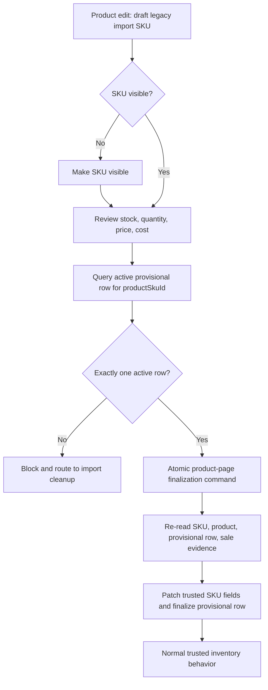
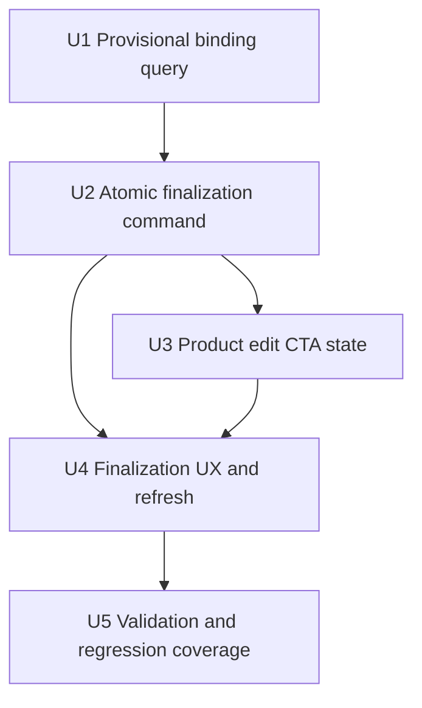

# feat: Add trusted inventory conversion from product edit

## Summary

This plan adds a product-edit finalization path for legacy-import provisional SKUs. Staff can make the SKU visible, review stock/quantity/price/cost on the add/edit product page, then run a dedicated server-owned conversion command that marks the active provisional import row finalized and returns the SKU to normal trusted inventory behavior.

---

## Problem Frame

The current first-pass UI shows the trusted inventory review state on draft legacy-import products, but the final CTA is still a placeholder. Plain product/SKU save is not enough: it can make fields look trusted while the provisional import row remains active, POS continues applying provisional availability rules, and stock adjustments remain blocked.

---

## Assumptions

*This plan was authored without a separate requirements document. The items below are inferred from the current browser feedback, existing provisional-import architecture, and subagent audit findings; reviewers should treat them as explicit plan-time bets.*

- Reviewed stock and quantity fields on the product edit page represent final trusted on-hand counts at the time of conversion, not the original imported count before provisional POS sales.
- The finalization action should submit reviewed SKU fields and finalize atomically, instead of requiring staff to click the general Save button first.
- Finalizing trusted inventory is stock authority work, so it should use the inventory import permission model rather than ordinary product-edit authority.
- Product-level draft-to-live publication should be conservative: SKU trust can be finalized independently, and product publication should only happen automatically when the product has complete required merchandising data.

---

## Requirements

- R1. A persisted draft legacy-import SKU can be finalized from the add/edit product page only after staff makes the SKU visible and reviews stock, quantity available, price, and cost.
- R2. Finalization must use a dedicated Convex inventory-import command, not ordinary `updateSku` field patches, so the active provisional row changes lifecycle state with the trusted SKU update.
- R3. Finalization must bind exactly one active `inventoryImportProvisionalSku` row to the product/SKU being converted; missing or multiple active rows block conversion with operational copy.
- R4. Reviewed stock and quantity values are applied as trusted on-hand values while provisional sold quantity is recorded for audit and freshness checks, not subtracted a second time.
- R5. The command must preserve source-aware evidence: actor, product, SKU, provisional row, import/review version, sale evidence fingerprint, final trusted quantity, quantity available, provisional sold quantity, source surface, and finalization idempotency key.
- R6. Once finalized, the SKU no longer uses provisional POS availability or provisional stock-adjustment blockers.
- R7. The UI must surface actionable states: make SKU visible, review/save fields, finalize pending, finalized, blocked by active reservations, blocked by stale sale evidence, blocked by authorization, and blocked by ambiguous provisional rows.
- R8. Existing first-pass cleanup remains in scope: draft status display, provisional review row, stock/quantity mirroring, and `NULL` attribute normalization should be preserved.

---

## Scope Boundaries

- Do not redesign the full inventory import review workspace.
- Do not make provisional import rows storefront-sellable before conversion.
- Do not use fake trusted counts to make POS availability work.
- Do not use stock adjustments as the conversion mechanism; stock adjustments intentionally block active provisional SKUs.
- Do not finalize multiple SKUs in one product-page action. Conversion is per SKU.
- Do not solve cross-terminal oversell prevention for provisional inventory; preserve sale evidence and require review when freshness changes.
- Do not replace the existing batch import finalization path. This plan adds a product-page one-SKU command that reuses the same trust boundary.

### Deferred to Follow-Up Work

- Bulk product-page finalization for multi-SKU legacy-import products.
- Rich variance dashboards comparing imported quantity, provisional sold quantity, and final trusted count.
- Automated owner notifications for stale provisional rows or high provisional sale volume.

---

## Context & Research

### Relevant Code and Patterns

- `packages/athena-webapp/convex/inventory/catalogImport.ts` owns saved import reviews, staged provisional rows, batch trusted import application, and sale-evidence-aware finalization.
- `packages/athena-webapp/convex/schemas/inventory/inventoryImportProvisionalSku.ts` already models provisional lifecycle state, POS exposure state, sale evidence, final trusted quantity, and finalization actor fields.
- `packages/athena-webapp/convex/stockOps/adjustments.ts` blocks stock adjustments for active provisional import SKUs until finalization.
- `packages/athena-webapp/convex/operations/inventoryMovements.ts` and SKU activity surfaces own source-aware stock evidence; conversion evidence must flow through that ledger path, not only through a plain operational event.
- `packages/athena-webapp/src/components/add-product/ProductStock.tsx` renders the current trusted inventory review row and should own the per-SKU CTA state.
- `packages/athena-webapp/src/components/add-product/ProductView.tsx` owns product/SKU save orchestration and existing money display-to-minor-unit conversion.
- `packages/athena-webapp/src/contexts/ProductContext.tsx` maps persisted SKU data into editable variants and must continue normalizing legacy placeholder attributes.
- `packages/athena-webapp/src/components/operations/InventoryImportView.tsx` remains the larger import review surface and provides patterns for restrained operational copy.

### Institutional Learnings

- `docs/solutions/architecture/athena-pos-provisional-import-trust-boundary-2026-06-10.md` establishes that provisional rows are sale evidence, not trusted inventory, until explicit finalization.
- `docs/solutions/architecture/athena-pos-provisional-import-availability-2026-06-11.md` requires POS availability policy metadata instead of fake counts, and requires finalized/rejected rows to stop bypassing normal stock enforcement.
- `docs/solutions/architecture/athena-inventory-import-review-version-2026-06-07.md` says conversion should be driven from durable saved review/provisional data, not browser preview state.
- `docs/solutions/logic-errors/athena-stock-adjustments-checkout-reservations-2026-05-08.md` separates checkout reservations from POS holds; finalization should not double-subtract either source.
- `docs/solutions/logic-errors/athena-sku-activity-traceability-2026-05-13.md` requires stock-affecting transitions to leave source-aware operational evidence.

### External References

- None. Repo-local Convex, product edit, inventory import, POS availability, and stock operation patterns are direct enough for this plan.

---

## Key Technical Decisions

| Decision | Rationale |
| --- | --- |
| Add a one-SKU product-page finalization command in `catalogImport.ts` | The provisional import boundary already owns sale evidence and finalization. Reusing it avoids creating a separate product-edit trust model. |
| Treat reviewed product-edit stock values as final on-hand counts | The UI asks staff to review current stock/quantity before finalization. Subtracting provisional sold quantity again would surprise staff and risks double-decrementing. |
| Submit reviewed SKU fields atomically with finalization | A separate Save requirement would make stale DB values easy to finalize and would split one operator intent across two mutation paths. |
| Require exactly one active provisional row for the SKU | Ambiguous import provenance is an audit problem. The product page should block and route staff back to import cleanup instead of guessing. |
| Preserve sale evidence at finalization even when not subtracting it | Provisional sales remain important audit context and should detect stale review state before conversion. |
| Keep product publication conservative | Trusted SKU inventory and customer-visible merchandising are related but distinct. A SKU can become trusted while the product remains draft if required product data is incomplete. |

---

## Open Questions

### Resolved During Planning

- **Should finalization be normal product save?** No. It must be a dedicated inventory-import command so provisional lifecycle state, POS exposure, and stock-adjustment blockers change together.
- **Are edited stock fields final on-hand values or imported baseline values?** Treat them as final trusted on-hand values. Sale evidence is audit/freshness context and is not subtracted again.
- **Should hidden SKUs be editable/finalizable?** No. The first action is making the SKU visible, then saving or atomically submitting reviewed fields through finalization.
- **Should finalization be per product or per SKU?** Per SKU. Product-level publication only changes when all active provisional SKUs are finalized or otherwise closed and product data is complete.

### Deferred to Implementation

- Exact permission helper shape for manager elevation versus full admin should be chosen while fitting the current `catalogImport.ts` access pattern.
- Exact ledger helper should be chosen while fitting `inventoryMovements.ts`, but the command must produce SKU activity/support-review evidence rather than relying only on `operationalEvent`.

---

## High-Level Technical Design

> *This illustrates the intended approach and is directional guidance for review, not implementation specification. The implementing agent should treat it as context, not code to reproduce.*

| Product/SKU state | Review row behavior | Allowed action |
| --- | --- | --- |
| Draft legacy-import product, hidden SKU | Explain visibility prerequisite | Make SKU visible |
| Visible SKU, unsaved reviewed fields | Show review and validation state | Finalize submits reviewed fields atomically |
| Visible SKU, active reservation | Explain reservation blocker | No finalization until reservation clears |
| Visible SKU, no active provisional row | Explain missing conversion source | Route to import review/cleanup |
| Visible SKU, multiple active provisional rows | Explain ambiguous source | Route to import review/cleanup |
| Finalized row | Show trusted/finalized state or hide review row | Normal product/SKU editing |

### CTA and Copy Matrix

| Operator state | CTA | State | Inline message | Toast / recovery |
| --- | --- | --- | --- | --- |
| Hidden provisional SKU | `Make SKU visible` | Enabled when row is otherwise editable | `Make this SKU visible before reviewing trusted inventory.` | No toast. Toggle visibility locally, then review values. |
| Ready to finalize | `Finalize trusted inventory` | Enabled | `Review stock, quantity, price, and cost before finalizing.` | Success uses inline confirmation; no navigation required. |
| Local validation invalid | `Finalize trusted inventory` | Disabled | Show the first concrete field issue, such as `Quantity available cannot exceed stock.` | No toast. Fix the highlighted field. |
| Pending | `Finalizing...` | Loading/disabled | `Finalizing this SKU as trusted inventory.` | Prevent duplicate submits. |
| Finalized | `Trusted inventory finalized` or no CTA | Disabled/complete | `Inventory finalized. Save remaining product changes separately.` | Keep staff on the product page. Optional link may point to SKU activity if the local pattern already exists. |
| Active checkout reservation | `Finalize trusted inventory` | Disabled | `Clear active checkout reservations before finalizing this SKU.` | No toast. Reservation state refreshes with the product data. |
| Active POS reservation/hold | `Finalize trusted inventory` | Disabled | `Clear active POS holds before finalizing this SKU.` | No toast. Reservation state refreshes with the product data. |
| Stale sale evidence | `Refresh review` | Enabled | `Provisional sales changed. Refresh and review the counts again.` | Use an inline command-result message; refresh the binding and keep edited fields intact unless the user reverts. |
| Insufficient authority | `Finalize trusted inventory` | Disabled or failure state | `Inventory import permission is required to finalize trusted inventory.` | If discovered on submit, show the same copy inline and through existing restrained error presentation. |
| Missing provisional row | `Review import source` | Disabled or link-style action | `No active provisional import row is linked to this SKU.` | Route to inventory import cleanup if a local route is available; otherwise keep inline guidance. |
| Ambiguous provisional rows | `Review import source` | Disabled or link-style action | `Multiple active provisional rows are linked to this SKU. Resolve the import rows before finalizing.` | Route to inventory import cleanup if a local route is available. |
| Unexpected failure | `Finalize trusted inventory` | Re-enabled after failure | `Trusted inventory was not finalized. Try again or refresh the product.` | Use existing unexpected-error toast; return focus to the review row. |

---

## Implementation Units

- U1. **Expose product-page provisional binding data**

**Goal:** Let the add/edit product page know whether a SKU has exactly one active provisional import row and what sale evidence/freshness data should be displayed.

**Requirements:** R3, R5, R7

**Dependencies:** None

**Files:**
- Modify: `packages/athena-webapp/convex/inventory/catalogImport.ts`
- Regenerate: `packages/athena-webapp/convex/_generated/api.d.ts` via Convex codegen after adding the query/mutation; do not hand-edit generated API files.
- Test: `packages/athena-webapp/convex/inventory/catalogImport.test.ts`

**Approach:**
- Add a query or query helper scoped by `storeId` and `productSkuId` that returns active provisional rows plus a derived binding state: none, unique, or ambiguous.
- Return enough metadata for UI copy and freshness checks: provisional row id, import key, row number, imported quantity, sale evidence totals, POS exposure status, review version context, `saleEvidenceFingerprint`, and `trustedSkuFingerprint`.
- Build `saleEvidenceFingerprint` from `saleEvidence.saleCount`, `saleEvidence.totalQuantitySold`, `saleEvidence.lastSoldAt`, `saleEvidence.lastPosTransactionId`, `saleEvidence.lastRegisterSessionId`, and the provisional row `updatedAt`. The UI submits this exact token with finalization so the command can detect stale review state.
- Build `trustedSkuFingerprint` from the currently persisted trusted SKU baseline: `inventoryCount`, `quantityAvailable`, price/net price fields, unit cost, visibility, and `updatedAt` if available. Finalization submits this token so the command can detect another writer changing the SKU between binding and conversion.
- Keep the query store-scoped and active-status scoped. Do not expose finalized/rejected/closed rows as finalization candidates.

**Execution note:** Add characterization tests around the existing provisional-row indexes before wiring UI state.

**Patterns to follow:**
- `packages/athena-webapp/convex/inventory/catalogImport.ts` helpers that query `inventoryImportProvisionalSku` by store/status/import key.
- `packages/athena-webapp/convex/stockOps/adjustments.ts` point lookups by `storeId + productSkuId + status`.

**Test scenarios:**
- Happy path: a SKU with one active provisional row returns `unique` with sale evidence and import metadata.
- Edge case: a SKU with no active provisional row returns `none` and no finalization candidate.
- Edge case: finalized/rejected/closed rows are ignored as candidates.
- Error path: rows from another store are not returned.
- Integration: two active rows for the same SKU return `ambiguous` so UI cannot choose one silently.

**Verification:**
- Product edit can distinguish finalizable, non-finalizable, and ambiguous provisional states without guessing from category or draft status alone.

---

- U2. **Add atomic trusted inventory finalization command**

**Goal:** Convert one active provisional import row into trusted SKU inventory from the product page while saving reviewed SKU fields and closing provisional behavior in one mutation.

**Requirements:** R1, R2, R3, R4, R5, R6

**Dependencies:** U1

**Files:**
- Modify: `packages/athena-webapp/convex/inventory/catalogImport.ts`
- Modify: `packages/athena-webapp/convex/inventory/products.ts`
- Modify: `packages/athena-webapp/convex/operations/inventoryMovements.ts`
- Modify: `packages/athena-webapp/convex/operations/skuActivity.ts`
- Modify: `packages/athena-webapp/convex/operations/operationalEvents.ts`
- Modify: `packages/athena-webapp/convex/schemas/inventory/inventoryImportProvisionalSku.ts`
- Test: `packages/athena-webapp/convex/inventory/catalogImport.test.ts`
- Test: `packages/athena-webapp/convex/inventory/products.sku.test.ts`
- Test: `packages/athena-webapp/convex/operations/inventoryMovements.test.ts` or the relevant SKU activity test file
- Test: `packages/athena-webapp/convex/stockOps/adjustments.test.ts`

**Approach:**
- Add a mutation near the import finalization helpers that accepts store, product, SKU, provisional row, reviewed stock, quantity available, price, net price, unit cost, visibility, `saleEvidenceFingerprint`, `trustedSkuFingerprint`, and a `conversionRequestId` idempotency key.
- Add durable finalization idempotency fields to `inventoryImportProvisionalSku`: `finalizationConversionRequestId`, `finalizationRequestPayloadHash`, and enough stored result metadata to return an idempotent success response without reconstructing from mutable state. Add an index `by_storeId_finalizationConversionRequestId`.
- Mutation lookup order: perform auth/store access first, then check `storeId + conversionRequestId` through `by_storeId_finalizationConversionRequestId` before requiring an active provisional row. If an existing finalized row has the same key and the same payload hash, return the stored finalized result without writing movements/events again. If the same key has a different payload hash, return a non-mutating conflict. Only after this idempotency check should the command require exactly one active provisional row and continue validation.
- Validate authority using the inventory import access pattern, not ordinary product edit assumptions.
- Re-read product, SKU, active provisional row, sale evidence, active checkout reservations, and POS `inventoryHold` rows inside the mutation.
- Block if product/SKU/store do not match, the row is not active, the row is not uniquely bound, quantity available exceeds stock, counts are negative/non-integer, price is absent/zero, sale evidence fingerprint changed, trusted SKU baseline changed, or any checkout/POS reservation exists at mutation time.
- Trusted SKU baseline freshness should pass only when the current baseline matches `trustedSkuFingerprint` or when the current persisted fields already exactly match the submitted reviewed payload. Reservation-blocked finalization must require a fresh binding/baseline after reservations clear, because checkout completion may have changed `quantityAvailable` while POS holds remained separate.
- Perform all authority, binding, sale-evidence, reservation, and field validation before the first `patch`. After writes begin, the command should not branch into command-result/user-error paths; any expected rejection must happen before mutation starts.
- Patch trusted SKU fields from reviewed values, mark the provisional row finalized/hidden, store final trusted quantity and provisional sold quantity, and recompute product inventory.
- Record source-aware evidence through SKU activity on every successful trust finalization, even when the trusted stock delta is zero. Use inventory movement only when there is a real stock delta from previous trusted fields, because the inventory movement path rejects zero deltas. The SKU activity event should carry explicit committed/finalized status context, the provisional row as `sourceId`, source surface `product_edit`, and metadata including import key, review version id/number, sale evidence fingerprint, trusted SKU fingerprint, sale count, last sale time, last POS transaction/session ids, provisional sold quantity, final trusted quantity, quantity available, actor, and `conversionRequestId`.
- A retry with the same key and identical payload returns the finalized result without duplicate movements/events. A retry with the same key and conflicting payload fails non-mutating.
- Return a command-result style payload for expected validation failures.

**Technical design:** The command should reuse existing finalization semantics but intentionally differs from batch import application: batch import treats imported quantity as the baseline and subtracts provisional sales; product-page conversion treats submitted reviewed stock as the final on-hand count and records provisional sales for audit/freshness.

**Patterns to follow:**
- `importInventory` and `finalizeProvisionalImportRowsForAppliedImport` in `packages/athena-webapp/convex/inventory/catalogImport.ts`.
- `updateSku` validation in `packages/athena-webapp/convex/inventory/products.ts`.
- `recordOperationalEventWithCtx` usage in inventory and POS command modules.

**Test scenarios:**
- Happy path: valid reviewed values finalize the provisional row, hide POS exposure, patch trusted SKU fields, recompute product inventory, and record operational evidence.
- Happy path: reviewed stock `10` with provisional sold quantity `2` finalizes trusted stock to `10` and records `2` as provisional sale evidence at finalization.
- Happy path: retrying the same `conversionRequestId` with the same payload returns the already-finalized result without duplicate movements/events.
- Happy path: retry after the provisional row is no longer active still returns the stored success result through `by_storeId_finalizationConversionRequestId`.
- Happy path: zero-delta trust finalization records SKU activity without attempting a zero-delta inventory movement.
- Edge case: finalizing the last active provisional SKU on a draft product does not automatically publish incomplete product data.
- Edge case: finalized provisional row no longer blocks stock adjustment.
- Edge case: UI saw no reservations, but a checkout reservation or POS hold appears before mutation; server revalidation blocks without writing trusted values.
- Edge case: trusted SKU baseline changes between binding and finalization; command blocks unless the current persisted fields exactly match the submitted reviewed payload.
- Error path: missing active provisional row returns a non-mutating failure.
- Error path: multiple active provisional rows for the same SKU returns a non-mutating failure.
- Error path: stale sale evidence fingerprint returns a review-required failure and preserves SKU fields, product totals, provisional status, and evidence/event tables.
- Error path: same `conversionRequestId` with conflicting payload fails non-mutating.
- Error path: unauthorized staff cannot finalize.
- Error path: quantity available greater than stock, negative counts, decimal counts, or zero price are rejected before any mutation.

**Verification:**
- One command is sufficient to move a reviewed provisional SKU into trusted inventory, and a failed command leaves both trusted SKU and provisional row unchanged.

---

- U3. **Model product edit finalization state in the add-product UI**

**Goal:** Replace the disabled placeholder CTA with stateful UI that knows when to make visible, when to finalize, and when to block with operational copy.

**Requirements:** R1, R3, R7, R8

**Dependencies:** U1

**Files:**
- Modify: `packages/athena-webapp/src/components/add-product/ProductStock.tsx`
- Modify: `packages/athena-webapp/src/components/add-product/ProductStockInput.ts`
- Modify: `packages/athena-webapp/src/components/add-product/ProductVariantAttributes.ts`
- Test: `packages/athena-webapp/src/components/add-product/ProductStock.test.ts`

**Approach:**
- Query provisional binding data for persisted draft legacy-import SKUs.
- Keep the first step exactly as the current UX established: hidden SKU shows "Make SKU visible"; stock/quantity/price/cost remain disabled while hidden or reserved.
- Enable finalization only when the SKU is visible, persisted, uniquely bound to one active provisional row, not reserved, and has locally valid reviewed values.
- Distinguish blocking reasons in compact operational copy rather than metadata chips: no active import row, multiple active import rows, active checkout/POS reservation, missing required values, stale sale evidence, and insufficient authority.
- Preserve current row background/border styling, draft badge behavior, stock/quantity mirroring, and `NULL` normalization.
- Keep the review row usable in the existing table layout on narrow widths. The CTA must retain at least the existing `min-h-10` touch target, pending/success/error text must be exposed through `aria-live` or equivalent status semantics, command failure should return focus to the SKU review row, and disabled buttons must have visible inline reason text rather than tooltip-only explanations.

**Patterns to follow:**
- Current `LegacyImportTrustPreview` in `packages/athena-webapp/src/components/add-product/ProductStock.tsx`.
- `useSkusReservedInCheckout` and `useSkusReservedInPosSession` reservation gating already used in the stock table.
- Product copy tone in `docs/product-copy-tone.md`.

**Test scenarios:**
- Happy path: hidden provisional SKU renders make-visible CTA and does not show finalize as actionable.
- Happy path: visible finalizable SKU renders enabled finalize CTA after valid reviewed values are present.
- Happy path: pending, success, and command-result failure states expose status text to assistive technology and keep keyboard focus recoverable.
- Edge case: no active provisional row renders cleanup/review copy and disabled finalize.
- Edge case: ambiguous active provisional rows render cleanup/review copy and disabled finalize.
- Edge case: active POS or checkout reservation disables finalization with reservation copy.
- Edge case: blank stock, decimal stock, quantity greater than stock, or zero price keeps finalization disabled.
- Regression: current stock input continues mirroring quantity available on each edit.
- Regression: persisted `NULL` attributes do not enable or display placeholder attribute values.

**Verification:**
- Staff can understand the next action from the row alone without inspecting import internals or seeing redundant metadata.

---

- U4. **Wire finalization action, refresh, and success/error handoff**

**Goal:** Submit reviewed product-page values to the finalization command and leave the UI in a coherent trusted or blocked state.

**Requirements:** R1, R2, R5, R6, R7

**Dependencies:** U2, U3

**Files:**
- Modify: `packages/athena-webapp/src/components/add-product/ProductStock.tsx`
- Modify: `packages/athena-webapp/src/components/add-product/ProductView.tsx`
- Modify: `packages/athena-webapp/src/contexts/ProductContext.tsx`
- Test: `packages/athena-webapp/src/components/add-product/ProductStock.test.ts`
- Test: `packages/athena-webapp/src/components/add-product/ProductView.test.tsx`

**Approach:**
- Build the finalization payload from the active variant using the same display-money conversion rules used by product save.
- During finalization, show pending state and prevent duplicate submits.
- On success, refresh or reconcile product/variant state so the provisional review row disappears or becomes a finalized state, stock fields match trusted values, and draft/live status reflects the backend response.
- On command-result failure, present normalized product copy and keep the user on the same SKU row.
- Do not require a separate Save click before finalization. The command submits reviewed SKU values atomically.
- Dirty state contract: finalization submits only the active SKU's reviewed stock, quantity available, price/net price, cost, visibility, provisional row expectation, sale-evidence fingerprint, trusted SKU fingerprint, and idempotency key. Unrelated unsaved product edits remain dirty and are not silently saved or discarded.
- Replace broad product-context refresh replacement with an explicit merge helper or per-field/per-variant dirty tracking for this flow. After success, update only the finalized SKU baseline, provisional-review state, and product inventory fields returned by the command; preserve unrelated dirty product fields, images, categories, attributes, and other variant edits. Show inline copy: `Inventory finalized. Save remaining product changes separately.` Disable finalization while a global product save is pending or while product context is actively refreshing, and keep the existing product-save dirty state intact.

**Patterns to follow:**
- `buildVariantSkuMoneyPayload` in `packages/athena-webapp/src/components/add-product/ProductView.tsx`.
- Existing toast/error handling through `presentUnexpectedErrorToast`.
- Existing product context refresh/revert patterns in `packages/athena-webapp/src/contexts/ProductContext.tsx`.

**Test scenarios:**
- Happy path: clicking finalize sends reviewed stock, quantity, price, cost, visibility, SKU, and provisional row identity to the command.
- Happy path: successful finalization clears pending state and updates local state to trusted/finalized behavior.
- Happy path: successful finalization reconciles only the finalized SKU and preserves unrelated dirty product fields, images, categories, attributes, and other variant edits for the normal Save flow.
- Error path: stale sale evidence response leaves fields intact and shows review-required copy.
- Error path: authorization failure leaves fields intact and shows restrained operational copy.
- Error path: network/unexpected failure uses the existing unexpected-error presentation without raw backend text.
- Edge case: double-click while pending does not send duplicate finalization requests.
- Edge case: finalization CTA is disabled during global product save and during product context refresh.

**Verification:**
- Product edit finalization behaves like a single operator action, not a hidden two-step save plus finalize sequence.

---

- U5. **Add integration coverage for trusted conversion and downstream unblock**

**Goal:** Prove the converted SKU behaves like trusted inventory across the import, stock operation, and POS policy boundaries.

**Requirements:** R2, R4, R5, R6, R7

**Dependencies:** U2, U4

**Files:**
- Modify: `packages/athena-webapp/convex/inventory/catalogImport.test.ts`
- Modify: `packages/athena-webapp/convex/stockOps/adjustments.test.ts`
- Modify: `packages/athena-webapp/convex/pos/application/queries/listRegisterCatalog.test.ts`
- Modify: exact barcode/SKU lookup, search catalog, register snapshot, and local snapshot test files touched by provisional POS policy.
- Modify: `packages/athena-webapp/convex/operations/inventoryMovements.test.ts` or the relevant SKU activity test file.
- Modify: `packages/athena-webapp/src/components/add-product/ProductStock.test.ts`

**Approach:**
- Extend backend tests around a full provisional-to-trusted conversion lifecycle.
- Add stock adjustment regression proving active rows block and finalized rows stop blocking.
- Add POS catalog regressions proving finalized rows no longer expose provisional availability policy through exact barcode/SKU lookup, search catalog, register snapshot, local snapshot, and any other POS catalog read surface that consumes provisional metadata.
- Add SKU activity/support-review coverage proving conversion evidence is visible through the actual inventory movement or `skuActivityEvent` path.
- Keep UI tests focused on state and command payload, leaving browser visual validation to manual/user review when requested.

**Patterns to follow:**
- Existing provisional import tests in `packages/athena-webapp/convex/inventory/catalogImport.test.ts`.
- Existing stock adjustment blocker tests in `packages/athena-webapp/convex/stockOps/adjustments.test.ts`.
- Existing provisional POS catalog tests in `packages/athena-webapp/convex/pos/application/queries/listRegisterCatalog.test.ts`.

**Test scenarios:**
- Integration: active provisional SKU blocks stock adjustment; after product-page finalization, the same SKU can be adjusted through normal stock operations.
- Integration: active provisional SKU appears in POS with provisional policy; after finalization, it follows normal trusted availability rules.
- Integration: finalization always records SKU activity evidence enough for support review, including provisional row id, import key, sale evidence fingerprint, trusted SKU fingerprint, sale count, last sale ids, final trusted quantity, source surface, and idempotency key; inventory movement is recorded only when the trusted stock count actually changes.
- Edge case: late sale evidence mutation is detected before trusted conversion.
- Edge case: reviewed stock `10`, quantity available `8`, checkout reservation `2`, and POS hold `1` blocks finalization instead of writing trusted values; after reservations clear, finalization requires a refreshed trusted SKU baseline, then accepts the reviewed stock/quantity and does not subtract reservations again.
- Edge case: failed validation leaves SKU fields, product totals, provisional row lifecycle/POS exposure, inventory movement, SKU activity, and operational event tables unchanged.
- Regression: batch import finalization still subtracts provisional sold quantity from imported baseline and is not changed by product-page finalization rules.

**Verification:**
- The trusted conversion is not only a UI state change; downstream operational boundaries observe the SKU as trusted.

---

## System-Wide Impact

- **Interaction graph:** Product edit UI calls inventory import finalization, which patches product/SKU data, provisional import lifecycle, product inventory totals, operational events, POS availability policy, and stock adjustment blockers.
- **Error propagation:** Expected command failures should return structured results for UI copy; unexpected exceptions should continue through existing unexpected-error presentation.
- **State lifecycle risks:** The main risk is partial trust conversion: SKU fields updated but provisional row still active, or provisional row finalized without trusted SKU values. U2 prevents this by making conversion one mutation.
- **API surface parity:** Batch trusted import finalization and product-page finalization intentionally differ on quantity basis. Tests must preserve both semantics.
- **Integration coverage:** Unit tests alone are insufficient because conversion crosses import, product SKU, POS policy, stock adjustments, and operational event surfaces.
- **Unchanged invariants:** Provisional import rows remain non-storefront trust boundaries until finalization; active provisional rows still bypass POS stock enforcement; ordinary draft products still do not leak into POS.

---

## Risks & Dependencies

| Risk | Mitigation |
| --- | --- |
| Double-subtracting provisional sales | Treat product-page reviewed stock as final on-hand count and record sale evidence separately; preserve batch import subtraction semantics in tests. |
| Finalizing stale DB values | Make finalization submit reviewed values atomically instead of requiring a prior general save. |
| Ambiguous provisional provenance | Enable finalization only with exactly one active row bound to the SKU. |
| Unauthorized stock trust changes | Use inventory import authority/elevation checks. |
| Active checkout/POS reservations conflict with finalization | Keep reservation blockers visible and non-overridable in this flow. |
| Product becomes customer-visible with rough import data | Separate SKU trust finalization from product publication unless product data is complete. |
| Existing dirty frontend changes are lost | Work is planned in `codex/trusted-inventory-conversion-plan`, which includes the current root dirty set. |

---

## Documentation / Operational Notes

- Update `docs/solutions/architecture/athena-pos-provisional-import-trust-boundary-2026-06-10.md` after implementation if product-page finalization establishes a reusable single-SKU conversion pattern.
- Operator-facing copy should follow `docs/product-copy-tone.md`: calm, explicit, and operational.
- Implementation should run focused Convex and frontend tests first, then the repo's changed-file lint/typecheck gates. Because code changes require graph freshness in this repo, run `bun run graphify:rebuild` after implementation.

---

## Sources & References

- Related plan: `docs/plans/2026-06-10-001-feat-provisional-import-pos-availability-plan.md`
- Related learning: `docs/solutions/architecture/athena-pos-provisional-import-trust-boundary-2026-06-10.md`
- Related learning: `docs/solutions/architecture/athena-pos-provisional-import-availability-2026-06-11.md`
- Related learning: `docs/solutions/architecture/athena-inventory-import-review-version-2026-06-07.md`
- Related learning: `docs/solutions/architecture/athena-product-page-single-sku-provisional-trusted-finalization-2026-06-23.md`
- Related code: `packages/athena-webapp/convex/inventory/catalogImport.ts`
- Related code: `packages/athena-webapp/convex/schemas/inventory/inventoryImportProvisionalSku.ts`
- Related code: `packages/athena-webapp/src/components/add-product/ProductStock.tsx`
- Related code: `packages/athena-webapp/src/components/add-product/ProductView.tsx`
- Related code: `packages/athena-webapp/src/contexts/ProductContext.tsx`
