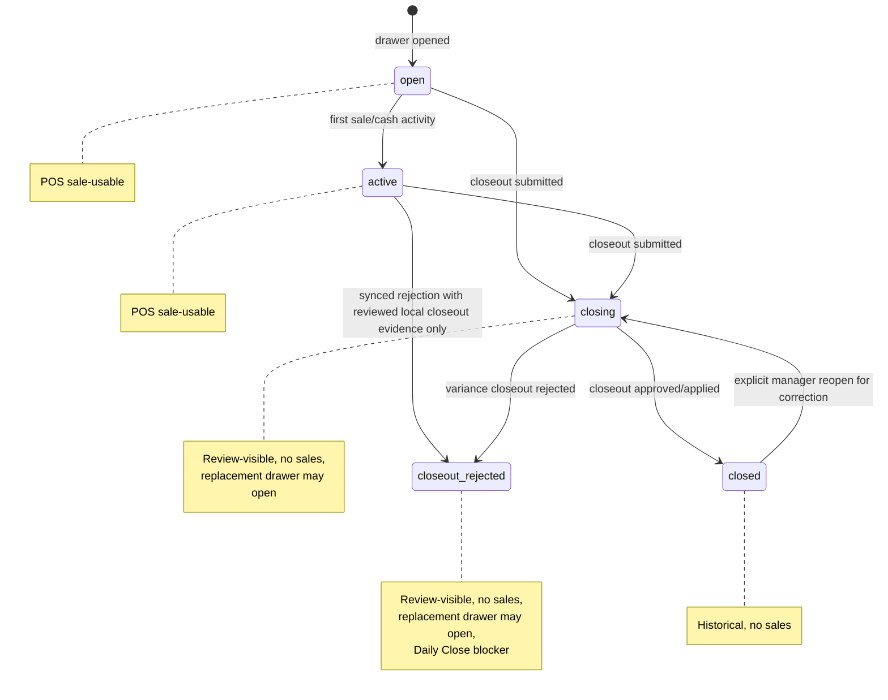
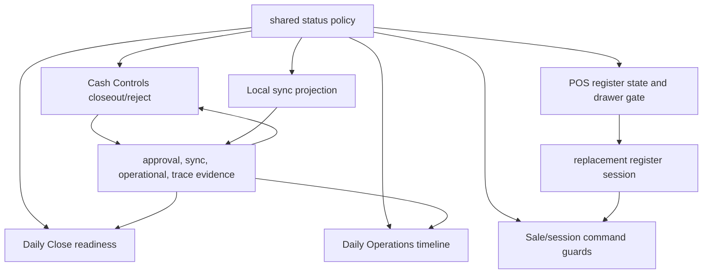

# fix: Add POS Closeout Rejected Lifecycle

## Summary

Add a distinct `closeout_rejected` register-session lifecycle state for variance closeouts that a manager rejects. The rejected drawer remains reviewable in Cash Controls, Daily Close, Daily Operations, workflow traces, and POS review gates, while POS treats it as non-sale-usable and opens future sales against a replacement register session.

---

## Problem Frame

Rejected variance closeouts currently have a path that patches the register session back to `active`, clearing counted-cash evidence and making the drawer look usable in POS. That creates two risks at once: operators lose the evidence behind the manager rejection, and stale clients can attach new sales to a drawer whose closeout was already submitted for review.

---

## Requirements

- R1. Rejected variance closeouts must enter a persisted review-only lifecycle state, not `active`.
- R2. `closeout_rejected` sessions must never be POS-sale-usable and must not receive new ordinary sale/session bindings.
- R3. `closeout_rejected` sessions must remain visible in Cash Controls, Daily Close, Daily Operations, workflow traces, and POS review affordances.
- R4. Rejection must preserve review evidence: counted cash, expected cash, variance, notes, approval/request context, local sync event context, operational event context, and trace context.
- R5. POS must offer opening a new register session after closeout submission, including a variance closeout still awaiting review, instead of making the submitted/rejected session look reusable.
- R6. A replacement drawer/session may open for the same terminal/register after a prior session has submitted a closeout, including a variance closeout still in `closing`, while the prior register-session id remains non-reusable for sales.
- R7. Sale attachment protections must live at command/projection boundaries, not only in frontend gates.
- R8. Daily Close must treat `closeout_rejected` as unresolved review work, not as an active drawer and not as a settled closed drawer.
- R9. Historical repair/backfill must be explicit and conservative; do not infer old bad states unless reliable rejection evidence exists.
- R10. Implementation must refresh Graphify after modifying code files.
- R11. Compatibility must be deployed before writes: validators, DTOs, local read models, public APIs, and terminal runtime status surfaces must accept `closeout_rejected` before any mutation can persist it.

---

## Scope Boundaries

- This plan does not redesign the manager approval model, staff proof consumption, or Cash Controls authority rules.
- This plan supersedes only the earlier assumption in `docs/plans/2026-06-23-001-refactor-pos-register-lifecycle-policy-plan.md` that no new register-session status would be introduced.
- This plan intentionally does not implement first-class settlement/correction commands. `closeout_rejected` blocks Daily Close completion until a later explicit settlement/correction action resolves it.
- This plan does not make runtime terminal status authoritative for sales. Runtime status remains evidence and diagnostics.
- This plan does not automatically backfill production sessions. Any repair must start with a read-only dry-run report and a separate decision.

### Deferred Follow-Up Work

- First-class settlement/correction commands that move `closeout_rejected` to a resolved state.
- Broader POS hub copy for every terminal lifecycle state beyond this closeout-rejected path.
- Production repair/backfill for historical wrongly-active rejected closeouts, unless reliable operational-event evidence makes a narrow repair safe during implementation.
- Cleanup of status labels in terminal health and cash-control tables beyond labels touched by this behavior.

---

## Context & Research

### Relevant Code and Patterns

- `packages/athena-webapp/shared/registerSessionStatus.ts` owns the durable status vocabulary and policy status sets.
- `packages/athena-webapp/shared/registerSessionLifecyclePolicy.ts` centralizes sale usability, drawer-authority blocking, replacement-drawer eligibility, and closeout-review conflict classification.
- `packages/athena-webapp/convex/schemas/operations/registerSession.ts` validates persisted register-session statuses.
- `packages/athena-webapp/convex/cashControls/deposits.ts` contains the synced closeout rejection path that currently patches `status: "active"` and clears closeout evidence.
- `packages/athena-webapp/convex/cashControls/closeouts.ts` handles direct async variance closeout review and already records `closeout_rejected` trace/evidence.
- `packages/athena-webapp/convex/operations/registerSessions.ts` owns status transitions, register-state lookup, open-drawer conflict detection, and register transaction cash recording.
- `packages/athena-webapp/convex/operations/dailyClose.ts` treats `open | active | closing` as active operational work and separately summarizes closed register sessions.
- `packages/athena-webapp/convex/operations/dailyOperations.ts` hard-codes daily operation register status grouping and must include the new review-only state.
- `packages/athena-webapp/src/lib/pos/presentation/register/useRegisterViewModel.ts` already distinguishes sale-usable active register sessions from closeout/review gate state, but `selectPassiveCloseoutBlockedRegisterSession()` is a null stub.
- `packages/athena-webapp/convex/pos/application/commands/completeTransaction.ts` already validates direct sale completion against POS-usable register status.
- `packages/athena-webapp/convex/pos/application/sync/projectLocalEvents.ts` handles offline/local event projection, closed-register replay exceptions, duplicate closeout conflicts, and reviewed sale projection.

### Institutional Learnings

- `docs/solutions/architecture/athena-pos-register-lifecycle-policy-2026-06-23.md`: keep drawer lifecycle decisions in a pure shared policy and distinguish reuse of the current drawer from opening a replacement drawer.
- `docs/solutions/logic-errors/athena-pos-drawer-invariants-at-command-boundaries-2026-04-24.md`: UI gates are not sufficient; drawer invariants must be enforced at Convex command boundaries.
- `docs/solutions/logic-errors/athena-pos-register-sync-closeout-review-recovery-2026-05-23.md`: closeout review approval/rejection must settle the source local sync event, not only the review row, while preserving closeout evidence.
- `docs/solutions/logic-errors/athena-pos-synced-closeout-readiness-2026-06-17.md`: do not clear history to unblock POS; preserve closeout evidence and interpret it correctly.
- `docs/solutions/logic-errors/athena-cash-controls-closeout-review-ia-2026-06-08.md`: closeout review should be presented as a decision packet with expected cash, counted cash, variance direction, and staff note.
- `docs/solutions/logic-errors/athena-pos-drawer-authority-replacement-recovery-2026-06-06.md`: drawer authority is local-register-session scoped; a replacement open can clear older recoverable blocks without making the old drawer sale-usable.
- `docs/solutions/logic-errors/athena-daily-close-store-day-boundary-2026-05-07.md`: Daily Close must re-read readiness server-side and block unresolved register/POS work before completion.

---

## Key Technical Decisions

- **Status name:** Use `closeout_rejected`, matching prior session discussion and existing trace vocabulary.
- **Sale usability:** Only `open | active` remain POS-sale-usable. `closeout_rejected`, `closing`, and `closed` cannot receive ordinary sale/session attachments.
- **Replacement eligibility:** A submitted closeout in `closing` and a rejected closeout in `closeout_rejected` do not conflict-block a replacement register session for the same terminal/register. The prior session remains review-visible, not sale-usable.
- **Compatibility sequencing:** Ship schema, DTO, public API, local read-model, and terminal-runtime acceptance before any mutation writes the new status.
- **Evidence preservation:** Do not clear `countedCash`, `expectedCash`, `variance`, `notes`, approval context, source sync event context, operational event context, or trace context.
- **Canonical evidence shape:** Treat canonical rejection evidence as the tuple of register-session status, approval request/decision, source sync conflict/event, operational event, and register-session trace. A separate append-only closeout record may be added only if implementation finds an existing local pattern that makes it cheap and safer.
- **Evidence-backed synced rejection transition:** General `active -> closeout_rejected` is invalid. The synced `register_closed` rejection path may move an `active` cloud session to `closeout_rejected` only through a narrow helper that requires scoped, reviewed local closeout evidence for that exact register session.
- **Reviewed replay exception:** Manager-reviewed historical replay must never create, bind, or update any sale/register transaction against `closed` or `closeout_rejected`. It may only preserve conflict/review evidence linked to those sessions.
- **Daily Close semantics:** `closeout_rejected` is an unresolved blocker. It is neither active register work nor closed-register evidence, and Daily Close cannot complete until explicit settlement/correction follow-up resolves it.
- **Historical repair:** Base delivery is forward-only. A dry-run audit may report candidates; no write repair ships without reliable evidence and separate approval.

---

## Lifecycle Model

### Lifecycle Policy Matrix

| Status | POS sale usable | Cash Controls visible | Register-state visible in POS | Blocks replacement drawer | Daily Close treatment |
| --- | --- | --- | --- | --- | --- |
| `open` | Yes | Yes | Yes | Yes | Active register work |
| `active` | Yes | Yes | Yes | Yes | Active register work |
| `closing` | No | Yes | Yes | No after closeout submission; yes only before the closeout packet exists | Closeout in progress / pending review |
| `closeout_rejected` | No | Yes | Yes as review-only gate | No for a new register session | Blocking unresolved review work |
| `closed` | No | Historical/detail | Sometimes for recent context | No | Closed register evidence |

---

## Implementation Units

### U1. Define Closeout-Rejected Status Policy

**Goal:** Add the persisted `closeout_rejected` status and shared behavior policies that every caller can consume.

**Requirements:** R1, R2, R3, R6, R11

**Dependencies:** None

**Files:**
- Modify: `packages/athena-webapp/shared/registerSessionStatus.ts`
- Modify: `packages/athena-webapp/shared/registerSessionStatus.test.ts`
- Modify: `packages/athena-webapp/shared/registerSessionLifecyclePolicy.ts`
- Modify: `packages/athena-webapp/shared/registerSessionLifecyclePolicy.test.ts`
- Modify: `packages/athena-webapp/convex/schemas/operations/registerSession.ts`
- Modify: `packages/athena-webapp/convex/schemas/pos/posTerminalRuntimeStatus.ts`
- Modify: `packages/athena-webapp/convex/pos/domain/types.ts`
- Modify: `packages/athena-webapp/convex/pos/application/commands/terminals.ts`
- Modify: `packages/athena-webapp/convex/pos/application/terminals.test.ts`
- Modify: `packages/athena-webapp/convex/pos/public/register.ts`
- Modify: `packages/athena-webapp/convex/pos/public/register.test.ts`
- Modify: `packages/athena-webapp/convex/pos/public/terminals.ts`
- Modify: `packages/athena-webapp/convex/pos/public/terminals.test.ts`
- Modify: `packages/athena-webapp/src/lib/pos/application/dto.ts`
- Modify: `packages/athena-webapp/src/lib/pos/infrastructure/local/terminalRuntimeStatus.ts`
- Modify: `packages/athena-webapp/src/lib/pos/infrastructure/local/terminalRuntimeStatus.test.ts`
- Modify: `packages/athena-webapp/src/lib/pos/infrastructure/local/registerReadModel.ts`
- Modify: `packages/athena-webapp/src/lib/pos/infrastructure/local/registerReadModel.test.ts`

**Approach:**
- Add `closeout_rejected` to the durable status vocabulary and schema validators.
- Keep review-only submitted closeouts, including `closing` with a closeout packet and `closeout_rejected`, out of POS-usable statuses and open-drawer conflict-blocking statuses.
- Add or update behavior-specific helpers for review visibility, Daily Close blocker visibility, and replacement drawer eligibility.
- Update DTO/runtime validators before any mutation writes the new status.

**Test scenarios:**
- `open` and `active` remain POS-sale-usable.
- `closeout_rejected` is valid, cash-control/review visible, and not POS-sale-usable.
- `closing` with a submitted closeout packet and `closeout_rejected` do not conflict-block replacement drawer opening.
- Unknown status strings still fail every schema/DTO/public-terminal validator.
- Public terminal/register responses and local read models accept and preserve `closeout_rejected` while rejecting unknown statuses.

**Verification:** Shared status, lifecycle-policy, public API, and local runtime/read-model tests prove the new status matrix before mutation or UI work depends on it.

### U2. Persist Rejected Variance Closeouts As Review-Only

**Goal:** Move rejected closeout paths to `closeout_rejected` while preserving counted-cash and variance evidence atomically.

**Requirements:** R1, R3, R4, R11

**Dependencies:** U1

**Files:**
- Modify: `packages/athena-webapp/convex/operations/registerSessions.ts`
- Modify: `packages/athena-webapp/convex/cashControls/deposits.ts`
- Modify: `packages/athena-webapp/convex/cashControls/closeouts.ts`
- Test: `packages/athena-webapp/convex/cashControls/registerSessions.test.ts`
- Test: `packages/athena-webapp/convex/cashControls/deposits.test.ts`
- Test: `packages/athena-webapp/convex/cashControls/closeouts.test.ts`
- Test: `packages/athena-webapp/convex/cashControls/registerSessionTraceLifecycle.test.ts`

**Approach:**
- Add transition helpers for `closing -> closeout_rejected` and for the narrow evidence-backed synced rejection path from `active -> closeout_rejected`.
- Update the synced closeout review rejection branch in `deposits.ts` so it no longer patches the session to `active` or clears evidence.
- Update direct async variance closeout rejection in `closeouts.ts` to leave the session in the explicit rejected state rather than relying only on approval request status and trace evidence.
- Keep duplicate closeout rejection semantics separate so duplicate evidence does not mutate unrelated already-closed sessions.
- Make the manager rejection action atomic across approval decision, source sync event/conflict row, register-session status, operational event, and trace milestone.

**Test scenarios:**
- Rejecting a variance closeout review patches the session to `closeout_rejected`.
- Rejecting a synced variance closeout keeps counted cash, expected cash, variance, notes, approval/sync context, and trace context.
- Duplicate closeout evidence does not mutate an unrelated already-closed session to `closeout_rejected`.
- General transition into `closeout_rejected` from `open`, ordinary `active`, or `closed` fails.
- Evidence-backed `active -> closeout_rejected` succeeds only when scoped reviewed `register_closed` evidence exists.
- Simulated failure paths do not leave split-brain state where review/sync rows are settled but the session remains sale-usable.
- The existing "reopens drawers left closing by rejected variance closeout reviews" regression expects review-only evidence and replacement eligibility, not `active`; POS does not need to wait for rejection to open the replacement once the closeout packet exists.

**Verification:** Cash-control backend tests prove rejected variance closeouts no longer return to `active`, no longer lose evidence, and cannot partially settle review metadata without session lifecycle alignment.

### U3. Expose Review-Only Sessions In Cash Controls, Daily Close, And Daily Operations

**Goal:** Keep `closeout_rejected` visible as unresolved review work without counting it as active sales work or completed closeout history.

**Requirements:** R3, R4, R8

**Dependencies:** U1, U2

**Files:**
- Modify: `packages/athena-webapp/convex/cashControls/closeouts.ts`
- Modify: `packages/athena-webapp/convex/cashControls/deposits.ts`
- Modify: `packages/athena-webapp/convex/operations/dailyClose.ts`
- Modify: `packages/athena-webapp/convex/operations/dailyOperations.ts`
- Modify: `packages/athena-webapp/src/components/cash-controls/CashControlsDashboard.tsx`
- Modify: `packages/athena-webapp/src/components/cash-controls/RegisterSessionView.tsx`
- Modify: `packages/athena-webapp/src/components/cash-controls/registerSessionColumns.tsx`
- Modify: `packages/athena-webapp/src/components/operations/DailyCloseView.tsx`
- Modify: `packages/athena-webapp/src/components/operations/DailyOperationsView.tsx`
- Test: `packages/athena-webapp/convex/cashControls/registerSessions.test.ts`
- Test: `packages/athena-webapp/convex/cashControls/deposits.test.ts`
- Test: `packages/athena-webapp/convex/operations/dailyClose.test.ts`
- Test: `packages/athena-webapp/convex/operations/dailyOperations.test.ts`
- Test: `packages/athena-webapp/src/components/cash-controls/CashControlsDashboard.test.tsx`
- Test: `packages/athena-webapp/src/components/cash-controls/RegisterSessionView.test.tsx`
- Test: `packages/athena-webapp/src/components/operations/DailyCloseView.test.tsx`
- Test: `packages/athena-webapp/src/components/operations/DailyOperationsView.test.tsx`

**Approach:**
- Update closeout snapshot queries/lists to include `closeout_rejected` in review/variance work surfaces.
- Query `closeout_rejected` sessions directly for Daily Close readiness by store/day/status instead of relying on pending approval requests.
- Define Daily Close summary treatment: rejected closeouts appear as unresolved blocker rows with counted/expected/variance evidence, do not increment closed register counts, do not contribute as settled `expectedCashTotal`, and should be called out separately from active drawer counts.
- Update Daily Operations register-status grouping so the status is visible in timeline/operation context.
- Keep completed Daily Close snapshots historical; do not recompute old completed snapshots just because the new status exists.

**Test scenarios:**
- Cash Controls dashboard shows a `closeout_rejected` session in unresolved variance/review work.
- Register detail shows rejected closeout evidence, variance, counted cash, notes, and timeline context.
- `closeout_rejected` does not appear as a live sellable drawer or as completed closeout history.
- Daily Close readiness finds a `closeout_rejected` session even when the approval request is no longer pending.
- Daily Close completion is blocked until settlement/correction follow-up resolves the status.
- Daily Operations surfaces the rejected closeout as review work, not a healthy closed drawer.
- Completed Daily Close snapshot history is not rewritten.

**Verification:** Cash Controls, Daily Close, and Daily Operations tests prove review-only sessions are visible and correctly categorized.

### U4. Make POS Gate Review-Only Sessions And Offer Replacement Opening

**Goal:** Ensure POS shows the rejected drawer as review-only and routes continued selling through a newly opened register session.

**Requirements:** R2, R3, R5, R6

**Dependencies:** U1, U2

**Files:**
- Modify: `packages/athena-webapp/convex/operations/registerSessions.ts`
- Modify: `packages/athena-webapp/convex/pos/infrastructure/repositories/registerSessionRepository.ts`
- Modify: `packages/athena-webapp/src/lib/pos/presentation/register/useRegisterViewModel.ts`
- Modify: `packages/athena-webapp/src/lib/pos/presentation/register/registerDrawerPresentation.ts`
- Modify: `packages/athena-webapp/src/components/pos/register/POSRegisterView.tsx`
- Modify: `packages/athena-webapp/src/components/pos/register/RegisterDrawerGate.tsx`
- Test: `packages/athena-webapp/convex/pos/application/getRegisterState.test.ts`
- Test: `packages/athena-webapp/convex/pos/application/sessionCommands.test.ts`
- Test: `packages/athena-webapp/convex/pos/infrastructure/repositories/registerSessionRepository.test.ts`
- Test: `packages/athena-webapp/src/lib/pos/presentation/register/useRegisterViewModel.test.ts`
- Test: `packages/athena-webapp/src/components/pos/register/POSRegisterView.test.tsx`
- Test: `packages/athena-webapp/src/components/pos/register/RegisterDrawerGate.test.tsx`

**Approach:**
- Keep open-register reuse paths limited to sale-usable sessions.
- Update register-state/repository mapping so POS can see `closeout_rejected` as drawer context for review/gate presentation.
- Replace the `selectPassiveCloseoutBlockedRegisterSession()` null stub with a selector that chooses non-sale-usable review sessions when they should drive the drawer gate.
- Keep `activeRegisterSessionId` derived only from `saleUsableActiveRegisterSession`.
- Ensure the drawer gate action makes opening a new drawer the primary path for continued sales while preserving compact review context for the rejected closeout.

**Test scenarios:**
- POS register state with `closeout_rejected` does not produce a sale-usable `activeRegisterSessionId`.
- POS drawer gate presents a path to open a replacement drawer/session after a variance closeout is submitted, even while the prior session remains `closing` for review.
- A newly opened replacement drawer becomes the sale-usable register session while the old `closing` or `closeout_rejected` drawer remains review-only context.
- Full sequence: variance closeout submitted, old session becomes review-only `closing`, replacement drawer opens, pending checkout/session/sale uses replacement id, manager later rejects the old closeout into `closeout_rejected`, and the old session receives no sale mutation.
- POS review chips/evidence remain visible enough to explain why the old drawer is paused.

**Verification:** POS tests prove rejected/closed review-only sessions are visible as gate context but cannot become sale attachment targets.

### U5. Harden Sale Attachment And Sync Projection Boundaries

**Goal:** Prevent direct, stale, and offline/local sync paths from attaching ordinary sales to `closeout_rejected` or `closed` sessions.

**Requirements:** R2, R6, R7

**Dependencies:** U1, U2

**Files:**
- Modify: `packages/athena-webapp/convex/operations/registerSessions.ts`
- Modify: `packages/athena-webapp/convex/pos/application/commands/sessionCommands.ts`
- Modify: `packages/athena-webapp/convex/pos/application/commands/expenseSessionCommands.ts`
- Modify: `packages/athena-webapp/convex/pos/application/commands/completeTransaction.ts`
- Modify: `packages/athena-webapp/convex/pos/application/commands/adjustTransactionItems.ts`
- Modify: `packages/athena-webapp/convex/pos/application/commands/correctTransaction.ts`
- Modify: `packages/athena-webapp/convex/pos/application/commands/createOrReusePendingCheckoutItem.ts`
- Modify: `packages/athena-webapp/convex/pos/public/catalog.ts`
- Modify: `packages/athena-webapp/convex/pos/public/transactions.ts`
- Modify: `packages/athena-webapp/convex/pos/application/sync/projectLocalEvents.ts`
- Modify: `packages/athena-webapp/convex/pos/application/sync/ingestLocalEvents.ts`
- Test: `packages/athena-webapp/convex/pos/application/sessionCommands.test.ts`
- Test: `packages/athena-webapp/convex/pos/application/expenseSessionCommands.test.ts`
- Test: `packages/athena-webapp/convex/pos/application/completeTransaction.test.ts`
- Test: `packages/athena-webapp/convex/pos/application/adjustTransactionItems.test.ts`
- Test: `packages/athena-webapp/convex/pos/application/correctTransaction.test.ts`
- Test: `packages/athena-webapp/convex/pos/application/correctTransactionPaymentMethod.test.ts`
- Test: `packages/athena-webapp/convex/pos/application/commands/createOrReusePendingCheckoutItem.test.ts`
- Test: `packages/athena-webapp/convex/pos/public/catalog.test.ts`
- Test: `packages/athena-webapp/convex/pos/public/transactions.test.ts`
- Test: `packages/athena-webapp/convex/pos/application/sync/projectLocalEvents.test.ts`
- Test: `packages/athena-webapp/convex/pos/application/sync/ingestLocalEvents.test.ts`

**Approach:**
- Replace ad hoc sale guards such as `status === "closing" || status === "closed"` or `status !== "open" && status !== "active"` with shared POS usability policy where the action is ordinary sale/session attachment.
- Keep reviewed historical projection exceptions explicit and scoped to conflict evidence. Reviewed replay must never create, bind, or update any sale/register transaction against `closed` or `closeout_rejected`; those sessions may only receive conflict/review evidence.
- Ensure `recordRegisterSessionTransaction` rejects sale adjustments on any non-POS-usable status.
- Ensure item adjustment, payment correction, pending checkout, catalog readiness, and transaction public API paths either reject `closeout_rejected` or intentionally operate only on already-completed historical sales without mutating the rejected drawer as a live sale target.

**Test scenarios:**
- Ordinary sale completion still succeeds for `open` and `active`.
- Ordinary sale completion with `closeout_rejected` returns a precondition failure.
- POS session start/resume/bind rejects a preferred or existing `closeout_rejected` register session.
- Pending checkout does not bind ordinary sale context to a rejected drawer.
- `recordRegisterSessionTransaction` rejects sale cash recording for `closeout_rejected`.
- Payment correction/adjustment paths that require an open drawer reject `closeout_rejected` through the same policy.
- Local/offline `sale_completed` against a `closeout_rejected` drawer creates or preserves review work instead of projecting ordinary sale attachment.
- Reviewed `sale_completed` replay against `closed` preserves conflict/review evidence only and does not create, bind, update, or cash-record a sale/register transaction against the closed session.
- Reviewed `sale_completed` replay against `closeout_rejected` preserves conflict/review evidence only and does not create, bind, update, or cash-record a sale/register transaction against the rejected session.

**Verification:** Backend command/projection tests prove stale clients and local sync cannot attach new sales to rejected or closed drawers.

### U6. Address Historical Repair And Operational Handoff

**Goal:** Make the rollout safe for existing data and ensure future implementers know whether backfill is required.

**Requirements:** R4, R8, R9, R10

**Dependencies:** U1, U2, U3, U4, U5

**Files:**
- Modify: `docs/solutions/logic-errors/athena-pos-register-sync-closeout-review-recovery-2026-05-23.md` if implementation changes the durable lesson.
- Modify: `docs/solutions/architecture/athena-pos-register-lifecycle-policy-2026-06-23.md` if the new status refines that policy boundary.
- Modify: `scripts/harness-app-registry.ts` only if harness review reports missing validation coverage for touched surfaces.
- Optional generate: read-only repair audit artifact/script if implementation finds reliable evidence.
- Generate: `graphify-out/*` via `bun run graphify:rebuild` after code changes.

**Approach:**
- Inspect whether rejected-closeout operational events and sync event metadata can identify wrongly-active sessions safely.
- If repair is plausible, first produce a dry-run report with candidate ids, evidence source, ambiguity reason, later sale/replacement checks, and proposed action. The default action is no write.
- If repair is not safe, document why new behavior is forward-only.
- Update durable learning docs only for substantive new policy decisions.
- Follow package testing guidance for POS register/session write paths, Cash Controls, Daily Close, Convex audit, typecheck, build, and Graphify rebuild.

**Test scenarios:**
- No test expectation for documentation-only updates; behavioral validation is covered in U1-U5.
- If a repair/backfill is added, it has fixtures for safe match, ambiguous later replacement session, missing evidence, later sale activity, and idempotent re-run.

**Verification:** Implementation handoff states whether historical repair was included or deferred, and Graphify is rebuilt after code changes.

---

## System-Wide Impact

- **Interaction graph:** Register-session status flows through schema validators, Cash Controls mutations, POS register-state queries, local/offline sync projection, POS view-model gates, terminal runtime status, workflow traces, Daily Operations, and Daily Close readiness.
- **Error propagation:** Stale sale attempts should fail with safe command-result/precondition messaging already used by POS drawer guards. Raw backend text should not surface in POS UI.
- **State lifecycle risks:** The key partial-write risk is resolving sync/review rows without patching the register session into the same review-only state. Manager rejection must settle the source sync event, conflict row, session status, operational event, and trace together.
- **API surface parity:** Public Convex validators and DTOs that serialize register-session status must accept `closeout_rejected`; browser code must still treat it as non-sale-usable.
- **Integration coverage:** Unit tests alone are insufficient because the change crosses manager review, sync projection, POS state, Daily Close, and Daily Operations. At least one integration test must prove replacement drawer opening and subsequent sale attachment to the new session.
- **Unchanged invariants:** `open | active` remain the only POS-sale-usable statuses. `closed` remains historical. Runtime status remains evidence, not authority.

---

## Risks & Dependencies

| Risk | Mitigation |
|------|------------|
| A validator or DTO misses the new status and rejects live data | U1 ships compatibility first across schemas, DTOs, local read models, public terminal/register APIs, and terminal runtime validators. |
| A mutation writes `closeout_rejected` before readers understand it | Sequence implementation/deploy so acceptance lands before writer changes, and keep tests proving serialization surfaces handle the state. |
| Review-only sessions disappear from Cash Controls, Daily Close, or Daily Operations | U3 adds explicit queries and tests for all review surfaces. |
| POS still cannot open a new drawer after closeout submission or rejection | U1/U4 keep review-only `closing` sessions with closeout packets and `closeout_rejected` out of conflict-blocking policy and add replacement flow tests. |
| Stale clients attach sales to the rejected drawer | U5 hardens command and sync projection boundaries using shared POS usability policy. |
| Evidence is lost during rejection | U2 requires preserving counted cash, variance, notes, approval, sync, operational, and trace context. |
| Review/sync rows settle while the session remains sale-usable | U2 requires atomic mutation behavior and split-brain regression tests. |
| Daily Close treats the rejected closeout as closed financial evidence | U3 defines it as a blocker that does not increment closed register counts or settled cash totals. |
| Historical bad sessions remain active | U6 treats repair as read-only audit first and a separate write decision. |

---

## Documentation / Operational Notes

- Implementation should update durable `docs/solutions/` guidance if the new `closeout_rejected` status changes the team's documented lifecycle policy.
- After modifying code files, run `bun run graphify:rebuild` from the repo root per `AGENTS.md`.
- If public Convex functions or generated client references change, refresh generated artifacts using the package guide: `bunx convex dev --once` from `packages/athena-webapp` when credentials are available.
- Recommended validation follows the POS register/session write path, Cash Controls, Daily Close, Daily Operations, Convex audit, typecheck/build, and harness review.

---

## Sources & References

- Related prior plan: `docs/plans/2026-06-23-001-refactor-pos-register-lifecycle-policy-plan.md`
- Related learning: `docs/solutions/architecture/athena-pos-register-lifecycle-policy-2026-06-23.md`
- Related learning: `docs/solutions/logic-errors/athena-pos-drawer-invariants-at-command-boundaries-2026-04-24.md`
- Related learning: `docs/solutions/logic-errors/athena-pos-register-sync-closeout-review-recovery-2026-05-23.md`
- Related learning: `docs/solutions/logic-errors/athena-pos-synced-closeout-readiness-2026-06-17.md`
- Related learning: `docs/solutions/logic-errors/athena-cash-controls-closeout-review-ia-2026-06-08.md`
- Related learning: `docs/solutions/logic-errors/athena-daily-close-store-day-boundary-2026-05-07.md`
- Code: `packages/athena-webapp/shared/registerSessionStatus.ts`
- Code: `packages/athena-webapp/shared/registerSessionLifecyclePolicy.ts`
- Code: `packages/athena-webapp/convex/cashControls/deposits.ts`
- Code: `packages/athena-webapp/convex/cashControls/closeouts.ts`
- Code: `packages/athena-webapp/convex/operations/registerSessions.ts`
- Code: `packages/athena-webapp/convex/operations/dailyClose.ts`
- Code: `packages/athena-webapp/convex/operations/dailyOperations.ts`
- Code: `packages/athena-webapp/src/lib/pos/presentation/register/useRegisterViewModel.ts`
- Code: `packages/athena-webapp/convex/pos/application/sync/projectLocalEvents.ts`
