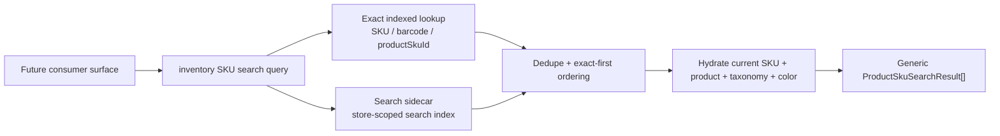

# Build Generic SKU Search Foundation

## Summary

Build a reusable backend SKU search foundation for Athena admin surfaces. The foundation will return SKU-first, consumer-neutral search results for every SKU in a store, including draft, archived, hidden, and visible rows, while keeping product page and stock-adjustment integrations as follow-up work.

---

## Problem Frame

Pagination reduced Convex load for SKU-heavy surfaces, but client-side filtering over a bounded page removed global SKU search. Athena needs a shared backend search contract that future consumers can call directly instead of each surface rebuilding local filtering over whichever SKU subset it already holds.

---

## Requirements

- R1. Provide a reusable Convex-owned SKU search foundation under inventory/catalog ownership, not a product table or stock-adjustment-specific implementation.
- R2. Return SKU-first generic results that can be adapted by products, stock adjustments, procurement, quick-add, activity lookup, and future admin surfaces.
- R3. Include all SKUs in search scope regardless of parent product availability, parent product visibility, SKU visibility, price, inventory state, or archive status.
- R4. Return all relevant SKU fields plus joined product, category, subcategory, color, and match metadata needed by downstream consumers.
- R5. Resolve exact SKU, barcode, and product SKU id matches before text search, using indexed/bounded backend reads.
- R6. Support backend-backed text search without local-first/browser-index requirements, and avoid unbounded store-wide scans.
- R7. Keep product page and stock-adjustment integration work out of this plan while documenting how those consumers should adopt the foundation later.
- R8. Include tests and guardrails that prove inclusion, field projection, store isolation, exact-first behavior, and bounded search execution.
- R9. Define an explicit v1 public query contract with named return validators and executable return-validator proof before implementation.
- R10. Provide an idempotent, batched repair/backfill path that is a deployment gate before follow-up consumers rely on text search.

---

## Scope Boundaries

- This plan does not integrate the search foundation into `Products.tsx`, `StockAdjustmentWorkspace.tsx`, procurement, quick-add, POS, or homepage picker surfaces.
- This plan does not replace POS register catalog search; POS keeps its stricter sellable/trusted visibility rules.
- This plan does not make search local-first. Frontend consumers may make backend calls and can debounce or cache later as a UI concern.
- This plan does not turn filters into workflow authority. Consumers remain responsible for applying their own visibility, availability, and operational policies.
- This plan does not require search results to be grouped by product or shaped for any table component.

### Deferred to Follow-Up Work

- Products page integration: adapt generic SKU results into product-grouped display only inside `packages/athena-webapp/src/components/products/Products.tsx`.
- Stock-adjustment integration: use generic SKU search for global lookup, then overlay stock-adjustment blocker/reservation state from stock-ops-specific queries.
- Procurement, quick-add, SKU activity, and homepage picker adoption: migrate each surface after the backend contract is stable.
- Optional frontend hook: add a shared React hook only after at least one consumer integration proves the client contract shape.

---

## Context & Research

### Relevant Code and Patterns

- `packages/athena-webapp/convex/schemas/inventory/product.ts` defines the canonical `productSku` fields: attributes, barcode metadata, color, images, visibility, inventory counts, length, pricing, product linkage, quantity, size, SKU, store, unit cost, and weight.
- `packages/athena-webapp/convex/schema.ts` already indexes `productSku` by `storeId`, `storeId+barcode`, and `storeId+sku`; exact lookup should build on these before text search.
- `packages/athena-webapp/convex/inventory/productSku.ts` has SKU retrieval and inventory-by-id helpers, but its existing APIs are not a generic search contract.
- `packages/athena-webapp/convex/inventory/products.ts` is product-first and has live/visible/product-table semantics; the foundation should not inherit `getAll` filtering behavior.
- `packages/athena-webapp/convex/stockOps/adjustments.ts` has SKU-first inventory snapshot helpers, but they filter archived products and include stock-adjustment policy, so they are not the generic search foundation.
- `packages/athena-webapp/src/lib/stockOps/skuSearch.ts` and `packages/athena-webapp/src/lib/search/fuzzySearch.ts` define existing admin search semantics: barcode-shaped input stays exact, and text search requires every meaningful token to match somewhere.
- `packages/athena-webapp/src/lib/pos/presentation/register/catalogSearch.ts` is the strongest local precedent for exact-first result classification, but POS visibility policy is narrower than this foundation.
- `packages/athena-webapp/convex/pos/infrastructure/repositories/catalogRepository.ts` contains POS helpers that use `.first()` for exact lookup and iterate store SKUs for text search; those helpers must not be reused for this foundation.
- `packages/athena-webapp/convex/inventory/categories.ts`, `packages/athena-webapp/convex/inventory/subcategories.ts`, and `packages/athena-webapp/convex/inventory/colors.ts` are taxonomy/color mutation surfaces that can change search text if the sidecar includes joined labels.

### Institutional Learnings

- `docs/solutions/logic-errors/athena-shared-sku-search-and-detail-surfaces-2026-05-27.md`: SKU search drifted when each surface owned its own term projection; keep one shared matcher/contract and include rich SKU metadata.
- `docs/solutions/logic-errors/athena-pos-register-local-catalog-search-2026-05-04.md`: exact identifiers should resolve before text ranking. This foundation keeps exact-first ordering but does not require a local-first runtime.
- `docs/solutions/performance/athena-pos-cart-latency-foundation-2026-05-05.md`: avoid full-catalog reactivity around volatile availability. This foundation may return current source SKU inventory fields, but search indexing/projection must not depend on cart holds or stock-adjustment policy.
- `docs/solutions/architecture/athena-store-ops-catalog-visibility-boundaries-2026-06-24.md`: visibility is a consumer policy. The foundation should expose lifecycle and visibility fields, not silently filter them.
- `docs/solutions/logic-errors/athena-procurement-url-state-pagination-2026-05-06.md`: future consumers should own route/query state; the foundation should avoid component-specific pagination behavior.

### External References

- Convex full-text search defines search indexes with one string `searchField`, optional equality `filterFields`, supports backend typeahead, relevance ordering, and pagination/take limits: https://docs.convex.dev/search/text-search
- Convex pagination is cursor-based and reactive, but pagination alone does not make an unselective query cheap: https://docs.convex.dev/database/pagination
- Convex best practices recommend indexes/search indexes or pagination instead of unbounded `collect()` for large result sets: https://docs.convex.dev/understanding/best-practices/
- Convex index guidance recommends defining indexed access paths in schema and using staged indexes for large backfills when needed: https://docs.convex.dev/database/reading-data/indexes/
- `docs/solutions/harness/convex-return-validator-contract-proof-2026-06-18.md` requires executable return-contract proof with `assertConformsToExportedReturns` for changed public Convex functions.

---

## Key Technical Decisions

- Use a SKU search sidecar/read-model table rather than adding a required search field directly to `productSku`: Convex search indexes require a string search field, and a sidecar avoids risky source-table schema/backfill coupling while keeping `productSku` as the source of truth.
- Hydrate results from current source documents after search: the sidecar powers lookup and relevance; the returned result carries current `productSku`, product, category, subcategory, and color fields.
- Keep exact lookup independent of full-text search: SKU, barcode, and product SKU id matches use existing indexed/direct lookup paths first, avoiding identifier surprises from tokenization and relevance ranking.
- Include all lifecycle and visibility states by default: the foundation is an inventory search primitive, not a sellability or storefront visibility policy.
- Return rich but bounded rows: results include all relevant SKU fields and joined context, but default and maximum limits keep backend payload size controlled.
- Do not extract frontend-local fuzzy search into this foundation yet: backend calls are acceptable for this work, and extraction can wait until consumer integrations prove a need for shared client-side adapters.
- Lock v1 to one non-paginated bounded query: pagination can be added later after the first consumers prove result-list needs; v1 returns a bounded result envelope with truncation metadata.
- Use null, not absence, for missing joined product/taxonomy/color context in public results; optional source SKU fields should also be normalized to explicit nulls unless the field is required by the source schema.

---

## V1 API Contract

The public query name may follow the final module naming chosen during implementation, but the generated API shape must be locked before code is written:

- **Args:** `storeId`, `query`, and optional `limit`.
- **Limits:** default result limit `25`, maximum result limit `50`, exact match read limit `10`, text candidate read limit `61` (`MAX_RESULT_LIMIT + EXACT_MATCH_LIMIT + 1`) before dedupe.
- **Response envelope:** `results`, `limit`, `truncated`, and `candidateOverflow`.
- **Result ordering:** exact product SKU id matches, exact SKU matches, exact barcode matches, then text matches.
- **Hydration cap:** dedupe candidate SKU ids first, slice to the requested effective limit, then hydrate source SKU/product/taxonomy/color documents.
- **Return validators:** define named validators for the result row and response envelope, such as `productSkuSearchResultValidator` and `productSkuSearchResponseValidator`, and attach the envelope validator as the public query `returns`.
- **Executable proof:** `packages/athena-webapp/convex/inventory/skuSearch.test.ts` must use `assertConformsToExportedReturns` for representative rich and sparse response envelopes.

### Result Fields

Each row should expose the following consumer-neutral fields. Nullable fields must be returned as `null` when source or joined data is missing.

- `productSkuId`
- `productSkuCreationTime`
- `storeId`
- `productId`
- `sku`
- `barcode`
- `barcodeAutoGenerated`
- `attributes`
- `colorId`
- `colorName`
- `colorHexCode`
- `images`
- `primaryImageUrl`
- `skuIsVisible`
- `inventoryCount`
- `length`
- `netPrice`
- `price`
- `productName`
- `quantityAvailable`
- `size`
- `unitCost`
- `weight`
- `product`: nullable object with `name`, `slug`, `description`, `availability`, `isVisible`, `currency`, `inventoryCount`, `quantityAvailable`, `areProcessingFeesAbsorbed`, `categoryId`, and `subcategoryId`.
- `category`: nullable object with `categoryId`, `name`, `slug`, `description`, and `showOnStorefront`.
- `subcategory`: nullable object with `subcategoryId`, `categoryId`, `name`, `slug`, and `description`.
- `match`: object with `kind`, `matchedValue`, and `rank`.

The contract intentionally omits full joined document passthrough. Future consumers that need additional fields should extend this named result contract explicitly rather than assuming joined-doc completeness.

---

## Open Questions

### Resolved During Planning

- Should the foundation be local-first? No. Backend calls are acceptable; local-first is not a requirement for this search foundation.
- Should the foundation include archived/draft/hidden SKUs? Yes. It should include all SKUs and expose status/visibility metadata for consumers to interpret.
- Should products and stock adjustments be active implementation scope? No. They are follow-up consumers only.

### Deferred to Implementation

- Exact sidecar table name and helper names: implementation should follow nearby Convex naming conventions once files are opened for editing without changing the public query args/result envelope above.
- Whether exact SKU/barcode lookups need normalized lowercase lookup fields: start from existing indexes and add normalized exact fields only if tests or real data show case/spacing drift.
- Backfill execution mechanics: implementation should choose the safest internal action/mutation batching primitive after checking current Convex deployment constraints, while preserving the required cursor-safe/idempotent behavior and count reporting defined in U2.

---

## High-Level Technical Design

> *This illustrates the intended approach and is directional guidance for review, not implementation specification. The implementing agent should treat it as context, not code to reproduce.*

The sidecar exists to make text search efficient. The public result exists to expose current catalog data, not to make the sidecar another catalog authority.

---

## Implementation Units

- U1. **Search Read Model Schema**

**Goal:** Add a store-scoped SKU search read model with a required text field suitable for Convex full-text search.

**Requirements:** R1, R3, R5, R6

**Dependencies:** None

**Files:**
- Create: `packages/athena-webapp/convex/schemas/inventory/productSkuSearch.ts`
- Modify: `packages/athena-webapp/convex/schemas/inventory/index.ts`
- Modify: `packages/athena-webapp/convex/schema.ts`
- Test: `packages/athena-webapp/convex/inventory/skuSearch.test.ts`

**Approach:**
- Define a sidecar/read-model table keyed by store and product SKU identity.
- Include `storeId`, `productSkuId`, `productId`, and a required string search text field.
- Add a search index over the text field with `storeId` as a filter field.
- Add ordinary lookup indexes for `storeId+productSkuId` and any repair/upsert path that needs to find sidecar rows deterministically.
- Treat the sidecar as search infrastructure only; do not duplicate every SKU field into it unless needed for lookup or repair.
- Add a hard projection-size contract: search text is scalar-only, capped to a maximum token count and maximum string length chosen during implementation, and excludes nested objects/arrays from `attributes` except scalar leaves converted through a deterministic flattener.

**Execution note:** Start with a schema/contract test that makes the sidecar's role explicit: search metadata lives in the sidecar, source-of-truth catalog fields live on `productSku` and related tables.

**Patterns to follow:**
- `packages/athena-webapp/convex/schema.ts` table/index naming by field order.
- `packages/athena-webapp/convex/schemas/inventory/index.ts` schema export convention.

**Test scenarios:**
- Happy path: a sidecar row can be associated with one store, one product SKU, one product, and non-empty search text.
- Edge case: schema supports sidecar rows for archived/hidden SKUs because lifecycle policy is not encoded in the sidecar.
- Edge case: oversized attributes or deeply nested metadata are truncated/ignored according to the scalar-only projection-size contract.
- Integration: source-level guard verifies the new search table has a search index filtered by `storeId`.

**Verification:**
- The schema defines a search-indexed read model without changing existing `productSku` source fields or product table behavior.

---

- U2. **Search Projection Maintenance**

**Goal:** Add reusable backend helpers to create, update, repair, and backfill SKU search read-model rows from source catalog data.

**Requirements:** R1, R3, R4, R6, R10

**Dependencies:** U1

**Files:**
- Create: `packages/athena-webapp/convex/inventory/skuSearch.ts`
- Modify: `packages/athena-webapp/convex/inventory/products.ts`
- Modify: `packages/athena-webapp/convex/inventory/catalogImport.ts`
- Modify: `packages/athena-webapp/convex/pos/application/commands/quickAddCatalogItem.ts`
- Modify: `packages/athena-webapp/convex/pos/application/commands/createOrReusePendingCheckoutItem.ts`
- Modify: `packages/athena-webapp/convex/pos/public/catalog.ts`
- Modify: `packages/athena-webapp/convex/inventory/categories.ts`
- Modify: `packages/athena-webapp/convex/inventory/subcategories.ts`
- Modify: `packages/athena-webapp/convex/inventory/colors.ts`
- Test: `packages/athena-webapp/convex/inventory/skuSearch.test.ts`

**Approach:**
- Build search text from stable identity/descriptive fields: SKU, barcode, product name, SKU productName fallback, category/subcategory names and slugs, color name, size, length, weight, and variant attributes that are already stored on the SKU.
- Exclude volatile operational policy from the search text: cart holds, stock-adjustment blockers, POS availability policy, and consumer-specific visibility decisions.
- Provide a reusable projection helper that can be called from SKU/product write paths and an internal repair/backfill entry point for existing data.
- Keep helper calls near existing catalog write boundaries, but avoid dragging product-page or stock-adjustment UI behavior into the foundation.
- Enumerate and cover all source write paths that can change search text. Known paths to audit include `packages/athena-webapp/convex/inventory/products.ts`, `packages/athena-webapp/convex/inventory/catalogImport.ts`, `packages/athena-webapp/convex/pos/application/commands/quickAddCatalogItem.ts`, `packages/athena-webapp/convex/pos/application/commands/createOrReusePendingCheckoutItem.ts`, barcode attachment in `packages/athena-webapp/convex/pos/public/catalog.ts`, product/category mutations in `packages/athena-webapp/convex/inventory/categories.ts`, subcategory mutations in `packages/athena-webapp/convex/inventory/subcategories.ts`, and color mutations in `packages/athena-webapp/convex/inventory/colors.ts`.
- Explicitly classify inventory-only patches, quantity changes, reservation/hold changes, and stock-adjustment blocker changes as not requiring projection updates unless they modify fields in the search text contract.
- Handle taxonomy/product/color drift either by fan-out refreshing affected sidecar rows during those mutation paths or by requiring a repair/backfill run after such changes. The plan prefers fan-out for bounded single-record changes and repair/backfill for broad legacy cleanup.
- Treat repair/backfill as a deployment gate before follow-up consumers rely on text search. It must be idempotent, batched, cursor-safe, and report counts for scanned source SKUs, upserted sidecars, unchanged sidecars, duplicate sidecars collapsed, stale/orphan sidecars removed, and source orphans detected.

**Execution note:** Add characterization tests for projection text before wiring write paths so later search relevance changes are intentional.

**Patterns to follow:**
- `packages/athena-webapp/convex/inventory/catalogImport.ts` for catalog import/finalization write boundaries.
- `packages/athena-webapp/convex/pos/application/commands/quickAddCatalogItem.ts` for quick-add SKU creation.
- `packages/athena-webapp/src/lib/stockOps/skuSearch.ts` for the existing list of searchable SKU terms, adapted server-side rather than imported from `src`.

**Test scenarios:**
- Happy path: projection text includes SKU, barcode, product name, category, subcategory, color, size, length, weight, and relevant SKU attributes when present.
- Edge case: projection text is still non-empty when product/category/color documents are missing but SKU identity fields exist.
- Edge case: archived, draft, hidden, zero-price, and out-of-stock SKUs all receive projection rows.
- Integration: invoking the repair/backfill helper creates or updates sidecar rows without creating duplicates for the same `storeId+productSkuId`.
- Integration: category, subcategory, color, product, SKU, quick-add, pending checkout, import, and barcode-attachment mutations that change search text update or schedule update of affected sidecar rows.
- Integration: inventory-only patches do not rewrite sidecar rows.
- Integration: repair/backfill returns the required count fields and can resume from a cursor without duplicating sidecar rows.
- Error path: helper skips or reports missing SKU/product relationships without breaking the whole batch.

**Verification:**
- Existing and newly written SKUs can be represented in the search read model, and projection maintenance is reusable by multiple write paths.

---

- U3. **Generic Backend Search Query**

**Goal:** Add a public, bounded Convex query that returns generic SKU-first search results with exact-first ordering and backend text search.

**Requirements:** R1, R2, R3, R4, R5, R6, R9

**Dependencies:** U1, U2

**Files:**
- Modify: `packages/athena-webapp/convex/inventory/skuSearch.ts`
- Test: `packages/athena-webapp/convex/inventory/skuSearch.test.ts`

**Approach:**
- Accept only store id, query string, and optional limit for v1; do not add pagination args in this foundation plan.
- Return empty results for blank text unless the query can be interpreted as a direct product SKU id. Do not provide an all-store listing fallback.
- Run exact lookup first using direct id lookup and new inventory-owned bounded helpers over existing `by_storeId_sku` / `by_storeId_barcode` indexes. These helpers must use `.take(maxExactMatches + 1)` or equivalent bounded reads, not `.first()`, so duplicate identifiers are visible.
- Run text lookup only through the sidecar search index with `storeId` inside `withSearchIndex`.
- Merge exact and text hits, dedupe by product SKU id, keep exact matches first, and expose match metadata such as kind, matched identifier, and rank bucket.
- Slice deduped candidate ids to the effective result limit before hydrating current SKU, product, category, subcategory, and color fields.
- Hydrate from `productSku` as the source of truth, verify `sku.storeId === args.storeId`, and never let stale sidecar `storeId` or `productId` leak or suppress a valid source SKU.
- Return null joined context when related product/taxonomy/color docs are missing; do not omit the fields or throw.
- Return the exact V1 API Contract fields and no product-table, stock-adjustment, POS, or UI-specific fields.
- Add an explicit guard banning reuse of POS `listMatchingStoreSkus` or any other helper that iterates `productSku.by_storeId` for text search.

**Execution note:** Implement behavior test-first; this query is the shared contract future UI work will depend on.

**Patterns to follow:**
- `packages/athena-webapp/convex/pos/application/queries/searchCatalog.ts` for exact-first lookup structure, without adopting POS visibility filtering.
- `packages/athena-webapp/convex/pos/public/catalog.ts` for explicit return validators.
- `docs/solutions/harness/convex-return-validator-contract-proof-2026-06-18.md` for executable public return-validator proof.
- Convex search docs for `withSearchIndex` filter placement and `take`/pagination limits.

**Test scenarios:**
- Happy path: exact barcode query returns matching SKU rows before text matches and marks them as exact barcode matches.
- Happy path: exact SKU query returns matching SKU rows before text matches and marks them as exact SKU matches.
- Happy path: product SKU id query returns the SKU when it belongs to the requested store.
- Happy path: text query returns sidecar-backed matches hydrated with current SKU and joined product/category/subcategory/color fields.
- Edge case: archived product SKU, draft product SKU, hidden product SKU, hidden parent product, zero-price SKU, and out-of-stock SKU all appear when matching.
- Edge case: duplicate exact barcode or SKU values return bounded multiple exact matches instead of silently choosing one.
- Edge case: missing product/category/subcategory/color docs yield null joined context but preserve SKU identity and source fields.
- Error path: query never returns a SKU from another store through exact id, exact barcode/SKU, or text paths.
- Integration: source-level guard or behavior test proves text lookup uses the search index rather than scanning `productSku.by_storeId` and filtering in code.
- Integration: rich and sparse representative response envelopes conform to the exported `returns` validator through `assertConformsToExportedReturns`.

**Verification:**
- Future consumers can call one backend query and receive generic, complete SKU result rows without knowing product table, stock adjustment, or POS catalog internals.

---

- U4. **Contract Tests And Consumer Handoff Notes**

**Goal:** Lock the foundation contract and document how future integrations should consume it without coupling this plan to any one UI.

**Requirements:** R2, R4, R7, R8, R9, R10

**Dependencies:** U3

**Files:**
- Test: `packages/athena-webapp/convex/inventory/skuSearch.test.ts`
- Modify: `packages/athena-webapp/docs/agent/code-map.md`
- Modify: `docs/solutions/logic-errors/athena-shared-sku-search-and-detail-surfaces-2026-05-27.md` or create a follow-up solution note after implementation

**Approach:**
- Add tests that treat the result shape as a stable contract for future consumers.
- Document active non-consumers and future adapter responsibilities: products group results by product, stock adjustments overlay blocker/reservation state, POS applies sellability policy, procurement maps results into recommendations or line items.
- Include a note that frontend callers may debounce backend calls, but the foundation itself remains backend-owned.
- Document the deployment gate: text-search consumers must wait until sidecar repair/backfill has populated current store rows and reported no unresolved source/orphan issues requiring operator action.

**Patterns to follow:**
- `packages/athena-webapp/convex/lib/returnValidatorContract.test.ts` for contract-proof mindset.
- `packages/athena-webapp/docs/agent/code-map.md` for discoverability of shared backend modules.
- `docs/solutions/logic-errors/athena-shared-sku-search-and-detail-surfaces-2026-05-27.md` for institutional search guidance.

**Test scenarios:**
- Happy path: representative rich SKU result includes all source SKU fields plus joined context and match metadata.
- Edge case: sparse SKU result with optional fields absent still satisfies the return validator.
- Integration: tests prove no product grouping, table-specific pagination, or stock-adjustment blocker fields are required in the generic result.
- Integration: executable return-validator proof covers rich and sparse response envelopes for the public query.
- Error path: unknown or stale sidecar rows are ignored or repaired without leaking invalid results.

**Verification:**
- The contract is discoverable, tested, and ready for follow-up consumer integration plans.

---

## System-Wide Impact

- **Interaction graph:** New inventory search query becomes a shared backend entry point. Existing product, stock adjustment, procurement, quick-add, and POS surfaces remain unchanged in this plan.
- **Error propagation:** Search should return bounded empty/stale-safe results rather than throwing for missing related docs; true invalid store/query arguments should fail through normal Convex validation.
- **State lifecycle risks:** The sidecar can drift from `productSku` or mutable product/taxonomy/color labels unless write paths and repair/backfill flows are covered. The plan mitigates this with projection helpers, explicit write-path coverage, and deployment-gate repair tests.
- **API surface parity:** Future consumers should depend on the generic result contract rather than recreating SKU term arrays or using product-table-specific APIs.
- **Integration coverage:** Consumer integration tests are deferred; this plan focuses on backend contract and read-model correctness.
- **Unchanged invariants:** POS sellability rules, stock-adjustment blocker rules, product table grouping, and storefront visibility policies are not changed.

---

## Risks & Dependencies

| Risk | Mitigation |
|------|------------|
| Search sidecar drifts from catalog source data | Centralize projection helpers, wire key write paths including taxonomy/color changes, and provide internal repair/backfill coverage. |
| Rich result rows become too large | Enforce conservative default/max limits and hydrate only bounded candidate ids. |
| Future consumers forget to filter hidden/archived SKUs where needed | Return explicit lifecycle/visibility fields and document consumer policy responsibilities. |
| Search index rollout needs existing rows populated | Treat idempotent repair/backfill as a deployment gate before consumer integration, with count reporting and orphan cleanup. |
| Existing exact SKU/barcode data has case or whitespace inconsistencies | Start with existing indexed fields, then add normalized exact lookup fields only if implementation tests expose the need. |
| New Convex search-index pattern is unfamiliar in this repo | Ground implementation in official Convex docs and add source/behavior tests around index usage. |

---

## Documentation / Operational Notes

- Implementation should run Convex generation through the repo-supported flow when new Convex exports are added.
- After code implementation, run `bun run graphify:rebuild` because Athena requires graph refresh after code changes.
- Backfill/repair execution should be documented in the PR as a required deployment gate before follow-up consumers rely on text search.
- Follow-up integration work should be planned separately so products and stock adjustments can add UX-specific loading, debounce, empty-state, and adapter behavior deliberately.

---

## Sources & References

- Repo guide: `AGENTS.md`
- Athena webapp guide: `packages/athena-webapp/AGENTS.md`
- Current SKU schema: `packages/athena-webapp/convex/schemas/inventory/product.ts`
- Current category schema: `packages/athena-webapp/convex/schemas/inventory/category.ts`
- Current subcategory schema: `packages/athena-webapp/convex/schemas/inventory/subcategory.ts`
- Current color schema: `packages/athena-webapp/convex/schemas/inventory/color.ts`
- Current product SKU indexes: `packages/athena-webapp/convex/schema.ts`
- Existing SKU matcher: `packages/athena-webapp/src/lib/stockOps/skuSearch.ts`
- POS exact-first search precedent: `packages/athena-webapp/src/lib/pos/presentation/register/catalogSearch.ts`
- POS backend helper to avoid reusing for generic text search: `packages/athena-webapp/convex/pos/infrastructure/repositories/catalogRepository.ts`
- Existing product workspace search consumer: `packages/athena-webapp/src/components/products/Products.tsx`
- Existing stock adjustment search consumer: `packages/athena-webapp/src/components/operations/StockAdjustmentWorkspace.tsx`
- Subcategory mutation path: `packages/athena-webapp/convex/inventory/subcategories.ts`
- Related learning: `docs/solutions/logic-errors/athena-shared-sku-search-and-detail-surfaces-2026-05-27.md`
- Related learning: `docs/solutions/logic-errors/athena-pos-register-local-catalog-search-2026-05-04.md`
- Related learning: `docs/solutions/performance/athena-pos-cart-latency-foundation-2026-05-05.md`
- Related learning: `docs/solutions/architecture/athena-store-ops-catalog-visibility-boundaries-2026-06-24.md`
- Return-validator contract learning: `docs/solutions/harness/convex-return-validator-contract-proof-2026-06-18.md`
- Convex full-text search: https://docs.convex.dev/search/text-search
- Convex pagination: https://docs.convex.dev/database/pagination
- Convex best practices: https://docs.convex.dev/understanding/best-practices/
- Convex indexes: https://docs.convex.dev/database/reading-data/indexes/
