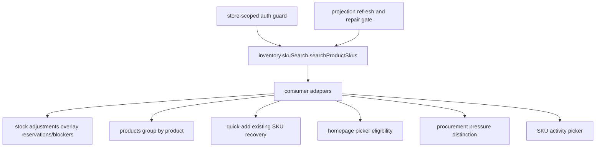
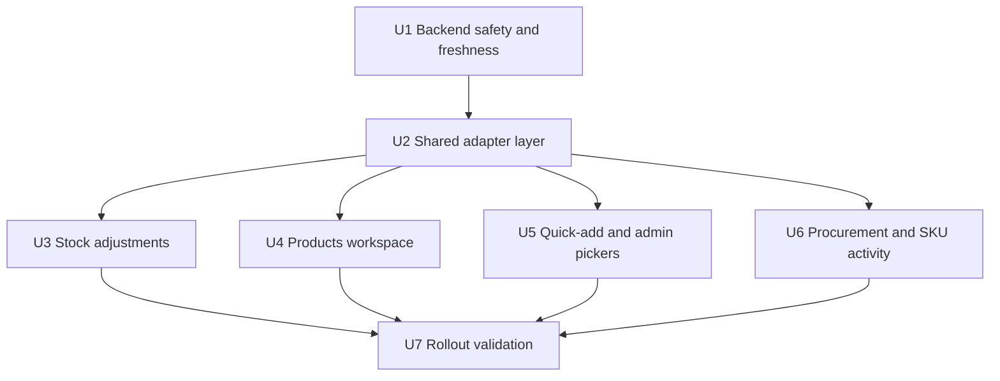
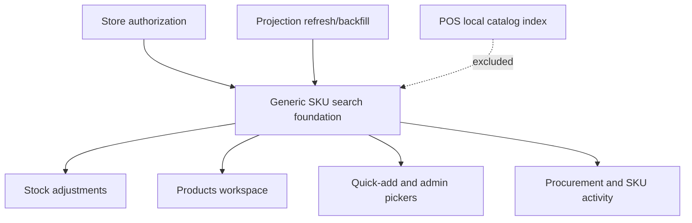

# Integrate SKU Search Foundation Across Admin Surfaces

## Summary

Integrate the generic SKU search foundation from PR #564 into Athena's non-POS admin search surfaces by first hardening access and projection freshness, then adapting results into stock adjustments, products, quick-add recovery, admin product pickers, procurement, and SKU activity. POS and expense flows remain out of scope because they rely on the local catalog index path.

---

## Problem Frame

PR #564 landed the reusable `productSkuSearch` sidecar and `inventory.skuSearch.searchProductSkus` query, but deliberately left consumer adoption for follow-up work. Current admin surfaces still search only locally loaded or page-capped rows, so global SKU/barcode/product lookup remains incomplete outside the backend foundation.

---

## Assumptions

*This plan was authored without synchronous user confirmation. The items below are agent inferences that fill gaps in the input and should be reviewed before implementation proceeds.*

- `searchProductSkus` should enforce authorization at the Convex query boundary rather than relying on each UI consumer to wrap it correctly.
- Stock adjustments and products are the first user-facing adoption targets because PR #564 and prior sessions named them explicitly.
- Procurement, quick-add barcode recovery, homepage product pickers, promo-code selected-products tables, complimentary-product selectors, and SKU activity lookup are relevant non-POS surfaces because they currently perform SKU/product lookup over local or domain-specific result sets.
- Expense and POS register search are excluded together because their lookup behavior depends on the POS local catalog index rather than the admin-side backend search foundation; POS-origin and expense-origin canonical SKU writes still need projection freshness coverage when they mutate sidecar discovery fields.
- Products search should stay product-grouped while exposing matched SKU context, instead of replacing the products workspace with a SKU-level table.

---

## Requirements

- R1. Preserve the generic SKU search foundation contract from PR #564: consumers call the foundation and adapt locally rather than adding product-table, stock-adjustment, homepage, procurement, or POS-specific fields to `searchProductSkus`.
- R2. Enforce store-scoped authorization for generic SKU search and protect or internalize repair/backfill/stale-cleanup entry points before browser consumers rely on them.
- R3. Wire projection refresh helpers into canonical product/SKU/product-taxonomy/color write paths that mutate fields used for candidate discovery or sidecar validity, including SKU, barcode, product/taxonomy/color searchable text, source identity, deletion, and stale cleanup, even when those writes originate from POS or expense subsystems whose search consumers remain excluded.
- R4. Treat repair/backfill and stale sidecar cleanup as a deployment gate before text search is considered complete in consumer surfaces, including drifted rows where canonical source data still exists but searchable text or sidecar lookup fields are stale.
- R5. Integrate stock adjustments so query text can find authorized store SKUs outside the loaded inventory page while preserving reservation/blocker overlays, mode, category, active SKU, and URL-state behavior.
- R6. Integrate the products workspace so SKU/barcode/product text searches all store SKUs and groups matches by product without duplicating product rows.
- R7. Integrate quick-add barcode recovery so existing unbarcoded SKUs can be found through backend search rather than parent-provided in-memory options.
- R8. Integrate secondary admin product/SKU pickers, including homepage, promo-code selected-products, and complimentary-product selectors, using the generic search foundation with picker-specific eligibility filters.
- R9. Integrate procurement and SKU activity lookup so catalog matches are distinguishable from domain-specific actionable results.
- R10. Keep POS register/local catalog search out of scope and avoid changing local-first POS search semantics.
- R11. Cover each feature-bearing unit with specific backend, adapter, and UI tests so global search parity is proven without relying on manual inspection.

---

## Scope Boundaries

- This plan does not change PR #564's public response envelope, result row contract, matching order, exact-first semantics, or limit behavior.
- This plan does not replace POS register catalog search or POS local index behavior.
- This plan does not exclude POS-origin canonical SKU writes from projection freshness; only POS search consumers are excluded.
- This plan does not make the foundation encode consumer policy such as stock-adjustment blockers, homepage eligibility, storefront visibility, sellability, or procurement pressure.
- This plan does not introduce backend pagination to `searchProductSkus` v1; consumers should handle truncation and refinement messaging.
- This plan does not broaden product, promo-code, complimentary-product, POS, expense, or stock snapshot queries to simulate global search.
- This plan does not require a visual redesign of any surface beyond the states needed to make backend-backed search understandable.

### Deferred to Follow-Up Work

- Inventory import review search: keep using its import-specific SKU context unless a later product decision calls for interactive catalog search there.
- Archived and unresolved product subroutes: audit during products integration, but only wire generic search if those routes expose interactive SKU/product search that currently suffers from page-capped local results.
- Future shared autocomplete component: add only after multiple consumers prove the same interaction contract; this plan may introduce adapters, but not a broad component-system refactor.

---

## Context & Research

### Relevant Code and Patterns

- `packages/athena-webapp/convex/inventory/skuSearch.ts` defines `searchProductSkus`, result validators, exact-first ordering, canonical hydration, repair/backfill, stale cleanup, and projection refresh helpers.
- `packages/athena-webapp/convex/schemas/inventory/productSkuSearch.ts` and `packages/athena-webapp/convex/schema.ts` define the sidecar table, exact lookup indexes, source refresh indexes, and store-filtered text search index.
- `packages/athena-webapp/src/components/stock-ops/SkuSearchFilterBar.tsx` is the shared UI control already used by products and stock adjustments.
- `packages/athena-webapp/src/lib/stockOps/skuSearch.ts` carries local matcher behavior, including exact barcode-shaped query handling, that should remain useful for loaded-row filtering and tests.
- `packages/athena-webapp/convex/pos/application/commands/quickAddCatalogItem.ts`, `packages/athena-webapp/convex/pos/application/commands/createOrReusePendingCheckoutItem.ts`, and `packages/athena-webapp/convex/pos/public/catalog.ts` are POS-origin canonical SKU writers even though POS search remains local-indexed.
- `packages/athena-webapp/convex/stockOps/adjustments.ts` owns inventory snapshot rows, pagination, reservation overlays, provisional/POS blocker state, and stock-adjustment row shaping.
- `packages/athena-webapp/src/components/operations/StockAdjustmentWorkspace.tsx` filters local `inventoryItems`, manages mode/category/query/active-SKU URL state, and renders outside-category recovery behavior.
- `packages/athena-webapp/src/components/products/Products.tsx` currently loads inventory snapshot data, builds product groups, filters locally, and opens quick-add from unmatched searches.
- `packages/athena-webapp/src/components/product/QuickAddProductDialog.tsx` supports existing-SKU barcode recovery from parent-provided options.
- `packages/athena-webapp/src/components/homepage/HomepageProductPickerDialog.tsx` is used by best-seller, featured-section, and shop-look product/SKU placement dialogs.
- `packages/athena-webapp/src/components/promo-codes/PromoCodeForm.tsx` and `packages/athena-webapp/src/components/promo-codes/selectable-products-table/data-table-toolbar.tsx` provide selected-products promo-code filtering over local table state.
- `packages/athena-webapp/src/components/products/complimentary/AddComplimentaryProduct.tsx` uses the same selectable-products table pattern for complimentary-product creation.
- `packages/athena-webapp/src/components/procurement/ProcurementView.tsx` searches replenishment recommendations, not arbitrary catalog SKUs.
- `packages/athena-webapp/src/routes/_authed/$orgUrlSlug/store/$storeUrlSlug/operations/sku-activity.tsx` currently expects exact SKU identity rather than offering a generic picker.

### Institutional Learnings

- `docs/solutions/performance/athena-generic-product-sku-search-sidecar-2026-06-25.md`: consumer integrations must call `inventory.skuSearch.searchProductSkus`, adapt locally, and run repair/backfill plus stale cleanup before relying on text search.
- `docs/solutions/logic-errors/athena-shared-sku-search-and-detail-surfaces-2026-05-27.md`: SKU search drifted when each surface owned its own term projection; keep one shared contract and preserve rich SKU metadata.
- `docs/solutions/logic-errors/athena-stock-adjustment-category-filter-and-terminal-repair-2026-06-02.md`: stock-adjustment category filters must not become hidden workflow authority; outside-category matches need recovery rather than silent empty states.
- `docs/solutions/architecture/athena-product-page-single-sku-provisional-trusted-finalization-2026-06-23.md`: product-page SKU state can include provisional/trusted lifecycle edges; adapters should expose lifecycle status instead of assuming visible live products only.
- Prior sessions for PR #564 rejected widening capped product/stock queries, rejected coupling the foundation to products UI, and required reviewer alignment on performance, correctness, data integrity, and API contract constraints.

### Related PRs and Tickets

- PR #564, `feat: add generic SKU search foundation`, merged on 2026-06-25 with follow-up work explicitly called out for products and stock adjustments.
- PR #564 tracked V26-851, V26-852, V26-853, and V26-854.

### External References

- No new external research is needed. The implementation uses the already-landed Convex search/index foundation and local application patterns.

---

## Key Technical Decisions

| Decision | Rationale |
|---|---|
| Enforce authorization inside the generic query, and protect repair/cleanup entry points or make them internal-only before UI adoption. | Browser-callable SKU search and store-scoped repair mutations can expose or mutate catalog search metadata if store id is the only guard. |
| Add consumer adapters instead of changing the foundation contract. | PR #564 aligned reviewers around a generic SKU-first contract; consumer-specific policy belongs in stock, products, homepage, procurement, and SKU-activity adapters. |
| Treat projection refresh for discovery fields as enabling work across all canonical SKU writers, not optional cleanup. | Text search completeness depends on sidecar freshness for indexed/searchable data; POS and expense search consumers stay excluded, but their canonical SKU writes can still affect admin search. Returned inventory fields are canonically hydrated and do not require projection rewrites when they are not part of sidecar lookup/search text. |
| Reuse `buildInventorySnapshotRowsForProductSkusWithCtx` for stock-adjustment overlays. | The stock workspace already has correct reservation/blocker calculations; the generic foundation should provide candidate SKU identity, not duplicate stock policy. |
| Group products-page search results by `productId`. | The foundation is SKU-first, while the products workspace is product-first. Grouping preserves the current table shape and still surfaces matched SKU context. |
| Add async search capability to quick-add recovery instead of requiring parents to pass all options. | Parent-provided options recreate the page-capped/local-list problem that PR #564 was built to solve. |
| For procurement, distinguish "catalog SKU found" from "procurement action found." | A global SKU result can be valid catalog data without a replenishment recommendation; the UI should explain that state. |

---

## Open Questions

### Resolved During Planning

- Should POS be included? No. POS register search remains out of scope because it uses a local catalog index with stricter sellability/trusted visibility rules.
- Should consumers add fields to `searchProductSkus` for their workflows? No. Consumers adapt the generic hydrated row locally.
- Should products search become SKU-level? No. Keep product grouping and expose matched SKU context inside grouped rows.
- Should text search be considered complete before backfill and stale cleanup? No. Repair/backfill and cleanup are a rollout gate.

### Deferred to Implementation

- Exact access helper to call from `searchProductSkus` and repair/cleanup mutations: choose the local auth helper that matches authenticated admin/store membership once implementers inspect current inventory auth conventions, or move repair/cleanup behind internal-only operational entry points.
- Exact debounce timing and loading affordances: choose values consistent with nearby search bars and tests.
- Whether archived/unresolved product subroutes need active integration: audit during products implementation and wire only if they expose the same local-search limitation.
- How much shared adapter code to extract after implementing two consumers: start narrow and extract only repeated mapping/state logic that has proven identical.

---

## High-Level Technical Design

> *This illustrates the intended approach and is directional guidance for review, not implementation specification. The implementing agent should treat it as context, not code to reproduce.*

The foundation remains a broad SKU identity/search primitive. Consumers decide eligibility, grouping, disabled states, and empty-state copy after receiving hydrated generic rows.

---

## Implementation Units

- U1. **Backend Safety and Projection Freshness**

**Goal:** Make generic SKU search safe and fresh enough for browser consumers by covering all canonical SKU discovery-field writers, including POS-origin writers whose search UI remains excluded.

**Requirements:** R2, R3, R4, R11

**Dependencies:** None

**Files:**
- Modify: `packages/athena-webapp/convex/inventory/skuSearch.ts`
- Modify: `packages/athena-webapp/convex/inventory/products.ts`
- Modify: `packages/athena-webapp/convex/inventory/categories.ts`
- Modify: `packages/athena-webapp/convex/inventory/subcategories.ts`
- Modify: `packages/athena-webapp/convex/inventory/colors.ts`
- Modify: `packages/athena-webapp/convex/inventory/catalogImport.ts`
- Modify: `packages/athena-webapp/convex/pos/application/commands/quickAddCatalogItem.ts`
- Modify: `packages/athena-webapp/convex/pos/application/commands/createOrReusePendingCheckoutItem.ts`
- Modify: `packages/athena-webapp/convex/pos/public/catalog.ts`
- Modify: `packages/athena-webapp/convex/pos/application/commands/completeTransaction.ts`
- Modify: `packages/athena-webapp/convex/inventory/expenseTransactions.ts`
- Test: `packages/athena-webapp/convex/inventory/skuSearch.test.ts`
- Test: `packages/athena-webapp/convex/inventory/products.sku.test.ts`
- Test: `packages/athena-webapp/convex/pos/application/commands/quickAddCatalogItem.test.ts`
- Test: `packages/athena-webapp/convex/pos/application/commands/createOrReusePendingCheckoutItem.test.ts`
- Test: `packages/athena-webapp/convex/pos/public/catalog.test.ts`

**Approach:**
- Add store-scoped access enforcement to the generic query path before any UI calls it.
- Apply the same access/domain boundary to repair/backfill/stale cleanup mutations, or make those entry points internal-only and document the operational invocation path.
- Wire `upsertProductSkuSearchProjection`, `removeProductSkuSearchProjection`, and product/category/subcategory/color refresh helpers into canonical writes that change sidecar lookup fields, source identity, searchable text, or deletion state.
- Audit POS-origin and expense-origin canonical `productSku` writers. Upsert/remove projections for SKU/barcode/product identity changes, and explicitly prove quantity-only mutations do not need projection rewrites because returned inventory fields are hydrated from canonical source data during search.
- Preserve direct product SKU id exact lookup behavior before sidecar backfill, but require backfill/cleanup before claiming text, SKU, and barcode search completeness.
- Treat drifted-but-existing rows as stale too: if canonical SKU, barcode, product/taxonomy/color searchable text, source identity, or sidecar lookup data changed after a sidecar write, repair/backfill must refresh the projection before rollout validation passes.

**Execution note:** Start with backend characterization tests for unauthorized access and write-path refresh behavior before changing UI consumers.

**Patterns to follow:**
- `packages/athena-webapp/convex/inventory/skuSearch.ts` refresh helper boundaries.
- `packages/athena-webapp/convex/stockOps/access.ts` for stock/procurement access style.
- PR #564's validator and source-index tests in `packages/athena-webapp/convex/inventory/skuSearch.test.ts`.

**Test scenarios:**
- Error path: unauthorized user attempts to search a store's SKUs and receives no catalog data.
- Happy path: authorized store user searches a same-store SKU and receives hydrated rows.
- Edge case: exact product SKU id lookup still works when the sidecar row has not been backfilled.
- Integration: creating, updating, archiving/unarchiving, deleting, and barcode-attaching a SKU updates or removes its projection.
- Integration: product/category/subcategory/color label changes refresh affected projections without cross-store fanout.
- Integration: POS quick-add and pending-checkout SKU creation/patch paths upsert projections for generated SKU and searchable product metadata.
- Integration: POS barcode attachment updates the sidecar lookup data used by admin search without changing POS local search behavior.
- Integration: POS transaction and expense quantity-only mutations are covered by tests that prove canonical hydration returns current quantities without requiring sidecar lookup/search refresh, unless implementation evidence shows those paths change sidecar discovery fields.
- Integration: drifted sidecar row with changed barcode/category/subcategory/color/searchable product text is refreshed by repair/backfill and no longer matches stale data after the gate runs.
- Error path: repair/backfill and stale cleanup cannot be invoked for an unauthorized store, or are not public browser-callable functions.
- Error path: stale sidecar row whose canonical `productSku` is gone is suppressed and later removed by stale cleanup.
- Regression: POS local index code paths are not modified by this unit.

**Verification:**
- Generic search has an access boundary, projection refresh covers known non-POS writers, and repair/cleanup remains idempotent and bounded.

---

- U2. **Shared Consumer Adapter Layer**

**Goal:** Create narrow browser/server adapters that let consumers use generic SKU rows without duplicating mapping and null-handling logic.

**Requirements:** R1, R6, R7, R8, R9, R11

**Dependencies:** U1

**Files:**
- Create: `packages/athena-webapp/src/lib/skuSearch/productSkuSearchAdapters.ts`
- Test: `packages/athena-webapp/src/lib/skuSearch/productSkuSearchAdapters.test.ts`
- Modify: `packages/athena-webapp/src/components/stock-ops/SkuSearchFilterBar.tsx`

**Approach:**
- Add a small adapter module for mapping generic SKU rows into product-grouped rows, stock-search candidate rows, quick-add options, homepage picker options, and procurement/SKU-activity lookup summaries.
- Normalize nullable joined fields in one place so components do not assume full product/category/subcategory/color documents.
- Preserve match metadata for display hints and ordering rather than recomputing match type client-side.
- Extend `SkuSearchFilterBar` only if it needs shared loading/truncation/no-eligible-result affordances; keep visual changes restrained.

**Patterns to follow:**
- `packages/athena-webapp/src/lib/stockOps/skuSearch.ts` for query normalization and barcode-shaped search expectations.
- `packages/athena-webapp/src/components/stock-ops/SkuSearchFilterBar.tsx` for existing search/filter control shape.

**Test scenarios:**
- Happy path: a rich generic SKU result maps into each consumer's expected option/row summary with product, SKU, barcode, category, color, price, and image context.
- Edge case: sparse results with null product/taxonomy/color fields map without throwing and produce safe fallback labels.
- Edge case: multiple SKU results under one `productId` group into one products-row summary while preserving matched SKU details.
- Error path: truncated or candidate-overflow envelopes produce a consumer-visible refinement hint state.
- Regression: adapter tests do not import Convex server modules into browser-only code.

**Verification:**
- Consumers have one tested place to adapt generic result rows without mutating the foundation contract.

---

- U3. **Stock Adjustment Global Search**

**Goal:** Let stock-adjustment operators find matching SKUs across the whole authorized store while preserving stock-specific reservation and blocker policy.

**Requirements:** R1, R5, R10, R11

**Dependencies:** U1, U2

**Files:**
- Modify: `packages/athena-webapp/convex/stockOps/adjustments.ts`
- Modify: `packages/athena-webapp/src/components/operations/OperationsQueueView.tsx`
- Modify: `packages/athena-webapp/src/components/operations/StockAdjustmentWorkspace.tsx`
- Test: `packages/athena-webapp/convex/stockOps/adjustments.test.ts`
- Test: `packages/athena-webapp/src/components/operations/OperationsQueueView.test.tsx`
- Test: `packages/athena-webapp/src/components/operations/StockAdjustmentWorkspace.test.tsx`

**Approach:**
- Add a stock-ops search query or adapter path that uses generic search for candidate SKU identity, then passes candidates through stock snapshot row building so reservation, checkout/POS holds, provisional import blockers, and display labels remain stock-owned.
- Preserve current local filtering for already loaded blank-query/page interactions.
- For nonblank queries, merge generic search results with current page rows without duplicating SKUs, and restore foundation match order after stock snapshot hydration because snapshot row builders sort by product/SKU for normal listing.
- Preserve `mode`, `query`, `sku`, `category`, `availability`, and `page` URL-state behavior; selecting an outside-category match should update active SKU and category state deliberately.
- Show clear states for no matches, no eligible stock-adjustment rows, truncated results, loading, and unauthorized access.

**Patterns to follow:**
- `packages/athena-webapp/convex/stockOps/adjustments.ts` `buildInventorySnapshotRowsForProductSkusWithCtx`.
- `packages/athena-webapp/src/components/operations/StockAdjustmentWorkspace.tsx` outside-category match behavior and detail rail selection.
- `docs/solutions/logic-errors/athena-stock-adjustment-category-filter-and-terminal-repair-2026-06-02.md`.

**Test scenarios:**
- Happy path: query finds a SKU outside the currently loaded page, renders it in the table, and selects it without losing cycle-count/manual mode.
- Happy path: barcode-shaped query resolves the exact matching SKU before fuzzy/text matches.
- Happy path: exact-first result order is preserved after stock snapshot reservation/blocker hydration.
- Edge case: query finds a SKU in another category while a category filter is active; UI shows recoverable outside-category state and updates category when selected.
- Edge case: selected SKU remains aligned between table row, detail rail, and route search state after loading more rows.
- Error path: a matching SKU blocked by provisional import or pending POS checkout renders disabled/blocker copy and cannot be submitted.
- Error path: unauthorized search does not leak rows and renders a safe operational state.
- Integration: stock snapshot overlay includes active checkout/POS reserved quantities for search-derived rows.
- Regression: blank query and pagination keep the existing loaded-page behavior and do not call generic search unnecessarily.

**Verification:**
- Stock adjustments can search globally without moving stock-adjustment policy into the generic foundation.

---

- U4. **Products Workspace Global Search**

**Goal:** Make the products workspace search all store SKUs while preserving product grouping, category filtering, availability filtering, and quick-add behavior.

**Requirements:** R1, R6, R10, R11

**Dependencies:** U1, U2

**Files:**
- Modify: `packages/athena-webapp/src/components/products/Products.tsx`
- Modify: `packages/athena-webapp/src/components/products/ProductsListView.logic.ts`
- Test: `packages/athena-webapp/src/components/products/Products.test.tsx`
- Test: `packages/athena-webapp/src/components/products/ProductsListView.test.ts`

**Approach:**
- When search text is present, call generic SKU search and group returned SKU rows by product for display in the existing product table shape.
- Order product groups by each group's best matched SKU rank so grouping does not erase the foundation's exact-first relevance.
- Keep category and availability filters as products-workspace policy layered after search results.
- Display matched SKU context inside grouped product rows or adjacent row metadata so users can see why a product matched.
- Preserve quick-add from unmatched query behavior, using the query as initial name or lookup code according to current quick-add normalization.
- Audit archived/unresolved product subroutes and route only directly affected interactive search surfaces into active work.

**Patterns to follow:**
- `packages/athena-webapp/src/components/products/Products.tsx` `buildProductsFromInventorySnapshot`.
- `packages/athena-webapp/src/components/products/ProductsListView.logic.ts` category-product query rules.
- `packages/athena-webapp/src/components/products/products-table/components/productColumns.tsx` for table row expectations.

**Test scenarios:**
- Happy path: product-name query returns a grouped product row from a SKU not present in the locally loaded snapshot.
- Happy path: exact SKU or barcode query shows one product row with matched SKU context.
- Happy path: product groups are ordered by best matched SKU rank when exact and text matches both exist.
- Edge case: multiple matching SKUs under one product render a single product row and expose all relevant matched variants.
- Edge case: category filter excludes a matched product with clear no-results/refine-search state rather than silently showing unrelated rows.
- Edge case: archived, draft, hidden, zero-price, and out-of-stock rows follow products-workspace filters instead of foundation defaults.
- Error path: generic search loading/failure states do not break the category list or quick-add actions.
- Regression: no-query products page still renders categories and summary metrics from the existing loaded product data.

**Verification:**
- Products search is global, product-shaped, and still respects current products workspace controls.

---

- U5. **Quick-Add Recovery and Admin Product Pickers**

**Goal:** Adopt generic search in secondary admin pickers that need catalog SKU/product lookup but have stricter eligibility than the foundation.

**Requirements:** R1, R7, R8, R10, R11

**Dependencies:** U1, U2

**Files:**
- Modify: `packages/athena-webapp/src/components/product/QuickAddProductDialog.tsx`
- Modify: `packages/athena-webapp/src/components/products/Products.tsx`
- Modify: `packages/athena-webapp/src/components/operations/StockAdjustmentWorkspace.tsx`
- Modify: `packages/athena-webapp/src/components/homepage/HomepageProductPickerDialog.tsx`
- Modify: `packages/athena-webapp/src/components/homepage/BestSellersDialog.tsx`
- Modify: `packages/athena-webapp/src/components/homepage/FeaturedSectionDialog.tsx`
- Modify: `packages/athena-webapp/src/components/homepage/ShopLookDialog.tsx`
- Modify: `packages/athena-webapp/src/components/promo-codes/PromoCodeForm.tsx`
- Modify: `packages/athena-webapp/src/components/promo-codes/Products.tsx`
- Modify: `packages/athena-webapp/src/components/promo-codes/selectable-products-table/data-table-toolbar.tsx`
- Modify: `packages/athena-webapp/src/components/products/complimentary/AddComplimentaryProduct.tsx`
- Test: `packages/athena-webapp/src/components/product/QuickAddProductDialog.test.tsx`
- Test: `packages/athena-webapp/src/components/homepage/HomepageProductPickerDialog.test.tsx`
- Test: `packages/athena-webapp/src/components/promo-codes/PromoCodeForm.test.tsx`
- Test: `packages/athena-webapp/src/components/products/complimentary/AddComplimentaryProduct.test.tsx`

**Approach:**
- Add optional async search props to quick-add recovery so parent surfaces can search existing unbarcoded SKUs without passing all local options.
- Filter quick-add recovery results to same-store SKUs without barcodes before enabling attach; keep already-barcoded or stale results disabled/ineligible.
- Distinguish "no backend SKU matches" from "matches exist but none are eligible for this picker" in quick-add recovery and homepage placement states.
- Move homepage picker search from all-products local filtering toward generic search plus placement-specific eligibility filters.
- For homepage placements, keep draft/archived/hidden/out-of-stock behavior explicit: invalid rows should be filtered or disabled based on each placement's existing mutation rules.
- Move promo-code selected-products and complimentary-product selector filtering from local name-only table filtering toward generic product/SKU search where query text should find SKUs or barcodes outside the current local result set.
- Preserve selected-product state when search results change, and keep picker-specific eligibility separate from the generic foundation.

**Patterns to follow:**
- `packages/athena-webapp/src/components/product/QuickAddProductDialog.tsx` existing attach-barcode workflow.
- `packages/athena-webapp/src/components/homepage/HomepageProductPickerDialog.tsx` current picker contract.
- `docs/product-copy-tone.md` for restrained operational empty and ineligible-state copy.

**Test scenarios:**
- Happy path: unknown barcode search finds an unbarcoded same-store SKU through backend search and attaches barcode successfully.
- Edge case: already-barcoded search result is shown disabled or excluded from attachable options.
- Edge case: quick-add recovery distinguishes no backend matches from matches that are ineligible because every SKU already has a barcode.
- Edge case: sparse generic result produces a safe quick-add option label.
- Error path: stale sidecar result whose canonical SKU no longer exists cannot be selected.
- Happy path: homepage picker searches a SKU not loaded by the local products list and selects an eligible placement item.
- Happy path: promo-code selected-products search finds a product by SKU/barcode and preserves selected SKUs when filters change.
- Happy path: complimentary-product selector search finds a SKU outside local table filters and can add the selected SKU.
- Edge case: homepage picker handles hidden/draft/archived/out-of-stock results according to placement eligibility without changing the generic foundation.
- Edge case: homepage picker distinguishes no backend matches from matches that exist but are ineligible for the selected placement.
- Edge case: promo-code and complimentary selectors distinguish no backend matches from matches that exist but are ineligible or already selected.
- Regression: POS quick-add/local index behavior remains unchanged.

**Verification:**
- Secondary pickers no longer depend on full local product/SKU lists for catalog lookup, and they still enforce consumer-specific eligibility.

---

- U6. **Procurement and SKU Activity Lookup Parity**

**Goal:** Bring remaining non-POS admin lookup flows onto the same foundation while preserving domain-specific result meaning.

**Requirements:** R1, R9, R10, R11

**Dependencies:** U1, U2

**Files:**
- Modify: `packages/athena-webapp/src/components/procurement/ProcurementView.tsx`
- Modify: `packages/athena-webapp/src/routes/_authed/$orgUrlSlug/store/$storeUrlSlug/procurement.index.tsx`
- Modify: `packages/athena-webapp/src/routes/_authed/$orgUrlSlug/store/$storeUrlSlug/operations/sku-activity.tsx`
- Test: `packages/athena-webapp/src/components/procurement/ProcurementView.test.tsx`
- Test: `packages/athena-webapp/src/routes/_authed/$orgUrlSlug/store/$storeUrlSlug/procurement.index.test.ts`
- Test: `packages/athena-webapp/src/routes/_authed/$orgUrlSlug/store/$storeUrlSlug/operations/sku-activity.test.tsx`

**Approach:**
- In procurement, use generic search to resolve SKU identity while preserving the difference between a catalog match and a replenishment recommendation.
- Render a distinct informational state when a catalog SKU is found but no current procurement action exists.
- Preserve procurement route query state such as selected SKU, page, and procurement mode.
- In SKU activity lookup, provide a generic search picker that routes to the exact `productSkuId` activity view rather than asking users to know the identifier up front.

**Patterns to follow:**
- `packages/athena-webapp/src/components/procurement/ProcurementView.tsx` current mode/filter behavior.
- `packages/athena-webapp/src/routes/_authed/$orgUrlSlug/store/$storeUrlSlug/operations/sku-activity.tsx` exact activity route shape.
- `packages/athena-webapp/src/components/operations/SkuActivityTimeline.tsx` prop-driven display contract.

**Test scenarios:**
- Happy path: procurement search finds a recommendation by SKU/barcode and preserves procurement mode and selected row.
- Edge case: catalog SKU exists but has no replenishment recommendation; UI renders a distinct no-action state.
- Edge case: procurement query results are store-scoped and do not show cross-store SKUs.
- Error path: search failure does not erase current recommendation filters or route state.
- Happy path: SKU activity route search finds a SKU and navigates/loads activity by `productSkuId`.
- Edge case: stale or unauthorized SKU activity search result cannot navigate to hidden data.
- Regression: procurement local recommendation filtering still works for blank query and loaded rows.

**Verification:**
- Procurement and SKU activity use the shared lookup foundation without conflating global catalog identity with domain-specific actionability.

---

- U7. **Rollout Validation and Harness Updates**

**Goal:** Validate cross-surface parity, regenerate generated artifacts, and document rollout gates.

**Requirements:** R4, R10, R11

**Dependencies:** U3, U4, U5, U6

**Files:**
- Modify: `packages/athena-webapp/docs/agent/test-index.md`
- Modify: `packages/athena-webapp/docs/agent/key-folder-index.md`
- Modify: `packages/athena-webapp/docs/agent/validation-map.json`
- Modify: `packages/athena-webapp/docs/agent/validation-guide.md`
- Modify: `graphify-out/GRAPH_REPORT.md`
- Modify: `graphify-out/graph.json`
- Modify: `graphify-out/wiki/index.md`
- Modify: `graphify-out/wiki/packages/athena-webapp.md`

**Approach:**
- Add or update harness registry metadata if touched search surfaces are not represented in validation-map coverage.
- Run generated Convex artifact refresh after backend public/internal functions change.
- Run graphify rebuild after code modifications.
- Document the operational gate: run `repairProductSkuSearchPage` until done, then `removeStaleProductSkuSearchPage` until done, before relying on text search in production surfaces.
- Include cross-surface parity validation for the same SKU/barcode query across stock adjustments, products, quick-add/homepage, procurement, and SKU activity, excluding POS.

**Patterns to follow:**
- `packages/athena-webapp/docs/agent/testing.md` validation selection rules.
- `scripts/harness-app-registry.ts` for generated validation map updates.
- `docs/solutions/performance/athena-generic-product-sku-search-sidecar-2026-06-25.md` rollout guidance.

**Test scenarios:**
- Integration: generated Convex API references include any new backend search/adapter functions.
- Integration: validation map covers each modified UI and Convex surface.
- Integration: cross-surface parity test uses the same SKU/barcode query and confirms recognizable identity across non-POS consumers.
- Regression: POS tests and local-index behavior are not pulled into the generic backend search contract.

**Verification:**
- Code, generated docs, graph artifacts, and rollout notes are aligned for PR handoff.

---

## System-Wide Impact

- **Interaction graph:** `inventory.skuSearch.searchProductSkus` becomes the lookup source for multiple browser surfaces, with consumer adapters preserving domain policy outside the foundation.
- **Error propagation:** access failures, search failures, no matches, no eligible matches, and truncation/candidate overflow need distinct UI states; raw backend errors should not reach operator copy.
- **State lifecycle risks:** sidecar drift is the primary lifecycle risk; write-path refresh plus repair/stale cleanup mitigate it.
- **API surface parity:** stock adjustments, products, quick-add, homepage pickers, procurement, and SKU activity should all recognize exact SKU/barcode/productSkuId queries consistently.
- **Integration coverage:** unit tests alone are not enough; at least one cross-surface parity path should prove the same query resolves recognizable identity across non-POS consumers.
- **Unchanged invariants:** POS local search remains local-first and sellability-aware; the generic backend foundation remains broad and consumer-neutral.

---

## Risks & Dependencies

| Risk | Mitigation |
|---|---|
| Generic query or repair mutations leak catalog metadata without auth. | Add backend access enforcement or internal-only operational entry points before UI adoption and cover unauthorized search/repair tests. |
| Sidecar drift makes UI search incomplete or stale. | Wire write-path refresh helpers, keep repair/stale cleanup as a rollout gate, and test representative writers. |
| Consumer adapters erase exact-first relevance order. | Preserve foundation match order after stock hydration and order product groups by best matched SKU rank. |
| Consumers accidentally encode their policy into the foundation. | Keep adapter modules consumer-owned and reject foundation contract changes unless they are generic. |
| Products page duplicates product rows from multiple matching SKUs. | Group by `productId` and preserve matched SKU context in grouped rows. |
| Stock adjustments lose category/mode/active SKU route state when search reaches outside loaded rows. | Preserve URL-state tests and selection behavior around outside-category matches. |
| Procurement search confuses catalog existence with replenishment actionability. | Render distinct "catalog match, no current procurement action" state. |
| Scope grows into every catalog-adjacent screen. | Limit active work to interactive SKU/product lookup surfaces; route import review and unrelated lists to deferred work unless direct evidence shows the same local-search limitation. |

---

## Documentation / Operational Notes

- Update package agent docs only through the harness registry/generated-doc process when coverage changes.
- Production rollout should run `repairProductSkuSearchPage` to completion and then `removeStaleProductSkuSearchPage` to completion for each affected store before announcing global text-search availability.
- PR notes should explicitly state POS was excluded by design because it uses the local catalog index path.
- UI copy for no matches, no eligible matches, and truncated results should follow `docs/product-copy-tone.md`.

---

## Sources & References

- Origin plan: [docs/plans/2026-06-25-001-feat-sku-search-foundation-plan.md](2026-06-25-001-feat-sku-search-foundation-plan.md)
- Origin HTML artifact: [docs/plans/2026-06-25-001-feat-sku-search-foundation-plan.html](2026-06-25-001-feat-sku-search-foundation-plan.html)
- Related solution: [docs/solutions/performance/athena-generic-product-sku-search-sidecar-2026-06-25.md](../solutions/performance/athena-generic-product-sku-search-sidecar-2026-06-25.md)
- Related PR: #564
- Foundation backend: `packages/athena-webapp/convex/inventory/skuSearch.ts`
- Foundation schema: `packages/athena-webapp/convex/schemas/inventory/productSkuSearch.ts`
- Stock adjustments: `packages/athena-webapp/src/components/operations/StockAdjustmentWorkspace.tsx`
- Products workspace: `packages/athena-webapp/src/components/products/Products.tsx`
- Quick-add recovery: `packages/athena-webapp/src/components/product/QuickAddProductDialog.tsx`
- Homepage picker: `packages/athena-webapp/src/components/homepage/HomepageProductPickerDialog.tsx`
- Promo-code selected-products selector: `packages/athena-webapp/src/components/promo-codes/PromoCodeForm.tsx`
- Complimentary-product selector: `packages/athena-webapp/src/components/products/complimentary/AddComplimentaryProduct.tsx`
- Procurement: `packages/athena-webapp/src/components/procurement/ProcurementView.tsx`
- SKU activity route: `packages/athena-webapp/src/routes/_authed/$orgUrlSlug/store/$storeUrlSlug/operations/sku-activity.tsx`
