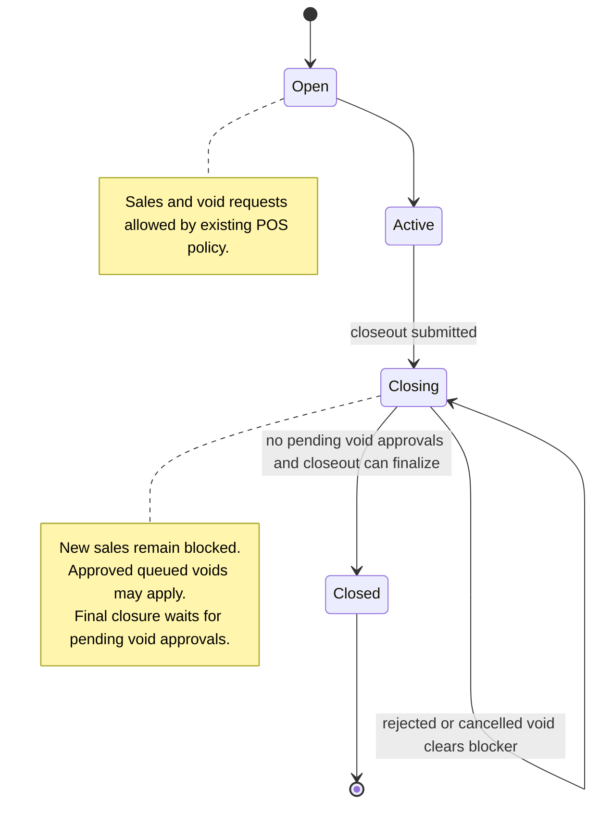
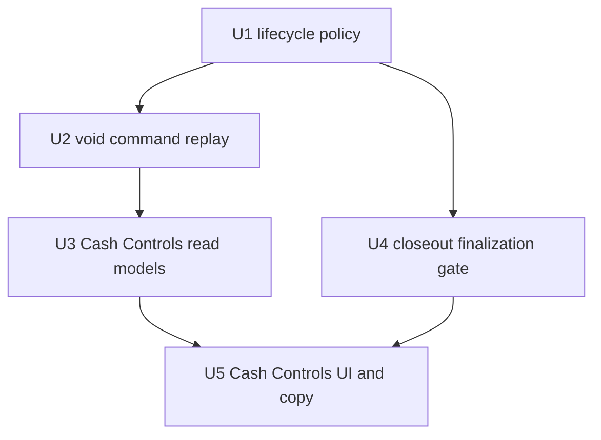

# fix: Allow approved sale voids during register closeout review

## Summary

Approved completed-sale voids should be able to apply while the original register session is in `closing`, so Cash Controls can update expected cash and variance before final closure. The work centralizes the register-session lifecycle policy for void application, keeps closeout submission unblocked, and makes Cash Controls hold the drawer unresolved while pending void approvals remain.

---

## Problem Frame

Queued void approvals are currently tied to the original `registerSessionId`, but approving them reuses POS sale usability. That means a drawer that has submitted closeout and moved to `closing` blocks the approved void with drawer-closed copy even though the lower register transaction recorder can already post void adjustments after selling stops.

---

## Requirements

### Void Approval / Application

- R1. Void approval requests remain tied to the original sale, store, terminal, transaction, and register session.
- R2. Applying an approved queued sale void is allowed for register sessions in `open`, `active`, or `closing`.
- R3. Applying a void remains blocked for missing drawer context, wrong store, wrong terminal, `closed` register sessions, completed EOD, non-completed sales, refunded or already voided sales, adjustment conflicts, and linked service allocations.

### Closeout Lifecycle

- R4. POS closeout submission remains unblocked by pending void approvals; cashiers can submit and count closeouts normally.
- R5. Final register closure is deferred while pending `pos_transaction_void` approvals exist for the register session.
- R6. Once all pending `pos_transaction_void` approval requests for the register session are approved, rejected, or cancelled, Cash Controls can finalize closeout using the updated expected cash and variance.
- R7. Cash Controls exposes a `Finalize closeout` action for submitted `closing` sessions once pending void approvals resolve; resubmitting the same count is not the required operator path.
- R8. Final closeout authorization is enforced server-side for the finalization command, including store scope and manager/full-admin authority.
- R9. Finalization recomputes closeout variance policy after pending void approvals settle, because approved voids can change expected cash after the original count was submitted.

### Cash Controls Visibility

- R10. Cash Controls surfaces pending void approvals on affected register sessions with a count, calm operator copy, and a route to the approval work.
- R11. Cash Controls read models expose only the minimum pending-void fields needed for review visibility and routing, with manager-review evidence gated at the server boundary.

### Shared Policy

- R12. The lifecycle rule is encoded as a named shared policy, not an ad hoc reuse of sale-usability helpers.

---

## Scope Boundaries

- This plan does not change cashier-side creation of completed-sale void requests beyond preserving the existing async approval rail.
- This plan does not allow new sales on `closing` or `closeout_rejected` register sessions.
- This plan does not reopen fully `closed` register sessions for void application.
- This plan does not redesign Daily Close, approval queues, or register closeout UX outside the pending-void surfaces needed for this flow.
- This plan does not change completed EOD policy; sales in completed EOD still require reopening EOD before voiding.

### Deferred to Follow-Up Work

- Broader register lifecycle vocabulary cleanup across all POS correction commands: separate refactor after this policy is proven in void and closeout paths.
- Full approval-workspace IA redesign: future UX work if the existing approval route cannot carry enough context.

---

## Context & Research

### Relevant Code and Patterns

- `packages/athena-webapp/convex/pos/application/commands/completeTransaction.ts` creates `pos_transaction_void` approval requests with `registerSessionId`, validates queued approvals in `resolveTransactionVoidApprovalDecisionWithCtx`, and currently calls `validateTransactionVoidPreconditions` with `requireUsableRegisterSession: true`.
- `packages/athena-webapp/shared/registerSessionLifecyclePolicy.ts` already owns named lifecycle decisions such as sale usability and replacement-session policy. It is the right home for a void-application policy.
- `packages/athena-webapp/shared/registerSessionStatus.ts` defines `open`, `active`, `closing`, `closeout_rejected`, and `closed`; POS sale usability is only `open` and `active`.
- `packages/athena-webapp/convex/operations/registerSessions.ts` only blocks `adjustmentKind: "sale"` when a session is not POS usable. `adjustmentKind: "void"` is already able to update register totals after selling stops.
- `packages/athena-webapp/convex/cashControls/closeouts.ts` begins closeout before final closure, but the successful result currently only models `action: "closed"`, so this work needs an explicit submitted-but-unresolved outcome.
- `packages/athena-webapp/convex/cashControls/deposits.ts` currently maps pending `variance_review` approvals by register session for Cash Controls; it does not project pending `pos_transaction_void` approvals into dashboard or register-session snapshots.
- `packages/athena-webapp/convex/schema.ts` already has `approvalRequest.by_registerSessionId`, which is suitable for register-session pending-void lookup.
- `packages/athena-webapp/src/components/cash-controls/RegisterSessionView.tsx` and `CashControlsDashboard.tsx` are the UI surfaces where the pending-void blocker should appear.
- `packages/athena-webapp/src/components/pos/transactions/TransactionView.test.tsx` already verifies normalized void failure copy for register and EOD blockers.
- `packages/athena-webapp/convex/pos/application/sync/projectLocalEvents.ts` can project a local `register_closed` event by patching the register session directly to `closed`; this path must participate in the same pending-void closure guard.

### Institutional Learnings

- `docs/solutions/logic-errors/athena-pos-sync-review-workspace-boundaries-2026-06-19.md` explicitly says queued void approvals may outlive an active drawer, replay should bypass the usable-drawer check only for `closing`, and `closed` still blocks.
- `docs/solutions/logic-errors/athena-pos-register-review-and-adjusted-sale-projection-2026-05-21.md` says review state must project into register totals rather than stopping at flags.
- `docs/solutions/logic-errors/athena-command-approval-policy-boundary-2026-05-01.md` says approval-sensitive actions must enforce approved retry server-side at the command boundary.
- `docs/product-copy-tone.md` says operator-facing copy should lead with system state, name the next action when known, and normalize backend wording before display.

### External References

- None used. The repo has direct domain patterns and a prior solution note for this exact lifecycle edge.

---

## Key Technical Decisions

- Add a named void-application policy in `shared/registerSessionLifecyclePolicy.ts`: this keeps void semantics distinct from sale usability while preserving the existing sale blocker.
- Allow `closing` only for approved void application, not for cashier sale creation or inline void request creation: the policy supports manager-reviewed ledger correction after closeout submission without reopening POS selling.
- Defer final closure, not closeout submission, when pending void approvals exist: operators can count and submit normally, but the register remains unresolved until review decisions settle.
- Reuse `approvalRequest.by_registerSessionId` for pending-void lookup first: this avoids schema churn unless implementation profiling shows the status/type filter needs a dedicated compound index.
- Model the closeout result contract explicitly for submitted-but-unresolved closeouts: UI and command callers should not infer "closed" when pending void review intentionally keeps the session in `closing`.
- Finalize resolved closeouts through Cash Controls, not as a hidden side effect of void approval resolution: approval application updates register totals, then Cash Controls exposes `Finalize closeout` for the submitted `closing` session and closes against the latest expected cash and counted cash.
- Treat the pending-void gate as a closeout-finalization invariant, not a branch-local check: `submitRegisterSessionCloseout`, inline-manager-approved closeout closure, async `reviewRegisterSessionCloseout` approval, local sync `register_closed` projection, and the new finalization action must all use the same guard before any register status changes to `closed`.
- Recompute closeout review at finalization after void approvals settle. If the updated expected cash makes the variance require approval, finalization must require or reuse valid manager approval according to the closeout policy instead of closing under stale zero-variance or pre-void approval assumptions.
- Authorization remains command-owned: `Finalize closeout` must verify store scope and manager/full-admin authority server-side before closing a submitted session.
- Staff attribution remains command-owned: public Cash Controls mutations must bind client-supplied staff profile ids to the authenticated Athena user before using them as submitter, closer, reviewer, or audit actors.
- Stale-client controls are backed by server guards: deposit recording must reject new deposits while register-scoped sale-void approvals are pending, matching the Cash Controls UI lockout.
- Variance approval proof is not reused implicitly across the deferred closure gap: implementation must either persist durable approved-closeout state when the original proof is consumed at submission, or require a fresh action/subject/store-bound one-use proof at finalization.

---

## Open Questions

### Resolved During Planning

- Should `closing` be allowed for approved void application? Yes. The prior solution note states this exact behavior, and the register transaction recorder already supports void adjustments after selling stops.
- Should `closeout_rejected` be allowed? No for this slice. The product summary said "probably closing" and final sign-off target is closeout submission under review; rejected closeouts require recount/correction and should stay out unless implementation reveals an existing correction path that safely needs parity.
- Should pending void approvals block POS closeout submission? No. They only defer final closure and create Cash Controls review visibility.

### Deferred to Implementation

- Exact closeout result action name: choose the smallest command-result value for the submitted-but-unresolved state, such as `action: "submitted_pending_void_review"`, while the operator-facing finalization control is `Finalize closeout`.
- Whether a dedicated `approvalRequest` compound index is needed: start with `by_registerSessionId`; add a targeted index only if query shape or validator constraints require it.
- Exact proof lifecycle for inline-approved variance closeouts deferred by pending voids: choose durable approved-closeout state or fresh finalization proof after confirming the existing closeout approval record shape, but do not carry an already-consumed proof across the split action.

---

## High-Level Technical Design

> *This illustrates the intended approach and is directional guidance for review, not implementation specification. The implementing agent should treat it as context, not code to reproduce.*

---

## Implementation Units

- U1. **Centralize void register-session lifecycle policy**

**Goal:** Add a named shared policy for whether a void may apply to a register session.

**Requirements:** R2, R3, R12

**Dependencies:** None

**Files:**
- Modify: `packages/athena-webapp/shared/registerSessionLifecyclePolicy.ts`
- Test: `packages/athena-webapp/shared/registerSessionLifecyclePolicy.test.ts`

**Approach:**
- Add a policy that accepts the register-session status plus store and terminal identity context needed by void application.
- Treat `open`, `active`, and `closing` as allowed for void application.
- Treat `closed` and `closeout_rejected` as blocked for this slice.
- Keep sale usability unchanged and covered by existing tests.

**Execution note:** Implement policy tests first so the command change cannot accidentally broaden POS sale usability.

**Patterns to follow:**
- Existing `isRegisterSessionSaleUsable` and replacement-session helpers in `registerSessionLifecyclePolicy.ts`.
- Existing lifecycle tests that enumerate statuses explicitly.

**Test scenarios:**
- Happy path: `open`, `active`, and `closing` register sessions in the same store and terminal are void-applicable.
- Error path: `closed` and `closeout_rejected` sessions are not void-applicable.
- Error path: missing session, wrong store, or wrong terminal is not void-applicable and remains distinguishable from status-only failure.
- Regression: `isRegisterSessionSaleUsable` still returns false for `closing`.

**Verification:**
- The shared lifecycle policy names void applicability directly and tests document every current register-session status.

---

- U2. **Apply queued void approvals through the void lifecycle policy**

**Goal:** Allow approved queued voids to apply while the original drawer is `closing`, while preserving all existing void blockers.

**Requirements:** R1, R2, R3, R12

**Dependencies:** U1

**Files:**
- Modify: `packages/athena-webapp/convex/pos/application/commands/completeTransaction.ts`
- Modify: `packages/athena-webapp/convex/operations/approvalRequests.ts`
- Test: `packages/athena-webapp/convex/pos/application/completeTransaction.test.ts`
- Test: `packages/athena-webapp/convex/operations/approvalRequests.test.ts`
- Test: `packages/athena-webapp/convex/pos/public/transactions.test.ts`

**Approach:**
- Replace the queued approval path's ad hoc POS-sale usability check with the new void policy.
- Keep inline/current POS void request behavior sale-usable unless implementation confirms the current command path should share the same approved-application policy after proof consumption.
- Preserve existing checks for completed sale status, item adjustments, completed EOD, drawer context, same store, same terminal, and linked service allocations.
- Keep approval request matching server-side through `requireMatchingPendingVoidApprovalRequest`.
- Normalize any changed error text through existing command-result and UI presentation paths.

**Patterns to follow:**
- Existing async void approval flow in `resolveTransactionVoidApprovalDecisionWithCtx`.
- Existing approval dispatch in `operations/approvalRequests.ts`.
- Existing tests around `blocks a queued completed-sale void when the original drawer is closing`, which should become the positive regression for `closing`.

**Test scenarios:**
- Happy path: approving a pending `pos_transaction_void` request for a completed sale whose original register session is `closing` applies void side effects, records register-session void movement, patches transaction void fields, and resolves the approval request.
- Error path: approving the same request for a `closed` register session still throws a precondition failure and performs no void side effects.
- Error path: wrong terminal, wrong store, missing session, missing `registerSessionId`, and missing `terminalId` still block before side effects.
- Error path: completed EOD still blocks with the existing EOD-specific message.
- Integration: `approvalRequests.resolveApprovalRequest` still dispatches approved `pos_transaction_void` decisions into the void command path and maps precondition failures to user errors.

**Verification:**
- Queued approval replay accepts `closing` and rejects `closed` without weakening sale creation or void-request creation rules.

---

- U3. **Expose pending void approvals in Cash Controls read models**

**Goal:** Make Cash Controls aware of unresolved void approvals for each register session with minimal, server-filtered review data.

**Requirements:** R1, R5, R6, R10, R11

**Dependencies:** U2

**Files:**
- Modify: `packages/athena-webapp/convex/cashControls/deposits.ts`
- Modify: `packages/athena-webapp/convex/cashControls/closeouts.ts` if a shared helper belongs there after implementation discovery
- Test: `packages/athena-webapp/convex/cashControls/deposits.test.ts`

**Approach:**
- Query pending `approvalRequest` rows for the relevant register sessions and filter to `requestType: "pos_transaction_void"` and `status: "pending"`.
- Add a compact pending-void summary to dashboard rows and register-session snapshots. The read model should include count, safe approval ids, transaction number or display label when already allowed on the surface, and route context. It should not return notes, decision notes, raw metadata, staff proof data, or sensitive financial/review evidence to callers that cannot act on manager review.
- Gate manager-review evidence at the server/query boundary, not only in React rendering. Non-manager or POS-only callers may see the register unresolved count if the existing Cash Controls access model allows the page, but not privileged review details.
- Keep existing `variance_review` pending approval mapping intact.
- Avoid leaking raw backend conflict or approval notes as primary operator copy.

**Patterns to follow:**
- Current `variance_review` mapping by `registerSessionId` in `deposits.ts`.
- Cash Controls snapshot shape used by `RegisterSessionView.test.tsx`.
- Product copy tone guidance for converting backend evidence into operator state.

**Test scenarios:**
- Happy path: dashboard snapshot includes a pending void count for a visible register session with one pending `pos_transaction_void` approval.
- Happy path: register-session snapshot includes pending void approval summary rows for that session.
- Edge case: approved, rejected, and cancelled void approval requests are excluded.
- Edge case: pending void approval for another register session is excluded.
- Edge case: pending variance approvals continue to populate the existing closeout review state without being counted as void approvals.
- Edge case: two pending void approvals on the same register continue blocking finalization after one resolves and one remains pending.
- Error path: non-manager or POS-only query context does not receive raw pending-void metadata, notes, decision notes, staff proof fields, or manager-only review evidence.

**Verification:**
- Cash Controls read models can distinguish pending void review from variance review and expose the void review count without changing existing variance behavior.

---

- U4. **Defer final closeout closure while void approvals are pending**

**Goal:** Preserve closeout submission while preventing any final register closure path from closing until pending void approvals settle.

**Requirements:** R4, R5, R6, R7, R8, R9

**Dependencies:** U1, U3

**Files:**
- Modify: `packages/athena-webapp/convex/cashControls/closeouts.ts`
- Modify: `packages/athena-webapp/convex/pos/application/sync/projectLocalEvents.ts`
- Modify: `packages/athena-webapp/shared/commandResult.ts` or validators only if the closeout result contract requires shared type coverage
- Test: `packages/athena-webapp/convex/cashControls/closeouts.test.ts`
- Test: `packages/athena-webapp/convex/cashControls/registerSessionTraceLifecycle.test.ts` if trace lifecycle expectations change
- Test: `packages/athena-webapp/convex/pos/application/sync/projectLocalEvents.test.ts`

**Approach:**
- Add a shared closeout-finalization guard/helper that checks pending `pos_transaction_void` approvals tied to the register session before any path marks a register session `closed`.
- Use that guard in `submitRegisterSessionCloseout`, inline-manager-approved submit closeout, async `reviewRegisterSessionCloseout` approval, local sync `register_closed` projection in `projectLocalEvents.ts`, and the `Finalize closeout` path.
- For local sync closeout projection with pending void approvals, leave the register in `closing` and surface review evidence rather than patching directly to `closed`.
- If pending void approvals exist, return a successful submitted/unresolved closeout result and leave the register session in `closing`.
- Add or reuse an explicit Cash Controls finalization command path for `closing` sessions whose pending void approvals have all resolved. The operator-facing control is `Finalize closeout`, and it closes against the latest register-session expected cash and counted cash.
- Apply the same pending-void finalization gate to zero-variance closeouts, inline-manager-approved variance closeouts, and async variance-review approvals.
- Before finalizing after pending voids resolve, recompute closeout review from current `expectedCash` and submitted `countedCash`. If the post-void variance requires approval, require the appropriate manager approval path before closing.
- Enforce finalization authorization in the Convex command: the actor must be in the same store and must be a manager or full admin. POS-only or wrong-store callers must fail before state mutation.
- For inline manager-approved variance closeouts that cannot close because pending voids remain, do not reuse the already-consumed approval proof at finalization. Either persist a durable approved-closeout state tied to the original action, subject, store, and approver, or require a fresh finalization proof when the manager clicks `Finalize closeout`.
- Ensure rejected or cancelled void approvals no longer block final closure.
- Keep existing variance approval behavior intact; pending variance review already leaves the session unresolved.

**Execution note:** Characterize current closeout result consumers before naming the new success action so UI and command validators change together.

**Patterns to follow:**
- Existing `approval_required` return for variance review, which already keeps closeout unresolved.
- Existing `beginRegisterSessionCloseout` then `closeRegisterSession` sequence in `submitRegisterSessionCloseout`.
- Existing local sync closeout projection tests in `projectLocalEvents.test.ts`.
- Existing register-session trace stages for `closeout_submitted` and `closed`.

**Test scenarios:**
- Happy path: submitting closeout with pending void approvals records closeout submission, leaves the session `closing`, returns the submitted/unresolved action, and does not call `closeRegisterSession`.
- Happy path: after pending void approvals are resolved, `Finalize closeout` closes the session using the latest expected cash and variance.
- Happy path: approving async `reviewRegisterSessionCloseout` while void approvals are pending marks the variance approval approved when appropriate, leaves the session `closing`, returns submitted/unresolved state, and does not emit final closed trace.
- Happy path: projecting a local `register_closed` sync event while pending void approvals exist leaves the session `closing`, preserves closeout evidence, and does not patch status to `closed`.
- Edge case: finalization recomputes variance after an approved cash void changes expected cash; if the new variance crosses policy, finalization requires manager approval rather than closing under the stale original result.
- Edge case: zero-variance closeout with pending void approvals remains unresolved rather than closing immediately.
- Edge case: inline manager-approved variance closeout with pending void approvals remains unresolved rather than closing immediately.
- Edge case: mixed approve/reject/cancel outcomes across multiple void approvals keep finalization blocked until the last pending row is resolved.
- Error path: wrong-store, POS-only, cashier-only, and missing-actor finalization attempts fail before `closeRegisterSession`.
- Error path: an already-consumed variance approval proof cannot be replayed at finalization.
- Regression: variance approval required still returns `approval_required` when no inline manager proof is supplied.
- Integration: trace history records closeout submission without emitting a final closed trace until closure actually occurs.

**Verification:**
- Pending void approvals can no longer be stranded behind a prematurely closed register session, and closeout submission remains available to cashiers.

---

- U5. **Surface pending void review in Cash Controls UI**

**Goal:** Show managers why the register remains unresolved and route them to the approval work.

**Requirements:** R5, R6, R7, R10

**Dependencies:** U3, U4

**Files:**
- Modify: `packages/athena-webapp/src/components/cash-controls/CashControlsDashboard.tsx`
- Modify: `packages/athena-webapp/src/components/cash-controls/RegisterSessionView.tsx`
- Modify: `packages/athena-webapp/src/components/operations/OperationsQueueView.tsx` if the existing approval route needs a better void label
- Test: `packages/athena-webapp/src/components/cash-controls/CashControlsDashboard.test.tsx`
- Test: `packages/athena-webapp/src/components/cash-controls/RegisterSessionView.test.tsx`
- Test: `packages/athena-webapp/src/components/operations/OperationsQueueView.test.tsx` if route or label copy changes there

**Approach:**
- Add an operator-facing callout on the register session page when pending void approvals exist.
- Add a compact dashboard indicator for affected register sessions so Cash Controls review starts from the list view.
- Use copy shaped like: "Void review pending. Review the pending sale void before final closeout can complete."
- Link to the existing `/operations/approvals` destination for the pending void rows, preserving the current Cash Controls register URL as the return origin when the route supports `o=`.
- Keep submit/count controls available while the pending-void callout explains why final closure is not complete.
- When pending void approvals are resolved and the session is still `closing`, expose `Finalize closeout` instead of relying on operators to infer that they should resubmit the same count.
- If the session is `closeout_rejected` with pending void approvals, make the next action explicit: resolve the rejected closeout through the existing reopen/recount path first, then replay or decide the pending void approvals. Do not present an unfulfillable void approval as the primary Cash Controls action.
- Detail-page callout ordering should keep active closeout variance or synced closeout review first, then pending void review, then informational sync/session notices. Dashboard rows should group all unresolved drawer work under the register status area, with pending void review shown as a blocker only when it prevents final closure.
- Manager flow: open the affected register in Cash Controls, follow `Review void approvals` to `/operations/approvals`, approve/reject/cancel the pending sale void rows, return to the register page via the origin link or navigation, then use `Finalize closeout` when no pending void approvals remain.

**Patterns to follow:**
- Existing closeout review callouts and left-rail status language in `RegisterSessionView.tsx`.
- Existing dashboard session status badges in `CashControlsDashboard.tsx`.
- `docs/product-copy-tone.md` for restrained, operational copy.

**Test scenarios:**
- Happy path: register session view shows pending void count and approval link when snapshot includes pending void approvals.
- Happy path: dashboard row flags a register session with pending void approvals.
- Edge case: no callout appears when all void approvals are resolved.
- Edge case: multiple pending void approvals show an accurate count, and mixed resolved/pending approvals count only pending rows.
- Edge case: `closeout_rejected` plus pending void approval shows reopen/recount as the next Cash Controls action and does not make void approval look directly applyable.
- Edge case: route or decision failures leave the pending-void callout visible and show normalized error copy without losing the submitted closeout state.
- Edge case: loading or stale approval data uses existing Cash Controls loading conventions and never shows a false `Finalize closeout` action until pending state is known.
- Integration: closeout submit button remains available when pending void approvals exist.
- Integration: finalization action appears after pending void approvals resolve for a submitted closeout that is still `closing`.
- Integration: Cash Controls-to-approvals handoff starts at the register page, opens `/operations/approvals` scoped by route/origin context, resolves the relevant pending void approval, and returns or lands the manager on the same register's `Finalize closeout` action.
- Integration: finalization success gives the same closed-state confirmation pattern as a normal successful closeout.
- Copy regression: backend request type `pos_transaction_void` does not appear as raw UI text.

**Verification:**
- Managers can see why a submitted closeout remains unresolved and can navigate to the pending approval without blocking cashier closeout submission.

---

## System-Wide Impact

- **Interaction graph:** POS transaction void approval, approval request resolution, register-session transaction recording, Cash Controls closeout, Cash Controls snapshots, and approval UI all participate in the flow.
- **Error propagation:** Command-boundary failures should remain `user_error` or approval-resolution mapped errors; UI should normalize backend wording before display.
- **State lifecycle risks:** The critical lifecycle is `active/open -> closing -> closed`; this work intentionally adds void application inside `closing` but keeps final closure blocked until pending void approvals settle.
- **API surface parity:** Any generated validators or shared result types for `submitRegisterSessionCloseout` must include the new submitted/unresolved action before UI callers consume it.
- **Integration coverage:** Unit tests must prove register expected cash and variance update before closure after an approved void in `closing`; UI tests must prove operators see pending review while submission stays available.
- **Unchanged invariants:** New sales remain limited to POS-usable sessions, completed EOD still blocks voids, and closed register sessions are not mutated by queued void approvals.

---

## Risks & Dependencies

| Risk | Mitigation |
|------|------------|
| Accidentally allowing new sales on `closing` sessions | Keep sale usability unchanged and add regression tests in the shared lifecycle policy. |
| Closeout result contract drift between Convex validators and React callers | Change command result validator, type expectations, and UI tests in the same unit. |
| Pending void approvals become invisible outside Cash Controls | Reuse approval request data with register-session context and add dashboard plus detail-page tests. |
| Final closure remains blocked after void review resolution | Filter only `status: "pending"` approvals and cover approved, rejected, and cancelled cases. |
| Raw backend request types leak into UI | Add UI copy tests that assert operational labels and absence of `pos_transaction_void`. |

---

## Documentation / Operational Notes

- Add or update a `docs/solutions/logic-errors/` note after implementation, because this fixes a lifecycle boundary between POS approval replay and Cash Controls closeout finalization.
- Run `bun run graphify:rebuild` after code changes, per repo instructions.
- This plan intentionally does not start implementation; it is ready for `/ce-work` once approved.

---

## Sources & References

- `graphify-out/GRAPH_REPORT.md`
- `graphify-out/wiki/index.md`
- `graphify-out/wiki/packages/athena-webapp.md`
- `packages/athena-webapp/docs/agent/code-map.md`
- `packages/athena-webapp/convex/pos/application/commands/completeTransaction.ts`
- `packages/athena-webapp/convex/cashControls/closeouts.ts`
- `packages/athena-webapp/convex/cashControls/deposits.ts`
- `packages/athena-webapp/convex/operations/registerSessions.ts`
- `packages/athena-webapp/shared/registerSessionLifecyclePolicy.ts`
- `packages/athena-webapp/shared/registerSessionStatus.ts`
- `docs/solutions/logic-errors/athena-pos-sync-review-workspace-boundaries-2026-06-19.md`
- `docs/solutions/logic-errors/athena-pos-register-review-and-adjusted-sale-projection-2026-05-21.md`
- `docs/solutions/logic-errors/athena-command-approval-policy-boundary-2026-05-01.md`
- `docs/product-copy-tone.md`
