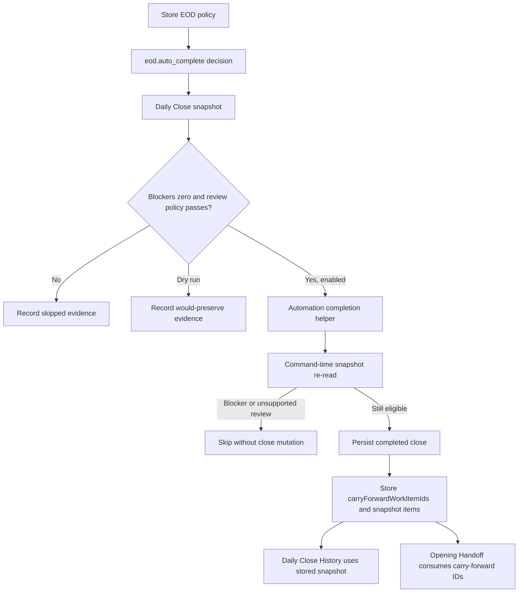
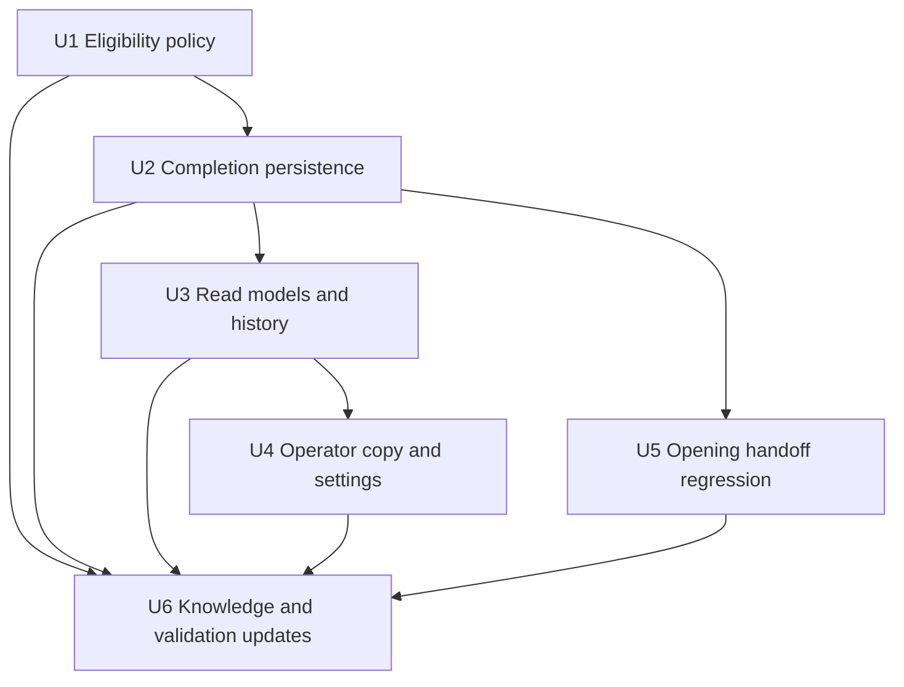

# feat: Preserve Carry-Forward Work During EOD Auto-Completion

## Summary

Extend the delivered EOD auto-completion path so Athena can complete blocker-free EOD Reviews that contain supported review evidence and carry-forward work. The implementation keeps blockers and unsupported review categories strict, preserves unresolved carry-forward work into the completed close and next Opening Handoff, and updates operator copy so automation never sounds like manager approval or work resolution.

---

## Problem Frame

The previous EOD automation rollout intentionally skipped any day with carry-forward evidence. That was safe for the first completion boundary, but it now leaves Athena unable to close otherwise eligible operating days where follow-up work should simply remain visible tomorrow. Daily Close already treats carry-forward as durable store-day handoff evidence, so the next iteration should let automation close the operating-day boundary while preserving that unresolved work.

---

## Requirements

- R1. EOD auto-completion may apply only when the command-time Daily Close snapshot has zero blocker items.
- R2. Supported review evidence remains limited to `cash_variance` and `voided_sale`, and each supported review item must pass existing policy thresholds before automation can complete.
- R3. Unsupported review categories, mixed supported-plus-unsupported review sets, threshold failures, invalid operating ranges, and reopened or superseded close lifecycle states must still skip automation completion.
- R4. Carry-forward work must no longer be a hard EOD auto-completion blocker when R1 and R2 are satisfied.
- R5. Athena must preserve carry-forward as unresolved work, not resolve, approve, complete, or hide it.
- R6. Automated completion must persist carry-forward work item IDs, carry-forward counts, report snapshot carry-forward items, source subjects, Athena attribution, automation run ID, policy version, and decision reason.
- R7. Opening Handoff must continue to surface carry-forward work from an Athena-completed prior close.
- R8. Manual EOD completion and reopen flows must keep the existing manager approval proof contract.
- R9. EOD automation remains policy-evidence based; it must not create fake manager approval, fake staff attribution, or manager-approved copy.
- R10. Broad readers may see safe Athena attribution and neutral carry-forward shells/counts, but raw carry-forward work item IDs, source subject IDs, link params, decision evidence, policy-reviewed keys, restricted financial/review evidence, and sensitive metadata must keep existing redaction boundaries.
- R11. POS settings, Daily Close, Daily Operations, Daily Close History, and Opening Handoff copy must describe the new behavior calmly: Athena completed the EOD Review under policy and preserved carry-forward work for Opening.

**Origin actors:** A1 Operator, A2 Owner or manager, A4 Athena
**Origin flows:** F1 Daily close readiness review, F2 Exception review and carry-forward, F3 Close completion and daily summary, F4 Future opening handoff
**Origin acceptance examples:** AE2, AE3, AE4

---

## Scope Boundaries

- This plan does not add new low-risk review categories beyond `cash_variance` and `voided_sale`.
- This plan does not soften blocker categories such as open/closing registers, pending approvals, unresolved POS sessions, invalid dates, or reopened/superseded close lifecycle conflicts.
- This plan does not create new carry-forward work items from automation. Athena should preserve existing durable work item IDs from the snapshot.
- This plan does not let policy-reviewed review keys represent carry-forward resolution. `policyReviewedItemKeys` stays scoped to review items checked by policy.
- This plan does not change manual manager approval requirements for completing or reopening an EOD Review.
- This plan does not add external notifications, intelligence-layer recommendations, or a new automation history surface.

### Deferred to Follow-Up Work

- Broader low-risk category policy beyond `cash_variance` and `voided_sale`.
- Dedicated automation history drill-down for policy evidence.
- Data-driven recommendations for tuning review thresholds.
- Support for automation-created carry-forward work from operator draft text.
- Scheduler-ledger cleanup for routine pre-window EOD checks.

---

## Context & Research

### Relevant Code and Patterns

- `packages/athena-webapp/convex/operations/dailyOperationsAutomation.ts` owns `eod.auto_complete`, low-risk categories, thresholds, timing, decision evidence, and the current carry-forward skip.
- `packages/athena-webapp/convex/operations/dailyClose.ts` owns the authoritative Daily Close snapshot and completion mutation. It currently rejects carry-forward for automation and writes empty carry-forward IDs/items for automation-completed closes.
- `packages/athena-webapp/convex/automation/runLedger.ts` and `packages/athena-webapp/convex/schemas/automation.ts` own policy config and structured `automationRun.decisionEvidence`.
- `packages/athena-webapp/convex/schemas/operations/dailyClose.ts` already supports completed-close attribution, `policyReviewedItemKeys`, and `carryForwardWorkItemIds`.
- `packages/athena-webapp/convex/operations/dailyOpening.ts` consumes prior close `carryForwardWorkItemIds` for Opening Handoff.
- `packages/athena-webapp/convex/operations/dailyOperations.ts` projects automation status and redacts restricted EOD evidence for broad readers.
- `packages/athena-webapp/src/components/operations/DailyCloseView.tsx`, `DailyOperationsView.tsx`, and `DailyCloseHistoryView.tsx` render Athena attribution and policy detail copy.
- `packages/athena-webapp/src/components/pos/settings/POSSettingsView.tsx` exposes EOD completion automation policy copy and controls.

### Institutional Learnings

- `docs/solutions/architecture/athena-eod-review-automation-completion-2026-06-22.md`: EOD completion must stay a distinct `eod.auto_complete` action with policy evidence, Athena attribution, command-time revalidation, and redaction.
- `docs/solutions/architecture/athena-store-day-auto-start-review-2026-06-11.md`: automation may advance lifecycle state when policy allows it, but unresolved evidence must be preserved for manager review.
- `docs/solutions/logic-errors/athena-daily-close-store-day-boundary-2026-05-07.md`: Daily Close is a store-day command boundary and completion must re-read the server snapshot.
- `docs/solutions/logic-errors/athena-daily-close-history-snapshots-2026-05-09.md`: historical close detail must render the stored report snapshot, not recompute from live source records.
- `docs/product-copy-tone.md`: operator-facing copy should stay calm, clear, restrained, operational, and normalized.

### External References

- None. Local Athena automation, Daily Close, Opening Handoff, and redaction patterns are the source of truth.

---

## Key Technical Decisions

- **Replace carry-forward skip with preserved evidence:** Carry-forward is no longer a completion blocker by itself. It is stored as unresolved handoff work on the completed close.
- **Keep review and carry-forward semantics separate:** `policyReviewedItemKeys` represents review evidence checked by policy. Carry-forward remains represented by work item IDs, carry-forward counts, and report snapshot items.
- **Preserve existing durable work items only:** Automation should link work item IDs already present in `snapshot.carryForwardItems`; it should not create new carry-forward work items.
- **Let command-time re-read win:** If the apply-time snapshot gains blockers, unsupported review evidence, or threshold-exceeding supported review evidence, automation skips. If only the carry-forward set changes and blockers/review policy still pass, automation completes with the final re-read evidence.
- **Make applied run evidence match the completed close:** The final `automationRun.decisionEvidence` for an applied run must reflect the command-time snapshot that produced the close, including carry-forward IDs/keys/counts, source subjects, preserved status, and a completed close reference.
- **Keep completion lifecycle primary in read models:** A completed Athena close remains the primary state; stale skipped or dry-run automation rows must not override the completed close.
- **Redact identifiers and details, not attribution:** Broad readers can see safe Athena attribution and neutral carry-forward shells/counts, while raw IDs, source subjects, link params, decision evidence, policy keys, financial/review details, and sensitive metadata remain restricted.
- **Update the prior solution doc during implementation:** The June 22 solution doc currently says carry-forward stays human-only in v1; implementation should update that learning after this plan lands.

---

## Open Questions

### Resolved During Planning

- **Should carry-forward items be created by automation?** No. Preserve existing durable work item IDs from the snapshot only.
- **Should low-risk review completion require `cleanDayAutoCompleteEnabled`?** No. The clean-day toggle gates zero-review days. Low-risk review days use their existing review threshold policy.
- **What happens if carry-forward changes between eligibility and apply?** The command-time snapshot wins. Complete with the final carry-forward set if blockers remain zero and review policy still passes.
- **What happens if a blocker, unsupported review, or threshold-exceeding supported review appears between eligibility and apply?** Skip with precondition evidence; do not complete.
- **What should history show?** Athena completion attribution plus preserved carry-forward evidence for Opening Handoff, with existing redaction for restricted review/financial details.

### Deferred to Implementation

- Whether the final implementation uses an existing helper or a new small helper to derive work item IDs from `snapshot.carryForwardItems`.
- Whether generated Convex validators need widening after the final return payload and public read model changes are known.

---

## High-Level Technical Design

> *This illustrates the intended approach and is directional guidance for review, not implementation specification. The implementing agent should treat it as context, not code to reproduce.*

---

## Implementation Units

- U1. **Update EOD Auto-Complete Eligibility**

**Goal:** Change the automation decision so carry-forward work is preserved evidence rather than an ineligible classification when blockers are zero and review policy passes.

**Requirements:** R1, R2, R3, R4, R5, R9

**Dependencies:** None

**Files:**
- Modify: `packages/athena-webapp/convex/operations/dailyOperationsAutomation.ts`
- Modify: `packages/athena-webapp/convex/automation/runLedger.ts`
- Test: `packages/athena-webapp/convex/operations/dailyOperationsAutomation.test.ts`

**Approach:**
- Remove the carry-forward hard skip from the decision path.
- Keep `cash_variance` and `voided_sale` as the only supported review categories.
- Keep blockers, unsupported review categories, threshold failures, invalid operating windows, and lifecycle conflicts strict.
- Add decision evidence that makes carry-forward observed/preserved status explicit without turning it into a threshold gate.
- Define applied-run evidence so it can be rebuilt from the command-time snapshot and patched onto the run after completion: carry-forward work item IDs, carry-forward item keys, counts, source subjects, preserved-vs-skipped status, and the completed close reference.
- Keep dry-run behavior mutation-free while recording what carry-forward would have been preserved.
- Preserve existing local completion-window behavior; scheduler-ledger cleanup is outside this carry-forward capability.

**Execution note:** Start with failing eligibility tests that replace the current hard-skip expectation.

**Patterns to follow:**
- `packages/athena-webapp/convex/operations/dailyOperationsAutomation.ts`
- `packages/athena-webapp/convex/automation/runLedger.ts`

**Test scenarios:**
- Happy path: clean day with carry-forward and zero blockers completes when clean-day policy is enabled.
- Happy path: low-risk `cash_variance` within threshold plus carry-forward is eligible and applies.
- Happy path: low-risk `voided_sale` within count/total thresholds plus carry-forward is eligible and applies.
- Edge case: carry-forward evidence appears in decision evidence as preserved evidence, not as `classification: "carry_forward"`.
- Edge case: applied run evidence references the same carry-forward IDs/items and source subjects as the completed close/report snapshot.
- Edge case: unsupported review category plus carry-forward skips the whole close.
- Edge case: one supported review item plus one unsupported review item skips the whole close.
- Edge case: threshold-exceeded supported review plus carry-forward skips.
- Edge case: blocker plus carry-forward skips because blockers remain hard stops.
- Edge case: outside completion window plus carry-forward does not mutate and preserves current timing-gate behavior.
- Edge case: dry-run plus carry-forward records would-preserve evidence and does not mutate Daily Close.
- Integration: `eod.prepare` remains preparation-only and is not conflated with completion.

**Verification:**
- Automation eligibility explains carry-forward as preserved evidence while keeping blocker and unsupported-review outcomes strict.

---

- U2. **Persist Carry-Forward During Automation Completion**

**Goal:** Change the command-time completion helper so Athena-completed closes retain carry-forward IDs, counts, and report snapshot evidence.

**Requirements:** R1, R4, R5, R6, R7, R8, R9

**Dependencies:** U1

**Files:**
- Modify: `packages/athena-webapp/convex/operations/dailyClose.ts`
- Test: `packages/athena-webapp/convex/operations/dailyClose.test.ts`

**Approach:**
- Remove the automation-only rejection of `snapshot.carryForwardItems`.
- Reuse the EOD auto-complete eligibility evaluator or an equivalent shared policy helper against the command-time snapshot and current policy config before mutating.
- Reject unless the final command-time snapshot is still eligible as `clean_day` or `low_risk_review`.
- Derive existing operational work item IDs from carry-forward snapshot items whose subject is an operational work item.
- Require every command-time carry-forward item to map one-to-one to an existing, same-store, same-organization, non-terminal operational work item.
- Reject automation completion if any carry-forward item is missing, duplicated ambiguously, wrong-store, wrong-organization, terminal, or not mappable to a durable work item ID.
- Persist the final command-time work item IDs to `dailyClose.carryForwardWorkItemIds`.
- Preserve `readiness.carryForwardCount`, `summary.carryForwardWorkItemCount`, and `reportSnapshot.carryForwardItems` based on the command-time evidence.
- Patch the final applied `automationRun.decisionEvidence` so it matches the command-time close/report snapshot rather than the earlier eligibility snapshot.
- Do not create new work items and do not include carry-forward keys in `policyReviewedItemKeys`.
- Keep command-time rejection for blockers, unreviewed policy review items, unsupported review items, reopened/superseded lifecycle states, and human-completed closes.

**Execution note:** Add command-boundary tests before changing the completion helper.

**Patterns to follow:**
- `packages/athena-webapp/convex/operations/dailyClose.ts`
- `packages/athena-webapp/convex/schemas/operations/dailyClose.ts`

**Test scenarios:**
- Happy path: automation completion persists existing carry-forward work item IDs.
- Happy path: automation completion stores carry-forward items in `reportSnapshot.carryForwardItems`.
- Happy path: automation completion preserves carry-forward counts in readiness and summary instead of zeroing them.
- Happy path: automation completion returns carry-forward work items in the command result.
- Edge case: carry-forward set changes between eligibility and apply; command-time set is persisted if blockers remain zero and review policy passes.
- Edge case: supported review threshold changes between eligibility and apply; command-time policy revalidation skips without daily close mutation.
- Edge case: command-time final evidence differs from the eligibility snapshot; applied run evidence matches the completed close/report snapshot.
- Error path: a blocker appears at command time; automation skips without daily close mutation.
- Error path: unsupported or unreviewed review evidence appears at command time; automation skips without daily close mutation.
- Error path: carry-forward subject references a missing or wrong-store work item; automation returns a validation failure without completing.
- Error path: carry-forward subject references a wrong-organization, terminal, duplicate, or unmappable work item; automation returns a validation failure without completing.
- Error path: reopened or superseded close state rejects automation.
- Integration: automation completion has Athena attribution and no fake manager proof, staff profile, or approval event.
- Integration: reopening an Athena-completed close preserves the historical carry-forward report snapshot.

**Verification:**
- An Athena-completed close is a trustworthy store-day record whose unresolved carry-forward work survives as both audit evidence and future handoff input.

---

- U3. **Preserve Read Models, History, and Redaction**

**Goal:** Ensure Daily Operations, Daily Close detail, and Daily Close History expose safe Athena completion attribution with preserved carry-forward evidence.

**Requirements:** R6, R7, R9, R10, R11

**Dependencies:** U2

**Files:**
- Modify: `packages/athena-webapp/convex/operations/dailyOperations.ts`
- Modify: `packages/athena-webapp/convex/operations/dailyClose.ts`
- Test: `packages/athena-webapp/convex/operations/dailyOperations.test.ts`
- Test: `packages/athena-webapp/convex/operations/dailyClose.test.ts`

**Approach:**
- Keep completed lifecycle state primary over stale skipped, dry-run, or eligible automation rows.
- Confirm redaction keeps raw `carryForwardWorkItemIds`, source subject IDs, link params, decision evidence, policy-reviewed keys, financial/review details, and sensitive metadata restricted while allowing safe Athena attribution and neutral carry-forward shells/counts.
- Require explicit parity across Daily Operations, Daily Close detail, Daily Close History, and any widened return payloads.
- Make historical detail render the stored report snapshot carry-forward items, not live recomputation.
- Confirm `policyReviewedItemKeys` remains hidden or redacted for broad readers according to existing rules.

**Patterns to follow:**
- `packages/athena-webapp/convex/operations/dailyOperations.ts`
- `packages/athena-webapp/convex/operations/dailyClose.ts`

**Test scenarios:**
- Happy path: Daily Operations shows closed lifecycle for an Athena-completed EOD Review with carry-forward work.
- Happy path: manager/evidence reader can inspect safe automation and carry-forward evidence.
- Edge case: broad reader sees Athena attribution and neutral carry-forward shells/counts but not raw carry-forward IDs, source subjects, link params, decision evidence, policy-reviewed keys, or restricted variance/void metadata.
- Edge case: full-admin/evidence reader can inspect carry-forward IDs/source subjects and policy evidence where the existing permission model allows it.
- Edge case: source work item changes after completion; historical detail still renders the stored close snapshot.
- Edge case: stale skipped/dry-run automation rows do not override completed close state.
- Integration: completed close detail keeps policy-reviewed review keys separate from carry-forward work IDs.

**Verification:**
- Read models preserve the distinction between completed lifecycle, unresolved carry-forward work, policy-reviewed evidence, and redacted detail.

---

- U4. **Update Operator Copy and Settings**

**Goal:** Update operator-facing copy so admins and managers understand that Athena can complete blocker-free EOD Reviews while preserving carry-forward work.

**Requirements:** R5, R9, R10, R11

**Dependencies:** U3

**Files:**
- Modify: `packages/athena-webapp/src/components/pos/settings/POSSettingsView.tsx`
- Modify: `packages/athena-webapp/src/components/operations/DailyCloseView.tsx`
- Modify: `packages/athena-webapp/src/components/operations/DailyOperationsView.tsx`
- Modify: `packages/athena-webapp/src/components/operations/DailyCloseHistoryView.tsx`
- Modify: `packages/athena-webapp/src/components/operations/DailyOpeningView.tsx`
- Test: `packages/athena-webapp/src/components/pos/settings/POSSettingsView.test.tsx`
- Test: `packages/athena-webapp/src/components/operations/DailyCloseView.test.tsx`
- Test: `packages/athena-webapp/src/components/operations/DailyOperationsView.test.tsx`
- Test: `packages/athena-webapp/src/components/operations/DailyCloseHistoryView.test.tsx`
- Test: `packages/athena-webapp/src/components/operations/DailyOpeningView.test.tsx`

**Approach:**
- Replace narrow "clean-day" language with blocker-free/policy-completion language where the control describes overall capability.
- Keep the clean-day toggle semantics if it still gates zero-review days, but clarify that carry-forward work can be preserved for Opening.
- Replace generic applied-status copy like "Athena updated EOD Review" with completion-specific copy when the applied lane is EOD completion.
- Broaden attribution detail from "Policy checked low-risk review evidence" to mention preserved carry-forward work when present.
- Confirm Opening Handoff copy remains accurate when a prior close was completed by Athena: the work is carried forward from a completed EOD Review and remains unresolved until handled or acknowledged.
- Avoid copy that implies Athena resolved carry-forward work, manager-approved the day, or made a judgement outside policy.

**Copy matrix:**

| Surface / state | Approved direction | Avoid |
| --- | --- | --- |
| POS settings capability | "Athena can complete blocker-free EOD Reviews under store policy. Carry-forward work stays open for Opening Handoff." | "clean only" as the overall capability, "resolved", "approved" |
| POS settings clean-day toggle | "Allow Athena to complete days with no review items." | implying the toggle controls carry-forward preservation |
| Daily Close applied EOD automation | "Athena completed EOD Review under store policy." | "Athena updated EOD Review" for completion, "manager reviewed" |
| Daily Close with carry-forward | "Carry-forward work was preserved for Opening Handoff." | "cleared", "completed", "resolved" |
| Daily Operations completed lane | "Athena completed EOD Review under store policy." | generic update copy, manager approval language |
| Daily Close History | "Athena completed this EOD Review under store policy. Carry-forward work remains in the stored close record." | live recomputation language, resolved-work wording |
| Opening Handoff | "Carry-forward work from the prior EOD Review remains open for this opening." | implying Opening work was resolved by the close |
| Redacted attribution | "Restricted close evidence is hidden for this account." | exposing variance totals, void totals, threshold details, or raw backend codes |
| Dry-run / would-preserve | "Athena checked EOD Review in dry run. No workflow changes were made." | implying the close was completed or carry-forward was linked |
| Skipped / failed check | "Athena could not finish the EOD Review automation check. Review the close before completing the store day." | raw exception text or backend classification names |

**Patterns to follow:**
- `docs/product-copy-tone.md`
- Existing Athena attribution copy in `DailyOpeningView.tsx`

**Test scenarios:**
- Happy path: POS settings tells full admins that carry-forward work is preserved for Opening Handoff.
- Happy path: Daily Close shows Athena completion under store policy and preserved carry-forward detail.
- Happy path: Daily Operations shows completion-specific automation copy for applied EOD completion.
- Happy path: Daily Close History shows historical Athena attribution plus carry-forward handoff copy.
- Happy path: Opening Handoff labels prior Athena-completed carry-forward work as unresolved handoff work, not automation-resolved work.
- Edge case: no-carry-forward Athena completion keeps existing low-risk policy attribution copy without mentioning Opening Handoff.
- Edge case: carry-forward-present Athena completion includes preserved-for-Opening copy.
- Edge case: dry-run/would-preserve copy states that no workflow changes were made.
- Edge case: skipped automation copy directs operators to review the close without leaking backend classification names.
- Edge case: redacted users see safe attribution without restricted review/financial detail.
- Error path: settings save failures continue to show normalized operational copy.

**Verification:**
- Operator copy is calm and explicit: Athena completed the close under policy, and unresolved work remains for Opening Handoff.

---

- U5. **Protect Opening Handoff Continuity**

**Goal:** Prove an Athena-completed prior close still feeds carry-forward work into the next Opening Handoff.

**Requirements:** R5, R6, R7, R11

**Dependencies:** U2

**Files:**
- Modify: `packages/athena-webapp/convex/operations/dailyOpening.ts`
- Test: `packages/athena-webapp/convex/operations/dailyOpening.test.ts`
- Test: `packages/athena-webapp/src/components/operations/DailyOpeningView.test.tsx`

**Approach:**
- Prefer characterization coverage first; implementation may not need changes if preserving `carryForwardWorkItemIds` in U2 is sufficient.
- Verify Opening reads the prior Athena-completed close's carry-forward IDs and displays unresolved work as carry-forward evidence.
- Coordinate with U4 so any Opening Handoff copy touched here states that carry-forward remains unresolved after Athena completed the prior EOD Review.
- Keep Opening acknowledgement semantics unchanged: acknowledging carry-forward does not resolve the underlying work item.

**Patterns to follow:**
- `packages/athena-webapp/convex/operations/dailyOpening.ts`
- `packages/athena-webapp/src/components/operations/DailyOpeningView.tsx`

**Test scenarios:**
- Happy path: prior Athena-completed EOD Review with carry-forward work creates Opening carry-forward items.
- Edge case: report snapshot has carry-forward item copies but missing work item IDs; Opening does not silently fabricate handoff work.
- Edge case: Opening acknowledgement keeps the work item unresolved.
- Integration: Daily Close completion, history snapshot, and Opening context agree on carry-forward count and work item identity.

**Verification:**
- Closing by automation does not break the next day's operational handoff.

---

- U6. **Refresh Knowledge and Validation Coverage**

**Goal:** Update durable learning and repo sensors so future agents preserve the new carry-forward automation boundary.

**Requirements:** R1, R3, R5, R10, R11

**Dependencies:** U1, U2, U3, U4, U5

**Files:**
- Modify: `docs/solutions/architecture/athena-eod-review-automation-completion-2026-06-22.md`
- Modify: `packages/athena-webapp/docs/agent/validation-map.json` if generated by harness changes
- Modify: `packages/athena-webapp/docs/agent/validation-guide.md` if generated by harness changes
- Test: `packages/athena-webapp/convex/operations/dailyOperationsAutomation.test.ts`
- Test: `packages/athena-webapp/convex/operations/dailyClose.test.ts`
- Test: `packages/athena-webapp/convex/operations/dailyOperations.test.ts`
- Test: `packages/athena-webapp/convex/operations/dailyOpening.test.ts`
- Test: `packages/athena-webapp/src/components/operations/DailyCloseView.test.tsx`
- Test: `packages/athena-webapp/src/components/operations/DailyOperationsView.test.tsx`
- Test: `packages/athena-webapp/src/components/operations/DailyCloseHistoryView.test.tsx`
- Test: `packages/athena-webapp/src/components/operations/DailyOpeningView.test.tsx`
- Test: `packages/athena-webapp/src/components/pos/settings/POSSettingsView.test.tsx`

**Approach:**
- Update the June 22 solution doc to supersede the "carry-forward stays human-only in v1" rule with the new preserved-evidence rule.
- Confirm validation-map coverage still points at Daily Operations, Daily Close, Opening, and POS settings when those files change.
- Refresh generated artifacts only through the repo-supported commands if implementation changes schemas, generated API refs, validation-map docs, or Graphify.

**Patterns to follow:**
- `packages/athena-webapp/docs/agent/testing.md`
- `docs/solutions/architecture/athena-eod-review-automation-completion-2026-06-22.md`

**Test scenarios:**
- Test expectation: none for the solution-doc prose itself; executable coverage is carried by U1-U5 tests.

**Verification:**
- The repo's durable guidance and validation metadata no longer teach future agents that carry-forward must hard-skip EOD auto-completion.

---

## System-Wide Impact

- **Interaction graph:** Daily Operations automation, Daily Close completion, Daily Close history, Daily Operations read model, POS settings, and Opening Handoff all participate in this boundary.
- **Error propagation:** Automation eligibility skips are expected business outcomes; command-time precondition failures should record skipped evidence where possible, not generic failed automation, unless the command fails unexpectedly.
- **State lifecycle risks:** The apply-time snapshot must be authoritative so races cannot close a newly blocked day. Carry-forward IDs must be persisted or Opening loses the handoff.
- **API surface parity:** Public Convex return validators and generated client refs may need refresh if return shapes widen for carry-forward evidence.
- **Integration coverage:** Unit tests must be paired with cross-boundary tests proving automation-completed closes appear in history and feed Opening Handoff.
- **Unchanged invariants:** Manual manager approval, blocker strictness, unsupported category skips, redaction boundaries, and `eod.prepare` semantics do not change.

---

## Risks & Dependencies

| Risk | Mitigation |
| --- | --- |
| Automation sounds like it resolved carry-forward work | Use explicit preserved-for-Opening copy and keep carry-forward out of `policyReviewedItemKeys`. |
| Opening loses carry-forward work | Persist `dailyClose.carryForwardWorkItemIds` and add Opening regression coverage. |
| Applied run evidence drifts from the completed close | Patch applied decision evidence from the command-time snapshot and assert it matches the completed close/report snapshot. |
| A race closes a newly blocked or over-threshold day | Re-run EOD eligibility against the command-time snapshot and current policy config. |
| Carry-forward identity silently drops or links wrong work | Require one-to-one same-store/same-organization non-terminal work item mapping and fail closed on gaps. |
| Restricted review, financial, source, or work item identifiers leak through automation evidence | Keep existing redaction boundaries and add broad-reader tests for raw IDs, source subjects, link params, decision evidence, and policy keys. |
| Historical detail drifts after source work changes | Render stored `reportSnapshot.carryForwardItems` in history tests. |

---

## Documentation / Operational Notes

- Update the prior EOD automation solution doc after implementation so it no longer documents carry-forward as a hard v1 skip.
- The operator-facing behavior should be described as "completed under store policy" and "carry-forward work preserved for Opening Handoff."
- Run Graphify rebuild after code changes in this repo, per `AGENTS.md`.

---

## Sources & References

- **Origin document:** [docs/brainstorms/2026-05-07-daily-operations-lifecycle-requirements.md](../brainstorms/2026-05-07-daily-operations-lifecycle-requirements.md)
- Prior plan: [docs/plans/2026-06-22-004-feat-eod-review-automation-plan.md](2026-06-22-004-feat-eod-review-automation-plan.md)
- Related solution: [docs/solutions/architecture/athena-eod-review-automation-completion-2026-06-22.md](../solutions/architecture/athena-eod-review-automation-completion-2026-06-22.md)
- Related solution: [docs/solutions/architecture/athena-store-day-auto-start-review-2026-06-11.md](../solutions/architecture/athena-store-day-auto-start-review-2026-06-11.md)
- Related solution: [docs/solutions/logic-errors/athena-daily-close-store-day-boundary-2026-05-07.md](../solutions/logic-errors/athena-daily-close-store-day-boundary-2026-05-07.md)
- Related solution: [docs/solutions/logic-errors/athena-daily-close-history-snapshots-2026-05-09.md](../solutions/logic-errors/athena-daily-close-history-snapshots-2026-05-09.md)
- Product copy: [docs/product-copy-tone.md](../product-copy-tone.md)
