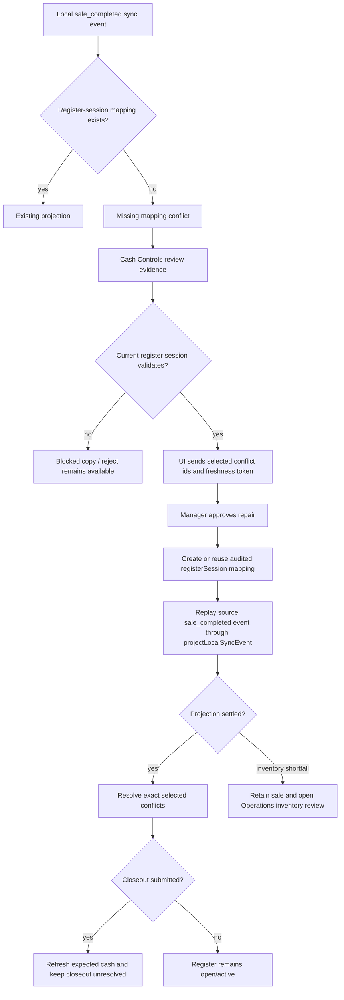
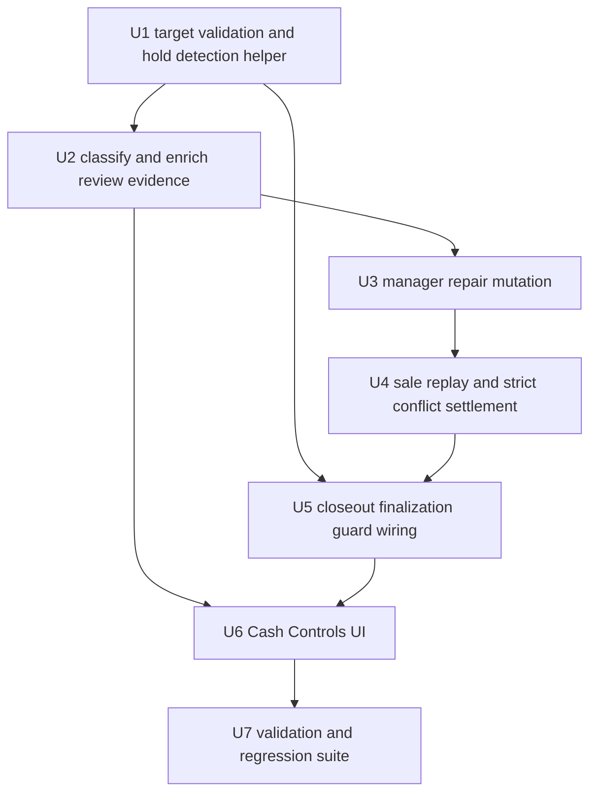

# fix: Repair missing register-session mappings for completed POS sales

## Summary

Completed local POS sales that sync without a usable register-session mapping should not be reject-only. The manager path should repair the missing local-to-cloud register-session mapping when Athena has enough evidence, replay the original completed sale idempotently, and retain the business record while preserving separate review work for inventory, payment, and closeout issues.

The current state visible on register session `th7dggy861qj04qm0rbk3xk635898wcv` is a good field example: Cash Controls reports synced register activity that needs manager review, shows completed receipts under review, but only offers rejection because the missing mapping conflict falls through to the generic/unknown review policy.

---

## Problem Frame

Local-first POS deliberately records completed sale events before cloud projection. When projection later cannot resolve `localRegisterSessionId` to a cloud `registerSessionId`, `projectLocalSyncEvent` creates `permission` conflicts with the summary `Register session mapping is missing for synced POS history.` Those conflicts are real, but the completed sales are not disposable. Treating the condition as reject-only discards recoverable business facts and makes Cash Controls a cleanup screen instead of a manager reconciliation surface.

The boundary that needs to change is not just UI copy. Athena needs a first-class repair contract that:

- proves the current Cash Controls register session is the safe target,
- creates or reuses the missing mapping,
- replays the source local event through existing projection,
- resolves only the conflicts that actually settled,
- keeps closeout, inventory, and payment consequences explicit.

---

## Requirements

### Review Classification And Evidence

- R1. Missing register-session mapping conflicts for completed `sale_completed` events classify as a first-class review kind, not `unknown`.
- R2. The review kind exposes a repair-capable action policy only when the current Cash Controls register session is a safe explicit target; v1 does not search for or let managers choose alternate target sessions.
- R2a. Register-session review reads and repair mutations must evaluate ungrouped store/terminal `needs_review` missing-mapping conflicts against the explicit current `registerSessionId`; true missing-mapping conflicts cannot depend on an existing mapping before they appear in the review set.
- R3. Review evidence includes receipt, local transaction id, local register session id, local event id, sequence/upload order, cashier, terminal, register number, completed time, total, tender summary, item count, and item lines.
- R4. Review evidence includes target-session validation facts for the current register session: cloud register session id, status, store, terminal, register number, opened time, Daily Close operating date/status, expected cash, and why the target is or is not repairable.
- R5. Operator-facing copy uses calm product wording and does not expose raw backend conflict summaries as the final message.
- R5a. Cash Controls read models expose full sale, tender, cashier, and cash-position evidence only to store-scoped manager users and existing store-scoped full-admin Cash Controls readers. Full-admin read access does not grant repair authority in v1. Other users get a minimal blocked/review-count payload with no tender details, counted cash, full item lines, staff identity, raw conflict payload, or source-event metadata.

### Repair Contract

- R6. Approval requires linked active manager staff proof for the source store at the server command boundary and records the actor, selected conflicts, source event ids, target register session, and repair result. This repair is never automatic and does not run from `pos_only` access without manager proof.
- R6a. The server derives source store, terminal, local register session, source event, and target register session from persisted records. Client-supplied store/terminal/register ids are preconditions only and are rejected if they do not match persisted state.
- R7. Repair refuses cross-store, cross-terminal, wrong-register, wrong-operating-date, superseded-session, `closed`, finalized Daily Close, finalized register closeout, and closeout-incompatible targets before creating any mapping or replaying any event.
- R8. Repair refuses to overwrite an existing `posLocalSyncMapping` that maps the same local register session to a different cloud register session.
- R9. Repair creates or reuses a `posLocalSyncMapping` for `localIdKind: "registerSession"` through a dedicated repair helper before replaying the preserved source event.
- R10. Reprojection is idempotent across sync retry, manager double-submit, and known partial projection for the repaired `sale_completed` path.
- R11. Repair approval requires exact `reviewConflictIds` and a freshness token. Approval resolves only exact selected conflicts, except sibling conflicts that are explicitly proven to represent the same settled source condition.
- R12. Rejection remains available for invalid, duplicate, or unsafe local activity, but it records manager intent and retains the local event evidence.

### Sale, Inventory, Payment, And Closeout Semantics

- R13. Sale repair retains the completed sale and payment evidence; it never rewrites receipt totals or drops sale lines to make projection easier.
- R14. If inventory cannot safely decrement, the sale still projects and Athena creates or preserves the Operations-owned `synced_sale_inventory_review` work item.
- R15. Payment projection preserves original evidence but ledger allocations must reconcile to sale total under existing reviewed-sale payment rules.
- R16. Closeout submission and counting remain allowed while finalization holds exist. Final register closure is blocked while any hold provider reports an active hold, including pending completed-sale void approvals and repairable missing-mapping completed-sale conflicts, even when the submitted closeout has no variance.
- R16a. Closeout hold mechanics are generic: each provider returns a stable hold kind, count, blocking reason, manager-facing copy key, safe routing/action metadata, sensitive-evidence policy, and the facts needed to recompute the hold before finalization.
- R16b. Cash-affecting hold providers also block register-session deposit recording while active, preserving the existing pending-void deposit precondition and extending it to repairable missing-mapping sale holds.
- R17. Repair into `open` or `active` sessions is allowed when the sale occurred within the current operating date. Repair into `closing` is allowed only when final closure is already being held for repairable completed-sale mapping conflicts, the sale occurred before closeout submission, and the closeout is not finalized.
- R18. Applying a repaired sale while the target session is `closing` updates expected cash and closeout/variance review evidence, keeps the closeout unresolved, and allows finalization only after `listRegisterSessionCloseoutHolds` reports no active providers and normal variance policy passes.
- R18a. Closeout and duplicate-closeout conflicts remain open with clear copy after sale repair unless they are the exact selected conflict or are explicitly proven to be the same settled source condition. v1 does not reopen finalized closeouts or settle duplicate closeout rows as a side effect of sale repair.

### Surfaces

- R19. Cash Controls register detail shows repairable completed sale rows with a primary `Repair and apply sale activity` decision, scoped to selected review conflict ids.
- R20. Mixed review groups do not get a global drawer-level repair button unless every selected item has the same safe action scope.
- R21. No Operations UI changes in v1. Existing Operations work items may remain as-is, but v1 adds no new Operations links, copy, repair controls, or evidence presentation.
- R22. Terminal Health remains explanatory for business-fact conflicts; it must not auto-repair completed sale/payment/inventory/closeout facts.

---

## Scope Boundaries

- This plan does not implement code.
- This plan does not create a support-only backfill script as the primary path; the product path is manager-approved repair where evidence is sufficient.
- This plan does not auto-attach across terminal, store, register, or operating-day mismatch.
- This plan does not reopen finalized Daily Close or finalized register closeouts in this slice.
- This plan does not make Terminal Health a hidden business-record repair surface.
- This plan does not redesign all POS local sync conflict types; it handles the missing register-session mapping gap for completed sales from Cash Controls.
- This plan does not add Operations repair UI in v1.
- This plan does not reopen `closed` sessions. Closeout submission can move a register to unresolved `closing`, but final closure is held until repairable completed-sale mapping conflicts are resolved.
- This plan does not add a second closeout-hold branch for sale-mapping conflicts; it generalizes the existing pending-void finalization guard so future hold providers can plug in.

### Deferred Follow-Up Work

- A controlled support tool for ambiguous multiple-candidate repairs.
- Reopen/carry-forward policy for already finalized Daily Close after late sale repair.
- Broader local sync repair dashboard if more repair kinds prove product-worthy.
- Operations Queue repair action parity after the Cash Controls path is proven.
- Duplicate-closeout sibling settlement beyond exact selected/same-source conflicts.

---

## Context & Research

### Observed Field State

- URL context: `/wigclub/store/wigclub/cash-controls/registers/th7dggy861qj04qm0rbk3xk635898wcv`.
- Register detail shows `needs review` for synced register activity and completed receipts under review.
- The review reason is `Register session mapping is missing for synced POS history.`
- The current UI presents rejection as the available reviewed sale action because the backend classification falls through to reject-only.

### Relevant Code And Patterns

- `packages/athena-webapp/convex/pos/application/sync/projectLocalEvents.ts` emits missing mapping conflicts from pending checkout, sale completion, sale clear, and register closeout projection paths.
- `packages/athena-webapp/convex/pos/infrastructure/repositories/localSyncRepository.ts` resolves register sessions by `posLocalSyncMapping`, then falls back only when the local id is already a valid cloud register session id in the same store/terminal.
- `packages/athena-webapp/convex/pos/application/sync/registerSessionSyncReview.ts` classifies register-session sync review kinds and currently has no distinct missing-mapping repair kind.
- `packages/athena-webapp/convex/cashControls/deposits.ts` owns `resolveRegisterSessionSyncReview`; it applies known reviewed sale, inventory, staff, closeout, and server-rejected cases but cannot repair missing register-session mappings.
- Existing review grouping can miss true missing-mapping conflicts because grouping by register session currently depends on either an existing mapping or a local id that already normalizes to a cloud register session. The v1 read/mutation contract must explicitly evaluate ungrouped store/terminal missing-mapping conflicts against the current register detail session.
- `packages/athena-webapp/src/components/cash-controls/RegisterSessionView.tsx` already renders row-level review decisions and passes scoped `reviewConflictIds`.
- `packages/athena-webapp/convex/operations/operationalWorkItems.ts` surfaces mapped register sync review work to Operations; v1 should not add direct Operations repair unless required after Cash Controls is fixed.
- `packages/athena-webapp/convex/pos/application/terminalRecovery/cloudRepairPolicy.ts` intentionally avoids auto-repair for sale/payment/inventory/closeout facts.

### Institutional Learnings

- `docs/solutions/architecture/athena-pos-local-first-sync-2026-05-13.md` says completed local sales must be preserved and conflicts promoted to review instead of rewriting or hiding local history.
- `docs/solutions/architecture/athena-pos-cashier-continuity-review-deferral-2026-06-20.md` says recoverable sync invariants should become review evidence instead of cashier blockers or discarded sales.
- `docs/solutions/logic-errors/athena-cash-controls-sale-sync-review-evidence-2026-06-18.md` says Cash Controls review must show sale evidence and the original selected sync conflict must not block its own idempotent replay.
- `docs/solutions/logic-errors/athena-pos-register-sync-closeout-review-recovery-2026-05-23.md` says review commands must settle the source sync event, not only the review row.
- `docs/solutions/logic-errors/athena-pos-sync-review-workspace-boundaries-2026-06-19.md` says Cash Controls owns drawer/sale decisions, Operations owns inventory correction, and raw backend wording is not product copy.
- `docs/solutions/logic-errors/athena-pos-register-sync-and-catalog-recovery-2026-05-26.md` says POS and Cash Controls should share sync review state and idempotent projection semantics.
- `docs/product-copy-tone.md` says operator-facing copy should lead with state, name the next action, and normalize backend wording.

### External References

- None. The repo has direct domain patterns and current backend/UI surfaces for this repair.

---

## Key Technical Decisions

- Add a distinct review kind, tentatively `missing_register_session_mapping`, instead of overloading `register_not_open_sale` or `inventory_review`.
- Add a validation helper for the explicit current Cash Controls register session target; v1 does not perform alternate target discovery.
- Extend the register-session review read path to include ungrouped store/terminal missing-mapping conflicts when they validate against the current register session. Use the same helper from the mutation before filtering exact `reviewConflictIds`.
- Repair orchestration is owned by the Cash Controls mutation. The mutation validates preconditions, creates/reuses the mapping, calls projection, and settles only eligible selected conflicts.
- Add a dedicated `createOrReuseRegisterSessionRepairMapping` repository contract. It reuses a same local-register-session to same cloud-register-session mapping regardless of original `localEventId`, rejects different targets as a precondition failure, and records manager repair audit metadata separately.
- Require a precondition hash returned by the read model and submitted by the UI. It covers selected conflict ids/statuses, source event ids/statuses, local register session id, current target register session id/status, mapping state, Daily Close status, and target validation facts.
- Treat an existing same-target repair mapping as idempotent; treat a different-target mapping as a hard precondition failure.
- Use the existing reviewed sale projection options for inventory shortfalls and payment mismatch handling instead of inventing a second sale projector.
- Generalize the existing completed-sale void final-closeout guard into a closeout hold registry/helper. Pending void approvals and repairable missing-mapping completed-sale conflicts both become hold providers.
- Allow closeout submission/counting to proceed, but run the generic hold helper before final closure: active holds keep the session in unresolved `closing` until each provider reports clear.
- Allow reviewed sale repair into that unresolved `closing` state under manager proof, update expected cash and closeout/variance evidence, and keep the closeout unresolved until repairable sale-mapping conflicts settle.
- Block repair into fully `closed`, finalized register closeout, or finalized Daily Close states for this slice; do not reopen closed sessions.
- Define operating date by the store's Daily Close/opening-day record for the current register session. The sale `occurredAt` must map to that same operating date using the same store-day helper used by operations closeout code; if no current day can be proven, repair is blocked.
- Resolve exact selected conflicts only. Sibling conflicts stay open unless the mutation proves they are the same settled source condition.
- Keep reject as an explicit manager decision, not the default action for recoverable missing mappings.
- Full-admin without linked manager staff proof is not accepted for this v1 repair path; that can be revisited after audit semantics are explicit.

---

## Open Questions

### Resolved During Planning

- Should missing mapping stay reject-only? No. Completed sales are business records and should be repairable when evidence is safe.
- Should Terminal Health auto-repair this? No. Sale/payment/inventory/closeout facts belong in manager review, not support auto-repair.
- Should the repair create a mapping or pass an override directly into projection? Create an audited mapping first, then reuse projection.
- Should inventory failure block sale retention? No. Retain sale/payment and hand inventory correction to Operations.
- Should repair support `closing` target sessions? Yes, but only for unresolved closeouts whose final closure is held for repairable completed-sale mapping conflicts. This mirrors the completed-sale void pattern: submit/count can proceed, final closure waits, and repair updates closeout evidence before finalization.
- Should Operations expose the repair button in v1? No. Keep repair in Cash Controls. Operations UI changes, including links, minimized states, and repair buttons, are deferred from v1.

### Deferred To Implementation

- Exact enum/action names for the new review kind and action policy.
- Exact store-day helper function name for deriving the Daily Close operating date from sale `occurredAt`.
- Exact audit event name for manager-created repair mappings.

---

## High-Level Technical Design

---

## Implementation Units

- U1. **Validate the explicit Cash Controls target and finalization hold**

**Goal:** Centralize repair eligibility and finalization-hold detection for the current register session so read model, mutation, and closeout commands enforce the same target rules.

**Requirements:** R2, R2a, R4, R5a, R7, R8, R16, R17

**Dependencies:** None

**Files:**
- Modify: `packages/athena-webapp/convex/pos/application/sync/registerSessionSyncReview.ts`
- Modify: `packages/athena-webapp/convex/cashControls/closeouts.ts` if the hold detector belongs closer to closeout commands
- Modify: `packages/athena-webapp/convex/pos/infrastructure/repositories/localSyncRepository.ts` if repository access needs a helper
- Test: `packages/athena-webapp/convex/cashControls/deposits.test.ts`

**Approach:**
- Validate only the current Cash Controls `registerSessionId` as target; do not search alternate candidates in v1.
- Add a register-session-scoped helper that scans store/terminal `needs_review` missing-mapping conflicts not already grouped by mapping, then evaluates each one against the current target session.
- Add a finalization-hold predicate that returns whether repairable completed-sale missing-mapping conflicts should keep the current session in unresolved `closing`.
- Candidate must match persisted source store, terminal, register number when present, and Daily Close operating date.
- Compute operating date from the same store-day/Daily Close helper used by operations closeout code; sale `occurredAt` must map to the current register session's active Daily Close day.
- Existing same-target mapping is eligible/idempotent.
- Existing different-target mapping is blocked.
- `closing` sessions are eligible only when U1's finalization-hold predicate is true and the closeout is not finalized.
- Fully `closed`, finalized register closeout, and finalized Daily Close sessions are blocked before mapping creation or replay.
- Emit machine-readable blocker codes, read-side authorization state, and normalized display copy.

**Test scenarios:**
- Current open/active same-terminal/register/day target is repairable.
- Current unresolved `closing` target is repairable when the finalization hold is active, the sale occurred before closeout submission, and neither register closeout nor Daily Close is finalized.
- Ungrouped missing-mapping conflict appears under the current register session when the target validates.
- Ungrouped missing-mapping conflict stays out of the current register session when target validation fails.
- Wrong store, wrong terminal, wrong register, wrong operating date, finalized `closed`, finalized closeout, and completed Daily Close are blocked.
- `closing` without the repairable-conflict finalization hold is blocked.
- Existing different mapping is a hard precondition failure.
- Existing same mapping behaves as idempotent repair.
- Unauthorized and non-full-admin non-manager read access receives minimized/redacted evidence.

---

- U2. **Classify missing register-session mapping as repairable review**

**Goal:** Make missing mapping conflicts first-class review items with sale evidence, target validation, and action policy.

**Requirements:** R1, R2, R3, R4, R5, R5a, R19, R20

**Dependencies:** U1

**Files:**
- Modify: `packages/athena-webapp/convex/pos/application/sync/registerSessionSyncReview.ts`
- Test: `packages/athena-webapp/convex/pos/application/sync/registerSessionSyncReview.test.ts` if present, otherwise cover via `packages/athena-webapp/convex/cashControls/deposits.test.ts`

**Approach:**
- Add review kind `missing_register_session_mapping`.
- Detect conflicts with missing mapping summaries/details from completed sale events and attach existing sale summary evidence.
- Include ungrouped missing-mapping conflicts returned by U1 under the current register session, with enough metadata to preserve exact selected conflict ids.
- Return `repair_or_reject`-style action policy only when U1 validates the current register session as repairable.
- Return blocked copy and support-needed evidence when U1 blocks the current target.
- Include `targetRegisterSessionId`, `candidatePreconditionHash`, and target validation facts in the review item returned to the UI.

**Test scenarios:**
- Completed sale missing mapping produces repairable review kind with sale evidence and a freshness token.
- Completed sale missing mapping produces a repairable action for `closing + finalization hold` when U1 validates the target.
- Non-sale missing mapping stays non-repairable unless explicitly supported.
- Blocked targets show normalized copy and no repair action.
- Unauthorized readers cannot infer tender, cashier, counted cash, item-line, raw conflict, or source event details.

---

- U3. **Add manager-approved mapping repair mutation**

**Goal:** Repair the missing mapping under server-side authorization and stable preconditions.

**Requirements:** R6, R6a, R8, R9, R11, R12, R22

**Dependencies:** U2

**Files:**
- Modify: `packages/athena-webapp/convex/cashControls/deposits.ts`
- Modify: `packages/athena-webapp/convex/pos/application/sync/registerSessionSyncReview.ts`
- Modify: `packages/athena-webapp/convex/pos/infrastructure/repositories/localSyncRepository.ts`
- Test: `packages/athena-webapp/convex/cashControls/deposits.test.ts`

**Approach:**
- This mutation is the single repair orchestration boundary: it validates, creates/reuses mapping, calls projection, and settles selected conflicts.
- Add mutation input for store, register session, terminal, target register session, selected conflict ids, and precondition hash. `reviewConflictIds` and the hash are required for repair approval.
- Derive source store, terminal, source events, local register session, and target register session from persisted records; reject mismatched client arguments.
- Require linked active manager staff proof for the source store. Do not allow automatic repair or full-admin-without-staff-profile repair in v1.
- Recompute explicit target eligibility inside the mutation.
- Before filtering `reviewConflictIds`, load both already grouped conflicts and ungrouped store/terminal missing-mapping conflicts evaluated through U1 for the explicit current register session.
- Create or reuse `posLocalSyncMapping` through `createOrReuseRegisterSessionRepairMapping`, which reuses same-target mappings across source event ids and rejects different targets.
- When the target is `closing`, require the final-closeout hold state and the sale-before-closeout precondition before replay.
- Record an operational event/audit trace with selected conflicts, source events, target, actor, and outcome.
- Reject does not delete local evidence; it settles exact selected source conflicts as manager-rejected.

**Test scenarios:**
- Manager repair creates mapping and records audit metadata.
- POS-only without manager proof cannot repair.
- Full-admin without linked manager staff proof cannot repair in v1.
- Manager from another store cannot repair.
- Stale precondition fails without side effects.
- Reject records intent and leaves local event evidence available.
- Same-target mapping with a different original `localEventId` is reused; different-target mapping fails.
- Repair mutation accepts selected ids from the ungrouped missing-mapping helper when target validation succeeds.

---

- U4. **Replay repaired sale events and settle exact selected conflicts**

**Goal:** Reuse existing sale projection for the repaired `sale_completed` source event without broadening projector behavior.

**Requirements:** R10, R11, R13, R14, R15

**Dependencies:** U3

**Files:**
- Modify: `packages/athena-webapp/convex/pos/application/sync/projectLocalEvents.ts`
- Modify: `packages/athena-webapp/convex/pos/application/sync/ingestLocalEvents.ts` only if event status settlement needs shared handling
- Test: `packages/athena-webapp/convex/pos/application/sync/projectLocalEvents.test.ts`
- Test: `packages/athena-webapp/convex/pos/application/sync/ingestLocalEvents.test.ts`

**Approach:**
- After repair mapping exists, call `projectLocalSyncEvent` for selected `sale_completed` source events with reviewed-sale projection options.
- Add an explicit reviewed-closeout sale-repair option for `closing` targets so this path bypasses normal sale-usability only under manager proof and final-closeout hold preconditions.
- Add only the natural-key recovery guards needed by this replay path: receipt/local transaction, POS session, payment `externalReference`, inventory review local id, service allocation references, and inventory movement disposition.
- Resolve exact selected conflict ids only after the source event status is settled or the sale side effects are proven already present.
- Resolve sibling conflicts only when they are explicitly proven to represent the same settled source condition; leave inventory/payment/closeout siblings open otherwise.
- If inventory cannot safely mutate, keep sale/payment projected and create/preserve Operations review.
- When replay applies to a `closing` target, update expected cash and closeout/variance evidence without finalizing the closeout.
- Recompute expected cash and variance from current persisted register facts after replay and before the finalization hold is recomputed or any final close proceeds.

**Test scenarios:**
- Repair and replay creates exactly one transaction/payment/item set.
- Double-submit and sync retry do not duplicate records.
- Orphaned transaction/payment/work-item records with missing mappings are recovered by natural key or fail cleanly without duplication.
- Inventory shortfall retains sale and creates `synced_sale_inventory_review`.
- Repairing a sale first does not make later replay/settlement of original register-open or closeout source events throw on same-target register-session mapping.
- Mixed review groups settle exact selected ids only.
- Repair into `closing` updates expected cash/variance evidence and leaves the closeout unresolved.

---

- U5. **Generalize closeout finalization holds and refresh closeout evidence**

**Goal:** Reuse and generalize the pending-void closeout hold mechanics so cashiers can submit/count closeout while any pluggable closeout hold prevents unsafe final closure.

**Requirements:** R16, R16a, R16b, R17, R18, R18a

**Dependencies:** U2, U4

**Files:**
- Add/modify: `packages/athena-webapp/convex/pos/application/sync/registerSessionCloseoutHolds.ts` or equivalent POS sync/review policy module
- Modify: `packages/athena-webapp/convex/cashControls/closeouts.ts`
- Modify: `packages/athena-webapp/convex/cashControls/deposits.ts`
- Modify: `packages/athena-webapp/convex/pos/application/sync/projectLocalEvents.ts`
- Test: `packages/athena-webapp/convex/operations/registerSessions.trace.test.ts` only to document that the low-level close helper remains a state-transition primitive
- Test: `packages/athena-webapp/convex/cashControls/closeouts.test.ts`
- Test: `packages/athena-webapp/convex/cashControls/deposits.test.ts`
- Test: `packages/athena-webapp/convex/pos/application/sync/projectLocalEvents.test.ts`

**Approach:**
- Own `listRegisterSessionCloseoutHolds` in a POS sync/review policy module that can be imported by `cashControls/closeouts.ts`, `cashControls/deposits.ts`, and `pos/application/sync/projectLocalEvents.ts` without creating a Cash Controls-to-Operations dependency inversion.
- Extract the existing pending-void closeout checks into a shared register-session finalization hold helper, tentatively `listRegisterSessionCloseoutHolds`.
- Model each hold as a typed provider result. Initial providers:
  - `pending_completed_sale_void_approvals`, backed by the existing pending-void approval lookup.
  - `repairable_missing_register_session_mapping_sales`, backed by U1's repairable missing-mapping conflict predicate.
- Before any path marks the register session `closed`, call the generic hold helper and block finalization if any provider reports an active hold.
- Keep `closeRegisterSession` / operations register-session transition helpers as dumb state-transition primitives. Do not make them query review state.
- Apply the hold guard at every current close caller before invoking a close helper or directly patching `closed`: direct closeout submission/finalization, inline manager variance approval, async variance approval resolution, local-sync `register_closed` projection, and any future explicit finalization command.
- Apply the same helper to `recordRegisterSessionDeposit`, blocking deposits when any cash-affecting hold provider is active. Initial cash-affecting providers are `pending_completed_sale_void_approvals` and `repairable_missing_register_session_mapping_sales`.
- If holds exist, accept closeout submission/count data but keep the register in unresolved `closing`/manager-review state with clear review evidence, even when variance would otherwise be zero.
- After each repair or explicit rejection, recompute expected cash, variance, and the finalization hold from persisted register facts. Final closeout can proceed only when `listRegisterSessionCloseoutHolds` reports no active providers and normal variance policy passes.
- Preserve the existing pending-void behavior through the new helper. The refactor must not change pending-void copy, result shape, or tests except to route through the generic hold abstraction.
- Keep hold provider payloads minimized. Sensitive sale, approval, staff, and tender facts remain behind their owning review surfaces; the closeout guard only needs hold kind, count, copy key, and routing/action metadata.
- Use the same helper for read-model callouts and command preconditions so the UI and mutation do not drift.

**Test scenarios:**
- Existing pending-void closeout hold tests still pass through the generic helper.
- Existing pending-void deposit-blocking tests still pass through the generic helper with unchanged or equivalent copy/result behavior.
- Multiple hold providers can be active at once; finalization remains blocked until all holds clear.
- Deposits are blocked while a repairable sale-mapping hold is active, and while multiple cash-affecting providers are active.
- Zero-variance closeout with repairable sale-mapping conflicts is submitted but not finalized.
- Variance closeout with repairable sale-mapping conflicts remains in manager review and does not hide the sale repair work.
- Repair while `closing` updates expected cash/variance evidence and keeps finalization blocked until all repairable sale-mapping conflicts settle.
- Direct closeout finalization, inline manager variance approval, async variance approval resolution, and local-sync `register_closed` projection all call the hold helper before closing.
- Operations `closeRegisterSession` remains a dumb transition primitive; caller tests prove closeout/review owners enforce holds before calling it.
- After repair/reject clears the sale-mapping hold, normal closeout finalization can proceed only if no other hold providers remain active.
- Finalized `closed` sessions are not reopened.

---

- U6. **Update Cash Controls review surface**

**Goal:** Present repairable completed sale activity with scoped decisions and calm copy.

**Requirements:** R3, R4, R5, R5a, R16, R18, R19, R20

**Dependencies:** U1, U3, U5

**Files:**
- Modify: `packages/athena-webapp/src/components/cash-controls/RegisterSessionView.tsx`
- Test: `packages/athena-webapp/src/components/cash-controls/RegisterSessionView.test.tsx`

**Approach:**
- Add row action copy such as `Repair and apply sale activity`.
- Use state copy such as `Completed sale needs register repair before it can sync.`
- Show evidence in three levels:
  - Row summary: receipt, total, completed time, cashier when authorized, terminal/register, current drawer, and repairability reason.
  - Expanded detail: item lines, tender summary, local ids, sequence/upload order, and source review reason.
  - Confirmation: `Sale to apply` beside `Target drawer`, plus inventory and closeout consequences.
- Show closeout-held state when applicable: `Closeout submitted. Repair reviewed sale activity before finalizing this drawer.`
- Submit `targetRegisterSessionId`, `candidatePreconditionHash`, and exact `reviewConflictIds` with the repair action.
- Hide drawer-level bulk action when selected review rows have mixed action scopes.
- Cover interaction states:
  - repairable: primary `Repair and apply sale activity`, secondary `Reject reviewed sale activity`;
  - no safe current target: disabled repair, secondary reject, copy `Register repair is blocked. Review the drawer state before applying this sale.`;
  - multiple/alternate candidates: no repair action in v1, copy `Register repair needs support review.`;
  - closing with finalization hold: repair action remains available, copy `Closeout submitted. Repair reviewed sale activity before finalizing this drawer.`;
  - closed/finalized day: no repair action, copy `Drawer is finalized. This sale needs support review before it can be applied.`;
  - in flight: disable row actions and show progress copy `Repairing sale activity...`;
  - stale precondition: keep row open and show `Review details changed. Refresh before applying this sale.`;
  - unauthorized: no repair action and copy `Manager approval required.`;
  - success: remove repaired row or move it to resolved state and refresh linked transactions;
  - inventory partial: show sale applied and state that inventory review remains open without adding new Operations links in v1;
  - rejection success: row resolves as manager-rejected without implying the sale disappeared;
  - mutation failure: keep row open with generic recovery copy.

**Test scenarios:**
- Repairable sale row shows receipt, cashier, tender, total, target drawer, and repair action.
- Mixed review rows keep row-level decisions and no unsafe global repair button.
- Raw backend summary does not appear as primary operator copy.
- Unauthorized/minimized state hides tender, counted cash, item-line, cashier, raw conflict, and source event details.
- Stale-precondition, in-flight, success, inventory-partial, rejection-success, and mutation-failure states render with the intended copy.
- Submitted closeout held by repairable sale-mapping conflicts renders repair actions and finalization guidance.

---

- U7. **Validation and regression suite**

**Goal:** Prove repair retains records without broadening unsafe sync behavior.

**Requirements:** All

**Dependencies:** U1-U6

**Files:**
- Test: `packages/athena-webapp/convex/pos/application/sync/projectLocalEvents.test.ts`
- Test: `packages/athena-webapp/convex/pos/application/sync/ingestLocalEvents.test.ts`
- Test: `packages/athena-webapp/convex/cashControls/closeouts.test.ts`
- Test: `packages/athena-webapp/convex/cashControls/deposits.test.ts`
- Test: `packages/athena-webapp/src/components/cash-controls/RegisterSessionView.test.tsx`
- Validate: `packages/athena-webapp/docs/agent/testing.md`

**Approach:**
- Start with focused backend tests for repair and replay.
- Add UI tests for review copy and action scoping.
- Run the POS local sync/register validation set and cash-controls slice.
- After implementation changes code, run `bun run graphify:rebuild`.

---

## Risks And Mitigations

| Risk | Mitigation |
| --- | --- |
| Wrong drawer attachment corrupts cash controls | Target validation refuses mismatched store, terminal, register, operating date, existing mapping, invalid `closing`, `closed`, and finalized Daily Close states; mutation recomputes eligibility from persisted records. |
| Duplicate transactions/payments/inventory | The repair path adds focused natural-key recovery for repaired `sale_completed` replay and tests retry/double-submit. |
| Sale repair hides inventory work | Sale projection resolves mapping conflict but creates/preserves Operations inventory review when stock cannot mutate. |
| Closeout totals drift silently | Closeout submission is allowed, but final closure is held while repairable sale-mapping conflicts remain; repaired sales refresh expected cash/variance evidence before finalization. |
| Generic closeout hold becomes a vague framework | Limit v1 providers to existing pending void approvals and repairable missing-mapping sales, with typed provider outputs and regression tests for both. |
| UI suggests a sale disappeared | Copy says completed sale needs register repair before sync; rejection is explicit and preserves evidence. |
| Sensitive review evidence leaks | Read models gate full sale/tender/cash/staff/source-event evidence to store-scoped manager users or existing store-scoped full-admin Cash Controls readers, while repair remains manager-proof-only. |
| Support auto-repair mutates business facts | Terminal Health remains read/explain only for these conflicts. |

---

## Acceptance Criteria

- A completed sale with missing register-session mapping appears as a repairable Cash Controls review item only when the current `open`, `active`, or eligible unresolved `closing` register session validates as the safe target.
- Manager approval requires linked active manager staff proof for the source store, exact `reviewConflictIds`, and the freshness token.
- Manager approval creates/reuses the repair mapping, replays the source `sale_completed` event, and resolves exact selected conflicts only after projection settles.
- Retry, double-submit, and sync retry create no duplicate records on the repaired sale path.
- Unsafe targets are blocked with operator-readable copy and no side effects.
- Inventory shortfall keeps the completed sale and opens or preserves Operations inventory review.
- Closeout submission/counting remains available, but final closure is held through the generic closeout hold helper while pending void approvals or repairable missing-mapping completed-sale conflicts remain.
- Pending completed-sale void closeout behavior is preserved through the generic helper without copy, result-shape, or authorization regressions.
- Pending completed-sale void deposit blocking is preserved through the generic helper, and repairable sale-mapping holds also block deposits until the hold clears.
- Repair into unresolved `closing` updates expected cash/variance evidence and keeps closeout unresolved until all active hold providers settle.
- Fully closed sessions, finalized register closeouts, and finalized Daily Close sessions are not mutated by this slice.
- Operations exposes no v1 repair controls, no new linked states, and no sensitive evidence.
- Terminal Health does not offer auto-repair for sale/payment/inventory/closeout business facts.

---

## Verification Plan

- Focused backend:
  - `bun test packages/athena-webapp/convex/pos/application/sync/projectLocalEvents.test.ts`
  - `bun test packages/athena-webapp/convex/pos/application/sync/ingestLocalEvents.test.ts`
  - `bun test packages/athena-webapp/convex/cashControls/deposits.test.ts`
- Focused UI:
  - `bun test packages/athena-webapp/src/components/cash-controls/RegisterSessionView.test.tsx`
- Repo-required after code changes:
  - `bun run graphify:rebuild`
- Delivery gate:
  - Use the POS local sync/register and cash-controls slices documented in `packages/athena-webapp/docs/agent/testing.md`.
  - Run broader `bun run pr:athena` after reviewer approval for implementation work.

---

## Rollout Notes

- Ship behind linked store-scoped manager staff proof; no cashier workflow change is required.
- Prefer a small backend-first implementation that makes repair safe and testable before widening UI affordances.
- For existing production conflicts, repair should be performed through the same audited mutation once deployed, not through direct table edits.
