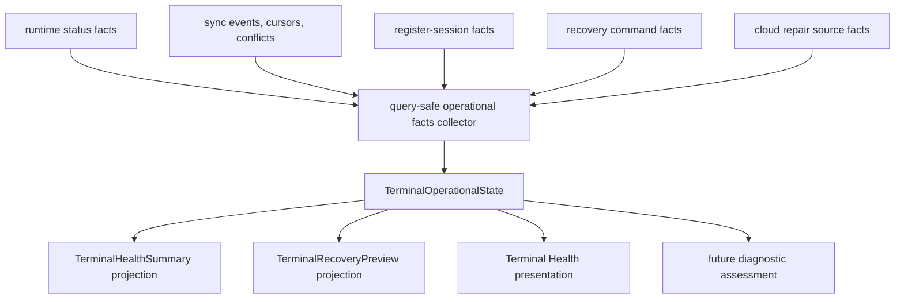
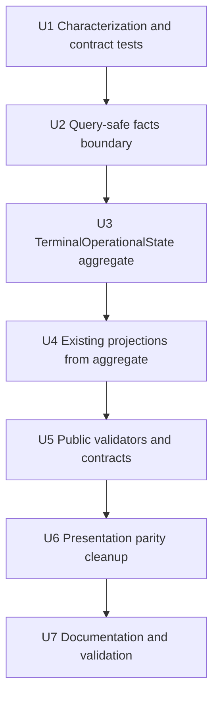

# refactor: Extract Terminal Operational State

## Summary

Extract POS terminal health and recovery read semantics into a single server-side `TerminalOperationalState` aggregate. The aggregate will remain a pure computed read boundary for this phase, preserving the normalized sync/runtime/register ledgers while making Terminal Health, terminal detail, `previewTerminalRecovery`, and future diagnostics classify terminal state from one policy output.

---

## Problem Frame

Athena currently assembles terminal truth inline inside Terminal Health queries. `packages/athena-webapp/convex/pos/application/queries/terminals.ts` joins latest runtime status, local sync events/cursors/conflicts, active register-session evidence, recovery command status, cloud repair classification, attention reasons, and public return shaping in one large path.

That shape is workable but fragile: every new diagnostic or recovery behavior is tempted to read the raw ledgers again, and the read-time join becomes an unnamed hidden source of truth. The user explicitly wants the split addressed before planning self-heal behavior.

---

## Requirements

- R1. Define a single server-owned `TerminalOperationalState` aggregate builder used by `listTerminalHealthSummaries`, `getTerminalHealthSummary`, and `previewTerminalRecovery`.
- R2. Keep underlying ledgers normalized. Do not merge or rewrite `posLocalSyncEvent`, `posLocalSyncCursor`, `posLocalSyncMapping`, `posLocalSyncConflict`, `posTerminalRuntimeStatus`, `registerSession`, or recovery command storage.
- R3. Keep the aggregate query-safe. Building operational state must not patch command expiry, resolve conflicts, write runtime status, or mutate recovery state.
- R4. Separate sales readiness, support recovery, and diagnostic evidence. Do not collapse `healthy_idle`, `drawer_open`, and `able_to_transact_now` into one health flag.
- R5. Preserve public Convex args, aliases, and return-shape compatibility for existing Terminal Health and recovery preview APIs unless an intentional validator-backed shape addition is required.
- R6. Preserve authority boundaries: POS-authorized users can view terminal state, full admins can issue repairs, terminal sync-secret proof can check in/list/claim/ack scoped commands, and original registrant ownership is not required.
- R7. Preserve current recovery semantics: command acknowledgement is not verification; fresh runtime evidence verifies recovery.
- R8. Encode active register precedence explicitly: fresh runtime can prove sale authority, but cloud register lifecycle policy remains the guardrail for drawer usability when evidence conflicts.
- R9. Classify local sync review safely: retryable lifecycle/reconciliation evidence can inform terminal action, but sale/payment/inventory/closeout/customer/variance facts remain manual review.
- R10. Preserve operator presentation parity: roster, detail, and `previewTerminalRecovery` must agree on readiness, action category, duplicate-disable state, verification state, active register evidence, and sync/manual-review classification.
- R11. Add validator and characterization coverage before broad UI or diagnostics consumers rely on the aggregate.
- R12. Leave self-heal implementation out of scope. This phase may expose non-actuating diagnostic classifications for future use, but it must not issue commands or trigger repairs automatically.

---

## Scope Boundaries

- This plan does not implement terminal self-heal, automatic repair, fleet remediation, or command issuance from diagnostics.
- This plan does not create a persisted operational-state table. The aggregate is computed per query in this phase; materialization is deferred until invalidation and race behavior are explicitly designed.
- This plan does not redesign terminal recovery commands, cloud repair execution, Remote Assist, Cash Controls review, or POS cashier workflows.
- This plan does not change sale authority, drawer authority, staff authority, or local command gateway behavior.
- This plan does not expose sync secrets, staff proof/PIN material, raw IndexedDB payloads, raw customer/payment data, or raw backend exception text in support-facing state.
- This plan does not make Terminal Health a hidden Cash Controls or Operations repair surface. Business-fact review remains with the owning workflow.

### Deferred to Follow-Up Work

- Terminal diagnostics/self-heal comparison contract that accepts a redacted local terminal snapshot and classifies repair options.
- Persisted or cached terminal operational-state snapshots, if roster scale later proves per-query computation too expensive.
- Fleet-level remediation scheduling and support runbooks after the aggregate stabilizes.
- New UI affordances beyond preserving existing roster/detail/recovery presentation parity.

---

## Context & Research

### Relevant Code and Patterns

- `packages/athena-webapp/convex/pos/application/queries/terminals.ts` currently defines `TerminalHealthSummary`, `TerminalRecoveryPreview`, and the inline assembly path for runtime evidence, sync evidence, active register evidence, attention reasons, cloud repair preview, command status, and health classification.
- `packages/athena-webapp/convex/pos/infrastructure/repositories/terminalRepository.ts` provides query helpers for latest runtime status, terminal sync evidence, active register-session evidence, and local-to-cloud mapping lookups.
- `packages/athena-webapp/convex/pos/public/terminals.ts` is the public Convex boundary with auth checks, return validators, and aliases such as `listTerminalHealth` and `getTerminalHealthDetail`.
- `packages/athena-webapp/convex/pos/application/terminalRecovery/cloudRepairPolicy.ts` is the existing pure policy for safe cloud repair classification and precondition hashing.
- `packages/athena-webapp/convex/pos/application/terminalRecovery/terminalCommandService.ts` and `packages/athena-webapp/convex/pos/infrastructure/repositories/terminalRecoveryRepository.ts` split recovery command lifecycle logic from persistence.
- `packages/athena-webapp/src/components/pos/terminals/terminalHealthPresentation.ts` is the frontend projection layer that must remain preview-first while tolerating legacy/partial response shapes.
- `packages/athena-webapp/shared/registerSessionLifecyclePolicy.ts` is the key precedent for extracting durable cross-layer policy: repositories provide facts, pure policy interprets them, and application code adapts rows into policy inputs.

### Institutional Learnings

- `docs/solutions/architecture/athena-pos-terminal-recovery-readiness-boundary-2026-06-14.md` establishes the core boundary: sales readiness, support recovery, and diagnostic evidence are distinct.
- `docs/solutions/architecture/athena-pos-runtime-decoupling-boundaries-2026-06-15.md` warns against continuing to mix readiness, sync drain, telemetry, recovery, and diagnostics in one effect graph.
- `docs/solutions/architecture/athena-pos-register-lifecycle-policy-2026-06-23.md` provides the extraction pattern for shared POS policy.
- `docs/solutions/architecture/athena-pos-remote-terminal-health-recovery-2026-06-11.md` keeps recovery as orchestration verified by runtime evidence, not server-side force-clear.
- `docs/solutions/architecture/athena-pos-local-first-sync-2026-05-13.md` keeps POS local-first ledgers distinct from cloud projection state.
- `docs/solutions/architecture/athena-pos-cashier-continuity-review-deferral-2026-06-20.md` says recoverable cloud invariant issues should become review evidence, not cashier blockers, when local recording is still safe.
- `docs/solutions/harness/convex-query-write-boundary-proof-2026-06-18.md` and `docs/solutions/harness/convex-return-validator-contract-proof-2026-06-18.md` came from this failure class: read paths must stay read-only and public return validators must track shipped shapes.
- `docs/solutions/logic-errors/athena-pos-register-sync-repair-and-runtime-reconciliation-2026-06-26.md` reinforces the need to keep register sync repair, runtime evidence, and recovery presentation aligned.

### External References

External research was skipped. The work is specific to Athena's Convex POS runtime, local-first sync, terminal recovery, and existing repo patterns.

---

## Key Technical Decisions

- **Compute operational state per query for this phase:** The aggregate is a pure read model builder, not a persisted table. This avoids introducing invalidation, caching, and stale snapshot races before the semantics are stable.
- **Name the aggregate boundary, not the storage:** `TerminalOperationalState` becomes the server truth for health/recovery read semantics, while the underlying normalized tables remain the durable ledgers.
- **Keep repositories fact-oriented:** Query-safe repositories return runtime, sync, register, conflict, command, and cloud-repair source facts. Policy modules classify those facts. Repositories should not become the semantic owner of readiness.
- **Project existing public outputs from the aggregate:** `TerminalHealthSummary` and `TerminalRecoveryPreview` should be projections of `TerminalOperationalState`, not parallel derivations.
- **Make diagnostics non-actuating:** Future-facing diagnostic classifications may be represented as `diagnosticOnly` or equivalent non-command-bound signals, but this plan does not bind them to command issuance or mutation.
- **Let cloud lifecycle policy guard drawer usability:** Fresh runtime evidence can prove sale authority only when cloud register lifecycle facts do not make the drawer unusable.
- **Let business-fact review outrank retry-sync:** Payment, inventory, closeout, variance, sale, customer, and manager-review evidence route to manual review even when retrying sync is also possible.
- **Treat historical commands as history, not current blockers:** Only active/current relevant command status should affect readiness and duplicate-disable state. Old failed, precondition-failed, or verified commands can remain detail evidence without foregrounding support work after blockers clear.
- **Preserve validator parity before UI reliance:** Any public return-shape addition must be represented in validators and conformance tests before frontend consumers depend on it.

---

## Open Questions

### Resolved During Planning

- **Should `TerminalOperationalState` be materialized now?** No. It should be computed per query in this phase.
- **Should this plan implement self-heal?** No. It creates the read boundary that future self-heal can compare against.
- **When runtime says drawer active but cloud lifecycle says closed/reviewed, which wins?** Cloud lifecycle policy remains the guardrail for sale usability; runtime remains diagnostic/sale-authority evidence.
- **Can local review evidence create a retry-sync action while manual-review conflicts exist?** Only lifecycle/reconciliation review can be retryable. Business-fact review stays manual.
- **Should `TerminalRecoveryPreview` be the root truth?** No. It remains a support-recovery projection of the broader operational state.

### Deferred to Implementation

- Exact internal module names and type names may adapt to repo conventions, but the plan expects a named `terminalOperationalState` boundary under the Convex POS application layer.
- The exact lightweight roster projection shape can be refined during implementation, but it must preserve list/detail parity for readiness, action category, command duplicate-disable state, and sync/manual-review classification.
- Whether existing query helper functions stay in `terminalRepository.ts` or move behind a new read repository can be decided by whichever produces the cleanest query-safe fact boundary. If a new boundary is created, prefer fact-oriented naming such as `collectTerminalOperationalFacts.ts` so it does not become a semantic repository.
- Exact diagnostic classification labels are deferred, provided they are explicitly non-actuating in this phase.

---

## High-Level Technical Design

> *This illustrates the intended approach and is directional guidance for review, not implementation specification. The implementing agent should treat it as context, not code to reproduce.*



The central architectural change is that `TerminalOperationalState` becomes the named read-side boundary. It receives normalized facts, applies policy once, and exposes projections for existing surfaces. Existing mutations continue to own writes: runtime status reporting, command acknowledgement, cloud repair, sync ingestion, and manual review resolution remain outside the aggregate.

### Operational State Slices

| Slice | Purpose | Source facts | Output posture |
| --- | --- | --- | --- |
| Terminal identity | Store/terminal scope, status, register number | `posTerminal` | Required for every projection |
| Runtime evidence | Freshness, local store, app shell/update, staff/sale authority | `posTerminalRuntimeStatus` | Evidence, not authority by itself |
| Sync evidence | Latest event, cursor, unresolved conflicts, review facts | `posLocalSyncEvent`, cursor, conflict, mapping | Review and retry classification |
| Register evidence | Active/open cloud register, lifecycle usability | `registerSession`, lifecycle policy | Sale usability guardrail |
| Recovery evidence | Command lifecycle and expected verification | recovery command repository | Current action/duplicate-disable state |
| Cloud repair candidates | Safe duplicate lifecycle repair eligibility | conflict and source event facts | Support action candidate, not automatic mutation |
| Diagnostic evidence | Missing/stale/degraded evidence | Derived from all slices | Non-actuating classification |

### Sales Readiness Matrix

| Sales readiness | Meaning | Key proof |
| --- | --- | --- |
| `healthy_idle` | Terminal has no current support blocker but is not proven to be transacting | Active terminal, fresh enough runtime, no support/manual blockers |
| `drawer_open` | Register/drawer evidence exists, but current sale authority is not proven | Cloud lifecycle allows drawer, sale authority not ready |
| `able_to_transact_now` | Fresh evidence says the terminal can transact now | Fresh runtime, sale authority ready, staff authority ready, active/open usable register |

### Support Recovery / Review Action Matrix

| Support recovery state | Meaning | Key proof |
| --- | --- | --- |
| `needs_cloud_repair` | A server-side safe repair candidate exists | Safe cloud repair policy and fresh precondition facts |
| `needs_terminal_action` | Matching terminal must perform local recovery | Current terminal action candidate or active command requirement |
| `needs_manual_review` | Business/review facts need human workflow | Payment, inventory, closeout, variance, customer, sale, or manager-review facts |
| No current support action | Terminal has no support repair or manual-review work | No current cloud repair, terminal action, or manual-review evidence |

---

## Implementation Units



- U1. **Characterize Current Terminal Read Semantics**

**Goal:** Add focused characterization coverage that snapshots current roster/detail/preview classifications before moving logic.

**Requirements:** R4, R5, R7, R8, R9, R10, R11.

**Dependencies:** None.

**Files:**
- Modify: `packages/athena-webapp/convex/pos/application/queries/terminals.test.ts`
- Modify: `packages/athena-webapp/convex/pos/public/terminals.test.ts`
- Modify: `packages/athena-webapp/src/components/pos/terminals/terminalHealthPresentation.test.ts`

**Approach:**
- Add representative fixtures before extraction, including healthy idle, drawer open, able to transact, stale runtime, current terminal action, historical command noise, safe cloud repair, and manual business review.
- Assert roster/detail/preview parity for readiness, action category, command duplicate-disable state, verification state, active register evidence, sync classification, and manual-review classification.
- Use existing return-validator conformance helpers for any public result fixture involved in characterization.
- Keep future precedence changes out of U1 expectations. If current inline behavior is intentionally corrected later, U1 should characterize the current output and the target behavior should be asserted under U3/U4.

**Execution note:** Characterization-first. This unit should fail if extraction changes behavior unintentionally.

**Patterns to follow:**
- Existing Terminal Health query tests in `packages/athena-webapp/convex/pos/application/queries/terminals.test.ts`.
- Public return conformance tests in `packages/athena-webapp/convex/pos/public/terminals.test.ts`.
- Presentation classification tests in `packages/athena-webapp/src/components/pos/terminals/terminalHealthPresentation.test.ts`.

**Test scenarios:**
- Happy path: active terminal with fresh runtime, ready staff/sale authority, and usable active register returns `able_to_transact_now`.
- Happy path: active terminal with fresh healthy runtime and no active sale context returns `healthy_idle`.
- Edge case: stale runtime never returns `able_to_transact_now`, even when cloud rows look healthy.
- Current-behavior characterization: runtime-reported active local drawer remains represented as active register evidence under the current inline logic; target cloud-lifecycle precedence is asserted in U3/U4.
- Edge case: old failed/precondition-failed/verified recovery commands remain detail history but do not create current support work after blockers clear.
- Error path: revoked/lost terminal returns no repair action and stable support presentation.
- Integration: roster, detail, and `previewTerminalRecovery` agree on readiness/action/verification for the same fixture.

**Verification:**
- Current behavior is pinned strongly enough that later units can extract logic without silent drift.

---

- U2. **Create Query-Safe Terminal Operational Facts Boundary**

**Goal:** Introduce a query-safe fact-collector boundary that gathers all facts needed to build terminal operational state without owning policy decisions or writes.

**Requirements:** R1, R2, R3, R5, R6, R11.

**Dependencies:** U1.

**Files:**
- Create: `packages/athena-webapp/convex/pos/application/terminalOperationalState/facts.ts`
- Create or modify: `packages/athena-webapp/convex/pos/application/terminalOperationalState/collectTerminalOperationalFacts.ts`
- Modify: `packages/athena-webapp/convex/pos/infrastructure/repositories/terminalRepository.ts`
- Modify: `packages/athena-webapp/convex/pos/infrastructure/repositories/terminalRecoveryRepository.ts`
- Test: `packages/athena-webapp/convex/pos/infrastructure/repositories/terminalRepository.test.ts`
- Test: `packages/athena-webapp/convex/pos/infrastructure/repositories/terminalRecoveryRepository.test.ts`

**Approach:**
- Keep fact collection query-safe and compatible with `QueryCtx`.
- Use fact-oriented naming and tests so this layer stays non-semantic. It should collect and normalize inputs, not decide readiness or recovery state.
- Gather terminal identity, latest runtime status, sync evidence, active register-session evidence, command status/history needed for current support work, cloud repair conflict/source event facts, and app update evidence.
- Preserve existing helper behavior for `getLatestRuntimeStatusForTerminal`, `getTerminalSyncEvidence`, and `hasActiveRegisterSessionForTerminal`, but route aggregate consumers through one fact bundle.
- Move duplicated query-time cloud-repair eligibility support out of the large terminal query file where appropriate, without changing safe/skipped conflict ordering or precondition hash inputs.
- Do not persist derived facts in this unit.

**Patterns to follow:**
- Query-safe repository helpers in `packages/athena-webapp/convex/pos/infrastructure/repositories/terminalRepository.ts`.
- Read/write separation in `packages/athena-webapp/convex/pos/infrastructure/repositories/terminalRecoveryRepository.ts`.
- Pure policy input shaping from `packages/athena-webapp/shared/registerSessionLifecyclePolicy.ts` consumers.

**Test scenarios:**
- Happy path: fact collector returns latest runtime, sync evidence, active register link, command status, and cloud repair facts for one active terminal.
- Edge case: terminal with no runtime status still returns sync/register facts and marks runtime evidence absent.
- Edge case: terminal with no sync events but existing cursor/conflicts returns cursor and unresolved conflict facts.
- Error path: query-safe fact collection does not call write-only repository methods or patch expired commands.
- Integration: fact collector preserves current safe cloud repair candidate ordering and precondition inputs.

**Verification:**
- All raw fact reads needed by Terminal Health are reachable through one query-safe boundary, and policy remains outside the repository layer.

---

- U3. **Build TerminalOperationalState Aggregate and Policy**

**Goal:** Add the server aggregate and pure classification policy that converts terminal facts into sales readiness, support recovery, diagnostic evidence, and provenance/freshness.

**Requirements:** R1, R3, R4, R7, R8, R9, R12.

**Dependencies:** U2.

**Files:**
- Create: `packages/athena-webapp/convex/pos/application/terminalOperationalState/types.ts`
- Create: `packages/athena-webapp/convex/pos/application/terminalOperationalState/policy.ts`
- Create: `packages/athena-webapp/convex/pos/application/terminalOperationalState/buildTerminalOperationalState.ts`
- Test: `packages/athena-webapp/convex/pos/application/terminalOperationalState/policy.test.ts`
- Test: `packages/athena-webapp/convex/pos/application/terminalOperationalState/buildTerminalOperationalState.test.ts`

**Approach:**
- Model top-level slices explicitly: terminal identity, runtime evidence, sync evidence, register evidence, recovery evidence, cloud repair candidates, app update evidence, and diagnostic evidence.
- Make `salesReadiness`, `supportRecovery`, and `diagnosticEvidence` separate outputs rather than one generic health value.
- Represent diagnostic classifications as non-actuating. They may explain missing/stale/degraded evidence but must not issue or enqueue repair actions.
- Encode evidence provenance and freshness enough for consumers to explain whether state came from runtime, cloud sync, register lifecycle, command history, or policy fallback.
- Apply the resolved precedence rules: cloud lifecycle policy guards drawer usability; business-fact review outranks retry-sync; command acknowledgement is not verification.

**Technical design:** Directional shape only:

```text
TerminalOperationalState
  terminalIdentity
  runtimeEvidence
  syncEvidence
  registerEvidence
  recoveryEvidence
  cloudRepairEvidence
  appUpdateEvidence
  salesReadiness
  supportRecovery
  diagnosticEvidence
```

**Patterns to follow:**
- `packages/athena-webapp/convex/pos/application/terminalRecovery/cloudRepairPolicy.ts`
- `packages/athena-webapp/shared/registerSessionLifecyclePolicy.ts`
- `packages/athena-webapp/convex/pos/application/sync/registerSessionSyncReview.ts`

**Test scenarios:**
- Happy path: state classifies an idle active terminal as `healthy_idle` without implying sale authority.
- Happy path: state classifies fresh runtime plus ready sale/staff authority plus usable active register as `able_to_transact_now`.
- Edge case: stale runtime downgrades sale readiness while keeping support diagnostics visible.
- Edge case: runtime active drawer plus cloud closed/reviewed lifecycle produces diagnostic evidence, not sale-ready authority.
- Edge case: safe duplicate register-open conflict becomes `needs_cloud_repair` only when source event, store/terminal scope, stale age, projection eligibility, and business-fact absence all hold.
- Edge case: payment/inventory/closeout/variance/customer/sale facts produce `needs_manual_review`, not retry-sync or cloud repair.
- Edge case: pending/claimed/current relevant command affects duplicate-disable state, while historical resolved command does not create current support work.
- Error path: revoked/lost terminal does not expose repair actions.
- Security path: aggregate excludes secret/proof/PIN/raw payload/customer/payment details from support-facing slices.

**Verification:**
- A pure aggregate policy exists and can classify the full terminal operational state without reaching into public query or UI code.

---

- U4. **Project Terminal Health and Recovery Preview From Aggregate**

**Goal:** Refactor existing terminal query outputs so `TerminalHealthSummary` and `TerminalRecoveryPreview` are projections from `TerminalOperationalState`.

**Requirements:** R1, R4, R5, R7, R8, R9, R10, R11.

**Dependencies:** U3.

**Files:**
- Modify: `packages/athena-webapp/convex/pos/application/queries/terminals.ts`
- Modify: `packages/athena-webapp/convex/pos/application/terminalRecovery/cloudRepairPolicy.ts` only if projection inputs need small policy-facing normalization
- Test: `packages/athena-webapp/convex/pos/application/queries/terminals.test.ts`
- Test: `packages/athena-webapp/convex/pos/application/terminalRecovery/cloudRepairPolicy.test.ts`
- Test: `packages/athena-webapp/convex/pos/application/terminalRecovery/resolveTerminalCloudRepair.test.ts`

**Approach:**
- Keep public query names and aliases unchanged.
- Replace inline readiness/recovery assembly in `queries/terminals.ts` with calls to the aggregate builder plus projection helpers.
- Preserve return fields unless the aggregate requires additive fields; additive fields must be planned through U5 validators.
- Ensure `previewTerminalRecovery` returns the same recovery projection as detail/roster for the same terminal state.
- Keep mutation-side cloud repair revalidation behavior compatible with query-side repair candidate classification.

**Patterns to follow:**
- Existing projection structure in `buildTerminalHealthSummary`.
- Existing recovery preview tests in `packages/athena-webapp/convex/pos/application/queries/terminals.test.ts`.
- Mutation recheck pattern in `packages/athena-webapp/convex/pos/application/terminalRecovery/resolveTerminalCloudRepair.ts`.

**Test scenarios:**
- Happy path: existing terminal health summary fixture has the same visible fields before and after projection refactor.
- Integration: `listTerminalHealthSummaries`, `getTerminalHealthSummary`, and `previewTerminalRecovery` agree on the same aggregate-derived readiness and actions.
- Edge case: `includeSyncEvidence` false path, if retained, does not produce misleading manual-review or cloud-repair states.
- Edge case: app update evidence remains diagnostic/support action evidence and does not affect sales readiness.
- Target precedence: cloud register lifecycle that is closed or reviewed prevents sale-ready projection even when runtime reports an active local drawer.
- Error path: changed cloud repair evidence causes mutation precondition failure rather than conflict/event patching.
- Regression: safe/skipped conflict IDs and precondition hash remain stable for existing fixtures.

**Verification:**
- Terminal Health and recovery preview read from one server aggregate boundary while public query behavior remains compatible.

---

- U5. **Preserve Public Contracts and Validator Parity**

**Goal:** Keep Convex public return shapes, validators, aliases, and auth behavior aligned with the aggregate projections.

**Requirements:** R5, R6, R10, R11.

**Dependencies:** U4.

**Files:**
- Modify: `packages/athena-webapp/convex/pos/public/terminals.ts`
- Modify: `packages/athena-webapp/src/components/pos/terminals/terminalHealthTypes.ts`
- Test: `packages/athena-webapp/convex/pos/public/terminals.test.ts`

**Approach:**
- Keep existing public query names and args stable.
- Update public return validators only for deliberate additive aggregate-derived fields.
- Cover representative roster, detail, and preview payloads with exported-return conformance.
- Preserve the R6 auth categories explicitly: POS-authorized users can view terminal state, full admins can issue repair/cloud-repair actions, and terminal sync-secret proof can check in/list/claim/ack scoped commands.
- Ensure list/detail alias exports keep the same behavior.

**Patterns to follow:**
- Existing `assertConformsToExportedReturns` usage in public terminal tests.
- Validator definitions in `packages/athena-webapp/convex/pos/public/terminals.ts`.
- Public return validator drift lessons from `docs/solutions/harness/convex-return-validator-contract-proof-2026-06-18.md`.

**Test scenarios:**
- Happy path: representative `listTerminalHealthSummaries` result conforms to returns validator.
- Happy path: representative `getTerminalHealthSummary` detail result conforms to returns validator.
- Happy path: representative `previewTerminalRecovery` result conforms to returns validator.
- Edge case: nested `recoveryPreview.appUpdate`, `commandStatus.appUpdateCommandExecutionId`, `cloudRepair`, `terminalActions`, `manualReview`, `syncEvidence`, and `runtimeStatus` remain validator-compatible.
- Error path: terminal proof with wrong sync secret cannot check in, list recovery commands, claim recovery commands, or acknowledge recovery commands; POS-authorized terminal-state viewing and full-admin repair issuance remain unchanged.
- Compatibility: browser `terminalHealthTypes.ts` remains compatible with old `recovery` fallback and current `recoveryPreview`.

**Verification:**
- Public API consumers and generated Convex validators do not drift behind aggregate-derived payloads.

---

- U6. **Route Frontend Presentation Through Aggregate-Derived Semantics**

**Goal:** Keep Terminal Health roster/detail and support recovery presentation preview-first and parity-aligned after the server extraction.

**Requirements:** R4, R5, R10, R12.

**Dependencies:** U5.

**Files:**
- Modify: `packages/athena-webapp/src/components/pos/terminals/terminalHealthPresentation.ts`
- Modify: `packages/athena-webapp/src/components/pos/terminals/POSTerminalHealthView.tsx`
- Modify: `packages/athena-webapp/src/components/pos/terminals/POSTerminalDetailView.tsx`
- Test: `packages/athena-webapp/src/components/pos/terminals/terminalHealthPresentation.test.ts`
- Test: `packages/athena-webapp/src/components/pos/terminals/POSTerminalHealthView.test.tsx`
- Test: `packages/athena-webapp/src/components/pos/terminals/POSTerminalDetailView.test.tsx`

**Approach:**
- Continue using shared presentation helpers rather than re-deriving readiness from raw sync/runtime facts in components.
- Keep raw fallback only for missing/legacy preview responses; fallback must not outrank aggregate-derived recovery preview when present.
- Preserve loading metrics behavior such as `-` instead of false zeroes.
- Keep detail-only payloads detail-only, while roster rows retain readiness, current action category, duplicate-disable command state, verification state, and sync/manual-review classification.
- Do not add new action buttons for diagnostics/self-heal in this phase.

**Patterns to follow:**
- Existing presentation helper tests in `terminalHealthPresentation.test.ts`.
- Terminal recovery readiness boundary solution doc.
- Product copy tone in `docs/product-copy-tone.md`.

**Test scenarios:**
- Happy path: roster and detail render matching labels for `healthy_idle`, `drawer_open`, and `able_to_transact_now`.
- Happy path: cloud repair, terminal action, and manual review categories render the same action category in roster/detail.
- Edge case: missing `recoveryPreview` uses safe fallback copy without contradicting aggregate preview when it exists.
- Edge case: historical command failure does not foreground support work when aggregate says no current blocker.
- Edge case: loading metrics render as unknown placeholders, not zero.
- Error path: revoked/lost terminal renders no repair action.
- Redaction: UI copy excludes raw conflict IDs, secret/proof material, raw local payload, customer data, and payment details.

**Verification:**
- Frontend presentation consumes aggregate-derived semantics and no longer creates a second readiness source.

---

- U7. **Document the Boundary and Run Plan-Specific Validation**

**Goal:** Capture the new server truth boundary and validation posture so future diagnostics/self-heal work builds on the aggregate instead of recreating raw joins.

**Requirements:** R1, R2, R3, R4, R11, R12.

**Dependencies:** U6.

**Files:**
- Create: `docs/solutions/architecture/athena-terminal-operational-state-aggregate-2026-06-27.md`
- Modify: `packages/athena-webapp/docs/agent/validation-guide.md` only if a new validation-map entry is required
- Generated if code changes: `graphify-out/**`

**Approach:**
- Document `TerminalOperationalState` as the server truth boundary for terminal health/recovery read semantics.
- Record that normalized ledgers remain source ledgers and the aggregate is computed, query-safe, and non-actuating.
- Note the required follow-on path for diagnostics/self-heal: compare a redacted terminal-local snapshot against the aggregate, then route action through existing audited mutations.
- Run focused test groups before broad gates, and rebuild graphify after code changes.

**Patterns to follow:**
- `docs/solutions/architecture/athena-pos-terminal-recovery-readiness-boundary-2026-06-14.md`
- `docs/solutions/architecture/athena-pos-register-lifecycle-policy-2026-06-23.md`
- `packages/athena-webapp/docs/agent/validation-guide.md`

**Test scenarios:**
- Test expectation: none for the solution doc itself; validation is through the focused tests and repo gates attached to U1-U6.

**Verification:**
- Future implementers have a documented boundary and validation map for the aggregate.

---

## System-Wide Impact

- **Interaction graph:** Terminal Health roster, terminal detail, `previewTerminalRecovery`, cloud repair preview, recovery command lifecycle, runtime status check-in verification, and frontend presentation all become consumers of the same aggregate-derived semantics.
- **Error propagation:** Query-time fact collection should degrade into absent/stale diagnostic evidence where appropriate, not into write attempts or operator-visible raw backend errors.
- **State lifecycle risks:** Computed state avoids cache invalidation for now. The plan explicitly defers materialization to avoid stale snapshots and race conditions.
- **API surface parity:** Existing public Convex queries, aliases, POS-authorized terminal-state viewing, full-admin repair issuance, and terminal sync-secret check-in/list/claim/ack APIs must keep compatible args/returns. Validator parity is a required unit.
- **Integration coverage:** Unit tests on the aggregate are insufficient alone; roster/detail/preview parity and public return conformance are required.
- **Unchanged invariants:** Runtime status remains evidence, command acknowledgement remains non-verifying, cloud repair mutations still revalidate safety, business review stays manual, and POS local-first ledgers remain durable source ledgers.

---

## Risks & Dependencies

| Risk | Mitigation |
|------|------------|
| Extraction changes operator-visible readiness behavior | Start with characterization tests and require roster/detail/preview parity fixtures. |
| Aggregate becomes another hidden write service | Keep it query-safe, fact-oriented, and covered by query/write boundary tests and review. |
| Public return validators drift | Make validator parity its own implementation unit before frontend reliance. If U4 adds public-return fields, U4 and U5 should land as one green validation slice so validators never trail implementation. |
| Runtime evidence accidentally becomes sale authority | Encode cloud lifecycle precedence and distinct sales/support/diagnostic slices in policy tests. |
| Manual business review appears as auto-repair | Business-fact review outranks retry-sync and cloud repair in aggregate policy tests. |
| Roster read cost increases | Keep materialization deferred but watch query fan-out during implementation; optimize fact collection without changing semantics. |
| Future self-heal starts from raw ledgers anyway | Document the aggregate as the required comparison boundary for diagnostics/self-heal follow-up work. |

---

## Documentation / Operational Notes

- The implementation should add a `docs/solutions/architecture/` note after code lands.
- If code files change, run `bun run graphify:rebuild` before handoff, per repo instructions.
- Validation should include focused Terminal Health/query/recovery tests, public validator tests, relevant presentation tests, `audit:convex`, changed-file lint/type checks, and eventually `bun run pr:athena`.
- No production rollout or deploy is part of this planning request.

---

## Sources & References

- Related code: `packages/athena-webapp/convex/pos/application/queries/terminals.ts`
- Related code: `packages/athena-webapp/convex/pos/infrastructure/repositories/terminalRepository.ts`
- Related code: `packages/athena-webapp/convex/pos/public/terminals.ts`
- Related code: `packages/athena-webapp/convex/pos/application/terminalRecovery/cloudRepairPolicy.ts`
- Related code: `packages/athena-webapp/convex/pos/application/terminalRecovery/terminalCommandService.ts`
- Related code: `packages/athena-webapp/convex/pos/infrastructure/repositories/terminalRecoveryRepository.ts`
- Related code: `packages/athena-webapp/shared/registerSessionLifecyclePolicy.ts`
- Related code: `packages/athena-webapp/convex/pos/application/sync/registerSessionSyncReview.ts`
- Related code: `packages/athena-webapp/src/components/pos/terminals/terminalHealthPresentation.ts`
- Product copy: `docs/product-copy-tone.md`
- Related plan: `docs/plans/2026-06-15-001-refactor-pos-runtime-decoupling-plan.md`
- Related plan: `docs/plans/2026-06-11-001-feat-pos-remote-terminal-health-plan.md`
- Related plan: `docs/plans/2026-06-23-001-refactor-pos-register-lifecycle-policy-plan.md`
- Related plan: `docs/plans/2026-06-26-001-register-sync-mapping-repair-plan.md`
- Related learning: `docs/solutions/architecture/athena-pos-terminal-recovery-readiness-boundary-2026-06-14.md`
- Related learning: `docs/solutions/architecture/athena-pos-runtime-decoupling-boundaries-2026-06-15.md`
- Related learning: `docs/solutions/architecture/athena-pos-register-lifecycle-policy-2026-06-23.md`
- Related learning: `docs/solutions/architecture/athena-pos-remote-terminal-health-recovery-2026-06-11.md`
- Related learning: `docs/solutions/architecture/athena-pos-local-first-sync-2026-05-13.md`
- Related learning: `docs/solutions/architecture/athena-pos-cashier-continuity-review-deferral-2026-06-20.md`
- Related learning: `docs/solutions/logic-errors/athena-pos-register-sync-repair-and-runtime-reconciliation-2026-06-26.md`
- Related learning: `docs/solutions/harness/convex-query-write-boundary-proof-2026-06-18.md`
- Related learning: `docs/solutions/harness/convex-return-validator-contract-proof-2026-06-18.md`
