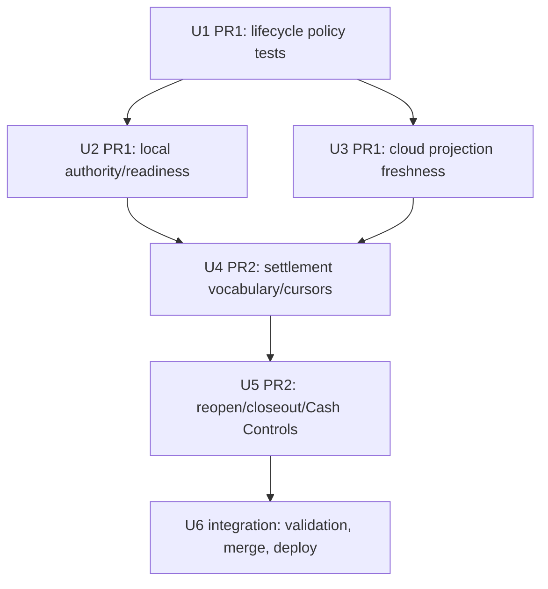

# fix: Stabilize POS local/cloud sync contract

## Summary

Stabilize Athena POS drawer lifecycle and sync settlement in two stacked delivery PRs. PR1 tightens drawer authority, replacement freshness, and local/cloud register identity; PR2 builds on that contract to repair broader sync settlement, cursor, reopen, closeout, and Cash Controls presentation behavior.

---

## Problem Frame

The current POS register can drift between browser-local event truth and cloud projection truth. The audit found that some lifecycle review rows can be locally treated as usable too early, some authority blocks are keyed under an id the reader does not ask for, and broader sync outcomes can hide rejected or cursor-invalid work as settled. These are money/drawer lifecycle issues, so the implementation must keep cashier continuity without weakening drawer authority or manager review evidence.

---

## Requirements

- R1. Work must happen in delivery worktrees, not on the local root checkout.
- R2. PR1 must land first and define the drawer lifecycle/authority baseline consumed by PR2.
- R3. A replacement drawer cannot become sale-usable from a `needs_review` register open; replacement usability requires accepted/projected cloud evidence or an explicitly safe policy path.
- R4. Drawer authority and closeout settlement must compare local and cloud register-session identities consistently.
- R5. Duplicate `register_opened` uploads reusing the same local drawer id with a different source event must not silently project as success.
- R6. Closing/reviewed drawer replacement freshness must use a real closeout/review boundary, not cross-drawer sequence comparison alone.
- R7. PR2 must keep POS and expense sync cursor identities separate and submit cursor-ordered batches.
- R8. Server `rejected`, `conflicted`, `held`, and `projected` outcomes must have distinct local settlement semantics.
- R9. Offline `register_reopened` must have an explicit proof/review policy instead of being uploadable but unprojectable.
- R10. Zero-variance closeout failures and replacement-drawer Cash Controls links must present truthful pending/review state.
- R11. Manager review and runtime repair paths must be freshness-checked, idempotent, and unable to override current drawer authority.
- R12. Final delivery must include focused tests, `bun run pr:athena`, graph rebuild after code changes, merge, local root alignment, and production deploy of relevant Convex and Athena web surfaces.
- R13. PR2 rollout must remain backward-compatible for already-open browsers and queued offline events until the matching Athena webapp is deployed.
- R14. Repair/review authorization must never persist raw PINs or proof tokens; server mutations must authorize active same-store manager proof at the point of action.

---

## Scope Boundaries

- This plan does not redesign POS drawer opening, closeout submission, or Cash Controls information architecture beyond the audited contract gaps.
- This plan does not add Terminal Health auto-repair for business facts such as sales, payments, inventory, or closeouts.
- This plan does not patch browser IndexedDB directly; all local repair remains event-log or command-gateway based.
- This plan does not do implementation from the local root checkout.
- This plan does not require one PR per Linear ticket; the execution strategy is two stacked delivery PRs to control shared generated-artifact and contract churn.
- Expense-session work is limited to preserving cursor partitioning in the shared POS sync drain; this plan does not broaden expense behavior, approval policy, or expense UI.

### Deferred to Follow-Up Work

- A broader Operations repair UI for missing mapping or inventory review outcomes.
- A full support dashboard for all POS sync review kinds.
- New repo sensors if execution discovers a validation parity gap separate from these contract fixes.

---

## Context & Research

### Relevant Code and Patterns

- `packages/athena-webapp/shared/registerSessionLifecyclePolicy.ts` is the shared lifecycle policy boundary.
- `packages/athena-webapp/src/lib/pos/infrastructure/local/registerReadModel.ts` derives browser-local drawer state and sellability from event log plus drawer authority.
- `packages/athena-webapp/src/lib/pos/infrastructure/local/localCommandGateway.ts` gates durable local POS appends.
- `packages/athena-webapp/src/lib/pos/infrastructure/local/drawerAuthorityReconciliation.ts` writes and clears local drawer authority state from sync outcomes.
- `packages/athena-webapp/src/lib/pos/infrastructure/local/usePosLocalSyncRuntime.ts` drains local events, applies returned mappings/conflicts, and marks local sync state.
- `packages/athena-webapp/src/lib/pos/infrastructure/local/syncScheduler.ts` orders and groups upload batches.
- `packages/athena-webapp/convex/pos/application/sync/ingestLocalEvents.ts` owns server-side batch cursor validation and accepted/held/conflicted/rejected outcomes.
- `packages/athena-webapp/convex/pos/application/sync/projectLocalEvents.ts` owns cloud projection, register-session creation/reuse, and conflict creation.
- `packages/athena-webapp/convex/cashControls/closeouts.ts` and `packages/athena-webapp/convex/cashControls/deposits.ts` own manager review, closeout, and deposit surfaces.
- `packages/athena-webapp/convex/pos/application/terminalOperationalState/policy.ts` keeps sales readiness, support recovery, and diagnostics distinct.

### Institutional Learnings

- `docs/solutions/architecture/athena-pos-register-lifecycle-policy-2026-06-23.md`: drawer lifecycle decisions belong in a pure shared policy, not duplicated across browser and Convex.
- `docs/solutions/logic-errors/athena-pos-closeout-review-only-lifecycle-2026-06-25.md`: closeout review state must remain manager-visible without becoming sale-usable drawer state.
- `docs/solutions/logic-errors/athena-register-closeout-generic-holds-2026-06-26.md`: final closeout/deposit blockers should use generic hold providers rather than one-off branches.
- `docs/solutions/architecture/athena-pos-local-first-sync-2026-05-13.md`: POS sync is an event-log settlement system; local ids and business facts must be preserved through review.
- `docs/solutions/architecture/athena-pos-hub-owned-local-sync-drain-2026-05-18.md`: sync drain belongs to the POS hub/runtime, not individual register UI flows.
- `docs/solutions/logic-errors/athena-pos-register-sync-repair-and-runtime-reconciliation-2026-06-26.md`: runtime repair must append through command-gateway paths and remain evidence-driven.
- `docs/solutions/architecture/athena-terminal-operational-state-aggregate-2026-06-27.md`: terminal readiness diagnostics should reuse `TerminalOperationalState` concepts.
- `docs/solutions/harness/pr-athena-prepare-validate-proof-2026-06-13.md`: `bun run pr:athena` is the merge-level proof ladder.

### External References

- None. Existing Athena POS, Convex, Cash Controls, and terminal runtime patterns are the source of truth.

---

## Key Technical Decisions

- **Use two stacked delivery PRs:** PR1 lands drawer lifecycle/authority/freshness first; PR2 is based on PR1 and rebased after PR1 reaches `main`.
- **Use delivery worktrees throughout:** Planning, PR1, PR2, validation, and deploy staging run from worktrees. Root is used only for final alignment after merge.
- **Keep PR1 policy-centered:** PR1 may touch local read model, readiness, drawer authority reconciliation, and Convex projection, but only to close lifecycle authority gaps. It must not redefine broader sync settlement.
- **Make freshness evidence explicit:** PR1 must lock stale/unknown replacement behavior using accepted projection, closeout/review boundary facts, and scoped store/terminal/register identity rather than comparing unrelated drawer sequence streams.
- **Separate local-safe settlement from cloud projection:** PR2 must name the status vocabulary for `projected`, `conflicted`, `held`, `rejected`, and locally settled precursor rows instead of treating them all as synced.
- **Keep manager and runtime repairs freshness-checked:** Repair-capable paths use exact source ids and precondition evidence; stale directives or stale manager decisions fail without side effects.
- **Deploy from clean root after merge:** Feature implementation and validation use delivery worktrees, but production deploy runs only after root `main` is clean and fast-forwarded to merged `origin/main`.
- **Use a compatibility-safe deploy order:** Because both PRs affect Convex behavior and browser runtime/UI, final deploy should run `convex-prod` before `athena-local` only after PR2 proves old-client-safe Convex responses. If implementation cannot prove that compatibility, PR2 must ship a tolerant browser-handling slice before enabling new server settlement semantics.
- **Defer `register_reopened` cloud upload:** PR2 should remove/defer `register_reopened` from uploadable local sync until a dedicated manager-review replay contract exists. Existing uploaded review rows remain manager-visible/rejectable but are not retried into projection in this work.

---

## Open Questions

### Resolved During Planning

- **Do the PRs depend on each other?** Yes. PR2 should be stacked on PR1 and rebased after PR1 lands.
- **Should implementation happen on local root?** No. Delivery worktrees are required.
- **Should PR2 redefine drawer authority if settlement changes require it?** No. PR2 consumes PR1's shared lifecycle policy.
- **Should external research be used?** No. The relevant contracts are repo-local POS/Convex/Cash Controls contracts.

### Deferred to Implementation

- The exact field list for manager-review freshness hashes should be finalized while touching the Cash Controls mutation/read model, but it must cover conflict ids/statuses, source event statuses, target register status, mapping state, closeout hold state, Daily Close status, target validation facts, actor proof metadata, and policy version.
- Whether `clearSettledRecoverableDrawerAuthorityBlock` remains under readiness observation or moves to reconciliation-only code depends on the cleanest testable boundary.
- Exact operator copy should follow `docs/product-copy-tone.md`.

---

## High-Level Technical Design

> *This illustrates the intended approach and is directional guidance for review, not implementation specification. The implementing agent should treat it as context, not code to reproduce.*

The contract should keep these layers distinct:

| Layer | Owns | Must not own |
| --- | --- | --- |
| Shared lifecycle policy | Drawer status, authority, replacement eligibility, freshness decisions over plain facts | Repository reads, React state, Convex table access |
| Browser local POS | Event-log projection, command-gateway acceptance, drawer authority reads | Cloud projection truth, manager review finality |
| Convex sync | Upload cursor validation, idempotent projection, conflict creation | Browser readiness UI, local IndexedDB repair |
| Cash Controls | Manager review, closeout/deposit holds, repair approvals | Terminal Health auto-repair for business facts |
| Terminal operational state | Diagnostics, support readiness, runtime evidence | Sale authority by itself |

Server sync outcomes must map to local state deliberately:

| Server outcome | Local row state | Precursor handling | Operator-facing label |
| --- | --- | --- | --- |
| `projected` | Synced/uploaded | Eligible local-only precursors may settle when the projected parent proves them | Synced |
| `conflicted` | Needs review/uploaded | Precursors remain unsettled unless the conflict proves a specific local-only precursor is obsolete | Needs manager review |
| `held` | Pending or held, not synced | No precursor settlement | Waiting for earlier POS history |
| `rejected` | Failed or needs review with server reason, not synced | No precursor settlement unless explicitly local-settled by a named policy | Sync rejected; review required |

---

## Implementation Units

- U1. **PR1 Shared Drawer Lifecycle Contract**

**Goal:** Make shared drawer lifecycle policy the authoritative contract for sale usability, replacement eligibility, non-blocking lifecycle review, and freshness.

**Requirements:** R2, R3, R4, R6, R11

**Dependencies:** None

**Files:**
- Modify: `packages/athena-webapp/shared/registerSessionLifecyclePolicy.ts`
- Modify: `packages/athena-webapp/shared/registerSessionLifecyclePolicy.test.ts`
- Modify: `packages/athena-webapp/shared/registerSessionStatus.ts` only if current status helpers need reuse

**Approach:**
- Add or tighten helpers that separate sale attachment from opening a replacement drawer.
- Require scoped store/terminal/register identity and real freshness facts for replacement decisions.
- Treat `needs_review` lifecycle rows as review evidence, not accepted replacement proof.
- Preserve the existing shared-module rule: pure inputs only, no Convex or browser adapter imports.

**Execution note:** Test-first. Add failing policy cases before changing callers.

**Patterns to follow:**
- `packages/athena-webapp/shared/registerSessionStatus.ts`
- `docs/solutions/architecture/athena-pos-register-lifecycle-policy-2026-06-23.md`

**Test scenarios:**
- Happy path: synced/projected replacement open in same store/terminal can supersede an old reviewed/closed drawer when freshness evidence is newer.
- Edge case: uploaded `needs_review` replacement open does not make the replacement drawer sale-usable.
- Edge case: `closing` remains lifecycle-visible and not sale-usable.
- Edge case: foreign store, foreign terminal, wrong register, or unknown freshness fails closed.
- Error path: stale replacement evidence older than the closeout/review boundary does not clear authority.

**Verification:**
- Shared policy tests prove the authority matrix before PR1 integration code depends on it.

---

- U2. **PR1 Browser-Local Authority and Readiness**

**Goal:** Make local register projection, drawer authority lookup, and store-day readiness use consistent local/cloud drawer identity.

**Requirements:** R3, R4, R11

**Dependencies:** U1

**Files:**
- Modify: `packages/athena-webapp/src/lib/pos/infrastructure/local/registerReadModel.ts`
- Modify: `packages/athena-webapp/src/lib/pos/infrastructure/local/registerReadModel.test.ts`
- Modify: `packages/athena-webapp/src/lib/pos/infrastructure/local/localPosReadiness.ts`
- Modify: `packages/athena-webapp/src/lib/pos/infrastructure/local/localPosReadiness.test.ts`
- Modify: `packages/athena-webapp/src/lib/pos/infrastructure/local/posLocalStore.ts`
- Modify: `packages/athena-webapp/src/lib/pos/infrastructure/local/posLocalStore.test.ts`
- Modify: `packages/athena-webapp/src/lib/pos/infrastructure/local/localRegisterReader.ts`
- Modify: `packages/athena-webapp/src/lib/pos/infrastructure/local/drawerAuthorityReconciliation.ts`
- Modify: `packages/athena-webapp/src/lib/pos/infrastructure/local/usePosLocalSyncRuntime.test.ts` for authority-clear behavior if needed

**Approach:**
- Read drawer authority by canonical local id and mapped cloud id, or normalize persisted authority to canonical local id while preserving cloud evidence.
- Ensure cloud-id closeout events settle local readiness when the register mapping proves the same drawer.
- Keep readiness as store-day entry readiness; drawer authority remains in the register read model and reconciliation boundaries.
- Make `runtimeReadiness`/authority-clear side effects explicit with tests if touched.

**Execution note:** Characterization-first where existing behavior is ambiguous, then intended-behavior tests.

**Patterns to follow:**
- `packages/athena-webapp/src/lib/pos/infrastructure/local/registerReadModel.ts`
- `docs/solutions/logic-errors/athena-pos-synced-closeout-readiness-2026-06-17.md`

**Test scenarios:**
- Happy path: synced closeout recorded under mapped cloud register id releases local closeout readiness.
- Edge case: authority block persisted under cloud id is still observed when local reader asks for the active local drawer.
- Edge case: stale `cloud_closed` authority for an old drawer does not block a distinct projected replacement drawer.
- Error path: current drawer remains blocked when authority belongs to the active mapped drawer.
- Integration: `readProjectedLocalRegisterModel` returns the same sale-blocking answer when authority is stored under local id or cloud id.

**Verification:**
- Local register/readiness tests prove local and cloud drawer identity do not diverge at sale-blocking boundaries.

---

- U3. **PR1 Cloud Projection Freshness and Duplicate Opens**

**Goal:** Make Convex projection enforce the same lifecycle contract for duplicate register opens, direct cloud ids, and closing/reviewed replacement drawers.

**Requirements:** R5, R6, R11

**Dependencies:** U1

**Files:**
- Modify: `packages/athena-webapp/convex/pos/application/sync/projectLocalEvents.ts`
- Modify: `packages/athena-webapp/convex/pos/application/sync/projectLocalEvents.test.ts`
- Modify: `packages/athena-webapp/convex/pos/application/terminalRecovery/cloudRepairPolicy.ts`
- Modify: `packages/athena-webapp/convex/pos/application/terminalRecovery/cloudRepairPolicy.test.ts`
- Modify: `packages/athena-webapp/convex/pos/application/queries/terminals.ts` only if repair preview must expose new freshness reasons

**Approach:**
- Existing register-session mappings for `register_opened` are idempotent only when the source event is the same retry or otherwise explicitly allowed; different source event reuse conflicts.
- Closing/reviewed replacement projection must prove the replacement happened after the closeout/review boundary.
- Direct cloud register ids take the same sale-usability and closeout-review checks as mapped local ids.
- Terminal cloud repair remains narrow: duplicate stale register-open repair only, never business facts.

**Execution note:** Test-first at projection boundary because this is the authoritative guard against stale clients.

**Patterns to follow:**
- `packages/athena-webapp/convex/pos/application/sync/projectLocalEvents.ts`
- `packages/athena-webapp/convex/pos/application/terminalRecovery/cloudRepairPolicy.ts`

**Test scenarios:**
- Happy path: legitimate later replacement drawer opens against a closing/reviewed previous drawer and creates a new cloud register session.
- Edge case: older/orphaned replacement open before closeout/review conflicts.
- Edge case: duplicate `register_opened` same local drawer id but different local event id conflicts instead of silently projecting.
- Edge case: direct cloud id closeout/review bypass cannot attach sales to a reviewed drawer.
- Integration: terminal repair run twice settles one safe duplicate-open conflict and does not resurrect older conflicts.

**Verification:**
- Projection tests prove PR1 authority invariants hold on the cloud boundary.

---

- U4. **PR2 Sync Cursor and Settlement Vocabulary**

**Goal:** Make local upload batching and server outcomes preserve cursor identity and operator-visible settlement semantics.

**Requirements:** R7, R8, R11, R13

**Dependencies:** U1, U2, U3 implemented in the PR1 base. PR2 work may start on a stacked worktree while PR1 is in review, but PR2 cannot merge until PR1 has landed on `main` and PR2 has been rebased onto that merged base.

**Files:**
- Modify: `packages/athena-webapp/src/lib/pos/infrastructure/local/syncScheduler.ts`
- Modify: `packages/athena-webapp/src/lib/pos/infrastructure/local/syncScheduler.test.ts`
- Modify: `packages/athena-webapp/src/lib/pos/infrastructure/local/syncContract.ts`
- Modify: `packages/athena-webapp/src/lib/pos/infrastructure/local/syncContract.test.ts`
- Modify: `packages/athena-webapp/src/lib/pos/infrastructure/local/usePosLocalSyncRuntime.ts`
- Modify: `packages/athena-webapp/src/lib/pos/infrastructure/local/usePosLocalSyncRuntime.test.ts`
- Modify: `packages/athena-webapp/src/lib/pos/infrastructure/local/syncStatus.ts`
- Modify: `packages/athena-webapp/src/lib/pos/infrastructure/local/syncStatus.test.ts`
- Modify: `packages/athena-webapp/convex/schemas/pos/posLocalSyncCursor.ts`
- Modify: `packages/athena-webapp/convex/pos/application/sync/types.ts`
- Modify: `packages/athena-webapp/convex/pos/application/sync/ingestLocalEvents.ts`
- Modify: `packages/athena-webapp/convex/pos/application/sync/ingestLocalEvents.test.ts`
- Modify: `packages/athena-webapp/convex/pos/public/sync.ts` only if public result typing changes

**Approach:**
- Carry an explicit upload cursor identity for POS register sessions and expense sessions rather than grouping expenses under an empty register id.
- Include cursor schema/index shape, repository interface changes, public validator/result shape, local pending-event identity shape, and migration/backward compatibility for existing cursor rows.
- Preserve old-client-safe public result fields while adding any new cursor-scope fields additively.
- Sort and select batches by cursor and upload sequence so later upload sequences cannot starve earlier ones.
- Split local handling of `projected`, `conflicted`, `held`, and `rejected`; rejected rows must remain visible as failed/reviewable rather than silently synced.
- Preserve local-only precursor settlement only when the parent outcome actually projected or is intentionally local-settled.

**Execution note:** Test-first for scheduler and runtime settlement helpers.

**Patterns to follow:**
- `packages/athena-webapp/src/lib/pos/infrastructure/local/syncScheduler.ts`
- `packages/athena-webapp/convex/pos/application/sync/ingestLocalEvents.ts`

**Test scenarios:**
- Happy path: two expense events with different local expense session ids produce separate ingest calls.
- Edge case: inverted `createdAt` with upload sequences 2 then 1 uploads sequence 1 first.
- Edge case: server `rejected` outcome marks the local row failed/reviewable and does not mark embedded local-only precursors synced.
- Edge case: held out-of-order rows do not loop forever ahead of a missing earlier sequence.
- Integration: status presentation distinguishes projected, conflicted, held, and rejected rows according to the outcome mapping table.
- Integration: legacy browser fixtures continue to receive old-client-safe sync result fields during Convex-first deploy.

**Verification:**
- Runtime and ingest tests prove cursor and settlement vocabulary is explicit across local and cloud boundaries.

---

- U5. **PR2 Reopen, Closeout, and Cash Controls Truthfulness**

**Goal:** Make review/reopen/closeout presentation and repair-capable flows truthful after PR2 settlement semantics are explicit.

**Requirements:** R8, R9, R10, R11, R13, R14

**Dependencies:** U4

**Files:**
- Modify: `packages/athena-webapp/convex/pos/application/sync/projectLocalEvents.ts`
- Modify: `packages/athena-webapp/convex/pos/application/sync/projectLocalEvents.test.ts`
- Modify: `packages/athena-webapp/convex/pos/application/sync/registerSessionSyncReview.ts`
- Modify: `packages/athena-webapp/convex/pos/application/sync/registerSessionCloseoutHolds.ts`
- Modify: `packages/athena-webapp/convex/cashControls/closeouts.ts`
- Modify: `packages/athena-webapp/convex/cashControls/closeouts.test.ts`
- Modify: `packages/athena-webapp/convex/cashControls/deposits.ts`
- Modify: `packages/athena-webapp/convex/cashControls/deposits.test.ts`
- Modify: `packages/athena-webapp/convex/pos/application/terminalRecovery/terminalCommandService.ts`
- Modify: `packages/athena-webapp/convex/pos/application/terminalRecovery/terminalCommandService.test.ts`
- Modify: `packages/athena-webapp/convex/pos/public/terminals.ts`
- Modify: `packages/athena-webapp/convex/pos/public/terminals.test.ts`
- Modify: `packages/athena-webapp/src/lib/pos/infrastructure/local/terminalRecoveryCommands.ts`
- Modify: `packages/athena-webapp/src/lib/pos/infrastructure/local/terminalRecoveryCommands.test.ts`
- Modify: `packages/athena-webapp/src/lib/pos/infrastructure/local/localCommandGateway.ts`
- Modify: `packages/athena-webapp/src/lib/pos/infrastructure/local/localCommandGateway.test.ts`
- Modify: `packages/athena-webapp/src/lib/pos/presentation/register/useRegisterViewModel.ts`
- Modify: `packages/athena-webapp/src/lib/pos/presentation/register/useRegisterViewModel.test.ts`
- Modify: `packages/athena-webapp/src/lib/pos/presentation/syncStatusPresentation.ts`
- Modify: `packages/athena-webapp/src/lib/pos/presentation/syncStatusPresentation.test.ts`
- Modify: `packages/athena-webapp/src/components/cash-controls/RegisterSessionView.tsx` only if Cash Controls UI needs surfaced target/action changes
- Modify: `packages/athena-webapp/src/components/cash-controls/RegisterSessionView.test.tsx`

**Approach:**
- Remove/defer `register_reopened` from uploadable local sync until a dedicated manager-review replay contract exists. Local reopen behavior remains local-first review evidence, and existing uploaded review rows stay manager-visible/rejectable rather than retrying projection.
- Require fresh active same-store manager proof for repair/review mutations. Never persist raw PINs or proof tokens; persist only server-issued proof metadata such as actor, store, role, auth method, issued time, policy version, precondition hash, and one-time use status.
- Runtime directives must include issued-at, directive id/nonce, max age, terminal/store/register scope, and drawer-authority epoch or equivalent freshness evidence. Expired, replayed, or stale directives fail without local event append.
- Enforce directive replay protection at every mutation boundary: server issue/claim/ack in `terminalCommandService`, public terminal command mutations, local terminal recovery command execution, sync runtime claim/ack handling, and local command-gateway append acceptance.
- Treat zero-variance closeout cloud failure as “saved locally / pending sync or review,” not completed final closure.
- Include `closeout_rejected` in any legacy closeout snapshot still consumed, or remove/deprecate the legacy path if no active consumer remains.
- Carry closeout-specific Cash Controls target context through replacement-drawer mode.
- Require freshness/precondition evidence for repair-capable manager actions and stale runtime directives; stale actions fail without side effects.

**Execution note:** Characterization-first for current UI/read-model behavior, then intended-behavior tests.

**Patterns to follow:**
- `docs/product-copy-tone.md`
- `packages/athena-webapp/convex/pos/application/sync/registerSessionCloseoutHolds.ts`
- `packages/athena-webapp/src/lib/pos/presentation/register/useRegisterViewModel.ts`

**Test scenarios:**
- Happy path: zero-variance direct cloud closeout success marks local event uploaded/synced and shows completed state.
- Error path: zero-variance cloud closeout non-ok keeps pending local state visible and does not show completed closeout copy.
- Edge case: rejected closeout appears in legacy and dashboard closeout snapshots as pending manager work.
- Edge case: replacement drawer initial setup still carries the prior closeout Cash Controls target when prior drawer needs review.
- Error path: `register_reopened` is not selected for upload and existing uploaded reopen review rows cannot silently retry projection.
- Error path: stale manager-review freshness hash, expired runtime directive, replayed directive nonce, or missing same-store manager authorization fails without side effects.
- Integration: mixed review rows do not show unsafe global repair; stale freshness/precondition failures show refresh-oriented copy.

**Verification:**
- Cash Controls and register view-model tests prove operator-visible state matches cloud/local settlement truth.

---

- U6. **Integration, Tracking, Review, Merge, and Deploy**

**Goal:** Deliver the two stacked PRs through Linear, reviewer loops, merge, local root alignment, and production deploy.

**Requirements:** R1, R2, R12

**Dependencies:** U1, U2, U3, U4, U5

**Files:**
- Modify: `graphify-out/GRAPH_REPORT.md`
- Modify: `graphify-out/graph.json`
- Modify: `graphify-out/wiki/index.md`
- Create or update: `docs/solutions/logic-errors/<new-learning>.md` only if execution reveals a durable new pattern

**Approach:**
- Track U1-U5 into atomic Linear tickets under project `athena` / team `yaegars`.
- Include these plan artifacts in final delivery: `docs/plans/2026-06-27-002-fix-pos-sync-contract-plan.md` and `docs/plans/2026-06-27-002-fix-pos-sync-contract-plan.html`.
- Execute PR1 from `.worktrees/codex/pos-sync-contract-pr1`.
- Execute PR2 from a delivery worktree branched from PR1 after PR1 is review-ready; rebase PR2 onto `origin/main` after PR1 lands. PR2 may be developed stacked, but it may not merge before PR1.
- Use worker subagents with explicit ownership: PR1 policy/projection worker, PR1 local authority worker, PR2 cursor/settlement worker, and PR2 Cash Controls/reopen/closeout worker. The main integrator owns branch integration, reviewer loops, validation, and final merge/deploy.
- Record a worker handoff artifact for each worker before closing it. The artifact can live in the associated Linear issue comment or PR comment and must include worker scope, changed files, tests/sensors run, blockers or assumptions, integrator disposition, and follow-up owner if any issue remains.
- Close each worker subagent after reviewing its changed files, integrating or rejecting its diff, and recording any blocker in Linear.
- Keep generated Graphify changes in the relevant PR after code changes, not root.
- Run relevant reviewer subagents until unanimous approval before merge.
- Use `bun run github:pr-merge -- <pr> --method squash --delete-branch` or auto-merge helper per repo policy.
- Final delivery is complete only after both PRs actually merge, local root `main` is fast-forwarded to `origin/main`, root is clean, and production deploy completes. Armed auto-merge is an interim state, not final delivery.
- Deploy from clean fast-forwarded root `main`, not a feature worktree. Use `convex-prod` then `athena-local` unless the final merged diff proves a narrower deploy surface.

**Execution note:** Sensor-heavy. No behavior changes here beyond generated/docs/deploy artifacts.

**Patterns to follow:**
- `.agents/skills/track/SKILL.md`
- `.agents/skills/execute/SKILL.md`
- `docs/solutions/harness/pr-athena-prepare-validate-proof-2026-06-13.md`

**Test scenarios:**
- Test expectation: none for ticket/deploy orchestration itself; behavior is proven by U1-U5 tests and PR/deploy sensors.

**Verification:**
- Linear tickets exist with dependencies, PR links, validation evidence, and final comments.
- Both PRs are merged or auto-merge is armed only after local gates and reviewer unanimity.
- Interim readiness can report auto-merge armed, but final acceptance requires both PRs actually merged.
- Root checkout is clean, on `main`, and reflects merged `origin/main`.
- Production deploy reports completed `convex-prod` and `athena-local` versions from clean root.

---

## System-Wide Impact

- **Interaction graph:** Local POS event projection, sync runtime, Convex ingest/projection, Cash Controls, terminal operational state, and deploy scripts are all affected.
- **Error propagation:** Sync errors must stay visible as pending/review/held/rejected states instead of being collapsed into `synced`.
- **State lifecycle risks:** Stale replacement opens, duplicate register opens, stale manager review hashes, and stale runtime directives can otherwise mutate money/drawer state out of order.
- **API surface parity:** Any public Convex validator/result changes must be kept in sync with browser callers and generated API references when needed.
- **Integration coverage:** Unit tests alone are not enough; PR gates must include focused cross-layer tests plus `bun run pr:athena`.
- **Unchanged invariants:** Cashier actions remain local-first; Terminal Health does not auto-repair business facts; Cash Controls remains the manager review surface.

---

## Risk Analysis & Mitigation

| Risk | Likelihood | Impact | Mitigation |
| --- | --- | --- | --- |
| PR2 accidentally weakens drawer authority | Medium | High | Land PR1 first, make PR2 consume shared policy, and review PR2 specifically for authority redefinition. |
| Freshness checks use incomparable sequence streams | High | High | Require real closeout/review boundary evidence and scoped identity; test stale and legitimate replacement pairs. |
| Rejected sync outcomes disappear from operator view | High | High | Split settlement vocabulary and update tests that currently assert rejected rows settle as synced. |
| Delivery work leaks into root checkout | Medium | Medium | Use worktrees for plan, PR1, PR2, generated artifacts, validation, and deploy staging; reserve root for final fast-forward. |
| Convex/browser deploy order creates compatibility gap | Medium | High | Deploy Convex first, then Athena webapp; include compatibility notes in PR2 rollout. |
| Reviewer loop misses cross-boundary regression | Medium | High | Use correctness, testing, architecture, data-integrity, and project-standards reviewers until unanimous approval. |

---

## Phased Delivery

### Phase 1: PR1 Drawer Lifecycle Contract

- Land U1-U3 in a dedicated delivery worktree.
- Validate focused shared policy, local register/readiness, drawer authority, projection, and terminal repair tests.
- Run `bun run graphify:rebuild` and `bun run pr:athena` before merge.

### Phase 2: PR2 Sync Settlement Runtime Contract

- Branch from PR1 while PR1 is in review if useful for parallelism; do not merge before PR1 lands. Rebase after PR1 lands.
- Land U4-U5 without redefining PR1 authority semantics.
- Validate focused scheduler/runtime/ingest/Cash Controls/register UI tests.
- Validate legacy browser and queued offline-event compatibility before Convex-first deploy.
- Run `bun run graphify:rebuild` and `bun run pr:athena` before merge.

### Phase 3: Alignment and Deploy

- Fast-forward root `main` after both PRs land.
- Deploy from clean root `main`: `convex-prod`, then `athena-local`, unless final diff proves a narrower surface.
- Report deployed versions and final Linear/PR state.

---

## Documentation / Operational Notes

- Track the plan into Linear before implementation. Use one issue per feature-bearing unit unless implementation and validation are inseparable.
- Mark the tickets as a coordinated two-PR batch because Graphify and POS sync surfaces are shared.
- If execution yields a new durable invariant, add a focused `docs/solutions/` entry in the relevant PR.
- Browser validation is user-owned unless the user later asks for browser checks; repo gates and production deploy still remain in scope.

---

## Sources & References

- Related plan: `docs/plans/2026-06-23-001-refactor-pos-register-lifecycle-policy-plan.md`
- Related plan: `docs/plans/2026-06-26-001-register-sync-mapping-repair-plan.md`
- Related solution: `docs/solutions/architecture/athena-pos-register-lifecycle-policy-2026-06-23.md`
- Related solution: `docs/solutions/logic-errors/athena-pos-closeout-replacement-self-heal-2026-06-25.md`
- Related solution: `docs/solutions/logic-errors/athena-pos-register-sync-repair-and-runtime-reconciliation-2026-06-26.md`
- Related solution: `docs/solutions/harness/pr-athena-prepare-validate-proof-2026-06-13.md`
- Repo guidance: `AGENTS.md`
