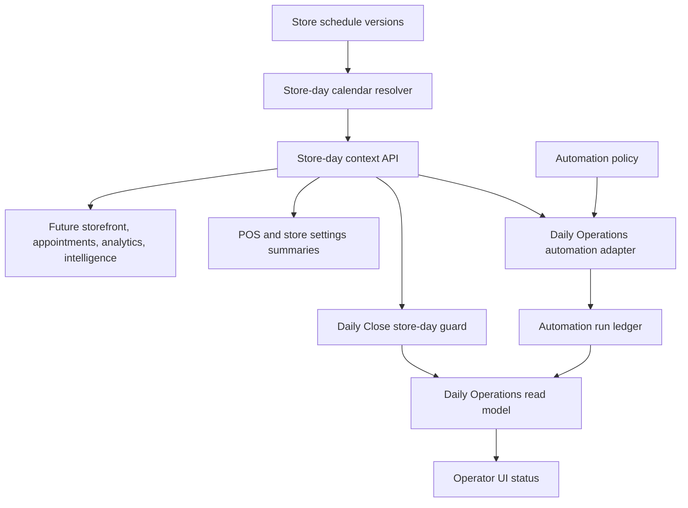
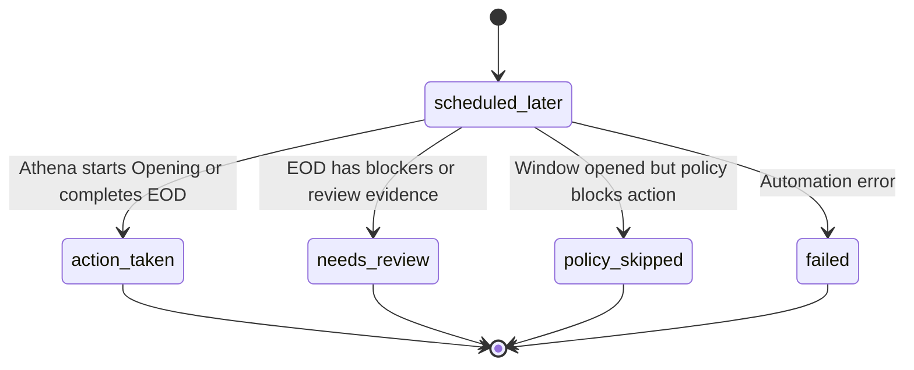

# feat: Add foundational store schedule domain

## Summary

Build a canonical, effective-dated store schedule domain that can serve every store-local time use case in Athena. Opening and EOD automation are the first consumers because they exposed the boundary problem, but the schedule model, resolver, and read APIs should be foundational: reusable by Daily Operations, POS, appointments, storefront display, analytics, intelligence context, support diagnostics, and future operational workflows.

---

## Problem Frame

Daily Operations currently shows routine pre-window EOD automation checks as if Athena made a meaningful EOD decision. That happens because `automationPolicy` owns local timing fields and `automationRun` skipped rows flow into the Daily Operations status panel. That symptom points at the broader missing primitive: Athena does not have one canonical domain for store-local business time. The approved long-term model is: store schedule owns business time, consumers derive their own workflow windows from it, automation policy owns automation judgment, automation run ledger owns audit, and Daily Operations owns operator-facing state.

---

## Requirements

- R1. Athena must have canonical store schedule truth for business time: timezone, weekly open/close windows, closed days, exceptions, and overnight windows.
- R2. Store schedule must provide reusable store-day context for consumers to derive their own timing windows, not rely on browser timezone or per-action static offsets.
- R3. Automation policy must retain permission and judgment controls: enabled/dry-run/disabled mode, opening blocker handling, EOD clean-day toggle, EOD low-risk thresholds, pause state, policy version, rollout notes, and automation-specific grace/offset settings.
- R4. Routine scheduler wakeups before the relevant store schedule window must not surface as “Athena checked EOD Review. No change was made.” in operator-facing Daily Operations or EOD surfaces.
- R5. `eod.prepare` and `eod.auto_complete` must stay separate audit concepts, with EOD completion still guarded by command-time Daily Close revalidation.
- R6. Migration must preserve current configured behavior without treating existing static timezone offsets as canonical store timezone.
- R7. Settings UI must make store hours understandable as store configuration, while keeping EOD thresholds and automation enablement under automation policy.
- R8. The implementation must preserve redaction and copy boundaries for financial/review evidence and operator-facing automation status.
- R9. Store schedule changes must be effective-dated so future edits do not reinterpret completed store days, Daily Close records, or automation ledger evidence.
- R10. Store schedule APIs and resolver outputs must be generic enough for future consumers. They should expose store-local operating date, schedule phase, open/closed state, effective schedule version, current/next windows, and derived UTC timestamps without encoding EOD, Opening, or automation-only vocabulary into the core schedule schema.

---

## Scope Boundaries

- Do not implement staff scheduling, payroll, appointment scheduling, or labor planning.
- Do not make public storefront opening-hours publishing, appointment availability, analytics reporting, or intelligence-context ingestion part of this first delivery, though the schedule model and read APIs must be reusable by those future consumers.
- Do not remove `automationPolicy` or `automationRun`; this plan narrows their responsibilities.
- Do not weaken Daily Close mutation guards or manager review requirements.
- Do not merge `eod.prepare` and `eod.auto_complete`.
- Do not put automation-specific terms, thresholds, grace periods, or EOD/Open Handoff assumptions into the canonical schedule table.

### Deferred to Follow-Up Work

- Public/customer-channel display of store hours: future product slice after foundational store schedule is stable.
- Appointment/service availability, analytics/intelligence context, and support reporting integrations: future consumers should use the foundational schedule APIs rather than reading automation policy.
- Recurring holiday rule generation: first delivery supports date-specific exceptions; generated holiday calendars can come later.
- Full effective-dated schedule history UI: this plan stores versioned schedule history and resolved schedule evidence, but a rich history browser can follow if needed.

---

## Context & Research

### Relevant Code and Patterns

- `packages/athena-webapp/convex/schemas/inventory/store.ts` defines the current store shape with loose `config`.
- `packages/athena-webapp/types.ts`, `packages/athena-webapp/convex/inventory/storeConfigV2.ts`, and `packages/athena-webapp/src/lib/storeConfig.ts` normalize typed store config, but no canonical schedule branch exists today.
- `packages/athena-webapp/convex/schemas/automation.ts`, `packages/athena-webapp/convex/automation/runLedger.ts`, and `packages/athena-webapp/convex/automation/automationFoundation.ts` define policy and ledger boundaries.
- `packages/athena-webapp/convex/operations/dailyOperationsAutomation.ts` derives operating dates from `operatingTimezoneOffsetMinutes`, `openingLocalStartMinutes`, and `eodLocalCompletionWindowMinutes`.
- `packages/athena-webapp/convex/operations/dailyClose.ts` owns command-time EOD completion revalidation and must remain the mutation safety boundary.
- `packages/athena-webapp/convex/operations/dailyOperations.ts` assembles Daily Operations automation statuses from ledger rows.
- `packages/athena-webapp/src/components/operations/DailyOperationsView.tsx`, `DailyCloseView.tsx`, and `DailyOpeningView.tsx` render automation status copy and suppress some stale terminal rows.
- `packages/athena-webapp/src/components/pos/settings/POSSettingsView.tsx` currently edits automation timings and hard-codes a default timezone offset.
- `packages/athena-webapp/src/components/store-configuration` and `packages/athena-webapp/src/components/store-configuration/hooks/useStoreConfigUpdate.ts` are the existing admin configuration surface and command-result save pattern.

### Institutional Learnings

- `docs/solutions/architecture/athena-automation-foundation-2026-06-08.md`: keep `automationPolicy`, `automationRun`, operational events, and normalized Daily Operations status as distinct boundaries.
- `docs/solutions/architecture/athena-store-day-auto-start-review-2026-06-11.md`: early cron checks before the configured local start time are scheduler noise and should not become skipped automation rows that obscure business decisions.
- `docs/solutions/architecture/athena-eod-review-automation-completion-2026-06-22.md`: `eod.auto_complete` is separate from `eod.prepare`, uses policy evidence, and must revalidate command-time Daily Close state.
- `docs/solutions/logic-errors/athena-daily-close-store-day-boundary-2026-05-07.md`: Daily Close snapshot and completion must use the same validated store-day range; local operating date is not UTC calendar date.
- `docs/solutions/logic-errors/athena-daily-operations-state-and-eod-review-2026-05-11.md`: Daily Operations state must come from backend store-day snapshots, not route context or stale records.
- `docs/solutions/logic-errors/athena-daily-operations-aggregate-read-model-2026-05-08.md`: Daily Operations is an aggregate/navigation surface, not the source workflow owner.
- `docs/product-copy-tone.md`: copy should be calm, clear, restrained, and operational; raw backend wording must be normalized before reaching operators.
- `docs/plans/2026-06-26-001-feat-eod-carry-forward-auto-complete-plan.md`: explicitly deferred scheduler-ledger cleanup for routine pre-window EOD checks, which this plan brings into scope.

### External References

- None. The work is grounded in Athena’s existing Convex, store configuration, Daily Operations, and automation patterns.

---

## Key Technical Decisions

- **Use a first-class, effective-dated store schedule table:** Store schedule is cross-domain business truth and should be indexed, validated, versioned, and reusable by automation, Daily Operations, POS, appointments, storefront display, analytics, intelligence context, support diagnostics, and future customer-channel behavior. A config blob would keep schedule parsing duplicated and make effective ownership unclear.
- **Keep the core schedule vocabulary consumer-neutral:** The canonical model stores business hours, closed days, exceptions, effective versions, and timezone. EOD completion windows, Opening Handoff timing, automation grace periods, and policy thresholds are consumer adaptations layered outside the schedule domain.
- **Keep automation policy as judgment, not time ownership:** Policy remains per action for enablement, thresholds, blocker handling, pause state, rollout notes, and automation-specific grace/offsets.
- **Use IANA timezone identifiers with native `Intl` resolution:** Static offsets drift and cannot model daylight-saving changes or store relocation cleanly. Existing offsets are migration hints only. Implement the resolver with native `Intl.DateTimeFormat.formatToParts` helpers, not a new timezone dependency, and reject invalid/ambiguous schedule commands before they become canonical.
- **Treat pre-window checks as schedule state, not operator-visible action:** Before the schedule-derived window, Daily Operations should expose quiet timing context such as “EOD completion check scheduled after 10:00 PM” only when useful, not a run-history row.
- **Retain command-time EOD revalidation:** Automation eligibility and completion mutation guards must both use schedule-derived timing, but `dailyClose.ts` remains the final safety gate.
- **Move schedule settings out of POS-only automation controls:** Store hours belong in store configuration. POS settings can keep automation toggles and thresholds, with timing summarized from store schedule.

---

## Open Questions

### Resolved During Planning

- **Config V2 or first-class table?** Use a first-class store schedule table for canonical business time because this is indexed cross-domain operational truth, not presentation config.
- **Should pre-window EOD scheduler checks write visible automation runs?** No. They may be omitted or recorded as support-only diagnostics, but they must not become primary Daily Operations status.
- **Should current EOD completion window become store close time?** No. Treat it as an automation timing threshold during migration; confirm or derive store close time separately.

### Deferred to Implementation

- Exact table/module names should follow nearby schema and inventory naming conventions during implementation.
- Whether pre-window diagnostics are omitted entirely or written to a support-only scheduled-run ledger depends on the cleanest fit once the schedule resolver is in place.

---

## High-Level Technical Design

> *This illustrates the intended approach and is directional guidance for review, not implementation specification. The implementing agent should treat it as context, not code to reproduce.*

### Operator Status Bucket Contract

| Bucket | Trigger | Daily Operations visibility | Workflow surface visibility | Copy pattern | CTA/source behavior | Redaction rule | Tests |
|--------|---------|-----------------------------|-----------------------------|--------------|---------------------|----------------|-------|
| `scheduled_later` | Schedule resolver says the relevant opening/EOD window has not arrived. | Usually hidden; may appear as quiet timing context only when it helps explain why no action is available. | Opening/EOD views can show compact timing context. | “EOD completion check scheduled after 10:00 PM.” | Link only to the owning workflow, not to raw run evidence. | No source IDs, raw ledger reasons, operator identifiers, or exception reason text. | Pre-window EOD does not render “No change was made”; timing context is optional and safe. |
| `action_taken` | Athena started Opening or completed eligible EOD. | Visible as the most recent meaningful automation action. | Visible with workflow-specific attribution. | “Athena completed EOD Review.” / “Athena started Opening Handoff.” | Link to completed/opened workflow or filtered evidence view when permission allows. | Summarize evidence; do not expose raw review details to broad readers. | Applied action renders attribution and source link. |
| `needs_review` | Window is open and blockers, unsupported review evidence, or manager review items prevent completion. | Visible because an operator or manager action is needed. | Visible on the owning workflow with review detail appropriate to permission. | “EOD Review needs manager review.” | CTA opens EOD Review or Opening Handoff. | Broad surfaces show counts/categories only; detailed evidence remains permissioned. | Blocker state appears only after the window opens. |
| `policy_skipped` | Window is open but policy mode, pause state, dry-run, disabled mode, or low-risk thresholds prevent automation. | Visible only when it changes what the operator should do; otherwise suppressed after workflow completion. | Visible on workflow admin/readout surfaces as policy context. | “EOD automation is paused. Review EOD manually.” | CTA opens the owning workflow or policy settings for allowed admins. | Do not leak policy rollout notes or raw threshold evidence to broad readers. | Dry-run/disabled rows suppress after lifecycle completion. |
| `failed` | Automation attempt errors after the relevant window opens. | Visible as an attention state. | Visible with safe diagnostic summary. | “Athena could not finish the automation. Open the workflow to review.” | CTA opens owning workflow; support-only diagnostics keep run IDs internal. | Broad surfaces omit stack traces, source IDs, operator IDs, and arbitrary exception reason text. | Failed automation renders safe copy and no raw backend text. |

---

## Implementation Units

- U1. **Create the canonical store schedule domain**

**Goal:** Add the durable, consumer-neutral store schedule model and resolver that owns timezone, weekly hours, closed days, date exceptions, effective versions, and overnight store-day derivation.

**Requirements:** R1, R6, R9, R10

**Dependencies:** None

**Files:**
- Create: `packages/athena-webapp/convex/schemas/inventory/storeSchedule.ts`
- Create: `packages/athena-webapp/convex/inventory/storeSchedule.ts`
- Create: `packages/athena-webapp/convex/lib/storeScheduleTime.ts`
- Modify: `packages/athena-webapp/convex/schema.ts`
- Test: `packages/athena-webapp/convex/inventory/storeSchedule.test.ts`
- Test: `packages/athena-webapp/convex/inventory/sessionQueryIndexes.test.ts`

**Approach:**
- Add store-scoped schedule versions with organization/store ownership, IANA timezone, weekly windows, closed-day markers, date exceptions, optional reason metadata, `effectiveFrom`, optional `effectiveTo`, `status`, `source`, and audit metadata for creation/update.
- Keep core field names generic: schedule windows, exceptions, closed state, operating date, phase, version, source, and effective range. Do not add EOD, Opening, automation, grace, threshold, blocker, or policy fields to the schedule schema.
- Schedule updates insert or supersede versions instead of mutating the version that was active for past store days.
- Add explicit indexes for active/effective resolution: store/status/effective date, organization/store/status, and source/status migration review. Do not rely on indexes as uniqueness constraints.
- Enforce command invariants: one active schedule per store/effective range, no overlapping effective ranges for active schedules, no overlapping weekly windows on the same local day, no overlapping exception windows for the same local date, and no canonical schedule without an IANA timezone.
- Implement a native `Intl` resolver helper that converts store-local wall-clock windows to UTC instants through `Intl.DateTimeFormat.formatToParts`; add no package dependency unless implementation proves native support insufficient.
- The resolver returns reusable store-day context: operating date, schedule phase, open/closed state, current/next schedule window, resolved schedule version ID, local labels, and derived UTC timestamps for a given store and timestamp.
- Expose reusable read helpers or queries for current store-day context and schedule summary so future consumers do not duplicate resolver logic or read raw schedule rows directly.
- Support overnight windows explicitly so early-morning activity can map to the prior trading day.
- Define a safe default/fallback path for stores without a configured schedule so rollout can be incremental without breaking existing operations.

**Execution note:** Implement resolver tests first. Most downstream risk comes from date-boundary errors.

**Patterns to follow:**
- `packages/athena-webapp/convex/schemas/inventory/store.ts`
- `packages/athena-webapp/convex/inventory/stores.ts`

**Test scenarios:**
- Happy path: weekday schedule resolves a store-local timestamp to the expected operating date, open window, and close window.
- Edge case: before-open timestamp returns a pre-open schedule phase plus the next applicable schedule window.
- Edge case: after-close timestamp returns a closed/after-hours schedule phase plus the current operating date and next applicable schedule window.
- Edge case: overnight schedule maps 1:00 AM to the prior operating date when the close window spans midnight.
- Edge case: DST spring-forward and fall-back days resolve deterministically or reject ambiguous local command input before save.
- Edge case: closed weekly day returns a closed schedule phase.
- Edge case: date-specific exception overrides the weekly schedule.
- Error path: invalid timezone or overlapping windows are rejected at the command boundary.
- Error path: overlapping effective ranges are rejected at the command boundary.
- Fallback: missing schedule returns a compatibility result that downstream consumers can handle without throwing raw errors.

**Verification:**
- Store schedule tests prove timezone, DST, exception, overnight, effective-date, overlap, reusable context output, and missing-schedule behavior before any automation code depends on it.

---

- U2. **Expose store-hours administration**

**Goal:** Give full admins a store-configuration surface for foundational store hours while leaving POS automation settings focused on enablement and policy thresholds.

**Requirements:** R1, R6, R7, R8, R10

**Dependencies:** U1

**Files:**
- Modify: `packages/athena-webapp/convex/inventory/storeSchedule.ts`
- Modify: `packages/athena-webapp/src/components/store-configuration/index.tsx`
- Create: `packages/athena-webapp/src/components/store-configuration/components/StoreHoursView.tsx`
- Create: `packages/athena-webapp/src/components/store-configuration/hooks/useStoreScheduleUpdate.ts`
- Modify: `packages/athena-webapp/src/components/pos/settings/POSSettingsView.tsx`
- Test: `packages/athena-webapp/src/components/store-configuration/components/StoreHoursView.test.tsx`
- Test: `packages/athena-webapp/src/components/store-configuration/hooks/useStoreScheduleUpdate.test.tsx`
- Test: `packages/athena-webapp/src/components/pos/settings/POSSettingsView.test.tsx`

**Approach:**
- Add a full-admin store-hours editor under store configuration with timezone, weekly windows, closed days, and date exceptions. Do not save schedule data through `patchConfigV2Command` or write schedule into `store.config`.
- Add `inventory.storeSchedule.getStoreScheduleForAdmin`, `inventory.storeSchedule.getStoreScheduleSummary`, `inventory.storeSchedule.getStoreDayContext`, and `inventory.storeSchedule.upsertStoreScheduleCommand` or equivalent names following Convex API conventions. The command returns the existing command-result shape used by store configuration: success boolean, normalized message, field errors, and the saved schedule/version summary.
- Create `useStoreScheduleUpdate` as the schedule-specific save hook. It may reuse command-result normalization helpers, but it must call the schedule command directly rather than generalizing `useStoreConfigUpdate` in a way that hides persistence ownership.
- Guard schedule mutation with the same full-admin boundary expected for store configuration writes; read-only summary can be broader where existing store configuration allows it.
- Keep controls dense and operational: weekday rows, open/closed toggles, open/close selectors, exception list, and inline validation.
- Settings IA: add a Store Hours section/tab within store configuration. The first visible row is a summary of timezone, today’s schedule, next close, and whether hours are admin-confirmed or seeded/candidate. The editor groups timezone, weekly hours, exceptions, and automation timing preview as separate sections in one page.
- Control states: support save, cancel, dirty-state warning, saving, saved, failed-save, missing schedule, migrated candidate schedule, and read-only states. Candidate schedules must be visibly marked as needing admin confirmation before becoming canonical.
- POS settings readout: replace editable timing controls with a compact “Timing comes from Store Hours” summary that shows the relevant automation timing derived from Store Hours and links full admins to Store Hours.
- Future-consumer readout: keep the Store Hours summary framed as store business hours, not as “automation hours,” so the same page can later support storefront, appointment, analytics, and intelligence consumers.
- Normalize expected command failures through existing store-configuration command-result patterns.
- Update POS settings to remove ownership of store-local start/completion times and instead summarize derived timing from store hours.
- Keep EOD completion mode, clean-day toggle, and thresholds in POS settings if that remains the current admin home for automation policy.
- Responsive/accessibility expectations: weekday rows collapse into one day per row on narrow screens; touch targets remain at least the project’s standard control height; timezone, date, and time controls have visible labels; inline validation is associated with fields and announced to assistive technology; keyboard users can add/remove exceptions and move through time selectors without pointer-only controls.
- Permission matrix:

| Actor | Store Hours route | Store Hours edit | POS settings timing | Notes |
|-------|-------------------|------------------|---------------------|-------|
| Full admin | View full schedule and candidate status | Can save, confirm candidate, and supersede active schedules | Sees derived timing summary plus link | Mutation commands enforce full-admin server-side. |
| Non-full admin | View read-only schedule summary if store configuration is visible | No editable controls | Sees derived timing summary | No hidden mutation path. |
| POS-only/operator | No store-configuration editor | No edit | Sees only workflow-relevant timing context | Avoids exposing admin-only policy details. |
| Unauthenticated/reconnect | No route data until auth/session returns | No edit | Existing loading/reconnect state | No partial stale schedule edits. |
| Support/internal diagnostics | Permissioned support view only | No direct edit unless also full admin | Can inspect support-only metadata | Source IDs and migration notes stay out of broad UI. |

**Copy requirements:**
- Invalid timezone: “Choose a valid store timezone.”
- Overlapping hours: “These hours overlap. Adjust one time range before saving.”
- Closed day: “Closed for store operations.”
- Unsaved changes: “You have unsaved store hours.”
- Failed save: “Store hours were not saved. Review the highlighted fields.”
- Successful save: “Store hours saved.”
- Migrated candidate: “Review these suggested hours before Athena uses them as the store schedule.”
- Automation timing summary: “Athena uses Store Hours to time Opening and EOD automation.”
- Foundational schedule summary: “Store Hours define this store’s local business day.”

**Patterns to follow:**
- `packages/athena-webapp/src/components/store-configuration/components/MaintenanceView.tsx`
- `packages/athena-webapp/src/components/store-configuration/components/FulfillmentView.tsx`
- `packages/athena-webapp/src/components/store-configuration/hooks/useStoreConfigUpdate.ts`
- `docs/product-copy-tone.md`

**Test scenarios:**
- Happy path: full admin loads existing store schedule and sees timezone plus weekly hours.
- Happy path: full admin saves updated weekday hours and receives normalized success copy.
- Edge case: closed day disables open/close inputs and persists as closed.
- Edge case: exception date overrides weekly hours in the preview/readout.
- Error path: invalid overlapping windows render inline command-safe copy and do not toast raw backend text.
- Permission path: non-full-admin users see only the allowed read-only timing summary and no editable store-hours controls.
- Accessibility path: inline validation is field-associated and keyboard users can save, cancel, and manage exceptions.
- Responsive path: weekly hours and exceptions remain readable on mobile without overlapping text or pointer-only controls.
- Integration: POS settings no longer sends hard-coded timezone offsets when saving automation policy.

**Verification:**
- Store configuration and POS settings tests prove schedule ownership moved out of POS automation timing controls without losing automation threshold controls.

---

- U3. **Adopt store schedule in Daily Operations automation**

**Goal:** Refactor Daily Operations automation as the first consumer of the foundational schedule domain, so opening auto-start, EOD prepare, and EOD auto-complete use store-day context while preserving policy-ledger boundaries.

**Requirements:** R2, R3, R4, R5, R6

**Dependencies:** U1

**Files:**
- Modify: `packages/athena-webapp/convex/operations/dailyOperationsAutomation.ts`
- Modify: `packages/athena-webapp/convex/automation/runLedger.ts`
- Modify: `packages/athena-webapp/convex/schemas/automation.ts`
- Modify: `packages/athena-webapp/convex/operations/dailyClose.ts`
- Test: `packages/athena-webapp/convex/operations/dailyOperationsAutomation.test.ts`
- Test: `packages/athena-webapp/convex/operations/dailyClose.test.ts`
- Test: `packages/athena-webapp/convex/automation/automationFoundation.test.ts`

**Approach:**
- Introduce automation adapter helpers that convert generic store-day context into workflow-specific opening and EOD evaluation windows.
- Treat legacy `openingLocalStartMinutes`, `eodLocalCompletionWindowMinutes`, and `operatingTimezoneOffsetMinutes` as compatibility inputs only until migration is complete.
- Keep policy config functions returning mode, thresholds, blocker handling, pause state, and version metadata.
- For `opening.auto_start`, run only when store-day context plus automation policy says the opening window is relevant.
- For `eod.auto_complete`, evaluate only after the store-day close plus configured automation grace/offset.
- Mirror schedule-derived timing checks in the Daily Close automation completion command guard so eligibility and mutation-time safety agree.
- Keep `eod.prepare` distinct and avoid turning prepare status into completion eligibility.
- When automation evaluates against a canonical schedule, write the resolved schedule version ID and derived evaluation/open/close timestamps into ledger evidence. Compatibility-path runs should be marked as compatibility evidence, not canonical schedule evidence.
- Persist `storeScheduleId`/version and derived open/close/evaluation timestamps in automation evidence and Daily Close completion evidence when those records are created. Later schedule edits must not reinterpret completed closes or ledger rows.

**Execution note:** Update eligibility and command guard tests together. A change to only one side leaves the automation boundary inconsistent.

**Patterns to follow:**
- `packages/athena-webapp/convex/operations/dailyOperationsAutomation.ts`
- `packages/athena-webapp/convex/operations/dailyClose.ts`
- `docs/solutions/architecture/athena-eod-review-automation-completion-2026-06-22.md`

**Test scenarios:**
- Happy path: opening auto-start runs at the schedule-derived opening window for the correct operating date.
- Happy path: EOD auto-complete evaluates after schedule-derived close plus grace and completes a clean eligible day.
- Edge case: before the EOD window, automation does not create an operator-visible skipped run.
- Edge case: UTC date crossing still maps to the correct store operating date.
- Edge case: closed exception day suppresses opening and EOD automation unless an explicit compatibility fallback applies.
- Edge case: schedule edit after a completed day does not reinterpret historical automation evidence or Daily Close completion evidence.
- Error path: missing or invalid schedule fails closed with safe diagnostic behavior and no raw operator-facing error.
- Integration: Daily Close command-time revalidation rejects completion if the schedule-derived window is not satisfied.
- Regression: `eod.prepare` remains preparation-only and does not complete EOD.

**Verification:**
- Automation and Daily Close tests prove schedule-derived windows, compatibility fallback, and mutation guard parity.

---

- U4. **Clean up automation read model and operator status**

**Goal:** Stop scheduler noise from appearing as primary Daily Operations status and introduce clear status buckets for this automation consumer.

**Requirements:** R4, R5, R8

**Dependencies:** U1, U3

**Files:**
- Modify: `packages/athena-webapp/convex/operations/dailyOperations.ts`
- Modify: `packages/athena-webapp/convex/operations/dailyClose.ts`
- Modify: `packages/athena-webapp/src/components/operations/DailyOperationsView.tsx`
- Modify: `packages/athena-webapp/src/components/operations/DailyCloseView.tsx`
- Modify: `packages/athena-webapp/src/components/operations/DailyOpeningView.tsx`
- Test: `packages/athena-webapp/convex/operations/dailyOperations.test.ts`
- Test: `packages/athena-webapp/convex/operations/dailyClose.test.ts`
- Test: `packages/athena-webapp/src/components/operations/DailyOperationsView.test.tsx`
- Test: `packages/athena-webapp/src/components/operations/DailyCloseView.test.tsx`
- Test: `packages/athena-webapp/src/components/operations/DailyOpeningView.test.tsx`

**Approach:**
- Add read-model semantics for `scheduled_later`, `action_taken`, `needs_review`, `policy_skipped`, and `failed`.
- Keep `scheduled_later` as quiet timing context, not an automation run-history card.
- Show `action_taken` when Athena starts Opening or completes EOD.
- Show `needs_review` or `policy_skipped` only after the relevant schedule window opens and the outcome changes what the operator should do.
- Ensure completed/opened lifecycle state still suppresses stale skipped, dry-run, disabled, and no-op rows.
- Normalize copy to product tone: direct state plus next action, no raw backend reason strings or generic “No change was made” fallback for scheduled-later cases.
- Apply the Operator Status Bucket Contract in this plan as the source of truth for raw ledger-to-bucket mapping, precedence, copy, CTA behavior, and redaction. Precedence is `failed`, `action_taken`, `needs_review`, `policy_skipped`, then `scheduled_later`, with lifecycle-completed suppression applied before lower-priority rows are exposed.
- Keep support-only diagnostics, source IDs, schedule exception reason text, migration notes, and raw operator/user identifiers out of Daily Operations, Daily Close, and Opening broad-reader cards.

**Patterns to follow:**
- `packages/athena-webapp/src/components/operations/DailyOperationsView.tsx`
- `packages/athena-webapp/src/components/operations/DailyCloseView.tsx`
- `docs/product-copy-tone.md`

**Test scenarios:**
- Happy path: pre-window EOD auto-complete appears, if at all, as quiet “scheduled after” context.
- Regression: “Athena checked EOD Review. No change was made.” is not rendered for pre-window EOD schedule state.
- Happy path: applied EOD auto-complete renders Athena completion attribution and source link.
- Review path: after the EOD window, blockers or unsupported review evidence produce manager-review copy with a workflow link.
- Failure path: failed automation renders safe “open workflow to review” copy.
- Stale-state path: closed EOD and started Opening suppress old skipped/dry-run/no-op rows.
- Redaction path: raw decision evidence and source IDs stay out of broad operator copy.
- Redaction path: support-only schedule diagnostics, migration notes, operator IDs, and arbitrary exception reason text stay out of broad operator copy.

**Verification:**
- Read-model and component tests prove operator-facing status is derived from schedule/action state rather than raw ledger outcome fallback.

---

- U5. **Migrate existing automation timing safely**

**Goal:** Seed or infer store schedules from current automation policy without silently changing store behavior or treating static offsets as canonical timezone.

**Requirements:** R2, R3, R6, R7

**Dependencies:** U1, U2, U3

**Files:**
- Create: `packages/athena-webapp/convex/migrations/backfillStoreSchedules.ts`
- Modify: `packages/athena-webapp/convex/operations/dailyOperationsAutomation.ts`
- Modify: `packages/athena-webapp/convex/automation/runLedger.ts`
- Test: `packages/athena-webapp/convex/operations/dailyOperationsAutomation.test.ts`
- Test: `packages/athena-webapp/convex/inventory/storeSchedule.test.ts`

**Approach:**
- Backfill candidate store schedules using current opening local start as a default open time when available.
- Preserve current EOD local completion window as an automation compatibility/grace setting, not as store close time unless an admin confirms or a deterministic default is explicitly chosen.
- Use existing timezone offsets only as migration hints. Require a deterministic IANA source or admin confirmation before a seeded schedule becomes canonical. If no trustworthy IANA zone exists, continue through legacy compatibility timing fields instead of creating a misleading canonical timezone.
- Make the migration idempotent and bounded: support dry-run/report mode, page/batch limits, repeatable progress markers, and “insert only if no admin-confirmed or effective schedule exists” behavior.
- Maintain compatibility reads for legacy policy timing fields until every store has either an admin-confirmed schedule or a consciously accepted candidate schedule.
- Add rollout notes or metadata that identify `seeded_from_policy`, `admin_confirmed`, and compatibility-only stores. Keep raw source IDs, operator/user identifiers, and arbitrary exception reason text in internal audit only.
- Avoid full-table unbounded production mutation patterns; each batch should be safe to retry and safe to stop.

**Patterns to follow:**
- `packages/athena-webapp/convex/migrations/*`
- `packages/athena-webapp/convex/automation/runLedger.ts`
- `packages/athena-webapp/convex/inventory/stores.ts`

**Test scenarios:**
- Happy path: store with current opening policy receives a candidate schedule preserving the existing opening time.
- Edge case: store with EOD completion window keeps that value as automation timing metadata rather than schedule close time.
- Edge case: store with no timing policy receives no misleading confirmed hours and continues through compatibility fallback.
- Edge case: store with existing admin-confirmed/effective schedule is skipped by migration.
- Error path: invalid persisted offset does not become canonical timezone.
- Dry-run path: migration reports candidate changes without writing them.
- Integration: automation resolves timing from active schedule when present and from compatibility policy only when schedule is absent.

**Verification:**
- Migration tests prove current stores can roll forward without unexpected automation timing changes.

---

- U6. **Refresh generated artifacts and validation coverage**

**Goal:** Keep generated Convex refs, Graphify output, plan-driven validation, and solution documentation aligned after the implementation.

**Requirements:** R1, R2, R4, R8

**Dependencies:** U1, U2, U3, U4, U5

**Files:**
- Modify: `packages/athena-webapp/convex/_generated/api.d.ts`
- Modify: `packages/athena-webapp/convex/_generated/server.d.ts`
- Modify: `packages/athena-webapp/docs/agent/validation-map.json`
- Modify: `scripts/harness-app-registry.ts`
- Create: `docs/solutions/architecture/athena-store-schedule-foundation-2026-06-27.md`
- Modify: `graphify-out/*`

**Approach:**
- Refresh Convex generated artifacts through the repo-documented `bunx convex dev --once` path when deployment credentials are available.
- Update harness registry metadata if new store schedule surfaces need validation-map coverage.
- Rebuild Graphify after code changes.
- Add a solution note capturing the store schedule / automation policy / ledger / Daily Operations boundary so future automation work does not regress to policy-owned business time.

**Patterns to follow:**
- `packages/athena-webapp/docs/agent/testing.md`
- `docs/solutions/architecture/athena-automation-foundation-2026-06-08.md`
- `docs/solutions/architecture/athena-eod-review-automation-completion-2026-06-22.md`

**Test scenarios:**
- Test expectation: none -- this unit is artifact and documentation alignment. Behavior is covered by U1-U5.

**Verification:**
- Generated refs expose new schedule functions where needed.
- Harness coverage includes new touched surfaces.
- Graphify and solution docs reflect the final architecture.

---

## System-Wide Impact

- **Interaction graph:** Store schedule becomes an upstream dependency for Daily Operations automation, Daily Operations snapshots, Daily Close completion safety, POS settings summaries, and store configuration.
- **Error propagation:** Schedule save failures should use command-result semantics and safe inline copy; automation schedule-resolution failures should fail closed or produce support diagnostics without raw operator-facing errors.
- **State lifecycle risks:** Schedule updates can change derived operating dates and automation windows. The implementation should avoid retroactively changing completed Daily Close records and should preserve historical automation run evidence.
- **Schedule versioning:** Completed closes, automation runs, and support diagnostics should reference the resolved schedule version and derived timestamps used at decision time, not recalculate historical meaning from the current active schedule.
- **API surface parity:** Store schedule read/updates need Convex API refs and full-admin access parity with existing store configuration.
- **Integration coverage:** Unit tests alone are not enough; cross-layer tests must prove schedule -> automation -> ledger/read-model -> UI copy behavior for pre-window and after-window cases.
- **Unchanged invariants:** `automationPolicy` remains the action policy layer, `automationRun` remains the audit ledger, `dailyClose.ts` remains the mutation safety gate, and Daily Operations remains an aggregate/read-model surface.

---

## Risks & Dependencies

| Risk | Mitigation |
|------|------------|
| Store schedule changes alter automation timing or future consumers unexpectedly | Use effective-dated schedule versions, keep the core schema consumer-neutral, seed schedules conservatively, preserve legacy compatibility fields during rollout, and add tests for existing configured timing. |
| First-class table adds migration/generated-artifact complexity | Include a dedicated migration/artifact unit and refresh Convex generated refs through the documented path. |
| Pre-window diagnostics disappear from audit needs | Keep support-only diagnostics or scheduled-run evidence if needed, but keep it out of operator-facing Daily Operations status. |
| Timezone handling regresses around UTC boundaries | Use IANA timezone IDs with native `Intl` helpers and resolver tests for DST transitions, UTC crossing, overnight windows, and exceptions. |
| UI becomes too broad by mixing store hours and automation policy | Put foundational store hours in store configuration and keep POS automation controls focused on enablement/thresholds. |
| Financial/review decision evidence or schedule diagnostics leak through richer status | Preserve redaction boundaries and test broad-reader copy for financial evidence, support diagnostics, migration notes, operator IDs, and exception reason text. |

---

## Documentation / Operational Notes

- Add a solution note after implementation to document the boundary: store schedule owns business time; consumers adapt schedule context to their workflows; automation policy owns judgment; ledger owns audit; Daily Operations owns operator state.
- During rollout, communicate that existing EOD completion windows are automation timing controls and not necessarily store close hours.
- During migration, candidate schedules must be labeled as candidate/seeded until a deterministic IANA timezone and admin confirmation or acceptance make them canonical.
- Keep `bun run graphify:rebuild` in the delivery validation because code files and architecture surfaces will change.
- Refresh Convex generated artifacts with `bunx convex dev --once` from `packages/athena-webapp` when new public/internal functions are added.

---

## Sources & References

- Related requirements: `docs/brainstorms/2026-05-07-daily-operations-lifecycle-requirements.md`
- Related plan: `docs/plans/2026-05-07-001-feat-daily-operations-lifecycle-plan.md`
- Related plan: `docs/plans/2026-06-08-001-feat-daily-ops-automation-plan.md`
- Related plan: `docs/plans/2026-06-11-001-feat-pos-store-day-auto-start-settings-plan.md`
- Related plan: `docs/plans/2026-06-22-004-feat-eod-review-automation-plan.md`
- Related plan: `docs/plans/2026-06-26-001-feat-eod-carry-forward-auto-complete-plan.md`
- Related code: `packages/athena-webapp/convex/schemas/automation.ts`
- Related code: `packages/athena-webapp/convex/operations/dailyOperationsAutomation.ts`
- Related code: `packages/athena-webapp/convex/operations/dailyOperations.ts`
- Related code: `packages/athena-webapp/src/components/operations/DailyOperationsView.tsx`
- Product copy: `docs/product-copy-tone.md`
