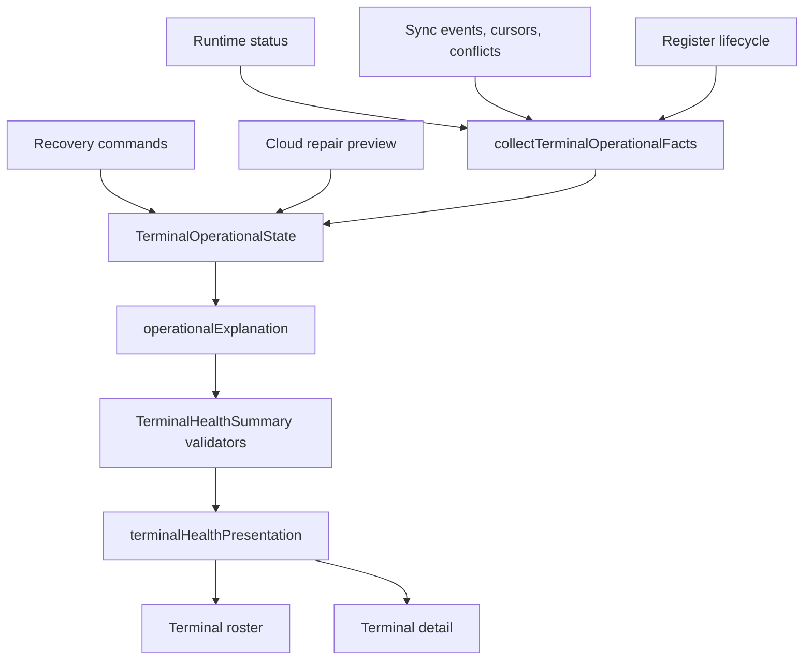
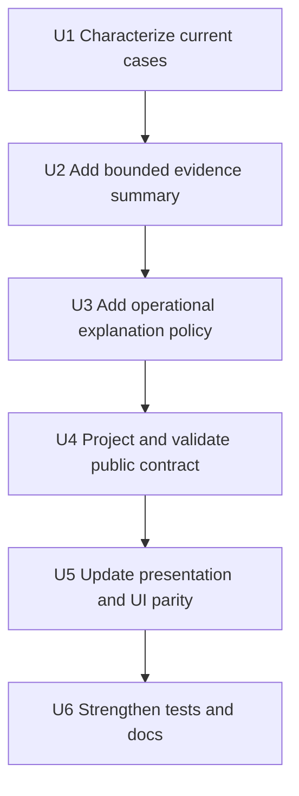

# feat: Add Terminal Health Reconciliation Lanes

## Summary

Add a reusable terminal-health explanation model that reconciles sale readiness, support recovery, sync review backlog, and next action lanes from `TerminalOperationalState`. The goal is to make any terminal show why it is not fully healthy, what workflow owns the next step, and whether sales can continue, without encoding a one-off incident exception.

---

## Problem Frame

Terminal Health can currently show a fresh online runtime and sale-ready evidence while still marking the terminal as needing attention because sync review or cloud conflict evidence remains unresolved. The current UI surfaces those facts across attention reasons, support recovery, and conflict lists, but it does not provide one reusable explanation of the relationship between those facts.

That makes large backlogs hard to interpret: support can see that something needs review, but not quickly distinguish terminal-local repair, manual business review, safe cloud repair, diagnostic-only evidence, and sale impact.

---

## Requirements

- R1. Add a server-derived terminal health explanation that names the current blocker lane, next step, sale impact, support action, and bounded evidence counts.
- R2. Keep `terminalHealth`, `salesReadiness`, and `supportRecovery` distinct. A terminal may be sale-ready and still need review work.
- R3. Generalize beyond the motivating incident. The model must work for any terminal with runtime, sync, register, command, cloud-repair, or manual-review evidence.
- R4. Preserve the existing safety boundary: sale, payment, inventory, closeout, variance, customer, staff proof, and unknown business facts are never auto-repaired.
- R5. Keep safe cloud repair narrow to allow-listed stale duplicate register/drawer-open conflicts that are projection-safe and scoped by precondition hash.
- R6. Keep review ownership explicit: Cash Controls, Operations/Open Work, terminal-local command, safe cloud repair, wait-for-check-in, or diagnostic-only.
- R7. Use bounded summaries and paginated or capped drill-ins. Do not return unbounded conflict or local-review lists from terminal-health queries.
- R8. Preserve roster/detail parity and recovery-preview consistency. List rows and detail pages must expose the same `operationalExplanation`; `previewTerminalRecovery` keeps its existing return shape and must remain behaviorally consistent through its `recoveryPreview` readiness/actions.
- R9. Keep public Convex validators, frontend types, and UI presentation in lockstep for every returned field.
- R10. Use calm operational copy and normalize backend conflict wording before it reaches operators.
- R11. Add regression coverage for online/sale-ready terminals with unresolved review backlog, mixed manual-review plus safe-repair evidence, terminal-local repair, stale runtime, and healthy/no-action cases.
- R12. Preserve the existing public access boundary for terminal health: staff/user role authorization remains server-derived, store/terminal scoped, and never satisfied by terminal sync-secret proof.
- R13. Keep `operationalExplanation` additive. Existing fields and semantics for `health`, `runtimeAgeMs`, `runtimeStatus`, `attentionReasons`, `recoveryPreview`, `registerSessionLink`, and `syncEvidence` must remain present.

---

## Scope Boundaries

- This plan does not implement terminal-specific cleanup, manual data mutation, or a one-off incident recovery script.
- This plan does not auto-resolve business conflicts, approve manager review, reject sync items, or change Cash Controls/Operations decision authority.
- This plan does not expand safe cloud repair beyond the existing duplicate register/drawer-open allow list.
- This plan does not redesign runtime heartbeat cadence, Remote Assist, app update commands, terminal command execution, or local IndexedDB repair behavior.
- This plan does not persist a new terminal operational-state table. The explanation is computed from current read facts.
- This plan does not require browser validation from Codex; the user owns browser validation for this thread.
- This plan does not create a new credential path. Terminal sync secrets remain limited to terminal check-in/command claim/ack channels and cannot authorize staff/support health reads.

### Deferred to Follow-Up Work

- Fleet-wide batch remediation or scheduling once the explanation lanes are stable.
- Persisted aggregate counters for exact all-time conflict counts if bounded read-time summaries are not enough.
- New Cash Controls or Operations review workflows beyond linking to the existing owner.
- Automatic self-heal decisions based on the new explanation model.

---

## Context & Research

### Relevant Code and Patterns

- `packages/athena-webapp/convex/pos/application/terminalOperationalState/types.ts` defines `TerminalOperationalState`, `TerminalSalesReadiness`, `TerminalSupportRecovery`, attention reasons, recovery preview, and diagnostic evidence.
- `packages/athena-webapp/convex/pos/application/terminalOperationalState/policy.ts` is the pure policy boundary that derives attention reasons, support recovery, sales readiness, health, terminal actions, and manual review.
- `packages/athena-webapp/convex/pos/application/terminalOperationalState/collectTerminalOperationalFacts.ts` gathers query-safe runtime, sync, and register facts.
- `packages/athena-webapp/convex/pos/application/queries/terminals.ts` projects terminal health summaries, recovery preview, app update evidence, command status, and cloud repair preview.
- `packages/athena-webapp/convex/pos/infrastructure/repositories/terminalRepository.ts` reads latest runtime status, terminal sync evidence, cursors, unresolved conflicts, and register-session evidence.
- `packages/athena-webapp/convex/pos/public/terminals.ts` is the public Convex contract and validator boundary for terminal health.
- `packages/athena-webapp/convex/pos/application/terminalRecovery/cloudRepairPolicy.ts` contains the safe cloud repair allow list and business-fact exclusion policy.
- `packages/athena-webapp/src/components/pos/terminals/terminalHealthPresentation.ts` turns server evidence into roster/detail/recovery copy and actions.
- `packages/athena-webapp/src/components/pos/terminals/POSTerminalHealthView.tsx` consumes roster health summaries.
- `packages/athena-webapp/src/components/pos/terminals/POSTerminalDetailView.tsx` consumes detail health, support recovery, sync evidence, and conflict/review evidence.

### Institutional Learnings

- `docs/solutions/architecture/athena-terminal-operational-state-aggregate-2026-06-27.md` establishes `TerminalOperationalState` as the computed, query-safe, non-actuating read boundary.
- `docs/solutions/architecture/athena-pos-terminal-recovery-readiness-boundary-2026-06-14.md` keeps sale readiness, support recovery, and diagnostics separate.
- `docs/solutions/architecture/athena-pos-remote-terminal-health-recovery-2026-06-11.md` keeps terminal recovery as orchestration verified by fresh runtime evidence, not force-clear.
- `docs/solutions/logic-errors/athena-pos-sync-review-workspace-boundaries-2026-06-19.md` states that sync review is workflow-owned state, not a generic terminal count.
- `docs/solutions/logic-errors/athena-cash-controls-sale-sync-review-evidence-2026-06-18.md` keeps sale/payment review evidence with manager workflows.
- `docs/solutions/logic-errors/athena-pos-drawer-sync-contract-2026-06-27.md` requires drawer authority to match the active drawer identity before it blocks sales.
- `docs/solutions/logic-errors/athena-pos-register-sync-repair-and-runtime-reconciliation-2026-06-26.md` keeps runtime reconciliation in heartbeat/command-gateway paths, not the sale hot path.
- `docs/product-copy-tone.md` requires calm, operational copy that leads with state and names the next action.

### External References

External research was skipped. The work is specific to Athena's Convex POS runtime, terminal health, local-first sync, and existing recovery policy.

---

## Key Technical Decisions

- **Extend `TerminalOperationalState`, not the UI alone:** The explanation belongs at the server read boundary so roster, detail, recovery preview, tests, and future support tooling share one classification.
- **Add `operationalExplanation` as a projection-safe model:** The model should include lane/status, headline, detail, next step, blocking domain, sale impact, support action, severity, and capped evidence references.
- **Keep the roster review-first but sale-impact explicit:** If `supportRecovery` needs manual review, roster should foreground review and also show a compact sale-impact signal. For `sale_ready_with_review_backlog`, the row must communicate both "Review needed" and "Sales can continue" or equivalent calm operational copy.
- **Manual review outranks terminal action and safe repair:** Mixed states must not encourage repair before business review. Safe repair may appear as a secondary action only when scoped to safe ids that cannot mutate review facts.
- **Split generic local review from business manual review:** Current policy treats `local_review` as both retryable terminal action and manual review. This work must resolve that contradiction by making generic local review a terminal-local settlement/diagnostic lane, while cloud held/rejected/business conflicts remain manual review.
- **Unsafe cloud repair skips remain visible:** Skipped conflicts with unsafe or business facts should produce manual-review evidence. Non-actionable stale evidence may also appear as diagnostic evidence.
- **Bounded aggregation over full lists:** Health summaries should return capped examples, grouped counts from bounded scans, `hasMore` markers, and clear sampling language. Exact all-time counts can be deferred to persisted counters if needed.
- **App update stays separate:** App update action/status can remain available outside `operationalExplanation.lane`, but it must not redefine terminal health, sale readiness, or support recovery.
- **Public validator parity is part of the feature:** New fields must land with Convex validators, frontend types, and tests in the same implementation slice.
- **Open Work ownership is best-effort until indexed:** Inventory review can route to Operations/Open Work only when an open work target is resolved within bounded indexed reads. Without an indexed ownership lookup, summaries must expose `targetResolutionIncomplete` rather than claiming definitive Operations ownership.

---

## Open Questions

### Resolved During Planning

- **Should sale-ready plus review backlog show as healthy?** No. It should remain `needs_attention`, but the explanation should distinguish review backlog from sale blocking.
- **Should roster say "Needs review" or "Sale ready, review needed"?** Use a review-first headline on the roster, but include a compact sale-impact signal on the row. For `sale_ready_with_review_backlog`, list and detail must both make clear that sales can continue.
- **Should safe repair be visible when manual review also exists?** Manual review is primary. Safe repair may be secondary only when scoped to safe ids and impossible to affect business facts.
- **Should local runtime review route to Cash Controls?** No. Only explicit action targets should route to Cash Controls or Operations. Generic local review is terminal-local retry/settlement or diagnostic guidance, and U3 must remove or separate the current `local_review` manual-review classification.
- **Where do unmapped cloud conflicts route?** Inventory review with a resolved open work target routes to Operations/Open Work. Mapped register-session conflicts route to Cash Controls. Unmapped cloud conflicts route to manual review with a generic open-work/manual-review next step, not Cash Controls.

### Deferred to Implementation

- Internal helper names may change, but the public enum literals in the Operational Explanation Contract are fixed for this feature.
- The exact conflict summary scan limit may be tuned during implementation, provided it is a named cap, uses index-scoped `take(cap + 1)` or pagination-style bounded reads, and exposes `hasMore` or equivalent sampling semantics.
- Whether a separate paginated conflict drill-in query is needed in the first slice depends on whether existing capped UI plus new summary lanes provides enough operator context.

---

## High-Level Technical Design

> *This illustrates the intended approach and is directional guidance for review, not implementation specification. The implementing agent should treat it as context, not code to reproduce.*

### Lane Matrix

| Lane | Meaning | Primary owner | Sale impact posture |
| --- | --- | --- | --- |
| `healthy` | No current support or review blocker | None | Derived from sales readiness |
| `sale_ready_with_review_backlog` | Support review needed; cashier can continue | Existing owner resolved from evidence | Can transact now |
| `needs_manual_review` | Business/review facts require a human workflow | Cash Controls or Operations/Open Work | Depends on sales readiness |
| `needs_terminal_action` | Matching terminal must repair local state or retry sync | Terminal command/runtime | Usually blocked or degraded |
| `needs_cloud_repair` | Existing safe cloud repair policy can resolve stale duplicate lifecycle evidence | Support cloud repair | Usually no sale impact unless paired with runtime issue |
| `sync_failed` | Local sync failed or unavailable | Terminal command/runtime | Degraded; may require retry |
| `stale_runtime` | Runtime evidence is stale or absent | Diagnostic / wait for check-in | Unknown, stale, or offline |

### Ownership Matrix

| Evidence | Next lane | Notes |
| --- | --- | --- |
| Inventory review with open work target | Operations/Open Work | Do not route to Cash Controls. |
| Mapped register-session review | Cash Controls | Use existing action target and resolver policy. |
| Generic local review count | Terminal sync retry or diagnostic | Only when the matching terminal owns settlement evidence; do not invent a cloud manager action. |
| Payment, sale, closeout, variance, customer facts | Manual review | Never auto-repair. |
| Stale duplicate register/drawer-open with safe projection | Cloud repair | Existing precondition hash still governs mutation. |
| Local store unavailable, seed missing, terminal integrity, drawer authority | Terminal command | Requires matching terminal and fresh verification. |
| App update state | Existing app update presentation/action | Separate from `operationalExplanation.lane` and health/recovery. |

---

## Operational Explanation Contract

`operationalExplanation` is additive on `TerminalHealthSummary` for `listTerminalHealthSummaries`, `getTerminalHealthSummary`, `listTerminalHealth`, and `getTerminalHealthDetail`. It does not replace `attentionReasons`, `recoveryPreview`, or existing sync evidence fields. `previewTerminalRecovery` keeps returning only `TerminalRecoveryPreview` in this plan; it should not add `operationalExplanation`. Consistency with list/detail is proven by asserting that `previewTerminalRecovery.recoveryPreview` matches the same fixture's list/detail `recoveryPreview`, while list/detail carry the explanation.

Existing public fields remain present with their current types and meanings:

| Existing field | Compatibility rule |
| --- | --- |
| `health` | Still reports terminal health state and remains distinct from sale impact. |
| `runtimeAgeMs` | Still reports latest runtime age or `null`. |
| `runtimeStatus` | Still reports the sanitized runtime snapshot or `null`. |
| `attentionReasons` | Still reports existing attention reasons; explanation is an additive summary. |
| `recoveryPreview` | Still reports support recovery state/actions; explanation must agree with it. |
| `registerSessionLink` | Still reports active/open register-session link or `null`. |
| `syncEvidence` | Still reports bounded sync evidence; explanation may summarize it. |

### Public Shape

All fields below are public-contract fields and must be represented in Convex validators and frontend types. Required fields must always be present; optional fields must be omitted rather than returned as `undefined`; empty arrays are valid where listed.

| Field | Required | Values / shape | Default for partial data |
| --- | --- | --- | --- |
| `lane` | Yes | `"healthy"`, `"sale_ready_with_review_backlog"`, `"needs_manual_review"`, `"needs_terminal_action"`, `"needs_cloud_repair"`, `"sync_failed"`, `"stale_runtime"`, `"unknown"` | `"unknown"` |
| `severity` | Yes | `"info"`, `"warning"`, `"danger"` | `"info"` |
| `headline` | Yes | Normalized operator-facing string | `"Terminal status needs review."` |
| `detail` | Yes | Normalized operator-facing string | `"Athena does not have enough current evidence to explain this terminal."` |
| `nextStep` | Yes | Normalized operator-facing string | `"Refresh terminal health or wait for the next check-in."` |
| `blockingDomain` | Yes | `"none"`, `"runtime"`, `"local_review"`, `"cloud_review"`, `"manual_business_review"`, `"safe_cloud_repair"`, `"terminal_command"`, `"app_update"`, `"diagnostic"` | `"diagnostic"` |
| `saleImpact` | Yes | `"can_transact_now"`, `"can_continue_local_sales"`, `"open_drawer_or_sign_in"`, `"blocked"`, `"unknown"` | `"unknown"` |
| `supportAction` | Yes | `"none"`, `"review_cash_controls"`, `"review_open_work"`, `"resolve_safe_cloud_repair"`, `"run_terminal_command"`, `"retry_terminal_sync"`, `"wait_for_check_in"`, `"diagnostic_only"` | `"diagnostic_only"` |
| `primaryOwner` | Yes | `"none"`, `"cash_controls"`, `"operations"`, `"terminal"`, `"support"`, `"system"` | `"system"` |
| `evidenceReferences` | Yes | Array of display-safe references with `kind`, `label`, optional `count`, optional `sequence`, optional `hasMore` | `[]` |
| `secondaryActions` | Yes | Array of actions with `supportAction`, `label`, and optional action target/action id | `[]` |
| `summaryMeta` | Yes | `{ sampledCount: number, cap: number, hasMore: boolean, targetResolutionIncomplete: boolean }` | `{ sampledCount: 0, cap: 0, hasMore: false, targetResolutionIncomplete: false }` |

Evidence references are display-safe only. They may include normalized labels, event sequence numbers, public work/register-session identifiers already used by existing action targets, and counts. They must not include raw sync payloads, raw conflict `details`, payment/customer data, staff proof/PIN material, browser fingerprints, sync secrets, or backend exception text.

### Public Convex Access Boundary

Every public query touched by this plan must document and test its access boundary:

| Query / alias | Required access | Scope rule | Response posture |
| --- | --- | --- | --- |
| `listTerminalHealthSummaries` / `listTerminalHealth` | Authenticated Athena user with existing POS terminal-health access for the store (`full_admin` or `pos_only` as currently enforced) | Store id must be authorized for the authenticated user | Roster-safe summary; no support-only secrets or raw payloads |
| `getTerminalHealthSummary` / `getTerminalHealthDetail` | Same existing terminal-health access for the store | Terminal id must belong to the requested store | Detail-safe support evidence; still sanitized |
| `previewTerminalRecovery` | Existing POS terminal recovery preview access for the store | Terminal id must belong to the requested store | Recovery preview only; no mutation authority |

Terminal sync secrets are not credentials for these public reads. A sync-secret-only terminal caller may submit runtime status or claim/ack scoped commands through existing terminal channels, but cannot read terminal health detail, roster health, or recovery preview unless also authenticated as an authorized Athena user. New explanation code must not log raw payloads, staff proof/PIN material, payment/customer data, browser fingerprints, sync secrets, or backend exception text.

---

## Implementation Units

- U1. **Characterize Current Terminal Health Cases**

**Goal:** Lock in the existing health/recovery distinctions before adding the new explanation field.

**Requirements:** R2, R3, R4, R5, R8, R11.

**Dependencies:** None.

**Files:**
- Modify: `packages/athena-webapp/convex/pos/application/terminalOperationalState/policy.test.ts`
- Modify: `packages/athena-webapp/convex/pos/application/queries/terminals.test.ts`
- Modify: `packages/athena-webapp/src/components/pos/terminals/terminalHealthPresentation.test.ts`

**Approach:**
- Add fixtures for healthy idle, drawer open, able to transact, stale runtime, safe cloud repair, terminal-local action, manual review, and mixed manual-review plus safe-repair evidence.
- Include a generalized incident-shaped case: fresh runtime, active register/session evidence, sale authority ready, and unresolved sync review backlog.
- Assert the existing separation between `terminalHealth`, `salesReadiness`, and `supportRecovery`.

**Execution note:** Start with characterization tests before changing policy. This area has several prior drift regressions.

**Patterns to follow:**
- `packages/athena-webapp/convex/pos/application/terminalOperationalState/policy.test.ts`
- `docs/solutions/architecture/athena-pos-terminal-recovery-readiness-boundary-2026-06-14.md`

**Test scenarios:**
- Happy path: no blockers returns online/healthy evidence and no support action.
- Edge case: fresh runtime plus review backlog returns `needs_attention` without losing sale-ready evidence.
- Edge case: manual review plus safe duplicate conflict keeps manual review primary.
- Error path: stale runtime does not create a cloud repair lane by itself.
- Integration: query summaries and recovery preview continue to agree before adding the new field.

**Verification:**
- Current behavior is covered well enough that the new explanation can be added without guessing at existing semantics.

- U2. **Add Bounded Sync Review Evidence Summary**

**Goal:** Give the policy enough bounded evidence to describe large review backlogs by lane and owner without returning unbounded conflict lists.

**Requirements:** R1, R3, R6, R7, R10, R11.

**Dependencies:** U1.

**Files:**
- Modify: `packages/athena-webapp/convex/pos/domain/terminalSyncEvidence.ts`
- Modify: `packages/athena-webapp/convex/pos/infrastructure/repositories/terminalRepository.ts`
- Modify: `packages/athena-webapp/convex/pos/application/terminalOperationalState/facts.ts`
- Modify: `packages/athena-webapp/convex/pos/application/terminalOperationalState/collectTerminalOperationalFacts.ts`
- Test: `packages/athena-webapp/convex/pos/infrastructure/repositories/terminalRepository.test.ts`
- Test: `packages/athena-webapp/convex/pos/application/terminalOperationalState/collectTerminalOperationalFacts.test.ts`

**Approach:**
- Extend `TerminalSyncEvidence` with a bounded review summary that groups unresolved conflict/review examples by type, owner, and actionability.
- Preserve the existing capped `unresolvedConflicts` examples for detail display, but add explicit scan metadata: `sampledCount`, `cap`, `hasMore`, and `targetResolutionIncomplete`.
- Use named caps and index-scoped `take(cap + 1)` or pagination-style bounded reads. Do not collect broad store-wide sets and slice in memory.
- For Operations/Open Work ownership, either add an indexed lookup field for POS sync local-event ownership with a migration/backfill/rollback plan, or weaken the public lane to "open work target when resolved" and set `targetResolutionIncomplete: true` when the bounded lookup may have missed an owner.
- Keep all raw payloads, secrets, staff proof material, customer/payment details, and browser fingerprints out of the summary.
- Do not compute exact all-time counts with unbounded `.collect()`. If exact counts are not available safely, expose bounded counts and sampling language.

**Patterns to follow:**
- `packages/athena-webapp/convex/pos/infrastructure/repositories/terminalRepository.ts`
- `convex/_generated/ai/guidelines.md`
- `docs/solutions/logic-errors/athena-pos-sync-review-workspace-boundaries-2026-06-19.md`

**Test scenarios:**
- Happy path: inventory conflict with `reviewTarget` groups under Operations/Open Work.
- Happy path: mapped register-session conflict groups under Cash Controls.
- Edge case: more conflicts than the cap returns capped examples plus `hasMore`.
- Edge case: Operations target lookup misses because of the cap, so `targetResolutionIncomplete` is true and copy avoids claiming definitive ownership.
- Error path: unknown/business-fact conflicts become manual review or diagnostic evidence, not cloud repair.
- Integration: no unbounded arrays are returned in public terminal health summaries.

**Verification:**
- The policy can explain a large conflict backlog from safe bounded evidence.

- U3. **Add Operational Explanation Policy**

**Goal:** Add `operationalExplanation` to `TerminalOperationalState` as the canonical explanation of lane, sale impact, next step, and support action.

**Requirements:** R1, R2, R3, R4, R5, R6, R10, R11.

**Dependencies:** U1, U2.

**Files:**
- Modify: `packages/athena-webapp/convex/pos/application/terminalOperationalState/types.ts`
- Modify: `packages/athena-webapp/convex/pos/application/terminalOperationalState/policy.ts`
- Test: `packages/athena-webapp/convex/pos/application/terminalOperationalState/policy.test.ts`

**Approach:**
- Define a compact explanation model with status/lane, severity, headline, detail, next step, blocking domain, sale impact, support action, and bounded evidence references.
- Derive the explanation from existing `attentionReasons`, `supportRecovery`, `salesReadiness`, `recoveryEvidence`, `runtimeEvidence`, and the new bounded sync summary.
- Preserve existing priority for business review: manual business review before terminal actions before safe cloud repair, with diagnostic-only evidence separated from repair lanes.
- Correct the current generic `local_review` ambiguity. `buildTerminalRecoveryManualReview` must stop treating generic local runtime review as manual business review, or introduce a separate non-business local-review bucket consumed consistently by `operationalExplanation`, `supportRecovery`, and `recoveryPreview`.
- Make sale impact explicit so sale-ready review backlog is not described as a cashier-blocking terminal failure.

**Patterns to follow:**
- `packages/athena-webapp/convex/pos/application/terminalOperationalState/policy.ts`
- `packages/athena-webapp/convex/pos/application/terminalRecovery/cloudRepairPolicy.ts`
- `docs/product-copy-tone.md`

**Test scenarios:**
- Happy path: sale-ready plus review backlog yields `sale_ready_with_review_backlog`, review-owned next step, and sale impact `can_transact_now`.
- Happy path: local review alone yields terminal sync retry or diagnostic ownership, not manual business review.
- Edge case: manual review plus safe repair keeps `needs_manual_review` primary and safe repair secondary.
- Edge case: terminal seed missing yields terminal command support action.
- Edge case: stale runtime yields stale/diagnostic lane without cloud repair.
- Error path: unsafe business-fact conflict never yields safe cloud repair.

**Verification:**
- `TerminalOperationalState` has one server-owned explanation that every UI surface can consume.

- U4. **Project And Validate The Public Contract**

**Goal:** Expose the explanation through terminal health queries with Convex return validators and frontend mirrored types.

**Requirements:** R8, R9, R11, R12, R13.

**Dependencies:** U3.

**Files:**
- Modify: `packages/athena-webapp/convex/pos/application/queries/terminals.ts`
- Modify: `packages/athena-webapp/convex/pos/public/terminals.ts`
- Modify: `packages/athena-webapp/src/components/pos/terminals/terminalHealthTypes.ts`
- Test: `packages/athena-webapp/convex/pos/application/queries/terminals.test.ts`
- Test: `packages/athena-webapp/convex/pos/public/terminals.test.ts`

**Approach:**
- Add the exact `Operational Explanation Contract` shape to `TerminalHealthSummary` and the return validator.
- Keep the field additive on list/detail aliases. It must not replace `attentionReasons`, `recoveryPreview`, `registerSessionLink`, `runtimeStatus`, or `syncEvidence`.
- Keep roster/detail/recovery-preview parity by projecting from the same `TerminalOperationalState` instance.
- Keep `previewTerminalRecovery` aligned with detail by asserting that its `recoveryPreview` agrees with the same fixture's list/detail `recoveryPreview`. Do not add `operationalExplanation` to `previewTerminalRecovery` in this plan.
- Add return-validator coverage for every new enum and optional field.
- Add access tests for required role/claim, store scoping, cross-store terminal id denial, denied actor cases, and sync-secret-only callers.

**Patterns to follow:**
- `docs/solutions/harness/convex-return-validator-contract-proof-2026-06-18.md`
- `packages/athena-webapp/convex/pos/public/terminals.ts`

**Test scenarios:**
- Happy path: public query validator accepts a full explanation object.
- Edge case: older/partial data returns valid explanation defaults without `undefined` values in Convex returns.
- Edge case: no runtime, no sync events, and no conflicts returns a valid explanation with no `undefined` Convex return fields.
- Integration: `listTerminalHealthSummaries`, `getTerminalHealthSummary`, `listTerminalHealth`, and `getTerminalHealthDetail` preserve old fields and agree on lane, sale impact, and action state for the same fixture; `previewTerminalRecovery` preserves its existing shape and agrees on `recoveryPreview` readiness/actions for that fixture.
- Integration: a public return fixture validates through Convex return validators and then through `terminalHealthTypes.ts` presentation input.
- Error path: users without terminal health access cannot read the new field through a bypass.
- Error path: sync-secret-only terminal proof cannot read terminal health detail or recovery preview.
- Error path: evidence references exposed through the public contract contain only display-safe identifiers/labels and exclude raw payloads, sync/auth material, payment/customer data, and staff proof/PIN material.

**Verification:**
- Public Convex contracts are validator-backed before UI code depends on the new field.

- U5. **Update Roster And Detail Presentation**

**Goal:** Render the server explanation consistently across terminal roster and detail without adding another disconnected list.

**Requirements:** R1, R6, R8, R10, R11.

**Dependencies:** U4.

**Files:**
- Modify: `packages/athena-webapp/src/components/pos/terminals/terminalHealthPresentation.ts`
- Modify: `packages/athena-webapp/src/components/pos/terminals/POSTerminalHealthView.tsx`
- Modify: `packages/athena-webapp/src/components/pos/terminals/POSTerminalDetailView.tsx`
- Test: `packages/athena-webapp/src/components/pos/terminals/terminalHealthPresentation.test.ts`
- Test: `packages/athena-webapp/src/components/pos/terminals/POSTerminalHealthView.test.tsx`
- Test: `packages/athena-webapp/src/components/pos/terminals/POSTerminalDetailView.test.tsx`

**Approach:**
- Teach `terminalHealthPresentation.ts` to prefer server `operationalExplanation`, with fallbacks for legacy/partial payloads.
- Use the same explanation for roster headline/detail and detail-page recovery context.
- Keep conflict/review examples capped and use the explanation summary to avoid long repeated lists.
- For `sale_ready_with_review_backlog`, roster and detail must both show review-owned state and compact sale-continuity copy such as "Review needed" plus "Sales can continue." This is required, not optional based on space.
- Route actions through existing action targets and recovery actions. Do not add new hidden resolution authority to Terminal Health.
- Suggested copy posture: sale-ready review backlog uses "Review needed. Sales can continue."; terminal-local action uses "Terminal action needed."; stale runtime uses "Waiting for check-in."; manual business review uses "Manager review needed."

**Patterns to follow:**
- `packages/athena-webapp/src/components/pos/terminals/terminalHealthPresentation.ts`
- `docs/product-copy-tone.md`

**Test scenarios:**
- Happy path: roster and detail show the same lane label and next step for review backlog.
- Edge case: sale-ready plus review backlog shows both review-owned state and sale-continuity copy on the roster and does not imply cashier blocking.
- Edge case: local runtime review does not show Cash Controls inline resolver.
- Edge case: safe cloud repair button appears only for safe repair lane or safe secondary action.
- Error path: raw conflict ids, backend exception text, sync secrets, payment/customer payloads, and store-specific names are not rendered.

**Verification:**
- Operators see one coherent explanation while still being able to inspect supporting evidence.

- U6. **Strengthen Regression Coverage And Documentation**

**Goal:** Make the generalized behavior durable for future terminal health work.

**Requirements:** R3, R4, R5, R7, R8, R10, R11.

**Dependencies:** U5.

**Files:**
- Modify: `docs/solutions/architecture/athena-terminal-operational-state-aggregate-2026-06-27.md`
- Modify or create: `docs/solutions/logic-errors/athena-terminal-health-reconciliation-lanes-2026-06-27.md`
- Test: `packages/athena-webapp/convex/pos/application/terminalRecovery/cloudRepairPolicy.test.ts`
- Test: `packages/athena-webapp/convex/pos/application/terminalRecovery/resolveTerminalCloudRepair.test.ts`

**Approach:**
- Document the distinction between sale readiness, terminal health, support recovery, and review ownership.
- Add or extend cloud repair tests for unsafe skips, precondition mismatch, resolved conflicts, missing source events, and mixed manual-review states if current coverage is thin.
- Include a short prevention note that future terminal health diagnostics and any separately approved self-heal work must extend the operational explanation rather than rejoining raw ledgers in the UI.

**Patterns to follow:**
- `docs/solutions/logic-errors/athena-pos-sync-review-workspace-boundaries-2026-06-19.md`
- `docs/solutions/logic-errors/athena-pos-register-sync-repair-and-runtime-reconciliation-2026-06-26.md`

**Test scenarios:**
- Error path: safe repair skips conflicts containing business facts.
- Error path: safe cloud repair appears as a secondary action alongside manual review and cannot change, suppress, or resolve manual-review facts.
- Error path: precondition hash mismatch fails safely.
- Integration: documentation examples match tested behavior.

**Verification:**
- The new lanes are covered by tests and documented as the extension point for future terminal health work.

---

## System-Wide Impact

- **Interaction graph:** Terminal health queries, public Convex validators, frontend terminal roster, terminal detail, support recovery actions, cloud repair policy, and local runtime check-in evidence all consume the same classification.
- **Error propagation:** Unsafe or unknown evidence becomes manual-review or diagnostic copy, not an automatic repair. Public query validation failures should be caught by tests before deployment.
- **State lifecycle risks:** Command acknowledgement remains distinct from verification. Current evidence wins over old command history when blockers clear.
- **API surface parity:** `listTerminalHealthSummaries`, `getTerminalHealthSummary`, `listTerminalHealth`, `getTerminalHealthDetail`, and `previewTerminalRecovery` must preserve existing fields and remain aligned on explanation/recovery semantics.
- **Integration coverage:** Query, public validator, and UI tests must cover cross-layer behavior because unit tests alone will not catch return-shape or presentation drift.
- **Access boundaries:** Authorized staff/user roles remain the only public health-read credentials. Terminal sync-secret proof remains terminal-channel proof only.
- **Unchanged invariants:** Sync secrets, staff proof/PIN material, raw payloads, payment/customer details, browser fingerprints, and backend exception text remain excluded from support-facing output and new logs.

---

## Risks & Dependencies

| Risk | Mitigation |
| --- | --- |
| The explanation hides a true sale blocker behind review copy. | Keep sale impact derived separately from `salesReadiness` and test terminal-local blockers. |
| The plan encourages unsafe cleanup of business facts. | Preserve manual-review priority and safe cloud repair allow-list tests. |
| Bounded summaries undercount large backlogs. | Expose sampling/cap metadata and defer exact aggregate counters to follow-up if needed. |
| Public validators drift from query return shape. | Land validator, frontend type, and public tests with the contract change. |
| Roster and detail copy diverge. | Consume the same presentation helper and test both surfaces against the same fixture. |
| Old command failures continue to foreground support work. | Policy should use current evidence for active blockers and treat old commands as diagnostic history. |
| Operations ownership is missed by bounded work-item lookup. | Add an indexed ownership lookup or expose `targetResolutionIncomplete` and avoid definitive routing copy. |
| A terminal sync secret becomes an accidental read credential. | Add access tests proving sync-secret-only callers cannot read public health summaries or recovery preview. |

---

## Documentation / Operational Notes

- The implementation should update or add a `docs/solutions/` note after behavior lands because this boundary will guide future terminal health diagnostics and any separately approved self-heal work.
- Operator-facing copy should follow `docs/product-copy-tone.md`: lead with state, name the next action, and avoid raw backend summaries.
- Browser validation is intentionally left to the user for this thread. Implementation validation should focus on Convex, presentation, and component tests.

---

## Sources & References

- Related plan: `docs/plans/2026-06-27-001-refactor-terminal-operational-state-plan.md`
- Related plan: `docs/plans/2026-06-27-002-fix-pos-sync-contract-plan.md`
- Related code: `packages/athena-webapp/convex/pos/application/terminalOperationalState/types.ts`
- Related code: `packages/athena-webapp/convex/pos/application/terminalOperationalState/policy.ts`
- Related code: `packages/athena-webapp/convex/pos/application/queries/terminals.ts`
- Related code: `packages/athena-webapp/convex/pos/public/terminals.ts`
- Related code: `packages/athena-webapp/src/components/pos/terminals/terminalHealthPresentation.ts`
- Related code: `packages/athena-webapp/src/components/pos/terminals/POSTerminalHealthView.tsx`
- Related code: `packages/athena-webapp/src/components/pos/terminals/POSTerminalDetailView.tsx`
- Institutional learning: `docs/solutions/logic-errors/athena-pos-sync-review-workspace-boundaries-2026-06-19.md`
- Institutional learning: `docs/solutions/logic-errors/athena-pos-register-sync-repair-and-runtime-reconciliation-2026-06-26.md`
- Product copy: `docs/product-copy-tone.md`
