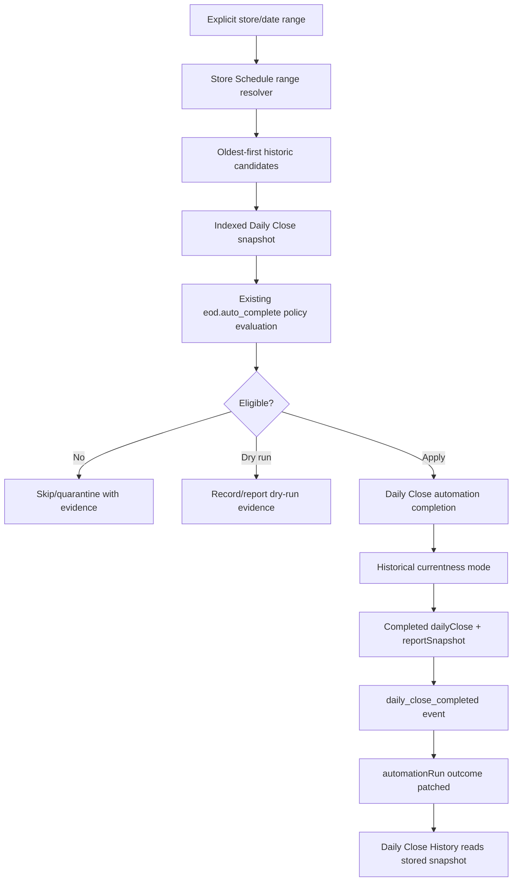
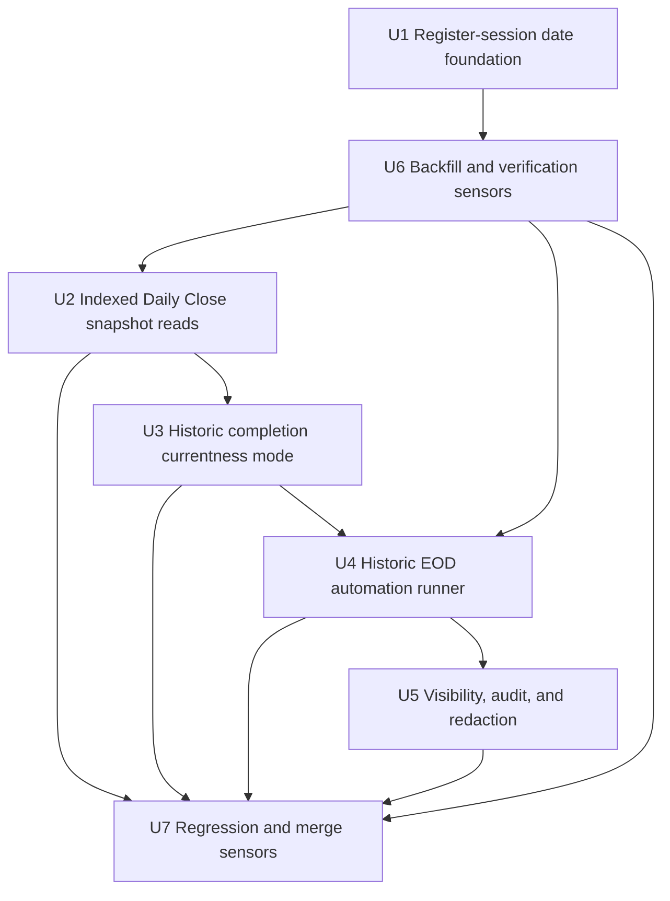

# feat: Add historic EOD auto-close automation

## Summary

Add an automation-first path for Athena to retroactively close eligible historic store days. The delivery starts by fixing register-session date indexes so Daily Close snapshots can be complete at historic scale, then adds a bounded, replayable historic EOD auto-close runner that uses the existing policy-gated Daily Close completion rail without corrupting live current-day state.

---

## Problem Frame

Athena can already complete current EOD Review through `eod.auto_complete` when policy allows it, but historic missing days still require manual navigation date by date. That manual shape does not scale and is risky: the current register-session read path broad-scans store/status rows and filters in memory, so a historic close can miss sessions once there are more than 200 relevant register-session records. Historic completion also cannot call the current completion helper unchanged, because that helper marks one close as the store-wide current close.

This work should be automation-oriented, not a manager shortcut. It should produce durable `dailyClose` records with frozen snapshots, `automationRun` evidence, and operational events only when source data is complete enough to make an authoritative close.

---

## Requirements

- R1. Add date-indexed register-session support before shipping any historic close mutation path.
- R2. Preserve the existing Daily Close source-of-truth model: completed history is `dailyClose` rows with stored `reportSnapshot`, not a separate history table or recomputed read-only view.
- R3. Historic automation must use store-local operating ranges from Store Schedule context, not UTC calendar days or browser-local inference.
- R4. Historic automation must be bounded by explicit store/date range, batch size, dry-run/application mode, and oldest-first ordering.
- R5. Historic completion must use the same policy gates as `eod.auto_complete`: blockers, open/closing registers, pending approvals, unresolved POS sessions, unsupported review categories, threshold failures, reopened/superseded state, and carry-forward conflicts all fail closed.
- R6. Already-completed human closes must never be overwritten. Already-completed automation closes must be idempotent no-ops unless the run is explicitly dry-run/report-only.
- R7. Historic completion must not demote the live/current close or set an old close as store-wide current by accident.
- R8. Each applied date must persist aligned audit evidence across `dailyClose.automationRunId`, `reportSnapshot.closeMetadata`, `automationRun.decisionEvidence`, and `daily_close_completed` operational events.
- R9. Skipped, failed, and dry-run dates must expose support-useful reasons without leaking restricted financial/review details to broad readers.
- R10. Ambiguous or incomplete source data must quarantine the date for review instead of creating authoritative-looking financial history from partial evidence.
- R11. The implementation must include focused regression coverage for >200 register sessions, local day ranges crossing UTC midnight, currentness safety, idempotency, and batch resume behavior.

---

## Scope Boundaries

- This plan does not add LLM judgement or probabilistic classification. Eligibility remains deterministic and policy-based.
- This plan does not repair business facts such as sales, payments, closeouts, variances, or manager approvals.
- This plan does not make Daily Close History a mutation surface; historic automation is support-owned and runs through internal tooling, not an operator settings toggle.
- This plan does not weaken manual EOD approval, reopen, or carry-forward rules.
- This plan does not add customer-facing copy or external Slack/email notifications.
- This plan does not rely on capped in-memory scans as a completeness boundary.

### Deferred to Follow-Up Work

- Any operator-facing settings toggle, backlog scheduling UI, or rich admin UI for configuring ongoing historic backlog schedules.
- Advanced quarantine triage workflows for ambiguous source data.
- Broader schedule-history browsing for operators.
- Intelligence-layer suggestions for which historic ranges to backfill.

---

## Context & Research

### Subagent Findings

- Repository research confirmed that EOD automation is already split between `eod.prepare` and `eod.auto_complete`, with `dailyClose.ts` owning command-time snapshots and completion.
- Learnings research confirmed that automated EOD completion must record Athena policy evidence, preserve carry-forward work, and use stored completed snapshots for historical display.
- Flow analysis identified two critical blockers: register-session date queries are unsafe for historic scale, and current completion marks other store closes non-current across the whole store.
- Data-integrity review recommended widen-migrate-narrow for register-session date fields, stable historic idempotency keys, all-or-nothing audit consistency, and quarantining ambiguous dates.

### Relevant Code and Patterns

- `packages/athena-webapp/convex/operations/dailyClose.ts` builds Daily Close snapshots, applies manual and automation completion, persists `reportSnapshot`, and currently uses `DAILY_CLOSE_QUERY_LIMIT = 200` in multiple query paths.
- `packages/athena-webapp/convex/operations/dailyOperationsAutomation.ts` evaluates `eod.auto_complete` policy and calls `completeDailyCloseForAutomationWithCtx`.
- `packages/athena-webapp/convex/automation/runLedger.ts` owns `automationPolicy` and `automationRun` decision evidence, outcome patching, and idempotency patterns.
- `packages/athena-webapp/convex/schemas/operations/registerSession.ts` stores `openedAt`, `closedAt`, and `closeoutRecords`, but no top-level derived date fields for closeout ownership.
- `packages/athena-webapp/convex/schema.ts` indexes `registerSession` by store/status/register/terminal/approval, but not by opened/closed/closeout date.
- `packages/athena-webapp/convex/operations/registerSessions.ts` and `packages/athena-webapp/convex/cashControls/closeouts.ts` own the register close, reject, reopen, and correction write paths that must dual-write derived date fields.
- `packages/athena-webapp/convex/inventory/storeSchedule.ts` owns store-local schedule context and should remain the business-time source for historic ranges.
- `packages/athena-webapp/src/components/operations/DailyCloseHistoryView.tsx` already presents completed historical closes and should continue reading stored snapshots.

### Institutional Learnings

- `docs/solutions/architecture/athena-eod-review-automation-completion-2026-06-22.md`: EOD completion is a policy-gated automation action with command-time snapshot revalidation and durable Athena attribution.
- `docs/solutions/architecture/athena-store-schedule-foundation-2026-06-27.md`: Store Schedule owns business time; automation persists schedule-derived evidence so later schedule edits do not reinterpret history.
- `docs/solutions/logic-errors/athena-daily-close-history-snapshots-2026-05-09.md`: completed historical views must render persisted `reportSnapshot`, not recompute from live state.
- `docs/solutions/logic-errors/athena-register-closeout-generic-holds-2026-06-26.md`: register lifecycle and closeout holds must remain shared policy, not one-off Daily Close logic.
- `docs/solutions/logic-errors/athena-terminal-sync-review-currentness-2026-06-28.md`: stale sync/conflict evidence must not be treated as clean business state.

### External References

- None. Athena’s Convex automation, Daily Close, Store Schedule, and register lifecycle patterns are the source of truth.

---

## Key Technical Decisions

- **Add derived register-session date fields before historic mutation:** Use optional top-level fields for raw closeout ownership timestamp, ownership source, resolved store-local operating date/range, and schedule evidence, plus status/opened-date and status/operating-date indexes so historic snapshots can query by range without capped status scans.
- **Match current Daily Close date ownership semantics:** Derive closeout ownership from closed closeout record `occurredAt`, then submitted variance approval timing where available, then `closedAt`, and only fall back to opened/closed intersection for non-authoritative range membership. If Store Schedule cannot resolve the authoritative operating date/range for the ownership timestamp, clear the authoritative derived date field and quarantine apply-mode automation.
- **Use widen-migrate-narrow:** Add optional fields and dual-write first, backfill existing sessions in batches, verify, then route snapshot queries through indexed helpers with conservative legacy fallback only where needed.
- **Use existing automation evidence with a distinct historic run identity:** Keep policy semantics equivalent to `eod.auto_complete`, but identify support/batch runs separately, such as `historic_eod.auto_complete`, so normal scheduled EOD completion and backlog cleanup remain distinguishable. Batch-level evidence for v1 lives in existing per-date `automationRun` rows plus the backend run result; do not add a separate support ledger unless implementation proves the existing ledger cannot represent the batch safely.
- **Do not create a parallel completion engine:** Historic automation should call the existing Daily Close snapshot and automation completion boundary after adding a currentness mode that preserves live current close state.
- **Add historical currentness mode:** Current-day completion can keep setting `isCurrent: true` and marking other store closes non-current. Historic completion must write completed snapshots without changing the store-wide current close.
- **Process oldest-first:** Multi-day ranges close oldest eligible dates first so later snapshots see prior completed close and carry-forward context.
- **Quarantine incomplete dates durably:** Missing/ambiguous source evidence, capped/incomplete source reads, or unsupported lifecycle state must create or update an idempotent per-date `automationRun` with a stable quarantine classification/reason code, distinct from ordinary policy skips. Broad readers see only redacted operational copy.
- **Keep UI narrow:** Daily Close History stays read-only. Operator surfaces may show safe attribution/status, but the first delivery exposes support run results through backend return values and existing automation evidence rather than a new settings toggle or backlog UI.

---

## Open Questions

### Resolved During Planning

- **Should this be manual/admin date-by-date close?** No. The user explicitly requested automation-oriented delivery.
- **Can the existing completion helper be reused unchanged?** No. It currently updates store-wide currentness and would demote the live close during historic backfill.
- **Is `closedAt` alone a sufficient register-session date index?** No. Daily Close already uses closeout record and approval evidence before `closedAt`.
- **Can ambiguous historical source data be auto-repaired?** No. This work may close eligible days, but it must not repair sales/payments/closeout business facts.

### Deferred to Implementation

- None. Batch evidence uses existing per-date `automationRun` rows plus backend run results for this delivery, and historic backfill remains support-owned with no operator-facing settings toggle.

---

## High-Level Technical Design

### State Safety Matrix

| Existing state | Historic run result |
| --- | --- |
| No close and clean eligible snapshot | Insert/apply completed close with automation attribution. |
| Existing open/review close and eligible snapshot | Complete the date without marking it store-wide current. |
| Existing human-completed close | No-op; preserve human record. |
| Existing automation-completed close for same historic key | Idempotent no-op. |
| Reopened or superseded close | Skip/quarantine. |
| Current/live close for latest day | Unchanged by old-date historic runs. |
| Incomplete register-session source evidence | Skip/quarantine. |

---

## Implementation Units

- U1. **Add register-session date foundation**

**Goal:** Add optional derived register-session date fields, indexes, and dual-write support needed for historic range queries.

**Requirements:** R1, R3, R10, R11

**Dependencies:** None

**Files:**
- Modify: `packages/athena-webapp/convex/schemas/operations/registerSession.ts`
- Modify: `packages/athena-webapp/convex/schema.ts`
- Modify: `packages/athena-webapp/convex/operations/registerSessions.ts`
- Modify: `packages/athena-webapp/convex/cashControls/closeouts.ts`
- Modify as needed: `packages/athena-webapp/convex/pos/application/sync/projectLocalEvents.ts`
- Test: `packages/athena-webapp/convex/cashControls/registerSessions.test.ts`
- Test: `packages/athena-webapp/convex/operations/operationsQueryIndexes.test.ts`

**Approach:**
- Add optional derived fields for closeout date ownership and closeout submission/review timing, with names that make ownership explicit.
- Derived closeout ownership fields must include raw ownership timestamp, ownership source enum, resolved store-local operating date, resolved range start/end, and Store Schedule version/evidence used for the derivation.
- Add indexes for store/status/opened date and store/status/resolved operating date; add store/date indexes without status only if existing query plans need them.
- Implement one shared helper for deriving closeout ownership from a register session, optional approval request, and Store Schedule resolver so daily close, backfill, and write paths share semantics.
- Dual-write derived fields when a register session closes, enters closeout review, is approved/rejected, is reopened, or receives a local/offline closeout projection.
- Reopen/correction paths must preserve historical closeout records while updating the top-level date field to the latest authoritative ownership value or clearing it when no authoritative value remains.
- Ambiguous or missing schedule evidence must clear authoritative operating-date fields and mark the session as incomplete for apply-mode historic automation.

**Test scenarios:**
- Closed session with a closed closeout record sets closeout ownership date from `closeoutRecords[].occurredAt`.
- Variance-review submission sets the submission/review date without pretending the close is closed.
- Reopen clears or recalculates derived fields consistently.
- More than 200 closed sessions in a store/date range are all addressable by indexed query.
- Sessions opened before a range and closed inside the range are still included.
- Ambiguous schedule evidence clears authoritative operating-date fields and blocks apply-mode historic automation.

**Verification:**
- Register-session date fields are optional, dual-written, and queryable without changing existing lifecycle meaning.

---

- U2. **Route Daily Close source reads through indexed helpers**

**Goal:** Replace capped broad scans in Daily Close source reads with date-indexed or completeness-aware range helpers while preserving existing snapshot semantics.

**Requirements:** R1, R2, R3, R5, R10, R11

**Dependencies:** U6

**Files:**
- Modify: `packages/athena-webapp/convex/operations/dailyClose.ts`
- Test: `packages/athena-webapp/convex/operations/dailyClose.test.ts`
- Test: `packages/athena-webapp/convex/operations/operationsQueryIndexes.test.ts`

**Approach:**
- Extract register-session range query helpers for closed, active/intersecting, and approval/review sessions.
- Use new date indexes for closeout-owned sessions and opened/intersecting sessions.
- Preserve `registerSessionBelongsToRange` as the final semantic filter, but do not let `take(200)` before date filtering be the completeness boundary.
- Treat legacy sessions missing derived fields conservatively: include them through a bounded fallback only for compatibility, and mark evidence as incomplete where automation needs full confidence.
- Audit every Daily Close source contributor that still uses `DAILY_CLOSE_QUERY_LIMIT`, including transactions, payment allocations/deposits, adjustments, approvals, open POS sessions, work items, expenses, and prior completed close lookup.
- Where indexed day-range reads already exist, use those indexes in complete pagination loops or bounded page helpers rather than one capped `take`.
- For any source that cannot be made complete in this delivery, add explicit source-completeness evidence and make historic apply mode quarantine the date instead of completing.
- Add snapshot evidence showing when every source read is complete enough for automation to apply.

**Test scenarios:**
- Historic day with more than 200 closed sessions includes all date-owned sessions.
- Store day crossing UTC midnight includes only sessions belonging to that local range.
- Open/active session intersecting the historic range blocks completion.
- Session closed outside the range is excluded.
- Missing derived date fields produce conservative automation evidence rather than silent completion.
- A non-register source that still hits a cap marks source completeness false and blocks historic apply mode.

**Verification:**
- Daily Close snapshots stay behaviorally equivalent for normal days and become complete or explicitly incomplete for historic ranges.

---

- U3. **Add automation completion currentness modes**

**Goal:** Make Daily Close completion safe for historical dates without changing current-day completion semantics.

**Requirements:** R2, R5, R6, R7, R8, R11

**Dependencies:** U2

**Files:**
- Modify: `packages/athena-webapp/convex/operations/dailyClose.ts`
- Modify as needed: `packages/athena-webapp/convex/schemas/operations/dailyClose.ts`
- Test: `packages/athena-webapp/convex/operations/dailyClose.test.ts`

**Approach:**
- Add an internal currentness option to automation completion, such as `currentnessMode: "mark_current" | "historical_record"`.
- Keep existing manual/current automation behavior as `mark_current`.
- In `historical_record` mode, complete the target date and write frozen report snapshot/evidence without calling store-wide `markOtherDailyClosesNotCurrent` and without setting the historic record as store-wide current.
- Reject human-completed, reopened, superseded, or mismatched existing closes before mutation.
- Preserve all automation attribution and operational event behavior.

**Test scenarios:**
- Current `eod.auto_complete` still marks current close and demotes prior current closes.
- Historic completion writes `isCurrent: false` and does not demote the latest close.
- Existing human-completed close is preserved.
- Reopened/superseded close is skipped.
- Duplicate historic automation attempt is idempotent.

**Verification:**
- Historic completion cannot corrupt live currentness, while existing current-day completion behavior remains unchanged.

---

- U4. **Add bounded historic EOD automation runner**

**Goal:** Add support-owned automation that discovers and applies eligible historic store days oldest-first.

**Requirements:** R3, R4, R5, R6, R8, R9, R10, R11

**Dependencies:** U1, U2, U3, U6

**Files:**
- Modify: `packages/athena-webapp/convex/operations/dailyOperationsAutomation.ts`
- Modify: `packages/athena-webapp/convex/automation/actionRegistry.ts`
- Modify: `packages/athena-webapp/convex/automation/runLedger.ts`
- Test: `packages/athena-webapp/convex/operations/dailyOperationsAutomation.test.ts`

**Approach:**
- Add a support-owned internal action only as a batch orchestrator for explicit `storeId`, `startOperatingDate`, `endOperatingDate`, `mode`, and `maxDays`; it must not own per-date partial writes.
- Add a per-date internal mutation that, in one Convex transaction, gets or creates the per-date historic `automationRun`, re-reads the command-time snapshot, completes or no-ops the `dailyClose`, records the operational event when applied, and patches run outcome/evidence.
- Add an explicit Store Schedule helper such as `resolveStoreOperatingRangeForDateWithCtx(ctx, { storeId, operatingDate })`, returning `startAt`, `endAt`, timezone, schedule version/evidence, and skip/quarantine reasons for missing, closed, or ambiguous schedules.
- Resolve each date through that helper and skip current/future dates.
- Use a distinct historic run key namespace so retries do not collide with scheduled current-day `eod.auto_complete`.
- Process oldest-first and stop or continue according to an explicit run option, defaulting to safe stop-on-failure for apply mode.
- In dry-run mode, return per-date eligibility and skipped reasons without mutating Daily Close.
- In apply mode, require verified date-index/backfill/source completeness for the target store/date range before any per-date apply mutation can run.
- In apply mode, call the existing eligibility/completion rail with historical currentness mode from the per-date mutation.
- In quarantine cases, create or update the stable per-date historic `automationRun` with a durable quarantine classification/reason code and redacted evidence.
- Return aggregate counts: candidates, applied, already completed, skipped, failed, quarantined, and next cursor/date.

**Test scenarios:**
- Bounded date range dry-run reports eligible and skipped dates with no mutation.
- Apply mode closes only eligible old dates.
- Oldest-first processing is observable in run evidence.
- Already completed dates are no-ops.
- Current/future dates are skipped.
- Duplicate invocation produces stable idempotent behavior.
- Batch limit returns resumable cursor/date.
- Apply mode rejects a range whose register-session date backfill/source completeness verification has not passed.
- A simulated failure cannot leave `dailyClose`, `automationRun`, and operational event evidence disagreeing for a date.

**Verification:**
- Historic automation is explicit, bounded, replayable, and distinguishable from normal scheduled EOD automation.

---

- U5. **Expose safe visibility and audit evidence**

**Goal:** Make historic automation outcomes inspectable without turning history into a mutation UI or leaking restricted details.

**Requirements:** R2, R8, R9

**Dependencies:** U3, U4

**Files:**
- Modify as needed: `packages/athena-webapp/convex/operations/dailyOperations.ts`
- Modify as needed: `packages/athena-webapp/src/components/operations/DailyCloseHistoryView.tsx`
- Modify as needed: `packages/athena-webapp/src/components/operations/DailyOperationsView.tsx`
- Test as needed: `packages/athena-webapp/src/components/operations/DailyCloseHistoryView.test.tsx`
- Test as needed: `packages/athena-webapp/src/components/operations/DailyOperationsView.test.tsx`

**Approach:**
- Preserve Daily Close History as read-only stored-snapshot display.
- Ensure Athena-completed historic closes render as automation attribution rather than manager approval.
- Keep full decision details behind existing financial/detail permissions.
- Surface batch support evidence through backend return values and per-date automation run details first; no operator-facing historic toggle or backlog scheduling UI ships in this delivery.
- Normalize skipped/quarantined copy to calm operational language.
- Quarantine evidence is durable, idempotent, and distinct from disabled/dry-run/policy-skipped outcomes.

**Test scenarios:**
- Athena-completed historic close renders stored snapshot attribution.
- Broad reader does not see raw run IDs, internal decision codes, or restricted financial evidence.
- Completed lifecycle suppresses stale dry-run/skipped noise in operator status.

**Verification:**
- Operators can trust completed history, and support can trace automation decisions.

---

- U6. **Add backfill and verification sensors**

**Goal:** Safely populate derived register-session date fields and verify historic source completeness before relying on indexes.

**Requirements:** R1, R10, R11

**Dependencies:** U1

**Files:**
- Create or modify: `packages/athena-webapp/convex/migrations/*registerSession*`
- Test: migration coverage near existing Convex migration tests
- Modify as needed: package validation registry if generated harness coverage changes

**Approach:**
- Add a paginated internal migration/backfill for derived register-session date fields.
- Never `.collect()` all production register sessions.
- Record counts for updated, skipped, ambiguous, and already-current sessions.
- Use the same derivation helper as live write paths.
- Add a verification query/action for store/date source completeness before historic automation applies.
- Verification must cover register-session derived date coverage and any other Daily Close source that can still hit an incomplete capped read.
- Historic apply mode is structurally dry-run/quarantine-only until verification passes for the requested store/date range.

**Test scenarios:**
- Backfill populates fields from closeout records.
- Backfill falls back to approval/closed timestamps only according to documented semantics and only when Store Schedule can resolve the ownership timestamp into durable local-day evidence.
- Ambiguous sessions are skipped and counted.
- Cursor resumes without duplicate mutation.
- Verification rejects a range when any source contributor lacks complete indexed coverage.

**Verification:**
- Register-session date indexes are populated enough for historic automation to rely on them.

---

- U7. **Regression and delivery sensors**

**Goal:** Prove backend, UI, generated artifacts, graph, and merge/deploy readiness.

**Requirements:** R11

**Dependencies:** U1-U6

**Files:**
- Modify tests and generated artifacts as required by implementation.

**Approach:**
- Add focused tests before implementation where behavior is clear.
- Run the Daily Close/cash-controls focused suite from `packages/athena-webapp`.
- Run Convex audit and changed Convex lint.
- Refresh generated Convex artifacts if public/internal refs or schema changes require it.
- Run `bun run graphify:rebuild` after code changes.
- Run `bun run pr:athena` before merge-ready handoff.
- Merge by PR, fast-forward local root to the merged `origin/main`, then deploy relevant local production surfaces from the clean root.

**Expected sensors:**
- `bun run test -- convex/operations/dailyClose.test.ts convex/operations/dailyOperationsAutomation.test.ts convex/cashControls/registerSessions.test.ts`
- `bun run --filter '@athena/webapp' audit:convex`
- `bun run --filter '@athena/webapp' lint:convex:changed`
- `bunx tsc --noEmit -p packages/athena-webapp/tsconfig.json`
- `bun run --filter '@athena/webapp' build`
- `bun run graphify:rebuild`
- `bun run pr:athena`

**Verification:**
- The branch is safe to merge through PR and deploy from aligned root.

---

## Linear Tracking Plan

| Ticket | Unit | Dependencies | Execution Posture |
| --- | --- | --- | --- |
| Add register-session date indexes and dual-write fields | U1 | None | test-first |
| Backfill register-session date fields and add source completeness verification | U6 | U1 | test-first |
| Replace Daily Close source scans with indexed/completeness-aware range helpers | U2 | U6 | characterization-first |
| Make Daily Close automation completion safe for historic currentness | U3 | U2 | test-first |
| Add bounded historic EOD auto-close runner | U4 | U3, U6 | test-first |
| Surface historic automation evidence safely | U5 | U4 | characterization-first |
| Validate, regenerate artifacts, merge, align root, deploy | U7 | U1-U6 | sensor-only |

---

## Review Checklist

- Register-session date indexes exist before historic mutation is enabled.
- No historic path uses capped source scans as its completeness boundary.
- Apply mode requires successful date-index/backfill/source-completeness verification for the requested range.
- Per-date apply writes are transactional; the batch orchestrator never owns partial audit writes.
- Historic completion cannot mark an old day as the live current close.
- Human-completed closes are never overwritten.
- Automation run keys distinguish historic batch work from normal scheduled EOD.
- Store Schedule evidence is persisted or referenced so later schedule edits do not reinterpret historical closes.
- Ambiguous data produces durable quarantine automation-run evidence, not authoritative completed history.
- Focused and repo-level sensors run before merge.
