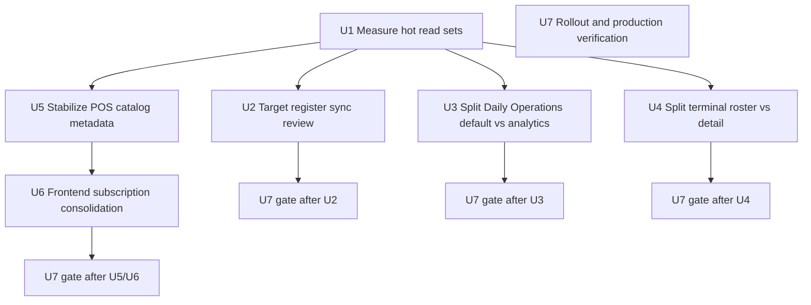
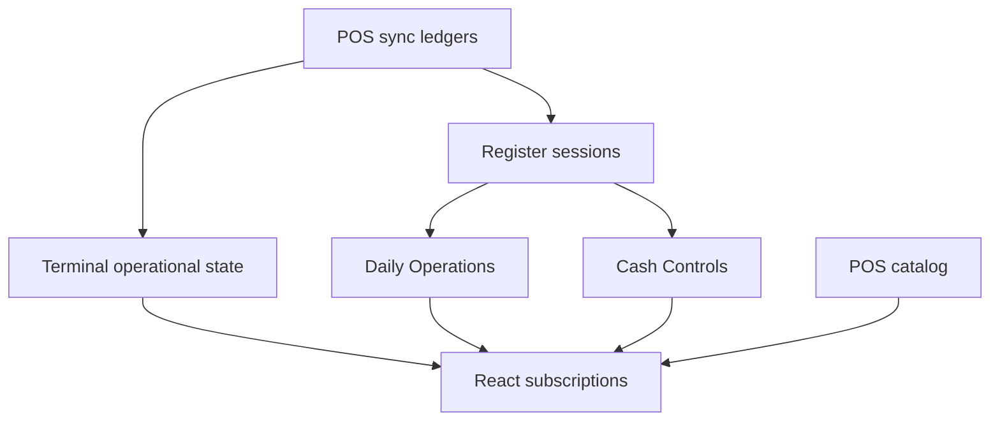

# refactor: Reduce Convex read amplification

## Summary

Reduce the June 27 production Convex read spike by turning the hottest reactive queries into bounded, intent-specific read models. The work starts with measurement, then narrows register sync-review reads, splits heavy Daily Operations analytics from default store-day posture, separates terminal roster from terminal detail evidence, and moves POS catalog metadata away from full live reactivity.

---

## Problem Frame

On June 27, 2026, prod Convex Database I/O showed 68.05 GB of reads for the day. The dashboard breakdown attributed most of the read volume to `operations/dailyOperations.getDailyOperationsSnapshot`, `pos/public/register.getState`, `inventory/posTerminal.getTerminalHealthDetail`, `pos/public/catalog.listRegisterCatalogSnapshot`, and `cashControls/deposits.getRegisterSessionSnapshot`.

These functions are operationally important and should not lose correctness or evidence. The problem is that several low-freshness or detail-grade surfaces are currently live subscriptions over broad read sets: store-day analytics, register sync evidence, terminal conflict evidence, and full POS catalog metadata.

---

## Requirements

- R1. Reduce reads for the five June 27 hot prod functions without removing cashier readiness, manager review, terminal health, cash-control, or catalog visibility behavior.
- R2. Preserve POS local-first continuity: cashier sale readiness must remain distinct from terminal health, support recovery, and review backlog.
- R3. Preserve Daily Operations as an overview of source workflows, not a new workflow owner.
- R4. Keep sync-review evidence actionable and current; do not hide target register-session reviews behind capped store-wide scans.
- R5. Keep POS catalog visibility enforcement server-side, including archived legacy import exclusions and reserved operational-category handling.
- R6. Add characterization or read-boundary regression coverage before changing each hot path.
- R7. Keep Convex query paths read-only; do not add cleanup writes, cache writes, or stale-state persistence inside public queries.
- R8. Provide production verification criteria tied to Convex Insights and dashboard usage after rollout.

---

## Scope Boundaries

- No implementation is included in this planning pass.
- No client-only filtering may be used as the correctness fix for catalog visibility or review evidence.
- No query-time writes may be introduced for cleanup, caching, or digest maintenance.
- No broad rewrite of POS runtime, Daily Close, or catalog ownership beyond the read-amplification surfaces named here.
- No forced migration to digest tables unless the measurement unit confirms bounded query changes are insufficient for the hot path.

### Deferred to Follow-Up Work

- Full historical analytics warehouse or BI reporting: this plan only covers Athena app-facing Convex read cost.
- General Convex billing dashboard integration: this plan uses existing dashboard/Insights signals for verification.
- Long-term archive compaction for old sync ledgers: useful later, but not required to remove the current reactive amplification.

---

## Context & Research

### Relevant Code and Patterns

- `packages/athena-webapp/convex/operations/dailyOperations.ts` builds the default Daily Operations snapshot by combining opening, close, queue, scheduled runs, timeline, store pulse, and week metrics.
- `packages/athena-webapp/convex/pos/application/queries/storePulse.ts` reads transaction ranges and then reads transaction items per transaction.
- `packages/athena-webapp/convex/pos/infrastructure/repositories/registerSessionRepository.ts` currently loads store-wide sync review evidence for `getState` after resolving one active register session.
- `packages/athena-webapp/convex/pos/application/sync/registerSessionSyncReview.ts` supports targeted register session facts, but still merges in capped store-wide needs-review/resolved/rejected scans.
- `packages/athena-webapp/convex/pos/application/queries/terminals.ts` uses `includeSyncEvidence: true` for both terminal roster and terminal detail.
- `packages/athena-webapp/convex/pos/infrastructure/repositories/terminalRepository.ts` reads terminal sync events, cursors, conflict groups, operational work targets, and register-session resolution facts for each terminal health summary.
- `packages/athena-webapp/convex/pos/application/queries/listRegisterCatalog.ts` reads full store `productSku` rows with `collect()`, joins products/categories/colors, and overlays pending/provisional rows for the POS catalog snapshot.
- `packages/athena-webapp/src/lib/pos/infrastructure/convex/catalogGateway.ts` subscribes live to `listRegisterCatalogSnapshot` while also maintaining local IndexedDB snapshots.

### Institutional Learnings

- `docs/solutions/logic-errors/athena-daily-operations-aggregate-read-model-2026-05-08.md`: Daily Operations should aggregate bounded source workflow read models and expose capped counts honestly.
- `docs/solutions/architecture/athena-store-pulse-daily-operations-reuse-2026-06-22.md`: store pulse should stay server-owned and role-redacted; avoid recomputing pulse data in React.
- `docs/solutions/architecture/athena-terminal-operational-state-aggregate-2026-06-27.md`: `TerminalOperationalState` is the server-side boundary for terminal health and recovery semantics.
- `docs/solutions/logic-errors/athena-terminal-sync-review-currentness-2026-06-28.md`: terminal review counts must mean current actionable work, not raw historical conflict volume.
- `docs/solutions/architecture/athena-pos-terminal-runtime-status-freshness-2026-06-27.md`: terminal detail evidence can be large and should be capped/expanded deliberately.
- `docs/solutions/harness/convex-query-write-boundary-proof-2026-06-18.md`: Convex query paths must not reach write-capable cleanup behavior.
- `docs/solutions/architecture/athena-pos-register-lifecycle-policy-2026-06-23.md`: optimize fact loading without duplicating drawer lifecycle policy.
- `docs/solutions/performance/athena-pos-cart-latency-foundation-2026-05-05.md`: keep volatile availability out of the full POS catalog subscription.
- `docs/solutions/architecture/athena-store-ops-catalog-visibility-boundaries-2026-06-24.md`: enforce POS catalog visibility at the query or command boundary.
- `docs/solutions/logic-errors/athena-register-closeout-review-targeting-and-money-inputs-2026-06-27.md`: target register-session sync review reads on session detail/action paths.

### External References

- Convex project guide: `convex/_generated/ai/guidelines.md`, especially indexed/bounded query guidance and the rule to avoid unbounded `collect()`.
- Convex performance skill references: `.agents/skills/convex-performance-audit/references/hot-path-rules.md` and `.agents/skills/convex-performance-audit/references/subscription-cost.md`.
- Official Convex best practices: https://docs.convex.dev/understanding/best-practices/

---

## Key Technical Decisions

- Measure before restructuring: add focused read-boundary tests with high-cardinality fixtures and a production comparison checklist before larger refactors so improvements are attributable to the hot functions.
- Split targeted sync review from store backlog review: register state and register-session detail need target-scoped evidence, while dashboards can still request a bounded backlog view.
- Keep Daily Operations default posture lightweight through companion queries: `getDailyOperationsSnapshot` should keep source workflow status, blockers, counts, primary actions, and a compact timeline preview; separate public queries should load store pulse, week metrics, full timeline, and scheduled-run diagnostics.
- Split terminal roster from terminal detail with an explicit roster fact contract: roster must retain sale impact, lane, runtime age, current owner/action summary, and backlog/incomplete flags while leaving conflict examples, source events, and repair payloads to detail.
- Treat POS catalog metadata as stable snapshot data with explicit refresh invalidation: full metadata should be fetched point-in-time through an authenticated one-shot gateway and refreshed after catalog-affecting changes, while active cart/search availability remains bounded by SKU ids.
- Prefer existing policy boundaries over duplicated shortcuts: reuse `TerminalOperationalState`, register lifecycle policy, store pulse helpers, and POS catalog visibility rules.
- Only introduce digest tables when the hot path remains expensive after bounded reads: digest tables add write and migration cost, so they should be targeted at proven high-read surfaces.

---

## Open Questions

### Resolved During Planning

- Should this be a single broad fix or separate sibling fixes? It should be a phased refactor with shared measurement, because the hot functions share a symptom but have different ownership boundaries.
- Should terminal health be optimized through register/cash-control changes? No. Terminal health needs its own roster/detail split around `TerminalOperationalState`.
- Should POS catalog visibility move client-side to save reads? No. Server-side visibility remains the correctness boundary.

### Deferred to Implementation

- Exact read-count instrumentation shape: implementers should choose the smallest test helper compatible with the existing Convex test mocks.
- Digest table necessity and schema shape: decide after U1/U3/U4/U5 prove whether bounded reads and subscription consolidation are enough.
- Exact production reduction percentage: verify through Convex dashboard and Insights after deployment because daily traffic and active terminal count affect totals.

---

## High-Level Technical Design

> *This illustrates the intended approach and is directional guidance for review, not implementation specification. The implementing agent should treat it as context, not code to reproduce.*

The design separates reads by freshness and evidence depth:

| Surface | Default read target | Detail/read-on-demand target |
|---|---|---|
| Daily Operations | store-day lifecycle, blockers, queue counts, primary actions, compact timeline preview, scheduled-run status badge | store pulse, week metrics, full timeline, scheduled-run diagnostics/evidence |
| POS register state | terminal/cashier/session readiness plus target session sync status | broader sync backlog only in manager workspaces |
| Terminal health roster | sale impact, health lane, runtime age, owner/action summary, review backlog and incomplete flags | conflict examples, repair previews, source-event evidence |
| POS catalog | authenticated point-in-time searchable metadata snapshot with invalidation/refresh triggers | bounded live availability by displayed/exact-match SKU ids |

---

## Implementation Units

- U1. **Measure Hot Read Sets**

**Goal:** Add characterization coverage and a production comparison checklist for the June 27 hot functions before changing behavior.

**Requirements:** R1, R6, R8

**Dependencies:** None

**Files:**
- Modify: `packages/athena-webapp/convex/operations/dailyOperations.test.ts`
- Modify: `packages/athena-webapp/convex/cashControls/deposits.test.ts`
- Modify: `packages/athena-webapp/convex/pos/public/register.test.ts`
- Modify: `packages/athena-webapp/convex/pos/application/terminals.test.ts`
- Modify: `packages/athena-webapp/convex/pos/application/queries/listRegisterCatalog.test.ts`
- Create or modify: `packages/athena-webapp/convex/testSupport/readBoundary.ts`

**Approach:**
- Add fake-DB read tracking for the hot functions where existing mocks make this practical.
- Capture table/index calls that must disappear from hot default paths, such as unrelated store-wide sync conflict scans in `getState`.
- Seed high-cardinality fixtures for each hot path: large sync backlogs, multiple terminals with conflict history, broad catalog metadata, and transaction/item fan-out for Daily Operations.
- Assert bounded or proportional read counts in addition to legacy-index absence, so a new implementation cannot keep scaling with the old broad datasets under a different helper name.
- Keep the tests behavioral first; read-boundary assertions should protect the intended optimization without overfitting exact helper names.

**Execution note:** Start characterization-first. The initial tests should fail against the current broad read sets before production code changes.

**Patterns to follow:**
- Existing `getHandler(...)` Convex unit tests in `dailyOperations.test.ts`, `deposits.test.ts`, and public POS tests.
- `docs/solutions/harness/convex-query-write-boundary-proof-2026-06-18.md` for changed-file scoped inferential guard posture.

**Test scenarios:**
- Happy path: `pos/public/register.getState` for one active register session does not query unrelated store-wide `posLocalSyncConflict.by_store_status` rows.
- Happy path: `cashControls/deposits.getRegisterSessionSnapshot` includes a target register-session conflict that would be outside a store-wide cap.
- Edge case: Daily Operations redacted/non-admin access does not read financial pulse data.
- Edge case: Daily Operations high-cardinality transaction/item fixtures prove default posture does not fan out through store pulse or week metrics.
- Edge case: terminal roster high-cardinality conflict fixtures prove roster reads remain bounded while detail reads hydrate full evidence for one terminal.
- Edge case: catalog high-cardinality SKU/provisional/pending fixtures prove metadata and availability reads scale with the intended boundary.
- Integration: POS catalog metadata read is distinguishable from bounded availability reads.

**Verification:**
- Each hot surface has at least one test that would fail if the old broad read path is reintroduced.
- The plan has a documented production comparison checklist for before/after Convex Insights and dashboard DB I/O.

---

- U2. **Target Register and Cash-Control Sync Review Reads**

**Goal:** Remove store-wide sync conflict scans from target register-session paths while preserving actionable review evidence.

**Requirements:** R1, R2, R4, R6, R7

**Dependencies:** U1

**Files:**
- Modify: `packages/athena-webapp/convex/pos/application/sync/registerSessionSyncReview.ts`
- Modify: `packages/athena-webapp/convex/pos/infrastructure/repositories/registerSessionRepository.ts`
- Modify: `packages/athena-webapp/convex/cashControls/deposits.ts`
- Modify: `packages/athena-webapp/convex/operations/operationalWorkItems.ts`
- Modify: `packages/athena-webapp/convex/pos/application/sync/registerSessionCloseoutHolds.ts`
- Test: `packages/athena-webapp/convex/cashControls/deposits.test.ts`
- Test: `packages/athena-webapp/convex/pos/public/register.test.ts`
- Test: `packages/athena-webapp/convex/pos/infrastructure/repositories/registerSessionRepository.test.ts`

**Approach:**
- Split `listOpenLocalSyncConflictsByRegisterSession` into explicit targeted and backlog modes.
- Make `getActiveRegisterSessionForRegisterState` pass the active session id into the targeted mode.
- Keep dashboard/open-work consumers on the bounded backlog mode where they genuinely need store-level review posture.
- For targeted mode, prefer `posLocalSyncConflict.by_store_terminal_register_status_type` where available instead of reading all conflicts for a local register session.
- Preserve rejected evidence only for detail/action surfaces that ask for it.
- Preserve the helper's current semantic filtering in targeted mode: inventory conflicts already represented by open Operations work, non-sale missing mappings, stale resolved conflicts, and rejected evidence must classify the same way as the existing detail path.

**Patterns to follow:**
- `docs/solutions/logic-errors/athena-register-closeout-review-targeting-and-money-inputs-2026-06-27.md`
- `packages/athena-webapp/shared/registerSessionLifecyclePolicy.ts`

**Test scenarios:**
- Happy path: register state returns the same active drawer summary and local sync status when the target session has a current conflict.
- Edge case: unrelated store-wide backlog over the cap does not hide the target session review.
- Edge case: resolved conflicts that still correspond to conflicted source events remain visible for the target session.
- Edge case: inventory review conflicts with current open Operations work are suppressed from register-session review actions in targeted mode.
- Edge case: non-sale missing register-session mapping conflicts remain filtered from cash-control review actions.
- Edge case: rejected server evidence is included only when the caller requests rejected evidence.
- Error path: missing or cross-store register session ids are ignored by targeted sync-review lookup.
- Integration: cash-control session detail and resolve-review action paths agree on the same target evidence.

**Verification:**
- `getState` no longer performs store-wide needs-review/resolved conflict scans for a single active session.
- Cash-control detail still surfaces target review evidence outside store-wide caps.
- Store-level dashboards still have an explicit bounded backlog path.

---

- U3. **Split Daily Operations Posture from Analytics Reads**

**Goal:** Reduce `getDailyOperationsSnapshot` default reads by separating operational posture from heavy financial pulse, week metrics, full timeline, and scheduled-run diagnostic detail.

**Requirements:** R1, R3, R6, R7, R8

**Dependencies:** U1

**Files:**
- Modify: `packages/athena-webapp/convex/operations/dailyOperations.ts`
- Modify: `packages/athena-webapp/convex/operations/dailyClose.ts`
- Modify: `packages/athena-webapp/convex/pos/application/queries/storePulse.ts`
- Modify: `packages/athena-webapp/convex/pos/infrastructure/repositories/transactionRepository.ts`
- Modify: `packages/athena-webapp/convex/operations/dailyOperationsReturns.ts` if return validators/types are split there during implementation
- Modify: `packages/athena-webapp/src/components/operations/DailyOperationsView.tsx`
- Test: `packages/athena-webapp/convex/operations/dailyOperations.test.ts`
- Test: `packages/athena-webapp/src/components/operations/DailyOperationsView.test.tsx`

- **Chosen API shape:** keep `getDailyOperationsSnapshot` as the default posture query and add companion public queries for `getDailyOperationsAnalyticsSnapshot`, `getDailyOperationsTimeline`, and `getDailyOperationsScheduledRunDiagnostics` or equivalently named functions following local naming conventions.
- Keep the default snapshot focused on opening/close status, queue counts, attention items, lanes, lifecycle, primary actions, a compact timeline preview, and a scheduled-run status badge when relevant.
- Move store pulse, week metrics, full timeline, and scheduled-run diagnostic evidence into the companion queries with their own validators/DTOs/loading states.
- Bound transaction-range reads in store pulse and avoid per-transaction item reads where a summary row or precomputed item movement can answer the UI.
- Preserve financial redaction at the query contract; do not return hidden totals for the UI to suppress.
- Make the frontend render default posture immediately, then load analytics/timeline/diagnostic panels independently with empty/loading/error states that do not block the store-day posture.
- If measurement shows default posture remains expensive, plan a narrow daily operations summary row updated by workflow mutations or scheduled recompute.

**Patterns to follow:**
- `docs/solutions/logic-errors/athena-daily-operations-aggregate-read-model-2026-05-08.md`
- `docs/solutions/architecture/athena-store-pulse-daily-operations-reuse-2026-06-22.md`

**Test scenarios:**
- Happy path: default Daily Operations snapshot still derives the same lifecycle and primary action for opened, operating, ready-to-close, and closed days.
- Happy path: requesting pulse/metrics explicitly returns the same visible pulse data for a full-admin user.
- Happy path: full timeline and scheduled-run diagnostics load through companion queries without changing the default posture DTO.
- Edge case: `pos_only` or financially redacted access does not read or return financial pulse detail.
- Edge case: historical operating date reads use the selected store-day window, not browser wall-clock time.
- Integration: Daily Operations view renders posture first and only requests heavy detail when the UI needs that panel.

**Verification:**
- Default `getDailyOperationsSnapshot` read set no longer includes store pulse transaction-item loops or full week metric fan-out.
- Daily Operations remains a navigation overview into Daily Opening, Daily Close, and queue owners.

---

- U4. **Separate Terminal Roster from Terminal Detail Evidence**

**Goal:** Reduce the terminal hot surface by splitting terminal roster reads from terminal detail reads, then optimizing both contracts: roster must not hydrate detail-grade evidence for every terminal, and `getTerminalHealthDetail` must preserve detail depth while avoiding duplicated register/conflict reads for one selected terminal.

**Requirements:** R1, R2, R6, R7, R8

**Dependencies:** U1

**Files:**
- Modify: `packages/athena-webapp/convex/pos/application/queries/terminals.ts`
- Modify: `packages/athena-webapp/convex/pos/application/terminalOperationalState/collectTerminalOperationalFacts.ts`
- Modify: `packages/athena-webapp/convex/pos/infrastructure/repositories/terminalRepository.ts`
- Modify: `packages/athena-webapp/convex/pos/infrastructure/repositories/terminalRecoveryRepository.ts`
- Modify: `packages/athena-webapp/convex/pos/public/terminals.ts`
- Modify: `packages/athena-webapp/src/components/pos/terminals/POSTerminalHealthView.tsx`
- Modify: `packages/athena-webapp/src/components/pos/terminals/POSTerminalDetailView.tsx`
- Test: `packages/athena-webapp/convex/pos/application/terminals.test.ts`
- Test: `packages/athena-webapp/convex/pos/application/terminalOperationalState/collectTerminalOperationalFacts.test.ts`
- Test: `packages/athena-webapp/convex/pos/infrastructure/repositories/terminalRepository.test.ts`
- Test: `packages/athena-webapp/convex/pos/public/terminals.test.ts`
- Test: `packages/athena-webapp/src/components/pos/terminals/POSTerminalHealthView.test.tsx`
- Test: `packages/athena-webapp/src/components/pos/terminals/POSTerminalDetailView.test.tsx`

**Approach:**
- Add a roster-safe terminal health projection with an explicit minimum fact contract: terminal identity, runtime age, effective sale impact, health lane, primary owner/action, register-session link, review backlog count, `targetResolutionIncomplete`, and validator-visible status fields.
- Keep full `syncEvidence`, conflict examples, source events, cloud repair eligibility, and recovery command payloads in `getTerminalHealthDetail`.
- Build the roster projection from `TerminalOperationalState` or a deliberately reduced fact collector that still has enough runtime/register/review-summary facts to avoid `unknown` or falsely clean rows.
- Collapse duplicate latest/active register-session reads in both roster and detail where the same recent result set can classify both.
- Keep the production success target explicit: the terminal slice should reduce normalized reads for the named `inventory/posTerminal.getTerminalHealthDetail` function and prevent roster traffic from multiplying that detail-grade cost across every terminal.
- If roster remains expensive after the split, introduce a terminal operational digest keyed by store and terminal, updated by runtime status, sync conflict, recovery command, and register-session lifecycle writes.
- Keep `TerminalOperationalState` as the policy boundary; do not recompute terminal health in React.

**Patterns to follow:**
- `docs/solutions/architecture/athena-terminal-operational-state-aggregate-2026-06-27.md`
- `docs/solutions/logic-errors/athena-terminal-sync-review-currentness-2026-06-28.md`
- `docs/solutions/architecture/athena-pos-terminal-runtime-status-freshness-2026-06-27.md`

**Test scenarios:**
- Happy path: terminal roster shows the same health lane and sale impact without full conflict examples.
- Happy path: terminal detail still includes sync evidence, recovery preview, action targets, and support notes.
- Happy path: public roster return validators include the roster minimum contract and stay separate from detail validators.
- Edge case: a terminal with many stale conflicts reports review backlog/incomplete target resolution without pretending it is clean.
- Edge case: a terminal can remain sale-ready while review backlog remains visible as non-blocking support evidence.
- Integration: roster navigation to detail hydrates the full evidence for the selected terminal only.

**Verification:**
- `listTerminalHealth` no longer reads per-terminal conflict source events and cloud repair facts by default.
- `inventory/posTerminal.getTerminalHealthDetail` preserves full support evidence for one selected terminal while eliminating duplicate one-terminal reads that are not required for detail correctness.
- Production verification reports terminal roster and `getTerminalHealthDetail` separately so a roster improvement cannot mask an unchanged or regressed detail function.

---

- U5. **Stabilize POS Catalog Metadata Reads**

**Goal:** Remove full-store catalog metadata from high-frequency live reactivity while keeping offline search and server-side visibility correct.

**Requirements:** R1, R5, R6, R7, R8

**Dependencies:** U1

**Files:**
- Modify: `packages/athena-webapp/convex/pos/public/catalog.ts`
- Modify: `packages/athena-webapp/convex/pos/application/queries/listRegisterCatalog.ts`
- Modify: `packages/athena-webapp/src/lib/pos/infrastructure/convex/catalogGateway.ts`
- Modify: `packages/athena-webapp/src/lib/pos/presentation/register/useRegisterViewModel.ts`
- Modify: `packages/athena-webapp/src/components/pos/PointOfSaleView.tsx`
- Modify: `packages/athena-webapp/src/components/pos/ProductEntry.tsx`
- Test: `packages/athena-webapp/convex/pos/application/queries/listRegisterCatalog.test.ts`
- Test: `packages/athena-webapp/convex/pos/public/catalog.test.ts`
- Test: `packages/athena-webapp/src/lib/pos/infrastructure/convex/catalogGateway.test.tsx`
- Test: `packages/athena-webapp/src/components/pos/PointOfSaleView.test.tsx`
- Test: `packages/athena-webapp/src/components/pos/ProductEntry.test.tsx`

- **Chosen refresh shape:** replace the live `useQuery` metadata subscription with an authenticated one-shot `ConvexHttpClient.query`/equivalent gateway call that writes IndexedDB, returns cached rows immediately when present, and exposes explicit refresh state. The one-shot client must reuse the current auth token path, such as `ConvexHttpClient.setAuth` or an equivalent authenticated client wrapper.
- Treat full catalog metadata as a point-in-time/offline snapshot instead of a live subscription wherever immediate freshness is not required.
- Define metadata invalidation triggers before removing live reactivity: product archive/draft/visibility changes, category visibility or reserved-category changes, price/barcode/display-field edits, provisional import status changes, pending-checkout review transitions, quick-add creation, and checkout command rejection for stale rows.
- Keep bounded `listRegisterCatalogAvailability` for displayed, exact-match, and cart SKUs.
- Audit and consolidate duplicate frontend subscriptions in POS entry, register view model, product entry, and unresolved products.
- Preserve server-side filtering for archived products, reserved operational categories, provisional import rows, and pending checkout rows.
- Keep checkout command validation authoritative so stale local metadata cannot sell an archived, hidden, price-corrected, or no-longer-pending row.
- If full metadata reads remain expensive, introduce a POS catalog metadata digest populated by catalog write paths and backfilled safely.

**Patterns to follow:**
- `docs/solutions/performance/athena-pos-cart-latency-foundation-2026-05-05.md`
- `docs/solutions/architecture/athena-store-ops-catalog-visibility-boundaries-2026-06-24.md`

**Test scenarios:**
- Happy path: POS can search locally from a cached metadata snapshot after the initial refresh.
- Happy path: explicit metadata refresh updates IndexedDB after product price/barcode/display changes and pending/provisional review transitions.
- Happy path: availability refresh for a displayed SKU list reads only the requested bounded SKU ids.
- Edge case: archived legacy import SKUs remain excluded from POS snapshots and checkout validation.
- Edge case: stale local metadata for archived/hidden/product-price-corrected rows is rejected or refreshed by the server command boundary before sale completion.
- Edge case: reserved operational categories remain visible only where POS needs them.
- Integration: POS entry does not mount duplicate live full-catalog subscriptions for the same store.

**Verification:**
- Catalog metadata is no longer a full live subscription on every POS entry/render.
- Availability changes do not rerun the full metadata snapshot.
- Offline search and quick-add recovery remain intact.

---

- U6. **Consolidate Client Subscriptions and Refresh Boundaries**

**Goal:** Align frontend subscriptions with the new backend read models so the app does not recreate read amplification through duplicate hooks.

**Requirements:** R1, R2, R3, R5, R6

**Dependencies:** U2, U3, U4, U5

**Files:**
- Modify: `packages/athena-webapp/src/components/operations/DailyOperationsView.tsx`
- Modify: `packages/athena-webapp/src/components/pos/terminals/POSTerminalHealthView.tsx`
- Modify: `packages/athena-webapp/src/components/pos/terminals/POSTerminalDetailView.tsx`
- Modify: `packages/athena-webapp/src/lib/pos/infrastructure/convex/catalogGateway.ts`
- Modify: `packages/athena-webapp/src/lib/pos/presentation/register/useRegisterViewModel.ts`
- Test: `packages/athena-webapp/src/components/operations/DailyOperationsView.test.tsx`
- Test: `packages/athena-webapp/src/components/pos/terminals/POSTerminalHealthView.test.tsx`
- Test: `packages/athena-webapp/src/lib/pos/infrastructure/convex/catalogGateway.test.tsx`

**Approach:**
- Use `skip` aggressively when optional ids or permissions are not available.
- Make low-freshness panels explicit refresh or navigation-triggered reads where live updates do not change the operator decision.
- Keep live subscriptions for cashier readiness and active terminal/detail state where freshness is operationally useful.
- Avoid nested components creating duplicate subscriptions to the same full-store snapshot.
- Exercise combined POS entry/register/product-entry rerender and cart-edit flows, not only isolated hook calls, because duplicate subscriptions can appear only when nested surfaces mount together.

**Patterns to follow:**
- Convex subscription-cost guidance in `.agents/skills/convex-performance-audit/references/subscription-cost.md`.
- Existing local IndexedDB catalog snapshot pattern in `catalogGateway.ts`.

**Test scenarios:**
- Happy path: Daily Operations renders the default snapshot while optional analytics panels can load independently.
- Happy path: terminal roster subscribes to roster data and terminal detail subscribes to detail data only for the selected terminal.
- Edge case: permission/loading states use `"skip"` instead of subscribing with incomplete args.
- Integration: POS register and product-entry components share exactly one metadata refresh boundary, pass bounded availability args, and do not remount legacy full snapshot subscriptions during cart edits or rerenders.

**Verification:**
- React tests and hook tests show only the intended query references are invoked for each surface state.
- UI states remain stable while optional detail reads are loading or refreshed.

---

- U7. **Rollout, Monitoring, and Production Verification**

**Goal:** Prove the read-amplification fixes move production usage while preserving operational behavior.

**Requirements:** R1, R6, R8

**Dependencies:** Used after each implementation slice; specifically after U2, after U3, after U4, and after the combined U5/U6 catalog subscription slice.

**Files:**
- Modify: `docs/solutions/performance/athena-convex-read-amplification-2026-06-29.md`
- Modify: `packages/athena-webapp/docs/agent/testing.md` if the focused validation map changes

- Record before/after Convex dashboard readings for the five hot functions by DB I/O, function calls, read bytes per call, and the closest available active-surface/subscriber proxy.
- Run `npx convex insights --prod --details` after rollout and compare read warnings for terminal health, register state, and cash-control sync review paths.
- Roll out in phases with explicit observe/rollback gates: U2 first, then U3, then U4, then U5/U6, with comparable traffic windows before continuing to the next phase.
- Define phase-specific acceptance checks before deploy: normalized read bytes per call should drop or stay flat for the targeted hot function, function error rate should not rise, and operator-facing regression checks for that phase should pass.
- Capture a solution note with the final read boundaries and any digest-table decisions.

**Patterns to follow:**
- Existing deploy and validation notes in `packages/athena-webapp/docs/agent/testing.md`.
- Root `AGENTS.md` graphify rule after code edits.

**Test scenarios:**
- Test expectation: none for the documentation-only production monitoring checklist; behavioral coverage belongs to U1-U6.

**Verification:**
- Convex dashboard no longer shows a single-day read spike dominated by the same default reactive functions under comparable traffic.
- Function breakdown shows reduced normalized DB I/O for `getDailyOperationsSnapshot`, `getState`, terminal health roster/detail, catalog snapshot/refresh, and register-session snapshot.
- Any remaining high-read function has a documented owner and follow-up path.

---

## System-Wide Impact

- **Interaction graph:** Daily Operations, POS register, terminal health, POS catalog, cash controls, and operations open work all touch shared POS sync and register-session facts.
- **Error propagation:** Optional detail reads should fail independently from default posture reads where possible; cashier readiness should not fail because analytics or support detail is unavailable.
- **State lifecycle risks:** Digest or summary rows, if introduced, must be maintained by mutation paths and never by public queries.
- **API surface parity:** Public Convex validators, frontend DTO types, and component expectations must change in the same slice for roster/detail or catalog contract splits.
- **Integration coverage:** Unit tests alone will not prove read-cost reduction; production Convex dashboard and Insights checks are required after deploy.
- **Unchanged invariants:** Drawer lifecycle policy, terminal operational state semantics, Daily Opening/Daily Close ownership, and POS catalog visibility rules remain authoritative.

---

## Alternative Approaches Considered

- Add caching/digest tables first: rejected as the first move because several hot paths can be narrowed by intent before adding write-side maintenance and migration risk.
- Disable live reactivity broadly: rejected because cashier readiness, terminal state, and active review surfaces benefit from fresh updates.
- Client-filter large results: rejected because catalog visibility, review targeting, and role redaction are server-side correctness boundaries.
- Optimize only the highest GB function: rejected because the June 27 spike spans sibling functions that share sync/catalog/reactivity patterns.

---

## Success Metrics

- `operations/dailyOperations.getDailyOperationsSnapshot` no longer dominates daily DB reads during normal manager traffic.
- `pos/public/register.getState` removes unrelated store-wide sync conflict scans from active register subscriptions.
- `inventory/posTerminal.getTerminalHealthDetail` reduced normalized reads for one selected terminal, and `inventory/posTerminal.listTerminalHealth` roster reads are proportional to terminal count and summary shape rather than terminal count times detail evidence depth.
- `pos/public/catalog.listRegisterCatalogSnapshot` is not a high-frequency live full-store subscription during normal POS cart edits.
- `cashControls/deposits.getRegisterSessionSnapshot` keeps target sync reviews visible without merging store-wide backlog scans into every detail read.

---

## Risk Analysis & Mitigation

| Risk | Likelihood | Impact | Mitigation |
|------|------------|--------|------------|
| A cheaper read omits actionable review evidence | Medium | High | Targeted sync-review tests seed over-cap store backlog plus current target conflicts. |
| Terminal roster under-reports current support work | Medium | High | Keep `TerminalOperationalState` as the boundary and surface incomplete/backlog flags honestly. |
| Daily Operations loses manager context | Medium | Medium | Preserve source workflow ownership and make analytics/detail reads explicit, not removed. |
| Catalog metadata becomes stale at the wrong time | Medium | Medium | Keep explicit refresh points and bounded live availability for active cart/search SKUs. |
| Digest rows drift from source ledgers | Low initially, higher if digests added | High | Introduce digests only after measurement; require mutation maintenance coverage, backfill characterization, stale/missing digest fallback, and query-write boundary proof. |
| Usage appears improved only due to lower traffic | Medium | Medium | Compare per-function DB I/O normalized by function calls and active-surface/subscriber proxies over comparable windows. |

---

## Phased Delivery

### Phase 1 - Measurement and Quick Hot-Path Narrowing

- U1 establishes read-boundary tests and verification criteria.
- U2 removes the most obvious store-wide sync review scans from hot target paths.
- U7 observes the U2 rollout gate before later slices proceed.

### Phase 2 - Split Heavy Read Models

- U3 separates Daily Operations posture from analytics and store pulse reads.
- U4 separates terminal roster from terminal detail evidence.
- U5 moves catalog metadata away from full live reactivity.
- U7 observes U3 and U4 independently, then observes U5/U6 together after the frontend subscription boundary lands.

### Phase 3 - Subscription and Production Validation

- U6 aligns frontend subscription boundaries with the backend splits.
- U7 captures the final durable learning after all per-slice gates pass.

### Conditional Digest Coverage

If U3, U4, or U5 introduces a digest or summary table, that unit must add:

- mutation-path maintenance coverage for every writer that changes the digest source facts;
- backfill or migration characterization for existing rows;
- stale/missing digest fallback coverage in the read path;
- explicit proof that public queries never write digest/cache state; and
- production verification comparing digest-backed reads against source-backed behavior before removing fallback logic.

---

## Documentation / Operational Notes

- Update `docs/solutions/performance/` after implementation with exact final boundaries and before/after usage evidence.
- Rebuild graphify after code changes with `bun run graphify:rebuild`.
- Use Athena webapp Vitest from `packages/athena-webapp`; do not run focused Vitest files with raw `bun test`.
- Production verification should inspect both dashboard Database I/O breakdown and `npx convex insights --prod --details`, normalized by function calls and comparable active-surface usage where available.

---

## Reviewer Alignment Log

- Research pass: repo-local subagents traced Daily Operations/register/cash-control, terminal/catalog, and institutional learning surfaces. All recommended targeted read-model splits over generic caching.
- Reviewer pass 1: accepted findings from coherence, testing, adversarial, and feasibility reviewers; scope and performance reviewers aligned. Integrated clarifications for terminal roster/detail targets, U6 dependency on U2, scheduled-run status vs diagnostics, high-cardinality read tests, normalized rollout metrics, stale catalog metadata invalidation, targeted sync-review semantics, and companion-query API choices.
- Reviewer pass 2: testing, adversarial, and feasibility reviewers aligned. Coherence requested explicit terminal detail success criteria and U7-as-interleaved-gate wording; both were integrated.

---

## Sources & References

- User-provided June 27 Convex dashboard screenshots and function breakdown.
- Related code: `packages/athena-webapp/convex/operations/dailyOperations.ts`
- Related code: `packages/athena-webapp/convex/pos/application/sync/registerSessionSyncReview.ts`
- Related code: `packages/athena-webapp/convex/pos/application/queries/terminals.ts`
- Related code: `packages/athena-webapp/convex/pos/application/queries/listRegisterCatalog.ts`
- Related code: `packages/athena-webapp/src/lib/pos/infrastructure/convex/catalogGateway.ts`
- Related learning: `docs/solutions/logic-errors/athena-daily-operations-aggregate-read-model-2026-05-08.md`
- Related learning: `docs/solutions/architecture/athena-terminal-operational-state-aggregate-2026-06-27.md`
- Related learning: `docs/solutions/logic-errors/athena-terminal-sync-review-currentness-2026-06-28.md`
- Related learning: `docs/solutions/performance/athena-pos-cart-latency-foundation-2026-05-05.md`
- External docs: https://docs.convex.dev/understanding/best-practices/
