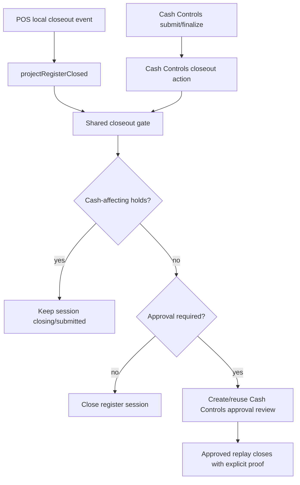
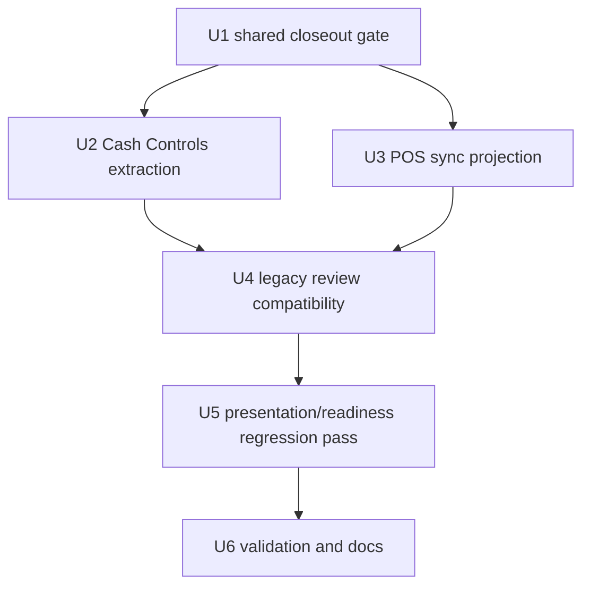

# fix: Collapse POS and Cash Controls closeout gating

## Summary

Closeout variance policy should have one server-owned gate. Today Cash Controls applies the store cash-controls threshold and manager-signoff flags, while POS local-sync projection routes every non-zero closeout variance into a separate sync-review path. The work should extract the Cash Controls closeout policy into a pure Convex helper and make both Cash Controls and POS local-sync projection consume that helper before deciding whether a register session can close, must wait on cash-impacting holds, or needs manager approval.

---

## Problem Frame

Athena currently has two register-session closeout paths:

- Cash Controls closeouts compute variance policy from store configuration, including `varianceApprovalThreshold`, `requireManagerSignoffForAnyVariance`, `requireManagerSignoffForOvers`, and `requireManagerSignoffForShorts`.
- POS local-first closeouts save a local `register_closed` event. During sync, `projectRegisterClosed` treats any non-zero variance as `register_closeout_variance` review, regardless of the Cash Controls threshold policy.

That means a variance below the configured threshold can close through Cash Controls but becomes a manager-review conflict when it originated from POS. This is a money lifecycle divergence: the source of the closeout should not determine whether manager approval is required.

---

## Requirements

- R1. Cash Controls and POS local-sync projection must evaluate closeout variance with the same server-side policy and config defaults.
- R2. Absent store configuration must preserve the current Cash Controls defaults, including `varianceApprovalThreshold: 5000` and manager signoff flags defaulting to false.
- R3. Under-threshold POS closeout variance must close during sync when no other closeout holds require waiting.
- R4. Approval-required POS closeout variance must route through a single Cash Controls-owned review/approval semantic, not a second independent POS variance rule.
- R5. Cash-affecting closeout holds must remain higher priority than variance approval; pending voids, cash-affecting item adjustments, and repairable mapping holds keep the register session unresolved.
- R6. Legacy `register_closeout_variance` sync conflicts must remain resolvable after the change.
- R7. Duplicate or ambiguous closeout uploads must keep their existing conflict/reject behavior and must not be mistaken for policy-approved variance.
- R8. POS local-first continuity must remain intact: the cashier can submit closeout locally, unresolved local-only closeout still blocks the old drawer, and synced/review-owned closeout evidence must not strand replacement drawers.
- R9. Manager review evidence must remain session-targeted and include enough closeout facts for an operator to trust the decision.
- R10. Implementation must include focused Vitest coverage for the shared gate, Cash Controls behavior preservation, POS projection outcomes, holds priority, legacy review compatibility, and relevant presentation regressions.

---

## Scope Boundaries

- This plan does not redesign POS closeout UI. POS can continue to save closeout locally and let sync reconcile the server decision.
- This plan does not change sale usability for `closing`, `closeout_rejected`, or `closed` register sessions.
- This plan does not automatically backfill or rewrite historical `register_closeout_variance` conflicts.
- This plan does not change Daily Close completion policy except where existing register-session closeout holds already feed Daily Close readiness.
- This plan does not broaden Terminal Health or self-heal authority to resolve business facts such as closeout variance or manager approval.
- This plan does not import Cash Controls Convex mutations into POS projection. The shared boundary must be a pure helper.

### Deferred to Follow-Up Work

- A cleanup migration for old under-threshold `register_closeout_variance` conflicts, if operators report stale review queues after rollout.
- Broader Cash Controls information-architecture changes beyond the review evidence needed for this closeout gate.
- Any change to inline POS manager approval. The initial implementation keeps POS local-first and handles approval asynchronously through server review.

---

## Context & Research

### Relevant Code and Patterns

- `packages/athena-webapp/src/lib/pos/presentation/register/useRegisterViewModel.ts` submits POS closeout locally and calls Cash Controls directly only for zero variance with a cloud register-session id.
- `packages/athena-webapp/src/lib/pos/infrastructure/local/localCommandGateway.ts` writes the local `register.closeout_started` fact.
- `packages/athena-webapp/src/lib/pos/infrastructure/local/syncContract.ts` converts that local fact into the synced `register_closed` event.
- `packages/athena-webapp/convex/pos/application/sync/projectLocalEvents.ts` owns `projectRegisterClosed`, computes expected/counted variance, applies closeout holds, currently conflicts any non-zero variance unless `allowRegisterCloseoutVarianceProjection` is true, and appends closeout records when projection closes.
- `packages/athena-webapp/convex/cashControls/closeouts.ts` currently owns `getCashControlsConfig`, `buildRegisterSessionCloseoutReview`, manager approval requirements, closeout submission, and finalization.
- `packages/athena-webapp/convex/pos/application/sync/registerSessionCloseoutHolds.ts` already provides shared cash-affecting hold facts for pending sale voids, pending item adjustments, and repairable missing mappings.
- `packages/athena-webapp/convex/cashControls/deposits.ts` resolves legacy synced register review items and replays projection with `allowRegisterCloseoutVarianceProjection`.
- `packages/athena-webapp/convex/pos/application/sync/types.ts` and `packages/athena-webapp/convex/pos/infrastructure/repositories/localSyncRepository.ts` already expose `getStore`, so POS projection can read the same store config without a new broad repository abstraction.
- `packages/athena-webapp/shared/registerSessionLifecyclePolicy.ts` owns lifecycle/review classification such as `REGISTER_CLOSEOUT_VARIANCE_SYNC_REVIEW_SUMMARY`; it should remain lifecycle classification, not the store-config closeout gate.

### Institutional Learnings

- `docs/solutions/architecture/athena-pos-closeout-hold-boundary-2026-07-01.md`: cash-impacting closeout holds should live in one server-side summary boundary that feeds Cash Controls finalization, deposits, register snapshots, POS drawer gates, and Daily Operations readiness.
- `docs/solutions/logic-errors/athena-register-closeout-generic-holds-2026-06-26.md`: new closeout gates should be shared hold or policy providers, not one-off branches in closeout, deposit, or projection code.
- `docs/solutions/architecture/athena-pos-register-lifecycle-policy-2026-06-23.md`: drawer lifecycle rules drift when local models, projection, and Cash Controls each encode their own version.
- `docs/solutions/logic-errors/athena-pos-synced-closeout-readiness-2026-06-17.md`: local-first readiness should block only unresolved local closeout work; once the matching closeout event syncs, prior drawer state should not block the next drawer path.
- `docs/solutions/logic-errors/athena-register-closeout-review-targeting-and-money-inputs-2026-06-27.md`: manager review actions should use session-targeted evidence, not capped store-wide scans.
- `docs/solutions/logic-errors/athena-pos-sync-settlement-contract-2026-06-27.md`: `projected`, `conflicted`, `held`, and `rejected` sync outcomes need distinct settlement semantics.

### External References

- None. Existing Athena POS, Convex, Cash Controls, and institutional solution docs are the source of truth.

---

## Key Technical Decisions

- **Extract a pure closeout gate:** Create `packages/athena-webapp/convex/operations/registerSessionCloseoutGate.ts` for store-config normalization and closeout variance review. Cash Controls and POS projection both call this helper.
- **Keep the gate server-owned:** The frontend POS submit path remains local-first. It should not try to reimplement the threshold or manager-signoff rule in browser code.
- **Treat holds before variance approval:** POS projection and Cash Controls should both ask for cash-affecting closeout holds before closing. Holds keep the session `closing`/submitted and defer final close, even if variance is under threshold.
- **Close under-threshold POS variance:** When the shared gate says manager approval is not required and there are no holds, `projectRegisterClosed` should close and map the synced local closeout just like a zero-variance closeout.
- **Use one approval semantic for required variance:** When the shared gate says approval is required, POS sync must call a Cash Controls-owned helper, such as `createOrReuseRegisterSessionVarianceReview`, for that register session. It should not create a parallel POS-only threshold rule. Legacy sync conflicts remain readable and resolvable only for historical rows.
- **Make POS-created approval ownership durable:** A policy-required POS closeout is settled as a synced projection only after the Cash Controls review packet and register-session ownership state are persisted together. The register session remains `closing`; the local sync event is `projected` with a closeout mapping; the unresolved business state is represented by `managerApprovalRequestId`, `closeoutOwnedAt`, and `closeoutOwnershipSource: "approval_request"`.
- **Preserve approved replay narrowly:** `allowRegisterCloseoutVarianceProjection` remains the explicit replay escape hatch used after an approved legacy `register_closeout_variance` review. It bypasses only the variance-approval decision; it must not bypass identity checks, duplicate closeout checks, stale-session checks, or cash-affecting holds.
- **Keep lifecycle classification separate:** `shared/registerSessionLifecyclePolicy.ts` can continue naming review summaries and sale/replacement behavior, but it should not become the cash-controls config reader.
- **Avoid schema churn unless implementation proves it necessary:** Start with existing session/store indexes and `approvalRequest.by_registerSessionId`. Add an index only if the implementation cannot query approval state safely and narrowly.
- **No automatic historical rewrite:** Existing open `register_closeout_variance` conflicts stay in the existing manager-review path. The behavior change stops producing new conflicts when the shared gate would allow closure.

---

## Open Questions

### Resolved During Planning

- **Should under-threshold POS variance close during sync?** Yes. That is the parity fix; the source path should not force manager review when Cash Controls policy would not.
- **Should POS calculate the threshold in browser code?** No. POS remains local-first and the server sync projection applies the shared gate.
- **Should cash-affecting holds be subordinate to variance approval?** No. Holds are higher priority because expected cash can still change before final closure.
- **Should existing legacy conflicts be rewritten?** No for this slice. They remain resolvable through the existing Cash Controls review path.

### Deferred to Implementation

- If current approval helpers are too mutation-specific to reuse from projection, implementation should extract a small Cash Controls-owned helper with the persistence contract below instead of importing public mutation code into POS projection.
- Whether presentation component code needs updates depends on whether existing review copy is currently shown for all non-zero synced closeout variance or only true approval/review states; the test commands are required either way.

### Approval-Required POS Sync Persistence Contract

When POS projection sees no cash-affecting holds and the shared gate returns `approval_required`, implementation must persist one Cash Controls-owned review owner with these rules:

- Reuse an existing pending `variance_review` for the same `registerSessionId` and identical closeout facts.
- Never insert a second approval request when the same `localEventId` retries.
- If a second closeout event targets the same register session with different counted cash, notes, or closeout facts, reject or conflict it before policy approval. Do not replace or cancel the existing approval in this slice.
- Patch the register session with `status: "closing"`, `countedCash`, `variance`, `notes`, `managerApprovalRequestId`, `closeoutOwnedAt`, `closeoutOwnershipSource: "approval_request"`, and the closeout operating-date fields used by Cash Controls closeout ownership.
- Store review metadata with `countedCash`, `expectedCash`, `variance`, `notes`, `localEventId`, `localRegisterSessionId`, `terminalId`, `closeoutOccurredAt`, `syncOrigin: "local_sync"`, and the shared gate decision/reason.
- Return POS projection status `projected`, create the closeout mapping, and create no `posLocalSyncConflict`. The unresolved business state lives on the closing register session and its linked approval request.

---

## High-Level Technical Design

The gate should normalize facts into one decision vocabulary:

| Decision | Meaning | POS sync behavior | Cash Controls behavior |
| --- | --- | --- | --- |
| `blocked_by_holds` | Closeout facts are submitted, but cash-impacting work can still change expected cash. | Patch session to `closing`, preserve submitted closeout evidence, do not append final closeout records. | Return submitted/unresolved state or block finalization with hold copy. |
| `approval_required` | Counted cash variance requires manager approval by shared policy. | Persist/reuse one Cash Controls review owner, patch the session to `closing` with `managerApprovalRequestId`, return `projected`, create a closeout mapping, and create no POS sync conflict. | Create/reuse approval request or require valid manager proof. |
| `close_allowed` | No holds and no policy-required approval. | Project as closed, map local event, record closeout evidence. | Close/finalize immediately. |
| `projection_conflict` | Duplicate, ambiguous, stale, or identity-mismatched sync event. | Keep existing sync conflict/reject behavior. | Not applicable to direct Cash Controls closeout. |

---

## Implementation Units

- U1. **Create the Shared Closeout Gate**

**Goal:** Extract closeout config normalization and variance-review policy into a pure helper that can be used by Cash Controls and POS projection.

**Requirements:** R1, R2, R9, R10

**Dependencies:** None

**Files:**
- Create: `packages/athena-webapp/convex/operations/registerSessionCloseoutGate.ts`
- Create: `packages/athena-webapp/convex/operations/registerSessionCloseoutGate.test.ts`
- Modify: `packages/athena-webapp/convex/cashControls/closeouts.ts` only to remove duplicated local helper ownership after U2

**Approach:**
- Move or re-create the pure parts of `getCashControlsConfig` and `buildRegisterSessionCloseoutReview` in the new operations helper.
- Keep helper inputs plain: store document/config, expected cash, counted cash, optional submitted note/evidence context.
- Return a typed result with normalized config, rounded variance, direction flags, threshold status, and `requiresApproval`.
- Keep Convex mutation side effects, approval-request creation, and operator copy outside the pure helper.
- Keep approval-review persistence out of this helper; that belongs to the Cash Controls-owned review helper in U2.
- Preserve the exact default threshold and signoff behavior currently covered in `cashControls/closeouts.test.ts`.

**Execution note:** Test this helper first with existing Cash Controls threshold cases before changing projection.

**Patterns to follow:**
- Current `getCashControlsConfig` and `buildRegisterSessionCloseoutReview` in `packages/athena-webapp/convex/cashControls/closeouts.ts`.
- Existing pure-operation tests under `packages/athena-webapp/convex/operations`.

**Test scenarios:**
- Default config allows exact count and small non-zero variance below `5000`.
- Variance over `varianceApprovalThreshold` requires approval.
- `requireManagerSignoffForAnyVariance` requires approval for any non-zero variance.
- `requireManagerSignoffForOvers` applies only to overages.
- `requireManagerSignoffForShorts` applies only to shortages.
- Rounded zero variance remains no-approval.

**Verification:**
- From `packages/athena-webapp`: `bun run test -- convex/operations/registerSessionCloseoutGate.test.ts`

---

- U2. **Wire Cash Controls to the Shared Gate**

**Goal:** Preserve existing Cash Controls submit/finalize behavior while moving policy ownership out of `cashControls/closeouts.ts`.

**Requirements:** R1, R2, R5, R9, R10

**Dependencies:** U1

**Files:**
- Modify: `packages/athena-webapp/convex/cashControls/closeouts.ts`
- Modify: `packages/athena-webapp/convex/cashControls/closeouts.test.ts`
- Modify: `packages/athena-webapp/convex/pos/application/sync/types.ts` if `SyncProjectionRepository` needs an explicit `createOrReuseRegisterSessionVarianceReview` or `ensureRegisterSessionVarianceApprovalRequest` capability
- Modify: `packages/athena-webapp/convex/pos/infrastructure/repositories/localSyncRepository.ts` if POS projection needs the repository implementation for the Cash Controls-owned helper
- Modify: `packages/athena-webapp/convex/cashControls/deposits.ts` only if imports or legacy review metadata need alignment
- Modify: `packages/athena-webapp/convex/cashControls/deposits.test.ts` only if U4 touches legacy conflict resolution

**Approach:**
- Replace local config/review helper calls with imports from `convex/operations/registerSessionCloseoutGate.ts`.
- Extract or expose a Cash Controls-owned `createOrReuseRegisterSessionVarianceReview` helper for POS projection to call through the sync repository boundary.
- Make that helper idempotent by `registerSessionId`, `localEventId`, and closeout facts; identical retry reuses the pending request, while changed closeout facts for the same session conflict/reject before approval.
- Persist approval metadata and the register-session ownership patch together: `status: "closing"`, counted/variance/notes, `managerApprovalRequestId`, `closeoutOwnedAt`, `closeoutOwnershipSource: "approval_request"`, and closeout operating-date fields.
- Keep submit and finalize semantics the same: holds block final closure, approval-required variance creates or reuses approval flow, no-approval variance closes.
- Recompute the shared gate at finalization after holds resolve, because expected cash can change while closeout is submitted.
- Keep manager authorization and proof validation inside Cash Controls mutations.
- Keep approval evidence session-targeted and store-scoped.

**Execution note:** This unit should be behavior-preserving. Any Cash Controls test change should be rename/import fallout or stronger assertions, not a product behavior change.

**Patterns to follow:**
- Existing submit/finalize tests in `packages/athena-webapp/convex/cashControls/closeouts.test.ts`.
- `docs/solutions/logic-errors/athena-cash-controls-closeout-review-ia-2026-06-08.md`.

**Test scenarios:**
- Existing default threshold and signoff tests still pass through the shared helper.
- Submitted closeout with cash-affecting holds remains submitted/unclosed.
- Finalization recomputes closeout policy after holds resolve.
- Approval-required closeout still requires valid manager authority or proof.

**Verification:**
- From `packages/athena-webapp`: `bun run test -- convex/cashControls/closeouts.test.ts`

---

- U3. **Route POS Local-Sync Closeout Projection Through the Gate**

**Goal:** Make POS synced closeout projection use the same threshold/signoff policy as Cash Controls.

**Requirements:** R1, R2, R3, R4, R5, R7, R8, R9, R10

**Dependencies:** U1, U2

**Files:**
- Modify: `packages/athena-webapp/convex/pos/application/sync/projectLocalEvents.ts`
- Modify: `packages/athena-webapp/convex/pos/application/sync/types.ts` only if the repository contract needs a typed adjustment
- Modify: `packages/athena-webapp/convex/pos/application/sync/projectLocalEvents.test.ts`

**Approach:**
- In `projectRegisterClosed`, keep duplicate closeout and identity checks ahead of policy evaluation.
- Continue listing cash-affecting closeout holds with `listRegisterSessionCloseoutHolds`.
- Fetch the store with the existing repository `getStore` capability and pass its cash-controls config into the shared gate.
- If holds exist, keep the current submitted/closing behavior and do not close or create approval.
- If no holds and the gate returns no approval required, close the register session, append closeout records, map the local event, and record `register_session_closed`.
- If no holds and approval is required, call the Cash Controls-owned review helper, patch the session to `closing` with `managerApprovalRequestId`, set counted/variance/notes and closeout ownership fields, create the closeout mapping, return `projected`, and create no `posLocalSyncConflict`.
- Keep the unsettled business work represented by the linked Cash Controls approval request, not by the sync-event status.
- Keep `allowRegisterCloseoutVarianceProjection` as the explicit manager-approved replay path for legacy conflicts. It bypasses only the variance-approval branch and must still honor identity, duplicate, stale-session, and hold checks.

**Execution note:** This is the behavior-changing unit. Add characterization for the current blanket non-zero variance conflict, then replace it with threshold-aware expected behavior.

**Patterns to follow:**
- Existing closeout hold branch in `projectRegisterClosed`.
- `packages/athena-webapp/convex/pos/application/sync/registerSessionCloseoutHolds.ts`.
- Existing reviewed-variance projection path using `allowRegisterCloseoutVarianceProjection`.

**Test scenarios:**
- Non-zero variance below the default threshold projects closed, creates mapping, records `register_session_closed`, and creates no `posLocalSyncConflict`.
- Variance over threshold keeps the session unresolved and routes to Cash Controls approval semantics.
- Approval-required POS variance returns `projected`, creates exactly one pending `variance_review` approval request, writes one `managerApprovalRequestId`, creates one closeout mapping, and creates no POS sync conflict.
- Retrying the same `localEventId` reuses the existing approval request and does not duplicate review or timeline evidence.
- A second closeout event for the same session with different counted cash, notes, or closeout facts conflicts/rejects before policy approval.
- Store config requiring manager signoff for any variance is honored by POS sync.
- Store config requiring manager signoff for overs applies to overages but not shortages.
- Store config requiring manager signoff for shorts applies to shortages but not overages.
- Pending completed-sale void approvals keep the closeout submitted/unfinalized even when variance is under threshold.
- Pending cash-affecting item adjustments keep the closeout submitted/unfinalized even when variance is under threshold.
- Repairable missing mapping holds keep the closeout submitted/unfinalized.
- Duplicate closeout with mismatched count still conflicts/rejects as it does today.
- Manager-approved legacy replay with `allowRegisterCloseoutVarianceProjection` still projects.

**Verification:**
- From `packages/athena-webapp`: `bun run test -- convex/pos/application/sync/projectLocalEvents.test.ts -t "closeout"`

---

- U4. **Preserve Legacy Review Resolution and Deposit Safety**

**Goal:** Keep existing `register_closeout_variance` review rows actionable while preventing new under-threshold POS closeouts from entering that legacy path.

**Requirements:** R4, R5, R6, R8, R9, R10

**Dependencies:** U2, U3

**Files:**
- Modify: `packages/athena-webapp/convex/cashControls/deposits.ts`
- Modify: `packages/athena-webapp/convex/cashControls/deposits.test.ts`
- Modify: `packages/athena-webapp/convex/pos/application/sync/projectLocalEvents.test.ts` for replay coverage if not completed in U3

**Approach:**
- Leave historical `register_closeout_variance` conflict resolution intact.
- Preserve the approved replay call to `projectLocalSyncEvent` with `allowRegisterCloseoutVarianceProjection`.
- Ensure deposits remain blocked by unresolved cash-affecting closeout holds and unresolved approval-required closeout review.
- Make deposit/read-model code consume POS-sync-created approval packets through the same session-targeted lookup used by closeouts.
- Avoid capped store-wide conflict scans for deciding current actionability.

**Execution note:** This unit is mostly compatibility. It should not resurrect the old blanket non-zero POS variance rule.

**Patterns to follow:**
- `docs/solutions/logic-errors/athena-register-closeout-review-targeting-and-money-inputs-2026-06-27.md`.
- Existing `allowRegisterCloseoutVarianceProjection` deposit-review tests.

**Test scenarios:**
- A historical `register_closeout_variance` conflict remains approvable and replays projection.
- Rejected historical variance conflict remains rejected and does not close.
- Deposits cannot be recorded while closeout holds remain cash-affecting.
- Deposits cannot treat an approval-required closeout as closed before approval.
- Deposits remain blocked while the session is `closing` with unresolved POS-sync-created approval review.

**Verification:**
- From `packages/athena-webapp`: `bun run test -- convex/cashControls/deposits.test.ts -t "closeout"`

---

- U5. **Presentation, Readiness, and Continuity Regression Pass**

**Goal:** Make sure the shared server decision does not create stale review copy or block replacement drawer continuity.

**Requirements:** R8, R9, R10

**Dependencies:** U3, U4

**Files:**
- Modify: `packages/athena-webapp/shared/registerSessionLifecyclePolicy.test.ts` only if lifecycle classification needs a narrowed review state
- Modify: `packages/athena-webapp/src/lib/pos/presentation/register/useRegisterViewModel.test.ts` only if closeout submit presentation changes
- Modify: `packages/athena-webapp/src/lib/pos/presentation/syncStatusPresentation.test.ts` only if sync-review copy changes
- Modify: `packages/athena-webapp/src/components/cash-controls/RegisterSessionView.test.tsx` only if Cash Controls review evidence display changes
- Modify: `packages/athena-webapp/src/components/cash-controls/CashControlsDashboard.test.tsx` only if dashboard closeout status changes

**Approach:**
- Confirm under-threshold projected closeouts do not display manager-review copy after sync.
- Confirm approval-required closeouts display one calm Cash Controls review state.
- Confirm a newer replacement drawer remains sale-usable when the prior drawer is synced/review-owned and identities differ.
- Keep product copy aligned with `docs/product-copy-tone.md`.

**Execution note:** Do not broaden UI work unless tests reveal stale or misleading operator copy.

**Patterns to follow:**
- Existing POS continuity tests around closeout review residue.
- `docs/product-copy-tone.md`.

**Test scenarios:**
- Under-threshold POS variance no longer appears as a manager-review sync conflict.
- Approval-required variance still points operators to the closeout review action.
- Replacement drawer continuity remains intact while prior closeout review is pending.
- Daily Close/Daily Operations readiness treats under-threshold POS variance as closed after projection and approval-required POS variance as Cash Controls approval-owned, not as legacy `register_closeout_variance` sync review.

**Verification:**
- From `packages/athena-webapp`: `bun run test -- shared/registerSessionLifecyclePolicy.test.ts`
- From `packages/athena-webapp`: `bun run test -- src/lib/pos/presentation/syncStatusPresentation.test.ts`
- From `packages/athena-webapp`: `bun run test -- src/components/pos/register/POSRegisterView.test.tsx -t "closeout"`
- From `packages/athena-webapp`: `bun run test -- src/components/pos/register/RegisterDrawerGate.test.tsx -t "closeout"`
- From `packages/athena-webapp`: `bun run test -- src/components/cash-controls/RegisterSessionView.test.tsx -t "closeout"`
- From `packages/athena-webapp`: `bun run test -- src/components/cash-controls/CashControlsDashboard.test.tsx -t "closeout"`
- From `packages/athena-webapp`: `bun run test -- convex/operations/dailyClose.test.ts -t "closeout"`
- From `packages/athena-webapp`: `bun run test -- convex/operations/dailyOperations.test.ts -t "closeout"`

---

- U6. **Validation, Graph, and Documentation**

**Goal:** Prove the behavior through focused tests and capture durable knowledge for future closeout gates.

**Requirements:** R10

**Dependencies:** U1, U2, U3, U4, U5

**Files:**
- Add or update: `docs/solutions/logic-errors/athena-register-closeout-shared-gate-2026-07-01.md`
- Generated as required: `packages/athena-webapp/convex/_generated/*` if Convex API shape changes
- Generated as required: `graphify-out/*` after code changes

**Approach:**
- Run the focused Vitest files for the shared gate, Cash Controls closeouts, POS projection, deposits, and any touched presentation tests.
- If Convex public API shape changes, regenerate from `packages/athena-webapp` using the repo-approved command.
- Because implementation will modify code files, run `bun run graphify:rebuild` from the repo root before final delivery.
- Add a concise solution note recording the shared gate invariant and the no-duplicate-review rule.

**Verification:**
- From `packages/athena-webapp`: `bun run test -- convex/operations/registerSessionCloseoutGate.test.ts`
- From `packages/athena-webapp`: `bun run test -- convex/cashControls/closeouts.test.ts`
- From `packages/athena-webapp`: `bun run test -- convex/pos/application/sync/projectLocalEvents.test.ts -t "closeout"`
- From `packages/athena-webapp`: `bun run test -- convex/cashControls/deposits.test.ts -t "closeout"`
- From `packages/athena-webapp`: `bun run test -- convex/operations/dailyClose.test.ts -t "closeout"`
- From `packages/athena-webapp`: `bun run test -- convex/operations/dailyOperations.test.ts -t "closeout"`
- From `packages/athena-webapp`: run the required U5 presentation/readiness commands listed above.
- From repo root after code changes: `bun run graphify:rebuild`
- From repo root before PR: `bun run pr:athena`

---

## Rollout Strategy

1. Ship the shared gate extraction and Cash Controls import swap first inside the same PR as POS projection changes, so there is no intermediate state where two policies continue to drift.
2. Deploy Convex and web together after tests pass. Convex should remain tolerant of older browsers because the POS browser still uploads the same local closeout event shape.
3. Monitor Cash Controls review counts for `register_closeout_variance` after deploy. New under-threshold POS closeouts should stop entering that legacy review lane.
4. If stale historical under-threshold conflicts remain operationally noisy, plan a separate cleanup/backfill with explicit operator sign-off.

---

## Risk Register

| Risk | Impact | Mitigation |
| --- | --- | --- |
| POS projection creates both a sync conflict and a Cash Controls approval request for the same closeout. | Duplicate review queues and inconsistent manager actions. | U3 requires one approval semantic and tests no new `posLocalSyncConflict` for policy-managed variance. |
| Under-threshold variance closes before pending cash-affecting work resolves. | Final expected cash can be wrong. | Holds are evaluated before variance approval/closure in both paths. |
| Shared helper accidentally changes Cash Controls defaults. | Existing stores see changed manager-review behavior. | U1/U2 preserve existing threshold/signoff tests before POS behavior changes. |
| Legacy variance conflicts become unresolvable. | Existing review queues strand closeouts. | U4 preserves `allowRegisterCloseoutVarianceProjection` replay. |
| Store-wide scans decide current closeout actionability. | Large sync backlogs hide or misroute reviews. | Require session-targeted reads for approval/review packets. |
| POS continuity regresses for replacement drawers. | Cashiers cannot continue after prior drawer closeout review. | U5 includes replacement drawer continuity regression checks. |
| Approval-required POS sync marks too little as settled and retries side effects. | Duplicate approvals, duplicate timeline evidence, or repeated closing patches. | U2/U3 require idempotent review creation, projected sync status, a closeout mapping, and retry tests. |

---

## Confidence

- **Confidence:** High for the shared-gate extraction and POS threshold parity.
- **Reasoning:** All three research passes converged on the same boundary: a pure server closeout gate consumed by Cash Controls and POS projection, with holds evaluated first and legacy conflict resolution preserved.
- **Main implementation unknown:** the cleanest way to create/reuse Cash Controls approval evidence from POS sync without duplicating mutation-specific logic. This is contained to U2/U3 and should be solved by extracting a small Cash Controls-owned review builder if the existing submit path is too coupled.

---

## Reviewer Loop

- Initial research agents:
  - Repo research: complete.
  - Institutional learnings: complete.
  - Flow analysis: complete.
- Plan reviewers:
  - Scope review: approved initial plan.
  - Feasibility review: requested explicit POS approval-required settlement and repository/helper boundary; incorporated.
  - Data-integrity review: requested durable approval persistence contract and narrow legacy replay; incorporated.
  - Testing review: requested concrete readiness/presentation commands and negative-path assertions; incorporated.
  - Second pass: feasibility, data-integrity, testing, and scope reviewers approved unanimously.
