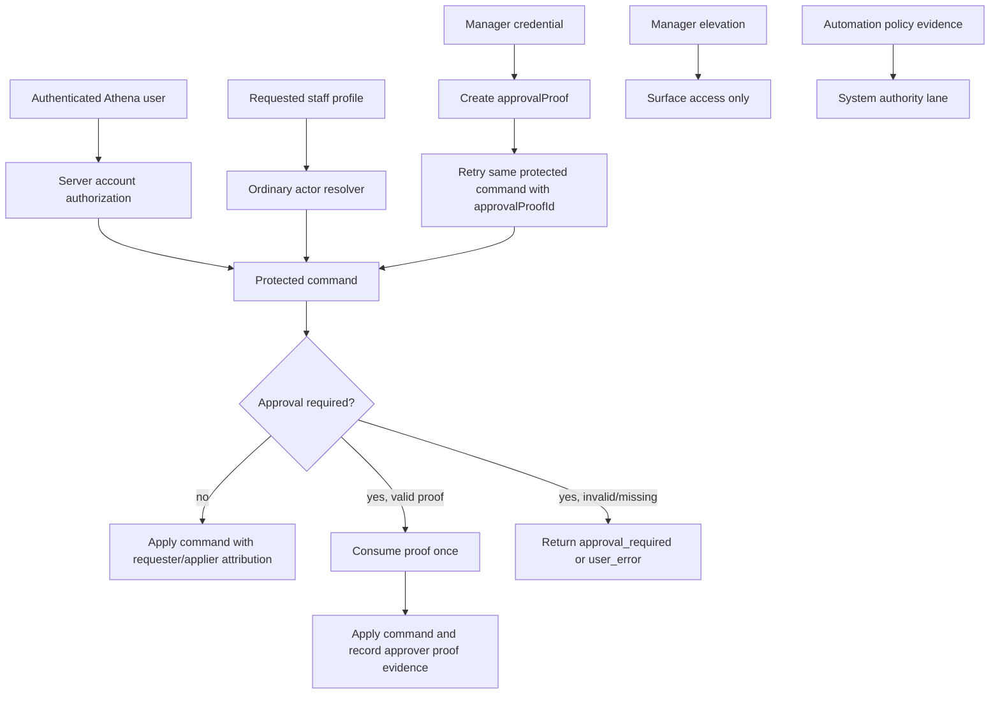
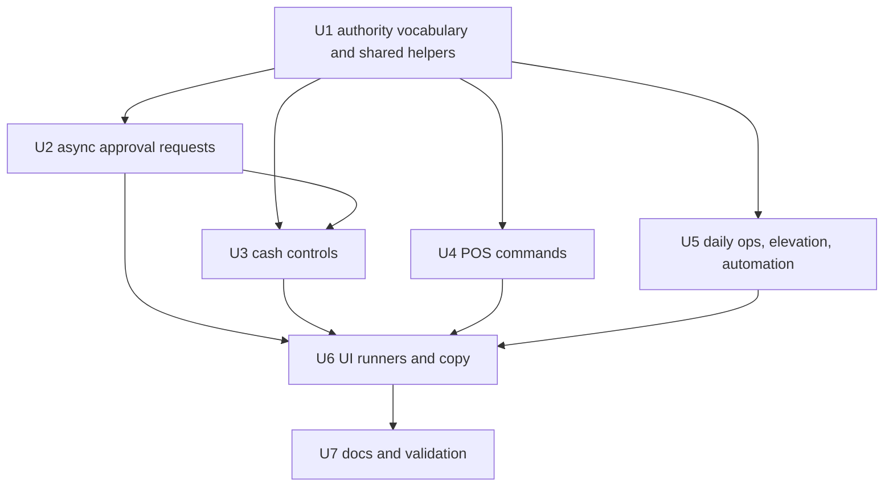

# refactor: Standardize manager approval identity

## Summary

Manager approval should be one foundational server-owned authority contract across Athena, not a set of per-flow interpretations of a signed-in Athena user, a staff profile, a manager credential, and a consumed proof.

The current code does not appear to auto-link the signed-in Athena user to the staff profile that approves a request. The validated gap is subtler and more dangerous: ordinary actor attribution, manager credential authentication, manager elevation, async approval decisions, automation evidence, and proof-backed approval authority are all real concepts, but their names and persistence semantics drift by flow. That drift makes it easy for future work to treat the signed-in app user, the requesting staff profile, the reviewing user, or the approving manager staff profile as interchangeable.

This plan standardizes manager approval at the foundation by defining one authority vocabulary and shared server-side helpers, then migrates the high-risk consumers to record requester, approver, reviewer, applier, proof, request, and automation evidence without overloading `actorStaffProfileId`.

---

## Problem Frame

Athena already has the right approval primitive:

- A protected command returns `approval_required`.
- The UI authenticates a manager credential and mints a short-lived `approvalProof`.
- The same protected command is retried with `approvalProofId`.
- The backend consumes that proof once after validating store, action, subject, role, requester, and expiry.

The issue is that consumers do not consistently describe which identity performed which role. Examples from current code and prior session findings:

- `approvalProof` correctly stores `approvedByStaffProfileId` and `approvedByCredentialId`, not `approvedByUserId`.
- Async approval requests store both `reviewedByUserId` and `reviewedByStaffProfileId`, but the intended meaning is not centralized.
- Cash Controls and Daily Operations can record event actor fields with the approving manager in some cases and the requester/operator in others.
- POS transaction flows often distinguish requester and approver more clearly, but they should become characterization examples rather than isolated best cases.
- Manager elevation is terminal-scoped surface access. It must never satisfy command approval.
- Automation policy evidence is not a fake staff profile and not a manager approval proof.

The foundational standard should make the safe path obvious: use the signed-in Athena user for session/account authorization, use linked staff profile validation for ordinary actor attribution, use manager credentials to mint proof-backed approval, and use consumed proofs as the only source of manager approval authority for command execution.

---

## Requirements

- R1. Manager approval authority must be derived server-side from a consumed `approvalProof`, with the approving manager identity coming from `approvedByStaffProfileId` and credential evidence from `approvedByCredentialId`.
- R2. The signed-in Athena user must remain session/account authorization and submitter/reviewer attribution. It must not become the approving manager identity unless a flow explicitly models that separately through staff credential proof.
- R3. Ordinary actor attribution must validate that a staff profile is allowed to act for the signed-in user or authenticated local staff context, and must stay separate from approval authority.
- R4. Manager elevation must remain route/surface capability. No command may treat `managerElevationId` as proof-backed manager approval.
- R5. Async approval decisions must explicitly distinguish the reviewer account, the decision proof, the approving manager staff profile, and the original domain request.
- R6. Domain events and durable records must use consistent identity fields: `requestedBy*`, `approvedBy*`, `reviewedBy*`, `appliedBy*`, and `actor*` only when the actor meaning is unambiguous in that table/event.
- R7. Proof-backed command flows must continue to retry the same command with `approvalProofId`; the implementation must not introduce parallel manager-only mutations.
- R8. Automation and policy evidence must remain a separate authority lane and must not create synthetic manager staff attribution.
- R9. High-risk consumers must be audited and migrated: Cash Controls closeouts/deposits, POS protected commands, async operations queue decisions, Daily Close/Opening, manager elevation/capability checks, and relevant approval UI runners.
- R10. Regression coverage must prove that a signed-in Athena user linked to Staff A can request an action while Staff B approves it, without linking Staff B to the app user or recording Staff A as the approving manager.
- R11. Regression coverage must prove fail-closed behavior for mismatched store/action/subject/role/requester, expired proofs, consumed proofs, and attempts to use manager elevation or raw staff profile ids as approval authority.
- R12. The plan must preserve existing shipped policy choices such as self-approval where already allowed, unless a later product/security decision changes the policy explicitly.
- R13. Async approval decisions and durable financial/POS/Daily Operations records must store first-class approval evidence where auditors read from, not rely on untyped metadata alone.

---

## Scope Boundaries

- This plan does not replace the `approvalProof` system.
- This plan does not change manager approval thresholds, action keys, required roles, proof TTL, or self-approval policy by default.
- This plan does not create offline manager approval.
- This plan does not redesign approval UI. UI changes are limited to supporting the standardized authority contract and consistent copy/states.
- This plan does not give manager elevation command authority.
- This plan does not make automation impersonate staff or managers.
- This plan does not require broad schema redesign. It does require narrow additive typed fields where durable audit evidence is currently only inferable or metadata-only.
- This plan does not rewrite historical approval/audit records.

### Deferred to Follow-Up Work

- Product/security reconsideration of self-approval by action.
- Data backfill or historical audit normalization for older records.
- Broader Operations Queue information architecture beyond clarifying decision identity.
- Offline approval support.
- Organization-wide reporting dashboards over the standardized approval lifecycle.

---

## Context & Research

### Current Approval Foundation

- `packages/athena-webapp/shared/approvalPolicy.ts` defines approval actions and policy vocabulary.
- `packages/athena-webapp/shared/commandResult.ts` carries `approval_required` command results.
- `packages/athena-webapp/convex/operations/approvalActions.ts` bridges command-bound approval actions and proof consumption.
- `packages/athena-webapp/convex/operations/approvalProofs.ts` creates and consumes one-use approval proofs.
- `packages/athena-webapp/convex/operations/staffCredentials.ts` authenticates staff credentials and mints approval proofs.
- `packages/athena-webapp/convex/operations/approvalRequests.ts` owns async approval request decisions.
- `packages/athena-webapp/convex/operations/approvalAuditEvents.ts` records generic approval lifecycle events.
- `packages/athena-webapp/convex/schema.ts` stores `approvalProof.approvedByStaffProfileId` and `approvalProof.approvedByCredentialId`.

### Identity and Access Boundaries

- `packages/athena-webapp/convex/lib/athenaUserAuth.ts` derives the authenticated Athena user server-side.
- `packages/athena-webapp/convex/operations/staffProfiles.ts` and `packages/athena-webapp/convex/schemas/operations/staffProfile.ts` own staff profile records and `linkedUserId`.
- `packages/athena-webapp/convex/operations/managerElevations.ts` owns terminal-scoped manager elevation.
- `packages/athena-webapp/src/contexts/ManagerElevationContext.tsx` and `packages/athena-webapp/src/lib/access/capabilities.ts` consume elevation/capability state in the browser.

### High-Risk Consumers

- `packages/athena-webapp/convex/cashControls/closeouts.ts` resolves ordinary closeout actors and consumes manager proofs for closeout review/finalization.
- `packages/athena-webapp/convex/cashControls/deposits.ts` validates ordinary deposit actors and resolves register-session sync reviews.
- `packages/athena-webapp/convex/operations/dailyClose.ts`, `packages/athena-webapp/convex/operations/dailyOpening.ts`, `packages/athena-webapp/convex/operations/dailyOperations.ts`, and `packages/athena-webapp/convex/operations/dailyOperationsAutomation.ts` mix manual and automation authority.
- `packages/athena-webapp/convex/pos/application/commands/correctTransaction.ts`, `packages/athena-webapp/convex/pos/application/commands/completeTransaction.ts`, `packages/athena-webapp/convex/pos/application/commands/adjustTransactionItems.ts`, and `packages/athena-webapp/convex/pos/public/transactions.ts` are command-bound POS approval consumers.
- `packages/athena-webapp/src/components/operations/useApprovedCommand.tsx`, `packages/athena-webapp/src/components/operations/CommandApprovalDialog.tsx`, `packages/athena-webapp/src/components/operations/OperationsQueueView.tsx`, `packages/athena-webapp/src/components/operations/DailyCloseView.tsx`, `packages/athena-webapp/src/components/operations/DailyOpeningView.tsx`, `packages/athena-webapp/src/components/cash-controls/RegisterSessionView.tsx`, and `packages/athena-webapp/src/components/pos/transactions/TransactionView.tsx` are the relevant UI runners.

### Institutional Learnings

- `packages/athena-webapp/docs/agent/architecture.md`: inline manager approval must mint short-lived one-use proof through `staffCredentials` and `approvalProofs`; protected commands must consume proof before mutation; client-supplied `staffProfileId` is ordinary attribution, not approval.
- `packages/athena-webapp/docs/agent/code-map.md`: approval foundation, staff foundation, command approval tests, and manager elevation tests are first-class validation slices.
- `docs/solutions/logic-errors/athena-command-approval-policy-boundary-2026-05-01.md`: command approval belongs at the command boundary, not in UI-only checks or ad hoc mutations.
- `docs/solutions/logic-errors/athena-terminal-manager-elevation-command-boundary-2026-05-10.md`: manager elevation is access, not command approval.
- `docs/solutions/architecture/athena-eod-review-automation-completion-2026-06-22.md`: automation completion must use policy evidence and must not fabricate staff approval.
- `docs/solutions/architecture/athena-pos-closeout-hold-boundary-2026-07-01.md`: closeout and review state should be expressed through shared server-owned policy/evidence, not duplicated per surface.

### External References

- None. Existing Athena code, package-local Convex guidance, and institutional solution docs are the source of truth.

---

## Key Technical Decisions

- **Define authority lanes explicitly:** The implementation should standardize the six authority lanes in this plan: account session, ordinary staff actor, staff credential authentication, manager approval proof, manager elevation, and automation policy evidence.
- **Keep proof as the approval source:** `approvalProof.approvedByStaffProfileId` remains the canonical approving manager identity. Do not add or infer `approvedByUserId`.
- **Use signed-in user for authorization and submitter/reviewer attribution:** `reviewedByUserId` means the authenticated app account that submitted an async decision. It does not mean the manager who typed credentials unless explicitly paired with the proof approver.
- **Name async decision proof separately and durably:** A proof bound to subject type `approval_request` must be stored as a first-class decision proof id, not confused with a domain command proof bound to a transaction, register session, or daily operation.
- **Preserve admin gating for Operations Queue initially:** Async approval decisions should continue to require the current account-level `full_admin` reviewer gate unless product/security explicitly changes who may decide queued requests. Valid manager staff proof remains necessary but not sufficient for those queue decisions.
- **Standardize audit vocabulary before migration:** Consumers should agree that requester/applier is the operator who initiated/applied the business action, approver is the manager credential identity, reviewer is the app account or admin context that decided an async request, and automation is policy evidence.
- **Validate before proof consumption by default:** A proof can be consumed before downstream application fails today. The implementation should move stale, duplicate, terminal-state, and payload-fingerprint validation before proof consumption unless a race makes that impossible; the remaining post-consumption failure path must persist a named failure code and require fresh approval for retry.
- **Treat self-approval as policy, not accident:** Existing `selfApproval: "allowed"` behavior should be documented and tested per action, not silently changed in this refactor.
- **Require requester identity for POS/cash approvals:** POS and cash-control approval paths should not mint proof-backed approvals with an undefined requester when staff attribution is available and policy-sensitive.
- **Prefer additive clarity over schema churn:** Start with shared helpers, typed authority results, and metadata naming. Add schema fields only where a durable record cannot otherwise represent requester, approver, reviewer, applied actor, and proof evidence safely.

---

## Authority Standard

| Lane | Meaning | Trusted Source | May Approve Commands? | Example Fields |
| --- | --- | --- | --- | --- |
| Account session | Signed-in Athena user authorized to use an app surface or submit a decision | Convex auth plus `athenaUser` membership | No | `actorUserId`, `reviewedByUserId`, `requestedByUserId` |
| Ordinary staff actor | Staff profile acting as cashier/operator/requester for the business action | Linked staff/user validation or explicit local staff authentication | No | `actorStaffProfileId`, `requestedByStaffProfileId`, `appliedByStaffProfileId` |
| Staff credential authentication | Fresh credential check for a staff profile | `staffCredentials` authentication result | Only by minting proof | `approvedByCredentialId`, credential audit metadata |
| Manager approval proof | One-use action/subject/requester-bound approval evidence | Consumed `approvalProof` | Yes | `approvalProofId`, `approvedByStaffProfileId` |
| Manager elevation | Temporary terminal or route capability | `managerElevations` | No | `managerElevationId` |
| Automation policy evidence | System completion or policy-run evidence | Automation job and policy result | No human approval; separate system authority | `automationRunId`, policy evidence metadata |

---

## Durable Approval Evidence Contract

Durable records that auditors or operators use to explain a financial, POS, Cash Controls, or Daily Operations decision must contain typed approval evidence at that read boundary. Untyped `metadata` can carry extra context, but it cannot be the only place where proof authority is recorded.

### Async Approval Requests

`approvalRequest` should use this concrete write/read contract:

- Add `decisionApprovalProofId` as a top-level optional field pointing to the consumed proof for `operations.approval_request.decide`.
- Add `decisionApprovedByStaffProfileId` as a top-level optional field for the proof-backed manager approver.
- Keep `reviewedByUserId` as the signed-in account reviewer that submitted the queue decision.
- Keep `reviewedByStaffProfileId` as a legacy-compatible mirror of `decisionApprovedByStaffProfileId` during migration only; new code and UI should prefer `decisionApprovedByStaffProfileId`.
- Preserve original request identity through `requestedByUserId`, `requestedByStaffProfileId`, `requestType`, `subjectType`, `subjectId`, and domain-specific ids.
- Operations Queue readers should display reviewer account and manager approver as distinct identities when both are available, falling back to the legacy staff field only for old records.

### Domain Records and Snapshots

For Cash Controls, POS, and Daily Operations records, implementation must choose one of these explicit patterns per record type and document it in tests:

- Persist `approvalProofId` and `approvedByStaffProfileId` directly on the domain record, snapshot, or operational event that auditors read.
- Or persist an approval evidence object that includes proof id, approver staff profile id, decision proof id if applicable, requester/applier ids, action key, subject type/id, and approval request id.
- Or prove that the existing `approvalProof` subject linkage is the canonical audit source and make the domain snapshot/history include the proof id needed to join to it.

The default should be additive typed fields for high-risk financial records when the current read model would otherwise require digging through untyped metadata or reconstructing intent from event order.

---

## High-Level Technical Design

The intended implementation shape is a small shared server-side approval authority layer around the existing primitives:

- `resolveOrdinaryActorStaffProfile(...)` validates ordinary actor attribution for flows that accept staff profile ids.
- `consumeManagerApprovalAuthority(...)` wraps existing proof consumption and returns a typed authority result with `approvalProofId`, `approvedByStaffProfileId`, `approvedByCredentialId`, `requestedByStaffProfileId`, `actionKey`, `subjectType`, and `subjectId`.
- `assertNoElevationAsApproval(...)` or equivalent validation keeps `managerElevationId` out of command approval surfaces.
- `recordApprovalAuthorityAudit(...)` records generic lifecycle audit consistently while preserving domain-specific operational events.
- `resolveAsyncApprovalDecisionAuthority(...)` makes the Operations Queue contract explicit: account reviewer plus decision proof plus original domain request.

Exact helper names can change during implementation, but the contract should not.

---

## Approval Failure State Contract

Proof consumption is one-use, so stale and failed application states need a standard contract before implementation.

| Flow | Pre-consume checks | Stale before consume | Proof consumed, then apply fails | Duplicate request/retry behavior |
| --- | --- | --- | --- | --- |
| Inline POS/Cash/Daily command | Authentication, store/action/subject/role/requester match, current subject status, payload fingerprint, terminal/duplicate checks | Return `user_error` or `approval_required` without consuming proof; require a fresh command attempt and fresh proof if approval is still needed | Persist an approval application failure audit with `failureCode: "approval_apply_failed"`, proof id, action, subject, requester, approver, and message; retry requires a new proof | Same command retry is allowed only when subject/payload still match; stale payload requires fresh command facts |
| Operations Queue decision | Request exists, status is `pending`, reviewer authorization, request payload still matches domain subject, duplicate request policy | Patch request to `cancelled` with `failureCode: "stale_subject"` or `failureCode: "stale_payload"`, `failureMessage`, `failedAt`, and no consumed decision proof | Patch request to terminal `cancelled` with `failureCode: "decision_apply_failed"`, `decisionApprovalProofId`, approver, reviewer, and failure message; fresh request and proof required | Reuse or reject by subject plus payload fingerprint; do not create ambiguous duplicate pending requests |
| Cash Controls sync review | Register session/review ownership, closeout facts, holds, duplicate closeout, requester identity | Keep or move review to `cancelled` with stale/duplicate failure code before consuming proof, depending current review owner state | Persist failed approval application evidence on the review/register-session history with proof id and require a fresh proof before retry | Existing pending review for same facts is reused; different facts conflict or cancel by explicit policy |
| Daily Operations manual approval | Store day status, blocker/carry-forward facts, requester identity, subject version | Return fail-closed without consuming proof; operator reruns after refreshing state | Persist Daily Operations approval failure evidence with proof id, approver, requester, and fresh-proof-required flag | Do not reuse proof across changed daily-operation facts |
| Automation policy evidence | Policy input freshness, job idempotency, blocker state | No human proof exists; persist automation policy skip/failure evidence | No proof path; persist automation failure evidence only | Retry by automation job id/policy version, not approval proof |

Implementation can use existing status values where they fit, but the persisted record must expose these named facts: `failureCode`, `failureMessage`, `failedAt`, whether a proof was consumed, whether fresh approval is required, and the proof/request ids involved.

---

## Implementation Units

### U1. Define the Shared Approval Authority Contract

**Goal:** Create the foundational vocabulary and server-side helper contract that separates ordinary actor attribution from manager approval authority.

**Requirements:** R1, R2, R3, R4, R6, R7, R10, R11

**Dependencies:** None

**Files:**
- Modify: `packages/athena-webapp/convex/operations/approvalProofs.ts`
- Modify: `packages/athena-webapp/convex/operations/approvalActions.ts`
- Modify: `packages/athena-webapp/convex/operations/staffCredentials.ts`
- Modify or create: `packages/athena-webapp/convex/operations/approvalAuthority.ts`
- Modify: `packages/athena-webapp/convex/operations/approvalAuditEvents.ts`
- Modify: `packages/athena-webapp/shared/approvalPolicy.ts`
- Modify tests: `packages/athena-webapp/convex/operations/approvalProofs.test.ts`
- Modify tests: `packages/athena-webapp/convex/operations/staffCredentials.test.ts`
- Modify tests: `packages/athena-webapp/convex/operations/approvalAuditEvents.test.ts`

**Approach:**
- Introduce a typed authority result for consumed manager approval proofs.
- Keep the existing `approvalProof` table as the durable source of approver staff and credential identity.
- Make requester matching and subject matching part of the shared helper rather than per-flow boilerplate.
- Ensure helper return values name approver, requester, proof, credential, action, subject, and timestamps explicitly.
- Keep account authorization separate from proof consumption. Helpers may accept authenticated user context for audit, but they must not infer approver from the authenticated user.
- Add generic audit helpers for approval required, proof granted, proof consumed, decision recorded, approved command applied, and proof rejection/failure where useful.
- Add tests with Staff A as requester/app-linked actor and Staff B as approving manager.

**Test scenarios:**
- Staff A signed-in/requesting and Staff B approving records `approvedByStaffProfileId: Staff B`.
- Staff B is not linked to Staff A's Athena user as a side effect.
- Mismatched store/action/subject/role/requester fails closed.
- Expired and consumed proofs fail closed.
- Self-approval remains allowed only where the action policy allows it.
- Manager elevation cannot satisfy the approval helper.

---

### U2. Standardize Async Approval Request Decisions

**Goal:** Make `approvalRequest` decisions explicitly record reviewer account, decision proof, approving manager staff profile, requester, and original domain subject without semantic drift.

**Requirements:** R1, R2, R5, R6, R7, R10, R11, R12, R13

**Dependencies:** U1

**Files:**
- Modify: `packages/athena-webapp/convex/operations/approvalRequests.ts`
- Modify: `packages/athena-webapp/convex/schemas/operations/approvalRequest.ts`
- Modify: `packages/athena-webapp/convex/schema.ts`
- Modify tests: `packages/athena-webapp/convex/operations/approvalRequests.test.ts`
- Modify: `packages/athena-webapp/src/components/operations/OperationsQueueView.tsx`
- Modify tests: `packages/athena-webapp/src/components/operations/OperationsQueueView.test.tsx`

**Approach:**
- Keep the current account-level `full_admin` reviewer requirement for Operations Queue decisions unless an explicit product/security decision changes it.
- Consume a proof for `operations.approval_request.decide` as decision authority, then store that proof in top-level `decisionApprovalProofId`.
- Continue storing `reviewedByUserId` as the signed-in app account that submitted the decision.
- Store the proof-backed manager staff profile in top-level `decisionApprovedByStaffProfileId`.
- Populate existing `reviewedByStaffProfileId` as a legacy-compatible mirror during migration, but make new reads prefer `decisionApprovedByStaffProfileId`.
- Ensure downstream domain application receives both decision context and original request context.
- Apply the Approval Failure State Contract: deterministic request/domain validation happens before proof consumption; stale approved attempts are cancelled with typed failure fields; post-consumption apply failures are terminal and require a fresh request/proof.

**Test scenarios:**
- A full-admin app account linked to Staff A submits a decision approved by manager Staff B; the record preserves both identities correctly.
- A valid manager staff proof without the required app-account reviewer authorization cannot decide the queue item.
- A full-admin account without a valid manager proof cannot decide the queue item.
- Decision proof subject is `approval_request`, is stored in `decisionApprovalProofId`, and domain metadata does not pretend it was a transaction/register proof.
- Duplicate pending async requests use the existing idempotency policy or a documented subject-plus-payload fingerprint.
- Stale/apply-failure paths leave the request in a consistent terminal or retryable state with clear metadata.

---

### U3. Audit and Migrate Cash Controls Identity Semantics

**Goal:** Make closeout, sync review, and deposit flows use the shared authority contract while preserving their ordinary actor validation.

**Requirements:** R1, R2, R3, R4, R6, R8, R9, R10, R11, R12, R13

**Dependencies:** U1, U2

**Files:**
- Modify: `packages/athena-webapp/convex/cashControls/closeouts.ts`
- Modify: `packages/athena-webapp/convex/cashControls/deposits.ts`
- Modify: `packages/athena-webapp/convex/operations/registerSessions.ts`
- Modify: `packages/athena-webapp/convex/schema.ts` or package-local operation schemas if additive approval evidence fields are required
- Modify tests: `packages/athena-webapp/convex/cashControls/closeouts.test.ts`
- Modify tests: `packages/athena-webapp/convex/cashControls/deposits.test.ts`
- Modify: `packages/athena-webapp/src/components/cash-controls/RegisterSessionView.tsx`
- Modify tests: `packages/athena-webapp/src/components/cash-controls/RegisterSessionView.test.tsx`

**Approach:**
- Preserve the current strong deposit actor pattern: ordinary staff actor must match the authenticated app user or accepted local staff context.
- Audit `resolveCloseoutActorStaffProfileId` to ensure staff credential use for ordinary actor reauthentication cannot be confused with manager approval.
- Standardize closeout event fields so requester/operator and approving manager are both available where policy-sensitive.
- Add typed approval evidence to the closeout/register-session/review read model when current records do not already expose proof id and approver staff profile where auditors inspect closeout decisions.
- Make proof-backed closeout approval consume the shared authority helper and record approver from proof only.
- Ensure closeout sync-review decisions use the async decision standard from U2 rather than a separate identity interpretation.
- Keep POS local-first continuity and closeout hold behavior outside this identity refactor except where identity fields are necessary for approval review correctness.

**Test scenarios:**
- Deposit recording rejects Staff B as ordinary actor for an app user linked to Staff A.
- Closeout variance requested by Staff A and approved by Staff B records Staff A as requester/applier and Staff B as approver.
- Closeout finalization cannot use `managerElevationId` as approval.
- Proof requester mismatch fails closed.
- Sync-review approval preserves the decision reviewer and approving manager separately from the original closeout requester.

---

### U4. Audit and Migrate POS Protected Commands

**Goal:** Use POS transaction approval flows as the model for command-bound requester/approver separation, then close any gaps around proof names, async request identity, and event metadata.

**Requirements:** R1, R2, R3, R5, R6, R7, R9, R10, R11, R12, R13

**Dependencies:** U1, U2

**Files:**
- Modify: `packages/athena-webapp/convex/pos/application/commands/correctTransaction.ts`
- Modify: `packages/athena-webapp/convex/pos/application/commands/completeTransaction.ts`
- Modify: `packages/athena-webapp/convex/pos/application/commands/adjustTransactionItems.ts`
- Modify: `packages/athena-webapp/convex/pos/public/transactions.ts`
- Modify tests: `packages/athena-webapp/convex/pos/application/correctTransactionPaymentMethod.test.ts`
- Modify tests: `packages/athena-webapp/convex/pos/application/completeTransaction.test.ts`
- Modify tests: `packages/athena-webapp/convex/pos/public/transactions.test.ts`
- Modify: `packages/athena-webapp/src/components/pos/transactions/TransactionView.tsx`
- Modify tests: `packages/athena-webapp/src/components/pos/transactions/TransactionView.test.tsx`

**Approach:**
- Characterize existing requester/approver handling before refactoring.
- Keep protected commands on the retry-with-proof model.
- Make async approval request creation and decision application use the U2 standard.
- Rename or wrap metadata where a proof bound to an approval request is currently treated like a proof bound to the domain transaction.
- Move deterministic stale/session validation before proof consumption and use the named failure states for remaining races.
- Ensure POS transaction records/events expose typed approval proof or decision proof evidence at the read boundary used for transaction history and review.
- Preserve current self-approval policy but assert it explicitly.

**Test scenarios:**
- Payment method correction requested by Staff A and approved by Staff B records requester and approver separately.
- Sale void and item adjustment do not create duplicate pending requests for the same subject/payload.
- Approval request decision proof is not confused with a transaction-bound command proof.
- Expired proof produces a consistent retry path.
- State-changing stale failures do not silently burn approvals without clear retry/terminal metadata.

---

### U5. Audit Daily Operations, Manager Elevation, and Automation

**Goal:** Keep manual manager approval, terminal capability, daily operation authority, and automation evidence distinct.

**Requirements:** R1, R2, R3, R4, R6, R8, R9, R10, R11, R12, R13

**Dependencies:** U1

**Files:**
- Modify: `packages/athena-webapp/convex/schema.ts` or package-local operation schemas if Daily Operations snapshots need additive approval evidence fields
- Modify: `packages/athena-webapp/convex/operations/dailyClose.ts`
- Modify: `packages/athena-webapp/convex/operations/dailyOpening.ts`
- Modify: `packages/athena-webapp/convex/operations/dailyOperations.ts`
- Modify: `packages/athena-webapp/convex/operations/dailyOperationsAutomation.ts`
- Modify: `packages/athena-webapp/convex/operations/managerElevations.ts`
- Modify tests: `packages/athena-webapp/convex/operations/dailyClose.test.ts`
- Modify tests: `packages/athena-webapp/convex/operations/dailyOpening.test.ts`
- Modify tests: `packages/athena-webapp/convex/operations/dailyOperationsAutomation.test.ts`
- Modify tests: `packages/athena-webapp/convex/operations/managerElevations.test.ts`
- Modify: `packages/athena-webapp/src/contexts/ManagerElevationContext.tsx`
- Modify tests: `packages/athena-webapp/src/contexts/ManagerElevationContext.test.tsx`
- Modify: `packages/athena-webapp/src/lib/access/capabilities.ts`
- Modify tests: `packages/athena-webapp/src/lib/access/capabilities.test.ts`

**Approach:**
- Audit Daily Close complete/reopen/correction flows for event actor overload.
- Add typed approval evidence to Daily Operations snapshots/history where manual approval is visible to operators or auditors.
- Preserve Daily Opening continuity; do not introduce a new blocking manager gate for start-of-day unless policy already requires it.
- Ensure automation completion records automation policy evidence and never fabricates staff/profile approval.
- Add negative tests showing manager elevation unlocks surfaces but cannot approve protected commands.
- Add positive tests showing manual Daily Close approval records proof-backed approver staff separately from requester/reviewer where applicable.

**Test scenarios:**
- Manual Daily Close completion requested by Staff A and approved by Staff B records both identities.
- Daily Opening does not gain a surprise blocking approval requirement.
- Automation can complete only through policy evidence and cannot pass fake `approvedByStaffProfileId`.
- Manager elevation context affects navigation/capabilities only; command proof checks still require `approvalProofId`.

---

### U6. Standardize UI Runners and Operator Copy

**Goal:** Ensure approval UI behavior reflects the authority standard without implying that a manager credential links profiles or that elevation approves commands.

**Requirements:** R2, R4, R5, R6, R7, R10, R11

**Dependencies:** U1, U2, U3, U4, U5

**Files:**
- Modify: `packages/athena-webapp/src/components/operations/useApprovedCommand.tsx`
- Modify: `packages/athena-webapp/src/components/operations/CommandApprovalDialog.tsx`
- Modify: `packages/athena-webapp/src/components/operations/OperationsQueueView.tsx`
- Modify: `packages/athena-webapp/src/components/operations/DailyCloseView.tsx`
- Modify: `packages/athena-webapp/src/components/operations/DailyOpeningView.tsx`
- Modify: `packages/athena-webapp/src/components/cash-controls/RegisterSessionView.tsx`
- Modify: `packages/athena-webapp/src/components/pos/transactions/TransactionView.tsx`
- Modify tests: corresponding component tests for the changed screens

**Approach:**
- Keep inline command approval as one flow: command returns `approval_required`, dialog mints proof, command retries with `approvalProofId`.
- Update UI state/copy where it conflates manager proof with account access or staff linkage.
- Standardize expired/consumed/mismatched proof failure behavior through existing command toast/dialog patterns.
- Keep Operations Queue copy honest: the reviewer account must be authorized and the decision must have valid manager proof.
- Ensure client-derived `actorStaffProfileId` remains ordinary actor/requester attribution only.

**Test scenarios:**
- Inline approval succeeds when requester and approver are different staff profiles.
- Expired proof prompts a fresh manager approval instead of silently retrying with stale evidence.
- Operations Queue does not imply manager PIN alone bypasses app-account authorization.
- Register Session view does not pass client-derived staff profile identity as manager approval evidence.

---

### U7. Documentation, Validation, and Rollout

**Goal:** Make the standard durable for future Athena work and validate the high-risk slices.

**Requirements:** R1 through R13

**Dependencies:** U1 through U6

**Files:**
- Modify: `packages/athena-webapp/docs/agent/architecture.md`
- Modify: `packages/athena-webapp/docs/agent/code-map.md`
- Modify: `packages/athena-webapp/docs/agent/testing.md`
- Create or modify: `docs/solutions/architecture/athena-manager-approval-authority-standard-2026-07-01.md`
- Modify plan follow-up artifacts only if implementation materially changes scope.

**Approach:**
- Document the authority lanes and the do/don't examples.
- Add a solution note that captures the signed-in user versus staff approver distinction.
- Update package agent docs so future agents know which helper to use for ordinary actor attribution, manager approval proof, async decision, elevation, and automation.
- Run the focused Vitest suite for approval foundations, Cash Controls, POS, Daily Operations, UI runners, and access separation.
- Run Convex and TypeScript validation.
- Because implementation will modify code files, run `bun run graphify:rebuild` before delivery.

**Validation coverage:**
- `packages/athena-webapp/shared/commandResult.test.ts`
- `packages/athena-webapp/convex/lib/commandResultValidators.test.ts`
- `packages/athena-webapp/convex/operations/approvalProofs.test.ts`
- `packages/athena-webapp/convex/operations/approvalAuditEvents.test.ts`
- `packages/athena-webapp/convex/operations/staffCredentials.test.ts`
- `packages/athena-webapp/convex/operations/approvalRequests.test.ts`
- `packages/athena-webapp/convex/operations/managerElevations.test.ts`
- `packages/athena-webapp/convex/cashControls/closeouts.test.ts`
- `packages/athena-webapp/convex/cashControls/deposits.test.ts`
- `packages/athena-webapp/convex/operations/dailyClose.test.ts`
- `packages/athena-webapp/convex/operations/dailyOpening.test.ts`
- `packages/athena-webapp/convex/operations/dailyOperationsAutomation.test.ts`
- `packages/athena-webapp/convex/pos/application/correctTransactionPaymentMethod.test.ts`
- `packages/athena-webapp/convex/pos/application/completeTransaction.test.ts`
- `packages/athena-webapp/convex/pos/public/transactions.test.ts`
- `packages/athena-webapp/src/components/operations/useApprovedCommand.test.tsx`
- `packages/athena-webapp/src/components/operations/CommandApprovalDialog.test.tsx`
- `packages/athena-webapp/src/components/operations/OperationsQueueView.test.tsx`
- `packages/athena-webapp/src/components/cash-controls/RegisterSessionView.test.tsx`
- `packages/athena-webapp/src/components/operations/DailyCloseView.test.tsx`
- `packages/athena-webapp/src/components/operations/DailyOpeningView.test.tsx`
- `packages/athena-webapp/src/components/pos/transactions/TransactionView.test.tsx`
- `packages/athena-webapp/src/contexts/ManagerElevationContext.test.tsx`
- `packages/athena-webapp/src/lib/access/capabilities.test.ts`

---

## System-Wide Impact

- **Security and authorization:** Strengthens command approval by preventing future conflation of account authorization, staff identity, elevation, and proof-backed approval.
- **Auditability:** Makes approval records trustworthy for financial, inventory, POS, and daily-operation decisions.
- **Operator experience:** Reduces confusing approval failure/retry states by standardizing expired/stale/consumed proof behavior.
- **Developer ergonomics:** Gives future work one shared helper and vocabulary instead of requiring each flow to rediscover approval semantics.
- **Reporting:** Creates a foundation for reliable approval lifecycle reporting without historical backfill in this slice.

---

## Risks and Mitigations

- **Risk: Schema churn expands scope.** Mitigation: start with helper contracts and metadata naming; add schema only for durable ambiguity that cannot be represented safely.
- **Risk: Operations Queue access semantics change unintentionally.** Mitigation: keep `full_admin` reviewer requirement in the initial implementation and test it directly.
- **Risk: Proofs are consumed before stale application failures.** Mitigation: move deterministic validation before consumption where practical and standardize stale/terminal metadata.
- **Risk: Self-approval behavior changes accidentally.** Mitigation: preserve current action policy and add explicit tests per high-risk action.
- **Risk: UI copy overpromises manager PIN authority.** Mitigation: update Operations Queue and command approval copy/states to reflect account authorization plus proof requirements.
- **Risk: Automation records look like human manager approval.** Mitigation: keep automation evidence in a separate lane and test against fake staff approval.

---

## Alternatives Considered

- **Add `approvedByUserId` to approval proof:** Rejected. Approval is proven through staff credentials, and the app user is session/reviewer attribution, not necessarily the manager credential owner.
- **Use manager elevation as a reusable approval session:** Rejected. Existing Athena guidance and current architecture define elevation as surface access, not action/subject-bound command approval.
- **Patch each problematic consumer independently:** Rejected. That is the current failure mode. The fix needs a shared authority contract first.
- **Remove account reviewer requirement from Operations Queue decisions:** Deferred. That is a product/security policy decision, not necessary for foundational standardization.
- **Backfill historical records:** Deferred. The immediate objective is to prevent future ambiguity and make new records consistent.

---

## Success Metrics

- A proof-backed approval by Staff B while Staff A is the signed-in/requesting actor records Staff B only as the approver and Staff A only as requester/applier where appropriate.
- No manager approval flow mutates `staffProfile.linkedUserId` as a side effect of approval.
- No protected command accepts `managerElevationId` or raw client `staffProfileId` as manager approval.
- Async approval request decisions preserve reviewer account, approving manager staff profile, decision proof, and original domain request separately.
- Cash Controls, POS, Daily Operations, and Operations Queue tests share the same authority vocabulary.
- Package agent docs and solution docs give future agents one standard to follow.
