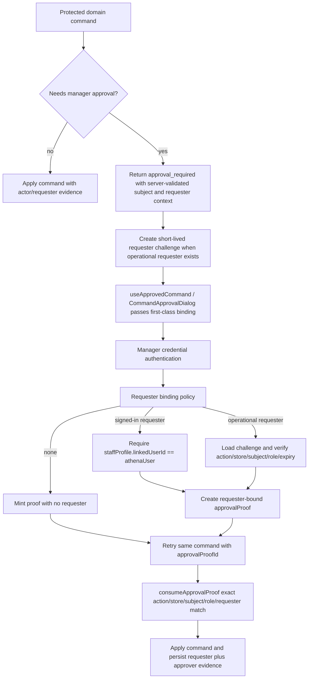
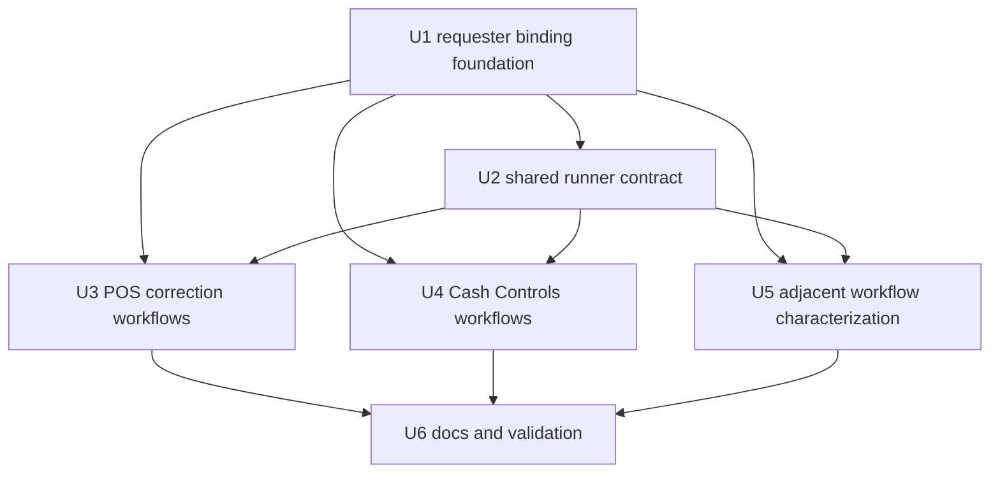

# fix: Separate approval requester attribution

## Summary

Approval proof minting should stop treating every `requestedByStaffProfileId` as a staff profile linked to the signed-in Athena account. This plan keeps the July 1 anti-spoofing guard for signed-in requester claims, but adds a server-owned requester-binding path for POS and Cash Controls workflows where the requester is an operational staff actor validated by staff credentials or the domain command.

---

## Problem Frame

Valid manager credentials can currently fail before proof creation with `Requested staff profile does not match the signed-in user.` The failure happens in `packages/athena-webapp/convex/operations/staffCredentials.ts`, where proof minting validates `requestedByStaffProfileId` against `staffProfile.linkedUserId`. That is correct when the client claims "this requester is the signed-in user's linked staff profile", but wrong when POS or Cash Controls passes the cashier/operator staff profile that initiated the business command.

The fix should not weaken manager approval. The approving manager remains `approvalProof.approvedByStaffProfileId`; the requester remains bound to the proof and command; the signed-in Athena user remains account/session/reviewer evidence.

---

## Assumptions

- Staff profile linking is supported but is not the live source of truth for many POS and Cash Controls actors, so this plan does not rely on broad `linkedUserId` cleanup.
- The implementation should prefer server-derived requester binding from the initial protected command over trusting a requester id supplied only by React state.
- Operations Queue, Daily Close, and Daily Opening are in scope for characterization because they share approval primitives, but they should not be rewritten unless tests show they pass the failing requester field.

---

## Requirements

- R1. Valid manager credentials must not be rejected only because the operational requester staff profile is unlinked to the signed-in Athena user.
- R2. The existing linked-user guard must remain for flows that explicitly claim a requester staff profile as the signed-in Athena user's staff identity.
- R3. Approval proofs must keep exact requester binding for workflows with a validated requester; no-requester workflows must mint and consume proofs with no requester rather than falling back to caller state.
- R4. POS transaction corrections, POS opening-float correction, and Cash Controls register closeout workflows must all use the corrected requester-binding behavior.
- R5. Raw `staffProfileId`, `managerElevationId`, and signed-in `athenaUser` identity must not become manager approval authority.
- R6. Affected domain records and read models must preserve requester/operator, approving manager, proof id, and reviewer/account evidence as distinct lanes where those facts already exist.
- R7. Operations Queue, Daily Close, and Daily Opening must retain their current authority semantics unless characterization reveals the same linked-user requester failure.
- R8. Regression coverage must prove invalid store, inactive requester, wrong action, wrong subject, wrong requester, forged requester challenge, stale/replayed challenge, expired proof, consumed proof, and manager-elevation spoof attempts fail closed.

---

## Scope Boundaries

- This plan does not change approval actions, thresholds, required roles, proof TTL, or self-approval policy.
- This plan does not auto-link Athena users to staff profiles.
- This plan does not replace `approvalProof` or `CommandApprovalDialog`.
- This plan does not introduce offline manager approval.
- This plan does not change Operations Queue's full-admin reviewer gate.
- This plan does not make Daily Opening require manager approval to start the day.
- This plan does not backfill historical approval records.

### Deferred to Follow-Up Work

- Broader execution of `docs/plans/2026-07-01-002-refactor-manager-approval-standard-plan.md` beyond the requester-link failure.
- Historical audit normalization for old records that lack typed approval evidence.
- Product/security reconsideration of self-approval by approval action.

---

## Context & Research

### Relevant Code and Patterns

- `packages/athena-webapp/convex/operations/staffCredentials.ts` authenticates staff credentials and currently rejects unlinked `requestedByStaffProfileId` in `validateApprovalRequesterStaffProfileWithCtx`.
- `packages/athena-webapp/convex/operations/approvalProofs.ts` creates one-use approval proofs and already enforces exact requester matching during consumption.
- `packages/athena-webapp/src/components/operations/useApprovedCommand.tsx` is the shared UI runner that forwards requester ids into `authenticateStaffCredentialForApproval`.
- `packages/athena-webapp/src/components/operations/CommandApprovalDialog.tsx` is the shared fallback approval dialog.
- `packages/athena-webapp/src/components/pos/transactions/TransactionView.tsx` passes requester staff ids for payment correction, item adjustment, and completed-sale void approval.
- `packages/athena-webapp/src/lib/pos/presentation/register/useRegisterViewModel.ts` and `packages/athena-webapp/src/components/pos/register/POSRegisterView.tsx` pass the active POS staff actor for opening-float correction approval.
- `packages/athena-webapp/src/components/cash-controls/RegisterSessionView.tsx` passes operational staff ids through closeout submit, finalize, reopen, reopened submit, and sync-review approval paths.
- `packages/athena-webapp/convex/pos/application/commands/correctTransaction.ts`, `packages/athena-webapp/convex/pos/application/commands/adjustTransactionItems.ts`, and `packages/athena-webapp/convex/pos/application/commands/completeTransaction.ts` consume requester-bound proofs for POS corrections.
- `packages/athena-webapp/convex/cashControls/closeouts.ts` and `packages/athena-webapp/convex/cashControls/deposits.ts` consume requester-bound proofs for register closeout and sync-review actions.
- `packages/athena-webapp/convex/operations/approvalRequests.ts`, `packages/athena-webapp/src/components/operations/OperationsQueueView.tsx`, `packages/athena-webapp/convex/operations/dailyClose.ts`, and `packages/athena-webapp/convex/operations/dailyOpening.ts` are adjacent surfaces to characterize for non-regression.

### Institutional Learnings

- `packages/athena-webapp/docs/agent/architecture.md` says manager approval authority must stay separate from the signed-in Athena session, and requester, reviewer, decision proof, approving manager, and automation fields are distinct lanes.
- `docs/solutions/architecture/athena-manager-approval-authority-standard-2026-07-01.md` records the durable approval evidence standard this plan should follow.
- `docs/solutions/logic-errors/athena-command-approval-manager-fast-path-2026-05-02.md` says the command boundary owns action, subject, role, reason, and resolution modes; staff profile ids are requester identity, not approval.
- `docs/solutions/logic-errors/athena-command-approval-policy-boundary-2026-05-01.md` says protected commands should return `approval_required`, mint a server-validated one-use proof, then retry the same command.
- `docs/solutions/logic-errors/athena-terminal-manager-elevation-command-boundary-2026-05-10.md` makes manager elevation a surface capability, not command approval.
- `docs/solutions/architecture/athena-pos-local-staff-authority-2026-05-14.md` separates local POS staff authority from global Athena access and approval authority.
- `docs/solutions/logic-errors/athena-register-closeout-correction-approval-boundary-2026-06-25.md` separates closeout staff identity, manager reopen/correction authority, and async variance approval.

### Prior Session Evidence

- July 1 manager approval work established that account session identity and staff/PIN identity are separate lanes, and proof authority comes from consumed proof fields.
- July 1 security review accepted the strict linked-user guard for signed-in requester attribution and rejected caller-controlled requester spoofing.
- The closeout mismatch investigation traced the current browser failure to proof minting in `staffCredentials.ts`, not invalid manager credentials.

### External References

- None. Existing Athena code, package-local Convex guidance, and project solution docs are the source of truth.

---

## Key Technical Decisions

- **Use a first-class requester-binding contract:** Add an `ApprovalRequesterBinding` shape to `packages/athena-webapp/shared/approvalPolicy.ts` and the matching Convex validator in `packages/athena-webapp/convex/operations/staffCredentials.ts`. Do not carry requester binding through untyped `metadata`.
- **Use a short-lived server-held requester challenge for operational staff:** Protected domain commands that need manager approval and have an operational requester should create a server-side approval requester challenge before returning `approval_required`. The challenge stores action, store, subject, required role, requester staff profile, expiry, and consumed/minted state. `authenticateStaffCredentialForApproval` validates the challenge against the caller's action/store/subject/role and uses the stored requester id; it does not trust a client-provided requester id or mode flag.
- **Keep signed-in requester validation separate:** Signed-in requester claims keep the current `linkedUserId` check and do not use the operational requester challenge path.
- **Keep proof consumption unchanged:** `consumeApprovalProofWithCtx` should continue exact matching on action, store, subject, role, requester, expiry, and consumption state.
- **Remove React-trusted operational fallbacks:** `useApprovedCommand` should pass the server-returned requester binding from the `approval_required` result. For protected operational workflows, caller-provided `requestedByStaffProfileId` is not a fallback. If no requester binding is present, proof creation must mint without requester and the retry must consume without requester.
- **Do not make approval proof creation a raw active-staff lookup:** Accepting any active staff profile for proof requester attribution would recreate the spoofing concern. The implementation should make the requester source explicit enough that reviewers can tell which validation path ran.
- **Keep affected workflow changes narrow:** POS corrections, POS opening-float correction, and Cash Controls closeout paths need behavior changes and regression tests. Operations Queue, Daily Close, and Daily Opening need characterization/non-regression unless implementation reveals the same faulty requester path.
- **Preserve authority lane vocabulary:** Account user, operational requester, approving manager, reviewer account, manager elevation, and automation evidence remain separate in names, tests, and durable records.

---

## Open Questions

### Resolved During Planning

- **Should the fix auto-link staff profiles to Athena users?** No. Prior sessions show staff linking is not a reliable live assumption, and auto-linking would couple account session and staff/PIN identity.
- **Should manager proof creation simply stop validating requester ids?** No. The requester still needs store/status validation and a clear source; proof consumption still enforces exact requester matching.
- **Should Operations Queue be rewritten as part of this fix?** No. It does not pass `requestedByStaffProfileId` into proof creation for the decision unlock today, so it is a characterization surface for this plan.
- **Should Daily Opening gain a manager gate?** No. Starting the day should not require manager approval just to unblock POS.

### Deferred to Implementation

- Exact helper and table names for the short-lived requester challenge are implementation-owned, but the plan requires a first-class shared requester-binding type and a server-verifiable challenge, not metadata echoing.
- If a specific workflow lacks server-side requester validation today, implementation must add that validation before it can return an operational requester challenge. Otherwise it must omit requester binding and consume the resulting proof with no requester.

---

## High-Level Technical Design

> *This illustrates the intended approach and is directional guidance for review, not implementation specification. The implementing agent should treat it as context, not code to reproduce.*

---

## Implementation Units

- U1. **Define approval requester binding at proof creation**

**Goal:** Separate signed-in staff requester claims from operational staff requester binding without weakening approval proof consumption.

**Requirements:** R1, R2, R3, R5, R8

**Dependencies:** None

**Files:**
- Modify: `packages/athena-webapp/convex/operations/staffCredentials.ts`
- Modify: `packages/athena-webapp/convex/operations/staffCredentials.test.ts`
- Modify: `packages/athena-webapp/convex/operations/approvalProofs.test.ts`
- Modify: `packages/athena-webapp/convex/operations/approvalProofs.ts` only if return data needs to expose challenge consumption evidence
- Modify: `packages/athena-webapp/convex/schema.ts`
- Create: `packages/athena-webapp/convex/operations/approvalRequesterChallenges.ts`
- Create: `packages/athena-webapp/convex/operations/approvalRequesterChallenges.test.ts`
- Modify: `packages/athena-webapp/convex/lib/commandResultValidators.ts`
- Modify: `packages/athena-webapp/shared/approvalPolicy.ts`

**Approach:**
- Replace `validateApprovalRequesterStaffProfileWithCtx` with a policy that distinguishes requester source.
- Add a first-class `ApprovalRequesterBinding` to the shared approval policy. It should cover `none`, `signed_in_staff_profile`, and `operational_staff_challenge`.
- Update the central Convex approval requirement validator so returned `approval_required` results validate the first-class requester binding.
- Add a small Convex-backed requester challenge helper that creates short-lived records for operational requester binding. Challenge records must store requester staff profile, action key, store, subject type/id, required role, expiry, and whether the challenge has already minted a proof.
- Keep the existing linked-user check for signed-in requester attribution.
- For operational requester binding, have proof creation load the challenge server-side, validate action/store/subject/role/expiry, validate the stored requester staff profile is active and in-store, mark the challenge as used for proof minting, and then create the proof with the stored requester id.
- For no-requester binding, mint proof with `requestedByStaffProfileId` omitted and require the retry command to consume with no requester.
- Leave `consumeApprovalProofWithCtx` requester matching unchanged.
- Keep `approvedByStaffProfileId` and `approvedByCredentialId` as the only manager approval authority evidence.

**Execution note:** Start with failing `staffCredentials.test.ts` coverage for an unlinked requester with valid manager credentials, then add the source-specific rejection cases.

**Patterns to follow:**
- `packages/athena-webapp/docs/agent/architecture.md` approval authority lanes.
- `packages/athena-webapp/convex/operations/approvalProofs.ts` one-use proof binding.

**Test scenarios:**
- Happy path: unlinked active in-store Staff A can be bound as operational requester when valid Manager Staff B credentials mint the proof.
- Happy path: requester Staff A linked to a different Athena user can still be bound through the operational requester path when the workflow source is valid.
- Error path: direct signed-in requester mode rejects Staff A when `linkedUserId` does not match the signed-in Athena user.
- Error path: inactive requester staff profile is rejected.
- Error path: requester staff profile from another store is rejected.
- Error path: direct calls to `authenticateStaffCredentialForApproval` with a forged operational requester binding fail when no matching server challenge exists.
- Error path: tampered challenge/action/store/subject/role values fail before proof creation.
- Error path: stale or reused requester challenges cannot mint proofs for a new approval attempt.
- Error path: proof created for Staff A cannot be consumed by a command retried for Staff B.
- Error path: expired, consumed, wrong-store, wrong-action, wrong-role, and wrong-subject proofs still fail closed.
- Error path: passing a manager elevation id or equivalent capability evidence cannot mint approval proof.

**Verification:**
- Proof creation accepts operational requester binding without accepting arbitrary signed-in requester spoofing.
- Existing approval proof replay protections are unchanged.

---

- U2. **Move shared UI runners to server-derived requester context**

**Goal:** Ensure `useApprovedCommand` and shared approval dialogs do not blindly forward caller-provided operational staff ids as signed-in requester claims.

**Requirements:** R1, R2, R3, R4, R5

**Dependencies:** U1

**Files:**
- Modify: `packages/athena-webapp/src/components/operations/useApprovedCommand.tsx`
- Modify: `packages/athena-webapp/src/components/operations/useApprovedCommand.test.tsx`
- Modify: `packages/athena-webapp/src/components/operations/CommandApprovalDialog.tsx`
- Modify: `packages/athena-webapp/src/components/operations/CommandApprovalDialog.test.tsx`
- Modify: `packages/athena-webapp/shared/approvalPolicy.ts`

**Approach:**
- Teach the runner to pass the first-class requester binding returned by the server's `approval_required` result.
- Remove operational requester fallback from caller-provided `requestedByStaffProfileId`. For protected operational flows, the fallback is either the server challenge or no requester binding.
- Allow signed-in requester fallback only when the caller explicitly uses the signed-in requester binding mode and the backend can enforce the linked-user check.
- Keep same-submission manager credentials as an inline proof attempt after the command returns `approval_required`; do not precompute policy in React.
- Ensure dialog approval and same-submission approval pass the same requester binding to proof creation and command retry.

**Patterns to follow:**
- `docs/solutions/logic-errors/athena-command-approval-manager-fast-path-2026-05-02.md`.
- Existing `buildApprovalRetryArgs` behavior in `useApprovedCommand.tsx`.

**Test scenarios:**
- Happy path: runner uses server-returned requester binding when caller args and approval binding disagree.
- Happy path: same-submission inline manager proof passes the same requester binding that the retry command consumes.
- Error path: runner does not pass an unvalidated requester fallback when the approval requirement lacks a server challenge.
- Error path: tampered approval requester binding sent directly to the public proof-minting mutation fails server validation.
- Error path: a requester challenge created for one action/store/subject cannot be replayed through another approval dialog.
- Integration: `CommandApprovalDialog` sends requester context consistently with `useApprovedCommand`.

**Verification:**
- Shared approval UI no longer converts operational staff ids into signed-in requester claims by default.

---

- U3. **Fix POS protected correction workflows**

**Goal:** Make POS payment correction, item adjustment, completed-sale void, and opening-float correction approve with valid manager credentials even when the requester staff profile is unlinked to the signed-in Athena account.

**Requirements:** R1, R3, R4, R5, R6, R8

**Dependencies:** U1, U2

**Files:**
- Modify: `packages/athena-webapp/src/components/pos/transactions/TransactionView.tsx`
- Modify: `packages/athena-webapp/src/components/pos/transactions/TransactionView.test.tsx`
- Modify: `packages/athena-webapp/src/lib/pos/presentation/register/useRegisterViewModel.ts`
- Modify: `packages/athena-webapp/src/lib/pos/presentation/register/useRegisterViewModel.test.ts`
- Modify: `packages/athena-webapp/src/components/pos/register/POSRegisterView.tsx`
- Modify: `packages/athena-webapp/src/components/pos/register/POSRegisterView.test.tsx`
- Modify: `packages/athena-webapp/convex/pos/application/commands/correctTransaction.ts`
- Modify: `packages/athena-webapp/convex/pos/application/correctTransactionPaymentMethod.test.ts`
- Modify: `packages/athena-webapp/convex/pos/application/commands/adjustTransactionItems.ts`
- Modify: `packages/athena-webapp/convex/pos/application/adjustTransactionItems.test.ts`
- Modify: `packages/athena-webapp/convex/pos/application/commands/completeTransaction.ts`
- Modify: `packages/athena-webapp/convex/pos/application/completeTransaction.test.ts`

**Approach:**
- Have each protected POS command create a requester challenge and return approval requirements with the challenge binding for the requester staff profile that the command already validated.
- For item adjustment and void, preserve the local staff proof requirement; do not let manager proof replace cashier/operator authentication.
- For payment correction, characterize the current actor validation and add the missing validation if the command only receives a raw staff id today.
- For opening-float correction, bind the active POS staff requester through the same server-derived requester path before proof minting.
- Preserve existing durable correction evidence such as requester staff, approval request id, decision proof id, and approved manager staff profile.

**Execution note:** Add characterization coverage for current actor validation before changing payment correction semantics.

**Patterns to follow:**
- `docs/solutions/logic-errors/athena-pos-ledger-safe-corrections-2026-04-30.md`.
- `docs/solutions/logic-errors/athena-pos-completed-transaction-void-reversal-2026-05-21.md`.
- `docs/solutions/architecture/athena-pos-local-staff-authority-2026-05-14.md`.

**Test scenarios:**
- Happy path: Staff A requests payment correction and Manager Staff B approves inline, with Staff A unlinked to the signed-in Athena user.
- Happy path: Staff A requests item adjustment with valid local staff proof and Manager Staff B approves inline.
- Happy path: Staff A requests completed-sale void with valid local staff proof and Manager Staff B approves inline.
- Happy path: active POS staff requests opening-float correction and a different manager approves.
- Integration: async approval request and inline proof paths record equivalent requester and approver evidence.
- Error path: manager proof without required local staff proof does not apply item adjustment or void.
- Error path: proof requester mismatch fails without mutating transaction/register-session facts.
- Error path: manager elevation or a forged requester challenge cannot approve a POS correction.

**Verification:**
- POS protected workflows no longer fail because operational requester staff is unlinked, and they still fail when requester proof binding or local staff authority is invalid.

---

- U4. **Fix Cash Controls register workflows**

**Goal:** Make Cash Controls closeout submit, finalize, reopen, reopened submit, opening-float correction, and sync-review approvals use explicit requester binding instead of the signed-in-user staff link assumption.

**Requirements:** R1, R3, R4, R5, R6, R8

**Dependencies:** U1, U2

**Files:**
- Modify: `packages/athena-webapp/src/components/cash-controls/RegisterSessionView.tsx`
- Modify: `packages/athena-webapp/src/components/cash-controls/RegisterSessionView.test.tsx`
- Modify: `packages/athena-webapp/src/components/cash-controls/RegisterSessionView.auth.test.tsx`
- Modify: `packages/athena-webapp/convex/cashControls/closeouts.ts`
- Modify: `packages/athena-webapp/convex/cashControls/closeouts.test.ts`
- Modify: `packages/athena-webapp/convex/cashControls/deposits.ts`
- Modify: `packages/athena-webapp/convex/cashControls/deposits.test.ts`

**Approach:**
- Ensure closeout submit/finalize paths create requester challenges for the staff actor resolved by `resolveCloseoutActorStaffProfileId`, not for the signed-in account's staff profile.
- Ensure reopened closeout and closeout-reopen commands keep manager approver and operational requester distinct.
- For sync review, keep the approving manager from proof data and bind requester only when the requester source is validated.
- Remove or replace UI plumbing that forwards `result.staffProfileId` or `actorStaffProfileId` into proof minting without source context.
- Preserve closeout evidence fields used by register-session history, deposits, and review display.

**Execution note:** Characterize closeout submit/finalize behavior first because this is the browser manifestation that triggered the plan.

**Patterns to follow:**
- `docs/solutions/logic-errors/athena-register-closeout-correction-approval-boundary-2026-06-25.md`.
- `docs/solutions/architecture/athena-pos-closeout-hold-boundary-2026-07-01.md`.
- `docs/solutions/logic-errors/athena-cash-controls-closeout-review-ia-2026-06-08.md`.

**Test scenarios:**
- Happy path: cashier Staff A submits closeout with variance and Manager Staff B approves inline; Staff A is unlinked to signed-in user.
- Happy path: manager Staff B finalizes a submitted closeout while requester Staff A remains distinct.
- Happy path: closeout reopen and reopened submit preserve requester and approving manager evidence separately.
- Happy path: sync-review approval uses manager proof approver as reviewer authority and does not require requester staff to be linked to the signed-in user.
- Error path: invalid requester store/status fails before proof creation.
- Error path: proof minted for one register session or requester cannot approve another closeout command.
- Error path: manager elevation or a forged requester challenge cannot approve closeout, reopen, or sync-review commands.
- Integration: register-session and deposit read models show requester/operator and manager approver without inferring from raw ids.

**Verification:**
- The selected browser closeout workflow can finalize with valid manager credentials, and the original linked-user error no longer appears for a validated operational requester.

---

- U5. **Characterize adjacent approval workflows**

**Goal:** Prevent regressions in shared approval surfaces that do not currently trigger the exact linked-user failure.

**Requirements:** R5, R6, R7, R8

**Dependencies:** U1, U2

**Files:**
- Modify: `packages/athena-webapp/src/components/operations/OperationsQueueView.tsx` only if characterization finds requester drift
- Modify: `packages/athena-webapp/src/components/operations/OperationsQueueView.test.tsx`
- Modify: `packages/athena-webapp/convex/operations/approvalRequests.ts` only if characterization finds evidence drift
- Modify: `packages/athena-webapp/convex/operations/approvalRequests.test.ts`
- Modify: `packages/athena-webapp/src/components/operations/DailyCloseView.tsx` only if characterization finds requester drift
- Modify: `packages/athena-webapp/src/components/operations/DailyCloseView.test.tsx`
- Modify: `packages/athena-webapp/convex/operations/dailyClose.ts` only if characterization finds requester drift
- Modify: `packages/athena-webapp/convex/operations/dailyClose.test.ts`
- Modify: `packages/athena-webapp/src/components/operations/DailyOpeningView.tsx` only if characterization finds requester drift
- Modify: `packages/athena-webapp/src/components/operations/DailyOpeningView.test.tsx`
- Modify: `packages/athena-webapp/convex/operations/dailyOpening.ts` only if characterization finds requester drift
- Modify: `packages/athena-webapp/convex/operations/dailyOpening.test.ts`

**Approach:**
- Prove Operations Queue decision unlock still mints proof without requester binding and records full-admin reviewer account separately from manager proof approver.
- Prove Daily Close completion/reopen do not pass an unlinked operational requester into proof minting unless the requester has been validated.
- Prove Daily Opening does not require manager approval for start-day continuity.
- If any adjacent surface does pass `requestedByStaffProfileId` into proof creation, move it to the same source-specific requester binding model as U3/U4.

**Patterns to follow:**
- `docs/plans/2026-07-01-002-refactor-manager-approval-standard-plan.md`.
- `docs/plans/2026-06-22-004-feat-eod-review-automation-plan.md`.

**Test scenarios:**
- Operations Queue: signed-in full-admin User X uses Manager Staff B credentials; decision records reviewer account and approving manager separately.
- Operations Queue: unlinked manager credential still approves only after valid manager proof, not by account identity alone.
- Daily Close: completion/reopen proof behavior remains valid when requester is omitted or validated.
- Daily Opening: start-day flow remains free of a manager approval blocker.
- Error path: manager elevation cannot satisfy any command approval in these adjacent flows.
- Error path: automation evidence does not fabricate human manager proof fields.

**Verification:**
- Shared approval changes do not accidentally broaden manager authority or introduce new start-day/closeout blockers.

---

- U6. **Document, validate, and refresh generated context**

**Goal:** Update durable project guidance and run the focused validation ladder for approval-sensitive workflows.

**Requirements:** R1, R2, R3, R4, R5, R6, R7, R8

**Dependencies:** U1, U2, U3, U4, U5

**Files:**
- Modify: `packages/athena-webapp/docs/agent/architecture.md` if the requester-binding helper adds a new durable convention
- Create or modify: `docs/solutions/logic-errors/athena-approval-requester-binding-2026-07-02.md`
- Modify generated graph output through `bun run graphify:rebuild` after code changes

**Approach:**
- Add a solution note explaining the difference between signed-in requester attribution and operational requester binding.
- Keep package docs concise: name the helper/pattern and the authority lanes, not the implementation internals.
- Run focused approval, POS, cash-controls, and adjacent workflow tests before broader package validation.
- Rebuild graphify because implementation will modify code files.

**Patterns to follow:**
- `docs/solutions/architecture/athena-manager-approval-authority-standard-2026-07-01.md`.
- `packages/athena-webapp/docs/agent/testing.md` command approval and cash-controls validation guidance.

**Test scenarios:**
- Test expectation: none for documentation-only changes, beyond confirming links and references are accurate.

**Verification:**
- Focused tests cover approval proof minting/consumption, POS corrections, Cash Controls closeout, Operations Queue characterization, Daily Close characterization, and Daily Opening continuity.
- Broader validation includes Convex audit/lint, TypeScript build checks, graphify rebuild, and diff hygiene.

---

## System-Wide Impact

- **Interaction graph:** The change spans proof minting, proof consumption, shared approval UI runners, POS protected commands, Cash Controls register commands, and adjacent Operations/Daily workflows.
- **Error propagation:** The user-facing linked-user error should disappear only for validated operational requester paths; direct signed-in requester spoofing should still return an authorization failure.
- **State lifecycle risks:** Proofs remain one-use. If subject state changes between proof minting and command retry, the command must fail closed and require fresh approval when the proof has been consumed.
- **API surface parity:** Same-submission inline manager approval and dialog-based approval must use the same requester binding.
- **Integration coverage:** Browser tests need to verify that requester context passed to `authenticateStaffCredentialForApproval` matches the server-approved command requirement, not only that a mutation was called.
- **Unchanged invariants:** Manager elevation is not proof. Signed-in user is not approving manager. Automation is not human manager approval. `consumeApprovalProofWithCtx` requester matching remains exact.

---

## Risks & Dependencies

| Risk | Mitigation |
|------|------------|
| Relaxing requester validation reopens spoofing | Make requester source explicit; keep linked-user validation for signed-in claims; require server/credential validation for operational requester binding. |
| UI keeps forwarding stale requester ids | Update `useApprovedCommand` and `CommandApprovalDialog` tests to prefer server-returned requester context. |
| POS payment correction lacks actor validation | Characterize first; add workflow-specific actor validation before binding requester if needed. |
| Proof consumed before stale command failure | Validate subject/requester/payload freshness before proof consumption where possible; otherwise persist failure evidence and require fresh approval. |
| Adjacent workflows regress through shared helper changes | Add Operations Queue, Daily Close, and Daily Opening characterization coverage. |
| Scope expands into full approval standard refactor | Keep this plan limited to requester attribution failure and affected workflows; defer broader audit normalization. |

---

## Documentation / Operational Notes

- Product copy should avoid saying the signed-in user approved an action when the manager credential did.
- Support/debugging should distinguish invalid manager credentials from invalid requester binding; the current browser manifestation is the latter.
- Because this touches Convex code and graph-guided docs, implementation should run `bun run graphify:rebuild` after code changes.

---

## Sources & References

- Existing plan: `docs/plans/2026-07-01-002-refactor-manager-approval-standard-plan.md`
- Existing plan: `docs/plans/2026-07-01-001-fix-register-closeout-gate-policy-plan.md`
- Solution note: `docs/solutions/architecture/athena-manager-approval-authority-standard-2026-07-01.md`
- Solution note: `docs/solutions/logic-errors/athena-command-approval-manager-fast-path-2026-05-02.md`
- Solution note: `docs/solutions/logic-errors/athena-command-approval-policy-boundary-2026-05-01.md`
- Solution note: `docs/solutions/logic-errors/athena-terminal-manager-elevation-command-boundary-2026-05-10.md`
- Package guide: `packages/athena-webapp/docs/agent/architecture.md`
- Package guide: `packages/athena-webapp/docs/agent/testing.md`
- Root cause: `packages/athena-webapp/convex/operations/staffCredentials.ts`
- Proof binding: `packages/athena-webapp/convex/operations/approvalProofs.ts`
- Shared runner: `packages/athena-webapp/src/components/operations/useApprovedCommand.tsx`
