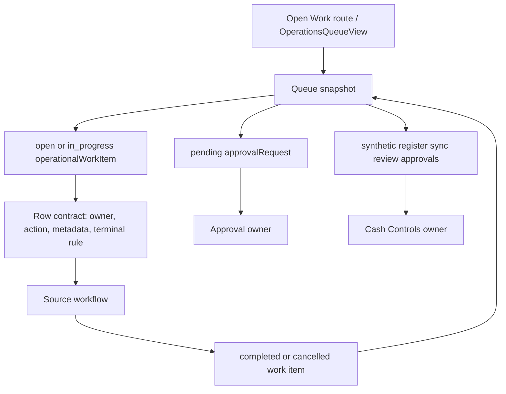
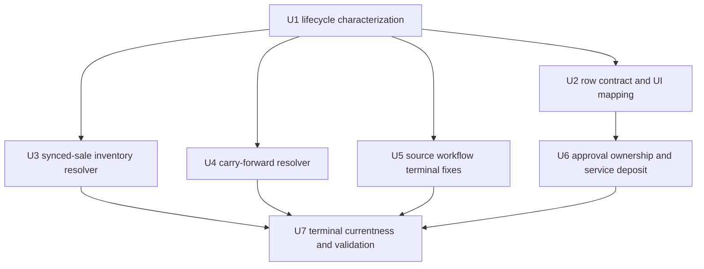

# fix: Close Open Work resolution gaps

## Summary

Open Work should remain the store operations workspace for current operational work, not a generic admin console. The fix is to make every surfaced work type answer three questions clearly: who owns resolution, where the operator goes next, and what source transition removes the row from Open Work. The UI direction should stay the same: a dense, calm operations queue with type-specific row context and primary actions inside the existing `OperationsQueueView` patterns.

The plan closes the highest-risk gaps first: `synced_sale_inventory_review`, `daily_close_carry_forward`, `service_appointment`, `service_deposit_review`, `purchase_order` cancellation semantics, and ambiguous rows that currently route operators to non-resolving workspaces.

---

## Problem Frame

Open Work currently projects `operationalWorkItem` rows with `open` or `in_progress` status, plus adjacent approval work in the same component family. Some source workflows already update their linked work item on terminal source transitions. Others only create work, or route the operator to a workspace that does not actually resolve the work item.

That leaves two operator-visible problems:

| Problem | Effect |
| --- | --- |
| Missing terminal transition | Work can remain open after the real-world issue is handled. |
| Missing or wrong owner action | Operators can click into a workspace that cannot resolve the row. |
| Generic row context | The queue is technically populated but not operationally scannable. |
| Approval/open-work ambiguity | Some items appear in both mental models without a clear handoff. |

The fix should not redesign the Open Work workspace. It should preserve the current operations list/table direction, row density, filters, route, and component system while improving row-level meaning and source-owned resolution.

---

## Requirements

- R1. Every work type intentionally surfaced on `/operations/open-work` must have one primary owning workflow and one primary next action in the row.
- R2. Open Work must not provide a broad generic "resolve anything" control. Terminal state changes must remain source-owned unless a type-specific Operations-owned resolver is explicitly part of the domain.
- R3. `synced_sale_inventory_review` must get a source-validated resolver so corrected, dismissed, or superseded inventory review work leaves Open Work and terminal currentness.
- R4. `daily_close_carry_forward` must get an explicit terminal path. Daily Opening acknowledgment can preserve handoff evidence, but it cannot be the only lifecycle state if the work remains open.
- R5. `service_appointment` work items must close or cancel when the appointment source workflow converts, completes, or cancels.
- R6. `purchase_order` cancellation must preserve cancellation semantics instead of hiding as a completed work item.
- R7. `pos_pending_checkout_item_review` rows must route to the unresolved catalog review owner before stock correction paths.
- R8. `stock_adjustment_review` must clearly hand off to the approval owner when approval is the active resolution step, without duplicating an independent Open Work action.
- R9. `service_deposit_review` approval work surfaced in the operations queue family must either receive full approve/reject behavior or be suppressed until supported. It must not strand unhandled approval rows.
- R10. Row metadata, labels, and actions must follow the existing Open Work UI direction: same visual language, restrained copy, stable row dimensions, tabular numeric values, explicit owner/action labels, and no new card-heavy or marketing-style layout.
- R11. Queue projection, terminal currentness, approval separation, and row rendering must have focused tests for source transitions, stale rows, ambiguous targets, and operator copy.
- R12. Queue rows must expose sanitized per-type DTOs, not raw `operationalWorkItem.metadata` or source metadata. Sensitive proof ids, internal payloads, hidden financial evidence, and cross-store/source identifiers must not reach unauthorized queue viewers.
- R13. Every surfaced work type must define a stable source identity and duplicate policy so retries, reprojection, reopen flows, and sync replays cannot create multiple current rows for the same source.
- R14. Queue ordering, pagination, and cap/overflow behavior must be deterministic for mixed open work and approvals. The queue snapshot must sort by priority bucket, then status urgency, then oldest actionable timestamp, then stable id; keep `MAX_QUEUE_ITEMS = 100` as the server lane cap unless implementation intentionally changes it; and return explicit overflow metadata when a lane exceeds that cap.
- R15. Every new terminal path must record auditable evidence: actor, authorization/proof basis where applicable, reason/outcome, source reference, prior state, next state, and domain trace metadata.

---

## Scope Boundaries

- This plan does not redesign the Open Work route or replace `OperationsQueueView`.
- This plan does not turn Daily Operations into the owner of work resolution. Daily Operations remains an aggregate/read model.
- This plan does not add a generic administrative close button for arbitrary operational work items.
- This plan does not move approval authority into React. Protected decisions remain server-owned with the existing manager-proof and approval boundaries.
- This plan does not change POS sale continuity policy except where stale inventory-review evidence currently affects terminal currentness.
- This plan does not introduce a new frontend design system, new color direction, or new layout shell.
- This plan does not do broad historical cleanup. It does require a pre-ship audit of visible `open` / `in_progress` rows by type, and any visible row without a resolvable source target must be migrated, terminally updated, or suppressed before release.

### Deferred to Follow-Up Work

- A broader Operations information architecture redesign, if operators later need cross-workflow dashboards beyond this queue.
- Bulk operations for Open Work rows.
- Historical cleanup beyond rows still visible in Open Work after the pre-ship audit.
- Capped terminal evidence-quality improvements unless implementation proves they are required for stale Open Work row removal.
- New analytics around resolution time or queue load.

---

## Context & Research

### Relevant Code

- `packages/athena-webapp/src/routes/_authed/$orgUrlSlug/store/$storeUrlSlug/operations/open-work.tsx` renders the Open Work route and delegates to `OperationsQueueView`.
- `packages/athena-webapp/src/components/operations/OperationsQueueView.tsx` renders queue rows, approval rows, type labels, metadata, filters, pagination, and primary links.
- `packages/athena-webapp/convex/operations/operationalWorkItems.ts` builds the queue snapshot from open/in-progress operational work, pending approvals, and synthetic register sync reviews.
- `packages/athena-webapp/convex/pos/application/sync/projectLocalEvents.ts` creates `synced_sale_inventory_review`.
- `packages/athena-webapp/convex/pos/application/sync/registerSessionSyncReview.ts` suppresses Cash Controls sync-review rows when Operations owns matching inventory review work.
- `packages/athena-webapp/convex/pos/infrastructure/repositories/terminalRepository.ts` projects current terminal review evidence toward Open Work.
- `packages/athena-webapp/convex/operations/dailyClose.ts` creates or preserves carry-forward work.
- `packages/athena-webapp/convex/operations/dailyOpening.ts` reads and acknowledges Opening handoff evidence.
- `packages/athena-webapp/convex/serviceOps/serviceCases.ts` maps service case status to work item status.
- `packages/athena-webapp/convex/serviceOps/appointments.ts` owns appointment conversion and cancellation source actions.
- `packages/athena-webapp/convex/stockOps/purchaseOrders.ts` and `packages/athena-webapp/convex/stockOps/receiving.ts` own purchase order lifecycle transitions.
- `packages/athena-webapp/convex/stockOps/adjustments.ts` owns stock adjustment approval application and rejection.
- `packages/athena-webapp/convex/pos/public/catalog.ts` owns pending checkout item review resolution.
- `packages/athena-webapp/convex/operations/approvalRequests.ts` dispatches approval decisions.

### Institutional Learnings

- `docs/solutions/design-patterns/athena-open-work-row-context-metadata-2026-06-29.md`: shared row shells are acceptable, but each work type owns title, icon, metadata, action, and expanded evidence.
- `docs/solutions/logic-errors/athena-pos-sync-review-workspace-boundaries-2026-06-19.md`: synced-sale inventory review belongs to Operations once opened; Cash Controls should suppress matching open work.
- `docs/solutions/logic-errors/athena-terminal-sync-review-currentness-2026-06-28.md`: terminal currentness must count only current actionable work, not stale raw conflicts.
- `docs/solutions/logic-errors/athena-daily-operations-aggregate-read-model-2026-05-08.md`: Daily Operations routes back to source owners and must not invent lifecycle rules.
- `docs/solutions/architecture/athena-manager-approval-authority-standard-2026-07-01.md`: approval authority must remain server-owned and proof-scoped.
- `docs/product-copy-tone.md`: operator copy should be calm, clear, restrained, state-first, and action-oriented.

### Frontend Direction

The user explicitly wants repo-local frontend skills to inform the plan while maintaining the existing UI direction. Apply the frontend guidance conservatively:

- Treat this as an existing app feature, so `OperationsQueueView` keeps the current visual system, spacing, type scale, controls, and list density.
- Improve row scanability through type-specific title/action/metadata, not by adding cards inside cards or decorative surfaces.
- Keep row actions familiar: icon plus concise text where the existing workspace already uses it, stable hit areas, visible focus states, and no layout shift from dynamic values.
- Use tabular numerals for counts, prices, quantities, variances, and receipt-like numeric facts rendered in rows.
- Use `text-wrap: balance` only for short headings and `text-wrap: pretty` for short row descriptions if the existing styling supports it.
- Avoid page-load animation or ornamental motion. For high-frequency queue interactions, prefer instant or very short state feedback.

---

## Key Technical Decisions

- **Source-owned resolution remains the invariant.** The queue shows work; source workflows close or cancel work. This matches service cases, purchase orders, stock approvals, and the Daily Operations aggregate pattern.
- **Every surfaced type gets a primary owner/action contract.** A row without a resolving destination is treated as a bug, not a generic queue fallback.
- **Operations owns the `synced_sale_inventory_review` resolver contract.** This work is intentionally suppressed from Cash Controls when open, so it needs a named Operations-owned, source-validated terminal path rather than implicit matching against arbitrary stock adjustments.
- **Daily Close owns carry-forward terminal actions.** Daily Opening remains read/ack-only for handoff evidence; Daily Close provides the narrow typed completion/cancellation helper or mutation.
- **Approval work remains approval-owned.** If the active next step is approval, the row should say that and link to the approval owner rather than presenting a second Open Work action.
- **Existing UI direction governs the frontend work.** The implementation should add row mapping, copy, links, focus states, and stable numeric treatment inside current components. It should not create a new dashboard, split-page layout, or card-first redesign.
- **Unsupported approval types must fail closed.** `service_deposit_review` should be suppressed or creation should stop in this release; full approve/reject semantics are a follow-up unless implemented end to end with existing server proof rules.
- **Tests are the contract for old rows.** Existing terminal source behaviors should get characterization coverage before behavior changes, so implementation can distinguish intentional source-owned lifecycle from real gaps.

---

## Open Questions

### Resolved During Planning

- **Should Open Work have a generic resolver?** No. The repo patterns and prior learnings favor source-owned resolution.
- **Should the Open Work UI be redesigned?** No. The direction is incremental row/action clarity within the existing workspace.
- **Should Opening acknowledgment resolve carry-forward work?** No as the default. Existing tests expect acknowledgment to keep work open, so a separate explicit terminal path is needed unless implementation discovers a stronger source rule.
- **Should `synced_sale_inventory_review` close through Cash Controls register sync review?** No as the default. Once Operations owns the open inventory review, Cash Controls should not double-own it.
- **Should pending checkout review route first to stock adjustment?** No. The catalog/unresolved-products owner should handle the unresolved item first; stock correction can follow after catalog resolution.
- **Who owns `daily_close_carry_forward` terminal actions?** Daily Close owns completion/cancellation through a narrow typed helper or mutation; Daily Opening remains read/ack-only.
- **What is the `service_deposit_review` decision for this slice?** Fail closed: suppress it from surfaced queue data or stop creating it until full approval semantics are implemented.

### Deferred to Implementation

- Whether `service_deposit_review` full approval semantics should be implemented in a follow-up depends on the service deposit domain workflow and manager-proof product decision.
- Whether a small data cleanup is needed for old orphaned `synced_sale_inventory_review` or `daily_close_carry_forward` rows should be decided after the pre-ship visible-row audit.

---

## High-Level Technical Design

The row contract should be explicit enough that an implementer can reason about each surfaced type:

| Work type/state | Stable source identity | Primary owner | Primary row action | Terminal rule | Duplicate policy |
| --- | --- | --- | --- | --- | --- |
| `service_case` | `serviceCaseId` | Service case workflow | Open service case | Service case completed/cancelled status sync | One current work item per service case |
| `service_appointment` while appointment is open | `appointmentId` | Service appointment workflow | Open appointment | Appointment cancellation cancels work; conversion closes appointment work and transfers operator context to the service case if needed | One current appointment work item per appointment |
| `purchase_order` | `purchaseOrderId` | Procurement/receiving | Open purchase order | Received/completed completes work; cancelled cancels work | One current work item per purchase order |
| `stock_adjustment_review` with pending approval | `approvalRequestId` and `stockAdjustmentBatchId` | Approval requests | Review adjustment approval | Approval applies or rejects adjustment and terminally updates linked work | One current approval row per adjustment approval request |
| `pos_pending_checkout_item_review` | canonical key: `posPendingCheckoutItem._id`; local-sync fallback before cloud id: store id, terminal id, `localRegisterSessionId`, `localIdKind: "pendingCheckoutItem"`, and local `pendingCheckoutItemId` | Unresolved catalog review | Review catalog item | Link/approve/reject completes; flag keeps the same work open | One current work item per pending checkout item key; SKU-only matching is forbidden |
| `synced_sale_inventory_review` | canonical idempotency key: mapping `{ storeId, terminalId, localRegisterSessionId, localIdKind: "inventoryReviewWorkItem", localId: "${localTransactionId}:inventory-review" }` | Operations inventory review | Resolve sale inventory review | Operations resolver completes, cancels, or supersedes current work with audit evidence | Reprojection reuses the existing mapped work item for that key; `registerSessionId`, `sourceId`, and `receiptNumber` validate context but do not define idempotency |
| `daily_close_carry_forward` | store, business date, daily close/carry-forward source id | Daily Close | Resolve carry-forward follow-up | Daily Close helper completes or cancels work with handoff/audit evidence | One current carry-forward item per source id and business date |
| `service_deposit_review` | service intake/case deposit subject | Not surfaced in this release | Not surfaced | Creation/surfacing is suppressed until full server-owned approval semantics exist | No unsupported current approval row may appear |

### Queue Snapshot Ordering and Overflow Contract

The queue snapshot must keep first-page visibility deterministic when current work exceeds the server cap:

- Priority bucket order: approval-blocked work that is represented in Open Work, source-owned resolver work, source workflow continuation work, informational/handoff work.
- Status urgency: `in_progress` before `open` within the same bucket when both are actionable; approvals keep their existing pending decision order in the approvals lane.
- Tie-breakers: oldest actionable timestamp first, then stable source identity, then work item id for deterministic output.
- Server cap: keep `MAX_QUEUE_ITEMS = 100` for each server lane in this slice: `open`, `in_progress`, and pending approvals. If implementation changes this value, update the plan/tests with the new explicit value before coding.
- Required overflow response shape: probe each lane with `MAX_QUEUE_ITEMS + 1`, return the first `MAX_QUEUE_ITEMS`, and include `overflow: { workItems: { open: boolean, inProgress: boolean }, approvalRequests: boolean }` on the queue snapshot. The UI must surface the relevant overflow state rather than silently truncating.
- Evidence: tests should seed more than `100` rows per lane across buckets/types and prove the first page contains the highest-priority actionable rows, ordering is stable across retries, and the overflow metadata is visible to the UI.

---

## Implementation Units

- U1. **Characterize Open Work projection and existing terminal behavior**

**Goal:** Lock down how Open Work currently includes and excludes work, which source workflows already close rows, and where rows are orphaned.

**Requirements:** R1, R2, R11, R13, R14, R15

**Dependencies:** None

**Files:**
- Modify: `packages/athena-webapp/convex/operations/operationalWorkItems.test.ts`
- Modify: `packages/athena-webapp/src/components/operations/OperationsQueueView.test.tsx`
- Inspect as needed: `packages/athena-webapp/convex/operations/operationalWorkItems.ts`

**Approach:**
- Add tests that prove `open` and `in_progress` rows appear while `completed` and `cancelled` rows do not.
- Add fixture coverage for every intentionally surfaced work type in the table above.
- Add source-identity fixtures for each surfaced work type so retries, reprojection, and reopened source flows prove they reuse or intentionally create rows according to the duplicate policy.
- Add queue ordering and cap/overflow characterization with mixed open work and approvals so implementation does not hide high-priority actionable rows. Use the ordering contract from High-Level Technical Design: priority bucket, status urgency, oldest actionable timestamp, stable source identity, then work item id; probe `MAX_QUEUE_ITEMS + 1` for overflow metadata.
- Capture current row labels/actions before implementation changes so UI updates are deliberate.
- Keep this unit focused on behavior characterization; do not add new lifecycle logic here unless a test helper must expose existing behavior.

**Test scenarios:**
- Queue snapshot includes an open `synced_sale_inventory_review` and excludes it after terminal status is patched by a source helper.
- Queue snapshot separates open work rows from approval rows.
- Queue snapshot orders mixed work deterministically and exposes the required `overflow` booleans when `open`, `in_progress`, or approval lanes exceed `MAX_QUEUE_ITEMS = 100`.
- Duplicate source events for the same source identity do not create multiple current rows.
- `OperationsQueueView` renders existing row structure and preserves filters, sort, and pagination for mixed work types.

**Verification:**
- Focused Convex queue snapshot tests pass.
- Focused `OperationsQueueView` tests pass with current layout expectations.

- U2. **Add type-specific row contracts without changing the workspace direction**

**Goal:** Make each row operationally scannable and actionable while preserving the existing Open Work UI.

**Requirements:** R1, R7, R8, R10, R11, R12

**Dependencies:** U1

**Files:**
- Modify: `packages/athena-webapp/src/components/operations/OperationsQueueView.tsx`
- Modify: `packages/athena-webapp/src/components/operations/OperationsQueueView.test.tsx`

**Approach:**
- Centralize row presentation mapping near the existing type-label/action helpers rather than spreading conditional copy across JSX.
- Add primary owner/action mapping for service case, service appointment, purchase order, stock adjustment review, pending checkout review, synced sale inventory review, and daily close carry-forward.
- Do not map `service_deposit_review` as a normal row in U2; U6 decides fail-closed suppression for this release.
- Route `pos_pending_checkout_item_review` to the unresolved catalog review owner before stock adjustment correction.
- For `stock_adjustment_review`, make approval review the sole primary action when approval is active.
- Project sanitized per-type row DTOs rather than passing raw metadata through to React.
- Keep the current list/table density, icons, row shell, action placement, empty states, and surrounding controls.
- Use operator-safe copy: state first, then next action. Avoid raw backend type strings in visible text.
- Keep row dimensions stable. Numeric metadata such as quantities, prices, counts, and receipt numbers should not cause layout shift.
- Keep actions accessible with visible focus and at least the current hit-area standard.

**Allowed row metadata fields:**
- Service rows: public case/appointment label, customer display name if already visible in the service workflow, due/scheduled time, owner/status label, safe source id for navigation.
- Purchase rows: PO display number, vendor display name, receiving status, item count, safe source id for navigation.
- Stock adjustment approval rows: adjustment display label, item count, reason label, approval request id for the approval action, no manager proof payload.
- Pending checkout rows: product/SKU display text, quantity, price when already visible to catalog reviewers, safe pending item id.
- Synced sale inventory rows: receipt/register display label, product/SKU display text, quantity delta/status label, safe source id for the resolver action.
- Carry-forward rows: business date, source workflow label, short follow-up reason, safe source id for the Daily Close resolver action.

Raw source metadata, proof ids, hidden financial evidence, internal sync payloads, and cross-store identifiers should stay server-side.

**Test scenarios:**
- Each supported work type renders a calm title, owner/action label, and destination link.
- Pending checkout rows route to unresolved catalog review, not directly to stock adjustment.
- Stock adjustment rows identify approval as the next owner when approval is pending.
- Raw `operationalWorkItem.metadata`, manager proof ids, internal sync payloads, and hidden financial evidence do not appear in rendered row props or visible copy.
- Long product names, receipt identifiers, and customer names do not push actions out of the row.
- Dynamic numeric values render in stable numeric spans where the component controls them.

**Verification:**
- Focused UI tests cover all row mappings.
- Browser review of `/wigclub/store/wigclub/operations/open-work` confirms the page still looks like the existing Open Work workspace.

- U3. **Implement `synced_sale_inventory_review` terminal ownership**

**Goal:** Give Operations-owned synced sale inventory work a real close path and keep terminal currentness tied to current work.

**Requirements:** R2, R3, R11, R13, R15

**Dependencies:** U1

**Files:**
- Modify: `packages/athena-webapp/convex/pos/application/sync/projectLocalEvents.ts`
- Create or modify: `packages/athena-webapp/convex/operations/openWorkInventoryReviews.ts`
- Modify: `packages/athena-webapp/convex/pos/application/sync/registerSessionSyncReview.ts`
- Modify: `packages/athena-webapp/convex/pos/infrastructure/repositories/terminalRepository.ts`
- Modify: `packages/athena-webapp/src/components/operations/OperationsQueueView.tsx`
- Modify or create focused tests near: `packages/athena-webapp/convex/pos/application/sync/projectLocalEvents.test.ts`
- Create or modify focused tests near: `packages/athena-webapp/convex/operations/openWorkInventoryReviews.test.ts`
- Modify: `packages/athena-webapp/convex/pos/application/terminals.test.ts`
- Modify: `packages/athena-webapp/convex/cashControls/deposits.test.ts` if Cash Controls suppression behavior needs regression coverage

**Approach:**
- Add an Operations-owned resolver boundary, `openWorkInventoryReviews.resolveSyncedSaleInventoryReview`, that `OperationsQueueView` can invoke from the synced-sale inventory row action.
- The resolver must authenticate the caller, validate organization/store membership, validate the work item type/status, validate terminal/session/sale/source metadata, require current open work state, and reject cross-store, wrong-terminal, wrong-session, wrong-sale, and already-terminal attempts.
- Completing after a linked corrective inventory action should use the existing stock/inventory authorization boundary. Dismissal/cancellation that accepts no correction requires manager proof or the narrowest existing operational role that can make inventory-review decisions.
- Treat inventory correction, explicit dismissal, cancellation, and superseded stale evidence as separate audited outcomes if the current data model can support them without schema churn.
- Keep Cash Controls suppression keyed to open matching Operations work; once the Operations work is terminal, terminal currentness and sync-review evidence should drop it.
- Avoid implicit SKU-only matching against arbitrary stock adjustments. The resolver needs enough source context to avoid closing the wrong sale's work.
- Enforce the canonical mapping key `{ storeId, terminalId, localRegisterSessionId, localIdKind: "inventoryReviewWorkItem", localId: "${localTransactionId}:inventory-review" }` so retry/reprojection reuses the current row and terminal rows do not reopen without a new canonical key. `registerSessionId`, `sourceId`, `receiptNumber`, and trusted line metadata validate context but do not define idempotency.
- Record actor, proof/authority basis, outcome, reason, source reference, prior state, next state, and domain trace metadata on completion, cancellation, or supersession.

**Test scenarios:**
- Creating a synced sale inventory review opens one Operations-owned work item and suppresses duplicate Cash Controls register sync review for the same current issue.
- Resolving the review completes or cancels the work item and removes it from terminal currentness.
- Stale closed-session or superseded review evidence no longer counts as actionable current work.
- Duplicate local sync retries reuse the existing current row for the same inventory-review mapping key; SKU-only, receipt-only, and cloud-id-only matching are rejected for idempotency.
- Resolver rejects cross-store, wrong-terminal, wrong-session, wrong-sale, and already-terminal attempts.
- Dismissal, cancellation, completion, and supersession record audit evidence.

**Verification:**
- POS sync, terminal currentness, and Cash Controls suppression tests pass.

- U4. **Add a terminal path for daily close carry-forward work**

**Goal:** Make Daily Close the source owner for carry-forward terminal actions: Opening can acknowledge it, but Daily Close completes or cancels it after follow-up.

**Requirements:** R2, R4, R10, R11, R13, R15

**Dependencies:** U1, U2

**Files:**
- Modify: `packages/athena-webapp/convex/operations/dailyClose.ts`
- Modify: `packages/athena-webapp/convex/operations/dailyOpening.ts`
- Modify: `packages/athena-webapp/convex/operations/dailyClose.test.ts`
- Modify: `packages/athena-webapp/convex/operations/dailyOpening.test.ts`
- Modify: `packages/athena-webapp/src/components/operations/OperationsQueueView.tsx`
- Modify: `packages/athena-webapp/src/components/operations/OperationsQueueView.test.tsx`

**Approach:**
- Preserve current behavior where Opening acknowledgment can record handoff context without automatically closing the work.
- Add a narrow typed Daily Close completion/cancellation helper or mutation in `dailyClose.ts`.
- Keep Daily Opening read/ack-only for this lifecycle. It may link the operator to the carry-forward row, but it must not own the terminal transition.
- Completion/cancellation requires consumed manager proof bound to the `daily_close_carry_forward` subject/source. Queue-viewer access or organization/store membership alone is not sufficient.
- The Daily Close resolver/helper must authenticate the caller, validate organization/store membership, consume and bind manager proof, validate business date, validate linked daily close/carry-forward source metadata, validate work item type/status, and reject already-terminal or mismatched source attempts.
- Completing/cancelling carry-forward work must record actor, proof/authority basis, outcome, reason, source reference, prior state, next state, and handoff/audit metadata.
- Add calm operator copy for the typed resolution action.
- Ensure Daily Operations continues to aggregate and route, not own the terminal transition.

**Test scenarios:**
- Daily Close creates or preserves carry-forward work with enough metadata for the Open Work row.
- Opening acknowledgment records handoff evidence and leaves the item open.
- Completing the carry-forward removes it from Open Work without deleting historical handoff evidence.
- Cancelling/marking not applicable records a terminal state with a reason.
- Duplicate carry-forward source projection for the same business date/source id reuses the current row.
- Cross-store, wrong-business-date, wrong-source, and already-terminal attempts are rejected.
- Unauthorized queue viewers cannot complete or cancel carry-forward work.
- Consumed manager proof must be bound to the carry-forward subject/source and persisted in audit evidence.
- Missing or stale referenced source data produces safe copy and does not crash the row.

**Verification:**
- Daily Close, Daily Opening, and Open Work UI tests pass.

- U5. **Harden remaining source workflow terminal transitions**

**Goal:** Close known gaps in source-owned workflows that already have domain lifecycle actions.

**Requirements:** R2, R5, R6, R7, R11, R13, R15

**Dependencies:** U1

**Files:**
- Modify: `packages/athena-webapp/convex/serviceOps/appointments.ts`
- Modify: `packages/athena-webapp/convex/serviceOps/catalogAppointments.test.ts`
- Modify: `packages/athena-webapp/convex/serviceOps/serviceCases.test.ts`
- Modify: `packages/athena-webapp/convex/stockOps/purchaseOrders.ts`
- Modify: `packages/athena-webapp/convex/stockOps/purchaseOrders.test.ts`
- Modify: `packages/athena-webapp/convex/stockOps/receiving.ts`
- Modify: `packages/athena-webapp/convex/stockOps/receiving.test.ts`
- Modify: `packages/athena-webapp/convex/pos/public/catalog.ts`
- Modify: `packages/athena-webapp/convex/pos/public/catalog.test.ts`

**Approach:**
- Make `service_appointment` lifecycle changes update linked work items when appointments convert, complete through a case, or cancel.
- Appointment conversion should close the appointment work item; if follow-up work continues, it should be represented by the service case source row rather than an appointment row that points to a converted case.
- Preserve existing `service_case` status mapping and strengthen tests around terminal status.
- Change purchase order cancellation mapping to `cancelled` if current tests confirm it is only using `completed` to hide rows.
- Preserve receiving completion behavior.
- Strengthen pending checkout tests so link/approve/reject complete the item and flagged review stays open.
- Record audit evidence for appointment conversion/cancel, purchase order cancellation, and any new terminal status patch added in this unit.
- Enforce one current work item per source identity for appointment, service case, purchase order, and pending checkout item rows.

**Test scenarios:**
- Appointment cancellation cancels the linked work item.
- Appointment conversion to a service case closes the appointment work item and does not leave a stale appointment row.
- Completed/cancelled service cases leave Open Work.
- Received purchase orders complete linked work; cancelled purchase orders cancel linked work.
- Pending checkout link/approve/reject complete; flagged review stays open and routes to catalog review.
- Retry/reopen cases do not create duplicate current rows for the same source identity.
- Appointment conversion/cancel and purchase order cancellation persist auditable actor/source/outcome evidence.

**Verification:**
- Service, procurement, receiving, and pending checkout focused tests pass.

- U6. **Resolve approval ownership ambiguity**

**Goal:** Keep approvals separate and fail closed for unsupported `service_deposit_review` rows in this release.

**Requirements:** R8, R9, R11, R12, R15

**Dependencies:** U1, U2

**Files:**
- Modify: `packages/athena-webapp/convex/operations/approvalRequests.ts`
- Modify: `packages/athena-webapp/convex/operations/approvalRequests.test.ts`
- Modify: `packages/athena-webapp/convex/operations/serviceIntake.ts` if `service_deposit_review` creation must be suppressed or retargeted
- Modify: `packages/athena-webapp/src/components/operations/OperationsQueueView.tsx`
- Modify: `packages/athena-webapp/src/components/operations/OperationsQueueView.test.tsx`

**Approach:**
- Scope this unit to `stock_adjustment_review` handoff copy/regression and `service_deposit_review` surfaced-row handling. Do not expand into a general approval-system audit.
- Fail closed for `service_deposit_review` in this release: suppress creation or suppress surfacing from queue data until full approve/reject semantics exist.
- Normalize any stale `service_deposit` fixture/type naming so tests use the real unsupported approval type intentionally.
- If implementation discovers full `service_deposit_review` support is already safer than suppression, approve/reject must run only through the existing server-owned approval path with consumed manager proof and subject binding.
- Any full implementation must validate approval request store/org, service deposit/case/intake subject, linked work item, requester/reviewer/proof lanes, and domain effect before applying or rejecting the deposit decision.
- Make approval rows say the approval owner and protected action, not generic work copy.
- Keep manager authority and proof handling in server mutations.

**Test scenarios:**
- `inventory_adjustment_review` continues to approve/reject stock adjustment work and terminally update linked work items.
- `register_sync_review` remains Cash Controls-owned and resolves through Cash Controls.
- `service_deposit_review` is intentionally absent from surfaced queue data or not created in this release.
- If any implementation path makes `service_deposit_review` actionable instead, tests prove proof consumption, subject binding, store/org validation, and domain effect matching.
- Unsupported approval decisions fail with safe server-side errors, not silent UI no-ops.

**Verification:**
- Approval request tests and Open Work approval UI tests pass.

- U7. **Run integration, visual, and graph validation**

**Goal:** Prove the queue is stable end to end and document the invariant for future work types.

**Requirements:** R10, R11, R12, R13, R14, R15

**Dependencies:** U2, U3, U4, U5, U6

**Files:**
- Modify or add: `docs/solutions/` note for the final Open Work source-owned resolution invariant
- Generated after code changes: `graphify-out/`

**Approach:**
- Run the focused Vitest set for queue projection, Open Work UI, POS sync currentness, Daily Close/Opening, service appointment/case transitions, purchase orders/receiving, pending checkout, stock adjustment approvals, and approval requests.
- Run a pre-ship audit of current visible `open` / `in_progress` rows by type. Any row still visible without a resolvable source target must be migrated, terminally updated, or suppressed before release.
- Prove deterministic queue ordering and the required overflow response shape with more than `MAX_QUEUE_ITEMS = 100` current rows in each lane.
- Run Convex validation, changed-file linting, typecheck/build gates appropriate for the modified files.
- Run `bun run graphify:rebuild` after code changes.
- Browser-review `/wigclub/store/wigclub/operations/open-work` and compare against the existing workspace direction: same shell and density, clearer row copy/actions, no new visual language.

**Test scenarios:**
- Mixed queue data renders with every supported row type and no layout breakage.
- Terminal source transitions remove rows from Open Work.
- Approval rows remain separate from open work rows.
- Terminal currentness no longer counts resolved synced sale inventory review work.
- Daily carry-forward completion removes the work while preserving handoff evidence.
- Queue overflow is explicit through `overflow.workItems.open`, `overflow.workItems.inProgress`, and `overflow.approvalRequests` when mixed current work exceeds `MAX_QUEUE_ITEMS = 100`.
- Sanitized row DTOs do not expose raw metadata or proof/internal payloads.
- New terminal paths record audit evidence.

**Verification:**
- Focused tests pass.
- Convex/typecheck/build validation passes for touched areas.
- Graphify rebuild completes after code changes.
- Browser verification confirms Open Work UI direction is preserved.

---

## System-Wide Impact

- **Operations queue:** `operationalWorkItems.ts` remains the read model for current work, but it should expose sanitized row DTOs with enough metadata for row owner/action routing and no raw metadata passthrough.
- **POS local sync:** `synced_sale_inventory_review` becomes resolvable current work instead of a potentially stale projection.
- **Terminal health/currentness:** currentness should drop resolved Operations-owned inventory review work.
- **Cash Controls:** register sync review suppression must continue to respect open Operations-owned inventory work but stop suppressing once that work is terminal.
- **Daily Close/Opening:** carry-forward handoff evidence and terminal state become separate concepts.
- **Service operations:** appointment and case source transitions must not leave orphan work items.
- **Procurement/receiving:** cancellation semantics become visible in audit state.
- **Approvals:** unsupported approval types are either implemented or not surfaced.
- **Frontend:** `OperationsQueueView` gains type-specific row mapping while preserving current route, density, component styling, accessibility expectations, and operator tone.

---

## Risks & Dependencies

| Risk | Impact | Mitigation |
| --- | --- | --- |
| Closing the wrong synced sale inventory review | Inventory review evidence disappears incorrectly. | Resolver must validate store, source metadata, sale/session/terminal context, and current open work state. |
| Carry-forward completion loses Opening evidence | Operators lose audit trail for handoff work. | Keep acknowledgment/handoff evidence separate from terminal work status. |
| UI changes drift into a redesign | Review scope grows and operators lose familiar workspace affordances. | Limit changes to row mapping/copy/actions in `OperationsQueueView`; browser-review against existing route. |
| Approval authority moves client-side | Protected decisions could bypass server proof rules. | Keep approval decisions in Convex mutations and tests. |
| Purchase order cancellation semantics affect reports | Existing consumers may treat hidden completed rows as neutral. | Characterize consumers first and test cancelled status projection. |
| Old orphan rows persist after fix | Operators may still see historical stale rows. | Run the visible-row audit before release and migrate, terminally update, or suppress any row without a resolvable source target. |
| Queue DTO leaks raw source metadata | Unauthorized operators could see proof ids, hidden financial evidence, or internal sync payloads. | Project sanitized per-type DTOs and add negative exposure tests. |
| Status-only terminal patches erase audit trail | Rows disappear but support cannot explain who resolved what and why. | Require audit evidence for every new completion, cancellation, dismissal, and supersession path. |
| Queue caps hide important current work | Operators miss actionable rows even though work exists. | Define deterministic ordering and explicit overflow tests above `MAX_QUEUE_ITEMS = 100` for each lane. |

---

## Validation Plan

- `packages/athena-webapp/convex/operations/operationalWorkItems.test.ts`
- `packages/athena-webapp/convex/operations/openWorkInventoryReviews.test.ts`
- `packages/athena-webapp/src/components/operations/OperationsQueueView.test.tsx`
- `packages/athena-webapp/convex/pos/application/sync/projectLocalEvents.test.ts`
- `packages/athena-webapp/convex/pos/application/terminals.test.ts`
- `packages/athena-webapp/convex/cashControls/deposits.test.ts`
- `packages/athena-webapp/convex/operations/dailyClose.test.ts`
- `packages/athena-webapp/convex/operations/dailyOpening.test.ts`
- `packages/athena-webapp/convex/serviceOps/catalogAppointments.test.ts`
- `packages/athena-webapp/convex/serviceOps/serviceCases.test.ts`
- `packages/athena-webapp/convex/stockOps/purchaseOrders.test.ts`
- `packages/athena-webapp/convex/stockOps/receiving.test.ts`
- `packages/athena-webapp/convex/pos/public/catalog.test.ts`
- `packages/athena-webapp/convex/stockOps/adjustments.test.ts`
- `packages/athena-webapp/convex/operations/approvalRequests.test.ts`
- Pre-ship visible-row audit for current `open` / `in_progress` rows by type
- Queue ordering and cap/overflow coverage above `MAX_QUEUE_ITEMS = 100` for each lane
- Negative row DTO exposure tests for raw metadata, proof ids, hidden financial evidence, and internal sync payloads
- Browser verification of `/wigclub/store/wigclub/operations/open-work`
- Post-code-change graph rebuild with `bun run graphify:rebuild`

---

## Plan Handoff Notes

- Start implementation with U1 tests so later units can distinguish current behavior from regression.
- Keep U2 frontend work constrained to the current workspace direction; UI reviewers should reject layout redesigns in this slice.
- Treat U3 and U4 as the highest-risk backend lifecycle gaps because they can leave stale current work.
- Treat U6 as a hard release gate: `service_deposit_review` must be unsupported-and-unsurfaced or fully implemented with proof-bound approve/reject behavior.
- Treat visible legacy rows as a release gate, not a deferred cleanup, when the pre-ship audit finds rows without resolvable source targets.
- If any unit discovers a missing source index or schema need, add the smallest schema change and include migration/data-integrity review before implementation proceeds.
