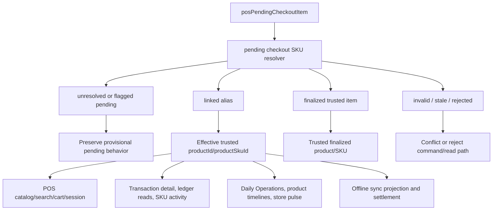
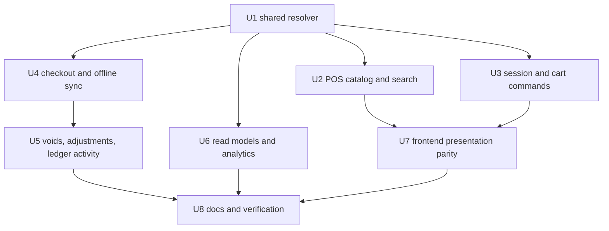

# fix: Treat linked pending checkout items as trusted SKU aliases

## Summary

Pending checkout review can now link a cashier-created pending item to a trusted catalog SKU, but the rest of POS still mostly treats that pending item as a provisional SKU. The requested behavior is stricter: once a pending checkout item is linked, that pending item becomes an alias to the trusted SKU. It should show up through POS, transaction detail, Daily Operations, product timelines, and analytics as the trusted SKU, while preserving the original `pendingCheckoutItemId` as sale evidence and audit provenance in server-owned records and role-appropriate DTOs.

The implementation should add one shared server-owned resolution contract for pending checkout item identity. Unresolved pending items keep the existing cashier-continuity behavior. Linked pending items resolve to their approved trusted product/SKU for display, ledger attribution, reporting, and future command behavior. Historical sale rows are not destructively rewritten in this slice; reads and commands compute an effective trusted identity from the pending item link using an immutable alias decision or an as-of alias history entry.

---

## Problem Frame

The new linking path exists in `packages/athena-webapp/convex/pos/public/catalog.ts`: `resolvePendingCheckoutItemReview` can set `status: "linked_to_catalog"` plus `approvedProductId` and `approvedProductSkuId`. Product-page binding and finalization also know about pending checkout review state. That creates the source-of-truth link, but most downstream code still branches on `pendingCheckoutItemId` or uses the stored provisional `productSkuId`.

That leaves several observable gaps:

| Surface | Current risk |
| --- | --- |
| POS catalog/search/cart | Linked rows can disappear from pending visibility without becoming a normal trusted SKU alias. |
| Session and expense commands | Validation still treats any `pendingCheckoutItemId` as pending/provisional. |
| Checkout completion and offline sync | Pending lines keep evidence-only handling and conflict semantics even after review linked them to trusted inventory. |
| Transaction detail, Daily Operations, product timelines, and store pulse | Reads group or route by provisional SKU instead of the approved trusted SKU. |
| Ledger and SKU activity | Existing activity associated with the pending item is not consistently attributed to the trusted SKU. |

The fix should be centralized. One-off React mapping or report-specific remapping would leave hidden disagreements between live POS behavior, synced sales, ledger reads, and operator review screens.

---

## Requirements

- R1. A linked pending checkout item must resolve to its approved trusted `productId` and `productSkuId` everywhere downstream code asks for the effective sale item identity.
- R2. The original `pendingCheckoutItemId`, provisional product/SKU anchors, cashier-entered label, sold quantity, local sync identity, and review evidence must remain available in server audit/source records and must be selectively exposed only through role-appropriate DTO fields.
- R3. Unresolved, flagged, rejected, or stale pending checkout items must preserve current cashier-continuity and conflict behavior unless a unit explicitly changes that state.
- R4. POS catalog, barcode lookup, local snapshot rows, search, cart projection, and checkout presentation must show the trusted SKU as a normal sellable item once the pending item is linked.
- R5. Online session, expense session, offline sync projection, and checkout completion must all use the same resolver for linked pending lines.
- R6. Financial ledger reads, transaction detail, Daily Operations, product timelines, store pulse, and SKU activity attribution must group linked pending sale activity under the trusted SKU while preserving pending-item provenance.
- R7. Inventory movements and stock count mutations must not be fabricated retroactively merely because a pending item was linked. If a trusted stock mutation exists or a future correction/void/adjustment creates one, its SKU attribution must use the trusted resolved SKU.
- R8. Voids, returns, adjustments, and correction commands for linked pending lines must be source-aware: reverse or mutate only real trusted inventory effects, but report and audit the correction against the trusted SKU alias.
- R9. The alias resolver must be server-side and shared by Convex command/read boundaries. React code should consume resolved DTOs rather than invent alias semantics.
- R10. Tests must cover online sale, offline synced sale, catalog/search, local snapshot, transaction detail, Daily Operations/product timeline, analytics grouping, void/adjustment behavior, and stale or invalid link conflicts.
- R11. Alias resolution must have an immutable/as-of contract so reports, transaction detail, Daily Operations, and product timelines cannot silently change historical meaning after EOD or after a later relink/reject/repair decision.
- R12. Public, storefront-facing, and low-privilege DTOs must not expose pending provenance fields such as cashier-entered label, local sync identity, review evidence, or raw conflict details.

---

## Scope Boundaries

- This plan does not redesign pending checkout review or product-page finalization.
- This plan does not migrate or destructively rewrite historical `posTransactionItem` rows.
- This plan may add narrowly scoped Convex indexes or lookup projections needed for bounded alias reads; it does not require a data backfill in the first slice.
- This plan does not make unresolved pending checkout items trusted inventory.
- This plan does not convert cashier-entered sold quantity into trusted `quantityAvailable`, `inventoryCount`, holds, or inventory movements without a real manager/admin inventory command.
- This plan does not move Open Work, Daily Operations, or analytics into ownership of catalog/inventory mutation. Those surfaces consume shared resolved read models.
- This plan does not change storefront visibility rules for reserved operational categories.

### Deferred to Follow-Up Work

- A production backfill that denormalizes effective trusted SKU ids onto old transaction rows, if read-time resolution later proves too expensive.
- A stock-repair workflow that converts linked pending sale evidence into an explicit manager-approved inventory correction.
- Broader Open Work UX changes for pending checkout review beyond consuming the resolved alias state.
- Multi-barcode product modeling outside the linked pending checkout alias use case.

---

## Context & Research

### Relevant Code

- `packages/athena-webapp/convex/schemas/pos/posPendingCheckoutItem.ts` defines pending checkout statuses and approved/provisional anchors.
- `packages/athena-webapp/convex/schema.ts` defines indexes for pending checkout items, transactions, SKU search, and POS read models.
- `packages/athena-webapp/convex/pos/public/catalog.ts` owns pending checkout review, linking, product-page binding, and trusted finalization.
- `packages/athena-webapp/convex/pos/application/queries/listRegisterCatalog.ts` builds POS catalog rows and pending availability exceptions.
- `packages/athena-webapp/convex/pos/application/commands/sessionCommands.ts` and `packages/athena-webapp/convex/pos/application/commands/expenseSessionCommands.ts` validate active register/expense lines.
- `packages/athena-webapp/convex/pos/application/commands/completeTransaction.ts` writes transaction items, inventory movements, and SKU activity for sales and voids.
- `packages/athena-webapp/convex/pos/application/sync/projectLocalEvents.ts` and `packages/athena-webapp/convex/pos/application/sync/ingestLocalEvents.ts` project and ingest offline sales.
- `packages/athena-webapp/convex/operations/dailyOperations.ts`, `packages/athena-webapp/convex/operations/operationalEvents.ts`, and `packages/athena-webapp/convex/pos/application/queries/storePulse.ts` consume sale/item identity for operator views and analytics.
- `packages/athena-webapp/convex/pos/public/transactions.ts` and `packages/athena-webapp/convex/pos/application/queries/getTransactions.ts` expose transaction detail.
- `packages/athena-webapp/src/lib/pos/presentation/register/catalogSearch.ts`, `packages/athena-webapp/src/lib/pos/presentation/register/catalogSearchPresentation.ts`, `packages/athena-webapp/src/lib/pos/presentation/register/registerCartProjection.ts`, and `packages/athena-webapp/src/lib/pos/presentation/register/useRegisterViewModel.ts` project catalog rows into POS search/cart behavior.
- `packages/athena-webapp/src/components/add-product/ProductStock.tsx` is the current product-page review/link surface.

### Institutional Learnings

- `docs/solutions/architecture-patterns/athena-pending-checkout-inventory-resolution-2026-07-03.md`: product-page/catalog finalization owns the transition to trusted catalog inventory; Open Work and Daily Operations should route and expose state, not mutate inventory directly.
- `docs/solutions/architecture/athena-pos-pending-checkout-item-recovery-2026-06-06.md`: pending checkout preserves cashier continuity and sale evidence; `pendingCheckoutItemId` must survive through session items, transaction items, and sync projection.
- `docs/solutions/architecture/athena-pos-provisional-import-availability-2026-06-11.md`: POS snapshot, availability, full snapshot, barcode/SKU lookup, and exact product-id lookup must stay aligned.
- `docs/solutions/logic-errors/athena-sku-activity-traceability-2026-05-13.md`: stock and reservation boundaries need source-aware SKU activity with proven sources.
- `docs/solutions/logic-errors/athena-pos-sync-settlement-contract-2026-06-27.md`: local sync settlement needs durable identity and explicit projected/conflicted/held/rejected outcomes.
- `docs/solutions/logic-errors/athena-pos-ledger-safe-corrections-2026-04-30.md`: completed transaction facts are ledger facts; corrections should be auditable workflows, not silent row rewrites.
- `docs/solutions/architecture/athena-store-pulse-daily-operations-reuse-2026-06-22.md` and `docs/solutions/logic-errors/athena-daily-operations-aggregate-read-model-2026-05-08.md`: Daily Operations and analytics should consume server-owned source models, not compute parallel React-only truth.

---

## Key Technical Decisions

- **Introduce an effective pending checkout SKU resolver.** Create a shared Convex application helper that classifies pending checkout item identity as unresolved pending, linked alias, finalized trusted item, rejected/stale, or invalid. Downstream code should ask for effective product/SKU identity instead of re-checking pending statuses ad hoc.
- **Use `linked_to_catalog` as the alias state.** A pending item with `status: "linked_to_catalog"` and valid `approvedProductId` / `approvedProductSkuId` resolves to the approved trusted SKU. `approved` remains the existing finalization path for a promoted provisional item unless implementation finds legacy approved rows that explicitly need alias handling.
- **Preserve provenance; resolve identity at command/read boundaries.** `pendingCheckoutItemId` remains in stored sale/source records and is exposed through DTOs only where the caller is authorized for that provenance. The effective trusted SKU is computed for display, reporting, and future command decisions rather than rewriting every existing row.
- **Separate attribution from stock mutation.** Linked pending sales should count under the trusted SKU for ledger/report reads and SKU activity attribution. They should not create retroactive inventory movements unless a real source command exists. Future voids/adjustments should attribute to the trusted SKU while only reversing stock effects that actually happened.
- **Server read models own alias semantics.** POS catalog snapshots, transaction detail, Daily Operations, store pulse, and product timelines should receive resolved DTOs from Convex. React search/cart code can simplify once the rows already carry trusted identity.
- **Offline and online paths must share the same classification.** Local sync projection cannot have a parallel pending-link interpretation; it should reuse the same resolver outcome and keep explicit conflict states for stale or invalid links.
- **Performance-sensitive queries need bounded lookup paths.** Register catalog and analytics should avoid per-row hydration. If read-time alias resolution needs pending-item batches, implementation should use existing indexes or add narrowly scoped indexed lookup helpers before broad scans.
- **Alias decisions must be immutable after attribution.** Once a linked pending item has been used to attribute sale activity to a trusted SKU, later review changes must be modeled as a new audited correction or alias-history entry, not by mutating the meaning of previous reports.
- **Stored transaction facts remain distinct from effective DTO identity.** Existing `posTransactionItem.productId` / `productSkuId` values remain the recorded sale-line anchors. Resolved read DTOs may expose `effectiveProductId` / `effectiveProductSkuId` or equivalent trusted identity fields for alias attribution. Implementers should not overload stored `productSkuId` to mean both stock-mutating SKU and read-time alias SKU without an explicit schema/read-model contract.
- **Lookup aliases are not barcode overwrites.** Pending lookup codes should survive linking through a narrow alias lookup/projection that maps the pending code to the approved SKU when safe. The implementation should not overwrite an approved SKU's existing barcode to preserve a pending lookup code.

---

## Open Questions

### Resolved During Planning

- **Should linked pending rows be backfilled into historical transaction rows first?** No. Use command/read-time resolution in this slice and preserve ledger provenance.
- **Should unresolved pending behavior change?** No. Unresolved/flagged pending items keep the cashier-continuity behavior and inventory exclusion rules.
- **Should linking immediately decrement trusted inventory for old cashier sales?** No. Linking changes attribution and alias identity; trusted stock movement requires an actual inventory-affecting command.
- **Should Daily Operations or Open Work own the catalog/inventory mutation?** No. They consume resolved read models and route to the owning workflow.
- **Should React implement alias interpretation independently?** No. React consumes server-resolved DTOs and preserves UI parity.
- **Can a linked alias be freely relinked after it has attributed sale activity?** No. After attribution, the original alias decision must be terminal for those historical reads unless a new audited correction/as-of alias-history record explicitly changes later interpretation.
- **Should a pending lookup code overwrite an existing trusted SKU barcode?** No. Preserve existing trusted barcode data and add a pending-alias lookup/projection for the linked pending code.

### Deferred to Implementation

- Whether old `approved` pending rows with different `approvedProductSkuId` values exist and need a compatibility branch in the resolver.
- Whether the first implementation should use only indexes plus bounded range hydration, or add a denormalized alias-read projection for store pulse and product timelines. The plan requires bounded reads either way.
- Whether a non-stock `skuActivity` event should be written at link time to make the alias attribution change visible in product timelines.

---

## High-Level Technical Design

The shared resolver should return enough shape for each caller to make source-aware decisions without duplicating status checks:

| Outcome | Effective product/SKU | Provenance | Stock mutation policy | Caller behavior |
| --- | --- | --- | --- | --- |
| Unresolved pending | Provisional pending anchors | `pendingCheckoutItemId`, cashier label, local sale evidence | No trusted stock mutation | Existing pending checkout behavior |
| Linked alias | Approved trusted product/SKU | Preserve pending id and provisional anchors | Use trusted SKU only for real future mutations; do not fabricate retroactive movements | Treat as trusted SKU for display, ledger/report attribution, cart/session validation, and correction routing |
| Finalized trusted item | Final trusted product/SKU, typically the former provisional SKU | Preserve pending id when present | Normal trusted SKU policy for future trusted commands | Treat as trusted SKU, not active pending review |
| Rejected/stale/invalid | None or provisional evidence only | Preserve evidence for audit/conflict | No trusted stock mutation | Conflict, reject, or hide from trusted sale paths according to caller |

### Ledger Immutability and As-Of Alias Contract

The resolver must not make historical reports depend on a mutable current pending-item row without an as-of rule. The v1 contract is terminal linking after attribution; alias-history relinking is deferred.

- Initial linking records an immutable alias decision with `aliasDecisionAt` and `aliasEffectiveAt`.
- `aliasDecisionAt` is the review/link command time.
- `aliasEffectiveAt` is the earliest pending sale evidence timestamp covered by that pending checkout item unless implementation discovers a narrower source-specific timestamp is required.
- `linked_to_catalog` becomes terminal once the pending item has transaction attribution, detected by a bounded `posTransactionItem.pendingCheckoutItemId` lookup or existing pending sale evidence.
- `resolvePendingCheckoutItemReview` must reject relink/reject attempts after attribution with an operator-safe conflict. Relinking after attribution is deferred to a future audited correction/alias-history workflow.
- Current reads after the link use the immutable alias decision to attribute covered historical and future activity to the trusted SKU, with audit provenance.
- Closed as-of reports for a time before `aliasDecisionAt` remain reproducible as they were known at that time unless the caller explicitly requests current reclassification. This keeps EOD/reporting-window reads from drifting silently while still letting current operational reads show the trusted SKU everywhere after link.
- Relink/reject/repair after attribution is follow-up work and must be a new audited correction or alias-history entry that records prior target, next target, actor, reason, decision time, and effective time.
- Tests must cover sale-before-link, link-after-EOD, current report after link, as-of-EOD report before link, attempted relink/reject after sale attribution, and current/as-of reporting after a correction.

### Stored Facts vs Effective DTO Fields

The implementation must keep stored transaction facts and resolved read identity separate:

| Field category | Meaning | Examples |
| --- | --- | --- |
| Stored sale anchors | What the transaction item recorded at the time of sale or sync | `posTransactionItem.productId`, `posTransactionItem.productSkuId`, `pendingCheckoutItemId` |
| Server provenance | Audit/source evidence retained for privileged diagnostics and correction workflows | provisional anchors, cashier label, sold quantity, local sync identity, review actor/evidence |
| Effective read identity | Trusted product/SKU used for linked alias display, reporting, grouping, and routing | `effectiveProductId`, `effectiveProductSkuId`, resolved product/SKU DTO fields |
| Stock mutation source | The inventory movement or correction command that actually changed stock | inventory movement id, adjustment id, void/reversal movement id |

U4 must persist or expose effective identity through explicit fields or read-model composition. It must not silently change the meaning of stored `productSkuId` unless implementation first updates all downstream consumers and tests that depend on that field.

Pre-link and post-link sales have different storage rules:

- Transactions completed before the pending item was linked keep their stored provisional anchors and resolve trusted attribution through the immutable/as-of alias contract.
- Transactions completed after the pending item is already linked persist the approved trusted `productId` / `productSkuId` as the transaction sale anchors and create normal trusted inventory/hold effects when the command otherwise would. `pendingCheckoutItemId` is preserved only as provenance for the original alias source.

### DTO Exposure and Authorization

Resolved alias DTOs need a field-level exposure contract:

| Surface | Trusted identity | Pending provenance exposure |
| --- | --- | --- |
| POS catalog/search/cart for authorized POS staff | Yes | `pendingCheckoutItemId` only when required for command provenance; no review evidence or local sync identity |
| Transaction detail, Daily Operations, product timelines, store pulse for audit-authorized roles | Yes | Redacted alias provenance sufficient for diagnostics; raw cashier label, local sync identity, and review evidence only behind existing transaction/audit authorization |
| Public catalog snapshots, storefront-facing surfaces, and low-privilege views | Yes where the trusted SKU is otherwise visible | No pending provenance fields, no raw conflict details |
| Internal command/correction workflows | Yes | Full provenance may be read server-side after store/role authorization checks |

Validation must assert unauthorized readers cannot receive `pendingCheckoutItemId`, cashier-entered label, local sync identity, review evidence, or raw conflict details beyond operator-safe messages.

### Index and Query Contract

The first implementation must make alias reads bounded. Add schema/index work where needed instead of relying on broad scans:

- Add or verify a pending-checkout lookup by store/status/approved SKU or equivalent so product timelines and linked-SKU reads can find linked pending aliases without scanning all pending items.
- Add or verify a transaction-item lookup by `pendingCheckoutItemId` or equivalent bounded path so linked pending sale evidence can be joined to transaction reads without scanning all transaction items.
- Add a `posTransactionItem` index `by_pendingCheckoutItemId` for attribution checks and pending-origin joins.
- Add a pending checkout index by `storeId`, `status`, and `approvedProductSkuId` if linked-SKU/product-timeline reads need reverse alias lookup.
- Keep store pulse and transaction-history resolution inside already bounded date/session/transaction ranges unless an indexed alias join is available.
- Add tests that fail if linked alias reporting depends on unbounded pending-item or transaction-item scans.

### Lookup Alias Contract

The linked pending lookup code must not be treated as a second primary barcode unless the catalog model explicitly supports it:

- Add a `posPendingCheckoutLookupAlias` table/projection, or explicitly extend an existing projection, with `storeId`, `normalizedLookupCode`, `pendingCheckoutItemId`, `productId`, `productSkuId`, `status`, `createdAt`, and `updatedAt`.
- Add indexes `by_storeId_normalizedLookupCode_status` and `by_storeId_productSkuId_status` on the lookup alias projection.
- If the approved trusted SKU has no barcode and existing review code safely attaches the pending lookup code, the SKU search projection should continue to find that trusted SKU.
- If the approved trusted SKU already has a barcode, preserve the existing barcode and store the pending lookup code in a pending-alias lookup/projection keyed by store and normalized code.
- If the pending lookup code is nil, empty, or conflicts with another trusted SKU/alias, the link should succeed only when the command can record a safe no-alias or conflict state with operator-safe feedback.
- Tests must cover nil lookup code, empty lookup code, existing target barcode, conflicting code, successful alias projection, and search projection rebuild.

### Stock Availability Invariant

Linked pending sale evidence changes attribution, not stock truth. Trusted availability may only reflect actual trusted stock mutations. The implementation must choose one of these safe outcomes per linked pending sale:

- Leave historical pending sale evidence excluded from trusted stock math and surface a visible reconciliation/repair state for authorized operations users; or
- Create a separate manager-approved stock repair/correction that records the actual inventory effect before trusted availability changes.

Tests must prove linked aliases do not double-decrement trusted stock, do not restore stock on void when no original trusted movement exists, and do not hide an overstated availability condition from authorized operations workflows.

---

## Implementation Units

- U1. **Add the shared pending checkout SKU resolver and query contract**

**Goal:** Establish one server-side contract for turning pending checkout item provenance into effective product/SKU identity with bounded lookup paths.

**Requirements:** R1, R2, R3, R5, R7, R9

**Dependencies:** None

**Files:**
- Add: `packages/athena-webapp/convex/pos/application/pendingCheckoutSkuResolution.ts`
- Add or modify: `packages/athena-webapp/convex/pos/application/pendingCheckoutSkuResolution.test.ts`
- Modify: `packages/athena-webapp/convex/schema.ts`
- Inspect as needed: `packages/athena-webapp/convex/schemas/pos/posPendingCheckoutItem.ts`
- Inspect as needed: `packages/athena-webapp/convex/pos/public/catalog.ts`

**Approach:**
- Define a helper that accepts store context plus either a pending checkout item id or a hydrated pending item.
- Classify `pending_review` and `flagged` as unresolved pending.
- Classify `linked_to_catalog` with valid approved product/SKU as a linked alias.
- Classify finalized trusted pending items separately so implementation does not accidentally regress product-page finalization.
- Validate store ownership, approved target existence, SKU/product relationship, trusted catalog eligibility, and stale/rejected statuses.
- Return a compact outcome carrying effective product/SKU ids, provenance fields, stock mutation policy, and conflict reason where applicable.
- Add the index/query helpers needed for approved-SKU alias lookup and pending-id transaction joins, or explicitly constrain callers to already bounded transaction ranges where no new index is needed.
- Add `posTransactionItem.by_pendingCheckoutItemId` and the linked pending reverse lookup index/projection required by the chosen read paths.
- Define the v1 terminal-after-attribution alias decision contract before any read model consumes linked aliases.
- Keep the helper in the application layer to avoid React, public API, and command modules each implementing their own status matrix.

**Test scenarios:**
- `linked_to_catalog` resolves to `approvedProductId` / `approvedProductSkuId` and preserves the original pending id and provisional SKU.
- `pending_review` and `flagged` preserve existing unresolved pending classification.
- Missing approved SKU, cross-store target, archived/untrusted target, or rejected status returns a conflict outcome.
- Finalized trusted pending rows do not get treated as active pending review rows.
- Attempted relink/reject after sale attribution either requires an audited correction/as-of record or returns a protected conflict.
- Product timeline and linked-SKU lookups use indexed or bounded query paths.

**Verification:**
- Resolver tests cover every status and invalid-target branch.

- U2. **Make POS catalog, lookup, and snapshot rows alias-aware**

**Goal:** A linked pending checkout item should show up in POS as the trusted SKU without duplicate provisional rows or missing lookup behavior.

**Requirements:** R1, R3, R4, R9, R10

**Dependencies:** U1

**Files:**
- Modify: `packages/athena-webapp/convex/pos/application/queries/listRegisterCatalog.ts`
- Modify: `packages/athena-webapp/convex/pos/application/queries/searchCatalog.ts`
- Modify: `packages/athena-webapp/convex/pos/infrastructure/repositories/catalogRepository.ts`
- Modify: `packages/athena-webapp/convex/schema.ts`
- Modify: `packages/athena-webapp/convex/pos/public/catalog.ts`
- Modify: `packages/athena-webapp/convex/pos/application/queries/listRegisterCatalog.test.ts`
- Modify: `packages/athena-webapp/convex/pos/application/queries/searchCatalog.test.ts`
- Modify: `packages/athena-webapp/convex/pos/public/catalog.test.ts`

**Approach:**
- Keep unresolved pending rows in the existing pending-review lane.
- For linked pending rows, surface the approved trusted SKU as the effective sellable row and carry pending alias metadata only as provenance where the DTO supports it.
- Ensure barcode, lookup code, SKU search projection, full snapshot, exact SKU lookup, and availability rules agree.
- Preserve existing trusted SKU barcodes; use a pending-alias lookup/projection for linked pending lookup codes when the target SKU already has a barcode.
- Implement or update `posPendingCheckoutLookupAlias` with store/code and store/SKU status indexes, then wire `searchCatalog` and `catalogRepository` to consult it before falling back to SKU barcode/SKU search.
- Cover nil lookup code, empty lookup code, existing target barcode, conflicting code, successful alias projection, and search projection rebuild.
- Avoid per-row hydration in `listRegisterCatalog`, `listRegisterCatalogAvailability`, and `listRegisterCatalogAvailabilitySnapshot`; use batched or indexed pending-alias lookups if linked metadata must be composed into the snapshot.
- Preserve reserved category exceptions for POS staff while keeping storefront visibility untouched.

**Test scenarios:**
- A linked pending item appears through trusted SKU lookup and does not also appear as an active pending-review product.
- Barcode/lookup code attached during review finds the trusted SKU when safely attached or projected as a pending alias.
- A linked pending lookup code does not overwrite an existing trusted SKU barcode.
- Full catalog snapshot and targeted availability agree on the trusted SKU.
- High-cardinality catalog tests prove alias metadata does not introduce row-by-row database reads.

**Verification:**
- Catalog and public catalog tests pass with linked, unresolved, and rejected pending fixtures.

- U3. **Apply alias resolution to session, expense, and cart command paths**

**Goal:** Adding or editing a linked pending item in active POS flows should behave like the trusted SKU while retaining pending provenance.

**Requirements:** R1, R2, R3, R5, R7, R9

**Dependencies:** U1, U2

**Files:**
- Modify: `packages/athena-webapp/convex/pos/application/commands/sessionCommands.ts`
- Modify: `packages/athena-webapp/convex/pos/application/commands/expenseSessionCommands.ts`
- Modify related command tests under `packages/athena-webapp/convex/pos/application/`
- Modify as needed: `packages/athena-webapp/src/lib/pos/presentation/register/registerCartProjection.ts`
- Modify as needed: `packages/athena-webapp/src/lib/pos/presentation/register/useRegisterViewModel.ts`
- Modify: `packages/athena-webapp/src/lib/pos/presentation/register/registerCartProjection.test.ts`

**Approach:**
- Replace local pending-status checks with the shared resolver.
- When the outcome is linked alias, use the trusted product/SKU for line identity, merge/conflict checks, pricing/availability policy, and hold validation.
- Preserve `pendingCheckoutItemId` on the line as provenance so transaction completion and audit reads can still trace the cashier-originated evidence.
- Keep unresolved pending items on the existing provisional path.
- Ensure cart projection does not treat `pending_checkout:<id>` and the trusted SKU as two distinct sellable sources after linking.

**Test scenarios:**
- A linked pending item added to cart merges with an existing trusted SKU line or conflicts according to existing trusted-SKU rules.
- An unresolved pending item still behaves as a pending checkout line and keeps current provisional validation.
- A stale/rejected link fails with an operator-safe conflict instead of silently selling an invalid target.
- Expense session paths follow the same classification as register session paths.

**Verification:**
- Focused command and cart projection tests pass.

- U4. **Align checkout completion and offline sync settlement**

**Goal:** Online checkout and offline synced checkout must settle linked pending lines with the same effective trusted identity and explicit conflict behavior.

**Requirements:** R1, R2, R3, R5, R7, R9, R10

**Dependencies:** U1, U3

**Files:**
- Modify: `packages/athena-webapp/convex/pos/application/commands/completeTransaction.ts`
- Modify: `packages/athena-webapp/convex/pos/application/sync/projectLocalEvents.ts`
- Modify: `packages/athena-webapp/convex/pos/application/sync/ingestLocalEvents.ts`
- Modify: `packages/athena-webapp/convex/pos/application/completeTransaction.test.ts`
- Modify related sync tests under `packages/athena-webapp/convex/pos/application/sync/`

**Approach:**
- Resolve pending line identity before writing transaction item effects.
- For linked alias lines, keep stored sale anchors and pending provenance distinct from effective trusted DTO fields. If new persisted effective fields are added, document and test their meaning separately from stock mutation fields.
- Preserve pending evidence recording for unresolved pending lines.
- Keep local sync outcomes explicit: projected, held, conflicted, or rejected should not blur together.
- Do not rely on receipt number or incidental cloud ids for link settlement; use pending item id and the existing durable local mapping keys.
- Do not create retroactive trusted inventory movement for old pending evidence simply because the link exists.
- For transactions completed after the pending item is already linked, persist the approved trusted product/SKU as the sale anchors and apply normal trusted inventory/hold effects when the command otherwise would. Preserve `pendingCheckoutItemId` only as provenance.
- For transactions completed before linking, keep stored provisional anchors and resolve trusted attribution through the immutable/as-of alias contract.

**Test scenarios:**
- Online checkout with a linked pending item records trusted SKU attribution and preserves pending provenance.
- Stored transaction facts, effective read identity, and stock mutation source remain distinguishable for linked pending lines.
- A pre-link sale followed by link-after-EOD appears under the trusted SKU in current reads with alias provenance, while the as-of-EOD report before `aliasDecisionAt` remains reproducible.
- A post-link sale stores trusted SKU anchors and creates normal trusted hold/inventory effects when applicable.
- Offline sync of a sale whose pending item was linked before ingest settles to the trusted SKU.
- Offline sync of a stale or rejected pending link creates the correct conflict outcome.
- Unresolved pending checkout sync remains evidence-only and does not decrement trusted stock.

**Verification:**
- Checkout and sync tests pass for online, offline, linked, unresolved, and stale fixtures.

- U5. **Make voids, adjustments, and SKU activity source-aware**

**Goal:** Ledger activity associated with a linked pending item should attribute to the trusted SKU without inventing stock history.

**Requirements:** R1, R2, R6, R7, R8, R10

**Dependencies:** U1, U4

**Files:**
- Modify: `packages/athena-webapp/convex/pos/application/commands/completeTransaction.ts`
- Modify: `packages/athena-webapp/convex/pos/application/commands/adjustTransactionItems.ts`
- Modify: `packages/athena-webapp/convex/operations/inventoryMovements.ts`
- Modify or inspect: `packages/athena-webapp/convex/operations/skuActivity.ts`
- Modify related command and operation tests.

**Approach:**
- Resolve effective SKU for transaction corrections before writing ledger/audit activity.
- Attribute correction, void, and adjustment evidence to the trusted SKU when the pending item is linked.
- Reverse only inventory movements that actually exist. If the original pending sale never decremented trusted stock, do not restore stock during void merely because a later link exists.
- Add source-aware SKU activity where an alias resolution or correction changes what product timeline the operator should inspect.
- Preserve audit fields that make the original pending item, sale, actor, reason, and command source visible.

**Test scenarios:**
- Voiding a linked pending sale attributes the correction to the trusted SKU timeline.
- Voiding an unresolved pending sale does not create trusted inventory movement.
- Voiding a linked pending sale with no original trusted movement does not restore trusted stock.
- Adjusting a transaction item linked through pending alias attributes financial/read activity to the trusted SKU while preserving pending provenance.
- SKU activity shows source evidence for linked alias activity and does not double-subtract checkout reservations.

**Verification:**
- Void, adjustment, inventory movement, and SKU activity tests pass.

- U6. **Update transaction, Daily Operations, timeline, and analytics read models**

**Goal:** Every operator/reporting read that shows sale activity should use the trusted SKU for linked pending aliases.

**Requirements:** R1, R2, R6, R9, R10

**Dependencies:** U1, U4, U5

**Files:**
- Modify: `packages/athena-webapp/convex/pos/application/queries/getTransactions.ts`
- Modify: `packages/athena-webapp/convex/pos/public/transactions.ts`
- Modify: `packages/athena-webapp/convex/operations/dailyOperations.ts`
- Modify: `packages/athena-webapp/convex/operations/operationalEvents.ts`
- Modify: `packages/athena-webapp/convex/pos/application/queries/storePulse.ts`
- Modify related tests: `packages/athena-webapp/convex/operations/dailyOperations.test.ts`, `packages/athena-webapp/convex/operations/operationalEvents.test.ts`, transaction query tests, and store pulse tests.

**Approach:**
- Introduce a resolved sale-item DTO or helper that read models can consume without duplicating pending alias logic.
- Transaction detail should show trusted SKU identity and retain `pendingCheckoutItemId` / alias provenance for diagnostics.
- Transaction detail should expose trusted SKU identity and role-appropriate redacted alias provenance. Low-privilege and public surfaces must not receive raw pending provenance.
- Daily Operations should route linked pending activity to the trusted product/SKU timeline.
- Daily Operations or the product timeline should surface an authorized reconciliation/repair state when historical pending sale evidence is linked without a trusted stock repair, so operators can see trusted availability may be overstated.
- Store pulse and top-item analytics should group linked pending sales under the trusted SKU.
- Product timeline subject bridging should include approved trusted SKU ids for linked pending items, not only provisional SKU ids.
- Keep financial redaction and operating-date windows unchanged.
- Use indexed alias joins or already bounded transaction/date ranges; do not scan all pending items or transaction items to answer product timeline or store pulse reads.

**Test scenarios:**
- Transaction detail for an authorized/audit-appropriate linked pending sale returns trusted identity plus role-appropriate alias provenance.
- Unauthorized transaction/detail readers receive trusted attribution without raw pending provenance.
- Daily Operations product activity for the trusted SKU includes the linked pending sale.
- Authorized operations users can see a reconciliation/repair indicator for linked historical pending sale evidence that did not create trusted stock movement.
- Store pulse top-items grouping includes linked pending sale quantity/revenue under the trusted SKU.
- Product timeline search by approved trusted SKU finds pending-origin activity after linking.
- Unresolved pending sales remain excluded from trusted SKU reports where current policy excludes them.

**Verification:**
- Read-model and operations tests pass.

- U7. **Simplify frontend presentation around resolved DTOs**

**Goal:** POS UI and product review surfaces should display linked aliases consistently without React-side truth forks.

**Requirements:** R4, R6, R9, R10

**Dependencies:** U2, U3, U6

**Files:**
- Modify as needed: `packages/athena-webapp/src/lib/pos/presentation/register/catalogSearch.ts`
- Modify as needed: `packages/athena-webapp/src/lib/pos/presentation/register/catalogSearchPresentation.ts`
- Modify as needed: `packages/athena-webapp/src/lib/pos/presentation/register/registerCartProjection.ts`
- Modify as needed: `packages/athena-webapp/src/components/add-product/ProductStock.tsx`
- Modify related frontend tests.

**Approach:**
- Prefer server-resolved product/SKU ids in POS search and display.
- Remove or narrow any special case that keeps a linked pending item keyed by `pending_checkout:<id>` once the DTO says it is trusted alias.
- Keep product-page review copy calm and operational: linked means "uses trusted SKU" with provenance available, not a separate inventory repair claim.
- Avoid new visible explanatory panels unless implementation discovers an existing state needs clearer copy.

**Test scenarios:**
- Searching by pending lookup code after link shows the trusted SKU row.
- Cart display does not duplicate pending alias and trusted SKU rows.
- ProductStock binding still shows linked-target information and does not imply stock was retroactively changed.

**Verification:**
- Frontend focused tests pass.

- U8. **Document the alias contract and run integration verification**

**Goal:** Leave future agents with the architecture boundary and prove the cross-surface behavior is coherent.

**Requirements:** R1 through R12

**Dependencies:** U1 through U7

**Files:**
- Add: `docs/solutions/architecture/athena-pos-pending-checkout-sku-alias-2026-07-03.md`
- Modify as needed: `packages/athena-webapp/docs/agent/code-map.md`
- Run after code changes: graphify rebuild per repo instructions.

**Approach:**
- Document the resolver outcomes, alias/provenance split, and stock mutation boundary.
- Document the immutable/as-of alias contract, DTO exposure matrix, lookup alias projection, and availability invariant.
- Add or update package agent docs only if the helper becomes a durable navigation point.
- Run the focused Convex and frontend tests from the relevant units.
- Run the repo-required graph rebuild after implementation changes.

**Test scenarios:**
- No additional product behavior tests beyond the focused unit tests; this unit verifies documentation, graph, and plan coverage.

**Verification:**
- Focused unit test set passes.
- `bun run graphify:rebuild` completes after code changes.
- New solution note explains the linked alias contract.

---

## System-Wide Impact

- **Data model:** No destructive data migration is planned for the first slice. Existing approved fields on `posPendingCheckoutItem` are sufficient for the alias link, but narrowly scoped indexes or alias lookup projections may be added so reads remain bounded. Follow-up denormalization is possible if read-time resolution is still too expensive.
- **Command boundaries:** POS session, expense session, checkout completion, sync ingestion, voids, and adjustments must share one resolver outcome model.
- **Read models:** Transaction detail, product timelines, Daily Operations, store pulse, and SKU activity must stop treating provisional SKU ids as the final product identity once a link exists.
- **Local/offline behavior:** Local sync must keep durable identity and explicit conflict outcomes. Linked alias handling cannot depend on receipt numbers or display labels.
- **Performance:** Register catalog and analytics are hot paths. Alias composition must use bounded indexed lookups or batched hydration, with high-cardinality tests where query shape changes.
- **Auditability:** `pendingCheckoutItemId` must remain visible to authorized internal diagnostics and source events so the cashier-originated sale can still be traced after linked attribution.
- **Security/authorization:** The existing review/link command remains the authority for creating the alias. Downstream reads should not allow cross-store approved SKU targets or unauthorized metadata exposure, and DTOs must follow the exposure matrix above.

---

## Risks & Mitigations

| Risk | Mitigation |
| --- | --- |
| Retroactive inventory drift | Separate attribution from stock mutation; only reverse or create real trusted movements through source commands. |
| Retroactive report drift | Make linked alias decisions terminal after attribution in v1; future relinks require an audited correction/alias-history workflow. |
| Parallel alias logic | Centralize resolver and update all command/read surfaces to consume it. |
| Read amplification in catalog or analytics | Use indexed/batched lookup helpers and add high-cardinality coverage before shipping. |
| Lost audit trail | Preserve `pendingCheckoutItemId`, provisional anchors, local sync identity, and review evidence in server records; expose only role-appropriate redacted DTO provenance. |
| Provenance data leakage | Keep provenance in server records and expose only role-appropriate redacted DTO fields. |
| Stale linked target | Resolver validates store, target existence, SKU/product relationship, and trusted eligibility; stale rows conflict instead of silently selling. |
| UI duplication | Server DTOs expose trusted identity; frontend tests cover cart/search dedupe. |

---

## Validation Plan

- Resolver unit tests for every pending status and invalid linked target.
- Alias immutability/as-of tests for link, attempted relink/reject after attribution, and reporting after EOD.
- Temporal alias tests for sale-before-link, link-after-EOD, current report after link, as-of-EOD report before link, and post-link sale storage.
- Catalog tests for full snapshot, targeted lookup, barcode/lookup code, pending exclusion, and high-cardinality behavior.
- Lookup alias tests for nil lookup code, empty lookup code, existing target barcode, conflicting code, successful alias projection, and search projection rebuild.
- Session and expense command tests for linked alias, unresolved pending, and stale/rejected conflicts.
- Checkout and sync tests for online linked sales, offline linked sales, unresolved pending evidence-only sales, and sync conflicts.
- Void/adjustment/SKU activity tests for trusted attribution without fabricated stock movement.
- Transaction detail, Daily Operations, operational events, store pulse, and timeline tests for trusted SKU grouping and pending provenance.
- Authorization/redaction tests proving unauthorized readers cannot receive raw pending provenance or conflict details.
- Frontend POS search/cart/ProductStock tests for resolved DTO consumption and no duplicate rows.
- Graphify rebuild after implementation code changes.

---

## Sources & References

- Repo research subagent findings, 2026-07-03: linked pending review exists, but command/read surfaces still mostly use provisional SKU identity.
- Learnings research subagent findings, 2026-07-03: preserve cashier-continuity evidence, source-owned review authority, sync settlement identity, SKU activity traceability, and Daily Operations read-model ownership.
- `docs/solutions/architecture-patterns/athena-pending-checkout-inventory-resolution-2026-07-03.md`
- `docs/solutions/architecture/athena-pos-pending-checkout-item-recovery-2026-06-06.md`
- `docs/solutions/architecture/athena-pos-provisional-import-availability-2026-06-11.md`
- `docs/solutions/logic-errors/athena-sku-activity-traceability-2026-05-13.md`
- `docs/solutions/logic-errors/athena-pos-sync-settlement-contract-2026-06-27.md`
- `docs/solutions/logic-errors/athena-pos-ledger-safe-corrections-2026-04-30.md`
- `docs/solutions/architecture/athena-store-pulse-daily-operations-reuse-2026-06-22.md`
- `docs/solutions/logic-errors/athena-daily-operations-aggregate-read-model-2026-05-08.md`
