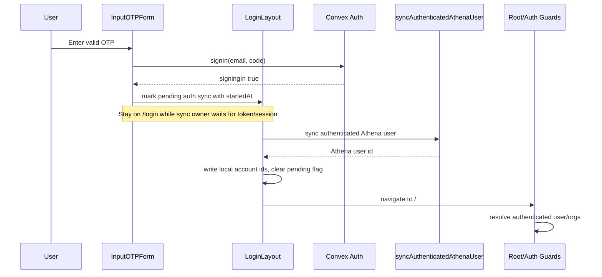

# fix: Stabilize login OTP auth-sync handoff

## Summary

Make email OTP login complete the Convex Auth -> Athena user sync before the app routes through authenticated guards. The implementation should keep the existing Convex Auth OTP provider, preserve the pending-auth-sync handoff used by POS recovery login, and add regression coverage for the no-reload path that currently fails after OTP entry.

---

## Problem Frame

After a valid server-generated OTP is entered at `/login`, users can be sent back to the login page and must manually reload before the authenticated app appears. Research points to a route timing race: the OTP form navigates to `/` immediately after Convex Auth accepts the OTP, but `LoginLayout` is the component that owns the Athena-user sync and route guards can still observe a transient signed-out state.

---

## Requirements

- R1. A successful email OTP submission must lead to the authenticated Athena app without requiring a manual reload.
- R2. Athena user sync must finish before the flow depends on authenticated route guards.
- R3. Existing retry behavior for retryable auth-sync failures must remain intact.
- R4. Invalid, expired, or reused OTPs must not set pending auth state, store local user ids, or navigate away from the OTP form.
- R5. POS recovery-code login must continue to use the same pending-auth-sync handoff without broadening POS/staff/manager authority semantics.
- R6. Auth route guards must treat a pending OTP sync as a loading/recovery window, not a deliberate sign-out.
- R7. The fix must be proven by focused unit/component tests and repeated live browser login attempts with `knownothing955@gmail.com`.
- R8. Pending auth-sync state is never auth proof and must fail closed through bounded metadata, expiry, and cleanup when no authenticated Convex session/token arrives.

---

## Scope Boundaries

- Do not replace Convex Auth, change the email OTP provider id, or introduce a custom session store.
- Do not store OTP codes, raw JWTs, recovery codes, staff proof, or manager proof in browser storage.
- Do not change POS local authority, staff PIN authentication, drawer/register authority, manager approval proof semantics, or offline POS sale policy.
- Do not redesign the login UI beyond small state/copy adjustments needed to reflect auth-sync progress.

### Deferred to Follow-Up Work

- Email OTP `redirectTo` parity with POS recovery login: useful if protected-route deep links need exact return destinations, but not required to fix the root reload race.

---

## Context & Research

### Relevant Code and Patterns

- `packages/athena-webapp/src/components/auth/Login/InputOTP.tsx` currently calls Convex Auth `signIn`, starts pending auth sync, and immediately `navigate({ to: "/" })`.
- `packages/athena-webapp/src/components/auth/Login/authSyncHandoff.ts` centralizes the `pending_athena_auth_sync` storage flag and `athena:pending-auth-sync` event.
- `packages/athena-webapp/src/components/auth/Login/PosRecoveryCodeForm.tsx` also starts pending auth sync and currently navigates to the POS redirect target immediately after provider success.
- `packages/athena-webapp/src/routes/login/-login-layout.tsx` waits for `useConvexAuth()` plus `useAuthToken()`, calls `api.inventory.auth.syncAuthenticatedAthenaUser`, writes `logged_in_user_id` and `athena.pos.app_account_id`, clears the pending flag, and navigates to `/`.
- `packages/athena-webapp/src/hooks/useAuth.ts` resolves the app-level Athena user from Convex Auth state and `api.inventory.athenaUser.getAuthenticatedUser`.
- `packages/athena-webapp/src/routes/-index-route-view.tsx` redirects signed-out users from `/` to `/login`.
- `packages/athena-webapp/src/routes/-authed-layout.tsx` protects the authenticated shell and redirects signed-out users to `/login`.
- `packages/athena-webapp/convex/auth.ts`, `packages/athena-webapp/convex/otp/EmailOTP.ts`, and `packages/athena-webapp/convex/lib/athenaUserAuth.ts` are the current Convex Auth and Athena-user mapping boundary.

### Institutional Learnings

- `docs/solutions/architecture/athena-pos-recovery-code-login-2026-06-03.md`: POS recovery login must create a real Convex Auth session and reuse the pending Athena auth-sync handoff; do not fake app auth state in local storage.
- `docs/solutions/architecture/athena-pos-hub-app-session-continuity-2026-06-02.md`: delayed Convex/Auth rehydration is a recovery window, not intentional logout, especially on POS routes.
- `docs/solutions/architecture/athena-pos-local-staff-authority-2026-05-14.md`: app login and staff authority are separate credentials; OTP success must not become operational staff proof.
- `docs/solutions/harness/convex-query-write-boundary-proof-2026-06-18.md`: query/read paths should not perform auth/session repair writes; sync mutations own inserts and patches.

### External References

- None. Local Convex Auth patterns and repo-specific login recovery code are sufficient for this bug fix.

---

## Key Technical Decisions

- Keep sync ownership in `LoginLayout`: The login route already owns retryable sync, local id storage, and safe inline failures. The OTP form should start the handoff and remain in the login route until that owner completes.
- Treat pending sync as loading/recovery state: Route guards should not classify a user as signed out while the explicit pending handoff flag says the app is still completing login.
- Bound pending sync fail-closed: The pending flag must carry metadata such as `startedAt` and optional redirect target, must expire, and must be cleared on auth-sync failure, sign-out/no-session settlement, invalid handoff metadata, or timeout.
- Preserve server authority: `syncAuthenticatedAthenaUser` remains the only place that creates or resolves the Athena user from the authenticated Convex session.
- Keep browser storage minimal: The pending flag is a control flag only; durable account ids are written only after the server sync returns an Athena user id.

---

## Open Questions

### Resolved During Planning

- Should the OTP submitter keep navigating immediately to `/`? No. That is the likely race trigger because it can unmount the sync owner before the Convex Auth state is observable to the app.
- Should this change touch Convex OTP generation or MailerSend? No. The bug is in the post-OTP client handoff, not code generation or delivery.

### Deferred to Implementation

- Exact helper shape for checking pending auth sync: implementation should reuse `authSyncHandoff.ts` or a small adjacent helper if tests show multiple route surfaces need the same read logic.
- Whether a route-level integration test is practical with the current TanStack Router test harness: if too expensive, add focused component/hook tests that simulate the same state transition.
- Exact TTL value for pending auth-sync metadata: choose a short window long enough for normal Convex Auth session propagation but short enough to prevent stale client-controlled loading state from persisting.

---

## High-Level Technical Design

> *This illustrates the intended approach and is directional guidance for review, not implementation specification. The implementing agent should treat it as context, not code to reproduce.*

---

## Implementation Units

- U1. **Characterize the OTP handoff race**

**Goal:** Add focused failing coverage that captures OTP success followed by delayed Convex Auth/Athena sync without requiring reload.

**Requirements:** R1, R2, R6, R7, R8

**Dependencies:** None

**Files:**
- Modify: `packages/athena-webapp/src/components/auth/Login/InputOTP.test.tsx`
- Modify: `packages/athena-webapp/src/routes/login/_layout.test.tsx`
- Modify: `packages/athena-webapp/src/hooks/useAuth.test.tsx`
- Modify if practical: `packages/athena-webapp/src/routes/-index-route-view.test.tsx` or nearest existing route-guard test

**Approach:**
- Start test-first with the current race: OTP success marks pending auth sync, Convex Auth/token state is not ready yet, and the flow must not depend on root guard redirecting back to login.
- Add or adjust assertions so the OTP form remains in handoff-pending state until `LoginLayout` completes sync.
- Add guard-level coverage that a pending auth-sync flag prevents signed-out redirect decisions from being treated as final.

**Execution note:** Test-first. Confirm at least one focused test fails before implementation.

**Patterns to follow:**
- `packages/athena-webapp/src/routes/login/_layout.test.tsx` for mocked Convex Auth transitions and retryable sync assertions.
- `packages/athena-webapp/src/components/auth/Login/InputOTP.test.tsx` for OTP submit, pending flag, and auth-sync-failed event behavior.
- `packages/athena-webapp/src/hooks/useAuth.test.tsx` for loading/recovery state modeling.

**Test scenarios:**
- Happy path: OTP submit returns `signingIn: true` -> pending flag is set, the OTP form enters handoff-pending state, and it does not navigate away before sync completion.
- Edge case: Convex Auth is initially loading or unauthenticated with pending sync -> login layout does not call sync until token/session is ready.
- Integration: pending sync flag exists while app auth is transiently null -> route guard remains loading or returns null without navigating to `/login`.
- Error path: auth-sync failure re-enables OTP entry, clears or expires the pending flag, and does not write `LOGGED_IN_USER_ID_KEY` or `POS_APP_ACCOUNT_ID_KEY`.
- Security edge case: stale or tampered pending metadata plus no Convex token/session resolves signed out, clears the flag, does not call sync, and redirects normally.
- Security edge case: pre-existing local account ids are not treated as authority for a new OTP handoff until `syncAuthenticatedAthenaUser` returns the server-confirmed Athena user.
- Security edge case: invalid, expired, or reused OTP leaves pending auth-sync absent and leaves durable auth/POS account storage unchanged except for explicit stale-state cleanup.

**Verification:**
- The focused tests fail against the current behavior and pass once the handoff is stabilized.

---

- U2. **Stabilize the login-route auth-sync handoff**

**Goal:** Keep successful OTP and POS recovery login inside the login route until Athena user sync writes local account ids, then route to the authenticated app or stored POS redirect.

**Requirements:** R1, R2, R3, R4, R5, R7, R8

**Dependencies:** U1

**Files:**
- Modify: `packages/athena-webapp/src/components/auth/Login/InputOTP.tsx`
- Modify: `packages/athena-webapp/src/components/auth/Login/PosRecoveryCodeForm.tsx`
- Modify: `packages/athena-webapp/src/components/auth/Login/authSyncHandoff.ts`
- Modify: `packages/athena-webapp/src/routes/login/-login-layout.tsx`
- Test: `packages/athena-webapp/src/components/auth/Login/InputOTP.test.tsx`
- Test: `packages/athena-webapp/src/components/auth/Login/PosRecoveryCodeForm.test.tsx`
- Test: `packages/athena-webapp/src/routes/login/_layout.test.tsx`

**Approach:**
- Remove or defer the OTP form's immediate `/` navigation after `signIn`.
- Remove or defer POS recovery's immediate redirect navigation after `signIn`; store the normalized redirect target in handoff metadata and let `LoginLayout` navigate there only after sync succeeds.
- Let `LoginLayout` remain responsible for observing Convex Auth readiness, retrying sync, writing `LOGGED_IN_USER_ID_KEY` and `POS_APP_ACCOUNT_ID_KEY`, clearing the pending flag, and navigating to the stored safe redirect or `/`.
- Add a bounded pre-sync session-settle rule: if Convex Auth settles unauthenticated with no token, or pending metadata is expired/tampered, clear the pending flag, dispatch `ATHENA_AUTH_SYNC_FAILED_EVENT`, and let guards resolve signed out.
- Keep the OTP form disabled while the handoff is pending and let `ATHENA_AUTH_SYNC_FAILED_EVENT` re-enable it on safe failure.
- Preserve invalid-code behavior so failed `signIn` responses do not set pending sync or navigate.

**Patterns to follow:**
- Existing `AUTH_SYNC_RETRY_DELAY_MS` / `AUTH_SYNC_MAX_ATTEMPTS` retry loop in `packages/athena-webapp/src/routes/login/-login-layout.tsx`.
- Existing `startAthenaAuthSyncHandoff` storage/event boundary in `packages/athena-webapp/src/components/auth/Login/authSyncHandoff.ts`.

**Test scenarios:**
- Happy path: valid OTP starts pending handoff and waits on login layout, then sync writes both local account ids and navigates to `/`.
- Happy path: valid POS recovery code starts pending handoff with a safe redirect target and waits on login layout, then sync writes both local account ids and navigates to the stored POS route.
- Edge case: pending flag exists but Convex Auth token is delayed -> no premature sync call, no redirect loop, eventual sync succeeds.
- Edge case: pending flag exists but Convex Auth settles unauthenticated with no token/session -> pending state is cleared, auth-sync-failed event fires, and the user is treated as signed out instead of hanging.
- Error path: non-retryable sync user error renders safe inline login-layout copy and OTP form can be re-enabled.
- Error path: OTP `signIn` returns `signingIn: false` -> no pending flag, no sync attempt, inline invalid-code copy.

**Verification:**
- The login flow has a single post-OTP route transition: `/login` -> `/` after Athena sync succeeds.

---

- U3. **Make pending auth sync visible to auth guards**

**Goal:** Prevent `/` and authenticated shell guards from treating an explicit pending auth-sync handoff as a completed sign-out.

**Requirements:** R1, R2, R5, R6, R8

**Dependencies:** U1

**Files:**
- Modify: `packages/athena-webapp/src/hooks/useAuth.ts`
- Modify if needed: `packages/athena-webapp/src/routes/-index-route-view.tsx`
- Modify if needed: `packages/athena-webapp/src/routes/-authed-layout.tsx`
- Test: `packages/athena-webapp/src/hooks/useAuth.test.tsx`
- Test if touched: `packages/athena-webapp/src/routes/_authed.test.tsx`

**Approach:**
- Reuse the pending handoff flag as a recovery/loading signal when Convex Auth state is still settling.
- Treat pending auth-sync as a redirect-suppression/loading signal only. It must not satisfy POS app-session recovery, staff PIN proof, drawer/register authority, manager approval proof, remote assist authority, or any sale-capable POS authorization gate.
- Honor the same TTL/tamper cleanup rule from U2 so stale client-controlled pending state cannot hold the app in loading indefinitely.
- Avoid write-side repair in query hooks; continue to let `syncAuthenticatedAthenaUser` own user creation and sync writes.
- Keep normal signed-out redirects unchanged when there is no pending handoff.
- Ensure POS recovery-code login still has the same protection because it uses the same pending sync flag.

**Patterns to follow:**
- `packages/athena-webapp/src/hooks/useAuth.test.tsx` already models Safari token rehydration and Convex-user loading states.
- `docs/solutions/architecture/athena-pos-hub-app-session-continuity-2026-06-02.md` distinguishes recovery windows from deliberate logout.

**Test scenarios:**
- Happy path: pending sync flag plus unsettled Convex user returns `isLoading: true` and `user: undefined`.
- Edge case: pending sync flag plus no token/session after the recovery window settles clears the pending flag, does not call sync, and resolves signed out through existing login-layout failure handling.
- Security edge case: pending auth-sync flag alone must not render POS terminal shell, POS outlet, remote assist runtime, staff-authenticated state, manager-elevated state, or sale-capable POS surfaces in `packages/athena-webapp/src/routes/_authed.test.tsx`.
- Security edge case: stale `LOGGED_IN_USER_ID_KEY` / `POS_APP_ACCOUNT_ID_KEY` plus pending flag and no Convex session still leaves existing POS recovery gates in charge of access.
- Regression: no pending flag and no Convex session still returns signed-out behavior so normal logout redirects work.
- Integration: authenticated shell does not redirect to `/login` solely because auth is in pending sync.

**Verification:**
- Route guards no longer create a login loop during OTP handoff, while ordinary signed-out users still reach `/login`.

---

- U4. **Live browser proof and deployment delivery**

**Goal:** Prove the fixed behavior in the running app with the Gmail-backed server OTP flow, then ship and deploy the relevant surfaces.

**Requirements:** R1, R7

**Dependencies:** U2, U3

**Files:**
- No expected source edits beyond tests/handoff artifacts unless implementation reveals a missing runtime scenario.

**Approach:**
- Use the in-app browser at `http://localhost:5173/login`.
- Request OTP for `knownothing955@gmail.com`, read the server-generated code from Gmail, and complete login.
- Repeat the full logout/login or fresh-session login path multiple times in the same browser environment, verifying that authenticated app navigation happens without manual reload every time.
- After code changes, run the repo's auth-focused test slice, TypeScript/build checks, Graphify rebuild, PR gate, code review loop, merge, root checkout fast-forward, and narrow local production deploy based on the merged diff.

**Patterns to follow:**
- `packages/athena-webapp/docs/agent/testing.md` login auth-sync validation slice.
- `docs/solutions/harness/worktree-safe-pr-merge-2026-05-02.md` and the delivery kernel's post-merge local CD rules.

**Test scenarios:**
- Runtime happy path: entering a fresh OTP redirects to the authenticated app without pressing reload.
- Runtime repeatability: the same flow succeeds multiple times after logout or session reset.
- Runtime regression: invalid OTP still stays on login with safe error copy.

**Verification:**
- Browser evidence shows repeated no-reload login success.
- PR is merged, local root `main` is fast-forwarded to `origin/main`, and the relevant production deploy command succeeds from a clean root checkout.

---

## System-Wide Impact

- **Interaction graph:** OTP form, login layout, `useAuth`, root route, and authenticated shell all participate in the handoff.
- **Error propagation:** OTP errors stay in the OTP form; Athena sync errors surface through `LoginLayout` safe inline copy and `ATHENA_AUTH_SYNC_FAILED_EVENT`.
- **State lifecycle risks:** Pending sync must clear only after successful Athena user sync; stale pending flags must not become permanent authenticated state.
- **API surface parity:** Convex Auth providers and server sync API remain unchanged.
- **Integration coverage:** Browser testing is required because the bug depends on real Convex Auth/Gmail/session timing.
- **Unchanged invariants:** App auth does not grant staff authority, terminal authority, drawer/register authority, or manager proof.

---

## Risks & Dependencies

| Risk | Mitigation |
|------|------------|
| A stale pending flag could suppress a legitimate signed-out redirect | Store bounded handoff metadata, expire or clear stale/tampered entries, dispatch auth-sync failure when session settlement fails, and do not store account ids until server sync succeeds. |
| Removing OTP submit navigation could leave the user on a disabled form if sync never runs | Preserve `ATHENA_AUTH_SYNC_FAILED_EVENT` and inline login-layout errors; test delayed token/session and failure paths. |
| Fixing email OTP could regress POS recovery login | Apply the same login-layout-owned sync rule to `PosRecoveryCodeForm`, store its safe redirect target in handoff metadata, and include POS recovery tests. |
| Pending sync becomes mistaken for POS or staff authority | Add POS/auth-shell negative tests proving pending sync suppresses only premature login redirects and never renders sale-capable POS, staff-authenticated, manager-elevated, or remote-assist authority. |
| Runtime issue only appears with real Convex/Gmail timing | Validate repeatedly in the in-app browser using `knownothing955@gmail.com` and real server OTP emails. |

---

## Documentation / Operational Notes

- If the implementation creates a reusable pattern for auth handoff guards, add a `docs/solutions/` learning after merge.
- After modifying code, run `bun run graphify:rebuild`.
- Because the expected diff is under `packages/athena-webapp/src/**`, the post-merge local deploy should include `scripts/deploy-vps.sh athena-local`; include Convex deploy only if Convex runtime files change.

---

## Sources & References

- Related code: `packages/athena-webapp/src/components/auth/Login/InputOTP.tsx`
- Related code: `packages/athena-webapp/src/components/auth/Login/PosRecoveryCodeForm.tsx`
- Related code: `packages/athena-webapp/src/components/auth/Login/authSyncHandoff.ts`
- Related code: `packages/athena-webapp/src/routes/login/-login-layout.tsx`
- Related code: `packages/athena-webapp/src/hooks/useAuth.ts`
- Related code: `packages/athena-webapp/src/routes/-index-route-view.tsx`
- Related code: `packages/athena-webapp/src/routes/-authed-layout.tsx`
- Related tests: `packages/athena-webapp/src/components/auth/Login/InputOTP.test.tsx`
- Related tests: `packages/athena-webapp/src/components/auth/Login/PosRecoveryCodeForm.test.tsx`
- Related tests: `packages/athena-webapp/src/routes/login/_layout.test.tsx`
- Related tests: `packages/athena-webapp/src/hooks/useAuth.test.tsx`
- Related learning: `docs/solutions/architecture/athena-pos-recovery-code-login-2026-06-03.md`
- Related learning: `docs/solutions/architecture/athena-pos-hub-app-session-continuity-2026-06-02.md`
- Related learning: `docs/solutions/architecture/athena-pos-local-staff-authority-2026-05-14.md`
- Related learning: `docs/solutions/harness/convex-query-write-boundary-proof-2026-06-18.md`
