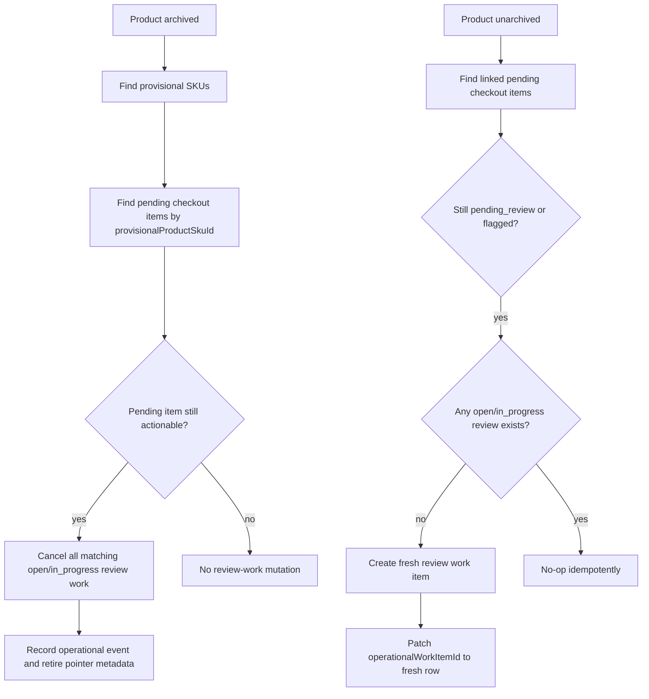
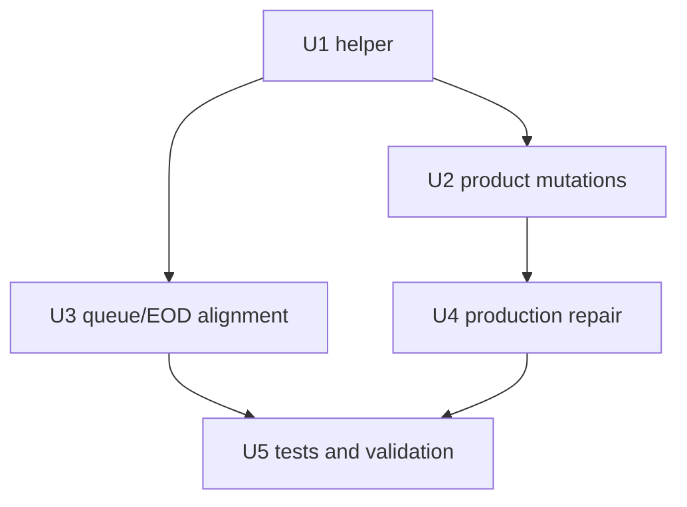

# fix: Retire archived pending checkout review work

## Summary

Archived provisional POS pending checkout products currently leave their associated `pos_pending_checkout_item_review` operational work items open. Open Work hides those rows at read time, but EOD Review reads open operational work directly, so stale hidden work still appears in carry-forward and can block closeout. The clean fix is to move the archive/unarchive behavior into the source lifecycle: archiving a provisional pending checkout product retires the associated review work item, while unarchiving recreates exactly one fresh review item if the source pending checkout item still needs review.

The pending checkout item itself stays pending. Archiving the provisional product is not a manager review decision, so it should not mark the checkout item approved, linked, or rejected. It only makes the current review work unactionable while the provisional product is archived.

---

## Problem Frame

The production symptom is a disagreement between two Operations surfaces:

| Surface | Current behavior |
| --- | --- |
| Open Work | Shows only the 15 `synced_sale_inventory_review` rows because `pos_pending_checkout_item_review` rows tied to archived provisional products are filtered out at read time. |
| EOD Review carry-forward | Shows 29 open work items because it reads every open or `in_progress` operational work item, including 14 POS pending checkout review rows whose provisional products are archived. |

The backend source of the bug is that product archive only patches `product.availability = "archived"`. It does not transition the operational review work item. That leaves an open work row which is invisible in one workspace and live in another.

The desired invariant is:

> If a work item is not actionable because its source product is archived, it must not remain open. Any surface that reads open operational work should agree without needing a UI-only or query-only exception.

---

## Requirements

- R1. Archiving a provisional product linked to a pending checkout item must terminally retire every open or `in_progress` `pos_pending_checkout_item_review` work item for that source identity.
- R2. Archive retirement must leave `posPendingCheckoutItem.status` unchanged when the item is still `pending_review` or `flagged`; archive is not approval, linking, or rejection.
- R3. Unarchiving that product must create one fresh open `pos_pending_checkout_item_review` when the linked pending checkout item is still actionable and no current `open` or `in_progress` review exists.
- R4. Unarchive must not recreate review work for pending checkout items already `approved`, `linked_to_catalog`, or `rejected`.
- R5. Repeated archive/unarchive and retry behavior must be idempotent; no duplicate open work items may be created for the same `pendingCheckoutItemId`.
- R6. The explicit `archive`, `unarchive`, and generic product `update` availability paths must all use the same lifecycle helper for availability transitions.
- R7. Open Work and EOD Review must agree because terminal statuses are correct, not because one surface hides stale open rows.
- R8. Existing production rows with archived provisional products and open POS pending checkout review work must have a safe repair path.
- R9. Audit evidence must make the lifecycle understandable: who/what retired the work, why, which product/pending item/work item was affected, and which new work item was created on unarchive.
- R10. Focused tests must cover archive retirement, unarchive recreation, dedupe, resolved-item no-op behavior, EOD exclusion, Open Work queue consistency, empty/nil source paths, and bounded-scan incomplete behavior.

---

## Scope Boundaries

- This plan does not change POS pending checkout review decisions or product-page trusted inventory finalization.
- This plan does not mark archived pending checkout items rejected. Operators can still unarchive the provisional product and review the original pending checkout evidence.
- This plan does not redesign Open Work or EOD UI.
- This plan does not remove pending checkout sale evidence, provisional product/SKU anchors, or operational event history.
- This plan does not create trusted inventory movements. Archive/unarchive only changes review work actionability.
- This plan may adjust the Open Work archived-product filter after lifecycle writes and repair are in place, but the filter is not the source fix.

### Deferred to Follow-Up Work

- A richer product timeline UI for retired/recreated pending checkout review work, if operators need visible explanation beyond existing operational events.
- A broader operational work item terminal-reason schema if more work types need first-class cancellation reasons later.

---

## Context & Research

### Relevant Code

- `packages/athena-webapp/convex/inventory/products.ts` owns `archive`, `unarchive`, and generic `update`; today these paths patch product availability and refresh search/catalog/cache projections.
- `packages/athena-webapp/convex/pos/application/commands/createOrReusePendingCheckoutItem.ts` creates pending checkout items, provisional product/SKU anchors, and the initial `pos_pending_checkout_item_review` operational work item with the metadata shape to preserve.
- `packages/athena-webapp/convex/pos/public/catalog.ts` owns actual pending checkout review resolution and maps review decisions to operational work item status through `updateOperationalWorkItemStatusWithCtx`.
- `packages/athena-webapp/convex/operations/operationalWorkItems.ts` defines terminal statuses as `completed` and `cancelled`, stable source identity for `pos_pending_checkout_item_review:<pendingCheckoutItemId>`, Open Work queue reads, and the current archived-provisional-product read-time filter.
- `packages/athena-webapp/convex/operations/dailyClose.ts` reads open operational work items by status for EOD carry-forward; it correctly sees rows that are still open.
- `packages/athena-webapp/convex/schema.ts` already has `productSku.by_productId`, `posPendingCheckoutItem.by_storeId_provisionalProductSkuId`, `posPendingCheckoutItem.by_operationalWorkItemId`, and `operationalWorkItem.by_storeId_type_status`; it does not have an indexed source-identity or metadata lookup for operational work.

### Institutional Learnings

- `docs/solutions/architecture-patterns/athena-open-work-resolution-ownership-2026-07-02.md`: Open Work owns discovery and routing; source workflows own resolution unless Operations has narrow source identity and stable authority.
- `docs/solutions/architecture-patterns/athena-pending-checkout-inventory-resolution-2026-07-03.md`: product-page/catalog finalization owns transitions from checkout evidence to trusted catalog inventory; Operations should not mutate catalog/inventory directly.
- `docs/solutions/architecture/athena-store-ops-catalog-visibility-boundaries-2026-06-24.md`: archived products should be filtered at server composition boundaries for visibility, while archive-management paths must preserve audit/restore access.
- `docs/solutions/logic-errors/athena-daily-operations-aggregate-read-model-2026-05-08.md`: daily operations surfaces aggregate source workflows and should consume indexed open-status reads rather than broad capped scans filtered later.

### Investigation Findings

- The Open Work discrepancy is not a frontend bug. It comes from `filterArchivedPendingCheckoutWorkItems` hiding archived provisional product rows during queue projection.
- EOD is not wrong to include open work. The stale rows are still `status: "open"` at the operational work item layer.
- The pending checkout source rows observed in production remain `pending_review`, have no `reviewedAt`, and point at archived provisional products. That supports leaving the source review state intact while retiring only the operational review work.

---

## Key Technical Decisions

- **Use `cancelled` for archive-retired review work.** `completed` implies the manager review happened. Archive makes the review unactionable, so `cancelled` is the clearer terminal state.
- **Do not mutate the pending checkout item review decision on archive.** Keep `posPendingCheckoutItem.status` as `pending_review` or `flagged`; update only the operational work pointer and audit metadata needed to explain actionability.
- **Use `operationalWorkItemId` as the current actionable work pointer.** Archive cancellation clears `posPendingCheckoutItem.operationalWorkItemId` after retiring matching open rows. Unarchive patches it to the fresh open row. Review/finalization paths must not complete or overwrite a cancelled retired row by following a stale pointer.
- **Create a fresh work item on unarchive.** Do not reopen the old cancelled row. A fresh row keeps the retired history intact, avoids resurrecting stale row metadata, and lets `posPendingCheckoutItem.operationalWorkItemId` point at the current actionable review.
- **Centralize lifecycle in a POS-owned helper.** Create `packages/athena-webapp/convex/pos/application/commands/pendingCheckoutReviewWorkLifecycle.ts`. `inventory/products.ts` imports this helper. The helper must not import `inventory/products.ts` or `pos/public/catalog.ts`; shared work-item title, metadata, and priority builders should live in this helper or a sibling POS application module so product mutations do not depend on public POS catalog code.
- **Treat product availability changes consistently.** Generic `products.update` remains availability-capable, but it must compare prior and next availability and call the lifecycle helper when crossing the archived boundary: `live`/`draft` -> `archived` retires review work, and `archived` -> `live`/`draft` recreates deduped review work when the source is actionable. Non-availability updates and transitions that do not cross the archived boundary do not run lifecycle work.
- **Use bounded complete scans for duplicate open work detection.** The first implementation should not add a new schema field. It should query `operationalWorkItem.by_storeId_type_status` for `open` and `in_progress`, scan up to an explicit safe cap for the store/type/status lane, and match metadata `pendingCheckoutItemId`. If the scan is incomplete during `archive`, `unarchive`, or generic `products.update`, the availability mutation must abort so product availability and work-item lifecycle cannot commit partially.
- **Retain the Open Work archived filter only as a temporary defensive guard.** After lifecycle writes and production repair, correctness should come from terminal work statuses. A follow-up inside this plan can remove or narrow the filter once tests prove no stale open rows are expected.
- **Repair existing production data with the same helper semantics and bounded batches.** The repair must require dry-run first, use explicit store-scoped batches with cursor/continuation, include candidate ids and skip reasons, and cancel only `pos_pending_checkout_item_review` rows whose source pending checkout item is still actionable and whose provisional product is archived.
- **Stamp a terminal timestamp for cancellations.** Archive and repair cancellation should set `completedAt` when moving work to `cancelled`, matching the field's practical role as terminal time in existing reports. If implementation updates `updateOperationalWorkItemStatusWithCtx` for this, tests must cover both `completed` and `cancelled` terminal stamping.

---

## Open Questions

### Resolved During Planning

- **Should archive close the open work item associated with the pending checkout item?** Yes. It should retire/cancel the operational review work because the source is not currently actionable.
- **Should archive reject the pending checkout item?** No. The product is still a POS pending checkout item; review evidence remains pending so unarchive can create fresh review work.
- **What happens when the product gets unarchived?** If the pending checkout source still needs review, unarchive creates a new deduped work item and points the pending checkout item at it.
- **Should unarchive reopen the old cancelled row?** No. Create a fresh row and preserve the old row as audit history.

### Deferred to Implementation

- Whether to keep the Open Work archived filter as a legacy backstop after repair or remove it to expose future lifecycle bugs earlier.

---

## High-Level Technical Design

The helper should use source identity, not display text, to decide ownership:

| Input | Required guard |
| --- | --- |
| Product id | Product must belong to the requested store. |
| Product SKU ids | SKUs must belong to the archived/unarchived product. |
| Pending checkout item | `storeId` must match, `provisionalProductSkuId` or `provisionalProductId` must match the product anchors, and status must be actionable for lifecycle changes. |
| Operational work item | Type must be `pos_pending_checkout_item_review`, store must match, metadata must point at the same `pendingCheckoutItemId`, and status must be `open` or `in_progress` for archive cancellation. |

Duplicate detection and repair use existing indexes in this slice:

| Operation | Query strategy | Incomplete behavior |
| --- | --- | --- |
| Archive cancellation | Follow `posPendingCheckoutItem.operationalWorkItemId`, then also scan `operationalWorkItem.by_storeId_type_status` for `open` and `in_progress` `pos_pending_checkout_item_review` rows and match metadata `pendingCheckoutItemId`. | Abort the source availability mutation before commit; no product archive should persist with a partially cancelled work set. |
| Unarchive recreation | Scan `operationalWorkItem.by_storeId_type_status` for `open` and `in_progress` rows and match metadata `pendingCheckoutItemId` before creating. | Abort the source availability mutation before commit; no product unarchive should persist if duplicate status cannot be proven. |
| Production repair | Batch through store/type/status lanes with cursor/continuation and metadata/source validation per candidate. | Stop at batch boundary, return cursor and skip/candidate counts; rerun until complete. |

---

## Implementation Units

- U1. **Create the Pending Checkout Review Work Lifecycle Helper**

**Goal:** Add a shared Convex helper that finds pending checkout items for a product, cancels actionable review work on archive, and creates deduped fresh review work on unarchive.

**Requirements:** R1, R2, R3, R4, R5, R9

**Dependencies:** None

**Files:**
- Create: `packages/athena-webapp/convex/pos/application/commands/pendingCheckoutReviewWorkLifecycle.ts`
- Modify: `packages/athena-webapp/convex/pos/application/commands/createOrReusePendingCheckoutItem.ts`
- Modify if needed: `packages/athena-webapp/convex/operations/operationalWorkItems.ts`

**Approach:**
- Extract reusable work item metadata/title/priority construction into `pendingCheckoutReviewWorkLifecycle.ts` or a sibling POS application helper so recreated work items match current source-owned shape without importing public catalog code.
- Keep import direction one-way: `inventory/products.ts` may import the POS lifecycle helper; the lifecycle helper must not import `inventory/products.ts` or `pos/public/catalog.ts`.
- Resolve product SKUs through `productSku.by_productId`, then pending items through `posPendingCheckoutItem.by_storeId_provisionalProductSkuId`.
- Treat `pending_review` and `flagged` as actionable. Treat `approved`, `linked_to_catalog`, and `rejected` as no-ops.
- On archive, first prove the duplicate scan is complete, then cancel every matching `open` or `in_progress` work item tied to the same `pendingCheckoutItemId`, not only the current pointer. If the scan is incomplete, throw/abort so no product availability transition commits. Patch metadata with `retiredReason: "provisional_product_archived"`, archived product id, provisional SKU id, prior work status, and terminal timestamp.
- After archive cancellation, clear `posPendingCheckoutItem.operationalWorkItemId` because it is the current-actionable pointer.
- On unarchive, scan existing `open` and `in_progress` work rows by `by_storeId_type_status` and metadata `pendingCheckoutItemId` before creating a new work item. If the bounded scan is incomplete, throw/abort so no product availability transition commits.
- Patch `posPendingCheckoutItem.operationalWorkItemId` to the fresh row on recreation.
- Record operational events for retirement and recreation using the existing event style in pending checkout command code. Recreation events must include the old retired work id when known and the new work id.

**Test Scenarios:**
- Archive cancels an open pending checkout review work item and preserves `posPendingCheckoutItem.status = "pending_review"`.
- Archive cancels an `in_progress` review work item without marking it completed.
- Archive cancels duplicate `open` / `in_progress` rows for the same `pendingCheckoutItemId` source identity.
- Archive clears `operationalWorkItemId` after retirement.
- Archive is idempotent when the product is already archived or the work item is already terminal.
- Unarchive creates one new open review work item for a still-pending source and patches `operationalWorkItemId`.
- Unarchive creates one new open review work item for a `flagged` source.
- Unarchive creates no work for `approved`, `linked_to_catalog`, or `rejected` sources.
- Repeated unarchive does not create duplicate open rows for the same `pendingCheckoutItemId`.
- Cross-store or mismatched provisional product/SKU anchors are ignored.
- Empty paths no-op safely: product has no SKUs, SKUs have no pending checkout items, pending checkout item has no `operationalWorkItemId`, and referenced work item is missing/deleted.
- Incomplete duplicate scans fail closed and abort the source product availability mutation.

- U2. **Wire Product Availability Mutations Through the Helper**

**Goal:** Ensure every product availability transition to or from archived applies the pending checkout review work lifecycle.

**Requirements:** R1, R3, R5, R6, R9

**Dependencies:** U1

**Files:**
- Modify: `packages/athena-webapp/convex/inventory/products.ts`
- Update tests: `packages/athena-webapp/convex/inventory/products.sku.test.ts`

**Approach:**
- In `archive`, after store access and product ownership checks, run the lifecycle helper in the same mutation and abort on incomplete scan; only then allow the availability transition to commit with the work-item retirements.
- In `unarchive`, run the lifecycle helper in the same mutation and abort on incomplete scan; only then allow the availability transition to commit with any recreated current review work.
- In generic `update`, fetch the current product before patching. If `availability` is provided and crosses into `archived` from `live` or `draft`, run the archive-retirement helper in the same mutation and abort on incomplete scan. If it crosses out of `archived` into `live` or `draft`, run the unarchive-recreation helper in the same mutation and abort on incomplete scan. If availability is unchanged or absent, do not run lifecycle work.
- Product mutations may patch availability before or after helper effects as long as Convex transaction semantics guarantee a thrown incomplete-scan error rolls back all writes in that mutation. The observable contract is atomic: product availability and lifecycle work commit together or neither commits.
- Keep existing search projection, catalog summary, and cache invalidation behavior intact.
- Return the product as today only on successful complete lifecycle application; incomplete duplicate scans throw/abort and do not return a partially updated product.

**Test Scenarios:**
- Dedicated `archive` retires review work and still refreshes product projections.
- Dedicated `unarchive` recreates review work and still refreshes product projections.
- Generic `update` retires work for `live`/`draft` -> `archived`, recreates deduped work for `archived` -> `live`/`draft`, and leaves non-transition updates alone.
- Incomplete duplicate scans abort `archive`, `unarchive`, and generic `update` availability transitions without committing product availability changes.
- Mutation returns null/no-ops safely when product id or store id do not match.
- Products with no SKUs and SKUs with no pending checkout items update availability without lifecycle errors.

- U3. **Align Open Work and EOD Around Terminal Status**

**Goal:** Make Open Work and EOD carry-forward agree because archived pending checkout review work is no longer open.

**Requirements:** R7, R10

**Dependencies:** U1, U2

**Files:**
- Modify: `packages/athena-webapp/convex/operations/operationalWorkItems.ts`
- Modify tests: `packages/athena-webapp/convex/operations/operationalWorkItems.test.ts`
- Modify tests: `packages/athena-webapp/convex/operations/dailyClose.test.ts`

**Approach:**
- Add regression coverage proving archived provisional pending checkout review work is terminal after archive and therefore absent from both Open Work and EOD open-work reads.
- Decide whether to remove `filterArchivedPendingCheckoutWorkItems` or keep it as a legacy defensive backstop.
- If retained, add a focused test that labels it as legacy defense rather than source correctness.
- Do not add a matching archived-product filter to EOD; that would duplicate the read-time hiding bug instead of fixing lifecycle state.

**Test Scenarios:**
- After archive lifecycle, Open Work count and EOD carry-forward count both exclude the retired pending checkout review work item.
- A manually constructed legacy open row tied to an archived product is either hidden only by the legacy guard or exposed intentionally, depending on the filter decision.
- A non-archived pending checkout review still appears in Open Work and EOD carry-forward as open work.

- U4. **Add a Safe Production Repair Path**

**Goal:** Repair existing stale open `pos_pending_checkout_item_review` rows tied to archived provisional products.

**Requirements:** R8, R9

**Dependencies:** U1

**Files:**
- Add internal mutation or script near: `packages/athena-webapp/convex/pos/application/commands/createOrReusePendingCheckoutItem.ts`
- Add tests near: `packages/athena-webapp/convex/operations/operationalWorkItems.test.ts` or `packages/athena-webapp/convex/inventory/products.sku.test.ts`
- Add runbook notes if repo convention has an operations doc for one-time repair.

**Approach:**
- Implement the repair with the same helper semantics as archive, not a one-off metadata scan.
- Scope repair by explicit `storeId` and require dry-run mode before mutating mode. Dry run must report candidate work item ids, product ids, provisional SKU ids, pending checkout item ids, current statuses, and skip reasons, not only counts.
- Process repair in bounded batches over `operationalWorkItem.by_storeId_type_status` for `pos_pending_checkout_item_review` rows with `open` and `in_progress` status. Each call should accept a cursor/continuation or equivalent batch token, cap rows per mutation, and return whether more work remains.
- Mutating mode should cancel only rows with explicit store match, work type match, `open` / `in_progress` status, actionable pending checkout status, archived provisional product verification, matching product/SKU anchors, and matching metadata `pendingCheckoutItemId`. Rows with missing or mismatched metadata must be skipped.
- Repair retry/rollback semantics are idempotent: rerunning the same batch or full repair skips already terminal rows and does not create replacement work.
- Record operational event or metadata reason `repairReason: "archived_provisional_product_open_work_repair"` with actor/system source, timestamp, repair run identifier, old work item id, pending checkout item id, provisional product id, provisional SKU id, and prior work status.
- Before rollout, run dry-run verification against production data. After repair, EOD carry-forward for Wigclub should drop the stale POS pending checkout review rows while keeping the 15 synced sale inventory review items.

**Test Scenarios:**
- Dry run returns candidate rows without mutating work items.
- Repair cancels only archived-product pending checkout review work.
- Repair skips already terminal rows, resolved pending checkout sources, cross-store rows, and rows with missing/mismatched metadata.
- Repair is idempotent when run twice.
- Repair batches return cursor/continuation and do not exceed the configured per-mutation cap.
- Repair handles empty paths: no candidates, missing/deleted referenced pending item, missing/deleted product, product with no SKUs, and incomplete scan/page conditions.

- U5. **Validation and Regression Coverage**

**Goal:** Validate Convex correctness, style, and the no-UI-regression contract.

**Requirements:** R10

**Dependencies:** U1, U2, U3, U4

**Files:**
- Update: `packages/athena-webapp/convex/inventory/products.sku.test.ts`
- Update: `packages/athena-webapp/convex/operations/operationalWorkItems.test.ts`
- Update: `packages/athena-webapp/convex/operations/dailyClose.test.ts`
- Update only if helper extraction requires it: `packages/athena-webapp/convex/pos/application/commands/createOrReusePendingCheckoutItem.test.ts`

**Approach:**
- Keep tests focused on backend lifecycle and read-model agreement. No browser validation is required for this slice.
- Use package-relative Vitest commands from `packages/athena-webapp`, not direct `bun test`.
- Run Convex audit/lint commands required by `packages/athena-webapp/docs/agent/testing.md` for changed Convex files.
- If code files change during implementation, run `bun run graphify:rebuild` from repo root per `AGENTS.md`.

**Suggested Test Commands:**
- `cd packages/athena-webapp && bun run test -- convex/inventory/products.sku.test.ts -t "archive"`
- `cd packages/athena-webapp && bun run test -- convex/operations/operationalWorkItems.test.ts -t "pending checkout"`
- `cd packages/athena-webapp && bun run test -- convex/operations/dailyClose.test.ts -t "carry-forward"`
- `cd packages/athena-webapp && bun run audit:convex`
- `cd packages/athena-webapp && bun run lint:convex:changed`

---

## System-Wide Impact

- **POS pending checkout:** Source evidence remains pending. Operational review work becomes explicitly tied to product archive actionability.
- **Product archive/unarchive:** Availability changes gain side effects for POS pending checkout review work, but only for source-linked provisional products in the same store.
- **Open Work:** The workspace no longer relies on silently hiding archived-product review rows as the primary correctness mechanism.
- **EOD Review:** Carry-forward reads remain source-agnostic and status-based; retired rows fall out naturally.
- **Operations audit:** Archive/unarchive and repair flows should leave enough metadata/events for an operator or developer to explain why a review item disappeared or returned.
- **Production data:** Existing stale open rows need one-time repair; otherwise code fixes only prevent new drift.

---

## Risks & Mitigations

| Risk | Mitigation |
| --- | --- |
| Archive is misinterpreted as review rejection. | Preserve `posPendingCheckoutItem.status`; use `operationalWorkItem.status = "cancelled"` with archive-specific metadata/event reason. |
| Duplicate review work is created on repeated unarchive. | Dedupe by `pendingCheckoutItemId` source identity and check both the current pointer and `open` / `in_progress` rows; abort source availability mutations if the duplicate scan is incomplete. |
| Generic product update bypasses lifecycle. | Route all availability transitions that cross the archived boundary through the same helper. |
| Production repair cancels unrelated work. | Scope by store, work type, source metadata, pending item status, product/SKU anchors, archived product availability, and mandatory dry run with ids and skip reasons. |
| Open Work filter masks future lifecycle bugs. | Prefer removing or narrowing the filter after repair; if retained, test and label it as legacy defense only. |
| Cancelled rows lack `completedAt`, affecting reports. | Stamp `completedAt` when this lifecycle cancels work and test terminal timestamp behavior. |

---

## Acceptance Criteria

- Archiving an actionable provisional pending checkout product cancels all matching current POS pending checkout review work items, clears the source pointer, and leaves the pending checkout source status unchanged.
- Unarchiving the same product creates exactly one fresh open POS pending checkout review work item if the source still needs review.
- Resolved pending checkout sources do not produce new work on unarchive.
- Open Work and EOD Review report the same actionable open work set for archived provisional pending checkout products.
- A mandatory dry-run and mutating production repair path can identify and retire the current stale open work rows with candidate ids, skip reasons, bounded batches, and idempotent retry behavior.
- Focused Convex tests pass for product lifecycle, Open Work queue, and EOD carry-forward behavior.
