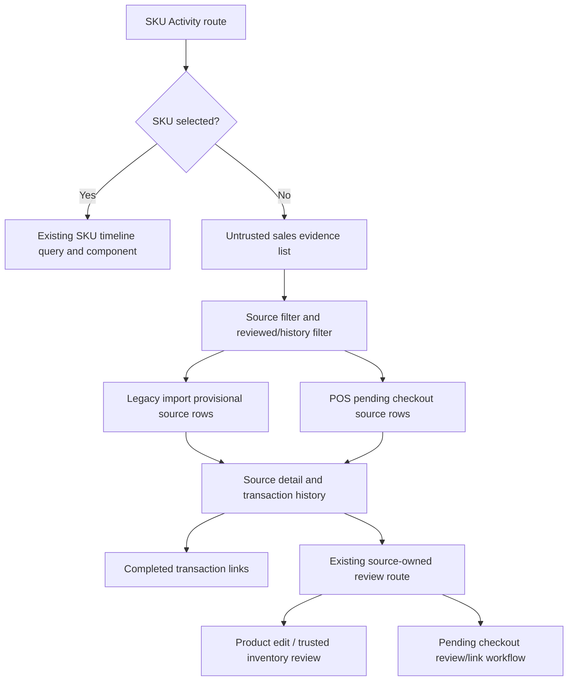
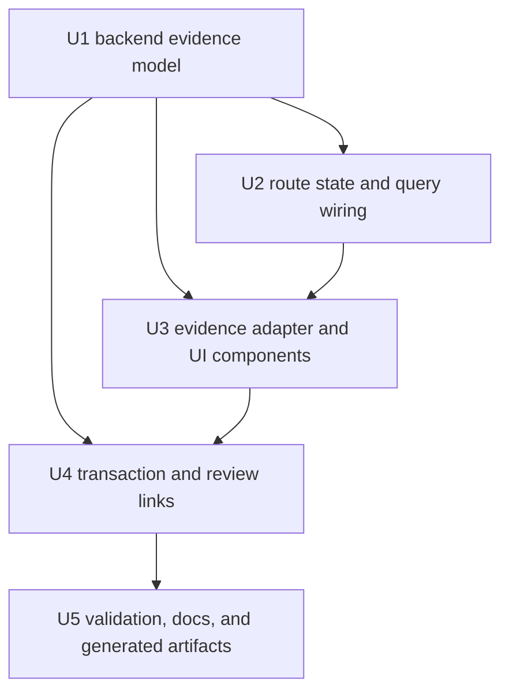
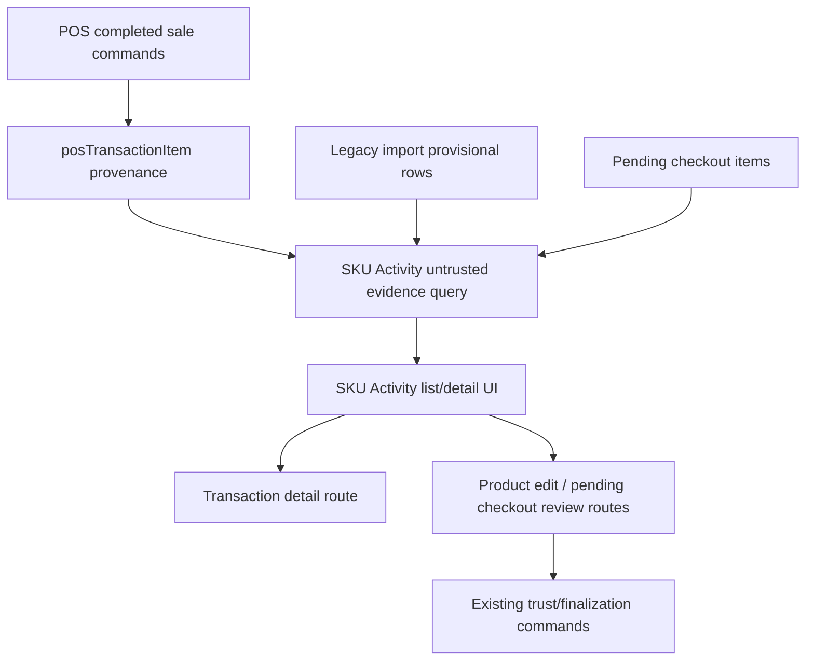

# feat: Add SKU Activity untrusted sales history

## Summary

Extend SKU Activity from a lookup-only inspector into a read-only evidence workspace for untrusted SKU sales. The implementation adds a bounded server-owned evidence read model for legacy import provisional SKUs and POS pending checkout items, keeps the existing trusted SKU lookup path intact, and renders source-specific transaction history with review handoff links instead of mutating trusted stock.

---

## Problem Frame

Operators currently need to know a SKU before SKU Activity can help. Active provisional and pending checkout products can already be circulating through completed POS sales, so operators need a proactive store-scoped view of those untrusted sale sources and the completed transactions behind them.

This plan is anchored in `docs/brainstorms/2026-07-04-sku-activity-untrusted-sales-history-requirements.md`.

---

## Requirements

- R1. Preserve the current manual SKU lookup and timeline inspection path for arbitrary trusted or known SKUs.
- R2. Show a default untrusted-sales view when SKU Activity opens without a selected SKU.
- R3. Include legacy import provisional SKUs and POS pending checkout items in the same workspace while keeping their source types visually and behaviorally distinct.
- R4. Show actionable untrusted sources by default: active legacy import rows with sale evidence, and pending checkout rows in pending review or flagged states with completed sale evidence.
- R5. Provide explicit source filtering, including an opt-in reviewed/history filter for terminal linked, approved, finalized, rejected, or closed sources.
- R6. Provide completed-sale transaction history for each untrusted source item, not only aggregate sale counters.
- R7. Distinguish completed transaction evidence from active reservations, open carts, holds, draft activity, and unresolved source summaries.
- R8. Surface calm diagnostics when source summary evidence and transaction-backed history disagree.
- R9. Route each source to its existing review or trust workflow without making SKU Activity a stock mutation surface.
- R10. Keep operator-facing copy calm, source-aware, and free of raw backend enum language.

**Origin actors:** A1 Store operator, A2 Manager or admin reviewer, A3 POS cashier
**Origin flows:** F1 Untrusted sales triage, F2 Transaction evidence review, F3 Review handoff
**Origin acceptance examples:** AE1, AE2, AE3, AE4, AE5

---

## Scope Boundaries

- SKU Activity remains read-only for trust and inventory state. It may navigate to review/finalization surfaces, but it must not directly patch trusted stock, inventory movements, provisional rows, or pending checkout items.
- This plan does not change cashier checkout behavior.
- This plan does not build broad sales analytics, forecasting, or product performance reporting.
- This plan does not require one-click trust finalization from the history list.
- This plan does not automatically convert historical provisional or pending checkout sales into trusted inventory movement.
- This plan does not replace product edit, inventory import, Open Work, Daily Operations, or pending checkout review workflows.

### Deferred to Follow-Up Work

- A historical audit mode that makes terminal reviewed/rejected/closed untrusted sources first-class outside the explicit reviewed/history filter.
- A broader untrusted-source search that searches pending checkout names and imported row text from the same search box as trusted SKU lookup.
- A stock-repair workflow that converts untrusted sale evidence into an explicit manager-approved inventory correction.
- A denormalized transaction-item store id migration, if parent transaction hydration later proves too expensive.
- A materialized projection or scheduled rebuild job for SKU Activity evidence, if focused metrics show indexed source-of-truth reads are too expensive in production. This is intentionally deferred because it adds derived-state drift risk and weakens freshness.

---

## Context & Research

### Relevant Code and Patterns

- `packages/athena-webapp/src/routes/_authed/$orgUrlSlug/store/$storeUrlSlug/operations/sku-activity.tsx` owns the route, store access, URL search state, SKU search, and current timeline query wiring.
- `packages/athena-webapp/convex/operations/skuActivity.ts` owns the current SKU Activity read model and should remain the main store-scoped operations query surface for this feature.
- `packages/athena-webapp/src/components/operations/SkuActivityTimeline.tsx` and `packages/athena-webapp/src/components/operations/skuActivityTimelineAdapter.ts` show the current prop-driven component and adapter pattern.
- `packages/athena-webapp/convex/schemas/inventory/inventoryImportProvisionalSku.ts` stores active legacy import provisional rows and aggregate sale evidence.
- `packages/athena-webapp/convex/schemas/pos/posPendingCheckoutItem.ts` stores pending checkout lifecycle state and aggregate sale evidence.
- `packages/athena-webapp/convex/schemas/pos/posTransaction.ts` and `packages/athena-webapp/convex/schemas/pos/posTransactionItem.ts` store completed transaction facts and source item provenance.
- `packages/athena-webapp/convex/schema.ts` already indexes pending checkout transaction items but does not yet provide an efficient legacy import provisional transaction-item lookup.
- `packages/athena-webapp/convex/pos/public/catalog.ts` owns pending checkout review/link/finalization behavior and product-page trusted inventory finalization.
- `packages/athena-webapp/src/components/operations/OperationsQueueView.tsx` is the closest review-route pattern for pending checkout handoff to product edit.
- `packages/athena-webapp/src/components/pos/transactions/TransactionView.tsx` is the existing completed transaction detail destination.

### Institutional Learnings

- `docs/solutions/logic-errors/athena-sku-activity-traceability-2026-05-13.md`: SKU Activity must use source-aware evidence and diagnostics rather than invented causes.
- `docs/solutions/architecture/athena-pos-provisional-import-trust-boundary-2026-06-10.md`: provisional import rows are sale evidence before trusted inventory.
- `docs/solutions/architecture/athena-pos-provisional-import-availability-2026-06-11.md`: POS sellability and trusted stock finalization must stay separate.
- `docs/solutions/architecture/athena-product-page-single-sku-provisional-trusted-finalization-2026-06-23.md`: trusted conversion is an explicit product-page inventory-import command boundary.
- `docs/solutions/architecture-patterns/athena-pending-checkout-inventory-resolution-2026-07-03.md`: Operations surfaces expose and route pending checkout work; product-page/catalog review owns catalog and inventory mutation.
- `docs/solutions/architecture/athena-pos-pending-checkout-sku-alias-2026-07-03.md`: linked pending checkout aliases preserve pending provenance while effective trusted SKU attribution converges on the approved SKU.
- `docs/solutions/logic-errors/athena-pending-checkout-archive-work-lifecycle-2026-07-04.md`: archived or terminal pending checkout sources must not reappear as actionable work.
- `docs/product-copy-tone.md`: copy must lead with system state, use plain language, and avoid raw backend wording.

### External References

- None. The repo already has strong local Convex, route, SKU activity, provisional trust, and pending checkout patterns.

---

## Key Technical Decisions

| Decision | Rationale |
| --- | --- |
| Keep this inside SKU Activity | The confirmed product shape is a SKU evidence workspace, not a new Open Work queue or sales analytics page. |
| Add a source-aware untrusted-sales read model | Legacy import and pending checkout evidence live in different tables and need a unified operator DTO without collapsing source ownership. |
| Use actionable statuses by default | Defaulting to active/pending-review/flagged avoids resurrecting stale finalized, linked, rejected, closed, or archived work. |
| Put terminal or reviewed sources behind an explicit filter | Operators can inspect history when needed, but the default workspace stays focused on current untrusted work. |
| Use transaction-backed history with summary drift diagnostics | Aggregate sale evidence is useful for triage, but the user explicitly wants full transaction history and the system must be honest when aggregates and transaction rows diverge. |
| Favor fresh indexed source-of-truth reads in v1 | The operator value is current visibility. Query cost is managed through source evidence indexes, selected-source detail loading, and pagination rather than derived projections. |
| Defer materialized projections and scheduled rebuilds | Projection jobs add drift risk, stale reads, and lifecycle fanout. They should be introduced only if production metrics show indexed reads are too expensive. |
| Add bounded transaction lookups for selected-source history | Pending checkout history has an index path; legacy import history does not. The detail query needs narrow indexes, but it should only run after a source is selected. |
| Route, do not mutate | SKU Activity may link to product edit, pending checkout review, or transaction detail, but stock and trust state remain owned by the existing workflows. |
| Keep trusted SKU search separate from untrusted filters in this slice | Merging search semantics would add a second product decision and broaden the first delivery. |

---

## Open Questions

### Resolved During Planning

- Which statuses appear by default? Active legacy import provisional rows and pending checkout rows in pending review or flagged states.
- Should linked, approved, finalized, rejected, or closed sources appear by default? No. They belong behind an explicit reviewed/history filter or known-source deep link.
- How should summary evidence without matching transactions render? Show the source summary and a calm diagnostic that transaction rows could not be matched.
- Should SKU Activity mutate trust or stock state? No. It routes to owning workflows only.
- How should source filters persist? Use URL search state, following existing route patterns.

### Deferred to Implementation

- Exact DTO field names for source summaries and transaction rows.
- Whether existing generated Convex API artifacts refresh cleanly in the worktree; if not, implementation should run the repo-approved `bunx convex dev --once` path where credentials are available.

---

## High-Level Technical Design

> *This illustrates the intended approach and is directional guidance for review, not implementation specification. The implementing agent should treat it as context, not code to reproduce.*

### Source and Status Matrix

| Source | Default included | Reviewed/history filter | Review handoff |
| --- | --- | --- | --- |
| Legacy import provisional | Active rows with sale evidence | Finalized, rejected, or closed rows only when explicitly included | Product edit trusted inventory finalization for the linked product/SKU |
| POS pending checkout | Pending review or flagged rows with sale evidence | Linked, approved, rejected, or terminal rows only when explicitly included | Product edit pending checkout review/link/finalization workflow |
| Trusted SKU lookup | Existing selected SKU path | Not applicable | Existing SKU Activity timeline and transaction links |

### V1 Query and Interaction Contract

- The default workspace uses a master-detail layout: the left/main list shows untrusted source summaries, and selecting a source opens a persistent detail area for transaction history, diagnostics, and review handoffs.
- Initial screen order: default untrusted source list first, selected source detail second, transaction rows inside the selected source detail third. Empty detail state asks the operator to select a source rather than implying no evidence exists.
- Source summaries are cursor-paginated independently from transaction history by reading indexed source-of-truth evidence on legacy import provisional rows and pending checkout rows. V1 target page size is 50 source rows per request, sorted by latest evidence time descending, then source identity for deterministic ordering.
- Selected-source transaction history is cursor-paginated independently and loads only after the operator selects a source. V1 target page size is 50 transaction rows per request, sorted newest completed transaction first.
- Full transaction history means the operator can keep loading completed sale rows for the selected source until the query returns `hasMore: false`. A bounded diagnostic may replace rows only for true error or recovery states, not as the normal response to many transactions.
- Source-list reads must not scan unsold candidate rows to discover sold rows. Use source evidence indexes where possible; if Convex cannot index the nested evidence fields directly, add minimal top-level mirror fields on the source tables and keep them updated in the existing sale-evidence write paths.
- Query time may read the selected source and its indexed transaction rows, but it must stay bounded and must not build a separate derived projection table in v1.
- The public Convex query must derive identity server-side, validate that the requested store belongs to the expected organization, and enforce the same store-day/full-admin authorization boundary as the protected operations route before returning source summaries or transaction history.
- Selected source detail loads must resolve the legacy import or pending checkout source through store/org-scoped constraints before loading transaction history. Nil, stale, missing, or other-store source ids return the same safe not-found/empty detail state and must not reveal whether the source exists elsewhere.
- Zero matching transaction rows with non-zero source summary evidence returns source summary evidence plus a mismatch diagnostic. Parent transaction store mismatch excludes the row and contributes only to a store-safe diagnostic for same-store sources; other-store rows must not leak existence.

### Deferred Projection Optimization

- Do not build a materialized SKU Activity projection or scheduled rebuild job in v1.
- Reconsider projection only after measuring source-list and selected-source transaction-history query cost in realistic store data.
- If projection becomes necessary later, prefer an explicit follow-up plan that defines freshness guarantees, drift diagnostics, repair paths, and scheduled-run evidence before implementation.
- The v1 UI should not show projection freshness copy because there is no projection freshness concept; evidence should be as fresh as the source rows and completed transaction records.

### Transaction Evidence Contract

- Source rows show aggregate evidence for triage.
- Detail rows are transaction-backed whenever matching transaction items exist.
- Transaction history includes completed sale identity, time, historical gross source-line quantity, effective/net quantity, transaction status, item refund fields, applied adjustment effects, register/session context when available, and safe staff/customer context when available from existing transaction read models.
- Voided or adjusted completed transactions remain visible with status labels instead of disappearing from history.
- Fully voided, fully refunded, or net-zero corrected item quantities must not inflate active circulation totals. Historical gross evidence can remain visible, but it must be labeled separately from active/effective circulation.
- Applied adjustment lines must be joined by transaction/item when they affect an untrusted source line. Pending or rejected adjustments stay visible as status context but must not change effective/net circulation.
- Summary drift is compared against named metrics: source summary gross quantity and transaction-backed effective/net quantity. If transaction-backed history cannot match the source summary, the UI surfaces a diagnostic rather than fabricating rows.

### DTO Allowlist and Redaction Contract

- Source summary rows may expose only source type, source id scoped to the authorized store, normalized display label, imported/pending item name, lookup/SKU text intended for operators, status display label, review bucket, aggregate gross/effective quantities, sale count, last sold time, review route availability, and non-sensitive diagnostics.
- Transaction history rows may expose only transaction id, display transaction number/reference, completed time, transaction status display label, historical gross line quantity, effective/net line quantity, unit/line totals already visible in operator transaction views, refund flags/quantity, adjustment status/effect summary, register/session display label when already available to this role, and route targets.
- Do not return raw customer ids, staff ids, phone numbers, email addresses, customer/staff notes, raw local event ids, payload fingerprints, audit/provenance internals, register session ids, terminal ids, approval ids, or backend enum strings from the untrusted evidence query unless an existing stricter transaction/audit authorization path explicitly owns that field.
- The UI adapter should normalize all statuses and source labels before rendering and should not pass raw backend DTOs directly into view components.

---

## Implementation Units

- U1. **Build the untrusted sales evidence read model**

**Goal:** Add the server-owned read model that lists actionable untrusted sale sources and returns transaction-backed history for a selected source.

**Requirements:** R2, R3, R4, R5, R6, R7, R8, R9

**Dependencies:** None

**Files:**
- Modify: `packages/athena-webapp/convex/operations/skuActivity.ts`
- Modify: `packages/athena-webapp/convex/schema.ts`
- Modify: `packages/athena-webapp/convex/schemas/pos/posTransactionItem.ts` only if the implementation chooses to denormalize fields needed for bounded reads
- Test: `packages/athena-webapp/convex/operations/skuActivity.test.ts`
- Test: `packages/athena-webapp/convex/pos/application/completeTransaction.test.ts`

**Approach:**
- Derive auth in the Convex query itself. Do not rely on the browser route to be the only gate.
- Validate the requested organization/store pair server-side and enforce the protected operations authorization boundary before reading source summaries, source details, or transaction history.
- Add a cursor-paginated source-summary query that returns legacy import provisional SKUs and pending checkout items with sale evidence, sorted newest evidence first with deterministic tie-breaking.
- Add source-list indexes on `inventoryImportProvisionalSku` and `posPendingCheckoutItem` keyed by store id, status, evidence present, and evidence last sold time. If nested evidence fields cannot be indexed directly, add minimal top-level mirror fields on those source rows.
- Update existing sale evidence write paths so nested source evidence and any minimal top-level mirror fields are patched together.
- Provide a narrow backfill or compatibility migration only for the mirror fields needed by the indexed default list; do not create a separate projection table in v1.
- Keep source-list pagination independent from selected-source transaction pagination and return `hasMore`, cursors, and safe omitted/scanned diagnostics where applicable.
- Use per-source/status cursors for the source list, fetch `pageSize + 1` rows per participating bucket, merge rows deterministically, and return the participating cursor payload so additional pages cannot skip sources.
- Add or verify the narrow transaction-item lookup needed to load legacy import provisional transaction history without scanning transaction items.
- Reuse the existing pending checkout transaction-item lookup for pending checkout transaction history.
- Resolve selected source ids through store/org-scoped source reads before loading detail history; other-store source ids must return the same safe not-found state as missing source ids.
- Hydrate parent POS transactions for transaction status, completed time, transaction number, register/session context, and safe display metadata.
- Verify every parent transaction belongs to the requested store and represents a completed transaction fact before returning it.
- Shape the returned DTO through the allowlist above, redacting raw customer/staff/contact/session/provenance/audit internals.
- Join applied transaction adjustment lines by transaction/item where needed to compute effective/net quantity while keeping historical gross quantity and refund fields separate.
- Include source-summary counts and transaction-backed counts separately enough for the UI to render mismatch diagnostics.
- Keep this query read-only. It must not call review/finalization commands, patch source rows, or write inventory movement.

**Execution note:** Start with backend tests that prove store isolation, source filtering, transaction-history joins, and summary/history mismatch diagnostics before wiring UI.

**Patterns to follow:**
- `packages/athena-webapp/convex/operations/skuActivity.ts` for current source-aware SKU Activity reads and bounded limits.
- `packages/athena-webapp/convex/pos/infrastructure/repositories/transactionRepository.ts` for transaction item and parent transaction hydration patterns.
- `packages/athena-webapp/convex/pos/public/transactions.ts` for safe completed transaction DTO shape.

**Test scenarios:**
- Happy path: active legacy import row with two completed transaction items appears in the default source list and detail history.
- Happy path: pending checkout row in pending review with completed transaction items appears in the default source list and detail history.
- Happy path: flagged pending checkout row with completed sale evidence appears as actionable.
- Edge case: finalized legacy import and linked pending checkout rows are excluded by default and included only when the reviewed/history filter is active.
- Edge case: active source summary has sale evidence but no matching transaction rows; the query returns summary evidence plus a mismatch diagnostic.
- Edge case: transaction item exists but parent transaction belongs to another store; it is excluded and does not leak cross-store data.
- Edge case: direct unauthenticated, wrong-org, wrong-store, and lower-privilege query calls return the existing unauthorized/empty-safe result without source or transaction data.
- Edge case: selected legacy import source id from another store returns the same not-found state as a missing id and does not reveal that the source exists.
- Edge case: selected pending checkout source id from another store returns the same not-found state as a missing id and does not reveal that the source exists.
- Edge case: returned DTO excludes raw customer/staff ids, contact details, notes, local event ids, payload fingerprints, approval ids, register session ids, terminal ids, and backend enum strings.
- Edge case: sold rows are returned through the source evidence indexes even when many unsold candidate rows share the same store/status bucket.
- Edge case: source rows missing required evidence mirror fields after rollout surface recovery diagnostics or are handled by the migration path; they do not silently disappear from actionable evidence.
- Edge case: merged pagination across legacy import and pending checkout sources does not skip one source when the other source has many newer rows.
- Edge case: fully voided, fully refunded, and net-zero corrected items remain visible historically but do not inflate active/effective circulation totals.
- Edge case: partially refunded, adjusted-down, and adjusted-up items return separate historical gross and effective/net quantities.
- Edge case: pending or rejected adjustments appear as context but do not alter effective/net circulation.
- Error path: source-list and selected-source transaction pagination return `hasMore` and cursors instead of silently truncating.
- Error path: missing or stale selected source id returns a safe empty detail state rather than a thrown route failure.
- Integration: completing a sale with a provisional import source creates transaction item provenance that the new history query can read.

**Verification:**
- Backend tests prove source list, filtering, transaction history, mismatch diagnostics, and store isolation.

---

- U2. **Extend SKU Activity route state and query wiring**

**Goal:** Let SKU Activity choose between existing selected-SKU timeline mode and the new default untrusted-sales mode through explicit URL state.

**Requirements:** R1, R2, R4, R5, R10

**Dependencies:** U1

**Files:**
- Modify: `packages/athena-webapp/src/routes/_authed/$orgUrlSlug/store/$storeUrlSlug/operations/sku-activity.tsx`
- Test: `packages/athena-webapp/src/routes/_authed/$orgUrlSlug/store/$storeUrlSlug/operations/sku-activity.test.tsx`

**Approach:**
- Preserve the current `sku` and `productSkuId` behavior for selected SKU inspection.
- Add explicit URL-backed state for source filtering and optional reviewed/history inclusion.
- Query untrusted source rows only when no SKU is selected and the user has access to the protected store-day surface; keep the server-side Convex query authorization as the authoritative boundary.
- Keep `o` origin handling so route handoffs can preserve back affordances.
- Keep loading, no-permission, missing organization/store, and route error behavior aligned with the current route.

**Patterns to follow:**
- Current SKU Activity route search schema and navigation behavior.
- Nearby Operations route state patterns in `operations/open-work.tsx` and `operations/stock-adjustments.tsx`.

**Test scenarios:**
- Happy path: opening SKU Activity with no SKU selected renders untrusted-sales mode and calls the untrusted evidence query.
- Happy path: submitting a SKU search clears source-specific selection and renders the existing timeline mode.
- Happy path: source filter changes are reflected in URL search state and survive rerender.
- Edge case: `productSkuId` takes precedence over default untrusted-sales mode.
- Error path: unauthorized users do not receive untrusted evidence query data and see the existing no-permission state.
- Integration: origin search state still shows the back affordance after navigating from an evidence row or transaction detail.

**Verification:**
- Route tests prove mode selection, URL state, auth gating, and existing lookup behavior are preserved.

---

- U3. **Add the untrusted sales evidence UI and adapter**

**Goal:** Render the proactive source list, source detail, transaction history, diagnostics, and empty states without mixing backend DTOs into presentation components.

**Requirements:** R2, R3, R4, R5, R6, R7, R8, R10

**Dependencies:** U1, U2

**Files:**
- Create: `packages/athena-webapp/src/components/operations/SkuActivityUntrustedSales.tsx`
- Create: `packages/athena-webapp/src/components/operations/skuActivityUntrustedSalesAdapter.ts`
- Test: `packages/athena-webapp/src/components/operations/SkuActivityUntrustedSales.test.tsx`
- Test: `packages/athena-webapp/src/components/operations/skuActivityUntrustedSalesAdapter.test.ts`
- Modify: `packages/athena-webapp/src/components/operations/SkuActivityTimeline.tsx` only if shared formatting helpers are extracted or reused

**Approach:**
- Keep the new UI prop-driven, following the existing timeline component pattern.
- Use the repo-local `emil-design-eng` skill before and during UI implementation review for interaction polish, motion restraint, responsive layout checks, and visual quality decisions.
- Consume adapter-shaped view models only; do not render raw backend enum strings or raw source/transaction metadata.
- Use a master-detail workspace pattern for v1: source summaries stay visible while selected source details render alongside or below depending on viewport.
- Default state renders the source list and an empty detail prompt until a source is selected.
- Render source rows with source label, item identity, sold quantity, sale count, last sold time, current state, and source-specific review action.
- Render transaction history in the selected source detail area with transaction number/link, time, historical gross quantity, effective/net quantity, status, register/session context, and safe display metadata.
- Include a load-more control for selected-source transaction history whenever the backend returns `hasMore: true`; do not replace normal long history with a truncation warning.
- Show diagnostics for summary/history mismatches, missing transaction rows, source terminal-state conflicts, and empty filtered states.
- Use calm, operational copy and normalize source/status labels before rendering.
- Avoid nested-card-heavy layouts; use a dense operations table/list and detail panel pattern that fits the existing workspace rhythm.

**Patterns to follow:**
- `packages/athena-webapp/src/components/operations/SkuActivityTimeline.tsx` for prop-driven state handling and diagnostics tone.
- `packages/athena-webapp/src/components/operations/OperationsQueueView.tsx` for review-row density, origin-preserving links, and pending checkout labels.
- `docs/product-copy-tone.md` for operator-facing language.

**Test scenarios:**
- Happy path: renders both legacy import and pending checkout rows in all-source mode.
- Happy path: source filter hides the other source and renders source-specific empty copy when no rows match.
- Happy path: selected source renders transaction history with transaction links, gross/effective quantities, and load-more state.
- Happy path: loading additional selected-source transactions appends rows until the query reports no more history.
- Edge case: no selected source renders an empty detail prompt, not a false no-evidence state.
- Edge case: reviewed/history filter exposes linked/finalized rows with non-actionable status copy.
- Edge case: source summary/history mismatch renders a warning diagnostic and does not invent transaction rows.
- Error path: error state uses safe copy and does not expose raw backend text.
- Error path: adapter tests prove customer/staff/contact/session/provenance/audit internals are not rendered when present in malformed or future DTO input.
- Integration: review links route to the expected product edit/review destination with origin state.

**Verification:**
- Component and adapter tests prove list rendering, filters, detail history, diagnostics, links, and empty/error states.
- UI implementation handoff includes an `emil-design-eng` pass focused on scanability, pressable feedback, motion restraint, reduced-motion behavior, and mobile table/detail layout.

---

- U4. **Wire transaction detail and review handoff links**

**Goal:** Make every transaction and source action in the workspace navigate to the right existing surface while preserving source ownership and trust boundaries.

**Requirements:** R6, R8, R9, R10

**Dependencies:** U1, U3

**Files:**
- Modify: `packages/athena-webapp/convex/pos/application/queries/getTransactions.ts`
- Modify: `packages/athena-webapp/convex/pos/public/transactions.ts`
- Modify: `packages/athena-webapp/src/components/pos/transactions/TransactionView.tsx` only if the transaction detail needs to preserve or display source provenance reached from SKU Activity
- Test: `packages/athena-webapp/convex/pos/application/getTransactions.test.ts`
- Test: `packages/athena-webapp/convex/pos/public/transactions.test.ts`
- Test: `packages/athena-webapp/src/components/pos/transactions/TransactionView.test.tsx`

**Approach:**
- Ensure transaction detail DTOs retain enough source provenance for authorized views to confirm whether a line came from legacy import provisional or pending checkout evidence.
- Link evidence history rows to the existing transaction detail route.
- Link legacy import source rows to the product edit trusted inventory review path for the associated product/SKU when that association exists.
- Link pending checkout rows using the same destination semantics as Open Work pending checkout review.
- If a source has already been reviewed, linked, finalized, rejected, or closed, show a history/status action rather than a mutation-sounding action.
- Do not add mutation buttons in SKU Activity. Use navigation labels such as review, open product, or view transaction.
- Keep source provenance exposure limited to the allowlisted fields unless the user follows an existing transaction/audit route with stricter authorization.

**Patterns to follow:**
- `packages/athena-webapp/src/components/operations/OperationsQueueView.tsx` pending checkout review routing.
- `packages/athena-webapp/src/components/add-product/ProductStock.tsx` trusted inventory and pending checkout product-page review surfaces.
- `docs/solutions/architecture-patterns/athena-pending-checkout-inventory-resolution-2026-07-03.md` ownership split.

**Test scenarios:**
- Happy path: pending checkout review link matches the existing Open Work route behavior.
- Happy path: legacy import source with product/SKU anchors links to product edit with the right variant context.
- Happy path: transaction rows link to transaction detail.
- Edge case: source lacks product/SKU anchors; UI shows history and a safe unavailable-review state.
- Edge case: reviewed/history source has no mutation-sounding primary action.
- Error path: unauthorized transaction detail readers do not receive raw source provenance.
- Error path: untrusted evidence links do not include raw customer/staff/contact/session/provenance/audit ids in URL search params.
- Integration: clicking review handoff does not invoke any trust, stock, or pending checkout mutation from SKU Activity.

**Verification:**
- Query and UI tests prove transaction provenance is available where authorized, links are correct, and no review mutation is introduced in SKU Activity.

---

- U5. **Refresh generated artifacts, documentation, and validation coverage**

**Goal:** Keep generated Convex client refs, test coverage, agent docs, and review artifacts aligned with the new query/UI surface.

**Requirements:** R1, R6, R8, R10

**Dependencies:** U1, U2, U3, U4

**Files:**
- Modify: `packages/athena-webapp/convex/_generated/api.d.ts` only through the repo-approved Convex dev refresh path if public query references change
- Modify: `packages/athena-webapp/src/routeTree.gen.ts` only through route generation if route search state changes require it
- Modify: `packages/athena-webapp/docs/agent/testing.md` only if the validation map/harness guidance needs a new focused scenario
- Modify: `packages/athena-webapp/docs/agent/code-map.md` only if ownership guidance for SKU Activity materially changes
- Test: `packages/athena-webapp/src/routeTree.browser-boundary.test.ts` only if shared browser/server boundaries change

**Approach:**
- Refresh generated artifacts only with repo-approved tooling when implementation adds or renames public Convex functions or route shape.
- Keep harness docs in sync if new files are not covered by the validation map.
- Record validation expectations in the PR handoff: focused SKU Activity tests, transaction tests when DTO/provenance changes, Convex audit/lint, TypeScript, build, and graphify rebuild after code edits.

**Patterns to follow:**
- `packages/athena-webapp/docs/agent/testing.md` validation escalation for SKU activity and Convex changes.
- `packages/athena-webapp/AGENTS.md` generated Convex client artifact rule.

**Test scenarios:**
- Test expectation: none for documentation-only updates; generated artifact changes are verified by focused tests, TypeScript, build, and harness checks.

**Verification:**
- Generated refs, route tree, docs, and validation map are either unchanged by implementation or refreshed through the documented path.

---

## System-Wide Impact

- **Interaction graph:** Completed POS sales write source provenance and summary evidence; SKU Activity reads that evidence; product edit and pending checkout workflows remain the mutation owners.
- **Error propagation:** Expected missing source, stale source, too-large result, and mismatch states should return structured read diagnostics. Escaped faults should render route/component fallback copy without raw backend text.
- **State lifecycle risks:** Source summaries can drift from transaction rows after voids, adjustments, migrations, or old data. The UI must make drift visible instead of treating summaries and transaction history as interchangeable.
- **API surface parity:** New Convex query DTOs should be available to the browser route through generated client refs and covered by route/component tests.
- **Integration coverage:** Backend tests must prove source provenance created by completed sales can be read by SKU Activity history. UI tests alone are not sufficient.
- **Unchanged invariants:** SKU Activity remains read-only for trust/inventory mutation, and existing selected-SKU timeline behavior remains available.

---

## Risks & Dependencies

| Risk | Mitigation |
| --- | --- |
| Full transaction history causes slow or unbounded Convex reads | Add a narrow legacy import transaction-item index and keep selected-source detail results paginated. |
| Default source list scans too many unsold rows | Use source evidence indexes or minimal source-row mirror fields; measure before introducing a separate projection system. |
| Materialized projections seem attractive but add stale evidence and drift | Defer projection/scheduled rebuild work until production metrics prove indexed source-of-truth reads are too expensive. |
| Summary evidence and transaction-backed history disagree | Return both summary and transaction-backed evidence with a diagnostic instead of hiding the discrepancy. |
| Terminal pending checkout or provisional rows reappear as actionable work | Default to actionable statuses only and gate terminal rows behind explicit reviewed/history mode. |
| SKU Activity accidentally becomes a mutation surface | Keep actions as navigation only and cover with tests that no trust/stock mutation is invoked from the page. |
| Pending checkout provenance leaks to lower-privilege users | Preserve existing store-day page gate and expose only operator-safe transaction/source labels unless existing transaction/audit authorization allows more detail. |
| Browser route is treated as the only security gate | Enforce organization/store authorization inside the Convex query and test direct query calls. |
| Cross-store source ids reveal source existence | Resolve selected source ids through store/org-scoped reads and return the same safe not-found state for missing or other-store ids. |
| Sensitive transaction metadata leaks through the evidence DTO | Use an explicit allowlist and adapter redaction tests for customer, staff, contact, session, provenance, and audit fields. |
| Existing trusted SKU lookup regresses | Keep selected-SKU mode separate from untrusted evidence mode and retain existing route/component tests. |

---

## Documentation / Operational Notes

- Implementation that changes code files must run `bun run graphify:rebuild` before handoff, per repo instructions.
- Focused validation should start with SKU Activity route/component/adapter/backend tests, then expand to transaction query tests when transaction DTOs or source provenance change.
- Operator copy should use source labels such as legacy import and POS pending checkout, not raw lifecycle enums.

---

## Sources & References

- **Origin document:** [docs/brainstorms/2026-07-04-sku-activity-untrusted-sales-history-requirements.md](../brainstorms/2026-07-04-sku-activity-untrusted-sales-history-requirements.md)
- Related code: `packages/athena-webapp/convex/operations/skuActivity.ts`
- Related code: `packages/athena-webapp/src/routes/_authed/$orgUrlSlug/store/$storeUrlSlug/operations/sku-activity.tsx`
- Related code: `packages/athena-webapp/src/components/operations/SkuActivityTimeline.tsx`
- Related code: `packages/athena-webapp/convex/schemas/inventory/inventoryImportProvisionalSku.ts`
- Related code: `packages/athena-webapp/convex/schemas/pos/posPendingCheckoutItem.ts`
- Related code: `packages/athena-webapp/convex/schemas/pos/posTransactionItem.ts`
- Related code: `packages/athena-webapp/convex/pos/public/catalog.ts`
- Related code: `packages/athena-webapp/src/components/operations/OperationsQueueView.tsx`
- Related learning: `docs/solutions/logic-errors/athena-sku-activity-traceability-2026-05-13.md`
- Related learning: `docs/solutions/architecture/athena-pos-provisional-import-availability-2026-06-11.md`
- Related learning: `docs/solutions/architecture-patterns/athena-pending-checkout-inventory-resolution-2026-07-03.md`
- Related learning: `docs/solutions/architecture/athena-pos-pending-checkout-sku-alias-2026-07-03.md`
- Related learning: `docs/solutions/logic-errors/athena-pending-checkout-archive-work-lifecycle-2026-07-04.md`
- Product copy: `docs/product-copy-tone.md`
