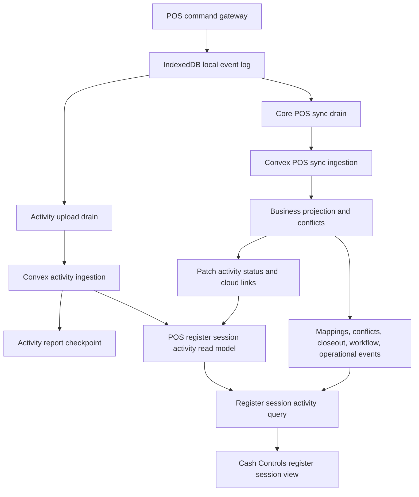

# feat: Add POS register session activity log

## Summary

Add a POS-owned, register-session-scoped activity log that lets full-admin Cash Controls investigators replay what POS did during a register session. The log is independent of the store-day timeline, uses browser-local POS events as the source evidence, uploads sanitized activity summaries to Convex, and shows cloud receipt, projection, review, and attention state without making the log a second source of truth for sales or cash controls.

---

## Problem Frame

A cashier reported closing out a register session, but the cloud session still appeared open. That incident is one use case for a broader gap: Athena has several partial evidence surfaces, including local IndexedDB events, POS sync events, sync mappings, conflicts, workflow traces, operational events, closeout records, and Cash Controls review rows. Those surfaces are useful to engineers, but they do not give an authorized operator or administrator a single session timeline that answers: "What did this POS terminal do for this register session, what reached the cloud, and what happened after projection or review?"

The requested feature is not a Daily Operations day timeline. It is a register-session investigation surface that follows the session and terminal evidence even when activity crosses store-day boundaries, is delayed by offline sync, or lands in manager review.

---

## Requirements

- R1. Show a register-session-scoped activity log that is independent of store-day timeline ordering and filtering.
- R2. Represent all POS activities captured for the session, including register open, POS/cashier session start, cart changes, service changes, payment updates, cart clear, sale completion, closeout start, reopen, cash movement, and expenses where they belong to the register session.
- R3. Preserve local POS event identity, local register session identity, terminal identity, local sequence, upload sequence when present, occurrence time, cloud receipt time, projection time, and related cloud record links where available.
- R4. Distinguish local activity, uploaded activity, accepted sync evidence, projected cloud records, held/out-of-order events, conflicts, rejected events, manager decisions, and repaired/applied records.
- R5. Make the cloud limitation explicit when a terminal is offline or has not uploaded later local activity; the cloud log must not imply that no local action happened.
- R6. Keep core POS sync as the authority for sales, register state, payments, inventory effects, expenses, and closeout projection. The activity log is investigation evidence, not a mutation authority.
- R7. Keep activity upload auxiliary and non-blocking. Activity-log upload failures must not block sale completion, closeout submission, POS sync cursor settlement, or cashier continuity.
- R8. Use bounded, indexed, session-scoped reads. The default POS and Cash Controls posture queries must not hydrate full session activity history.
- R9. Sanitize all activity metadata before upload and before UI presentation. Never upload or render raw proof tokens, PINs, sync secrets, raw payment provider payloads, customer contact fields, or full raw local event payloads.
- R10. Render operator-facing labels and messages in Cash Controls language, not raw backend enum names.
- R11. Preserve active and resolved manager review decisions in the activity log so the evidence remains visible after active review queues clear.
- R12. Show a concise activity coverage and attention summary above the timeline with reported-through sequence/time, terminal uncertainty, and counts for held, conflicted, rejected, mapping-pending, and projected activity.
- R13. Include focused tests for offline/online parity, unsynced limitation copy, out-of-order and duplicate events, cash movement and expense rows, activity coverage summary, role redaction, and the independence from Daily Operations.

---

## Scope Boundaries

- This plan does not add a store-day daily log report. Store-day context can be displayed as metadata, but the primary query and UI are register-session scoped.
- This plan does not use workflow traces or operational events as the complete activity ledger. They remain supplemental investigation evidence and lifecycle links.
- This plan does not change the business projection rules for sales, payments, expenses, register sessions, inventory, or closeouts.
- This plan does not make activity upload part of the POS sync cursor or local drawer authority contract.
- This plan does not promise historical completeness for already-finished sessions whose local-only events never uploaded and no longer exist on the terminal.
- This plan does not build a broad support dashboard across all stores, terminals, or days.
- This plan does not expose raw IndexedDB payloads to operators.

### Deferred to Follow-Up Work

- Terminal-local inspection or remote assist tooling that can read a currently offline terminal's IndexedDB activity directly before it uploads.
- A broader Operations or Terminal Health dashboard that searches activity across many sessions and terminals.
- A projection repair workflow launched directly from the activity log. V1 should link to existing review/repair surfaces.
- A cold-storage/archive policy beyond V1. V1 keeps mapped activity rows indefinitely with register-session and transaction evidence because the feature is an audit/investigation surface; only unresolved mapping-pending rows get a bounded cleanup policy in this plan.
- A separate cloud business projection for `register_reopened` if product decides reopen should mutate cloud register state outside the existing closeout/review paths.
- New read roles for store-manager staff proof or support-read-only access. V1 requires `full_admin` organization membership plus store/register-session validation. A manager-staff-proof or support-read-only reader would require a follow-up auth/schema plan.

---

## Context & Research

### Relevant Code and Patterns

- `packages/athena-webapp/src/lib/pos/infrastructure/local/localCommandGateway.ts` is the right local command boundary. POS UI commands should append local events here rather than writing activity directly to cloud.
- `packages/athena-webapp/src/lib/pos/infrastructure/local/expenseLocalCommandGateway.ts` currently scopes expense local events by store, terminal, register number, and local expense session, so session-scoped expense activity needs an explicit local register-session identity bridge.
- `packages/athena-webapp/src/lib/pos/infrastructure/local/posLocalStore.ts` already stores durable local events with `localEventId`, `sequence`, `uploadSequence`, terminal/store/register/session ids, staff proof metadata, payloads, timestamps, and sync state.
- `packages/athena-webapp/src/lib/pos/infrastructure/local/syncContract.ts` converts only selected local event types into core POS sync payloads today.
- `packages/athena-webapp/src/lib/pos/infrastructure/local/syncScheduler.ts` and `usePosLocalSyncRuntime.ts` own local upload scheduling and settlement.
- `packages/athena-webapp/shared/posLocalSyncContract.ts` defines cloud sync event status vocabulary: accepted, projected, conflicted, held, and rejected.
- `packages/athena-webapp/convex/pos/public/sync.ts`, `packages/athena-webapp/convex/pos/application/sync/ingestLocalEvents.ts`, and `packages/athena-webapp/convex/pos/application/sync/projectLocalEvents.ts` own terminal auth, ingestion, idempotency, conflict creation, and projection status.
- `packages/athena-webapp/convex/schemas/pos/posLocalSyncEvent.ts`, `posLocalSyncCursor.ts`, `posLocalSyncMapping.ts`, and `posLocalSyncConflict.ts` already preserve core sync evidence.
- `packages/athena-webapp/convex/schemas/operations/registerSession.ts` owns cloud register-session state, closeout records, workflow trace links, and manager approval fields.
- `packages/athena-webapp/convex/cashControls/deposits.ts` already returns `getRegisterSessionSnapshot`, including a small operational-event timeline, but that timeline is not a complete POS activity log.
- `packages/athena-webapp/src/components/cash-controls/RegisterSessionView.tsx` is the natural UI home for session activity because it already renders register-session snapshot, transactions, closeout/review context, and sync review content.
- `packages/athena-webapp/convex/operations/registerSessionTracing.ts` and `convex/workflowTraces/adapters/registerSession.ts` provide lifecycle evidence links, but workflow traces are not a raw activity ledger.
- `packages/athena-webapp/shared/registerSessionLifecyclePolicy.ts` should remain the place where lifecycle status is interpreted for labels and state meaning.

### Institutional Learnings

- `docs/solutions/architecture/athena-pos-local-first-sync-2026-05-13.md`: POS sync is an event-log settlement system; keep local ids, cloud mappings, idempotency, and sequence ordering explicit.
- `docs/solutions/architecture/athena-pos-register-lifecycle-policy-2026-06-23.md`: drawer lifecycle meaning belongs in shared policy, not ad hoc UI or projection checks.
- `docs/solutions/logic-errors/athena-pos-register-sync-repair-and-runtime-reconciliation-2026-06-26.md`: sync conflicts are business-record problems, not just queue rows; evidence surfaces must distinguish cloud state, local state, mapping state, and gateway rejection.
- `docs/solutions/architecture/athena-workflow-investigation-evidence-2026-06-21.md`: workflow traces are investigation evidence, not authoritative ledgers; source ledgers and operational events keep their own boundaries.
- `docs/solutions/performance/athena-convex-read-amplification-2026-06-29.md`: keep posture queries bounded and put detailed evidence behind explicit drill-in queries.
- `docs/solutions/logic-errors/athena-pos-operations-metric-redaction-and-cash-allocation-2026-06-21.md` and `docs/solutions/logic-errors/athena-daily-close-row-metadata-redaction-2026-06-27.md`: activity metadata must be field-aware and redacted before it reaches operator surfaces.
- `docs/product-copy-tone.md`: operator-facing copy must be calm, direct, and normalized away from raw backend wording.

### External References

- None. Repo-local POS, Convex, Cash Controls, workflow evidence, redaction, and performance guidance is sufficient for this plan.

---

## Key Technical Decisions

| Decision | Rationale |
| --- | --- |
| Build a POS-owned register-session activity read model | The feature needs session-level POS evidence, not a store-day aggregate or generic audit table. POS owns the local event stream and sync semantics. |
| Add a sanitized activity upload channel instead of relying only on current core sync rows | Current cloud sync does not include all local event types, including cart item changes, payment updates, session start, service changes, and some reopen evidence. "All activities POS did" requires uploading safe activity summaries for those events. |
| Keep activity upload separate from core POS sync cursor settlement | The activity log should improve visibility without changing sale/closeout authority or making cashier continuity depend on non-critical investigation evidence upload. |
| Use local event identity as the idempotency spine | `storeId`, `terminalId`, `localRegisterSessionId`, `localEventId`, and sequence are the durable way to group terminal-reported rows. Server-originated review rows use separate stable keys such as review decision id plus version. |
| Persist mapping-pending activity server-side | Local activity may upload before cloud register-session mapping exists. V1 stores bounded `mapping_pending` rows keyed by store, terminal, local register session, and local event id, then resolves them when sync mappings are created or repaired. |
| Add an activity report checkpoint separate from `posLocalSyncCursor` | Core sync cursors only cover core-uploadable events. The activity log needs its own reported-through sequence/time to distinguish empty from unreported sessions and to summarize replay coverage. |
| Treat workflow traces and operational events as supplemental rows or links | They add lifecycle and command-audit context, but neither is complete enough to prove all POS activity for the session. |
| Order primarily by local register-session sequence | Occurred time, upload time, acceptance time, and projection time can disagree during offline, retry, duplicate, or out-of-order scenarios. Local sequence is the clearest replay axis; cloud timestamps appear as secondary evidence. |
| Show uncertainty explicitly for offline or unreported terminals | The cloud can prove what it has received and what it has not received yet. It cannot prove nothing happened on a disconnected terminal. |
| Keep full activity history behind a dedicated query | `getRegisterSessionSnapshot` and default POS/register screens should stay bounded. Activity history loads only when the session detail asks for it. |
| Use an allowlisted metadata contract | Activity upload should carry labels, counts, amounts already visible in Cash Controls/POS, local ids, and status evidence, but never raw payloads or secret/proof/customer/payment internals. |
| Use an explicit `full_admin` cloud-read guard for V1 | The current Cash Controls snapshot guard includes `pos_only`, which is too broad for detailed activity evidence. V1 requires `full_admin` organization membership plus store/register-session validation; POS-only, unauthorized, and wrong-store users get no rows. |
| Preserve resolved manager review history | Register-session investigation requires knowing whether any activity was held, rejected, repaired, manager-applied, or manager-rejected even after active review work has disappeared from the queue. |
| Isolate activity patch failures from authoritative projection | Projection/review paths may emit activity patch intents, but activity write failures must not roll back sales, closeouts, cursor settlement, or manager decisions. |

---

## Open Questions

### Resolved During Planning

- **Should this be Daily Operations scoped?** No. It is register-session scoped. Store day and Daily Close status may appear as metadata only.
- **Should v1 show only today's existing cloud sync rows?** No. To meet "all activities POS did," v1 should add an auxiliary activity upload channel for sanitized summaries of local POS events that are not currently core sync events.
- **Can the cloud definitively know about activity that never uploaded from an offline terminal?** No. The UI must say that the terminal has not reported later local activity, not that no later activity exists.
- **Should the activity log become the authority for closing a cloud session?** No. Existing projection, closeout, review, and repair paths remain authoritative.
- **Should `workflowTrace` be the activity ledger?** No. It remains a lifecycle/evidence link.
- **Should `getRegisterSessionSnapshot` grow full history by default?** No. Add a dedicated, paginated companion query.
- **What is the default display order?** Local session sequence, with cloud timestamps and status badges as secondary evidence.
- **How does mapping-pending work?** Persist bounded server-side rows keyed by store, terminal, local register session, and local event id. The terminal may treat the activity as reported once the server acknowledges the mapping-pending row; a resolver patches the cloud register session id later.
- **How does the log prove empty versus unreported?** Add an activity checkpoint separate from the core POS sync cursor and update it on every activity report, including empty/sanitizer-skipped reports.
- **Who can read what?** V1 requires `full_admin` organization membership plus store/register-session validation. POS-only, unauthorized, and wrong-store users receive no activity data or link hints. Future store-manager staff-proof reads or support-read-only reads are out of scope until Athena has explicit auth for those paths.

### Deferred to Implementation

- Exact activity event type enum names and DTO field names.
- Exact page size for activity rows after checking existing Cash Controls pagination patterns.
- Whether cashier sign-out exists as a durable local event today or needs a small local command-gateway event addition.

---

## High-Level Technical Design

> This illustrates the intended approach and is directional guidance for review, not implementation specification. The implementing agent should treat it as context, not code to reproduce.

### Evidence Layers

| Layer | Owns | Activity log use |
| --- | --- | --- |
| Browser local POS event log | What the terminal recorded locally, in local sequence | Source evidence for activity summaries once uploaded |
| Core POS sync events | Business facts that mutate cloud records | Projection status, mappings, conflicts, rejection and held state |
| POS register-session activity rows | Sanitized replay of POS actions for one register session | Primary UI timeline |
| Activity report checkpoint | Terminal-reported high-watermark for activity upload | Empty-vs-uncertain state and replay coverage summary |
| Operational events | Discrete cloud command audit rows | Supplemental manager/cash-control rows |
| Workflow traces | Lifecycle investigation breadcrumbs | Links and lifecycle context, not complete history |
| Register session and closeout records | Cloud register lifecycle and manager decisions | State labels, closeout records, reopen/approval context |

Supplemental evidence follows a strict de-dupe rule: a local activity row is primary when `localEventId` exists; sync, conflict, mapping, projection, workflow, closeout, and operational-event evidence patch or link that row. Supplemental rows render separately only when they have no local-event source, such as a server-only manager decision or cash-control correction.

### Activity Row Contract

The read model should store one idempotent row per uploaded local POS activity and one idempotent row per server-originated review/closeout decision that has no local event source. Conceptually, each row needs:

| Field group | Purpose |
| --- | --- |
| Scope | `storeId`, `registerSessionId` when mapped, `terminalId`, `localRegisterSessionId`, register number |
| Identity | activity key, local event id when present, local sequence, upload sequence, optional related sync event id |
| Time | occurred locally, recorded/uploaded, accepted, projected, reviewed |
| Actor | staff profile id when safe and available, normalized display name at query time |
| Classification | normalized category, local event type, optional core sync event type |
| Status | `terminal_reported`, `mapping_pending`, `accepted`, `projected`, `held`, `conflicted`, `manager_applied`, `manager_rejected`, `rejected`, `repaired` |
| Links | transaction, POS session, closeout record, conflict ids, workflow trace, operational event |
| Safe metadata | event-specific allowlisted keys such as item count, service count, tender method label, amount totals already visible to this role, receipt/reference labels, system reason code, and redacted diagnostics |

`conflicted` is the canonical persisted status for sync conflicts. UI may label it as `Needs manager review`. `manager_applied` and `manager_rejected` are persisted review-decision statuses. `repaired` is reserved for later server repair activity when an existing business record/mapping is corrected without a manager conflict decision.

Local activity idempotency keys use `local:<storeId>:<terminalId>:<localEventId>`. Mapping-pending rows also index `storeId`, `terminalId`, `localRegisterSessionId`, and local event id. Server-originated rows use stable keys such as `reviewDecision:<conflictId>:<decisionVersion>` or `closeoutRecord:<closeoutRecordId>:<transition>`. Retries patch existing rows by key.

The metadata contract is a positive allowlist, not a denylist. Each activity type gets explicit allowed keys, scalar types, maximum string lengths, and role visibility. There is no arbitrary `metadata` bag, no free-form local notes, and no client-supplied reason text unless it already passed an existing manager-review authorization path. Ingestion rejection and monitoring logs must record sanitized reason codes only, never rejected payloads.

Do not store raw local event payloads in the activity row. If an engineer needs raw terminal data, that belongs in a separate support/debug path with a different authorization and retention posture. Terminal-uploaded rows are labeled and treated as terminal-reported evidence until server projection or review attaches authoritative cloud status and links.

### Access and Redaction Matrix

| Reader | Activity access | Field policy | Links |
| --- | --- | --- | --- |
| Full admin | Full activity rows for authorized organization/store/register session | Staff display names, safe item/service/tender summaries, closeout/review status, and safe amounts already visible in Cash Controls | Transaction, closeout, review, and workflow links when existing permissions allow |
| POS-only, unauthorized, or wrong-store user | No activity rows | No existence hints beyond existing safe not-found behavior | No links |
| Future store-manager staff-proof reader | Out of scope for V1 until Athena adds or reuses an explicit manager-proof read path | Would need a follow-up auth plan and tests | No V1 links |
| Future support read-only | Out of scope for V1 until Athena adds this auth role | Would need a follow-up auth/schema plan and a redacted DTO | No V1 links |

### Activity Coverage Summary Contract

The query should return a concise foundational summary above the timeline. It is about replay coverage and attention state, not about any single outcome like closeout. Initial fields:

| Summary field | Meaning |
| --- | --- |
| `reportedThroughSequence` | Highest local register-session sequence the terminal has reported through the activity channel. |
| `lastActivityReportedAt` | Last server-accepted activity report time for this terminal/session. |
| `coverageState` | `reported`, `partially_reported`, `unreported`, or `unknown_terminal_state`, based on checkpoints and mapped activity. |
| `attentionCounts` | Counts for mapping-pending, held, conflicted, rejected, manager-applied, manager-rejected, and activity-patch-failed rows. |
| `categoryCounts` | Counts by register, session, cart, payment, service, cash, expense, sale, closeout, sync, and review category. |
| `latestCloudStatusAt` | Latest accepted/projected/reviewed timestamp seen in cloud evidence. |

The summary can highlight closeout-related rows when closeout activity exists, but closeout is just one category in the same activity model.

### UI Contract

- Add a `POS activity` section in the register-session detail surface, near sync review and transaction evidence, not inside Daily Operations.
- Show the activity coverage and attention summary above activity rows so investigators can understand replay completeness before reading the full timeline.
- Show rows as a compact timeline/table hybrid optimized for investigation: sequence, time, actor, activity, status, and evidence links.
- Provide filter chips for all, register, sale, cart, payment, service, cash, expense, closeout, sync/review, and errors/review needed.
- Empty copy says "No cloud-reported POS activity for this session" unless the query can prove the terminal has reported through the end of the session.
- Uncertain copy says "This terminal has not reported later local activity to the cloud" with last reported sequence/time when available.
- Normalize raw event names into labels such as `Register opened`, `Cart item added`, `Payment updated`, `Expense recorded`, `Cash movement recorded`, `Sale completed`, `Closeout started`, `Register reopened`, `Sync waiting for earlier POS history`, `Needs manager review`, and `Manager review applied`.

---

## Implementation Units

- U1. **Define the activity contract and redaction rules**

**Goal:** Create the shared vocabulary and allowlisted metadata contract for POS session activity.

**Requirements:** R2, R3, R4, R9, R10

**Dependencies:** None

**Files:**
- Add: `packages/athena-webapp/shared/posRegisterSessionActivityContract.ts`
- Add or modify tests near: `packages/athena-webapp/shared/posRegisterSessionActivityContract.test.ts`
- Reference: `packages/athena-webapp/shared/posLocalSyncContract.ts`
- Reference: `docs/product-copy-tone.md`

**Approach:**
- Define activity categories, statuses, and operator labels that cover current local POS event types and current core sync outcomes.
- Add a sanitizer that converts local event payloads into safe summary metadata, including cash movement and expense summaries when they are scoped to the register session.
- Keep event classification stable across browser and Convex code without importing Convex-only APIs into browser-safe shared modules.
- Use per-event positive metadata schemas with allowed keys, scalar types, and length caps. Explicitly deny proof tokens, sync secrets, PINs, raw payment internals, customer phone/email, raw payloads, local notes, free-form diagnostics, and backend-only blobs.
- Define canonical status mapping: core `conflicted` persists as `conflicted` and renders as `Needs manager review`; review decisions persist as `manager_applied` or `manager_rejected`.

**Test scenarios:**
- Happy path: register open, cart item add, payment update, cash movement, expense record, sale completion, closeout start, and reopen map to stable labels/categories.
- Privacy path: proof token, customer contact, raw payment reference, and arbitrary payload fields are removed.
- Status path: conflicted, held, manager-applied, manager-rejected, rejected, and repaired statuses use one canonical vocabulary.
- Error path: unknown or unsupported local event types produce safe diagnostic activity or are skipped with a typed reason, not raw payload output.

**Verification:**
- Shared tests prove the activity vocabulary and metadata sanitizer before local or cloud ingestion depends on it.

---

- U2. **Add local activity upload state and drain**

**Goal:** Upload sanitized activity summaries from the terminal without coupling them to the core POS sync cursor.

**Requirements:** R2, R3, R5, R7

**Dependencies:** U1

**Files:**
- Modify: `packages/athena-webapp/src/lib/pos/infrastructure/local/posLocalStore.ts`
- Modify: `packages/athena-webapp/src/lib/pos/infrastructure/local/localCommandGateway.ts`
- Modify: `packages/athena-webapp/src/lib/pos/infrastructure/local/expenseLocalCommandGateway.ts`
- Modify: `packages/athena-webapp/src/lib/pos/infrastructure/local/syncScheduler.ts`
- Modify: `packages/athena-webapp/src/lib/pos/infrastructure/local/usePosLocalSyncRuntime.ts`
- Modify tests near: `packages/athena-webapp/src/lib/pos/infrastructure/local/posLocalStore.test.ts`
- Modify tests near: `packages/athena-webapp/src/lib/pos/infrastructure/local/localCommandGateway.test.ts`
- Modify tests near: `packages/athena-webapp/src/lib/pos/infrastructure/local/syncScheduler.test.ts`

**Approach:**
- Bump the local POS store schema from the current version to the next version and add local activity upload state that is separate from existing event `sync` state: pending, reported, mapping pending, failed, last attempt, reported at, and sanitized reason code.
- Initialize existing events as activity pending only when they are still eligible to upload from the terminal. Never mark historical or local-only events as cloud-reported until the activity channel actually receives a server acknowledgement.
- Add a local activity high-watermark/checkpoint per terminal/register-session so the terminal can report that it has scanned through a local sequence even when a batch contains only unsupported or sanitizer-skipped events.
- Ensure every command-gateway activity intended for the log is activity-capturable, including local-only cart, service, payment, session, reopen, cash movement, closeout, and register-session-scoped expense actions.
- Add a durable `localRegisterSessionId` bridge for expense activity at expense-session start or upload time so expense rows can be included only when they truly belong to the register session.
- Drain activity batches after or alongside core sync runtime work, but keep failures isolated from sale/closeout sync.
- Treat server `mapping_pending` acknowledgement as reported for local upload purposes while leaving the row retryable/resolvable for cloud register-session linkage.

**Test scenarios:**
- Happy path: online register activity uploads activity rows while existing core sync behavior is unchanged.
- Offline path: activity remains pending locally and uploads after reconnect.
- Error path: activity upload failure does not mark sale sync failed, block closeout, or advance/rewind the core sync cursor.
- Edge path: local-only events that were previously considered synced for core business purposes still remain pending for activity upload until reported.
- Migration path: pending, synced, needs-review, failed, and local-only rows upgrade without losing core sync state or pretending activity was reported.
- Expense path: register-session-scoped expense activity carries a durable local register-session identity; expense activity without session identity is excluded or held with a safe reason.

**Verification:**
- Local tests prove the new activity state is independent from existing POS sync settlement.

---

- U3. **Persist activity rows in Convex**

**Goal:** Add a server-side activity read model and idempotent ingestion mutation.

**Requirements:** R1, R2, R3, R4, R5, R8, R9

**Dependencies:** U1, U2

**Files:**
- Add: `packages/athena-webapp/convex/schemas/pos/posRegisterSessionActivity.ts`
- Add: `packages/athena-webapp/convex/schemas/pos/posRegisterSessionActivityCheckpoint.ts`
- Modify: `packages/athena-webapp/convex/schema.ts`
- Modify: `packages/athena-webapp/convex/pos/public/sync.ts`
- Add or modify repository/helper files under: `packages/athena-webapp/convex/pos/application/sync/`
- Add tests near: `packages/athena-webapp/convex/pos/public/sync.test.ts`
- Add tests near: `packages/athena-webapp/convex/pos/application/sync/posRegisterSessionActivity.test.ts`

**Approach:**
- Add a `posRegisterSessionActivity` table with indexes for store/register-session sequence, store/register-session time, and store/terminal/local-event idempotency.
- Add an activity checkpoint table keyed by store, terminal, local register session, and optional cloud register session. It records reported-through sequence/time, last reported activity time, skipped count by safe reason code, and last accepted batch time.
- Authorize the activity ingestion mutation with the same terminal identity and sync-secret boundary used by core POS sync.
- Validate bounded batches with server-enforced positive metadata schemas. Reject disallowed keys/types/lengths and log only safe reason codes.
- Verify terminal, store, register number, local register session, and optional expense-session binding server-side. An authorized terminal cannot write activity for another terminal or unrelated register session.
- Resolve local register session ids to cloud register session ids through sync mappings when available.
- Persist mapping-pending rows server-side when mapping is missing. Acknowledge them to the terminal as reported, index them by store/terminal/local register session/local event id, and patch them when a mapping is created or repaired.
- Retain mapped activity rows indefinitely in V1. Mapping-pending rows older than 30 days without a register-session mapping are compacted to checkpoint/rejection counters unless tied to unresolved closeout or sync review evidence.

**Test scenarios:**
- Happy path: a batch of local activity rows inserts once and returns stable acknowledgements.
- Idempotency path: retrying the same local event patches or acknowledges the existing row without duplicates.
- Mapping path: activity before register-session mapping does not fabricate a cloud register session id and later resolves cleanly.
- Checkpoint path: an empty or sanitizer-skipped activity report still advances reported-through sequence/time with safe skip counts.
- Authorization path: wrong terminal/store credentials cannot ingest activity.
- Compromised-terminal path: an authorized terminal cannot write rows for another terminal/session, and terminal-reported rows do not gain projected links without server projection evidence.
- Privacy path: server validators reject disallowed metadata if the client sanitizer is bypassed.

**Verification:**
- Convex tests prove activity ingestion is bounded, authorized, idempotent, and redacted.

---

- U4. **Patch activity from projection, conflicts, closeout, and review decisions**

**Goal:** Connect uploaded activity rows to authoritative cloud outcomes and manager decisions.

**Requirements:** R3, R4, R6, R11

**Dependencies:** U3

**Files:**
- Modify: `packages/athena-webapp/convex/pos/application/sync/projectLocalEvents.ts`
- Modify: `packages/athena-webapp/convex/pos/application/sync/ingestLocalEvents.ts`
- Modify: `packages/athena-webapp/convex/cashControls/closeouts.ts`
- Modify: `packages/athena-webapp/convex/cashControls/deposits.ts` only if review snapshot composition needs shared helpers
- Modify tests near: `packages/athena-webapp/convex/pos/application/sync/projectLocalEvents.test.ts`
- Modify tests near: `packages/athena-webapp/convex/pos/application/sync/ingestLocalEvents.test.ts`
- Modify tests near: `packages/athena-webapp/convex/cashControls/registerSessionTraceLifecycle.test.ts`

**Approach:**
- When core sync accepts, projects, holds, rejects, or conflicts an event, patch related activity rows with status, cloud ids, conflict ids, and timestamps.
- When sync mappings are created or repaired, resolve matching mapping-pending activity rows by stable local event keys.
- When closeout or manager review decisions resolve a register-session conflict, append or patch review activity with stable server-originated keys such as review decision id plus decision version so retries cannot duplicate decisions.
- Emit activity patch intents from projection/review code through best-effort helpers. Missing activity rows, invalid activity metadata, or activity schema drift must not roll back sale projection, closeout submission, cursor settlement, or manager repair.
- Keep operational events and workflow traces as existing evidence paths; add links from activity rows where appropriate rather than duplicating business mutation logic.
- Use `shared/registerSessionLifecyclePolicy.ts` semantics when translating register/closeout lifecycle state into activity labels.

**Test scenarios:**
- Happy path: completed sale activity links to the projected POS transaction and POS session.
- Status transition path: register, sale, cash/expense, sync/review, and closeout rows can become projected, held, conflicted/needs manager review, manager rejected, or rejected according to core sync and manager-review outcome.
- Review path: manager-applied and manager-rejected outcomes remain visible after active review work clears.
- Isolation path: sale projection or manager decision still succeeds when activity patching fails, and a sanitized activity-patch error is recorded for follow-up.
- Duplicate path: duplicate register open or duplicate sale evidence groups under source local event identity instead of rendering as a second legitimate drawer/sale.
- Held path: out-of-order activity shows waiting status and updates after the missing earlier event arrives.

**Verification:**
- Projection and Cash Controls tests prove activity status mirrors authoritative sync/review outcomes without becoming the authority itself.

---

- U5. **Add the register-session activity query and coverage summary**

**Goal:** Expose a bounded, sanitized, UI-ready timeline and activity coverage summary for one register session.

**Requirements:** R1, R3, R4, R5, R8, R9, R10, R11, R12

**Dependencies:** U3, U4

**Files:**
- Add: `packages/athena-webapp/convex/cashControls/registerSessionActivity.ts`
- Modify: `packages/athena-webapp/convex/cashControls/deposits.ts` only to link or compose with the new query if needed
- Add tests near: `packages/athena-webapp/convex/cashControls/registerSessionActivity.test.ts`

**Approach:**
- Require `full_admin` organization membership plus store/register-session validation. Do not reuse the broader register-session snapshot guard if that guard permits POS-only users.
- Query by authorized store and register session, with pagination and deterministic ordering by local sequence plus fallback time.
- Merge or link supplemental operational events, workflow trace refs, closeout records, conflicts, mappings, and staff display names into a UI DTO using the de-dupe precedence from the evidence-layer contract.
- Return explicit completeness/uncertainty state based on the activity checkpoint, last reported sequence/time, and mapped activity evidence.
- Return an activity coverage summary DTO with reported-through sequence/time, coverage state, attention counts, category counts, and latest cloud status time. Do not make closeout a privileged summary outcome.
- Apply the access matrix at query time. V1 should explicitly require `full_admin` organization membership plus store/register-session validation, not the broader register-session snapshot guard if that guard permits POS-only users.

**Test scenarios:**
- Happy path: returns ordered activity rows with normalized labels, actor display names, links, and statuses.
- Empty path: returns safe "no cloud-reported activity" state rather than implying terminal-local certainty.
- Uncertain path: terminal has not reported beyond a sequence/time and the DTO includes limitation copy inputs.
- Summary path: offline or partially reported sessions return coverage state and attention counts without privileging closeout outcomes.
- Authorization path: full admins with valid store/register-session scope receive activity rows; POS-only, unauthorized, and wrong-store users receive a safe no-data response with no hidden links.
- Cash/expense path: session-scoped cash movements and expenses appear only when the session binding is valid.
- Pagination path: long sessions remain bounded and deterministic across pages.

**Verification:**
- Query tests prove session scoping, redaction, pagination, and uncertainty semantics.

---

- U6. **Render the POS activity section in RegisterSessionView**

**Goal:** Add the operator-facing activity log and coverage summary to the register-session detail UI.

**Requirements:** R1, R4, R5, R8, R10, R11, R12, R13

**Dependencies:** U5

**Files:**
- Modify: `packages/athena-webapp/src/components/cash-controls/RegisterSessionView.tsx`
- Add or modify adapter/component files under: `packages/athena-webapp/src/components/cash-controls/`
- Modify tests near: `packages/athena-webapp/src/components/cash-controls/RegisterSessionView.test.tsx`
- Reference: `packages/athena-webapp/src/components/operations/OperationsQueueView.tsx`

**Approach:**
- Add a `POS activity` section near existing sync review/register-session evidence and before or near transaction lists.
- Render the activity coverage summary above the row list with last reported sequence/time, coverage state, attention counts, and category counts.
- Use compact rows with stable dimensions for sequence, time, actor, activity, status, and links.
- Add filters for category and review/error state, including cash and expense, without requiring navigation into Daily Operations.
- Use calm copy for uncertainty and empty states.
- Link to transaction, sync review, workflow trace, or closeout evidence only when the current user can access the target.

**Test scenarios:**
- Happy path: renders a synced session with open, cart/payment activity, cash/expense activity when present, sale, closeout, and projection links.
- Uncertain path: renders limitation copy for a terminal that has not reported later activity.
- Summary path: renders replay coverage and attention counts without making closeout the central outcome.
- Review path: renders needs-review and resolved manager decision rows.
- Empty path: distinguishes no cloud-reported rows from no local activity.
- Independence path: activity section renders from the register-session activity query and does not depend on Daily Operations timeline props.

**Verification:**
- Component tests prove the UI communicates session activity, uncertainty, and review status with normalized copy.

---

- U7. **Validate, document, and keep graph current**

**Goal:** Prove the feature across local-first, Convex, Cash Controls, privacy, and performance boundaries.

**Requirements:** R1-R13

**Dependencies:** U1-U6

**Files:**
- Modify focused test files from U1-U6
- Modify docs only if implementation introduces operator or support runbook behavior
- Run graph rebuild after code modifications per repo instructions

**Approach:**
- Run focused Vitest suites from `packages/athena-webapp` for shared contract, local POS infrastructure, Convex sync/activity, Cash Controls query, and RegisterSessionView.
- Run Convex validators/linting required by touched Convex files.
- Run a graph rebuild after code changes so `graphify-out` reflects the new activity model.
- Add a short implementation note if support needs to understand the cloud limitation for offline terminals.
- Verify ingestion rejection/error logs contain sanitized reason codes only.
- Verify mapped activity retention and mapping-pending cleanup behavior.

**Test scenarios:**
- Online session: open, activity edits, cash/expense activity, sale, closeout all render as projected.
- Offline session: pre-upload cloud view is uncertain; post-upload rows appear in local sequence with upload/projection timestamps.
- Coverage scenario: any uploaded activity row can be held, conflicted, rejected, or projected, and the coverage summary shows whether the terminal has reported through that sequence.
- Duplicate/out-of-order: rows group or label correctly and do not misstate business outcomes.
- Privacy/access: full-admin, POS-only, unauthorized, and wrong-store cases prove disallowed fields and links are not exposed.

**Verification:**
- The final proof includes focused tests, Convex checks for changed code, and graph rebuild.

---

## System-Wide Impact

- **POS browser runtime:** Gains a second, auxiliary upload drain for activity summaries. Core sync cursor and sale/closeout behavior remain separate.
- **Local IndexedDB schema:** Bump from `POS_LOCAL_STORE_SCHEMA_VERSION = 8` to the next version for activity upload state and activity checkpoints. Migration must preserve existing event sync state and avoid marking historical events as cloud-reported activity unless actually uploaded.
- **Convex schema:** Adds a high-volume activity table and activity checkpoint table. Indexes must support session detail reads, mapping-pending resolution, cleanup, and local-event idempotency without store-wide scans.
- **Convex ingestion:** Adds a new terminal-authenticated mutation surface. It must reuse the same terminal/store auth posture as POS sync and enforce bounded payloads.
- **Projection/review code:** Emits best-effort activity patch intents after business projection and manager review decisions. Activity patch failures must be isolated from authoritative business mutation and logged with sanitized reason codes.
- **Cash Controls:** Adds a new detail query and UI section. Existing register-session snapshot and timeline remain intact.
- **Workflow/operational evidence:** Existing trace and operational-event records become links or supplemental rows, not a replacement ledger.
- **Performance:** Activity detail reads should be opt-in and paginated; default register and Daily Operations queries should not subscribe to full activity history.
- **Privacy/security:** The new channel increases the surface area for local POS payload exposure, so sanitizer and query redaction are part of the core feature, not polish.

---

## Risks & Mitigations

| Risk | Mitigation |
| --- | --- |
| Cloud cannot prove fully offline terminal-local actions | UI shows last reported sequence/time and explicit uncertainty. Do not use "no activity" wording unless reporting is known complete. |
| Activity upload becomes a hidden blocker for cashier flows | Keep activity state separate from core sync state and make upload best-effort/retryable. |
| Activity table grows quickly from cart/payment edits | Use compact metadata, session-scoped indexes, pagination, optional category filters, and explicit indefinite retention for mapped rows. Defer cross-session analytics. |
| Raw local payloads leak sensitive data | Add shared sanitizer, server positive allowlist validation, role-aware DTOs, sanitized ingestion logs, and redaction tests. |
| Activity rows duplicate after retries | Upsert by local activity keys and server-originated review/closeout keys; patch existing rows on retry/projection repair. |
| Mapping does not exist when activity uploads | Persist bounded mapping-pending rows server-side, acknowledge terminal reporting, and resolve by mapping when available. Never fabricate cloud ids. |
| Compromised authorized terminal fabricates activity | Server verifies store/terminal/session binding, labels terminal-reported rows distinctly, and derives authoritative status/links only from server projection/review evidence. |
| Activity patch failure breaks authoritative sync | Use best-effort patch helpers and tests proving projection/review succeeds when activity visibility patching fails. |
| Operators confuse activity evidence with business truth | Labels and status badges distinguish recorded/uploaded/projected/review states. Core projection remains authoritative for session status. |
| Workflow traces and operational events create conflicting timelines | Local activity rows are primary when local event ids exist; supplemental evidence patches/links those rows and renders separately only when it has no local-event source. |
| Existing historical sessions look incomplete | Plan copy and support notes state that old local-only activity cannot be reconstructed unless terminals still have and upload it. |

---

## Rollout Notes

- Ship schema and server ingestion before enabling client activity upload if deployment ordering needs to tolerate older clients.
- Keep server validators tolerant of missing activity upload from older browser builds.
- Ship checkpoint ingestion with activity rows so empty/uncertain coverage works from day one.
- Enable UI against the activity query after ingestion and projection patching are available.
- Consider a short staff/support note: for offline terminals, the cloud can show last reported evidence but cannot confirm local-only activity until the terminal reconnects or is inspected locally.
- Monitor activity ingestion rejection, mapping-pending, checkpoint, cleanup, and activity-patch-failure counts after rollout. A spike likely indicates mapping timing, sanitizer drift, or patch-helper drift rather than business sync failure.
- Retain mapped activity rows indefinitely in V1. Clean up mapping-pending rows after 30 days when they have no mapping and are not tied to unresolved closeout/review evidence.

---

## Acceptance Scenarios

- AS1. **Online session activity replay:** Register opens, cashier starts POS session, adds items, records session-scoped cash/expense activity when present, updates payment, completes sale, and may start closeout. Activity log shows each POS action in local sequence with projected/review status and transaction, cash/expense, review, or closeout links where applicable.
- AS2. **Offline activity replay:** Cashier performs activity offline. Before reconnect, the summary says the terminal has not reported later activity. After reconnect, rows appear in local sequence with projected, held, conflicted/needs manager review, manager rejected, or rejected status as applicable.
- AS3. **Status investigation:** When reported terminal activity does not match cloud-visible state, the activity log shows whether the relevant activity was locally reported, uploaded, held, conflicted, rejected, projected, or still unreported. The affected activity appears as its normal category rather than becoming a special feature outcome.
- AS4. **Out-of-order upload:** A later event arrives before an earlier sequence. Activity row shows waiting/held state and later updates when the missing event arrives.
- AS5. **Duplicate evidence:** Duplicate register open or sale upload does not render as a second legitimate drawer or sale. Local activity rows remain primary, and sync/conflict/workflow/operational evidence patches or links the existing row instead of double-rendering the business fact.
- AS6. **Manager decision retention:** A sync conflict is resolved by a manager and disappears from active review, but the activity log still shows one idempotent manager-applied or manager-rejected row, actor display context allowed for the reader, system reason code, and resulting projection state.
- AS7. **Reopen evidence:** Local reopen activity appears once uploaded through the activity channel. If no cloud business projection exists for reopen, the log labels it as activity evidence rather than implying authoritative cloud reopening.
- AS8. **Privacy and authorization:** Full-admin readers with valid store/register-session scope can see operationally useful activity context; POS-only, wrong-store, and unauthorized users receive no activity data or link hints. No role receives raw payloads, customer contact, proof tokens, sync secrets, PINs, local notes, or payment provider internals.
- AS9. **Daily Operations independence:** Register-session activity loads from the session detail even when no store-day timeline is open, and does not require store-day timeline rows to exist.

---

## Review Checklist

- Does the plan provide foundational session replay across POS activity categories without coupling the feature to any single outcome?
- Does the UI/query return replay coverage and attention summary without privileging a single activity type?
- Does it preserve POS local-first behavior and avoid blocking cashier work?
- Does it avoid turning investigation evidence into business mutation authority?
- Does it clearly state the offline terminal limitation?
- Does it define mapping-pending, checkpoint, retention, and IndexedDB cutover behavior concretely?
- Does it keep queries bounded and session scoped?
- Does it protect sensitive local POS payload fields and enforce role-aware access?
- Does it give implementation enough file-level direction without prescribing exact code?
