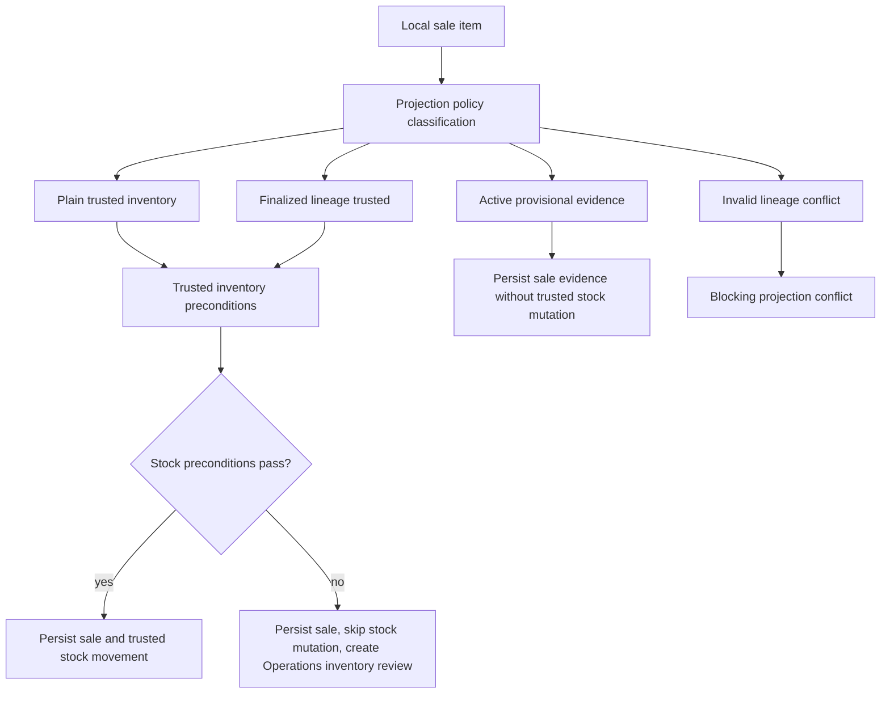
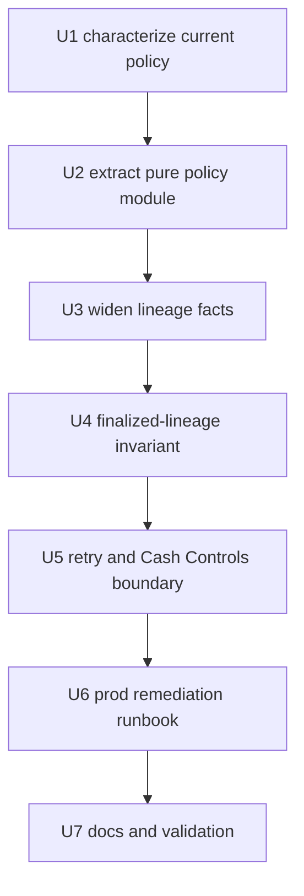
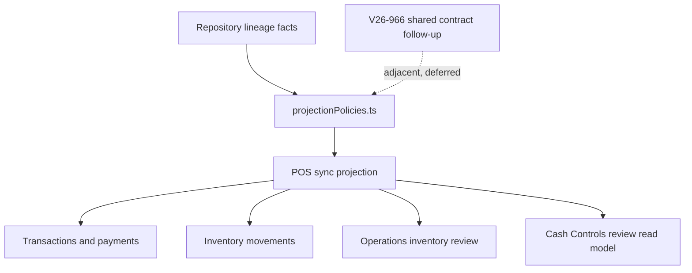

# refactor: Extract POS sync projection policies

## Summary

POS local-sync projection currently embeds catalog lineage, inventory-mutation, review, and blocking-conflict policy directly inside `projectLocalEvents.ts`. This plan extracts those inline decisions into a pure projection-policy module first, then adds the finalized provisional import invariant: when a queued offline sale references a provisional import row that has since become trusted inventory for the same store/product/SKU, projection should treat the row as trusted lineage behind the scenes and only create `synced_sale_inventory_review` work if trusted inventory preconditions fail or if stock mutation is unsafe because of finalization timing.

---

## Problem Frame

The production receipt under review was uploaded after its provisional import row had already been finalized into trusted inventory. Current projection treats the finalized/hidden row as a stale provisional row, blocks projection with an inventory conflict, and Cash Controls then exposes a manager-review action that cannot actually settle the sale because the same blocking policy still fires during replay.

That is the wrong boundary. Cash Controls should not be a SKU workspace or sync-cleanup approval queue for this case. Projection should own trusted lineage normalization, while Operations inventory review should own only the downstream stock repair if the now-trusted SKU cannot satisfy inventory preconditions or if finalization timing makes automatic stock mutation unsafe.

---

## Requirements

- R1. Extract POS sync projection policy decisions from `projectLocalEvents.ts` into a dedicated pure module that can host future invariants without adding more inline policy branches.
- R2. Preserve current behavior during the extraction pass before adding the new invariant.
- R3. Keep Convex repository reads, writes, conflict persistence, transaction persistence, inventory movements, and work-item mutations outside the policy module.
- R4. Preserve existing projection conflict semantics, including `details.blocksProjection`, `reviewedConflictIds`, and the reviewed projection option flags.
- R5. Treat a finalized provisional import row, including a row closed because of trusted finalization, as trusted sale lineage when the row exists, belongs to the same store, resolves to the same product/SKU, and the trusted SKU remains valid for that store.
- R6. Do not require Cash Controls manager approval or SKU workspace action for finalized matching lineage.
- R7. If finalized matching lineage reaches trusted inventory validation and stock mutation is unsafe or stock preconditions fail, project the sale, skip trusted stock mutation, and create or reuse a `synced_sale_inventory_review` work item.
- R8. Keep active provisional import behavior unchanged: active available provisional rows remain sale evidence and do not decrement trusted stock.
- R9. Keep rejected, non-finalization-closed, missing, wrong-store, mismatched product/SKU, invalid trusted SKU/store, or non-finalized hidden provisional rows blocking projection.
- R10. Preserve provisional lineage on persisted sale records, but do not mutate finalized provisional-row sale evidence after finalization.
- R11. Represent accepted finalized lineage as source-aware trusted demand for validation, movement/review metadata, and quantity aggregation while preserving the original provisional id on persisted sale records.
- R12. Keep active provisional plus trusted same-SKU mixes blocked, while allowing finalized lineage plus trusted same-SKU lines to aggregate as trusted demand.
- R13. Limit the first-sync inventory-review exception to accepted finalized-lineage demand only; plain trusted stock shortfalls and expired-hold shortfalls must keep their existing reviewed-projection gates.
- R14. Handle existing conflicted events with this exact finalized-lineage shape through idempotent retry/reprojection, without routing operators through Cash Controls approval.
- R15. Keep V26-966 as a related contract-ownership follow-up, not part of this implementation batch.
- R16. Correct the affected production conflicted rows after deploy through a scoped internal/system runbook, with preflight identification, idempotent reprojection, and post-run verification.
- R17. Add focused coverage for pure policy decisions, projection behavior, Cash Controls non-approval behavior, retry idempotency, temporal stock-mutation safety, production remediation safety, and preserved negative cases.

---

## Scope Boundaries

- This plan does not implement the broader V26-966 POS local-sync contract consolidation.
- This plan does not move shared event payload types between browser, shared, and Convex packages.
- This plan does not redesign Cash Controls review UI or make Cash Controls responsible for SKU/inventory repair.
- This plan does not change active provisional import sales into trusted inventory sales.
- This plan does not auto-accept rejected, non-finalization-closed, missing, wrong-store, invalid trusted SKU/store, or product/SKU-mismatched provisional lineage.
- This plan does not backfill historical transactions or rewrite completed sale rows.
- This plan does not introduce a broad migration unless implementation proves scoped internal/system retry cannot safely settle already-conflicted events.
- This plan does not expose raw backend conflict copy directly to operators as product language.

### Deferred to Follow-Up Work

- V26-966: consolidate POS local-sync event payload types, validators, and event-name mapping around `shared/posLocalSyncContract.ts`.
- A durable as-of alias history model for broader provisional/pending relinks, if later workflows need post-attribution correction instead of terminal lineage.
- Product-facing copy polish for unrelated Cash Controls review states.

---

## Context & Research

### Relevant Code and Patterns

- `packages/athena-webapp/convex/pos/application/sync/projectLocalEvents.ts` is the projection hotspot. It currently owns reviewed projection flags, catalog validation, `blocksProjection` short-circuiting, trusted inventory item selection, provisional sale evidence recording, inventory review work-item creation, and mixed trusted/provisional same-SKU blocking.
- `packages/athena-webapp/convex/pos/application/sync/projectLocalEvents.test.ts` already covers active provisional import projection, hidden/inactive provisional row blocking, mixed trusted/provisional same-SKU blocking, reviewed inventory projection, and inventory review work-item idempotency.
- `packages/athena-webapp/convex/pos/application/sync/types.ts` defines `PosLocalSaleItemInput.inventoryImportProvisionalSkuId`, `SyncProjectionRepository.getInventoryImportProvisionalSku`, and `recordInventoryImportProvisionalSkuSaleEvidence`.
- `packages/athena-webapp/convex/pos/infrastructure/repositories/localSyncRepository.ts` owns the Convex lookup and sale-evidence patch for `inventoryImportProvisionalSku`.
- `packages/athena-webapp/convex/schemas/inventory/inventoryImportProvisionalSku.ts` already has the finalization fields needed to distinguish active provisional evidence from finalized trusted lineage.
- `packages/athena-webapp/convex/inventory/catalogImport.ts` owns product-page finalization, hides or closes provisional rows, and records final trusted quantities and finalization source facts.
- `packages/athena-webapp/convex/cashControls/deposits.ts` classifies synced-sale inventory reviews and replays projection with `allowReviewedInventorySaleProjection`; the current generic failure copy appears when replay still returns a blocking projection conflict.
- `packages/athena-webapp/convex/cashControls/deposits.test.ts` covers reviewed inventory sale replay, automatic proofless repairs, and the rule that non-proofless synced reviews are not automatically applied.
- Existing pure policy precedents include `packages/athena-webapp/convex/pos/application/corrections/correctionPolicy.ts`, `packages/athena-webapp/shared/registerSessionLifecyclePolicy.ts`, and policy modules under `packages/athena-webapp/convex/pos/application/`.

### Institutional Learnings

- `docs/solutions/logic-errors/athena-pos-sync-review-workspace-boundaries-2026-06-19.md`: Cash Controls actions resolve only current sale/drawer decisions; Operations owns `synced_sale_inventory_review` inventory repair; raw conflict summaries are evidence, not final product copy.
- `docs/solutions/architecture-patterns/athena-pending-checkout-inventory-resolution-2026-07-03.md`: product-page/catalog finalization owns the transition into trusted inventory; Open Work and Daily Operations route/expose state but do not mutate catalog or inventory.
- `docs/solutions/architecture/athena-product-page-single-sku-provisional-trusted-finalization-2026-06-23.md`: provisional import finalization is a dedicated single-SKU conversion command that atomically patches the trusted SKU, hides the provisional row, and records source-aware SKU activity.
- `docs/solutions/architecture/athena-pos-provisional-import-trust-boundary-2026-06-10.md`: active provisional import rows are sale evidence, not trusted inventory; finalized/closed rows must return to normal stock enforcement.
- `docs/solutions/architecture/athena-pos-pending-checkout-sku-alias-2026-07-03.md`: linked pending rows become trusted SKU aliases at server command/read boundaries while preserving original evidence.
- `docs/solutions/logic-errors/athena-pos-register-sync-repair-and-runtime-reconciliation-2026-06-26.md`: register sync repair should replay projection idempotently with safe local-to-cloud mappings and retained sale/payment evidence.
- `docs/solutions/architecture-patterns/athena-open-work-resolution-ownership-2026-07-02.md`: Open Work is discovery/navigation; canonical Operations inventory exceptions resolve through `inventoryReviewWorkItem:${localTransactionId}:inventory-review`.

### External References

- None. The relevant guidance is local Athena Convex code, repo AGENTS instructions, and institutional solution notes.

---

## Key Technical Decisions

- **Use a local pure policy module:** Create `packages/athena-webapp/convex/pos/application/sync/projectionPolicies.ts` near the projector. The module should own decision vocabulary and pure classification, not Convex reads or writes.
- **Normalize line inventory source before validation:** Replace ad hoc `inventoryImportProvisionalSkuId` branching with a classified line source such as active provisional evidence, finalized lineage trusted, plain trusted inventory, existing pending-checkout source states, or blocking invalid lineage.
- **Extract behavior before changing behavior:** First move existing inline decisions behind tests with no semantic change, then add the finalized-lineage invariant in a separate unit.
- **Represent trusted demand separately from persisted lineage:** Accepted finalized-lineage items need a source-aware trusted-demand view for validation, hold consumption, stock-mutation decisions, movement metadata, and inventory-review metadata. The persisted sale item still keeps `inventoryImportProvisionalSkuId` as provenance.
- **Treat finalized matching lineage as trusted sale projection, with a temporal stock-mutation guard:** A matching finalized provisional row should be included in trusted SKU quantity aggregation and inventory precondition validation. Stock mutation is allowed only when the sale occurred at or after the provisional row was finalized, or when implementation can prove the finalization snapshot excluded that sale. If the sale occurred before finalization and exclusion cannot be proven, projection should persist the sale/payment, skip trusted stock mutation, and create or reuse `synced_sale_inventory_review`.
- **Create inventory review on first projection only for accepted finalized lineage:** Finalized matching lineage should not wait for Cash Controls replay. If trusted inventory is short, or if temporal finalization safety makes mutation unsafe, projection should persist the sale, skip stock mutation for the affected finalized-lineage lines, and create or reuse the Operations `synced_sale_inventory_review` work item. Plain trusted stock shortfalls and expired-hold shortfalls keep the existing `allowReviewedInventorySaleProjection` gate.
- **Keep active provisional evidence isolated:** Active available provisional rows continue to bypass trusted stock mutation and can receive provisional sale evidence. Finalized lineage preserves the provisional id on sale records but must not patch finalized provisional-row sale evidence.
- **Keep hard lineage failures hard:** Missing rows, wrong store, mismatched product/SKU, invalid trusted SKU/store, rejected rows, rows closed for reasons other than trusted finalization, and hidden rows that are not finalized trusted lineage continue to return blocking catalog conflicts.
- **Split active provisional mix rules from finalized-lineage aggregation:** Active provisional plus trusted same-SKU lines remain blocked to preserve the original trust boundary. Finalized-lineage plus trusted same-SKU lines aggregate as one trusted inventory demand.
- **Use trusted SKU price validation for finalized lineage:** Once lineage is finalized, price validation should compare against the trusted SKU pricing path, with existing non-blocking price-drift behavior preserved. Active provisional rows continue using their provisional imported-price basis.
- **Retry legacy conflicts through projection, not manager approval:** Existing events blocked only by this stale finalized-lineage policy should settle through an idempotent system retry/reprojection path. Cash Controls may stop showing the manager action once projection can settle or once the event maps to Operations inventory review.
- **Make production correction a required finish line:** The implementation is not done when the code deploys. It must include a scoped production remediation runbook that identifies affected conflict rows, reprojects only eligible events through the internal/system path, and verifies final state and side-effect counts.
- **Do not bundle V26-966:** Add only optional characterization fixtures or notes that make future contract consolidation safer; do not start the shared contract refactor in this batch.

---

## Open Questions

### Resolved During Planning

- **Should finalized matching provisional lineage become trusted inventory input?** Yes. That is the production failure boundary and matches the user-confirmed behavior.
- **Should inventory shortfall create Operations review without manager approval?** Yes. The only follow-up work for this case should be `synced_sale_inventory_review` if inventory preconditions fail.
- **Should first sync create the review work, or should Cash Controls replay be required first?** First sync should create the review work when the sale is otherwise valid and the trusted SKU preconditions fail.
- **Should finalized provisional rows receive late `saleEvidence` patches?** No. Preserve lineage on sale records; do not mutate finalized provisional rows after their finalization snapshot.
- **Should active provisional plus trusted same-SKU remain blocked?** Yes. The new invariant applies only after finalization establishes trusted lineage.
- **Should finalized-lineage stock always decrement trusted inventory when stock is available?** No. If the sale happened before finalization, stock mutation is unsafe unless implementation can prove the finalization snapshot excluded that sale. Otherwise the sale projects and Operations inventory review owns the stock reconciliation.
- **Should a finalized and closed row be accepted?** Only when the row was closed as part of trusted finalization and still resolves to the matching trusted store/product/SKU. Other closed rows remain blocking.

### Deferred to Implementation

- Whether `getInventoryImportProvisionalSku` should be widened or a purpose-specific lineage lookup should be added depends on the smallest type-safe repository change during implementation.
- Whether the existing retry path already replays the target conflicts often enough, or a narrow internal repair/retry helper is needed, should be decided after inspecting current ingestion and operational retry entry points.
- Whether transaction item DTOs need a new explicit lineage/source field depends on current stored item shape; the plan requires preserving provenance, not a specific field rename.
- The exact production command shape for remediation should be selected during implementation from the safest existing internal Convex path. The runbook must document it, but the plan does not pre-commit to a CLI/function name before code exists.

---

## High-Level Technical Design

> *This illustrates the intended approach and is directional guidance for review, not implementation specification. The implementing agent should treat it as context, not code to reproduce.*

| Source outcome | Example input | Projection behavior | Review owner |
| --- | --- | --- | --- |
| Plain trusted inventory | Item has trusted product/SKU and no provisional id | Validate and mutate trusted stock normally under existing reviewed-projection gates | None unless reviewed inventory handling creates Operations review |
| Active provisional evidence | Provisional row is active and available | Persist sale and provisional lineage; bypass trusted stock mutation | None |
| Finalized lineage trusted | Provisional row is finalized or finalization-closed and same store/product/SKU with valid trusted SKU | Treat as source-aware trusted demand; preserve lineage; mutate stock only when temporal finalization safety allows | Operations inventory review if stock preconditions fail or mutation is temporally unsafe |
| Invalid lineage conflict | Missing, rejected, non-finalization-closed, wrong-store, invalid trusted SKU/store, mismatched, or hidden non-finalized row | Blocking projection conflict | Existing sync conflict/review path |

---

## Implementation Units

- U1. **Characterize Current Inline Projection Policy**

**Goal:** Lock current behavior in tests before moving policy logic out of `projectLocalEvents.ts`.

**Requirements:** R2, R4, R8, R9, R12, R17

**Dependencies:** None

**Files:**
- Modify: `packages/athena-webapp/convex/pos/application/sync/projectLocalEvents.test.ts`
- Modify: `packages/athena-webapp/convex/cashControls/deposits.test.ts`

**Approach:**
- Add or strengthen tests that describe today’s active provisional, hidden provisional, inactive provisional, mixed trusted/provisional same-SKU, reviewed inventory projection, and Cash Controls replay behavior.
- Name the intended unchanged behaviors so the extraction can be reviewed as a refactor before the invariant changes any expectations.
- Include the current failure shape as a characterization: finalized/hidden provisional lineage blocks projection before inventory validation.

**Execution note:** Characterization-first. These tests should fail only where the repo is already missing coverage; no production semantics should change in this unit.

**Patterns to follow:**
- Existing provisional import projection tests in `packages/athena-webapp/convex/pos/application/sync/projectLocalEvents.test.ts`.
- Existing Cash Controls reviewed inventory replay tests in `packages/athena-webapp/convex/cashControls/deposits.test.ts`.

**Test scenarios:**
- Happy path: active available provisional row projects without trusted stock mutation and records provisional evidence.
- Edge case: hidden non-finalized row blocks before transaction persistence.
- Edge case: inactive/rejected/closed row blocks before transaction persistence.
- Edge case: active provisional plus trusted same-SKU line blocks.
- Integration: reviewed inventory replay can project sale and create `synced_sale_inventory_review` when the reviewed flag is present.
- Regression: automatic proofless repair behavior remains separate from non-proofless synced sale reviews.

**Verification:**
- Focused POS sync projection and Cash Controls tests cover the pre-refactor behavior.

---

- U2. **Extract Projection Policy Decisions Into a Pure Module**

**Goal:** Move catalog-lineage and inventory-source decision logic out of `projectLocalEvents.ts` while preserving behavior.

**Requirements:** R1, R2, R3, R4, R8, R9, R12, R17

**Dependencies:** U1

**Files:**
- Create: `packages/athena-webapp/convex/pos/application/sync/projectionPolicies.ts`
- Create: `packages/athena-webapp/convex/pos/application/sync/projectionPolicies.test.ts`
- Modify: `packages/athena-webapp/convex/pos/application/sync/projectLocalEvents.ts`
- Modify: `packages/athena-webapp/convex/pos/application/sync/projectLocalEvents.test.ts`

**Approach:**
- Introduce typed policy decisions for sale-line inventory source, catalog-lineage validity, mixed-source same-SKU handling, blocking versus non-blocking conflict shape, and trusted-demand aggregation.
- Keep the policy module free of Convex contexts, repository calls, mutations, timestamps, or generated API references.
- Have `projectLocalEvents.ts` gather facts from repositories and delegate classification to the policy module, then convert decisions into existing conflict, movement, work-item, and transaction side effects.
- Preserve existing conflict summaries, conflict types, and `details.blocksProjection` values unless a test proves they were already inconsistent with intended behavior.

**Execution note:** Keep this unit behavior-preserving. Reviewers should be able to inspect the diff as a relocation and naming pass.

**Patterns to follow:**
- Pure policy style in `packages/athena-webapp/convex/pos/application/sync/correctionPolicy.ts`.
- Shared decision style in `packages/athena-webapp/shared/registerSessionLifecyclePolicy.ts`.

**Test scenarios:**
- Happy path: pure policy classifies plain trusted, active provisional, and invalid provisional inputs the same way the inline projector did.
- Edge case: active provisional plus trusted same-SKU returns the existing blocking decision.
- Edge case: hidden/inactive provisional rows still classify as blocking before U4 changes finalized lineage.
- Error path: a malformed line with both pending-checkout and provisional-import lineage remains blocking.
- Integration: `projectLocalEvents.ts` tests from U1 still pass after it calls the policy module.

**Verification:**
- The new policy test covers pure decisions, and the existing projection suite remains behavior-equivalent.

---

- U3. **Expose Finalized Provisional Lineage Facts to Projection**

**Goal:** Make the projector able to distinguish finalized trusted lineage from invalid stale provisional rows without leaking full Convex documents into policy code.

**Requirements:** R3, R5, R9, R10, R17

**Dependencies:** U2

**Files:**
- Modify: `packages/athena-webapp/convex/pos/application/sync/types.ts`
- Modify: `packages/athena-webapp/convex/pos/infrastructure/repositories/localSyncRepository.ts`
- Modify: `packages/athena-webapp/convex/pos/application/sync/projectLocalEvents.test.ts`
- Modify: `packages/athena-webapp/convex/pos/infrastructure/repositories/localSyncRepository.test.ts` if repository source-level coverage changes

**Approach:**
- Widen `getInventoryImportProvisionalSku` or add a narrow lineage lookup so projection can read `status`, `posExposureStatus`, store/product/SKU ids, finalization timestamps or markers, close/finalization reason if represented, and any finalization source facts needed to prove trusted lineage.
- Ensure projection can validate the trusted SKU still belongs to the same store/product context and is eligible for trusted sale projection.
- Return a purpose-shaped fact object rather than a full table document.
- Keep repository fakes aligned with the production repository and test only the fields used by policy classification.
- Do not add schema fields for this unit unless implementation discovers finalization facts are not already available.

**Patterns to follow:**
- Existing `SyncProjectionRepository` type boundaries in `packages/athena-webapp/convex/pos/application/sync/types.ts`.
- Existing direct lookup implementation in `packages/athena-webapp/convex/pos/infrastructure/repositories/localSyncRepository.ts`.

**Test scenarios:**
- Happy path: repository returns active row facts exactly as current projection expects.
- Happy path: repository returns finalized/hidden row facts sufficient for U4 classification.
- Happy path: repository returns finalization-closed row facts sufficient for U4 to distinguish trusted finalization from other closed states.
- Edge case: rejected/closed/missing rows are represented distinctly from finalized matching lineage.
- Edge case: invalid or archived trusted SKU/store facts are available to keep lineage blocking.
- Integration: fake repositories in projection tests compile and exercise the widened fact shape.

**Verification:**
- Repository and projector tests prove the new fact shape is available without broad document leakage.

---

- U4. **Add the Finalized-Lineage Trusted Inventory Invariant**

**Goal:** Teach projection policy that finalized matching provisional import lineage is trusted inventory input, while preserving all hard failure cases.

**Requirements:** R5, R6, R7, R8, R9, R10, R11, R12, R13, R17

**Dependencies:** U3

**Files:**
- Modify: `packages/athena-webapp/convex/pos/application/sync/projectionPolicies.ts`
- Modify: `packages/athena-webapp/convex/pos/application/sync/projectionPolicies.test.ts`
- Modify: `packages/athena-webapp/convex/pos/application/sync/projectLocalEvents.ts`
- Modify: `packages/athena-webapp/convex/pos/application/sync/projectLocalEvents.test.ts`

**Approach:**
- Accept finalized lineage only when the provisional row belongs to the same store, resolves to the same trusted product/SKU as the sale line, and that trusted SKU is still valid for the store/product context.
- Treat rows closed by trusted finalization as finalized lineage; keep rows closed for any other reason blocking.
- Reclassify accepted finalized-lineage lines into a source-aware trusted-demand view before trusted quantity aggregation and mixed-source same-SKU checks run.
- Do not strip `inventoryImportProvisionalSkuId` from persisted sale/session records to get into existing trusted helpers. Instead, replace or extend the trusted-demand helper so validation, hold consumption, movement metadata, and review metadata can consume trusted identity while persisted items retain lineage.
- Aggregate finalized-lineage lines with plain trusted lines for inventory precondition validation.
- If stock preconditions pass and temporal finalization safety allows mutation, allow normal trusted stock mutation and inventory movement.
- If the sale occurred before finalization and implementation cannot prove the finalization snapshot excluded that sale, persist the sale, skip the affected trusted stock mutation, and create or reuse `synced_sale_inventory_review`.
- If stock preconditions fail for accepted finalized-lineage demand, persist the sale, skip the affected trusted stock mutation, and create or reuse `synced_sale_inventory_review` without requiring `allowReviewedInventorySaleProjection`.
- Keep the no-reviewed-flag exception constrained to accepted finalized-lineage demand. Plain trusted stock shortfalls and expired-session-hold shortfalls continue to block unless the existing reviewed projection option allows skipped mutation.
- Validate finalized-lineage prices against the trusted SKU pricing path and preserve existing non-blocking price-drift conflict behavior.
- Preserve `inventoryImportProvisionalSkuId` on persisted sale/session item records as lineage metadata.
- Suppress `recordInventoryImportProvisionalSkuSaleEvidence` for finalized lineage; evidence mutation remains valid only for active provisional rows.
- Keep non-finalized hidden rows, rejected rows, non-finalization-closed rows, missing rows, wrong-store rows, invalid trusted SKU/store rows, and mismatched product/SKU rows blocking.

**Execution note:** Implement policy tests before changing projector side effects, then add integration tests for stock pass and stock fail.

**Patterns to follow:**
- Existing reviewed inventory projection behavior that persists the sale and creates `synced_sale_inventory_review` when stock mutation is skipped.
- Existing pending-checkout linked alias approach that resolves trusted identity while preserving provenance.

**Test scenarios:**
- Happy path: finalized matching provisional lineage with sale time at or after finalization, sufficient trusted stock, and valid trusted SKU projects, decrements trusted inventory, records sale inventory movement, and creates no inventory review work.
- Happy path: finalized matching provisional lineage with sale time before finalization projects the sale, skips trusted stock mutation unless exclusion from the finalization snapshot is proven, and creates one `synced_sale_inventory_review`.
- Happy path: finalized matching provisional lineage with insufficient stock projects the sale, skips stock mutation for the short line, and creates one `synced_sale_inventory_review`.
- Edge case: finalized lineage plus plain trusted same-SKU line aggregates into one trusted demand.
- Edge case: active provisional plus plain trusted same-SKU line still blocks.
- Edge case: hidden non-finalized row still blocks.
- Edge case: finalized lineage with invalid or archived trusted SKU/store blocks before transaction persistence.
- Error path: rejected, non-finalization-closed, missing, wrong-store, or mismatched product/SKU lineage blocks before transaction persistence.
- Error path: plain trusted stock shortfall and expired-session-hold shortfall still block on first sync without reviewed projection flags.
- Edge case: finalized-lineage price drift follows the trusted SKU price-validation path and remains non-blocking when existing price-drift policy says it is non-blocking.
- Regression: active available provisional row still records provisional evidence and does not decrement trusted stock.
- Regression: finalized lineage preserves `inventoryImportProvisionalSkuId` on sale records but does not patch provisional sale evidence.
- Integration: movement/review metadata uses trusted product/SKU identity while sale records retain provisional lineage.

**Verification:**
- Pure policy tests prove classification, and projection tests prove persistence, movement, review-work, and negative-case behavior.

---

- U5. **Settle Existing Conflicts Without Cash Controls Manager Approval**

**Goal:** Ensure events already blocked by the old finalized-provisional policy can settle idempotently after the invariant lands, and Cash Controls stops presenting the wrong approval path for this case.

**Requirements:** R6, R7, R10, R11, R13, R14, R17

**Dependencies:** U4

**Files:**
- Modify: `packages/athena-webapp/convex/pos/application/sync/ingestLocalEvents.ts`
- Modify: `packages/athena-webapp/convex/pos/application/sync/projectLocalEvents.ts`
- Modify: `packages/athena-webapp/convex/cashControls/deposits.ts`
- Modify: `packages/athena-webapp/convex/pos/application/sync/projectLocalEvents.test.ts`
- Modify: `packages/athena-webapp/convex/pos/application/sync/ingestLocalEvents.test.ts` if retry behavior is owned there
- Modify: `packages/athena-webapp/convex/cashControls/deposits.test.ts`

**Approach:**
- Prefer the existing ingestion/retry path if it can re-run conflicted events after policy changes. Add only the narrow helper needed to identify and retry conflicts whose only blocker is now-resolved finalized lineage.
- Any new retry/reprojection entry point must be internal-only or system-job-only, not publicly callable by ordinary operators or exposed as a Cash Controls button. It must scope work to same-store and same-register conflict records and reuse the existing ingestion authorization/session ownership checks.
- The retry path must not mint, consume, or simulate manager approval proof. It is a system replay of projection policy, not a Cash Controls decision.
- Ensure retry reuses existing local-to-cloud transaction mappings and `inventoryReviewWorkItem:${localTransactionId}:inventory-review` mappings.
- Keep conflict resolution idempotent: repeated retries must not duplicate transactions, inventory movements, payment rows, or Operations work items.
- Cash Controls should not offer manager approval for an event that projection can now either settle directly or settle into Operations inventory review.
- Preserve Cash Controls reviewed inventory replay for genuinely reviewed inventory conflicts. This unit removes the false manager-approval path for finalized lineage; it does not remove all inventory review handling from Cash Controls.

**Patterns to follow:**
- Existing idempotent replay and reviewed conflict suppression in `packages/athena-webapp/convex/pos/application/sync/projectLocalEvents.ts`.
- Existing register sync repair and runtime reconciliation patterns in documented solution notes.

**Test scenarios:**
- Integration: an event previously conflicted with finalized matching provisional lineage reprojects to `projected` after policy change.
- Integration: insufficient-stock finalized lineage reprojects to a sale plus one `synced_sale_inventory_review`.
- Security: any new retry helper is internal/system-only, same-store/same-register scoped, and cannot be called by ordinary Cash Controls users.
- Security: retry does not create, consume, or bypass manager approval proof.
- Edge case: retry of the same event does not duplicate transaction, payment, movement, or work-item records.
- Edge case: a Cash Controls register page no longer reports an applyable manager review for finalized matching lineage when projection can handle it.
- Regression: Cash Controls can still apply a genuine reviewed inventory sale that depends on `allowReviewedInventorySaleProjection`.
- Regression: automatic proofless repairs remain limited to their existing proofless cases.

**Verification:**
- POS sync and Cash Controls tests cover first-sync and retry/review paths for the finalized-lineage case.

---

- U6. **Correct Affected Production Conflicts**

**Goal:** Carry the incident through production cleanup after the policy deploy by safely reprojecting only the rows that were blocked by the old finalized-lineage policy.

**Requirements:** R6, R7, R10, R11, R13, R14, R16, R17

**Dependencies:** U5

**Files:**
- Create or modify: `docs/runbooks/pos-sync-finalized-lineage-remediation-2026-07-06.md` if the repo has a runbook location; otherwise include the runbook section in the solution note from U7
- Modify: `packages/athena-webapp/convex/pos/application/sync/ingestLocalEvents.ts` only if a narrow internal remediation helper is needed
- Modify: `packages/athena-webapp/convex/pos/application/sync/projectLocalEvents.test.ts`
- Modify: `packages/athena-webapp/convex/pos/application/sync/ingestLocalEvents.test.ts` if retry behavior is owned there

**Approach:**
- Preflight production by querying the exact eligible conflict set: inventory conflicts whose blocking catalog summary is the stale finalized provisional lineage case, whose event payload still references an `inventoryImportProvisionalSkuId`, whose provisional row now satisfies finalized or finalization-closed matching lineage, and whose trusted SKU/store remains valid.
- Start with the known incident row and receipt as an explicit verification fixture in the runbook, then allow the same query to find any additional rows with the identical blocker shape.
- Exclude any row with missing payload, wrong store/register, mismatched product/SKU, invalid trusted SKU/store, rejected or non-finalization-closed provisional state, duplicate transaction mapping ambiguity, or unrelated conflict summaries.
- Execute remediation only through the internal/system retry path from U5 after the code is deployed. Do not use Cash Controls manager approval and do not expose a public operator action.
- Capture before/after counts for conflict rows, projected local sync events, transaction mappings, payment rows, inventory movements, and `inventoryReviewWorkItem` mappings.
- For each remediated event, verify the final state is either projected sale with safe trusted stock mutation or projected sale plus one `synced_sale_inventory_review` when stock mutation is unsafe or preconditions fail.
- Preserve an auditable remediation note with timestamp, deploy version or commit, query criteria, rows attempted, rows skipped with reason, rows projected, rows routed to Operations review, and verification results.

**Execution note:** Treat this as a production runbook, not a migration. The command should be rerunnable and no-op for already-projected or ineligible rows.

**Patterns to follow:**
- Existing idempotent projection mapping behavior in `packages/athena-webapp/convex/pos/application/sync/projectLocalEvents.ts`.
- Existing register sync repair and runtime reconciliation solution notes.

**Test scenarios:**
- Integration: eligible finalized-lineage conflict is selected by remediation preflight and reprojects through the internal/system path.
- Edge case: conflict with same summary but mismatched product/SKU is skipped with a reason and no side effects.
- Edge case: already-projected event is skipped or no-ops without duplicate transaction/payment/movement/work-item records.
- Edge case: eligible event with temporally unsafe stock mutation projects into exactly one Operations inventory review.
- Security: remediation helper, if added, is internal/system-only and cannot be called from Cash Controls or ordinary operator flows.
- Verification: post-run checks assert no duplicate local transaction mapping, payment mapping, inventory movement, or `inventoryReviewWorkItem` mapping.

**Verification:**
- The runbook identifies the production rows to correct, executes only the scoped internal/system retry, and records before/after proof that the conflict rows are no longer stranded.

---

- U7. **Document, Validate, and Link the Follow-Up Contract Work**

**Goal:** Leave the new policy boundary discoverable, verify the focused test matrix, and connect this implementation to V26-966 without expanding the batch.

**Requirements:** R1, R14, R15, R16, R17

**Dependencies:** U6

**Files:**
- Create or modify: `docs/solutions/architecture/athena-pos-sync-projection-policy-boundary-2026-07-06.md`
- Modify: `docs/plans/2026-07-06-001-refactor-pos-sync-projection-policies-plan.md` only if implementation reveals a plan correction before execution begins
- Modify: Linear V26-966 only by adding a comment or link, not by changing this code batch’s scope
- Regenerate: `graphify-out/` after code changes

**Approach:**
- Add a solution note that explains the projection-policy module boundary, finalized-lineage invariant, Operations inventory review ownership, and why Cash Controls is not the approval path for trusted lineage repair.
- Include or link the production remediation runbook and post-run evidence so future incidents do not rediscover the cleanup path.
- Note V26-966 as adjacent contract single-sourcing work and preserve this plan’s scope boundary.
- Run focused test coverage for the policy module, projection, ingestion/retry if touched, Cash Controls deposits, and repository changes.
- Run the repo’s standard Athena PR validation and Graphify rebuild after code edits.

**Patterns to follow:**
- Existing architecture and logic-error solution notes under `docs/solutions/`.
- Repo AGENTS guidance for Graphify and webapp Vitest execution.

**Test scenarios:**
- Test expectation: none for documentation-only changes beyond existing markdown validation if available.

**Verification:**
- The implementation has focused tests, standard PR validation, regenerated Graphify output, and a durable solution note.

---

## System-Wide Impact

- **Interaction graph:** The change touches POS local-sync projection, repository lineage lookups, inventory movement creation, Operations inventory review work items, and Cash Controls review presentation/replay.
- **Error propagation:** Hard lineage failures remain blocking projection conflicts. Finalized matching lineage should no longer propagate a Cash Controls manager-review error; stock failure or temporally unsafe stock mutation propagates as Operations inventory review after sale projection.
- **State lifecycle risks:** Existing conflicted events may need replay after code deploy. Retry must be idempotent and must not duplicate transactions, payments, stock movements, or review work items.
- **API surface parity:** Browser/shared/Convex event contract consolidation is deferred to V26-966. This plan may add characterization fixtures that help that future work but should not move exported contract ownership.
- **Integration coverage:** Pure policy tests are insufficient alone; projection, retry, repository, and Cash Controls tests are required to prove the workflow.
- **Unchanged invariants:** Active provisional rows remain untrusted evidence; Cash Controls remains a drawer/session command boundary; Operations owns inventory repair; rejected/non-finalization-closed/mismatched lineage remains unsafe.

---

## Risks & Dependencies

| Risk | Mitigation |
|------|------------|
| Behavior drift during extraction | Characterize current behavior first, then make the module extraction behavior-preserving before adding the invariant. |
| Rejected or mismatched provisional lineage accidentally becomes trusted | Make acceptance criteria explicit in policy tests and keep all non-matching states blocking. |
| Double stock mutation after finalization | Add a temporal stock-mutation guard: sale after finalization can mutate normally; sale before finalization skips mutation unless the finalization snapshot is proven to exclude the sale, then creates Operations inventory review. |
| Finalized provisional audit evidence is mutated after finalization | Preserve lineage on sale records but skip `recordInventoryImportProvisionalSkuSaleEvidence` for finalized rows. |
| First-sync review exception broadens to plain trusted shortfalls | Constrain the no-reviewed-flag exception to accepted finalized-lineage demand and add negative tests for plain trusted shortfalls and expired-hold shortfalls. |
| Retry/reprojection helper becomes an operator-accessible write path | Require internal/system-only scope, same-store/same-register targeting, existing ingestion authorization checks, and no manager-proof minting or consumption. |
| Cash Controls still shows the wrong manager approval | Add deposits/read-model coverage proving finalized matching lineage does not produce an applyable manager review. |
| Existing prod conflicts remain stranded | Add a required production remediation unit with preflight query, scoped internal/system retry, skip reasons, and before/after verification evidence. |
| Remediation catches unrelated conflicts | Query only the finalized-lineage blocker shape and require same-store, same-register, same product/SKU, valid trusted SKU/store, and safe idempotent mappings before retry. |
| V26-966 scope creeps into this batch | Treat contract single-sourcing as a linked follow-up, not an implementation unit. |

---

## Documentation / Operational Notes

- After code changes, add or update a `docs/solutions/` note for the projection-policy boundary and finalized-lineage invariant.
- Add a Linear comment or reference on V26-966 explaining that this work creates the semantic policy boundary while V26-966 remains the event-contract single-sourcing batch.
- The expected production recovery path is backend deploy plus the U6 internal/system remediation runbook for affected events. Avoid manual Cash Controls approval as the recovery mechanism for this case.
- Run `bun run graphify:rebuild` after code edits, per repo guidance.

---

## Sources & References

- Related code: `packages/athena-webapp/convex/pos/application/sync/projectLocalEvents.ts`
- Related code: `packages/athena-webapp/convex/pos/application/sync/types.ts`
- Related code: `packages/athena-webapp/convex/pos/infrastructure/repositories/localSyncRepository.ts`
- Related code: `packages/athena-webapp/convex/schemas/inventory/inventoryImportProvisionalSku.ts`
- Related code: `packages/athena-webapp/convex/cashControls/deposits.ts`
- Related tests: `packages/athena-webapp/convex/pos/application/sync/projectLocalEvents.test.ts`
- Related tests: `packages/athena-webapp/convex/cashControls/deposits.test.ts`
- Related docs: `docs/solutions/logic-errors/athena-pos-sync-review-workspace-boundaries-2026-06-19.md`
- Related docs: `docs/solutions/architecture-patterns/athena-pending-checkout-inventory-resolution-2026-07-03.md`
- Related docs: `docs/solutions/architecture/athena-product-page-single-sku-provisional-trusted-finalization-2026-06-23.md`
- Related docs: `docs/solutions/architecture/athena-pos-provisional-import-trust-boundary-2026-06-10.md`
- Related issue: V26-966, POS local-sync contract single-sourcing follow-up
