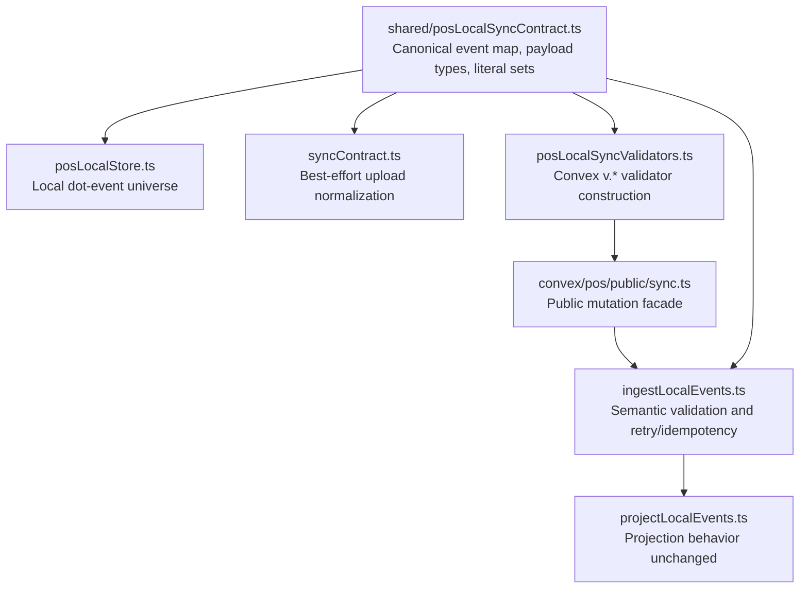

# refactor: Single-source POS local sync contract

## Summary

Make `shared/posLocalSyncContract.ts` the authoritative source for POS local-sync event identity, upload metadata, literal vocabulary, and payload types. Browser upload conversion and Convex ingestion should consume that same contract metadata while Convex-local helpers build real `v.*` validators, preserving current local-first sync semantics, server-authoritative rejection, and projection behavior.

---

## Problem Frame

The POS local sync contract is currently only partly shared. `shared/posLocalSyncContract.ts` defines TypeScript event and payload types, but browser upload conversion, Convex public validators, Convex parsed payload types, and server parser dispatch still repeat the same event list and payload vocabulary. That duplication lets local-first POS cash/inventory sync drift silently when a new event or payload field is added.

---

## Requirements

- R1. Browser upload and Convex ingestion validate against one canonical POS local-sync event contract.
- R2. Adding or changing POS sync event identity, upload metadata, or literal vocabulary must start from one contract-owned source, while per-event semantic parser/projector dispatch remains explicit and exhaustively checked.
- R3. Dot-event to underscore-event mapping must be centralized and explicitly cover core-upload, activity-only, and local-only events.
- R4. Convex public argument validators must be generated or composed from the contract-owned event definitions while remaining real Convex `v.*` validators.
- R5. Convex application parsed/input types should derive from the shared payload contract where possible instead of redeclaring payload shapes.
- R6. Existing sync semantics must remain stable: browser upload normalization stays best-effort, server ingestion remains the authority for business validation and per-event rejection, and projection behavior does not change.
- R7. Unknown event types must fail explicitly inside ingestion even when public Convex validation already rejects them.
- R8. POS and expense sync scope/cursor identity must remain distinct, including drawerless `expense_recorded` uploads.
- R9. `register_reopened` remains server/review-supported but is not selected for new browser uploads until a separate manager-review replay contract exists.
- R10. Register-session activity events such as `cash.movement_recorded` remain outside core POS local sync.
- R11. Existing local sync replay/projection tests continue to pass, with added characterization coverage for mapping parity, unknown event rejection, payload mismatch, scope identity, and retry/idempotency.
- R12. The delivery must refresh generated/Graphify artifacts when implementation changes require it, then run focused POS sync validation and the repo-level PR gate before merge.
- R13. Raw `staffProofToken` and terminal sync secrets remain transient public-boundary inputs only; raw values must never be persisted, returned in errors, embedded in conflicts/mappings, or logged.
- R14. The public sync facade must preserve existing authorization and terminal-secret gates before ingestion: authenticated Athena user, allowed organization role, active terminal/store match, and terminal sync secret verification.

---

## Scope Boundaries

- This plan does not change POS sync projection semantics, inventory authority rules, Cash Controls review behavior, or settlement states beyond the explicit unknown-event ingestion guard.
- This plan does not make browser-side payload validation strict enough to skip events that currently upload and become server-side `rejected` or `needs_review`.
- This plan does not enable browser upload for `register.reopened`.
- This plan does not fold register-session activity reporting into the core POS local sync contract.
- This plan does not redesign IndexedDB storage, local command gateway behavior, retry scheduling, or terminal recovery commands.
- This plan does not hand-edit generated Convex client files.
- This plan does not tighten stored `posLocalSyncEvent.payload` schema to match public upload payload shapes; stored historical row compatibility stays separate from public argument validation.

### Deferred to Follow-Up Work

- A dedicated manager-review replay contract for browser-originated `register.reopened` uploads.
- Any broader activity-reporting contract consolidation for register-session activity events.
- A new repo sensor only if implementation reveals validator parity is not enforceable with focused tests and existing validation-map coverage.

---

## Context & Research

### Relevant Code and Patterns

- `packages/athena-webapp/shared/posLocalSyncContract.ts` already owns upload event/status literals, TypeScript payload types, and the POS-vs-expense upload union.
- `packages/athena-webapp/src/lib/pos/infrastructure/local/posLocalStore.ts` owns the browser local event union and currently hard-codes `canUploadPosLocalEventType`.
- `packages/athena-webapp/src/lib/pos/infrastructure/local/syncContract.ts` converts local dot events into underscore upload events and repeats mapping, enum, sanitization, service-mode, pricing, and pending-checkout metadata vocabulary.
- `packages/athena-webapp/convex/pos/public/sync.ts` hand-writes the Convex public upload validator union for every POS sync event.
- `packages/athena-webapp/convex/schemas/pos/posLocalSyncEvent.ts` imports shared event/status arrays but still indexes them manually into Convex validator unions.
- `packages/athena-webapp/convex/pos/application/sync/types.ts` redeclares parsed payload types that mostly mirror the shared contract, with Convex-specific ids in some positions.
- `packages/athena-webapp/convex/pos/application/sync/ingestLocalEvents.ts` owns semantic validation, cursor identity, retry/idempotency, reference normalization, and parser dispatch. Those semantic checks should stay there.
- `packages/athena-webapp/convex/pos/application/sync/projectLocalEvents.ts` dispatches projection and permission roles by shared upload event type.
- `packages/athena-webapp/convex/pos/public/sync.test.ts` already uses `assertConformsToExportedReturns`, a useful pattern for executable Convex public contract proof.

### Institutional Learnings

- `docs/solutions/architecture/athena-pos-local-first-sync-2026-05-13.md`: POS local events are the first durable record; Convex projection is idempotent cloud settlement, not replayed online mutations.
- `docs/solutions/architecture/athena-pos-hub-owned-local-sync-drain-2026-05-18.md`: upload sequence and submission authority are terminal-local concepts; current cashier state must not decide whether historical events are uploadable.
- `docs/solutions/logic-errors/athena-pos-sync-settlement-contract-2026-06-27.md`: sync scope, cursor identity, durable upload sequence, and distinct `projected` / `conflicted` / `held` / `rejected` outcomes must stay explicit.
- `docs/solutions/architecture/athena-pos-sync-projection-policy-boundary-2026-07-06.md`: projection policy should remain in its own server-side boundary; V26-966 must not move inventory authority decisions into the contract refactor.
- `docs/solutions/harness/convex-return-validator-contract-proof-2026-06-18.md`: public Convex validator drift needs executable proof, not snapshots alone.
- `docs/solutions/architecture-patterns/athena-convex-facade-preserving-module-split-2026-07-06.md`: reduce hotspots by extracting helpers behind stable public Convex facades rather than moving registered exports.

### External References

- None. Existing Athena POS, Convex, and local-first sync contracts are the source of truth.

---

## Key Technical Decisions

- **Contract-owned event identity and metadata:** Add a contract-owned table or equivalent metadata in `shared/posLocalSyncContract.ts` that names each upload event, its local dot-event source when applicable, sync scope, browser upload eligibility, and intentional exceptions.
- **Convex validators remain Convex-local consumers:** The shared contract owns metadata and literal sets, but browser-safe shared code must not import Convex server modules. Convex-specific `v.*` construction should live in a Convex-side helper that consumes shared contract metadata.
- **Public validators and stored schemas are distinct:** Public upload validators stay strict per event payload. Stored event schema may share event/status literals but must not be collapsed into public payload shapes unless implementation proves stored row compatibility.
- **Browser conversion stays normalizing, not rejecting:** Keep `syncContract.ts` best-effort local payload normalization and redaction. Server ingestion remains responsible for business-invalid payload rejection so local settlement/retry behavior stays stable.
- **Semantic ingestion checks stay in ingestion:** Shared validators should cover public argument shape; `ingestLocalEvents.ts` keeps totals checks, non-empty identifier checks, local id uniqueness assumptions, reference normalization, mixed pending/provisional rules, cursor identity, and retry mismatch logic.
- **Add exhaustive internal event dispatch:** Even with public Convex validators, ingestion should reject unknown internal event types before parser dispatch and remove the current fallback-to-`register_reopened` shape in favor of exhaustive failure.
- **Preserve public auth and secret boundaries:** Validator refactors must not move ingestion ahead of authenticated Athena user lookup, organization role checks, active terminal/store match, or terminal sync secret verification. `staffProofToken` remains transient and is hashed before persistence.
- **Activity is adjacent, not merged:** The plan should document and test that register-session activity dot events are intentionally outside core upload mapping.
- **Production deploy is out of the current finish line:** The expected runtime impact is mixed browser plus Convex when shared/browser upload code and Convex ingestion both change, but the current user finish line stops at merged PR and local root alignment without production deploy.

---

## Open Questions

### Resolved During Planning

- **Should unknown events be guarded inside ingestion even though public validation catches them?** Yes. Public validators protect external calls, but ingestion/parser drift should fail closed for internal callers and tests.
- **Should malformed browser-local payloads be blocked before upload?** No. Preserve best-effort normalization and server-authoritative event rejection.
- **Should browser upload start selecting `register.reopened`?** No. That remains out of scope until a dedicated manager-review replay contract exists.
- **Should register-session activity events be folded into this contract?** No. They are sync-adjacent but have a distinct reporting and settlement contract.
- **Should `localEventId` uniqueness be assumed across POS and expense scopes for a terminal?** Yes. Ingestion retry lookup is keyed by store, terminal, and `localEventId` before cursor scope. The plan should add a regression/contract test and either preflight existing collision risk or document why generated local ids make legacy collisions impossible. If same-terminal POS/expense collisions are found, pause for data remediation rather than proceeding with the refactor.

### Deferred to Implementation

- Exact helper names and module placement for Convex validator construction should follow the smallest import-safe boundary discovered during implementation.
- Whether parsed Convex payload aliases can fully use shared payload types, or need narrow `Id<T> | string` wrappers for a few references, should be decided while changing `types.ts`.
- Whether generated Convex API files change depends on implementation details and should be handled only through the repo's generated-artifact workflow.

---

## High-Level Technical Design

> *This illustrates the intended approach and is directional guidance for review, not implementation specification. The implementing agent should treat it as context, not code to reproduce.*

Core event classification should be explicit:

| Classification | Examples | Contract expectation |
| --- | --- | --- |
| Core browser upload | `register.opened`, `transaction.completed`, `cart.cleared`, `register.closeout_started`, `pending_checkout_item.defined`, `expense.completed` | Maps to a shared underscore upload event and Convex validator case |
| Server/review supported only | `register_reopened` | Valid shared server event but not selected from browser local `register.reopened` |
| Register-session activity | `cash.movement_recorded`, activity/reporting-only events | Excluded from core upload mapping |
| Local-only state | `session.started`, cart draft edits, expense draft edits | Excluded from core upload mapping |

Public and stored validation should share event/status literals, not necessarily full object shapes:

| Validator boundary | Shape owner | Constraint |
| --- | --- | --- |
| Public upload arguments | Convex-side validator helper keyed by shared metadata | Strict per-event payload validators, including enum and required-field negative coverage |
| Stored `posLocalSyncEvent` rows | Existing schema plus shared event/status literal helpers | Preserve stored row shape, including broad stored `payload` compatibility |
| Ingestion parser | `ingestLocalEvents.ts` semantic checks plus shared event identity | Exhaustive dispatch, no unknown-event fallback |

---

## Implementation Units

- U1. **Characterize Contract Parity and Failure Boundaries**

**Goal:** Add focused characterization coverage that proves the current intended contract boundaries before refactoring shared definitions.

**Requirements:** R1, R2, R3, R6, R7, R8, R9, R10, R11, R13, R14

**Dependencies:** None

**Files:**
- Modify: `packages/athena-webapp/src/lib/pos/infrastructure/local/syncContract.test.ts`
- Modify: `packages/athena-webapp/src/lib/pos/infrastructure/local/posLocalStore.test.ts`
- Modify: `packages/athena-webapp/convex/pos/public/sync.test.ts`
- Modify: `packages/athena-webapp/convex/pos/application/sync/ingestLocalEvents.test.ts`

**Approach:**
- Add a mapping fixture or table-driven test that exhaustively classifies every `PosLocalEventType` as core-upload, activity-only, local-only, or server/review-only.
- Prove each core-upload dot event maps to one shared underscore event and that intentional exceptions are explicit.
- Add ingestion-level coverage for an impossible runtime event type returning validation failure instead of falling through to `register_reopened`.
- Keep public Convex validator tests separate from ingestion user-error tests because those paths have different retry semantics.
- Preserve authorization and secret tests proving unauthorized, bad-role, inactive-terminal, wrong-store, and bad-secret calls do not reach ingestion.

**Execution note:** Characterization-first. These tests should lock current desired behavior and expose the current unknown-event parser gap before implementation.

**Patterns to follow:**
- Existing table-style event mapping tests in `packages/athena-webapp/src/lib/pos/infrastructure/local/syncContract.test.ts`.
- Public contract proof style in `packages/athena-webapp/convex/pos/public/sync.test.ts`.

**Test scenarios:**
- Happy path: every core browser-upload local event maps to the expected underscore event type and remains uploadable.
- Edge case: `register.reopened` is not selected for browser upload even though `register_reopened` is a server-supported event type.
- Edge case: `expense.completed` maps to `expense_recorded` with `syncScope: "expense"` and `localExpenseSessionId`.
- Edge case: activity-only and local-only dot events are not selected for core upload.
- Error path: unknown internal event type is rejected by ingestion before parser dispatch.
- Error path: unsupported public underscore event shape cannot pass the public Convex validator.
- Error path: unauthorized or bad terminal-secret public sync calls do not reach ingestion.
- Error path: raw `staffProofToken` and terminal sync secret values are not returned in validation errors, conflicts, mappings, or local sync results, and new/refactored logging on these paths does not include raw values.
- Integration: POS and expense local event ids are treated as terminal-scoped unique retry identities.
- Integration: implementation checks or documents whether same-terminal POS/expense `localEventId` collisions can exist in current data; if collisions exist, execution stops for remediation instead of continuing the refactor.

**Verification:**
- Focused tests fail for the unknown-event parser gap and pass for documented existing mapping boundaries after characterization is complete.

---

- U2. **Promote Shared Contract Metadata and Browser Consumers**

**Goal:** Make the shared contract own event metadata, upload eligibility, dot-to-underscore mapping, literal sets, and payload vocabulary used by browser upload conversion.

**Requirements:** R1, R2, R3, R6, R8, R9, R10, R11, R13

**Dependencies:** U1

**Files:**
- Modify: `packages/athena-webapp/shared/posLocalSyncContract.ts`
- Modify: `packages/athena-webapp/src/lib/pos/infrastructure/local/posLocalStore.ts`
- Modify: `packages/athena-webapp/src/lib/pos/infrastructure/local/syncContract.ts`
- Modify: `packages/athena-webapp/src/lib/pos/infrastructure/local/syncScheduler.test.ts`
- Modify: `packages/athena-webapp/src/lib/pos/infrastructure/local/syncContract.test.ts`
- Modify: `packages/athena-webapp/src/lib/pos/infrastructure/local/posLocalStore.test.ts`

**Approach:**
- Add a browser-safe contract map that captures upload event type, local dot-event source, scope, and browser upload eligibility.
- Replace hard-coded browser uploadability and mapping branches with shared contract helpers while keeping payload normalization local to `syncContract.ts`.
- Export literal sets for pending-checkout metadata, sale item alias state, service mode, and pricing model when those values are currently repeated by consumers.
- Keep local-only POS event types in `posLocalStore.ts`; the shared contract should classify upload eligibility, not own the entire IndexedDB event universe.
- Keep `staffProofToken` as a transient upload-envelope value and out of normalized payload objects.

**Execution note:** Preserve behavior after the mapping fixture is in place; do not make browser payload validation stricter.

**Patterns to follow:**
- `packages/athena-webapp/shared/posRegisterSessionActivityContract.ts` for browser-safe event classification helpers.
- Existing redaction/normalization behavior in `packages/athena-webapp/src/lib/pos/infrastructure/local/syncContract.ts`.

**Test scenarios:**
- Happy path: uploadable local events still produce byte-for-byte equivalent upload payloads for representative register, sale, pending-checkout, sale-clear, closeout, and expense events.
- Edge case: malformed optional browser payload fields are normalized/redacted as before, not locally rejected; Linear's browser-side payload mismatch coverage means the adapter emits contract-shaped upload envelopes, not that it changes local events to hard failures.
- Edge case: normalized upload payloads and serialized local upload events do not include unrelated raw proof, payment token, or customer-sensitive metadata.
- Edge case: local-only and activity-only events remain excluded from upload.
- Edge case: expense events remain drawerless and do not require `localRegisterSessionId`.
- Integration: scheduler selection and upload conversion read from the same shared eligibility set.

**Verification:**
- Browser local sync tests prove the shared contract did not change upload selection, ordering, redaction, or local settlement semantics.

---

- U3. **Replace Convex Public Validators With Contract-Derived Validators**

**Goal:** Move Convex public upload validator construction behind a contract-derived Convex helper so public mutation validation and shared event metadata cannot drift independently.

**Requirements:** R1, R2, R4, R7, R8, R9, R11, R13, R14

**Dependencies:** U1, U2

**Files:**
- Create: `packages/athena-webapp/convex/pos/application/sync/posLocalSyncValidators.ts`
- Create: `packages/athena-webapp/convex/pos/application/sync/posLocalSyncValidators.test.ts`
- Modify: `packages/athena-webapp/convex/pos/public/sync.ts`
- Modify: `packages/athena-webapp/convex/schemas/pos/posLocalSyncEvent.ts`
- Modify: `packages/athena-webapp/convex/pos/public/sync.test.ts`

**Approach:**
- Build Convex `v.*` validators from contract-owned event metadata and literal sets while keeping Convex imports out of `shared/`.
- Share event/status literal helpers across public upload validators and table validators where practical, but do not reuse full public object validators for stored rows unless tests prove the stored row shape remains unchanged.
- Preserve public return validators and existing closeout variance alert behavior.
- Add executable validator parity tests that fail if a shared upload event lacks a Convex validator case or if a Convex validator case is not in the shared contract.
- Add shape-level public argument proof so generated/composed validators cannot silently widen event payloads to generic records.
- Preserve the public sync auth/authorization/terminal-secret sequence before ingestion.

**Execution note:** Test-first for the validator parity proof, then refactor public validators.

**Patterns to follow:**
- Existing schema validator composition in `packages/athena-webapp/convex/schemas/pos/posLocalSyncEvent.ts`.
- Existing public return validator proof in `packages/athena-webapp/convex/pos/public/sync.test.ts`.

**Test scenarios:**
- Happy path: each shared upload event type has exactly one Convex public validator case.
- Happy path: valid POS and expense batch shapes still reach `ingestLocalEventsWithCtx`.
- Happy path: authenticated, authorized, active-terminal calls with valid sync secret still reach ingestion.
- Edge case: `expense_recorded` requires `syncScope: "expense"` and `localExpenseSessionId` without requiring `localRegisterSessionId`.
- Edge case: `register_reopened` remains validator-supported for stored/review paths but not browser-selected.
- Edge case: stored event schema keeps broad payload compatibility while sharing event/status literals.
- Error path: unsupported event type and malformed public argument shape fail before ingestion.
- Error path: representative negative payload cases fail for every event family, including service mode, pricing model, pending-checkout metadata enums, required totals/items/payments, and expense-only envelope fields.
- Error path: public validator parity cannot pass by widening payload validators to a generic record or `any` shape.
- Error path: unauthenticated, unauthorized, inactive-terminal, wrong-store, and bad-secret calls do not reach ingestion.
- Error path: public validation and auth failures do not return raw `staffProofToken` or terminal sync secret data in error metadata.
- Integration: public mutation return validator tests still conform to exported returns.

**Verification:**
- Convex validator tests prove shared metadata and public validators are mechanically aligned without importing Convex code into browser-safe shared modules.

---

- U4. **Derive Ingestion Types and Add Explicit Parser Guard**

**Goal:** Reduce Convex application payload type duplication while preserving ingestion's semantic validation and adding a fail-closed unknown-event guard.

**Requirements:** R1, R2, R5, R6, R7, R8, R11, R13, R14

**Dependencies:** U2, U3

**Files:**
- Modify: `packages/athena-webapp/convex/pos/application/sync/types.ts`
- Modify: `packages/athena-webapp/convex/pos/application/sync/ingestLocalEvents.ts`
- Modify: `packages/athena-webapp/convex/pos/application/sync/ingestLocalEvents.test.ts`
- Modify: `packages/athena-webapp/convex/pos/application/sync/projectLocalEvents.ts` only if type aliases require dispatch cleanup
- Modify: `packages/athena-webapp/convex/pos/application/sync/projectLocalEvents.test.ts`

**Approach:**
- Alias parsed payload types to shared contract payload types where they are identical.
- Use narrow Convex-side wrappers only where ids or repository-normalized references require a different type surface.
- Replace parser fallthrough with exhaustive known-event dispatch before payload parsing; unsupported runtime values should fail closed rather than reach a default branch.
- Keep validation functions for totals, non-empty strings, id normalization, mixed pending/provisional input, cursor identity, and retry mismatch in ingestion.
- Keep raw `staffProofToken` out of stored payloads; persistence continues to store only the hashed staff proof token field.
- Keep projection dispatch behavior unchanged.

**Execution note:** Behavior-preserving except the explicit unknown-event rejection required by R7.

**Patterns to follow:**
- Existing `parseStoredLocalSyncEvent` and `parseLocalSyncEvent` boundaries in `packages/athena-webapp/convex/pos/application/sync/ingestLocalEvents.ts`.
- Shared payload definitions in `packages/athena-webapp/shared/posLocalSyncContract.ts`.

**Test scenarios:**
- Happy path: valid register, sale, pending-checkout, sale-clear, closeout, and expense events parse to the same payloads as before.
- Edge case: POS and expense cursor identity remains unchanged.
- Edge case: rejected, conflicted, projected, and held retries keep existing idempotent outcomes.
- Error path: unknown event type returns a validation failure and does not become `register_reopened`.
- Error path: business-invalid payloads still become event-level server rejection rather than public-validator crashes when their public shape is valid.
- Error path: stored event records, conflicts, mappings, returned validation failures, and new/refactored logs contain no raw staff proof token or terminal sync secret.
- Integration: projection tests still pass without semantic changes.

**Verification:**
- Ingestion tests prove semantic behavior is preserved and the parser guard closes the drift gap.

---

- U5. **Document, Validate, and Prepare Delivery Handoff**

**Goal:** Update durable repo knowledge and validation surfaces so the single-sourced contract stays enforceable during execution, review, and future event additions.

**Requirements:** R11, R12

**Dependencies:** U1, U2, U3, U4

**Files:**
- Modify: `docs/solutions/architecture/athena-pos-local-first-sync-2026-05-13.md`
- Modify or create: `docs/solutions/architecture/athena-pos-local-sync-contract-2026-07-09.md`
- Modify: `packages/athena-webapp/docs/agent/testing.md` only if implementation adds or renames validation targets
- Modify generated artifacts under `packages/athena-webapp/convex/_generated/` only through the repo's generated-artifact workflow if needed
- Modify Graphify artifacts under `graphify-out/` through `bun run graphify:rebuild` after code edits

**Approach:**
- Add or refresh a solution note that future agents should add POS sync events through the shared contract map, not by editing browser and Convex literals independently.
- Record intentional exclusions: browser `register.reopened` upload, register-session activity events, and server-authoritative payload rejection.
- Refresh generated artifacts only through the repo-supported commands if implementation changes Convex exports or generated API surfaces.
- Include focused tests, architecture check, Graphify rebuild, generated-artifact refresh, full PR gate, reviewer loop, and the explicit no-production-deploy finish line in the execution handoff.

**Execution note:** Sensor-only for docs/generated artifacts, after behavior-bearing units pass focused tests.

**Patterns to follow:**
- `docs/solutions/architecture/athena-pos-sync-projection-policy-boundary-2026-07-06.md`
- `docs/solutions/harness/compound-solution-gate-2026-05-05.md`

**Test scenarios:**
- Test expectation: none for solution docs themselves because they document the behavior proven by U1-U4.
- Integration: repo validation should include focused POS local sync tests, changed Convex lint/audit, typecheck/build, architecture check, Graphify rebuild, and the full Athena PR gate.

**Verification:**
- Documentation and generated artifacts match the final code diff, and the final validation ladder is green before PR review.

---

## System-Wide Impact

- **Interaction graph:** Browser local IndexedDB events flow through shared upload mapping, public Convex validators, ingestion semantic validation, and projection. The plan deliberately leaves projection policy and Cash Controls behavior unchanged.
- **Error propagation:** Public Convex argument validation failures remain transport/public-shape failures; semantic event failures remain ingestion `rejected` outcomes or user errors. The plan adds an internal unknown-event rejection guard to prevent parser drift.
- **State lifecycle risks:** Changing browser validation too aggressively could strand local events in retry/backoff instead of server-visible review. The plan avoids that by preserving browser best-effort normalization.
- **API surface parity:** Shared upload event metadata must match browser mapping, public Convex validator cases, stored event/status validators, and Convex application parsed types. Public payload validators and stored payload schema remain intentionally different.
- **Integration coverage:** Tests must cover valid POS and expense uploads, unknown event rejection, payload mismatch, retry/idempotency, scope/cursor identity, and intentional mapping exclusions.
- **Security boundaries:** Public sync auth, organization role, active terminal/store, terminal sync secret, and staff proof hashing boundaries must survive the validator refactor unchanged.
- **Unchanged invariants:** Local event logs remain the first durable POS record; local ids remain distinct from Convex ids until mapping; upload sequence remains terminal-local; projection remains idempotent; register-session activity is not core local sync.

---

## Risks & Dependencies

| Risk | Mitigation |
| --- | --- |
| Convex validators cannot be generated from TypeScript types alone | Build Convex-local validator helpers from shared literal metadata and keep real `v.*` validators |
| Shared module accidentally imports Convex server code and breaks browser bundle | Keep Convex imports in `convex/pos/application/sync/posLocalSyncValidators.ts`, not in `shared/` |
| Public validators get widened while parity tests still pass | Require shape-level positive and negative validator tests for every event family |
| Public and stored validator shapes are conflated | Share only event/status literals unless tests prove stored row compatibility |
| Browser strict validation changes local retry/review semantics | Preserve best-effort normalization and server-authoritative semantic rejection |
| Unknown internal event currently falls through to `register_reopened` | Add explicit known-event guard and focused ingestion regression test |
| Raw proof or secret values leak through refactor | Keep raw values transient, persist only hashes, and test returned errors/conflicts/mappings/logging omit raw values |
| Public auth/terminal-secret checks are bypassed | Preserve existing public sync gate order and regression-test no ingestion call on auth or secret failure |
| Activity events get swept into core sync | Keep a mapping fixture that classifies activity-only events as out of scope |
| Same-terminal POS/expense local id collision is already present | Add an implementation preflight or document why generated local ids make legacy collision impossible; stop for remediation if collisions exist |
| Generated artifacts drift after Convex changes | Run the repo generated-artifact workflow and inspect generated diff before commit |
| Runtime surfaces are changed but not deployed | Current finish line intentionally stops at merged PR and local root alignment; report that production deploy was skipped by user instruction |

---

## Documentation / Operational Notes

- The execution path after plan approval should use repo-local `track` to keep Linear aligned, then repo-local `execute` to implement from the approved plan.
- Linear issue: `V26-966`.
- Current finish line: merged PR and local root alignment only. Production deploy is intentionally skipped unless the user restores it in a later instruction.
- Compounding is expected because this changes how future agents add POS local sync event contracts.

---

## Sources & References

- Linear: [V26-966](https://linear.app/v26-labs/issue/V26-966/audit-make-pos-local-sync-contract-single-sourced)
- Related plan: `docs/plans/2026-07-06-001-refactor-pos-sync-projection-policies-plan.md`
- Related solution: `docs/solutions/architecture/athena-pos-local-first-sync-2026-05-13.md`
- Related solution: `docs/solutions/logic-errors/athena-pos-sync-settlement-contract-2026-06-27.md`
- Related solution: `docs/solutions/architecture/athena-pos-sync-projection-policy-boundary-2026-07-06.md`
- Related contract: `packages/athena-webapp/shared/posLocalSyncContract.ts`
- Browser consumer: `packages/athena-webapp/src/lib/pos/infrastructure/local/syncContract.ts`
- Convex public consumer: `packages/athena-webapp/convex/pos/public/sync.ts`
- Convex ingestion consumer: `packages/athena-webapp/convex/pos/application/sync/ingestLocalEvents.ts`
