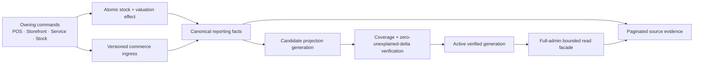
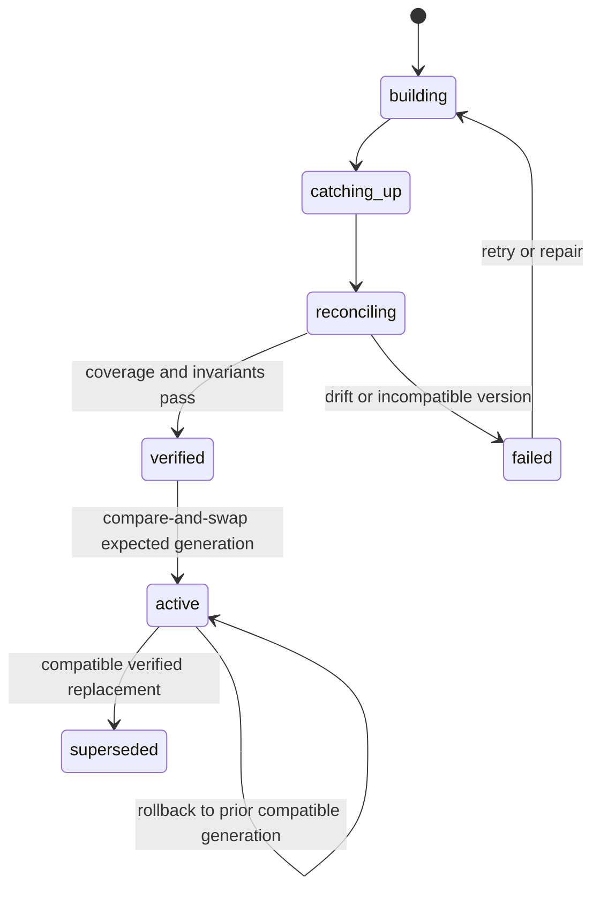
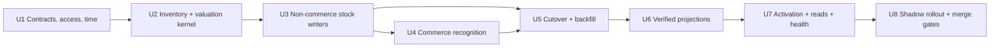

# feat: Build the Reports foundation

## Summary

Build a dedicated `convex/reporting/` domain that captures versioned commerce facts, makes inventory and valuation effects atomic with their owning commands, and derives bounded store-day and SKU projections through a verified activation lifecycle. Deliver the foundation through widen-migrate-shadow-activate stages so checkout, storefront, service, receiving, and Daily Close behavior remain operationally unchanged while Reports gains a trustworthy read contract.

---

## Problem Frame

Athena currently has useful operational records and read models, but no shared recognition, valuation, completeness, or projection contract capable of supporting the approved Reports workspace. Existing queries recompute different meanings, historical cost can become false precision, stock changes do not all share one evidence boundary, and closed-day truth can diverge from live state without explicit reconciliation.

The aligned foundation requirements define the necessary trust contract in `docs/brainstorms/2026-07-09-reports-foundation-requirements.md`. This plan defines how to introduce it without making reporting success part of an operational command's success boundary.

---

## Requirements Trace

All origin requirements `F-R1` through `F-R88` remain binding. The implementation units group them into these delivery contracts:

- **P-R1 — Access and minimization:** Enforce backend full-admin/store isolation, normalized identity lookup, safe source hydration, and minimized diagnostic data (`F-R1`-`F-R5`, `F-R81`-`F-R82`).
- **P-R2 — Canonical commerce:** Preserve unique business identity, revenue/settlement separation, typed recognition, immutable lines, corrections, currency, and occurrence time (`F-R6`-`F-R20`).
- **P-R3 — Authoritative inventory:** Make physical, availability, movement, canonical SKU, and balance effects atomic and reconcilable (`F-R21`-`F-R29`).
- **P-R4 — Moving-average valuation:** Preserve costed, uncosted, deficit, pool, outbound basis, return, and correction behavior without blocking trade (`F-R30`-`F-R42`).
- **P-R5 — Operating periods and close lineage:** Resolve periods from Store Schedule and preserve immutable close evidence with post-close deltas (`F-R43`-`F-R51`).
- **P-R6 — Versioned bounded projections:** Version metric contracts, derive reusable projections, paginate evidence, and prove rebuild parity (`F-R52`-`F-R63`).
- **P-R7 — Completeness and health:** Expose per-metric/source coverage, failure states, five-minute cloud freshness, and owned health signals (`F-R64`-`F-R70`).
- **P-R8 — Cutover and rollout:** Preview and accept baselines, backfill without invention, shadow and reconcile, then activate or roll back per store (`F-R71`-`F-R80`).
- **P-R9 — Merge-grade proof:** Cover contracts, auth, replay, valuation, scale, deployment, and recovery in Athena's validation harness (`F-R81`-`F-R88`).

**Origin acceptance examples:** `F-AE1`-`F-AE12` from the foundation requirements and `AE1`-`AE10` from the parent Reports workspace requirements.

---

## Scope Boundaries

- This plan builds the reporting foundation and public read contracts. It does not implement the Reports workspace UI.
- It fixes server-side authorization for the existing storefront Analytics summary because that disclosure gap crosses the new Reports access boundary.
- It does not add service labor or overhead cost, organization rollups, cross-store comparison, FIFO/LIFO, true stock age, landed cost, or general accounting.
- It does not turn workflow traces, Analytics events, Store Pulse, or Daily Operations into the financial source of truth.
- It does not make projection freshness part of checkout, online order, service, receiving, or Daily Close success.
- It does not estimate historical cost, currency, SKU attribution, or movement evidence to increase apparent coverage.
- It does not perform unrelated cleanup in source modules beyond the changes needed to route authoritative effects and preserve behavior.

### Deferred to Follow-Up Work

- Reports workspace navigation, overview, SKU tables, signal presentation, and storefront engagement placement: a follow-up feature plan against the verified public reporting contract.
- Service labor and delivery-cost valuation: a later cost-kind extension after Athena records trustworthy service-delivery cost.
- Organization-wide reporting: a later projection/authorization layer after store-scoped facts reconcile in production.
- Full-admin recovery UI: detailed maintenance remains deployment/support owned initially; Reports exposes concise health and evidence status only.

---

## Context & Research

### Relevant Code and Patterns

- `packages/athena-webapp/convex/schema.ts` is the schema and index authority; reporting tables must use exact compound indexes and separate unbounded child rows.
- `packages/athena-webapp/convex/operations/inventoryMovements.ts` and `packages/athena-webapp/convex/operations/skuActivity.ts` provide movement and source-evidence precedents but currently do not own atomic balance/valuation changes.
- `packages/athena-webapp/convex/pos/application/sync/projectLocalEvents.ts` preserves local occurrence and source identity; accepted projection is the correct offline reporting boundary.
- `packages/athena-webapp/convex/schemas/operations/dailyClose.ts` preserves immutable close snapshots and source completeness.
- `packages/athena-webapp/convex/lib/storeScheduleTime.ts` is the sole period authority for IANA timezone, effective schedule, DST, exceptions, and cross-midnight windows.
- `packages/athena-webapp/convex/contextTracking/contextEvents.ts` demonstrates versioned, idempotent, source-linked append with conflict detection; reporting must reuse the pattern, not the open-ended payload.
- `packages/athena-webapp/convex/migrations/backfillStoreSchedules.ts` demonstrates cursor-bounded dry-run/apply migration behavior.
- `packages/athena-webapp/convex/automation/runLedger.ts` provides auditable run identity, source subjects, counts, outcome, and error evidence.
- `packages/athena-webapp/convex/inventory/catalogSummary.ts` demonstrates projection repair and dirty-state behavior; Reports needs stronger generation, reconciliation, and activation state.
- `packages/athena-webapp/convex/stockOps/access.ts` provides a full-admin precedent, while `packages/athena-webapp/convex/lib/athenaUserAuth.ts` needs indexed normalized identity lookup.

### Institutional Learnings

- Preserve accepted POS events and project idempotently; never build a second Reports-specific POS replay path (`docs/solutions/architecture/athena-pos-local-first-sync-2026-05-13.md`).
- Keep event identity and contract ownership centralized and fail closed on unknown versions (`docs/solutions/architecture/athena-pos-local-sync-contract-2026-07-09.md`).
- Preserve original sales and model corrections, voids, refunds, and reversals as linked effects (`docs/solutions/logic-errors/athena-pos-ledger-safe-corrections-2026-04-30.md`).
- Inventory authority belongs inside the owning mutation with source-aware evidence (`docs/solutions/logic-errors/athena-sku-activity-traceability-2026-05-13.md`).
- Workflow traces are best-effort investigation evidence and cannot replace transactional business facts (`docs/solutions/architecture/athena-workflow-investigation-evidence-2026-06-21.md`).
- Daily Close history is immutable and superseded through lineage, not recomputation (`docs/solutions/logic-errors/athena-daily-close-history-snapshots-2026-05-09.md`).
- Materialized projections must ship with freshness, repair, and drift diagnostics (`docs/solutions/logic-errors/athena-foundation-sku-search-catalog-summary-2026-06-25.md`).
- Overview posture and detail hydration must remain separate and bounded (`docs/solutions/performance/athena-convex-read-amplification-2026-06-29.md`).
- Public Convex facades should remain narrow while domain logic lives in directly tested sibling modules (`docs/solutions/architecture-patterns/athena-convex-facade-preserving-module-split-2026-07-06.md`).

### Official Convex Constraints

- Mutations are atomic, serializable, and automatically retried after optimistic-concurrency conflicts; canonical facts and authoritative inventory effects belong in mutations, not actions. [OCC and Atomicity](https://docs.convex.dev/database/advanced/occ)
- Scheduling from a mutation is transactional, but scheduled authentication is not propagated and system schedule history is not a durable control plane. [Scheduled Functions](https://docs.convex.dev/scheduling/scheduled-functions)
- Large writes require bounded batches; migrations should widen, migrate, and narrow. [Writing Data](https://docs.convex.dev/database/writing-data), [Production Deployment](https://docs.convex.dev/production/overview)
- Evidence reads must use exact indexed pagination and transaction resource limits should be treated as deploy-time constraints. [Pagination](https://docs.convex.dev/database/pagination), [Limits](https://docs.convex.dev/production/state/limits)

### Production Cardinality Snapshot

Read-only production counts captured on 2026-07-09 establish the minimum scale fixtures required by `F-R86`. No sampled table reached the bounded 10,000-row measurement cap.

| Domain table | Observed rows | Minimum 10x fixture |
| --- | ---: | ---: |
| `productSku` | 1,788 | 17,880 |
| `posTransaction` | 654 | 6,540 |
| `posTransactionItem` | 1,618 | 16,180 |
| `onlineOrder` | 51 | 1,000 floor |
| `onlineOrderItem` | 99 | 1,000 floor |
| `serviceCase` | 0 | 1,000 floor |
| `inventoryMovement` | 983 | 9,830 |
| `paymentAllocation` | 664 | 6,640 |
| `skuActivityEvent` | 1,121 | 11,210 |

The observed history spans storefront orders from March 2025 and operational POS/movement history from May 2026 through July 2026. Re-measure before activation if production grows beyond these baselines.

---

## Key Technical Decisions

- **Dedicated reporting domain:** Create `convex/reporting/` rather than expanding Store Pulse, Daily Operations, or storefront Analytics. Those remain consumers or adjacent surfaces, not metric owners.
- **Two coupled consistency boundaries:** The source transition, typed reporting ingress, and any inline inventory/valuation effect commit atomically inside the owning mutation; canonical commerce facts and expensive projections derive asynchronously from durable ingress and may lag without changing operational success.
- **Commerce ingress, inventory inline effects:** Commerce commands append small idempotent ingress/evidence rows and schedule bounded canonicalization. Physical inventory and valuation effects happen inline because reconstructing them later would violate balance authority.
- **Explicit signed book position:** Reconciliation uses `on-hand quantity - unresolved deficit quantity`; oversells remain full physical deltas without creating a negative known cost pool.
- **Source-command adapters:** Emit facts from typed business transitions, not later table-state scans. Mutable status rows cannot reconstruct distinct same-value events or original occurrence order reliably.
- **Application-owned projections:** Use versioned store-day, SKU-day, current-valuation, and range generations because metric coverage, cost status, close lineage, and evidence are richer than a simple sum/count component.
- **Frozen-watermark activation:** A candidate generation captures a cutoff, rebuilds through it, consumes the tail, reconciles at a stable watermark, then atomically replaces the active pointer only if its expected contract/version still matches.
- **Widen-migrate-shadow-activate:** Add optional contracts and dual writes first, preview/backfill and shadow projections next, reconcile, then activate store reads. Tightening/removing legacy shapes is follow-up work after production proof.
- **Deployment-owned recovery:** Initial backfill, activation, quarantine recovery, and rollback are internal operations with durable actor/run evidence. Public Reports endpoints expose health but not repair mutations.
- **Versioned deterministic attention rules:** Initial thresholds and precedence live in a metric-versioned registry. They are reviewable inputs to projections, not UI heuristics, and later changes require candidate-version comparison.
- **Test posture:** Novel recognition, period, and valuation math is test-first. Existing source commands receive characterization coverage before their write boundary changes.

---

## Open Questions

### Resolved During Planning

- **Should reporting facts be reconstructed from existing tables?** No. They are emitted at source command boundaries because mutable records cannot preserve occurrence order, immutable cost, or distinct same-value events.
- **Should inventory effects be asynchronous?** No. Balance, movement, availability, and valuation must commit atomically in the owning mutation.
- **Should report aggregates update synchronously in checkout?** No. Checkout appends durable ingress/effects and schedules bounded continuation; projection freshness remains observable and repairable.
- **How should custom ranges avoid raw scans?** Build a versioned, resumable range generation from daily/SKU facts and return pending/stale state until verified.
- **Who activates and repairs projections initially?** Deployment/support automation through internal functions with durable run evidence; no first-release maintenance UI.
- **What scale must tests cover?** At least the 10x production snapshot above, with a 1,000-row floor for empty or small domains.

### Deferred to Implementation

- **Exact batch sizes and transaction headroom:** Start with conservative explicit caps, persist per-run row/read/write counters, and tune from Convex function metrics, logs, and the production cardinality snapshot while keeping every processor bounded.
- **Exact retention for superseded generations and sanitized conflicts:** Choose after measuring storage growth; facts and accepted close evidence remain retained, while disposable projection generations may use a documented cleanup policy.
- **Exact alert delivery channel:** Reuse Athena's operational alerting path selected during implementation; threshold state and ownership must exist before activation regardless of delivery channel.
- **Final names of narrow helper functions:** Follow surrounding domain conventions without changing the boundaries in this plan.

---

## Output Structure

The structure is directional and may be refined during implementation while preserving the listed ownership boundaries.

```text
packages/athena-webapp/
├── shared/
│   └── reportingContract.ts
├── convex/
│   ├── schemas/reporting/
│   │   ├── facts.ts
│   │   ├── inventoryValuation.ts
│   │   ├── projections.ts
│   │   ├── maintenance.ts
│   │   └── index.ts
│   └── reporting/
│       ├── access.ts
│       ├── metricContracts.ts
│       ├── operatingPeriods.ts
│       ├── ingress.ts
│       ├── facts.ts
│       ├── integrity.ts
│       ├── inventory/
│       │   ├── effects.ts
│       │   └── valuation.ts
│       ├── sourceAdapters/
│       ├── projections/
│       ├── maintenance/
│       ├── evidence.ts
│       ├── health.ts
│       └── public.ts
```

---

## High-Level Technical Design

> This illustrates the intended approach and is directional guidance for review, not implementation specification. The implementing agent should treat it as context, not code to reproduce.





### Dependency Graph



---

## Implementation Units

### Phase 1 — Contracts and Atomic Truth

- U1. **Establish reporting contracts, authorization, time, and durable state**

**Goal:** Create the versioned reporting domain, exact indexes, full-admin/store access boundary, normalized identity lookup, safe source references, period resolver, and lifecycle records that every later unit depends on.

**Requirements:** P-R1, P-R2, P-R5, P-R6, P-R7; `F-R1`-`F-R8`, `F-R19`-`F-R20`, `F-R43`-`F-R54`, `F-R64`-`F-R70`, `F-R80`-`F-R82`.

**Dependencies:** None.

**Files:**
- Create: `packages/athena-webapp/shared/reportingContract.ts`
- Create: `packages/athena-webapp/convex/schemas/reporting/facts.ts`
- Create: `packages/athena-webapp/convex/schemas/reporting/inventoryValuation.ts`
- Create: `packages/athena-webapp/convex/schemas/reporting/projections.ts`
- Create: `packages/athena-webapp/convex/schemas/reporting/maintenance.ts`
- Create: `packages/athena-webapp/convex/schemas/reporting/index.ts`
- Create: `packages/athena-webapp/convex/reporting/access.ts`
- Create: `packages/athena-webapp/convex/reporting/metricContracts.ts`
- Create: `packages/athena-webapp/convex/reporting/operatingPeriods.ts`
- Create: `packages/athena-webapp/convex/reporting/ingress.ts`
- Create: `packages/athena-webapp/convex/reporting/integrity.ts`
- Create: `packages/athena-webapp/convex/migrations/backfillAthenaUserNormalizedEmail.ts`
- Modify: `packages/athena-webapp/convex/schema.ts`
- Modify: `packages/athena-webapp/convex/schemas/inventory/athenaUser.ts`
- Modify: `packages/athena-webapp/convex/lib/athenaUserAuth.ts`
- Modify: `packages/athena-webapp/convex/storeFront/analytics.ts`
- Test: `packages/athena-webapp/convex/reporting/access.test.ts`
- Test: `packages/athena-webapp/convex/reporting/metricContracts.test.ts`
- Test: `packages/athena-webapp/convex/reporting/operatingPeriods.test.ts`
- Test: `packages/athena-webapp/convex/reporting/schemaIndexes.test.ts`
- Test: `packages/athena-webapp/convex/lib/athenaUserAuth.test.ts`
- Test: `packages/athena-webapp/convex/migrations/backfillAthenaUserNormalizedEmail.test.ts`
- Test: `packages/athena-webapp/convex/storeFront/analytics.test.ts`

**Approach:**
- Define narrow discriminated contracts for fact type, metric version, currency, source identity, recognition time, operating date, status, completeness, and safe source references; avoid open-ended financial payload records.
- Establish the generic idempotent ingress append and transactional scheduling boundary here so procurement and commerce adapters share one source-event contract.
- Use child rows for unbounded source references, conflicts, attempts, and run events.
- Add normalized-email maintenance to every Athena-user writer, preview/apply existing identities in cursor-bounded batches, quarantine duplicates, and retain compatibility lookup until indexed coverage is complete. Convex indexes are not uniqueness constraints, so indexed lookup must still fail closed on duplicates.
- Resolve reporting periods only through Store Schedule and retain the effective schedule version and resolved timestamps.
- Model fact processing, projection generations, cutover runs, health, quarantine, activation, and supersession explicitly from the first schema widening.
- Protect the existing Analytics summary with the same backend authorizer; do not move engagement events into financial contracts.

**Execution note:** Implement metric/version validation, period assignment, authorization, and identity lookup test-first. Keep all new fields/tables additive and optional where existing data must remain valid.

**Patterns to follow:**
- `packages/athena-webapp/convex/contextTracking/contextEvents.ts`
- `packages/athena-webapp/convex/lib/storeScheduleTime.ts`
- `packages/athena-webapp/convex/stockOps/access.ts`
- `packages/athena-webapp/convex/schemas/operations/dailyClose.ts`

**Test scenarios:**
- Happy path: a current full admin requests a store-scoped report contract and receives only that store's safe metadata.
- Covers `F-AE12`. Error path: a foreign-organization full admin supplies a direct Store B source ID and receives no value or existence disclosure.
- Error path: unauthenticated, `pos_only`, and manager-elevated callers are denied on summary, evidence, export-shaped, and maintenance-shaped boundaries.
- Edge case: case variants of the same email resolve through one normalized indexed identity; duplicates fail closed.
- Migration: pre-backfill users continue through compatibility lookup; partial migration remains usable; duplicate normalized identities block Reports activation; completed coverage enables indexed lookup and rollback preserves access.
- Happy path: a DST transition, cross-midnight window, exception day, and historical schedule version resolve stable operating dates.
- Error path: unknown fact or metric version is rejected and produces sanitized conflict evidence without copying sensitive payloads.
- Integration: the existing storefront Analytics summary now enforces backend full-admin/store access while preserving its authorized response.
- Architecture: schema source proves every reporting query path uses exact indexes and every unbounded child collection is a separate table.

**Verification:**
- All later units can import one versioned contract and period authority.
- Public and source-hydration reads cannot bypass backend full-admin/store isolation.
- Existing production data remains schema-valid before any backfill.

- U2. **Build the authoritative inventory and moving-average valuation kernel**

**Goal:** Make one deterministic mutation boundary own physical quantity, sellable availability, movement evidence, SKU Activity, costed/uncosted/deficit position, known cost pool, and immutable outbound basis, with an explicit pre-cutover compatibility-shadow mode.

**Requirements:** P-R3, P-R4, P-R9; `F-R21`-`F-R42`, `F-R83`-`F-R85`; `F-AE3`-`F-AE7`.

**Dependencies:** U1.

**Files:**
- Create: `packages/athena-webapp/convex/reporting/inventory/types.ts`
- Create: `packages/athena-webapp/convex/reporting/inventory/effects.ts`
- Create: `packages/athena-webapp/convex/reporting/inventory/valuation.ts`
- Create: `packages/athena-webapp/convex/reporting/inventory/directWriteBoundary.test.ts`
- Modify: `packages/athena-webapp/convex/schemas/operations/inventoryMovement.ts`
- Modify: `packages/athena-webapp/convex/schemas/inventory/product.ts`
- Modify: `packages/athena-webapp/convex/operations/inventoryMovements.ts`
- Modify: `packages/athena-webapp/convex/operations/skuActivity.ts`
- Test: `packages/athena-webapp/convex/reporting/inventory/effects.test.ts`
- Test: `packages/athena-webapp/convex/reporting/inventory/valuation.test.ts`
- Test: `packages/athena-webapp/convex/operations/inventoryMovements.test.ts`
- Test: `packages/athena-webapp/convex/operations/skuActivity.test.ts`

**Approach:**
- Store current operational balances on `productSku` while making a one-row-per-SKU valuation position the authority for costed quantity, uncosted quantity, unresolved deficit, known minor-unit cost pool, currency, and basis version.
- Enrich movement evidence with business identity, source line, occurrence/recording times, typed on-hand and sellable deltas, before/after balances, disposition, and valuation-effect reference.
- Derive signed book position as on-hand minus unresolved deficit; never clamp completed outbound quantity and never make the known pool negative.
- Apply unknown-first outbound coverage, deficit-first inbound resolution, deterministic pool rounding, original-sale return basis, and typed non-sale/exchange cost treatment exactly as the origin requirements define.
- When a costed inbound resolves deficit, create a linked versioned valuation adjustment against the originating uncosted outbound using confirmed inbound cost while preserving the outbound snapshot; an uncosted inbound resolves quantity without creating cost. The adjustment is reportable as historical/adjusted COGS and post-close delta when applicable.
- Replace semantic-value dedupe with required source-line business identity and sanitized conflict evidence.
- Add an architecture allowlist test that fails when code outside approved boundaries directly patches stock, availability, or valuation fields.
- Before a store is activated, route every writer through the kernel in compatibility-shadow mode: preserve the legacy balance result atomically while recording the full intended typed effect and source identity without seeding an authoritative valuation position. After baseline catch-up and store activation, the same command intent uses authoritative quantity and valuation policy.

**Execution note:** Implement the state machine and arithmetic test-first before connecting any production writer. Use property/invariant coverage in addition to example tests.

**Patterns to follow:**
- `packages/athena-webapp/convex/operations/inventoryMovements.ts`
- `packages/athena-webapp/convex/operations/skuActivity.ts`
- `packages/athena-webapp/convex/pos/application/commands/transactionAdjustmentPlanner.ts`

**Test scenarios:**
- Covers `F-AE4`. Happy path: ten units at GHS 20 plus ten at GHS 30 produce a GHS 500 pool and GHS 25 future basis without changing old effects.
- Covers `F-AE5`. Edge case: four uncosted plus six costed units sold by five consume four unknown and one known unit.
- Edge case: an outbound beyond available quantity creates explicit deficit and a zero/nonnegative known pool; a costed or uncosted inbound resolves deficit before adding residual stock.
- Deficit valuation: a costed inbound links confirmed cost to the earlier uncosted outbound through a new adjustment effect; an uncosted inbound resolves only quantity; neither rewrites the original outbound basis.
- Edge case: partial costed outbound and repeated rounding drain the pool exactly when costed quantity reaches zero.
- Covers `F-AE6`. Integration: financial-only refund changes no inventory; sellable return restores original basis; damaged return restores neither stock nor COGS; replacement issue adds exchange COGS without revenue.
- Error path: identical business identity with different deltas is quarantined; legitimate same-value movements with different identities both commit.
- Integration: physical, availability, movement, valuation, and SKU Activity effects either all commit or all roll back.
- Architecture: a synthetic direct `inventoryCount`, `quantityAvailable`, or valuation patch outside the allowlist fails the boundary test.
- Cutover edge: a SKU with no accepted baseline continues trading in compatibility-shadow mode without fabricating cost or creating an authoritative deficit.

**Verification:**
- The kernel proves all origin inventory/valuation invariants independently of source workflows.
- Current balance, movement evidence, SKU Activity, and valuation cannot partially diverge within one mutation.

### Phase 2 — Source Integration

- U3. **Migrate non-commerce stock writers to the atomic kernel**

**Goal:** Route receiving, stock control, catalog/import, expense, and service-material workflows through U2 while preserving their current operator success, approval, idempotency, and trace behavior.

**Requirements:** P-R3, P-R4, P-R8, P-R9; `F-R21`-`F-R42`, `F-R71`-`F-R79`, `F-R83`-`F-R85`; `F-AE3`-`F-AE5`, `F-AE10`.

**Dependencies:** U2.

**Files:**
- Modify: `packages/athena-webapp/convex/stockOps/receiving.ts`
- Modify: `packages/athena-webapp/convex/stockOps/purchaseOrders.ts`
- Create: `packages/athena-webapp/convex/reporting/sourceAdapters/procurement.ts`
- Modify: `packages/athena-webapp/convex/stockOps/adjustments.ts`
- Modify: `packages/athena-webapp/convex/stockOps/cycleCountDrafts.ts`
- Modify: `packages/athena-webapp/convex/inventory/products.ts`
- Modify: `packages/athena-webapp/convex/inventory/catalogImport.ts`
- Modify: `packages/athena-webapp/convex/inventory/expenseTransactions.ts`
- Modify: `packages/athena-webapp/convex/inventory/helpers/inventoryHolds.ts`
- Modify: `packages/athena-webapp/convex/serviceOps/serviceCases.ts`
- Modify: `packages/athena-webapp/convex/operations/serviceIntake.ts`
- Modify: `packages/athena-webapp/convex/pos/application/commands/expenseSessionCommands.ts`
- Modify: `packages/athena-webapp/convex/pos/application/commands/quickAddCatalogItem.ts`
- Modify: `packages/athena-webapp/convex/pos/public/catalog.ts`
- Modify: `packages/athena-webapp/convex/storeFront/checkoutSession.ts`
- Modify: `packages/athena-webapp/src/components/procurement/ReceivingView.tsx`
- Modify: `packages/athena-webapp/src/components/add-product/ProductStockInput.ts`
- Modify: `packages/athena-webapp/src/components/add-product/ProductView.tsx`
- Modify: `packages/athena-webapp/src/contexts/ProductContext.tsx`
- Modify: `packages/athena-webapp/src/components/add-product/copy-images/CopyImagesView.tsx`
- Test: `packages/athena-webapp/convex/stockOps/receiving.test.ts`
- Test: `packages/athena-webapp/convex/stockOps/purchaseOrders.test.ts`
- Test: `packages/athena-webapp/convex/reporting/sourceAdapters/procurement.test.ts`
- Test: `packages/athena-webapp/convex/stockOps/adjustments.test.ts`
- Test: `packages/athena-webapp/convex/stockOps/cycleCountDrafts.test.ts`
- Test: `packages/athena-webapp/convex/inventory/catalogImport.test.ts`
- Test: `packages/athena-webapp/convex/inventory/expenseTransactions.test.ts`
- Test: `packages/athena-webapp/convex/inventory/helpers/inventoryHolds.test.ts`
- Test: `packages/athena-webapp/convex/serviceOps/serviceCases.test.ts`
- Test: `packages/athena-webapp/convex/operations/serviceIntake.test.ts`
- Test: `packages/athena-webapp/convex/pos/application/expenseSessionCommands.test.ts`
- Test: `packages/athena-webapp/convex/pos/application/commands/quickAddCatalogItem.test.ts`
- Test: `packages/athena-webapp/convex/pos/public/catalog.test.ts`
- Test: `packages/athena-webapp/convex/storeFront/checkoutSession.test.ts`
- Test: `packages/athena-webapp/src/components/procurement/ReceivingView.test.tsx`
- Test: `packages/athena-webapp/src/components/add-product/ProductView.test.tsx`
- Test: `packages/athena-webapp/src/contexts/ProductContext.test.tsx`
- Test: `packages/athena-webapp/src/components/add-product/copy-images/CopyImagesView.test.tsx`

**Approach:**
- Characterize each existing command's success, failure, approval, and trace behavior before replacing direct SKU patches.
- Add an operator-visible receiving contract for confirmed unit cost and currency. Pre-fill planned PO cost for review, but submit and freeze only the explicitly confirmed receipt basis; preserve corrected, legitimate zero, and unknown cost distinctly.
- Treat holds and reservation release as availability-only; receiving, approved adjustments, cycle-count apply, inventory expense, consumed/returned service material, import finalization, and explicit opening/correction actions use typed physical effects.
- Remove direct editing of inventory balances and cost from generic SKU patch behavior; route them through explicit correction commands with actor/reason evidence.
- Preserve null versus legitimate zero through product forms and context mapping.
- Keep pre-cutover imports distinguishable from post-cutover movements.
- In compatibility-shadow mode, the kernel owns the legacy balance patch plus shadow-effect journal so source modules no longer patch stock independently. The complete writer census is an exit gate for U3, not cleanup deferred to U8.
- Emit stable purchase-order and line event identity for creation, revision, expected-arrival change, status transition, cancellation, partial/short receipt linkage, and completion so later projections do not infer commitments from mutable current state alone.
- Append those procurement lifecycle events through U1's generic ingress contract and pure procurement adapter; U5 historical processing must reuse the same adapter.
- Remove inventory, availability, and cost fields from the copy-images caller; copying media must remain a metadata-only update.

**Execution note:** Add characterization tests first, then migrate one writer family at a time. Do not widen the command's operator-visible failure boundary.

**Patterns to follow:**
- `packages/athena-webapp/convex/stockOps/receiving.ts` submission-key behavior
- `packages/athena-webapp/convex/inventory/catalogImport.ts` trusted finalization evidence
- `packages/athena-webapp/convex/stockOps/cycleCountDrafts.ts` stale-baseline protection

**Test scenarios:**
- Happy path: partial and multi-line receiving applies confirmed line costs once and resolves any deficit before valuing residual stock.
- Receiving edge: unchanged planned cost, operator-corrected cost, legitimate zero, and unknown cost persist distinct confirmed evidence and later PO edits do not rewrite it.
- Error path: duplicate receiving submission reuses its effects; conflicting reuse is visible and changes no balance.
- Integration: stock adjustment and cycle count preserve approval/stale-baseline behavior while producing matching movement and valuation evidence.
- Integration: expense completion consumes inventory at immutable basis; void restores the original basis exactly once.
- Integration: service material `planned`, `consumed`, and `returned` produce respectively no physical effect, outbound effect, and typed inbound effect.
- Edge case: new SKU opening stock with null cost becomes explicitly uncosted; zero remains known zero; a later product edit preserves both.
- Error path: generic SKU editing cannot change inventory or valuation without an explicit correction command.
- Regression: copying images preserves stock, sellable availability, known-zero cost, and unknown cost exactly.
- Procurement: PO create/revise/cancel/status events retain stable line identity and later receipt evidence links without creating a physical effect before receipt.
- Architecture: the direct-write allowlist shrinks as each source family migrates and no bypass remains in these modules.

**Verification:**
- Every non-commerce stock-changing path identified in the writer census uses U2.
- Existing workflow success/failure semantics remain characterized and unchanged.

- U4. **Integrate commerce recognition, settlement identity, and commerce stock effects**

**Goal:** Emit canonical commerce ingress from POS, offline POS, storefront, service, payment, refund, void, correction, and exchange command boundaries while routing their physical effects through U2.

**Requirements:** P-R2, P-R3, P-R4, P-R9; `F-R6`-`F-R42`, `F-R81`-`F-R85`; `F-AE1`-`F-AE7`.

**Dependencies:** U3. Commerce integration follows the shared stock-writer migration because both touch service material behavior, source adapters, and the direct-write boundary.

**Files:**
- Create: `packages/athena-webapp/convex/reporting/facts.ts`
- Create: `packages/athena-webapp/convex/reporting/sourceAdapters/pos.ts`
- Create: `packages/athena-webapp/convex/reporting/sourceAdapters/storefront.ts`
- Create: `packages/athena-webapp/convex/reporting/sourceAdapters/service.ts`
- Create: `packages/athena-webapp/convex/reporting/sourceAdapters/settlement.ts`
- Modify: `packages/athena-webapp/convex/schemas/operations/paymentAllocation.ts`
- Modify: `packages/athena-webapp/convex/schema.ts`
- Modify: `packages/athena-webapp/convex/operations/paymentAllocations.ts`
- Modify: `packages/athena-webapp/convex/cashControls/deposits.ts`
- Modify: `packages/athena-webapp/convex/cashControls/paymentAllocationAttribution.ts`
- Modify: `packages/athena-webapp/convex/operations/serviceIntake.ts`
- Modify: `packages/athena-webapp/convex/pos/application/commands/completeTransaction.ts`
- Modify: `packages/athena-webapp/convex/pos/application/commands/adjustTransactionItems.ts`
- Modify: `packages/athena-webapp/convex/pos/application/commands/correctTransaction.ts`
- Modify: `packages/athena-webapp/convex/pos/application/sync/projectLocalEvents.ts`
- Modify: `packages/athena-webapp/convex/pos/application/sync/types.ts`
- Modify: `packages/athena-webapp/convex/pos/infrastructure/repositories/localSyncRepository.ts`
- Modify: `packages/athena-webapp/convex/pos/infrastructure/repositories/transactionRepository.ts`
- Modify: `packages/athena-webapp/convex/pos/infrastructure/integrations/paymentAllocationService.ts`
- Modify: `packages/athena-webapp/convex/pos/public/transactions.ts`
- Modify: `packages/athena-webapp/convex/storeFront/helpers/orderOperations.ts`
- Modify: `packages/athena-webapp/convex/storeFront/payment.ts`
- Modify: `packages/athena-webapp/convex/storeFront/onlineOrder.ts`
- Modify: `packages/athena-webapp/convex/storeFront/onlineOrderItem.ts`
- Modify: `packages/athena-webapp/convex/storeFront/helpers/onlineOrder.ts`
- Modify: `packages/athena-webapp/convex/serviceOps/serviceCases.ts`
- Test: `packages/athena-webapp/convex/reporting/commerceRecognition.test.ts`
- Test: `packages/athena-webapp/convex/reporting/sourceAdapters.test.ts`
- Test: `packages/athena-webapp/convex/operations/paymentAllocations.test.ts`
- Test: `packages/athena-webapp/convex/cashControls/deposits.test.ts`
- Test: `packages/athena-webapp/convex/cashControls/paymentAllocationAttribution.test.ts`
- Test: `packages/athena-webapp/convex/operations/serviceIntake.test.ts`
- Test: `packages/athena-webapp/convex/pos/application/completeTransaction.test.ts`
- Test: `packages/athena-webapp/convex/pos/application/adjustTransactionItems.test.ts`
- Test: `packages/athena-webapp/convex/pos/application/correctTransactionPaymentMethod.test.ts`
- Test: `packages/athena-webapp/convex/pos/application/sync/projectLocalEvents.test.ts`
- Test: `packages/athena-webapp/convex/pos/infrastructure/repositories/transactionRepository.test.ts`
- Test: `packages/athena-webapp/convex/pos/public/transactions.test.ts`
- Test: `packages/athena-webapp/convex/storeFront/orderOperations.test.ts`
- Test: `packages/athena-webapp/convex/storeFront/payment.test.ts`
- Test: `packages/athena-webapp/convex/storeFront/returnExchangeOperations.test.ts`
- Test: `packages/athena-webapp/convex/serviceOps/serviceCases.test.ts`

**Approach:**
- Append a minimal, typed, store-scoped ingress row in the same mutation as each accepted business transition and schedule bounded internal canonicalization transactionally.
- Recognize POS merchandise/service at completed sale, standalone service at completion, storefront at first transition into delivered/picked-up, and refunds/voids/corrections as independently keyed linked effects.
- Treat a POS-linked service case and payment allocations as evidence/settlement, never second revenue.
- Allocate line/order discounts, delivery, tax, currency, historical category/SKU labels, and source line identity at recognition so all lanes reconcile.
- Require stable business-event keys for new payment/refund/reversal allocations; keep legacy rows readable but mark unsupported identity coverage incomplete.
- Preserve offline occurrence time and accepted sale continuity; held/rejected sync work is not incorporated until its source transition is accepted.
- Route POS/storefront sale, fulfillment, return, cancellation, void, item adjustment, and exchange physical effects through U2 without making asynchronous projection success part of the command.
- Complete the payment-allocation caller census across deposits, service intake, direct POS, offline POS, storefront returns, and service cases before requiring business-event keys.
- Add the exact store/business-event-key index used for payment duplicate/conflict lookup and carry the typed key through shared attribution, public POS wrappers, offline sync types, scheduled storefront refund work, and correction commands.

**Execution note:** Characterize each command first. Implement recognition and allocation policy test-first, then add one source adapter at a time.

**Patterns to follow:**
- `packages/athena-webapp/convex/pos/application/sync/projectLocalEvents.ts`
- `packages/athena-webapp/convex/pos/infrastructure/integrations/paymentAllocationService.ts`
- `packages/athena-webapp/convex/pos/application/commands/transactionAdjustmentPlanner.ts`

**Test scenarios:**
- Covers `F-AE1`. A mixed GHS 80 merchandise/GHS 20 service POS sale recognizes GHS 100 once and keeps the linked service case/payment as evidence.
- Covers `F-AE2`. Two same-value payments with distinct keys survive; identical replay is a no-op; conflicting reuse is quarantined.
- Happy path: paid storefront order remains settlement-only until first delivered/picked-up transition; repeated completion updates do not duplicate revenue.
- Error path: refund reserve/release creates no refund fact; finalized refund reduces net sales in its event period and links original sale/line.
- Covers `F-AE6`. Exchange decomposes return disposition, replacement cost, and additional collection/refund without independent replacement revenue.
- Covers `F-AE7`. Monday offline sale synced after a Tuesday receipt keeps Monday occurrence and either reconstructs Monday basis or remains unknown.
- Integration: a completed commerce mutation commits source record, ingress, stock/valuation effect, and schedule request atomically; canonicalizer failure leaves source success intact and health stale.
- Error path: unknown source adapter/version or cross-store source reference is sanitized, quarantined, and cannot certify projections.
- Settlement edge: a scheduled storefront refund retry reuses its stable key; conflicting payload is quarantined; same-amount payment-method correction changes settlement interpretation without mutating recognized revenue.
- Service lifecycle: deposit and partial payment remain settlement; standalone completion recognizes service revenue once; cancellation after refund creates no revenue; POS-linked service remains evidence only.
- Sale cost basis: direct POS and storefront merchandise facts attach costed/uncosted quantity and immutable U2 basis per line; later receipts and catalog-cost edits leave those facts unchanged.

**Verification:**
- Every commerce lane emits one canonical financial interpretation per source business event.
- Revenue, settlement, physical stock, and valuation reconcile independently without duplication.

### Phase 3 — Cutover and Projection Authority

- U5. **Implement cutover baselines, resumable processing, and historical backfill**

**Goal:** Establish per-store/SKU trust boundaries, preview and accept inventory baselines, canonicalize eligible history through the live contracts, and quarantine unsupported evidence without inventing values.

**Requirements:** P-R7, P-R8, P-R9; `F-R60`, `F-R64`-`F-R80`, `F-R83`, `F-R87`; `F-AE10`.

**Dependencies:** U3, U4.

**Files:**
- Create: `packages/athena-webapp/convex/reporting/maintenance/cutover.ts`
- Create: `packages/athena-webapp/convex/reporting/maintenance/backfill.ts`
- Create: `packages/athena-webapp/convex/reporting/maintenance/processing.ts`
- Create: `packages/athena-webapp/convex/reporting/maintenance/runLedger.ts`
- Modify: `packages/athena-webapp/convex/schema.ts`
- Modify: `packages/athena-webapp/convex/schemas/storeFront/onlineOrder/onlineOrder.ts`
- Modify: `packages/athena-webapp/convex/schemas/serviceOps/serviceCase.ts`
- Test: `packages/athena-webapp/convex/reporting/maintenance/cutover.test.ts`
- Test: `packages/athena-webapp/convex/reporting/maintenance/backfill.test.ts`
- Test: `packages/athena-webapp/convex/reporting/maintenance/processing.test.ts`

**Approach:**
- Add only the completion/event indexes required for bounded historical source reads before any backfill runs.
- Backfill bounded purchase-order/line identity and lifecycle evidence for commitment, expected-arrival, cancellation, partial/short receipt, and completion without changing procurement source records.
- Preview baseline candidates by store/SKU with on-hand, sellable, currency, known/unknown cost, source coverage, conflicts, exclusions, and expected impact.
- Accept baselines as append-only versioned evidence; corrections supersede rather than mutate accepted positions.
- Use Athena-owned run records with actor/automation identity, contract versions, cursor, frozen cutoff, counts, failures, pause/resume/cancel state, and reconciliation outcome.
- Process dynamically bounded internal mutation batches, scheduling the next batch transactionally; actions are not the consistency boundary.
- Reuse pure recognition, valuation-classification, identity, and conflict policies for backfill, but never call the operational commit adapter. Pre-cutover history writes isolated canonical facts and candidate valuation projections only; it never patches `productSku`, active valuation positions, inventory movements, or source records. Historical unknowns remain unknown.
- Freeze each accepted baseline at a source watermark, apply only shadow effects after that watermark to the candidate position, and catch up the tail. Activation requires candidate on-hand and sellable components to match legacy operational balances while every signed-book difference is fully explained by explicit unresolved deficit or named reconciliation evidence. Pre-cutover source commands remain in compatibility-shadow mode throughout.
- Keep activation separate from successful processing; a completed backfill is only a candidate until projections reconcile.

**Execution note:** Implement preview/apply parity and restart behavior test-first. Run no production apply until shadow writers have proven stable.

**Patterns to follow:**
- `packages/athena-webapp/convex/migrations/backfillStoreSchedules.ts`
- `packages/athena-webapp/convex/automation/runLedger.ts`
- `packages/athena-webapp/convex/contextTracking/historicalStorefrontContextImport.ts`

**Test scenarios:**
- Covers `F-AE10`. Baseline with 12 null-cost units remains explicitly uncosted; current cost is not applied backward.
- Happy path: dry-run and apply select the same candidates, exclusions, conflicts, and expected fact counts.
- Edge case: partial batch failure resumes from durable progress without duplicating facts or effects.
- Error path: missing currency, source identity, original occurrence, or trustworthy cost quarantines only affected evidence and reduces coverage.
- Edge case: new live facts arrive after a frozen backfill cutoff and are processed through the live tail rather than missed or duplicated.
- Error path: pause/cancel stops future batches but preserves facts, progress, and diagnostics; resume continues compatibly.
- Integration: accepted baseline plus post-cutover physical deltas equals signed book position for every included SKU.
- Safety: historical commerce, receipt, and expense replay leaves operational SKU balances, active valuation positions, movements, and source records unchanged.
- Handoff: activity before, during, and after the frozen baseline watermark appears exactly once in the candidate position, with no gap, duplicate, fabricated cost, or blocked trade.
- Deficit handoff: a legacy-clamped oversell reconciles as zero on-hand plus explicit unresolved deficit and can activate without erasing that deficit.
- Procurement backfill: existing open, cancelled, partially received, short, late, and complete PO lines produce deterministic lifecycle evidence without duplicating receipts.

**Verification:**
- Every store/SKU has an explicit earliest trustworthy boundary or remains unactivated.
- Backfill is deterministic, restartable, auditable, and uses the same contracts as live processing.

- U6. **Build versioned projections and closed-day reconciliation**

**Goal:** Derive bounded store-day, SKU-day, current-valuation, and custom-range generations from canonical facts, then prove exact reconciliation and immutable close/post-close behavior.

**Requirements:** P-R5, P-R6, P-R7, P-R9; `F-R43`-`F-R70`, `F-R84`-`F-R86`; `F-AE8`-`F-AE11`; parent `R17`-`R38`, `AE3`, `AE4`, `AE8`, `AE10`.

**Dependencies:** U5.

**Files:**
- Create: `packages/athena-webapp/convex/reporting/projections/daily.ts`
- Create: `packages/athena-webapp/convex/reporting/projections/skuDay.ts`
- Create: `packages/athena-webapp/convex/reporting/projections/currentInventory.ts`
- Create: `packages/athena-webapp/convex/reporting/projections/customRange.ts`
- Create: `packages/athena-webapp/convex/reporting/projections/reconciliation.ts`
- Create: `packages/athena-webapp/convex/reporting/projections/dailyClose.ts`
- Create: `packages/athena-webapp/convex/reporting/projections/attention.ts`
- Create: `packages/athena-webapp/convex/reporting/attentionRules.ts`
- Test: `packages/athena-webapp/convex/reporting/projections/daily.test.ts`
- Test: `packages/athena-webapp/convex/reporting/projections/skuDay.test.ts`
- Test: `packages/athena-webapp/convex/reporting/projections/currentInventory.test.ts`
- Test: `packages/athena-webapp/convex/reporting/projections/customRange.test.ts`
- Test: `packages/athena-webapp/convex/reporting/projections/reconciliation.test.ts`
- Test: `packages/athena-webapp/convex/reporting/projections/dailyClose.test.ts`
- Test: `packages/athena-webapp/convex/reporting/projections/attention.test.ts`
- Test: `packages/athena-webapp/convex/reporting/attentionRules.test.ts`

**Approach:**
- Persist generation, metric/fact versions, operating date/schedule version, source watermark, currency, completeness, cost coverage, and known/unknown components on projection rows.
- Build through a frozen watermark, catch up facts created during rebuild, and reconcile at a stable boundary.
- Require zero unexplained difference for minor-unit money, integer quantity, channel-to-unified, SKU-to-product/category, fact-to-projection, balance-to-movement, and incremental-to-rebuild invariants.
- Treat expected candidate-version differences as quantified, definition-attributed review evidence rather than drift.
- Preserve accepted Daily Close snapshot independently; current historical projection includes valid late facts and exposes the post-close delta and lineage.
- Materialize arbitrary custom ranges from verified daily/SKU projections through a resumable generation; never scan raw commerce history in a request.
- Give custom-range generations deterministic identity by store, range, metric versions, and source watermark; reuse matching work, cap concurrent candidates, expose pending/reused status, and clean up only disposable superseded generations that are not active, referenced, or under review.
- Project the parent workspace contract explicitly: merchandise eligible revenue, uncovered revenue, known COGS, gross profit/margin, units and returns, velocity sufficiency/window, days of cover, purchase commitments/inbound cover, and deterministic attention inputs with typed destination ownership.
- Define the initial attention registry and primary-display precedence explicitly:
  - delayed/incomplete POS when accepted-cloud freshness exceeds five minutes, failed/review activity exists, or required source coverage is incomplete;
  - missing cost when a SKU has uncosted on-hand quantity or eligible uncosted merchandise revenue;
  - cash variance for any unresolved nonzero register/close variance;
  - refund/void/correction attention when adjusted value reaches 5% of current-period gross recognized sales or at least three events;
  - low cover only with at least seven active days and three net sold units, when estimated cover is at most seven active days;
  - missing inbound cover when a low-cover SKU has no confirmed inbound quantity sufficient to reach fourteen active days;
  - late inbound when expected arrival has passed with outstanding quantity;
  - short receipt when a completed receiving line closes below confirmed expected quantity.
- For one SKU, retain all applicable reasons but select the primary in this order: source integrity, missing cost, refund/void/correction, late inbound, short receipt, missing inbound cover, then low cover. Cash variance remains a store-level signal. Every rule carries input values, threshold/version, completeness limitation, and one typed route.
- Keep Reports' velocity/cover attention policy inside the reporting domain. Reuse PO lifecycle classifications and route evidence into Procurement without changing Procurement's existing reorder thresholds; recommendation-policy convergence requires separate product requirements.
- Project linked deficit-resolution valuation adjustments into adjusted/historical COGS and expose a post-close delta when the costed inbound arrives after the original outbound's accepted close.
- Keep storefront engagement in a separate projection family.

**Execution note:** Implement projection math and reconciliation test-first. Use fixed fact fixtures before connecting processors.

**Patterns to follow:**
- `packages/athena-webapp/convex/operations/dailyClose.ts`
- `packages/athena-webapp/convex/inventory/catalogSummary.ts`
- `packages/athena-webapp/convex/pos/application/queries/storePulse.ts` only as behavioral comparison, not a query implementation pattern

**Test scenarios:**
- Covers `F-AE8`. Late sale into a closed operating day preserves accepted close and creates a linked post-close delta in the current interpretation.
- Covers `F-AE9`. POS current/storefront stale leaves valid POS lanes current while unified net sales is stale or partial with source lag.
- Covers `F-AE11`. Canonical trusted and attributed provisional lines roll into one SKU while preserving original evidence.
- Happy path: incremental and complete rebuild produce identical rows for the same watermark and versions.
- Edge case: facts arrive during rebuild and catch-up; none are skipped or counted twice.
- Error path: any nonzero unexplained stored-unit drift prevents candidate verification.
- Edge case: DST, cross-midnight, exception day, partial day, and same-elapsed comparison use effective schedule assignment.
- Error path: mixed currency is segmented or withheld; no aggregate sums unlike currencies.
- Integration: reopened/reclosed Daily Close creates superseding lineage without deleting the earlier accepted snapshot.
- Range lifecycle: duplicate requests reuse one generation; concurrency cap rejects or queues excess work; stale-version work cannot activate; cleanup preserves active/referenced generations.
- Covers parent `AE3`, `AE4`, `AE8`, and `AE10`: profit eligibility/coverage, SKU rollup/velocity, procurement attention, and inventory-consumed labeling derive from the same canonical facts and remain explicitly non-accounting.
- Attention precedence: a SKU with missing cost, late inbound, and low cover keeps all reasons, presents missing cost as primary, and routes each reason to its owning evidence without duplicating work.
- Deficit close: a costed receipt after the original sale's Daily Close creates adjusted COGS and a post-close delta linked to both effects; an uncosted receipt resolves quantity without COGS.

**Verification:**
- Verified generations are complete, reproducible derivatives of canonical facts.
- Closed-day, late-event, and comparison semantics match both origin documents.

### Phase 4 — Read Authority and Safe Rollout

- U7. **Add activation, bounded public reads, evidence, and projection health**

**Goal:** Promote only compatible verified generations, retain rollback authority, and expose store-scoped full-admin overview/SKU/evidence/health contracts without raw-history scans or generic source hydration.

**Requirements:** P-R1, P-R6, P-R7, P-R8, P-R9; `F-R1`-`F-R5`, `F-R55`-`F-R70`, `F-R77`-`F-R88`; `F-AE9`, `F-AE11`, `F-AE12`; parent `R17`-`R42`, `AE3`-`AE5`, `AE8`-`AE10`.

**Dependencies:** U6.

**Files:**
- Create: `packages/athena-webapp/convex/reporting/activation.ts`
- Create: `packages/athena-webapp/convex/reporting/public.ts`
- Create: `packages/athena-webapp/convex/reporting/evidence.ts`
- Create: `packages/athena-webapp/convex/reporting/health.ts`
- Create: `packages/athena-webapp/convex/reporting/export.ts`
- Create: `packages/athena-webapp/convex/reporting/customRangeRequests.ts`
- Create: `packages/athena-webapp/convex/reporting/sourceAdapters/evidence.ts`
- Create: `packages/athena-webapp/convex/reporting/sourceAdapters/operationalRoutes.ts`
- Test: `packages/athena-webapp/convex/reporting/activation.test.ts`
- Test: `packages/athena-webapp/convex/reporting/public.test.ts`
- Test: `packages/athena-webapp/convex/reporting/evidence.test.ts`
- Test: `packages/athena-webapp/convex/reporting/health.test.ts`
- Test: `packages/athena-webapp/convex/reporting/export.test.ts`
- Test: `packages/athena-webapp/convex/reporting/customRangeRequests.test.ts`

**Approach:**
- Promote with compare-and-swap against the expected current generation, contract compatibility, stable watermark, required coverage, and reconciliation result.
- Retain the last compatible verified generation through rebuild and rollback; never delete facts, run evidence, or failed candidates during switching.
- Expose separate bounded queries for overview, SKU aggregates, current valuation, health/coverage, and stable paginated evidence.
- Expose merchandise profit/coverage, velocity/cover, purchase commitment, deterministic attention, and typed Procurement/Cash Controls/Transactions/Terminal Health route evidence required by the parent workspace contract.
- Bind evidence cursors to store, filter, versions, and stable recognition-time/fact-ID ordering; validate every source reference with an allowlisted store-aware adapter.
- Return explicit pending, partial, stale, failed, pre-cutover, uncosted, incompatible, rebuilding, and truncated states rather than zero.
- Keep repair, backfill, activation, and reconciliation mutations internal for the foundation release. The only human-facing reporting mutations are narrow full-admin export and custom-range initiation; each creates or reuses reporting run state and transactionally schedules bounded internal continuation without mutating operational records.
- Make custom-range initiation store scoped and idempotent over range, metric versions, and requested watermark. Expose status through safe queries, enforce per-store concurrency caps, and recheck membership on every status/read request.
- Build exports as authenticated store-scoped asynchronous runs over verified generations with bounded pages, actor/run evidence, version/cutover metadata, store-bound status/download queries, expiry state, and the same field minimization as public reads.

**Execution note:** Write authorization, cursor isolation, activation race, rollback, and read-boundedness tests before public function registration.

**Patterns to follow:**
- `packages/athena-webapp/convex/operations/dailyOperations.ts` posture/detail separation
- `packages/athena-webapp/convex/operations/skuActivity.ts` source evidence and occurrence ordering
- `packages/athena-webapp/convex/pos/application/queries/listRegisterCatalog.ts` bounded projection reads

**Test scenarios:**
- Happy path: full admin reads a verified overview, paginates SKU evidence, and follows safe source references without extra per-row queries.
- Covers `F-AE12`. Error path: foreign store ID, source ID, cursor, or activation generation discloses nothing and records safe integrity evidence.
- Error path: `pos_only`, manager elevation, unauthenticated, or membership-revoked caller is denied on every public read.
- Edge case: candidate finishes after a newer candidate; compare-and-swap prevents stale activation.
- Error path: rebuild fails halfway and readers retain the prior verified generation with explicit stale/failed health.
- Happy path: rollback selects the prior compatible generation without deleting facts or progress.
- Edge case: archived/missing source record still yields sanitized canonical evidence without unrelated PII.
- Performance: overview and SKU reads use fixed indexed query counts independent of raw transaction history; evidence continues through stable pagination.
- Export: foreign-store/admin requests fail without disclosure; retry reuses the run identity; export rows match the verified generation and contain no unnecessary customer or payment data.
- Export lifecycle: initiation schedules once; membership revocation denies later status/download; scheduler failure remains retryable; expired or cleaned artifacts cannot be retrieved and cleanup never removes an active run.
- Routing: cash variance, delayed terminal sync, low inbound cover, refunds/voids, and missing cost expose one safe typed destination without granting mutation capability.
- Custom range: unauthenticated and cross-store initiation fails; duplicate request reuses one run; concurrency cap is explicit; stale versions cannot publish; membership revocation denies polling and result reads.

**Verification:**
- The future Reports UI can consume a complete, versioned, full-admin read contract without implementing metric logic.
- Activation, failure, and rollback preserve a trustworthy read authority.

- U8. **Prove shadow rollout, scale, observability, and merge-grade coverage**

**Goal:** Run facts and projections in shadow, measure freshness and drift, validate 10x production scale, complete source-writer enforcement, and gate store activation and repository merge on the declared contracts.

**Requirements:** P-R7, P-R8, P-R9; `F-R57`, `F-R68`-`F-R70`, `F-R77`-`F-R88`.

**Dependencies:** U7. Validation-map work begins in U1 and expands with each unit; activation proof completes here.

**Files:**
- Create: `packages/athena-webapp/convex/reporting/reportingScale.test.ts`
- Create: `packages/athena-webapp/convex/reporting/reportingDeployment.test.ts`
- Modify: `packages/athena-webapp/docs/agent/architecture.md`
- Modify: `packages/athena-webapp/docs/agent/testing.md`
- Modify: `scripts/harness-app-registry.ts`
- Test: `scripts/harness-generate.test.ts`
- Create: `docs/solutions/architecture/athena-reporting-fact-projection-boundary-2026-07-09.md`

**Approach:**
- Run source adapters and candidate projections in shadow for each store while existing operational/read behavior remains authoritative.
- Measure accepted-source-to-fact and fact-to-projection lag, source/domain coverage, quarantine, reconciliation drift, rebuild progress, and version compatibility.
- Use at least the production-derived fixture sizes in this plan and re-measure before activation; prove two-second p95 overview and three-second p95 SKU aggregates under supported cardinality.
- Complete the direct stock-writer allowlist census and fail the architecture gate for any bypass.
- Exercise preview, pause, resume, retry, failed build, catch-up, candidate comparison, activation, rollback, and mixed-version rejection.
- Add reporting ownership to Athena's validation map and merge-grade harness so new source adapters or contract changes cannot bypass focused tests.
- Treat `scripts/harness-app-registry.ts` as the source of truth; regenerate `packages/athena-webapp/docs/agent/validation-map.json` and the generated guide through the existing harness generator rather than editing generated files directly.
- Activate one store only after required source coverage, zero unexplained drift, five-minute freshness, and rollback evidence pass; expand store by store.

**Execution note:** Treat shadow evidence and scale results as release gates, not observational polish.

**Patterns to follow:**
- `packages/athena-webapp/convex/pos/application/queries/listRegisterCatalog.test.ts`
- `scripts/harness-app-registry.ts`
- `scripts/harness-generate.test.ts`
- `docs/solutions/architecture/athena-historic-eod-auto-close-2026-06-29.md`

**Test scenarios:**
- Scale: use at least 17,880 SKUs, 6,540 POS transactions, 16,180 POS lines, 1,000 online orders/lines/service cases, 9,830 movements, 6,640 allocations, and 11,210 SKU events.
- Performance: overview and SKU aggregate reads satisfy p95 targets without uncapped scans, rare-result overreads, or per-parent fan-out.
- Deployment: dual-write/shadow run changes no checkout, ordering, service, receiving, refund, stock-continuity, or Daily Close success result.
- Recovery: failed/paused backfill resumes; failed candidate preserves prior reads; rollback restores compatible generation.
- Versioning: mixed writer/reader versions cannot publish; expected version deltas are quantified and approved.
- Operations: lag, repeated failure, drift, duplicate conflict, stalled run, and coverage regression cross thresholds and produce an owned signal.
- Architecture: every stock writer and public reporting function is mapped to required focused coverage.

**Verification:**
- At least one store completes shadow, reconcile, activation, and rollback proof with no unexplained drift.
- Athena's merge-grade gates enforce the new domain and no operational workflow regression is introduced.

---

## Phased Delivery

| Phase | Units | Activation posture | Exit condition |
| --- | --- | --- | --- |
| 1. Contracts and truth | U1-U2 | Additive only; no source reads switch | Contracts, auth, periods, and valuation kernel pass direct tests. |
| 2. Source integration | U3-U4 | Dual-write/shadow ingress; operational behavior unchanged | Complete writer census and all source adapters emit/replay correctly. |
| 3. Historical authority | U5 | Preview and backfill candidates only | Baselines and historical facts reconcile or disclose exclusions. |
| 4. Projection authority | U6 | Candidate generations only | Rebuild/incremental parity and closed-day deltas pass. |
| 5. Read authority | U7 | Store-scoped activation available, off by default | Public read, evidence, health, rollback, and access contracts pass. |
| 6. Production proof | U8 | Shadow, one-store activation, measured expansion | Scale, freshness, reconciliation, rollback, and merge gates pass. |

---

## System-Wide Impact

- **Interaction graph:** POS, storefront, service, stock, import, adjustment, and Daily Close commands gain reporting/valuation side effects inside existing mutations; scheduled internal processors handle bounded continuation.
- **Error propagation:** Authoritative inventory-effect failure rolls back its owning stock mutation. Reporting canonicalization/projection failure does not roll back an accepted commerce command; it marks health stale/failed and retains repair evidence.
- **State lifecycle risks:** Partial source writes are prevented transactionally; duplicate/conflicting ingress is quarantined; candidate generations never replace active reads until verified; superseded evidence remains inspectable.
- **API surface parity:** Public reporting summary, SKU, evidence, and health reads share one full-admin/store authorizer and contract versions. Existing Analytics receives the same backend boundary.
- **Integration coverage:** Source command -> ingress/effect -> canonical fact -> projection -> health -> public read must be exercised across cloud POS, offline POS, storefront, service, receiving, expenses, returns, and close reconciliation.
- **Unchanged invariants:** Selling continues when cost is missing; local POS accepted-sale continuity remains; existing workflow owners retain mutations; Daily Close accepted snapshots remain immutable; report queries remain read-only.

---

## Alternative Approaches Considered

- **Extend Store Pulse or Daily Operations:** Rejected because each is POS-centric, request-time, and already owns a different operational cadence and completeness contract.
- **Use storefront Analytics events as the fact stream:** Rejected because engagement payloads are open-ended, capped, and not transactional financial evidence.
- **Reconstruct facts from current table state:** Rejected because mutable statuses, embedded refund arrays, missing occurrence/cost fields, and same-value events cannot be recovered reliably.
- **Make all projection updates synchronous with commands:** Rejected because complex rebuild/custom-range work would expand checkout and receiving transaction limits and success boundaries.
- **Make inventory effects asynchronous:** Rejected because stock balance, movement, availability, and valuation could diverge after source success.
- **Use workflow traces as the reporting ledger:** Rejected because traces are intentionally best-effort and post-primary-mutation.
- **Rely only on a generic aggregate component:** Rejected because Athena needs versioned dimensions, completeness, cost coverage, close lineage, evidence, and disposable generations beyond narrow sums/counts.

---

## Risks & Mitigations

| Risk | Likelihood | Impact | Mitigation |
| --- | --- | --- | --- |
| Missing a stock writer leaves reconciliation false | High | High | Writer census, shrinking allowlist, architecture gate, phased source migration. |
| Novel valuation arithmetic causes value drift | Medium | High | Test-first state machine, integer pool invariants, property tests, shadow reconciliation. |
| Commerce recognition double counts mixed service/payment evidence | Medium | High | Typed source adapters, one business identity, revenue/settlement separation, cross-lane fixtures. |
| Offline ordering changes cost attribution | Medium | High | Preserve occurrence time, reconstruct as-of basis only when safe, otherwise explicit unknown/reconciliation. |
| Backfill exceeds Convex transaction limits | Medium | Medium | Dynamic bounded batches, persisted cursor/cutoff, transactional self-scheduling, pause/resume. |
| Rebuild activates stale generation under live writes | Medium | High | Frozen watermark, tail catch-up, stable reconciliation, compare-and-swap activation. |
| Historical coverage is incomplete | High | Medium | Per-store/SKU cutover, per-domain coverage, quarantine, no inferred values. |
| Auth or cursor leaks cross-store evidence | Low | High | One backend authorizer, store-bound cursor contracts, allowlisted hydration, negative direct-ID tests. |
| Dual writes disrupt operational commands | Medium | High | Additive widening, characterization-first adapters, shadow-only reads, operational regression gates. |
| Projections become a new graph hotspot | Medium | Medium | Narrow public facade, cohesive domain modules, direct tests, Graphify review after every batch. |

---

## Documentation and Operational Notes

- Update `packages/athena-webapp/docs/agent/architecture.md` with fact, inventory-effect, projection, and activation ownership.
- Update `packages/athena-webapp/docs/agent/testing.md` with replay, valuation, projection, migration, access, scale, and shadow gates.
- Add the new domain to validation-map ownership as soon as U1 lands; do not wait until U8.
- Record a reusable solution note for the atomic source-effect versus asynchronous projection boundary.
- Define operational owners before activation for quarantine, drift, stalled backfill, failed build, incompatible version, and rollback.
- Keep sanitized diagnostics free of credentials, payment instrument data, raw customer PII, and copied source payloads.
- Regenerate Graphify after each code batch per `AGENTS.md`.

---

## Success Metrics

- Every in-scope source lane writes idempotent facts/effects with no direct stock bypass.
- All integer quantities and minor-unit money reconcile with zero unexplained difference.
- Complete rebuild and incremental processing match for identical facts and versions.
- Accepted cloud activity appears in verified projections within five minutes under normal operation.
- Overview and SKU aggregate reads meet the two/three-second p95 targets at or above the declared fixtures.
- Missing cost, pre-cutover history, stale source, and failed projection remain explicit states, never zero.
- One store proves shadow, activation, and rollback before expansion.
- Existing checkout, storefront, service, receiving, refund, stock continuity, and Daily Close behavior remains green.

---

## Reviewer Alignment

All reviewers returned `ALIGNED` against the same final revision after four review rounds.

- Reporting architecture, Convex boundaries, and sequencing: `ALIGNED`.
- Commerce, inventory, valuation, and migration correctness: `ALIGNED`.
- Security, operability, performance, scope, and verification: `ALIGNED`.

Material issues resolved during review included pre-cutover authority handoff, historical replay isolation, complete stock/payment/procurement caller coverage, normalized-identity migration, receipt-cost confirmation, copy-images safety, deficit revaluation, custom-range/export lifecycle, parent metric contracts, deterministic attention precedence, and generated harness ownership.

---

## Sources & References

- **Primary origin:** [Reports Foundation Requirements](../brainstorms/2026-07-09-reports-foundation-requirements.md)
- **Parent origin:** [Reports Workspace Requirements](../brainstorms/2026-07-09-reports-workspace-requirements.md)
- `AGENTS.md`
- `packages/athena-webapp/convex/_generated/ai/guidelines.md`
- `graphify-out/GRAPH_REPORT.md`
- [Convex OCC and Atomicity](https://docs.convex.dev/database/advanced/occ)
- [Convex Scheduled Functions](https://docs.convex.dev/scheduling/scheduled-functions)
- [Convex Pagination](https://docs.convex.dev/database/pagination)
- [Convex Production Limits](https://docs.convex.dev/production/state/limits)
