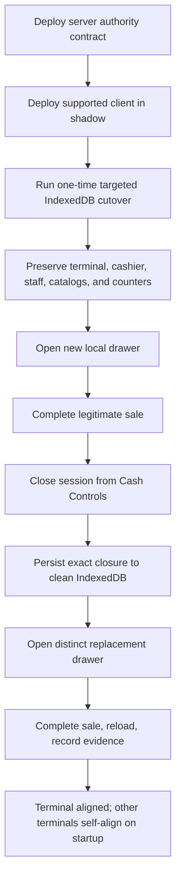
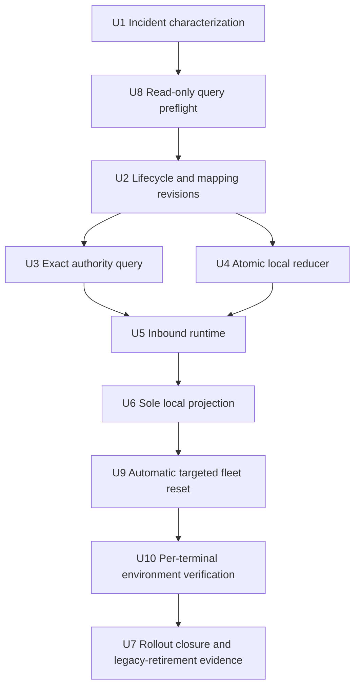

# fix: Replicate register lifecycle authority into local POS

## Summary

Finish the heartbeat-independent register-authority design, then align every active dev and production POS terminal with an automatic one-time targeted IndexedDB cutover. Server history is the retained business record in each environment; local business events, register-session mappings, and drawer authority are discarded while terminal identity, cashier presence, staff authority, readiness, catalogs, and sequence counters are preserved.

---

## Problem Frame

The incident came from split authority: Convex knew a mapped register session was closed, but IndexedDB still considered the old drawer usable because heartbeat-dependent delivery had not persisted the closure. The view model showed a drawer gate while the local command gateway returned the old drawer ID.

The dedicated inbound authority channel fixes that boundary for new state. The remaining complexity came from trying to infer current authority from years of legacy local mappings. That migration is unnecessary for this fleet: all business events that matter have already projected to the server, and the remaining local review items are stale. The approved production posture is therefore destructive reset, not legacy-state interpretation.

---

## Dev and Production Decision and Current Inventory

Read-only backend queries on 2026-07-10 found seven active dev terminals and six active production terminals.

### Dev

| Terminal | Register | Latest reported local schema |
|---|---:|---:|
| Arc | 2 | 8 or 9 fleet cohort |
| Codex | 8 | 8 or 9 fleet cohort |
| Codex Authority Test | 9 | 8 or 9 fleet cohort |
| Codex Cash Controls Test | 10 | 8 or 9 fleet cohort |
| Codex Cash Controls Headless | 11 | 8 or 9 fleet cohort |
| Codex II | 07 | 8 or 9 fleet cohort |
| Olorin | 08 | 8 or 9 fleet cohort |

The dev fleet currently reports three schema-8 and four schema-9 terminals, 174 canonical register mappings, 14 cloud-session reuse groups, 11 mapping-authority rows, and four authority-replication status rows. Its business events, register-session mappings, and drawer authority are disposable for this cutover; terminal and operator state remain intact.

### Production

| Terminal | Register | Latest reported local schema | Latest reported posture |
|---|---:|---:|---|
| Mission Control | 0 | 8 | Active drawer, blocked authority |
| M Supplies | 1 | 8 | Active drawer; mapped cloud session later closed; stale review/uploadable rows |
| Wigshop | 2 | 5 | Idle; stale review/uploadable rows |
| iPhone | 77 | 8 | Idle |
| Codex | 80 | 8 | Active drawer, blocked authority |
| Olorin | 90 | 8 | Idle, blocked authority |

Production also has 76 cloud register sessions, all closed, and 86 canonical register-session mappings. Those cloud records remain server history. They are not copied back into the new local stores and are not used to infer a current local drawer after reset.

Backend runtime status cannot prove current browser contents, but that uncertainty is no longer a migration input. The product decision is that server business history is complete, so local business events and legacy drawer identity are disposable while provisioning and operator state are preserved.

---

## Requirements

The origin requirements remain authoritative. This plan preserves the local-first command contract and adds the following incident and cutover requirements:

- R34. Correctness-bearing register lifecycle authority reaches an authenticated, provisioned terminal independently of runtime heartbeat publication.
- R35. Inbound authority is scoped to the exact store, cloud terminal, register, local register-session ID, and mapped cloud register-session ID; it never chooses a latest drawer heuristically.
- R36. Accepted external authority is committed durably and idempotently before presentation gates or local commands use it.
- R37. Mapping authority revision is the primary epoch and lifecycle revision is compared only within the same exact mapping/cloud-session subject.
- R38. A Cash Controls close is external lifecycle authority evidence; the terminal does not fabricate local counted cash, variance, approval, or closeout events.
- R39. Exact `cloud_closed` blocks reuse of that local drawer and permits a distinct replacement drawer under the shared lifecycle policy.
- R40. Drawer gating, opening, sale eligibility, and operable drawer identity consume one refreshed local projection.
- R41. Offline operation continues from last-known durable local authority until an authoritative snapshot reconnects and persists.
- R42. New carts, sales, payments, mappings, and closeout history remain attached to local drawer identities created after the targeted cutover.
- R43. Heartbeat remains diagnostics, outbound sync remains event upload, and terminal recovery remains exceptional repair. None is the sole carrier of inbound lifecycle correctness.
- R44. Legacy runtime directives remain available during the fleet cutover and are retired only in a separately reviewed follow-up.
- R45. Authorization and authority-persistence failures have calm, actionable operator states and never masquerade as an ordinary replacement-drawer gate.
- R46. If exact remote closure arrives during a non-empty cart, the cart remains visible/read-only on the old drawer until the cashier explicitly clears it; no item or payment is rebound.
- R47. Every active dev and production POS terminal automatically performs the one-time targeted reset before register projection. The reset removes every local business event, every register-session mapping, and every non-terminal-integrity authority record in one IndexedDB transaction.
- R48. The reset is intentionally allowed to discard existing local events, review rows, and authority because server business history is accepted as complete for this cutover.
- R49. Reset is complete for business projections: it deletes every non-seed event, every register-session mapping, and every non-terminal-integrity authority key without classifying legacy rows.
- R50. The reset preserves the existing provisioned terminal seed, sync secret, cashier presence, staff authority, terminal integrity, readiness, catalogs, schema metadata, and global/per-drawer sequence counters. It does not reprovision terminals or create cloud terminal records.
- R51. The same automatic cutover ships to dev and production. Each browser database records a versioned completion marker so the destructive cleanup runs once and later business events are retained.
- R52. The new clean terminal opens a distinct local drawer and projects a new cloud mapping. It never adopts a historical cloud register session or restores an old local drawer ID.
- R53. Verification begins from the preserved provisioned identity and readiness: drawer open, sale, reload, Cash Controls close, local block, distinct replacement, and replacement sale. Dev uses controlled test transactions; production uses ordinary customer sales or explicitly approved reconciled test transactions.

### Acceptance Examples

- AE11. A mapped cloud drawer closes while heartbeat delivery is unavailable; the dedicated lane persists exact `cloud_closed`, and the next open creates a distinct local drawer.
- AE12. Duplicate or out-of-order authority observations do not regress durable authority.
- AE13. Authority for another store, terminal, register, local ID, or cloud mapping is never adopted.
- AE14. A sale completed offline before the first reconnect snapshot remains an immutable local fact and reconciles normally.
- AE15. Authorization, persistence, or exact-mapping failure enters its owned repair state rather than guessing a drawer.
- AE16. Remote closure during a non-empty cart keeps the old cart visible/read-only until explicit clear.
- AE17. Before the first post-deploy register projection, the targeted transaction removes all business events, register-session mappings, and drawer authority, then writes the cutover marker atomically.
- AE18. The cutover leaves terminal provisioning, cashier presence, staff authority, terminal integrity, catalogs, readiness, and sequence counters unchanged; no terminal setup or sync-secret rotation is required.
- AE19. The first post-reset drawer and its cloud mapping are new identities, while historical server transactions and register sessions remain unchanged.
- AE20. All seven active dev terminals and all six active production terminals pass the close/replacement/sale flow without the drawer-status persistence gate recurring.

---

## Scope Boundaries

- Do not move `openDrawer` or other cashier commands to an online Convex mutation.
- Do not make a direct cloud query the presentation or command source of truth.
- Do not synthesize financial closeout facts from remote lifecycle authority.
- Do not migrate, normalize, classify, or preserve legacy IndexedDB mappings.
- Do not clear only the mapping store while retaining events or projections.
- Do not weaken `clearIndexedDbPosLocalStore`'s ordinary safety preflight. The fleet cutover is a separate versioned store operation with an intentionally narrow deletion boundary.
- Do not create a generic remote wipe command or permanent fleet-reset feature for this one-time cutover.
- Do not create or reprovision dev or production terminal records. Exact existing environment/terminal/register identity is preserved.
- Do not generate ad hoc fake production sales. Use ordinary customer sales, or a pre-approved transaction with documented inventory/accounting and void treatment.

### Deferred to Follow-Up Work

- Retire legacy runtime-status directives only after every active dev and production terminal has passed the new lane and no old client remains operational.
- Delete now-unneeded legacy candidate-selection compatibility code after the reset rollout proves no active terminal depends on it.
- General-purpose local backup/restore and remote destructive reset remain separate products.

---

## Key Technical Decisions

| Decision | Chosen approach | Why |
|---|---|---|
| Inbound authority | Terminal-authenticated reactive query | Correctness is independent of heartbeat mutation success. |
| Operational source | Refreshed IndexedDB projection | Presentation and commands act on the same durable evidence. |
| Legacy local state | Delete local business events, register-session mappings, and drawer authority | Server history is complete in both environments; broader browser-origin clearing adds risk without value. |
| Reset mechanism | Automatic versioned IndexedDB transaction before projection | Clears only conflicting business/drawer state and leaves the normal safe-clear helper unchanged. |
| Terminal identity | Preserve the existing seed, sync secret, and cashier/staff authority | Avoids unnecessary reprovisioning and keeps operators signed in. |
| Rollout | Automatic one-time cutover on first register startup in dev and production | Aligns every browser database without an attended fleet runbook. |
| Failure handling | Block projection, commands, and outbound sync until reset succeeds; retry the transaction up to 3 times | Prevents stale state from escaping while allowing transient IndexedDB failures to recover. |

The old cloud sessions and mappings remain queryable server history, but a reset client has no local register-session candidate pointing at them. The dedicated query therefore begins with only active/pending identities created after cutover.

---

## High-Level Technical Design

> This illustrates the intended approach and is directional guidance for review, not implementation specification.

---

## Implementation Units

- U1. **Characterize the split-authority incident**

**Goal:** Preserve the exact regression: cloud-closed mapped drawer, heartbeat-independent delivery absent, stale local drawer returned by `openDrawer`.

**Files:**
- Modify: `packages/athena-webapp/src/lib/pos/presentation/register/useRegisterViewModel.test.ts`
- Modify: `packages/athena-webapp/src/lib/pos/infrastructure/local/localCommandGateway.test.ts`

**Test scenarios:**
- Cloud close without local persisted authority reproduces old-ID reuse.
- Healthy duplicate-open remains idempotent.

---

- U8. **Validate the exact authority query in read-only shadow mode**

**Goal:** Prove terminal authentication, exact identity, reactive behavior, and bounded reads without affecting cashier behavior.

**Files:**
- Create: `packages/athena-webapp/convex/pos/application/queries/registerLifecycleAuthority.ts`
- Create: `packages/athena-webapp/convex/pos/application/queries/registerLifecycleAuthority.test.ts`
- Create: `packages/athena-webapp/convex/pos/infrastructure/repositories/registerLifecycleAuthorityRepository.ts`
- Create: `packages/athena-webapp/convex/pos/infrastructure/repositories/registerLifecycleAuthorityRepository.test.ts`
- Modify: `packages/athena-webapp/convex/pos/public/terminals.ts`
- Modify: `packages/athena-webapp/convex/pos/public/terminals.test.ts`

**Test scenarios:**
- Exact mapped active/closed subjects classify correctly.
- Unmapped new local drawer remains normal pending outbound state.
- Foreign store/terminal/register/mapping is never disclosed or adopted.
- Candidate and read bounds hold without a write/read feedback loop.

---

- U2. **Add monotonic lifecycle and mapping revisions**

**Goal:** Give exact lifecycle transitions and mapping changes server-owned ordering.

**Files:**
- Modify: `packages/athena-webapp/convex/schemas/operations/registerSession.ts`
- Create: `packages/athena-webapp/convex/schemas/pos/posRegisterMappingAuthority.ts`
- Modify: `packages/athena-webapp/convex/schema.ts`
- Create: `packages/athena-webapp/convex/operations/registerSessionAuthorityRevision.ts`
- Create: `packages/athena-webapp/convex/operations/registerSessionAuthorityRevision.test.ts`
- Create: `packages/athena-webapp/convex/pos/application/sync/registerMappingAuthorityRevision.ts`
- Create: `packages/athena-webapp/convex/pos/application/sync/registerMappingAuthorityRevision.test.ts`
- Create: `scripts/check-register-session-authority-writers.ts`
- Create: `scripts/check-register-session-authority-writers.test.ts`

**Test scenarios:**
- `active -> closing -> active -> closed` increments monotonically.
- Legacy server rows begin at deterministic revision zero.
- Mapping create/replace/repair/delete advances the mapping epoch.
- Writer guard rejects direct lifecycle/mapping writes outside the centralized helpers.

---

- U3. **Expose the versioned terminal authority query**

**Goal:** Return exact, bounded authority for locally named subjects independently of heartbeat.

**Dependencies:** U2, U8

**Files:**
- Modify: `packages/athena-webapp/convex/pos/application/queries/registerLifecycleAuthority.ts`
- Modify: `packages/athena-webapp/convex/pos/application/queries/registerLifecycleAuthority.test.ts`
- Modify: `packages/athena-webapp/convex/pos/infrastructure/repositories/registerLifecycleAuthorityRepository.ts`
- Modify: `packages/athena-webapp/convex/pos/infrastructure/repositories/registerLifecycleAuthorityRepository.test.ts`
- Modify: `packages/athena-webapp/convex/pos/public/terminals.ts`
- Modify: `packages/athena-webapp/convex/pos/public/terminals.test.ts`

**Test scenarios:**
- Exact active and closed mappings return ordered healthy/blocked authority.
- New clean local drawer with no mapping returns unmapped.
- Missing target or exact mapping conflict returns repair without selecting another session.
- Heartbeat configuration has no effect on query availability.

---

- U4. **Persist authority atomically in IndexedDB**

**Goal:** Commit exact authority before presentation changes and reject stale, duplicate, or mapping-invalidated observations.

**Dependencies:** U2

**Files:**
- Modify: `packages/athena-webapp/src/lib/pos/infrastructure/local/posLocalStore.ts`
- Modify: `packages/athena-webapp/src/lib/pos/infrastructure/local/posLocalStore.test.ts`
- Create: `packages/athena-webapp/src/lib/pos/infrastructure/local/registerLifecycleAuthorityReconciliation.ts`
- Create: `packages/athena-webapp/src/lib/pos/infrastructure/local/registerLifecycleAuthorityReconciliation.test.ts`
- Modify: `packages/athena-webapp/src/lib/pos/infrastructure/local/drawerAuthorityReconciliation.ts`

**Approach:**
- Keep the existing schema and stores; no legacy mapping migration or current/historical classification is needed.
- Revalidate the exact mapping and compare the versioned cursor in one readwrite transaction.
- Keep hard blocks attached to the exact old local drawer key.

**Test scenarios:**
- Newer exact closure commits and survives restart.
- Duplicate/stale observations are no-ops.
- Mapping change between snapshot and transaction rejects the stale apply.
- Legacy unversioned directive cannot overwrite newer dedicated authority in the supported client.

---

- U5. **Mount heartbeat-independent inbound authority replication**

**Goal:** Keep new clean terminal drawers converging whenever the register route is mounted.

**Dependencies:** U3, U4

**Files:**
- Create: `packages/athena-webapp/src/lib/pos/infrastructure/convex/registerLifecycleAuthorityGateway.ts`
- Create: `packages/athena-webapp/src/lib/pos/infrastructure/local/useRegisterLifecycleAuthorityRuntime.ts`
- Create: `packages/athena-webapp/src/lib/pos/infrastructure/local/useRegisterLifecycleAuthorityRuntime.test.ts`
- Modify: `packages/athena-webapp/src/lib/pos/presentation/register/useRegisterLocalRuntime.ts`
- Modify: `packages/athena-webapp/src/lib/pos/presentation/register/useRegisterLocalRuntime.test.ts`

**Approach:**
- Candidate identities come from the current projected drawer, pending new `register.opened`, and mappings created after the targeted cutover.
- Remove legacy mapping heuristics from the production-critical candidate path.
- Persist before refreshing the local read model.
- Route positive authorization rejection and active-subject persistence failure to their owned repair states.

**Test scenarios:**
- Idle and heartbeat-disabled terminal receives exact closure.
- Offline/loading remains on last-known durable local truth.
- New unmapped drawer does not fail because historical server mappings exist.
- Persistence failure blocks the active subject until durable retry.

---

- U6. **Make the local projection the sole drawer decision source**

**Goal:** Ensure presentation and commands agree on the same durable local state.

**Dependencies:** U5

**Files:**
- Modify: `packages/athena-webapp/src/lib/pos/presentation/register/useRegisterViewModel.ts`
- Modify: `packages/athena-webapp/src/lib/pos/presentation/register/useRegisterViewModel.test.ts`
- Modify: `packages/athena-webapp/src/lib/pos/presentation/register/registerDrawerPresentation.ts`
- Modify: `packages/athena-webapp/src/lib/pos/presentation/register/registerDrawerPresentation.test.ts`
- Modify: `packages/athena-webapp/src/lib/pos/infrastructure/local/localCommandGateway.test.ts`
- Modify: `packages/athena-webapp/src/lib/pos/infrastructure/local/registerReadModel.test.ts`

**Test scenarios:**
- Direct cloud state cannot gate before local persistence.
- Exact local `cloud_closed` opens a distinct replacement.
- Duplicate gate submit returns the same replacement, not a third drawer.
- Non-empty cart remains visible/read-only until explicit clear.

---

- U9. **Apply the automatic targeted reset to dev and production fleets**

**Goal:** Remove stale business projections and drawer identity from all dev and production terminals without clearing browser-origin data or reprovisioning operators.

**Dependencies:** U6

**Files:**
- Modify: `packages/athena-webapp/src/lib/pos/infrastructure/local/posLocalStore.ts`
- Modify: `packages/athena-webapp/src/lib/pos/presentation/register/useRegisterLocalRuntime.ts`
- Modify: focused local-store and runtime tests

**Approach:**
- Before projection, commands, lifecycle replication, or outbound sync, run one IndexedDB transaction over events, mappings, authority, and meta.
- Delete every business event except `terminal.seeded`, every `registerSession` mapping, and every authority key except terminal-integrity keys.
- Preserve the provisioned terminal seed and sync secret, cashier presence, staff authority, readiness, product/service/availability catalogs, schema metadata, and sequence/upload-sequence counters.
- Write `registerOperationalStateReset:v1` in the same transaction. Later startups return `already_applied` and never delete post-cutover events.
- Hold commands and outbound sync until the reset succeeds. Retry transient transaction failures up to 3 times; persistent failures remain fail-closed.
- Keep `clearIndexedDbPosLocalStore` conservative and unchanged.

**Execution note:** The same client behavior applies automatically in dev and production. No attended site-data clearing or reprovisioning is required.

**Test scenarios:**
- Pending, failed, review, and synced business events are all removed under the approved server-projection assumption.
- Malformed legacy drawer-authority values are removed by key while terminal-integrity keys survive.
- The first post-reset event continues the prior global and per-drawer sequence counters.
- A second reset call is idempotent and preserves new post-cutover events.
- Sync receives no store ID until the reset is ready, preventing pre-reset reads and post-marker mapping writes.

**Verification:**
- Existing terminal IDs, cashier sessions, staff authority, and sync secrets remain unchanged; neither environment gains a duplicate active terminal.

---

- U10. **Verify each dev and production terminal through the complete sales flow**

**Goal:** Prove a cutover terminal can trade, consume Cash Controls closure through the dedicated lane, and continue on a replacement drawer.

**Dependencies:** U9

**Files:**
- Modify: `packages/athena-webapp/docs/agent/pos-register-authority-fleet-reset.md`

**Approach:**
- After automatic cutover, use the preserved cashier session or unlock normally, open a new drawer, and verify its new local/cloud mapping.
- In dev, use controlled test products/tenders and record the resulting transaction IDs. In production, use the next ordinary customer sale as the initial sale proof. If a production test transaction is explicitly authorized instead, record the SKU, tender, inventory/accounting treatment, approver, void/reconciliation treatment, and evidence owner before execution.
- Close the new cloud session from Cash Controls without relying on runtime heartbeat delivery. Confirm closure reaches IndexedDB, the old drawer becomes non-operable, and the gate opens a distinct replacement.
- Complete the next legitimate sale on the replacement drawer, sync it, reload the terminal, and verify product lookup and drawer identity remain usable.
- Record evidence for representative dev and production terminals while every other terminal self-aligns on its next register startup.

**Test scenarios:**
- New drawer sale completes and syncs after the targeted reset.
- Cash Controls close persists through the dedicated authority query.
- Replacement gets distinct local and cloud IDs; the old cloud session is never reused.
- Reload retains the replacement and sale history created after reset.
- Persistent reset failure blocks only the affected terminal while preserving its identity/auth state for retry.

**Verification:**
- Arc, Codex, Codex Authority Test, Codex Cash Controls Test, Codex Cash Controls Headless, Codex II, and dev Olorin pass in dev; Mission Control, M Supplies, Wigshop, iPhone, Codex, and production Olorin each have a signed production cutover record and successful replacement-drawer sale.

---

- U7. **Close the rollout with mixed-client compatibility evidence**

**Goal:** Confirm every active dev and production terminal runs cleanly on the dedicated lane while leaving legacy-directive retirement to a separate change.

**Dependencies:** U10

**Files:**
- Modify: `packages/athena-webapp/src/lib/pos/infrastructure/local/usePosLocalSyncRuntime.ts`
- Modify: `packages/athena-webapp/src/lib/pos/infrastructure/local/usePosLocalSyncRuntime.test.ts`
- Create: `docs/solutions/logic-errors/athena-pos-register-authority-replication-2026-07-10.md`

**Approach:**
- Keep legacy directives in the supported client throughout the reset sequence; both delivery paths use the same reducer for new post-reset subjects.
- Confirm supported-build adoption and successful cutover evidence for all seven dev and all six production terminals.
- Do not retire legacy directives in this unit. Produce the evidence needed for a separately reviewed removal.

**Verification:**
- Heartbeat configuration no longer affects drawer correctness, all thirteen terminals operate on post-reset identities, and closed-ID reuse remains zero.

---

## Phased Delivery

### Phase 1: Additive authority foundation and targeted cutover in dev

- Deploy U1/U8/U2/U3 server support to dev first.
- Deploy U4-U6 client support to dev with legacy directives retained.
- Verify the automatic targeted reset and complete a sale plus Cash Controls close/replacement flow in dev.

### Phase 2: Production foundation

- After dev signoff, deploy the same server support to production first and the supported client second.
- Confirm production terminals receive the supported build and will run the cutover before register projection.

### Phase 3: Automatic production cutover

- Each terminal runs the versioned reset once on its next register startup.
- No terminal reprovisioning, cashier sign-out, browser-site-data clear, or maintenance ordering is required.
- Observe the first production cutover closely, then allow the same deterministic path on the remaining terminals.

### Phase 4: Per-terminal close/replacement proof

- Complete U10 on representative dev and production terminals.
- Stop rollout on reset persistence failure, replacement blockage, or sale failure.

### Phase 5: Cross-environment closure

- Confirm all seven original dev and all six original production cloud terminal IDs remain active and current.
- Confirm no pre-cutover business events, register-session mappings, or drawer authority survived and no duplicate terminal was created.
- Keep legacy directive retirement as a later PR.

---

## Success Metrics

- Seven of seven active dev and six of six active production terminals run the versioned targeted reset without changing cloud terminal identity.
- Each terminal begins post-cutover with zero business events, register-session mappings, or drawer authority and can create a new local drawer identity.
- Representative dev and production terminals complete legitimate sales after the reset.
- Every terminal consumes a Cash Controls close through the dedicated authority lane and opens a distinct replacement drawer.
- Every replacement completes and syncs the environment-appropriate sale proof.
- No terminal returns the closed local drawer ID, shows a persistent `Drawer status not saved` gate, or reuses the closed cloud session.
- Runtime heartbeat settings affect diagnostics only.

---

## Risk Analysis & Mitigation

| Risk | Impact | Mitigation |
|---|---|---|
| Local business events are deleted | Accepted for this cutover | User confirmed all business records are projected server-side; the versioned reset deliberately removes every non-seed event. |
| Reset races outbound sync | Critical | Withhold sync store ID and cashier commands until the atomic reset marker commits. |
| Malformed legacy drawer authority survives | High | Delete every non-terminal-integrity authority key rather than relying on current value parsing. |
| Transient IndexedDB failure blocks POS | High | Retry up to 3 times in-place; persistent failure remains fail-closed. |
| Fake validation sale distorts inventory/revenue | High | Prefer ordinary customer sales; require explicit approved accounting/void protocol for any test transaction. |
| Cutover marker runs again | Medium | Store a versioned marker atomically; later calls return `already_applied` and retain new events. |
| Legacy mapping logic remains in code | Medium | Stop using it for production candidates now; remove it in a separately reviewable cleanup after fleet proof. |

---

## Validation Plan

| Layer | Required coverage |
|---|---|
| Server authority | Exact terminal auth, lifecycle/mapping revisions, Cash Controls close/reopen/reject, bounded query reads. |
| IndexedDB reducer | Atomic apply, stale/duplicate rejection, mapping invalidation, restart durability, dedicated-over-legacy precedence. |
| Clean startup | Empty business-event/register-session-mapping/drawer-authority state with terminal seed, cashier/staff authority, integrity, catalogs, readiness, and counters preserved. |
| Register behavior | Initial drawer, legitimate sale, local-only gate source, Cash Controls close, distinct replacement, replacement sale, reload. |
| Fleet operations | Automatic one-time reset on all dev and production terminals, representative live sale/close/replacement proof, retained terminal IDs, and no duplicates. |
| Repo gates | Focused Vitest through the package runner, Convex audit/lint, frontend lint, webapp typecheck/build, harness review, Graphify rebuild after source changes, and `pr:athena`. |

---

## Sources & References

- **Origin:** [docs/brainstorms/2026-05-13-pos-local-first-register-requirements.md](../brainstorms/2026-05-13-pos-local-first-register-requirements.md)
- [docs/solutions/architecture/athena-pos-always-local-first-register-2026-05-14.md](../solutions/architecture/athena-pos-always-local-first-register-2026-05-14.md)
- [docs/solutions/architecture/athena-pos-terminal-recovery-readiness-boundary-2026-06-14.md](../solutions/architecture/athena-pos-terminal-recovery-readiness-boundary-2026-06-14.md)
- [docs/solutions/architecture/athena-pos-runtime-decoupling-boundaries-2026-06-15.md](../solutions/architecture/athena-pos-runtime-decoupling-boundaries-2026-06-15.md)
- [docs/solutions/logic-errors/athena-pos-drawer-authority-replacement-recovery-2026-06-06.md](../solutions/logic-errors/athena-pos-drawer-authority-replacement-recovery-2026-06-06.md)
- [docs/solutions/logic-errors/athena-pos-drawer-sync-contract-2026-06-27.md](../solutions/logic-errors/athena-pos-drawer-sync-contract-2026-06-27.md)
