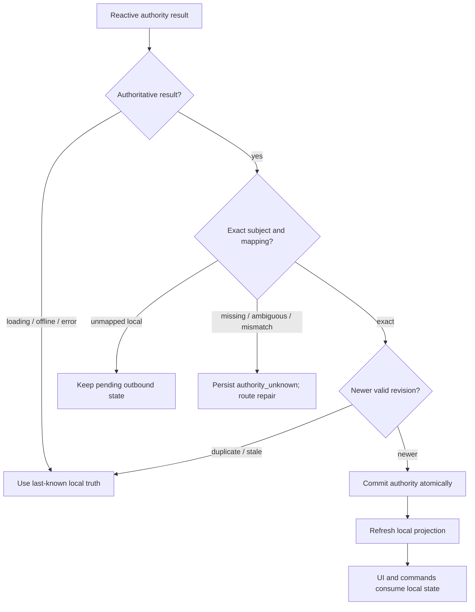
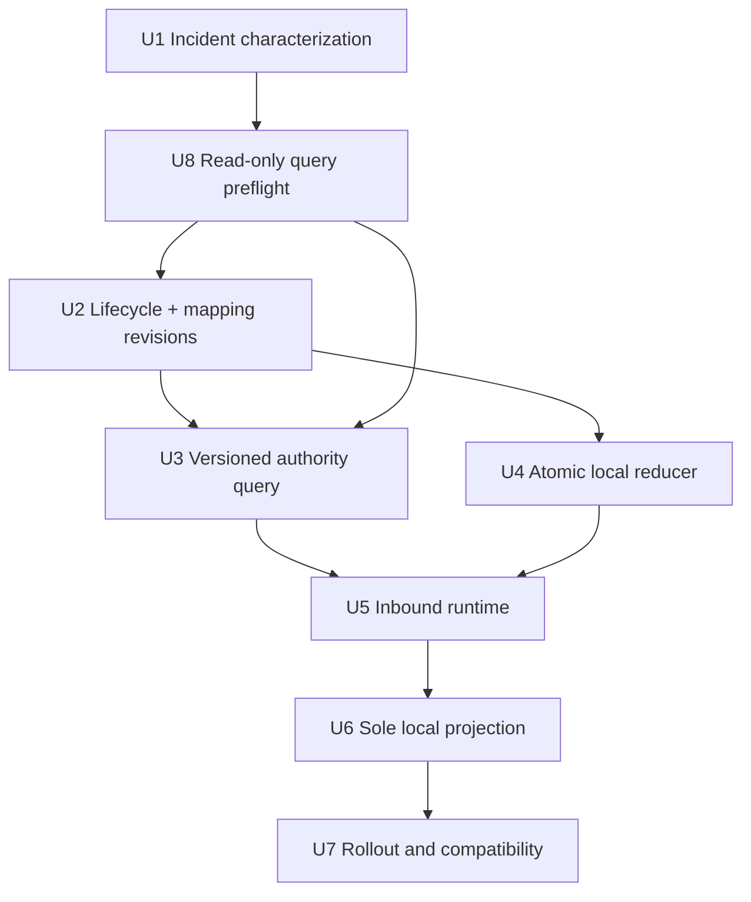
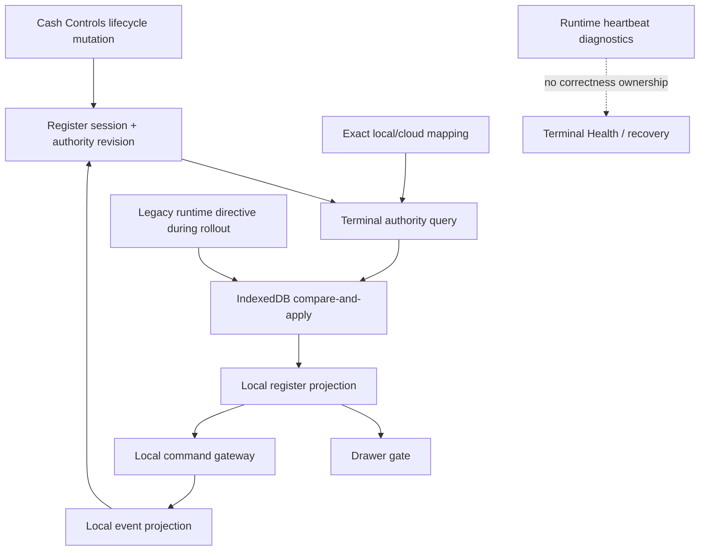

# fix: Replicate register lifecycle authority into local POS

## Summary

Add a terminal-authenticated, heartbeat-independent inbound register-lifecycle channel that durably reconciles exact cloud authority into IndexedDB before POS presentation or commands act on it. Keep cashier commands local-first, make the local projection the sole operational source for drawer gating and opening, and retire correctness-bearing runtime-status directives only after a mixed-client rollout.

---

## Problem Frame

The Arc terminal exposed a split-authority failure. The reactive Convex register query knew the mapped cloud register session had been closed from Cash Controls, so the view model hid the stale local drawer and displayed the drawer gate. IndexedDB did not contain the corresponding `cloud_closed` authority because the only normal server-to-local delivery path was a runtime-status response and that terminal's heartbeat was paused.

When the cashier submitted the drawer gate, the local command gateway reread IndexedDB, still found the old local drawer open and sale-usable, and correctly applied its existing idempotency rule by returning that old local ID. The view model then selected the closed session again. Presentation and commands were making the same lifecycle decision from different sources.

The fix is not to make drawer opening cloud-first. It is to replicate external lifecycle authority into the terminal's durable local authority model, then let both presentation and commands use that model.

---

## Requirements

The origin requirements remain authoritative. This plan directly preserves R2, R5, R6, R8-R11, R19-R26, and R30-R33. The incident adds the following refinements without weakening the existing local-first contract:

- R34. Correctness-bearing register lifecycle authority must reach an authenticated, provisioned terminal independently of runtime heartbeat publication.
- R35. Inbound authority must be scoped to the exact store, cloud terminal, register, local register-session ID, and mapped cloud register-session ID; it must never choose a latest terminal drawer heuristically.
- R36. Accepted external authority must be committed durably and idempotently before presentation gates or local commands use it.
- R37. Register lifecycle authority must carry a server-owned lexicographic cursor: durable mapping-authority revision is the primary epoch, and lifecycle revision is compared only within the same exact mapping epoch/cloud-session subject. IndexedDB must reject duplicate, stale, lower-confidence, or mapping-invalidated observations atomically.
- R38. A remote Cash Controls close is external lifecycle authority evidence. The terminal must not fabricate a local closeout, counted cash, variance, approval, or other financial event.
- R39. Exact `cloud_closed` authority blocks reuse of that local drawer while permitting a distinct replacement local drawer under the existing shared lifecycle policy.
- R40. Drawer gating, drawer opening, sale eligibility, and selected operable drawer identity must consume one refreshed local projection rather than a direct cloud blocker plus a separate local command model.
- R41. Offline and reconnecting operation continues from last-known durable local authority until the first authoritative snapshot arrives. Any local action completed before that arrival remains a valid immutable local fact for reconciliation; once a snapshot arrives, it must be persisted before it can change presentation or command authority.
- R42. Existing carts, transactions, events, mappings, and financial history remain attached to the original local register session; replacement must not silently rebind or rewrite them.
- R43. Heartbeat remains a diagnostics control, outbound local sync remains event upload and acknowledgement, and terminal recovery remains exceptional repair. None of those channels may be the sole carrier of ordinary inbound lifecycle correctness.
- R44. The rollout must be additive and mixed-client safe: legacy runtime directives remain available until supported clients are proven to consume the dedicated inbound channel.
- R45. `authority_unknown`, terminal authorization failure, and authority-persistence failure must have calm, redacted, actionable operator states with explicit retry or existing terminal-repair ownership; they must never masquerade as the ordinary replacement-drawer gate.
- R46. If exact remote closure arrives during a non-empty cart, the cart remains visible and read-only on the old drawer. Replacement opening is unavailable until the cashier explicitly clears the old draft through the existing local clear-sale path; no item, payment, or sale is silently rebound to the replacement.

**Origin actors:** A1 Cashier, A2 Store manager, A3 Athena POS terminal, A4 Athena cloud

**Origin flows:** F1 Provision a POS terminal, F2 Operate the register locally, F4 Finalize local closeout, F5 Sync and reconcile local history; plan extension F6 Replicate external register lifecycle authority to the exact mapped terminal drawer

**Origin acceptance examples:** AE1, AE3, AE6, AE7; plan extensions AE11-AE16 below

- AE11. Given an open local drawer is mapped to a cloud session, no local closeout exists, Cash Controls closes the cloud session, and heartbeat is disabled, the terminal persists exact `cloud_closed` authority and the next open action creates a distinct local drawer ID while retaining old history.
- AE12. Given duplicate or out-of-order lifecycle observations, only the newest valid revision for the exact authority subject changes IndexedDB.
- AE13. Given a closure or open session belongs to another store, terminal, register, local ID, or mapping, the current terminal does not adopt or apply it.
- AE14. Given a terminal is disconnected when a remote close occurs, it continues from its last-known local truth. A sale completed before the first authoritative reconnect snapshot remains attached to the original drawer and reconciles through existing review policy; after the snapshot arrives, persistence precedes any changed gate or command decision.
- AE15. Given `authority_unknown`, the register uses the existing drawer-authority repair presentation with retry and terminal-recovery guidance, disables replacement opening, preserves local facts, and never guesses another drawer.
- AE16. Given exact closure arrives while a non-empty cart is active, the cart remains visible but non-checkoutable; the cashier explicitly clears that old-drawer draft before opening a distinct replacement, while a checkout completed before the snapshot remains immutable reviewable history.

---

## Scope Boundaries

- Do not move `openDrawer` or other cashier commands to an online Convex mutation path.
- Do not make a direct cloud register query an operational presentation gate.
- Do not synthesize local register closeout, cash, variance, approval, or reconciliation events from remote authority.
- Do not delete, rewrite, reparent, or silently rebind carts, sales, payments, mappings, or closeout history.
- Do not adopt an unmapped cloud register session, even if it is the newest session for the terminal or register number.
- Do not turn Terminal Health, recovery commands, or runtime status into a second source of drawer authority.
- Do not expand local-first behavior outside POS.
- Do not introduce a new IndexedDB object store or schema version solely for this work; extend the existing authority records with backward-compatible optional metadata.

### Deferred to Follow-Up Work

- Retire legacy runtime-status directives in a separate adoption-gated follow-up. Closure delivery may be removed after the dedicated lane is proven; active-session seeding remains unchanged in this delivery and may be removed only after separately planned exact-mapping seeding and exceptional recovery cover its current behavior.
- General-purpose bidirectional replication for non-register terminal policy remains separate product and architecture work.
- Automatic resolution of ambiguous or corrupt legacy mappings remains terminal-repair work; this lane classifies and blocks them rather than guessing.

---

## Context & Research

### Relevant Code and Patterns

- `packages/athena-webapp/src/lib/pos/infrastructure/convex/registerGateway.ts` reactively reads `api.pos.public.register.getState`; this read may remain enrichment, but it must stop directly suppressing the local operational drawer.
- `packages/athena-webapp/src/lib/pos/presentation/register/useRegisterViewModel.ts` currently combines the direct cloud blocker with the local read model, then calls the local command gateway for drawer opening.
- `packages/athena-webapp/src/lib/pos/infrastructure/local/localCommandGateway.ts` already opens a distinct replacement when exact persisted `cloud_closed` authority blocks the active drawer, and otherwise retains valid duplicate-click idempotency.
- `packages/athena-webapp/src/lib/pos/infrastructure/local/posLocalStore.ts` already stores drawer authority in the IndexedDB `authority` object store; its current write is unconditional and therefore needs a compare-and-apply operation.
- `packages/athena-webapp/src/lib/pos/infrastructure/local/localRegisterReader.ts`, `registerReadModel.ts`, and `saleBlockerPolicy.ts` already project exact drawer authority into `canSell` and replacement eligibility.
- `packages/athena-webapp/src/lib/pos/presentation/register/useRegisterLocalRuntime.ts` owns the stable local store, local command gateway, read-model refresh, and runtime composition. It is the right mounting boundary for a focused inbound authority runtime.
- `packages/athena-webapp/src/lib/pos/infrastructure/local/usePosLocalSyncRuntime.ts` currently persists authority directives only after runtime-status responses; heartbeat-disabled terminals exit before that path.
- `packages/athena-webapp/convex/pos/public/terminals.ts` already provides terminal-sync-secret-authenticated reactive queries and is the public boundary for the new additive contract.
- `packages/athena-webapp/convex/schemas/operations/registerSession.ts` has lifecycle timestamps but no general monotonic lifecycle revision. Valid transitions such as `closing` back to `active` make status rank or `closedAt` alone insufficient.
- `packages/athena-webapp/convex/pos/infrastructure/repositories/registerSessionRepository.ts` and existing `posLocalSyncMapping` indexes provide exact store/terminal/local/cloud lookup patterns.
- `packages/athena-webapp/shared/registerSessionLifecyclePolicy.ts` remains the semantic owner for sale-usable status, replacement eligibility, exact identity, and lifecycle freshness rules.

### Institutional Learnings

- `docs/solutions/architecture/athena-pos-always-local-first-register-2026-05-14.md`: cashier commands append locally first regardless of connectivity.
- `docs/solutions/architecture/athena-pos-runtime-decoupling-boundaries-2026-06-15.md`: runtime status is evidence, not a control channel; focused modules should sit behind the runtime facade.
- `docs/solutions/logic-errors/athena-pos-stale-terminal-sale-block-2026-05-29.md`: authority is durable state separate from local activity and must gate commands as well as UI.
- `docs/solutions/logic-errors/athena-pos-drawer-authority-replacement-recovery-2026-06-06.md`: old hard `cloud_closed` evidence remains historical; replacement uses a distinct identity.
- `docs/solutions/logic-errors/athena-pos-drawer-sync-contract-2026-06-27.md`: exact identity and freshness fail closed; mapping provenance and local/cloud labels remain explicit.
- `docs/solutions/performance/athena-pos-runtime-status-check-in-storm-2026-07-02.md`: runtime heartbeat is a high-churn diagnostic aggregate and should not carry ordinary correctness side effects.
- `docs/solutions/logic-errors/athena-operations-summary-eligibility-boundaries-2026-07-08.md`: heartbeat pause intentionally skips `reportTerminalRuntimeStatus`, so ordinary authority delivery cannot depend on that publisher.
- `docs/solutions/architecture/athena-terminal-operational-state-aggregate-2026-06-27.md`: Terminal Operational State is a non-actuating support/read boundary; the new lane must not become Terminal Health self-heal or recreate raw ledger joins in React.

### External References

- External research was intentionally skipped. Athena already contains direct local-first, terminal-authentication, mapping, lifecycle-policy, and authority-persistence patterns; generic replication guidance would be weaker than current repo evidence.

---

## Key Technical Decisions

| Decision | Chosen approach | Why |
|---|---|---|
| Inbound transport | Dedicated terminal-authenticated reactive query | Delivers current authority while connected without coupling correctness to heartbeat mutation success. |
| Server selection | Exact requested local-to-cloud mapping | Prevents cross-terminal adoption and “latest drawer” guesses. |
| Ordering | Lifecycle revision plus durable mapping-authority revision | Lifecycle status changes and mapping repairs both need monotonic state that survives replacement, deletion, and stale delivery. |
| Local apply | Transactional compare-and-apply in the existing authority store | Makes persistence, stale rejection, and mapping preconditions one atomic decision without an IndexedDB migration. |
| Operational source | Refreshed local register projection | Gives drawer presentation and commands the same durable evidence. |
| Remote close representation | External authority evidence only | Preserves Cash Controls as the financial fact owner and avoids fabricated local closeout history. |
| Compatibility | Dual delivery through one reducer during rollout | Keeps older clients working while preventing legacy and new observations from racing destructively. |

- The query must classify rather than guess: `local_drawer_unmapped` is normal pending outbound state; a mapped missing target becomes `authority_unknown`; ambiguous or scope-mismatched mappings route to repair; exact sale-usable or non-sale-usable targets return versioned authority. A bounded list of candidates may come only from durable local mapping/authority records, and every candidate is validated independently.
- Query loading, network absence, skipped input, and transport failure are non-authoritative. They never clear or downgrade durable authority.
- A newer healthy observation may supersede older authority for the same exact subject, but it does not erase historical hard blocks for a different local drawer identity. Compare authority lexicographically: `mappingAuthorityRevision` is the primary epoch for the local drawer, so any newer mapping creation, replacement, ambiguity repair, supersession, or deletion/tombstone outranks observations from the older mapping epoch; compare `lifecycleRevision` only when the mapping epoch and exact cloud-session subject match. Do not derive ordering from current-set hashes, maximum timestamps, or status precedence.
- Ambiguous, missing-target, or scope-mismatched mapping classifications durably write `authority_unknown` for the current local drawer before presentation changes. They never write `cloud_closed`, choose a cloud target, or leave the stale drawer sale-usable; terminal authorization failures remain terminal-integrity evidence instead.
- Both the new snapshot lane and temporary legacy runtime directives must call the same local reducer. Versioned dedicated observations outrank unversioned legacy observations for the same subject.
- The inbound runtime stays mounted for a provisioned terminal while POS is open, including idle/no-cashier states. It does not depend on event append, outbound drains, or heartbeat configuration.

### Operator State Matrix

| Authority state | Presentation | Allowed actions | Exit path |
|---|---|---|---|
| Loading, offline, or query unavailable | Existing register from last-known local authority; sync posture remains visible | Existing locally-authorized commands | First authoritative snapshot is persisted before it changes the UI |
| Exact `cloud_closed`, empty cart | Existing replacement-drawer gate with calm drawer-changed copy | Open a distinct replacement drawer or sign out | New local drawer event and later cloud mapping |
| Exact `cloud_closed`, non-empty cart | Cart stays visible and read-only with drawer-changed explanation | Explicitly clear the old draft through the existing local clear-sale confirmation; no checkout or replacement open yet | After clear is durably recorded on the old drawer, open a distinct replacement and start an empty sale |
| `authority_unknown` from missing/ambiguous/invalid mapping | Existing `drawerAuthorityRepair` presentation, with raw reasons hidden | Retry authority replication; navigate to existing terminal-recovery/support path; sign out | Exact repaired mapping with a newer mapping epoch |
| Terminal authorization failure | Existing terminal-integrity/setup-repair presentation | Repair setup or sign out | Valid terminal proof and refreshed local integrity |
| Authority persistence failure after an authoritative result | Local-runtime persistence-failure guard with retry/reload copy | Retry persistence or sign out; drawer/sale commands are disabled in the mounted runtime | Successful durable apply and local projection refresh |
| Exact newer healthy authority | Normal register presentation | Normal locally-authorized commands | No special recovery state |

Operator copy follows `docs/product-copy-tone.md`. The plan reuses existing gate and repair presentation modes; it does not add a parallel terminal-support workspace.

---

## Open Questions

### Resolved During Planning

- Should the drawer command ask Convex whether the session is closed? No. It remains local-first and consumes reconciled local authority.
- Can `observedAt` or cloud status rank provide ordering? No. A server-owned lifecycle revision is required because lifecycle transitions are non-monotonic by status and legacy writers may arrive later.
- Does this require a new IndexedDB store? No. Optional revision/source fields and an atomic reducer fit the existing authority object store.
- Should this delivery reconstruct missing local `register.opened` history from a cloud drawer? No. Exact mappings remain eligible for closure-authority reconciliation, but active-session reconstruction stays on the legacy directive until a separate retirement plan supplies parity. Unmapped cloud sessions are never adopted.
- What happens while fully offline? The terminal uses last-known durable local authority. Synchronous enforcement of a remote close is impossible until reconnect, and intervening local facts remain intact for reconciliation.

### Deferred to Implementation

- Exact revision backfill value for legacy register-session rows: choose the safest deterministic baseline while adding characterization coverage; all post-deploy lifecycle transitions must increment from it.
- Exact feature-cohort mechanism for shadow and canary stages: reuse the smallest current terminal/build rollout primitive available when implementation begins.
- Whether the focused server repository is a new module or a narrow extension of `registerSessionRepository.ts`: choose based on final dependency shape without moving lifecycle policy into repository code.

---

## High-Level Technical Design

> This illustrates the intended approach and is directional guidance for review, not implementation specification.

```mermaid
sequenceDiagram
    participant CC as Cash Controls
    participant Cloud as Convex lifecycle + mapping
    participant Feed as Terminal authority query
    participant Reduce as Local authority reducer
    participant IDB as IndexedDB authority
    participant Local as Local read model + gateway
    participant UI as Register view model

    CC->>Cloud: Close mapped register session
    Cloud->>Cloud: Increment lifecycle authority revision
    Cloud-->>Feed: Exact mapped authority snapshot
    Feed->>Reduce: Reconcile versioned subject
    Reduce->>IDB: Atomic compare-and-apply
    IDB-->>Local: Refresh projected local register
    Local-->>UI: Drawer blocked; replacement allowed
    UI->>Local: Open drawer locally
    Local->>IDB: Append distinct register.opened
    Local-->>UI: New local drawer identity
```



---

## Implementation Units



- U1. **Characterize the split-authority incident**

**Goal:** Lock in the exact failure before changing production boundaries.

**Requirements:** R34, R36, R39, R40, AE11

**Dependencies:** None

**Files:**
- Modify: `packages/athena-webapp/src/lib/pos/presentation/register/useRegisterViewModel.test.ts`
- Modify: `packages/athena-webapp/src/lib/pos/infrastructure/local/localCommandGateway.test.ts`
- Modify: `packages/athena-webapp/src/lib/pos/infrastructure/local/usePosLocalSyncRuntime.test.ts`

**Approach:**
- Reproduce one mapped local drawer with no local closeout, a cloud session closed from Cash Controls, heartbeat disabled, a displayed drawer gate, and a gate submit that currently returns the old ID.
- Keep the existing duplicate-open idempotency expectation for a genuinely healthy local drawer.
- Separate the presentation symptom from the command result so later units can prove each boundary independently.

**Execution note:** Characterization-first. The incident scenario should fail for the exact old-ID reuse before production behavior changes.

**Patterns to follow:**
- Existing `cloud_closed` replacement tests in `localCommandGateway.test.ts`
- Existing drawer-recovery tests in `useRegisterViewModel.test.ts`

**Test scenarios:**
- Integration: heartbeat false plus cloud-closed mapped drawer and no local closeout leads the current split path to attempt old-ID reuse.
- Edge case: double submit against a healthy drawer remains idempotent and does not create multiple drawers.
- Error path: an authority-store read failure never presents drawer opening as successful.

**Verification:**
- The test suite names and reproduces the exact Arc failure without relying on manual IndexedDB inspection.

---

- U8. **Validate the exact query contract in read-only shadow mode**

**Goal:** Prove terminal authentication, exact candidate scoping, reactive behavior, and bounded Convex read cost before committing to lifecycle/mapping revision infrastructure.

**Requirements:** R34, R35, R43, AE13

**Dependencies:** U1

**Files:**
- Create: `packages/athena-webapp/convex/pos/application/queries/registerLifecycleAuthority.ts`
- Create: `packages/athena-webapp/convex/pos/application/queries/registerLifecycleAuthority.test.ts`
- Create: `packages/athena-webapp/convex/pos/infrastructure/repositories/registerLifecycleAuthorityRepository.ts`
- Create: `packages/athena-webapp/convex/pos/infrastructure/repositories/registerLifecycleAuthorityRepository.test.ts`
- Modify: `packages/athena-webapp/convex/pos/public/terminals.ts`
- Modify: `packages/athena-webapp/convex/pos/public/terminals.test.ts`

**Approach:**
- Add the terminal-authenticated query in shadow-only mode using current mapping and lifecycle facts. It returns redacted classifications for measurement but cannot be consumed by the local reducer, presentation, or command gateway.
- Exercise the final public input shape: at most 16 unique candidates, exact local ID required, optional cloud provenance, identifier length limits, duplicate rejection, and cross-tenant response indistinguishability.
- Require indexed/bounded reads with no full table scan and a worst-case budget of 40 document reads for 16 candidates; measure typical one-to-four-candidate subscriptions and invalidation behavior before advancing.
- Gate U2 on evidence that exact current, missing-target, ambiguity, unmapped, and foreign-scope fixtures behave as planned, no cross-terminal session is adopted, and read volume stays within the documented bound.

**Execution note:** This is a reversible preflight. Do not add local persistence or expose the shadow result to cashier behavior.

**Patterns to follow:**
- Terminal sync-secret query authorization in `convex/pos/public/terminals.ts`
- Indexed exact mapping lookups in existing POS sync repositories

**Test scenarios:**
- Happy path: exact mapped active and closed subjects classify correctly without local application.
- Edge case: current local, pending replacement, compact mapping, and selected authority-block candidates remain within the 16-item public contract.
- Edge case: oversized, duplicate, malformed, and cross-tenant inputs fail closed or are externally indistinguishable before amplified reads.
- Error path: revoked or invalid terminal proof returns no authority classification.
- Integration: a 16-candidate fixture stays at or below the 40-document-read budget and reactive invalidation does not create a write/read loop.

**Verification:**
- The query contract is proven safe and bounded in shadow mode before U2 introduces durable revision state.

---

- U2. **Add monotonic lifecycle and mapping authority revisions**

**Goal:** Give register lifecycle transitions and mapping repairs server-owned ordering tokens that survive reactive delivery, mapping deletion, mixed clients, and restart.

**Requirements:** R35, R37, R44, AE12

**Dependencies:** U8

**Files:**
- Modify: `packages/athena-webapp/convex/schemas/operations/registerSession.ts`
- Create: `packages/athena-webapp/convex/schemas/pos/posRegisterMappingAuthority.ts`
- Modify: `packages/athena-webapp/convex/schema.ts`
- Create: `packages/athena-webapp/convex/operations/registerSessionAuthorityRevision.ts`
- Create: `packages/athena-webapp/convex/operations/registerSessionAuthorityRevision.test.ts`
- Create: `packages/athena-webapp/convex/pos/application/sync/registerMappingAuthorityRevision.ts`
- Create: `packages/athena-webapp/convex/pos/application/sync/registerMappingAuthorityRevision.test.ts`
- Modify: `packages/athena-webapp/convex/operations/registerSessions.ts`
- Modify: `packages/athena-webapp/convex/cashControls/closeouts.ts`
- Modify: `packages/athena-webapp/convex/pos/application/sync/projectLocalEvents.ts`
- Modify: `packages/athena-webapp/convex/pos/application/sync/types.ts`
- Modify: `packages/athena-webapp/convex/pos/infrastructure/repositories/localSyncRepository.ts`
- Create: `scripts/check-register-session-authority-writers.ts`
- Create: `scripts/check-register-session-authority-writers.test.ts`
- Test: `packages/athena-webapp/convex/operations/registerSessions.trace.test.ts`
- Test: `packages/athena-webapp/convex/cashControls/closeouts.test.ts`
- Test: `packages/athena-webapp/convex/pos/application/sync/projectLocalEvents.test.ts`

**Approach:**
- Add a backward-compatible optional lifecycle authority revision and increment it at every transition that changes sale usability or lifecycle identity.
- Route register-session inserts and patches that change lifecycle status through `registerSessionAuthorityRevision.ts`, keeping revision calculation out of Cash Controls and projection-specific code.
- Maintain one durable mapping-authority row per store/terminal/local-register-session subject. Advance it transactionally whenever a register-session mapping is created, replaced, superseded, repaired, or deleted; preserve a tombstone/revision so removing a duplicate cannot lower the cursor.
- Add a repository-wide writer guard that inventories register-session status writers and register-session mapping writers, failing when either bypasses its centralized revision rule.
- Define a deterministic baseline for legacy rows, then ensure all new open, close, reopen, reject, and projection transitions advance monotonically.
- Do not increment for cash-total or diagnostic patches that leave lifecycle authority unchanged.

**Execution note:** Test the non-monotonic lifecycle sequence `active -> closing -> active -> closed` before wiring all writers.

**Patterns to follow:**
- Lifecycle patch builders in `convex/operations/registerSessions.ts`
- Shared sale-usability policy in `shared/registerSessionLifecyclePolicy.ts`

**Test scenarios:**
- Happy path: open, close, and reopen transitions each return a greater authority revision.
- Edge case: closeout rejection or reopening cannot produce a revision lower than an earlier closing observation.
- Edge case: a legacy row without revision receives a deterministic first increment.
- Edge case: ambiguity introduced by a newer duplicate advances mapping authority; later repair/removal advances again rather than lowering a timestamp-derived cursor.
- Edge case: stale ambiguity arriving after repaired exact mapping is rejected, and stale healthy authority arriving after newer ambiguity is rejected.
- Edge case: an old mapping epoch with a high lifecycle revision cannot outrank a newer repaired mapping epoch with a lower lifecycle revision, in either delivery order.
- Error path: a status-changing writer omitted from the revision rule is caught by the repository-wide authority-writer guard.
- Integration: a Cash Controls close and a projected local replacement open both expose ordered lifecycle authority.

**Verification:**
- Every cloud lifecycle transition capable of changing terminal sale authority produces a monotonic lifecycle revision, and every register mapping creation/replacement/ambiguity/repair/supersession/deletion produces a higher mapping-authority epoch with a preserved tombstone and guarded writer path.

---

- U3. **Expose an exact terminal lifecycle-authority query**

**Goal:** Provide bounded, reactive, terminal-authenticated snapshots for exact locally known register mappings, independent of heartbeat.

**Requirements:** R34, R35, R37, R39, R43, AE12-AE14

**Dependencies:** U8, U2

**Files:**
- Modify: `packages/athena-webapp/convex/pos/application/queries/registerLifecycleAuthority.ts`
- Modify: `packages/athena-webapp/convex/pos/application/queries/registerLifecycleAuthority.test.ts`
- Modify: `packages/athena-webapp/convex/pos/infrastructure/repositories/registerLifecycleAuthorityRepository.ts`
- Modify: `packages/athena-webapp/convex/pos/infrastructure/repositories/registerLifecycleAuthorityRepository.test.ts`
- Modify: `packages/athena-webapp/convex/pos/public/terminals.ts`
- Modify: `packages/athena-webapp/convex/pos/public/terminals.test.ts`

**Approach:**
- Authenticate with the existing active terminal sync-secret boundary, not staff login or runtime status.
- Accept a bounded candidate set derived only from the terminal's durable local projection, local mapping records, or existing drawer-authority records. Every candidate carries an exact local drawer identity; cloud drawer identity is optional provenance and becomes authoritative only after the server validates the terminal-scoped mapping.
- Validate every candidate's `posLocalSyncMapping` against store, cloud terminal, register, and cloud session, and return per-candidate classifications rather than selecting the newest cloud drawer.
- Return bounded internal classifications: unmapped local, exact sale-usable, exact non-sale-usable, mapped target missing, ambiguous mapping, or scope mismatch. The public contract collapses foreign-store, foreign-terminal, and foreign-mapping existence into one externally indistinguishable authorization/repair result; detailed mismatch reasons remain redacted server diagnostics.
- For an exact mapped session whose local event history is missing, return authority only for the same local identity. Do not return seed facts, reconstruct `register.opened`, or adopt an unmapped newest cloud session in this delivery.
- Include the exact authority subject, cloud lifecycle status, lifecycle revision, durable mapping-authority revision, comparable authority cursor, and safe provenance required for local compare-and-apply.
- Make mapping repair ordering explicit: a newly introduced ambiguity or scope failure must outrank earlier healthy authority, while a later repaired exact mapping must outrank the stale ambiguity. Do not use client arrival time for either decision.
- Never substitute another session because it is newer or shares a register number.

**Execution note:** Start with versioned query-policy tests using exact mapping fixtures, then extend the existing U8 public validator without changing its proven input shape.

**Patterns to follow:**
- Terminal sync-secret queries in `convex/pos/public/terminals.ts`
- Mapping lookups in `convex/pos/infrastructure/repositories/registerSessionRepository.ts` and `localSyncRepository.ts`
- Lifecycle interpretation in `shared/registerSessionLifecyclePolicy.ts`

**Test scenarios:**
- Happy path: exact mapped active and closed sessions return versioned healthy and blocked authority respectively.
- Edge case: a local drawer with no mapping returns normal pending-outbound classification without a block.
- Edge case: missing target and duplicate mapping produce repair classifications, while wrong-store, wrong-terminal, wrong-register, and foreign-mapping probes are externally indistinguishable and cannot reveal tenant existence; all applicable local repair results durably block the requested drawer as `authority_unknown`.
- Edge case: newer ambiguity overrides prior healthy authority, while stale ambiguity cannot overwrite a later repaired healthy exact mapping.
- Edge case: a newer unmapped cloud session is never adopted, even when no active drawer event survives locally.
- Edge case: a durable exact mapping whose `register.opened` history is missing remains eligible for closure-authority reconciliation without reconstructing the event or adopting another cloud session.
- Error path: invalid or revoked terminal proof returns the established terminal-authorization result and no authority data.
- Integration: heartbeat configuration has no effect on query availability or result.

**Verification:**
- A provisioned terminal can subscribe to exact mapped lifecycle authority without publishing runtime status or reading an unbounded collection.

---

- U4. **Add an atomic monotonic IndexedDB authority reducer**

**Goal:** Persist external lifecycle authority crash-safely while rejecting stale, duplicate, lower-confidence, and mapping-invalidated observations.

**Requirements:** R35-R38, R41-R44, AE12-AE14

**Dependencies:** U2

**Files:**
- Modify: `packages/athena-webapp/src/lib/pos/infrastructure/local/posLocalStore.ts`
- Modify: `packages/athena-webapp/src/lib/pos/infrastructure/local/posLocalStore.test.ts`
- Create: `packages/athena-webapp/src/lib/pos/infrastructure/local/registerLifecycleAuthorityReconciliation.ts`
- Create: `packages/athena-webapp/src/lib/pos/infrastructure/local/registerLifecycleAuthorityReconciliation.test.ts`
- Modify: `packages/athena-webapp/src/lib/pos/infrastructure/local/drawerAuthorityReconciliation.ts`
- Modify: `packages/athena-webapp/src/lib/pos/infrastructure/local/usePosLocalSyncRuntime.ts`
- Modify: `packages/athena-webapp/src/lib/pos/infrastructure/local/usePosLocalSyncRuntime.test.ts`

**Approach:**
- Extend authority records with optional server authority cursor, lifecycle revision, mapping-authority revision, source, subject, and confidence metadata while retaining backward readability.
- Extend locally persisted register-session mapping metadata with optional register number, mapping-authority revision, and `current`/`historical` candidate state. Maintain one compact current candidate per register subject in the existing `mappings` store; do not delete historical mapping rows or create a new IndexedDB object store.
- Add one readwrite transaction that revalidates the exact current local mapping evidence, compares existing and incoming authority, and either commits or returns a typed no-op/failure classification.
- Treat unavailable input as no-op; treat exact mapped non-sale-usable state as `cloud_closed`; persist mapped-missing, ambiguous, and scope-mismatched results as `authority_unknown` for the requested local drawer before routing repair.
- Do not seed active sessions from this reducer. It may persist exact authority for a missing-history mapping, but active-session reconstruction remains the legacy directive's responsibility until the deferred retirement work.
- Send temporary legacy runtime directives through the same reducer, with versioned dedicated observations taking precedence.
- Keep old hard blocks attached to old drawer keys. A replacement drawer becomes operable through identity selection, not by globally clearing history.

**Execution note:** Implement the reducer test-first because ordering and crash behavior are data-integrity boundaries.

**Patterns to follow:**
- Existing authority transactions and validators in `posLocalStore.ts`
- Exact drawer identity behavior in `registerReadModel.test.ts`
- Existing sync-owned helper separation in `drawerAuthorityReconciliation.ts`

**Test scenarios:**
- Happy path: a newer exact closed snapshot commits and survives store reconstruction.
- Happy path: a newer exact healthy snapshot supersedes older authority for the same subject.
- Edge case: duplicate and stale blocked or healthy snapshots are no-ops in either arrival order.
- Edge case: mapping ambiguity and repaired healthy authority are correctly ordered in both delivery directions without wall-clock comparison.
- Edge case: a legacy unversioned directive cannot overwrite a versioned dedicated observation.
- Edge case: mapping changes between snapshot and transaction cause discard and resubscription.
- Edge case: missing-target, ambiguous, and scope-mismatched classifications persist `authority_unknown` before the stale drawer can remain sale-usable.
- Error path: write failure preserves prior authority and does not expose the uncommitted snapshot to presentation.
- Integration: persisted authority refresh makes the exact old drawer blocked while a newer replacement identity ignores that historical block.

**Verification:**
- Authority ordering is enforced by IndexedDB state, not React effect arrival order or wall-clock time.

---

- U5. **Mount heartbeat-independent inbound authority replication**

**Goal:** Keep exact lifecycle authority converging whenever a provisioned POS terminal is connected and the register route is mounted, including idle and heartbeat-paused states, with rollout evidence available before the local-only gate cutover.

**Requirements:** R34-R37, R40-R43, R45, AE11-AE14

**Dependencies:** U3, U4

**Files:**
- Create: `packages/athena-webapp/src/lib/pos/infrastructure/convex/registerLifecycleAuthorityGateway.ts`
- Create: `packages/athena-webapp/src/lib/pos/infrastructure/local/useRegisterLifecycleAuthorityRuntime.ts`
- Create: `packages/athena-webapp/src/lib/pos/infrastructure/local/useRegisterLifecycleAuthorityRuntime.test.ts`
- Modify: `packages/athena-webapp/src/lib/pos/presentation/register/useRegisterLocalRuntime.ts`
- Modify: `packages/athena-webapp/src/lib/pos/presentation/register/useRegisterLocalRuntime.test.ts`
- Create: `packages/athena-webapp/convex/schemas/pos/posRegisterAuthorityReplicationStatus.ts`
- Modify: `packages/athena-webapp/convex/schema.ts`
- Create: `packages/athena-webapp/convex/pos/application/commands/registerLifecycleAuthority.ts`
- Create: `packages/athena-webapp/convex/pos/application/commands/registerLifecycleAuthority.test.ts`
- Create: `packages/athena-webapp/convex/pos/infrastructure/repositories/registerLifecycleAuthorityStatusRepository.ts`
- Create: `packages/athena-webapp/convex/pos/infrastructure/repositories/registerLifecycleAuthorityStatusRepository.test.ts`
- Modify: `packages/athena-webapp/convex/pos/public/terminals.ts`
- Modify: `packages/athena-webapp/convex/pos/public/terminals.test.ts`

**Approach:**
- Build a bounded candidate set of at most 16 unique local drawer identities without scanning arbitrary history into the subscription. Priority is: current projected drawer; pending replacement `register.opened` identities; the compact `current` register-session mapping candidate for the configured register; then an exact authority-blocked identity still selected by the read model. Local ID is required and capped at 120 characters; cloud ID is optional provenance until an exact mapping is validated.
- Preserve missing-event reachability through the compact current mapping candidate. If candidate metadata is absent on legacy rows, lazily materialize it from the newest exact register-session mapping/authority evidence for the configured store, terminal, and register; if selection is ambiguous or would exceed 16, fail closed to `authority_unknown`/repair rather than truncate arbitrarily. Reject duplicate, oversized, or malformed public query input before repository reads.
- Keep candidate selection local and deterministic. Missing active event history does not erase an exact mapping candidate, and the client never asks the server to discover a newest session on its behalf.
- Reconcile only authoritative results, persist before refresh, then trigger the existing local read-model refresh callback.
- Keep the hook independent of `usePosLocalSyncRuntime`, heartbeat config, cashier identity, event append tokens, and outbound drain state.
- On reconnect, keep last-known local authority while the query is loading. Commands completed before the first authoritative snapshot remain ordinary local facts; after a snapshot arrives, commit it before refreshing presentation or permitting any decision based on the new evidence.
- Emit redacted, best-effort application outcomes directly from this authority runtime to a focused terminal-authenticated sink for shadow/canary measurement. The sink is never routed through `reportTerminalRuntimeStatus`, never checks `heartbeatEnabled`, and is not a command dependency.
- Keep one latest acknowledgement row per authenticated terminal rather than accepting caller-defined terminal cardinality. Validate subject/cursor against server-known authority, coalesce duplicate writes within 30 seconds, derive trusted identity from the validated terminal proof, and retain acknowledgement as advisory evidence that must be corroborated by build adoption and end-to-end canary outcomes.
- If an authoritative result cannot be persisted, set a shared mounted-runtime `authority_persistence_failed` guard consumed by presentation and the local command gateway. Clear it only after a successful durable apply; do not present the uncommitted cloud result as local authority.

**Execution note:** Cover the heartbeat-disabled and idle-terminal cases at the focused hook boundary before composing it into the register runtime.

**Patterns to follow:**
- Focused runtime composition in `useRegisterLocalRuntime.ts`
- Terminal-authenticated query adapter pattern in local POS infrastructure
- Read-model refresh callbacks already owned by the register runtime

**Test scenarios:**
- Happy path: connected heartbeat-disabled terminal receives, commits, and refreshes exact cloud closure authority.
- Edge case: connected idle terminal reconciles without cashier, cart, event append, or outbound drain.
- Edge case: offline/loading/transport failure leaves last-known authority unchanged and reconnect later converges.
- Edge case: a drawer command wins the reconnect race before the first snapshot; its local event remains attached to the original drawer and later projects to the existing review policy rather than being discarded or rebound.
- Edge case: heartbeat is disabled, an exact durable local/cloud mapping exists, `register.opened` history is missing, and the dedicated lane persists a later exact closure block without reconstructing a local open event.
- Edge case: legacy mappings lazily materialize one deterministic current candidate; ambiguity or more than 16 eligible current candidates fails closed instead of omitting a drawer by truncation.
- Edge case: query result changes while an apply is in flight; only the newest valid revision wins.
- Edge case: oversized, duplicate, overlength, and malformed candidate sets fail closed without repository amplification.
- Edge case: heartbeat-disabled acknowledgements are redacted, validate the server-known cursor, update only one terminal-scoped latest row, coalesce fast duplicates, and cannot affect authority or retirement decisions alone.
- Error path: authorization failure enters terminal-integrity handling rather than masquerading as drawer closure.
- Error path: authority write failure activates the shared persistence guard, disables drawer/sale commands, shows safe retry/reload guidance, and clears only after a durable retry.
- Integration: restart after persisted closure projects the block before the drawer becomes sale-usable.

**Verification:**
- Pausing runtime heartbeat no longer pauses connected register lifecycle convergence.

---

- U6. **Make the local projection the sole drawer decision source**

**Goal:** Remove the split operational authority so presentation gates and local commands agree on the same durable state.

**Requirements:** R36, R38-R42, R45, R46, AE11-AE16

**Dependencies:** U5

**Files:**
- Modify: `packages/athena-webapp/src/lib/pos/presentation/register/useRegisterViewModel.ts`
- Modify: `packages/athena-webapp/src/lib/pos/presentation/register/useRegisterViewModel.test.ts`
- Modify: `packages/athena-webapp/src/lib/pos/presentation/register/registerDrawerPresentation.ts`
- Modify: `packages/athena-webapp/src/lib/pos/presentation/register/registerDrawerPresentation.test.ts`
- Modify: `packages/athena-webapp/src/lib/pos/presentation/register/registerUiState.ts`
- Modify: `packages/athena-webapp/src/lib/pos/presentation/register/registerUiState.test.ts`
- Modify if needed: `packages/athena-webapp/src/components/pos/register/POSRegisterView.tsx`
- Modify if needed: `packages/athena-webapp/src/components/pos/register/POSRegisterView.test.tsx`
- Modify: `packages/athena-webapp/src/lib/pos/infrastructure/local/localCommandGateway.test.ts`
- Modify: `packages/athena-webapp/src/lib/pos/infrastructure/local/registerReadModel.test.ts`
- Modify: `packages/athena-webapp/convex/pos/application/sync/projectLocalEvents.test.ts`

**Approach:**
- Remove the direct `isKnownCloudRegisterSessionBlockingLocalProjection` decision from the operational drawer path.
- Render the gate only after the inbound lane commits and the local projection reports the exact drawer blocked.
- Let `openDrawer` reread that projection and append a distinct `register.opened`; subsequent duplicate submits resolve to the replacement, never the old drawer or a third drawer.
- Reuse the existing `drawerAuthorityRepair` presentation for `authority_unknown`, disable replacement opening, and expose only safe retry plus the existing terminal-recovery/support route.
- For a non-empty old-drawer cart, keep cart lines visible but read-only and require the cashier's explicit existing clear-sale confirmation before replacement opening becomes available. The clear remains a durable old-drawer local action; the replacement starts empty.
- Preserve passive cloud enrichment and closeout presentation where they do not grant or revoke local operational authority.
- Prove replacement projection cannot map back to the closed cloud target and remains idempotent across upload retry.

**Execution note:** Flip the U1 characterization only after reducer and runtime integration are proven.

**Patterns to follow:**
- Existing shared replacement policy and `cloud_closed` command tests
- Existing local read-model identity matching for historical authority

**Test scenarios:**
- Covers AE11. Exact incident now commits local authority, shows the gate from local state, and returns a distinct replacement local ID.
- Happy path: second gate submit returns the already-created replacement drawer.
- Edge case: direct cloud state alone cannot show the operational gate before local persistence.
- Covers AE15. Edge case: missing, ambiguous, or invalid mapping shows actionable `drawerAuthorityRepair`, disables open/retry loops that guess a target, and recovers only after a newer exact mapping epoch.
- Covers AE16. Edge case: exact closure with a non-empty cart keeps the cart visible/read-only; explicit clear is durably tied to the old drawer before replacement opens with an empty sale.
- Covers AE16. Integration: checkout completed before the first closure snapshot remains an immutable old-drawer sale and syncs through existing review rather than reopening the cart.
- Edge case: a late old-drawer snapshot remains historical and cannot block the active replacement.
- Edge case: carts and completed financial history retain the old local register-session ID.
- Covers AE14/R30/R42. Integration: a sale recorded after the cloud close but before the first reconnect snapshot stays attached to the original local drawer, is never discarded or rebound, and projects through the existing manager-review policy.
- Error path: local authority persistence failure leaves presentation on prior durable state and does not install a closed ID as operable.
- Integration: replacement upload creates or maps to a new sale-usable cloud session and retry does not duplicate it.

**Verification:**
- The old mapped local ID is never returned as a successful drawer open after exact cloud closure authority has been received.

---

- U7. **Roll out the dedicated lane with mixed-client compatibility**

**Goal:** Deploy the new lane additively, prove convergence and identity safety, and establish the evidence required for a separate legacy-directive retirement change.

**Requirements:** R43, R44

**Dependencies:** U6

**Files:**
- Modify: `packages/athena-webapp/src/lib/pos/infrastructure/local/usePosLocalSyncRuntime.ts`
- Modify: `packages/athena-webapp/src/lib/pos/infrastructure/local/usePosLocalSyncRuntime.test.ts`
- Modify: `packages/athena-webapp/src/lib/pos/infrastructure/convex/registerLifecycleAuthorityGateway.ts`
- Modify: `packages/athena-webapp/src/lib/pos/infrastructure/local/useRegisterLifecycleAuthorityRuntime.ts`
- Modify: `packages/athena-webapp/src/lib/pos/infrastructure/local/useRegisterLifecycleAuthorityRuntime.test.ts`
- Modify: `scripts/harness-app-registry.ts` if new files are not covered by existing validation routing
- Create: `docs/solutions/logic-errors/athena-pos-register-authority-replication-2026-07-10.md`

**Approach:**
- Ship server revision/query support first with legacy directives intact.
- Run the client in shadow, then canary apply mode, measuring received/applied/stale/duplicate results, mapping races, write failures, convergence latency, and closed-ID reuse.
- Keep both delivery paths idempotent through the same reducer during mixed-client operation.
- Enable broadly and complete this unit only after Arc/heartbeat-disabled and restart canaries prove external close, durable block, distinct replacement, valid new cloud mapping, and supported-build adoption.
- Use the focused acknowledgement delivered in U5 to evaluate shadow/canary outcomes; acknowledgements remain advisory and are corroborated by supported-build adoption and complete external-close/replacement flows.
- Inventory closure and active-session runtime directives separately. This delivery retains both; the supported-client milestone produced by this rollout becomes an entry condition for the follow-up. That follow-up may retire closure delivery after adoption and active-session seeding only after exact-mapping seeding plus exceptional recovery provide parity.
- Register new source/test relationships in the harness and document the prevention rule.

**Execution note:** Treat directive retirement as separately planned adoption-gated work, not part of this unit's completion.

**Patterns to follow:**
- Runtime coalescing and build-adoption monitoring in `athena-pos-runtime-status-check-in-storm-2026-07-02.md`
- Validation registration through `scripts/harness-app-registry.ts`

**Test scenarios:**
- Happy path: new and legacy delivery of the same closure results in one durable authority state.
- Edge case: versioned dedicated authority wins regardless of legacy directive arrival order.
- Edge case: feature-disable stops new applies without deleting already-persisted hard blocks.
- Edge case: heartbeat-disabled canary acknowledgements are redacted, best-effort, deduplicated, and never become an authority input.
- Error path: rollback never globally clears IndexedDB authority or strands heartbeat-disabled old clients without an explicit operational warning.
- Integration: heartbeat disabled permits outbound local sync and inbound authority replication throughout dual delivery, establishing retirement readiness without removing either legacy directive in this unit.

**Verification:**
- Runtime heartbeat can be paused without affecting drawer correctness, rollout outcomes are measurable without heartbeat, and closed-ID reuse remains zero through rollout.

---

## System-Wide Impact



- **Interaction graph:** Cash Controls and sync projection advance server lifecycle revision; the terminal query joins exact mapping and lifecycle facts; the local reducer persists; local reader/view model/gateway consume. Runtime status remains a separate diagnostic graph.
- **Error propagation:** Query absence is no-op, terminal authorization routes to terminal integrity, ambiguous/missing mapped targets route to drawer repair, write failure preserves prior state, and projection conflict becomes manager review without rewriting local facts.
- **State lifecycle risks:** Direct status or mapping writers missing revision increments, legacy baselines, cross-epoch ordering, stale mixed writers, mapping changes during apply, crash between persist and React refresh, historical hard blocks, and replacement upload reuse are explicitly tested.
- **API surface parity:** Public Convex validators, application query DTO, client adapter types, IndexedDB authority validation, diagnostics, and temporary legacy directive types must remain aligned.
- **Integration coverage:** Unit tests are insufficient; the exact remote-close flow must cross Cash Controls/server revision, terminal query, IndexedDB persistence, local projection, gate submit, local event append, and cloud replacement projection.
- **Unchanged invariants:** Cash Controls owns cloud closeout facts; POS commands remain local-first; sync remains ordered/idempotent; local and cloud IDs remain distinct; carts and completed sales remain immutable; terminal/store scope and secret authentication remain mandatory.

---

## Alternative Approaches Considered

- Reconcile the existing signed-in `register.getState` query directly into IndexedDB: smaller diff, but it mixes cashier/dashboard enrichment with terminal replication and lacks an exact mapping/terminal-proof contract.
- Pass a cloud-derived `forceReplacement` flag into `openDrawer`: fixes the symptom while preserving dual authority and allowing presentation/command drift elsewhere.
- Keep using runtime-status response directives and force heartbeat on: contradicts the documented diagnostics-only contract and makes correctness depend on a high-churn best-effort mutation.
- Use arrival timestamps or status rank instead of lifecycle revision: unsafe for reopen/reject cycles, stale React effects, mixed legacy writers, and rollback.
- Seed the newest cloud terminal session: risks cross-drawer adoption and silent cart/session rebinding; exact mapping is required instead.

---

## Success Metrics

- Zero successful `openDrawer` results that return a locally open ID whose exact mapped cloud session is known non-sale-usable.
- External cloud close to durable local authority convergence is observable and bounded for connected terminals, including heartbeat-disabled terminals.
- Duplicate/stale observation rates may be non-zero during rollout, but stale or duplicate writes that change durable authority remain zero.
- Zero cross-store, cross-terminal, cross-register, or unmapped cloud-session adoption.
- Replacement drawer receives a distinct local ID and a distinct sale-usable cloud mapping. Old mapping and cart identity/history are never silently rebound or rewritten; an explicit R46 clear remains an allowed durable old-drawer action.
- Runtime heartbeat pause affects terminal-health freshness only, not outbound sync or inbound lifecycle authority.

---

## Phased Delivery

### Phase 1: Additive server foundation

- Land U1 and U8 first: incident characterization plus read-only shadow query; confirm exact scoping, authentication, reactivity, and the 40-read worst-case budget.
- After the preflight gate passes, land U2 and U3: durable lifecycle/mapping revisions and the versioned terminal-authenticated query.
- Keep runtime directives unchanged for old clients.

### Phase 2: Shadow and canary client

- Land U4-U5 with shadow classification first, then apply for Arc and a small heartbeat-disabled cohort.
- Prove stale rejection, restart durability, and no cross-terminal adoption.

### Phase 3: Sole local operational projection

- Enable U6 after canary proof; remove the view model's direct cloud operational blocker.
- Expand by supported build/version cohort.

### Phase 4: Compatibility retirement

- Plan and deliver a separate adoption-gated follow-up. Retire closure directives after dedicated-lane proof; retire active-session directives only after exact-mapping seeding and exceptional recovery parity. Runtime heartbeat then remains diagnostic evidence and recovery verification only.

---

## Risk Analysis & Mitigation

| Risk | Likelihood | Impact | Mitigation |
|---|---|---|---|
| A lifecycle or mapping writer omits revision advancement | Medium | High | Audit both writer sets, centralize lifecycle and mapping revision rules, preserve mapping tombstones, and enforce the repository-wide writer guard. |
| Stale observation regresses authority | Medium | High | Atomic revision compare-and-apply with versioned source precedence. |
| Query adopts wrong drawer | Low | Critical | Require exact mapping and full scope; never choose latest by terminal/register. |
| Remote close fabricates financial state | Low | Critical | Persist authority only; forbid closeout/cash event append in reducer tests. |
| Offline terminal sells after remote close | Expected while disconnected | High | State the last-known-authority contract; converge on reconnect and preserve later facts for review. |
| Replacement maps back to closed cloud target | Medium | High | Projection policy rejects closed-target reuse and produces review evidence. |
| Mixed clients lose correctness | Medium | High | Server-first additive rollout, common reducer, legacy directives retained through adoption horizon. |
| New query increases Convex reads | Medium | Medium | One bounded candidate set of at most 16 per mounted terminal; deterministic current-candidate metadata, indexed reads per candidate, and no write/read feedback loop. |
| Rollback clears necessary hard blocks | Low | High | Feature-disable applies only; never globally clear IndexedDB authority; retain additive server contract through rollback horizon. |

---

## Documentation / Operational Notes

- Add the new architecture solution only after implementation proves the boundary and regression suite.
- Update harness source ownership through `scripts/harness-app-registry.ts`; do not hand-edit generated validation-map files.
- Focused validation must cover the new server query, public auth, lifecycle revision, reducer, runtime hook, local store, read model, command gateway, view model, and projection tests.
- Merge-grade validation must include Convex audit/lint, frontend lint, webapp typecheck/build, harness review, graphify rebuild after source changes, and `pr:athena`.
- Canary telemetry must remain redacted: IDs may be safe operational references, but no sync secret, staff proof, PIN/verifier material, local event payload, customer, or payment details.
- Rollback keeps the additive query deployed, disables application of new snapshots, preserves persisted authority, and retains legacy directives until old-client risk expires.

---

## Validation Plan

| Layer | Required coverage |
|---|---|
| Server lifecycle and mapping | Lifecycle revision and mapping-epoch helpers; writer guard for both writer sets; Cash Controls close/reopen/reject; mapping create/replace/ambiguity/repair/supersede/delete-tombstone; local-event projection; legacy session and mapping baselines. |
| Terminal query | Exact active/closed mapping, unmapped local, missing target, ambiguity, scope mismatch, heartbeat independence, terminal proof and validator parity. |
| IndexedDB reducer | Atomic compare-and-apply, mapping-epoch-primary/lifecycle-secondary ordering, high-old-lifecycle versus low-new-mapping epoch in both directions, duplicate/stale/source ordering, mapping-change race, durable `authority_unknown`, restart, write failure. |
| Inbound runtime | Heartbeat-disabled and idle replication, reconnect pre-snapshot race, authorization routing, apply-before-refresh, redacted canary acknowledgement. |
| Register behavior | Local-only gate source, distinct replacement ID, double submit, historical hard block, no cart/history rebinding, no invented closeout facts. |
| Cloud projection | Replacement maps to a new sale-usable cloud session, closed-target reuse becomes review, retry stays idempotent, intervening offline sale remains reviewable. |
| Repo gates | Focused Vitest suites through the package's Vitest runner, Convex audit and changed-file lint, frontend changed-file lint, webapp typecheck and build, harness review, Graphify rebuild after source changes, and final Athena PR validation. |

The implementation handoff should use the current commands documented by `packages/athena-webapp/docs/agent/testing.md` and the root `AGENTS.md`; this plan intentionally records validation outcomes and suites rather than freezing command recipes that may drift.

---

## Sources & References

- **Origin document:** [docs/brainstorms/2026-05-13-pos-local-first-register-requirements.md](../brainstorms/2026-05-13-pos-local-first-register-requirements.md)
- Prior plan: [docs/plans/2026-05-14-001-feat-pos-always-local-first-flow-plan.md](./2026-05-14-001-feat-pos-always-local-first-flow-plan.md)
- Local-first command boundary: [docs/solutions/architecture/athena-pos-always-local-first-register-2026-05-14.md](../solutions/architecture/athena-pos-always-local-first-register-2026-05-14.md)
- Runtime responsibility boundary: [docs/solutions/architecture/athena-pos-runtime-decoupling-boundaries-2026-06-15.md](../solutions/architecture/athena-pos-runtime-decoupling-boundaries-2026-06-15.md)
- Durable authority boundary: [docs/solutions/logic-errors/athena-pos-stale-terminal-sale-block-2026-05-29.md](../solutions/logic-errors/athena-pos-stale-terminal-sale-block-2026-05-29.md)
- Drawer replacement recovery: [docs/solutions/logic-errors/athena-pos-drawer-authority-replacement-recovery-2026-06-06.md](../solutions/logic-errors/athena-pos-drawer-authority-replacement-recovery-2026-06-06.md)
- Drawer sync contract: [docs/solutions/logic-errors/athena-pos-drawer-sync-contract-2026-06-27.md](../solutions/logic-errors/athena-pos-drawer-sync-contract-2026-06-27.md)
- Runtime check-in performance boundary: [docs/solutions/performance/athena-pos-runtime-status-check-in-storm-2026-07-02.md](../solutions/performance/athena-pos-runtime-status-check-in-storm-2026-07-02.md)
- Heartbeat eligibility boundary: [docs/solutions/logic-errors/athena-operations-summary-eligibility-boundaries-2026-07-08.md](../solutions/logic-errors/athena-operations-summary-eligibility-boundaries-2026-07-08.md)
- Terminal operational aggregate boundary: [docs/solutions/architecture/athena-terminal-operational-state-aggregate-2026-06-27.md](../solutions/architecture/athena-terminal-operational-state-aggregate-2026-06-27.md)
