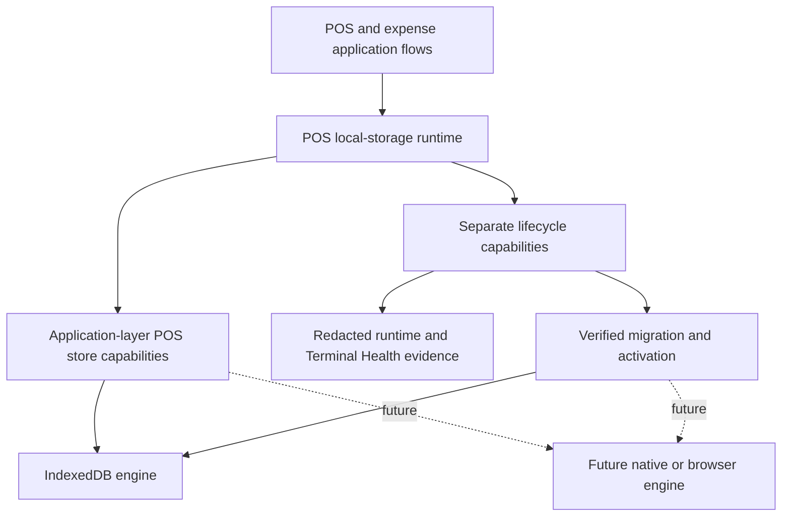
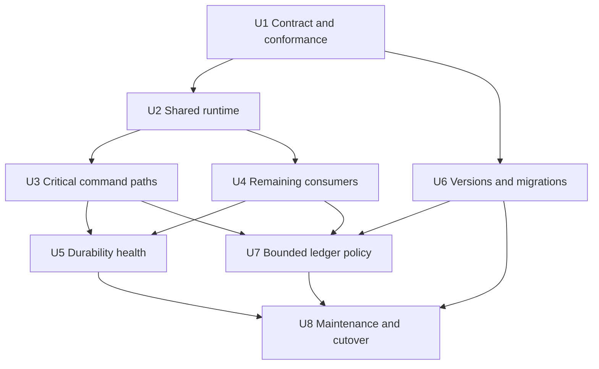
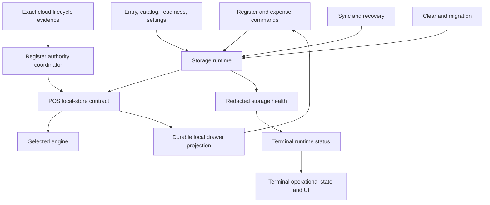

# refactor: Make POS Local Storage Engine-Neutral

## Summary

Create a high-level POS local-store contract and one asynchronous storage runtime so register, expense, catalog, authentication, provisioning, sync, recovery, and diagnostics depend on POS behavior rather than IndexedDB. Keep IndexedDB as the first production engine while adding the durability, migration, maintenance, bounded-query, and observability foundations required to adopt a future engine without changing cashier or cloud semantics.

---

## Problem Frame

Athena's local-first POS contract makes the terminal's local event ledger the first durable record of cashier work. The current store facade preserves that invariant, but production consumers repeatedly construct the IndexedDB adapter, check `globalThis.indexedDB`, or infer contracts from `ReturnType<typeof createPosLocalStore>`. The expense runtime can even fall back to volatile memory when IndexedDB is absent, allowing an apparently successful local expense to disappear on reload.

The persistence boundary also lacks explicit origin-persistence and quota health, ordered schema migrations, a safe cross-engine cutover protocol, bounded ledger operations, and engine-neutral maintenance. Those gaps make IndexedDB difficult to replace and weaken the operational guarantees of the current engine. This plan closes them without choosing SQLite's internal schema, transaction model, worker topology, or other engine mechanics.

Since the first draft, #642 landed a dedicated register-lifecycle authority lane. Convex now owns mapping and lifecycle revisions, while the terminal accepts exact, terminal-authenticated observations into durable local state. Cashier presentation and commands consume only the refreshed local projection; heartbeat/runtime status and recovery remain diagnostic or exceptional channels. Every client targeted by this work runs #642, so the plan treats that architecture and its current durable record shapes as the starting point. Within #642, only its enduring IndexedDB-facing contracts and consumers are in scope; the broader engine-neutral foundation scope remains unchanged.

---

## Requirements

The following origin requirements remain authoritative: R2, R5-R13, R19-R25, and R31-R33 (see origin: `docs/brainstorms/2026-05-13-pos-local-first-register-requirements.md`). In particular, local commit remains the success boundary, cloud sync remains downstream and idempotent, and pending sync remains distinct from review.

### Contract and command durability

- R34. Every production POS local-storage consumer must depend on a named high-level store/runtime contract rather than IndexedDB globals, adapter constructors, object-store vocabulary, or inferred factory return types.
- R35. The shared contract must describe POS-domain operations and observable guarantees while leaving schema, indexes, transactions, locking, batching, worker/RPC topology, and other storage mechanics to each engine implementation.
- R36. Production register and expense commands must fail closed when no durable engine is ready; the memory implementation may be selected only through explicit test or development injection.
- R37. Cashier facts, authority, and terminal seed writes must not report success until their engine confirms durable commit; quota, contention, corruption, unsupported schema, migration, unavailable storage, and generic I/O failures must remain distinguishable.
- R38. Terminal provisioning must preflight a writable durable engine before remote registration. If the final seed write fails after cloud registration, the flow must return a visible, repairable partial-provision outcome. Its authenticated retry must be conditional on the still-current provisioning revision, adopt any newer complete matching seed rather than rotate again, and otherwise rotate the server credential through the existing registration boundary before writing a new complete seed; Athena must not reconstruct or reveal the lost credential.

### Health and migration

- R39. Browser storage persistence posture, quota pressure, engine readiness, schema posture, ledger pressure, migration state, and maintenance state must be observable through redacted local and Terminal Health evidence without exposing secrets, proofs, or event payloads. Persistence denial/unsupported APIs and estimated pressure are degraded diagnostic evidence, not cashier authority; only actual initialization/commit failure, corruption, or quota-exceeded writes block the affected command.
- R40. Engine layout versions, POS domain-record versions, and portable migration-envelope versions must be independent; supported in-place migrations must be ordered, atomic, retryable, non-destructive, and compatible with current version-9 data.
- R41. Cross-engine migration must preserve complete logical POS state, protect temporary sensitive material at least as strongly as its source, verify semantic equivalence before activation, fence concurrent writes, resume safely after interruption, and retain the source as controlled rollback evidence. The local integrity manifest detects corruption/completeness drift; it must not grant authenticity or elevate altered authority/proof records.

### Scale, maintenance, and delivery boundary

- R42. Upload, review, status-update, mapping, and ledger-health paths must use bounded, scoped domain operations so engines can implement them using their native strengths.
- R43. Clear, migration, and future maintenance operations must share an engine-neutral exclusive-maintenance boundary, remain unavailable to ordinary cashier/read capabilities, bind to the expected terminal/store and authorized recovery context, and fail closed when protected work or inspection uncertainty exists. Production migration activation and retained-source destruction remain unavailable in this delivery.
- R44. This foundation must define retention pressure and future checkpoint requirements but must not physically delete settled events until offline receipt/history retention is approved and a behavior-preserving checkpoint implementation exists.
- R45. IndexedDB remains the selected production engine for this delivery; no SQLite dependency, production selector, table design, VFS choice, or worker implementation is introduced.
- R46. The dedicated inbound register-authority runtime must remain independent of heartbeat publication, cashier presence, and outbound event upload. It consumes a stable selected-engine generation but remains a separate POS-domain coordinator.
- R47. Applying register lifecycle authority must atomically revalidate the complete expected mapping subject, compare the mapping-authority epoch and lifecycle revision, persist separate server and local-review authority channels, and return applied, safe no-op, mapping-rejected, or durable-failure outcomes without exposing engine mechanics.
- R48. The durable local projection remains the sole operational drawer source for presentation and cashier commands. Remote closure is authority evidence only; it cannot synthesize counted cash, variance, approval, closeout, or other financial facts.
- R49. Loading, offline, or transport absence must preserve last-known durable authority. Unauthorized, incomplete/invalid snapshots, mapping invalidation, or persistence failure must enter their owned repair outcome and never guess a drawer.
- R50. Authority migration must preserve exact mapping subjects/current designation, mapping and lifecycle revisions, server/local-review channel separation, and source/confidence metadata so stale or mismatched evidence cannot gain precedence after restart or cutover.

**Origin actors:** A1 (cashier), A2 (store manager), A3 (Athena POS terminal), A4 (Athena cloud)

**Origin flows:** F1 (provision a terminal), F2 (operate offline), F3 (complete checkout), F4 (local closeout), F5 (sync and reconcile)

**Origin acceptance examples:** AE1, AE3, AE6, AE7, AE10

---

## Scope Boundaries

- Do not change POS event meanings, payment behavior, drawer policy, staff authority, receipt identity, sync ingestion, Convex projection, reconciliation ownership, or the POS-only offline product boundary.
- Do not require all engines to emulate IndexedDB key-value transactions or expose a universal low-level adapter.
- Do not prescribe SQLite tables, indexes, VFS, worker topology, RPC, transaction strategy, or concurrency implementation.
- Do not add a production alternate-engine selector or migrate any production terminal away from IndexedDB in this delivery.
- Do not automatically delete, compact, or archive local event history.
- Do not redesign the landed Convex authority query or lifecycle/mapping revision writers; they are integration dependencies, not storage-engine implementations.
- Do not fold register-authority subscription into storage lifecycle, heartbeat, runtime status, or recovery commands.
- Do not send raw migration snapshots, terminal secrets, wrapped proofs, PIN/verifier material, customer data, payment payloads, or arbitrary local-event payloads to Convex diagnostics.

### Deferred to Follow-Up Work

- Production SQLite or another alternate engine: implement only after this contract and cutover protocol are proven by the existing engines.
- Physical ledger compaction: requires approved offline receipt/history retention behavior and a separately reviewed durable checkpoint design.
- Native kiosk packaging through Electron, Tauri, or another shell: separate product and deployment decision.

---

## Context & Research

### Relevant Code and Patterns

- `packages/athena-webapp/src/lib/pos/infrastructure/local/posLocalStore.ts` already provides atomic event/sequence writes, a high-level facade, IndexedDB and memory implementations, and commit-aware IndexedDB transactions. Its memory implementation can be refactored into the independent high-level test engine rather than adding a third engine.
- `packages/athena-webapp/src/lib/pos/infrastructure/local/localCommandGateway.ts` and `expenseLocalCommandGateway.ts` establish local append as the command-success boundary.
- `packages/athena-webapp/src/lib/pos/infrastructure/local/localRegisterReader.ts`, `registerReadModel.ts`, and `expenseReadModel.ts` establish engine-independent projections but currently require broad event reads.
- `packages/athena-webapp/src/lib/pos/infrastructure/local/usePosLocalSyncRuntime.ts` is the browser runtime hotspot and already supports store injection in selected paths; it should consume the shared runtime instead of creating fallback stores.
- `packages/athena-webapp/src/lib/pos/infrastructure/local/terminalRuntimeStatus.ts` and `packages/athena-webapp/convex/schemas/pos/posTerminalRuntimeStatus.ts` are the established redacted evidence rail into Terminal Health.
- `packages/athena-webapp/src/lib/pos/application/ports.ts` demonstrates named application-facing interfaces; the new local-store contract should follow that intent without forcing engine details into application code.
- `packages/athena-webapp/src/lib/pos/infrastructure/local/useRegisterLifecycleAuthorityRuntime.ts`, `registerLifecycleAuthorityCandidates.ts`, and `registerLifecycleAuthorityReconciliation.ts` are the new heartbeat-independent cloud-to-local authority coordinator, exact candidate boundary, and revision-aware reducer. They currently infer the broad store type and must consume narrow injected capabilities from the selected runtime.
- `docs/solutions/logic-errors/athena-pos-register-authority-replication-2026-07-10.md` and `docs/plans/2026-07-10-001-fix-pos-register-authority-replication-plan.md` define the landed split-authority and old-cart behavior that this refactor must preserve as the new-build baseline.

### Institutional Learnings

- `docs/solutions/architecture/athena-pos-local-first-sync-2026-05-13.md`: local events are the first durable field record; Convex remains authoritative after acceptance and projection.
- `docs/solutions/architecture/athena-pos-register-viewmodel-boundaries-2026-06-17.md`: centralize local runtime ownership and keep the register facade stable.
- `docs/solutions/architecture/athena-pos-terminal-recovery-readiness-boundary-2026-06-14.md`: separate sales readiness, support recovery, and diagnostics; local clear must protect operator-owned evidence.
- `docs/solutions/architecture-patterns/athena-pos-register-session-activity-ledger-2026-07-05.md`: activity reporting settles independently from core sync and must remain part of retention and migration safety.
- `docs/solutions/logic-errors/athena-pos-terminal-register-recovery-and-review-cleanup-2026-07-01.md`: recovery mutations must remain bound to exact evidence rather than counts.

### External References

- [Indexed Database API 3.0](https://w3c.github.io/IndexedDB/): transaction completion and durability semantics for the current engine.
- [WHATWG Storage Standard](https://storage.spec.whatwg.org/): persistence permission and quota-estimate behavior for browser-managed storage.
- [SQLite WASM persistent storage options](https://sqlite.org/wasm/doc/tip/persistence.md): future browser SQLite implementations have engine-specific worker, locking, and concurrency trade-offs; the shared POS contract must not erase those strengths.

---

## Key Technical Decisions

| Decision | Rationale |
|---|---|
| Put the store seam in the application layer | A future engine can implement native indexed queries, transactions, schemas, and concurrency while infrastructure depends inward on POS behavior. |
| Centralize engine selection and lifecycle in one asynchronous runtime | Consumers stop branching on browser globals, initialization races collapse to one owner, and worker-backed engines remain possible. POS-domain coordinators such as inbound authority remain separate and consume the stable engine generation through narrow ports. |
| Keep the current low-level adapter private to the IndexedDB/memory implementation | It is useful implementation code but is not a portable application contract. |
| Segregate cashier/read capabilities from lifecycle ports | Feature consumers depend only on append, read, snapshot, sync, or authority capabilities they use; health, maintenance, migration, activation, and destruction do not become a store god interface. |
| Reject implicit memory fallback in production | A cashier or expense success must survive reload. |
| Keep persistence posture diagnostic | Denial or an unavailable persistence API increases browser-eviction risk but does not prove an IndexedDB commit failed. Preserve the local durable-commit boundary; actual initialization/commit failure, corruption, or quota exhaustion blocks the affected command. |
| Separate version domains | IndexedDB layout upgrades, logical POS-record evolution, and portable migration formats change for different reasons. |
| Define migration by outcomes, not storage mechanics | Complete logical state, semantic verification, fencing, activation, restart behavior, and rollback posture are shared; encoding, checksums, batches, and transactions remain implementation choices. |
| Add domain-bounded operations | IndexedDB can use cursors/indexes and a future SQL engine can use SQL without exposing either to callers. |
| Add no retention-driven physical deletion | Current read models and receipt/recovery behavior still rely on full history, and no approved retention contract exists. |
| Extend existing runtime-status evidence | Terminal Health already separates diagnostics from authority; storage posture belongs there as redacted evidence, not as a new authority system. |
| Preserve the split register-authority boundary | Convex supplies exact versioned lifecycle evidence; the selected engine commits it before the refreshed local projection can change UI or command behavior. Heartbeat and recovery never own correctness. |

---

## Open Questions

### Resolved During Planning

- Should engines share low-level storage mechanics? No. Only POS-domain behavior and guarantees are shared; engine internals remain independent.
- Should this delivery ship SQLite? No. It proves storage-semantic neutrality using IndexedDB and a refactored, independently implemented high-level memory test engine; execution-topology proof remains for the first worker-backed engine.
- Does persistence denial block a sale? No. It is eviction-risk evidence, not proof that the selected engine failed its durable commit. Failed initialization, unavailable/corrupt storage, quota-exceeded writes, or failed commits block the affected command.
- Should settled events be deleted? No. This delivery adds pressure metrics and a conservative retention policy while keeping deletion disabled.
- Should migration fall back automatically to the old source after target activation? No. Target-only writes may exist; failure becomes an explicit recovery state while the retained source remains evidence.
- Does the local migration integrity value prove authenticity? No. It detects accidental corruption and completeness drift; terminal ownership, staff authority, proofs, and settlement remain subject to their existing trusted validation boundaries.
- Who can activate or destroy an alternate production engine in this delivery? Nobody. Cutover activation is exercised only through test/reference fixtures, and retained-source destruction has no production capability until a separately approved future engine adoption defines authorization and retention policy.

### Deferred to Implementation

- Exact internal partitioning of the IndexedDB implementation after the application and lifecycle port direction is established.
- Exact thresholds for warning and critical quota pressure, provided the thresholds are centralized, tested, and reported as bands rather than fabricated precision.
- Exact portable snapshot encoding, digest algorithm, batch size, and internal migration journal representation.
- Exact IndexedDB indexes/cursor layout for bounded operations.
- Whether strict IndexedDB durability hints are available on every supported browser; unsupported hints must degrade safely without weakening commit-completion checks.
- Worker/RPC message ordering, cancellation, crash, and restart semantics for a future worker-backed engine; this delivery proves storage behavior, not a specific execution topology.

---

## High-Level Technical Design

> *This illustrates the intended approach and is directional guidance for review, not implementation specification. The implementing agent should treat it as context, not code to reproduce.*

Application ports name domain outcomes such as durable event append, scoped upload candidates, authority reads, catalog snapshots, and mappings. Separate lifecycle ports cover health, maintenance, migration, activation, and destruction. Neither layer names object stores, tables, SQL, cursors, transactions, worker messages, or lock primitives.

The storage runtime owns engine selection, opening, compatibility readiness, retry, and maintenance. The register-lifecycle authority runtime remains a distinct POS coordinator mounted with the register domain: it subscribes independently of heartbeat, injects a narrow authority capability from the stable engine generation, commits before projection refresh, and never turns a cloud query into the cashier command source of truth.

---

## Implementation Units

- U1. **Define the POS local-store contract and conformance suite**

**Goal:** Establish one named, high-level application contract, structured storage results, and a reusable behavior suite without prescribing engine mechanics.

**Requirements:** R9, R24-R25, R34-R37, R42, R45, R47

**Dependencies:** None

**Files:**
- Create: `packages/athena-webapp/src/lib/pos/application/posLocalStorePort.ts`
- Create: `packages/athena-webapp/src/lib/pos/application/posLocalStoreTypes.ts`
- Create: `packages/athena-webapp/src/lib/pos/application/posLocalStorePort.test.ts`
- Create: `packages/athena-webapp/src/lib/pos/infrastructure/local/posLocalStoreLifecycle.ts`
- Modify: `packages/athena-webapp/src/lib/pos/infrastructure/local/posLocalStore.ts`
- Modify: `packages/athena-webapp/src/lib/pos/infrastructure/local/registerLifecycleAuthorityReconciliation.ts`
- Test: `packages/athena-webapp/src/lib/pos/infrastructure/local/registerLifecycleAuthorityReconciliation.test.ts`
- Modify: `packages/athena-webapp/src/lib/pos/infrastructure/local/registerLifecycleAuthorityCandidates.ts`
- Test: `packages/athena-webapp/src/lib/pos/infrastructure/local/registerLifecycleAuthorityCandidates.test.ts`
- Modify: `packages/athena-webapp/src/lib/pos/infrastructure/local/localCommandGateway.ts`
- Test: `packages/athena-webapp/src/lib/pos/infrastructure/local/localCommandGateway.test.ts`
- Modify: `packages/athena-webapp/src/lib/pos/application/ports.ts`
- Test: `packages/athena-webapp/src/lib/pos/infrastructure/local/posLocalStore.test.ts`

**Approach:**
- Define the complete observable POS-storage behavior contract in the application layer, then expose named narrow capability ports for command append, register/expense reading, snapshots, sync, mappings, and authority so consumers do not depend on unrelated operations or engine mechanics.
- Move engine-neutral event, seed, authority, presence, mapping, snapshot, query/result, and error types into the application/domain side. IndexedDB object-store, transaction, adapter, layout, and cursor types remain in infrastructure, and the application port must never import outward from `posLocalStore.ts`.
- Keep engine health, maintenance, logical snapshot transfer, activation, and destruction in separate lifecycle ports rather than on cashier-facing store capabilities.
- Express application operations in POS terms: durable append, event/mapping reads and transitions, authority, presence, readiness, catalog snapshots, and bounded ledger statistics.
- Define `applyRegisterLifecycleAuthority` as a narrow domain capability. Its observable outcome atomically revalidates the complete expected mapping fingerprint, compares mapping-authority epoch before lifecycle revision within the exact cloud subject, preserves independent server/local-review channels, and reports applied, stale/duplicate/lower-confidence no-op, mapping-invalidated rejection, or durable failure. Engines choose how to make that outcome atomic.
- Preserve other compound domain outcomes that engines must implement natively rather than decomposing into generic calls: same-cloud mapping enrichment/current-mapping replacement, provisioned-seed replacement plus terminal-integrity clear, and staff-authority snapshot replacement.
- Expand the error taxonomy so unavailability, quota, contention, corruption, schema incompatibility, migration/maintenance blocks, read failure, and write failure remain actionable without exposing raw engine errors.
- Keep IndexedDB/memory transactional primitives internal. The contract must permit an engine to implement an operation wholly inside its own thread or transaction boundary.
- Refactor the existing memory implementation into an explicitly injected, contract-native test engine and run the same conformance harness against it and IndexedDB. The memory engine must implement the high-level port independently rather than reuse `createPosLocalStore` or its low-level key-value adapter.

**Execution note:** Add characterization and conformance coverage before changing production construction paths.

**Patterns to follow:**
- Named interfaces in `packages/athena-webapp/src/lib/pos/application/ports.ts`
- Commit-aware tests in `packages/athena-webapp/src/lib/pos/infrastructure/local/posLocalStore.test.ts`

**Test scenarios:**
- Happy path: append an event and advance local and upload sequences atomically; IndexedDB and the independent high-level memory test engine return the same logical result.
- Integration: a cashier write resolves only after the selected engine reports committed completion.
- Edge case: two concurrent appends receive unique, monotonic sequences without engine details leaking into the caller.
- Error path: an injected write failure rolls back the event and every related sequence/checkpoint allocation.
- Error path: unavailable, quota, contention, corruption, unsupported-schema, maintenance, read, and write failures map to distinct safe codes.
- Edge case: a future schema is rejected explicitly and never cleared or downgraded.
- Security: conformance failures and diagnostics never include event payloads, terminal secrets, or wrapped proof material.
- Architecture: command, reader, snapshot, sync, and authority consumers typecheck against narrow capabilities without access to maintenance or migration APIs.
- Authority order: mapping-before-lifecycle and lifecycle-before-mapping delivery converge on the same exact subject; duplicates, stale revisions, mismatched evidence, and a mapping change during apply never regress authority.

**Verification:**
- Production-facing types no longer require `ReturnType<typeof createPosLocalStore>`.
- Engine-neutral application types have an inward home, and infrastructure imports them rather than the reverse.
- Shared tests prove observable behavior across independently implemented engine fixtures while engine-specific tests retain freedom over implementation.

- U2. **Create the asynchronous storage runtime and structural boundary**

**Goal:** Give the browser one composition and lifecycle owner for engine selection, initialization, readiness, store access, and retry.

**Requirements:** R2, R6, R34-R36, R43, R45-R46

**Dependencies:** U1

**Files:**
- Create: `packages/athena-webapp/src/lib/pos/infrastructure/local/indexedDbPosLocalStorageEngine.ts`
- Create: `packages/athena-webapp/src/lib/pos/infrastructure/local/posLocalStorageRuntime.ts`
- Create: `packages/athena-webapp/src/lib/pos/infrastructure/local/posLocalStorageRuntime.test.ts`
- Create: `packages/athena-webapp/src/lib/pos/infrastructure/local/posLocalStorageRuntimeContext.tsx`
- Test: `packages/athena-webapp/src/lib/pos/infrastructure/local/posLocalStorageRuntimeContext.test.tsx`
- Create: `packages/athena-webapp/src/lib/pos/infrastructure/local/posLocalStorageBoundary.test.ts`
- Modify: `packages/athena-webapp/src/App.tsx`
- Test: `packages/athena-webapp/src/App.test.tsx`
- Test: `packages/athena-webapp/src/routeTree.browser-boundary.test.ts`

**Approach:**
- Add an app-root provider in `App.tsx` whose external-store/context hook exposes one process-level runtime for login and authenticated routes. The runtime owns asynchronous engine opening, a stable store instance, readiness snapshots, retry after initialization failure, and test injection.
- Keep pure application functions explicitly injected with the narrow ports they need rather than importing React context or a module singleton.
- Keep the provider non-blocking for the app tree: login and non-POS routes render while storage initializes, fails, or retries. POS consumers observe readiness through the hook and fail only their durable operations when the engine is unavailable.
- Interpret engine capabilities inside the runtime rather than scattering branches across POS features.
- Publish a POS-durable-ready generation only after the selected engine opens and completes its required initialization/migrations. Gate register projection, cashier commands, inbound authority apply, and outbound drain on that generation; failure blocks only POS-dependent work, remains retryable, and cannot publish a half-ready store while login and non-POS routes continue rendering.
- Permit only durable production engines through normal composition; memory remains explicitly injectable for tests and bounded development fixtures.
- Add a structural test that allows IndexedDB globals/constructors only inside the current engine implementation and its focused tests.
- Ensure cancellation or unmount cannot leave a half-open engine selected or allow stale initialization to replace a newer runtime generation.

**Execution note:** Implement the runtime test-first because every later unit depends on its lifecycle semantics.

**Patterns to follow:**
- Centralized local runtime ownership in `packages/athena-webapp/src/lib/pos/presentation/register/useRegisterLocalRuntime.ts`
- Browser import guard in `packages/athena-webapp/src/routeTree.browser-boundary.test.ts`

**Test scenarios:**
- Happy path: concurrent callers share one initialized durable store and readiness snapshot.
- Edge case: asynchronous initialization completes after a consumer unmounts and does not publish stale selection.
- Error path: initialization failure is explicit, retryable, and does not expose a half-open store.
- Error path: production composition rejects an ephemeral memory engine.
- Integration: a non-IndexedDB durable fixture is considered ready even when `globalThis.indexedDB` is absent.
- Integration: login and authenticated route consumers resolve the same runtime generation through the app-root provider, while pure provisioning helpers use explicit injection.
- Failure isolation: login and a non-POS route still render while engine initialization is pending or failed; a POS durable command receives the explicit unavailable result.
- Initialization ordering: engine open/migration failure prevents projection, command, authority replication, and drain for that generation; retry exposes the store only after the selected engine is ready.
- Structural: production files outside the selected engine cannot reference IndexedDB globals or construct its adapter.

**Verification:**
- There is exactly one normal production composition path.
- The contract remains compatible with engines that require asynchronous startup or run operations outside the UI thread.

- U3. **Move cashier, expense, authentication, and provisioning writes onto the runtime**

**Goal:** Remove the highest-risk direct construction paths and enforce durable fail-closed behavior at every command boundary.

**Requirements:** R5-R9, R19-R23, R32, R36-R38, R48-R49

**Dependencies:** U2

**Files:**
- Modify: `packages/athena-webapp/src/lib/pos/presentation/register/useRegisterLocalRuntime.ts`
- Modify: `packages/athena-webapp/src/lib/pos/presentation/register/useRegisterViewModel.ts`
- Modify: `packages/athena-webapp/src/hooks/useExpenseLocalRuntime.ts`
- Modify: `packages/athena-webapp/src/components/pos/CashierAuthDialog.tsx`
- Modify: `packages/athena-webapp/src/lib/pos/application/registerAndProvisionPosTerminal.ts`
- Modify: `packages/athena-webapp/convex/pos/public/terminals.ts`
- Modify: `packages/athena-webapp/convex/pos/application/commands/terminals.ts`
- Modify: `packages/athena-webapp/src/components/pos/register/POSRegisterOpeningGuard.tsx`
- Modify: `packages/athena-webapp/src/components/pos/settings/POSSettingsView.tsx`
- Test: `packages/athena-webapp/src/lib/pos/presentation/register/useRegisterLocalRuntime.test.ts`
- Test: `packages/athena-webapp/src/lib/pos/presentation/register/useRegisterViewModel.test.ts`
- Test: `packages/athena-webapp/src/hooks/useExpenseLocalRuntime.test.ts`
- Test: `packages/athena-webapp/src/components/pos/CashierAuthDialog.test.tsx`
- Create: `packages/athena-webapp/src/lib/pos/application/registerAndProvisionPosTerminal.test.ts`
- Test: `packages/athena-webapp/convex/pos/public/terminals.test.ts`
- Test: `packages/athena-webapp/convex/pos/application/terminals.test.ts`
- Test: `packages/athena-webapp/src/lib/pos/infrastructure/local/localCommandGateway.test.ts`
- Test: `packages/athena-webapp/src/lib/pos/infrastructure/local/expenseLocalCommandGateway.test.ts`
- Test: `packages/athena-webapp/src/components/pos/register/POSRegisterOpeningGuard.test.tsx`
- Test: `packages/athena-webapp/src/components/pos/settings/POSSettingsView.test.tsx`
- Test: `packages/athena-webapp/src/components/pos/register/RegisterDrawerGate.test.tsx`
- Test: `packages/athena-webapp/src/components/pos/register/RegisterActionBar.test.tsx`
- Test: `packages/athena-webapp/src/components/pos/register/RegisterCheckoutPanel.test.tsx`
- Test: `packages/athena-webapp/src/components/pos/OrderSummary.test.tsx`

**Approach:**
- Replace direct IndexedDB construction and capability checks with runtime readiness/store access.
- Remove automatic memory fallback from the expense path; local expense success requires the same durable contract as register success.
- Preflight engine open/writeability before invoking cloud terminal registration.
- Represent a final seed-write failure after remote registration as a repairable partial-provision result visible from the owning setup/settings surface after reload. Show the registered terminal identity without claiming offline readiness, provide one authenticated Retry setup action, and suppress duplicate manual registration while recovery is pending.
- Bind retry to the cloud terminal's observed provisioning revision. First re-read shared local/cloud state and adopt a newer complete matching seed if another context already finished; otherwise require the registration boundary to reject a stale revision before rotating to a newly generated credential and writing its matching seed. Never recover or expose the lost credential.
- Preserve current command ordering, local read-model refresh, staff proof attachment, drawer/terminal authority, and recovery behavior.
- Characterize #642's sole-authority boundary before rewiring: direct Convex lifecycle state remains passive enrichment, while both presentation and `localCommandGateway` act only on the refreshed durable local projection.
- Preserve remote-close behavior exactly: an empty sale shows the replacement-drawer form; a non-empty old sale remains visible and read-only with only durable Clear sale available; payment editing clears when the register becomes read-only; replacement opening is possible only after clear reprojects and creates a distinct local drawer identity.

| Provisioning state | Visible behavior | Allowed transition |
|---|---|---|
| Registering | Setup is in progress; duplicate submit is disabled. | Complete to Ready or persist Partial setup. |
| Partial setup | Registered terminal identity is shown, offline readiness is withheld, and Retry setup is enabled after reload. | Authenticate or exit to support. |
| Authentication required/unavailable | Retry remains pending without rotating credentials or claiming readiness. | Authenticate and retry, or exit to support. |
| Retrying | Retry is replaced by progress; duplicate actions are disabled. | Commit matching seed, adopt a newer completion, or return a safe failure. |
| Newer completion adopted | The newer valid seed/revision is selected without another rotation. | Ready. |
| Stale retry rejected | No credential changes; explain that setup changed and refresh state. | Re-read, then Ready or Partial setup. |
| Retry failed | Partial state survives reload; no readiness claim or duplicate registration. | Retry again after the actionable failure, or exit to support. |
| Ready | Matching cloud registration and durable local seed are confirmed. | Enter normal terminal flow. |

**Execution note:** Characterize each command-success boundary before replacing its store construction.

**Patterns to follow:**
- Existing local append gates in `localCommandGateway.ts` and `expenseLocalCommandGateway.ts`
- Safe recovery results in `terminalRecoveryCommands.ts`

**Test scenarios:**
- Covers F2 / AE3. Register open, cart/payment edits, completion, closeout, reopen, and cash movement report success only after durable commit.
- Covers F2 / AE3. A failed commit leaves the projected UI state unchanged and offers a retryable operational failure.
- Covers F4 / AE6. An unsynced local closeout pauses selling, preserves the full timeline, and a permitted reopen commits before later selling resumes through the new runtime.
- Happy path: expense start/edit/hold/resume/void/cancel/complete persists through reload.
- Error path: missing durable storage blocks expense completion; no memory-backed success is possible.
- Integration: cashier authority and wrapped proof persist through the shared store without entering diagnostics.
- Covers F1 / AE1. A failed local preflight prevents the cloud registration mutation.
- Error path: cloud registration succeeds but final seed persistence fails; authenticated retry rotates the server credential and writes a new matching local seed without duplicating the terminal or exposing either credential.
- Recovery journey: after failure and reload, setup shows the partial terminal, does not claim offline readiness, prevents duplicate registration, and confirms completion only after authenticated retry commits the matching seed.
- Concurrency: two setup contexts and a late stale retry cannot rotate away a credential/seed completed by the newer provisioning revision.
- Edge case: runtime generation changes while a command is pending; stale work cannot commit into an inactive engine.
- Authority UI: cloud closure with an empty sale opens a distinct replacement; closure with a non-empty sale latches drawer/sale/payment/checkout mutations, preserves the old cart read-only, and allows only durable clear before replacement.
- Repair UI: mapped missing/ambiguous/scope-invalid subjects show redacted repair rather than a drawer guess, while a genuinely unmapped new local drawer remains normal pending outbound state.

**Verification:**
- Every cashier/expense command retains the local durable-write invariant online and offline.
- Terminal provisioning cannot claim completion without a durable local seed.

- U4. **Move catalog, entry, login, settings, terminal lookup, and sync consumers onto the runtime**

**Goal:** Remove all remaining engine-specific feature checks and ensure every reader/writer shares the selected engine lifecycle.

**Requirements:** R2, R5-R7, R10-R13, R24-R25, R31-R34, R46-R49

**Dependencies:** U1, U2, U3

**Files:**
- Modify: `packages/athena-webapp/src/lib/pos/infrastructure/convex/catalogGateway.ts`
- Modify: `packages/athena-webapp/src/lib/pos/infrastructure/local/localPosEntryContext.ts`
- Modify: `packages/athena-webapp/src/lib/pos/infrastructure/local/localPosReadiness.ts`
- Modify: `packages/athena-webapp/src/lib/pos/infrastructure/local/usePosLocalSyncRuntime.ts`
- Modify: `packages/athena-webapp/src/lib/pos/infrastructure/local/runtimeReadiness.ts`
- Modify: `packages/athena-webapp/src/lib/pos/infrastructure/local/terminalStaffAuthorityRefresh.ts`
- Modify: `packages/athena-webapp/src/lib/pos/infrastructure/local/drawerAuthorityReconciliation.ts`
- Modify: `packages/athena-webapp/src/lib/pos/infrastructure/local/useRegisterLifecycleAuthorityRuntime.ts`
- Modify: `packages/athena-webapp/src/lib/pos/infrastructure/local/registerLifecycleAuthorityCandidates.ts`
- Modify: `packages/athena-webapp/src/lib/pos/infrastructure/local/registerLifecycleAuthorityReconciliation.ts`
- Modify: `packages/athena-webapp/src/lib/pos/infrastructure/local/terminalRecoveryCommands.ts`
- Modify: `packages/athena-webapp/src/hooks/useGetTerminal.ts`
- Modify: `packages/athena-webapp/src/components/auth/Login/index.tsx`
- Modify: `packages/athena-webapp/src/components/pos/settings/POSSettingsView.tsx`
- Modify: `packages/athena-webapp/src/components/pos/register/POSRegisterView.tsx`
- Test: `packages/athena-webapp/src/lib/pos/infrastructure/convex/catalogGateway.test.tsx`
- Test: `packages/athena-webapp/src/lib/pos/infrastructure/local/localPosEntryContext.test.ts`
- Test: `packages/athena-webapp/src/lib/pos/infrastructure/local/localPosReadiness.test.ts`
- Test: `packages/athena-webapp/src/lib/pos/infrastructure/local/usePosLocalSyncRuntime.test.ts`
- Test: `packages/athena-webapp/src/lib/pos/infrastructure/local/runtimeReadiness.test.ts`
- Test: `packages/athena-webapp/src/lib/pos/infrastructure/local/terminalStaffAuthorityRefresh.test.ts`
- Test: `packages/athena-webapp/src/lib/pos/infrastructure/local/drawerAuthorityReconciliation.test.ts`
- Test: `packages/athena-webapp/src/lib/pos/infrastructure/local/useRegisterLifecycleAuthorityRuntime.test.ts`
- Test: `packages/athena-webapp/src/lib/pos/infrastructure/local/registerLifecycleAuthorityCandidates.test.ts`
- Test: `packages/athena-webapp/src/lib/pos/infrastructure/local/registerLifecycleAuthorityReconciliation.test.ts`
- Test: `packages/athena-webapp/src/lib/pos/infrastructure/local/terminalRecoveryCommands.test.ts`
- Test: `packages/athena-webapp/src/hooks/useGetTerminal.test.ts`
- Test: `packages/athena-webapp/src/components/auth/Login/index.test.tsx`
- Test: `packages/athena-webapp/src/components/pos/settings/POSSettingsView.test.tsx`
- Test: `packages/athena-webapp/src/components/pos/register/POSRegisterView.test.tsx`
- Test: `packages/athena-webapp/src/offline/posOfflineReadiness.test.ts`
- Test: `packages/athena-webapp/src/offline/posAppShellReadiness.test.ts`
- Test: `packages/athena-webapp/src/tests/pos/offlineSalesContinuity.spec.ts`
- Test: `packages/athena-webapp/src/tests/pos/offlineRouteAccess.spec.ts`

**Approach:**
- Route seed restoration, catalog/service/availability snapshots, login cleanup, settings readiness, terminal lookup, register repair, and all sync/recovery store creation through the runtime.
- Preserve catalog metadata/availability separation and live-overlay precedence.
- Keep the hub/terminal runtime as background-drain owner; register append remains only a high-priority hint.
- Ensure readiness describes durable-store state rather than the existence of an IndexedDB global.
- Remove production imports of IndexedDB adapter/clear functions outside the current engine implementation.
- Inject the authority coordinator with only provisioned-seed read and atomic authority-apply capabilities from the shared runtime. Keep its heartbeat-independent subscription, candidate derivation, cloud gateway, and projection refresh as a separate POS coordinator rather than folding them into storage lifecycle.
- Preserve complete one-to-one candidate/snapshot validation, exact mapping scope, persistence-before-refresh, and effect keys based on semantic candidate/snapshot content rather than object identity.
- Treat the #642 authority path as mandatory behavior for clients on this architecture. Do not add rollout-mode abstraction, compatibility retirement, or acknowledgement work to the engine-neutral foundation.

**Test scenarios:**
- Covers F1 / AE1. Offline entry restores the terminal seed through the runtime while live Athena context is absent.
- Happy path: catalog, service catalog, and availability persist to and reload from the selected engine.
- Edge case: missing/corrupt availability remains unknown and unselectable.
- Integration: sync drains multi-staff history in stored upload order after reload.
- Integration: status-only and hub-drain ownership remain unchanged.
- Error path: mapping or event-status persistence failure cannot make the UI report an event as synced.
- Edge case: a runtime maintenance state pauses new drain work without converting pending sync into review.
- Authority continuity: offline/loading/transport absence preserves last committed local authority; unauthorized, invalid candidate/snapshot, mapping invalidation, or persistence failure enters its owned repair state and never guesses.
- Authority retry: a persistence failure latches affected mutations until a later durable apply or already-current result refreshes the projection.
- Effect stability: fresh object identities with semantically identical candidates/snapshots create no reapply/render loop.
- Structural: all direct production IndexedDB references are confined to the current engine module.
- Covers F2 / AE1. A warm terminal reload with the network disabled restores app shell, seed, catalog/availability, and cashier authority from the runtime-selected engine without coupling app-shell readiness to storage diagnostics.

**Verification:**
- Login, entry, catalog, settings, register, terminal lookup, and sync all observe the same engine selection and readiness generation.
- Existing POS local-first and offline browser scenarios remain behaviorally unchanged.

- U5. **Add persistence, quota, durability, and redacted operational health**

**Goal:** Make the current browser engine's durability posture and storage pressure visible and actionable without turning diagnostics into sale authority.

**Requirements:** R9-R10, R31-R33, R37-R39, R49

**Dependencies:** U3, U4

**Files:**
- Create: `packages/athena-webapp/src/lib/pos/infrastructure/local/posLocalStorageHealth.ts`
- Test: `packages/athena-webapp/src/lib/pos/infrastructure/local/posLocalStorageHealth.test.ts`
- Modify: `packages/athena-webapp/src/lib/pos/infrastructure/local/posLocalStore.ts`
- Modify: `packages/athena-webapp/src/lib/pos/infrastructure/local/terminalRuntimeStatus.ts`
- Test: `packages/athena-webapp/src/lib/pos/infrastructure/local/terminalRuntimeStatus.test.ts`
- Modify: `packages/athena-webapp/convex/schemas/pos/posTerminalRuntimeStatus.ts`
- Modify: `packages/athena-webapp/convex/pos/application/commands/terminals.ts`
- Modify: `packages/athena-webapp/convex/pos/infrastructure/repositories/terminalRepository.ts`
- Modify: `packages/athena-webapp/convex/pos/application/terminalOperationalState/collectTerminalOperationalFacts.ts`
- Modify: `packages/athena-webapp/convex/pos/application/terminalOperationalState/policy.ts`
- Modify: `packages/athena-webapp/src/components/pos/terminals/terminalHealthTypes.ts`
- Modify: `packages/athena-webapp/src/components/pos/terminals/terminalHealthPresentation.ts`
- Test: `packages/athena-webapp/convex/pos/public/terminals.test.ts`
- Test: `packages/athena-webapp/convex/pos/application/terminals.test.ts`
- Test: `packages/athena-webapp/convex/pos/application/terminalOperationalState/collectTerminalOperationalFacts.test.ts`
- Test: `packages/athena-webapp/convex/pos/application/terminalOperationalState/policy.test.ts`
- Test: `packages/athena-webapp/src/components/pos/terminals/terminalHealthPresentation.test.ts`
- Test: `packages/athena-webapp/src/components/pos/terminals/POSTerminalHealthView.test.tsx`

**Approach:**
- Request persistent origin storage during explicit terminal provisioning and for already-provisioned terminals during runtime initialization; observe current persistence/quota posture through browser storage APIs when available and refresh it on a bounded cadence and after quota-related failures.
- Define an operation-level durability policy: non-reconstructable event facts, sequence/checkpoint allocation, terminal seed, staff/cashier authority, mappings, sync/activity transitions, migration journals, and activation markers use the strongest supported durability; replaceable catalog/service/availability snapshots remain engine-controlled.
- Allow the IndexedDB engine to request stronger durability for critical operations where supported while retaining transaction-completion checks everywhere. Treat the hint as advisory and never claim proof of physical-media flush.
- Keep replaceable catalog/cache durability choices inside the IndexedDB engine.
- Report safe engine identity, logical schema posture, durable-write readiness, persistence posture, quota-pressure band, last successful write, ledger pressure, migration phase, and maintenance blocker to a restricted support-detail model. Obtain ledger pressure from an engine-native bounded summary outcome (count and oldest-record timestamp only), never by materializing event payloads.
- Derive a separate operator presentation with calm states such as local data ready, storage needs attention, or support required, each with one next action. Raw engine, schema, migration-generation, and quota implementation terminology must not become cashier-facing headlines.
- Extend existing terminal runtime validators, repositories, operational-state facts, and presentation rather than creating a second health authority.
- Compose storage-engine health with distinct, redacted authority persistence and local-readiness evidence where those facts originate from IndexedDB operations. Persistent `persistence_failed`/`repair_required` is actionable support evidence, but local drawer/command state remains authoritative. Do not expand this unit into #642 rollout or acknowledgement telemetry.
- Preserve the bounded local readiness timeout (currently three seconds) so a wedged engine read becomes actionable `local_store_unavailable` repair instead of indefinite checking.
- Treat persistence denial/unsupported posture and estimated quota pressure as degraded diagnostics only. Preserve command authority at the actual engine commit boundary; quota estimates can prompt support action, while an actual quota-exceeded write fails closed without advancing state.

| Storage condition | Operator presentation and action | Checkout | Background/recovery | Placement and precedence |
|---|---|---|---|---|
| Ready | **Local data ready.** No action. | Allowed under normal authority. | Sync/recovery available. | Quiet Terminal Health detail; fresh drawer, cashier, session, and sync authority still decide readiness. |
| Persistence denied/unsupported | **Storage needs attention.** Keep the terminal online when possible and contact support. | Allowed while the selected engine commits. | Sync/recovery available. | Warning in Terminal Health; never becomes cashier authority or overrides a fresher authority blocker. |
| Quota warning/critical estimate | **Storage space is running low.** Keep the terminal online and contact support. | Allowed while the selected engine commits; an actual quota-exceeded write fails the affected command. | Sync/recovery available. | Warning below any fresh drawer, cashier, session, or sync blocker. |
| Evidence stale/unknown | **Storage status unavailable.** Keep the terminal online and refresh/check support. | Follows the actual engine commit and existing authority state. | Sync/recovery available. | Stale/unknown diagnostic cannot grant or block authority or become a false current headline. |
| Engine unavailable/corrupt | **Local data unavailable.** Stop sales and contact support. | Blocked. | Safe inspection/recovery only; never clear automatically. | Blocking POS readiness state; independent authority issues remain visible. |
| Maintenance active | **Terminal maintenance in progress.** Wait for completion or contact support. | Blocked. | Only the authorized maintenance/recovery path proceeds. | Blocking POS readiness state without exposing engine/lock mechanics. |

**Execution note:** Add client redaction tests before extending the Convex validator and presentation contract.

**Test scenarios:**
- Happy path: persistent storage is granted and health reports the posture without exact sensitive contents.
- Edge case: persistence is denied, unsupported, or throws; provisioning may continue after durable-write preflight but health remains degraded.
- Policy: denied/unsupported persistence and estimated pressure remain warnings; they never claim a failed commit or independently block cashier work. Actual quota-exceeded writes fail closed and preserve pre-command state.
- Lifecycle: an already-provisioned terminal re-observes persistence during runtime initialization, detects posture changes between sessions, and refreshes quota on a bounded cadence and after quota failures.
- Edge case: quota estimate is missing or malformed and does not fabricate capacity.
- Error path: quota exhaustion maps distinctly and cannot advance an event sequence or report cashier success.
- Integration: every non-reconstructable durability class requests the strongest supported engine posture while replaceable snapshots remain engine-controlled; transaction completion remains the only commit signal Athena claims.
- Security: runtime/Convex diagnostics exclude sync secrets, proof tokens, verifiers, event payloads, and raw migration data.
- Integration: runtime check-in failure remains best-effort and cannot block local cashier writes or sync settlement.
- Presentation: Terminal Health distinguishes storage warning, maintenance, migration, and hard unavailable states without collapsing them into drawer or staff authority.
- Presentation: operator headlines and actions use operational language; engine, schema, migration, and quota internals are restricted to support detail and never appear as cashier-facing headlines.
- Freshness: absent or stale storage evidence becomes unknown/stale, does not remain a false current blocker headline, and never outranks fresh drawer, cashier, sync, or register-session authority.
- Authority evidence: local `persistence_failed`/`repair_required` and readiness timeout remain redacted support outcomes with revisions/subjects hidden from operator copy; stale/unknown status is distinct and diagnostic.
- Readiness: a wedged selected-engine read times out to the existing local-store repair state; offline authority continues from last durable evidence rather than waiting indefinitely.

**Verification:**
- Operators and support can distinguish eviction risk, pressure, maintenance, and failed durability.
- Server-owned operational state still derives authority from existing terminal/drawer/sync facts, not diagnostic labels alone.

- U6. **Separate version domains and add ordered in-place migrations**

**Goal:** Replace the overloaded schema version with explicit engine-layout, logical-record, and portable-envelope versions and safely open existing data.

**Requirements:** R11-R13, R22, R40, R47, R50

**Dependencies:** U1

**Files:**
- Create: `packages/athena-webapp/src/lib/pos/infrastructure/local/posLocalStoreVersions.ts`
- Create: `packages/athena-webapp/src/lib/pos/infrastructure/local/posLocalStoreMigrations.ts`
- Test: `packages/athena-webapp/src/lib/pos/infrastructure/local/posLocalStoreMigrations.test.ts`
- Create: `packages/athena-webapp/src/lib/pos/infrastructure/local/__fixtures__/posLocalStoreV9.ts`
- Create: `packages/athena-webapp/src/lib/pos/infrastructure/local/__fixtures__/openLegacyIndexedDbV9.ts`
- Modify: `packages/athena-webapp/src/lib/pos/infrastructure/local/posLocalStore.ts`
- Test: `packages/athena-webapp/src/lib/pos/infrastructure/local/posLocalStore.test.ts`

**Approach:**
- Give each version domain one owner and compatibility policy.
- Treat physical IndexedDB layout version 9 and logical record/envelope evolution independently. Build an immutable current-#642 v9 fixture containing the durable architecture this plan must make engine-neutral.
- Preserve terminal-integrity plus drawer `serverAuthority`/`localReviewAuthority`, complete mapping fingerprint/current designation, mapping/lifecycle cursors, source/confidence fields, presence, snapshots, event sync/activity, and global/per-drawer sequence metadata.
- Exercise the real legacy IndexedDB version-9 layout and `onupgradeneeded` path, not only logical TypeScript fixtures.
- Run supported logical migrations in order and advance version markers only after their engine confirms atomic success.
- Refuse unknown future versions without clearing, recreating, or silently downgrading data.
- Leave each engine free to implement its physical layout upgrade using its native facilities, subject to the shared compatibility outcomes.

**Execution note:** Build immutable legacy fixtures and failure characterization before introducing the migration registry.

**Test scenarios:**
- Happy path: a fresh engine initializes all current version domains.
- Compatibility: a complete current-#642 version-9 fixture opens with no loss, authority regression, or unnecessary physical-layout rewrite.
- Integration: a real version-9 IndexedDB database containing representative keyed records in every existing store reopens through the new engine with keys preserved and upgrades atomically.
- Happy path: supported multi-step logical migrations run in order and exactly once.
- Error path: failure midway leaves both records and version markers at the prior committed state.
- Retry: reopening after a failed migration completes safely without duplicate transformation.
- Error path: future engine-layout, logical-record, and envelope versions produce distinct non-destructive incompatibility results.
- Security: migration failures do not serialize sensitive records into messages or telemetry.
- Authority semantics: after logical migration/restart, duplicate, stale, repaired-mapping, and mismatched observations preserve cursor precedence and channel separation.

**Verification:**
- Version changes can evolve independently without conflating browser layout with logical POS data.
- No supported migration failure path deletes or recreates local business evidence.

- U7. **Introduce bounded ledger operations and a non-destructive retention policy**

**Goal:** Remove full-ledger scans from hot sync/recovery/status paths while making future retention eligibility explicit and keeping deletion disabled.

**Requirements:** R13, R22, R24-R25, R33, R42, R44, R47, R50

**Dependencies:** U1, U3, U4, U6

**Files:**
- Create: `packages/athena-webapp/src/lib/pos/infrastructure/local/posLocalLedgerPolicy.ts`
- Test: `packages/athena-webapp/src/lib/pos/infrastructure/local/posLocalLedgerPolicy.test.ts`
- Modify: `packages/athena-webapp/src/lib/pos/application/posLocalStorePort.ts`
- Modify: `packages/athena-webapp/src/lib/pos/infrastructure/local/posLocalStore.ts`
- Modify: `packages/athena-webapp/src/lib/pos/infrastructure/local/localRegisterReader.ts`
- Modify: `packages/athena-webapp/src/lib/pos/infrastructure/local/usePosLocalSyncRuntime.ts`
- Modify: `packages/athena-webapp/src/lib/pos/infrastructure/local/terminalRecoveryCommands.ts`
- Test: `packages/athena-webapp/src/lib/pos/infrastructure/local/localRegisterReader.test.ts`
- Test: `packages/athena-webapp/src/lib/pos/infrastructure/local/usePosLocalSyncRuntime.test.ts`
- Test: `packages/athena-webapp/src/lib/pos/infrastructure/local/terminalRecoveryCommands.test.ts`
- Test: `packages/athena-webapp/src/lib/pos/infrastructure/local/registerReadModel.test.ts`
- Test: `packages/athena-webapp/src/lib/pos/infrastructure/local/expenseReadModel.test.ts`

**Approach:**
- Add bounded POS-domain operations for scoped upload candidates, exact-ID event transitions, scoped review evidence, mapping lookup, projection history, and ledger statistics.
- Add scoped operations for the exact/current register mapping and authority candidates by store, terminal, and register, plus atomic current-mapping replacement. Hot authority reconciliation, command, sync, and health paths must not enumerate every mapping or authority record.
- Define stable domain ordering, bounded-page results, and opaque continuation outcomes while allowing IndexedDB to use indexes/cursors and future engines to choose their native query mechanisms. The continuation token is engine-owned and cannot be inspected or constructed by application consumers.
- Preserve exact-ID recovery and independent activity settlement.
- Preserve both authority channels, revision cursors, exact mapping subjects, and any current/historical evidence required to compare a later dedicated snapshot. Optimization must not allow stale or mismatched authority to gain precedence.
- Permit full enumeration only inside explicitly exclusive maintenance such as logical export; it is never a hot-path contract and remains implemented with engine-native mechanics.
- Classify retention pressure and future eligibility conservatively: unresolved sync, review, deferred upload, unmapped activity, active/held workflows, authority dependencies, and receipt/recovery dependencies are never eligible.
- Do not add a delete/compact execution path. Document the behavioral checkpoint requirements needed before a future delivery can do so.

**Test scenarios:**
- Happy path: upload candidates are store/terminal scoped, stably ordered, bounded, and continue without gaps or duplicates through opaque engine-owned continuations.
- Integration: pending multi-staff events retain immutable upload order across pages and reload.
- Edge case: exact-ID status updates never modify unrelated events.
- Edge case: review collection remains scoped, bounded, and evidence-bound.
- Performance contract: large fixtures do not require a full ledger scan for upload, status update, mapping lookup, or health counts.
- Instrumentation: engine tests poison or count whole-store primitives so bounded upload, exact-ID update, mapping, review, and health paths fail if they regress to full scans.
- Authority performance: candidate derivation, exact mapping validation, current-mapping replacement, and authority reads stay scoped on large fixtures; only maintenance/export tests may exercise full enumeration.
- Retention: pending, syncing, failed, needs-review, locally deferred, mapping-pending, or activity-unsettled facts are never eligible.
- Retention: active/held register and expense history and permanent receipt evidence remain protected.
- Safety: no test or production code can physically remove event history through the retention policy.

**Verification:**
- Hot paths use bounded contract operations.
- Health can report total/unsettled pressure and oldest unresolved age without authorizing deletion.

- U8. **Add engine-neutral maintenance, safe clear, and verified cross-engine cutover**

**Goal:** Provide the lifecycle protocol required to clear safely and migrate complete logical state to a future engine without prescribing either engine's mechanics.

**Requirements:** R11-R13, R22, R24-R25, R39-R43, R45-R50

**Dependencies:** U5, U6, U7

**Files:**
- Create: `packages/athena-webapp/src/lib/pos/infrastructure/local/posLocalStoreMaintenance.ts`
- Test: `packages/athena-webapp/src/lib/pos/infrastructure/local/posLocalStoreMaintenance.test.ts`
- Create: `packages/athena-webapp/src/lib/pos/infrastructure/local/posLocalStoreSnapshot.ts`
- Create: `packages/athena-webapp/src/lib/pos/infrastructure/local/posLocalStoreMigrationCoordinator.ts`
- Test: `packages/athena-webapp/src/lib/pos/infrastructure/local/posLocalStoreMigrationCoordinator.test.ts`
- Modify: `packages/athena-webapp/src/lib/pos/infrastructure/local/posLocalStore.ts`
- Modify: `packages/athena-webapp/src/components/pos/register/POSRegisterOpeningGuard.tsx`
- Modify: `packages/athena-webapp/src/components/pos/register/POSRegisterView.tsx`
- Test: `packages/athena-webapp/src/components/pos/register/POSRegisterOpeningGuard.test.tsx`
- Test: `packages/athena-webapp/src/components/pos/register/POSRegisterView.test.tsx`
- Modify: `packages/athena-webapp/docs/agent/architecture.md`
- Modify: `packages/athena-webapp/docs/agent/validation-map.json`
- Create: `docs/solutions/architecture-patterns/athena-pos-storage-engine-neutral-boundary-2026-07-10.md`
- Test: `scripts/harness-review.test.ts`
- Test: `packages/athena-webapp/src/lib/pos/infrastructure/local/syncContract.test.ts`
- Test: `packages/athena-webapp/src/lib/pos/infrastructure/local/usePosLocalSyncRuntime.test.ts`
- Test: `packages/athena-webapp/src/lib/pos/infrastructure/local/useRegisterLifecycleAuthorityRuntime.test.ts`
- Test: `packages/athena-webapp/src/lib/pos/infrastructure/local/registerLifecycleAuthorityReconciliation.test.ts`
- Test: `packages/athena-webapp/src/lib/pos/infrastructure/local/registerLifecycleAuthorityCandidates.test.ts`

**Approach:**
- Define exclusive-maintenance outcomes that fence new appends, sync writes, inbound authority applies, clear, and migration across active browser contexts: simultaneous acquirers serialize, owner failure is recoverable, and stale owners cannot release, write, or activate after ownership changes. Each engine chooses its native coordination mechanism; the shared lifecycle port exposes no lease, generation, lock, or transaction vocabulary.
- Split safe-clear assessment from engine destruction. Preserve fail-closed inspection and protect events, authority/integrity state, active presence, active/held workflows, unresolved activity, and retained migration sources.
- Define logical export/import completeness across terminal seed, sequence and upload checkpoints, events/activity, exact mapping fingerprints and current/historical designation, mapping-authority epochs, drawer server/local-review authority layers, lifecycle revisions/source/confidence, terminal integrity, readiness, presence, staff authority, and all snapshot families.
- Require a versioned integrity manifest listing every logical section and exact logical identities/keys, per-section counts, and an integrity value over canonical logical content, plus semantic verification of identity, sequence continuity, contract invariants, and equivalent register/expense projections before activation. Exact encoding and integrity algorithm remain implementation decisions.
- Make cutover restartable at every phase, retain the source after activation, and prohibit silent fallback to a stale source once target-only writes may exist.
- Require a conservative pre-cutover capacity result before import. Each source/target engine may estimate logical size, destination overhead, quota, and safety margin using its own mechanics; unknown or insufficient headroom refuses cutover before activation and incomplete target state is cleaned through that engine's lifecycle implementation.
- Keep cross-engine transfer inside the exclusive maintenance runtime rather than exposing a general export/download API. Prefer streamed logical transfer where the engines support it; if an engine needs temporary staging, protect it at least as strongly as the source, scope it to the active maintenance attempt, and clean it on success and failure. Treat browser storage deletion as best-effort logical removal rather than a secure-erasure guarantee.
- Keep authority and authenticity anchored in existing trusted terminal ownership, staff-authority, proof, and cloud-validation boundaries. The migration manifest proves completeness and detects accidental corruption; it never makes altered authority or proof records trustworthy.
- Route the existing local clear operation only through its current recovery UI and safety checks. Exercise alternate-engine activation only through test/reference fixtures; expose no production migration or retained-source destruction API or UI in this delivery. Any future production engine adoption must separately define full-admin authorization, source-retention duration, post-cutover verification, and authorized cleanup.
- Keep exact snapshot encoding, integrity algorithm, batching, engine transaction strategy, and activation storage internal to implementation.
- Add harness ownership for every new boundary and document the architecture for future engine implementers.
- Treat the current Convex query, command, and revision-aware lifecycle/mapping helpers as the fixed upstream architecture. This plan changes only how their resulting local persistence capabilities are composed and implemented; it adds no backend rollout or compatibility work.

**Execution note:** Build failure-injection and restart-state tests before routing the existing clear UI through the lifecycle port. Alternate-engine activation remains test-only; it is not exposed to production UI or application callers in this delivery.

**Test scenarios:**
- Safe clear: an empty selected engine clears after exclusive maintenance is acquired.
- Safe clear: any event, authority/integrity record, active cashier presence, active/held workflow, unresolved activity, migration state, or inspection failure blocks clear.
- Concurrency: another active runtime or an append racing maintenance cannot split writes across lifecycle states.
- Ownership recovery: simultaneous acquisition yields one owner; owner death permits safe recovery; an old owner cannot release, write, or activate after ownership changes, regardless of the engine-specific coordination mechanism.
- Capacity: unknown/insufficient headroom, near-quota destination overhead, or quota exhaustion refuses activation, cleans incomplete target state, and preserves the selected source.
- Migration: empty, realistic complete, and large batched logical fixtures import and reproduce equivalent register/expense projections.
- Authority migration: exact mapping-to-authority subjects, at-most-one current mapping per scope, two-part cursor ordering, channel separation, and source/confidence remain equivalent; stale, duplicate, or mismatched observations cannot regress the imported target.
- Authority behavior: after migration the same cloud-closed non-empty cart remains read-only/clear-only, then opens a distinct replacement only after durable clear.
- Migration: terminal/store identity mismatch, missing logical section, duplicate sequence, upload-order discontinuity, unsupported schema, incomplete target, import failure, or semantic mismatch prevents activation.
- Integrity: tampered content, changed keys, omitted known or unknown manifest sections, count mismatch, and non-canonical reordering cannot activate the target.
- Restart: interruption at each pre-activation phase resumes the source; interruption after activation does not silently select the retained stale source.
- Rollback evidence: source remains retained and ordinary clear cannot remove it during the verification window.
- Security: snapshot contents and sensitive values never enter logs, runtime diagnostics, Convex, or UI errors.
- Security: migration is not a downloadable export; temporary staging is attempt-scoped, protected at least as strongly as the source, and cleaned after success or failure without claiming secure physical erasure.
- Authorization: ordinary store capabilities cannot acquire lifecycle authority; the existing clear recovery flow remains safety-gated, while production alternate-engine activation and retained-source destruction have no callable capability.
- Trust: changing authority, proof, or terminal-identity records while recomputing a valid integrity manifest still fails the existing trusted validation boundaries.
- Retention: this delivery creates no production alternate-engine source copy. Reference-fixture cleanup is test-scoped; any future production source destruction requires an explicit verification window and authorization policy.
- Covers F5 / AE7. Target activation preserves stable event IDs, ordering, mappings, sync/activity settlement, and idempotent cloud behavior.
- Covers F5 / AE7. After migration, an interrupted first upload response followed by replay of the same batch preserves local IDs/mappings, creates no duplicate cloud settlement, and leaves independent activity-report state correct.
- Covers AE10. Permanent local receipt identity and reconstructable history remain equivalent after cutover.
- Structural: documentation and validation-map coverage include contract, runtime, health, migration, maintenance, and ledger-policy files.

**Verification:**
- The existing IndexedDB engine can export to and import from the independent high-level memory test engine through logical contracts without either sharing the low-level adapter/facade.
- A future engine can implement migration and maintenance using its own mechanics without changing application consumers.

---

## System-Wide Impact

- **Interaction graph:** All local POS/expense reads and writes converge on the selected runtime. The separate register-authority coordinator injects exact cloud evidence through a narrow atomic capability and refreshes the durable projection only after commit; maintenance temporarily fences commands, sync, and authority apply.
- **Error propagation:** Engine-specific failures normalize once, domain operations return structured safe results, cashier actions fail only when their durable operation fails, and best-effort cloud diagnostics never become a prerequisite for local writes.
- **State lifecycle risks:** Initialization races, partial provisioning, schema upgrade failure, quota exhaustion, stale runtime generations, cross-tab writes during maintenance, incomplete import, and post-activation stale fallback are explicitly covered.
- **API surface parity:** Register, expense, catalog, entry, login, settings, terminal lookup, sync, recovery, clear, runtime status, Convex validators/repositories, operational policy, and Terminal Health must move together.
- **Integration coverage:** Unit tests must be paired with offline reload, command commit, runtime check-in, migration semantic-equivalence, maintenance fencing, and existing POS production-backend browser scenarios.
- **Unchanged invariants:** #642 is the terminal architecture going forward. Convex owns lifecycle/mapping revisions, but cashier commands never become cloud-first: exact evidence must commit locally before the durable projection governs UI and commands. The local event ledger remains the first durable cashier fact; remote closure synthesizes no financial event; local IDs and receipt identity remain stable; activity stays independent; heartbeat, runtime status, recovery, app-shell, and diagnostics never authorize commands.

---

## Alternative Approaches Considered

| Approach | Decision |
|---|---|
| Keep the current low-level key-value adapter as the universal seam | Rejected. It would force a future SQL/worker engine to emulate IndexedDB-shaped callbacks and prevent native query/transaction strengths. |
| Add SQLite immediately and refactor around it | Rejected. It combines architecture migration with a new runtime/storage technology before the existing behavior contract is proven. |
| Centralize only adapter construction | Rejected. It would remove imports but leave availability, errors, migrations, clear, health, queries, and lifecycle engine-specific. |
| Delete settled history after sync | Rejected for this delivery. Current projections and receipt/recovery evidence depend on history, and retention behavior is not approved. |
| Keep source fallback after target activation | Rejected. Target-only writes could make the source stale; recovery must be explicit. |

---

## Success Metrics

- No production file outside the IndexedDB engine implementation references IndexedDB globals, adapters, or clear APIs.
- No production path selects the memory engine implicitly.
- The conformance and migration suites pass against the independently implemented high-level memory test engine, not only two adapters around the same facade; this proves storage-semantic neutrality, not worker/RPC topology.
- All current cashier, expense, offline reload, closeout, sync, recovery, and receipt scenarios pass through the high-level contract.
- The mandatory #642 authority lane passes both revision orders, exact mapping races, offline-before-reconnect, readiness timeout, apply-failure retry, old-cart clear/replacement, and semantic-effect stability scenarios through narrow injected capabilities.
- Storage errors and runtime evidence distinguish durability failure, quota pressure, schema/migration state, and maintenance without exposing sensitive contents.
- Hot upload/status/mapping/health paths are bounded by contract.
- Current version-9 data opens and migrates non-destructively.
- Cross-engine fixtures prove complete logical export/import, semantic equivalence, restart safety, activation fencing, and source retention.
- The full Athena validation and architecture gates pass with fresh Graphify output after implementation.

---

## Risks & Dependencies

| Risk | Mitigation |
|---|---|
| Contract becomes a lowest-common-denominator storage API | Keep operations domain-level and outcome-oriented; reject object-store, SQL, transaction, cursor, and worker vocabulary above implementations. |
| Refactor changes cashier behavior while moving construction | Characterize command-success boundaries first and migrate consumers in two bounded units. |
| Expense retains volatile fallback | Add a structural/behavioral test that production composition cannot select memory. |
| Provisioning leaves a cloud-only partial terminal | Preflight local durability; an authenticated retry rotates the server credential through idempotent registration before writing a new matching seed. |
| Browser persistence request is denied | Surface degraded health; continue only when the durable engine still passes write preflight. |
| Browser may evict best-effort IndexedDB storage | Explicit residual limitation of the current production engine. Observe persistence/pressure, keep sync draining, and let a future managed/native engine improve retention without redefining application contracts; do not misrepresent the Persistence API as a commit guarantee. |
| Runtime diagnostics leak sensitive state | Positive allowlist only; test absence of secrets, proofs, payloads, and snapshot contents at client, validator, repository, and UI layers. |
| Migration splits writes across engines | Exclusive maintenance fence, independently verified target, explicit activation, restart-state tests, retained source. |
| Automatic source fallback loses target-only work | Prohibit fallback after activation; expose recovery-required state. |
| Full-history projections tempt unsafe deletion | Keep physical deletion absent; add bounded operations and a documented checkpoint prerequisite. |
| Existing IndexedDB behavior is constrained by future-engine assumptions | Let engine-specific tests and implementation choose native indexes, transactions, durability, and coordination under shared outcomes. |
| Engine refactor regresses register authority | Treat #642 as the baseline; preserve atomic exact-mapping compare/apply, local-projection command authority, heartbeat-independent mounting, repair latches, and semantic effect keys. |

---

## Phased Delivery

### Phase 1 — Contract and composition

- U1-U2 establish the named domain contract, conformance harness, asynchronous runtime, architectural guard, and selected-engine readiness ordering.

### Phase 2 — Consumer parity

- U3-U4 move every production path while preserving cashier, expense, catalog, entry, sync, recovery, and the mandatory #642 register-authority coordinator. There is no old/new authority architecture rollout inside this plan.

### Phase 3 — Durability and scale

- U5-U7 add browser durability evidence, safe version evolution, bounded queries, and the non-destructive retention policy.

### Phase 4 — Lifecycle proof

- U8 adds maintenance fencing, engine-neutral clear, verified migration/cutover, durable documentation, and validation coverage.

Each phase should be independently reviewable. Alternate-engine selection remains disabled throughout.

---

## Documentation / Operational Notes

- Update the Athena webapp architecture guide and validation map as each new boundary lands.
- Add a durable `docs/solutions/architecture-patterns/` note describing the high-level contract, engine freedom, fail-closed cashier rule, version ownership, migration posture, and compaction deferral.
- Extend Terminal Health with only actionable, redacted storage posture; do not expose exact local contents or turn warnings into authority.
- Roll out storage health evidence before enabling maintenance/cutover controls.
- Ship the engine-neutral refactor as a replacement implementation of the mandatory #642 terminal architecture. Gate release on runtime initialization/readiness timeouts, durable-write/authority-apply failures, repair-required outcomes, partial provisioning, pending-event age/count, quota failures, and recovery frequency; do not add authority rollout modes or fallback architecture.
- Browser proof includes reload, sale, register closeout, Cash Controls closeout, read-only old cart/clear where applicable, distinct replacement opening, replacement sale, and reload, with no semantic-effect update loop.
- Implementation validation must include focused Vitest coverage, offline POS browser continuity, production-backend POS smoke, typecheck/build, changed-file lint, Convex audit for status-contract changes, harness review, `bun run graphify:rebuild`, and `bun run pr:athena`.

---

## Sources & References

- **Origin document:** `docs/brainstorms/2026-05-13-pos-local-first-register-requirements.md`
- Related plan: `docs/plans/2026-06-15-001-refactor-pos-runtime-decoupling-plan.md`
- Related architecture: `docs/solutions/architecture/athena-pos-local-first-sync-2026-05-13.md`
- Related architecture: `docs/solutions/architecture/athena-pos-register-viewmodel-boundaries-2026-06-17.md`
- Related architecture: `docs/solutions/architecture/athena-pos-terminal-recovery-readiness-boundary-2026-06-14.md`
- Related activity boundary: `docs/solutions/architecture-patterns/athena-pos-register-session-activity-ledger-2026-07-05.md`
- Related recovery boundary: `docs/solutions/logic-errors/athena-pos-terminal-register-recovery-and-review-cleanup-2026-07-01.md`
- Landed authority plan: `docs/plans/2026-07-10-001-fix-pos-register-authority-replication-plan.md`
- Landed authority learning: `docs/solutions/logic-errors/athena-pos-register-authority-replication-2026-07-10.md`
- External: https://w3c.github.io/IndexedDB/
- External: https://storage.spec.whatwg.org/
- External: https://sqlite.org/wasm/doc/tip/persistence.md
