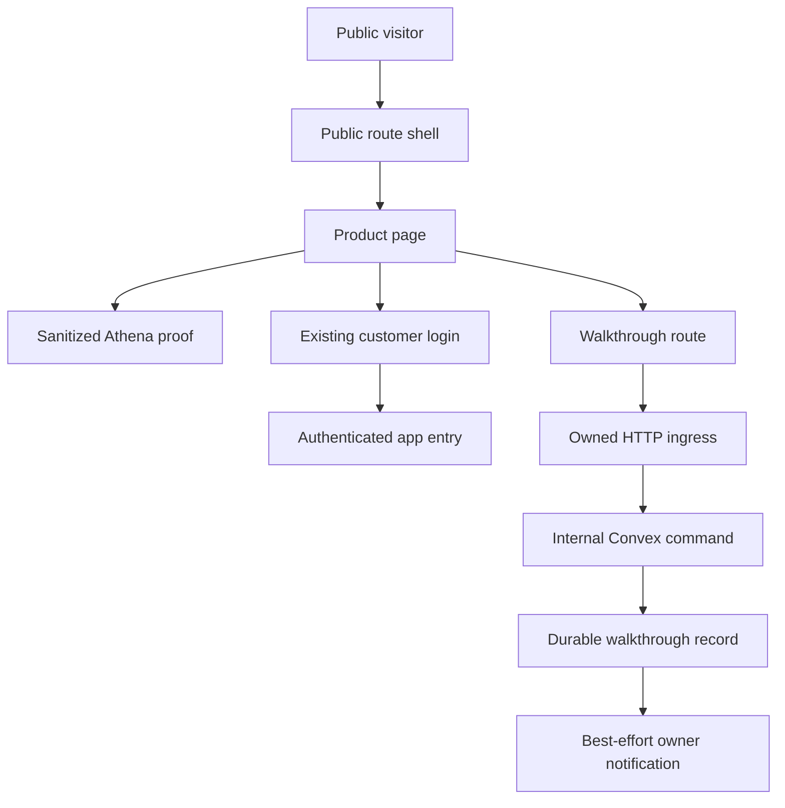
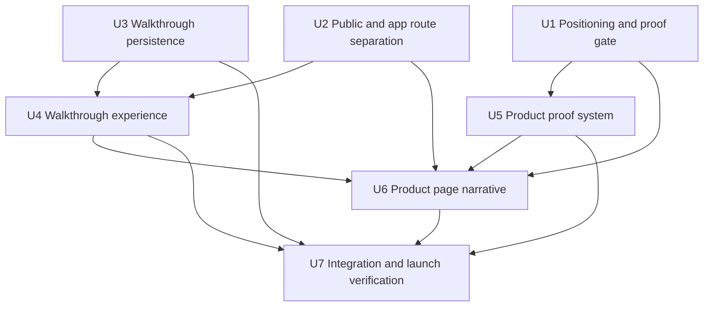
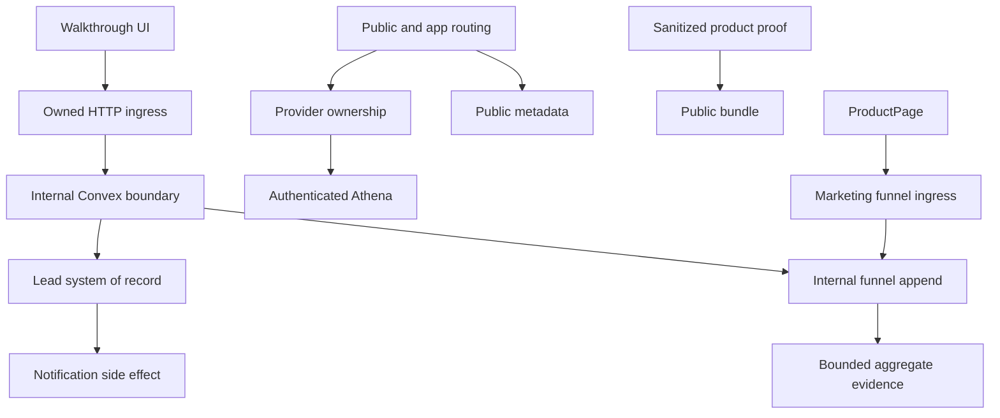

# feat: Build Athena's public product page

## Summary

Replace the isolated landing prototype with a public-first Athena entry, sanitized real-product proof, and a durable walkthrough-request flow. Separate prospect routing from authenticated workspace dispatch, gate final positioning and media against recorded evidence, and verify the complete experience across accessibility, responsive, failure, and browser paths.

---

## Problem Frame

Athena has a visually ambitious `/landing` prototype, but the public root still sends prospects to login, the prototype relies on synthetic product scenes and invented figures, and no prospect conversion backend exists. The implementation must establish a trustworthy acquisition surface without weakening authenticated navigation or exposing protected operational data (see origin: `docs/brainstorms/2026-07-11-athena-landing-product-page-requirements.md`).

---

## Requirements

**Audience and positioning**

- R1. Address owner-led, product-heavy small and medium businesses with small teams.
- R2. Lead with fragmented business memory and slow reconstruction from notebooks, receipts, and recall.
- R3. Present Athena as the operating system connecting in-person and online sales with product, inventory, cash, and operational records.
- R4. Preserve the broader business-operating-system identity without an absolute all-in-one claim.

**Narrative and proof**

- R5. Establish today's sales visibility as the hero promise.
- R6. Use historical context to support the owner's own projections without claiming Athena-generated forecasts.
- R7. Preserve the sequence: today's sales standing, historical comparison, product drivers, current stock pressure, owner-led restocking decision.
- R8. Use a small representative set of connected operating moments to demonstrate breadth.
- R9. Build the hero on a real Athena operating surface with sanitized real or clearly identified illustrative data.
- R10. Show the relationship between sales evidence, product movement, and current stock pressure without implying an automated sales-driven replenishment recommendation.
- R11. Demonstrate breadth through connected outcomes rather than a flat feature catalogue.

**Conversion, trust, and access**

- R12. Provide a bounded “Request a walkthrough” flow with validation, durable acceptance, confirmation, and recoverable failure behavior.
- R13. Keep sign-in available as the secondary existing-customer action.
- R14. Ground claims and media in current Athena capabilities and label illustrative evidence honestly.
- R15. Keep marketing copy memorable but calm, clear, restrained, and credible.
- R16. Preserve narrative meaning across viewport sizes, media failures, keyboard, touch, screen readers, contrast, and reduced motion.
- R17. Require the exact five-person positioning gate and four-person pass threshold before final copy and showcase approval.

**Origin actors:** A1 (prospective owner-operator), A2 (existing Athena customer), A3 (Athena as the connected operating record).

**Origin flows:** F1 (recognize the problem and promise), F2 (follow sales standing into action), F3 (request a walkthrough or sign in).

**Origin acceptance examples:** AE1 (audience, problem, hero, tone), AE2 (connected evidence and owner-led stock decision), AE3 (breadth without a feature grid), AE4 (real hero proof), AE5 (walkthrough and sign-in), AE6 (responsive and accessible parity), AE7 (falsifiable positioning gate).

---

## Scope Boundaries

- Do not expose authenticated reporting, Store Pulse, Daily Operations, procurement, or other protected queries to anonymous visitors.
- Do not add live customer-specific metrics or a dynamic public reporting feed.
- Do not add a third-party CRM, booking platform, or marketing-automation integration in this delivery.
- Do not change reporting semantics, replenishment logic, procurement behavior, or authenticated business workflows.
- Do not add pricing, self-service onboarding, testimonials, customer logos, or unsupported outcome claims.
- Do not turn the landing content into a generic CMS or reusable marketing-page framework.
- Keep provider and shell refactoring limited to the separation required for public routes; unrelated authenticated-shell cleanup is excluded.

### Deferred to Follow-Up Work

- Conversion optimization after launch: capture the minimal privacy-safe funnel at launch, then use the first-week review to decide whether deeper experimentation is warranted.
- CRM or scheduling integration: consider only after the Athena-owned walkthrough record and operational follow-up process are proven.
- Dynamic public product proof: revisit only if Athena establishes a versioned, public-safe snapshot contract with no protected-data dependency.

---

## Context & Research

### Relevant Code and Patterns

- `packages/athena-webapp/src/components/landing/AthenaLandingPage.tsx` is the existing 577-line prototype to replace; it already establishes a dark product-forward composition but uses synthetic workspaces, invented figures, feature cards, and “Open Athena” conversion.
- `packages/athena-webapp/src/components/store-pulse/StorePulseSummaryView.tsx` is the strongest real product-proof foundation. Its typed input, historical windows, trend, top-item, and payment-mix views can be rendered from production-owned sanitized fixtures without anonymous backend access.
- `packages/athena-webapp/src/components/pos/sales-pulse/POSSalesPulseView.test.tsx` demonstrates a sanitized fixture shape for sales, comparison, trend, and product movement.
- `packages/athena-webapp/src/components/procurement/ProcurementView.tsx` and `packages/athena-webapp/convex/stockOps/replenishment.ts` establish the current stock-pressure boundary: inventory, vendor, threshold, and purchase-order context inform an owner decision; sales history does not calculate an automated recommendation.
- `packages/athena-webapp/src/routes/-index-route-view.tsx` currently owns authenticated organization dispatch and redirects signed-out root visitors to login.
- `packages/athena-webapp/src/routes/__root.tsx` currently applies global operational spacing, update presentation, and keyboard shortcuts; public routes need a distinct full-bleed presentation boundary.
- `packages/athena-webapp/src/App.tsx` mounts POS, app-message, update, auth, and query providers for every route. Existing `App.test.tsx` provides characterization coverage for provider composition.
- `packages/athena-webapp/src/components/auth/PosRecoveryCodeForm.tsx` and its tests provide a useful state-machine pattern for bounded form submission, but the walkthrough flow must use its own public-safe contract and copy.
- `packages/athena-webapp/convex/mailersend/index.tsx` demonstrates best-effort server-side email delivery. Durable walkthrough acceptance must occur before notification is attempted.
- `packages/athena-webapp/convex/_generated/ai/guidelines.md` is authoritative for validators, public versus internal Convex functions, schema/index shape, and test placement.

### Institutional Learnings

- `docs/solutions/architecture/athena-store-pulse-daily-operations-reuse-2026-06-22.md`: reuse Store Pulse semantics rather than creating another sales visualization; do not reinterpret “today,” payment mix, or protected detail.
- `docs/solutions/architecture/athena-reporting-fact-projection-boundary-2026-07-09.md`: preserve unknown, partial, stale, and incomplete evidence; do not turn missing proof into false precision.
- `docs/solutions/logic-errors/athena-homepage-snapshot-contract-2026-06-22.md`: if public proof ever becomes dynamic, expose one versioned public-safe contract rather than loosely assembling internal records.
- `docs/solutions/logic-errors/athena-mobile-cart-and-pending-timeline-2026-06-08.md`: mobile should reorder and stage important evidence rather than compressing a desktop rail.
- `docs/solutions/logic-errors/athena-webapp-dark-mode-token-compatibility-2026-06-13.md` and `docs/solutions/logic-errors/athena-webapp-strong-neutral-action-tokens-2026-06-17.md`: use semantic color/action roles and preserve foreground contrast.
- `docs/product-copy-tone.md`: not a marketing guide, but still authoritative for calm product captions, normalized terminology, and useful recovery states.

### External References

- None required. The repository contains direct patterns for the page, forms, backend persistence, email notification, motion, accessibility, and tests; local product truth is more authoritative than generic landing-page guidance.

---

## Key Technical Decisions

- **Make `/` public and `/app` operational:** `/` becomes the canonical prospect page; `/app` owns the existing authenticated organization dispatcher; `/landing` redirects to `/`. This prevents public acquisition from depending on auth resolution and gives post-login navigation an explicit destination.
- **Separate public and operational presentation without rearchitecting runtime ownership:** keep existing process-root providers stable for this delivery; make route/layout ownership suppress operational banners, shortcuts, and spacing on public routes. Revisit provider extraction only if characterization proves a measurable public blocker.
- **Use real product components with public-safe fixtures:** render Store Pulse-derived proof from production-owned sanitized data and audited static fallbacks. Do not call protected store queries from public routes.
- **Treat evidence transitions as a gate:** the proof audit must validate both each stage and the claimed link between stages. If the product cannot visibly support a transition, narrow the copy and composition before building around it.
- **Put anonymous submission behind Athena's HTTP ingress:** accept only allowlisted origins and JSON under a pre-parse size limit, then invoke an internal Convex mutation. The browser never calls a public lead mutation directly.
- **Keep walkthrough acceptance durable and notification secondary:** store the request first in Convex, return success from durable acceptance, and schedule notification to a dedicated accountable recipient. Notification failure remains observable and operable without asking the prospect to resubmit.
- **Make anonymous retries idempotent and non-enumerating:** a high-entropy client submission key and canonical payload digest survive ambiguous retries. Same-key/same-payload and equivalent same-email submissions return accepted; key reuse with a different payload creates no side effect and returns a generic retry response; materially changed same-email submissions are retained as linked follow-ups rather than discarded.
- **Treat low-friction spam controls as a bounded first line:** strict field limits, origin/content checks, a honeypot, per-email ceilings, global persistence and notification budgets, monitoring, and an emergency disable path bound cost and volume. They are not described as distributed-bot prevention; repeated budget pressure is the explicit trigger to add Turnstile or another owned challenge later.
- **Give lead PII a minimal lifecycle and owner:** raw lead data is internal-only, excluded from URLs/analytics/logs, redacted on an explicit retention schedule, and handled through a verified request-deletion path. The launch workflow is open → resolved or abandoned, supported through restricted Convex dashboard/CLI commands and a runbook rather than a new admin UI or tenant role.
- **Use a dedicated route-backed walkthrough flow:** `/walkthrough` supports direct links, browser history, focus management, durable confirmation, and recoverable retries more predictably than an unaddressable modal.
- **Keep content purpose-built:** use a small typed landing content/proof model local to the landing domain, not a general CMS or marketing framework.

---

## Open Questions

### Resolved During Planning

- **Where do public and authenticated visitors enter?** `/` is public, `/app` is the authenticated dispatcher, `/landing` redirects to `/`, and `/login` remains the secondary sign-in route.
- **What is the walkthrough system of record?** A dedicated Athena-owned Convex record is authoritative; an owned HTTP ingress validates anonymous traffic before an internal mutation, and email notification is a follow-up side effect.
- **What information is required?** Name, work email, business name, and a short business-needs field are required; phone is optional. All fields are bounded and normalized server-side.
- **How do duplicates and ambiguous retries behave?** Retry the same high-entropy client submission key with the same canonical payload. Exact/equivalent duplicates return accepted; key reuse with different content has no side effect; materially changed same-email requests persist as linked follow-ups even when notification is coalesced.
- **How is walkthrough PII retained?** An open request is atomically marked abandoned and redacted after 180 days without activity. Manually resolved or abandoned requests are redacted 180 days after their terminal transition; terminal notification-attempt diagnostics are removed after 30 days. A 365-day tombstone retains only the submission key and a versioned server-keyed HMAC over the minimum dedupe fields. Verified deletion requests redact PII promptly while preserving only minimum audit and replay-prevention evidence.
- **How are leads operated initially?** One accountable product/sales owner uses restricted internal Convex dashboard/CLI queries and commands to list open requests, resolve or abandon them, inspect notification state, deliberately retry eligible attempts, resolve ambiguous outcomes, and process verified redaction. No public, tenant `full_admin`, or general staff lead-read surface is added.
- **What product data appears publicly?** Production-owned sanitized fixtures and audited static assets derived from current Athena surfaces; never anonymous reads of protected operational data.
- **How does positioning validation gate work?** Exactly five eligible participants answer the same unaided prompts; the product owner approves only when at least four explain the problem, Athena's role, and the connected-record difference correctly.

### Deferred to Implementation

- **Which five owner-operators participate?** Recruitment is an external coordination step; implementation records eligibility and responses but does not invent participants.
- **Which exact screenshots or crops survive the proof audit?** Select during U1 after verifying visible identifiers, amounts, URLs, account context, and the sales-to-stock narrative transitions.
- **Who is the production walkthrough recipient and operational owner?** Configure one accountable recipient and one accountable product/sales owner before deployment; do not hard-code personal addresses into the client or expose them in the response.

---

## High-Level Technical Design

> *This illustrates the intended approach and is directional guidance for review, not implementation specification. The implementing agent should treat it as context, not code to reproduce.*

The public product page must remain useful when `SanitizedProof` cannot load. The walkthrough success state reflects `DurableLead`, not `Notification`; internal diagnostics and lifecycle commands never become public lead-read APIs.

---

## Implementation Units

The prose dependency fields below are authoritative if this diagram and the unit details ever diverge.

- U1. **Complete positioning validation and the product-proof audit**

**Goal:** Establish the evidence gate that approves or redirects the lead message and maps every narrative stage and transition to truthful, publishable Athena proof.

**Requirements:** R2, R5, R7, R9, R10, R14, R17; F1, F2; AE2, AE4, AE7.

**Dependencies:** External access to exactly five eligible owner-operators and product-owner review.

**Files:**
- Create: `docs/reports/athena-landing-positioning-validation.md`
- Create: `docs/reports/athena-landing-product-proof-audit.md`
- Create: `docs/reports/athena-landing-product-proof-manifest.md`
- Create: `docs/reports/athena-landing-launch-review.md`
- Reference: `outputs/019e1a72-462a-79d1-b3b8-06a6ac03e26a/presentations/athena-pitch/assets/`

**Approach:**
- Before recruitment, freeze participant eligibility, a deliberate mix across the target audience, identical prompt order, pass/fail examples for all three outcomes, and the scoring rubric. Record verbatim answers and score every completed eligible session against that pre-registered rubric before the product-owner decision.
- Treat a completed failing participant as evidence; replace only ineligible, no-show, or technically invalid sessions before scoring.
- Map sales standing, historical comparison, product drivers, current stock pressure, and owner-led action to current product surfaces.
- Select and evidence exactly two supporting breadth moments: one cross-channel record connection joining in-person and online activity, and one small-team control moment grounded in staff accountability, approval, cash control, or Daily Close. Show how both feed the same owner-visible operating record without becoming a module grid.
- State explicitly that historical comparison is Athena-recorded history accumulated through use, not automatic reconstruction of notebooks or physical receipts; preserve today's-sales value for a new adopter while showing how the record compounds over time.
- Audit each proposed media source for visible names, emails, URLs, amounts, organization identifiers, implied product claims, embedded external URLs, and EXIF/XMP/profile metadata. Newly export public assets under generic filenames and scan the Open Graph image independently.
- Narrow or reopen the landing narrative before U5/U6 when fewer than four participants pass or a stage/transition lacks credible evidence.
- Record each approved public claim/asset, source surface and revision, audit date, accountable owner, and next review date in a versioned proof manifest. Re-audit when referenced Store Pulse/reporting/procurement semantics change and at least every six months.
- Treat the five-person result as a comprehension gate, not evidence of market demand; post-launch qualified funnel and owner follow-up determine whether the positioning persuades.
- Before launch, pre-register the launch-review rubric: minimum usable non-bot visit and accepted-request sample, stage-by-stage rates, incident intervals excluded from interpretation, owner follow-up latency, qualification outcomes, and supporting qualitative lead feedback. Positioning may be retained/revised/narrowed only when message-stage evidence and qualitative feedback agree; otherwise record the result as inconclusive.

**Patterns to follow:**
- Origin AE7 for the decision gate.
- `docs/solutions/architecture/athena-reporting-fact-projection-boundary-2026-07-09.md` for evidence completeness and uncertainty.

**Test scenarios:**
- Test expectation: none — this unit produces human-reviewed research and evidence artifacts rather than runtime behavior.

**Verification:**
- Exactly five valid participant records exist with verbatim responses and rubric outcomes.
- The approval result is mechanically derivable from the recorded four-of-five threshold.
- Every retained narrative stage and transition has a named, reviewable, public-safe proof source.
- The manifest contains one cross-channel connection and one small-team operational-control moment beyond the sales-to-stock spine.
- The frozen rubric predates participant answers, and every completed eligible response remains in the report.
- Every approved claim/asset has a current manifest owner and revalidation trigger.

- U2. **Separate public entry from authenticated app entry**

**Goal:** Make `/` the canonical public product page while preserving authenticated dispatch at `/app`, sign-in at `/login`, legacy `/landing` links, deep-link handoffs, and operational runtime behavior.

**Requirements:** R5, R13, R16; F1, F3; AE1, AE5, AE6.

**Dependencies:** None; may proceed in parallel with U1 and U3.

**Files:**
- Create: `packages/athena-webapp/src/lib/navigation/appEntryRoutes.ts`
- Create: `packages/athena-webapp/src/routes/app.tsx`
- Create: `packages/athena-webapp/src/routes/app.test.tsx`
- Create: `packages/athena-webapp/src/routes/-public-layout.tsx`
- Modify: `packages/athena-webapp/src/routes/index.tsx`
- Modify: `packages/athena-webapp/src/routes/-index-route-view.tsx`
- Modify: `packages/athena-webapp/src/routes/index.test.tsx`
- Modify: `packages/athena-webapp/src/routes/landing.tsx`
- Create: `packages/athena-webapp/src/routes/landing.test.tsx`
- Modify: `packages/athena-webapp/src/routes/__root.tsx`
- Modify: `packages/athena-webapp/src/routes/_authed.tsx`
- Modify: `packages/athena-webapp/src/routes/-authed-layout.tsx`
- Modify: `packages/athena-webapp/src/routes/login/-login-layout.tsx`
- Modify: `packages/athena-webapp/src/routes/login/_layout.test.tsx`
- Reference: `packages/athena-webapp/src/App.tsx`
- Modify: `packages/athena-webapp/src/App.test.tsx` only to characterize that existing process-root providers remain singleton and do not block public rendering.
- Modify: `packages/athena-webapp/src/components/Navbar.tsx`
- Modify: `packages/athena-webapp/src/components/auth/DefaultCatchBoundary.tsx`
- Modify: `packages/athena-webapp/src/components/states/not-found/NotFound.tsx`
- Modify: `packages/athena-webapp/src/components/join-team/index.tsx`
- Test: relevant existing tests for Navbar, catch/not-found recovery, and join-team navigation; create focused tests beside a component when no current file covers its changed destination.
- Generated: `packages/athena-webapp/src/routeTree.gen.ts`

**Approach:**
- Move the current first-organization dispatcher behind `/app`; preserve its loading and organization-selection behavior.
- Route ordinary successful login and authenticated “home” destinations to `/app`; preserve explicit `redirectTo` deep links unchanged.
- Inventory every hard-coded root destination and classify it as public home or operational entry. Navbar home, post-join navigation, authenticated catch recovery, and authenticated not-found recovery must not strand operators on marketing.
- Redirect `/landing` to `/` so old links remain valid without maintaining two canonical product pages.
- Make the root route structurally neutral. Public and authenticated layouts own spacing, banners, shortcuts, and other presentation; all existing runtime providers remain process-root in this delivery.
- Keep the existing process-root Convex, POS storage, app-message, update coordinator, and version-checker providers unchanged unless characterization proves one prevents or visibly contaminates public rendering. Limit this delivery to route/layout presentation: public routes suppress operational banners and shortcuts; authenticated routes retain them.
- Retain the shared root search validator as a compatibility seam in this delivery. Characterize representative operational query/search parameters and defer migration to authenticated layouts until all non-strict consumers are mapped.
- Keep the public hero and navigation render independent of authenticated organization queries.
- Use a non-collapsing launch header with the Athena wordmark linked to `/`, primary “Request a walkthrough,” and visually secondary “Sign in.” Omit section links, hamburger navigation, and other public destinations until they exist.

**Execution note:** Add characterization coverage for current root dispatch, login default navigation, provider composition, and POS deep-link handoff before changing route/layout presentation ownership.

**Patterns to follow:**
- `packages/athena-webapp/src/routes/_authed.tsx` for pathless layout ownership.
- `packages/athena-webapp/src/routes/login/-login-layout.tsx` for a purpose-built full-screen public layout.
- `packages/athena-webapp/src/App.test.tsx` for provider composition characterization.

**Test scenarios:**
- Covers F1 / AE1. Signed-out navigation to `/` renders the product page without redirecting to login or waiting for an organization query.
- Covers F3 / AE5. Ordinary successful login navigates to `/app`; an explicit POS or other `redirectTo` still wins.
- Authenticated navigation to `/app` preserves the current first-organization dispatch and empty-organization behavior.
- Navigation to `/landing` redirects to `/` without a second page render or redirect loop.
- Public routes do not render operational update banners or activate navigation shortcuts, and their hero/content do not wait for operational provider state.
- Existing process-root providers remain singleton; authenticated `/app` and sibling routes retain update presentation, shortcuts, and POS behavior without provider relocation.
- Authenticated Navbar home, post-join navigation, catch recovery, and not-found recovery target `/app`; public wordmarks and marketing recovery target `/`.
- Representative operational search parameters and deep links retain their current validation/parsing behavior.
- Route metadata for `/` identifies Athena as the public product page; authenticated and login routes retain appropriate titles.
- Desktop and mobile render the same three-item public navigation hierarchy without a collapsed menu or competing action.

**Verification:**
- `/`, `/app`, `/login`, `/landing`, and explicit deep links have one unambiguous responsibility each.
- Existing authenticated and POS flows retain their current process-root runtime providers, coordinator state, search parsing, and post-login behavior.
- Public rendering has no organization-query or operational-shell dependency.

- U3. **Add durable, abuse-aware walkthrough persistence and notification**

**Goal:** Create the anonymous write boundary that durably accepts a walkthrough request, handles retries and duplicates safely, and notifies one accountable recipient without coupling prospect success to email delivery.

**Requirements:** R12, R14; F3; AE5.

**Dependencies:** A configured accountable recipient is required before deployment, not before local implementation.

**Files:**
- Create: `packages/athena-webapp/convex/schemas/marketing/walkthroughRequest.ts`
- Create: `packages/athena-webapp/convex/marketing/walkthroughRequests.ts`
- Create: `packages/athena-webapp/convex/marketing/walkthroughRequestNotifications.ts`
- Create: `packages/athena-webapp/convex/marketing/walkthroughRequestRetention.ts`
- Create: `packages/athena-webapp/convex/schemas/marketing/landingFunnelEvent.ts`
- Create: `packages/athena-webapp/convex/marketing/landingFunnelEvents.ts`
- Create: `packages/athena-webapp/convex/marketing/landingFunnelEvents.test.ts`
- Create: `packages/athena-webapp/convex/marketing/landingFunnelRetention.ts`
- Create: `packages/athena-webapp/convex/marketing/landingFunnelRetention.test.ts`
- Create: `packages/athena-webapp/convex/marketing/walkthroughRequests.test.ts`
- Create: `packages/athena-webapp/convex/marketing/walkthroughRequestNotifications.test.ts`
- Create: `packages/athena-webapp/convex/marketing/walkthroughRequestRetention.test.ts`
- Create: `packages/athena-webapp/convex/http/domains/core/routes/walkthroughRequests.ts`
- Create: `packages/athena-webapp/convex/http/domains/core/routes/walkthroughRequests.test.ts`
- Create: `packages/athena-webapp/convex/http/domains/core/routes/landingFunnelEvents.ts`
- Create: `packages/athena-webapp/convex/http/domains/core/routes/landingFunnelEvents.test.ts`
- Modify: `packages/athena-webapp/convex/http/domains/core/routes/index.ts`
- Modify: `packages/athena-webapp/convex/http.ts`
- Create: `packages/athena-webapp/convex/emails/WalkthroughRequestNotification.tsx`
- Create: `docs/operations/walkthrough-request-operations.md`
- Create: `docs/reports/athena-walkthrough-abuse-budget.md`
- Modify: `packages/athena-webapp/convex/schema.ts`
- Modify: `packages/athena-webapp/convex/crons.ts`
- Modify: `packages/athena-webapp/convex/crons.test.ts`
- Create: `packages/athena-webapp/convex/convex.config.ts` with typed server-only ingress, recipient, budget, emergency-disable, and versioned tombstone-HMAC key-ring configuration.
- Generated: `packages/athena-webapp/convex/_generated/api.d.ts`
- Generated: `packages/athena-webapp/convex/_generated/dataModel.d.ts`

**Approach:**
- Accept POST JSON through Athena's Hono/Convex HTTP boundary. Enforce the exact production, QA, and local origin allowlist, content type, pre-parse body-size ceiling, and generic public error envelope before invoking an internal mutation.
- Export and mount the walkthrough route in the top-level HTTP composition and assert the deployed public path is registered.
- Define explicit validators for required fields, optional phone, a bounded high-entropy submission key, and hidden bot field. Normalize whitespace/email, strip control characters, treat business-needs text as untrusted, and keep raw values out of URLs, analytics, logs, exception text, and notification subjects.
- Store a canonical payload digest beside the submission key. Same key plus same digest returns accepted; same key plus a different digest creates no record or notification and returns a generic retry response that does not describe the mismatch.
- In one transaction, read the indexed key/digest state, apply duplicate policy, insert a request or linked follow-up whose submitted content is never silently overwritten or merged, create the initial notification attempt, and schedule work only for the branch that inserted. Explicit lifecycle/notification transitions and retention or verified-deletion redaction remain permitted.
- Dedupe only equivalent canonical payloads. A materially changed request from the same normalized email is retained as a linked follow-up whose submitted content remains preserved even during duplicate suppression; its notification may be coalesced, but its accepted content is never discarded.
- Before launch, record expected normal and campaign-peak traffic, provider limits, cost ceiling, acceptable rejection risk, and headroom in the abuse-budget report. Derive configurable per-email, global persistence, and notification-send ceilings from that record, load-test the selected peak plus headroom, and schedule a threshold review after the first week of traffic. Honeypot submissions return generic accepted without persistence; per-email exhaustion returns the same non-enumerating accepted result for equivalent content and generic recoverable unavailable for changed content; global persistence exhaustion returns generic recoverable unavailable; notification exhaustion queues accepted records without changing success.
- Add observable budget counters and a server-owned emergency notification/ingress disable path. Repeated global-budget exhaustion is the launch signal to plan Turnstile or equivalent bot challenge; the plan does not claim the initial controls stop distributed automation.
- Model notification attempts durably with pending, in-flight/leased, sent, retryable failure, terminal failure, and outcome-unknown states; include bounded attempts, next/last attempt time, sanitized error code, and provider identifier when available.
- Use capped backoff and stale-lease recovery. When provider timeout leaves delivery ambiguous, record outcome unknown and require authorized review rather than automatically sending another potentially duplicate email. Use provider idempotency when the provider supports it.
- Expose named bounded internal-only queries/commands through the restricted Convex deployment dashboard/CLI to list open requests, resolve them with a bounded `qualified`, `not_qualified`, or `unknown` outcome, abandon them, inspect attempts, deliberately retry eligible failures, resolve outcome-unknown attempts, and redact verified subjects. Enumerate each invocation in the runbook; tenant `full_admin` is not platform-support authority.
- Send MailerSend only request id, name, work email, business name, optional phone, and sanitized bounded business-needs text. Forbid digests, submission keys, audit/budget data, internal metadata, and raw provider response bodies; disclose transactional email-provider processing in the privacy notice. Persist first; never return recipient, prior-lead, budget, or internal-delivery detail to the browser.
- Atomically transition an inactive open request to abandoned and redact its PII at 180 days since last activity; redact manually resolved or abandoned PII 180 days after the terminal transition and delete terminal attempt diagnostics after 30 days. Retain the submission key plus a versioned server-keyed HMAC over minimum dedupe fields for 365 days; never retain a plain digest of predictable lead fields as “non-PII.”
- Configure distinct QA and production HMAC key rings with one active version and prior verification versions retained until every tombstone they signed expires. Store the key version on each tombstone; keep key material server-only and out of logs; fail launch or cleanup observably when the active key is absent. Register indexed bounded cleanup in Convex cron and cover repeated batch continuation.
- Handle export/redaction through a manual proof-of-control protocol: the subject contacts the published privacy address, the restricted operator sends a one-time challenge to the email already stored, and action requires a matching reply from that address within 24 hours. If the stored address is unavailable, do not act through this path; escalate to a separately approved identity review. Retain only request id, verification time, restricted operator reference, and outcome after redaction.
- Append a non-PII operations audit for restricted lifecycle changes, deliberate retries, ambiguity resolution, export, and redaction, including request id, required operator reference, action, prior/resulting state, timestamp, and bounded reason code. The runbook must correlate the asserted operator reference with restricted Convex deployment-access audit records; do not misrepresent it as tenant authentication.
- Add a dedicated global marketing-funnel ingress and internal append helper independent of store/organization context. The new-request and linked-follow-up branches append one durable-acceptance milestone in the same Convex transaction as the walkthrough record; exact/equivalent duplicates append nothing.
- The public funnel HTTP ingress accepts only page view, walkthrough CTA selection, and form start plus coarse non-identifying context. Only the internal append helper accepts durable acceptance from the new-request or linked-follow-up transaction. Keep raw events for 30 days, retain daily aggregate count buckets for 395 days, and register bounded cleanup through the same cron lifecycle; no raw event or aggregate stores a stable person identifier.

**Execution note:** Implement the persistence contract test-first, including ambiguous retry and duplicate branches, before connecting notification.

**Patterns to follow:**
- `packages/athena-webapp/convex/_generated/ai/guidelines.md` for validators, schema indexes, public/internal function separation, and Convex tests.
- `packages/athena-webapp/convex/operations/dailyManagerReportEmail.ts` and `packages/athena-webapp/convex/mailersend/index.tsx` for best-effort internal email delivery and testable fetch behavior.
- Existing idempotency indexes in `packages/athena-webapp/convex/schema.ts` for server-owned duplicate policy.

**Test scenarios:**
- Covers F3 / AE5. A valid first request creates one durable record and schedules one notification attempt.
- Retrying the same payload with the same submission key returns accepted without creating or notifying twice.
- Concurrent identical requests with the same key serialize to one durable request and one scheduled notification attempt.
- Reusing a key with a different canonical payload creates no side effect and returns only generic retry guidance.
- A rapid equivalent repeat with a different key but the same normalized email returns the non-enumerating accepted outcome without another request.
- A materially changed same-email request persists as a linked follow-up even within duplicate suppression; accepted changed content is never lost or silently overwritten.
- Empty, malformed, or oversized required fields are rejected without persistence or notification.
- A disallowed origin, wrong content type, or oversized HTTP body is rejected before parsing or internal mutation.
- The top-level HTTP router registers the intended walkthrough path and no alternate public mutation bypass exists.
- A populated honeypot returns the generic accepted response without persistence or notification.
- Per-email, global persistence, and notification budgets derived from the approved budget report follow their distinct public outcomes; notification throttling never reverses durable acceptance.
- Notification delivery failure moves through the bounded retry/lease state machine while the accepted lead remains durable.
- Provider timeout records outcome unknown and does not auto-retry blindly; authorized resolution can mark sent or initiate a deliberate retry.
- Concurrent automatic/manual retries produce one active attempt and do not multiply notification work.
- Missing recipient configuration prevents notification delivery visibly in backend diagnostics but does not delete or duplicate the request.
- Restricted internal lifecycle commands can list open, resolve with a bounded qualification outcome, abandon, discover aged/failed requests, retry eligible notification failures, resolve ambiguity, and redact verified subjects without any public or tenant-admin read surface; privileged actions append non-PII audit evidence.
- Cleanup atomically abandons and redacts inactive open work at day 180, redacts manually terminal PII on schedule, removes aged attempt diagnostics, and retains only submission key plus versioned server-keyed HMAC until tombstone expiry.
- Export/redaction requires the 24-hour stored-email challenge/reply proof; unavailable-email cases do not silently bypass identity review.
- HMAC rotation preserves verification for every unexpired tombstone and never logs secret material.
- MailerSend receives only the allowed lead fields; business-needs markup is escaped and no internal metadata or raw provider body enters email or diagnostics.
- Cron registration and repeated bounded cleanup batches eventually process all eligible rows without scanning active data unboundedly.
- Each new walkthrough or linked follow-up creates exactly one transactional durable-acceptance milestone; exact/equivalent retries create none.
- Raw funnel events expire after 30 days, daily aggregate buckets expire after 395 days, and repeated cleanup batches remain bounded.
- Business-needs markup, URLs, and control characters cannot become active email content, response content, or raw diagnostic text.

**Verification:**
- HTTP route registration, ingress validation, durable acceptance, preserved submission content, duplicate handling, minimal internal operations, PII cleanup, and notification state can be proven independently.
- The anonymous response reveals no prior-request, recipient, or internal-delivery details.
- All public ingress is owned and bounded; persistence/read/retry/lifecycle functions are internal-only; all collection reads and cleanup scans are indexed and bounded.

- U4. **Build the route-backed walkthrough experience**

**Goal:** Give prospects a bounded, accessible `/walkthrough` form with durable confirmation, preserved values on recoverable failure, and safe idempotent retry.

**Requirements:** R12, R13, R15, R16; F3; AE5, AE6.

**Dependencies:** U2, U3.

**Files:**
- Create: `packages/athena-webapp/src/components/landing/WalkthroughRequestForm.tsx`
- Create: `packages/athena-webapp/src/components/landing/WalkthroughRequestForm.test.tsx`
- Create: `packages/athena-webapp/src/routes/walkthrough.tsx`
- Create: `packages/athena-webapp/src/routes/walkthrough.test.tsx`
- Create: `packages/athena-webapp/src/routes/privacy.tsx`
- Create: `packages/athena-webapp/src/routes/privacy.test.tsx`
- Create: `packages/athena-webapp/src/lib/marketing/walkthroughRequestClient.ts`
- Create: `packages/athena-webapp/src/lib/marketing/walkthroughRequestClient.test.ts`

**Approach:**
- Use native labels, field descriptions, inline validation, and a persistent status region; focus the first invalid field after failed validation.
- Generate one submission key for one canonical payload. Reuse it only while that payload remains unchanged across timeout or retry; rotate immediately whenever a previously attempted payload changes, regardless of whether the earlier outcome was definitive or ambiguous.
- Send submissions only to the owned walkthrough HTTP ingress. Do not place lead fields in query strings, analytics events, local/session storage, or client logs.
- Disable repeated submission while pending and expose busy state without making progress announcements motion-dependent.
- Replace the form with durable confirmation only after the server returns accepted. Render a “Request received” heading, one restrained next-step sentence without an uncommitted response-time promise, a primary “Back to Athena overview” link to `/`, and secondary “Sign in” to `/login`; remove the form and immediate resubmission action.
- Preserve values across recoverable network/server failures, payload-conflict responses, and budget-unavailable responses; clear them only after confirmed acceptance.
- Include concise purpose/retention disclosure and an owner-approved privacy notice link before submit. The notice describes collected fields, use, retention/redaction, recipient access, and deletion/export contact without promising a broader legal regime Athena has not adopted.
- Keep sign-in visually secondary and return navigation to the public product page predictable.

**Patterns to follow:**
- `packages/athena-webapp/src/components/auth/PosRecoveryCodeForm.tsx` for explicit submit/error/success states.
- Existing browser-safe command presentation patterns under `packages/athena-webapp/src/lib/errors/`, adapted to the owned HTTP response contract rather than routed through a Convex mutation helper.
- `docs/product-copy-tone.md` for calm validation and recovery language.

**Test scenarios:**
- Covers F3 / AE5. Valid required fields submit once and produce durable confirmation plus secondary sign-in.
- Missing or invalid fields render inline guidance and move focus to the first invalid field.
- Repeated clicks while pending produce one HTTP client submission and one submission key.
- A timeout or recoverable failure retains every entered value and retries with the same key.
- Changing a previously attempted payload creates a new key even after timeout or another ambiguous outcome; an unchanged payload reuses the original key.
- An equivalent duplicate renders the same confirmation as a new request without revealing prior lead state.
- Materially changed same-email content receives durable acceptance as a linked follow-up; generic unavailable responses retain values and do not claim acceptance.
- Lead fields never appear in the URL, browser storage, analytics, or client diagnostic output.
- Privacy disclosure and notice are reachable before submit and remain readable without rich media or JavaScript motion.
- Covers AE6. Keyboard order, status announcements, touch target sizing, contrast tokens, and reduced-motion behavior preserve the full form path.

**Verification:**
- Every form state is durable, keyboard reachable, screen-reader understandable, and covered by a focused test.
- An ambiguous network outcome cannot create multiple browser-generated lead identities.

- U5. **Create the sanitized product-proof system**

**Goal:** Turn real Athena surfaces into a public-safe, responsive proof sequence with an immediate static fallback and no protected-data dependency.

**Requirements:** R3, R5, R6, R7, R9, R10, R14, R16; F1, F2; AE2, AE4, AE6.

**Dependencies:** U1.

**Files:**
- Create: `packages/athena-webapp/src/components/landing/landingProductProofData.ts`
- Create: `packages/athena-webapp/src/components/landing/LandingProductProof.tsx`
- Create: `packages/athena-webapp/src/components/landing/LandingProductProof.test.tsx`
- Create: `packages/athena-webapp/src/assets/landing/` audited image assets selected by U1
- Reference: `packages/athena-webapp/src/components/store-pulse/StorePulseSummaryView.tsx`
- Reference: `packages/athena-webapp/src/components/procurement/ProcurementView.tsx`

**Approach:**
- Build production-owned sanitized fixtures that preserve Store Pulse semantics for sales standing, comparison, trend, and top products.
- Use audited crops or purpose-built sanitized product states for stock pressure; do not embed operationally coupled procurement queries or mutations.
- Present the launch proof as ordered stacked stages on small screens and one non-interactive connected composition on larger screens.
- Eagerly render a fixed-dimension static hero poster and semantic description. Decorative motion may reveal no additional meaning; exclude tabs, carousels, autoplay, and interaction-dependent disclosure. Retain the poster on load failure and reduced-motion paths.
- Label illustrative data in a way that preserves credibility without overwhelming the primary story.
- Remove interaction affordances from non-interactive product chrome; tabs or controls must either change the proof accessibly or render as non-interactive labels.
- Export public assets without EXIF/XMP/profile metadata, use generic filenames, and prohibit embedded external URLs or references back to the source pitch artifact tree.
- Link every proof datum/asset to the U1 versioned proof manifest and its owner/review date so semantic changes or the six-month review trigger re-audit.

**Patterns to follow:**
- `packages/athena-webapp/src/components/store-pulse/StorePulseSummaryView.tsx` for real product semantics.
- `packages/athena-webapp/src/components/homepage/HomepagePlacementProductImage.tsx` for explicit image failure handling.
- `docs/solutions/logic-errors/athena-mobile-cart-and-pending-timeline-2026-06-08.md` for mobile-first evidence ordering.

**Test scenarios:**
- Covers AE2. The proof orders sales standing, history, product drivers, stock pressure, and owner action without claiming automated replenishment.
- Covers AE4. The hero foundation is a real Athena surface with sanitized fixture data; any synthetic secondary composition is labeled.
- No product-proof component calls Convex or imports protected query references.
- A failed rich-media load retains reserved space, static proof, semantic description, and both conversion actions.
- Covers AE6. Small screens receive legible staged details rather than a scaled full dashboard.
- Reduced motion removes parallax, scroll transforms, and motion-dependent disclosure while preserving sequence and meaning.
- Non-interactive product chrome exposes no misleading buttons, tabs, or keyboard stops.
- Desktop proof is one non-interactive connected composition; mobile proof is ordered stacked evidence; decorative motion never changes accessible meaning.

**Verification:**
- Every visible datum and screenshot passes the U1 public-safety audit.
- Final built assets and the separate Open Graph image pass metadata and forbidden-string scans.
- The proof manifest is current and records a next review date no more than six months after launch.
- The proof remains legible and complete without network-loaded media or motion.
- The public bundle has no authenticated operational-query dependency for the showcase.

- U6. **Compose the prospect-first product page**

**Goal:** Rewrite the landing page around the approved business-memory narrative, integrate real product proof and walkthrough conversion, and demonstrate a restrained set of broader Athena strengths.

**Requirements:** R1-R16; F1-F3; AE1-AE6.

**Dependencies:** U1, U2, U4, U5.

**Files:**
- Modify: `packages/athena-webapp/src/components/landing/AthenaLandingPage.tsx`
- Create: `packages/athena-webapp/src/components/landing/AthenaLandingPage.test.tsx`
- Create: `packages/athena-webapp/src/components/landing/landingContent.ts`
- Modify: `packages/athena-webapp/src/routes/index.tsx`
- Modify: `packages/athena-webapp/src/routes/landing.tsx`
- Modify: `packages/athena-webapp/src/routes/walkthrough.tsx`
- Modify: `packages/athena-webapp/index.html`
- Create: `packages/athena-webapp/src/lib/marketing/landingFunnelClient.ts`
- Create: `packages/athena-webapp/src/lib/marketing/landingFunnelClient.test.ts`

**Approach:**
- Structure the page as problem and promise, real product proof, sales-to-stock narrative, a small set of connected operating moments, trust boundary, and closing conversion.
- Define the trust boundary as a short note adjacent to product proof: showcased data is sanitized or illustrative, and the public page does not load a business's protected operating records. Do not add generic compliance badges or unverified security assurances.
- Keep “Request a walkthrough” primary and sign-in secondary in the hero and closing conversion without duplicating competing actions in every section.
- Reuse Athena semantic tokens, display/numeric type roles, dark structural shell, quiet surfaces, and restrained motion; avoid decorative card grids and generic SaaS visual motifs.
- Carry only copy approved by U1. Keep product captions operational and specific; avoid forecasting, profit, automation, and all-in-one overclaims.
- Put crawler-visible product-page title, description, fixed-production-origin canonical, and audited Open Graph tags in the static HTML response; keep client route titles for browser navigation. `/landing` redirects and canonicalizes to `/`; `/walkthrough` receives a product-specific server `noindex` header and never reflects form values.
- Use U3's dedicated global marketing-funnel HTTP ingress for browser-side page view, walkthrough CTA selection, and form start. Forbid form payloads, email, phone, business text, submission key, or another stable person identifier. Durable acceptance is appended server-side in the walkthrough transaction; document event meanings so aggregate review reconciles with stored requests.
- Lazy-load below-fold media while preserving document order and semantic text equivalents.

**Patterns to follow:**
- `packages/athena-webapp/docs/agent/design.md` for Athena's calm, warm, durable visual system.
- `packages/athena-webapp/src/stories/Foundations/foundations-content.tsx` and `packages/athena-webapp/src/stories/Patterns/admin-shell-patterns.tsx` for type, surface, and action hierarchy.
- `packages/athena-webapp/src/components/common/PageLevelHeader.tsx` for restrained orientation language, adapted for marketing rather than copied as an operational page header.

**Test scenarios:**
- Covers AE1. The opening identifies the target owner, fragmented-memory problem, today's-sales promise, and calm marketing voice before broad capabilities.
- Covers AE2. The main narrative preserves the approved sequence and owner decision boundary.
- Covers AE3. Supporting breadth uses exactly one evidenced cross-channel record connection and one evidenced small-team operational-control moment, each feeding the same owner-visible record rather than a module grid.
- Covers AE4. The opening proof and metadata image reference only audited product evidence.
- Covers AE5. Hero and closing sections route prospects to `/walkthrough` and customers to `/login` with correct priority.
- Covers AE6. Heading order, landmark structure, focus visibility, mobile sequence, contrast, and reduced-motion rendering remain equivalent.
- Copy assertions exclude accounting-grade profit, Athena-generated forecasts, automated restocking, unsupported time savings, and unsupported growth claims.
- Historical copy states that Athena's record compounds from activity captured through use and does not imply automatic reconstruction of pre-Athena notebooks or receipts.
- The trust note describes the actual sanitized/public-safe boundary and contains no generic compliance claim.
- Raw built HTML contains fixed canonical, title, description, and Open Graph metadata without JavaScript execution; `/walkthrough` is noindexed at the server boundary.
- Funnel events contain only the approved milestone and coarse non-identifying context, and durable-acceptance counts reconcile with stored accepted requests.
- The funnel ingress accepts no store/organization identity and cannot call or reuse the storefront tracking contract.

**Verification:**
- A reviewer can explain the page as “see today's sales, compare history, understand what moved, review stock pressure, decide what to restock.”
- The page feels broader than a POS without losing the sales-and-inventory entry promise.
- Every product claim traces to U1 evidence or the origin requirements.

- U7. **Verify the integrated public journey and launch boundary**

**Goal:** Prove the public page, app entry, walkthrough persistence, product proof, and accessibility work together in built output without regressing authenticated flows.

**Requirements:** R1-R17; F1-F3; AE1-AE7.

**Dependencies:** U3, U4, U5, U6.

**Files:**
- Create: `packages/athena-webapp/src/tests/landing/productPage.spec.ts`
- Modify: `packages/athena-webapp/playwright.config.ts` only if the public scenario needs a named project or existing configuration cannot cover mobile and desktop.
- Modify: `packages/athena-webapp/src/tests/README.md`
- Modify: `packages/athena-webapp/src/tests/SUMMARY.md`
- Modify: `scripts/setup-production-vps.sh` only for the product-specific `/walkthrough` noindex response rule; defer unrelated app-wide header changes.
- Generated: `graphify-out/` artifacts after code changes.

**Approach:**
- Exercise the public journey at representative desktop and mobile viewports without authentication.
- Verify the app-entry and deep-link paths separately so public routing cannot mask authenticated regressions.
- Use a controlled walkthrough backend fixture or test deployment; do not send real prospect email during browser tests.
- Include automated accessibility checks already supported by the repo where practical, then perform focused keyboard, reduced-motion, media-failure, and screen-reader-semantic assertions.
- Rebuild Graphify after code changes and run the Athena merge-grade validation ladder after focused suites are green.
- Verify production/QA ingress origin configuration, recipient/owner configuration, privacy notice approval, retention cleanup scheduling, restricted runbook operability, static metadata, and the product-specific `/walkthrough` noindex rule before launch. Inventory current app-wide security headers and route missing hardening to a dedicated follow-up rather than expanding this delivery.

**Patterns to follow:**
- `packages/athena-webapp/src/tests/pos/offlineRouteAccess.spec.ts` for route-oriented Playwright structure.
- `packages/athena-webapp/playwright.config.ts` for local web-server and device configuration.
- Root `AGENTS.md` for Vitest invocation and Graphify rebuild requirements.

**Test scenarios:**
- Covers F1 / AE1. Anonymous `/` renders the hero and real product proof with no login redirect.
- Covers F2 / AE2. Desktop and mobile preserve the sales-to-stock sequence and owner-led decision language.
- Covers F3 / AE5. A walkthrough request reaches durable acceptance and confirmation; sign-in reaches `/login`; authenticated default entry reaches `/app`.
- Covers AE6. Keyboard-only traversal, reduced-motion rendering, media failure, touch-sized controls, and mobile order preserve meaning and conversion.
- Covers AE7. The saved positioning record contains exactly five valid results and an approved four-of-five outcome before final copy is marked launch-ready.
- Authenticated deep links and POS routes retain their pre-change targets and operational providers.
- Notification failure is observable without changing the prospect's accepted confirmation.
- Disallowed-origin, body-size, honeypot, payload-collision, budget-exhaustion, and circuit-breaker paths match the public contract and do not leak internal state.
- Restricted deployment-admin operators can list open/failed requests, resolve outcome-unknown notification attempts, resolve or abandon leads, and redact verified subjects through the documented internal boundary.
- Raw HTTP responses expose the fixed public metadata and product-specific `/walkthrough` noindex behavior. Record missing app-wide clickjacking, content-type, referrer, permissions, or CSP hardening as a separate deployment task after origin inventory rather than changing all headers here.

**Verification:**
- Focused frontend, route, Convex, and browser suites pass against the final integrated behavior.
- Built public output has correct metadata, no protected proof calls, no sensitive fixture data, and no operational chrome.
- Walkthrough PII, retention, lifecycle ownership, notification budgets, and authorized recovery have production configuration and observable verification.
- Graphify is current and the full `pr:athena` gate passes before delivery.

---

## System-Wide Impact

- **Interaction graph:** `/` and `/walkthrough` use the public shell; `/login` remains auth entry; `/app` dispatches into authenticated organizations. Walkthrough UI posts to its owned HTTP ingress, which calls an internal mutation that persists then schedules notification. The browser emits page view, CTA selection, and form start through the marketing-funnel ingress; the walkthrough transaction appends durable acceptance directly through the internal helper. Aggregate reads remain internal-only.
- **Error propagation:** product media failure falls back locally; form validation stays inline; HTTP ingress or network failures retain values and provide retry; notification failures stay server-side and never reverse durable acceptance.
- **State lifecycle risks:** route migration can strand hard-coded `/` app links; route-aware chrome changes can leak operational UI publicly; anonymous retries can collide or lose changed content; notification ambiguity can duplicate email; stale screenshots can expose protected data; retained lead PII can become orphaned. U2, U3, and U1 own those risks.
- **API surface parity:** no storefront, POS, reporting, or procurement API changes are required. The two new public backend surfaces are the bounded walkthrough ingress and bounded global marketing-funnel ingress; all lead operations, funnel aggregate reads, retry, lifecycle, and cleanup functions remain internal-only.
- **Integration coverage:** unit tests prove individual states; U7 proves route ownership, durable submission, public proof, media fallback, and authenticated continuity together.
- **Unchanged invariants:** protected operational queries remain authenticated; replenishment remains threshold/inventory/vendor/PO driven; explicit login deep links remain authoritative; prospect success means durable lead acceptance, not email success; there is no public lead-read or retry API.

---

## Alternative Approaches Considered

- **Auth-aware `/` that conditionally redirects signed-in users:** rejected because the public hero would depend on auth resolution and could flash, block, or remain coupled to organization queries. `/app` provides a stable operational entry.
- **Keep `/landing` canonical and leave `/` as login dispatch:** rejected because the product page would remain hidden from the natural public entry and marketing URLs would compete.
- **Query live Store Pulse data anonymously:** rejected because Store Pulse is store-scoped operational evidence and its protected boundary is part of Athena's trust model.
- **Use static screenshots only:** rejected as the sole approach because Store Pulse components can provide higher-fidelity, responsive proof from sanitized fixtures; static posters remain the loading/failure/reduced-motion foundation.
- **Email-only walkthrough submission:** rejected because delivery failure or timeout would lose or duplicate prospect intent. Durable persistence must precede notification.
- **Third-party booking or CRM embed:** deferred because it adds an external privacy and availability dependency before Athena has proven the acquisition flow.

---

## Phased Delivery

### Phase 0 — Evidence gates

- Complete U1 and obtain the positioning/proof decision before final copy or product media is approved.

### Phase 1 — Independent foundations

- Implement U2 and U3 in parallel: public/app route separation and durable walkthrough persistence.

### Phase 2 — Prospect surfaces

- Implement U4 after U2/U3 and U5 after U1.

### Phase 3 — Narrative integration and release proof

- Implement U6 after both prospect surfaces are ready, then complete U7 against the integrated result.

---

## Success Metrics

- Four of five representative owner-operators explain the problem, Athena's role, and the connected-record difference without prompting before final copy approval.
- The five-person result is recorded as a comprehension gate, not market validation.
- Anonymous `/` renders a useful hero, product proof, and conversion path without authentication, protected store data, rich media, or motion.
- Every retained narrative stage and transition has audited product evidence.
- A valid walkthrough submission produces exactly one durable accepted record under identical retry and one scheduled notification attempt; materially changed content is retained as a linked follow-up rather than silently deduped.
- Duplicate, payload-conflict, timeout, validation, abuse-budget, notification-failure, and media-failure paths preserve a clear, non-enumerating user experience.
- Public mobile and desktop journeys preserve the same narrative order and conversion hierarchy.
- Existing authenticated organization dispatch, login deep links, POS runtime providers, and update behavior remain intact.
- Privacy-safe aggregate counts exist for non-bot public-page visits, walkthrough CTA selections, form starts, durable acceptances, and owner-confirmed `qualified`, `not_qualified`, or `unknown` resolutions. After the first week, the product owner applies the pre-registered sample, incident-exclusion, stage-rate, follow-up-latency, qualification, and qualitative-feedback rubric; insufficient or conflicting evidence is recorded as inconclusive rather than forced into a positioning change.

---

## Risks & Dependencies

| Risk | Mitigation |
|------|------------|
| Positioning research disproves the chosen hero | U1 reopens R2, R5, R7, and key decisions before U5/U6 continue. |
| Current product surfaces do not visibly prove a narrative transition | Narrow the story in U1 rather than fabricating connective evidence. |
| Sanitized media leaks account or customer details | Use a field-by-field media audit, production-owned fixtures, and no direct reuse of pitch screenshots without review. |
| Root-route migration breaks post-login or internal home links | Centralize public/app entry paths, characterize current redirects first, and cover `/`, `/app`, `/login`, `/landing`, and deep links. |
| Route/layout separation regresses POS or update behavior | Keep process-root providers unchanged, characterize them, suppress only public operational chrome/shortcuts, and add authenticated integration coverage. |
| Low-friction spam reaches the anonymous form | Bound all fields, enforce owned-origin/body controls, use honeypot and per-email ceilings, index idempotency, suppress enumeration, and monitor stored request volume. |
| Distributed spam rotates emails and bypasses duplicate suppression | Enforce origin/body controls and global persistence/notification budgets, expose volume counters and an emergency disable path, and escalate to Turnstile when budget pressure repeats. |
| Idempotency key is reused with different content or concurrent retries race | Store canonical payload digest, serialize indexed insert decisions transactionally, reject mismatched reuse generically, and test concurrency. |
| Changed same-email content is falsely accepted but discarded | Persist materially changed requests as linked follow-ups; dedupe only canonical equivalents. |
| Email delivery fails, times out ambiguously, or recipient configuration is absent | Treat persistence as success, use leased attempt states and outcome-unknown review, and provide authorized diagnostics/retry without blind resend. |
| Durable lead PII becomes an inaccessible orphan or is retained indefinitely | Name the operational owner, use restricted internal open/resolved/abandoned commands, monitor aged work, apply 180/30/365-day retention rules, and verify deletion/redaction by stored email control. |
| Static assets increase public bundle weight | Use an eager optimized poster, lazy-load below-fold assets, fixed dimensions, and build-output inspection. |
| Graphify or generated route/API artifacts drift | Regenerate through repository-owned workflows and include them in the final validation tree. |

---

## Documentation / Operational Notes

- Record the final positioning gate and proof audit under `docs/reports/`; these are launch evidence, not implementation notes.
- Configure and verify one accountable walkthrough recipient before production deployment.
- Configure and verify one accountable product/sales owner before production deployment.
- Document how the owner lists and resolves/abandons requests and how restricted deployment-admin operators identify failed/outcome-unknown notifications, retry deliberately, verify subject control, and process deletion/redaction without exposing a public or tenant-admin lead-read API.
- Publish owner-approved walkthrough privacy disclosure before accepting production requests.
- Verify server-only origin, recipient, budget, and emergency-disable configuration in QA and production.
- Reconcile the repository-owned `/walkthrough` noindex rule onto the active QA and production nginx configuration before raw-response verification; changing the bootstrap script alone is not launch completion.
- Record the pre-launch budget basis, first-week threshold review, proof-manifest review owner/date, and first qualified-funnel positioning decision.
- Update generated route, Convex API, test index, and Graphify artifacts through repository-owned commands rather than manual edits.
- Product captions and form recovery copy should follow the approved marketing framing plus `docs/product-copy-tone.md` for operational clarity.

---

## Sources & References

- **Origin document:** [docs/brainstorms/2026-07-11-athena-landing-product-page-requirements.md](../brainstorms/2026-07-11-athena-landing-product-page-requirements.md)
- Existing landing: `packages/athena-webapp/src/components/landing/AthenaLandingPage.tsx`
- Public route: `packages/athena-webapp/src/routes/landing.tsx`
- Root dispatcher: `packages/athena-webapp/src/routes/-index-route-view.tsx`
- Store Pulse proof: `packages/athena-webapp/src/components/store-pulse/StorePulseSummaryView.tsx`
- Stock pressure: `packages/athena-webapp/convex/stockOps/replenishment.ts`
- Design system: `packages/athena-webapp/docs/agent/design.md`
- Convex guidance: `packages/athena-webapp/convex/_generated/ai/guidelines.md`
- Store Pulse reuse learning: `docs/solutions/architecture/athena-store-pulse-daily-operations-reuse-2026-06-22.md`
- Reporting truth learning: `docs/solutions/architecture/athena-reporting-fact-projection-boundary-2026-07-09.md`
- Public snapshot learning: `docs/solutions/logic-errors/athena-homepage-snapshot-contract-2026-06-22.md`
- Mobile evidence ordering: `docs/solutions/logic-errors/athena-mobile-cart-and-pending-timeline-2026-06-08.md`
