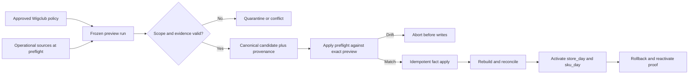

# fix: Make Wigclub reporting history safely backfillable

## Summary

Add a versioned, store-scoped interpretation policy used only by historical reporting maintenance so Wigclub's pre-schedule, currency-absent records can be previewed and applied with explicit provenance. Preserve operational source rows and unknown cost, bind apply to the exact approved preview, and prove report-generation activation and rollback in dev before any production decision.

---

## Problem Frame

PR #640 delivered the reporting foundation, but Wigclub's first dev preview produced 1,726 candidate facts with only three eligible: 1,691 were quarantined and 32 existing payment facts conflicted. Most legacy sources predate the first effective Store Schedule or omit source currency, while live-generated payment facts already carry GHS. The remediation must recover trustworthy history without laundering current configuration into historical truth or mutating operational records.

---

## Requirements

- R1. Compatibility behavior is immutable, versioned, explicitly approved, and scoped to one organization, one store, and a bounded historical interval.
- R2. Historical operating dates use a reviewed, reporting-owned `Africa/Accra` period definition with immutable lineage carried through fact fingerprints, projections, reconciliation, and public contracts. Ordinary Store Schedule rows and non-reporting consumers remain unchanged; later policy edits cannot reinterpret accepted facts. (See origin F-R43, F-R47.)
- R3. GHS may fill an absent historical revenue currency only when the approved policy and evidence authorize it. It never supplies valuation denomination or converts a cost amount, and a present conflicting currency is never overwritten. (See origin F-R19, F-R76.)
- R4. Every inferred period or revenue currency records immutable fact-linked policy provenance, original missing state, and aggregate counts by source domain. Existing canonical overlaps retain their original fact and receive separate interpretation evidence rather than a patch.
- R5. Never infer a cost amount, valuation denomination, COGS, or profit. A pre-existing cost amount without trustworthy denomination remains unusable as monetary cost evidence and is represented as unknown/partial for reporting. (See origin F-R25, F-R31, F-R35, F-R73, F-R76.)
- R6. Existing canonical payment facts count as existing only when every historical-candidate-known canonical reporting semantic field matches: core fields include org/store, source domain and canonical business key including status, fact type, signed amount, occurrence, operating date/schedule, linked reversal, policy-authorized GHS, and scale 2. All real canonical-semantic differences remain conflicts; method/target are not claimed unless added to canonical semantics.
- R7. Preview freezes policy identity/hash, schedule lineage, contract versions, period, watermark, source-domain registry, and per-domain audits. Apply preflight materializes and seals immutable sanitized candidate semantics; the write pass consumes only that manifest, so mutable source changes cannot mix interpretations after the first fact write. (See origin F-R5, F-R75.)
- R8. The backfill remains bounded, restartable, deterministic, idempotent, and does not patch operational source tables or invoke live inventory/reporting effects. (See origin F-R75, F-R81.)
- R9. Dev signoff requires zero unresolved period/currency quarantines, zero semantic conflicts, exact preview/apply parity, verified `store_day` and `sku_day` generations, clean health, public-read smoke evidence, and demonstrated projection rollback/reactivation.
- R10. The activation lineage guard accepts the actual verified reconciliation-finalize state for `store_day` and `sku_day`.
- R11. Policy approval uses dual control: one authenticated store `full_admin` creates a draft, a different authenticated `full_admin` approves it, and trusted internal automation executes only the immutable approved version. Caller-supplied actor IDs or automation labels never grant authority.
- R12. Compatibility schemas deploy widen-first: existing facts and runs remain valid, while new inferred facts require separate immutable evidence through write-path validation.
- R13. Manifest and provenance storage is internal-only, store/org indexed, sanitized, lifecycle-governed, and cleaned in bounded batches without deleting durable applied-fact evidence.

**Origin acceptance examples:** F-AE8 (late activity retains resolved operating period), F-AE10 (unknown cost remains unknown and backfill activates only after zero-delta reconciliation).

---

## Scope Boundaries

- Do not rewrite operational or Store Schedule history, and do not expose reporting-owned periods to ordinary schedule consumers.
- Do not derive legacy currency dynamically from today's store configuration.
- Do not infer cost amount, valuation denomination, COGS, service cost, or profit.
- Do not weaken global canonical fingerprints or live-ingress matching.
- Do not activate `current_inventory` or transfer inventory authority.
- Do not deploy to production under this plan.
- Do not generalize Wigclub's approved policy to another store without separate evidence and approval.

### Deferred to Follow-Up Work

- Production rollout: separate release decision after dev evidence review.
- Fact-level undo: historical apply is incremental and idempotent; there is no transaction-wide fact rollback today. If production requires destructive undo, plan a separate scoped compensation mechanism.

---

## Context & Research

### Relevant Code and Patterns

- `packages/athena-webapp/convex/reporting/maintenance/backfill.ts` owns phased scanning, preview/apply parity, canonical overlap, quarantine, audits, and fact creation.
- `packages/athena-webapp/convex/reporting/operatingPeriods.ts` resolves effective Store Schedule versions for ordinary reporting.
- `packages/athena-webapp/convex/reporting/factFingerprint.ts` already supports known-material comparison with explicitly unknown candidate fields.
- `packages/athena-webapp/convex/schemas/reporting/maintenance.ts` owns reporting run, audit, preview, and health evidence.
- `packages/athena-webapp/convex/schemas/reporting/facts.ts` requires durable schedule lineage on canonical facts.
- `packages/athena-webapp/convex/reporting/activation.ts` owns verified-generation activation and rollback.

### Institutional Learnings

- `docs/solutions/architecture/athena-reporting-fact-projection-boundary-2026-07-09.md`: backfill and live processing share identity; missing currency and cost degrade completeness; operational truth remains untouched.
- `docs/solutions/architecture/athena-store-schedule-foundation-2026-06-27.md`: Store Schedule owns business time; resolved schedule versions must be retained so history does not drift.

### External References

- No external research is needed. The relevant safety contracts are Athena-specific and directly represented in current code and repository learnings.

---

## Key Technical Decisions

- **Dedicated maintenance policy:** Add a durable historical-interpretation policy with store/org scope, bounded interval, GHS revenue currency, reporting-owned period definition, evidence, creator/approver identities, version, and immutable hash.
- **End-to-end reporting-owned period lineage:** Preserve reviewed historical windows, exceptions, timezone, and interval in reporting-owned immutable state. Facts and affected projections use a discriminated exactly-one lineage contract: ordinary Store Schedule or historical reporting policy. Lineage kind plus ID is material in fingerprints and aggregation keys and remains visible through reconciliation and browser-safe contracts.
- **Backfill-only interpretation:** Historical maintenance consults policy only for missing period and revenue-currency evidence. Live ingress and ordinary Store Schedule consumers never read it.
- **Dual-control governance:** Draft creation and approval are separate authenticated full-admin actions, creator and approver differ, identities derive from `ctx.auth`, and internal automation executes only an approved immutable hash.
- **Widen-first storage:** Existing rows retain valid optional lineage/provenance fields. New compatibility writes enforce lineage and evidence without a deploy-time rewrite.
- **Internal lifecycle:** Raw manifests and provenance have no public query. Failed/unsealed manifests become cleanup-eligible after 7 days; sealed applied manifests after 90 days once activation evidence is finalized. Fact-linked interpretation evidence and summarized audits remain durable.
- **Provenance is durable:** Record policy identity/hash and inferred-field counts on runs/audits; retain per-candidate inference evidence sufficient to prove apply used the reviewed preview.
- **Known-material overlap stays strict:** Reuse the current semantic matcher. Missing candidate currency becomes policy-resolved for comparison; no payment-specific loose equality or global fingerprint weakening is allowed.
- **Sealed two-pass apply:** Preflight rescans every bounded source phase and materializes immutable, sanitized canonical candidate semantics, outcomes, and provenance in a sealed manifest. Apply revalidates manifest/policy/schedule/contracts and writes only from that manifest; later operational changes become later events or repair work and cannot reinterpret the approved apply.
- **Rollback claims are narrow:** Before activation, discard and rebuild candidate generations. After activation, demonstrate rollback only to the immediately prior compatible projection generation; applied facts are not transactionally undone.

---

## High-Level Technical Design

> *This illustrates the intended approach and is directional guidance for review, not implementation specification. The implementing agent should treat it as context, not code to reproduce.*

---

## Implementation Units

- U1. **Persist historical interpretation policy and provenance**

**Goal:** Create the immutable, store-scoped policy and durable audit fields that make inferred schedule/currency reviewable.

**Requirements:** R1-R4, R7-R8, R11-R13

**Dependencies:** None

**Files:**
- Create: `packages/athena-webapp/convex/reporting/maintenance/legacyCompatibility.ts`
- Create: `packages/athena-webapp/convex/reporting/maintenance/legacyCompatibility.test.ts`
- Modify: `packages/athena-webapp/convex/schemas/reporting/maintenance.ts`
- Modify: `packages/athena-webapp/convex/schemas/reporting/facts.ts`
- Modify: `packages/athena-webapp/convex/schema.ts`
- Modify: `packages/athena-webapp/convex/reporting/schemaIndexes.test.ts`
- Test: `packages/athena-webapp/convex/reporting/maintenance/backfill.test.ts`

**Approach:**
- Model draft-to-approved immutable policy versions with authenticated full-admin commands, creator/approver separation, indexed overlap checks, create-only versioning, and approval evidence inside the stable hash.
- Bind preview/apply runs, preview candidates, sealed apply-manifest entries, and source audits to policy identity. Add immutable fact-linked interpretation evidence for created facts and exact existing overlaps without patching the latter.
- Extend preview candidates with policy hash, inferred-field markers, and original-absence markers; persist inference counts separately from unknown and quarantine counts.
- Keep evidence sanitized and avoid copying customer, payment-instrument, or raw source payloads.
- Add manifest states (`building`, `sealed`, `consuming`, terminal), terminal immutability, bounded cancel/fail cleanup, retention timestamps, and internal-only access. Durable fact evidence survives transient cleanup.

**Execution note:** Implement schema and policy invariants test-first.

**Patterns to follow:**
- Reporting run/audit schemas in `packages/athena-webapp/convex/schemas/reporting/maintenance.ts`.
- Authenticated reporting access in `packages/athena-webapp/convex/reporting/access.ts` and immutable version lineage patterns in Store Schedule schemas.

**Test scenarios:**
- Happy path: approved Wigclub policy has exact org/store, interval, GHS, Africa/Accra schedule lineage, evidence, approver, version, and stable hash.
- Edge case: duplicate version/scope or overlapping ambiguous policy is rejected by uniqueness and validation boundaries.
- Error path: missing evidence, invalid interval, foreign schedule/store, unsupported currency scale, or mutable-policy update is rejected.
- Error path: unauthenticated/non-full-admin access, forged actor input, self-approval, unapproved/revoked/superseded policy use, and post-approval mutation are rejected.
- Compatibility: legacy fact/run documents remain valid and readable; schema deployment alone needs no data backfill.
- Lifecycle: cancel/fail/retry and orphan cleanup are bounded and idempotent, and cleanup cannot remove applied fact evidence.
- Integration: run, candidate preview, fact-linked evidence, and per-domain audit retain the same policy hash; fetching an applied fact proves provenance survives independently of the run.

**Verification:**
- Policy lookup is indexed, uniqueness-checked with a bounded probe, and no unbounded scan is introduced.

- U2. **Create reporting-owned historical period lineage**

**Goal:** Give preexisting Wigclub events immutable reporting-period lineage without changing shared Store Schedule history.

**Requirements:** R1-R2, R4, R9

**Dependencies:** U1

**Files:**
- Modify: `packages/athena-webapp/convex/reporting/maintenance/legacyCompatibility.ts`
- Test: `packages/athena-webapp/convex/reporting/maintenance/legacyCompatibility.test.ts`
- Modify: `packages/athena-webapp/convex/schemas/reporting/facts.ts`
- Modify: `packages/athena-webapp/convex/schemas/reporting/projections.ts`
- Modify: `packages/athena-webapp/convex/reporting/factFingerprint.ts`
- Test: `packages/athena-webapp/convex/reporting/factFingerprint.test.ts`
- Modify: `packages/athena-webapp/convex/reporting/projections/processor.ts`
- Test: `packages/athena-webapp/convex/reporting/projections/processor.test.ts`
- Modify: `packages/athena-webapp/convex/reporting/projections/daily.ts`
- Test: `packages/athena-webapp/convex/reporting/projections/daily.test.ts`
- Modify: `packages/athena-webapp/convex/reporting/projections/skuDay.ts`
- Test: `packages/athena-webapp/convex/reporting/projections/skuDay.test.ts`
- Modify: `packages/athena-webapp/convex/reporting/projections/dailyClose.ts`
- Test: `packages/athena-webapp/convex/reporting/projections/dailyClose.test.ts`
- Modify: `packages/athena-webapp/convex/reporting/projections/reconciliation.ts`
- Test: `packages/athena-webapp/convex/reporting/projections/reconciliation.test.ts`
- Modify: `packages/athena-webapp/shared/reportingContract.ts`
- Modify: `packages/athena-webapp/convex/reporting/public.ts`
- Test: `packages/athena-webapp/convex/reporting/public.test.ts`
- Test: `packages/athena-webapp/convex/reporting/facts.test.ts`
- Test: `packages/athena-webapp/convex/reporting/operatingPeriods.test.ts`
- Test: `packages/athena-webapp/convex/reporting/maintenance/backfill.test.ts`

**Approach:**
- Persist reviewed historical windows, exceptions, timezone, and end boundary in reporting-owned policy state; do not create or backdate a `storeSchedule` row.
- Widen fact and projection lineage so ordinary rows retain Store Schedule references, compatibility rows retain historical policy/version lineage, and every write validates exactly one source.
- Include lineage kind and ID in semantic fingerprints and projection aggregation keys; distinct lineage versions never silently coalesce.
- Carry the discriminated lineage through daily, SKU-day, Daily Close, rebuild/reconciliation, and shared/public contracts using optional widen-first fields for existing rows. Public lineage-segmented rows return browser-safe lineage kind/ID so same-date segments remain distinguishable.
- Keep ordinary `resolveReportingOperatingPeriodWithCtx` unchanged; maintenance owns only the approved historical interval.

**Execution note:** Characterize ordinary current and historical schedule consumers before adding the compatibility path.

**Patterns to follow:**
- Effective dating in `packages/athena-webapp/convex/lib/storeScheduleTime.ts`.
- Pure Store Schedule time calculations in `packages/athena-webapp/convex/lib/storeScheduleTime.ts`, reused without publishing compatibility state to shared schedule consumers.

**Test scenarios:**
- Happy path: an in-policy pre-boundary event resolves to the reviewed historical operating date and reporting-policy lineage.
- Edge case: cross-midnight activity, closed days, timezone boundaries, and the exact first-current-schedule instant resolve deterministically.
- Error path: an event outside policy, wrong store, missing approval, overlapping policy, wrong first-current boundary, or changed-content retry is rejected; identical retry is idempotent.
- Integration: Store Schedule tables and current/historical opening, Daily Close, automation, register, and public schedule behavior remain unchanged.
- Integration: an ordinary schedule-backed fact remains backward compatible; a policy-backed fact fingerprints, projects, reconciles, activates, and returns through public store-day/SKU-day reads without a Store Schedule ID.
- Edge case: same operating date with distinct lineage kinds or versions does not coalesce unless an explicit tested aggregation rule authorizes it.
- Public contract: ordinary and policy-backed segments serialize with distinct browser-safe lineage; same-date metrics remain distinguishable, existing clients remain widen-first compatible, and auth/store scoping is unchanged.
- Error path: mixed or missing lineage is rejected, and canonical overlap with a different material lineage remains a semantic conflict.

**Verification:**
- Review evidence specifies the exact historical weekly windows, exceptions, timezone, start, and end before apply is authorized.

- U3. **Normalize only approved missing historical evidence**

**Goal:** Allow policy-authorized period and GHS inference across historical source lanes while preserving strict identity, currency, and cost boundaries.

**Requirements:** R3-R6, R8

**Dependencies:** U1-U2

**Files:**
- Modify: `packages/athena-webapp/convex/reporting/maintenance/backfill.ts`
- Modify: `packages/athena-webapp/convex/reporting/factFingerprint.ts`
- Test: `packages/athena-webapp/convex/reporting/maintenance/backfill.test.ts`
- Test: `packages/athena-webapp/convex/reporting/factFingerprint.test.ts`
- Modify: `packages/athena-webapp/convex/reporting/reportingDeployment.test.ts`

**Approach:**
- Run canonical resolution first; only absent evidence inside the exact policy interval may use the compatibility resolver.
- Preserve any present currency and reject conflicts. Revenue-currency inference never populates valuation fields; undenominated cost amounts remain unknown/partial monetary evidence.
- Reuse canonical identity and known-material matching for existing payment facts. Enforce organization/store, source domain and canonical business key including status, fact type, signed amount, occurrence, operating date/schedule, linked reversal, GHS scale 2, and every other candidate-known canonical semantic field; do not claim comparison of payment method/target unless those fields become canonical semantics.

**Execution note:** Add characterization and adversarial mismatch tests before changing matching behavior.

**Patterns to follow:**
- `historicalFactMatchesExistingCanonical` and `reportingFactKnownMaterialMatches`.
- Existing source-domain adapters and boundary assertions in `maintenance/backfill.test.ts`.

**Test scenarios:**
- Happy path: missing-currency Wigclub POS, payment, storefront, and service revenue candidates inside policy resolve to GHS with provenance; source rows remain unchanged.
- Boundary: an expense or receipt with a cost amount but no trustworthy denomination retains source evidence but contributes no known monetary cost, COGS, or profit.
- Happy path: null-currency payment overlapping an exact canonical GHS/scale-2 fact becomes `existing`, not duplicate or patch.
- Edge case: quantity-only evidence remains eligible without monetary currency.
- Edge case: absent or undenominated cost remains partial/uncosted; known zero with trustworthy denomination remains known zero; no cost amount, denomination, COGS, or profit is inferred.
- Edge case: absent cost amount remains unknown with no valuation denomination or COGS; revenue-only inference never fills valuation fields.
- Error path: present conflicting valuation currency remains a conflict and is never overwritten.
- Error path: other store, outside interval, missing policy, USD canonical fact, wrong scale, amount/sign difference, occurrence mismatch, fact/reversal mismatch, schedule mismatch, or store/org mismatch remains quarantined/conflicted.
- Integration: static and handler-level coverage prove historical maintenance never patches operational tables or invokes live ingress/inventory effects.

**Verification:**
- Every previously blocked source lane has positive and negative coverage without changing global fingerprint semantics.

- U4. **Lock preview and apply before incremental writes**

**Goal:** Ensure apply can only execute the exact reviewed preview interpretation and fails before writes when anything material drifts.

**Requirements:** R4, R7-R9, R12-R13

**Dependencies:** U1-U3

**Files:**
- Modify: `packages/athena-webapp/convex/reporting/maintenance/backfill.ts`
- Test: `packages/athena-webapp/convex/reporting/maintenance/backfill.test.ts`
- Modify: `packages/athena-webapp/convex/reporting/reportingScale.test.ts`

**Approach:**
- Add a bounded preflight pass across every source phase. Compare policy/schedule hashes, contracts, frozen watermark, source-domain registry, every candidate fingerprint/outcome/inference marker, and per-domain totals while materializing sanitized canonical candidate payloads into an immutable manifest.
- Seal the complete manifest with a stable digest before enabling writes. Include manifest and policy identity in request/idempotency keys; the paginated write pass reads only sealed entries and never reconstructs semantics from mutable source rows.
- Preserve page/cursor limits and per-source line caps.

**Execution note:** Write fail-before-write and resume/idempotency tests first.

**Patterns to follow:**
- Current `assertHistoricalBackfillPreviewCompatible`, run ledger, source audit, and candidate fingerprint flow.

**Test scenarios:**
- Happy path: identical policy, watermark, contracts, domains, and source audits yield exact per-domain preview/apply parity.
- Edge case: retry/resume after interruption creates no duplicate facts and retains one policy identity.
- Error path: drift on the final preflight source page, policy edit, schedule replacement, contract change, domain-registry change, candidate/audit drift, or tampered preview prevents sealing and produces zero fact or source-reference writes.
- Concurrency: mutating a late-page operational source after manifest seal does not alter the applied canonical semantics or parity; the later change remains eligible for its normal later event/repair path.
- Lifecycle: cancel/fail/retry transitions preserve sealed immutability; abandoned manifests clean up in bounded batches without touching durable fact/run evidence.
- Access: no public function exposes raw manifests or fact evidence, and internal cross-store lookups fail closed.
- Scale: approved resolution remains bounded at declared production-derived fixture sizes without `.collect()` or per-parent fan-out.

**Verification:**
- Created/existing/excluded/conflict/quarantine/unknown/inferred counts match per source domain, not merely in aggregate.

- U5. **Land verified-generation activation compatibility**

**Goal:** Preserve the already-discovered fix that lets normal reconciled `store_day` and `sku_day` runs activate.

**Requirements:** R10

**Dependencies:** None

**Files:**
- Modify: `packages/athena-webapp/convex/reporting/activation.ts`
- Test: `packages/athena-webapp/convex/reporting/activation.test.ts`

**Approach:**
- Accept the reconciliation-finalize operation family only for projection kinds whose verified rebuild lifecycle uses it.
- Preserve all other lineage, contract, coverage, migration, watermark, and compare-and-swap checks.

**Test scenarios:**
- Happy path: verified `store_day` and `sku_day` reconciliation-finalize runs satisfy lineage.
- Error path: unrelated operation family, wrong generation/run, incomplete run, version mismatch, or current-inventory operation remains rejected.

**Verification:**
- Focused activation tests pass and no guard outside operation-family compatibility is relaxed.

- U6. **Prove Wigclub dev rollout and rollback**

**Goal:** Produce decision-grade dev evidence without transferring inventory authority or overstating fact rollback.

**Requirements:** R8-R13

**Dependencies:** U1-U5

**Files:**
- Modify: `docs/solutions/architecture/athena-reporting-fact-projection-boundary-2026-07-09.md`
- Create: `docs/reports/2026-07-11-wigclub-reporting-history-dev-evidence.md`
- Test: `packages/athena-webapp/convex/reporting/health.test.ts`
- Test: `packages/athena-webapp/convex/reporting/public.test.ts`
- Test: `packages/athena-webapp/convex/reporting/maintenance/rebuild.test.ts`

**Approach:**
- Require human review of policy evidence and exact historical schedule inputs before preview apply.
- Spot-check POS sale/void/refund, payment overlap, expense, purchase order/receipt, storefront, service, timezone boundary, and first-current-schedule boundary.
- Record the pre-rollout active state for each kind. If none exists, build and compare-and-swap activate a named baseline; then build/activate a replacement, roll back to baseline, and reactivate replacement. Stop on any unexpected active-generation change.
- Report that applied facts are incremental/idempotent and not transactionally undone.

**Test scenarios:**
- Integration: preview reaches zero unresolved period/currency blockers and zero conflicts while unknown cost remains explicit.
- Integration: apply matches every per-domain preview outcome and source records remain byte-for-byte unchanged.
- Integration: both generations verify with stable watermark, complete required coverage, zero discrepancy, zero blocking quarantine, and non-stale health.
- Integration: public reads select only the active compatible generation; rollback and reactivation work for each projection kind.
- Integration: evidence records baseline, replacement, rollback target, and reactivated generation IDs and proves public reads switch at every transition.
- Recovery: a runbook table defines stop/recovery after baseline activation, replacement activation, and rollback; every transition uses expected-current generation IDs.

**Verification:**
- Dev evidence records policy version, candidate/fact provenance, inference/unknown/quarantine counts, parity, reconciliation, health, baseline/replacement generation IDs, public smoke, rollback, and source spot checks.
- Focused reporting suites, generated artifacts, Graphify, and `bun run pr:athena` pass before delivery.

---

## System-Wide Impact

- **Interaction graph:** Historical maintenance gains policy/schedule/provenance reads; live POS, storefront, service, procurement, payment, and inventory commands remain authoritative and unchanged.
- **Error propagation:** Missing or conflicting evidence fails into explicit quarantine/conflict; preflight mismatch prevents sealing and fact writes, while post-seal source changes cannot alter the sealed apply; reporting failures never roll back accepted commerce.
- **State lifecycle risks:** Apply remains incremental across batches. Idempotency and immutable identity prevent duplication, but there is no global transaction rollback for facts.
- **API surface parity:** Public report readers remain generation-based. No new compatibility behavior is exposed to ordinary client mutations or queries.
- **Integration coverage:** Source-to-policy-to-fact-to-projection-to-activation must be exercised across all seven source domains and schedule boundaries.
- **Unchanged invariants:** Operational source records, live ingress semantics, unknown cost, current inventory authority, and production state remain unchanged.

---

## Risks & Dependencies

| Risk | Mitigation |
|---|---|
| An unreviewed schedule launders guessed business time into canonical facts | Require explicit windows/exceptions/timezone/effective bounds and approver evidence; freeze exact schedule lineage in preview. |
| Current GHS configuration is mistaken for historical proof | Store evidence and approval in immutable policy; never derive dynamically from current store settings. |
| Policy changes after preview cause partial mixed interpretation | Preflight exact policy/schedule/audit identity before the first apply write. |
| Loose payment matching hides genuine discrepancies | Keep global known-material matcher strict and add adversarial one-field mismatch tests. |
| Pre-existing open quarantines block health independently of this preview | Inventory them before rollout and treat any unrelated open blocker as a prerequisite; never blanket-resolve or delete history in this plan. |
| Reporting compatibility leaks into shared Store Schedule behavior | Keep historical periods in reporting-owned policy lineage and assert ordinary schedule tables/resolvers/consumers remain unchanged. |
| Rollback expectations exceed actual mechanics | Distinguish projection rollback from fact compensation in docs and signoff. |

---

## Phased Delivery

1. Land policy/provenance and activation-guard contracts behind no active policy.
2. Two distinct full admins create and approve Wigclub's exact reporting-owned historical period and GHS revenue-currency evidence in dev.
3. Run preview; stop unless all signoff gates pass.
4. Apply, rebuild, reconcile, activate, smoke, rollback, and reactivate in dev.
5. Review evidence separately before planning any production rollout.

---

## Success Metrics

- Zero unresolved `missing_reporting_period` or revenue `missing_currency` outcomes for in-policy Wigclub history; undenominated cost remains explicit unknown/partial evidence.
- Zero semantic conflicts.
- Exact preview/sealed-manifest/apply per-domain parity.
- All inferred values retain policy provenance; unknown cost remains separately visible.
- Both report projection kinds verify and serve clean public reads.
- Projection rollback/reactivation succeeds without inventory-authority change.
- No operational source row changes.

---

## Documentation / Operational Notes

- Update the reporting boundary solution with the approved historical-compatibility pattern and honest rollback boundary.
- Keep dev evidence sanitized: no customer PII, payment-instrument data, or copied raw payloads.
- Deployment remains dev-only. Production requires a separate explicit decision.

---

## Sources & References

- **Origin document:** `docs/brainstorms/2026-07-09-reports-foundation-requirements.md`
- Product framing: `docs/brainstorms/2026-07-09-reports-workspace-requirements.md`
- Foundation plan: `docs/plans/2026-07-09-002-feat-reports-foundation-plan.md`
- Architecture: `docs/solutions/architecture/athena-reporting-fact-projection-boundary-2026-07-09.md`
- Store Schedule: `docs/solutions/architecture/athena-store-schedule-foundation-2026-06-27.md`
- Delivery: PR #640
